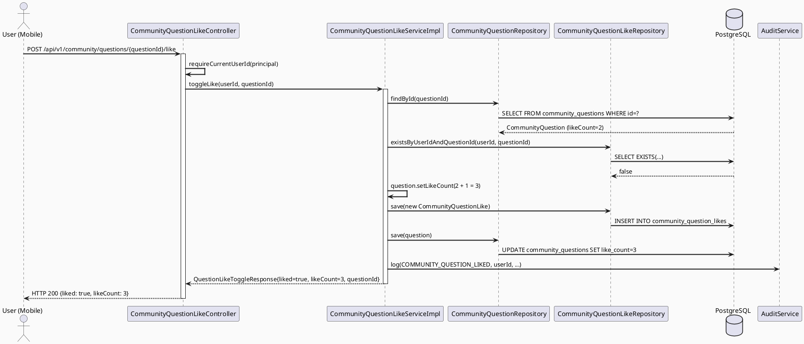
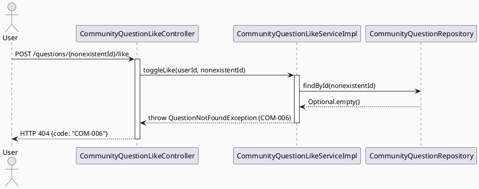

# ENGINEERING DOCUMENTATION STANDARD (EDS) v2.0
# Technical Design Specification — Like Community Question

| Field              | Value                            |
| ------------------ | --------------------------------- |
| **Document ID**    | `CB-COMMUNITY-IMP-022`           |
| **Version**        | `1.0`                             |
| **Date**           | `2026-07-03`                      |
| **Status**         | `Partially Implemented`           |
| **Document Owner** | `HuyND`                           |
| **Author**         | `AI Agent`                        |
| **Reviewed by**    | `[Tech Lead]`                     |
| **DPO Sign-off**   | `N/A — no PII, Internal data`     |
| **Approved by**    | `[Principal Architect]`           |
| **Last Review**    | `2026-07-03`                      |
| **Based on EDS**   | `v2.0`                            |

---

## CHANGELOG

| Ngày       | Người thực hiện | Nội dung thay đổi                    |
| ---------- | ---------------- | -------------------------------------- |
| 2026-07-03 | AI Agent          | Tạo tài liệu lần đầu — phát hiện qua bug report "không nhấn tim được": heart icon trên câu hỏi (feed + detail) chưa từng được wire, không có backend endpoint nào cho việc like một câu hỏi (chỉ có like câu trả lời — UC-59). |
| 2026-07-03 | AI Agent — Claude (Dev) | Implemented: `CommunityQuestionLike` entity/repository/DTO/service/controller, migration `V20260703170640__create_community_question_likes.sql` (bao gồm widen `audit_logs_action_check`), `AuditAction.COMMUNITY_QUESTION_LIKED/UNLIKED`. Hydrate `liked`/`isLiked` ở feed (`CommunityFeedServiceImpl`), bookmark-list (`CommunityBookmarkServiceImpl` — 2nd `toFeedItem` caller phát hiện qua blast-radius check), và detail (`CommunityQuestionServiceImpl`). Mobile: wire heart icon ở `community_feed_screen.dart` + `question_detail_screen.dart`. 180/180 community tests PASS. Chưa viết `COMQL-TC-INT-001` (thiếu Testcontainers dep) và chưa verify UI thật (backend dev server không listening lúc implement) — xem Test-Spec §Entry/Exit Criteria. |

---

## MUC LUC

1. [Tổng quan Module](#1-tổng-quan-module)
2. [Ma trận Truy vết (Traceability Matrix)](#2-ma-trận-truy-vết-traceability-matrix)
3. [Architecture Decision Records (ADR)](#3-architecture-decision-records-adr)
4. [Non-Functional Requirements & SLA](#4-non-functional-requirements--sla)
5. [Static Modeling (Mô hình Tĩnh)](#5-static-modeling-mô-hình-tĩnh)
6. [Dynamic Modeling (Mô hình Động)](#6-dynamic-modeling-mô-hình-động)
7. [Domain Event Catalog](#7-domain-event-catalog)
8. [Interface Specification (Đặc tả Giao diện)](#8-interface-specification-đặc-tả-giao-diện)
9. [API Specification](#9-api-specification)
10. [Bảng mã lỗi (Error Codes)](#10-bảng-mã-lỗi-error-codes)
11. [Quy trình Triển khai (Step-by-Step)](#11-quy-trình-triển-khai-step-by-step)
12. [Rollback & Incident Runbook](#12-rollback--incident-runbook)
13. [Kịch bản Kiểm thử Chi tiết](#13-kịch-bản-kiểm-thử-chi-tiết)
14. [Phương pháp Xác minh](#14-phương-pháp-xác-minh)
15. [Mẫu thử thực tế (API Verification Samples)](#15-mẫu-thử-thực-tế-api-verification-samples)
16. [Bảng tổng hợp phân quyền (Authorization Matrix)](#16-bảng-tổng-hợp-phân-quyền-authorization-matrix)
17. [AI Prompt Constraints (CASE 2.0)](#17-ai-prompt-constraints-case-20)

---

## 1. Tổng quan Module

| Field                     | Value                                                                              |
| -------------------------- | ------------------------------------------------------------------------------------ |
| **Module Name**           | `LikeCommunityQuestion`                                                             |
| **Bounded Context**       | `community`                                                                          |
| **UC ID**                 | _(không có UC number chính thức trong SRS — feature phát sinh từ bug report; xem §1.1)_ |
| **Sibling UC**            | `UC-59 LikeAnswer` (pattern gốc — like câu trả lời, đã Approved & Implemented)      |
| **Primary Actor**         | `User (any authenticated role)`                                                     |
| **Platform**              | `Mobile App (Flutter)`                                                              |
| **Data Classification**   | `Internal`                                                                           |
| **Compliance Scope**      | `BR-RBAC`                                                                            |
| **Upstream Dependencies** | `security (JWT), community.CommunityQuestion (must exist, status=APPROVED)`          |
| **Downstream Consumers**  | `community (feed + detail hydration), audit (AuditLog)`                             |

**Mô tả:** Cho phép bất kỳ người dùng đã đăng nhập thích (like) một câu hỏi cộng đồng. Đây là phần còn thiếu của UC-59: hệ thống hiện tại chỉ hỗ trợ like **câu trả lời**, trong khi icon trái tim ở **câu hỏi** (cả trong feed card và trang chi tiết) đã tồn tại trên UI nhưng chưa từng được gắn hành vi tương tác — không có bảng, entity, endpoint nào cho việc này ở backend. Thao tác là idempotent toggle giống hệt UC-59: gọi một lần để like, gọi lại để unlike. `like_count` trên `community_questions` được cập nhật atomically cùng insert/delete trên bảng mới `community_question_likes`.

### 1.1. Vì sao không có UC number chính thức

Dự án có 241 UC đã được chốt trong SRS (xem `docs/spec-governance/`). Rà soát không thấy UC nào tương ứng với "like câu hỏi" — chỉ có UC-58 (Bookmark) và UC-59 (Like Answer). Tài liệu này không tự ý gán một số UC mới (tránh đụng độ với SRS chính thức); module được đặt tên mô tả `LikeCommunityQuestion` và dùng `CB-COMMUNITY-IMP-022` làm Document ID. Nếu Product Owner xác nhận đây là một UC chính thức, tài liệu sẽ được re-numbered trong lần review kế tiếp.

---

## 2. Ma trận Truy vết (Traceability Matrix)

| Requirement ID | Loại          | Mô tả yêu cầu                                                          | Thành phần Code                                                       | Compliance Target | ADR liên quan |
| --------------- | -------------- | ------------------------------------------------------------------------ | ------------------------------------------------------------------------ | ------------------- | --------------- |
| BUG-REPORT      | Bug/Gap        | "Không nhấn tim được" — heart icon trên câu hỏi không tương tác được  | `community_feed_screen.dart:390`, `question_detail_screen.dart:436`      | UX correctness      | ADR-COM-016     |
| BR-RBAC         | Business Rule  | Chỉ authenticated user mới được like                                    | `@PreAuthorize("isAuthenticated()")`                                     | RBAC                | ADR-COM-016     |
| BR-COM-020      | Business Rule  | questionId phải tồn tại trong DB                                        | `CommunityQuestionLikeServiceImpl` — `questionRepository.findById()`     | Data integrity      | ADR-COM-016     |
| BR-COM-021      | Business Rule  | Toggle: nếu đã like → remove + decrement; nếu chưa → add + increment     | `CommunityQuestionLikeServiceImpl.toggleLike()`                          | —                    | ADR-COM-017     |
| BR-COM-022      | Business Rule  | like_count không được âm (defensive guard)                              | `Math.max(0, likeCount - 1)`                                             | Data integrity      | ADR-COM-017     |
| BR-COM-023      | Business Rule  | like_count PHẢI update atomic cùng với like record                      | `@Transactional` trên `toggleLike`                                       | Consistency          | ADR-COM-018     |
| BR-COM-024      | Business Rule  | Feed và Detail PHẢI hiển thị đúng trạng thái đã-like của viewer hiện tại | `CommunityFeedServiceImpl.getFeed()`, `CommunityQuestionServiceImpl.getQuestionDetail()` — batch hydration | Correctness | ADR-COM-018 |
| BR-COM-025      | Business Rule  | Audit log khi toggle like/unlike câu hỏi                                | `AuditService.log(COMMUNITY_QUESTION_LIKED/UNLIKED, ...)`                | Auditability         | —                |

---

## 3. Architecture Decision Records (ADR)

### ADR-COM-016 — Toggle like cho câu hỏi, tái dùng pattern của UC-59

| Field        | Value                      |
| ------------- | ---------------------------- |
| **Status**   | `Accepted`                  |
| **Deciders** | `HuyND — System Architect`  |
| **Date**     | `2026-07-03`                |

#### Bối cảnh (Context)
UC-59 đã implement toggle-like cho câu trả lời (`community_answer_likes`). Câu hỏi cần hành vi tương tự nhưng KHÔNG tồn tại bảng/entity nào. Icon tim trên UI (feed + detail) hiện chỉ hiển thị `likeCount` tĩnh, không có `onTap`.

#### Các phương án đã xem xét (Options Considered)

| Phương án | Mô tả                                                     | Ưu điểm                                    | Nhược điểm                                    |
| ---------- | ------------------------------------------------------------ | --------------------------------------------- | ------------------------------------------------ |
| A          | Tạo bảng `community_question_likes` riêng, mirror UC-59       | Nhất quán với pattern đã có, dễ maintain      | Thêm 1 bảng, 1 migration                         |
| B          | Gộp chung `community_answer_likes` với cột `target_type`      | 1 bảng cho cả 2 loại like                     | Vi phạm 3NF, phá vỡ FK constraint hiện có của UC-59, cần migrate dữ liệu cũ |
| C          | Không làm gì — ẩn icon tim của câu hỏi                        | Không cần code mới                            | Không giải quyết yêu cầu của user (muốn tính năng đầy đủ) |

#### Quyết định (Decision)
Chọn **Phương án A** — bảng riêng `community_question_likes`, mirror chính xác cấu trúc `community_answer_likes` (UC-59, đã Approved). Lý do: giữ nguyên FK constraint đã có của UC-59 không đổi, tránh rủi ro regression; pattern đã được review và chạy ổn định trong production.

#### Hệ quả (Consequences)

**Tích cực:**
- Không đụng vào bảng/entity của UC-59 → zero regression risk cho tính năng like câu trả lời.
- Code review dễ dàng vì là bản sao có kiểm soát của một pattern đã Approved.

**Tiêu cực / Trade-offs:**
- 2 bảng riêng cho 2 loại like (thay vì 1 bảng polymorphic) — chấp nhận được vì đơn giản hơn và tránh vi phạm 3NF.

---

### ADR-COM-017 — Denormalized like_count trên community_questions (đã tồn tại sẵn)

| Field        | Value                      |
| ------------- | ---------------------------- |
| **Status**   | `Accepted`                  |
| **Deciders** | `HuyND — System Architect`  |
| **Date**     | `2026-07-03`                |

#### Bối cảnh (Context)
Cột `community_questions.like_count` đã tồn tại từ `V1__init_schema.sql` nhưng chưa từng được ghi (luôn = 0, không có cơ chế tăng/giảm). Feed và Detail đã đọc cột này để hiển thị số.

#### Quyết định (Decision)
Tái sử dụng cột `like_count` có sẵn — không cần migration ALTER TABLE cho `community_questions`. Cập nhật atomically trong cùng `@Transactional` với insert/delete trên `community_question_likes`, đúng theo pattern ADR-COM-014 (UC-59).

#### Hệ quả (Consequences)

**Tích cực:** Không cần schema change trên bảng câu hỏi, giảm rủi ro migration.
**Tiêu cực / Trade-offs:** Counter có thể drift nếu bug trong `@Transactional` — giảm thiểu bằng defensive guard `Math.max(0, likeCount - 1)` (giống UC-59 BR-COM-016).

---

### ADR-COM-018 — @Transactional + batch hydration cho Feed/Detail

| Field        | Value                      |
| ------------- | ---------------------------- |
| **Status**   | `Accepted`                  |
| **Deciders** | `HuyND — System Architect`  |
| **Date**     | `2026-07-03`                |

#### Quyết định (Decision)
1. `CommunityQuestionLikeServiceImpl.toggleLike()` PHẢI `@Transactional`, tương tự ADR-COM-015 (UC-59).
2. `CommunityFeedItemResponse` và `CommunityQuestionDetailResponse` PHẢI thêm field `liked: boolean`, hydrate qua batch query `CommunityQuestionLikeRepository.findLikedQuestionIds(userId, questionIds)` — tái dùng pattern N+1-avoidance đã có cho `isBookmarked` (`CommunityBookmarkRepository.findBookmarkedQuestionIds`).

#### Hệ quả (Consequences)
**Tích cực:** Client (mobile) biết chính xác trạng thái đã-like của viewer ngay khi load, không cần track riêng trong session — tránh đúng bug đã từng xảy ra với UC-59 answer likes trước khi được audit-fix (xem Changelog `UC59_LikeAnswer_TDS.md` dòng 2026-07-03).

---

## 4. Non-Functional Requirements & SLA

### 4.1. Performance & Availability

| Category     | Requirement              | Target SLA  | Measurement Method | Compliance Basis |
| ------------- | --------------------------- | ------------- | --------------------- | ------------------- |
| Latency      | Toggle like (p99)         | `< 200ms`    | Manual timing (dự án chưa có k6 pipeline) | — |
| Throughput   | N/A — không có SLA riêng cho tính năng nội bộ quy mô nhỏ này | — | — | — |

### 4.2. Data Integrity & Retention

| Category      | Requirement                                          | Target  | Verification Method        | Compliance Basis |
| --------------- | ------------------------------------------------------- | --------- | ----------------------------- | ------------------- |
| Uniqueness    | 1 like record per (user, question)                     | 100%    | UNIQUE constraint in DB       | —                    |
| Consistency   | like_count on question == count(*) from likes table   | 100%    | `@Transactional` + unit test | ADR-COM-018          |
| Non-negative  | like_count >= 0 always                                 | 100%    | Defensive guard + test        | BR-COM-022           |

### 4.3. Security

| Category | Requirement  | Target             | Verification Method | Compliance Basis |
| --------- | -------------- | --------------------- | ---------------------- | ------------------- |
| Auth     | JWT required | 401 without token   | Security test         | BR-RBAC              |

> **Ghi chú:** Module này không xử lý PII/Sensitive-PII — §4.2/4.3 của EDS template liên quan GDPR/DPO không áp dụng (Data Classification = Internal).

---

## 5. Static Modeling (Mô hình Tĩnh)

### 5.1. New Entity — CommunityQuestionLike (Java)

```java
package com.carebridge.backend.community.entity;

import jakarta.persistence.*;
import lombok.*;
import org.hibernate.annotations.CreationTimestamp;

import java.time.Instant;
import java.util.UUID;

@Entity
@Table(name = "community_question_likes",
    uniqueConstraints = @UniqueConstraint(
        name = "uq_question_like",
        columnNames = {"user_id", "question_id"}
    ),
    indexes = {
        @Index(name = "idx_community_question_likes_question", columnList = "question_id"),
        @Index(name = "idx_community_question_likes_user",     columnList = "user_id")
    }
)
@Getter @Setter @NoArgsConstructor @AllArgsConstructor @Builder
public class CommunityQuestionLike {

    @Id
    @GeneratedValue(strategy = GenerationType.UUID)
    @Column(name = "id", updatable = false, nullable = false)
    private UUID id;

    @Column(name = "user_id", nullable = false)
    private UUID userId;

    @Column(name = "question_id", nullable = false)
    private UUID questionId;

    @CreationTimestamp
    @Column(name = "created_at", updatable = false, nullable = false)
    private Instant createdAt;
}
```

### 5.2. Flyway Migration

File: `src/main/resources/db/migration/V20260703000001__create_community_question_likes.sql`

```sql
-- LikeCommunityQuestion: per-user idempotent toggle, mirrors UC-59 community_answer_likes
CREATE TABLE community_question_likes (
    id          UUID        PRIMARY KEY DEFAULT gen_random_uuid(),
    user_id     UUID        NOT NULL,
    question_id UUID        NOT NULL,
    created_at  TIMESTAMPTZ NOT NULL DEFAULT NOW(),
    CONSTRAINT fk_question_like_user     FOREIGN KEY (user_id)     REFERENCES users(user_id)          ON DELETE CASCADE,
    CONSTRAINT fk_question_like_question FOREIGN KEY (question_id) REFERENCES community_questions(id) ON DELETE CASCADE,
    CONSTRAINT uq_question_like          UNIQUE (user_id, question_id)
);

CREATE INDEX idx_community_question_likes_question ON community_question_likes(question_id);
CREATE INDEX idx_community_question_likes_user     ON community_question_likes(user_id);

-- Widen audit_logs_action_check in the SAME migration as the AuditAction enum change
-- (lesson learned from UC-106/UC-107 drift — see V20260702001000 comment).
ALTER TABLE public.audit_logs
    DROP CONSTRAINT IF EXISTS audit_logs_action_check;

ALTER TABLE public.audit_logs
    ADD CONSTRAINT audit_logs_action_check CHECK (
        (action)::text = ANY ((ARRAY[
            'LOGIN','LOGOUT','OTP_SENT','OTP_VERIFIED','OTP_RESENT',
            'CONSENT_GRANTED','CONSENT_REVOKED','CREATE_HEALTH_RECORD','VIEW_HEALTH_RECORD',
            'EXPERT_VERIFICATION','MODERATION_ACTION','AI_TRIAGE','PAYMENT','SECURITY_EVENT',
            'VIEW_AUDIT_LOG','USER_REGISTRATION_COMPLETED','SESSION_REVOKED',
            'CONTENT_CREATED','CONTENT_UPDATED','CONTENT_HIDDEN','CONTENT_DECIDED',
            'PARTNER_PROFILE_CREATED','COMMUNITY_QUESTION_CREATED','COMMUNITY_QUESTION_EDITED',
            'COMMUNITY_ANSWER_POSTED','COMMUNITY_ANSWER_LIKED','COMMUNITY_BOOKMARK_TOGGLED',
            'COMMUNITY_ANSWER_UNLIKED','MODERATION_QUEUE_VIEWED','PASSWORD_RESET_REQUESTED',
            'PASSWORD_RESET_COMPLETED','PASSWORD_CHANGED','PROFILE_UPDATED','PROFILE_VIEWED',
            'PRIVACY_SETTINGS_ACCESSED','PRIVACY_SETTINGS_UPDATED','NOTIFICATION_SENT',
            'NOTIFICATION_FAILED','SECURITY_INCIDENT_INVESTIGATED','SECURITY_EVENT_REVIEWED',
            'SECURITY_NOTE_ADDED','JOURNEY_CREATED','JOURNEY_UPDATED','BABY_PROFILE_CREATED',
            'HEALTH_RECORD_ADDED','REMINDER_CREATED','CARE_GROUP_CREATED',
            'CARE_GROUP_MEMBER_INVITED','CARE_GROUP_INVITE_ACCEPTED','CARE_GROUP_INVITE_DECLINED',
            'FILE_UPLOADED','NOTIFICATION_PREFERENCES_UPDATED','NOTIFICATION_PREFERENCES_VIEWED',
            'NOTIFICATIONS_READ','COMMUNITY_QUESTION_DELETED','COMMUNITY_ANSWER_EDITED',
            'COMMUNITY_ANSWER_DELETED','RED_FLAG_RULE_CREATED',
            'RED_FLAG_RULE_UPDATED','RED_FLAG_RULE_DELETED',
            'COMMUNITY_QUESTION_LIKED','COMMUNITY_QUESTION_UNLIKED'
        ])::text[])
    );
```

> **Lưu ý:** `fk_question_like_user` reference `users(user_id)` — xác nhận theo `community_bookmarks`/`community_answer_likes` migration thực tế đã chạy trên Supabase (không phải `users(id)` như ghi trong TDS cũ của UC-59, đó là lỗi tài liệu — đã verify qua `psql \d community_bookmarks` trực tiếp trên DB).

---

## 6. Dynamic Modeling (Mô hình Động)

### 6.1. Sequence — Toggle Like (Happy Path)



### 6.2. Sequence — Error Path (Question not found)



---

## 7. Domain Event Catalog

### 7.1. Events Published

| Event Name                    | Trigger                  | Publisher                          | Subscriber(s)  | Async? |
| ------------------------------- | --------------------------- | -------------------------------------- | ----------------- | -------- |
| `COMMUNITY_QUESTION_LIKED`    | Like added successfully  | `CommunityQuestionLikeServiceImpl`   | `AuditService`   | No       |
| `COMMUNITY_QUESTION_UNLIKED`  | Like removed successfully | `CommunityQuestionLikeServiceImpl`   | `AuditService`   | No       |

### 7.2. Payload — Audit Log Entry

```
entityType: "CommunityQuestion"
entityId:   <questionId>
detail:     "likeCount=<newCount>"
userId:     <acting userId>
action:     AuditAction.COMMUNITY_QUESTION_LIKED / COMMUNITY_QUESTION_UNLIKED
```

---

## 8. Interface Specification (Đặc tả Giao diện)

### 8.1. Service Interface

```java
package com.carebridge.backend.community.service;

import com.carebridge.backend.community.dto.response.QuestionLikeToggleResponse;
import java.util.UUID;

public interface CommunityQuestionLikeService {
    /**
     * Toggles the like state for a community question.
     * @throws com.carebridge.backend.community.exception.QuestionNotFoundException (COM-006)
     */
    QuestionLikeToggleResponse toggleLike(UUID userId, UUID questionId);
}
```

### 8.2. Repository Interface

```java
package com.carebridge.backend.community.repository;

import com.carebridge.backend.community.entity.CommunityQuestionLike;
import java.util.Collection;
import java.util.Optional;
import java.util.Set;
import java.util.UUID;
import org.springframework.data.jpa.repository.JpaRepository;
import org.springframework.data.jpa.repository.Query;
import org.springframework.data.repository.query.Param;

public interface CommunityQuestionLikeRepository extends JpaRepository<CommunityQuestionLike, UUID> {

    boolean existsByUserIdAndQuestionId(UUID userId, UUID questionId);

    Optional<CommunityQuestionLike> findByUserIdAndQuestionId(UUID userId, UUID questionId);

    // Batch like-state check to avoid N+1 when hydrating feed/detail — mirrors
    // CommunityBookmarkRepository.findBookmarkedQuestionIds / CommunityAnswerLikeRepository.findLikedAnswerIds
    @Query("SELECT l.questionId FROM CommunityQuestionLike l WHERE l.userId = :userId AND l.questionId IN :questionIds")
    Set<UUID> findLikedQuestionIds(@Param("userId") UUID userId, @Param("questionIds") Collection<UUID> questionIds);
}
```

### 8.3. Response DTO (new)

```java
package com.carebridge.backend.community.dto.response;

import lombok.AllArgsConstructor;
import lombok.Builder;
import lombok.Getter;
import lombok.NoArgsConstructor;
import java.util.UUID;

@Getter @Builder @NoArgsConstructor @AllArgsConstructor
public class QuestionLikeToggleResponse {
    private boolean liked;
    private int likeCount;
    private UUID questionId;
}
```

### 8.4. Existing DTOs to extend (add `liked` field)

- `CommunityFeedItemResponse` (record) — add `boolean liked` as new component (after `bookmarked`, before `createdAt` — mobile parses by key name, order-agnostic in JSON).
- `CommunityQuestionDetailResponse` — add `@JsonProperty("isLiked") private boolean isLiked;` (mirrors existing `isBookmarked` field naming convention in the same class).

### 8.5. Exception reuse

No new exception class — reuse existing `QuestionNotFoundException` (`COM-006`, already `@ExceptionHandler`-mapped to 404 in `GlobalExceptionHandler.java:145`).

---

## 9. API Specification

### 9.1. Endpoints Table

| Method | Path                                              | Auth Level | Required Roles    | Idempotent? |
| ------- | ---------------------------------------------------- | ------------ | -------------------- | ------------- |
| `POST` | `/api/v1/community/questions/{questionId}/like`    | JWT Bearer | Any authenticated  | No (toggle)  |

**New controller:** `CommunityQuestionLikeController` — `@RequestMapping("/api/v1/community/questions")`, mirrors `CommunityAnswerLikeController` structure.

### 9.2. Request / Response Schemas

#### `POST /api/v1/community/questions/{questionId}/like`

**Response — 200 OK (Liked):**
```json
{
  "success": true,
  "message": "Liked",
  "data": { "liked": true, "likeCount": 3, "questionId": "180bb1fe-...-547b1" }
}
```

**Response — 200 OK (Unliked):**
```json
{
  "success": true,
  "message": "Like removed",
  "data": { "liked": false, "likeCount": 2, "questionId": "180bb1fe-...-547b1" }
}
```

**Response — 404 Not Found:**
```json
{ "error": { "code": "COM-006", "message": "Community question not found: ..." } }
```

#### `GET /api/v1/community/feed` and `GET /api/v1/community/questions/{id}` — extended

Both now include the viewer's like state:
```json
{ "...existing fields...": "...", "liked": false }
```
Detail response uses `"isLiked": false` (matches existing `isBookmarked` naming in that DTO).

---

## 10. Bảng mã lỗi (Error Codes)

| Code      | HTTP Status | Message (EN)      | Message (VI)               | Trigger Condition                    |
| ---------- | ------------- | -------------------- | ------------------------------ | ---------------------------------------- |
| `COM-006` | 404          | Question not found | Câu hỏi không tồn tại        | questionId không tồn tại trong DB (mã lỗi tái dùng từ `QuestionNotFoundException` hiện có) |
| `IAM-001` | 401          | Authentication required | Yêu cầu đăng nhập      | Không có JWT hợp lệ (Spring Security xử lý) |

---

## 11. Quy trình Triển khai (Step-by-Step)

### 11.1. Prerequisites

- [ ] ADR-COM-016, 017, 018 Accepted (xem §3)
- [ ] `community_questions` table tồn tại với cột `like_count` (đã có từ `V1__init_schema.sql`)

### 11.2. Implementation Steps

**Chặng 1 — Flyway migration:** tạo `V20260703000001__create_community_question_likes.sql` (§5.2), gồm cả CREATE TABLE và ALTER audit_logs_action_check trong CÙNG file.

**Chặng 2 — Entity + Repository:** `CommunityQuestionLike.java` (§5.1), `CommunityQuestionLikeRepository.java` (§8.2).

**Chặng 3 — AuditAction enum:** thêm `COMMUNITY_QUESTION_LIKED`, `COMMUNITY_QUESTION_UNLIKED` vào `AuditAction.java`.

**Chặng 4 — Response DTO:** `QuestionLikeToggleResponse.java` (§8.3).

**Chặng 5 — Service:** `CommunityQuestionLikeService` interface + `CommunityQuestionLikeServiceImpl` — Red Phase stub (`throw UnsupportedOperationException`) trước, sau đó implement `@Transactional toggleLike()` theo đúng cấu trúc `CommunityAnswerLikeServiceImpl` (dùng `questionRepository` thay `answerRepository`).

**Chặng 6 — Controller:** `CommunityQuestionLikeController.java`, `@PostMapping("/{questionId}/like")`, `@PreAuthorize("isAuthenticated()")`.

**Chặng 7 — Hydration (feed + detail + bookmarks list):**

> ⚠️ **Blast radius check (bắt buộc):** `CommunityFeedMapper.toFeedItem(...)` có **2 caller**, không phải 1 — `grep -rn "toFeedItem" src/main/java` xác nhận: `CommunityFeedServiceImpl.getFeed()` (dòng 65) VÀ `CommunityBookmarkServiceImpl.getBookmarkedQuestions()` (dòng 112, hiện đang gọi `feedMapper.toFeedItem(q, topicName, null, hasExpert, true)`). Đổi signature `toFeedItem` là **breaking change bắt buộc phải sửa cả 2 call site**, nếu không `CommunityBookmarkServiceImpl` sẽ không compile.

1. `CommunityFeedItemResponse`: thêm field `liked`.
2. `CommunityFeedMapper.toFeedItem(...)`: thêm param `boolean liked`.
3. `CommunityFeedServiceImpl.getFeed()`: batch-fetch `likedQuestionIds` qua `CommunityQuestionLikeRepository.findLikedQuestionIds()`, giống hệt cách `bookmarkedIds` đã làm.
4. `CommunityBookmarkServiceImpl.getBookmarkedQuestions()`: batch-fetch `likedQuestionIds` cho toàn bộ `bookmarkPage` (danh sách questionId đã bookmark) qua `CommunityQuestionLikeRepository.findLikedQuestionIds(userId, questionIds)`, truyền vào `toFeedItem(q, topicName, likedIds.contains(q.getId()), hasExpert, true)` thay vì hard-code — **không được bỏ sót caller này**.
5. `CommunityQuestionDetailResponse`: thêm field `isLiked`.
6. `CommunityQuestionMapper.toDetailResponse(...)`: thêm param `boolean liked`.
7. `CommunityQuestionServiceImpl.getQuestionDetail()`: `questionLikeRepository.existsByUserIdAndQuestionId(currentUserId, questionId)`.

**Chặng 8 — Mobile wiring:**
1. `community_model.dart`: thêm `liked` vào `CommunityFeedItem` và `QuestionDetail` (`fromJson` + `copyWith`).
2. `community_service.dart`: thêm `toggleQuestionLike(String questionId)` gọi `POST /api/v1/community/questions/$questionId/like`, trả `QuestionLikeToggleResult`.
3. `community_feed_screen.dart`: bọc heart icon (dòng 390) trong `GestureDetector`/`InkWell`, optimistic update giống `_toggleBookmark` (dòng 265-279), seed `liked` từ response ban đầu.
4. `question_detail_screen.dart`: bọc heart icon + likeCount (dòng 430-438) trong tương tác tương tự `_toggleLike` cho answer, thêm state `_questionLiked`/`_questionLikeCount` seed từ `q.liked`/`q.likeCount` khi load.

### 11.3. Deployment Checklist

- [ ] Migration `V20260703000001` chạy thành công (bao gồm cả audit check constraint)
- [ ] `@Transactional` đúng trên `toggleLike()`
- [ ] `like_count` không âm sau unlike
- [ ] Feed và Detail trả đúng `liked`/`isLiked` cho viewer hiện tại
- [ ] Audit log sinh ra `COMMUNITY_QUESTION_LIKED` / `COMMUNITY_QUESTION_UNLIKED`
- [ ] Mobile: heart icon tương tác được ở cả feed card và trang chi tiết, optimistic update + rollback khi lỗi

---

## 12. Rollback & Incident Runbook

### 12.1. Điều kiện kích hoạt Rollback

| Điều kiện                          | Ngưỡng      | Người quyết định |
| ------------------------------------- | ------------- | ------------------- |
| like_count drift (counter sai lệch)  | Bất kỳ case  | Tech Lead            |
| @Transactional failure → partial state | Bất kỳ case | Tech Lead            |

### 12.2. Rollback Procedure

```bash
psql -h $DB_HOST -U $DB_USER -d $DB_NAME \
  -c "DROP TABLE IF EXISTS community_question_likes CASCADE;"
psql -h $DB_HOST -U $DB_USER -d $DB_NAME \
  -c "DELETE FROM flyway_schema_history WHERE version = '20260703000001';"
# Restore previous audit_logs_action_check from V20260702001000 if needed (manual ALTER)

git checkout -- src/main/java/com/carebridge/backend/community/entity/CommunityQuestionLike.java
git checkout -- src/main/java/com/carebridge/backend/community/repository/CommunityQuestionLikeRepository.java
git checkout -- src/main/java/com/carebridge/backend/community/service/CommunityQuestionLikeService.java
git checkout -- src/main/java/com/carebridge/backend/community/service/CommunityQuestionLikeServiceImpl.java
git checkout -- src/main/java/com/carebridge/backend/community/controller/CommunityQuestionLikeController.java
git checkout -- src/main/java/com/carebridge/backend/community/dto/response/QuestionLikeToggleResponse.java
git checkout -- src/main/resources/db/migration/V20260703000001__create_community_question_likes.sql
```

---

## 13. Kịch bản Kiểm thử Chi tiết

> Xem file riêng: `CommunityQuestionLike_Test-Spec.md` (theo `PHASE-4_Test-Spec.md` template, TDD Red→Green→Refactor).

---

## 14. Phương pháp Xác minh

### 14.1. Database Inspection

```sql
SELECT q.id, q.like_count, COUNT(l.id) AS actual_count
FROM community_questions q
LEFT JOIN community_question_likes l ON l.question_id = q.id
WHERE q.id = '[questionId]'
GROUP BY q.id, q.like_count;
-- Expected: like_count == actual_count

INSERT INTO community_question_likes (user_id, question_id)
VALUES ('[userId]', '[questionId]');
-- (khi đã tồn tại) Expected: ERROR duplicate key value violates unique constraint "uq_question_like"

SELECT id, like_count FROM community_questions WHERE like_count < 0;
-- Expected: 0 rows
```

---

## 15. Mẫu thử thực tế (API Verification Samples)

```bash
# Like
curl -X POST http://localhost:8080/api/v1/community/questions/[QUESTION_ID]/like \
  -H "Authorization: Bearer [USER_JWT]"
# Expected: 200, {liked: true, likeCount: N+1}

# Unlike (gọi lại)
curl -X POST http://localhost:8080/api/v1/community/questions/[QUESTION_ID]/like \
  -H "Authorization: Bearer [USER_JWT]"
# Expected: 200, {liked: false, likeCount: N}

# Not found
curl -X POST http://localhost:8080/api/v1/community/questions/00000000-0000-0000-0000-000000000000/like \
  -H "Authorization: Bearer [USER_JWT]"
# Expected: 404, {code: "COM-006"}

# No JWT
curl -X POST http://localhost:8080/api/v1/community/questions/[QUESTION_ID]/like
# Expected: 401
```

---

## 16. Bảng tổng hợp phân quyền (Authorization Matrix)

| Endpoint                                                | `UNAUTHENTICATED` | `MOTHER` | `EXPERT` | `PARTNER` | `MODERATOR` | `ADMIN` |
| ---------------------------------------------------------- | -------------------- | ---------- | ---------- | ----------- | ------------- | --------- |
| `POST /api/v1/community/questions/{questionId}/like`     | ❌ (401)             | ✅         | ✅         | ✅          | ✅            | ✅        |

**Chú thích:** Không có self-like restriction (khớp UC-59 — tác giả có thể like câu hỏi của chính mình).

---

## 17. AI Prompt Constraints (CASE 2.0)

### 17.1 Constraint Summary Table

| #  | Constraint                                                                                  | Source        | Last Verified |
| --- | ----------------------------------------------------------------------------------------------- | --------------- | --------------- |
| C1 | userId PHẢI lấy từ JWT principal — KHÔNG nhận từ request body                                 | `ADR-COM-016`  | `2026-07-03`    |
| C2 | `toggleLike()` PHẢI `@Transactional` — like record và `question.likeCount` cùng transaction   | `ADR-COM-018`  | `2026-07-03`    |
| C3 | PHẢI validate questionId tồn tại — throw `QuestionNotFoundException` (COM-006, tái dùng class có sẵn, KHÔNG tạo exception mới) | `BR-COM-020`   | `2026-07-03`    |
| C4 | Decrement PHẢI dùng `Math.max(0, likeCount - 1)`                                              | `BR-COM-022`   | `2026-07-03`    |
| C5 | Feed (`CommunityFeedItemResponse`) và Detail (`CommunityQuestionDetailResponse`) PHẢI hydrate đúng `liked`/`isLiked` cho viewer hiện tại qua batch query — KHÔNG N+1 | `BR-COM-024` | `2026-07-03` |
| C6 | Migration mới PHẢI ALTER `audit_logs_action_check` trong CÙNG file để thêm 2 action mới        | `ADR-COM-018` (bài học từ V20260702001000) | `2026-07-03` |

### 17.2 Constraint Injection Block

```
[CONSTRAINT BLOCK — Module: LikeCommunityQuestion]
Theo TDS CB-COMMUNITY-IMP-022:

1. userId từ SecurityUtils.requireCurrentUserId(principal). Không từ request body.
2. toggleLike() PHẢI @Transactional.
3. Trước khi toggle, PHẢI questionRepository.findById(questionId). Nếu empty → QuestionNotFoundException (COM-006) — dùng class exception ĐÃ TỒN TẠI, không tạo mới.
4. Khi unlike: question.setLikeCount(Math.max(0, question.getLikeCount() - 1)).
5. Audit: COMMUNITY_QUESTION_LIKED khi like; COMMUNITY_QUESTION_UNLIKED khi unlike.
6. Feed/Detail response PHẢI thêm field liked/isLiked, hydrate qua CommunityQuestionLikeRepository.findLikedQuestionIds() batch — không gọi existsByUserIdAndQuestionId trong vòng lặp.
7. Migration PHẢI include ALTER TABLE audit_logs DROP/ADD CONSTRAINT audit_logs_action_check trong cùng file.

[CONTEXT BLOCK]
- Bounded Context: community
- Data Classification: Internal
- Existing interfaces: §8 Service + Repository Interface
- Error codes: §10 Error Codes Table
- Auth matrix: §16 Authorization Matrix
- Pattern gốc để mirror: CommunityAnswerLikeServiceImpl (UC-59), CommunityBookmarkServiceImpl (UC-58)
```

### 17.3 Constraint Quality Checklist

- [ ] Mỗi constraint traceable về ADR/BR
- [ ] C3 tái dùng exception có sẵn thay vì tạo class trùng lặp
- [ ] C4 ngăn negative likeCount
- [ ] C5 ngăn N+1 query trên feed
- [ ] C6 ngăn lặp lại lỗi drift đã từng xảy ra ở UC-106/UC-107

### 17.4 Anti-Pattern Detection

| AP-ID     | Anti-Pattern          | Dấu hiệu                                                    | Hành động                 |
| ---------- | ------------------------ | ---------------------------------------------------------------- | ---------------------------- |
| AP-AI-001 | Unconstrained Gen      | toggleLike không có `@Transactional`                            | Reject — inject C2          |
| AP-AI-002 | Green-from-Birth       | Test PASS với empty stub trước khi implement                    | Reject — Red Gate §5.1 (Test-Spec) |
| AP-AI-003 | Implicit Decision      | Code tạo bảng polymorphic `target_type` thay vì bảng riêng       | Reject — ADR-COM-016 chọn Phương án A |
| AP-AI-004 | Layer Violation        | Controller tự tăng/giảm likeCount thay vì gọi Service            | Reject — move to Service    |
| AP-AI-005 | Hallucinated Contract  | Code tạo `QuestionNotFoundException` mới (trùng lặp)             | Reject — verify contract existence, tái dùng class hiện có |

---

## PHU LUC

### A. Glossary

| Thuật ngữ      | Định nghĩa                                                                          |
| ---------------- | ---------------------------------------------------------------------------------------- |
| like_count      | Denormalized counter trên `community_questions` — số lượt like hiện tại của câu hỏi     |
| Toggle          | Thêm nếu chưa có, xóa nếu đã có — một endpoint cho cả hai trường hợp                    |

### B. Tài liệu tham chiếu

| Document                          | Path                                              |
| ------------------------------------ | ---------------------------------------------------- |
| UC-59 TDS (Like Answer — pattern gốc) | `04_Implement/UC59_LikeAnswer/UC59_LikeAnswer_TDS.md` |
| UC-58 TDS (Bookmark — pattern hydration) | `04_Implement/UC58_BookmarkCommunityPost/`        |
| Test-Spec đi kèm                  | `04_Implement/CommunityQuestionLike/CommunityQuestionLike_Test-Spec.md` |

---

*EDS v2.1 — Tích hợp CASE 2.0 AI Prompt Constraints (§17).*
