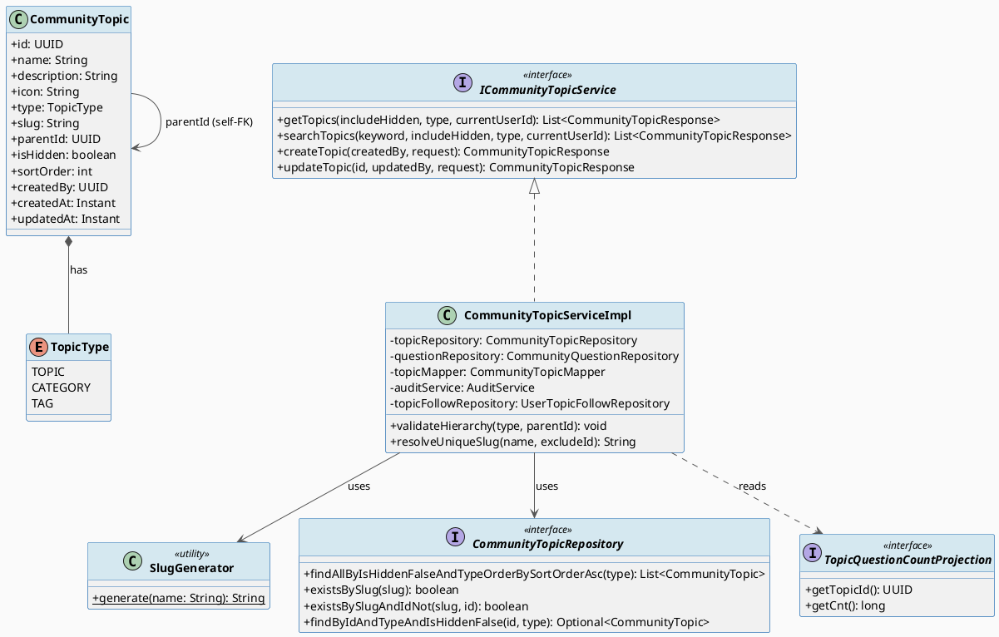
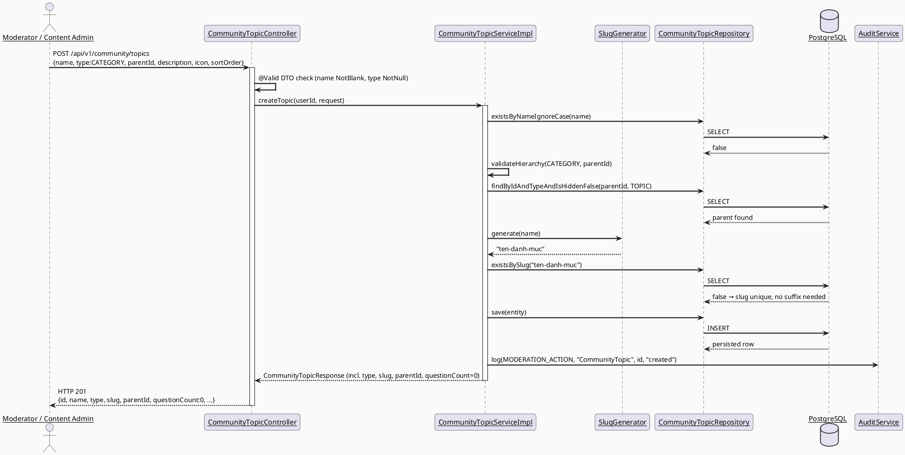
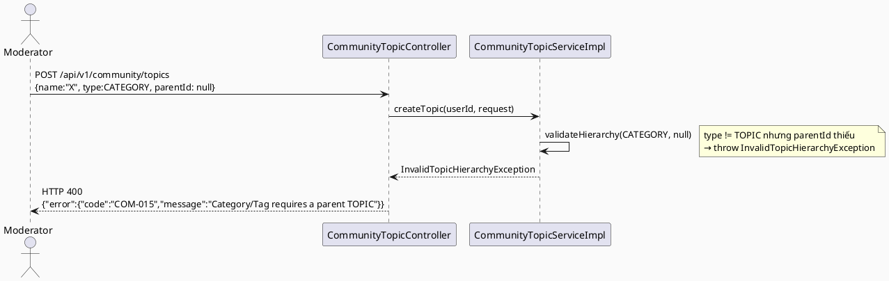

# ENGINEERING DOCUMENTATION STANDARD (EDS) v2.0
# Technical Design Specification — Community Topic Management (Real Taxonomy, No Mocks)

| Field | Value |
|-------|-------|
| **Document ID** | `CB-COMMUNITY-IMP-010` |
| **Version** | `1.0` |
| **Date** | `2026-07-21` |
| **Status** | `Implemented — 2026-07-22 (17/17 test case verified GREEN; backend/web/mobile code complete, integration test chạy thật qua Testcontainers PostgreSQL)` |
| **Document Owner** | `HuyND` |
| **Author** | `AI Agent — Winston (System Architect)` |
| **Reviewed by** | `[Tech Lead]` |
| **DPO Sign-off** | `N/A — no PII/health data field added` |
| **Approved by** | `[Principal Architect]` |
| **Last Review** | `2026-07-21` |
| **Based on EDS** | `v2.0` |

---

## CHANGELOG

| Ngày | Người thực hiện | Nội dung thay đổi |
|------|-----------------|-------------------|
| 2026-07-21 | AI Agent — Winston | Tạo tài liệu lần đầu, dựa trên điều tra gap-analysis trước đó (memory `project_community_topic_directory_gaps.md`) và 3 quyết định thiết kế được user chốt qua AskUserQuestion (content-count = APPROVED only; hierarchy = chỉ CATEGORY/TAG có parent bắt buộc là TOPIC; slug collision = auto-suffix). |
| 2026-07-21 | HuyND | Approved — "Approved" xác nhận qua chat, không chỉnh sửa nội dung. |
| 2026-07-21 | AI Agent — Amelia (Dev Agent) | **Sửa ADR-COM-016 trong lúc implement**: phát hiện `ContentCategoryController` (`/api/v1/admin/content/categories`, CONTENT_ADMIN, trang web `/content/categories`) — một controller HOÀN TOÀN KHÁC nhưng dùng chung `CommunityTopicService`/bảng `community_topics` — tạo category KHÔNG có `parentId` (không nằm trong nghiên cứu ban đầu, bị bỏ sót khi tạo TDS). Yêu cầu ban đầu "CATEGORY/TAG bắt buộc có parent" sẽ làm vỡ tính năng có thật này. User xác nhận qua AskUserQuestion: nới lỏng thành **parentId TUỲ CHỌN** cho CATEGORY/TAG (chỉ TOPIC bị cấm tuyệt đối có parent). Xem ADR-COM-016 đã cập nhật bên dưới và migration SQL §5.2.|
| 2026-07-21 | AI Agent — Amelia (Dev Agent) | **Implement hoàn tất — Backend/Web/Mobile.** Backend: entity/enum/migration/DTO/mapper/repository/service/controller/exception-handler đầy đủ; 10 unit test mới qua đúng Red→Green (`./mvnw test`, exit 0); `ContentCategoryController` được sửa để ép `type=CATEGORY` (giữ tương thích ngược với route cũ). Web: `ManageTopicsPage.tsx` viết lại dùng `type`/`slug`/`questionCount`/`parentId` thật, xoá hết hack `icon`-làm-`type`; nút ▲/▼ persist thật qua PATCH (ADR-COM-019); `buildTopicTree()` helper mới + test (3/3 pass); `tsc`/`vitest`/`build`/`lint` sạch. Mobile: `questionCountLabel()` dùng `questionCount` thật thay `sortOrder*100`; `getTopics(type: 'TOPIC')`; test mới (2/2 pass); `flutter test` toàn bộ 248/248 pass. Full regression backend/web/mobile xác nhận 0 regression do feature này (baseline so sánh qua `git stash`). **Phát hiện thêm ngoài phạm vi §11 Chặng 5 ban đầu**: `community_topic_search_screen.dart` (UC-163, một màn hình tìm kiếm chủ đề khác, CB-148) có CÙNG bug `sortOrder * 100` VÀ một số "chuyên gia" hoàn toàn bịa đặt (`(topic.sortOrder * 3).clamp(1, 20)`, không có field backend nào hậu thuẫn) — đã sửa: dùng `questionCount` thật, bỏ hẳn số "chuyên gia" bịa (không có nguồn dữ liệu thật, không tự chế ra field mới ngoài phạm vi đã duyệt), và thêm `type: 'TOPIC'` filter (ADR-COM-017) cho màn hình này. |
| 2026-07-22 | AI Agent — Amelia (Dev Agent) | **17/17 test case GREEN.** User commit, apply migration lên Supabase, bật Docker Desktop, yêu cầu tiếp tục. Chạy `CommunityTopicIntegrationTest` với Docker thật → phát hiện lỗi Flyway **có sẵn từ trước, không do feature này**: 2 migration khác nhau cùng version `20260720100000` (`V20260720100000__secure_baby_journey_linkage.sql` và `V20260720100000__add_content_report_revert_columns.sql`, từ merge commit `c2f96088`), chặn TOÀN BỘ Testcontainers integration test trong dự án (xác nhận bằng cách chạy thử `CommunityProfileIntegrationTest` — không liên quan community-topic — cũng lỗi y hệt). User xác nhận qua AskUserQuestion: đổi tên `V20260720100000__add_content_report_revert_columns.sql` → `V20260720100001__add_content_report_revert_columns.sql` (chỉ đổi version, giữ nguyên SQL). Sau `mvn clean test`: `CommunityTopicIntegrationTest` 3/3 pass thật. Full regression backend chạy lại: không có test nào của community/topic/content-category trong danh sách lỗi còn sót; 1 lớp lỗi mới xuất hiện (`Mf03OpenApiContractTest`) xác nhận nguyên nhân là thiếu config `carebridge.zego.app-id` — hoàn toàn không liên quan, có sẵn từ trước. Xem Test-Spec CHANGELOG cùng ngày để biết chi tiết đầy đủ. |
| 2026-07-22 | AI Agent — Amelia (Dev Agent) | **Bug fix phát hiện qua UI QA thủ công (Chrome DevTools MCP), không phải feature mới.** Đăng nhập thật với `content@carebridge.dev`, thao tác thật trên `/content/topics` và `/content/categories`. Tạo mới qua `ManageTopicsPage.tsx` (luôn gửi `sortOrder:0`) thành công (201), nhưng tạo qua route cũ `/content/categories` (`contentApi.ts createContentCategory()`, không gửi `sortOrder`) trả về **400 "Invalid request body"**. Root cause xác nhận qua log backend (`Cannot map 'null' into type 'int'`) và curl isolation: `CreateCommunityTopicRequest.sortOrder` khai báo `private int sortOrder = 0;` (primitive) + `@Builder.Default`, trong khi class có cả `@NoArgsConstructor` lẫn `@AllArgsConstructor` — khi JSON không gửi field này, Jackson chọn constructor all-args và truyền `null` cho tham số `int`, gây lỗi unbox. `UpdateCommunityTopicRequest.sortOrder` (đã dùng `Integer` boxed từ đầu) không có bug này — xác nhận đây là lỗi cục bộ của DTO tạo mới, không phải lỗi hệ thống rộng hơn. **Fix**: đổi `CreateCommunityTopicRequest.sortOrder` sang `Integer` (bỏ `@Builder.Default`, giữ `@Min(0)`); `CommunityTopicMapper.toEntity()` null-check về 0. Xác minh lại qua curl (400 → 201) và qua UI thật (form "Thêm danh mục" lưu thành công). Chạy lại toàn bộ test community/content (46/46 xanh) + full regression backend (2410 test, 13 failures/69 errors — không cái nào thuộc community/topic/content-category, xác nhận không liên quan). Dữ liệu test tạo trong lúc QA đã được ẩn (soft-hide) trên Supabase dev DB dùng chung để không để lại rác. |
| 2026-07-22 | AI Agent — Amelia (Dev Agent) | **Bug thứ 2 phát hiện qua UI QA thủ công**: bấm nút ▲/▼ (ADR-COM-019) trên `/content/topics` — 2 PATCH request thành công (200, xác nhận `sortOrder` đổi đúng ở backend), nhưng danh sách hiển thị KHÔNG đổi vị trí ngay; chỉ đúng lại sau khi reload trang. Root cause: `buildTopicTree()` (`topicTree.ts`) chỉ lặp qua mảng `topics` theo đúng thứ tự phần tử trong mảng (thứ tự từ lần fetch gốc), không tự sort theo `sortOrder` — trong khi `handleMove()` chỉ cập nhật giá trị `sortOrder` của 2 object tại đúng vị trí cũ trong mảng (`setTopics(prev => prev.map(...))`), không thay đổi thứ tự mảng. **Fix**: `buildTopicTree()` sort `topicItems` và `childItems` theo `sortOrder` trước khi dựng rows, thay vì tin vào thứ tự mảng đầu vào. Thêm 1 test case mới (`orders rows by sortOrder, not by array position`) — `topicTree.test.ts` 4/4 pass. Verify qua UI thật: bấm ▲/▼ giờ đổi vị trí NGAY LẬP TỨC, không cần reload. Đồng thời test mobile qua `flutter run -d web-server` + Chrome DevTools MCP (đăng nhập `mother@carebridge.dev` thật): `TopicDirectoryScreen` và `CommunityTopicSearchScreen` đều hiển thị đúng `questionCount` thật (khớp 100% với số liệu bên web), filter `type=TOPIC` và search `keyword=` gửi đúng qua network — xác nhận cả 2 màn hình mobile không có regression. |

---

## MỤC LỤC

1. [Tổng quan Module](#1-tổng-quan-module)
2. [Ma trận Truy vết](#2-ma-trận-truy-vết-traceability-matrix)
3. [Architecture Decision Records](#3-architecture-decision-records-adr)
4. [Non-Functional Requirements & SLA](#4-non-functional-requirements--sla)
5. [Static Modeling](#5-static-modeling-mô-hình-tĩnh)
6. [Dynamic Modeling](#6-dynamic-modeling-mô-hình-động)
7. [Domain Event Catalog](#7-domain-event-catalog)
8. [Interface Specification](#8-interface-specification-đặc-tả-giao-diện)
9. [API Specification](#9-api-specification)
10. [Bảng mã lỗi](#10-bảng-mã-lỗi-error-codes)
11. [Quy trình Triển khai](#11-quy-trình-triển-khai-step-by-step)
12. [Rollback & Incident Runbook](#12-rollback--incident-runbook)
13. [Kịch bản Kiểm thử Chi tiết](#13-kịch-bản-kiểm-thử-chi-tiết)
14. [Phương pháp Xác minh](#14-phương-pháp-xác-minh)
15. [Mẫu thử thực tế](#15-mẫu-thử-thực-tế-api-verification-samples)
16. [Bảng tổng hợp phân quyền](#16-bảng-tổng-hợp-phân-quyền-authorization-matrix)
17. [AI Prompt Constraints (CASE 2.0)](#17-ai-prompt-constraints-case-20)

---

## 1. Tổng quan Module

| Field | Value |
|-------|-------|
| **Module Name** | `CommunityTopicManagement` |
| **Bounded Context** | `community` |
| **UC ID** | `UC-109 Manage Community Topics` (primary — Community Moderator/Content Admin), consumed by `UC-163 Search Community Topics` and `UC-171 Follow Topic` (Mother/Family, mobile) |
| **SRS Reference** | `3.2.2.11` (UC-109), `3.3.8.2` (UC-163), `3.3.8.4` (UC-171) |
| **Primary Actor** | `Community Moderator`, `Content Admin` (manage); `Mother`/`Family` (browse, read-only) |
| **Platform** | Backend (Spring Boot) + Web Admin Portal (React) + Mobile App (Flutter) |
| **Data Classification** | `Internal` (taxonomy metadata — not PII, not health data) |
| **Compliance Scope** | `BR-RBAC` |
| **Upstream Dependencies** | `community.CommunityQuestion` (question count aggregation), `security` (JWT/role) |
| **Downstream Consumers** | Web `ManageTopicsPage`, Mobile `TopicDirectoryScreen`, `CommunityFeedScreen` (topic filter), `TopicFollowService` (UC-171, unaffected) |

**Mô tả:** Hoàn thiện tính năng quản lý "Danh mục/Chủ đề thảo luận cộng đồng" (`CommunityTopic`) hiện đang dở dang — loại bỏ toàn bộ dữ liệu giả (mock/placeholder) đã phát hiện trong gap-analysis trước đó:

1. **Backend**: thêm field thật `type` (TOPIC/CATEGORY/TAG), `slug` (unique, server-generated), `parentId` (phân cấp Topic→Category/Tag), và API đếm số câu hỏi APPROVED thật sự thuộc mỗi topic.
2. **Web** (`/content/topics`, role MODERATOR + CONTENT_ADMIN): xoá hack "icon giả làm type", nối `parentId` thật vào dropdown "Chủ đề cha", hiển thị slug + số bài viết thật từ backend, thay nút kéo-thả tĩnh bằng nút di chuyển thứ tự (▲/▼) hoạt động thật.
3. **Mobile** (`TopicDirectoryScreen`, UC-163): sửa badge "X câu hỏi" đang tính giả (`sortOrder * 100`) thành gọi API thật; lọc chỉ hiển thị `type=TOPIC` cho mẹ bầu (Category/Tag là taxonomy nội bộ cho admin, không phải đối tượng duyệt riêng của mẹ).

**Out of scope (ghi nhận rõ, không tự ý mở rộng):**
- Bộ lọc giai đoạn "Mang thai/Sau sinh/Chăm bé" trên mobile hiện match substring tên topic ở client — **giữ nguyên**, vì không có field "stage" thật trên `CommunityTopic` và việc thêm field này không nằm trong 3 quyết định đã được user chốt. Đây là hạn chế đã biết, không phải phạm vi của spec này.
- Xoá cứng (hard delete) topic — vẫn dùng soft-hide (`isHidden`) như hiện tại.
- Ràng buộc "không cho ẩn Topic cha khi còn Category/Tag con chưa ẩn" — không được yêu cầu, không tự thêm.

---

## 2. Ma trận Truy vết (Traceability Matrix)

| Requirement ID | Loại | Mô tả yêu cầu | Thành phần Code | Compliance Target | ADR liên quan |
|----------------|------|---------------|-----------------|--------------------|--------------|
| UC-109 | Use Case | "Creates, edits, or hides topics, tags, and Q&A groups" (Community Moderator, Admin Portal) | `CommunityTopicController`, `ManageTopicsPage.tsx` | BR-RBAC | ADR-COM-015, ADR-COM-016 |
| UC-163 | Use Case | Mother browses/searches community topics | `TopicDirectoryScreen`, `GET /api/v1/community/topics` | BR-RBAC | ADR-COM-017 |
| UC-171 | Use Case | Follow/unfollow topic (unaffected by this change) | `TopicFollowService` | BR-RBAC | — |
| User-decision-2026-07-21 | Explicit approved decision (AskUserQuestion) | Content count = số câu hỏi `status=APPROVED` mỗi topic | `CommunityQuestionRepository.countApprovedQuestionsByTopicIds` | — | ADR-COM-015 |
| User-decision-2026-07-21 | Explicit approved decision | Chỉ CATEGORY/TAG có `parent_id`, bắt buộc trỏ tới 1 TOPIC | `CommunityTopicServiceImpl.validateHierarchy()` | — | ADR-COM-016 |
| User-decision-2026-07-21 | Explicit approved decision | Slug trùng → tự thêm hậu tố `-2`, `-3`... | `SlugGenerator`, `CommunityTopicServiceImpl` | — | ADR-COM-018 |
| BR-RBAC | Business Rule | Create/update topic chỉ MODERATOR/CONTENT_ADMIN | `@PreAuthorize("hasAnyRole('MODERATOR','CONTENT_ADMIN')")` (không đổi) | RBAC | — |

---

## 3. Architecture Decision Records (ADR)

### ADR-COM-015 — Đếm nội dung theo topic dùng câu APPROVED-only, batch theo topic list (không N+1)

| Field | Value |
|-------|-------|
| **Status** | `Accepted` |
| **Deciders** | `HuyND (user-approved via AskUserQuestion 2026-07-21)` |
| **Date** | `2026-07-21` |

#### Bối cảnh
Web và Mobile hiện hiển thị số "bài viết"/"câu hỏi" mỗi topic bằng placeholder (`"— bài"` tĩnh trên web, `sortOrder * 100` giả trên mobile). Cần một con số thật, nhất quán với phần còn lại của module (feed/search chỉ show `APPROVED`, xem `CommunityQuestionRepository.java` comment dòng 49: "UC-162: search — APPROVED only").

#### Các phương án đã xem xét

| Phương án | Mô tả | Ưu điểm | Nhược điểm |
|-----------|-------|---------|------------|
| A | Đếm tất cả status (PENDING+APPROVED+LOCKED, trừ HIDDEN/DELETED) | Số lớn hơn, "đầy đủ" hơn | Không nhất quán với feed/search (chỉ show APPROVED); lộ số câu hỏi PENDING (chưa duyệt, có thể chứa nội dung không an toàn) ra ngoài |
| B (chọn) | Chỉ đếm `status = APPROVED` | Nhất quán tuyệt đối với những gì user thực sự nhìn thấy khi bấm vào topic (feed) | Số hiển thị có thể thấp hơn tổng thực tế trong DB (chấp nhận được — đây là con số "nội dung công khai", không phải "tổng bản ghi") |

#### Quyết định
Chọn **Phương án B**. Query 1 lần cho toàn bộ danh sách topic đang trả về (`WHERE topic_id IN (:topicIds) AND status = 'APPROVED' GROUP BY topic_id`), theo đúng pattern batch-hydration đã có sẵn cho `isFollowed` (`toResponsesWithFollowState`, UC-171 hydration fix) — tránh N+1.

#### Hệ quả
**Tích cực:** số liệu nhất quán với feed; không lộ nội dung PENDING/HIDDEN qua số đếm.
**Trade-offs:** số hiển thị sẽ giảm tạm thời ngay sau khi mẹ đăng câu hỏi (còn PENDING) cho tới khi được duyệt — chấp nhận được, đúng ý nghĩa "nội dung công khai".

---

### ADR-COM-016 — Phân cấp Topic: TOPIC không bao giờ có cha; CATEGORY/TAG có cha TUỲ CHỌN, nếu có phải là TOPIC (tối đa 2 tầng)

| Field | Value |
|-------|-------|
| **Status** | `Accepted` — **đã sửa 2026-07-21 trong lúc implement** (xem CHANGELOG) |
| **Deciders** | `HuyND (user-approved via AskUserQuestion 2026-07-21, sửa lần 2 cùng ngày)` |
| **Date** | `2026-07-21` |

#### Bối cảnh
`ManageTopicsPage.tsx` đã có UI render Category lồng dưới Topic khi expand, nhưng **không lọc theo quan hệ cha-con thật** — mọi Category hiện có bị lồng dưới MỌI Topic đang mở, vì `parent_id` chưa tồn tại ở backend (TODO trong code: dòng 263-264).

**Phát hiện trong lúc implement (Red Gate, `./mvnw compile`):** `ContentCategoryController.java` (`/api/v1/admin/content/categories`, role CONTENT_ADMIN, trang web `ContentCategoryListPage.tsx` @ `/content/categories`) là một controller **khác** nhưng dùng chung `CommunityTopicService`/bảng `community_topics` — tạo "danh mục" (`icon:'label'`, tương đương `type=CATEGORY`) **hoàn toàn không có khái niệm parent**. Quyết định ban đầu (parentId bắt buộc cho CATEGORY/TAG) sẽ làm vỡ tính năng có thật này ngay lập tức (mọi request tạo category qua trang đó → 400 COM-015). Bị bỏ sót ở research gate ban đầu vì `content.ts`/`ContentCategoryListPage.tsx` trông giống một concept "content category" độc lập cho tới khi trace ngược `contentApi.ts` → `ContentCategoryController` → cùng entity `CommunityTopic`.

#### Quyết định (đã sửa)
`type = TOPIC` → `parent_id` luôn **`NULL`, bắt buộc** (Topic luôn là gốc — không đổi so với quyết định ban đầu).
`type IN (CATEGORY, TAG)` → `parent_id` **TUỲ CHỌN** (nullable). Nếu được cung cấp, entity được trỏ tới phải có `type = TOPIC` và `is_hidden = false` tại thời điểm gán (validate ở service layer — không thể validate type-of-referenced-row bằng CHECK constraint thuần SQL, dùng service-layer lookup, đúng CLAUDE.md: "Service: workflows, transactions, authorization checks"). `ContentCategoryController` tiếp tục hoạt động nguyên trạng, không cần sửa (tạo CATEGORY với `parentId=null`, hợp lệ theo luật mới).
Cấu trúc này **về mặt kiến trúc vẫn không cho phép lồng quá 2 tầng** vì chỉ TOPIC mới được làm cha khi có ai đó chọn gán cha — không cần thêm logic chống vòng lặp (cycle detection).

#### Hệ quả
**Tích cực:** không phá vỡ `ContentCategoryController`/`ContentCategoryListPage.tsx` đang hoạt động thật; vẫn hỗ trợ cây phân cấp thật cho `ManageTopicsPage.tsx` khi người dùng chủ động chọn "Chủ đề cha".
**Trade-offs:** không còn ràng buộc DB-level bắt buộc mọi Category/Tag phải thuộc về 1 Topic — một Category có thể "mồ côi" (không cha) hợp lệ, đúng với cách `ContentCategoryController` đã vận hành từ trước.

---

### ADR-COM-017 — Mobile chỉ nhận `type=TOPIC`; Category/Tag là taxonomy nội bộ cho Admin

| Field | Value |
|-------|-------|
| **Status** | `Accepted` |
| **Date** | `2026-07-21` |

#### Bối cảnh
UC-163 (Search Community Topics) mô tả mẹ "browses topics for pregnancy, postpartum, babies, nutrition..." — không đề cập Category/Tag như đối tượng duyệt riêng. `TopicDirectoryScreen` hiện render phẳng toàn bộ danh sách trả về từ `GET /api/v1/community/topics` mà không phân biệt loại.

#### Quyết định
`GET /api/v1/community/topics` giữ nguyên contract mặc định (trả về mọi type, không breaking change cho các consumer khác), nhưng thêm optional query param `type=`. `TopicDirectoryScreen` gọi `GET .../topics?type=TOPIC` — chỉ hiển thị Topic gốc cho mẹ bầu. `ManageTopicsPage` (Admin) không truyền `type`, vẫn lấy đủ 3 loại để dựng cây quản lý.

#### Hệ quả
**Tích cực:** không breaking change; mobile UI (chỉ có 1 kiểu card phẳng, không có UI cây) không cần sửa logic render, chỉ cần request đúng tập dữ liệu.
**Trade-offs:** không có.

---

### ADR-COM-018 — Slug: server-generated, auto-suffix khi trùng, không cho client tự nhập

| Field | Value |
|-------|-------|
| **Status** | `Accepted` |
| **Date** | `2026-07-21` |

#### Bối cảnh
`ManageTopicsPage.tsx` hiện sinh slug ở client (hàm `generateSlug`) để hiển thị, nhưng **không gửi lên backend** — backend chưa có cột `slug`. Nếu để client tự nhập/gửi slug thì phải xử lý round-trip trùng lặp phức tạp hơn (submit → 409 → user tự sửa) và không nằm trong yêu cầu ban đầu.

#### Quyết định
`slug` **không xuất hiện trong Create/Update request DTO** — backend luôn tự sinh từ `name` (thuật toán: Unicode NFD normalize, bỏ dấu tổ hợp, `đ/Đ→d`, lowercase, bỏ ký tự ngoài `[a-z0-9\s-]`, gộp khoảng trắng thành `-`), y hệt logic `generateSlug()` phía client hiện có nhưng port sang Java làm nguồn chân lý duy nhất. Khi trùng, tự thêm hậu tố `-2`, `-3`... Khi `name` đổi (update), slug được **tính lại** theo tên mới (trừ khi tên không đổi). Web hiển thị slug **read-only** (trả về từ response), không còn input/nút "Tạo tự động".

#### Hệ quả
**Tích cực:** một nguồn chân lý duy nhất (Java), không cần đồng bộ 2 nơi; không bao giờ có slug rỗng hay không unique.
**Trade-offs:** Moderator không tự đặt slug tuỳ ý — chấp nhận được, không nằm trong yêu cầu.

### ADR-COM-019 — Thay "kéo-thả sắp xếp" (chưa hoạt động) bằng nút di chuyển ▲/▼ persist thật

| Field | Value |
|-------|-------|
| **Status** | `Accepted` |
| **Date** | `2026-07-21` |

#### Bối cảnh
User đánh dấu phần "kéo-thả sắp xếp" là tuỳ chọn ("nếu hợp lý"). Icon kéo-thả (`drag_indicator`) hiện tại trên web **hoàn toàn tĩnh, không có handler** — implement HTML5 drag-and-drop đầy đủ (dragstart/dragover/drop, reorder toàn bộ danh sách, xử lý race-condition khi 2 người sắp xếp cùng lúc) là một hạng mục lớn, không tương xứng với phần còn lại của scope.

#### Quyết định
Thay icon kéo-thả tĩnh bằng 2 nút mũi tên **▲ / ▼** — mỗi lần bấm hoán đổi `sortOrder` với phần tử liền kề cùng cấp (cùng `parentId`, cùng `type`) và gọi 2 lệnh `PATCH .../topics/{id}` thật để lưu (không mock). Đạt đúng mục tiêu "sắp xếp thật, không giả" với độ phức tạp UI thấp hơn nhiều so với drag-and-drop đầy đủ.

#### Hệ quả
**Tích cực:** đơn giản, robust, không cần thư viện DnD, không có global drag state cần quản lý.
**Trade-offs:** UX kém trực quan hơn kéo-thả tự do khi danh sách dài — chấp nhận được cho MVP; có thể nâng cấp lên DnD thật sau nếu được yêu cầu riêng.

---

## 4. Non-Functional Requirements & SLA

### 4.1. Performance & Availability

| Category | Requirement | Target SLA | Measurement Method |
|----------|-------------|------------|---------------------|
| Latency | `GET /api/v1/community/topics` (incl. question-count aggregation) | `< 300ms` p99 | Manual timing / existing feed SLA parity (UC-198 TDS) |
| Query cost | Question-count aggregation | 1 query cho N topics (không N+1) | Code review — `countApprovedQuestionsByTopicIds(topicIds)` |

### 4.2. Data Integrity

| Category | Requirement | Target | Verification Method |
|----------|-------------|--------|----------------------|
| Uniqueness | `community_topics.slug` | `UNIQUE` DB constraint | Migration + `existsBySlug` check |
| Uniqueness | `community_topics.name` (case-insensitive) | Đã có, giữ nguyên | `existsByNameIgnoreCase` |
| Referential integrity | `parent_id → community_topics.id` | FK `ON DELETE RESTRICT` | Migration |
| Hierarchy invariant | TOPIC không có cha; CATEGORY/TAG bắt buộc có cha là TOPIC không ẩn | CHECK constraint (cấp NULL) + service-layer validate (cấp type-of-parent) | `V20260721204919` migration + `CommunityTopicServiceImplTest` |

### 4.3. Security

Không có field PII/nhạy cảm mới. RBAC giữ nguyên (§16).

### 4.4. Scalability

Số lượng topic dự kiến ở quy mô hàng chục-hàng trăm (taxonomy quản lý bởi Moderator/Content Admin, không phải user-generated) — không cần cân nhắc phân trang cho `GET /topics` (giữ nguyên hành vi trả `List`, không `Page`, như hiện tại).

---

## 5. Static Modeling (Mô hình Tĩnh)

### 5.1. Class Diagram (PlantUML)



### 5.2. Data Structure (Flyway SQL Migration)

> **CareBridge rule:** `V1__init_schema.sql` + approved migrations là nguồn chân lý. `community_topics` hiện tại (từ `V1__init_schema.sql`): `id, created_at, description, name, updated_at, is_hidden, icon, sort_order, created_by` — không có `type`/`slug`/`parent_id`.

Tạo file: `05_Development/CareBridgeAPI/src/main/resources/db/migration/V20260721204919__add_community_topic_taxonomy.sql`

```sql
-- === Community Topic taxonomy: type / slug / parent_id (real, non-mock replacement for icon-hack) ===

ALTER TABLE community_topics
    ADD COLUMN type VARCHAR(20) NOT NULL DEFAULT 'TOPIC',   -- TOPIC | CATEGORY | TAG
    ADD COLUMN slug VARCHAR(140),                            -- filled below, then NOT NULL
    ADD COLUMN parent_id UUID;                                -- self-FK, required for CATEGORY/TAG

ALTER TABLE community_topics
    ADD CONSTRAINT community_topics_type_check
        CHECK (type IN ('TOPIC', 'CATEGORY', 'TAG')),
    -- ADR-COM-016 (revised): only rule enforceable at DB level is "a TOPIC never has a parent".
    -- CATEGORY/TAG parent_id is optional (NULL allowed) — kept optional so the pre-existing
    -- ContentCategoryController (flat categories, no parent concept) keeps working unchanged.
    -- "if parent_id is set it must reference a TOPIC" is a cross-row rule, enforced in
    -- CommunityTopicServiceImpl, not here.
    ADD CONSTRAINT community_topics_parent_rule_check
        CHECK (type <> 'TOPIC' OR parent_id IS NULL),
    ADD CONSTRAINT fk_community_topics_parent
        FOREIGN KEY (parent_id) REFERENCES community_topics(id) ON DELETE RESTRICT;

-- Deterministic slug backfill for the 8 known seed topics (V10__seed_community_topics.sql) —
-- computed offline with the same NFD-strip algorithm SlugGenerator.java uses, not guessed.
UPDATE community_topics SET slug = 'dinh-duong-thai-ky'   WHERE id = 'a1b2c3d4-e5f6-7890-abcd-ef1234567801' AND slug IS NULL;
UPDATE community_topics SET slug = 'suc-khoe-thai-nhi'    WHERE id = 'a1b2c3d4-e5f6-7890-abcd-ef1234567802' AND slug IS NULL;
UPDATE community_topics SET slug = 'cham-soc-sau-sinh'    WHERE id = 'a1b2c3d4-e5f6-7890-abcd-ef1234567803' AND slug IS NULL;
UPDATE community_topics SET slug = 'nuoi-con-bang-sua-me' WHERE id = 'a1b2c3d4-e5f6-7890-abcd-ef1234567804' AND slug IS NULL;
UPDATE community_topics SET slug = 'giac-ngu-va-the-chat' WHERE id = 'a1b2c3d4-e5f6-7890-abcd-ef1234567805' AND slug IS NULL;
UPDATE community_topics SET slug = 'tam-ly-va-cam-xuc'    WHERE id = 'a1b2c3d4-e5f6-7890-abcd-ef1234567806' AND slug IS NULL;
UPDATE community_topics SET slug = 'cham-soc-be-so-sinh'  WHERE id = 'a1b2c3d4-e5f6-7890-abcd-ef1234567807' AND slug IS NULL;
UPDATE community_topics SET slug = 'hoi-dap-chung'        WHERE id = 'a1b2c3d4-e5f6-7890-abcd-ef1234567808' AND slug IS NULL;

-- Fallback for any other pre-existing row created outside the seed (e.g. moderator-created before
-- this migration ran): deterministic id-based placeholder; recomputed to a real slug automatically
-- the next time the topic is renamed via the app (ADR-COM-018).
UPDATE community_topics SET slug = 'topic-' || substr(id::text, 1, 8) WHERE slug IS NULL;

ALTER TABLE community_topics
    ALTER COLUMN slug SET NOT NULL,
    ADD CONSTRAINT community_topics_slug_unique UNIQUE (slug);

CREATE INDEX idx_community_topics_parent_id ON community_topics(parent_id);
CREATE INDEX idx_community_topics_type ON community_topics(type);
```

> **Sync action cho `V1__init_schema.sql`:** sau khi migration này được apply và verify trên staging, cập nhật `V1__init_schema.sql`'s `community_topics` table definition để phản ánh baseline mới (thêm `type`, `slug`, `parent_id`, các constraint/index) — theo đúng quy ước "current code and tests as evidence" đã áp dụng cho các migration trước (vd. `V20260703170640` cho `community_question_likes`).

> ⚠️ **Rủi ro triển khai đã biết** (xem memory `project_medi_flyway_gap.md`): `spring.flyway.enabled=false` khi chạy local với profile `supabase` (shared dev DB) — migration này **sẽ không tự apply** lên DB dev chia sẻ qua `./mvnw spring-boot:run` thông thường. Phải verify qua Testcontainers integration test (tự động bật `spring.flyway.enabled=true`) trước, sau đó áp dụng thủ công lên shared DB (`./mvnw flyway:migrate` với `SPRING_FLYWAY_ENABLED=true`) — có khả năng đụng phải checksum drift đã biết trên 3 migration không liên quan (`20260711120000`, `20260712000000`, `20260713010000`). Không tự ý chạy `flyway repair` — cần người có context xác nhận trước (xem §11.2).

---

## 6. Dynamic Modeling (Mô hình Động)

### 6.1. Sequence Diagram — Create CATEGORY under a TOPIC (Happy Path)



### 6.2. Sequence Diagram — Error Path (Invalid Hierarchy)



### 6.3. State/Invariant Notes

Không phải finite-state-machine cổ điển (không có status field cho topic ngoài `isHidden` boolean, giữ nguyên hành vi cũ). Invariant bất biến duy nhất mới thêm:

> **Invariant:** `type = TOPIC ⟺ parent_id IS NULL`. Không transition nào (create/update) được phép vi phạm — enforced kép: DB CHECK constraint (chặn tầng NULL) + service validate (chặn tầng "cha phải là TOPIC, không ẩn").

---

## 7. Domain Event Catalog

`community` module hiện không dùng domain event bus (xác nhận qua code search — không có `ApplicationEventPublisher`/event record nào trong package `community`). **N/A** — không phát sinh sự kiện mới trong phạm vi này.

---

## 8. Interface Specification (Đặc tả Giao diện)

### 8.1. Service Interface

```java
// TopicType.java — new enum
// @version 1.0
package com.carebridge.backend.community.entity;

public enum TopicType {
    TOPIC, CATEGORY, TAG
}
```

```java
// SlugGenerator.java — new utility, community/util package
// @version 1.0
package com.carebridge.backend.community.util;

public final class SlugGenerator {
    private SlugGenerator() {}

    /** Mirrors the previous client-side generateSlug() in ManageTopicsPage.tsx (NFD normalize,
     *  strip combining diacritics, đ/Đ -> d, lowercase, strip non [a-z0-9\s-], collapse whitespace to '-').
     *  This becomes the single source of truth — client no longer generates slugs. */
    public static String generate(String name);
}
```

```java
// CreateCommunityTopicRequest.java — updated
// @version 2.0
// @breaking-change slug field removed from public contract entirely (was never wired — ADR-COM-018);
//                   `type` and `parentId` added.
public class CreateCommunityTopicRequest {
    @NotBlank @Size(max = 100) private String name;
    @Size(max = 500) private String description;
    @Size(max = 255) private String icon;
    @NotNull private TopicType type;          // TOPIC | CATEGORY | TAG
    private UUID parentId;                    // optional; forbidden when type=TOPIC; if set, must reference a visible TOPIC (validated in service, ADR-COM-016 revised)
    @Min(0) private int sortOrder;
}

// UpdateCommunityTopicRequest.java — updated
// @version 2.0
public class UpdateCommunityTopicRequest {
    @Size(max = 100) private String name;
    @Size(max = 500) private String description;
    @Size(max = 255) private String icon;
    private TopicType type;                   // null = leave unchanged
    private UUID parentId;                    // null = leave unchanged (see §9.2 semantics)
    private Boolean isHidden;
    private Integer sortOrder;
}

// CommunityTopicResponse.java — updated
// @version 2.0
public class CommunityTopicResponse {
    private UUID id;
    private String name;
    private String description;
    private String icon;
    private TopicType type;         // NEW
    private String slug;            // NEW — server-generated, always present
    private UUID parentId;          // NEW — null for TOPIC
    private long questionCount;     // NEW — APPROVED questions under this topic (ADR-COM-015)
    private boolean isHidden;
    private boolean isFollowed;
    private int sortOrder;
    private Instant createdAt;
    private Instant updatedAt;
}

// I CommunityTopicService.java — Service Contract
// @version 2.0
public interface CommunityTopicService {
    List<CommunityTopicResponse> getTopics(boolean includeHidden, TopicType type, UUID currentUserId);
    List<CommunityTopicResponse> searchTopics(String keyword, boolean includeHidden, TopicType type, UUID currentUserId);
    CommunityTopicResponse createTopic(UUID createdBy, CreateCommunityTopicRequest request);
    /**
     * @throws DuplicateTopicNameException (COM-009) khi tên trùng
     * @throws InvalidTopicHierarchyException (COM-015) khi vi phạm quy tắc phân cấp (ADR-COM-016)
     * @throws CommunityTopicNotFoundException (COM-003) khi parentId không tồn tại/đang ẩn
     */
    CommunityTopicResponse updateTopic(UUID id, UUID updatedBy, UpdateCommunityTopicRequest request);
}
```

### 8.2. Repository Interface

```java
// CommunityTopicRepository.java — additions
// @version 2.0
public interface CommunityTopicRepository extends JpaRepository<CommunityTopic, UUID> {
    // ... existing methods unchanged ...

    List<CommunityTopic> findAllByIsHiddenFalseAndTypeOrderBySortOrderAsc(TopicType type);
    List<CommunityTopic> findAllByTypeOrderBySortOrderAsc(TopicType type);

    boolean existsBySlug(String slug);
    boolean existsBySlugAndIdNot(String slug, UUID id);

    // Parent lookup for hierarchy validation (ADR-COM-016): must exist, be TOPIC-typed, not hidden.
    Optional<CommunityTopic> findByIdAndTypeAndIsHiddenFalse(UUID id, TopicType type);
}

// CommunityQuestionRepository.java — addition (existing file, community/repository)
// @version 1.1
public interface CommunityQuestionRepository extends JpaRepository<CommunityQuestion, UUID> {
    // ... existing methods unchanged ...

    // ADR-COM-015: batch count of APPROVED questions per topic, avoids N+1.
    @Query("""
            SELECT q.topicId AS topicId, COUNT(q) AS cnt
            FROM CommunityQuestion q
            WHERE q.status = com.carebridge.backend.community.entity.QuestionStatus.APPROVED
              AND q.topicId IN :topicIds
            GROUP BY q.topicId
            """)
    List<TopicQuestionCountProjection> countApprovedQuestionsByTopicIds(@Param("topicIds") List<UUID> topicIds);
}

// TopicQuestionCountProjection.java — new, community/repository package
public interface TopicQuestionCountProjection {
    UUID getTopicId();
    long getCnt();
}
```

---

## 9. API Specification

### 9.1. Endpoints Table

| Method | Path | Auth Level | Required Roles | Rate Limit | Idempotent? |
|--------|------|------------|-----------------|------------|-------------|
| `GET` | `/api/v1/community/topics` | JWT Bearer | Any authenticated | — (unchanged) | Yes |
| `POST` | `/api/v1/community/topics` | JWT Bearer | `MODERATOR`, `CONTENT_ADMIN` | — (unchanged) | No |
| `PATCH` | `/api/v1/community/topics/{id}` | JWT Bearer | `MODERATOR`, `CONTENT_ADMIN` | — (unchanged) | Yes |
| `POST` | `/api/v1/community/topics/{id}/follow` | JWT Bearer | Any authenticated | — (unchanged) | No — toggle |

> **Không thêm endpoint mới.** Web dựng cây Topic→Category/Tag từ danh sách phẳng (`parentId`) client-side; không cần endpoint "children" riêng (giữ API surface tối thiểu theo CLAUDE.md).

### 9.2. Request / Response Schemas

#### `GET /api/v1/community/topics?includeHidden={bool}&type={TOPIC|CATEGORY|TAG}&keyword={string}`

`type` **optional** — khi bỏ trống trả về cả 3 loại (dùng cho Web quản lý dựng cây). Mobile luôn truyền `type=TOPIC` (ADR-COM-017).

**Response — 200 OK:**
```json
{
  "success": true,
  "data": [
    {
      "id": "a1b2c3d4-e5f6-7890-abcd-ef1234567801",
      "name": "Dinh dưỡng thai kỳ",
      "description": "Chế độ ăn, bổ sung vi chất...",
      "icon": "restaurant",
      "type": "TOPIC",
      "slug": "dinh-duong-thai-ky",
      "parentId": null,
      "questionCount": 12,
      "isHidden": false,
      "isFollowed": true,
      "sortOrder": 1,
      "createdAt": "2026-06-01T00:00:00Z",
      "updatedAt": "2026-06-01T00:00:00Z"
    }
  ]
}
```

#### `POST /api/v1/community/topics` — Tạo mới (MODERATOR/CONTENT_ADMIN)

**Request Body (type=TOPIC):**
```json
{ "name": "Sức khỏe tinh thần", "description": "...", "icon": "psychology", "type": "TOPIC", "sortOrder": 9 }
```

**Request Body (type=CATEGORY, cha bắt buộc):**
```json
{ "name": "Trầm cảm sau sinh", "description": "...", "type": "CATEGORY", "parentId": "a1b2c3d4-...567806", "sortOrder": 1 }
```

**Response — 201 Created:** như schema `CommunityTopicResponse` ở §9.2 (GET), `questionCount: 0` cho topic mới tạo.

**Response — 400 Bad Request (thiếu parentId cho CATEGORY/TAG, hoặc cha không phải TOPIC):**
```json
{ "error": { "code": "COM-015", "message": "Category or Tag topics must reference an existing, visible TOPIC as parent" } }
```

**Response — 409 Conflict (trùng tên — không đổi so với hiện tại):**
```json
{ "error": { "code": "COM-009", "message": "Community topic with name already exists: Sức khỏe tinh thần" } }
```

#### `PATCH /api/v1/community/topics/{id}`

**Semantics field-null = "không đổi"** (giữ nguyên convention hiện có cho `isHidden`/`sortOrder`): `name=null` → không đổi tên (không đổi slug); `type=null` → không đổi loại; `parentId=null` → không đổi cha. Muốn đổi cha, phải gửi UUID mới.

**Ràng buộc đặc biệt:** nếu request đổi `type` sang `TOPIC`, `parentId` trong CÙNG request phải là `null` (nếu không → COM-015, vì vừa "trở thành TOPIC" vừa "có cha" là mâu thuẫn).

---

## 10. Bảng mã lỗi (Error Codes)

> Tiếp nối các mã `COM-*` đã tồn tại trong `GlobalExceptionHandler.java` (001, 003, 006, 007, 009, 010–014 đã dùng cho các exception khác trong module). Mã mới: `COM-015`.

| Code | HTTP Status | Message (EN) | Message (VI) | Trigger Condition |
|------|-------------|---------------|---------------|--------------------|
| `COM-003` | 404 | Community topic not found or is hidden | Không tìm thấy chủ đề cha hoặc chủ đề cha đang bị ẩn | `parentId` không trỏ tới topic tồn tại/không ẩn (tái dùng exception có sẵn) |
| `COM-009` | 409 | Community topic with name already exists | Tên chủ đề đã tồn tại | `existsByNameIgnoreCase` (không đổi) |
| `COM-015` | 400 | Invalid topic hierarchy | Phân cấp chủ đề không hợp lệ | (a) `type=TOPIC` nhưng có `parentId`; (b) `parentId` trỏ tới 1 topic có `type ≠ TOPIC`; (c) `parentId` trỏ tới 1 TOPIC đang ẩn |

---

## 11. Quy trình Triển khai (Step-by-Step)

### 11.1. Prerequisites
- [ ] TDS này + Test-Spec đi kèm đã được đổi `Status: Approved`
- [ ] Không cần DPO sign-off (không có PII)

### 11.2. Pre-Migration Checklist
- [ ] Xác nhận migration chạy sạch qua Testcontainers integration test trước (không phụ thuộc shared dev DB)
- [ ] **Biết trước rủi ro:** shared Supabase dev DB có `spring.flyway.enabled=false` cục bộ + checksum drift đã biết trên 3 migration cũ không liên quan (xem §5.2 cảnh báo). Áp dụng migration này lên shared dev DB là một bước **thủ công, riêng**, không tự động qua `./mvnw spring-boot:run` — coordinate với người có quyền/context trước khi chạy `flyway repair` nếu checksum-drift chặn validate.

### 11.3. Implementation Steps

#### Chặng 1 — Flyway migration
Tạo `V20260721204919__add_community_topic_taxonomy.sql` (nội dung đầy đủ ở §5.2).

#### Chặng 2 — Backend: entity/enum/util
- `community/entity/TopicType.java` (mới)
- `community/entity/CommunityTopic.java`: thêm field `type` (`@Enumerated(STRING)`), `slug`, `parentId`
- `community/util/SlugGenerator.java` (mới)
- `community/exception/InvalidTopicHierarchyException.java` (mới) + đăng ký trong `GlobalExceptionHandler` → COM-015
- `community/repository/TopicQuestionCountProjection.java` (mới)

#### Chặng 3 — Backend: repository/DTO/mapper/service/controller
- `CommunityTopicRepository`: thêm methods §8.2
- `CommunityQuestionRepository`: thêm `countApprovedQuestionsByTopicIds` §8.2
- `CreateCommunityTopicRequest`/`UpdateCommunityTopicRequest`/`CommunityTopicResponse`: cập nhật theo §8.1
- `CommunityTopicMapper`: `toEntity`/`applyUpdate` xử lý `type`/`parentId`; `toResponse` nhận thêm `questionCount` param
- `CommunityTopicServiceImpl`: thêm `validateHierarchy()`, `resolveUniqueSlug()`, batch question-count hydration (song song với batch follow-state hydration hiện có)
- `CommunityTopicController`: thêm `@RequestParam(required=false) TopicType type` cho `GET`

#### Chặng 4 — Web
- `content.ts`: cập nhật interface `CommunityTopic` (thêm `type`, `slug`, `parentId`, `questionCount`)
- `ManageTopicsPage.tsx`: xoá `TaxonomyType`/`iconForType`/`typeFromIcon`/`generateSlug` hack; dùng `item.type` thật; dropdown "Chủ đề cha" filter theo `type===TOPIC && !isHidden`, required khi `form.type !== 'TOPIC'`; slug hiển thị read-only từ response; thay `drag_indicator` bằng nút ▲/▼ gọi PATCH thật (ADR-COM-019); hiển thị `questionCount` thay `"— bài"`; sửa logic nhóm cây dùng `item.parentId === topic.id` thay vì lồng mọi category dưới mọi topic

#### Chặng 5 — Mobile
- `community_model.dart`: `CommunityTopic` thêm field `questionCount`
- `community_service.dart`: `getTopics({String? type})` thêm query param
- `topic_directory_screen.dart`: gọi `getTopics(type: 'TOPIC')`; badge dùng `topic.questionCount` thay `sortOrder * 100`

#### Chặng 6 — Verification sau deploy
```bash
./mvnw test -Dtest=CommunityTopicServiceImplTest,CommunityTopicControllerTest
curl -X GET http://localhost:8080/api/v1/community/topics?type=TOPIC -H "Authorization: Bearer $TOKEN"
# Expected: mỗi item có type/slug/parentId/questionCount, không còn "— bài" hay sortOrder*100 ở FE
```

### 11.4. Deployment Checklist
- [ ] Migration chạy thành công (staging trước, sau đó shared dev DB thủ công)
- [ ] `./mvnw test` xanh toàn bộ module `community`
- [ ] Web `npm run build` + `npm run lint` sạch
- [ ] Mobile `flutter analyze` + `flutter test` sạch
- [ ] Không còn chuỗi `sortOrder * 100` hoặc `"— bài"` trong codebase (grep xác nhận)

---

## 12. Rollback & Incident Runbook

### 12.1. Điều kiện kích hoạt Rollback

| Điều kiện | Ngưỡng | Người quyết định |
|-----------|--------|---------------------|
| Migration fail trên staging | Bất kỳ lỗi nào | Dev thực hiện |
| `CommunityTopicServiceImplTest` đỏ sau merge | Bất kỳ | Dev thực hiện |
| Web/Mobile crash khi load `/content/topics` hoặc `TopicDirectoryScreen` | Bất kỳ | Dev thực hiện |

### 12.2. Rollback Procedure

```bash
# Dev/staging only — KHÔNG chạy trên production
psql -h $DB_HOST -U $DB_USER -d $DB_NAME \
  -c "ALTER TABLE community_topics DROP CONSTRAINT IF EXISTS fk_community_topics_parent, DROP CONSTRAINT IF EXISTS community_topics_parent_rule_check, DROP CONSTRAINT IF EXISTS community_topics_type_check, DROP CONSTRAINT IF EXISTS community_topics_slug_unique;"
psql -h $DB_HOST -U $DB_USER -d $DB_NAME \
  -c "ALTER TABLE community_topics DROP COLUMN IF EXISTS type, DROP COLUMN IF EXISTS slug, DROP COLUMN IF EXISTS parent_id;"
psql -h $DB_HOST -U $DB_USER -d $DB_NAME \
  -c "DELETE FROM flyway_schema_history WHERE version = '20260721100000';"

git checkout -- src/main/java/com/carebridge/backend/community/
git checkout -- src/main/resources/db/migration/V20260721204919__add_community_topic_taxonomy.sql
git checkout -- ../CareBridgeWebApp/src/features/contentManagement/
git checkout -- ../CareBridgeMobileApp/lib/features/community/
```

### 12.3. Notification Protocol
Không có PII → không cần thông báo DPO/DPA. Thông báo Tech Lead qua kênh nội bộ nếu rollback xảy ra trên staging/dev chia sẻ (ảnh hưởng người khác đang dùng chung DB dev).

### 12.4. Post-Incident Review
Áp dụng template chuẩn của EDS §12.4 nếu rollback xảy ra sau khi đã lên staging.

---

## 13. Kịch bản Kiểm thử Chi tiết

> Chi tiết test case đầy đủ nằm ở `CommunityTopicManagement_Test-Spec.md` (file riêng, theo PHASE-4 template). Section này chỉ liệt kê **nhóm** kịch bản để Test-Spec map ngược lại.

- **TC nhóm A — Slug generation & uniqueness**: tên có dấu tiếng Việt → slug đúng; trùng slug → auto-suffix `-2`; đổi tên → slug tính lại.
- **TC nhóm B — Hierarchy validation**: TOPIC có parentId → reject; CATEGORY/TAG thiếu parentId → reject; parentId trỏ tới CATEGORY (không phải TOPIC) → reject; parentId trỏ tới TOPIC đang ẩn → reject; happy path CATEGORY dưới TOPIC hợp lệ.
- **TC nhóm C — Question count aggregation**: chỉ đếm APPROVED, không đếm PENDING/HIDDEN/LOCKED/DELETED; batch không N+1; topic không có câu hỏi nào → `questionCount=0`.
- **TC nhóm D — RBAC**: MOTHER gọi POST/PATCH → 403; MODERATOR/CONTENT_ADMIN → thành công (không đổi so với hiện tại, hồi quy).
- **TC nhóm E — `type` filter trên GET**: `type=TOPIC` chỉ trả TOPIC; không truyền `type` trả cả 3.
- **TC nhóm F — Web/Mobile integration (manual + logic unit)**: cây phân cấp render đúng theo `parentId` thật; badge mobile hiển thị đúng `questionCount`; nút ▲/▼ gọi đúng 2 PATCH và hoán đổi `sortOrder`.

---

## 14. Phương pháp Xác minh

### 14.1. Database Inspection

```sql
-- Verify taxonomy columns & constraint sau migration
SELECT id, name, type, slug, parent_id, is_hidden, sort_order FROM community_topics ORDER BY sort_order;

-- Verify invariant: không có TOPIC nào có parent_id, không có CATEGORY/TAG nào thiếu parent_id
SELECT * FROM community_topics WHERE (type = 'TOPIC' AND parent_id IS NOT NULL) OR (type <> 'TOPIC' AND parent_id IS NULL);
-- Expected: 0 rows

-- Verify slug uniqueness
SELECT slug, COUNT(*) FROM community_topics GROUP BY slug HAVING COUNT(*) > 1;
-- Expected: 0 rows
```

### 14.2. Log / Audit Verification

```bash
# Audit log vẫn ghi MODERATION_ACTION cho create/update (không đổi hành vi cũ)
grep '"eventType":"MODERATION_ACTION"' application.log | grep '"entityType":"CommunityTopic"' | tail -5
```

### 14.3. Grep-based "no mock" verification

```bash
# Xác nhận không còn dữ liệu giả trong FE sau khi implement
grep -rn "sortOrder \* 100" 05_Development/CareBridgeMobileApp/lib/ ; echo "Expected: no output"
grep -rn '"— bài"' 05_Development/CareBridgeWebApp/src/ ; echo "Expected: no output"
grep -rn "typeFromIcon\|iconForType" 05_Development/CareBridgeWebApp/src/ ; echo "Expected: no output"
```

---

## 15. Mẫu thử thực tế (API Verification Samples)

### 15.1. Happy Path — tạo TOPIC rồi tạo CATEGORY con

```bash
curl -X POST http://localhost:8080/api/v1/community/topics \
  -H "Authorization: Bearer $MODERATOR_TOKEN" -H "Content-Type: application/json" \
  -d '{"name":"Sức khỏe tinh thần","type":"TOPIC","description":"...","sortOrder":9}'
# Expected 201, lưu lại "id" trả về là TOPIC_ID

curl -X POST http://localhost:8080/api/v1/community/topics \
  -H "Authorization: Bearer $MODERATOR_TOKEN" -H "Content-Type: application/json" \
  -d "{\"name\":\"Trầm cảm sau sinh\",\"type\":\"CATEGORY\",\"parentId\":\"$TOPIC_ID\",\"sortOrder\":1}"
```

**Expected Response (201):**
```json
{ "success": true, "data": { "type": "CATEGORY", "parentId": "<TOPIC_ID>", "slug": "tram-cam-sau-sinh", "questionCount": 0, ... } }
```

### 15.2. Error Paths

```bash
# CATEGORY thiếu parentId -> 400 COM-015
curl -X POST http://localhost:8080/api/v1/community/topics \
  -H "Authorization: Bearer $MODERATOR_TOKEN" -H "Content-Type: application/json" \
  -d '{"name":"X","type":"CATEGORY"}'
```
**Expected Response (400):** `{"error":{"code":"COM-015", ...}}`

```bash
# MOTHER cố tạo topic -> 403
curl -X POST http://localhost:8080/api/v1/community/topics \
  -H "Authorization: Bearer $MOTHER_TOKEN" -H "Content-Type: application/json" \
  -d '{"name":"Y","type":"TOPIC"}'
```
**Expected Response (403):** RBAC denial (không đổi so với hiện tại).

---

## 16. Bảng tổng hợp phân quyền (Authorization Matrix)

| Endpoint | `MOTHER`/`FAMILY` | `EXPERT`/`PARTNER` | `MODERATOR` | `CONTENT_ADMIN` | `SYSTEM_ADMIN` |
|----------|---------------------|----------------------|--------------|-------------------|------------------|
| `GET /api/v1/community/topics` | ✅ (chỉ non-hidden, `isHidden`/hidden rows ẩn) | ✅ | ✅ (kèm hidden nếu `includeHidden=true`) | ✅ (kèm hidden) | ✅ |
| `POST /api/v1/community/topics` | ❌ 403 | ❌ 403 | ✅ | ✅ | ❌ 403 *(không đổi — RBAC hiện tại không cấp quyền này cho SYSTEM_ADMIN)* |
| `PATCH /api/v1/community/topics/{id}` | ❌ 403 | ❌ 403 | ✅ | ✅ | ❌ 403 |
| `POST /api/v1/community/topics/{id}/follow` | ✅ | ✅ | ✅ | ✅ | ✅ |

**Chú thích:** Không thay đổi RBAC hiện có (yêu cầu tường minh của user: "Giữ nguyên RBAC hiện tại"). Bảng này chỉ tường minh hoá matrix đã ngầm định trong `@PreAuthorize` hiện tại.

---

## 17. AI Prompt Constraints (CASE 2.0)

### 17.1 Constraint Summary Table

| # | Constraint | Source (ADR/BR) | Last Verified |
|---|-----------|-------------------|-----------------|
| C1 | Slug KHÔNG BAO GIỜ được nhận từ client request DTO — luôn server-generated qua `SlugGenerator` | ADR-COM-018 | 2026-07-21 |
| C2 | `type=TOPIC` ⟺ `parentId IS NULL`; vi phạm → `InvalidTopicHierarchyException` (COM-015), không silent-fix | ADR-COM-016 | 2026-07-21 |
| C3 | Question count CHỈ đếm `status=APPROVED`, batch 1 query cho toàn bộ topic list đang trả về (không N+1, theo pattern `toResponsesWithFollowState`) | ADR-COM-015 | 2026-07-21 |
| C4 | Không thêm endpoint mới — cây phân cấp dựng client-side từ `parentId` phẳng | §9.1 | 2026-07-21 |
| C5 | RBAC create/update giữ nguyên `hasAnyRole('MODERATOR','CONTENT_ADMIN')` — không mở rộng, không thu hẹp | §16 | 2026-07-21 |

### 17.2 Constraint Injection Block

```
[CONSTRAINT BLOCK — Module: CommunityTopicManagement]
Theo TDS CB-COMMUNITY-IMP-010 và các ADR liên quan:

1. Slug luôn server-generated qua SlugGenerator.generate(name) — không nhận slug từ request DTO (ADR-COM-018).
2. type=TOPIC bắt buộc parentId=null; type∈{CATEGORY,TAG} bắt buộc parentId trỏ tới 1 TOPIC không ẩn — validate ở service layer, throw InvalidTopicHierarchyException (COM-015) khi vi phạm (ADR-COM-016).
3. questionCount chỉ đếm CommunityQuestion.status=APPROVED, dùng 1 query batch theo topicId list, không N+1 (ADR-COM-015).
4. Không thêm endpoint mới ngoài GET/POST/PATCH/follow đã có.
5. Không đổi RBAC hiện tại (MODERATOR + CONTENT_ADMIN cho create/update).

[CONTEXT BLOCK]
- Bounded Context: community
- Data Classification: Internal
- Compliance: BR-RBAC
- Existing interfaces: §8 Service/Repository Interface
- Error codes: §10
- Auth matrix: §16

[TASK BLOCK]
Implement backend (entity/migration/DTO/mapper/service/controller), web (ManageTopicsPage.tsx + content.ts),
mobile (community_model.dart + community_service.dart + topic_directory_screen.dart) thỏa mãn constraints trên.
Tests phải cover §13 nhóm A-F, chi tiết tại CommunityTopicManagement_Test-Spec.md.
```

### 17.3 Constraint Quality Checklist
- [x] Mỗi constraint traceable về ADR cụ thể
- [x] Không có constraint generic
- [x] Constraint block ≥ 3 constraints cụ thể (5)
- [x] Reference §8 Interface + §16 Auth Matrix

### 17.4 Anti-Pattern Detection

| AP-ID | Anti-Pattern | Dấu hiệu | Hành động |
|-------|-------------|-----------|----------|
| AP-AI-001 | Unconstrained Gen | Code sinh slug ở nơi khác ngoài `SlugGenerator`, hoặc nhận slug từ FE | Reject |
| AP-AI-003 | Implicit Decision | Code cho phép TOPIC có `parentId`, hoặc CATEGORY/TAG không bắt buộc `parentId` | Reject — vi phạm ADR-COM-016 |
| AP-AI-005 | Hallucinated Contract | Code gọi endpoint "children" hoặc "tree" không có trong §9.1 | Reject |

---

*Tài liệu này Draft — chờ user đổi Status → Approved trước khi implement (implement-flow.md Phase 2).*
