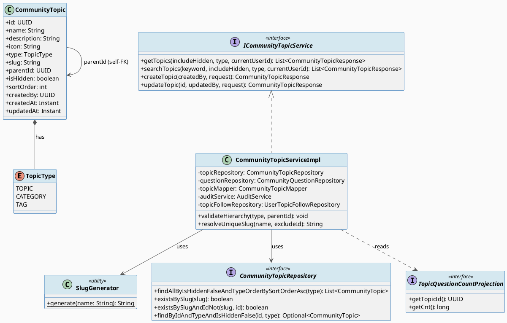
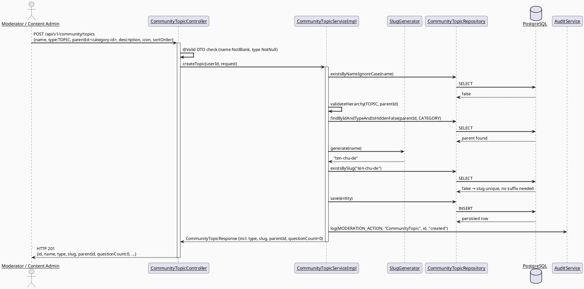
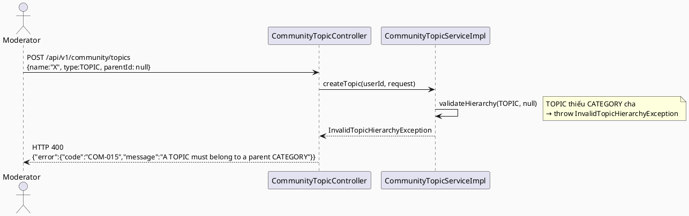

# ENGINEERING DOCUMENTATION STANDARD (EDS) v2.0
# Technical Design Specification — Community Topic Management (Real Taxonomy, No Mocks)

| Field | Value |
|-------|-------|
| **Document ID** | `CB-COMMUNITY-IMP-010` |
| **Version** | `2.0-approved` |
| **Date** | `2026-07-21` |
| **Status** | `Implementation Complete (Amendment 2) — automated verification complete; pending human browser/device QA and user final approval` |
| **Document Owner** | `HuyND` |
| **Author** | `AI Agent — Winston (System Architect)` |
| **Reviewed by** | `[Tech Lead]` |
| **DPO Sign-off** | `N/A — no PII/health data field added` |
| **Approved by** | `[Principal Architect]` |
| **Last Review** | `2026-07-21` |
| **Based on EDS** | `v2.0` |

---

## CHANGELOG

| Ngày | Người thực hiện | Nội dung thay đổi |
|------|-----------------|-------------------|
| 2026-07-21 | AI Agent — Winston | Tạo tài liệu lần đầu, dựa trên điều tra gap-analysis trước đó (memory `project_community_topic_directory_gaps.md`) và 3 quyết định thiết kế được user chốt qua AskUserQuestion (content-count = APPROVED only; hierarchy = chỉ CATEGORY/TAG có parent bắt buộc là TOPIC; slug collision = auto-suffix). |
| 2026-07-21 | HuyND | Approved — "Approved" xác nhận qua chat, không chỉnh sửa nội dung. |
| 2026-07-21 | AI Agent — Amelia (Dev Agent) | **Sửa ADR-COM-016 trong lúc implement**: phát hiện `ContentCategoryController` (`/api/v1/admin/content/categories`, CONTENT_ADMIN, trang web `/content/categories`) — một controller HOÀN TOÀN KHÁC nhưng dùng chung `CommunityTopicService`/bảng `community_topics` — tạo category KHÔNG có `parentId` (không nằm trong nghiên cứu ban đầu, bị bỏ sót khi tạo TDS). Yêu cầu ban đầu "CATEGORY/TAG bắt buộc có parent" sẽ làm vỡ tính năng có thật này. User xác nhận qua AskUserQuestion: nới lỏng thành **parentId TUỲ CHỌN** cho CATEGORY/TAG (chỉ TOPIC bị cấm tuyệt đối có parent). Xem ADR-COM-016 đã cập nhật bên dưới và migration SQL §5.2.|
| 2026-07-21 | AI Agent — Amelia (Dev Agent) | **Implement hoàn tất — Backend/Web/Mobile.** Backend: entity/enum/migration/DTO/mapper/repository/service/controller/exception-handler đầy đủ; 10 unit test mới qua đúng Red→Green (`./mvnw test`, exit 0); `ContentCategoryController` được sửa để ép `type=CATEGORY` (giữ tương thích ngược với route cũ). Web: `ManageTopicsPage.tsx` viết lại dùng `type`/`slug`/`questionCount`/`parentId` thật, xoá hết hack `icon`-làm-`type`; nút ▲/▼ persist thật qua PATCH (ADR-COM-019); `buildTopicTree()` helper mới + test (3/3 pass); `tsc`/`vitest`/`build`/`lint` sạch. Mobile: `questionCountLabel()` dùng `questionCount` thật thay `sortOrder*100`; `getTopics(type: 'TOPIC')`; test mới (2/2 pass); `flutter test` toàn bộ 248/248 pass. Full regression backend/web/mobile xác nhận 0 regression do feature này (baseline so sánh qua `git stash`). **Phát hiện thêm ngoài phạm vi §11 Chặng 5 ban đầu**: `community_topic_search_screen.dart` (UC-163, một màn hình tìm kiếm chủ đề khác, CB-148) có CÙNG bug `sortOrder * 100` VÀ một số "chuyên gia" hoàn toàn bịa đặt (`(topic.sortOrder * 3).clamp(1, 20)`, không có field backend nào hậu thuẫn) — đã sửa: dùng `questionCount` thật, bỏ hẳn số "chuyên gia" bịa (không có nguồn dữ liệu thật, không tự chế ra field mới ngoài phạm vi đã duyệt), và thêm `type: 'TOPIC'` filter (ADR-COM-017) cho màn hình này. |
| 2026-07-22 | AI Agent — Amelia (Dev Agent) | **17/17 test case GREEN.** User commit, apply migration lên Supabase, bật Docker Desktop, yêu cầu tiếp tục. Chạy `CommunityTopicIntegrationTest` với Docker thật → phát hiện lỗi Flyway **có sẵn từ trước, không do feature này**: 2 migration khác nhau cùng version `20260720100000` (`V20260720100000__secure_baby_journey_linkage.sql` và `V20260720100000__add_content_report_revert_columns.sql`, từ merge commit `c2f96088`), chặn TOÀN BỘ Testcontainers integration test trong dự án (xác nhận bằng cách chạy thử `CommunityProfileIntegrationTest` — không liên quan community-topic — cũng lỗi y hệt). User xác nhận qua AskUserQuestion: đổi tên `V20260720100000__add_content_report_revert_columns.sql` → `V20260720100001__add_content_report_revert_columns.sql` (chỉ đổi version, giữ nguyên SQL). Sau `mvn clean test`: `CommunityTopicIntegrationTest` 3/3 pass thật. Full regression backend chạy lại: không có test nào của community/topic/content-category trong danh sách lỗi còn sót; 1 lớp lỗi mới xuất hiện (`Mf03OpenApiContractTest`) xác nhận nguyên nhân là thiếu config `carebridge.zego.app-id` — hoàn toàn không liên quan, có sẵn từ trước. Xem Test-Spec CHANGELOG cùng ngày để biết chi tiết đầy đủ. |
| 2026-07-22 | AI Agent — Amelia (Dev Agent) | **Bug fix phát hiện qua UI QA thủ công (Chrome DevTools MCP), không phải feature mới.** Đăng nhập thật với `content@carebridge.dev`, thao tác thật trên `/content/topics` và `/content/categories`. Tạo mới qua `ManageTopicsPage.tsx` (luôn gửi `sortOrder:0`) thành công (201), nhưng tạo qua route cũ `/content/categories` (`contentApi.ts createContentCategory()`, không gửi `sortOrder`) trả về **400 "Invalid request body"**. Root cause xác nhận qua log backend (`Cannot map 'null' into type 'int'`) và curl isolation: `CreateCommunityTopicRequest.sortOrder` khai báo `private int sortOrder = 0;` (primitive) + `@Builder.Default`, trong khi class có cả `@NoArgsConstructor` lẫn `@AllArgsConstructor` — khi JSON không gửi field này, Jackson chọn constructor all-args và truyền `null` cho tham số `int`, gây lỗi unbox. `UpdateCommunityTopicRequest.sortOrder` (đã dùng `Integer` boxed từ đầu) không có bug này — xác nhận đây là lỗi cục bộ của DTO tạo mới, không phải lỗi hệ thống rộng hơn. **Fix**: đổi `CreateCommunityTopicRequest.sortOrder` sang `Integer` (bỏ `@Builder.Default`, giữ `@Min(0)`); `CommunityTopicMapper.toEntity()` null-check về 0. Xác minh lại qua curl (400 → 201) và qua UI thật (form "Thêm danh mục" lưu thành công). Chạy lại toàn bộ test community/content (46/46 xanh) + full regression backend (2410 test, 13 failures/69 errors — không cái nào thuộc community/topic/content-category, xác nhận không liên quan). Dữ liệu test tạo trong lúc QA đã được ẩn (soft-hide) trên Supabase dev DB dùng chung để không để lại rác. |
| 2026-07-22 | AI Agent — Amelia (Dev Agent) | **Bug thứ 2 phát hiện qua UI QA thủ công**: bấm nút ▲/▼ (ADR-COM-019) trên `/content/topics` — 2 PATCH request thành công (200, xác nhận `sortOrder` đổi đúng ở backend), nhưng danh sách hiển thị KHÔNG đổi vị trí ngay; chỉ đúng lại sau khi reload trang. Root cause: `buildTopicTree()` (`topicTree.ts`) chỉ lặp qua mảng `topics` theo đúng thứ tự phần tử trong mảng (thứ tự từ lần fetch gốc), không tự sort theo `sortOrder` — trong khi `handleMove()` chỉ cập nhật giá trị `sortOrder` của 2 object tại đúng vị trí cũ trong mảng (`setTopics(prev => prev.map(...))`), không thay đổi thứ tự mảng. **Fix**: `buildTopicTree()` sort `topicItems` và `childItems` theo `sortOrder` trước khi dựng rows, thay vì tin vào thứ tự mảng đầu vào. Thêm 1 test case mới (`orders rows by sortOrder, not by array position`) — `topicTree.test.ts` 4/4 pass. Verify qua UI thật: bấm ▲/▼ giờ đổi vị trí NGAY LẬP TỨC, không cần reload. Đồng thời test mobile qua `flutter run -d web-server` + Chrome DevTools MCP (đăng nhập `mother@carebridge.dev` thật): `TopicDirectoryScreen` và `CommunityTopicSearchScreen` đều hiển thị đúng `questionCount` thật (khớp 100% với số liệu bên web), filter `type=TOPIC` và search `keyword=` gửi đúng qua network — xác nhận cả 2 màn hình mobile không có regression. |
| 2026-07-22 | AI Agent — Amelia (Dev Agent) | **Amendment 2 Milestone C — Backend GREEN.** Thêm migration `V20260722054603__invert_community_topic_hierarchy.sql`; đảo luật CATEGORY-root/TOPIC-child, giữ nguyên ID topic/question/follow; thêm COM-016/COM-017, delete guard type-agnostic, DELETE 204/409/403, question chỉ nhận TOPIC và xoá backend `ContentCategoryController` cùng rule/test cũ. Targeted backend 64/64 GREEN trên PostgreSQL 16 Testcontainers; regression fixtures Report/Search 3/3 GREEN. Full `./mvnw test`: 2.419 test, 9 failures/68 errors/1 skipped, không còn lỗi do Amendment 2; các nhóm còn lại là baseline đã ghi nhận (Zego config, family/auth fixtures, content mapper, moderation, notification...). Web/mobile chưa được chạm trong Milestone C. |
| 2026-07-22 | AI Agent — Amelia (Dev Agent) | **Amendment 2 Milestone D — Web GREEN.** `buildTopicTree()` đảo đúng CATEGORY-root/TOPIC-child, TAG flat; form TOPIC bắt buộc CATEGORY cha, edit không gửi/cho đổi type; thêm hard-delete với thông báo COM-016/COM-017/403; xoá page/route/sidebar/API `/content/categories`. RED 4/4 đúng chiều cũ, GREEN targeted 7/7; toàn bộ unit `src` 18/18, typecheck/build/lint sạch. Full Vitest vẫn exit 1 vì 4 Playwright e2e specs bị Vitest thu nhầm — baseline có sẵn, 18 unit tests vẫn PASS. Mobile pending. |
| 2026-07-22 | AI Agent — Amelia (Dev Agent) | **Amendment 2 Milestone E — Mobile GREEN.** `TopicDirectoryScreen` tải CATEGORY thật cho chips, lọc TOPIC theo `parentId`, tìm kiếm inline qua backend `keyword`; model parse `type`/`parentId`; xoá màn `CommunityTopicSearchScreen` dư thừa sau khi xác nhận chỉ có một caller và không có route riêng. MOB-TC-002/003 dùng pure helper theo precedent MOB-TC-001, không refactor singleton service. RED compile đúng vì helper/model fields chưa tồn tại; GREEN targeted/community 6/6. `dart analyze` bốn file đổi sạch; `flutter analyze` bị analysis-server LSP crash trước khi trả diagnostic, cần retry ở Milestone F. |
| 2026-07-22 | AI Agent — Amelia (Dev Agent) | **Amendment 2 Milestone F — automated verification complete, pending human QA/user approval.** ADR-COM-020/021/022 landed in Milestone C backend; ADR-COM-023 landed across Milestones C/D; ADR-COM-024 landed in Milestone E. Final runs: backend targeted 67/67 GREEN on PostgreSQL 16 Testcontainers; clean full backend reproduced the unrelated baseline (2,419 tests, 9 failures/68 errors/1 skipped, no Amendment 2 class failing); web typecheck + 18/18 scoped unit + build + lint GREEN; mobile 252/252 GREEN and scoped community `dart analyze` clean. Full `flutter analyze` remains blocked by the same analysis-server LSP JSON truncation crash (exit 255). No commit exists; shared Supabase migration and human browser/device QA remain pending. |
| 2026-07-22 | HuyND | **Yêu cầu redesign (không phải bug fix)** sau khi tự tay dùng qua UI thật: (1) `CommunityTopicSearchScreen` (mobile) chỉ vào được qua ô tìm kiếm trên `TopicDirectoryScreen`, chip lọc "Nhi khoa/Sản khoa/..." không khớp dữ liệu thật — bất hợp lý, yêu cầu xoá nếu xác nhận đúng là dư thừa. (2) Chip "Tất cả/Mang thai/Sau sinh/Chăm bé" trên `TopicDirectoryScreen` không có logic xử lý tương ứng bên ContentPortal — yêu cầu xoá hoặc thay bằng Danh mục thật. (3) `/content/categories` (web) trùng lặp với `/content/topics` (đã có đủ logic thêm Danh mục) — yêu cầu xoá nếu bất hợp lý. (4) **Quan trọng nhất**: mô hình phân cấp hiện tại sai chiều — đúng ra "Danh mục (Category) là không gian bao quát chứa nhiều Chủ đề; Chủ đề (Topic) là nhánh nhỏ hơn, thuộc quyền quản lý của Danh mục lớn" — yêu cầu sửa lại cho Category là cha, Topic là con (ngược với ADR-COM-016 hiện tại). (5) `/content/topics` chưa có nút xoá thật cho Danh mục. Yêu cầu "Phân tích lại và sửa lại hết đi". |
| 2026-07-22 | AI Agent — Amelia (Dev Agent) | **Điều tra + AskUserQuestion để chốt thiết kế** trước khi động code (implement-flow.md — đây là thay đổi data model/kiến trúc, không phải trivial fix). Điều tra xác nhận cả 5 điểm user nêu đều đúng thực tế code (chi tiết ở ADR-COM-020 đến COM-024 bên dưới): `CommunityTopicSearchScreen` chỉ có 1 entry point (search bar trên `TopicDirectoryScreen`), 2 bộ chip đều hardcoded string-match không có field backing; `ManageTopicsPage.tsx` đã hỗ trợ đầy đủ CRUD Category (tạo/sửa/ẩn/sắp xếp/gán cha) trong khi `ContentCategoryListPage.tsx` chỉ có tạo (không parentId)+ẩn; `community_topics_parent_rule_check` hiện chỉ ép "TOPIC không được có cha", không hề ép "CATEGORY/TAG phải có cha là gì" — đúng là đảo ngược so với mô hình danh mục lớn/chủ đề nhỏ chuẩn. User xác nhận qua AskUserQuestion 4 quyết định: (a) bộ Category gốc = Chuẩn bị mang thai / Mang thai / Sau sinh / Chăm bé / Khác — 8 topic hiện có giữ nguyên ID, gán làm con theo mapping ở ADR-COM-020; (b) TAG giữ tách biệt, không thuộc cây Category>Topic; (c) xoá thật (hard-delete) chỉ khi rỗng, chặn có thông báo rõ nếu còn phụ thuộc; (d) xoá hẳn `CommunityTopicSearchScreen`, gộp tìm kiếm inline vào `TopicDirectoryScreen`. Xem ADR-COM-020 → 024 bên dưới cho thiết kế chi tiết. **Tài liệu này ở trạng thái Draft — CHƯA implement, chờ user đổi Status → Approved.** |

---

## MỤC LỤC

1. [Tổng quan Module](#1-tổng-quan-module)
2. [Ma trận Truy vết](#2-ma-trận-truy-vết-traceability-matrix)
3. [Architecture Decision Records](#3-architecture-decision-records-adr)
4. [Non-Functional Requirements & SLA](#4-non-functional-requirements--sla)
5. [Static Modeling](#5-static-modeling-mô-hình-tĩnh)
6. [Dynamic Modeling](#6-dynamic-modeling-mô-hình-động)
7. [Domain Event Catalog](#7-domain-event-catalog)
8. [Interface Specification](#8-interface-specification-đặc-tả-giao-diện)
9. [API Specification](#9-api-specification)
10. [Bảng mã lỗi](#10-bảng-mã-lỗi-error-codes)
11. [Quy trình Triển khai](#11-quy-trình-triển-khai-step-by-step)
12. [Rollback & Incident Runbook](#12-rollback--incident-runbook)
13. [Kịch bản Kiểm thử Chi tiết](#13-kịch-bản-kiểm-thử-chi-tiết)
14. [Phương pháp Xác minh](#14-phương-pháp-xác-minh)
15. [Mẫu thử thực tế](#15-mẫu-thử-thực-tế-api-verification-samples)
16. [Bảng tổng hợp phân quyền](#16-bảng-tổng-hợp-phân-quyền-authorization-matrix)
17. [AI Prompt Constraints (CASE 2.0)](#17-ai-prompt-constraints-case-20)

---

## 1. Tổng quan Module

| Field | Value |
|-------|-------|
| **Module Name** | `CommunityTopicManagement` |
| **Bounded Context** | `community` |
| **UC ID** | `UC-109 Manage Community Topics` (primary — Community Moderator/Content Admin), consumed by `UC-163 Search Community Topics` and `UC-171 Follow Topic` (Mother/Family, mobile) |
| **SRS Reference** | `3.2.2.11` (UC-109), `3.3.8.2` (UC-163), `3.3.8.4` (UC-171) |
| **Primary Actor** | `Community Moderator`, `Content Admin` (manage); `Mother`/`Family` (browse, read-only) |
| **Platform** | Backend (Spring Boot) + Web Admin Portal (React) + Mobile App (Flutter) |
| **Data Classification** | `Internal` (taxonomy metadata — not PII, not health data) |
| **Compliance Scope** | `BR-RBAC` |
| **Upstream Dependencies** | `community.CommunityQuestion` (question count aggregation), `security` (JWT/role) |
| **Downstream Consumers** | Web `ManageTopicsPage`, Mobile `TopicDirectoryScreen`, `CommunityFeedScreen` (topic filter), `TopicFollowService` (UC-171, unaffected) |

**Mô tả:** Hoàn thiện tính năng quản lý "Danh mục/Chủ đề thảo luận cộng đồng" (`CommunityTopic`) hiện đang dở dang — loại bỏ toàn bộ dữ liệu giả (mock/placeholder) đã phát hiện trong gap-analysis trước đó:

1. **Backend**: thêm field thật `type` (TOPIC/CATEGORY/TAG), `slug` (unique, server-generated), `parentId` (phân cấp Category→Topic; TAG tách biệt), và API đếm số câu hỏi APPROVED thật sự thuộc mỗi topic.
2. **Web** (`/content/topics`, role MODERATOR + CONTENT_ADMIN): xoá hack "icon giả làm type", nối `parentId` thật vào dropdown "Chủ đề cha", hiển thị slug + số bài viết thật từ backend, thay nút kéo-thả tĩnh bằng nút di chuyển thứ tự (▲/▼) hoạt động thật.
3. **Mobile** (`TopicDirectoryScreen`, UC-163): sửa badge "X câu hỏi" đang tính giả (`sortOrder * 100`) thành gọi API thật; lọc chỉ hiển thị `type=TOPIC` cho mẹ bầu (Category/Tag là taxonomy nội bộ cho admin, không phải đối tượng duyệt riêng của mẹ).

**Out of scope (v1.0, ghi nhận rõ, không tự ý mở rộng):**
- ~~Bộ lọc giai đoạn "Mang thai/Sau sinh/Chăm bé" trên mobile hiện match substring tên topic ở client — giữ nguyên~~ **→ NAY TRONG PHẠM VI, xem ADR-COM-024 (Amendment 2, 2026-07-22): thay bằng CATEGORY thật.**
- ~~Xoá cứng (hard delete) topic — vẫn dùng soft-hide~~ **→ NAY TRONG PHẠM VI, xem ADR-COM-022 (Amendment 2).**
- Ràng buộc "không cho ẩn Topic cha khi còn Category/Tag con chưa ẩn" — vẫn KHÔNG được yêu cầu ở Amendment 2 (chỉ có ràng buộc tương đương cho **xoá thật**, không phải **ẩn**) — không tự thêm.

**Amendment 2 (2026-07-22, xem ADR-COM-020 → 024):** đảo chiều phân cấp (CATEGORY là gốc bắt buộc, TOPIC là con bắt buộc), thêm xoá thật có điều kiện, xoá bỏ `/content/categories` (web) và `CommunityTopicSearchScreen` (mobile) do trùng lặp/bất hợp lý — chi tiết đầy đủ ở các ADR tương ứng và §5.3/§11 Chặng 7-10.

---

## 2. Ma trận Truy vết (Traceability Matrix)

| Requirement ID | Loại | Mô tả yêu cầu | Thành phần Code | Compliance Target | ADR liên quan |
|----------------|------|---------------|-----------------|--------------------|--------------|
| UC-109 | Use Case | "Creates, edits, or hides topics, tags, and Q&A groups" (Community Moderator, Admin Portal) | `CommunityTopicController`, `ManageTopicsPage.tsx` | BR-RBAC | ADR-COM-015, ADR-COM-016 |
| UC-163 | Use Case | Mother browses/searches community topics | `TopicDirectoryScreen`, `GET /api/v1/community/topics` | BR-RBAC | ADR-COM-017 |
| UC-171 | Use Case | Follow/unfollow topic (unaffected by this change) | `TopicFollowService` | BR-RBAC | — |
| User-decision-2026-07-21 | Explicit approved decision (AskUserQuestion) | Content count = số câu hỏi `status=APPROVED` mỗi topic | `CommunityQuestionRepository.countApprovedQuestionsByTopicIds` | — | ADR-COM-015 |
| User-decision-2026-07-21 | Explicit approved decision | Chỉ CATEGORY/TAG có `parent_id`, bắt buộc trỏ tới 1 TOPIC | `CommunityTopicServiceImpl.validateHierarchy()` | — | ADR-COM-016 |
| User-decision-2026-07-21 | Explicit approved decision | Slug trùng → tự thêm hậu tố `-2`, `-3`... | `SlugGenerator`, `CommunityTopicServiceImpl` | — | ADR-COM-018 |
| BR-RBAC | Business Rule | Create/update topic chỉ MODERATOR/CONTENT_ADMIN | `@PreAuthorize("hasAnyRole('MODERATOR','CONTENT_ADMIN')")` (không đổi) | RBAC | — |
| User-decision-2026-07-22 | Explicit approved decision (AskUserQuestion) | Đảo chiều: CATEGORY là gốc bắt buộc, TOPIC bắt buộc có CATEGORY cha; TAG tách biệt | `CommunityTopicServiceImpl.validateHierarchy()` (viết lại) | — | ADR-COM-020 |
| User-decision-2026-07-22 | Explicit approved decision | Câu hỏi cộng đồng chỉ gắn được vào TOPIC | `CommunityQuestionServiceImpl` | — | ADR-COM-021 |
| User-decision-2026-07-22 | Explicit approved decision | Xoá thật CATEGORY/TOPIC/TAG, chỉ khi rỗng | `CommunityTopicServiceImpl.deleteTopic()` (mới) | — | ADR-COM-022 |
| User-decision-2026-07-22 | Explicit approved decision | Xoá `/content/categories`, gộp vào `/content/topics` | `router/index.tsx`, `ManageTopicsPage.tsx` | — | ADR-COM-023 |
| User-decision-2026-07-22 | Explicit approved decision | Xoá `CommunityTopicSearchScreen`; chip lọc mobile dùng CATEGORY thật | `topic_directory_screen.dart` | — | ADR-COM-024 |

---

## 3. Architecture Decision Records (ADR)

### ADR-COM-015 — Đếm nội dung theo topic dùng câu APPROVED-only, batch theo topic list (không N+1)

| Field | Value |
|-------|-------|
| **Status** | `Accepted` |
| **Deciders** | `HuyND (user-approved via AskUserQuestion 2026-07-21)` |
| **Date** | `2026-07-21` |

#### Bối cảnh
Web và Mobile hiện hiển thị số "bài viết"/"câu hỏi" mỗi topic bằng placeholder (`"— bài"` tĩnh trên web, `sortOrder * 100` giả trên mobile). Cần một con số thật, nhất quán với phần còn lại của module (feed/search chỉ show `APPROVED`, xem `CommunityQuestionRepository.java` comment dòng 49: "UC-162: search — APPROVED only").

#### Các phương án đã xem xét

| Phương án | Mô tả | Ưu điểm | Nhược điểm |
|-----------|-------|---------|------------|
| A | Đếm tất cả status (PENDING+APPROVED+LOCKED, trừ HIDDEN/DELETED) | Số lớn hơn, "đầy đủ" hơn | Không nhất quán với feed/search (chỉ show APPROVED); lộ số câu hỏi PENDING (chưa duyệt, có thể chứa nội dung không an toàn) ra ngoài |
| B (chọn) | Chỉ đếm `status = APPROVED` | Nhất quán tuyệt đối với những gì user thực sự nhìn thấy khi bấm vào topic (feed) | Số hiển thị có thể thấp hơn tổng thực tế trong DB (chấp nhận được — đây là con số "nội dung công khai", không phải "tổng bản ghi") |

#### Quyết định
Chọn **Phương án B**. Query 1 lần cho toàn bộ danh sách topic đang trả về (`WHERE topic_id IN (:topicIds) AND status = 'APPROVED' GROUP BY topic_id`), theo đúng pattern batch-hydration đã có sẵn cho `isFollowed` (`toResponsesWithFollowState`, UC-171 hydration fix) — tránh N+1.

#### Hệ quả
**Tích cực:** số liệu nhất quán với feed; không lộ nội dung PENDING/HIDDEN qua số đếm.
**Trade-offs:** số hiển thị sẽ giảm tạm thời ngay sau khi mẹ đăng câu hỏi (còn PENDING) cho tới khi được duyệt — chấp nhận được, đúng ý nghĩa "nội dung công khai".

---

### ADR-COM-016 — Phân cấp Topic: TOPIC không bao giờ có cha; CATEGORY/TAG có cha TUỲ CHỌN, nếu có phải là TOPIC (tối đa 2 tầng)

| Field | Value |
|-------|-------|
| **Status** | `Superseded 2026-07-22 bởi ADR-COM-020` — nội dung bên dưới **giữ nguyên không sửa** (Immutable History), chỉ để lại làm hồ sơ quyết định gốc. Áp dụng thực tế: xem ADR-COM-020. |
| **Status (lịch sử)** | `Accepted` — **đã sửa 2026-07-21 trong lúc implement** (xem CHANGELOG) |
| **Deciders** | `HuyND (user-approved via AskUserQuestion 2026-07-21, sửa lần 2 cùng ngày)` |
| **Date** | `2026-07-21` |

#### Bối cảnh
`ManageTopicsPage.tsx` đã có UI render Category lồng dưới Topic khi expand, nhưng **không lọc theo quan hệ cha-con thật** — mọi Category hiện có bị lồng dưới MỌI Topic đang mở, vì `parent_id` chưa tồn tại ở backend (TODO trong code: dòng 263-264).

**Phát hiện trong lúc implement (Red Gate, `./mvnw compile`):** `ContentCategoryController.java` (`/api/v1/admin/content/categories`, role CONTENT_ADMIN, trang web `ContentCategoryListPage.tsx` @ `/content/categories`) là một controller **khác** nhưng dùng chung `CommunityTopicService`/bảng `community_topics` — tạo "danh mục" (`icon:'label'`, tương đương `type=CATEGORY`) **hoàn toàn không có khái niệm parent**. Quyết định ban đầu (parentId bắt buộc cho CATEGORY/TAG) sẽ làm vỡ tính năng có thật này ngay lập tức (mọi request tạo category qua trang đó → 400 COM-015). Bị bỏ sót ở research gate ban đầu vì `content.ts`/`ContentCategoryListPage.tsx` trông giống một concept "content category" độc lập cho tới khi trace ngược `contentApi.ts` → `ContentCategoryController` → cùng entity `CommunityTopic`.

#### Quyết định (đã sửa)
`type = TOPIC` → `parent_id` luôn **`NULL`, bắt buộc** (Topic luôn là gốc — không đổi so với quyết định ban đầu).
`type IN (CATEGORY, TAG)` → `parent_id` **TUỲ CHỌN** (nullable). Nếu được cung cấp, entity được trỏ tới phải có `type = TOPIC` và `is_hidden = false` tại thời điểm gán (validate ở service layer — không thể validate type-of-referenced-row bằng CHECK constraint thuần SQL, dùng service-layer lookup, đúng CLAUDE.md: "Service: workflows, transactions, authorization checks"). `ContentCategoryController` tiếp tục hoạt động nguyên trạng, không cần sửa (tạo CATEGORY với `parentId=null`, hợp lệ theo luật mới).
Cấu trúc này **về mặt kiến trúc vẫn không cho phép lồng quá 2 tầng** vì chỉ TOPIC mới được làm cha khi có ai đó chọn gán cha — không cần thêm logic chống vòng lặp (cycle detection).

#### Hệ quả
**Tích cực:** không phá vỡ `ContentCategoryController`/`ContentCategoryListPage.tsx` đang hoạt động thật; vẫn hỗ trợ cây phân cấp thật cho `ManageTopicsPage.tsx` khi người dùng chủ động chọn "Chủ đề cha".
**Trade-offs:** không còn ràng buộc DB-level bắt buộc mọi Category/Tag phải thuộc về 1 Topic — một Category có thể "mồ côi" (không cha) hợp lệ, đúng với cách `ContentCategoryController` đã vận hành từ trước.

---

### ADR-COM-017 — Mobile chỉ nhận `type=TOPIC`; Category/Tag là taxonomy nội bộ cho Admin

| Field | Value |
|-------|-------|
| **Status** | `Accepted` |
| **Date** | `2026-07-21` |

#### Bối cảnh
UC-163 (Search Community Topics) mô tả mẹ "browses topics for pregnancy, postpartum, babies, nutrition..." — không đề cập Category/Tag như đối tượng duyệt riêng. `TopicDirectoryScreen` hiện render phẳng toàn bộ danh sách trả về từ `GET /api/v1/community/topics` mà không phân biệt loại.

#### Quyết định
`GET /api/v1/community/topics` giữ nguyên contract mặc định (trả về mọi type, không breaking change cho các consumer khác), nhưng thêm optional query param `type=`. `TopicDirectoryScreen` gọi `GET .../topics?type=TOPIC` — chỉ hiển thị Topic gốc cho mẹ bầu. `ManageTopicsPage` (Admin) không truyền `type`, vẫn lấy đủ 3 loại để dựng cây quản lý.

#### Hệ quả
**Tích cực:** không breaking change; mobile UI (chỉ có 1 kiểu card phẳng, không có UI cây) không cần sửa logic render, chỉ cần request đúng tập dữ liệu.
**Trade-offs:** không có.

---

### ADR-COM-018 — Slug: server-generated, auto-suffix khi trùng, không cho client tự nhập

| Field | Value |
|-------|-------|
| **Status** | `Accepted` |
| **Date** | `2026-07-21` |

#### Bối cảnh
`ManageTopicsPage.tsx` hiện sinh slug ở client (hàm `generateSlug`) để hiển thị, nhưng **không gửi lên backend** — backend chưa có cột `slug`. Nếu để client tự nhập/gửi slug thì phải xử lý round-trip trùng lặp phức tạp hơn (submit → 409 → user tự sửa) và không nằm trong yêu cầu ban đầu.

#### Quyết định
`slug` **không xuất hiện trong Create/Update request DTO** — backend luôn tự sinh từ `name` (thuật toán: Unicode NFD normalize, bỏ dấu tổ hợp, `đ/Đ→d`, lowercase, bỏ ký tự ngoài `[a-z0-9\s-]`, gộp khoảng trắng thành `-`), y hệt logic `generateSlug()` phía client hiện có nhưng port sang Java làm nguồn chân lý duy nhất. Khi trùng, tự thêm hậu tố `-2`, `-3`... Khi `name` đổi (update), slug được **tính lại** theo tên mới (trừ khi tên không đổi). Web hiển thị slug **read-only** (trả về từ response), không còn input/nút "Tạo tự động".

#### Hệ quả
**Tích cực:** một nguồn chân lý duy nhất (Java), không cần đồng bộ 2 nơi; không bao giờ có slug rỗng hay không unique.
**Trade-offs:** Moderator không tự đặt slug tuỳ ý — chấp nhận được, không nằm trong yêu cầu.

### ADR-COM-019 — Thay "kéo-thả sắp xếp" (chưa hoạt động) bằng nút di chuyển ▲/▼ persist thật

| Field | Value |
|-------|-------|
| **Status** | `Accepted` |
| **Date** | `2026-07-21` |

#### Bối cảnh
User đánh dấu phần "kéo-thả sắp xếp" là tuỳ chọn ("nếu hợp lý"). Icon kéo-thả (`drag_indicator`) hiện tại trên web **hoàn toàn tĩnh, không có handler** — implement HTML5 drag-and-drop đầy đủ (dragstart/dragover/drop, reorder toàn bộ danh sách, xử lý race-condition khi 2 người sắp xếp cùng lúc) là một hạng mục lớn, không tương xứng với phần còn lại của scope.

#### Quyết định
Thay icon kéo-thả tĩnh bằng 2 nút mũi tên **▲ / ▼** — mỗi lần bấm hoán đổi `sortOrder` với phần tử liền kề cùng cấp (cùng `parentId`, cùng `type`) và gọi 2 lệnh `PATCH .../topics/{id}` thật để lưu (không mock). Đạt đúng mục tiêu "sắp xếp thật, không giả" với độ phức tạp UI thấp hơn nhiều so với drag-and-drop đầy đủ.

#### Hệ quả
**Tích cực:** đơn giản, robust, không cần thư viện DnD, không có global drag state cần quản lý.
**Trade-offs:** UX kém trực quan hơn kéo-thả tự do khi danh sách dài — chấp nhận được cho MVP; có thể nâng cấp lên DnD thật sau nếu được yêu cầu riêng.

---

### ADR-COM-020 — Đảo chiều phân cấp: CATEGORY là gốc bắt buộc chứa TOPIC; TOPIC bắt buộc có CATEGORY cha (supersedes ADR-COM-016)

| Field | Value |
|-------|-------|
| **Status** | `Accepted (Amendment 2)` |
| **Deciders** | `HuyND (yêu cầu redesign 2026-07-22, chốt qua AskUserQuestion cùng ngày)` |
| **Date** | `2026-07-22` |

#### Bối cảnh
Mô hình hiện tại (ADR-COM-016) đặt TOPIC làm gốc (luôn `parent_id IS NULL`) và cho phép CATEGORY/TAG **tuỳ chọn** nhận TOPIC làm cha. Sau khi tự tay dùng thử `/content/topics` và `/content/categories`, user chỉ ra đây là **ngược chiều** so với mô hình phân loại nội dung chuẩn: "Danh mục lớn (Category) là không gian bao quát chứa nhiều chủ đề khác nhau. Chủ đề (Topic) là nhánh thông tin nhỏ hơn, cụ thể hơn, thuộc quyền quản lý của Danh mục lớn." Xác nhận qua điều tra code thực tế: `community_topics_parent_rule_check` hiện tại (`V20260721204919`, dòng 332-333) chỉ ép "TOPIC không có cha" — không hề ép chiều ngược lại.

#### Các phương án đã xem xét

| Phương án | Mô tả | Ưu điểm | Nhược điểm |
|-----------|-------|---------|------------|
| A | Giữ nguyên ADR-COM-016 (TOPIC=gốc, CATEGORY/TAG=con tuỳ chọn) | Không cần migration mới, không backfill | Sai bản chất domain — user xác nhận rõ ràng là bug thiết kế, không chấp nhận được |
| B (chọn) | Đảo chiều: CATEGORY=gốc bắt buộc (`parent_id` luôn `NULL`), TOPIC=con bắt buộc (`parent_id` **NOT NULL**, phải trỏ tới 1 CATEGORY còn hiển thị). TAG giữ nguyên tách biệt (`parent_id` luôn `NULL`, không thuộc cây) | Đúng domain, khớp yêu cầu user, tận dụng được 5 "chip giả" hiện có trên mobile để biến thành Category thật | Cần migration mới + backfill 8 topic hiện có + xử lý các Category-test-row đang có `parent_id` trỏ tới TOPIC (vi phạm luật mới) |

#### Quyết định
Chọn **Phương án B**.

**Luật mới (thay thế hoàn toàn ADR-COM-016):**
- `type = CATEGORY` → `parent_id` luôn **`NULL`** (danh mục không lồng nhau — chỉ 1 tầng danh mục gốc, khớp đúng phạm vi user mô tả, không mở rộng thêm "danh mục con của danh mục").
- `type = TOPIC` → `parent_id` **bắt buộc NOT NULL**, phải trỏ tới 1 row `type = CATEGORY` đang `is_hidden = false`.
- `type = TAG` → `parent_id` luôn **`NULL`** (giữ nguyên tách biệt, theo quyết định user — TAG không nằm trong cây Category→Topic).

**CHECK constraint mới** (thay `community_topics_parent_rule_check`):
```sql
CHECK (
  (type = 'CATEGORY' AND parent_id IS NULL) OR
  (type = 'TOPIC' AND parent_id IS NOT NULL) OR
  (type = 'TAG' AND parent_id IS NULL)
)
```
Rule "TOPIC's parent phải là CATEGORY còn hiển thị" vẫn là cross-row, tiếp tục enforce ở service layer (không đổi cách tiếp cận so với ADR-COM-016 gốc).

**Service layer** (`CommunityTopicServiceImpl.validateHierarchy`, thay thế toàn bộ method cũ):
```java
private void validateHierarchy(TopicType type, UUID parentId) {
    if (type == TopicType.CATEGORY || type == TopicType.TAG) {
        if (parentId != null) {
            throw new InvalidTopicHierarchyException(type + " cannot have a parent: " + parentId);
        }
        return;
    }
    // type == TOPIC: parent is mandatory, must reference a visible CATEGORY
    if (parentId == null) {
        throw new InvalidTopicHierarchyException("A TOPIC must belong to a parent CATEGORY");
    }
    topicRepository.findByIdAndTypeAndIsHiddenFalse(parentId, TopicType.CATEGORY)
            .orElseThrow(() -> new InvalidTopicHierarchyException(
                    "parentId must reference an existing, visible CATEGORY: " + parentId));
}
```

**Backfill dữ liệu hiện có (migration mới, KHÔNG sửa `V20260721204919` đã apply — xem §5.3):**
1. Tạo 5 CATEGORY gốc mới (id mới, `parent_id=NULL`): **Chuẩn bị mang thai**, **Mang thai**, **Sau sinh**, **Chăm bé**, **Khác** (user chốt qua AskUserQuestion 2026-07-22, có bổ sung "Chuẩn bị mang thai" so với đề xuất ban đầu).
2. Gán 8 TOPIC hiện có (giữ nguyên ID — không mất `community_questions`/`user_topic_follows` đã gắn) làm con theo mapping:

| TOPIC (id cũ, giữ nguyên) | CATEGORY cha mới |
|---|---|
| Dinh dưỡng thai kỳ (`...567801`) | Mang thai |
| Sức khỏe thai nhi (`...567802`) | Mang thai |
| Giấc ngủ và thể chất (`...567805`) | Mang thai |
| Chăm sóc sau sinh (`...567803`) | Sau sinh |
| Nuôi con bằng sữa mẹ (`...567804`) | Sau sinh |
| Chăm sóc bé sơ sinh (`...567807`) | Chăm bé |
| Tâm lý & Cảm xúc (`...567806`) | Khác |
| Hỏi đáp chung (`...567808`) | Khác |

"Chuẩn bị mang thai" khởi tạo **rỗng** (0 topic con) — dành cho nội dung tương lai, đúng yêu cầu user dù hiện chưa có topic nào khớp.
3. Bất kỳ CATEGORY/TAG nào hiện có `parent_id IS NOT NULL` (vd. dữ liệu test tạo trong lúc QA thủ công, đã bị `isHidden` sẵn) → `UPDATE ... SET parent_id = NULL` để không vi phạm CHECK mới (xử lý tổng quát bằng điều kiện `WHERE type IN ('CATEGORY','TAG') AND parent_id IS NOT NULL`, không hardcode theo từng row cụ thể).

#### Hệ quả
**Tích cực:** đúng mô hình domain user yêu cầu; tận dụng luôn 5 category để thay thế 2 bộ chip "giả" trên mobile (ADR-COM-024); không mất dữ liệu (ID giữ nguyên, câu hỏi/follow không bị đứt gãy).
**Trade-offs:** cần 1 migration mới chạy trên Supabase dev DB chia sẻ (thao tác thủ công, xem §11.2); web `ManageTopicsPage.tsx` cần sửa lại: dropdown "cha" khi tạo TOPIC bắt buộc chọn 1 CATEGORY (không còn tuỳ chọn "Không có"); cây hiển thị đảo ngược thứ tự lồng (CATEGORY ở ngoài, TOPIC lồng bên trong — ngược lại hoàn toàn so với UI hiện tại).

---

### ADR-COM-021 — Câu hỏi cộng đồng chỉ được gắn vào TOPIC, không được gắn vào CATEGORY/TAG

| Field | Value |
|-------|-------|
| **Status** | `Accepted (Amendment 2)` |
| **Date** | `2026-07-22` |

#### Bối cảnh
Hệ quả trực tiếp, bắt buộc của ADR-COM-020: nếu CATEGORY là "không gian bao quát" thuần tuý (không phải nơi chứa nội dung), thì `community_questions.topic_id` — hiện là FK **type-agnostic** (không kiểm tra type của row được trỏ tới, xác nhận qua `CommunityQuestionServiceImpl` chỉ gọi `findByIdAndIsHiddenFalse`, không lọc theo `type`) — phải được validate chặt hơn: chỉ chấp nhận `topic_id` trỏ tới 1 row `type = TOPIC`. Đây không phải yêu cầu độc lập của user mà là hệ quả logic tất yếu để tránh dữ liệu vô nghĩa (câu hỏi "gắn thẳng" vào 1 Category rỗng nội dung).

#### Quyết định
`CommunityQuestionServiceImpl` (nơi tạo câu hỏi mới) thêm điều kiện: `topicRepository.findByIdAndTypeAndIsHiddenFalse(topicId, TopicType.TOPIC)` thay vì `findByIdAndIsHiddenFalse(topicId)` hiện tại — nếu row tồn tại nhưng `type != TOPIC`, coi như "not found", trả lỗi hiện có (COM-003, không thêm mã lỗi mới). `create_question_screen.dart` (mobile, dropdown chọn chủ đề) tiếp tục gọi `GET /community/topics?type=TOPIC` — không đổi, đã tự động chỉ hiện TOPIC.

#### Hệ quả
**Tích cực:** đảm bảo tính toàn vẹn dữ liệu domain, tránh câu hỏi "mồ côi ý nghĩa" gắn vào 1 Category.
**Trade-offs:** không có — hành vi hiện tại của UI (dropdown chọn topic) vốn đã chỉ hiện TOPIC, đây chỉ là siết chặt validate ở tầng service cho khớp, không có breaking change quan sát được từ client.

---

### ADR-COM-022 — Xoá thật (hard-delete) CATEGORY/TOPIC/TAG, chỉ khi rỗng

| Field | Value |
|-------|-------|
| **Status** | `Accepted (Amendment 2)` |
| **Deciders** | `HuyND (chốt qua AskUserQuestion 2026-07-22)` |
| **Date** | `2026-07-22` |

#### Bối cảnh
User chỉ ra `/content/topics` chưa có nút xoá thật cho Danh mục (hiện chỉ có toggle ẩn cho CATEGORY/TAG; nút xoá hiển thị cho TOPIC thực chất cũng chỉ gọi PATCH ẩn — `handleSoftDelete`, không xoá thật). Với mô hình mới (CATEGORY là container bắt buộc), xoá thật cần ràng buộc rõ để không phá vỡ cây/nội dung đang gắn.

#### Quyết định
Thêm endpoint mới `DELETE /api/v1/community/topics/{id}` (role `MODERATOR`, `CONTENT_ADMIN` — khớp RBAC hiện có của POST/PATCH). Logic trong `CommunityTopicServiceImpl.deleteTopic()` là **type-agnostic**: với bất kỳ CATEGORY/TOPIC/TAG nào, chặn xoá nếu có ít nhất một trong ba loại dependent sau:
1. Row con có `parent_id = id` (`topicRepository.existsByParentId(id)`).
2. Câu hỏi có `topic_id = id` (`questionRepository.existsByTopicId(id)`).
3. Lượt follow có `topic_id = id` (`topicFollowRepository.existsByTopicId(id)`).

Bất kỳ check nào dương tính đều throw `TopicHasDependentsException` → `409 COM-016`.
Chỉ khi cả ba check đều false mới gọi `topicRepository.delete(entity)` và ghi
`AuditService.log(MODERATION_ACTION, ..., "action=DELETE")`.
FK tự thân `fk_community_topics_parent ON DELETE RESTRICT` (đã có từ `V20260721204919`) đóng vai trò lưới an toàn tầng DB nếu service-layer check có sai sót — không đổi.

#### Hệ quả
**Tích cực:** đáp ứng đúng yêu cầu "có nút xoá thật", an toàn kể cả với legacy row sai type (ví dụ CATEGORY có question/follow), và trả conflict rõ ràng thay vì để FK RESTRICT rơi xuống 500.
**Trade-offs:** Moderator muốn "dọn sạch" 1 Category còn nhiều Topic con sẽ phải xoá/di chuyển từng Topic con trước — chấp nhận được, đúng tinh thần "an toàn hơn tiện lợi" mà user chọn.

---

### ADR-COM-023 — Bỏ trang web `/content/categories`; `/content/topics` là nơi quản lý duy nhất cho cả CATEGORY và TOPIC

| Field | Value |
|-------|-------|
| **Status** | `Accepted (Amendment 2)` |
| **Deciders** | `HuyND (yêu cầu 2026-07-22)` |
| **Date** | `2026-07-22` |

#### Bối cảnh
Điều tra xác nhận `/content/topics` (`ManageTopicsPage.tsx`) đã hỗ trợ **đầy đủ** vòng đời CATEGORY (tạo có `parentId`+`sortOrder`, sửa, ẩn/hiện, sắp xếp ▲/▼) — vượt trội hoàn toàn so với `/content/categories` (`ContentCategoryListPage.tsx`, chỉ tạo tên+ẩn, không sửa/không sắp xếp/không gán cha). Route `/content/topics` đã cho phép cả `CONTENT_ADMIN` lẫn `MODERATOR` truy cập — xoá `/content/categories` không làm mất quyền truy cập của CONTENT_ADMIN.

#### Quyết định
Xoá: route `/content/categories` (`router/index.tsx`), `ContentCategoryListPage.tsx`, mục sidebar "Danh mục" (`ContentPortalSidebar.tsx`), 3 hàm client `fetchContentCategories`/`createContentCategory`/`updateContentCategory` (`contentApi.ts`) sau khi xác nhận không còn nơi nào khác gọi (grep lại tại thời điểm implement). Backend `ContentCategoryController` (`/api/v1/admin/content/categories`) cũng xoá — không còn client nào gọi sau khi xoá trang web (xác nhận: chỉ `ContentCategoryListPage.tsx` gọi 3 hàm trên; mobile không gọi endpoint này).

#### Hệ quả
**Tích cực:** loại bỏ hoàn toàn 1 UI trùng lặp, kém năng lực hơn; giảm bề mặt code cần bảo trì (1 controller + 1 trang + 3 hàm API client + test file tương ứng).
**Trade-offs:** không có — mọi khả năng của trang cũ đều là tập con của trang mới.

---

### ADR-COM-024 — Mobile: xoá `CommunityTopicSearchScreen`, gộp tìm kiếm inline; chip lọc dùng CATEGORY thật thay chuỗi hardcode

| Field | Value |
|-------|-------|
| **Status** | `Accepted (Amendment 2)` |
| **Deciders** | `HuyND (chốt qua AskUserQuestion 2026-07-22)` |
| **Date** | `2026-07-22` |

#### Bối cảnh
`CommunityTopicSearchScreen` chỉ có 1 entry point duy nhất — chạm vào ô tìm kiếm (decorative) trên `TopicDirectoryScreen` — rồi điều hướng sang 1 màn hình khác cũng có ô tìm kiếm riêng và 1 bộ chip "Nhi khoa/Sản khoa/Dinh dưỡng/Tâm lý/An toàn" hoàn toàn không khớp dữ liệu thật (empty-state với seed data thật). Đồng thời, chip "Tất cả/Mang thai/Sau sinh/Chăm bé" trên `TopicDirectoryScreen` hiện lọc bằng cách match substring cứng vào `name` (`['thai','sinh','bé']`), không dựa trên field thật nào.

#### Quyết định
1. Xoá file `community_topic_search_screen.dart` (và test file liên quan nếu có).
2. `TopicDirectoryScreen`: ô tìm kiếm chuyển thành `TextField` thật, gõ chữ lọc **inline ngay trên màn hình hiện tại** (gọi lại `getTopics(keyword:, type:'TOPIC')`, param `keyword` đã tồn tại sẵn ở backend — không thêm endpoint mới), không điều hướng sang màn hình khác.
3. Thay `_stages = ['Tất cả','Mang thai','Sau sinh','Chăm bé']` (hardcode) bằng danh sách CATEGORY thật lấy từ `GET /community/topics?type=CATEGORY` (gọi 1 lần khi mở màn hình, cùng cơ chế `type` filter đã có — ADR-COM-017 không đổi). Chọn 1 chip → lọc danh sách TOPIC đã fetch theo `topic.parentId == category.id` (client-side, trên list đã có sẵn, không cần round-trip mới mỗi lần đổi chip).

#### Hệ quả
**Tích cực:** loại bỏ 1 màn hình dư thừa + 1 bộ chip vô nghĩa; chip lọc giờ phản ánh đúng cấu trúc dữ liệu thật (CATEGORY thật từ ADR-COM-020), không còn substring-match mong manh.
**Trade-offs:** cần 1 lần gọi API bổ sung (`type=CATEGORY`) khi mở màn hình — chấp nhận được, dữ liệu nhỏ (5 category), không ảnh hưởng SLA §4.1.

---

### ADR-COM-025 — `CommunityTopic.type` immutable after creation

| Field | Value |
|-------|-------|
| **Status** | `Accepted (Amendment 2)` |
| **Deciders** | `HuyND (Decision B, 2026-07-22)` |
| **Date** | `2026-07-22` |

#### Bối cảnh
`PATCH` hiện dùng quy ước `null = leave unchanged`, nên không phân biệt được
`parentId` bị bỏ trống với yêu cầu xoá parent. Sau khi đảo chiều hierarchy, chỉ
transition TOPIC→CATEGORY/TAG mới cần xoá parent; các update hợp lệ khác không cần.

#### Quyết định
`type` là immutable sau khi tạo. `UpdateCommunityTopicRequest.type` có thể bỏ trống hoặc
gửi lại đúng giá trị hiện tại; nếu khác giá trị hiện tại, service throw
`ImmutableTopicTypeException` và trả `400 COM-017`. Không thêm tri-state PATCH hay dependency mới.

TOPIC vẫn có thể đổi từ CATEGORY cha A sang CATEGORY cha B bằng một UUID khác null.
CATEGORY/TAG luôn có `parentId=null`, nên không cần thao tác clear-parent.

#### Hệ quả
Giữ nguyên semantics `parentId=null = leave unchanged`, tránh custom Jackson deserializer/tri-state
DTO, và loại bỏ transition có thể làm vi phạm hierarchy.

---

## 4. Non-Functional Requirements & SLA

### 4.1. Performance & Availability

| Category | Requirement | Target SLA | Measurement Method |
|----------|-------------|------------|---------------------|
| Latency | `GET /api/v1/community/topics` (incl. question-count aggregation) | `< 300ms` p99 | Manual timing / existing feed SLA parity (UC-198 TDS) |
| Query cost | Question-count aggregation | 1 query cho N topics (không N+1) | Code review — `countApprovedQuestionsByTopicIds(topicIds)` |

### 4.2. Data Integrity

| Category | Requirement | Target | Verification Method |
|----------|-------------|--------|----------------------|
| Uniqueness | `community_topics.slug` | `UNIQUE` DB constraint | Migration + `existsBySlug` check |
| Uniqueness | `community_topics.name` (case-insensitive) | Đã có, giữ nguyên | `existsByNameIgnoreCase` |
| Referential integrity | `parent_id → community_topics.id` | FK `ON DELETE RESTRICT` | Migration |
| Hierarchy invariant *(SUPERSEDED — xem dòng dưới, ADR-COM-020)* | ~~TOPIC không có cha; CATEGORY/TAG bắt buộc có cha là TOPIC không ẩn~~ | ~~`V20260721204919`~~ | — |
| Hierarchy invariant (v2, ADR-COM-020) | CATEGORY luôn không có cha; TOPIC bắt buộc có cha là CATEGORY không ẩn; TAG luôn không có cha | CHECK constraint mới (cấp NULL theo type) + service-layer validate (cấp type-of-parent) | migration mới §5.3 + `CommunityTopicServiceImplTest` |
| Delete integrity (ADR-COM-022) | Không xoá được bất kỳ CATEGORY/TOPIC/TAG nào còn row con, câu hỏi, hoặc follow | Ba service-layer pre-check type-agnostic + FK `ON DELETE RESTRICT` (lưới an toàn) | `CommunityTopicServiceImplTest` |
| Type immutability (ADR-COM-025) | `type` không được đổi sau create | Service-layer compare current/request type → COM-017 | `CommunityTopicServiceImplTest` |

### 4.3. Security

Không có field PII/nhạy cảm mới. RBAC giữ nguyên (§16).

### 4.4. Scalability

Số lượng topic dự kiến ở quy mô hàng chục-hàng trăm (taxonomy quản lý bởi Moderator/Content Admin, không phải user-generated) — không cần cân nhắc phân trang cho `GET /topics` (giữ nguyên hành vi trả `List`, không `Page`, như hiện tại).

---

## 5. Static Modeling (Mô hình Tĩnh)

### 5.1. Class Diagram (PlantUML)



### 5.2. Data Structure (Flyway SQL Migration)

> **CareBridge rule:** `V1__init_schema.sql` + approved migrations là nguồn chân lý. `community_topics` hiện tại (từ `V1__init_schema.sql`): `id, created_at, description, name, updated_at, is_hidden, icon, sort_order, created_by` — không có `type`/`slug`/`parent_id`.

Migration v1 đã áp dụng (không chỉnh sửa): `05_Development/CareBridgeAPI/src/main/resources/db/migration/V20260721204919__add_community_topic_taxonomy.sql`. Các comment/rule bên dưới mô tả lịch sử v1 và được migration Amendment 2 ở §5.3 thay thế.

```sql
-- === Community Topic taxonomy: type / slug / parent_id (real, non-mock replacement for icon-hack) ===

ALTER TABLE community_topics
    ADD COLUMN type VARCHAR(20) NOT NULL DEFAULT 'TOPIC',   -- TOPIC | CATEGORY | TAG
    ADD COLUMN slug VARCHAR(140),                            -- filled below, then NOT NULL
    ADD COLUMN parent_id UUID;                                -- self-FK, required for CATEGORY/TAG

ALTER TABLE community_topics
    ADD CONSTRAINT community_topics_type_check
        CHECK (type IN ('TOPIC', 'CATEGORY', 'TAG')),
    -- ADR-COM-016 (revised): only rule enforceable at DB level is "a TOPIC never has a parent".
    -- CATEGORY/TAG parent_id is optional (NULL allowed) — kept optional so the pre-existing
    -- ContentCategoryController (flat categories, no parent concept) keeps working unchanged.
    -- "if parent_id is set it must reference a TOPIC" is a cross-row rule, enforced in
    -- CommunityTopicServiceImpl, not here.
    ADD CONSTRAINT community_topics_parent_rule_check
        CHECK (type <> 'TOPIC' OR parent_id IS NULL),
    ADD CONSTRAINT fk_community_topics_parent
        FOREIGN KEY (parent_id) REFERENCES community_topics(id) ON DELETE RESTRICT;

-- Deterministic slug backfill for the 8 known seed topics (V10__seed_community_topics.sql) —
-- computed offline with the same NFD-strip algorithm SlugGenerator.java uses, not guessed.
UPDATE community_topics SET slug = 'dinh-duong-thai-ky'   WHERE id = 'a1b2c3d4-e5f6-7890-abcd-ef1234567801' AND slug IS NULL;
UPDATE community_topics SET slug = 'suc-khoe-thai-nhi'    WHERE id = 'a1b2c3d4-e5f6-7890-abcd-ef1234567802' AND slug IS NULL;
UPDATE community_topics SET slug = 'cham-soc-sau-sinh'    WHERE id = 'a1b2c3d4-e5f6-7890-abcd-ef1234567803' AND slug IS NULL;
UPDATE community_topics SET slug = 'nuoi-con-bang-sua-me' WHERE id = 'a1b2c3d4-e5f6-7890-abcd-ef1234567804' AND slug IS NULL;
UPDATE community_topics SET slug = 'giac-ngu-va-the-chat' WHERE id = 'a1b2c3d4-e5f6-7890-abcd-ef1234567805' AND slug IS NULL;
UPDATE community_topics SET slug = 'tam-ly-va-cam-xuc'    WHERE id = 'a1b2c3d4-e5f6-7890-abcd-ef1234567806' AND slug IS NULL;
UPDATE community_topics SET slug = 'cham-soc-be-so-sinh'  WHERE id = 'a1b2c3d4-e5f6-7890-abcd-ef1234567807' AND slug IS NULL;
UPDATE community_topics SET slug = 'hoi-dap-chung'        WHERE id = 'a1b2c3d4-e5f6-7890-abcd-ef1234567808' AND slug IS NULL;

-- Fallback for any other pre-existing row created outside the seed (e.g. moderator-created before
-- this migration ran): deterministic id-based placeholder; recomputed to a real slug automatically
-- the next time the topic is renamed via the app (ADR-COM-018).
UPDATE community_topics SET slug = 'topic-' || substr(id::text, 1, 8) WHERE slug IS NULL;

ALTER TABLE community_topics
    ALTER COLUMN slug SET NOT NULL,
    ADD CONSTRAINT community_topics_slug_unique UNIQUE (slug);

CREATE INDEX idx_community_topics_parent_id ON community_topics(parent_id);
CREATE INDEX idx_community_topics_type ON community_topics(type);
```

> **Sync action cho `V1__init_schema.sql`:** sau khi migration này được apply và verify trên staging, cập nhật `V1__init_schema.sql`'s `community_topics` table definition để phản ánh baseline mới (thêm `type`, `slug`, `parent_id`, các constraint/index) — theo đúng quy ước "current code and tests as evidence" đã áp dụng cho các migration trước (vd. `V20260703170640` cho `community_question_likes`).

> ⚠️ **Rủi ro triển khai đã biết** (xem memory `project_medi_flyway_gap.md`): `spring.flyway.enabled=false` khi chạy local với profile `supabase` (shared dev DB) — migration này **sẽ không tự apply** lên DB dev chia sẻ qua `./mvnw spring-boot:run` thông thường. Phải verify qua Testcontainers integration test (tự động bật `spring.flyway.enabled=true`) trước, sau đó áp dụng thủ công lên shared DB (`./mvnw flyway:migrate` với `SPRING_FLYWAY_ENABLED=true`) — có khả năng đụng phải checksum drift đã biết trên 3 migration không liên quan (`20260711120000`, `20260712000000`, `20260713010000`). Không tự ý chạy `flyway repair` — cần người có context xác nhận trước (xem §11.2).

### 5.3. Amendment 2 Migration — Đảo chiều phân cấp (ADR-COM-020)

> **KHÔNG sửa `V20260721204919__add_community_topic_taxonomy.sql`** (đã apply lên shared Supabase dev DB — CLAUDE.md: "Never modify an applied migration"). Migration thực tế của Milestone C là `V20260722054603__invert_community_topic_hierarchy.sql`.

```sql
-- === Amendment 2 (ADR-COM-020): invert Category/Topic hierarchy ===
-- CATEGORY is now the mandatory top-level container; TOPIC is a mandatory child of a CATEGORY;
-- TAG stays flat/unattached (unchanged from V20260721204919).
--
-- ORDER MATTERS: the old CHECK (type <> 'TOPIC' OR parent_id IS NULL) is still active until we
-- drop it. If we set a TOPIC's parent_id before dropping it, that UPDATE itself violates the old
-- CHECK and the whole migration transaction rolls back. So: drop the old CHECK FIRST, mutate data,
-- add the new (inverted) CHECK LAST — the new CHECK only needs to hold for the final state.
--
-- IF EXISTS on the DROP: the shared Supabase dev DB got V20260721204919's columns applied via
-- hibernate.ddl-auto=update (see memory project_medi_flyway_gap.md), which does NOT create CHECK
-- constraints — so this constraint may not exist there even though it exists in Testcontainers
-- (which runs the real migration file). IF EXISTS keeps this migration valid on both.

-- Step 1: drop the old (now-wrong-direction) CHECK before touching any data.
ALTER TABLE community_topics
    DROP CONSTRAINT IF EXISTS community_topics_parent_rule_check;

-- Step 2: clear any existing CATEGORY/TAG parent_id that would violate the new rule (e.g. rows
-- created during manual QA testing that pointed a CATEGORY at a TOPIC under the old model).
UPDATE community_topics
SET parent_id = NULL
WHERE type IN ('CATEGORY', 'TAG') AND parent_id IS NOT NULL;

-- Step 3: create the 5 top-level categories (user-approved set, 2026-07-22).
INSERT INTO community_topics (id, name, description, icon, type, slug, parent_id, is_hidden, sort_order, created_by)
VALUES
  (gen_random_uuid(), 'Chuẩn bị mang thai', 'Chuẩn bị sức khoẻ, tâm lý trước khi mang thai', 'favorite',        'CATEGORY', 'chuan-bi-mang-thai', NULL, false, 1, NULL),
  (gen_random_uuid(), 'Mang thai',          'Chăm sóc và theo dõi trong thai kỳ',            'pregnant_woman', 'CATEGORY', 'mang-thai',          NULL, false, 2, NULL),
  (gen_random_uuid(), 'Sau sinh',           'Hồi phục và chăm sóc sau khi sinh',             'healing',        'CATEGORY', 'sau-sinh',           NULL, false, 3, NULL),
  (gen_random_uuid(), 'Chăm bé',            'Chăm sóc và nuôi dạy bé sơ sinh',               'child_care',     'CATEGORY', 'cham-be',            NULL, false, 4, NULL),
  (gen_random_uuid(), 'Khác',               'Các chủ đề khác không thuộc nhóm trên',         'more_horiz',     'CATEGORY', 'khac',               NULL, false, 5, NULL);

-- Step 4: reassign the 8 existing seed TOPICs as children (IDs unchanged — community_questions
-- and user_topic_follows FKs stay intact, no content is orphaned).
UPDATE community_topics SET parent_id = (SELECT id FROM community_topics WHERE slug = 'mang-thai')
  WHERE id IN ('a1b2c3d4-e5f6-7890-abcd-ef1234567801', 'a1b2c3d4-e5f6-7890-abcd-ef1234567802', 'a1b2c3d4-e5f6-7890-abcd-ef1234567805');
UPDATE community_topics SET parent_id = (SELECT id FROM community_topics WHERE slug = 'sau-sinh')
  WHERE id IN ('a1b2c3d4-e5f6-7890-abcd-ef1234567803', 'a1b2c3d4-e5f6-7890-abcd-ef1234567804');
UPDATE community_topics SET parent_id = (SELECT id FROM community_topics WHERE slug = 'cham-be')
  WHERE id = 'a1b2c3d4-e5f6-7890-abcd-ef1234567807';
UPDATE community_topics SET parent_id = (SELECT id FROM community_topics WHERE slug = 'khac')
  WHERE id IN ('a1b2c3d4-e5f6-7890-abcd-ef1234567806', 'a1b2c3d4-e5f6-7890-abcd-ef1234567808');

-- Step 5 (safety net): any other pre-existing TOPIC row not covered above (e.g. a QA test row like
-- "Minimal Topic Test", or one created by a Moderator between the two migrations) falls back to
-- "Khác" rather than being left with parent_id=NULL, which would violate the new CHECK in Step 6.
UPDATE community_topics SET parent_id = (SELECT id FROM community_topics WHERE slug = 'khac')
  WHERE type = 'TOPIC' AND parent_id IS NULL;

-- Step 6: data is now clean (every TOPIC has a parent, every CATEGORY/TAG has none) — safe to add
-- the inverted CHECK.
ALTER TABLE community_topics
    ADD CONSTRAINT community_topics_parent_rule_check_v2
        CHECK (
            (type = 'CATEGORY' AND parent_id IS NULL) OR
            (type = 'TOPIC' AND parent_id IS NOT NULL) OR
            (type = 'TAG' AND parent_id IS NULL)
        );
```

> **Idempotency note:** Step 3's `INSERT` has no `ON CONFLICT` guard — safe because Flyway only runs each versioned migration once per environment (tracked in `flyway_schema_history`), matching the existing convention in `V20260721204919`. Do not re-run manually outside Flyway.

> **Milestone C implementation note:** file migration thực tế dùng 5 UUID xác định trước, điền `created_at`/`updated_at` bắt buộc, và thêm trigger `trg_community_topic_parent_category`. PostgreSQL `CHECK` không được phép subquery sang row cha, nên `community_topics_parent_rule_check_v2` kiểm nullability theo type, còn trigger kiểm `TOPIC.parent_id` thực sự trỏ tới row `CATEGORY`. Đây là hai nửa của cùng invariant ADR-COM-020.

> **Shared-DB caveat:** "đúng 5 category" và "đúng 8 topic" chỉ đúng nguyên văn trên 1 DB sạch (Testcontainers). Trên Supabase dev DB dùng chung, các category/topic rác tạo trong lúc QA thủ công trước đó (đã `isHidden=true`) vẫn còn tồn tại — Step 5 gán chúng vào "Khác" thay vì để `parent_id=NULL` vi phạm CHECK mới, nhưng tổng số category/topic có thể nhiều hơn 5/8 trên DB chia sẻ. Verification query dùng điều kiện bất biến (`orphan_topics=0`, `invalid_parents=0`), không đếm số lượng tuyệt đối, để đúng trên cả 2 môi trường.

> **Legacy dependency note (Decision A):** migration không xoá hay di chuyển câu hỏi/follow hiện có, kể cả khi một legacy CATEGORY/TAG đang được tham chiếu. Sau migration, hard-delete luôn chạy cả ba dependent check (children/questions/follows) cho mọi type, nên các row legacy này bị chặn bằng COM-016 thay vì rơi xuống lỗi FK.

> **Verification query (post-migration):**
> ```sql
> SELECT (SELECT COUNT(*) FROM community_topics WHERE type='TOPIC' AND parent_id IS NULL) AS orphan_topics,
>        (SELECT COUNT(*) FROM community_topics WHERE type IN ('CATEGORY','TAG') AND parent_id IS NOT NULL) AS invalid_parents;
> -- Expected: orphan_topics = 0, invalid_parents = 0
> ```

---

## 6. Dynamic Modeling (Mô hình Động)

### 6.1. Sequence Diagram — Create TOPIC under a CATEGORY (Happy Path)



### 6.2. Sequence Diagram — Error Path (Invalid Hierarchy)



### 6.3. State/Invariant Notes

Không phải finite-state-machine cổ điển (không có status field cho topic ngoài `isHidden` boolean, giữ nguyên hành vi cũ). Các invariant:

> **Hierarchy invariant:** CATEGORY/TAG luôn `parent_id IS NULL`; TOPIC luôn `parent_id IS NOT NULL` và cha phải là CATEGORY không ẩn. Enforced kép bằng DB CHECK (nullability theo type) và service lookup (type/visibility của parent).
>
> **Update invariant:** `type` immutable sau create (ADR-COM-025); PATCH đổi type trả COM-017. TOPIC chỉ được reassign tới một CATEGORY UUID khác null.

---

## 7. Domain Event Catalog

`community` module hiện không dùng domain event bus (xác nhận qua code search — không có `ApplicationEventPublisher`/event record nào trong package `community`). **N/A** — không phát sinh sự kiện mới trong phạm vi này.

---

## 8. Interface Specification (Đặc tả Giao diện)

### 8.1. Service Interface

```java
// TopicType.java — new enum
// @version 1.0
package com.carebridge.backend.community.entity;

public enum TopicType {
    TOPIC, CATEGORY, TAG
}
```

```java
// SlugGenerator.java — new utility, community/util package
// @version 1.0
package com.carebridge.backend.community.util;

public final class SlugGenerator {
    private SlugGenerator() {}

    /** Mirrors the previous client-side generateSlug() in ManageTopicsPage.tsx (NFD normalize,
     *  strip combining diacritics, đ/Đ -> d, lowercase, strip non [a-z0-9\s-], collapse whitespace to '-').
     *  This becomes the single source of truth — client no longer generates slugs. */
    public static String generate(String name);
}
```

```java
// CreateCommunityTopicRequest.java — updated
// @version 2.0
// @breaking-change slug field removed from public contract entirely (was never wired — ADR-COM-018);
//                   `type` and `parentId` added.
public class CreateCommunityTopicRequest {
    @NotBlank @Size(max = 100) private String name;
    @Size(max = 500) private String description;
    @Size(max = 255) private String icon;
    @NotNull private TopicType type;          // TOPIC | CATEGORY | TAG
    private UUID parentId;                    // required for TOPIC and must reference a visible CATEGORY; forbidden for CATEGORY/TAG (ADR-COM-020)
    @Min(0) private int sortOrder;
}

// UpdateCommunityTopicRequest.java — updated
// @version 2.0
public class UpdateCommunityTopicRequest {
    @Size(max = 100) private String name;
    @Size(max = 500) private String description;
    @Size(max = 255) private String icon;
    private TopicType type;                   // null or same value = unchanged; changing value -> COM-017 (ADR-COM-025)
    private UUID parentId;                    // null = leave unchanged (see §9.2 semantics)
    private Boolean isHidden;
    private Integer sortOrder;
}

// CommunityTopicResponse.java — updated
// @version 2.0
public class CommunityTopicResponse {
    private UUID id;
    private String name;
    private String description;
    private String icon;
    private TopicType type;         // NEW
    private String slug;            // NEW — server-generated, always present
    private UUID parentId;          // CATEGORY/TAG: null; TOPIC: non-null CATEGORY id
    private long questionCount;     // NEW — APPROVED questions under this topic (ADR-COM-015)
    private boolean isHidden;
    private boolean isFollowed;
    private int sortOrder;
    private Instant createdAt;
    private Instant updatedAt;
}

// I CommunityTopicService.java — Service Contract
// @version 2.0
public interface CommunityTopicService {
    List<CommunityTopicResponse> getTopics(boolean includeHidden, TopicType type, UUID currentUserId);
    List<CommunityTopicResponse> searchTopics(String keyword, boolean includeHidden, TopicType type, UUID currentUserId);
    CommunityTopicResponse createTopic(UUID createdBy, CreateCommunityTopicRequest request);
    /**
     * @throws DuplicateTopicNameException (COM-009) khi tên trùng
     * @throws InvalidTopicHierarchyException (COM-015) khi vi phạm quy tắc phân cấp (ADR-COM-020)
     * @throws ImmutableTopicTypeException (COM-017) khi request đổi type sau create (ADR-COM-025)
     * @throws CommunityTopicNotFoundException (COM-003) khi parentId không tồn tại/đang ẩn
     */
    CommunityTopicResponse updateTopic(UUID id, UUID updatedBy, UpdateCommunityTopicRequest request);

    /**
     * ADR-COM-022 — hard delete, chỉ khi rỗng.
     * @throws TopicHasDependentsException (COM-016) khi bất kỳ type nào còn row con,
     *         câu hỏi, hoặc follow gắn vào
     * @throws CommunityTopicNotFoundException (COM-003) khi id không tồn tại
     */
    void deleteTopic(UUID id, UUID deletedBy);
}
```

```java
// TopicHasDependentsException.java — new, community/exception package (ADR-COM-022)
// @version 1.0
package com.carebridge.backend.community.exception;

public class TopicHasDependentsException extends RuntimeException {
    public TopicHasDependentsException(String message) { super(message); }
}
```

```java
// ImmutableTopicTypeException.java — new, community/exception package (ADR-COM-025)
public class ImmutableTopicTypeException extends RuntimeException {
    public ImmutableTopicTypeException(TopicType currentType, TopicType requestedType) {
        super("Community topic type is immutable after creation: " + currentType + " -> " + requestedType);
    }
}
```

### 8.2. Repository Interface

```java
// CommunityTopicRepository.java — additions
// @version 2.0
public interface CommunityTopicRepository extends JpaRepository<CommunityTopic, UUID> {
    // ... existing methods unchanged ...

    List<CommunityTopic> findAllByIsHiddenFalseAndTypeOrderBySortOrderAsc(TopicType type);
    List<CommunityTopic> findAllByTypeOrderBySortOrderAsc(TopicType type);

    boolean existsBySlug(String slug);
    boolean existsBySlugAndIdNot(String slug, UUID id);

    // Parent lookup for hierarchy validation (ADR-COM-020 — was TOPIC-typed under superseded
    // ADR-COM-016, now CATEGORY-typed): must exist, be the right type, not hidden.
    Optional<CommunityTopic> findByIdAndTypeAndIsHiddenFalse(UUID id, TopicType type);

    // ADR-COM-022 — universal delete-blocking child check, independent of target type.
    boolean existsByParentId(UUID parentId);
}

// CommunityQuestionRepository.java — addition (existing file, community/repository)
// @version 1.1
public interface CommunityQuestionRepository extends JpaRepository<CommunityQuestion, UUID> {
    // ... existing methods unchanged ...

    // ADR-COM-015: batch count of APPROVED questions per topic, avoids N+1.
    @Query("""
            SELECT q.topicId AS topicId, COUNT(q) AS cnt
            FROM CommunityQuestion q
            WHERE q.status = com.carebridge.backend.community.entity.QuestionStatus.APPROVED
              AND q.topicId IN :topicIds
            GROUP BY q.topicId
            """)
    List<TopicQuestionCountProjection> countApprovedQuestionsByTopicIds(@Param("topicIds") List<UUID> topicIds);
}

// TopicQuestionCountProjection.java — new, community/repository package
public interface TopicQuestionCountProjection {
    UUID getTopicId();
    long getCnt();
}

// CommunityQuestionRepository.java — addition (ADR-COM-021, ADR-COM-022)
// @version 1.2
public interface CommunityQuestionRepository extends JpaRepository<CommunityQuestion, UUID> {
    // ... existing methods unchanged ...
    boolean existsByTopicId(UUID topicId);   // ADR-COM-022 delete-blocking check
}

// UserTopicFollowRepository.java — addition (ADR-COM-022)
// @version 1.1
public interface UserTopicFollowRepository extends JpaRepository<UserTopicFollow, UUID> {
    // ... existing methods unchanged ...
    boolean existsByTopicId(UUID topicId);   // ADR-COM-022 delete-blocking check
}
```

---

## 9. API Specification

### 9.1. Endpoints Table

| Method | Path | Auth Level | Required Roles | Rate Limit | Idempotent? |
|--------|------|------------|-----------------|------------|-------------|
| `GET` | `/api/v1/community/topics` | JWT Bearer | Any authenticated | — (unchanged) | Yes |
| `POST` | `/api/v1/community/topics` | JWT Bearer | `MODERATOR`, `CONTENT_ADMIN` | — (unchanged) | No |
| `PATCH` | `/api/v1/community/topics/{id}` | JWT Bearer | `MODERATOR`, `CONTENT_ADMIN` | — (unchanged) | Yes |
| `DELETE` | `/api/v1/community/topics/{id}` | JWT Bearer | `MODERATOR`, `CONTENT_ADMIN` | — | Yes |
| `POST` | `/api/v1/community/topics/{id}/follow` | JWT Bearer | Any authenticated | — (unchanged) | No — toggle |

> **1 endpoint mới trong Amendment 2** (`DELETE`, ADR-COM-022) — mọi thứ khác giữ nguyên "không thêm endpoint mới" của v1.0. Web dựng cây Category→Topic từ danh sách phẳng (`parentId`) client-side; không cần endpoint "children" riêng.

#### `DELETE /api/v1/community/topics/{id}` — Xoá thật (MODERATOR/CONTENT_ADMIN, ADR-COM-022)

**Response — 204 No Content:** xoá thành công, không còn phụ thuộc.

**Response — 409 Conflict (còn phụ thuộc):**
```json
{ "error": { "code": "COM-016", "message": "Category still has topics, cannot delete" } }
```
hoặc `"Topic still has questions or followers, cannot delete"` tuỳ trường hợp.

**Response — 404 Not Found:** id không tồn tại (COM-003, không đổi).

### 9.2. Request / Response Schemas

#### `GET /api/v1/community/topics?includeHidden={bool}&type={TOPIC|CATEGORY|TAG}&keyword={string}`

`type` **optional** — khi bỏ trống trả về cả 3 loại (dùng cho Web quản lý dựng cây). Mobile luôn truyền `type=TOPIC` (ADR-COM-017).

**Response — 200 OK:**
```json
{
  "success": true,
  "data": [
    {
      "id": "a1b2c3d4-e5f6-7890-abcd-ef1234567801",
      "name": "Dinh dưỡng thai kỳ",
      "description": "Chế độ ăn, bổ sung vi chất...",
      "icon": "restaurant",
      "type": "TOPIC",
      "slug": "dinh-duong-thai-ky",
      "parentId": null,
      "questionCount": 12,
      "isHidden": false,
      "isFollowed": true,
      "sortOrder": 1,
      "createdAt": "2026-06-01T00:00:00Z",
      "updatedAt": "2026-06-01T00:00:00Z"
    }
  ]
}
```

#### `POST /api/v1/community/topics` — Tạo mới (MODERATOR/CONTENT_ADMIN)

**Request Body (type=CATEGORY, root):**
```json
{ "name": "Sức khỏe tinh thần", "description": "...", "icon": "psychology", "type": "CATEGORY", "sortOrder": 9 }
```

**Request Body (type=TOPIC, CATEGORY cha bắt buộc):**
```json
{ "name": "Trầm cảm sau sinh", "description": "...", "type": "TOPIC", "parentId": "<category-id>", "sortOrder": 1 }
```

**Response — 201 Created:** như schema `CommunityTopicResponse` ở §9.2 (GET), `questionCount: 0` cho topic mới tạo.

**Response — 400 Bad Request (TOPIC thiếu parentId/cha không phải CATEGORY, hoặc CATEGORY/TAG có parentId):**
```json
{ "error": { "code": "COM-015", "message": "A TOPIC must reference an existing, visible CATEGORY as parent" } }
```

**Response — 409 Conflict (trùng tên — không đổi so với hiện tại):**
```json
{ "error": { "code": "COM-009", "message": "Community topic with name already exists: Sức khỏe tinh thần" } }
```

#### `PATCH /api/v1/community/topics/{id}`

**Semantics field-null = "không đổi"** (giữ nguyên convention hiện có cho `isHidden`/`sortOrder`): `name=null` → không đổi tên (không đổi slug); `type=null` → không đổi loại; `parentId=null` → không đổi cha. Muốn reassign một TOPIC, phải gửi UUID CATEGORY mới khác null.

**Type immutable (ADR-COM-025):** request có `type` khác type hiện tại → `400 COM-017`; gửi lại cùng type là idempotent và hợp lệ.

---

## 10. Bảng mã lỗi (Error Codes)

> Tiếp nối các mã `COM-*` đã tồn tại trong `GlobalExceptionHandler.java` (001, 003, 006, 007, 009, 010–014 đã dùng cho các exception khác trong module). Mã mới: `COM-015`.

| Code | HTTP Status | Message (EN) | Message (VI) | Trigger Condition |
|------|-------------|---------------|---------------|--------------------|
| `COM-003` | 404 | Community topic not found or is hidden | Không tìm thấy chủ đề hoặc chủ đề đang bị ẩn | Question target không phải TOPIC hiển thị, hoặc TOPIC parent lookup không tìm thấy CATEGORY hiển thị (tái dùng exception có sẵn) |
| `COM-009` | 409 | Community topic with name already exists | Tên chủ đề đã tồn tại | `existsByNameIgnoreCase` (không đổi) |
| `COM-015` | 400 | Invalid topic hierarchy | Phân cấp chủ đề không hợp lệ | **(ADR-COM-020, đảo chiều)** (a) `type∈{CATEGORY,TAG}` nhưng có `parentId`; (b) `type=TOPIC` nhưng thiếu `parentId`; (c) `parentId` trỏ tới 1 topic có `type ≠ CATEGORY`; (d) `parentId` trỏ tới 1 CATEGORY đang ẩn |
| `COM-016` | 409 | Topic/Category has dependents, cannot delete | Còn dữ liệu phụ thuộc, không thể xoá | Bất kỳ CATEGORY/TOPIC/TAG nào còn row con, câu hỏi, hoặc follow (ba check type-agnostic, ADR-COM-022) |
| `COM-017` | 400 | Community topic type is immutable after creation | Không thể đổi loại sau khi tạo | PATCH gửi `type` khác type hiện tại (ADR-COM-025) |

---

## 11. Quy trình Triển khai (Step-by-Step)

### 11.1. Prerequisites
- [ ] TDS này + Test-Spec đi kèm đã được đổi `Status: Approved`
- [ ] Không cần DPO sign-off (không có PII)

### 11.2. Pre-Migration Checklist
- [ ] Xác nhận migration chạy sạch qua Testcontainers integration test trước (không phụ thuộc shared dev DB)
- [ ] **Biết trước rủi ro:** shared Supabase dev DB có `spring.flyway.enabled=false` cục bộ + checksum drift đã biết trên 3 migration cũ không liên quan (xem §5.2 cảnh báo). Áp dụng migration này lên shared dev DB là một bước **thủ công, riêng**, không tự động qua `./mvnw spring-boot:run` — coordinate với người có quyền/context trước khi chạy `flyway repair` nếu checksum-drift chặn validate.

### 11.3. Implementation Steps

#### Chặng 1 — Flyway migration
Tạo `V20260721204919__add_community_topic_taxonomy.sql` (nội dung đầy đủ ở §5.2).

#### Chặng 2 — Backend: entity/enum/util
- `community/entity/TopicType.java` (mới)
- `community/entity/CommunityTopic.java`: thêm field `type` (`@Enumerated(STRING)`), `slug`, `parentId`
- `community/util/SlugGenerator.java` (mới)
- `community/exception/InvalidTopicHierarchyException.java` (mới) + đăng ký trong `GlobalExceptionHandler` → COM-015
- `community/repository/TopicQuestionCountProjection.java` (mới)

#### Chặng 3 — Backend: repository/DTO/mapper/service/controller
- `CommunityTopicRepository`: thêm methods §8.2
- `CommunityQuestionRepository`: thêm `countApprovedQuestionsByTopicIds` §8.2
- `CreateCommunityTopicRequest`/`UpdateCommunityTopicRequest`/`CommunityTopicResponse`: cập nhật theo §8.1
- `CommunityTopicMapper`: `toEntity`/`applyUpdate` xử lý `type`/`parentId`; `toResponse` nhận thêm `questionCount` param
- `CommunityTopicServiceImpl`: thêm `validateHierarchy()`, `resolveUniqueSlug()`, batch question-count hydration (song song với batch follow-state hydration hiện có)
- `CommunityTopicController`: thêm `@RequestParam(required=false) TopicType type` cho `GET`

#### Chặng 4 — Web
- `content.ts`: cập nhật interface `CommunityTopic` (thêm `type`, `slug`, `parentId`, `questionCount`)
- `ManageTopicsPage.tsx`: xoá `TaxonomyType`/`iconForType`/`typeFromIcon`/`generateSlug` hack; dùng `item.type` thật; theo Amendment 2, dropdown "Danh mục cha" filter `type===CATEGORY && !isHidden` và bắt buộc khi `form.type===TOPIC`; slug hiển thị read-only từ response; thay `drag_indicator` bằng nút ▲/▼ gọi PATCH thật (ADR-COM-019); hiển thị `questionCount`; nhóm cây theo `topic.parentId === category.id`

#### Chặng 5 — Mobile
- `community_model.dart`: `CommunityTopic` thêm field `questionCount`
- `community_service.dart`: `getTopics({String? type})` thêm query param
- `topic_directory_screen.dart`: gọi `getTopics(type: 'TOPIC')`; badge dùng `topic.questionCount` thay `sortOrder * 100`

#### Chặng 7 — Backend: đảo chiều phân cấp + xoá thật (Amendment 2, ADR-COM-020/021/022)
- Tạo migration mới `V20260722054603__invert_community_topic_hierarchy.sql` (nội dung đầy đủ §5.3) — **không sửa** `V20260721204919`
- `CommunityTopicServiceImpl.validateHierarchy()`: viết lại theo ADR-COM-020 (CATEGORY/TAG cấm có cha; TOPIC bắt buộc có cha là CATEGORY còn hiển thị)
- `CommunityTopicServiceImpl`: thêm `deleteTopic()` với ba dependent check type-agnostic (children/questions/follows, ADR-COM-022) + `CommunityTopicController`: thêm `@DeleteMapping("/{id}")`
- `CommunityTopicServiceImpl.updateTopic()`: cấm đổi `type` sau create; thêm `ImmutableTopicTypeException` → COM-017 (ADR-COM-025)
- `CommunityTopicRepository`: thêm `existsByParentId`; `CommunityQuestionRepository`/`UserTopicFollowRepository`: thêm `existsByTopicId`
- `community/exception/TopicHasDependentsException.java` + `ImmutableTopicTypeException.java` (mới) + đăng ký `GlobalExceptionHandler` → COM-016 (409), COM-017 (400)
- `CommunityQuestionServiceImpl`: đổi `findByIdAndIsHiddenFalse(topicId)` → `findByIdAndTypeAndIsHiddenFalse(topicId, TopicType.TOPIC)` (ADR-COM-021)
- `ContentCategoryController.java`: **xoá file** (ADR-COM-023) — xác nhận trước bằng grep không còn caller nào khác gọi `/api/v1/admin/content/categories`; xoá rule cũ trong `SecurityConfig.java` và ba test chỉ dành cho controller bị xoá (`ContentCategoryControllerTest`, `ContentCategoryIntegrationTest`, `ContentCategoryControllerSecurityTest`)

#### Chặng 8 — Web: đảo chiều cây hiển thị + xoá `/content/categories`
- `ManageTopicsPage.tsx`: dropdown "cha" khi tạo/sửa TOPIC bắt buộc chọn 1 CATEGORY (bỏ tuỳ chọn "Không có"); `buildTopicTree()` (`topicTree.ts`) đảo ngược: CATEGORY render ở ngoài, TOPIC lồng bên trong theo `topic.parentId === category.id`; nút xoá thật (gọi `DELETE`, xác nhận qua dialog, hiện lỗi COM-016 rõ ràng nếu bị chặn) cho cả CATEGORY và TOPIC
- Xoá: `src/app/router/index.tsx` route `/content/categories`; `ContentCategoryListPage.tsx`; mục sidebar "Danh mục" (`ContentPortalSidebar.tsx`); `contentApi.ts` 3 hàm `fetchContentCategories`/`createContentCategory`/`updateContentCategory`; test file tương ứng nếu có (grep xác nhận không còn caller trước khi xoá)

#### Chặng 9 — Mobile: xoá màn hình dư thừa, chip lọc dùng CATEGORY thật
- Xoá `community_topic_search_screen.dart` + test file liên quan (ADR-COM-024)
- `topic_directory_screen.dart`: ô tìm kiếm chuyển thành `TextField` lọc inline (gọi `getTopics(keyword:, type:'TOPIC')`); thay `_stages` hardcode bằng `getTopics(type:'CATEGORY')` fetch 1 lần; chip lọc theo `topic.parentId == category.id`
- `community_model.dart`: parse `type` và `parentId`; mobile pure-function tests dùng các field này, không refactor singleton `CommunityService`

#### Chặng 6 — Verification sau deploy (Amendment 1)
```bash
./mvnw test -Dtest=CommunityTopicServiceImplTest,CommunityTopicControllerTest
curl -X GET http://localhost:8080/api/v1/community/topics?type=TOPIC -H "Authorization: Bearer $TOKEN"
# Expected: mỗi item có type/slug/parentId/questionCount, không còn "— bài" hay sortOrder*100 ở FE
```

#### Chặng 10 — Verification sau deploy (Amendment 2)
```bash
./mvnw test -Dtest=CommunityTopicServiceImplTest,CommunityTopicControllerTest,CommunityTopicIntegrationTest
curl -X GET "http://localhost:8080/api/v1/community/topics?type=CATEGORY" -H "Authorization: Bearer $TOKEN"
# Expected: đúng 5 category (Chuẩn bị mang thai/Mang thai/Sau sinh/Chăm bé/Khác), parentId=null mỗi item
curl -X GET "http://localhost:8080/api/v1/community/topics?type=TOPIC" -H "Authorization: Bearer $TOKEN"
# Expected: 8 topic, mỗi item parentId khớp đúng category theo mapping §5.3, không topic nào parentId=null
curl -X DELETE "http://localhost:8080/api/v1/community/topics/<category-còn-topic-con>" -H "Authorization: Bearer $TOKEN"
# Expected: 409 COM-016
grep -rn "ContentCategoryController\|community_topic_search_screen\|ContentCategoryListPage" 05_Development/ ; echo "Expected: no output (đã xoá hết)"
```

### 11.4. Deployment Checklist
- [ ] Migration chạy thành công (staging trước, sau đó shared dev DB thủ công)
- [ ] `./mvnw test` xanh toàn bộ module `community`
- [ ] Web `npm run build` + `npm run lint` sạch
- [ ] Mobile `flutter analyze` + `flutter test` sạch
- [ ] Không còn chuỗi `sortOrder * 100` hoặc `"— bài"` trong codebase (grep xác nhận)

---

## 12. Rollback & Incident Runbook

### 12.1. Điều kiện kích hoạt Rollback

| Điều kiện | Ngưỡng | Người quyết định |
|-----------|--------|---------------------|
| Migration fail trên staging | Bất kỳ lỗi nào | Dev thực hiện |
| `CommunityTopicServiceImplTest` đỏ sau merge | Bất kỳ | Dev thực hiện |
| Web/Mobile crash khi load `/content/topics` hoặc `TopicDirectoryScreen` | Bất kỳ | Dev thực hiện |

### 12.2. Rollback Procedure

```bash
# Dev/staging only — KHÔNG chạy trên production
psql -h $DB_HOST -U $DB_USER -d $DB_NAME \
  -c "ALTER TABLE community_topics DROP CONSTRAINT IF EXISTS fk_community_topics_parent, DROP CONSTRAINT IF EXISTS community_topics_parent_rule_check, DROP CONSTRAINT IF EXISTS community_topics_type_check, DROP CONSTRAINT IF EXISTS community_topics_slug_unique;"
psql -h $DB_HOST -U $DB_USER -d $DB_NAME \
  -c "ALTER TABLE community_topics DROP COLUMN IF EXISTS type, DROP COLUMN IF EXISTS slug, DROP COLUMN IF EXISTS parent_id;"
psql -h $DB_HOST -U $DB_USER -d $DB_NAME \
  -c "DELETE FROM flyway_schema_history WHERE version = '20260721100000';"

git checkout -- src/main/java/com/carebridge/backend/community/
git checkout -- src/main/resources/db/migration/V20260721204919__add_community_topic_taxonomy.sql
git checkout -- ../CareBridgeWebApp/src/features/contentManagement/
git checkout -- ../CareBridgeMobileApp/lib/features/community/
```

### 12.3. Notification Protocol
Không có PII → không cần thông báo DPO/DPA. Thông báo Tech Lead qua kênh nội bộ nếu rollback xảy ra trên staging/dev chia sẻ (ảnh hưởng người khác đang dùng chung DB dev).

### 12.4. Post-Incident Review
Áp dụng template chuẩn của EDS §12.4 nếu rollback xảy ra sau khi đã lên staging.

---

## 13. Kịch bản Kiểm thử Chi tiết

> Chi tiết test case đầy đủ nằm ở `CommunityTopicManagement_Test-Spec.md` (file riêng, theo PHASE-4 template). Section này chỉ liệt kê **nhóm** kịch bản để Test-Spec map ngược lại.

- **TC nhóm A — Slug generation & uniqueness**: tên có dấu tiếng Việt → slug đúng; trùng slug → auto-suffix `-2`; đổi tên → slug tính lại.
- **TC nhóm B — Hierarchy validation (v2)**: CATEGORY/TAG có parentId → reject; TOPIC thiếu parentId → reject; TOPIC parentId không trỏ tới CATEGORY hiển thị → reject; happy path TOPIC dưới CATEGORY hợp lệ; PATCH đổi type → COM-017.
- **TC nhóm C — Question count aggregation**: chỉ đếm APPROVED, không đếm PENDING/HIDDEN/LOCKED/DELETED; batch không N+1; topic không có câu hỏi nào → `questionCount=0`.
- **TC nhóm D — RBAC**: MOTHER gọi POST/PATCH → 403; MODERATOR/CONTENT_ADMIN → thành công (không đổi so với hiện tại, hồi quy).
- **TC nhóm E — `type` filter trên GET**: `type=TOPIC` chỉ trả TOPIC; không truyền `type` trả cả 3.
- **TC nhóm F — Web/Mobile integration (manual + logic unit)**: cây phân cấp render đúng theo `parentId` thật; badge mobile hiển thị đúng `questionCount`; nút ▲/▼ gọi đúng 2 PATCH và hoán đổi `sortOrder`.

**Amendment 2 (ADR-COM-020..025):**
- **TC nhóm G — Hierarchy v2 (đảo chiều)**: CATEGORY có parentId → reject (COM-015); TOPIC thiếu parentId → reject; TOPIC parentId trỏ tới TAG/TOPIC khác (không phải CATEGORY) → reject; TOPIC parentId trỏ tới CATEGORY đang ẩn → reject; happy path TOPIC dưới CATEGORY hợp lệ; TAG có parentId → reject (giữ tách biệt).
- **TC nhóm H — Migration backfill (integration, Testcontainers)**: sau migrate, đúng 5 CATEGORY tồn tại với `parent_id=NULL`; đúng 8 TOPIC cũ có `parent_id` khớp mapping §5.3; không còn row nào vi phạm invariant (`orphan_topics=0`, `invalid_parents=0`).
- **TC nhóm I — Xoá thật (DELETE, ADR-COM-022)**: với mọi type, còn row con/câu hỏi/follow đều → 409 COM-016; hoàn toàn rỗng → 204; controller map 204/409 đúng; MOTHER gọi DELETE → 403.
- **TC nhóm J — Câu hỏi chỉ gắn TOPIC (ADR-COM-021)**: tạo câu hỏi với `topicId` trỏ tới CATEGORY → reject (COM-003, not-found semantics); tạo câu hỏi với `topicId` trỏ tới TOPIC hợp lệ → thành công (hồi quy, không đổi).
- **TC nhóm K — Web/Mobile Amendment 2 (logic unit + manual)**: `buildTopicTree()` v2 render CATEGORY ở ngoài, TOPIC lồng trong theo `parentId`; dropdown tạo TOPIC không còn tuỳ chọn "Không có cha"; mobile chip lọc dùng CATEGORY thật (không còn hardcode); `CommunityTopicSearchScreen` không còn tồn tại trong codebase (grep); `/content/categories` không còn route/trang/sidebar-link (grep).

---

## 14. Phương pháp Xác minh

### 14.1. Database Inspection

```sql
-- Verify taxonomy columns & constraint sau migration
SELECT id, name, type, slug, parent_id, is_hidden, sort_order FROM community_topics ORDER BY sort_order;

-- Verify invariant v2: TOPIC luôn có parent; CATEGORY/TAG luôn không có parent
SELECT * FROM community_topics
WHERE (type = 'TOPIC' AND parent_id IS NULL)
   OR (type IN ('CATEGORY', 'TAG') AND parent_id IS NOT NULL);
-- Expected: 0 rows

-- Verify cross-row parent type (CHECK constraint thuần SQL không enforce được)
SELECT child.*
FROM community_topics child
LEFT JOIN community_topics parent ON parent.id = child.parent_id
WHERE child.type = 'TOPIC'
  AND (parent.id IS NULL OR parent.type <> 'CATEGORY');
-- Expected: 0 rows

-- Verify slug uniqueness
SELECT slug, COUNT(*) FROM community_topics GROUP BY slug HAVING COUNT(*) > 1;
-- Expected: 0 rows
```

### 14.2. Log / Audit Verification

```bash
# Audit log vẫn ghi MODERATION_ACTION cho create/update (không đổi hành vi cũ)
grep '"eventType":"MODERATION_ACTION"' application.log | grep '"entityType":"CommunityTopic"' | tail -5
```

### 14.3. Grep-based "no mock" verification

```bash
# Xác nhận không còn dữ liệu giả trong FE sau khi implement
grep -rn "sortOrder \* 100" 05_Development/CareBridgeMobileApp/lib/ ; echo "Expected: no output"
grep -rn '"— bài"' 05_Development/CareBridgeWebApp/src/ ; echo "Expected: no output"
grep -rn "typeFromIcon\|iconForType" 05_Development/CareBridgeWebApp/src/ ; echo "Expected: no output"
```

---

## 15. Mẫu thử thực tế (API Verification Samples)

### 15.1. Happy Path — tạo CATEGORY gốc rồi tạo TOPIC con

```bash
curl -X POST http://localhost:8080/api/v1/community/topics \
  -H "Authorization: Bearer $MODERATOR_TOKEN" -H "Content-Type: application/json" \
  -d '{"name":"Sức khỏe tinh thần","type":"CATEGORY","description":"...","sortOrder":9}'
# Expected 201, lưu lại "id" trả về là CATEGORY_ID

curl -X POST http://localhost:8080/api/v1/community/topics \
  -H "Authorization: Bearer $MODERATOR_TOKEN" -H "Content-Type: application/json" \
  -d "{\"name\":\"Trầm cảm sau sinh\",\"type\":\"TOPIC\",\"parentId\":\"$CATEGORY_ID\",\"sortOrder\":1}"
```

**Expected Response (201):**
```json
{ "success": true, "data": { "type": "TOPIC", "parentId": "<CATEGORY_ID>", "slug": "tram-cam-sau-sinh", "questionCount": 0, ... } }
```

### 15.2. Error Paths

```bash
# TOPIC thiếu parentId -> 400 COM-015
curl -X POST http://localhost:8080/api/v1/community/topics \
  -H "Authorization: Bearer $MODERATOR_TOKEN" -H "Content-Type: application/json" \
  -d '{"name":"X","type":"TOPIC"}'
```
**Expected Response (400):** `{"error":{"code":"COM-015", ...}}`

```bash
# MOTHER cố tạo topic -> 403
curl -X POST http://localhost:8080/api/v1/community/topics \
  -H "Authorization: Bearer $MOTHER_TOKEN" -H "Content-Type: application/json" \
  -d '{"name":"Y","type":"TOPIC"}'
```
**Expected Response (403):** RBAC denial (không đổi so với hiện tại).

---

## 16. Bảng tổng hợp phân quyền (Authorization Matrix)

| Endpoint | `MOTHER`/`FAMILY` | `EXPERT`/`PARTNER` | `MODERATOR` | `CONTENT_ADMIN` | `SYSTEM_ADMIN` |
|----------|---------------------|----------------------|--------------|-------------------|------------------|
| `GET /api/v1/community/topics` | ✅ (chỉ non-hidden, `isHidden`/hidden rows ẩn) | ✅ | ✅ (kèm hidden nếu `includeHidden=true`) | ✅ (kèm hidden) | ✅ |
| `POST /api/v1/community/topics` | ❌ 403 | ❌ 403 | ✅ | ✅ | ❌ 403 *(không đổi — RBAC hiện tại không cấp quyền này cho SYSTEM_ADMIN)* |
| `PATCH /api/v1/community/topics/{id}` | ❌ 403 | ❌ 403 | ✅ | ✅ | ❌ 403 |
| `DELETE /api/v1/community/topics/{id}` (ADR-COM-022) | ❌ 403 | ❌ 403 | ✅ | ✅ | ❌ 403 |
| `POST /api/v1/community/topics/{id}/follow` | ✅ | ✅ | ✅ | ✅ | ✅ |

**Chú thích:** Không thay đổi RBAC hiện có (yêu cầu tường minh của user: "Giữ nguyên RBAC hiện tại"). Bảng này chỉ tường minh hoá matrix đã ngầm định trong `@PreAuthorize` hiện tại.

---

## 17. AI Prompt Constraints (CASE 2.0)

### 17.1 Constraint Summary Table

| # | Constraint | Source (ADR/BR) | Last Verified |
|---|-----------|-------------------|-----------------|
| C1 | Slug KHÔNG BAO GIỜ được nhận từ client request DTO — luôn server-generated qua `SlugGenerator` | ADR-COM-018 | 2026-07-21 |
| C2 | CATEGORY/TAG luôn `parentId=null`; TOPIC bắt buộc có `parentId` trỏ tới CATEGORY hiển thị; vi phạm → COM-015 | ADR-COM-020 | 2026-07-22 |
| C3 | Question count CHỈ đếm `status=APPROVED`, batch 1 query cho toàn bộ topic list đang trả về (không N+1, theo pattern `toResponsesWithFollowState`) | ADR-COM-015 | 2026-07-21 |
| C4 | Cây Category→Topic dựng client-side từ list phẳng; endpoint mới duy nhất của Amendment 2 là `DELETE /api/v1/community/topics/{id}` | §9.1, ADR-COM-022 | 2026-07-22 |
| C5 | RBAC create/update/delete giữ nguyên `hasAnyRole('MODERATOR','CONTENT_ADMIN')` — không mở rộng, không thu hẹp | §16 | 2026-07-22 |
| C6 | `DELETE` chỉ thành công khi cả ba check children/questions/follows đều false cho bất kỳ type nào; vi phạm → COM-016 | ADR-COM-022 | 2026-07-22 |
| C7 | Câu hỏi cộng đồng chỉ chấp nhận `topicId` trỏ tới row `type=TOPIC` | ADR-COM-021 | 2026-07-22 |
| C8 | `CommunityTopic.type` immutable sau create; PATCH đổi type → COM-017 | ADR-COM-025 | 2026-07-22 |
| C9 | Không còn `ContentCategoryController`, `/api/v1/admin/content/categories`, `/content/categories`, `CommunityTopicSearchScreen` trong runtime source/test/config/route/nav sau khi implement; historical specs/migration comments có thể giữ nguyên khi được ghi nhận rõ là superseded/immutable history | ADR-COM-023, ADR-COM-024 | 2026-07-22 |

### 17.2 Constraint Injection Block

```
[CONSTRAINT BLOCK — Module: CommunityTopicManagement]
Theo TDS CB-COMMUNITY-IMP-010 và các ADR liên quan:

1. Slug luôn server-generated qua SlugGenerator.generate(name) — không nhận slug từ request DTO (ADR-COM-018).
2. CATEGORY/TAG bắt buộc parentId=null; TOPIC bắt buộc parentId trỏ tới 1 CATEGORY không ẩn — validate ở service layer, throw InvalidTopicHierarchyException (COM-015) khi vi phạm (ADR-COM-020).
3. questionCount chỉ đếm CommunityQuestion.status=APPROVED, dùng 1 query batch theo topicId list, không N+1 (ADR-COM-015).
4. DELETE /api/v1/community/topics/{id} chỉ xoá khi children/questions/follows đều không tồn tại, không phân biệt type (ADR-COM-022).
5. CommunityTopic.type immutable sau create; PATCH đổi type trả COM-017 (ADR-COM-025).
6. Câu hỏi chỉ gắn vào TOPIC; CATEGORY/TAG bị từ chối theo COM-003 semantics (ADR-COM-021).
7. Không đổi RBAC hiện tại (MODERATOR + CONTENT_ADMIN cho create/update/delete).

[CONTEXT BLOCK]
- Bounded Context: community
- Data Classification: Internal
- Compliance: BR-RBAC
- Existing interfaces: §8 Service/Repository Interface
- Error codes: §10
- Auth matrix: §16

[TASK BLOCK]
Implement backend (entity/migration/DTO/mapper/service/controller), web (ManageTopicsPage.tsx + content.ts),
mobile (community_model.dart + community_service.dart + topic_directory_screen.dart) thỏa mãn constraints trên.
Tests phải cover §13 nhóm A-K, chi tiết tại CommunityTopicManagement_Test-Spec.md.
```

### 17.3 Constraint Quality Checklist
- [x] Mỗi constraint traceable về ADR cụ thể
- [x] Không có constraint generic
- [x] Constraint block ≥ 3 constraints cụ thể (7)
- [x] Reference §8 Interface + §16 Auth Matrix

### 17.4 Anti-Pattern Detection

| AP-ID | Anti-Pattern | Dấu hiệu | Hành động |
|-------|-------------|-----------|----------|
| AP-AI-001 | Unconstrained Gen | Code sinh slug ở nơi khác ngoài `SlugGenerator`, hoặc nhận slug từ FE | Reject |
| AP-AI-003 | Implicit Decision | Code cho phép CATEGORY/TAG có `parentId`, hoặc TOPIC không bắt buộc `parentId` | Reject — vi phạm ADR-COM-020 (đảo chiều so với ADR-COM-016 cũ) |
| AP-AI-005 | Hallucinated Contract | Code gọi endpoint "children" hoặc "tree" không có trong §9.1, hoặc sửa `V20260721204919` đã apply thay vì tạo migration mới | Reject |
| AP-AI-006 | Cascade Delete | Code tự động xoá/di chuyển dependent, hoặc bỏ qua một trong ba check children/questions/follows | Reject — vi phạm ADR-COM-022 |
| AP-AI-007 | Mutable taxonomy type | PATCH cho phép đổi `type` sau create hoặc thêm tri-state parentId ngoài spec | Reject — vi phạm ADR-COM-025 |

---

*Amendment 2 approved by HuyND via chat on 2026-07-22. Implementation status remains pending until Red→Green→Refactor completes.*
