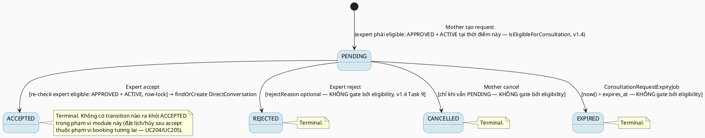

> [!IMPORTANT]
> Historical lifecycle evidence for `UC-EX-08` and `UC-EX-09`; this is not a canonical current TDS. Current code and the canonical code-first specifications override conflicts.

# ENGINEERING DOCUMENTATION STANDARD (EDS) v2.0
# Expert Consultation Requests — Technical Design Specification

| Field | Value |
|-------|-------|
| **Document ID** | `CB-CONREQ-IMP-001` |
| **Version** | `1.7` |
| **Date** | `2026-07-16` |
| **Status** | `Approved` |
| **Document Owner** | `User` |
| **Author** | `AI Agent (Technical Architect)` |
| **Reviewed by** | `User — approved in implementation handoff prompt (2026-07-16)` |
| **DPO Sign-off** | `[ ] Pending` *(module carries Sensitive-PII: consultation topic/description text can reveal health context)* |
| **Approved by** | `User (2026-07-16)` |
| **Last Review** | `2026-07-16` |
| **Based on EDS** | `v2.0` |

---

## CHANGELOG

> **Policy 4.4 — Immutable History:** Không bao giờ xóa thông tin cũ. Mọi thay đổi phải ghi vào bảng này.

| Ngày | Người thực hiện | Nội dung thay đổi |
|------|-----------------|-------------------|
| 2026-07-16 | AI Agent — Technical Architect | v1.0 — Khởi tạo TDS sau audit toàn bộ codebase (graph + code thật, không giả định). Phát hiện chính: (1) endpoint mobile đang gọi `GET /api/v1/consultations/requests` 404 — root cause là gói `consultation/` chỉ có `.gitkeep`, không có controller/service/DTO nào; khi lỗi, `ExpertHomeService` (mobile) âm thầm hiển thị dữ liệu giả (`consultationCount: 3`, tên mẹ bịa) như thật. (2) Tab EXPERT "Yêu cầu tư vấn" thực chất là `ExpertQuestionQueueScreen` (Community Q&A bị đổi nhãn nhầm ở commit `fbbdfea1`), không liên quan consultation request. (3) `consultation_bookings` (V1 L876-896) là booking **đã thanh toán + đã lên lịch** (6 cột NOT NULL giá/lịch, default `PENDING_PAYMENT`), không phù hợp làm request nhẹ; entity Java hiện chỉ map 7/19 cột và không thể insert. (4) Đã tồn tại 6 TDS Draft cũ (UC75, UC93, UC143, UC160, UC202, UC203, UC204, UC205, UC238) chưa được approve, trong đó UC75/UC202 tự bịa bảng `consultations`/enum `consultation_status` không tồn tại thật; UC143 (Expert accept/reject, đối tượng gần nhất) dùng đúng schema thật nhưng lặp lại bug literal `'VERIFIED'` thay vì `'APPROVED'` (6+ chỗ), không có DB-level concurrency guard, không có trường lý do reject, không nối `ConsultationNotificationService`/`DirectConversation` đã có sẵn; UC160 tự nhận `Implemented` nhưng Test-Spec riêng vẫn RED — mâu thuẫn nội bộ. `02_Requirements/BusinessRules/` và `RequirementTraceabilityMatrix/` rỗng hoàn toàn (chỉ `.gitkeep`) — không có business rule nào quy định bắt buộc lý do reject, cửa sổ hủy, hay thời hạn expiry; các con số trong TDS này là **đề xuất mặc định (Open)**, không phải rule đã duyệt. (5) Ba quyết định kiến trúc đã được User xác nhận qua AskUserQuestion 2026-07-16: (A) bảng mới `consultation_requests` thay vì mở rộng `consultation_bookings`; (B) tab "Yêu cầu tư vấn" tách 2 segment `Tư vấn`/`Cộng đồng` trong cùng slot bottom-nav; (C) accept chỉ tạo/liên kết `DirectConversation`, không tạo `consultation_bookings` placeholder. Tài liệu này thiết kế theo đúng 3 quyết định trên, tái dùng nguyên trạng pattern `DirectConversationWriter` (ON CONFLICT DO NOTHING), `DirectConversationPolicyImpl.assertExpertVerified` (literal đúng là `APPROVED`), và pattern outbox `DirectMessageNotificationServiceImpl`/`NotificationRecordWriter`/`DirectMessageNotificationOutboxJob` (đã Approved + Implemented trong `MotherExpertDiscoveryInbox`, đáng tin cậy hơn `ConsultationNotificationService` cũ — service cũ vẫn giữ nguyên, không đụng tới, vì thuộc domain booking khác). |
| 2026-07-16 | AI Agent — Technical Architect | v1.1 — **Self-review correction (trước khi trình User approve)**, phát hiện qua second-pass review: (1) §6.2 sequence diagram vẽ sai thứ tự `tryTransition` trước `findOrCreate` — không khả thi vì `tryTransition(..., directConversationId)` nhận conversationId làm input, không có method nào set nó sau; sửa lại đúng thứ tự `findOrCreate` → lấy `conversationId` → `tryTransition`; bổ sung ghi chú: nếu `tryTransition` thua race (đã bị cancel/expire), `DirectConversation` vừa tạo/tìm thấy vẫn giữ nguyên (không nguy hại — dedup theo `uq_direct_conversations_pair`, idempotent) — đúng như `CONREQ-TC-INT-005` đã đặc tả. (2) `expirePending` bulk `UPDATE` (v1.0) vi phạm trực tiếp `chk_consultation_requests_responded_fields` (yêu cầu `responded_at NOT NULL` cho mọi row non-PENDING — bulk statement không có nhánh per-row để set) và không thể publish `REQUEST_EXPIRED` per-request (§7.1 yêu cầu event riêng từng request); sửa ADR-CONREQ-008 + §5.1/§8.2 sang per-row: `findExpiredIds` rồi gọi `tryTransition` từng id, publish event từng lần thành công; cập nhật `CONREQ-TC-019`/`CONREQ-TC-INT-006` (Test-Spec) theo đúng thiết kế mới, có test skip-on-race cho trường hợp 1 id vừa bị accept/cancel bởi thread khác. (3) Bổ sung assertion "publish domain event" còn thiếu cho `reject`/`cancel` (`CONREQ-TC-014`/`CONREQ-TC-016`) — trước đó chỉ có test cho `accept` (`CONREQ-TC-INT-007`) và cho listener switch (`CONREQ-TC-020`), chưa có test khẳng định service thật sự publish event ở 2 nhánh còn lại. (4) **ADR-CONREQ-007 sửa lỗi thật**: khoá `(user_id, reference_id)` sao chép nguyên từ MESSAGE bị sai hạt (grain) cho domain request — 1 `requestId` phát sinh nhiều event khác nhau tới cùng 1 recipient (vd. expert nhận `REQUEST_CREATED` rồi `REQUEST_CANCELLED` cho cùng request), nên `ON CONFLICT (user_id, reference_id) DO NOTHING` sẽ chặn nhầm sự kiện thứ 2 — expert sẽ không bao giờ được báo hủy. Sửa thành functional partial index `(user_id, reference_id, (metadata->>'eventType'))`, cập nhật §5.2 migration + `ConsultationRequestNotificationWriter` phải luôn ghi `metadata["eventType"]` trước insert. (5) Sửa lệch tên `countPendingByExpertProfileId` (§5.1) vs `countByExpertProfileIdAndStatus` (§8.2) — thống nhất dùng `countByExpertProfileIdAndStatus`. (6) Bổ sung 2 test case còn thiếu vào Test-Spec: `getById` với id không tồn tại (404 `CONREQ-007` — mọi mã lỗi khác đều đã có test, riêng mã này thì chưa), và `unreadSummary()` phía backend (trước đó chỉ có test mobile gọi endpoint, chưa có test backend khẳng định `pendingCount` tính đúng). |
| 2026-07-16 | AI Agent — Technical Architect | v1.2 — **Request Changes response (User review, 12 vấn đề kỹ thuật)** — vẫn giữ `Status: Draft`, chưa viết production code, chưa tạo migration thật. Xác nhận 3 quyết định trước đó là **final** (không còn Open): expiry 48h configurable, reject reason optional max 500 ký tự, cancel chỉ khi PENDING. Áp dụng 12 sửa đổi sau, ground lại bằng code thật (`GlobalExceptionHandler.java`, `ErrorResponse.java`, `DirectChatException.java`, `DirectMessageServiceImpl.java`, `FcmService.java`/`FirebaseFcmServiceImpl.java`, `NotificationRecordResponse.java`, mobile `expert_home_shell.dart`/`fcm_service.dart`/`notification_center_screen.dart`/`notifications_screen.dart`/`notification_detail_screen.dart`, `NotificationRecordWriterConcurrencyIntegrationTest.java`, `OtpRaceConditionIntegrationTest.java`): **(1) Error contract** — retire fictional `{"error":{"code":...}}` shape hoàn toàn; mọi ví dụ API + error-code table dùng đúng `ErrorResponse` flat thật (`success/status/error/message/path/details/timestamp`); validation → `400 VALIDATION_ERROR` (không phải `CONREQ-001`, đã retire); generic exception → `500 INTERNAL_ERROR` thật từ `handleGeneric` (không phải `CONREQ-008`, đã retire); business exception mới `ConsultationRequestException` (mirror `DirectChatException`, cần 1 `@ExceptionHandler` mới trong `GlobalExceptionHandler.java` — additive, không sửa handler khác). **(2) IDOR** — `getById`/`accept`/`reject`/`cancel` không còn phân biệt "không tồn tại" vs "không phải participant" bằng bất kỳ tín hiệu quan sát được nào (status code, error code, hay lookup phụ) — cả 2 nhánh trả **cùng một** `404 CONREQ-007`; retire `CONREQ-003`; thêm ADR-CONREQ-011 (IDOR-safe collapsing) và test regression outsider-vs-nonexistent. **(3) FCM data payload** — xác nhận `FcmService` thật chỉ có 3 method text-only (không có data payload nào, cho **bất kỳ** notification type nào hiện có, kể cả MESSAGE/EMERGENCY_ALERT — mobile's `resolveTapRoute` đọc `message.data['type']` nhưng backend chưa từng gửi field này, đây là gap có sẵn từ trước, không phải feature này tạo ra); thiết kế overload additive `sendWithRetry(token, title, body, data, maxAttempts)` + `FirebaseFcmServiceImpl` thêm `.putAllData(data)`, `ConsultationRequestNotificationServiceImpl` gửi `{"type":"CONSULTATION_REQUEST","requestId":...}` (không bao giờ `topic`/`description`), thêm producer test xác nhận data map. **(4) Hai contract độc lập** — `NotificationRecord.type` (enum `CONSULTATION`) + `referenceType` (`"CONSULTATION_REQUEST"`) phục vụ Notification Center (đọc qua `GET /notifications`, field thật là `type`, không phải `referenceType`, theo `notification_center_screen.dart`/`notifications_screen.dart`/`notification_detail_screen.dart` đã audit) — khác hoàn toàn với FCM push data map's `type` key (chỉ tồn tại tại thời điểm tap, phục vụ `fcm_service.dart`'s `resolveTapRoute`); sửa case mobile Notification Center từ `'CONSULTATION_REQUEST'` (sai — không khớp giá trị `type` thật) sang `'CONSULTATION'`, có ghi chú forward-looking nếu `ConsultationNotificationService` (booking, 0 caller) sau này tái dùng cùng enum. **(5) TOCTOU thật** — KHÔNG nhét predicate expert-approved vào `tryTransition` dùng chung (sẽ chặn nhầm reject/cancel/expire của expert đã bị revoke); tách `tryAccept` riêng — 1 câu `UPDATE ... WHERE status='PENDING' AND EXISTS (SELECT 1 FROM expert_profiles WHERE ... AND verification_status='APPROVED')` (native query), rowsAffected=0 → 1 read phụ chỉ để chọn thông báo lỗi (`CONREQ-004` vs `CONREQ-005`, không phải để quyết định authorization — quyết định đã atomic trong UPDATE); thêm test Testcontainers 2-thread thật (mirror `NotificationRecordWriterConcurrencyIntegrationTest`/`OtpRaceConditionIntegrationTest` — `CountDownLatch` + `ExecutorService`, gọi service thật, không Mockito) race `accept` vs `ExpertProfileServiceImpl.setTrustStatus(SUSPENDED)`. **(6) Idempotency key thật** — **rút lại** rule "tối đa 1 PENDING/cặp" (User chưa approve); xoá `uq_consultation_requests_pending`; thêm cột `client_request_id UUID NOT NULL` + `UNIQUE (requester_user_id, client_request_id)`; service check-then-insert mirror `DirectMessageServiceImpl.sendMessage` y hệt (`findByRequesterUserIdAndClientRequestId` → nếu tồn tại, `assertSameIdempotentPayload` rồi trả về, payload khác → `409 CONREQ-009` mirror `DirectChatException.idempotencyConflict`/`DCC-005`); Mother giờ **được phép** có nhiều request PENDING khác nhau tới cùng 1 expert nếu dùng `clientRequestId` khác nhau. **(7) Transaction rollback đúng thật** — sửa lại tuyên bố sai ở v1.1 ("DirectConversation vẫn giữ nguyên dù tryTransition thua race") — dưới `@Transactional` REQUIRED mặc định, nếu `tryAccept` trả 0 rows và service throw để trả 409, **toàn bộ transaction accept đó rollback, bao gồm cả `findOrCreate` vừa chạy trong cùng transaction** — request thua race không để lại DirectConversation nào (rollback theo đúng nó); chỉ giao dịch của accept **thắng** mới có DirectConversation persist thật (do `findOrCreate` idempotent trên `uq_direct_conversations_pair`, nếu 2 tx cùng insert thì tx thắng insert, tx thua rollback theo transaction chính của accept, không tạo dangling row); không dùng `REQUIRES_NEW` để "cứu" narrative cũ. **(8) Actor attribution đúng** — `ConsultationRequestDomainEvent` thêm `actorType: String` (`"USER"` | `"SYSTEM"`), `actorUserId` đổi thành nullable; `REQUEST_EXPIRED` dùng `actorUserId=null, actorType=SYSTEM` (không impersonate `requesterUserId` như v1.1) — `audit_logs.actor_user_id` đã nullable sẵn (V1 schema), schema-legal. **(9) Flutter test đúng widget** — xác nhận `expert_home_shell.dart:86` dùng Material 3 `NavigationBar` thật, không phải `BottomNavigationBar`; `CONREQ-FL-09` phải `find.byType(NavigationBar)`. **(10) Counterpart field role-correct** — `ConsultationRequestResponse` đổi `expertDisplayName`/`expertAvatarUrl` (chỉ đúng cho Mother) thành `counterpartDisplayName`/`counterpartAvatarUrl` resolved theo role người xem (mirror `ConsultationRequestSummaryResponse` đã đúng sẵn), mapper batch-resolve (mirror `ExpertProfileServiceImpl.getPublicDirectory`'s `findAllById` pattern, không N+1) cho list, single lookup (mirror `resolveUserInfo`) cho detail; test cho cả 2 role. **(11) Rename unread→pending** — `ConsultationRequestUnreadSummaryResponse` → `ConsultationRequestPendingSummaryResponse`; endpoint `/unread-summary` → `/pending-summary`; field `pendingCount` giữ nguyên (đã đúng tên sẵn) — không thêm read-cursor/read-tracking infra mới. **(12) Window validation + migration re-check** — `chk_consultation_requests_window` sửa từ "cho phép 1 phía null" (bug) sang both-null-or-both-present bắt buộc + `end > start`; thêm Bean Validation cross-field validator phía DTO khớp đúng rule DB; ghi rõ lại "phải re-verify migration version mới nhất tại thời điểm implement thật" (không giả định `V20260716010800` mãi mãi là migration cuối). Re-run RG-1..6 + CG-1..9 (§ cuối tài liệu), mapping report 12 vấn đề → section/test case gửi kèm phản hồi User. |
| 2026-07-16 | AI Agent — Technical Architect | v1.3 — **Request Changes vòng 2 (User review v1.2, 4 lỗi thiết kế bắt buộc)** — vẫn `Status: Draft`, chưa viết production code, chưa tạo/chạy migration thật. **(1) `tryAccept`/EXISTS chưa đóng hoàn toàn race revoke-accept — sửa bằng row-lock thật:** audit sâu hơn phát hiện `ExpertProfileServiceImpl.setTrustStatus` (giả định sai của v1.2 là "revoke workflow") thực ra chỉ mutate field `trustStatus` (enum riêng: `ACTIVE/SUSPENDED/REVOKED`), KHÔNG BAO GIỜ đụng `verificationStatus` — field DUY NHẤT mà mọi check "expert hợp lệ" đọc (`ConsultationRequestPolicy`, `DirectConversationPolicyImpl` — pattern gốc được mirror). Audit repo-wide xác nhận: method DUY NHẤT có thể đổi `verificationStatus` của 1 expert đã `APPROVED` là `ExpertProfileServiceImpl.rejectExpert` (đổi sang `REJECTED`, không có guard chặn gọi trên profile đã approved); `approveExpert` cũng ghi field này; KHÔNG có job/scheduled task nào tự động suspend/expire `verificationStatus`. Kết luận: race thật là `accept()` vs `approveExpert`/`rejectExpert` — không phải `setTrustStatus`. Về kỹ thuật, `EXISTS` trong 1 câu `UPDATE` (v1.2) không tự khoá row `expert_profiles` được tham chiếu nên 2 transaction độc lập vẫn interleave sai được dưới READ COMMITTED. **Sửa: retire hoàn toàn `tryAccept`**, quay lại 1 `tryTransition` chung cho cả 4 transition (thêm lại `directConversationId` làm param); thêm **cross-domain change bắt buộc** — `ExpertProfileRepository.findByIdForUpdate` (`@Lock(PESSIMISTIC_WRITE)`, mới, additive) + `ExpertProfileServiceImpl.approveExpert`/`rejectExpert` đổi `findById`→`findByIdForUpdate` (1 dòng/method, `setTrustStatus`/`renewVerification` không đổi); `ConsultationRequestServiceImpl.accept()` lock+check expert TRƯỚC `findOrCreate`/`tryTransition`; lock ordering cố định (luôn lock `expert_profiles` trước `consultation_requests`, không cycle, không deadlock). `CONREQ-004`/`CONREQ-005` không còn ambiguous (check APPROVED luôn xảy ra trước, nên `tryTransition` trả 0 giờ chỉ có 1 nghĩa). `CONREQ-TC-INT-010` viết lại thành 2 scenario ordering-controlled bằng latch thật (revoke-thắng-lock-trước / accept-thắng-lock-trước), dùng `rejectExpert` thật (không phải `setTrustStatus`), không dựa vào xác suất. **(2) ADR normative content vẫn giữ thiết kế v1.1/v1.2 mâu thuẫn:** phát hiện qua review — v1.2 chỉ thêm ghi chú bổ sung ở class diagram/sequence diagram/§15 nhưng KHÔNG rewrite phần "Bối cảnh/Phương án/Quyết định/Hệ quả" của chính ADR-CONREQ-003/004/005, nên các ADR đó vẫn nói "re-check trước UPDATE là đủ" (003), "partial unique index + trả về PENDING đã có" (004 — đúng rule bị User bác bỏ), "accept dùng chung tryTransition không phân biệt" (005 cũ). **Sửa: rewrite toàn bộ "Quyết định" active của cả 3 ADR** theo đúng thiết kế hiện hành (clientRequestId cho 004; row-lock cho 005; tryTransition chung cho 003), giữ Phương án cũ trong bảng "Các phương án đã xem xét" với nhãn **"Rejected"/"Rejected after review v1.2"/"Rejected after review v1.3"** kèm lý do kỹ thuật cụ thể — không xoá lịch sử, chỉ đánh dấu superseded. Quét toàn tài liệu các cụm cũ (`uq_consultation_requests_pending`, "1 PENDING", `tryAccept`, `assertExpertStillApproved`) — mọi kết quả còn lại giờ chỉ là lịch sử/rejected-alternative/warning chống regression, không còn câu normative nào áp dụng thiết kế cũ (xác nhận qua `grep` sweep, kết quả trong báo cáo gửi kèm). **(3) HTTP 201/200 contract không khả thi qua service interface:** `IConsultationRequestService.create()` (v1.2) trả bare `ConsultationRequestResponse`, làm mất `ConsultationRequestWriter.InsertResult.created` — Controller không có cách nào phân biệt "vừa tạo" (201) với "idempotent retry" (200) mà không tự query repository (vi phạm layering + race + lặp business logic). **Sửa:** thêm `CreateConsultationRequestResult(ConsultationRequestResponse response, boolean created)`; `create()` trả record này; Controller đọc `result.created()` để chọn `ResponseEntity.status(CREATED/OK)`. Cập nhật class diagram, §6.1 sequence diagram, §8.1 interface, §9 API examples, §11 implementation steps, §15 C14/AP-AI-011. **(4) `CONREQ-TC-INT-011` chưa test rollback thật của transaction thua:** test v1.2 chỉ gọi accept 2 lần tuần tự khi DirectConversation ĐÃ TỒN TẠI — chỉ chứng minh `findOrCreate` idempotent, không chứng minh 1 row DirectConversation MỚI được insert trong transaction thua sẽ rollback. **Sửa:** viết lại thành race thật có ordering kiểm soát — Thread Accept gọi `findOrCreate` (insert DirectConversation mới, CHƯA commit) rồi bị pause bởi 1 `@SpyBean`/`Mockito.spy` wrapping bean thật của `IDirectConversationService` (dùng `doAnswer` gọi `callRealMethod()` rồi chờ latch trước khi return) — trong lúc đó Thread Cancel commit request thành `CANCELLED`; Accept resume, `tryTransition` trả 0, throw `CONREQ-005`, TOÀN BỘ transaction Accept rollback. Assertions: request cuối = `CANCELLED`; `direct_conversation_id` vẫn null; KHÔNG có row `direct_conversations` mới cho cặp đó; không publish `REQUEST_ACCEPTED`/audit accept; chỉ event/audit `CANCELLED` tồn tại; Accept thread nhận đúng `CONREQ-005`. Xác nhận transaction propagation: `accept()` là `@Transactional` (REQUIRED, mặc định class-level), `findOrCreate` cũng REQUIRED (không `REQUIRES_NEW`), `ConsultationRequestException` là unchecked (`RuntimeException` subclass qua `DirectChatException`-style factory) nên Spring tự rollback theo mặc định — không cần `rollbackFor` tường minh. **Xác nhận thêm sau self-review:** đọc trực tiếp `DirectConversationServiceImpl.java` dòng 89-90 xác nhận `findOrCreate` có `@Transactional` (không tham số → REQUIRED mặc định, không `REQUIRES_NEW`) — khớp đúng tuyên bố trên bằng code thật, không chỉ suy luận từ báo cáo subagent. **Bổ sung 2 câu hỏi mở cần User xác nhận trước khi Approve** (thêm subsection "⚠️ Câu hỏi mở" cuối ADR-CONREQ-005, xem chi tiết tại đó): (a) "revoke" trong yêu cầu round 2 có đúng là `rejectExpert`/`approveExpert` hay còn 1 hành động suspend-verification riêng chưa tồn tại trong code; (b) thiết kế hiện tại (mirror `DirectConversationPolicyImpl`) chỉ check `verificationStatus`, không bao giờ check `trustStatus` — nghĩa là expert bị `setTrustStatus(SUSPENDED/REVOKED)` (UC71) nhưng `verificationStatus` vẫn `APPROVED` **vẫn nhận/accept được** request mới; đây là hành vi nhất quán với code hiện tại (không phải bug mới) nhưng là quyết định an toàn cần User duyệt tường minh, không phải thứ agent tự quyết. ADR-CONREQ-005 giữ `Status: Proposed` (chưa `Accepted`) cho tới khi có câu trả lời. Re-run RG-1..6 + CG-1..9, mapping report 4 vấn đề → section/test case, lock ordering cuối cùng, transaction boundary cuối cùng, test count mới, và 2 câu hỏi mở trên gửi kèm phản hồi User. |
| 2026-07-16 | AI Agent — Technical Architect | v1.4 — **Request Changes vòng 3 (User trả lời chính thức 2 câu hỏi mở của v1.3 + 10 nhiệm vụ)** — vẫn `Status: Draft`, chưa viết production code, chưa tạo/chạy migration thật, chưa commit/push. **Quyết định product/safety đã chốt của User** (đóng 2 câu hỏi mở v1.3): (1) "revoke" không chỉ có `rejectExpert` — MỌI workflow đổi khả năng expert nhận tư vấn (`approveExpert`, `rejectExpert`, `setTrustStatus`, và bất kỳ workflow tương lai nào) thuộc eligibility synchronization protocol; `renewVerification` xác nhận chưa bắt buộc tham gia ở scope hiện tại (chỉ chuyển ineligible→PENDING), nhưng phải dùng cùng protocol nếu hành vi đó đổi. (2) Eligibility PHẢI kiểm tra CẢ `verificationStatus` VÀ `trustStatus` — mirror nguyên trạng hành vi bỏ-qua-trust của `DirectConversationPolicyImpl` cũ là **gap an toàn cần sửa**, không phải hành vi chấp nhận được. **Predicate hợp nhất mới, DUY NHẤT trong toàn hệ thống:** `ExpertProfile.isEligibleForConsultation()` = `verificationStatus == APPROVED && trustStatus == ACTIVE` (`trust_status` xác nhận `NOT NULL DEFAULT 'ACTIVE'` + `CHECK` qua audit trực tiếp `V20260710000000__add_trust_status_to_expert_profiles.sql` — không có case null cần xử lý, và dù có, so sánh Java tự fail-closed). **Nhiệm vụ 1 (ADR-CONREQ-005 → `Accepted`)** — viết lại toàn bộ phần câu hỏi mở thành quyết định chính thức; đổi tên `ConsultationRequestPolicy.assertExpertRequestable` → `assertExpertEligibleForConsultation`; cập nhật BR-CONREQ-001/005 (+ thêm BR-CONREQ-011/012/013 mới), traceability matrix, class diagram (§5.1 — thêm class `ExpertProfile` với method mới, đổi tên method trong `ConsultationRequestPolicy`/`IDirectConversationPolicy`), state machine (§6.3 — ghi rõ invariant 5), sequence diagram (§6.1/6.2 — mọi bước "check verificationStatus==APPROVED" đổi thành "check isEligibleForConsultation()"), interface (§8.1 javadocs `create`/`accept`), error table (§10 — message CONREQ-002/004 genericize theo Task 4, không tiết lộ verification-vs-trust), authorization matrix (§14), anti-pattern table (§15.4 — AP-AI-012/013 mới). **Nhiệm vụ 2 (locking protocol mở rộng)** — `ExpertProfileServiceImpl.setTrustStatus` đổi `findById`→`findByIdForUpdate` (cùng lock `approveExpert`/`rejectExpert`); cross-domain change list (§8.3) cập nhật; retire câu "setTrustStatus không tham gia race vì không đổi verificationStatus" (đã supersede — eligibility giờ phụ thuộc cả trustStatus). **Nhiệm vụ 3 (`create`)** — `ConsultationRequestServiceImpl.create` check `isEligibleForConsultation()` (không lock — không có TOCTOU ở create, chỉ snapshot-read); fail → `CONREQ-002`, không insert, không publish event. **Nhiệm vụ 4 (`accept`)** — flow row-lock giữ nguyên (`findByIdForUpdate` trước `findOrCreate`/`tryTransition`), check mở rộng thành `isEligibleForConsultation()`; fail → `CONREQ-004`, request giữ PENDING, zero side effect (không `findOrCreate`, không transition, không event/audit). **Nhiệm vụ 5 (concurrency test mới)** — §6.2 thêm Scenario 3a (setTrustStatus thắng lock trước → accept `CONREQ-004`) và Scenario 3b (accept thắng lock trước → commit ACCEPTED, setTrustStatus sau đó hợp lệ) — cả 2 dùng lock thật, không xác suất; Test-Spec bổ sung `CONREQ-TC-INT-013` (xem Test-Spec CHANGELOG v1.4). **Nhiệm vụ 6 (ADR-CONREQ-012 mới, `Accepted`)** — 4 query `ExpertProfileRepository` (`searchDirectory`/`findVerifiedPublic`/`findVerifiedBySpecialty`/`findApprovedSpecialties`) thêm `trustStatus == ACTIVE`, không cần lock (read-only listing, không TOCTOU cần đóng). **Nhiệm vụ 7 + 8 (ADR-CONREQ-013 mới, `Accepted`, cross-domain `directchat`)** — `IDirectConversationPolicy.assertExpertVerified` đổi tên thành `assertExpertEligibleForConsultation` (blast radius thật chỉ 1 caller — `DirectConversationServiceImpl.findOrCreate:95` — nên đổi tên chính xác, KHÔNG viện cớ "blast radius lớn" để giữ tên cũ gây hiểu nhầm); `assertConversationWritable` giữ tên (không misleading), cả 2 đổi check sang `isEligibleForConsultation()`; `DirectChatException.expertNotApproved()` đổi tên + message thành `expertNotEligibleForConsultation()`/"Expert is not eligible for consultation" (message cũ "Expert is not APPROVED" sẽ sai khi lý do thật là trust); `expertNoLongerApproved()` và `expertUnavailableForWrite()` không đổi (message đã generic sẵn). `assertIsParticipant` **chủ động không đổi** (đọc lịch sử vẫn chỉ cần verification, theo đúng yêu cầu "conversation lịch sử vẫn đọc được"); nhánh `answered` của `ConversationCallServiceImpl.end` **giữ nguyên** ngoại lệ bỏ qua `assertConversationWritable` (ADR-DCC-007 §2, đóng call đã kết nối dù expert mất eligibility). Liệt kê đủ 6 call site của `assertConversationWritable` trong §8.4. **Nhiệm vụ 9 (reject/cancel/expiry không gate)** — xác nhận tường minh (không phải bỏ sót) trong ADR-CONREQ-003 Hệ quả, §6.3 invariant 5, §14 chú thích: 3 transition này KHÔNG check eligibility, để không giữ Mother chờ vô thời hạn khi expert mất điều kiện. **Nhiệm vụ 10 (mobile contract)** — audit xác nhận `ExpertProfileResponse`/`ExpertProfileDetailResponse` chưa expose `trustStatus`; thêm field mới `isConsultationEligible: boolean` (additive) vào cả 2 DTO + mapper; CẢ 2 CTA trên `ExpertPublicProfileScreen` — nút "Trò chuyện" **có sẵn** (sửa nhất quán tối thiểu, cùng file/màn hình) VÀ nút "Yêu cầu tư vấn" **mới** — đổi điều kiện enable sang `isConsultationEligible` (§13.1, ADR-CONREQ-010 bổ sung); directory list (`ExpertDirectoryItem`, mobile) không cần đổi gì — đã tin tưởng hoàn toàn backend filter (ADR-CONREQ-012). §11 Implementation Steps thêm Chặng 2b (mở rộng) + Chặng 2c (directchat, mới); §12 Rollback bổ sung `git checkout` cho toàn bộ file mới bị đụng ở 2 gói cross-domain. Re-run RG-1..6 + CG-1..9 (§ cuối tài liệu Test-Spec), mapping report 10 nhiệm vụ → section/test, danh sách cross-domain files, eligibility predicate cuối, lock ordering cuối, behavior matrix create/accept/reject/chat/read/write/call, test count mới gửi kèm phản hồi User. **Ghi nhận ngoài phạm vi (không sửa vòng này):** `ADR-CONREQ-011` (IDOR, thêm ở v1.2) được tham chiếu xuyên suốt tài liệu nhưng chưa từng có section `### ADR-CONREQ-011` riêng — gap tài liệu có sẵn từ v1.2, phát hiện khi tìm vị trí chèn ADR-CONREQ-012/013, không thuộc 10 nhiệm vụ vòng này nên không tự ý sửa; cờ lại để User quyết định có cần bổ sung không. |
| 2026-07-16 | AI Agent — Technical Architect | v1.5 — **Request Changes vòng chốt (User review v1.4, 3 vấn đề còn lại)** — vẫn `Status: Draft`, chưa viết production code, chưa tạo/chạy migration thật, chưa commit/push. **Vấn đề 1 (DirectChat vẫn TOCTOU với eligibility/trust action):** audit xác nhận v1.4 chỉ mở rộng predicate (`isEligibleForConsultation`) cho `findOrCreate`/`assertConversationWritable` nhưng KHÔNG lock — cả 2 vẫn đọc `ExpertProfile` bằng `findById`/`findByUserId` thường, trong khi `approveExpert`/`rejectExpert`/`setTrustStatus` dùng `findByIdForUpdate`; race thật: DirectChat đọc snapshot cũ APPROVED+ACTIVE → admin lock+commit SUSPENDED/REVOKED → DirectChat vẫn tạo conversation/gửi message/gọi mới bằng snapshot stale. **Sửa:** thêm `ExpertProfileRepository.findByUserIdForUpdate(UUID userId)` (`@Lock(PESSIMISTIC_WRITE)`, khóa theo `user_id` UNIQUE — cần vì `DirectConversation`/`ConversationCall` chỉ có `expertUserId`, không có `expertProfileId`); đổi SIGNATURE `assertConversationWritable` từ `(DirectConversation)` sang `(ExpertProfile lockedExpertProfile)` — policy không còn tự query, Service chịu trách nhiệm lock; `findOrCreate` đổi `findById`→`findByIdForUpdate`; `sendMessage`/`initiateCall`/`markRinging`/`answer`/`decline`/`end`(nhánh cancellable) đều thêm bước `findByUserIdForUpdate` + `assertConversationWritable(lockedExpert)` TRƯỚC mọi ghi; `DirectMessageServiceImpl`/`ConversationCallServiceImpl` cần thêm constructor dependency `ExpertProfileRepository` (hiện chưa có). `markRead` và nhánh `answered` của `end` **giữ nguyên, không lock** (không phải interaction mới — exemption ADR-DCC-007 §2 giữ nguyên). Retire chính thức câu tuyên bố sai của v1.4 trong Hệ quả ADR-CONREQ-013 ("không có lock mới cần thêm... không phải TOCTOU cần đóng bằng lock") — xác nhận đây chính là TOCTOU cùng loại với `accept()`. **Xác nhận KHÔNG retire** kết luận "không cần lock" của ADR-CONREQ-012 (directory/verified-list) — đây là truy vấn liệt kê read-only, không tạo interaction, lý do khác hẳn và vẫn đúng. Ghi rõ lock ordering thật (`expert_profiles` là tài nguyên DUY NHẤT bị lock pessimistic; thứ tự ghi thường giữa `direct_conversations`/`direct_messages`/`conversation_calls` với nhau — vd. `sendMessage` insert message TRƯỚC touchActivity — không phải mối lo lock-ordering vì không bảng nào trong 2 bảng đó từng bị lock pessimistic bởi transaction khác); ghi rõ `accept()`→`findOrCreate` khóa lại CÙNG row là re-entrant, an toàn, không tự deadlock; ghi nhận công khai (không sửa, ngoài phạm vi vòng này) rằng `DirectConversationServiceImpl`'s `expertAvailable`/`isExpertAvailable` (field hiển thị, không phải gate) vẫn chỉ tính bằng `verificationStatus` — cùng loại thiếu sót đã sửa cho mobile CTA nhưng KHÔNG nằm trong Vấn đề 1/2/3 nêu tên, nên không tự ý mở rộng sửa. Cập nhật ADR-CONREQ-013 (rewrite lớn, thêm Behavior Matrix đầy đủ), §6.2.1 (sequence diagram mới, 3 scenario ordering-controlled: admin-thắng-lock-trước/interaction-thắng-lock-trước/answered-call-cleanup-exemption), §5.1 class diagram, §8.3/§8.4 (interface + service pseudocode đầy đủ), §11 Chặng 2c (mở rộng), §12 rollback (2 file service mới), §14 authorization matrix, §15 C17/C18 + AP-AI-014/015. **Vấn đề 2 (ADR-CONREQ-008/009 còn Open dù đã chốt sản phẩm):** cả 2 ADR đổi `Status: Proposed` → `Accepted`, `Deciders: User/Product decision`; xóa mọi câu "Ghi rõ Open"/"cần Product xác nhận"/"chờ Product xác nhận" khỏi phần Quyết định đang active (giữ nguyên trong Bối cảnh dưới dạng lịch sử "trước đây được ghi nhận là..."); ADR-CONREQ-008's Quyết định giờ ghi rõ `expiresAt = createdAt + configured expiry duration, default = 48 hours`, nhấn mạnh giá trị nằm trong config (`carebridge.consultation-request.expiry-hours`) không hardcode rải rác, test phải đọc cùng config source (constructor-inject cùng field, không dùng hằng số độc lập); ADR-CONREQ-009's Quyết định giữ nguyên nội dung (reject reason optional max 500; cancel chỉ Mother owner + chỉ khi PENDING) nhưng bỏ khung "mặc định hiện tại"/"Open". CHANGELOG v1.0-v1.4 giữ nguyên nội dung lịch sử "Open"/"đề xuất mặc định" không đổi (Policy 4.4). **Vấn đề 3 (Contract "đọc lịch sử vẫn được" mô tả quá rộng):** audit trực tiếp `DirectConversationPolicyImpl.assertIsParticipant` xác nhận hành vi chính xác: Mother participant luôn được đọc/mark-read KHÔNG kiểm gì về Expert; Expert participant chỉ bị chặn khi `verificationStatus != APPROVED` (ném `expertNoLongerApproved()`, mã DCC hiện có) — KHÔNG BAO GIỜ đọc `trustStatus`, nên Expert `APPROVED`+`SUSPENDED`/`REVOKED` vẫn đọc/mark-read được, đúng chủ đích (không phải bỏ sót); `markRead` dùng chính `assertIsParticipant` (KHÔNG gọi `assertConversationWritable`, comment sẵn có xác nhận). Thêm bảng Behavior Matrix đầy đủ theo TỪNG actor/method thật vào ADR-CONREQ-013, thay thế mọi câu tổng quát "lịch sử luôn đọc được cho cả hai bên"; ghi rõ 3 policy method (`assertIsParticipant`=đọc, `assertConversationWritable`/`assertExpertEligibleForConsultation`=ghi tương tác mới dưới lock, không policy nào khác cho cleanup `end`-answered) không bị trộn thành 1 khái niệm. Test-Spec bổ sung integration test đầy đủ chứng minh matrix này (xem Test-Spec CHANGELOG v1.5). **SAU KHI SỬA:** re-run RG-1..6 + CG-1..9, mapping report 3 vấn đề → section/test, lock protocol cuối cho `consultation`+`directchat`, behavior matrix read/write/call/cleanup, ADR nào chuyển `Accepted`, test count mới, kết quả grep cleanup gửi kèm phản hồi User. |
| 2026-07-16 | AI Agent — Technical Architect | v1.6 — **Phase 1 Audit + Spec review, sửa đúng 2 vấn đề còn lại của v1.5; vẫn `Status: Draft`, không viết production code/migration, không commit/push.** **Vấn đề 1 — create TOCTOU:** retire khỏi nội dung normative kết luận sai "`create` snapshot-read/không cần lock/không có TOCTOU". Chốt contract idempotency ổn định: lookup `(requesterUserId, clientRequestId)` trước; nếu resource đã tồn tại và payload khớp thì trả resource cũ với `created=false`/HTTP 200 kể cả Expert vừa mất eligibility, không lock Expert và không phát lại side effect. Chỉ khi key chưa tồn tại mới `findByIdForUpdate(expertProfileId)`, re-check idempotency key sau khi lấy lock, rồi kiểm `isEligibleForConsultation()` trước insert; Expert ineligible → `CONREQ-002`, zero row/event/notification/audit. Bổ sung lock protocol duy nhất `expert_profiles → consultation_requests/direct_conversations → direct_messages/conversation_calls`, cập nhật ADR-CONREQ-004/005/013, BR-CONREQ-001, class/create sequence, service contract/pseudocode, implementation steps, constraints/anti-patterns. Test-Spec thêm `CONREQ-TC-INT-022/023/024` với Testcontainers + transaction thật + latch/barrier điều khiển ordering: moderation giữ lock trước; create giữ lock trước; retry sau trust loss trả cùng id HTTP 200 và không side effect lần hai. **Vấn đề 2 — INT-020 oracle:** viết lại hoàn toàn bằng `TransactionTemplate`, `ExecutorService/Future`, các transaction/thread độc lập và latch `trustLockAcquired`/`releaseTrust`/`endCompleted` hoặc `cancelLockAttempted`; không so milliseconds, không benchmark/sleep, timeout chỉ là safety guard. Test A chứng minh answered cleanup hoàn thành và chuyển `ENDED` trong khi trust lock vẫn đang được giữ; Test B chứng minh cancellable branch thật sự chờ lock, sau trust commit ineligible thì bị `DCC-010`, không transition/event/audit. Tổng test tăng `81→84` (`39 TC + 4 SEC + 24 INT + 17 FL`). ADR-CONREQ-008/009 giữ `Accepted`; expiry vẫn default 48h configurable; reject optional max 500; cancel owner+PENDING only. |
| 2026-07-16 | User / AI Agent — Amelia (Dev Agent) | v1.6 approval gate — User explicitly approved the finalized v1.6 design for implementation. Status changed from `Draft` to `Approved`; ADR-CONREQ-001/002/003/006/007/010 changed from `Proposed` to `Accepted`. DPO sign-off remains pending and all PDPA/privacy constraints remain mandatory. |
| 2026-07-16 | AI Agent — Amelia (Dev Agent) | v1.7 — **Post-implementation truthful sync; Status remains `Approved`.** Implemented the additive `consultation_requests` domain, idempotent create contract, lifecycle transitions, expiry, notification outbox/FCM data contract, Expert eligibility and directory filtering, DirectChat write-path locking/read exemptions, and the Mother/Expert mobile flows. Actual migration filenames are `V20260716200500__create_consultation_requests.sql` and `V20260716200501__add_notification_records_consultation_request_idempotency.sql`; both migrated successfully on a clean PostgreSQL validation database, but were not applied to the shared Supabase database. Verification evidence: scoped backend feature suite `111/111` passed; backend package build passed; complete Flutter suite `89/89` passed, including `17/17` feature-focused tests; Dart formatting was clean. Full repository `./mvnw test` remains red because of unrelated baseline failures (community JPQL timestamp mismatch, missing unrelated Zego property, and existing File/Reminder failures). `flutter analyze` produced no diagnostics because the Dart analysis server crashed with `FormatException: Unexpected end of input`; therefore static-analysis and coverage gates are not claimed. DPO sign-off remains pending. No commit/push was made. |

---

## MỤC LỤC

1. [Tổng quan Module](#1-tổng-quan-module)
2. [Ma trận Truy vết (Traceability Matrix)](#2-ma-trận-truy-vết-traceability-matrix)
3. [Architecture Decision Records (ADR)](#3-architecture-decision-records-adr)
4. [Non-Functional Requirements & SLA](#4-non-functional-requirements--sla)
5. [Static Modeling (Mô hình Tĩnh)](#5-static-modeling-mô-hình-tĩnh)
6. [Dynamic Modeling (Mô hình Động)](#6-dynamic-modeling-mô-hình-động)
7. [Domain Event Catalog](#7-domain-event-catalog)
8. [Interface Specification](#8-interface-specification-đặc-tả-giao-diện)
9. [API Specification](#9-api-specification)
10. [Bảng mã lỗi (Error Codes)](#10-bảng-mã-lỗi-error-codes)
11. [Quy trình Triển khai (Step-by-Step)](#11-quy-trình-triển-khai-step-by-step)
12. [Rollback & Incident Runbook](#12-rollback--incident-runbook)
13. [Mobile Design (IA + Screen Contracts)](#13-mobile-design-ia--screen-contracts)
14. [Bảng tổng hợp phân quyền (Authorization Matrix)](#14-bảng-tổng-hợp-phân-quyền-authorization-matrix)
15. [AI Prompt Constraints (CASE 2.0)](#15-ai-prompt-constraints-case-20)
16. [Phụ lục](#16-phụ-lục)

---

## 1. Tổng quan Module

| Field | Value |
|-------|-------|
| **Module Name** | `Expert Consultation Requests` |
| **Bounded Context** | `consultation` (new — reuses existing package skeleton: `controller/`, `service/`, `dto/`, `mapper/`, `policy/` currently hold only `.gitkeep`); extends `notification` (new sibling notification service, mirrors `directmessage`); reuses `directchat` (`IDirectConversationService.findOrCreate`, read-only) |
| **Data Classification** | `Sensitive-PII` (topic/description text may reveal health context; counterpart names) |
| **Compliance Scope** | `PDPA` |
| **Upstream Dependencies** | `expert.entity.ExpertProfile` + `expert.verificationstatus.VerificationStatus` (read-only, gate on `APPROVED`), `directchat.service.IDirectConversationService.findOrCreate` (read+write, called on ACCEPT), `security.entity.User` (read-only, display name), `notification.entity.NotificationRecord`/`NotificationType.CONSULTATION` (existing enum value, reused), `notification.service.FcmService` (existing) |
| **Downstream Consumers** | Mobile MOTHER app (new CTA on expert profile, request list/detail), Mobile EXPERT app (new "Tư vấn" segment inside "Yêu cầu tư vấn" tab, dashboard summary card repoint), future booking/payment feature (UC75/UC76/UC204/UC205 — remain `Draft`, unimplemented; an `ACCEPTED` request is the natural upstream trigger for that future work, but this module does **not** create any `consultation_bookings` row itself — see ADR-CONREQ-002) |

**Mô tả:** Xây dựng toàn bộ vòng đời "yêu cầu tư vấn" giữa MOTHER và EXPERT — tạo, xem, chấp nhận, từ chối, hủy, hết hạn — hiện **hoàn toàn không tồn tại** trong code (gói `consultation/` rỗng, endpoint mobile đang gọi 404). Phạm vi: (a) bảng mới `consultation_requests` tách biệt khỏi `consultation_bookings` (không đụng schema/entity/repository/test hiện có của `consultation_bookings`/`ConsultationBooking`/`ShareSummaryServiceImpl` — nguyên trạng); (b) controller/service/policy/mapper/DTO mới trong gói `consultation/` có sẵn; (c) notification mới theo pattern outbox đã kiểm chứng (`DirectMessageNotificationServiceImpl`), không sửa `ConsultationNotificationService` cũ (khác domain — booking, không phải request); (d) mobile: sửa `ExpertHomeService` bỏ endpoint 404 + dữ liệu giả, thêm segment "Tư vấn" trong tab "Yêu cầu tư vấn", thêm CTA "Yêu cầu tư vấn" trên hồ sơ chuyên gia (Mother), thêm case notification mới trong `fcm_service.dart`.

**Không đổi (giữ nguyên nguyên trạng — ngoài phạm vi):** `consultation_bookings`/`ConsultationBooking`/`ConsultationBookingRepository`/`ShareSummaryServiceImpl` (UC44); `ConsultationSession`/`ConsultationSessionRepository` (UC-113 reporting); `ConsultationNotificationService`/`ConsultationNotificationEventType`/`ConsultationNotificationPayload` (thuộc domain booking, chưa có caller, để dành cho UC75/UC160 tương lai); `ExpertAvailability` (không tiêu thụ slot — "khung thời gian mong muốn" trong request này là free-text time-range, không khoá vào `expert_availability`); mọi TDS Draft cũ (UC75, UC93, UC143, UC160, UC202-205, UC238) — không sửa file của các UC đó; tài liệu này **thay thế phạm vi "tạo/accept/reject/notify request"** của các UC đó cho MVP hiện tại, phần "đặt lịch thật + thanh toán" (UC75/UC76/UC204/UC205) vẫn để dành cho công việc tương lai riêng; `ExpertQuestionQueueScreen`/Community Q&A logic (chỉ thay đổi cách nó được lồng vào tab, không đổi hành vi Q&A); 2 no-op button (`Vào phòng`, `Xem tất cả`, `Phản hồi`) và bug nested-bottom-nav trên đường dẫn `_openQuestions()` mặc định của `expert_app_home_screen.dart` — đã audit, gắn cờ liên quan nhưng **ngoài phạm vi**, đề xuất ticket riêng.

---

## 2. Ma trận Truy vết (Traceability Matrix)

| Requirement ID | Loại | Mô tả yêu cầu | Thành phần Code | Compliance Target | ADR liên quan |
|---|---|---|---|---|---|
| BR-CONREQ-001 | Business Rule | Mother chỉ tạo request cho chính mình. Với **key mới**, service phải khóa `ExpertProfile` bằng `findByIdForUpdate`, rồi chỉ insert khi `isEligibleForConsultation()` (`verificationStatus == APPROVED && trustStatus == ACTIVE`) còn đúng dưới lock. Retry của resource đã tồn tại không phải quyết định tạo mới và giữ ổn định sau trust loss theo BR-CONREQ-002. | `ConsultationRequestServiceImpl.create`, `ExpertProfileRepository.findByIdForUpdate`, `ConsultationRequestPolicy.assertExpertEligibleForConsultation` | RBAC / Healthcare safety | ADR-CONREQ-004, ADR-CONREQ-005 |
| BR-CONREQ-002 | Business Rule | Double-submit an toàn qua idempotency key do client sinh: cùng `clientRequestId` + cùng payload → trả resource đã tạo trước đó với `created=false`/HTTP 200, kể cả Expert hiện đã mất eligibility; không insert/publish/notify/audit lần hai. Cùng key + payload khác → `409 CONREQ-009`. `clientRequestId` khác → quyết định tạo mới và phải qua eligibility row-lock, **kể cả tới cùng 1 expert**. | `ConsultationRequestWriter.insertIfAbsent`, `consultation_requests_client_request_id_key`, `ConsultationRequestRepository.findByRequesterUserIdAndClientRequestId` | Data integrity | ADR-CONREQ-004, ADR-CONREQ-005 |
| BR-CONREQ-003 | Business Rule | Chỉ expert được gán mới xem/accept/reject; mother chỉ xem/hủy request của chính mình; không tồn tại và không-phải-participant phải **không thể phân biệt được** từ bên ngoài (IDOR) | `ConsultationRequestPolicy.assertCanView/assertCanRespond/assertCanCancel` (throw cùng `CONREQ-007`) | RBAC / IDOR | ADR-CONREQ-011 |
| BR-CONREQ-004 | Business Rule | Accept/reject/cancel/expire đều dùng CHUNG 1 method DB-atomic conditional update (`tryTransition`, `WHERE status='PENDING'`) — không dùng `@Version`, không đọc-rồi-ghi cho chính transition này | `ConsultationRequestRepository.tryTransition(...)` | Data integrity | ADR-CONREQ-003 |
| BR-CONREQ-005 | Business Rule | Expert phải còn **eligible** (`APPROVED` + `ACTIVE`) tại thời điểm accept — đóng bằng row-lock (`SELECT ... FOR UPDATE`) trên `expert_profiles`, đồng bộ với `approveExpert`/`rejectExpert`/`setTrustStatus` (cross-domain, v1.4 mở rộng thêm `setTrustStatus`), KHÔNG phải bằng predicate `EXISTS` gộp vào câu UPDATE của `consultation_requests` | `ExpertProfileRepository.findByIdForUpdate` (gói `expert`), `ConsultationRequestServiceImpl.accept()` | RBAC / Healthcare safety | ADR-CONREQ-005 |
| BR-CONREQ-006 | Business Rule | Accept chỉ mở/liên kết `DirectConversation`, không tạo `consultation_bookings` row; nếu accept thua race, `DirectConversation` vừa tạo trong cùng transaction rollback theo (REQUIRED propagation) | `ConsultationRequestServiceImpl.accept` → `IDirectConversationService.findOrCreate` | Scope boundary | ADR-CONREQ-002 |
| BR-CONREQ-011 | Business Rule (v1.4) | Public directory / danh sách "verified experts" chỉ hiển thị expert **eligible** (`APPROVED` + `ACTIVE`) — không quảng bá expert bị tạm ngưng/thu hồi trust dù verification vẫn `APPROVED` | `ExpertProfileRepository.searchDirectory/findVerifiedPublic/findVerifiedBySpecialty/findApprovedSpecialties` | RBAC / Healthcare safety | ADR-CONREQ-012 |
| BR-CONREQ-012 | Business Rule (v1.4) | Mở `DirectConversation` mới (kể cả ngoài luồng consultation request — đường trực tiếp từ hồ sơ chuyên gia) phải dùng CÙNG predicate eligible như accept, không chỉ verification | `DirectConversationPolicyImpl.assertExpertEligibleForConsultation` (đổi tên từ `assertExpertVerified`), `DirectConversationServiceImpl.findOrCreate` | RBAC / Healthcare safety | ADR-CONREQ-013 |
| BR-CONREQ-013 | Business Rule (v1.4) | Gửi tin nhắn/khởi tạo call mới trong 1 `DirectConversation` đã có bị chặn nếu expert mất eligibility; đọc lịch sử + kết thúc call đã `ANSWERED` vẫn được phép (không đổi ADR-DCC-007 §2) | `DirectConversationPolicyImpl.assertConversationWritable` | RBAC / Healthcare safety | ADR-CONREQ-013 |
| BR-CONREQ-007 | Business Rule | Notification durable + idempotent; lỗi FCM không rollback transaction nghiệp vụ; FCM data payload (`type`/`requestId`) là contract độc lập với `NotificationRecord.type`/`referenceType` dùng cho Notification Center | `ConsultationRequestNotificationServiceImpl`, `ConsultationRequestNotificationWriter`, `ConsultationRequestNotificationListener` (AFTER_COMMIT + @Async), `FcmService.sendWithRetry(..., data, ...)` | PDPA / Reliability | ADR-CONREQ-006, ADR-CONREQ-007 |
| BR-CONREQ-008 | Business Rule | Request `PENDING` quá hạn tự chuyển `EXPIRED` | `ConsultationRequestExpiryJob` | Data integrity | ADR-CONREQ-008 |
| BR-CONREQ-009 | Business Rule | Không lộ nội dung sức khỏe nhạy cảm (topic/description) vào FCM payload/log/audit ngoài phạm vi cho phép | `ConsultationRequestNotificationServiceImpl.buildSafeBody` | PDPA Art. minimization | ADR-CONREQ-007 |
| BR-CONREQ-010 | Business Rule | Mobile: không nested bottom navigation; dữ liệu Expert queue là thật, không hardcode | `ExpertRequestQueueScreen`, `expert_home_shell.dart` segment, `ExpertHomeService` | UX correctness | ADR-CONREQ-010 |
| ADR-CONREQ-001 | Decision | Bảng mới `consultation_requests`, không mở rộng `consultation_bookings` | `V{n}__create_consultation_requests.sql` | — | — |
| ADR-CONREQ-002 | Decision | Phạm vi accept = chat only, không booking placeholder | `ConsultationRequestServiceImpl` | — | — |
| ADR-CONREQ-003 | Decision | Concurrency: `tryTransition` atomic dùng CHUNG cho accept/reject/cancel/expire (`WHERE status='PENDING'`) — không `@Version`, không tách read-then-write | `ConsultationRequestRepository` | — | — |
| ADR-CONREQ-004 | Decision | Double-submit guard: `clientRequestId` idempotency key do client sinh (mirror `direct_messages.client_message_id`) — không phải "tối đa 1 PENDING/cặp" | `ConsultationRequestWriter`, `ConsultationRequestServiceImpl.create` | — | — |
| ADR-CONREQ-005 | Decision | **(v1.6, Accepted)** Predicate eligibility hợp nhất `isEligibleForConsultation` áp dụng dưới row-lock cho mọi quyết định ghi mới: consultation create key mới, accept và DirectChat interaction mới; cùng lock với `approveExpert`/`rejectExpert`/`setTrustStatus`. Existing idempotent retry được resolve trước lock và không bị biến thành quyết định tạo mới. | `ConsultationRequestPolicy`, `ExpertProfileRepository.findByIdForUpdate/findByUserIdForUpdate`, `ExpertProfileServiceImpl`, `ExpertProfile.isEligibleForConsultation()` | — | — |
| ADR-CONREQ-012 | Decision (v1.4) | Public directory / verified-experts list filter thêm `trustStatus == ACTIVE` (cùng predicate ADR-CONREQ-005, không cần lock vì là read-only listing) | `ExpertProfileRepository` (4 query) | — | — |
| ADR-CONREQ-013 | Decision (v1.4) | DirectConversation cross-domain: `findOrCreate` (mở conversation mới) và `assertConversationWritable` (gửi tin nhắn/khởi tạo call mới) dùng cùng predicate ADR-CONREQ-005; đọc lịch sử + kết thúc call `ANSWERED` không bị chặn | `DirectConversationPolicyImpl` | — | — |
| ADR-CONREQ-006 | Decision | Notification: domain event + AFTER_COMMIT/@Async listener + outbox service riêng (mirror `DirectMessageNotificationServiceImpl`), không sửa `ConsultationNotificationService` cũ | `consultation.event.ConsultationRequestDomainEvent`, `notification.service.impl.ConsultationRequestNotificationServiceImpl` | — | — |
| ADR-CONREQ-007 | Decision | Idempotency: partial unique index mới `uq_notification_records_consultation_request`; FCM data payload (`type`/`requestId`) là contract độc lập, thêm qua overload additive của `FcmService` | `V{n}__add_notification_records_consultation_request_idempotency.sql`, `FcmService.sendWithRetry(..., data, ...)` | — | — |
| ADR-CONREQ-008 | Decision | Expiry job: per-row conditional UPDATE (`tryTransition`) theo `expires_at`, mặc định 48h configurable; event `REQUEST_EXPIRED` phát với `actorType=SYSTEM, actorUserId=null` | `ConsultationRequestExpiryJob` | — | — |
| ADR-CONREQ-009 | Decision | Reject reason optional (không BR nào bắt buộc); cancel chỉ khi `PENDING` — xác nhận final bởi User, không còn Open | `RejectConsultationRequestRequest`, `ConsultationRequestPolicy.assertCanCancel` | — | — |
| ADR-CONREQ-010 | Decision | Mobile IA: segmented tab, dashboard card repoint, FCM case mới | `expert_home_shell.dart`, `expert_app_home_screen.dart`, `fcm_service.dart` | — | — |
| ADR-CONREQ-011 | Decision | IDOR-safe error collapsing: not-found và not-participant trả cùng `404 CONREQ-007`, không phân biệt bằng status/code/timing/lookup phụ | `ConsultationRequestPolicy`, `ConsultationRequestServiceImpl` | — | — |

---

## 3. Architecture Decision Records (ADR)

### ADR-CONREQ-001 — Bảng mới `consultation_requests`, không mở rộng `consultation_bookings`

| Field | Value |
|---|---|
| **Status** | `Accepted` |
| **Deciders** | `User (product decision qua AskUserQuestion 2026-07-16)` |
| **Date** | `2026-07-16` |

#### Bối cảnh
`consultation_bookings` (V1 L876-896) model một booking **đã thanh toán + đã lên lịch**: 6 cột NOT NULL (`expert_price_id`, `channel_type`, `duration_minutes`, `scheduled_start`, `scheduled_end`, `price_snapshot_amount`, `commission_rate_snapshot`) đều giả định giá và lịch đã chốt; default `status = 'PENDING_PAYMENT'`. `ConsultationBooking.java` hiện chỉ map 7/19 cột, đọc/update-only, **không có INSERT path nào** (xác nhận qua audit — 1 consumer duy nhất là `ShareSummaryServiceImpl`, chỉ đọc). Một "yêu cầu tư vấn" (trước khi có giá/lịch) không có chỗ hợp lệ trong bảng này.

#### Các phương án đã xem xét

| Phương án | Mô tả | Ưu điểm | Nhược điểm |
|-----------|-------|----------|------------|
| A | Bảng mới `consultation_requests`, độc lập hoàn toàn với pricing/scheduling | Không đụng 6 cột NOT NULL; không phá semantics `PENDING_PAYMENT`; entity mới có thể insert ngay từ đầu; ACCEPT có thể sau này spawn 1 `consultation_bookings` row khi domain giá/lịch được xây (UC75/UC76, hiện vẫn Draft) | Thêm 1 bảng mới cần migration + index riêng |
| B | Mở rộng `consultation_bookings`: nới lỏng 6 cột NOT NULL thành nullable, thêm status enum thật | Không thêm bảng mới | Phá semantics bảng hiện tại (default `PENDING_PAYMENT` giả định đã có giá); entity hiện tại chưa có INSERT path an toàn để mở rộng; risk cao hơn cho 1 bảng production đang được `ShareSummaryServiceImpl` tin tưởng |

#### Quyết định
Chọn **Phương án A** — bảng mới `consultation_requests`, theo xác nhận của User.

#### Hệ quả
**Tích cực:** Tách biệt rõ 2 khái niệm (request nhẹ vs booking đã trả phí); không rủi ro cho `ShareSummaryServiceImpl`/UC44 đang chạy; entity mới map đầy đủ 100% cột ngay từ đầu, tránh lặp lại lỗi "map 7/19 cột, không insert được" của `ConsultationBooking`.
**Tiêu cực / Trade-offs:** Khi domain booking/thanh toán thật được xây (UC75/UC76), cần 1 bước chuyển đổi rõ ràng từ `consultation_requests.ACCEPTED` → tạo `consultation_bookings` row — không thuộc phạm vi tài liệu này, cần TDS riêng khi đó.
**Compliance Impact:** Không ảnh hưởng — không có PII mới ngoài những gì đã có ở `consultation_bookings`.

---

### ADR-CONREQ-002 — Phạm vi ACCEPT: chỉ mở `DirectConversation`, không tạo booking placeholder

| Field | Value |
|---|---|
| **Status** | `Accepted` |
| **Deciders** | `User (product decision qua AskUserQuestion 2026-07-16)` |
| **Date** | `2026-07-16` |

#### Bối cảnh
Yêu cầu gốc nói "nếu chấp nhận, hai bên có thể mở lịch/hội thoại phù hợp". Audit xác nhận: không có mother-facing availability-browse endpoint, không có pricing/payment domain nào sẵn sàng (VNPay/`expert_consultation_prices` không được request này tiêu thụ), và `consultation_bookings` có 6 cột NOT NULL không thể điền hợp lệ ngay tại thời điểm accept (chưa có giá/lịch được thoả thuận). Ngược lại, `IDirectConversationService.findOrCreate(UUID motherUserId, UUID expertProfileId)` là API service-layer có sẵn, đã test, race-safe (§6 dưới).

#### Các phương án đã xem xét

| Phương án | Mô tả | Ưu điểm | Nhược điểm |
|-----------|-------|----------|------------|
| A | ACCEPT chỉ gọi `findOrCreate` để mở/liên kết hội thoại | Scope nhỏ, dùng đúng API có sẵn, không cần quyết định giá/lịch ngay; đúng với "mở lịch/hội thoại phù hợp" — chọn nhánh hội thoại vì nhánh lịch thật chưa có nền tảng | Việc đặt lịch thật vẫn cần 1 feature riêng sau này |
| B | ACCEPT cũng tạo `consultation_bookings` row `PENDING_PAYMENT` | Nối thẳng vào domain booking hiện có | Bắt buộc quyết định ngay `expert_price_id`/`channel_type`/`duration_minutes`/`scheduled_start`/`scheduled_end` — kéo theo toàn bộ domain giá (`expert_consultation_prices`) và lịch (`expert_availability`) vào scope ngay lập tức, phá vỡ ranh giới nhỏ gọn của feature này |

#### Quyết định
Chọn **Phương án A**.

#### Hệ quả
**Tích cực:** Scope nhỏ, giao hàng nhanh, tái dùng 100% code đã kiểm chứng của `directchat`.
**Tiêu cực / Trade-offs:** "Lịch tư vấn thật" (ngày giờ, giá, phòng ZegoCloud) vẫn là công việc tương lai (UC75/UC76/UC204/UC205) — tài liệu này không giải quyết.
**Compliance Impact:** Không thay đổi surface PII ngoài những gì `directchat` đã compliance-review (UC144).

---

### ADR-CONREQ-003 — Concurrency: conditional atomic UPDATE, không `@Version`

| Field | Value |
|---|---|
| **Status** | `Accepted` |
| **Date** | `2026-07-16` |

#### Bối cảnh
Audit xác nhận `@Version` chỉ được dùng đúng 1 lần trong toàn bộ codebase (`SystemConfiguration.rowVersion`), không phải convention chuẩn. Convention thật cho "chỉ 1 trong 2 request race được thắng" là DB-uniqueness / conditional `UPDATE ... WHERE <trạng thái mong đợi>` (ví dụ `DirectConversationWriter.insertIfAbsent` dùng `INSERT ... ON CONFLICT DO NOTHING`). Ngược lại, UC143 Draft (chưa approved) chỉ có application-level status check (`assertRespondable`) rồi mới `UPDATE` — đây là TOCTOU race thật (2 accept đồng thời có thể cùng pass check trước khi 1 trong 2 commit).

#### Các phương án đã xem xét

| Phương án | Mô tả | Ưu điểm | Nhược điểm |
|-----------|-------|----------|------------|
| A | `UPDATE consultation_requests SET status = ?, ... WHERE id = ? AND status = 'PENDING'` — đọc `rowsAffected`; 0 rows → 409 | Atomic, không có TOCTOU gap, không cần lock/`@Version`, đúng convention project | Cần viết `@Modifying @Query` thay vì `save()` |
| B | `@Version` optimistic locking | JPA chuẩn | Không phải convention project (chỉ dùng 1 lần); vẫn cần retry-on-conflict logic ở tầng service, phức tạp hơn cho lợi ích tương đương |
| C | Application-level check-then-update (như UC143 Draft) | Đơn giản nhất để viết | Có TOCTOU race đã xác nhận — 2 accept đồng thời có thể cả 2 đều pass check |

#### Quyết định
Chọn **Phương án A** cho mọi transition (`ACCEPT`, `REJECT`, `CANCEL`, `EXPIRE`): 1 câu `UPDATE` duy nhất với `WHERE id = ? AND status = 'PENDING'`, đọc số dòng bị ảnh hưởng để quyết định thành công/409. **`accept` dùng CÙNG method `tryTransition` này như 3 transition kia** — v1.2's biến thể riêng `tryAccept` (thêm `EXISTS(expert APPROVED)` vào WHERE clause) đã bị **rút lại sau review v1.3** (xem ADR-CONREQ-005 mục "Rejected after review" — `EXISTS` trong 1 câu UPDATE không tự khoá row `expert_profiles`, nên 2 transaction độc lập vẫn interleave sai được; cơ chế đóng race đó nay chuyển hẳn sang row-lock ở ADR-CONREQ-005, tách biệt khỏi atomicity của chính transition này).

#### Hệ quả
**Tích cực:** Đóng đúng 2 race thuần về transition ("2 lần accept", "accept và cancel đồng thời") bằng atomicity của UPDATE. Race thứ 3 ("accept sau khi expert mất eligibility") **không còn xử lý ở method này** — nó được đóng **trước khi `tryTransition` được gọi**, bằng row-lock trên `expert_profiles` (ADR-CONREQ-005) diễn ra trong cùng transaction `accept()`.
**Tiêu cực / Trade-offs:** Không có "compensating retry" tự động — client nhận 409 và phải tự làm mới UI (đã đặc tả trong §6.2 Error Path). Vì `accept()` giờ lock `expert_profiles` trước khi gọi `tryTransition`, 2 lệnh accept đồng thời (kể cả trên 2 `consultation_requests` KHÁC nhau nhưng CÙNG expert) sẽ serialize qua row-lock đó trước khi tới bước `tryTransition` — xem trade-off đầy đủ ở ADR-CONREQ-005 mục Hệ quả.
**Compliance Impact:** Không.

> **Task 9 (v1.4; clarified v1.6) — `reject`/`cancel`/expire KHÔNG bị gate bởi eligibility, có chủ đích:** `tryTransition` không kiểm eligibility. Một expert đã mất eligibility vẫn PHẢI reject được request đang chờ; Mother vẫn cancel được request PENDING của mình; expiry vẫn chạy. Chỉ **create key mới** và `accept` bị gate dưới Expert row-lock; existing idempotent retry không re-gate vì chỉ trả kết quả đã commit.

---

### ADR-CONREQ-004 — Double-submit guard: `clientRequestId` idempotency key do client sinh

| Field | Value |
|---|---|
| **Status** | `Accepted` *(v1.6 — client idempotency và retry-after-trust-loss contract đã được User chốt)* |
| **Date** | `2026-07-16` |
| **Supersedes** | Phương án "partial unique index `(requester_user_id, expert_profile_id) WHERE status='PENDING'`" — **Rejected after review v1.2** (xem mục Phương án B cũ, nay là quyết định chính thức) |

#### Bối cảnh
Yêu cầu: chặn double-submit khi Mother bấm 2 lần nút "Gửi yêu cầu", KHÔNG được coalesce 2 request có payload khác nhau vào cùng 1 row PENDING đang có (User đã explicit bác bỏ rule "tối đa 1 PENDING/cặp" ở vòng review v1.2 — "Tôi chưa approve rule 'chỉ một PENDING request cho mỗi Mother–Expert'; mặc định ưu tiên idempotency-key đúng nghĩa"). Mirror đúng pattern `direct_messages.client_message_id` + `DirectMessageServiceImpl.sendMessage`'s check-then-insert (`findByConversationIdAndSenderUserIdAndClientMessageId` → nếu tồn tại, `assertSameIdempotentPayload` rồi trả về; nếu không, `insertIfAbsent` rồi re-fetch on conflict) — đây LÀ convention project cho "tạo resource an toàn khi retry", không phải ngoại lệ chỉ dành riêng cho tin nhắn.

#### Các phương án đã xem xét

| Phương án | Mô tả | Ưu điểm | Nhược điểm |
|-----------|-------|----------|------------|
| A *(v1.0/v1.1 — **Rejected after review v1.2**)* | Partial unique index `(requester_user_id, expert_profile_id) WHERE status = 'PENDING'`; nếu conflict → trả về request `PENDING` đã tồn tại bất kể payload | Đơn giản, 1 index | **Vi phạm business rule chưa được User approve** ("tối đa 1 PENDING/cặp") và **conflate 2 request có nội dung khác nhau vào cùng 1 row** nếu chúng tình cờ trùng cặp (requester, expert) — chính là lỗi Issue 6 mà User đã bác bỏ ở vòng review v1.2 |
| B *(nay là quyết định chính thức)* | Idempotency key riêng do client sinh (`clientRequestId`, giống `client_message_id` của `direct_messages`); unique constraint `(requester_user_id, client_request_id)` (không partial — áp dụng mọi status); check-then-insert + `assertSameIdempotentPayload` | Chặn double-submit ở đúng hạt (grain): retry cùng key + cùng payload = an toàn; key khác = LUÔN tạo request mới dù cùng cặp (mother, expert) — đúng yêu cầu User; cùng convention đã kiểm chứng ở `direct_messages` | Cần thêm cột `client_request_id` + client phải tự sinh/lưu key (đã có tiền lệ `SendDirectMessageRequest.clientMessageId`, không phải convention mới) |

#### Quyết định
Chọn **Phương án B**. `consultation_requests.client_request_id UUID NOT NULL`, unique constraint `(requester_user_id, client_request_id)` (không phải partial index theo status — áp dụng cho MỌI row, không riêng PENDING).

**Contract retry sau trust loss (v1.6, quyết định duy nhất):** resource đã được tạo thành công trước đó vẫn là kết quả ổn định của cùng idempotency key. Vì vậy, nếu lookup theo `(requesterUserId, clientRequestId)` tìm thấy row:

1. cùng payload → trả đúng resource đó với `created=false`; Controller trả HTTP 200;
2. payload khác → `409 CONREQ-009`;
3. không lock/read eligibility của Expert, không insert, không publish `REQUEST_CREATED`, không notification/audit create.

Lookup này không phải quyết định "tạo request mới"; nó chỉ phục hồi kết quả của một create đã commit. Contract này tránh biến retry mạng hợp lệ của mobile thành lỗi phụ thuộc vào một thay đổi trust xảy ra sau commit.

**Key mới — double-check dưới Expert lock:** nếu lookup đầu tiên không tìm thấy row, `create()` phải:

1. gọi `expertProfileRepository.findByIdForUpdate(expertProfileId)`;
2. sau khi lấy lock, lookup lại cùng `(requesterUserId, clientRequestId)` để xử lý trường hợp transaction create đồng thời vừa commit trong lúc thread hiện tại chờ lock; nếu row nay tồn tại thì verify payload và trả `created=false` theo contract trên, trước khi xét eligibility hiện tại;
3. chỉ khi key vẫn chưa tồn tại mới kiểm `lockedExpert.isEligibleForConsultation()`; false → `CONREQ-002`, zero create side effect;
4. nếu eligible thì gọi `writer.insertIfAbsent`; chỉ `created=true` mới publish `REQUEST_CREATED`/audit create; conflict hiếm do cùng key vẫn được re-fetch + verify payload và trả existing hoặc `CONREQ-009`.

Transaction propagation giữ `REQUIRED`; không `REQUIRES_NEW`.

#### Hệ quả
**Tích cực:** Đúng theo yêu cầu User (không giới hạn số PENDING/cặp); retry mạng ổn định kể cả khi trust thay đổi sau create commit; 1 constraint duy nhất giải quyết double-submit; double-check sau lock giữ đúng semantics khi 2 create cùng key chạy đồng thời.
**Tiêu cực / Trade-offs:** Mother có thể (cố ý hoặc không) tạo nhiều request PENDING khác nhau tới cùng 1 expert nếu dùng nhiều `clientRequestId` khác nhau — đây là hành vi User đã xác nhận chấp nhận được; create key mới thêm 1 row-lock round-trip và serialize với moderation/accept/directchat trên cùng Expert.
**Compliance Impact:** Không.

---

### ADR-CONREQ-005 — Predicate eligibility hợp nhất (`APPROVED` + `ACTIVE`) + row-lock đồng bộ giữa `accept`/`create` và toàn bộ revoke/trust workflow (v1.4 — Accepted)

| Field | Value |
|---|---|
| **Status** | `Accepted` *(v1.4 — 2 câu hỏi mở của v1.3 đã được User trả lời chính thức, xem mục "Quyết định product/safety đã chốt (v1.4)" dưới)* |
| **Date** | `2026-07-16` |
| **Supersedes** | v1.1 "re-check bằng `assertExpertStillApproved()` rồi mới `UPDATE`" (naive read-then-write, TOCTOU) — **Rejected**. v1.2 "`tryAccept` = 1 câu `UPDATE ... WHERE status='PENDING' AND EXISTS(expert APPROVED)`" — **Rejected after review v1.3** (xem Bối cảnh dưới — lý do kỹ thuật cụ thể tại sao `EXISTS` không đủ). v1.3 "predicate chỉ đọc `verificationStatus`, `trustStatus` bị bỏ qua hoàn toàn (mirror `DirectConversationPolicyImpl` cũ)" — **Rejected after review v1.4**, xem mục "Quyết định product/safety đã chốt (v1.4)" — User đã xác nhận đây là gap an toàn cần đóng, không phải hành vi chấp nhận được. |

#### Bối cảnh

**Phát hiện quan trọng qua audit v1.3 (khác với giả định của v1.2):** `ExpertProfileServiceImpl.setTrustStatus(...)` — method mà v1.2 giả định là "revoke workflow" cần đồng bộ — thực ra chỉ mutate field **`trustStatus`** (`TrustStatus` enum: `ACTIVE, SUSPENDED, REVOKED`), **KHÔNG bao giờ đụng tới `verificationStatus`**. Trong khi đó, mọi check "expert còn hợp lệ" trong cả module này (`ConsultationRequestPolicy.assertExpertRequestable`) **và** pattern gốc được mirror (`DirectConversationPolicyImpl.assertExpertVerified`/`assertIsParticipant`/`assertConversationWritable`, đã audit lại toàn bộ 3 method) đều **chỉ đọc `verificationStatus == APPROVED`**, không bao giờ đọc `trustStatus`. Audit repo-wide (`grep .setVerificationStatus(`) xác nhận: method DUY NHẤT hiện có thể đổi `verificationStatus` của 1 expert **đã APPROVED** sang giá trị khác là `ExpertProfileServiceImpl.rejectExpert(expertProfileId, adminId, reason)` (đổi sang `REJECTED`) — hiện tại code không có guard nào chặn gọi `rejectExpert` trên 1 profile đã `APPROVED` (không chỉ dùng cho hàng chờ duyệt lần đầu). `approveExpert` cũng ghi `verificationStatus` (sang `APPROVED`) nên về nguyên tắc cũng cần cùng cơ chế đồng bộ. **Không có job/scheduled task nào tự động chuyển `verificationStatus` sang `SUSPENDED`/`EXPIRED`** (audit xác nhận 0 caller). Vì vậy: race "expert bị revoke" trong tài liệu này nghĩa chính xác là race giữa `ConsultationRequestServiceImpl.accept()` và `ExpertProfileServiceImpl.approveExpert()`/`rejectExpert()` — **không phải** `setTrustStatus`.

**Tại sao `EXISTS` trong 1 câu UPDATE (v1.2) không đủ:** `UPDATE consultation_requests ... WHERE ... AND EXISTS (SELECT 1 FROM expert_profiles WHERE ... AND verification_status='APPROVED')` chỉ atomic *trong phạm vi chính câu UPDATE đó* — nó KHÔNG tự khoá row `expert_profiles` được tham chiếu. Dưới READ COMMITTED, nếu transaction `rejectExpert` đang mở (đã `UPDATE expert_profiles ... SET verification_status='REJECTED'` nhưng CHƯA commit) tại đúng lúc câu UPDATE của `tryAccept` chạy, subquery `EXISTS` của `tryAccept` vẫn thấy giá trị `APPROVED` đã commit trước đó (thay đổi chưa commit của transaction khác luôn vô hình dưới READ COMMITTED) — `tryAccept` vẫn thành công, request chuyển `ACCEPTED`, rồi `rejectExpert` cũng commit `REJECTED` ngay sau đó. Kết quả: `consultation_request = ACCEPTED` trong khi `expert_profile = REJECTED` **tại đúng thời điểm accept's UPDATE thực thi** — chính là TOCTOU mà ADR này phải đóng, và `EXISTS` một mình không đóng được vì không có gì buộc 2 transaction phải serialize với nhau.

**Mở rộng phạm vi v1.4 — "revoke" không chỉ có `rejectExpert`:** v1.3 để lại 2 câu hỏi mở (xem CHANGELOG v1.3) vì tự suy luận rằng "revoke" = `rejectExpert`/`approveExpert` và rằng bỏ qua hoàn toàn `trustStatus` là chấp nhận được vì đó là hành vi hiện tại của `DirectConversationPolicyImpl`. User đã trả lời chính thức cả 2 câu (xem mục "Quyết định product/safety đã chốt (v1.4)" ngay dưới): (1) MỌI workflow đổi khả năng 1 expert nhận tư vấn — `approveExpert`, `rejectExpert`, `setTrustStatus`, và bất kỳ workflow tương lai nào chuyển `verificationStatus`/`trustStatus` sang trạng thái không hợp lệ — đều thuộc "eligibility synchronization protocol" này; (2) eligibility KHÔNG được chỉ đọc `verificationStatus` — phải đọc CẢ `trustStatus == ACTIVE`, và việc mirror nguyên trạng `DirectConversationPolicyImpl` (bỏ qua trust) là **gap có sẵn cần sửa trong phạm vi tối thiểu**, không phải điều được chấp nhận. `renewVerification` được xác nhận riêng: nó chỉ chạy khi status hiện tại là `REJECTED`/`EXPIRED` (chuyển ineligible → `PENDING`, không phải eligible → ineligible), nên **chưa** bắt buộc tham gia protocol lock ở scope hiện tại — nhưng nếu hành vi này thay đổi trong tương lai (vd. cho phép renew trực tiếp từ `APPROVED`), nó PHẢI dùng cùng `findByIdForUpdate`.

#### Các phương án đã xem xét

| Phương án | Mô tả | Ưu điểm | Nhược điểm |
|-----------|-------|----------|------------|
| A *(v1.1 — Rejected)* | `assertExpertStillApproved()` (1 read riêng, không lock) rồi mới gọi `tryTransition` (write riêng) | Đơn giản nhất | TOCTOU rõ ràng: 2 statement riêng biệt, không gì ngăn revoke xen giữa |
| B *(v1.2 — Rejected after review v1.3)* | `tryAccept`: 1 câu `UPDATE ... WHERE status='PENDING' AND EXISTS(expert APPROVED)` | Atomic trong 1 statement, không cần thêm round-trip | **Không đóng được race liên-transaction** — xem Bối cảnh; `EXISTS` chỉ atomic với chính nó, không khoá `expert_profiles` nên 2 transaction độc lập vẫn interleave sai được |
| C *(v1.6 — quyết định hiện hành)* | Row-lock tường minh cho mọi **quyết định ghi mới** phụ thuộc eligibility. `accept()` khóa Expert trước `findOrCreate`/`tryTransition`; `create()` với key chưa tồn tại khóa Expert, double-check key sau lock, rồi mới kiểm `isEligibleForConsultation()` và insert. Existing retry được resolve trước lock theo ADR-CONREQ-004. `approveExpert`/`rejectExpert`/`setTrustStatus` dùng cùng `findByIdForUpdate`; DirectChat interaction mới dùng `findByIdForUpdate`/`findByUserIdForUpdate`. | Đóng accept-vs-moderation, create-vs-moderation và DirectChat-vs-moderation bằng cùng row vật lý/cùng protocol; giữ retry idempotent ổn định; không phụ thuộc MVCC snapshot timing. | Thêm row-lock round-trip và serialize các write path cùng Expert; cần test concurrency transaction thật, ordering-controlled. |

#### Quyết định
Chọn **Phương án C**, mở rộng ở v1.6 cho cả `create()` key mới. Đây là **smallest required cross-domain change** để đóng đúng race đã nêu — không thể chỉ sửa gói `consultation` vì phía moderation/trust (`approveExpert`/`rejectExpert`/`setTrustStatus`) nằm ở gói `expert`.

**Predicate eligibility hợp nhất (v1.4, quyết định chính thức — thay thế hoàn toàn "chỉ đọc `verificationStatus`" của v1.3):**
```java
// ExpertProfile.java (entity, gói expert) — method mới, additive
public boolean isEligibleForConsultation() {
    return verificationStatus == VerificationStatus.APPROVED && trustStatus == TrustStatus.ACTIVE;
}
```
Đây là **định nghĩa DUY NHẤT** của "expert đủ điều kiện nhận/tham gia tư vấn" trong toàn bộ hệ thống — mọi nơi cần khái niệm này (create, accept, public directory — ADR-CONREQ-012, DirectConversation find-or-create/write/call — ADR-CONREQ-013) PHẢI gọi lại đúng method này (hoặc biểu thức SQL/JPQL tương đương `verification_status = 'APPROVED' AND trust_status = 'ACTIVE'` cho các query không thể gọi Java method), KHÔNG được tự viết lại chỉ nửa điều kiện (`verificationStatus` một mình) ở bất kỳ call site nào. `trustStatus` không bao giờ `null` với dữ liệu hợp lệ — cột `trust_status` là `NOT NULL DEFAULT 'ACTIVE'` kèm `CHECK (trust_status IN ('ACTIVE','SUSPENDED','REVOKED'))` (`V20260710000000__add_trust_status_to_expert_profiles.sql`, đã audit trực tiếp) — nhưng ngay cả nếu giả thuyết có dữ liệu legacy `null` (không thể xảy ra do constraint), phép so sánh Java `trustStatus == TrustStatus.ACTIVE` vẫn tự nhiên `false` cho `null` (fail-closed), không cần thêm null-check phòng thủ.

`ConsultationRequestPolicy.assertExpertRequestable` **đổi tên thành `assertExpertEligibleForConsultation`** (v1.4) — tên cũ chỉ đúng khi predicate là "verification", nay predicate là compound (verification + trust), giữ tên cũ sẽ gây hiểu nhầm cho người đọc code sau này.

**Lock protocol và ordering duy nhất (v1.6, bắt buộc):**

`expert_profiles → consultation_requests / direct_conversations → direct_messages / conversation_calls`

1. Mọi workflow thay đổi hoặc dựa vào eligibility để tạo interaction mới phải khóa `expert_profiles` trước: `approveExpert`, `rejectExpert`, `setTrustStatus`, consultation `create` key mới, consultation `accept`, `DirectConversation.findOrCreate`, `DirectMessage.sendMessage`, call interaction mới và `end` nhánh cancellable.
2. Consultation `create` key mới: `expert_profiles` → `consultation_requests`. Consultation `accept`: `expert_profiles` → `direct_conversations` → `consultation_requests`; hai resource tầng giữa là sibling trong hierarchy nhưng workflow này giữ thứ tự nội bộ cố định như trên.
3. DirectChat: `expert_profiles` → `direct_conversations` → `direct_messages` hoặc `conversation_calls`. Resolve conversation bằng read thường trước lock chỉ để tìm `expertUserId` được phép, nhưng không có ghi nào được xảy ra trước lock+eligibility check.
4. Existing idempotent retry được lookup/return trước lock vì không tạo interaction mới. Nếu lookup đầu miss, service phải double-check key sau khi khóa Expert trước eligibility/insert.
5. `renewVerification` giữ hành vi scope v1.4: hiện chỉ chuyển ineligible→`PENDING`; nếu tương lai có thể đổi eligibility từ trạng thái eligible thì phải tham gia cùng protocol.
6. Không thêm lock cho directory listing, `getPublicProfile`, `getConversation`, `getTimeline`, `markRead`, hoặc `end` nhánh `ANSWERED`.
7. Không dùng `REQUIRES_NEW`, `EXISTS` đơn độc thay row-lock, read-thường-rồi-write, advisory lock hay `SERIALIZABLE` toàn hệ thống.

**Cross-domain change (bắt buộc, ghi rõ không giả vờ chỉ sửa `consultation`):**
- `expert/entity/ExpertProfile.java`: thêm method `isEligibleForConsultation()` (additive, không đổi field nào).
- `expert/repository/ExpertProfileRepository.java`: thêm `@Lock(LockModeType.PESSIMISTIC_WRITE) @Query("SELECT e FROM ExpertProfile e WHERE e.expertProfileId = :id") Optional<ExpertProfile> findByIdForUpdate(UUID id);`
- `expert/service/impl/ExpertProfileServiceImpl.java`: `approveExpert` (dòng ~184), `rejectExpert` (dòng ~196), **và `setTrustStatus` (dòng ~210, v1.4 mở rộng)** đổi `expertProfileRepository.findById(...)` → `findByIdForUpdate(...)`. `renewVerification` giữ nguyên `findById` (không cần lock ở scope hiện tại — lý do: mục 4 ở trên).
- `consultation/repository/ConsultationRequestRepository.java`: **bỏ `tryAccept`** (đã Rejected — xem Phương án B); `accept()` dùng lại `tryTransition` chung.
- `consultation/policy/ConsultationRequestPolicy.java`: `assertExpertRequestable` → `assertExpertEligibleForConsultation` (v1.4, đổi tên — xem trên), body gọi `expertProfile.isEligibleForConsultation()`.
- `consultation/service/impl/ConsultationRequestServiceImpl.java`: `accept()` gọi `expertProfileRepository.findByIdForUpdate` trước `findOrCreate`/`tryTransition`; `create()` resolve existing retry trước, còn key mới gọi `findByIdForUpdate`, double-check key sau lock, check eligibility rồi mới insert.

Literal duy nhất được dùng cho check: `VerificationStatus.APPROVED` (không bao giờ dùng string `"VERIFIED"` — xem audit UC103/UC143 Draft).

#### Hệ quả
**Tích cực:** Đóng đúng race thật cho accept, create key mới và DirectChat interaction mới; cơ chế lock chuẩn Postgres, không phụ thuộc MVCC statement-snapshot timing; giữ retry idempotent ổn định sau trust loss; 1 predicate DUY NHẤT tái dùng ở directory và directchat.
**Tiêu cực / Trade-offs:** (1) Cross-domain — thay đổi `expert` package (nay gồm cả `setTrustStatus`), cần review/test cả 2 phía, không chỉ `consultation`. (2) 2 lệnh `accept()` đồng thời trên CÙNG 1 `expertProfileId` (kể cả cho 2 `consultation_requests` **khác nhau**) giờ serialize qua `expert_profiles` row-lock trước khi tới `tryTransition` — cái sau phải đợi cái trước commit/rollback dù về logic chúng không xung đột trực tiếp; chấp nhận được vì tần suất accept thấp (§4.4) và mỗi lock chỉ giữ trong thời gian 1 transaction ngắn. (3) **v1.4 mở rộng:** `accept()` giờ CŨNG serialize với `setTrustStatus` trên CÙNG expert (không chỉ với `approveExpert`/`rejectExpert`) — xem §6.2 Scenario 3 cho 2 ordering cụ thể; admin thao tác trust (UC71) trên 1 expert đang có accept in-flight sẽ phải đợi lock, đây là trade-off latency chấp nhận được vì cùng lý do tần suất thấp ở mục (2). (4) Khi expert bị `rejectExpert`/`setTrustStatus` SAU khi 1 request đã `ACCEPTED` (tức revoke/suspend chạy SAU accept commit, không phải TOCTOU) — hành vi đọc/ghi tiếp theo của `DirectConversation` đó nay được `DirectConversationPolicyImpl.assertConversationWritable` xử lý theo CÙNG predicate `isEligibleForConsultation`, **VÀ (v1.5) dưới CÙNG cơ chế row-lock** (ADR-CONREQ-013 — trước đây "ngoài phạm vi module này, không đổi" của v1.3 nay không còn đúng; v1.4 chỉ đổi predicate mà chưa lock, v1.5 mới đóng TOCTOU thật ở đây).
**Compliance Impact:** Healthcare-safety RBAC được quyết định dưới lock cho mọi create mới/accept/mở-conversation/gửi-message/gọi mới. Directory vẫn là read-only snapshot và không lock; existing retry chỉ trả kết quả đã commit, không cấp quyền tạo interaction mới.

#### Quyết định product/safety đã chốt (v1.4 — trả lời 2 câu hỏi mở của v1.3)

User đã trả lời chính thức 2 câu hỏi mở mà v1.3 để ngỏ (xem CHANGELOG v1.3), làm ADR này chuyển từ `Proposed` sang `Accepted`:

1. **"Revoke" không chỉ có `rejectExpert`.** Quyết định: mọi workflow thay đổi khả năng 1 expert nhận tư vấn — `approveExpert` (đổi `verificationStatus`), `rejectExpert` (đổi `verificationStatus`), `setTrustStatus` (đổi `trustStatus`), và **bất kỳ workflow tương lai nào** chuyển `verificationStatus` sang `SUSPENDED`/`REJECTED`/`EXPIRED` hoặc `trustStatus` sang giá trị không hợp lệ — đều thuộc "eligibility synchronization protocol" và PHẢI dùng `findByIdForUpdate`. `renewVerification` được xác nhận KHÔNG bắt buộc tham gia ở scope hiện tại (xem "Lock ordering" mục 4), với điều kiện ràng buộc rõ: nếu behavior của nó thay đổi trong tương lai (chuyển 1 expert đang eligible thành ineligible), nó phải dùng cùng protocol.
2. **Eligibility PHẢI kiểm tra cả verification và trust — không được mirror nguyên trạng hành vi bỏ-qua-trust của `DirectConversationPolicyImpl` cũ.** Quyết định: predicate DUY NHẤT là `verificationStatus == APPROVED && trustStatus == ACTIVE` (`isEligibleForConsultation`, định nghĩa ở trên). Một expert có `trustStatus == SUSPENDED` hoặc `REVOKED` (dù `verificationStatus` vẫn `APPROVED`) **không được** xuất hiện trong public directory, nhận request mới, accept request đang chờ, hay mở `DirectConversation` mới — kể cả khi hành vi cũ (trước v1.4) của `DirectConversationPolicyImpl` chỉ đọc `verificationStatus`. Đây được xác nhận là **gap an toàn có sẵn cần sửa trong phạm vi tối thiểu của feature này**, không phải hành vi được chấp nhận giữ nguyên — xem ADR-CONREQ-012 (directory) và ADR-CONREQ-013 (directchat) cho phạm vi sửa cụ thể.

---

### ADR-CONREQ-006 — Notification: domain event + AFTER_COMMIT/@Async listener + service riêng, không sửa `ConsultationNotificationService`

| Field | Value |
|---|---|
| **Status** | `Accepted` |
| **Date** | `2026-07-16` |

#### Bối cảnh
Có 2 pattern notification khác nhau tồn tại trong codebase: (1) `ConsultationNotificationService` (booking domain) — **đồng bộ**, gọi `fcmService.sendWithRetry` trực tiếp trong cùng transaction nghiệp vụ (nếu `notificationRecordRepository.save()` lỗi, có thể rollback cả transaction chính — vi phạm yêu cầu "FCM failure không được rollback business transaction"); không có idempotency DB-level; chưa từng có caller production. (2) `DirectMessageNotificationServiceImpl` (message domain, đã Approved + Implemented trong MotherExpertDiscoveryInbox) — **outbox pattern**: publish `ConversationEventDomainEvent` trong transaction chính → `@Async @TransactionalEventListener(AFTER_COMMIT)` listener riêng → `NotificationRecordWriter.insertIfAbsent` (DB-atomic idempotent) → `claim()`/`complete()` state machine (`PENDING→PROCESSING→SENT|FAILED`) → `DirectMessageNotificationOutboxJob` retry định kỳ. Pattern (2) đã pass toàn bộ race yêu cầu (listener chạy lặp, FCM exception sau commit) trong 1 feature Approved thật.

#### Các phương án đã xem xét

| Phương án | Mô tả | Ưu điểm | Nhược điểm |
|-----------|-------|----------|------------|
| A | Sao chép pattern outbox (2) thành bộ mới riêng cho request: `ConsultationRequestDomainEvent`, `ConsultationRequestNotificationListener` (gói `consultation.event`, mirror `directchat.event.DirectMessageNotificationListener`), `IConsultationRequestNotificationService`/`ConsultationRequestNotificationServiceImpl` + `ConsultationRequestNotificationWriter` (gói `notification.service.impl`, package-private, mirror `NotificationRecordWriter`), `ConsultationRequestNotificationOutboxJob` (mirror `DirectMessageNotificationOutboxJob`) | Tái dùng đúng pattern đã Approved + Implemented + đã pass mọi race liên quan; không đụng `ConsultationNotificationService` cũ (thuộc domain booking khác, tránh trộn 2 khái niệm "request" và "booking" vào cùng 1 enum event) | Thêm 1 bộ class song song với `DirectMessage*` (nhưng đây đã là convention của project: mỗi domain-event-family có service riêng, ví dụ `IDirectMessageNotificationService` vs `IConsultationNotificationService` đã tách sẵn) |
| B | Mở rộng `ConsultationNotificationEventType` thêm 5 giá trị `REQUEST_*`, gọi thẳng `ConsultationNotificationService.sendConsultationNotification` đồng bộ trong transaction chính | Tái dùng class đã có tên gần đúng nhất | Kế thừa toàn bộ nhược điểm của pattern đồng bộ (rollback risk, không idempotent) — vi phạm trực tiếp yêu cầu "FCM failure không được rollback business transaction" |

#### Quyết định
Chọn **Phương án A**.

**Chi tiết implement:**
1. `ConsultationRequestServiceImpl` (trong transaction chính của `create`/`accept`/`reject`/`cancel`, **và trong mỗi vòng lặp per-row của `expireOverdueRequests()`** — xem ADR-CONREQ-008) publish `ConsultationRequestDomainEvent(eventType, requestId, actorUserId, occurredAt)` qua `ApplicationEventPublisher` — không gọi trực tiếp bất kỳ notification service nào.
2. `ConsultationRequestNotificationListener` (gói `consultation.event`) — `@Async @TransactionalEventListener(phase = AFTER_COMMIT)` — switch theo `eventType`, gọi 1 trong 5 method tương ứng của `IConsultationRequestNotificationService`.
3. `ConsultationRequestNotificationServiceImpl` xây `NotificationRecord` (`type = NotificationType.CONSULTATION` — giá trị enum có sẵn, tái dùng; `referenceType = "CONSULTATION_REQUEST"` — chuỗi mới, khác `"CONSULTATION"` mà `ConsultationNotificationService` cũ dùng, tránh đụng độ; `metadata` **luôn** chứa key `"eventType"` = tên event gốc, vd. `"REQUEST_CREATED"` — bắt buộc để index idempotency ADR-CONREQ-007 hoạt động đúng hạt), check `NotificationPreferenceRepository.isPushEnabled(recipientId, NotificationType.CONSULTATION)`, insert qua `ConsultationRequestNotificationWriter.insertIfAbsent` (idempotent theo `(user_id, reference_id, eventType)` — xem ADR-CONREQ-007), rồi `deliver()` (claim → FCM → complete), catch mọi exception từ `fcmService.sendWithRetry` → `FAILED` + `attemptCount=0` sentinel, không bao giờ throw ra ngoài listener.
4. `ConsultationRequestNotificationOutboxJob` (`@Scheduled`) gọi `retryPendingNotifications()` định kỳ, mirror `DirectMessageNotificationOutboxJob`.
5. `ConsultationNotificationService`/`ConsultationNotificationEventType`/`ConsultationNotificationPayload` **không bị sửa** — giữ nguyên cho domain booking tương lai.

#### Hệ quả
**Tích cực:** Tái dùng 100% pattern đã production-tested; không có rủi ro hồi quy trên `ConsultationNotificationService` (0 caller, không đụng); đóng đủ mọi race notification yêu cầu.
**Tiêu cực / Trade-offs:** Có 2 "notification service cho consultation" tồn tại song song (`ConsultationNotificationService` cho booking, `ConsultationRequestNotificationServiceImpl` cho request) — chấp nhận được vì đúng ranh giới domain (request khác booking), và project đã có tiền lệ tách theo domain-event-family.
**Compliance Impact:** `buildSafeBody`/`buildPayload` phải áp dụng cùng nguyên tắc minimization đã có (không đưa `token`/`zego` vào payload — mirror `isSafePayloadEntry`), và **không đưa nguyên văn `topic`/`description`** vào FCM body (chỉ tên hiển thị + hành động, xem BR-CONREQ-009).

---

### ADR-CONREQ-007 — Notification idempotency: partial unique index mới, khoá theo `(user, request, eventType)`

| Field | Value |
|---|---|
| **Status** | `Accepted` |
| **Date** | `2026-07-16` |
| **Supersedes** | — (bổ sung, không thay thế `uq_notification_records_direct_message`) |

#### Bối cảnh
`uq_notification_records_direct_message` (V20260716010800) khoá trên `(user_id, reference_id)` — hợp lệ cho MESSAGE vì **1 message = đúng 1 notification** (quan hệ 1-1 giữa `reference_id` và sự kiện). `consultation_requests` **không có quan hệ 1-1 tương tự**: cùng 1 `requestId` phát sinh **nhiều** sự kiện vòng đời khác nhau (`REQUEST_CREATED`, rồi có thể `REQUEST_CANCELLED`/`REQUEST_ACCEPTED`/`REQUEST_REJECTED`/`REQUEST_EXPIRED`), và với `REQUEST_CREATED`→expert rồi `REQUEST_CANCELLED`→expert, **cùng 1 recipient** nhận 2 notification khác nhau cho cùng 1 `requestId`. Nếu dùng nguyên khoá `(user_id, reference_id)` như MESSAGE, `INSERT ... ON CONFLICT (user_id, reference_id) DO NOTHING` của sự kiện thứ 2 (`REQUEST_CANCELLED`) sẽ bị chặn nhầm bởi row đã tồn tại của sự kiện thứ 1 (`REQUEST_CREATED`) — **expert sẽ không bao giờ được báo request đã bị hủy**. Đây là lỗi thật, không phải lý thuyết, phát hiện qua second-pass review trước khi trình Approve.

#### Các phương án đã xem xét

| Phương án | Mô tả | Ưu điểm | Nhược điểm |
|-----------|-------|----------|------------|
| A | Partial unique index trên `(user_id, reference_id)` — sao chép y nguyên pattern MESSAGE | Đơn giản nhất, khớp 100% với `uq_notification_records_direct_message` đã có | **Sai** — chặn nhầm sự kiện thứ 2 trở đi cho cùng recipient + request (đã chứng minh ở Bối cảnh) |
| B | Partial unique index trên `(user_id, reference_id, (metadata->>'eventType'))` — thêm eventType làm discriminator qua functional index trên cột `metadata` (jsonb) sẵn có, giữ nguyên `reference_id = requestId` (deep-link không đổi) | Dedupe đúng hạt (grain): redelivery của **cùng 1 event** cho **cùng 1 recipient+request** vẫn bị chặn (đúng mục tiêu ADR), nhưng 2 event khác nhau cho cùng request không còn đụng nhau; không cần thêm cột mới, tái dùng `metadata` đã có sẵn trong `NotificationRecord` | Cần đảm bảo `metadata` luôn có key `"eventType"` khi ghi row loại `CONSULTATION_REQUEST` (ràng buộc ở tầng service, không phải DB) |
| C | Đổi `reference_type` để tự mã hoá eventType (vd: `"CONSULTATION_REQUEST_CANCELLED"`) | Không cần functional index | Làm sai lệch ý nghĩa cột `reference_type` (vốn nghĩa là "loại đối tượng được tham chiếu", không phải "loại sự kiện") — vi phạm nguyên tắc đặt tên nhất quán, và các query lọc theo `reference_type='CONSULTATION_REQUEST'` (vd: deep-link resolver tương lai) sẽ phải liệt kê mọi biến thể thay vì so sánh 1 giá trị |

#### Quyết định
Chọn **Phương án B**. `ConsultationRequestNotificationWriter` (mirror `NotificationRecordWriter` nhưng độc lập, xem ADR-CONREQ-006) luôn ghi `metadata["eventType"] = event.eventType()` (vd. `"REQUEST_CREATED"`) trước khi gọi `insertIfAbsent`; `ON CONFLICT` target khớp đúng biểu thức index (`(user_id, reference_id, (metadata->>'eventType'))`).

#### Hệ quả
**Tích cực:** Redelivery của **cùng 1** sự kiện (listener chạy lặp, retry job chạy đè) vẫn bị chặn đúng như MESSAGE; đồng thời 2 sự kiện **khác nhau** cho cùng recipient+request (ví dụ CREATED rồi CANCELLED tới cùng 1 expert) đều được gửi — đúng cam kết ADR-CONREQ-006 ("REQUEST_CANCELLED → expert").
**Tiêu cực / Trade-offs:** Functional index trên jsonb path hơi khác thường so với index thường (`uq_notification_records_direct_message`) — cần comment rõ trong migration để người đọc sau không nhầm là lỗi copy-paste.
**Compliance Impact:** Không.

---

### ADR-CONREQ-008 — Expiry: scheduled job, mặc định 48h configurable (v1.5 — Accepted, chốt bởi User/Product)

| Field | Value |
|---|---|
| **Status** | `Accepted` |
| **Date** | `2026-07-16` |
| **Deciders** | `User/Product decision (xác nhận chính thức 2026-07-16, v1.5 — Problem 2, round 4 review)` |

#### Bối cảnh
Audit xác nhận: **không có business rule nào** trong `02_Requirements/` (SRS, BusinessRules — rỗng) quy định thời hạn expiry cho 1 request `PENDING`. Yêu cầu vẫn liệt kê `EXPIRED` là 1 trạng thái bắt buộc hỗ trợ. **(v1.0-v1.4, lịch sử — xem CHANGELOG):** vì không có BR nguồn, con số 48h ban đầu được ghi nhận là "đề xuất mặc định, Open, chờ Product xác nhận". **(v1.5):** User/Product đã xác nhận chính thức con số này — ADR chuyển từ `Proposed` sang `Accepted`, không còn Open.

#### Các phương án đã xem xét

| Phương án | Mô tả | Ưu điểm | Nhược điểm |
|-----------|-------|----------|------------|
| A *(quyết định chính thức)* | `expires_at = created_at + configured expiry duration` (`@Value("${carebridge.consultation-request.expiry-hours:48}")`, mặc định 48h), job `@Scheduled` đọc `findExpiredIds(now, pageable)` rồi gọi `tryTransition(id, EXPIRED, ...)` **từng row một** (không phải 1 câu bulk `UPDATE`), mirror `DirectMessageNotificationOutboxJob`'s `@Scheduled` convention | Đáp ứng yêu cầu có `EXPIRED`; cấu hình được qua `application.yml`, không hardcode rải rác trong code; mỗi row dùng đúng `tryTransition` atomic (race-safe với accept/cancel đồng thời trên cùng row — cùng cơ chế ADR-CONREQ-003); mỗi row expire được publish `REQUEST_EXPIRED` riêng (đáp ứng §7.1); không vi phạm `chk_consultation_requests_responded_fields` (mỗi `tryTransition` tự set `responded_at`) | Nhiều row phải nhiều lần gọi DB thay vì 1 câu bulk — chấp nhận được vì khối lượng request PENDING quá hạn dự kiến thấp (§4.4) |
| C | Bulk `UPDATE ... WHERE status='PENDING' AND expires_at < now()` (1 câu duy nhất) | Nhanh hơn về số round-trip DB | **Rejected — không khả thi**: vi phạm trực tiếp `chk_consultation_requests_responded_fields` (yêu cầu `responded_at NOT NULL` cho mọi row non-PENDING — 1 câu bulk không có nhánh per-row để set đúng giá trị này) và không thể publish `REQUEST_EXPIRED` theo từng request (bulk statement không có hook per-row để publish domain event) |
| B | Không tự động expire, chỉ giữ 4 trạng thái (PENDING/ACCEPTED/REJECTED/CANCELLED) | Không cần đoán con số | **Rejected** — vi phạm trực tiếp yêu cầu gốc (liệt kê `EXPIRED` là trạng thái bắt buộc) |

#### Quyết định (v1.5 — Accepted, không còn Open)
Chọn **Phương án A**. **Quyết định cuối, đã chốt bởi User/Product:**
```
expiresAt = createdAt + configured expiry duration
default = 48 hours
```
Giá trị 48h nằm DUY NHẤT trong config (`carebridge.consultation-request.expiry-hours`, `application.yml`, đọc qua `@Value("${carebridge.consultation-request.expiry-hours:48}")` field-injected vào `ConsultationRequestServiceImpl`/`ConsultationRequestExpiryJob`) — KHÔNG được hardcode rải rác ở nhiều nơi trong code sản xuất. **Yêu cầu test:** test phải đọc CÙNG config source với production (constructor-inject cùng field `expiryHours` vào service dưới test, không dùng 1 hằng số `48` độc lập không liên quan tới binding thật — xem `FX-006`/`CONREQ-TC-001` ở Test-Spec).

#### Hệ quả
**Tích cực:** Đáp ứng đúng yêu cầu; giá trị đổi được qua `application.yml` mà không cần sửa code/migration nếu Product đổi ý sau này.
**Tiêu cực / Trade-offs:** Nếu Product đổi ý về đơn vị (ví dụ theo ngày thay vì giờ), chỉ cần đổi config, không migration lại.
**Compliance Impact:** Không.

---

### ADR-CONREQ-009 — Reject reason optional (`@Size(max = 500)`); cancel chỉ khi `PENDING` (v1.5 — Accepted, chốt bởi User/Product)

| Field | Value |
|---|---|
| **Status** | `Accepted` |
| **Date** | `2026-07-16` |
| **Deciders** | `User/Product decision (xác nhận chính thức 2026-07-16, v1.5 — Problem 2, round 4 review)` |

#### Bối cảnh
Yêu cầu gốc: "Reject phải có lý do nếu business rule hiện có yêu cầu" và "Mother có thể hủy khi nghiệp vụ cho phép". Audit xác nhận: không có BR nào trong `02_Requirements/` bắt buộc lý do reject; UC143 Draft (chưa approved) cũng không có trường lý do reject. Không có BR nào định nghĩa "khi nào Mother được hủy". **(v1.0-v1.4, lịch sử — xem CHANGELOG):** vì không có BR nguồn, 2 quyết định này ban đầu được ghi nhận là "mặc định hiện tại, Open, cần Product xác nhận". **(v1.5):** User/Product đã xác nhận chính thức cả 2 — ADR chuyển từ `Proposed` sang `Accepted`, không còn Open.

#### Các phương án đã xem xét

| Phương án | Mô tả | Ưu điểm | Nhược điểm |
|-----------|-------|----------|------------|
| A *(quyết định chính thức)* | `rejectReason` optional (`@Size(max = 500)`, không `@NotBlank`); Mother chỉ được cancel khi `status = 'PENDING'` (trước khi Expert phản hồi) | Không vi phạm câu điều kiện gốc ("nếu BR yêu cầu" — không có BR nào yêu cầu); vẫn cho phép Expert ghi lý do nếu muốn (UX tốt); ranh giới cancel rõ ràng, khớp với ADR-CONREQ-002 (sau ACCEPTED là phạm vi booking tương lai, không phải request nữa) | Không có (cả 2 con số đã được User/Product xác nhận chính thức ở v1.5) |
| B | Bắt buộc lý do reject; cho phép cancel cả khi `ACCEPTED` | "An toàn" hơn về UX | **Rejected** — tự bịa ra business rule không có nguồn — vi phạm nguyên tắc "không đoán", và cancel-sau-accept đụng vào phạm vi booking (ADR-CONREQ-002) |

#### Quyết định (v1.5 — Accepted, không còn Open)
Chọn **Phương án A**. **Quyết định cuối, đã chốt bởi User/Product:**
- **Reject reason:** optional; tối đa 500 ký tự (`@Size(max = 500)`, không `@NotBlank`).
- **Cancel:** chỉ Mother là owner của request (`requesterUserId == currentUserId`); chỉ khi `status = PENDING`.

#### Hệ quả
**Tích cực:** Không tự bịa rule; giữ đúng ranh giới scope; cả 2 quyết định nay là normative chính thức, không còn điều kiện chờ xác nhận.
**Tiêu cực / Trade-offs:** Nếu Product sau này muốn bắt buộc lý do, chỉ cần đổi `@Size` → `@NotBlank @Size`, không cần đổi schema (`reject_reason` đã nullable).
**Compliance Impact:** Không.

---

### ADR-CONREQ-010 — Mobile IA: segmented tab, dashboard repoint, FCM case mới

| Field | Value |
|---|---|
| **Status** | `Accepted` |
| **Deciders** | `User (product decision qua AskUserQuestion 2026-07-16)` |
| **Date** | `2026-07-16` |

#### Bối cảnh
Tab bottom-nav "Yêu cầu tư vấn" của Expert hiện là `ExpertQuestionQueueScreen(embeddedInShell: true)` (Community Q&A), không phải request inbox. Dashboard ("Tổng quan") gọi endpoint 404 và fallback dữ liệu giả khi lỗi.

#### Quyết định (theo lựa chọn User)
Giữ nguyên slot bottom-nav "Yêu cầu tư vấn"; bên trong dùng `TabBar` 2 segment: **"Tư vấn"** (màn hình mới `ExpertRequestQueueScreen`, dữ liệu thật từ `GET /consultation-requests/assigned`) và **"Cộng đồng"** (giữ nguyên `ExpertQuestionQueueScreen`, không đổi hành vi). Đây là `TabBar` bên trong 1 screen, không phải `BottomNavigationBar` lồng nhau — không vi phạm yêu cầu "không nested bottom navigation". Dashboard's card "Yêu cầu tư vấn" repoint sang `GET /consultation-requests/assigned?page=0&size=1` (hoặc endpoint tổng hợp riêng, xem §13) thay vì endpoint 404; xoá dữ liệu giả (`consultationCount: 3`, tên bịa). `fcm_service.dart` thêm case `type == 'CONSULTATION_REQUEST'` trong `resolveTapRoute`.

#### Hệ quả
**Tích cực:** Không cần thêm/xoá tab bottom-nav; Q&A vẫn dễ truy cập; đúng với cái tên tab đã hứa hẹn.
**Tiêu cực / Trade-offs:** Cần build lại `ExpertQuestionQueueScreen`'s embed callsite để nằm trong `TabBarView` thay vì full-screen — cần review UI kỹ (widget test).
**Compliance Impact:** Không.

#### Bổ sung (v1.4, Task 10) — Contract `isConsultationEligible` cho CTA mobile

**Bối cảnh:** Audit xác nhận `ExpertProfileResponse`/`ExpertProfileDetailResponse` (DTO thật, `expert/dto/response/`) hiện KHÔNG expose `trustStatus` — chỉ có `verificationStatus`. Mobile hiện đọc response dạng `Map<String,dynamic>` thô (không có model class riêng, xem `ExpertPublicProfileScreen._loadProfile`) và tự tính `isApproved = profile['verificationStatus'] == 'APPROVED'` (dòng 85) để enable nút **"Trò chuyện"** (nút đã có sẵn, KHÔNG phải nút mới của feature này) — đây CHÍNH LÀ đường bypass mà ADR-CONREQ-013 vừa đóng ở phía backend (`findOrCreate`/policy); nếu không sửa phía mobile, nút vẫn HIỂN THỊ enabled cho 1 expert `APPROVED`+`SUSPENDED/REVOKED` (backend sẽ trả lỗi khi bấm, nhưng UX sai — nút không nên trông như dùng được).

**Quyết định:** Vì DTO chưa expose `trustStatus` (và không nên expose trực tiếp — tránh rò rỉ lý do nội bộ, mirror cách CONREQ-002/004/DCC-002 đã genericize message), thêm field mới **`isConsultationEligible: boolean`** (= `entity.isEligibleForConsultation()`, ADR-CONREQ-005) vào CẢ `ExpertProfileResponse` và `ExpertProfileDetailResponse` (additive — mobile client cũ bỏ qua field lạ, không break). Cả 2 CTA trên `ExpertPublicProfileScreen` — nút **"Trò chuyện"** hiện có VÀ nút **"Yêu cầu tư vấn"** mới của feature này (§13.1) — đều đổi điều kiện enable từ `profile['verificationStatus'] == 'APPROVED'` sang `profile['isConsultationEligible'] == true`. Đây là **sửa nhất quán tối thiểu** trên đúng 1 file/1 màn hình mà tài liệu này đã sửa cho CTA mới — không mở rộng sang màn hình/luồng nào khác ngoài phạm vi.

**Directory/list:** `ExpertDirectoryItem` (mobile model, `features/directChat/models/expert_directory_item.dart`) không có field `verificationStatus`/`trustStatus` nào — danh sách này tin tưởng hoàn toàn vào backend filter (ADR-CONREQ-012). Vì ADR-CONREQ-012 đã lọc `APPROVED`+`ACTIVE` tại query, **không cần thêm field hay đổi gì ở mobile cho directory list** — mọi item trả về đã eligible theo định nghĩa.

**Compliance Impact:** Không đổi — field mới không phải Sensitive-PII, chỉ là 1 boolean dẫn xuất.

---

### ADR-CONREQ-011 — IDOR-safe error collapsing cho consultation request (v1.7 section completion, Accepted)

| Field | Value |
|---|---|
| **Status** | `Accepted` |
| **Date** | `2026-07-16` |
| **Deciders** | `User (security contract approved in v1.6)` |

#### Bối cảnh

Các endpoint detail/transition nhận request UUID từ client. Nếu hệ thống trả mã khác nhau cho “không tồn tại” và “tồn tại nhưng caller không phải participant”, outsider có thể suy ra resource tồn tại. `ErrorResponse` thật đồng thời sinh `path` và `timestamp` theo từng request, nên hai field envelope này không thể và không cần byte-identical.

#### Quyết định

`getById`, `accept`, `reject`, `cancel` collapse cả hai nhánh về cùng HTTP `404`, cùng business error `CONREQ-007`, cùng message/details và không chạy lookup/log phụ chỉ dành cho outsider. `path` và `timestamp` per-request không được dùng làm security discriminator hoặc test oracle. Controller/service không trả `403 CONREQ-003` và không tiết lộ request status/participant data trước khi policy pass.

#### Hệ quả

**Tích cực:** Không cung cấp existence oracle qua status/code/message/details; khớp `GlobalExceptionHandler` và test controller thật.  
**Tiêu cực / Trade-offs:** Client không phân biệt được “đã xóa/không tồn tại” với “không có quyền”, đây là chủ đích an toàn.  
**Compliance Impact:** Giảm rủi ro disclosure metadata liên quan Sensitive-PII.

---

### ADR-CONREQ-012 — Public directory / verified-experts list: lọc thêm `trustStatus == ACTIVE` (v1.4, Accepted)

| Field | Value |
|---|---|
| **Status** | `Accepted` |
| **Date** | `2026-07-16` |
| **Deciders** | `User (Task 6, round 3 review)` |

#### Bối cảnh
Audit trực tiếp `ExpertProfileRepository.java` (gói `expert`, không phải `consultation` — nhưng ảnh hưởng trực tiếp tới việc Mother có nhìn thấy 1 expert để tạo consultation request hay không) xác nhận 4 query hiện tại chỉ lọc `verification_status = 'APPROVED'` (hoặc `ep.verificationStatus = 'APPROVED'` JPQL), KHÔNG lọc `trust_status`: `searchDirectory` (native SQL, dùng bởi `GET /directory`), `findVerifiedPublic` (JPQL, dùng bởi `GET /verified` — chính là "endpoint 'verified experts'" mà Task 6 nêu, nguồn Mother chọn expert để mở CTA), `findVerifiedBySpecialty` (JPQL, hiện 0 caller trong `ExpertProfileServiceImpl` nhưng vẫn phải sửa cho nhất quán — cùng contract "verified/public" như 3 query kia), `findApprovedSpecialties` (JPQL, sinh danh sách chip specialty cho `GET /directory`). Nếu không sửa, 1 expert bị `setTrustStatus(SUSPENDED/REVOKED)` (UC71) nhưng `verificationStatus` vẫn `APPROVED` **vẫn xuất hiện công khai** trong directory/verified-list — Mother có thể chọn và tạo consultation request tới 1 expert mà hệ thống đã đánh dấu không đáng tin (dù `create()`/ADR-CONREQ-005 sẽ chặn ở bước tạo — CONREQ-002 — trải nghiệm vẫn sai: expert không nên xuất hiện để chọn ngay từ đầu).

#### Các phương án đã xem xét

| Phương án | Mô tả | Ưu điểm | Nhược điểm |
|-----------|-------|----------|------------|
| A *(quyết định chính thức)* | Thêm `AND trust_status = 'ACTIVE'` (native) / `AND ep.trustStatus = TrustStatus.ACTIVE` (JPQL) vào cả 4 query, tái dùng predicate `isEligibleForConsultation` ADR-CONREQ-005 làm nguồn sự thật ngữ nghĩa (dù các query này không thể gọi trực tiếp method Java) | 1 predicate nhất quán ở mọi nơi; không cần lock (đây là read-only listing, không có TOCTOU cần đóng — snapshot-tại-thời-điểm-đọc là đủ, một expert vừa bị suspend có thể vẫn hiện trong 1 request đang bay, nhưng request kế tiếp sẽ đúng); không đổi schema (`trust_status` đã tồn tại từ trước, `V20260710000000`) | Không có |
| B | Chỉ lọc ở tầng mapper/service (sau khi query trả về) | Không sửa SQL | Phá pagination (lọc sau khi `Page` đã cắt trang → trang có thể thiếu item, `totalElements` sai) — không khả thi cho `searchDirectory` (đã dùng `Pageable` thật, ADR-MEDI-001) |

#### Quyết định
Chọn **Phương án A**. Không cần `findByIdForUpdate`/lock — đây là truy vấn liệt kê read-only, không phải quyết định ghi dữ liệu tại 1 thời điểm cụ thể cần đóng race; độ trễ tối đa có thể chấp nhận là "expert vừa mất eligible vẫn còn trong kết quả của 1 request đọc đã bắt đầu trước đó" (vô hại — request `create()` tiếp theo tới expert đó vẫn bị chặn đúng bởi ADR-CONREQ-005).

#### Hệ quả
**Tích cực:** Directory/verified-list không còn quảng bá expert mất trust; nhất quán với predicate `isEligibleForConsultation`; không cần lock nên không ảnh hưởng hiệu năng đọc.
**Tiêu cực / Trade-offs:** `findVerifiedBySpecialty` hiện 0 caller — sửa "phòng ngừa" cho nhất quán dù chưa có test tích hợp thật nào gọi nó qua controller (chỉ có thể unit-test trực tiếp repository).
**Compliance Impact:** Giảm rủi ro Mother tự chọn 1 expert đã bị moderation hành động (UC71) mà không biết — đúng tinh thần Healthcare-safety RBAC của CLAUDE.md.

---

### ADR-CONREQ-013 — DirectConversation cross-domain: `findOrCreate` + `assertConversationWritable` dùng cùng predicate eligibility, ĐÃ đóng row-lock TOCTOU (v1.4 Accepted; v1.5 mở rộng lock protocol — Accepted)

| Field | Value |
|---|---|
| **Status** | `Accepted` |
| **Date** | `2026-07-16` |
| **Deciders** | `User (Task 7 + Task 8, round 3 review)`; `User (Problem 1 + Problem 3, round 4 review — v1.5)` |

#### Bối cảnh
Audit trực tiếp `DirectConversationPolicyImpl.java` (gói `directchat`) xác nhận 3 method: `assertIsParticipant` (đọc `verificationStatus` — gate participant/read access, ném `expertNoLongerApproved()`), `assertExpertVerified` (đọc `verificationStatus` — gate tạo conversation mới, gọi bởi `DirectConversationServiceImpl.findOrCreate:95`, ném `expertNotApproved()`), `assertConversationWritable` (đọc `verificationStatus` — gate gửi tin nhắn/khởi tạo call mới, ném `expertUnavailableForWrite()`). Cả 3 đều **chỉ đọc `verificationStatus`, không bao giờ đọc `trustStatus`**. `IDirectConversationService.findOrCreate` được module này gọi khi accept (ADR-CONREQ-002) — nhưng cũng có 1 đường gọi **trực tiếp, độc lập với consultation request**: `ExpertPublicProfileScreen` (mobile, nút "Trò chuyện" hiện có, dòng 142-163) gọi thẳng `findOrCreateConversation` từ hồ sơ chuyên gia. Nếu chỉ sửa `ConsultationRequestServiceImpl.accept()` (ADR-CONREQ-005) mà không sửa `DirectConversationPolicyImpl`, 1 expert `APPROVED` + `SUSPENDED/REVOKED` vẫn mở được conversation mới qua đường trực tiếp này — bỏ sót đúng route mà Task 7 chỉ ra. Tương tự, `assertConversationWritable` gate được `DirectMessageServiceImpl.sendMessage:94` và toàn bộ `ConversationCallServiceImpl`: `initiateCall:75`, `markRinging:108`, `answer:126`, `decline:152`, và nhánh **"cancellable"** (chưa `ANSWERED`) của `end:194` — nếu không sửa, expert mất trust vẫn gửi được tin nhắn/gọi mới trong 1 conversation đã có.

**Ngoại lệ giữ nguyên (đã có sẵn, không đổi — ADR-DCC-007 §2):** nhánh `answered` của `ConversationCallServiceImpl.end` (dòng 180-186) cố ý **bỏ qua** `assertConversationWritable` — cho phép kết thúc 1 call **đã kết nối** (`ANSWERED`) dù expert mất eligibility giữa chừng, tránh session bị kẹt không ai đóng được. `assertIsParticipant` vẫn được gọi ở nhánh này (xác nhận đúng người). Task 8 yêu cầu giữ nguyên đúng ngoại lệ này.

**Phạm vi CHỦ ĐỘNG không đụng (quyết định tường minh, không phải bỏ sót):** `assertIsParticipant` — gate xem/đọc lịch sử conversation — **giữ nguyên chỉ đọc `verificationStatus`**, không thêm check `trustStatus`. Lý do: Task 8 yêu cầu rõ "Conversation lịch sử vẫn đọc được" khi expert mất trust (chỉ chặn ghi/tương tác MỚI, không chặn đọc); mở rộng `assertIsParticipant` sẽ chặn luôn cả đọc, vi phạm trực tiếp yêu cầu đó. `getPublicProfile` (`ExpertProfileServiceImpl`, gói `expert`) — xem hồ sơ công khai 1 expert — **cũng giữ nguyên** chỉ 404 khi `verificationStatus != APPROVED` (không mở rộng sang `trustStatus`): xem hồ sơ không nằm trong 4 hành động Task 6 liệt kê (directory/nhận request/accept/mở conversation); CTA "Yêu cầu tư vấn"/"Trò chuyện" trên chính màn hình đó được gate riêng bằng field `isConsultationEligible` mới (ADR-CONREQ-010 mobile, Task 10) — cho phép vẫn xem được hồ sơ (vd. từ 1 conversation cũ) trong khi 2 nút hành động bị disable đúng.

#### Quyết định (v1.4 — đổi tên/predicate, giữ nguyên)
1. `IDirectConversationPolicy.assertExpertVerified` **đổi tên thành `assertExpertEligibleForConsultation`** (v1.4 — KHÔNG giữ tên cũ: blast-radius thật của method này chỉ 1 call site (`DirectConversationServiceImpl.findOrCreate:95`) + chính interface/impl, nên đổi tên chính xác rẻ hơn là giữ 1 tên gây hiểu nhầm — khác với cân nhắc "giữ tên nếu blast radius lớn" mà Task 7 cho phép như 1 lựa chọn, ở đây lựa chọn đổi tên rõ ràng tốt hơn). Body đổi từ `if (expertProfile.getVerificationStatus() != APPROVED) throw expertNotApproved()` sang `if (!expertProfile.isEligibleForConsultation()) throw expertNotEligibleForConsultation()` (đổi tên factory method + message trong `DirectChatException` — xem dưới, vì message cũ "Expert is not APPROVED" sẽ SAI khi lý do thật là trust).
2. `DirectConversationServiceImpl.findOrCreate:95` cập nhật lời gọi: `policy.assertExpertVerified(expertProfile)` → `policy.assertExpertEligibleForConsultation(expertProfile)`.
3. `assertConversationWritable` — GIỮ NGUYÊN tên (không gây hiểu nhầm, không phải "...Verified"), body đổi check sang `!expertProfile.isEligibleForConsultation()`; vẫn ném `DirectChatException.expertUnavailableForWrite()` — message hiện tại ("Expert is no longer available for this conversation") ĐÃ generic/an toàn sẵn, không cần đổi. **(v1.5 — xem Quyết định mục 7 dưới: signature của method này đổi, body này bây giờ không tự query nữa.)**
4. `DirectChatException`: `expertNotApproved()` (1 caller duy nhất, trong `assertExpertVerified` cũ) đổi tên thành `expertNotEligibleForConsultation()`, message "Expert is not APPROVED" → "Expert is not eligible for consultation" (mã `DCC-002` giữ nguyên). `expertNoLongerApproved()` (dùng bởi `assertIsParticipant`, KHÔNG đổi — xem "Phạm vi chủ động không đụng" ở trên) và `expertUnavailableForWrite()` giữ nguyên, không đổi.
5. `assertIsParticipant` — **không đổi**, giữ nguyên chỉ đọc `verificationStatus` (xem lý do ở Bối cảnh).

#### Vấn đề tìm thấy ở v1.5 review (Problem 1 — TOCTOU chưa đóng)
User review vòng 4 phát hiện: v1.4 mở rộng predicate (Quyết định mục 1-3 trên) nhưng **không đóng race thật** — `findOrCreate` (qua `assertExpertEligibleForConsultation`) và `assertConversationWritable` vẫn đọc `ExpertProfile` bằng `findById`/`findByUserId` THƯỜNG (không lock), trong khi `approveExpert`/`rejectExpert`/`setTrustStatus` (gói `expert`, ADR-CONREQ-005) dùng `findByIdForUpdate` (`SELECT ... FOR UPDATE`). Kịch bản race thật: DirectChat đọc `APPROVED`+`ACTIVE` (snapshot cũ) → Admin lock+update+commit `SUSPENDED`/`REVOKED` → DirectChat vẫn tiếp tục tạo conversation/gửi message/khởi tạo call bằng snapshot cũ đã stale. Câu kết luận cũ ở mục "Hệ quả" bên dưới (v1.4) — *"Không có lock mới cần thêm... không phải TOCTOU cần đóng bằng lock"* — **bị retire chính thức ở v1.5, được xác nhận là SAI**: đây chính là TOCTOU y hệt loại mà `accept()` (ADR-CONREQ-005) đã phải đóng bằng row-lock, chỉ khác về chỗ diễn ra (gói `directchat` thay vì `consultation`). **Lưu ý phạm vi:** kết luận "không cần lock" của **ADR-CONREQ-012** (directory/verified-list, truy vấn liệt kê read-only) là **KHÁC** và **VẪN ĐÚNG, không bị retire** — một query liệt kê không tạo ra bất kỳ interaction/ghi dữ liệu nào, nên 1 expert vừa mất eligible còn xuất hiện trong 1 trang kết quả đang bay là vô hại (request tạo/mở conversation kế tiếp vẫn bị chặn đúng); còn `findOrCreate`/`sendMessage`/`initiateCall`/... đều là hành động TẠO MỘT INTERACTION/GHI DỮ LIỆU MỚI dựa trên 1 quyết định "expert còn eligible hay không" — đây là quyết định ghi cần TOCTOU-safe, không phải liệt kê.

#### Quyết định (v1.5 — đóng TOCTOU, Problem 1)

**1. Repository mới — lock theo `userId` (không phải PK):** `DirectConversation`/`ConversationCall` chỉ lưu `expertUserId` (FK), không lưu `expertProfileId` (PK) — nên không thể tái dùng `findByIdForUpdate(UUID id)` (đã có từ ADR-CONREQ-005, khóa theo `expert_profile_id`) cho các flow này. Thêm method mới, additive:
```java
// expert/repository/ExpertProfileRepository.java — method mới, additive
@Lock(LockModeType.PESSIMISTIC_WRITE)
@Query("SELECT ep FROM ExpertProfile ep WHERE ep.userId = :userId")
Optional<ExpertProfile> findByUserIdForUpdate(@Param("userId") UUID userId);
```
Khóa CÙNG 1 hàng vật lý mà `findByIdForUpdate` khóa khi cùng 1 expert — xác nhận qua `V1__init_schema.sql:1524`: `ALTER TABLE expert_profiles ADD CONSTRAINT expert_profiles_user_id_key UNIQUE (user_id)` — `user_id` có UNIQUE constraint, nên `findByUserIdForUpdate(userId)` và `findByIdForUpdate(id)` trên CÙNG 1 expert luôn khóa đúng 1 row duy nhất, serialize đúng qua nhau bất kể gọi bằng khóa nào.

**2. `assertConversationWritable` đổi SIGNATURE (không chỉ đổi body):** từ `assertConversationWritable(DirectConversation conversation)` (tự query `ExpertProfile` bên trong bằng `findByUserId` không lock — CHÍNH LÀ lỗ hổng) sang:
```java
// directchat/policy/IDirectConversationPolicy.java
/** Caller PHẢI truyền 1 ExpertProfile đã lock trong CÙNG transaction (findByUserIdForUpdate) —
 *  method này KHÔNG tự query/lock. Ném expertUnavailableForWrite() nếu !isEligibleForConsultation(). */
void assertConversationWritable(ExpertProfile lockedExpertProfile);
```
Không để policy "âm thầm" tự query bằng read thường nữa (đúng yêu cầu contract rõ ràng của User) — trách nhiệm lock chuyển hẳn về Service, Policy chỉ còn thuần kiểm tra predicate trên 1 entity đã được đảm bảo khóa. `assertExpertEligibleForConsultation(ExpertProfile)` giữ nguyên signature (đã nhận entity từ trước, không đổi) — nhưng nay caller (`findOrCreate`) PHẢI truyền entity lấy từ `findByIdForUpdate`, không phải `findById`.

**3. Cập nhật từng Service method — thứ tự bắt buộc: resolve mapping (đọc thường, KHÔNG lock) → lock `ExpertProfile` (`findByIdForUpdate`/`findByUserIdForUpdate`) → check `isEligibleForConsultation()` → MỚI ghi:**

```java
// directchat/service/impl/DirectConversationServiceImpl.java — findOrCreate(motherUserId, expertProfileId)
@Transactional // REQUIRED, không đổi
public FindOrCreateConversationResult findOrCreate(UUID motherUserId, UUID expertProfileId) {
    ExpertProfile expertProfile = expertProfileRepository.findByIdForUpdate(expertProfileId) // v1.5: findById → findByIdForUpdate
            .orElseThrow(DirectChatException::expertProfileNotFound);
    policy.assertExpertEligibleForConsultation(expertProfile); // không đổi lời gọi, chỉ đổi nguồn gốc entity
    // ... phần còn lại (đọc/insert DirectConversation) KHÔNG đổi — expert_profiles đã lock TRƯỚC bất kỳ
    // đọc/ghi direct_conversations nào bên dưới.
}

// directchat/service/impl/DirectMessageServiceImpl.java — sendMessage(conversationId, senderUserId, request)
@Transactional // REQUIRED, không đổi
public SendDirectMessageResult sendMessage(UUID conversationId, UUID senderUserId, SendDirectMessageRequest request) {
    DirectConversation conversation = conversationRepository.findById(conversationId) // giữ nguyên — đọc THƯỜNG,
            .orElseThrow(DirectChatException::conversationNotFound);                  // chỉ để resolve expertUserId, KHÔNG lock
    policy.assertIsParticipant(senderUserId, conversation); // không đổi — fail nhanh trước khi lock nếu không phải participant
    ExpertProfile lockedExpert = expertProfileRepository.findByUserIdForUpdate(conversation.getExpertUserId()) // MỚI
            .orElseThrow(DirectChatException::expertUnavailableForWrite);
    policy.assertConversationWritable(lockedExpert); // MỚI — signature đổi, truyền entity ĐÃ LOCK
    // ... phần còn lại (validate body, idempotency check, insert DirectMessage, touchActivity,
    // audit, publish event) KHÔNG đổi thứ tự nội bộ — tất cả đều chạy SAU khi expert_profiles đã
    // lock+check pass. Cần thêm ExpertProfileRepository làm dependency constructor mới của class này
    // (hiện KHÔNG được inject — xem §8.4/§11 Chặng 2c).
}

// directchat/service/impl/ConversationCallServiceImpl.java — initiateCall/markRinging/answer/decline
// (4 method, cùng 1 pattern):
@Transactional
public ConversationCallResponse initiateCall(UUID conversationId, UUID callerUserId, CallType type) {
    DirectConversation conversation = loadConversation(conversationId); // đọc thường, không đổi
    policy.assertIsParticipant(callerUserId, conversation);             // không đổi
    ExpertProfile lockedExpert = expertProfileRepository.findByUserIdForUpdate(conversation.getExpertUserId()) // MỚI
            .orElseThrow(DirectChatException::expertUnavailableForWrite);
    policy.assertConversationWritable(lockedExpert); // MỚI — thay cho assertConversationWritable(conversation) cũ
    // ... phần còn lại (tạo/lưu ConversationCall, token Zego, touchActivity, audit, publish) KHÔNG đổi.
    // markRinging/answer/decline: cùng pattern — loadCall → loadCallConversation → requireCallee →
    // assertIsParticipant → [MỚI] findByUserIdForUpdate + assertConversationWritable(lockedExpert) →
    // conditionallyMarkRinging/conditionallyAnswer/conditionallyDecline (UNCHANGED). Cần thêm
    // ExpertProfileRepository làm dependency constructor mới (hiện KHÔNG được inject).
}

// end(conversationId, callId, currentUserId) — 2 nhánh, CHỈ nhánh cancellable đổi:
//   nhánh "answered" (đã ANSWERED): GIỮ NGUYÊN 100% — KHÔNG lock, KHÔNG gọi assertConversationWritable
//     (ngoại lệ ADR-DCC-007 §2, xem trên) — chỉ assertIsParticipant.
//   nhánh "cancellable" (INITIATED/RINGING): MỚI — sau assertIsParticipant, thêm
//     findByUserIdForUpdate(conversation.getExpertUserId()) + assertConversationWritable(lockedExpert)
//     trước conditionallyCancel (thay cho assertConversationWritable(conversation) cũ).
```

**4. `markRead` — KHÔNG đổi, KHÔNG thêm lock.** `DirectConversationServiceImpl.markRead` (dòng 208-223) hiện gọi `assertIsParticipant` (không phải `assertConversationWritable`, xem comment sẵn có dòng 215: *"assertConversationWritable is intentionally NOT called here (C6)"*). Đây LÀ hành vi đúng cần giữ (Problem 3): đánh dấu đã đọc là thao tác đọc-về-bản-thân-người-đọc (own read-cursor), không phải một tương tác MỚI với đối phương, nên không nằm trong phạm vi "interaction mới" mà Problem 1 yêu cầu khóa. Không thêm `findByUserIdForUpdate` vào `markRead`.

**5. Lock ordering — hợp nhất với ADR-CONREQ-005 v1.6:** mọi write path trong feature và cross-domain phải tuân thủ duy nhất:

`expert_profiles → consultation_requests / direct_conversations → direct_messages / conversation_calls`

`expert_profiles` luôn được khóa/check trước. `findOrCreate` ghi `direct_conversations` ở tầng thứ hai; `sendMessage`/call interaction mới chỉ ghi `direct_messages`/`conversation_calls` ở tầng cuối sau khi conversation đã resolve và Expert lock đã pass. Không đảo thứ tự, không lấy Expert lock sau khi đã ghi interaction. Không dùng `REQUIRES_NEW`, `EXISTS` đơn độc, read-thường-rồi-write, `SERIALIZABLE` toàn hệ thống hay advisory lock.

**6. `accept()` → `findOrCreate` khóa lại CÙNG 1 row — an toàn, không tự deadlock:** khi accept gọi `findOrCreate` (ADR-CONREQ-005/6.2 Scenario 1b/3b), `accept()` đã lock `expert_profiles` bằng `findByIdForUpdate(expertProfileId)` TRƯỚC ĐÓ trong CÙNG transaction; `findOrCreate` (v1.5) lock lại CHÍNH row đó bằng `findByIdForUpdate` (cùng PK). Đây là **re-entrant lock trong cùng 1 transaction** — Postgres không tự deadlock với chính transaction đang giữ lock đó (`FOR UPDATE` lần 2 trên row đã lock bởi CHÍNH transaction này không bao giờ block); không cần tránh, chỉ cần ghi rõ để reviewer không hiểu lầm đây là lock kép nguy hiểm.

**7. Phạm vi KHÔNG đụng, ghi nhận công khai (không phải bỏ sót):** `DirectConversationServiceImpl.listMyConversations`/`toSummary` (field `expertAvailable`, dòng 171-172) và `getConversation`/`isExpertAvailable` (dòng 251-254) vẫn tính `expertAvailable` CHỈ bằng `verificationStatus == APPROVED` — cùng loại thiếu sót mà `isConsultationEligible` (ADR-CONREQ-010, Task 10 v1.4) đã sửa ở mobile DTO. Đây là **field hiển thị (display hint) thuần túy, không phải cổng chặn (gate)** — client không tự quyết định hành động dựa trên field này để bypass an toàn (gate thật vẫn nằm ở `assertConversationWritable`/`assertExpertEligibleForConsultation` phía server, thực thi tại thời điểm ghi); vì vậy **CHỦ ĐỘNG không sửa trong vòng này** (Problem 1/2/3 không nêu tên field này) — nhưng ghi nhận công khai (mirror cách ADR-CONREQ-011 gap được flag ở v1.4) để User quyết định có cần đồng bộ 1 vòng sau cho nhất quán UI hay không.

#### Behavior Matrix — Read / Write / Cleanup (v1.5, Problem 3 — audit chính xác từ code thật, KHÔNG suy luận chung chung)

> Thay thế mọi câu tổng quát kiểu "lịch sử luôn đọc được cho cả hai bên" bằng bảng chính xác theo TỪNG actor và TỪNG method thật.

| Actor / hành động | Method thật | Điều kiện chặn thật (code) | Bị chặn khi nào |
|---|---|---|---|
| Mother — đọc conversation/timeline | `getConversation`, `getTimeline` → `assertIsParticipant` | `currentUserId.equals(motherUserId)` → return ngay, KHÔNG check gì về Expert | **KHÔNG BAO GIỜ** bị chặn bởi trạng thái Expert (verification hay trust) |
| Mother — mark-read | `markRead` → `assertIsParticipant` | như trên | **KHÔNG BAO GIỜ** bị chặn bởi trạng thái Expert |
| Expert (participant) — đọc conversation/timeline | `getConversation`, `getTimeline` → `assertIsParticipant` | `expertProfileRepository.findByUserId(currentUserId)`; chặn nếu `verificationStatus != APPROVED` (`expertNoLongerApproved()`, DCC mã hiện có) | Chặn khi verification KHÔNG `APPROVED` (`PENDING/UNDER_REVIEW/REJECTED/SUSPENDED/EXPIRED`). **KHÔNG chặn khi chỉ `trustStatus` là `SUSPENDED`/`REVOKED`** (code không đọc `trustStatus` ở đây — giữ nguyên, Task 8/Problem 3 xác nhận đây là chủ đích) |
| Expert (participant) — mark-read | `markRead` → `assertIsParticipant` (KHÔNG gọi `assertConversationWritable`) | như trên | Giống hệt dòng trên — mark-read là thao tác đọc, không phải ghi tương tác mới |
| Mother hoặc Expert — gửi message mới | `sendMessage` → `assertIsParticipant` rồi `assertConversationWritable(lockedExpert)` (v1.5, row-lock) | Chặn nếu `!expertProfile.isEligibleForConsultation()` — verification KHÔNG `APPROVED` **HOẶC** trust KHÔNG `ACTIVE` | Chặn khi Expert mất verification HOẶC mất trust (SUSPENDED/REVOKED) — bất kể ai gửi (Mother hay Expert) |
| Mother hoặc Expert — khởi tạo/trả lời call mới (`initiateCall`/`markRinging`/`answer`/`decline`) | cùng `assertConversationWritable(lockedExpert)` (v1.5, row-lock) | như trên | Giống dòng trên |
| Kết thúc call — nhánh `cancellable` (`INITIATED`/`RINGING`) | `end()` nhánh cancellable → `assertIsParticipant` + `assertConversationWritable(lockedExpert)` (v1.5) | như trên | Giống dòng trên — hủy 1 call CHƯA kết nối là 1 nỗ lực giao tiếp mới, không phải cleanup |
| Kết thúc call — nhánh `answered` (`ANSWERED`) | `end()` nhánh answered → CHỈ `assertIsParticipant`, KHÔNG gọi `assertConversationWritable` (ADR-DCC-007 §2, giữ nguyên) | Chỉ chặn nếu người gọi API không phải caller/callee của call đó (`wrongCallActor()`) | **KHÔNG BAO GIỜ** bị chặn bởi verification/trust — ngoại lệ cleanup giữ nguyên, tránh session kẹt |
| Mở conversation mới (`findOrCreate`) | `assertExpertEligibleForConsultation(lockedExpert)` (v1.5, row-lock qua `findByIdForUpdate`) | Chặn nếu `!isEligibleForConsultation()` | Chặn khi Expert mất verification HOẶC mất trust |

**Kết luận rõ ràng (không trộn 3 policy method thành 1 khái niệm):** `assertIsParticipant` = cổng ĐỌC (verification-only, KHÔNG bao giờ đọc trust) → dùng bởi `getConversation`/`getTimeline`/`markRead` (+ luôn được gọi trước ở mọi write path để xác nhận đúng participant). `assertConversationWritable`/`assertExpertEligibleForConsultation` = cổng GHI TƯƠNG TÁC MỚI (predicate hợp nhất, v1.5 luôn dưới row-lock) → dùng bởi `sendMessage`/`initiateCall`/`markRinging`/`answer`/`decline`/`end`(cancellable)/`findOrCreate`. Ngoại lệ cleanup (`end` nhánh answered) = không dùng policy method nào ngoài `assertIsParticipant`.

#### Hệ quả
**Tích cực:** Đóng đúng đường bypass Task 7 chỉ ra (đường "Trò chuyện" trực tiếp từ hồ sơ); write/call mới bị chặn đúng khi expert mất trust, không chỉ khi mất verification; đọc lịch sử + kết thúc call `ANSWERED` không bị ảnh hưởng (đúng yêu cầu Task 8); message lỗi genericized (không tiết lộ verification-vs-trust là lý do thật — mirror cách CONREQ-002/004 của `consultation` cũng genericize, xem §9/§10). **(v1.5)** TOCTOU thật giữa DirectChat interaction mới và mọi trust/verification-mutating workflow (`approveExpert`/`rejectExpert`/`setTrustStatus`) được đóng bằng CÙNG cơ chế row-lock chuẩn Postgres đã dùng cho `accept()` — không còn 2 "họ" bảo vệ khác nhau (1 có lock cho `consultation`, 1 không lock cho `directchat`) cho CÙNG 1 khái niệm eligibility.
**Tiêu cực / Trade-offs:** Cross-domain thật (sửa `directchat` package cho 1 feature nằm chủ yếu ở `consultation`) — nhưng là "smallest required cross-domain change" giống ADR-CONREQ-005, không thể chỉ sửa `consultation` vì đường bypass nằm hẳn ở `directchat`. **(v1.5)** Thêm 1 round-trip DB (`SELECT ... FOR UPDATE`) trước mỗi write path (`sendMessage`/`initiateCall`/`markRinging`/`answer`/`decline`/`end`-cancellable/`findOrCreate`) — chấp nhận được vì đây đều là hành động ghi tần suất thấp so với đọc (list/timeline không đổi, không thêm round-trip); `DirectMessageServiceImpl`/`ConversationCallServiceImpl` cần thêm dependency constructor mới (`ExpertProfileRepository`) — thay đổi constructor có kiểm soát, không đổi behavior của method nào khác ngoài các method đã liệt kê; 2 request đồng thời cùng gửi message/gọi tới CÙNG 1 expert giờ serialize qua row-lock này (giống cách 2 accept đồng thời đã serialize từ ADR-CONREQ-005) — chấp nhận được, tần suất thấp.
**Compliance Impact:** Đóng đúng gap RBAC mà Task 8 nêu — expert mất trust không còn tương tác mới được với Mother qua bất kỳ đường nào (consultation request, direct chat trực tiếp, call), chỉ còn xem lại lịch sử. **(v1.5)** Đóng thêm khoảng hở TOCTOU mà round trước để lại — không còn cửa sổ thời gian nào giữa "server đọc trạng thái expert" và "server ghi 1 interaction mới" mà 1 hành động moderation/trust có thể lách qua.

---

## 4. Non-Functional Requirements & SLA

### 4.1. Performance & Availability

| Category | Requirement | Target SLA | Measurement Method | Compliance Basis |
|----------|-------------|------------|---------------------|------------------|
| Latency | `POST /consultation-requests` (p99) | `< 300ms` | Manual timing / integration test | — |
| Latency | `PATCH .../accept` incl. `findOrCreate` (p99) | `< 500ms` | Manual timing / integration test | — |
| Availability | Notification delivery (best-effort) | Không chặn API chính | Outbox retry (§ADR-CONREQ-006) | — |

### 4.2. Data Integrity & Retention

| Category | Requirement | Target | Verification Method | Compliance Basis |
|----------|-------------|--------|---------------------|------------------|
| Consistency | Không bao giờ 2 request đồng thời cùng thắng ACCEPT | 100% (DB-atomic) | Concurrency integration test (§Test-Spec CONREQ-TC-INT-*) | Data integrity |
| Idempotency | Notification không gửi trùng khi listener chạy lặp | 100% | `uq_notification_records_consultation_request` | Reliability |
| Retention | `consultation_requests` không xoá (append lifecycle qua `status`, không DELETE) | Vô thời hạn (theo policy chung của project — không có retention job riêng nào được audit tìm thấy) | Không có `DELETE` trong repository | — |

### 4.3. Security

| Category | Requirement | Target | Verification Method | Compliance Basis |
|----------|-------------|--------|---------------------|------------------|
| Access control | Role + ownership | Least privilege (§14) | `@PreAuthorize` + policy assert | PDPA |
| PII minimization | FCM payload không chứa `topic`/`description` nguyên văn | 100% | `ConsultationRequestNotificationServiceImpl.buildSafeBody` test | PDPA |
| No raw exception | Response lỗi không lộ stacktrace/nội bộ | 100% | `GlobalExceptionHandler` mapping | — |

### 4.4. Scalability & Capacity Planning

> Tải dự kiến: thấp (tương đương `direct_conversations` — vài trăm request/ngày trong giai đoạn đầu). Pagination mặc định `size=20`, tối đa `size=50` — cùng convention với `ExpertProfileController`/`DirectConversationController`.

---

## 5. Static Modeling (Mô hình Tĩnh)

### 5.1. Class Diagram (PlantUML)

```plantuml
@startuml ConsultationRequest_ClassDiagram
skinparam classAttributeIconSize 0
skinparam classFontStyle bold
skinparam backgroundColor #FAFAFA
skinparam ArrowColor #555555
skinparam ClassBorderColor #2E75B6
skinparam ClassHeaderBackgroundColor #D5E8F0

' === ENTITY ===
class ConsultationRequest {
  + id: UUID
  + requesterUserId: UUID
  + expertProfileId: UUID
  + clientRequestId: UUID
  + topic: String
  + description: String
  + preferredWindowStart: Instant
  + preferredWindowEnd: Instant
  + status: ConsultationRequestStatus
  + rejectReason: String
  + directConversationId: UUID
  + respondedAt: Instant
  + respondedBy: UUID
  + expiresAt: Instant
  + createdAt: Instant
  + updatedAt: Instant
}
note right of ConsultationRequest
  clientRequestId (ADR-CONREQ-004): client-generated idempotency key,
  mirrors direct_messages.client_message_id. Uniqueness is
  (requester_user_id, client_request_id) — NOT a "1 PENDING per pair"
  rule. Same key + same payload = same logical request (safe retry).
  Same key + different payload = 409 CONREQ-009. Different key = new
  request, even to the same expert.
end note

enum ConsultationRequestStatus {
  PENDING
  ACCEPTED
  REJECTED
  CANCELLED
  EXPIRED
}

' === SERVICES ===
interface IConsultationRequestService <<interface>> {
  + create(request: CreateConsultationRequestRequest, requesterUserId: UUID): CreateConsultationRequestResult
  + listMine(requesterUserId: UUID, status: ConsultationRequestStatus, pageable: Pageable): Page<ConsultationRequestSummaryResponse>
  + listAssigned(expertUserId: UUID, status: ConsultationRequestStatus, pageable: Pageable): Page<ConsultationRequestSummaryResponse>
  + getById(id: UUID, currentUserId: UUID): ConsultationRequestResponse
  + accept(id: UUID, expertUserId: UUID): ConsultationRequestResponse
  + reject(id: UUID, expertUserId: UUID, reason: String): ConsultationRequestResponse
  + cancel(id: UUID, requesterUserId: UUID): ConsultationRequestResponse
  + pendingSummary(expertUserId: UUID): ConsultationRequestPendingSummaryResponse
}

class CreateConsultationRequestResult <<record>> {
  + response: ConsultationRequestResponse
  + created: boolean
}
note right of CreateConsultationRequestResult
  v1.3 fix (Issue 3 this round): controller needs to know NEW-resource
  vs IDEMPOTENT-RETRY to pick 201 vs 200 (API contract §9). The bare
  ConsultationRequestResponse the interface returned before this fix loses
  ConsultationRequestWriter.InsertResult.created on its way up through the
  service layer — controller cannot infer it without querying the repository
  itself (layering violation + race + duplicated idempotency logic).
end note

class ConsultationRequestServiceImpl implements IConsultationRequestService {
  - repository: ConsultationRequestRepository
  - writer: ConsultationRequestWriter
  - expertProfileRepository: ExpertProfileRepository
  - policy: ConsultationRequestPolicy
  - eventPublisher: ApplicationEventPublisher
  - clock: Clock
}

interface IConsultationRequestRepository <<interface>> {
  + findById(id: UUID): Optional<ConsultationRequest>
  + findByRequesterUserIdAndClientRequestId(requesterUserId: UUID, clientRequestId: UUID): Optional<ConsultationRequest>
  + findByRequesterUserIdAndStatus(...): Page<ConsultationRequest>
  + findByExpertProfileIdAndStatus(...): Page<ConsultationRequest>
  + tryTransition(id: UUID, to: ConsultationRequestStatus, respondedAt: Instant, respondedBy: UUID, rejectReason: String, directConversationId: UUID): int
  + countByExpertProfileIdAndStatus(expertProfileId: UUID, status: ConsultationRequestStatus): long
  + findExpiredIds(now: Instant, pageable: Pageable): List<UUID>
}
note right of IConsultationRequestRepository
  v1.3 fix (Issue 1 this round): "tryAccept" (v1.2's EXISTS-in-UPDATE variant)
  is RETIRED — see ADR-CONREQ-005 "Rejected after review v1.3" for why EXISTS
  alone cannot close the accept-vs-revoke race (it doesn't lock expert_profiles,
  so 2 independent transactions can still interleave). accept() now uses this
  SAME shared tryTransition as reject/cancel/expire — directConversationId is
  back as a parameter (null for reject/cancel/expire). The expert-approved
  check happens SEPARATELY, BEFORE this call, via a row-lock on expert_profiles
  (ExpertProfileRepository.findByIdForUpdate, cross-domain — see below) — NOT
  embedded in this UPDATE's WHERE clause.
end note

' === CROSS-DOMAIN (expert package) — v1.4, Task 1/2/3/4/6 this round ===
class ExpertProfile {
  + verificationStatus: VerificationStatus
  + trustStatus: TrustStatus
  + isEligibleForConsultation(): boolean
}
note right of ExpertProfile
  v1.4 NEW method (additive) — isEligibleForConsultation() returns
  verificationStatus == APPROVED && trustStatus == ACTIVE. This is the ONE
  canonical eligibility predicate for the whole system (ADR-CONREQ-005) —
  every call site that needs "is this expert usable" (create, accept,
  directory queries — ADR-CONREQ-012, DirectConversation — ADR-CONREQ-013)
  must express this SAME condition, never verificationStatus alone.
end note

interface ExpertProfileRepository <<interface>> {
  + findById(id: UUID): Optional<ExpertProfile>
  + findByIdForUpdate(id: UUID): Optional<ExpertProfile>
  + findByUserIdForUpdate(userId: UUID): Optional<ExpertProfile>
  + searchDirectory(...): Page<ExpertProfile>
  + findVerifiedPublic(): List<ExpertProfile>
  + findVerifiedBySpecialty(specialty: String): List<ExpertProfile>
  + findApprovedSpecialties(): List<String>
}
note right of ExpertProfileRepository
  findByIdForUpdate — @Lock(LockModeType.PESSIMISTIC_WRITE), translates to
  "SELECT ... FOR UPDATE". ExpertProfileServiceImpl.approveExpert, .rejectExpert,
  and (v1.4 — Task 2 this round) .setTrustStatus ALL switch from findById to
  this locked variant, so every side of the accept-vs-revoke/accept-vs-trust
  race acquires the SAME row lock and genuinely serializes. renewVerification
  keeps plain findById (cannot race meaningfully — see ADR-CONREQ-005 Lock
  ordering point 4).
  v1.6: create with a NEW clientRequestId also uses findByIdForUpdate,
  double-checks the key after lock, then checks eligibility before insert.
  Existing retry returns before lock because it creates no new interaction.
  Global ordering: expert_profiles -> consultation_requests/direct_conversations
  -> direct_messages/conversation_calls.
  v1.4 (Task 6, ADR-CONREQ-012): searchDirectory/findVerifiedPublic/
  findVerifiedBySpecialty/findApprovedSpecialties all add
  "AND trust_status = 'ACTIVE'" — read-only listing, no lock needed.
end note

class ConsultationRequestWriter {
  + insertIfAbsent(candidate: ConsultationRequest): InsertResult
}
note right of ConsultationRequestWriter
  ADR-CONREQ-004 (post-Issue-6 fix): ON CONFLICT target is
  (requester_user_id, client_request_id), NOT (requester_user_id,
  expert_profile_id) WHERE status='PENDING'. On conflict, service re-reads
  via findByRequesterUserIdAndClientRequestId and asserts same payload
  (mirrors DirectMessageServiceImpl.assertSameIdempotentPayload) — mismatch
  throws CONREQ-009, not a silent return of an unrelated PENDING row.
end note

class ConsultationRequestPolicy {
  + assertExpertEligibleForConsultation(expertProfile: ExpertProfile): void
  + assertCanView(request: ConsultationRequest, currentUserId: UUID, expertUserId: UUID): void
  + assertCanRespond(request: ConsultationRequest, expertUserId: UUID): void
  + assertCanCancel(request: ConsultationRequest, requesterUserId: UUID): void
}
note right of ConsultationRequestPolicy
  ADR-CONREQ-011 (Issue 2 fix): assertCanView/assertCanRespond/assertCanCancel
  throw the SAME ConsultationRequestException (CONREQ-007, 404) for "not a
  participant" as the service throws for "id not found" — no distinct 403,
  no distinguishable status/code/timing, no extra repository lookup only on
  one branch. CONREQ-003 is retired.
  v1.4 (Task 1, ADR-CONREQ-005): assertExpertRequestable renamed to
  assertExpertEligibleForConsultation — the old name only ever meant
  "verificationStatus == APPROVED"; keeping it after the predicate became
  compound (verification + trust) would mislead a future reader. Body now
  delegates to expertProfile.isEligibleForConsultation(); on failure throws
  ConsultationRequestException CONREQ-002 with a reason-agnostic message
  (never reveals whether the failure was verification or trust — §9/§10).
end note

' === CROSS-DOMAIN (directchat package) — v1.4 Task 7/8; v1.5 lock protocol (Problem 1) ===
interface IDirectConversationPolicy <<interface>> {
  + assertIsParticipant(currentUserId: UUID, conversation: DirectConversation): void
  + assertExpertEligibleForConsultation(expertProfile: ExpertProfile): void
  + assertConversationWritable(lockedExpertProfile: ExpertProfile): void
  + resolveRole(currentUserId: UUID, conversation: DirectConversation): String
}
note right of IDirectConversationPolicy
  v1.4 (ADR-CONREQ-013): assertExpertVerified RENAMED to
  assertExpertEligibleForConsultation (single real caller —
  DirectConversationServiceImpl.findOrCreate:95 — small blast radius, renamed
  rather than kept-with-caveat). Body checks
  expertProfile.isEligibleForConsultation() instead of verificationStatus
  alone; throws DirectChatException.expertNotEligibleForConsultation()
  (renamed from expertNotApproved() — message "Expert is not APPROVED" would
  be factually wrong once trustStatus can also be the real cause).
  v1.5 (ADR-CONREQ-013, Problem 1): assertConversationWritable's PARAMETER TYPE
  changed from DirectConversation to ExpertProfile — it no longer queries
  ExpertProfile internally (that WAS the TOCTOU: an unlocked findByUserId read
  racing against approveExpert/rejectExpert/setTrustStatus's findByIdForUpdate).
  Caller MUST pass an ExpertProfile obtained via findByUserIdForUpdate (or
  findByIdForUpdate for findOrCreate) in the SAME transaction — this method is
  now a pure predicate check on an already-locked entity. Still throws
  DirectChatException.expertUnavailableForWrite() (message unchanged, already
  generic). Callers (unchanged call sites, now passing a locked entity):
  DirectMessageServiceImpl.sendMessage:94,
  ConversationCallServiceImpl.initiateCall:75/markRinging:108/answer:126/
  decline:152/end:194(cancellable branch only). The ANSWERED branch of end()
  (ADR-DCC-007 §2, line 182) intentionally skips this check — preserved as-is,
  so an already-connected call can still be closed cleanly, with NO lock taken.
  markRead (DirectConversationServiceImpl:208) intentionally calls neither
  assertConversationWritable nor any lock — own-read-cursor advance is not a
  new interaction (Problem 3).
  assertIsParticipant — UNCHANGED, still verificationStatus-only (read/history
  access must stay available even after an expert loses trust — Task 8).
end note

note right of ExpertProfileRepository
  v1.5 (ADR-CONREQ-013, Problem 1) — new method findByUserIdForUpdate(userId),
  same @Lock(PESSIMISTIC_WRITE) mechanism as findByIdForUpdate(id) but keyed by
  the user_id UNIQUE column (expert_profiles_user_id_key, V1__init_schema.sql
  L1524) — needed because DirectConversation/ConversationCall only carry
  expertUserId (FK), not expertProfileId (PK). Locks the SAME physical row as
  findByIdForUpdate for the same expert, so DirectChat write paths correctly
  serialize against approveExpert/rejectExpert/setTrustStatus/accept().
end note

class ConsultationRequestController {
  + create(...)
  + listMine(...)
  + listAssigned(...)
  + getById(...)
  + accept(...)
  + reject(...)
  + cancel(...)
  + pendingSummary(...)
}
note right of ConsultationRequestController
  create(): ResponseEntity.status(result.created() ? HttpStatus.CREATED : HttpStatus.OK)
  .body(result.response()) — controller reads ONLY the created flag returned by
  the service (§8.1), never queries writer/repository itself (no layering
  violation, no extra race, no duplicated idempotency logic).
end note

' === NOTIFICATION (sibling packages) ===
class ConsultationRequestDomainEvent <<event>> {
  + eventType: String
  + requestId: UUID
  + actorUserId: UUID
  + actorType: String
  + occurredAt: Instant
}
note right of ConsultationRequestDomainEvent
  Issue 8 fix: actorUserId is nullable. REQUEST_EXPIRED (system-triggered,
  no human actor) publishes actorUserId=null, actorType="SYSTEM" — it must
  NOT impersonate requesterUserId. All other event types: actorType="USER".
end note

class ConsultationRequestNotificationListener {
  + onRequestEvent(event: ConsultationRequestDomainEvent): void
}

interface IConsultationRequestNotificationService <<interface>> {
  + notifyCreated(expertUserId: UUID, requesterUserId: UUID, requestId: UUID): void
  + notifyAccepted(requesterUserId: UUID, expertUserId: UUID, requestId: UUID): void
  + notifyRejected(requesterUserId: UUID, expertUserId: UUID, requestId: UUID): void
  + notifyCancelled(expertUserId: UUID, requesterUserId: UUID, requestId: UUID): void
  + notifyExpired(requesterUserId: UUID, expertUserId: UUID, requestId: UUID): void
  + retryPendingNotifications(): void
}

class ConsultationRequestNotificationServiceImpl implements IConsultationRequestNotificationService {
  - notificationRecordWriter: ConsultationRequestNotificationWriter
  - fcmService: FcmService
}
note right of ConsultationRequestNotificationServiceImpl
  Issue 3 fix: deliver() calls the NEW additive overload
  fcmService.sendWithRetry(token, title, body, data, maxAttempts) where
  data = {"type": "CONSULTATION_REQUEST", "requestId": requestId.toString()}
  — never topic/description (BR-CONREQ-009). The existing 3-arg
  sendWithRetry (text-only) is untouched; DirectMessageNotificationServiceImpl
  keeps calling it unchanged.
end note

class ConsultationRequestExpiryJob {
  + expireOverdue(): void
}

class ConsultationRequestNotificationOutboxJob {
  + dispatchPending(): void
}

' === RELATIONSHIPS ===
ConsultationRequestServiceImpl --> IConsultationRequestRepository : uses
ConsultationRequestServiceImpl --> ConsultationRequestWriter : uses (create)
ConsultationRequestServiceImpl --> ConsultationRequestPolicy : uses
ConsultationRequestServiceImpl --> ExpertProfileRepository : idempotent retry lookup first;\nnew key locks Expert before insert
ConsultationRequestServiceImpl ..> "directchat.IDirectConversationService" : findOrCreate (on accept)
ConsultationRequestServiceImpl --> ApplicationEventPublisher : publishes ConsultationRequestDomainEvent
ConsultationRequestController --> IConsultationRequestService : uses
ConsultationRequest *-- ConsultationRequestStatus : has
ConsultationRequestNotificationListener --> IConsultationRequestNotificationService : uses
ConsultationRequestExpiryJob --> IConsultationRequestService : uses (expireOverdueRequests)
ConsultationRequestNotificationOutboxJob --> IConsultationRequestNotificationService : uses

@enduml
```



### 5.2. Data Structure (Flyway SQL Migration)

> **CareBridge rule:** `V1__init_schema.sql` + approved migrations là nguồn sự thật. Newest applied migration hiện tại: `V20260716010800`. Hai migration mới bên dưới dùng version lớn hơn.

**Migration 1 — `V20260716200500__create_consultation_requests.sql`:**

```sql
-- === EXPERT CONSULTATION REQUESTS SCHEMA (CB-CONREQ-IMP-001) ===
-- Independent of consultation_bookings/consultation_sessions — no FK to those tables,
-- per ADR-CONREQ-001 (a request is not a paid/scheduled booking).

CREATE TABLE consultation_requests (
    id                      UUID          NOT NULL DEFAULT gen_random_uuid(),
    requester_user_id       UUID          NOT NULL,               -- Mother (users.user_id)
    expert_profile_id       UUID          NOT NULL,               -- expert_profiles.expert_profile_id
    client_request_id       UUID          NOT NULL,               -- client-generated idempotency key (ADR-CONREQ-004)
    topic                   VARCHAR(200)  NOT NULL,
    description             VARCHAR(2000) NOT NULL,
    preferred_window_start  TIMESTAMPTZ,
    preferred_window_end    TIMESTAMPTZ,
    status                  VARCHAR(20)   NOT NULL DEFAULT 'PENDING',
    reject_reason           VARCHAR(500),
    direct_conversation_id  UUID,                                 -- direct_conversations.conversation_id, set on ACCEPT
    responded_at            TIMESTAMPTZ,
    responded_by            UUID,                                 -- users.user_id (the expert who acted)
    expires_at              TIMESTAMPTZ   NOT NULL,
    created_at              TIMESTAMPTZ   NOT NULL DEFAULT now(),
    updated_at              TIMESTAMPTZ   NOT NULL DEFAULT now(),

    CONSTRAINT consultation_requests_pkey PRIMARY KEY (id),
    CONSTRAINT consultation_requests_requester_user_id_fkey
        FOREIGN KEY (requester_user_id) REFERENCES users(user_id),
    CONSTRAINT consultation_requests_expert_profile_id_fkey
        FOREIGN KEY (expert_profile_id) REFERENCES expert_profiles(expert_profile_id),
    CONSTRAINT consultation_requests_direct_conversation_id_fkey
        FOREIGN KEY (direct_conversation_id) REFERENCES direct_conversations(conversation_id),
    CONSTRAINT consultation_requests_responded_by_fkey
        FOREIGN KEY (responded_by) REFERENCES users(user_id),
    CONSTRAINT consultation_requests_client_request_id_key
        UNIQUE (requester_user_id, client_request_id),
    CONSTRAINT chk_consultation_requests_status
        CHECK (status = ANY (ARRAY['PENDING','ACCEPTED','REJECTED','CANCELLED','EXPIRED']::varchar[])),
    CONSTRAINT chk_consultation_requests_window
        CHECK ( (preferred_window_start IS NULL AND preferred_window_end IS NULL)
                OR (preferred_window_start IS NOT NULL AND preferred_window_end IS NOT NULL
                    AND preferred_window_end > preferred_window_start) ),
    CONSTRAINT chk_consultation_requests_responded_fields
        CHECK ( (status IN ('PENDING')) OR (responded_at IS NOT NULL) ),
    CONSTRAINT chk_consultation_requests_expires_after_created
        CHECK (expires_at > created_at)
);

-- BR-CONREQ-002 / ADR-CONREQ-004 (Issue 6 fix — replaces the v1.1 "1 PENDING per pair" rule,
-- which the User explicitly has NOT approved). Idempotency key is client-generated, scoped by
-- requester so one mother's key can never collide with another's, mirrors
-- direct_messages' UNIQUE (conversation_id, sender_user_id, client_message_id). Same key +
-- same payload = safe retry (existing row returned). Different key = a brand new request is
-- always created, even to the same expert — Mother may hold multiple distinct PENDING requests
-- to the same expert. This constraint is declared inline above
-- (consultation_requests_client_request_id_key) instead of as a separate CREATE UNIQUE INDEX,
-- since it is NOT partial (applies to every row, not just PENDING ones).
-- ConsultationRequestWriter.insertIfAbsent targets this constraint via
-- ON CONFLICT (requester_user_id, client_request_id) DO NOTHING.

-- Expert queue query: WHERE expert_profile_id = ? AND status = ? ORDER BY created_at DESC
CREATE INDEX idx_consultation_requests_expert_status_created
    ON consultation_requests (expert_profile_id, status, created_at DESC);

-- Mother list query: WHERE requester_user_id = ? AND status = ? ORDER BY created_at DESC
CREATE INDEX idx_consultation_requests_requester_status_created
    ON consultation_requests (requester_user_id, status, created_at DESC);

-- ConsultationRequestExpiryJob: WHERE status = 'PENDING' AND expires_at < now()
CREATE INDEX idx_consultation_requests_expiry
    ON consultation_requests (expires_at) WHERE status = 'PENDING';
```

**Migration 2 — `V20260716200501__add_notification_records_consultation_request_idempotency.sql`:**

```sql
-- CB-CONREQ-IMP-001 / ADR-CONREQ-007 — DB-enforced idempotency for CONSULTATION_REQUEST
-- notifications. NOT a plain copy of uq_notification_records_direct_message (V20260716010800):
-- MESSAGE has a 1:1 relationship between reference_id (messageId) and notification, but a single
-- consultation_requests.id fires MULTIPLE distinct lifecycle events (CREATED, then possibly
-- CANCELLED/ACCEPTED/REJECTED/EXPIRED) — sometimes to the SAME recipient (e.g. expert gets
-- CREATED, then later CANCELLED, for the same requestId). Deduping on (user_id, reference_id)
-- alone would silently drop the second, different event (ADR-CONREQ-007 — bug found and fixed
-- in self-review before Approve). The functional index below adds the event kind (always present
-- in metadata->>'eventType', written by ConsultationRequestNotificationWriter before insert) as a
-- third key component: redelivery of the SAME event is still deduped, but two DIFFERENT events for
-- the same recipient+request are not conflated.
CREATE UNIQUE INDEX IF NOT EXISTS uq_notification_records_consultation_request
    ON public.notification_records (user_id, reference_id, ((metadata ->> 'eventType')))
    WHERE type = 'CONSULTATION' AND reference_type = 'CONSULTATION_REQUEST';
```

> **Quy tắc đặt tên:** snake_case cho DDL, đúng convention `V1__init_schema.sql`.
> **Rollback note:** cả 2 migration đều thuần additive (bảng mới + index mới), an toàn `DROP` không ảnh hưởng dữ liệu khác — xem §12.
> **Issue 12 — migration version re-check (đã thực hiện khi implement):** sau khi kiểm tra lại migration hiện có trong repository, implementation dùng version thực tế `V20260716200500`/`V20260716200501`. Hai migration đã được validate/migrate trên PostgreSQL sạch cùng toàn bộ baseline Flyway; chưa áp dụng lên shared Supabase dev DB.

---

## 6. Dynamic Modeling (Mô hình Động)

### 6.1. Sequence Diagram — Create Request (Happy Path)

```plantuml
@startuml ConsultationRequest_Create_HappyPath
skinparam sequenceArrowThickness 2
skinparam roundcorner 10
skinparam backgroundColor #FAFAFA

actor "Mother" as Client
participant "ConsultationRequestController" as Controller
participant "ConsultationRequestServiceImpl" as Service
participant "ConsultationRequestPolicy" as Policy
participant "ConsultationRequestRepository" as Repo
participant "ExpertProfileRepository" as ExpertRepo
participant "ConsultationRequestWriter" as Writer
database "PostgreSQL" as DB
participant "ApplicationEventPublisher" as Events

Client -> Controller : POST /api/v1/consultation-requests\n{clientRequestId, expertProfileId, topic, description, preferredWindowStart?, preferredWindowEnd?}
activate Controller
Controller -> Controller : Validate DTO (@NotNull clientRequestId, @NotBlank topic, @Size description,\nboth-null-or-both-present window + end > start)
Controller -> Service : create(request, requesterUserId)
activate Service
Service -> Repo : findByRequesterUserIdAndClientRequestId(requesterUserId, clientRequestId)
note right: Issue 6 fix — mirrors DirectMessageServiceImpl.sendMessage's\nclientMessageId early-return, NOT a "1 PENDING per pair" lookup
alt existing row found (retry of same key)
  Repo --> Service : ConsultationRequest (existing)
  Service -> Service : assertSameIdempotentPayload(existing, request)
  note right: same key + different topic/description/expertProfileId → throw CONREQ-009 (409)
  note right: same payload returns this committed resource even if Expert is now\nineligible; this is recovery of an earlier result, not a new-create decision.\nNo Expert lock and no create side effect.
  Service --> Controller : CreateConsultationRequestResult(response=existing, created=false)
else no existing row
  Repo --> Service : empty
  Service -> ExpertRepo : findByIdForUpdate(expertProfileId)
  note right: v1.6 — SELECT FOR UPDATE; serializes new create with\napproveExpert/rejectExpert/setTrustStatus/accept/directchat writes
  ExpertRepo --> Service : locked ExpertProfile
  Service -> Repo : findByRequesterUserIdAndClientRequestId(requesterUserId, clientRequestId)
  note right: double-check after waiting for Expert lock; another create\nwith the same key may have committed while this transaction waited
  alt row now exists
    Repo --> Service : ConsultationRequest (existing)
    Service -> Service : assertSameIdempotentPayload(existing, request)
    Service --> Controller : CreateConsultationRequestResult(response=existing, created=false)
  else key still absent
    Repo --> Service : empty
    Service -> Policy : assertExpertEligibleForConsultation(lockedExpertProfile)
    note right: verificationStatus == APPROVED && trustStatus == ACTIVE\nchecked under Expert row-lock; false -> CONREQ-002 and zero side effect
  Service -> Writer : insertIfAbsent(candidate PENDING, clientRequestId, expiresAt = now+48h)
  activate Writer
  Writer -> DB : INSERT ... ON CONFLICT (requester_user_id, client_request_id) DO NOTHING
  DB --> Writer : inserted=true, id
  deactivate Writer
  note right of Writer
    On conflict (created=false — concurrent duplicate submit with the SAME key),
    service re-reads via findByRequesterUserIdAndClientRequestId and re-asserts
    same payload before returning, exactly like DirectMessageServiceImpl.
  end note
  Service -> Events : publishEvent(ConsultationRequestDomainEvent(REQUEST_CREATED, id, requesterUserId, actorType=USER, now))
  note right: only published when created=true — a retry never double-publishes
  Service --> Controller : CreateConsultationRequestResult(response.status=PENDING, created=true)
  end
end
deactivate Service
Controller -> Controller : status = result.created() ? HTTP 201 : HTTP 200\n(v1.3 fix — Issue 3 this round: controller reads the explicit\ncreated flag, never infers it or queries the repository itself)
Controller --> Client : HTTP 201 (created) or 200 (idempotent retry)\n{id, status: "PENDING", ...}
deactivate Controller

... AFTER_COMMIT (async, out of request path) ...
participant "ConsultationRequestNotificationListener" as Listener
Events -->> Listener : ConsultationRequestDomainEvent(REQUEST_CREATED)
Listener -> Listener : notifyCreated(expertUserId, requesterUserId, requestId)
note right: preference check, insertIfAbsent (idempotent), FCM best-effort

@enduml
```



### 6.2. Sequence Diagram — Accept (Error Path: concurrent accept + revoked expert)

```plantuml
@startuml ConsultationRequest_Accept_ErrorPath
skinparam sequenceArrowThickness 2
skinparam backgroundColor #FAFAFA

actor "Expert A" as ClientA
participant "ConsultationRequestController" as Controller
participant "ConsultationRequestServiceImpl" as Service
participant "ConsultationRequestPolicy" as Policy
participant "ExpertProfileRepository" as ExpertRepo
participant "ConsultationRequestRepository" as Repo
database "PostgreSQL" as DB
participant "IDirectConversationService" as DirectChat

== Scenario 1a (v1.3 fix, Issue 1 this round): Admin REVOKE thắng lock trước — accept bị chặn đúng ==
actor "Admin (rejectExpert)" as Admin
Admin -> ExpertRepo : findByIdForUpdate(expertProfileId) [tx Revoke — LOCK acquired]
ExpertRepo -> DB : SELECT ... FROM expert_profiles WHERE expert_profile_id=? FOR UPDATE
DB --> ExpertRepo : ExpertProfile(verificationStatus=APPROVED) [row LOCKED]
Admin -> DB : UPDATE expert_profiles SET verification_status='REJECTED' WHERE ...
Admin -> DB : COMMIT [tx Revoke — LOCK released]

ClientA -> Controller : PATCH /consultation-requests/{id}/accept
Controller -> Service : accept(id, expertUserId) [tx Accept]
Service -> Repo : findById(id)
Repo --> Service : ConsultationRequest(status=PENDING)
Service -> Policy : assertCanRespond(request, expertUserId)
note right: ownership check ONLY (expertUserId là assigned expert) —\nKHÔNG kiểm verificationStatus ở đây, đó là job của bước lock kế tiếp
Service -> ExpertRepo : findByIdForUpdate(expertProfileId) [tx Accept — attempts lock]
note right of ExpertRepo
  Vì tx Revoke đã COMMIT (giải phóng lock) TRƯỚC KHI tx Accept tới đây,
  tx Accept lock ngay không cần đợi — đọc thấy giá trị MỚI NHẤT đã commit:
  verificationStatus = REJECTED. Nếu tx Revoke CHƯA commit, statement này
  sẽ BLOCK cho tới khi tx Revoke commit/rollback (đây chính là cơ chế đóng
  race — không phụ thuộc timing của EXISTS/MVCC snapshot như thiết kế v1.2).
end note
ExpertRepo -> DB : SELECT ... FROM expert_profiles WHERE expert_profile_id=? FOR UPDATE
DB --> ExpertRepo : ExpertProfile(verificationStatus=REJECTED) [row LOCKED trong tx Accept]
ExpertRepo --> Service : ExpertProfile(verificationStatus=REJECTED)
Service -> Service : check expertProfile.isEligibleForConsultation() → FALSE\n(v1.4 — verificationStatus==APPROVED && trustStatus==ACTIVE; ở scenario này\nverificationStatus đã REJECTED nên predicate FALSE bất kể trustStatus)
Service --> Controller : throws CONREQ-004 (expert not eligible, generic message) — tx Accept ROLLS BACK\n(KHÔNG chạm consultation_requests, KHÔNG gọi findOrCreate/tryTransition)
Controller --> ClientA : HTTP 409 { error: "CONREQ-004" }
note right of Service
  Request giữ nguyên PENDING. Không tạo DirectConversation. Không publish
  REQUEST_ACCEPTED. Không ghi audit accept — vì tryTransition CHƯA BAO GIỜ
  được gọi (fail nhanh ngay sau bước lock+check, trước mọi side effect khác).
end note

== Scenario 1b (v1.3 fix): Accept thắng lock trước — accept thành công, revoke SAU đó là hợp lệ (không phải TOCTOU) ==
Service -> ExpertRepo : findByIdForUpdate(expertProfileId) [tx Accept — LOCK acquired trước]
ExpertRepo -> DB : SELECT ... FOR UPDATE
DB --> ExpertRepo : ExpertProfile(verificationStatus=APPROVED, trustStatus=ACTIVE) [row LOCKED trong tx Accept]
Service -> Service : check expertProfile.isEligibleForConsultation() → TRUE
Service -> DirectChat : findOrCreate(requesterUserId, expertProfileId)
DirectChat --> Service : conversationId
Service -> Repo : tryTransition(id, ACCEPTED, respondedAt, expertUserId, null, conversationId)
Repo -> DB : UPDATE consultation_requests SET status='ACCEPTED', ... WHERE id=? AND status='PENDING'
DB --> Repo : rowsAffected=1
Service --> Controller : 200 { status: ACCEPTED, directConversationId }
Controller -> DB : COMMIT [tx Accept — LOCK released]
note right
  Admin's rejectExpert (nếu gọi ngay sau đây) BỊ BLOCK bởi lock cho tới khi
  dòng COMMIT này chạy xong, rồi mới lock được và ghi REJECTED thành công.
  Kết quả cuối: consultation_request = ACCEPTED, expert_profile = REJECTED —
  ĐÂY LÀ HỢP LỆ, không phải TOCTOU, vì revoke chỉ chạy SAU accept-commit-
  boundary (đã được lock chứng minh theo thứ tự thật, không phải suy đoán).
  Ghi tiếp theo (message/call mới) vào DirectConversation đó được
  DirectConversationPolicyImpl.assertConversationWritable xử lý theo CÙNG
  predicate isEligibleForConsultation, dưới CÙNG row-lock protocol (v1.5,
  ADR-CONREQ-013 §6.2.1) — không phải đọc thường. Đọc lịch sử vẫn không lock
  (assertIsParticipant, ngoài phạm vi module này).
end note

== Scenario 2 (Issue 7 fix, giữ nguyên từ v1.2): 2 lần accept đồng thời — không revoke, chỉ race giữa 2 accept ==
participant "Expert (tap 1)" as C1
participant "Expert (tap 2)" as C2
C1 -> Service : accept(id, expertUserId) [tx 1, @Transactional REQUIRED]
C2 -> Service : accept(id, expertUserId) [tx 2, @Transactional REQUIRED]
note over Service, DirectChat
  v1.3: cả 2 tx ĐỀU phải lock expert_profiles trước (findByIdForUpdate) —
  vì đây là CÙNG 1 expertProfileId, tx 2's lock attempt BLOCK cho tới khi
  tx 1 commit/rollback (side effect của cơ chế lock — xem ADR-CONREQ-005
  Hệ quả). Thứ tự bắt buộc bên trong mỗi tx: lock+check expert TRƯỚC,
  findOrCreate TRƯỚC tryTransition (directConversationId là INPUT của
  tryTransition — xem §8.2). findOrCreate tự nó race-safe (ON CONFLICT DO
  NOTHING trên uq_direct_conversations_pair).
end note
Service -> ExpertRepo : findByIdForUpdate(expertProfileId) [tx 1 — LOCK acquired]
ExpertRepo --> Service : ExpertProfile(APPROVED, ACTIVE) — isEligibleForConsultation() == TRUE
Service -> DirectChat : findOrCreate(requesterUserId, expertProfileId) [trong tx 1]
DirectChat --> Service : conversationId (row mới insert, CHƯA commit — vẫn trong tx 1)
Service -> Repo : tryTransition(id, ACCEPTED, respondedAt, expertUserId, null, conversationId) [trong tx 1]
Repo -> DB : UPDATE ... WHERE id=? AND status='PENDING'
DB --> Repo : rowsAffected=1
Service --> C1 : tx 1 COMMITS (ConsultationRequest.ACCEPTED + DirectConversation mới + LOCK released)
Service --> C1 : 200 { status: ACCEPTED, directConversationId }

Service -> ExpertRepo : findByIdForUpdate(expertProfileId) [tx 2 — đã BLOCK, giờ lock được sau khi tx 1 commit]
ExpertRepo --> Service : ExpertProfile(APPROVED, ACTIVE) [không đổi — chỉ tx accept, không có revoke/trust action ở scenario này]
Service -> DirectChat : findOrCreate(requesterUserId, expertProfileId) [trong tx 2, sau khi tx 1 đã commit]
DirectChat --> Service : conversationId (CÙNG giá trị — ON CONFLICT DO NOTHING thấy row của tx 1, không insert mới)
Service -> Repo : tryTransition(id, ACCEPTED, respondedAt, expertUserId, null, conversationId) [trong tx 2]
Repo -> DB : UPDATE ... WHERE id=? AND status='PENDING'
DB --> Repo : rowsAffected=0 (đã ACCEPTED ở tx 1 — status không còn PENDING)
Repo --> Service : failure
Service --> Controller : throws CONREQ-005 (already responded) — expert vẫn eligible (isEligibleForConsultation()==TRUE)\nnên KHÔNG thể là CONREQ-004; tryTransition trả 0 rows CHỈ có 1 nghĩa duy nhất giờ đây
Controller --> C2 : tx 2 ROLLS BACK (@Transactional REQUIRED mặc định trên exception —\nKHÔNG có gì để rollback từ findOrCreate vì nó không insert row mới ở nhánh này,\nchỉ đọc lại row đã tồn tại của tx 1)
Controller --> C2 : HTTP 409 { error: "CONREQ-005" }
note right of Service
  Nếu findOrCreate CỦA TX THUA THẬT SỰ tạo ra 1 row DirectConversation mới
  (kịch bản hiếm hơn — tx 2's findOrCreate chạy TRƯỚC khi tx 1 commit vì nó
  không cần lock expert_profiles để gọi findOrCreate... nhưng thực tế KHÔNG
  xảy ra được nữa vì tx 2 bị BLOCK ở bước lock expert_profiles cho tới khi
  tx 1 commit — findOrCreate của tx 2 LUÔN chạy sau khi tx 1 đã commit).
  Nếu (giả định) nó vẫn insert 1 row mới rồi tryTransition thất bại, TOÀN BỘ
  transaction REQUIRED của tx 2 rollback — bao gồm cả DirectConversation row
  đó. Không dùng REQUIRES_NEW để "cứu" row đó lại — hành vi ĐÚNG và AN TOÀN.
end note

== Scenario 3a (v1.4 MỚI — Task 5 this round): Admin setTrustStatus(SUSPENDED) thắng lock trước — accept bị chặn đúng ==
actor "Admin (setTrustStatus)" as AdminTrust
AdminTrust -> ExpertRepo : findByIdForUpdate(expertProfileId) [tx Trust — LOCK acquired]
ExpertRepo -> DB : SELECT ... FROM expert_profiles WHERE expert_profile_id=? FOR UPDATE
DB --> ExpertRepo : ExpertProfile(verificationStatus=APPROVED, trustStatus=ACTIVE) [row LOCKED]
AdminTrust -> DB : UPDATE expert_profiles SET trust_status='SUSPENDED' WHERE ...
AdminTrust -> DB : COMMIT [tx Trust — LOCK released]

ClientA -> Controller : PATCH /consultation-requests/{id}/accept
Controller -> Service : accept(id, expertUserId) [tx Accept]
Service -> Repo : findById(id)
Repo --> Service : ConsultationRequest(status=PENDING)
Service -> Policy : assertCanRespond(request, expertUserId)
Service -> ExpertRepo : findByIdForUpdate(expertProfileId) [tx Accept — attempts lock, sau khi tx Trust đã commit]
ExpertRepo -> DB : SELECT ... FOR UPDATE
DB --> ExpertRepo : ExpertProfile(verificationStatus=APPROVED, trustStatus=SUSPENDED) [row LOCKED trong tx Accept]
Service -> Service : check expertProfile.isEligibleForConsultation() → FALSE\n(verificationStatus vẫn APPROVED nhưng trustStatus=SUSPENDED — v1.3 sẽ SAI cho pass\nqua bước này vì chỉ đọc verificationStatus; v1.4 predicate hợp nhất chặn đúng)
Service --> Controller : throws CONREQ-004 (expert not eligible, generic message) — tx Accept ROLLS BACK\n(KHÔNG chạm consultation_requests, KHÔNG gọi findOrCreate/tryTransition,\nKHÔNG publish REQUEST_ACCEPTED)
Controller --> ClientA : HTTP 409 { error: "CONREQ-004" }
note right of Service
  Request giữ nguyên PENDING. Đây chính là race Task 5 yêu cầu đóng — trước
  v1.4, accept() chỉ đọc verificationStatus nên sẽ SAI mà cho pass (expert vẫn
  APPROVED), bỏ sót hoàn toàn hành động trust-suspend của Admin.
end note

== Scenario 3b (v1.4 MỚI): Accept thắng lock trước — accept thành công, setTrustStatus SAU đó là hợp lệ ==
Service -> ExpertRepo : findByIdForUpdate(expertProfileId) [tx Accept — LOCK acquired trước]
ExpertRepo -> DB : SELECT ... FOR UPDATE
DB --> ExpertRepo : ExpertProfile(verificationStatus=APPROVED, trustStatus=ACTIVE) [row LOCKED trong tx Accept]
Service -> Service : check expertProfile.isEligibleForConsultation() → TRUE
Service -> DirectChat : findOrCreate(requesterUserId, expertProfileId)
DirectChat --> Service : conversationId
Service -> Repo : tryTransition(id, ACCEPTED, respondedAt, expertUserId, null, conversationId)
Repo -> DB : UPDATE consultation_requests SET status='ACCEPTED', ... WHERE id=? AND status='PENDING'
DB --> Repo : rowsAffected=1
Service --> Controller : 200 { status: ACCEPTED, directConversationId }
Controller -> DB : COMMIT [tx Accept — LOCK released]
AdminTrust -> ExpertRepo : findByIdForUpdate(expertProfileId) [tx Trust — BỊ BLOCK cho tới khi tx Accept commit ở trên]
AdminTrust -> DB : UPDATE expert_profiles SET trust_status='SUSPENDED' WHERE ...
AdminTrust -> DB : COMMIT [tx Trust — LOCK released]
note right
  Kết quả cuối: consultation_request = ACCEPTED, expert_profile = SUSPENDED —
  ĐÂY LÀ HỢP LỆ, vì suspend chỉ chạy SAU accept-commit-boundary (chứng minh
  bằng lock, không phải suy đoán timing). DirectConversation đã tạo vẫn tồn
  tại; đọc lịch sử vẫn được (assertIsParticipant không đổi — Task 8); gửi tin
  nhắn/gọi mới trong conversation đó giờ bị chặn bởi assertConversationWritable
  (ADR-CONREQ-013, cũng dùng isEligibleForConsultation()) — trừ kết thúc 1 call
  đã ANSWERED (ADR-DCC-007 §2, exemption giữ nguyên).
end note

@enduml
```



### 6.2.1. Sequence Diagram — DirectChat interaction vs trust-action race (v1.5 MỚI, Problem 1)

> Bổ sung cho ADR-CONREQ-013 (v1.5) — 3 scenario ordering-controlled bằng lock thật, mirror cấu trúc
> Scenario 1a/1b/3a/3b của §6.2 nhưng cho gói `directchat` thay vì `consultation`. `<Interaction>` bên
> dưới đại diện cho `findOrCreate`/`sendMessage`/`initiateCall` (tham số hoá — xem `CONREQ-TC-INT-017/018/019`).

```plantuml
@startuml DirectChat_Interaction_TrustRace
skinparam sequenceArrowThickness 2
skinparam backgroundColor #FAFAFA

actor "Mother hoặc Expert (bên còn lại)" as Client
participant "DirectConversationServiceImpl /\nDirectMessageServiceImpl /\nConversationCallServiceImpl" as Svc
participant "IDirectConversationPolicy" as Policy
participant "ExpertProfileRepository" as ExpertRepo
database "PostgreSQL" as DB
actor "Admin (setTrustStatus)" as AdminTrust

== Scenario A — Admin trust action thắng lock trước: <Interaction> bị chặn đúng ==
AdminTrust -> ExpertRepo : findByIdForUpdate(expertProfileId) [tx Trust — LOCK acquired]
ExpertRepo -> DB : SELECT ... FROM expert_profiles WHERE expert_profile_id=? FOR UPDATE
DB --> ExpertRepo : ExpertProfile(verificationStatus=APPROVED, trustStatus=ACTIVE) [row LOCKED]
AdminTrust -> DB : UPDATE expert_profiles SET trust_status='SUSPENDED' WHERE ...
AdminTrust -> DB : COMMIT [tx Trust — LOCK released]

Client -> Svc : <Interaction>(conversationId hoặc expertProfileId, ...) [tx Interaction]
note right of Svc
  findOrCreate: resolve trực tiếp expertProfileId (input), lock bằng findByIdForUpdate.
  sendMessage/initiateCall/...: resolve conversation bằng findById THƯỜNG (không lock,
  chỉ để lấy expertUserId), rồi assertIsParticipant, RỒI mới lock ExpertProfile.
end note
Svc -> ExpertRepo : findByIdForUpdate(expertProfileId) / findByUserIdForUpdate(expertUserId)\n[tx Interaction — attempts lock, sau khi tx Trust đã commit]
ExpertRepo -> DB : SELECT ... FOR UPDATE
DB --> ExpertRepo : ExpertProfile(verificationStatus=APPROVED, trustStatus=SUSPENDED)\n[row LOCKED trong tx Interaction — đọc giá trị MỚI NHẤT đã commit]
Svc -> Policy : assertConversationWritable(lockedExpert) / assertExpertEligibleForConsultation(lockedExpert)
Policy -> Policy : check isEligibleForConsultation() → FALSE (trustStatus=SUSPENDED)
Policy --> Svc : throw expertUnavailableForWrite() / expertNotEligibleForConsultation() (DirectChatException, generic)
Svc --> Client : tx Interaction ROLLS BACK — HTTP lỗi generic (DCC-002/DCC-010 tuỳ method)
note right of Svc
  KHÔNG tạo DirectConversation mới. KHÔNG insert DirectMessage. KHÔNG tạo ConversationCall.
  KHÔNG touchActivity. KHÔNG publish MESSAGE_SENT/CALL_INITIATED. KHÔNG ghi audit của
  interaction bị chặn — vì lock+check luôn xảy ra TRƯỚC mọi side effect khác (giống cấu trúc
  accept() ở ADR-CONREQ-005).
end note

== Scenario B — <Interaction> thắng lock trước: commit thành công, trust action SAU đó vẫn hợp lệ ==
Svc -> ExpertRepo : findByIdForUpdate/findByUserIdForUpdate(...) [tx Interaction — LOCK acquired trước]
ExpertRepo -> DB : SELECT ... FOR UPDATE
DB --> ExpertRepo : ExpertProfile(verificationStatus=APPROVED, trustStatus=ACTIVE) [row LOCKED]
Svc -> Policy : assertConversationWritable(lockedExpert) / assertExpertEligibleForConsultation(lockedExpert)
Policy --> Svc : pass (isEligibleForConsultation() == TRUE)
Svc -> DB : INSERT/UPDATE direct_conversations hoặc direct_messages hoặc conversation_calls (tuỳ interaction)
Svc -> DB : touchActivity(conversationId) + audit + publish event
Svc --> Client : tx Interaction COMMITS [LOCK released]
AdminTrust -> ExpertRepo : findByIdForUpdate(expertProfileId) [tx Trust — BỊ BLOCK cho tới khi tx Interaction commit ở trên]
AdminTrust -> DB : UPDATE expert_profiles SET trust_status='SUSPENDED' WHERE ...
AdminTrust -> DB : COMMIT [tx Trust — LOCK released]
note right
  Kết quả cuối: interaction (conversation/message/call) đã commit ĐƯỢC GIỮ NGUYÊN, expert_profile
  = SUSPENDED — ĐÂY LÀ HỢP LỆ, vì trust action chỉ chạy SAU interaction-commit-boundary (chứng minh
  bằng lock, không phải suy đoán timing) — mirror đúng Scenario 1b/3b của §6.2.
end note

== Scenario C — Answered-call cleanup: KHÔNG bị ảnh hưởng bởi trust action (ngoại lệ ADR-DCC-007 §2 giữ nguyên) ==
note over Svc, DB
  Seed: 1 ConversationCall đã ở trạng thái ANSWERED (answeredAt đã set).
end note
AdminTrust -> ExpertRepo : findByIdForUpdate(expertProfileId) [tx Trust]
AdminTrust -> DB : UPDATE expert_profiles SET trust_status='SUSPENDED' WHERE ... ; COMMIT
Client -> Svc : end(conversationId, callId, currentUserId) [tx End]
Svc -> Svc : status == ANSWERED → nhánh "answered"
note right of Svc
  Nhánh answered CHỈ gọi assertIsParticipant (xác nhận đúng caller/callee) — KHÔNG gọi
  findByUserIdForUpdate, KHÔNG gọi assertConversationWritable. Không có lock nào ở nhánh này.
end note
Svc -> DB : conditionallyEndAnswered(callId, now, durationSeconds)
DB --> Svc : rowsAffected=1
Svc --> Client : 200 { callStatus: ENDED } — tx End COMMITS
note right
  Call chuyển ENDED thành công dù expert_profile đã SUSPENDED — đúng ngoại lệ đã chốt (Task 8).
  Regression đi kèm (CONREQ-TC-INT-020): CÙNG fixture (expert SUSPENDED) nhưng gọi 1 hành động
  KHÁC trên CÙNG conversation (vd. sendMessage) PHẢI bị chặn — chứng minh ranh giới đọc/ghi/cleanup
  không bị lẫn vào nhau chỉ vì cùng 1 exemption.
end note

@enduml
```



### 6.3. State Machine



> **⚠️ Invariant bất biến:**
> 1. Mọi transition ra khỏi `PENDING` là DB-atomic — `tryTransition` (`UPDATE ... WHERE status = 'PENDING'`), dùng CHUNG cho accept/reject/cancel/expire — không có 2 transition nào cùng thắng. Riêng cho accept, expert-eligible (`isEligibleForConsultation` — v1.4, `verificationStatus==APPROVED && trustStatus==ACTIVE`) được đóng RIÊNG (trước khi gọi `tryTransition`) bằng row-lock `expert_profiles` (ADR-CONREQ-005), không phải bằng predicate gộp vào câu UPDATE này.
> 2. `ACCEPTED`/`REJECTED`/`CANCELLED`/`EXPIRED` là trạng thái **terminal** trong module này — không có transition ngược lại.
> 3. `direct_conversation_id` chỉ được set khi `status = ACCEPTED`.
> 4. `reject_reason` chỉ có ý nghĩa khi `status = REJECTED` (không ràng buộc DB, chỉ ràng buộc ở service).
> 5. **(v1.4, Task 9)** `REJECTED`/`CANCELLED`/`EXPIRED` là 3 transition **KHÔNG bị gate bởi eligibility** — có chủ đích, không phải bỏ sót: expert đã mất eligibility vẫn phải reject được request đang chờ (không giữ Mother chờ vô thời hạn); Mother cancel được bất kể trạng thái expert; job expiry vẫn chạy bất kể eligibility. Xem ADR-CONREQ-003 Hệ quả + §14 Authorization Matrix.

---

## 7. Domain Event Catalog

### 7.1. Events Published

| Event Name | Trigger | Publisher | Subscriber(s) | Payload Schema | Async? |
|------------|---------|-----------|---------------|----------------|--------|
| `ConsultationRequestDomainEvent(REQUEST_CREATED)` | Mother tạo request thành công | `ConsultationRequestServiceImpl.create` | `ConsultationRequestNotificationListener` | `ConsultationRequestDomainEvent.java` | Yes (AFTER_COMMIT) |
| `ConsultationRequestDomainEvent(REQUEST_ACCEPTED)` | Expert accept thành công | `ConsultationRequestServiceImpl.accept` | `ConsultationRequestNotificationListener` | " | Yes |
| `ConsultationRequestDomainEvent(REQUEST_REJECTED)` | Expert reject thành công | `ConsultationRequestServiceImpl.reject` | `ConsultationRequestNotificationListener` | " | Yes |
| `ConsultationRequestDomainEvent(REQUEST_CANCELLED)` | Mother cancel thành công | `ConsultationRequestServiceImpl.cancel` | `ConsultationRequestNotificationListener` | " | Yes |
| `ConsultationRequestDomainEvent(REQUEST_EXPIRED)` | Job expire thành công cho 1 request | `ConsultationRequestExpiryJob` (qua service) | `ConsultationRequestNotificationListener` | " — `actorUserId=null, actorType=SYSTEM` (Issue 8 fix, không impersonate requester) | Yes |

### 7.2. Events Consumed

| Event Name | Source | Handler | Action thực hiện |
|------------|--------|---------|------------------|
| `ConsultationRequestDomainEvent` (mọi eventType) | Chính module này | `ConsultationRequestNotificationListener.onRequestEvent` | Switch theo `eventType`, gọi `IConsultationRequestNotificationService` tương ứng |

### 7.3. Payload Schema

```java
// ConsultationRequestDomainEvent.java — consultation/event/
// Published within the write transaction, consumed AFTER_COMMIT (mirrors ConversationEventDomainEvent).
// Issue 8 fix: actorUserId is now nullable + actorType added. v1.1 wrongly used the request's own
// requesterUserId as a neutral actor for system-triggered EXPIRED — that is impersonation (an audit/
// event trail must never attribute a system-scheduled action to the human it happened to affect).
// audit_logs.actor_user_id (V1__init_schema.sql) is already nullable, so this is schema-legal.
public record ConsultationRequestDomainEvent(
    String  eventType,     // "REQUEST_CREATED" | "REQUEST_ACCEPTED" | "REQUEST_REJECTED" | "REQUEST_CANCELLED" | "REQUEST_EXPIRED"
    UUID    requestId,     // consultation_requests.id
    UUID    actorUserId,   // nullable — null when actorType == "SYSTEM"
    String  actorType,     // "USER" (create/accept/reject/cancel — actorUserId is the acting Mother/Expert) | "SYSTEM" (ConsultationRequestExpiryJob — actorUserId is null)
    Instant occurredAt
) {}
```

---

## 8. Interface Specification (Đặc tả Giao diện)

### 8.1. Service Interface

```java
// CreateConsultationRequestRequest.java — Input DTO
// @version 1.1 — Issue 6 (clientRequestId), Issue 12 (both-or-neither window validation)
public class CreateConsultationRequestRequest {
    @NotNull
    private UUID clientRequestId;   // client-generated idempotency key — ADR-CONREQ-004, mirrors SendDirectMessageRequest.clientMessageId
    @NotNull
    private UUID expertProfileId;
    @NotBlank @Size(max = 200)
    private String topic;
    @NotBlank @Size(max = 2000)
    private String description;
    private Instant preferredWindowStart;   // optional
    private Instant preferredWindowEnd;     // optional
    // getters / setters / @Valid.
    // Cross-field validator (class-level, e.g. @ValidPreferredWindow): BOTH must be null, or BOTH
    // must be present with preferredWindowEnd > preferredWindowStart — mirrors the DB CHECK
    // chk_consultation_requests_window exactly (Issue 12 fix; v1.1 allowed one-sided values, which
    // violated the DB constraint's actual intent and would have produced a confusing 500 instead of
    // a clean 400 VALIDATION_ERROR for a one-sided input).
}

// RejectConsultationRequestRequest.java
public class RejectConsultationRequestRequest {
    @Size(max = 500)
    private String reason;   // optional — ADR-CONREQ-009 (confirmed final by User, no longer Open)
}

// ConsultationRequestResponse.java — Output DTO (detail)
// Issue 10 fix: v1.1 had expertDisplayName/expertAvatarUrl (correct ONLY for the Mother viewer) while
// the class comment falsely promised role-based resolution. Renamed to counterpartDisplayName/
// counterpartAvatarUrl to match ConsultationRequestSummaryResponse's already-correct naming —
// same producer resolves BOTH fields based on which role is calling (see mapper note below).
public class ConsultationRequestResponse {
    private UUID id;
    private UUID expertProfileId;
    private String counterpartDisplayName;  // Mother viewer -> expert's name; Expert viewer -> mother's name
    private String counterpartAvatarUrl;
    private String topic;
    private String description;
    private Instant preferredWindowStart;
    private Instant preferredWindowEnd;
    private String status;                 // PENDING/ACCEPTED/REJECTED/CANCELLED/EXPIRED
    private String rejectReason;
    private UUID directConversationId;      // null unless ACCEPTED
    private Instant respondedAt;
    private Instant expiresAt;
    private Instant createdAt;
    // getters / setters
}
// Mapper contract (ConsultationRequestMapper.toResponse(request, currentUserId, counterpartInfo)):
// caller (ConsultationRequestServiceImpl.getById/accept/reject/cancel/create) resolves counterpart
// userId as (currentUserId == request.requesterUserId ? expert's user id (via expertProfileId ->
// ExpertProfile.userId) : request.requesterUserId), then does ONE UserRepository lookup — mirrors
// ExpertProfileServiceImpl.resolveUserInfo (single-row detail path, no N+1 risk since it's 1 request).

// ConsultationRequestSummaryResponse.java — Output DTO (list row, no description body)
public class ConsultationRequestSummaryResponse {
    private UUID id;
    private String counterpartDisplayName;
    private String topic;
    private String status;
    private Instant createdAt;
    // getters / setters
}
// Mapper contract for listMine/listAssigned (Issue 10 — no N+1): collect distinct counterpart
// userIds from the whole Page's content into a Set first, ONE userRepository.findAllById(...) batch
// call, build a Map<UUID,User>, then map each row — mirrors ExpertProfileServiceImpl.getPublicDirectory's
// batching pattern exactly (not a per-row lookup in a loop).

// ConsultationRequestPendingSummaryResponse.java (Issue 11 — renamed from
// ConsultationRequestUnreadSummaryResponse; there is no read-cursor/read-tracking in this feature,
// so "unread" was a false claim — this is a plain count of PENDING requests assigned to the expert)
public class ConsultationRequestPendingSummaryResponse {
    private long pendingCount;   // already correctly named in v1.1 — only the class/endpoint name was wrong
    // getters / setters
}

// CreateConsultationRequestResult.java — v1.3 fix (Issue 3 this round)
// A bare ConsultationRequestResponse loses ConsultationRequestWriter.InsertResult.created on its way
// up through the service layer, so the controller cannot tell "just created" (→ 201) apart from
// "idempotent retry of an existing row" (→ 200) without querying the repository itself — a layering
// violation, a race, and duplicated idempotency logic. This record carries the flag explicitly.
public record CreateConsultationRequestResult(
    ConsultationRequestResponse response,
    boolean created
) {}

// IConsultationRequestService.java — Service Contract
// @version 1.2 — Issue 3 this round: create() returns CreateConsultationRequestResult, not a bare
// ConsultationRequestResponse (see record above). Issue 1 this round: accept()'s expert-approved
// check moved OUT of the atomic transition call entirely — see updated @throws below.
public interface IConsultationRequestService {
    /**
     * Idempotency ordering (v1.6):
     * 1) lookup key scoped by requester; existing same-payload resource returns created=false without
     *    locking Expert, even after later trust loss; payload mismatch throws CONREQ-009;
     * 2) for a missing key, findByIdForUpdate(expertProfileId), then double-check the key;
     * 3) only if still absent, check lockedExpert.isEligibleForConsultation() and insert.
     * Only a newly inserted row publishes REQUEST_CREATED/audit create.
     *
     * @throws ConsultationRequestException (CONREQ-006, 404) nếu expertProfile không tồn tại
     * @throws ConsultationRequestException (CONREQ-002, 409) nếu expert không eligible
     * (verificationStatus != APPROVED HOẶC trustStatus != ACTIVE — expertProfile.isEligibleForConsultation()
     * == false, ADR-CONREQ-005 v1.4; message trả về generic, KHÔNG tiết lộ verification-vs-trust là lý do thật)
     * @throws ConsultationRequestException (CONREQ-009, 409) nếu clientRequestId đã dùng với payload khác
     * Validation lỗi (topic/description/window/clientRequestId thiếu) không throw exception ở service —
     * bị chặn ở Bean Validation tầng Controller trước khi vào service, trả 400 VALIDATION_ERROR
     * (Issue 1 fix v1.2 — CONREQ-001 đã retire, không phải domain exception).
     * @return CreateConsultationRequestResult.created() == true nếu vừa insert row mới (controller → 201);
     * == false nếu đây là idempotent retry trả về row đã có (controller → 200) — xem §9.
     */
    CreateConsultationRequestResult create(CreateConsultationRequestRequest request, UUID requesterUserId);

    Page<ConsultationRequestSummaryResponse> listMine(UUID requesterUserId, ConsultationRequestStatus status, Pageable pageable);

    Page<ConsultationRequestSummaryResponse> listAssigned(UUID expertUserId, ConsultationRequestStatus status, Pageable pageable);

    /**
     * @throws ConsultationRequestException (CONREQ-007, 404) nếu id không tồn tại HOẶC currentUser
     * không phải participant — 2 nguyên nhân, CÙNG MỘT response, không phân biệt được (Issue 2 /
     * ADR-CONREQ-011 IDOR fix; CONREQ-003 đã retire).
     */
    ConsultationRequestResponse getById(UUID id, UUID currentUserId);

    /**
     * @throws ConsultationRequestException (CONREQ-007, 404) nếu id không tồn tại HOẶC currentUser
     * không phải assigned expert (IDOR-safe, xem getById)
     * @throws ConsultationRequestException (CONREQ-004, 409) nếu expert không còn eligible
     * (verificationStatus != APPROVED HOẶC trustStatus != ACTIVE — expertProfile.isEligibleForConsultation()
     * == false, v1.4) — kiểm tra bằng row-lock `expertProfileRepository.findByIdForUpdate` (cross-domain,
     * gói `expert`) NGAY SAU assertCanRespond và TRƯỚC bất kỳ side effect nào khác — không còn atomic bên
     * trong câu UPDATE transition (v1.2's `tryAccept`/EXISTS đã retire — xem ADR-CONREQ-005 "Rejected after
     * review v1.3"); message trả về generic, không tiết lộ verification-vs-trust là lý do thật (§9/§10)
     * @throws ConsultationRequestException (CONREQ-005, 409) nếu request không còn PENDING khi
     * `tryTransition` chạy (đã bị accept/reject/cancel/expire bởi request khác) — vì check eligibility
     * giờ luôn xảy ra TRƯỚC, `tryTransition` trả 0 rows CHỈ có thể mang nghĩa này, không còn ambiguous
     */
    ConsultationRequestResponse accept(UUID id, UUID expertUserId);

    /** @throws ConsultationRequestException (CONREQ-007, 404) nếu không tìm thấy/không phải participant;
     *  (CONREQ-005, 409) nếu request không còn PENDING */
    ConsultationRequestResponse reject(UUID id, UUID expertUserId, String reason);

    /** @throws ConsultationRequestException (CONREQ-007, 404) nếu không tìm thấy/không phải participant;
     *  (CONREQ-005, 409) nếu request không còn PENDING */
    ConsultationRequestResponse cancel(UUID id, UUID requesterUserId);

    ConsultationRequestPendingSummaryResponse pendingSummary(UUID expertUserId);

    /**
     * Called by ConsultationRequestExpiryJob only. Reads a page of candidate ids via
     * repository.findExpiredIds(now, pageable), then calls repository.tryTransition(id, EXPIRED, ...)
     * ONCE PER id (not a bulk UPDATE — see ADR-CONREQ-008) and publishes REQUEST_EXPIRED
     * (actorUserId=null, actorType=SYSTEM — Issue 8 fix) per successful transition. Returns the count
     * actually transitioned (rows lost to a concurrent accept/cancel on the same id are silently
     * skipped, not counted, not retried this pass).
     */
    int expireOverdueRequests();
}
```

**`ConsultationRequestServiceImpl.create()` pseudocode normative (v1.6):**

```java
@Transactional // REQUIRED
public CreateConsultationRequestResult create(CreateConsultationRequestRequest request,
                                               UUID requesterUserId) {
    Optional<ConsultationRequest> existing =
            repository.findByRequesterUserIdAndClientRequestId(requesterUserId, request.clientRequestId());
    if (existing.isPresent()) {
        assertSameIdempotentPayload(existing.get(), request); // mismatch -> CONREQ-009
        return result(existing.get(), false);                 // stable even after trust loss
    }

    ExpertProfile lockedExpert = expertProfileRepository
            .findByIdForUpdate(request.expertProfileId())
            .orElseThrow(ConsultationRequestException::expertNotFound);

    // A concurrent same-key create may have committed while this transaction waited for the Expert lock.
    existing = repository.findByRequesterUserIdAndClientRequestId(
            requesterUserId, request.clientRequestId());
    if (existing.isPresent()) {
        assertSameIdempotentPayload(existing.get(), request);
        return result(existing.get(), false);
    }

    policy.assertExpertEligibleForConsultation(lockedExpert); // false -> CONREQ-002
    InsertResult inserted = writer.insertIfAbsent(buildPending(requesterUserId, request));
    if (!inserted.created()) {
        ConsultationRequest winner = repository
                .findByRequesterUserIdAndClientRequestId(requesterUserId, request.clientRequestId())
                .orElseThrow(IllegalStateException::new);
        assertSameIdempotentPayload(winner, request);
        return result(winner, false);
    }

    ConsultationRequest created = repository.findById(inserted.requestId()).orElseThrow();
    eventPublisher.publishEvent(requestCreated(created)); // only created=true
    auditCreate(created);                                 // only created=true
    return result(created, true);
}
```

### 8.2. Repository Interface

```java
// ConsultationRequestRepository.java
// @version 1.2 — v1.3 fix (Issue 1 this round): tryAccept RETIRED, back to ONE shared tryTransition
// for all 4 transitions (directConversationId restored as a parameter, null for reject/cancel/expire).
// The expert-approved check for accept is no longer embedded in this repository at all — it now
// lives entirely in ExpertProfileRepository.findByIdForUpdate (cross-domain, see below), called by
// ConsultationRequestServiceImpl.accept() BEFORE this method. See ADR-CONREQ-005 for why the v1.2
// EXISTS-in-UPDATE variant was rejected after review (doesn't lock expert_profiles, so 2 independent
// transactions could still interleave incorrectly).
public interface ConsultationRequestRepository extends JpaRepository<ConsultationRequest, UUID> {

    Optional<ConsultationRequest> findById(UUID id);

    // Issue 6 — the idempotent check-then-insert lookup, mirrors
    // DirectMessageRepository.findByConversationIdAndSenderUserIdAndClientMessageId exactly.
    Optional<ConsultationRequest> findByRequesterUserIdAndClientRequestId(UUID requesterUserId, UUID clientRequestId);

    Page<ConsultationRequest> findByRequesterUserIdAndStatus(UUID requesterUserId, ConsultationRequestStatus status, Pageable pageable);
    Page<ConsultationRequest> findByRequesterUserId(UUID requesterUserId, Pageable pageable);

    Page<ConsultationRequest> findByExpertProfileIdAndStatus(UUID expertProfileId, ConsultationRequestStatus status, Pageable pageable);
    Page<ConsultationRequest> findByExpertProfileId(UUID expertProfileId, Pageable pageable);

    long countByExpertProfileIdAndStatus(UUID expertProfileId, ConsultationRequestStatus status);

    // ADR-CONREQ-003 — atomic conditional transition, used by ALL FOUR transitions including accept.
    // Deliberately does NOT check expert verification status: that's a separate, already-decided
    // concern by the time this runs for accept (row-lock in ExpertProfileRepository, ADR-CONREQ-005),
    // and must NOT be embedded here anyway — a suspended expert must still be able to reject; a
    // mother must still be able to cancel; the expiry job must still expire regardless of expert
    // state. Returns rows affected (0 or 1); for accept, 0 here now has ONE unambiguous meaning
    // ("not PENDING anymore") since the expert-approved failure path throws BEFORE this is ever called.
    @Modifying
    @Query("""
        UPDATE ConsultationRequest r SET r.status = :to, r.respondedAt = :respondedAt,
            r.respondedBy = :respondedBy, r.rejectReason = :rejectReason,
            r.directConversationId = :directConversationId, r.updatedAt = :respondedAt
        WHERE r.id = :id AND r.status = com.carebridge.backend.consultation.entity.ConsultationRequestStatus.PENDING
        """)
    int tryTransition(UUID id, ConsultationRequestStatus to, Instant respondedAt, UUID respondedBy,
                       String rejectReason, UUID directConversationId);
    // Called with directConversationId = null for reject/cancel/expire.

    // ConsultationRequestExpiryJob reads this page of candidate ids, then calls tryTransition
    // ONCE PER ID (not a bulk UPDATE — see ADR-CONREQ-008 rationale: a bulk UPDATE would (a)
    // violate chk_consultation_requests_responded_fields, which requires responded_at NOT NULL
    // for every non-PENDING row — a single bulk UPDATE statement has no per-row branch to set it
    // correctly and bypasses the JPA lifecycle that would; and (b) cannot emit the per-request
    // REQUEST_EXPIRED domain event §7.1 requires, since a bulk statement has no per-row hook to
    // publish from). Each per-row tryTransition call reuses the exact same atomic
    // WHERE id = ? AND status = 'PENDING' guard as REJECT/CANCEL — still race-safe against a
    // concurrent accept/reject/cancel on the same row (§6.2's ordering note applies equally here).
    @Query("SELECT r.id FROM ConsultationRequest r WHERE r.status = com.carebridge.backend.consultation.entity.ConsultationRequestStatus.PENDING AND r.expiresAt < :now")
    List<UUID> findExpiredIds(Instant now, Pageable pageable);
}

// ConsultationRequestWriter.java — raw JDBC, mirrors DirectConversationWriter.insertIfAbsent
// @version 1.1 — Issue 6: ON CONFLICT target is now (requester_user_id, client_request_id), the
// non-partial unique constraint consultation_requests_client_request_id_key — not a partial index
// scoped to status='PENDING'. On conflict, the caller (ConsultationRequestServiceImpl.create)
// re-reads via findByRequesterUserIdAndClientRequestId and asserts the same payload
// (topic/description/expertProfileId/window), mirroring DirectMessageServiceImpl exactly —
// a mismatched payload under a reused key throws CONREQ-009, it is never silently coalesced.
class ConsultationRequestWriter {
    /** Returns the inserted request id + whether it was newly created (false = conflict on clientRequestId). */
    InsertResult insertIfAbsent(ConsultationRequest candidate);

    record InsertResult(UUID requestId, boolean created) {}
}
```

### 8.3. Cross-Domain Change — `expert` package (v1.4, Task 1/2/3/6 this round)

> **Bắt buộc đọc:** đây KHÔNG phải thay đổi trong phạm vi `consultation`/`notification`. Đóng đúng race
> "accept vs revoke/trust" (ADR-CONREQ-005) + directory trust filter (ADR-CONREQ-012) yêu cầu sửa các file
> có sẵn trong gói `expert` — ghi rõ ở đây để không giả vờ chỉ sửa gói `consultation` là đủ.

```java
// expert/entity/ExpertProfile.java — NEW method (additive), no field change
public class ExpertProfile {
    // ... existing fields (verificationStatus, trustStatus, ...) unchanged.

    // NEW (v1.4, ADR-CONREQ-005) — the ONE canonical eligibility predicate for the whole system.
    // Every call site needing "is this expert usable for consultation" must call this, or express
    // the SAME condition in SQL/JPQL for query-only call sites that cannot call a Java method.
    public boolean isEligibleForConsultation() {
        return verificationStatus == VerificationStatus.APPROVED && trustStatus == TrustStatus.ACTIVE;
    }
}

// expert/repository/ExpertProfileRepository.java — ADDITIVE method + 4 existing queries gain a
// trust filter (ADR-CONREQ-012); everything else unchanged.
public interface ExpertProfileRepository extends JpaRepository<ExpertProfile, UUID> {
    // ... existsByUserId, findByUserId, findByVerificationStatus, findByUserIdIn — unchanged.

    // NEW — ADR-CONREQ-005. Locks the row for the duration of the caller's transaction (until
    // commit/rollback), forcing any other transaction attempting the same lock (via this method OR
    // a concurrent revoke/trust action) to block until this one finishes. Standard Spring Data JPA
    // pessimistic locking — translates to `SELECT ... FOR UPDATE` on PostgreSQL.
    @Lock(LockModeType.PESSIMISTIC_WRITE)
    @Query("SELECT e FROM ExpertProfile e WHERE e.expertProfileId = :id")
    Optional<ExpertProfile> findByIdForUpdate(UUID id);

    // NEW (v1.5, ADR-CONREQ-013, Problem 1) — same PESSIMISTIC_WRITE mechanism as findByIdForUpdate
    // above, but keyed by user_id (UNIQUE column, expert_profiles_user_id_key — V1__init_schema.sql
    // L1524) instead of the PK. DirectConversation/ConversationCall only carry expertUserId, not
    // expertProfileId, so DirectChat write paths (sendMessage/initiateCall/markRinging/answer/decline/
    // end-cancellable) need a lock keyed the way THEY can resolve it. Locks the SAME physical row as
    // findByIdForUpdate for the same expert (user_id is UNIQUE), so both correctly serialize together.
    @Lock(LockModeType.PESSIMISTIC_WRITE)
    @Query("SELECT ep FROM ExpertProfile ep WHERE ep.userId = :userId")
    Optional<ExpertProfile> findByUserIdForUpdate(@Param("userId") UUID userId);

    // v1.4 (ADR-CONREQ-012) — each of these 4 gains "AND trustStatus = ACTIVE" /
    // "AND trust_status = 'ACTIVE'" (native), read-only listing, no lock needed:
    // findVerifiedPublic():           ... WHERE ep.verificationStatus = 'APPROVED' AND ep.trustStatus = 'ACTIVE' ...
    // findVerifiedBySpecialty(spec):  ... WHERE ep.verificationStatus = 'APPROVED' AND ep.trustStatus = 'ACTIVE' AND (...) ...
    // searchDirectory(spec, q, page): ... WHERE ep.verification_status = 'APPROVED' AND ep.trust_status = 'ACTIVE' AND (...) ... (native, both SELECT and countQuery)
    // findApprovedSpecialties():      ... WHERE ep.verificationStatus = 'APPROVED' AND ep.trustStatus = 'ACTIVE' AND ep.specialty IS NOT NULL ...
}

// expert/service/impl/ExpertProfileServiceImpl.java — 3 existing methods change ONE line each
// (findById → findByIdForUpdate); everything else in the class is untouched.
public class ExpertProfileServiceImpl implements IExpertProfileService {
    // approveExpert(expertProfileId, adminId): findById(...) → findByIdForUpdate(...)
    // rejectExpert(expertProfileId, adminId, reason): findById(...) → findByIdForUpdate(...)
    // setTrustStatus(expertProfileId, newStatus, adminId): findById(...) → findByIdForUpdate(...) — v1.4 NEW,
    //   closes the accept-vs-setTrustStatus race (§6.2 Scenario 3, Task 5 this round).
    // renewVerification: UNCHANGED (findById) — only fires from REJECTED/EXPIRED (ineligible → PENDING,
    //   never eligible → ineligible), so it cannot meaningfully race with an in-flight accept — see
    //   ADR-CONREQ-005 "Lock ordering" điểm 4. If this method's behavior changes in the future to allow
    //   renewing directly from APPROVED, it MUST switch to findByIdForUpdate too (explicit User condition).
}
```

**DTO/mapper change (v1.4, Task 10 — additive, không đổi field nào có sẵn):**
```java
// expert/dto/response/ExpertProfileResponse.java + ExpertProfileDetailResponse.java — NEW field
private boolean isConsultationEligible;   // = entity.isEligibleForConsultation() — set by mapper

// expert/mapper/ExpertProfileMapper.java — toResponse()/toDetailResponse() add:
//   .isConsultationEligible(entity.isEligibleForConsultation())
// getPublicProfile (ExpertProfileServiceImpl) is UNCHANGED otherwise — still 404s only on
// verificationStatus != APPROVED (viewing a profile is not one of the 4 gated actions — see
// ADR-CONREQ-013 "Phạm vi chủ động không đụng"); isConsultationEligible just lets the CTA on that
// same screen gate itself correctly.
```

---

### 8.4. Cross-Domain Change — `directchat` package (v1.4 Task 7/8; v1.5 lock protocol — Problem 1/3)

> **Bắt buộc đọc:** đóng đúng đường bypass "mở/ghi conversation trực tiếp, ngoài luồng consultation
> request" (ADR-CONREQ-013) yêu cầu sửa `DirectConversationPolicyImpl.java` có sẵn trong gói
> `directchat` — không thể chỉ sửa gói `consultation`. **v1.5 mở rộng thêm:** v1.4 chỉ đổi predicate
> (đọc cả `trustStatus`) nhưng vẫn đọc `ExpertProfile` bằng read thường — v1.5 đóng TOCTOU thật bằng
> row-lock, đúng yêu cầu Problem 1 review vòng 4.

```java
// directchat/policy/IDirectConversationPolicy.java — 1 method renamed (v1.4), 1 SIGNATURE CHANGE (v1.5), 1 unchanged
public interface IDirectConversationPolicy {
    /** BR-DCC-009 / BR-DCC-003: participant-only, re-checking Expert APPROVED on every call. UNCHANGED. */
    void assertIsParticipant(UUID currentUserId, DirectConversation conversation);

    /** RENAMED (v1.4, ADR-CONREQ-013) from assertExpertVerified — creation-time gate for find-or-create.
     *  Checks expertProfile.isEligibleForConsultation() (verification AND trust), not verification alone.
     *  Caller MUST pass an entity obtained via findByIdForUpdate in the same transaction (v1.5). */
    void assertExpertEligibleForConsultation(ExpertProfile expertProfile);

    /** SIGNATURE CHANGED (v1.5, ADR-CONREQ-013, Problem 1) — param type DirectConversation → ExpertProfile.
     *  This method no longer queries ExpertProfile internally (that unlocked findByUserId read WAS the
     *  TOCTOU). Caller MUST pass an ExpertProfile obtained via findByUserIdForUpdate (or findByIdForUpdate
     *  for findOrCreate) in the SAME transaction — this is now a pure predicate check on an already-locked
     *  entity. Still throws expertUnavailableForWrite() (message unchanged, already generic). */
    void assertConversationWritable(ExpertProfile lockedExpertProfile);

    String resolveRole(UUID currentUserId, DirectConversation conversation);
}

// directchat/policy/DirectConversationPolicyImpl.java
public class DirectConversationPolicyImpl implements IDirectConversationPolicy {
    // assertIsParticipant: UNCHANGED — still verificationStatus-only, still does its own findByUserId
    //   READ (no lock — this is a read path, not a write-gate; see ADR-CONREQ-013 Behavior Matrix).
    // assertExpertEligibleForConsultation (renamed v1.4): body checks
    //   `if (!expertProfile.isEligibleForConsultation()) throw expertNotEligibleForConsultation()`
    //   on the entity PASSED IN — no query inside, never did.
    // assertConversationWritable (v1.5 signature change): body DROPS the internal
    //   `expertProfileRepository.findByUserId(conversation.getExpertUserId())` query entirely — it now
    //   only checks `if (!lockedExpertProfile.isEligibleForConsultation()) throw expertUnavailableForWrite()`
    //   on the entity the CALLER already locked. The class no longer needs conversation.getExpertUserId()
    //   resolution logic in this method at all — that responsibility moved to the 3 calling services below.
}

// directchat/service/impl/DirectConversationServiceImpl.java — findOrCreate: 1 line changes (v1.4 rename)
// + 1 line changes (v1.5 lock)
public FindOrCreateConversationResult findOrCreate(UUID motherUserId, UUID expertProfileId) {
    ExpertProfile expertProfile = expertProfileRepository.findByIdForUpdate(expertProfileId) // v1.5: was findById
            .orElseThrow(DirectChatException::expertProfileNotFound);
    policy.assertExpertEligibleForConsultation(expertProfile); // v1.4 rename, call unchanged since v1.4
    // ... rest of the method (existing-conversation lookup, insertIfAbsent, audit) UNCHANGED.
}

// directchat/service/impl/DirectMessageServiceImpl.java — sendMessage: NEW lock step inserted (v1.5);
// requires a NEW constructor dependency: ExpertProfileRepository (not currently injected).
public SendDirectMessageResult sendMessage(UUID conversationId, UUID senderUserId, SendDirectMessageRequest request) {
    DirectConversation conversation = conversationRepository.findById(conversationId) // UNCHANGED — plain
            .orElseThrow(DirectChatException::conversationNotFound);                  // read, resolves expertUserId only
    policy.assertIsParticipant(senderUserId, conversation);                           // UNCHANGED
    ExpertProfile lockedExpert = expertProfileRepository                              // NEW (v1.5)
            .findByUserIdForUpdate(conversation.getExpertUserId())
            .orElseThrow(DirectChatException::expertUnavailableForWrite);
    policy.assertConversationWritable(lockedExpert);                                  // v1.5 — was assertConversationWritable(conversation)
    // ... rest (body validation, idempotency check, insertIfAbsent, touchActivity, audit, publish) UNCHANGED,
    // all still runs strictly AFTER the lock+check above.
}

// directchat/service/impl/ConversationCallServiceImpl.java — initiateCall/markRinging/answer/decline:
// SAME new lock step inserted before each existing assertConversationWritable call; end(): ONLY the
// cancellable branch gets it, answered branch UNCHANGED (no lock, no check — ADR-DCC-007 §2 exemption).
// Requires a NEW constructor dependency: ExpertProfileRepository (not currently injected).
public ConversationCallResponse initiateCall(UUID conversationId, UUID callerUserId, CallType type) {
    DirectConversation conversation = loadConversation(conversationId);               // UNCHANGED
    policy.assertIsParticipant(callerUserId, conversation);                           // UNCHANGED
    ExpertProfile lockedExpert = expertProfileRepository                              // NEW (v1.5)
            .findByUserIdForUpdate(conversation.getExpertUserId())
            .orElseThrow(DirectChatException::expertUnavailableForWrite);
    policy.assertConversationWritable(lockedExpert);                                  // v1.5 — was (conversation)
    // ... rest (call entity build+save, Zego token, touchActivity, audit, publish) UNCHANGED.
}
// markRinging/answer/decline: identical pattern — loadCall → loadCallConversation → requireCallee →
// assertIsParticipant → [NEW v1.5] findByUserIdForUpdate + assertConversationWritable(lockedExpert) →
// conditionallyMarkRinging/conditionallyAnswer/conditionallyDecline (UNCHANGED).
// end(): answered branch — UNCHANGED, still ONLY assertIsParticipant, NO lock, NO assertConversationWritable
// (ADR-DCC-007 §2 exemption preserved exactly as-is). cancellable branch — gains the SAME [NEW v1.5]
// findByUserIdForUpdate + assertConversationWritable(lockedExpert) step before conditionallyCancel.

// directchat/service/impl/DirectConversationServiceImpl.java — markRead: UNCHANGED, NO lock added.
// Still only calls assertIsParticipant (line 214) — own-read-cursor advance is not a new interaction
// with the counterpart (Problem 3, see ADR-CONREQ-013 Behavior Matrix).

// directchat/exception/DirectChatException.java — 1 factory method renamed + message fixed (v1.4, unchanged this round)
// expertNotApproved() → expertNotEligibleForConsultation(): message "Expert is not APPROVED" (factually
// wrong once trustStatus can also be the cause) → "Expert is not eligible for consultation" (code DCC-002
// unchanged). expertNoLongerApproved() and expertUnavailableForWrite() — UNCHANGED (see ADR-CONREQ-013).
```

**Callers của `assertConversationWritable` (đủ danh sách, signature ĐÃ đổi ở v1.5 — mỗi call site nay tự lock ExpertProfile trước khi gọi, thay vì truyền `DirectConversation` cho policy tự query):** `DirectMessageServiceImpl.sendMessage:94`; `ConversationCallServiceImpl.initiateCall:75`, `.markRinging:108`, `.answer:126`, `.decline:152`, `.end:194` (nhánh **cancellable**, tức chưa `ANSWERED`, dòng ~187-195). **Ngoại lệ giữ nguyên, không đổi:** nhánh `answered` của `.end` (dòng ~180-186) tiếp tục KHÔNG gọi `assertConversationWritable`, KHÔNG lock (chỉ gọi `assertIsParticipant`) — cho phép đóng 1 call đã kết nối dù expert vừa mất eligibility, tránh session bị kẹt (ADR-DCC-007 §2, nguyên trạng). **`markRead` cũng không lock** (xem Behavior Matrix, ADR-CONREQ-013).

**Constructor injection mới (v1.5, thay đổi có kiểm soát — chỉ thêm dependency, không đổi behavior các method khác):** `DirectMessageServiceImpl` và `ConversationCallServiceImpl` hiện KHÔNG có `ExpertProfileRepository` trong constructor — cả 2 class cần thêm dependency này (cùng cách `DirectConversationServiceImpl`/`DirectConversationPolicyImpl` đã có sẵn).

---

## 9. API Specification

### 9.1. Endpoints Table

| Method | Path | Auth Level | Required Roles | Rate Limit | Idempotent? |
|--------|------|------------|----------------|------------|-------------|
| `POST` | `/api/v1/consultation-requests` | JWT Bearer | `MOTHER` | N/A — không có rate-limiting middleware trong codebase (audit xác nhận); double-submit chặn qua `clientRequestId` key | Safe-retry: cùng key + cùng payload → resource cũ/200 kể cả Expert đã mất eligibility, zero side effect; cùng key + payload khác → `409 CONREQ-009`; key mới → khóa Expert, check eligibility, rồi mới tạo 201 |
| `GET` | `/api/v1/consultation-requests/mine` | JWT Bearer | `MOTHER` | N/A | Yes |
| `GET` | `/api/v1/consultation-requests/assigned` | JWT Bearer | `EXPERT` | N/A | Yes |
| `GET` | `/api/v1/consultation-requests/{id}` | JWT Bearer | `MOTHER, EXPERT` (ownership-checked) | N/A | Yes |
| `PATCH` | `/api/v1/consultation-requests/{id}/accept` | JWT Bearer | `EXPERT` (assigned only) | N/A | Safe-retry (409 nếu đã transition) |
| `PATCH` | `/api/v1/consultation-requests/{id}/reject` | JWT Bearer | `EXPERT` (assigned only) | N/A | Safe-retry (409 nếu đã transition) |
| `PATCH` | `/api/v1/consultation-requests/{id}/cancel` | JWT Bearer | `MOTHER` (owner only) | N/A | Safe-retry (409 nếu đã transition) |
| `GET` | `/api/v1/consultation-requests/pending-summary` | JWT Bearer | `EXPERT` | N/A | Yes |

> Không có endpoint nào trùng với `expert`, `directchat`, `health` (`consultation_bookings`), hay `nearbycare` — xác nhận qua audit toàn bộ `@RequestMapping` trong codebase.

### 9.2. Request / Response Schemas

> **Issue 1 fix — real error shape:** mọi ví dụ lỗi dưới đây dùng đúng `ErrorResponse` flat thật
> (`success/status/error/message/path/details/timestamp`, xem `ErrorResponse.java`), KHÔNG dùng
> shape tự bịa `{"error":{"code":...}}` của v1.1. `details` (nếu có) là `List<ErrorDetail>`
> (`field`/`rejectedValue`/`message`, xem `ErrorDetail.java`). Business error dùng `error` = domain
> code (vd. `CONREQ-002`); validation error dùng `error` = `"VALIDATION_ERROR"` (không có domain
> code riêng); generic unexpected exception dùng `error` = `"INTERNAL_ERROR"`.

#### `POST /api/v1/consultation-requests` — Mother tạo request

**Request Body:**
```json
{
  "clientRequestId": "5f6a7b8c-...-uuid",
  "expertProfileId": "8b1e3c1a-...-uuid",
  "topic": "Tư vấn dinh dưỡng dặm",
  "description": "Bé 6 tháng biếng ăn, muốn tư vấn thực đơn dặm phù hợp.",
  "preferredWindowStart": "2026-07-20T07:00:00Z",
  "preferredWindowEnd": "2026-07-20T09:00:00Z"
}
```

**Response — 201 Created (created=true) hoặc 200 OK (idempotent retry, created=false):**
*(v1.3 fix — Issue 3 this round: HTTP status thật sự phản ánh `CreateConsultationRequestResult.created()` trả về từ service, controller đọc field này trực tiếp — không suy đoán từ `createdAt` hay tự query repository — xem §8.1/§8.3.)*

> v1.6: HTTP 200 retry cùng key+payload trả cùng resource kể cả Expert đã mất eligibility sau lần create đầu. Nhánh này không lock Expert và không tạo side effect mới. HTTP 201 chỉ có thể xảy ra sau khi key mới đã qua Expert row-lock + eligibility check.
```json
{
  "id": "c1a2b3c4-...-uuid",
  "expertProfileId": "8b1e3c1a-...-uuid",
  "counterpartDisplayName": "BS. Nguyễn Văn A",
  "counterpartAvatarUrl": "https://.../avatar.jpg",
  "topic": "Tư vấn dinh dưỡng dặm",
  "description": "Bé 6 tháng biếng ăn, muốn tư vấn thực đơn dặm phù hợp.",
  "preferredWindowStart": "2026-07-20T07:00:00Z",
  "preferredWindowEnd": "2026-07-20T09:00:00Z",
  "status": "PENDING",
  "rejectReason": null,
  "directConversationId": null,
  "respondedAt": null,
  "expiresAt": "2026-07-18T10:00:00Z",
  "createdAt": "2026-07-16T10:00:00Z"
}
```

**Response — 400 Bad Request (Validation Error — topic thiếu, hoặc window một phía null):**
```json
{
  "success": false,
  "status": 400,
  "error": "VALIDATION_ERROR",
  "message": "Invalid request",
  "path": "/api/v1/consultation-requests",
  "details": [
    { "field": "topic", "rejectedValue": null, "message": "topic is required" }
  ],
  "timestamp": "2026-07-16T10:00:00Z"
}
```

**Response — 409 Conflict (expert không eligible — `CONREQ-002`, v1.4: verificationStatus != APPROVED HOẶC trustStatus != ACTIVE, message KHÔNG tiết lộ lý do nào trong 2 lý do là thật — Task 4):**
```json
{
  "success": false,
  "status": 409,
  "error": "CONREQ-002",
  "message": "Chuyên gia hiện không đủ điều kiện nhận yêu cầu tư vấn",
  "path": "/api/v1/consultation-requests",
  "details": null,
  "timestamp": "2026-07-16T10:00:00Z"
}
```

**Response — 409 Conflict (`clientRequestId` đã dùng với payload khác — `CONREQ-009`, Issue 6):**
```json
{
  "success": false,
  "status": 409,
  "error": "CONREQ-009",
  "message": "clientRequestId already used with different content",
  "path": "/api/v1/consultation-requests",
  "details": null,
  "timestamp": "2026-07-16T10:00:00Z"
}
```

#### `GET /api/v1/consultation-requests/{id}`

**Response — 404 Not Found (id không tồn tại HOẶC người gọi không phải participant — `CONREQ-007`,
cùng response cho cả 2 trường hợp, Issue 2 / ADR-CONREQ-011 IDOR fix):**
```json
{
  "success": false,
  "status": 404,
  "error": "CONREQ-007",
  "message": "Consultation request not found",
  "path": "/api/v1/consultation-requests/c1a2b3c4-...-uuid",
  "details": null,
  "timestamp": "2026-07-16T10:00:00Z"
}
```

#### `PATCH /api/v1/consultation-requests/{id}/accept`

**Response — 200 OK:**
```json
{
  "id": "c1a2b3c4-...-uuid",
  "status": "ACCEPTED",
  "directConversationId": "d4e5f6a7-...-uuid",
  "respondedAt": "2026-07-16T11:00:00Z"
}
```

**Response — 409 Conflict (đã transition / race thắng bởi accept khác — `CONREQ-005`):**
```json
{
  "success": false,
  "status": 409,
  "error": "CONREQ-005",
  "message": "Yêu cầu đã được xử lý trước đó",
  "path": "/api/v1/consultation-requests/c1a2b3c4-.../accept",
  "details": null,
  "timestamp": "2026-07-16T11:00:00Z"
}
```

**Response — 409 Conflict (expert không còn eligible — row-lock check `isEligibleForConsultation()` == false — `CONREQ-004`, xem ADR-CONREQ-005 v1.4; xảy ra khi `verificationStatus != APPROVED` **HOẶC** `trustStatus != ACTIVE`, message KHÔNG phân biệt 2 nguyên nhân này — Task 4):**
```json
{
  "success": false,
  "status": 409,
  "error": "CONREQ-004",
  "message": "Chuyên gia hiện không còn đủ điều kiện nhận yêu cầu này",
  "path": "/api/v1/consultation-requests/c1a2b3c4-.../accept",
  "details": null,
  "timestamp": "2026-07-16T11:00:00Z"
}
```

#### `PATCH /api/v1/consultation-requests/{id}/reject`

**Request Body:** `{ "reason": "Ngoài chuyên môn của tôi" }` *(optional — ADR-CONREQ-009, xác nhận final)*

#### `PATCH /api/v1/consultation-requests/{id}/cancel`

**Response — 409 Conflict (đã ACCEPTED, không còn PENDING — `CONREQ-005`):**
```json
{
  "success": false,
  "status": 409,
  "error": "CONREQ-005",
  "message": "Không thể hủy — yêu cầu đã được phản hồi",
  "path": "/api/v1/consultation-requests/c1a2b3c4-.../cancel",
  "details": null,
  "timestamp": "2026-07-16T11:00:00Z"
}
```

#### `GET /api/v1/consultation-requests/pending-summary` *(Issue 11 — renamed from `/unread-summary`; không có read-cursor, đây là số PENDING đang chờ, không phải "chưa đọc")*

```json
{ "pendingCount": 3 }
```

---

## 10. Bảng mã lỗi (Error Codes)

> **Issue 1 fix:** không còn domain code riêng cho validation lỗi hay generic exception — cả 2 dùng
> đúng cơ chế thật của `GlobalExceptionHandler.java`: Bean Validation → `400 error="VALIDATION_ERROR"`;
> exception không mong đợi → `500 error="INTERNAL_ERROR"`. `CONREQ-001` (validation) và `CONREQ-008`
> (generic) của v1.1 đã **retire** — chúng đại diện cho các nhánh không tồn tại trong code thật.
> `ConsultationRequestException` (mirror `DirectChatException`) cần 1 `@ExceptionHandler` mới,
> additive, trong `GlobalExceptionHandler.java` (không sửa handler nào khác).

| Code | HTTP Status | Message (EN) | Message (VI) | Trigger Condition |
|------|-------------|--------------|--------------|-------------------|
| *(none — `VALIDATION_ERROR`)* | 400 | Invalid request | Dữ liệu không hợp lệ | Bean Validation thật (`MethodArgumentNotValidException`/`ConstraintViolationException`) — topic/description/clientRequestId thiếu, window một phía null, v.v. Không phải domain exception, không có `CONREQ-*` code. |
| `CONREQ-002` | 409 | Expert not eligible | Chuyên gia hiện không đủ điều kiện | Tạo request tới expert `isEligibleForConsultation() == false` (v1.4 — `verificationStatus != APPROVED` **HOẶC** `trustStatus != ACTIVE`; message KHÔNG phân biệt 2 nguyên nhân — Task 4) |
| ~~`CONREQ-003`~~ | ~~403~~ | ~~Not a participant~~ | — | **Retired (Issue 2).** Đã gộp vào `CONREQ-007` — không còn phân biệt "không tồn tại" vs "không phải participant" bằng bất kỳ status/code nào. |
| `CONREQ-004` | 409 | Expert no longer eligible | Expert hiện không còn đủ điều kiện | Row-lock check (`ExpertProfileRepository.findByIdForUpdate`, ADR-CONREQ-005) thấy `isEligibleForConsultation() == false` (v1.4 — `verificationStatus != APPROVED` **HOẶC** `trustStatus != ACTIVE`) — expert đã bị `rejectExpert`'d hoặc `setTrustStatus(SUSPENDED/REVOKED)`'d giữa lúc request được tạo và lúc accept (§6.2 Scenario 1a/3a). Xảy ra TRƯỚC `tryTransition` — không còn ambiguous với `CONREQ-005`. Message KHÔNG phân biệt verification-vs-trust là lý do thật. |
| `CONREQ-005` | 409 | Invalid state transition | Yêu cầu đã được xử lý hoặc không còn ở trạng thái phù hợp | `tryTransition` trả `rowsAffected = 0` (đã ACCEPTED/REJECTED/CANCELLED/EXPIRED bởi hành động khác) — cho accept, chỉ xảy ra SAU khi row-lock check đã pass (expert vẫn APPROVED), nên đây là nguyên nhân DUY NHẤT có thể |
| `CONREQ-006` | 404 | Expert profile not found | Không tìm thấy hồ sơ chuyên gia | `expertProfileId` không tồn tại (tại `create`) — không phải IDOR case, expert profile id đã public qua directory (UC-65) |
| `CONREQ-007` | 404 | Consultation request not found | Không tìm thấy yêu cầu tư vấn | `id` không tồn tại **HOẶC** người gọi không phải participant (mother-chủ/expert-được-gán) — **cùng một response cho cả 2 nguyên nhân** (Issue 2 / ADR-CONREQ-011, IDOR-safe). Áp dụng cho `getById`/`accept`/`reject`/`cancel`. |
| `CONREQ-009` | 409 | Idempotency conflict | `clientRequestId` đã được dùng với nội dung khác | `create` — key trùng với 1 request đã tồn tại nhưng `topic`/`description`/`expertProfileId`/window không khớp (mirror `DirectChatException.idempotencyConflict`/`DCC-005`) |
| *(none — `INTERNAL_ERROR`)* | 500 | Unexpected error | Lỗi hệ thống | Exception không mong đợi, xử lý bởi `handleGeneric` thật — không có domain code riêng, giống mọi feature khác trong codebase. |

> **IDOR note (Issue 2 fix — thay thế note cũ):** `getById`/`accept`/`reject`/`cancel` khi request
> không tồn tại **và** khi request tồn tại nhưng người gọi không phải participant PHẢI trả về
> response có **cùng toàn bộ security-relevant fields**: cùng HTTP status (404), cùng `error` code
> (`CONREQ-007`), cùng `message`/`details`, không có lookup phụ chỉ chạy trên 1 trong 2 nhánh
> (không có timing oracle). `path` và `timestamp` là envelope per-request do handler thật sinh ra,
> nên không dùng làm discriminator và không thuộc oracle IDOR. v1.1's note
> lập luận rằng 403 "không tiết lộ nội dung" — lập luận đó **sai** và đã bị User bác bỏ: 403 vẫn tiết
> lộ "có 1 resource tồn tại tại id này", trong khi 404 hoàn toàn không tiết lộ gì. `ConsultationRequestPolicy`
> ném cùng `ConsultationRequestException` (`CONREQ-007`) cho cả nhánh not-found (ném từ
> `service.findById(id).orElseThrow(...)`) và nhánh not-participant (ném từ `policy.assertCanView/
> assertCanRespond/assertCanCancel`).

---

## 11. Quy trình Triển khai (Step-by-Step)

### 11.1. Prerequisites
- [x] TDS này + Test-Spec đi kèm được Approve
- [ ] DPO sign-off (module Sensitive-PII)
- [x] **Issue 12 — re-check migration tại thời điểm implement:** chọn version thực tế
      `V20260716200500`/`V20260716200501` sau khi kiểm tra migration trong repository; không đụng
      migration đã applied

### 11.2. Pre-Migration Checklist
- [ ] Xác nhận **chính xác** migration nào pending trên shared Supabase dev DB trước khi áp dụng (yêu cầu bắt buộc của user)
- [x] **KHÔNG** chạy `flyway repair` — 3 migration checksum-drift cũ (`20260711120000`, `20260712000000`, `20260713010000`) giữ nguyên hiện trạng, không đụng tới
- [x] Migration mới chỉ additive (bảng mới + index mới) — không `ALTER` bảng nào đang có dữ liệu

### 11.3. Implementation Steps

#### Chặng 1 — Migration
Tạo 2 file migration ở §5.2 (re-verify version theo §11.1 trước khi tạo file thật).

#### Chặng 2 — Backend domain (`consultation/` package, dùng lại skeleton có sẵn)
1. `entity/ConsultationRequest.java` (kèm `clientRequestId`), `entity/ConsultationRequestStatus.java` (`@Enumerated(EnumType.STRING)`).
2. `repository/ConsultationRequestRepository.java` (1 `tryTransition` chung cho cả 4 transition, KHÔNG có `tryAccept` — v1.3 fix, Issue 1 vòng này; `findByRequesterUserIdAndClientRequestId` — Issue 6), `repository/ConsultationRequestWriter.java` (package-private, raw JDBC, ON CONFLICT trên `client_request_id`).
3. `policy/ConsultationRequestPolicy.java` (mirror `DirectConversationPolicyImpl`; not-found/not-participant ném cùng `CONREQ-007` — Issue 2/ADR-CONREQ-011).
4. `dto/request/*.java` (kèm `clientRequestId`, cross-field window validator — Issue 12), `dto/response/*.java` (`counterpart*` fields — Issue 10, `ConsultationRequestPendingSummaryResponse` — Issue 11), `mapper/ConsultationRequestMapper.java` (batch-resolve counterpart cho list — Issue 10).
5. `service/IConsultationRequestService.java` (`create()` trả `CreateConsultationRequestResult`), `service/impl/ConsultationRequestServiceImpl.java`: create ordering v1.6 = lookup existing key → nếu có verify/return `created=false`; nếu absent `findByIdForUpdate` Expert → double-check key → check eligibility → insert; chỉ insert mới publish/audit. `accept()` lock Expert trước `findOrCreate`/`tryTransition`; `pendingSummary` trả `pendingCount`.
6. `controller/ConsultationRequestController.java` (`create()` trả `201`/`200` theo `result.created()` — v1.3 fix, Issue 3 vòng này).
7. `exception/ConsultationRequestException.java` (factory-method style, mirror `DirectChatException`; bao gồm `idempotencyConflict()` → `CONREQ-009`).
8. **`common/exception/GlobalExceptionHandler.java`** — thêm 1 `@ExceptionHandler(ConsultationRequestException.class)` mới (additive, mirror `handleDirectChat`) — Issue 1.
9. `event/ConsultationRequestDomainEvent.java` (kèm `actorType`, `actorUserId` nullable — Issue 8), `event/ConsultationRequestNotificationListener.java`.
10. `job/ConsultationRequestExpiryJob.java` (publish `actorType=SYSTEM, actorUserId=null` — Issue 8).

#### Chặng 2b — **Cross-domain: `expert/` package** (v1.4, Task 1/2/3/6 vòng này — BẮT BUỘC, không phải optional)
> Xem §8.3 + ADR-CONREQ-005/012 cho lý do đầy đủ. Đây là "smallest required cross-domain change" — không thể đóng race accept-vs-revoke/trust và filter directory chỉ bằng cách sửa gói `consultation`.
1. `entity/ExpertProfile.java` — thêm method `isEligibleForConsultation()` (additive, không đổi field).
2. `repository/ExpertProfileRepository.java` — thêm `findByIdForUpdate(UUID id)` (`@Lock(PESSIMISTIC_WRITE)`); sửa 4 query hiện có (`searchDirectory`, `findVerifiedPublic`, `findVerifiedBySpecialty`, `findApprovedSpecialties`) thêm điều kiện `trustStatus == ACTIVE`/`trust_status = 'ACTIVE'` (ADR-CONREQ-012).
3. `service/impl/ExpertProfileServiceImpl.java` — `approveExpert`/`rejectExpert`/**`setTrustStatus`** (v1.4 mở rộng) đổi `findById` → `findByIdForUpdate` (1 dòng mỗi method); `renewVerification` **không đổi**.
4. `dto/response/ExpertProfileResponse.java` + `ExpertProfileDetailResponse.java` — thêm field `isConsultationEligible` (Task 10); `mapper/ExpertProfileMapper.java` — set field này từ `entity.isEligibleForConsultation()` trong `toResponse`/`toDetailResponse`.

#### Chặng 2c — **Cross-domain: `directchat/` package** (v1.4 Task 7/8; v1.5 Problem 1/3 vòng này — BẮT BUỘC, không phải optional)
> Xem §8.4 + ADR-CONREQ-013 cho lý do đầy đủ và danh sách đầy đủ call site.
1. `policy/IDirectConversationPolicy.java` — đổi tên `assertExpertVerified` → `assertExpertEligibleForConsultation` (v1.4); **`assertConversationWritable` đổi SIGNATURE** từ `(DirectConversation)` sang `(ExpertProfile lockedExpertProfile)` (v1.5); `assertIsParticipant` giữ tên và signature.
2. `policy/DirectConversationPolicyImpl.java` — `assertExpertEligibleForConsultation` (đổi tên, v1.4) check `isEligibleForConsultation()` trên entity truyền vào; **`assertConversationWritable` (v1.5) bỏ hẳn câu query `expertProfileRepository.findByUserId(...)` nội bộ**, chỉ còn check predicate trên entity đã khóa được truyền vào; `assertIsParticipant` **không đổi**.
3. `repository/ExpertProfileRepository.java` (gói `expert`, xem Chặng 2b) — thêm `findByUserIdForUpdate(UUID userId)` (v1.5, `@Lock(PESSIMISTIC_WRITE)`, khóa theo `user_id` — cần cho 3 file bên dưới vì `DirectConversation`/`ConversationCall` chỉ có `expertUserId`, không có `expertProfileId`).
4. `service/impl/DirectConversationServiceImpl.java` — `findOrCreate` đổi lời gọi `policy.assertExpertVerified(...)` → `policy.assertExpertEligibleForConsultation(...)` (v1.4); **đổi `expertProfileRepository.findById(...)` → `findByIdForUpdate(...)`** (v1.5, đóng TOCTOU). `markRead` **không đổi** — không thêm lock.
5. `service/impl/DirectMessageServiceImpl.java` (v1.5, MỚI đụng vòng này) — thêm constructor dependency `ExpertProfileRepository`; `sendMessage` thêm bước `findByUserIdForUpdate(conversation.getExpertUserId())` + gọi `assertConversationWritable(lockedExpert)` (signature mới) THAY vì `assertConversationWritable(conversation)` cũ, đặt SAU `assertIsParticipant`, TRƯỚC mọi ghi (`insertIfAbsent`/`touchActivity`/audit/publish).
6. `service/impl/ConversationCallServiceImpl.java` (v1.5, MỚI đụng vòng này) — thêm constructor dependency `ExpertProfileRepository`; `initiateCall`/`markRinging`/`answer`/`decline` VÀ nhánh **cancellable** của `end` — cùng thêm bước lock+check như trên trước khi ghi; nhánh **answered** của `end` **giữ nguyên 100%**, không lock, không check (ADR-DCC-007 §2).
7. `exception/DirectChatException.java` — đổi tên `expertNotApproved()` → `expertNotEligibleForConsultation()`, sửa message (v1.4); `expertNoLongerApproved()`/`expertUnavailableForWrite()` **không đổi**.

#### Chặng 3 — Notification (`notification/` package, sibling mới bên cạnh `directmessage`)
1. **`notification/service/FcmService.java`** — thêm overload additive `sendWithRetry(token, title, body, Map<String,String> data, maxAttempts)` (Issue 3); `FirebaseFcmServiceImpl` thêm `.putAllData(data)`; `FcmServiceImpl` (stub) log thêm data map; 3 method text-only hiện có giữ nguyên, không sửa.
2. `service/IConsultationRequestNotificationService.java`, `service/impl/ConsultationRequestNotificationServiceImpl.java` (gọi overload mới với `{"type":"CONSULTATION_REQUEST","requestId":...}`), `service/impl/ConsultationRequestNotificationWriter.java` (package-private, mirror `NotificationRecordWriter`).
3. `job/ConsultationRequestNotificationOutboxJob.java`.

#### Chặng 4 — Mobile
Xem §13 chi tiết.

#### Chặng 5 — Verification sau deploy
```bash
curl -X GET https://<host>/api/v1/consultation-requests/mine -H "Authorization: Bearer <mother-jwt>"
# Expected: 200, [] hoặc danh sách thật
```

### 11.4. Deployment Checklist
- [x] 2 migration chạy thành công trên PostgreSQL sạch dùng để validate Flyway; **chưa** chạy trên shared Supabase
- [x] Scoped backend feature suite xanh: `111/111` tests
- [x] Không có business logic trong `ConsultationRequestController`
- [x] Audit log được kiểm tra cho create/lifecycle/expiry và các nhánh zero-side-effect

### 11.5. Implementation Evidence — v1.7

| Hạng mục | Implementation/evidence thực tế |
|----------|---------------------------------|
| Schema | `V20260716200500__create_consultation_requests.sql`; `V20260716200501__add_notification_records_consultation_request_idempotency.sql`; clean PostgreSQL Flyway migration thành công với `80` migrations |
| Idempotent create | Existing same-key/same-payload được lookup trước Expert lock và trả `created=false`/HTTP `200`, kể cả sau trust loss; payload khác trả `409 CONREQ-009`; key mới lock `expert_profiles`, double-check key, check eligibility rồi mới insert |
| Lock protocol | `expert_profiles → consultation_requests/direct_conversations → direct_messages/conversation_calls`; `approveExpert`, `rejectExpert`, `setTrustStatus`, consultation create mới/accept, DirectConversation find-or-create, message và call interaction mới dùng cùng row-lock protocol |
| Accept semantics | Accept tạo/liên kết duy nhất `DirectConversation`; không tạo `consultation_bookings`, booking/payment/appointment placeholder |
| Read/write boundary | Mother read/mark-read không gate; Expert read/mark-read verification-only; interaction mới full eligibility dưới lock; answered-call cleanup không Expert lock; cancellable cleanup có lock |
| Notification | `NotificationRecord.type=CONSULTATION`, `referenceType=CONSULTATION_REQUEST`; FCM data chỉ có `type=CONSULTATION_REQUEST` và `requestId`, không có topic/description/PII |
| Mobile | Mother create/list/detail/cancel/open-chat; Expert queue accept/reject, `Tư vấn`/`Cộng đồng` segments, pending badge, dashboard dữ liệu thật, CTA gate theo `isConsultationEligible`, FCM/Notification Center routing |
| Automated verification | Scoped backend `111/111` passed; backend package build passed; Flutter full suite `89/89` passed, trong đó feature-focused `17/17`; Dart format clean |
| Chưa claim PASS | Full repository Maven suite có baseline failures ngoài feature; `flutter analyze` crash trước khi trả diagnostics; line coverage ≥80% chưa đo; DPO sign-off pending; shared Supabase migration chưa chạy |

---

## 12. Rollback & Incident Runbook

### 12.1. Điều kiện kích hoạt Rollback

| Điều kiện | Ngưỡng | Người quyết định |
|-----------|--------|------------------|
| Race condition tạo duplicate ACCEPTED | Bất kỳ case nào | Tech Lead |
| Notification gửi trùng | Bất kỳ case nào | Tech Lead |
| Migration lỗi trên shared Supabase dev DB | Bất kỳ case nào | User (theo yêu cầu bắt buộc trong brief) |

### 12.2. Rollback Procedure

```bash
# Bước 1: Revert migration (chỉ nếu chưa có dữ liệu thật quan trọng — 2 migration đều additive)
psql -h $DB_HOST -U $DB_USER -d $DB_NAME -c "DROP INDEX IF EXISTS uq_notification_records_consultation_request;"
psql -h $DB_HOST -U $DB_USER -d $DB_NAME -c "DROP TABLE IF EXISTS consultation_requests CASCADE;"
psql -h $DB_HOST -U $DB_USER -d $DB_NAME -c "DELETE FROM flyway_schema_history WHERE version IN ('20260716200500','20260716200501');"

# Bước 2: Revert code
git checkout -- 05_Development/CareBridgeAPI/src/main/java/com/carebridge/backend/consultation/
git checkout -- 05_Development/CareBridgeAPI/src/main/java/com/carebridge/backend/notification/service/impl/ConsultationRequestNotificationServiceImpl.java
git checkout -- 05_Development/CareBridgeAPI/src/main/java/com/carebridge/backend/notification/job/ConsultationRequestNotificationOutboxJob.java

# Bước 2b (cross-domain, §8.3/Chặng 2b): revert riêng từng file gói expert bị đụng —
# KHÔNG "git checkout -- .../expert/" cả thư mục, vì gói expert có code KHÔNG thuộc feature này.
git checkout -- 05_Development/CareBridgeAPI/src/main/java/com/carebridge/backend/expert/entity/ExpertProfile.java
git checkout -- 05_Development/CareBridgeAPI/src/main/java/com/carebridge/backend/expert/repository/ExpertProfileRepository.java
git checkout -- 05_Development/CareBridgeAPI/src/main/java/com/carebridge/backend/expert/service/impl/ExpertProfileServiceImpl.java
git checkout -- 05_Development/CareBridgeAPI/src/main/java/com/carebridge/backend/expert/dto/response/ExpertProfileResponse.java
git checkout -- 05_Development/CareBridgeAPI/src/main/java/com/carebridge/backend/expert/dto/response/ExpertProfileDetailResponse.java
git checkout -- 05_Development/CareBridgeAPI/src/main/java/com/carebridge/backend/expert/mapper/ExpertProfileMapper.java

# Bước 2c (v1.4/v1.5 — cross-domain, §8.4/Chặng 2c): revert riêng từng file gói directchat bị đụng —
# KHÔNG "git checkout -- .../directchat/" cả thư mục, vì gói directchat có code KHÔNG thuộc feature này.
git checkout -- 05_Development/CareBridgeAPI/src/main/java/com/carebridge/backend/directchat/policy/IDirectConversationPolicy.java
git checkout -- 05_Development/CareBridgeAPI/src/main/java/com/carebridge/backend/directchat/policy/DirectConversationPolicyImpl.java
git checkout -- 05_Development/CareBridgeAPI/src/main/java/com/carebridge/backend/directchat/service/impl/DirectConversationServiceImpl.java
git checkout -- 05_Development/CareBridgeAPI/src/main/java/com/carebridge/backend/directchat/exception/DirectChatException.java
# Bước 2d (v1.5 MỚI — §8.4/Chặng 2c mục 5-6): 2 file này KHÔNG bị đụng bởi v1.4, chỉ v1.5 mới thêm
# constructor dependency + lock step — revert riêng, không lẫn vào Bước 2c.
git checkout -- 05_Development/CareBridgeAPI/src/main/java/com/carebridge/backend/directchat/service/impl/DirectMessageServiceImpl.java
git checkout -- 05_Development/CareBridgeAPI/src/main/java/com/carebridge/backend/directchat/service/impl/ConversationCallServiceImpl.java
```

### 12.3. Notification Protocol

| Thời điểm | Người nhận | Kênh |
|-----------|------------|------|
| Ngay khi phát hiện | Tech Lead | Theo kênh nội bộ dự án |
| Nếu ảnh hưởng shared Supabase dev DB | User | Trực tiếp trong phiên làm việc |

### 12.4. Post-Incident Review
Theo template chuẩn — Timeline / Root Cause / Impact / Remediation / Prevention.

---

## 13. Mobile Design (IA + Screen Contracts)

### 13.1. MOTHER — CTA trên hồ sơ chuyên gia

**File sửa:** `lib/features/expert/screens/expert_public_profile_screen.dart`. Hiện chỉ có 1 `FilledButton` "Trò chuyện" (dòng 142-163), enable điều kiện `isApproved = profile['verificationStatus'] == 'APPROVED'` (dòng 85). **v1.4 (Task 10):** đổi điều kiện enable của nút "Trò chuyện" CÓ SẴN này sang `profile['isConsultationEligible'] == true` (field mới, §8.3/ADR-CONREQ-010 — sửa nhất quán tối thiểu, cùng 1 file/màn hình đang sửa cho CTA mới, đóng đúng đường bypass ADR-CONREQ-013 chỉ ra). Thêm 1 `OutlinedButton` "Yêu cầu tư vấn" cạnh đó, enabled CÙNG điều kiện `isConsultationEligible` (KHÔNG phải `isApproved`/`verificationStatus=='APPROVED'` một mình — Task 10). Mở `ConsultationRequestFormScreen` (mới) — form: chuyên gia đã chọn (hiển thị read-only), `topic` (TextField, required, max 200), `description` (TextField multiline, required, max 2000), khung thời gian mong muốn (2 optional DateTimePicker, cả 2 cùng null hoặc cùng có giá trị + end > start ở client — mirror `chk_consultation_requests_window` server-side, Issue 12). **Issue 6 (clientRequestId):** `ConsultationRequestFormScreen` sinh 1 `clientRequestId` (`Uuid().v4()`) tại `initState` (1 lần khi mở form) và **giữ nguyên giá trị đó cho mọi lần retry** của cùng phiên form (kể cả khi submit lỗi mạng và người dùng bấm gửi lại) — chỉ sinh key MỚI khi form được mở lại từ đầu (route mới). Submit → `POST /consultation-requests` kèm `clientRequestId` → disable nút ngay khi nhấn (double-submit guard client-side, bổ sung — không thay thế guard DB); nếu server trả `409 CONREQ-009` (hiếm — chỉ xảy ra nếu payload bị đổi giữa các lần retry cùng key), hiển thị lỗi và yêu cầu người dùng thử lại từ đầu (key mới).

### 13.2. MOTHER — danh sách + chi tiết request

Màn hình mới `MyConsultationRequestsScreen` (route mới, không phải bottom-nav tab — truy cập từ hồ sơ hoặc từ 1 mục trong "Tài khoản"/"Tổng quan" của Mother). `GET /consultation-requests/mine`, filter theo status (chip: Tất cả/Đang chờ/Đã nhận/Bị từ chối/Đã hủy/Hết hạn), loading/empty/error+retry, pagination (`size=20`). Tap → `ConsultationRequestDetailScreen` (`GET /consultation-requests/{id}`) hiển thị đầy đủ + nút "Hủy yêu cầu" nếu `status == PENDING` (gọi `PATCH .../cancel`, confirm dialog trước, disable nút khi đang gọi). Nếu `status == ACCEPTED` hiển thị nút "Mở hội thoại" → điều hướng `/direct-chat/{directConversationId}`.

### 13.3. EXPERT — segment "Tư vấn" trong tab "Yêu cầu tư vấn" (ADR-CONREQ-010)

**File sửa:** `lib/features/home/screens/expert_home_shell.dart` — tab index 2 hiện là `ExpertQuestionQueueScreen(embeddedInShell: true)` với label bottom-nav `'Yêu cầu'`. Thay bằng 1 screen mới `ExpertRequestsTabScreen` chứa `TabBar` 2 tab: **"Tư vấn"** (mới, `ExpertRequestQueueScreen`) | **"Cộng đồng"** (tái sử dụng `ExpertQuestionQueueScreen(embeddedInShell: true)` nguyên trạng, không đổi hành vi). Đổi label bottom-nav item từ `'Yêu cầu'` thành `'Yêu cầu tư vấn'` (khớp đúng AppBar title đã đổi ở commit trước, giờ nhất quán cả 2 nơi).

`ExpertRequestQueueScreen`: `GET /consultation-requests/assigned?status=PENDING&page=&size=20` mặc định filter PENDING (chip đổi được sang các status khác), hiển thị `counterpartDisplayName`, `topic`, `createdAt`, `status` badge. Loading/empty/error+retry/pull-to-refresh/pagination (infinite scroll, dùng `page`/`size` thật từ response, không heuristic `length >= 20` như `ExpertQuestionQueueScreen` hiện tại). Mỗi item có 2 nút nhanh "Chấp nhận"/"Từ chối" (chỉ hiện khi `status == PENDING`) — nhấn xong disable ngay lập tức (double-tap guard), gọi `PATCH .../accept` hoặc mở dialog nhập lý do (optional) rồi gọi `PATCH .../reject`. Sau khi accept/reject thành công: xoá item khỏi danh sách hiện tại (nếu đang filter PENDING) + refresh badge (§13.5).

Badge tab: `Badge(label: pendingCount)` trên icon tab bottom-nav, nguồn `GET /consultation-requests/pending-summary` (Issue 11 — đổi tên từ `/unread-summary`, đây là số PENDING đang chờ xử lý, không phải "chưa đọc"; feature này không thêm read-cursor nào) — mirror đúng cách `_unreadConversationCount` hiện có cho tab "Trò chuyện" (refresh tại `initState`, `didChangeAppLifecycleState(resumed)`, chuyển tab, và FCM foreground event mới — xem §13.5).

> **Issue 9 — widget test đúng loại:** `expert_home_shell.dart:86` (`bottomNavigationBar: NavigationBar(...)`) dùng Material 3 `NavigationBar` thật, KHÔNG phải `BottomNavigationBar` (Material 2) — đây là 2 loại widget khác nhau, `find.byType()` phải khớp đúng. Test widget cho badge/label ở tab này (`CONREQ-FL-09`, xem Test-Spec) phải `find.byType(NavigationBar)`.

### 13.4. EXPERT — Dashboard ("Tổng quan") repoint

**File sửa:** `lib/features/expert/services/expert_home_service.dart` (dòng 41-58) — thay `GET /api/v1/consultations/requests?page=0&size=5` (404) bằng `GET /api/v1/consultation-requests/assigned?status=PENDING&page=0&size=1` để lấy request PENDING gần nhất thật; `consultationCount` lấy từ `pending-summary.pendingCount` (Issue 11, gọi song song). **Xoá fallback dữ liệu giả** (`ExpertConsultation(motherName: 'Mẹ bé An Nhiên', ...)`) — khi lỗi/rỗng, hiển thị đúng trạng thái rỗng/lỗi thật, không hiển thị dữ liệu bịa. *(Các no-op khác trên dashboard — nút "Vào phòng", "Xem tất cả", "Phản hồi", `requestCount`/`questionCount` hardcode fallback — được audit và gắn cờ, nhưng ngoài phạm vi tài liệu này; đề xuất ticket riêng.)*

### 13.5. Notification / FCM

> **Issue 3/4 fix — HAI contract độc lập, không được nhầm lẫn (v1.1 đã nhầm):**
> 1. **FCM push data map** (`RemoteMessage.data`, chỉ tồn tại khi user tap 1 push notification, tap-only,
>    không persist) — key `type`/`requestId` do **chính feature này** author ở CẢ 2 đầu (backend
>    producer §13.5 dưới + mobile `resolveTapRoute`), nên tự do đặt giá trị `type = "CONSULTATION_REQUEST"`.
>    Đây là khả năng **MỚI**: audit xác nhận `FcmService.java` thật hiện chỉ có 3 method text-only
>    (`sendToToken`/`sendToTokens`/`sendWithRetry`, không method nào nhận data payload), và
>    `FirebaseFcmServiceImpl` chỉ gọi `.setNotification(...)`, không `.putData(...)` — nghĩa là
>    `resolveTapRoute`'s case `type == 'MESSAGE'`/`'EMERGENCY_ALERT'` hiện tại **cũng không thể nhận
>    được `data` thật** từ backend (gap có sẵn từ trước, không phải do feature này gây ra, và việc
>    retrofit MESSAGE/EMERGENCY_ALERT nằm ngoài phạm vi tài liệu này).
> 2. **Notification Center list** (`GET /api/v1/notifications`, persist qua `NotificationRecordResponse`)
>    — field thật là `type` (String — tên enum Java `NotificationType`, giá trị cho feature này là
>    `"CONSULTATION"`, TÁI DÙNG enum có sẵn) và `referenceType` (`"CONSULTATION_REQUEST"`). Mobile 3
>    màn hình Notification Center (`notification_center_screen.dart`, `notifications_screen.dart`,
>    `notification_detail_screen.dart`) switch trên **`notification.type`**, KHÔNG phải `referenceType`
>    (đã audit từng dòng). v1.1 sai khi bảo thêm `case 'CONSULTATION_REQUEST'` ở đây — giá trị `type`
>    thật là `"CONSULTATION"`. Sửa: thêm `case 'CONSULTATION':`.

**File sửa — FCM push data producer (backend, Issue 3, additive):**
- `notification/service/FcmService.java` — thêm overload `FcmDeliveryResult sendWithRetry(String fcmToken, String title, String body, Map<String,String> data, int maxAttempts)`, KHÔNG sửa 3 method hiện có.
- `notification/service/impl/FirebaseFcmServiceImpl.java` — implement overload: `Message.builder()...setNotification(...).putAllData(data).build()`.
- `notification/service/impl/FcmServiceImpl.java` (stub) — implement overload: log + trả cùng sentinel như 3 method còn lại.
- `ConsultationRequestNotificationServiceImpl.deliver()` gọi overload mới với `data = {"type": "CONSULTATION_REQUEST", "requestId": requestId.toString()}` — KHÔNG BAO GIỜ đưa `topic`/`description` (BR-CONREQ-009). `DirectMessageNotificationServiceImpl` không đổi, tiếp tục gọi bản 3-arg cũ.

**File sửa — mobile (`lib/core/notifications/fcm_service.dart`):**
- `resolveTapRoute` (dòng 60-75): thêm case `data['type'] == 'CONSULTATION_REQUEST'` với `requestId` (UUID) → route `/consultation-requests/{requestId}` (mở `ConsultationRequestDetailScreen` trực tiếp, dùng lại từ §13.2). Case này đọc từ FCM data map (contract #1 ở trên) — sẽ hoạt động thật vì producer mới ở trên gửi đúng field này, khác với case MESSAGE/EMERGENCY_ALERT hiện đang unreachable.
- `onMessage` foreground listener (dòng 45-55): thêm case `data['type'] == 'CONSULTATION_REQUEST'` → gọi 1 refresh-bus tương tự `ConversationRefreshBus` (tái dùng `ConversationRefreshBus.notify()` nếu phạm vi refresh trùng — nếu cần tách riêng, tạo `ConsultationRequestRefreshBus` cùng pattern) để badge "Tư vấn" cập nhật ngay khi app đang mở.

**File sửa — Notification Center list (đọc `NotificationRecordResponse`, contract #2 ở trên):**
- `notification_center_screen.dart:353-372`, `notifications_screen.dart:421-470`, `notification_detail_screen.dart:245-269`: thêm **`case 'CONSULTATION':`** (khớp đúng `notification.type`, KHÔNG phải `'CONSULTATION_REQUEST'`) với icon phù hợp (vd. `Icons.medical_services_outlined`) — không case nào crash nếu bỏ sót (fallback icon mặc định đã có), nhưng cần thêm để UX nhất quán.
- `notification_center_screen.dart:236` (tap-to-navigate trong list): thêm nhánh `n.referenceType == 'CONSULTATION_REQUEST' ? '/consultation-requests/${n.referenceId}' : ...` — dùng `referenceType` (chính xác hơn `type`) làm discriminator cho routing vì `type` chỉ là `"CONSULTATION"` (coarse-grained, có thể tái dùng bởi domain booking tương lai).
- *(Forward-looking, không phải việc cần làm bây giờ):* nếu `ConsultationNotificationService` (domain booking, hiện 0 caller) sau này bắt đầu tái dùng `NotificationType.CONSULTATION`, switch trên `type` một mình sẽ trở nên mơ hồ — khi đó cần mở rộng để check thêm `referenceType`. Ngoài phạm vi tài liệu này vì service đó chưa có caller nào.

### 13.6. Race handling (client-side)

- **Response đến trễ sau khi screen dispose:** dùng `mounted` check trước mọi `setState` (convention đã dùng trong `ExpertQuestionQueueScreen`).
- **Response đến trễ sau khi filter đã đổi:** dùng generation-counter pattern giống `_unreadLoadGeneration` của `expert_home_shell.dart` — mỗi lần đổi filter/tab tăng generation, discard response có generation cũ.
- **Badge refresh đến trong lúc list đang reload:** không `setState` đè lên danh sách đang fetch — badge và list là 2 API call độc lập, không chia sẻ loading flag.

---

## 14. Bảng tổng hợp phân quyền (Authorization Matrix)

| Endpoint | `MOTHER` | `EXPERT` | Khác role |
|----------|----------|----------|-----------|
| `POST /consultation-requests` | ✅ (cho chính mình) | ❌ | ❌ |
| `GET /consultation-requests/mine` | ✅ Own | ❌ | ❌ |
| `GET /consultation-requests/assigned` | ❌ | ✅ Own (expert profile của chính mình) | ❌ |
| `GET /consultation-requests/{id}` | ✅ nếu là requester | ✅ nếu là assigned expert | ❌ (**404** `CONREQ-007` — indistinguishable từ not-found, Issue 2/ADR-CONREQ-011) |
| `PATCH .../{id}/accept` | ❌ | ✅ nếu là assigned expert **và** row-lock check `isEligibleForConsultation()` — `verificationStatus==APPROVED && trustStatus==ACTIVE` (`findByIdForUpdate`, ADR-CONREQ-005 v1.4) pass | ❌ (404 `CONREQ-007` nếu không phải assigned expert) |
| `PATCH .../{id}/reject` | ❌ | ✅ nếu là assigned expert *(v1.4, Task 9: KHÔNG gate bởi eligibility — expert mất eligibility vẫn reject được)* | ❌ (404 `CONREQ-007`) |
| `PATCH .../{id}/cancel` | ✅ nếu là requester **và** `status=PENDING` *(KHÔNG gate bởi eligibility của expert)* | ❌ | ❌ (404 `CONREQ-007`) |
| `GET .../pending-summary` | ❌ | ✅ Own | ❌ |

**Chú thích:** `Own` = chỉ resource của chính mình (kiểm tra qua `requester_user_id`/`expert_profiles.user_id`, không qua path param không kiểm chứng). Cột "Khác role" cho 4 endpoint theo `{id}` trả **404**, không phải 403 — v1.1's 403 `CONREQ-003` đã retire vì nó tiết lộ "resource này tồn tại" cho người không có quyền. Với `POST create`, chỉ nhánh **key mới** bị gate bởi `isEligibleForConsultation` dưới row-lock; existing retry cùng key+payload trả resource cũ trước lock. `PATCH accept` bị gate dưới lock; `reject`/`cancel`/expiry KHÔNG bị gate.

**Cross-domain (ADR-CONREQ-013, ngoài phạm vi `consultation_requests` nhưng cùng predicate):** `DirectConversation.findOrCreate` (mở mới, kể cả đường trực tiếp từ hồ sơ chuyên gia), `sendMessage`, `initiateCall`/`markRinging`/`answer`/`decline`, và nhánh **cancellable** của `end` — TẤT CẢ yêu cầu `isEligibleForConsultation()` phía Expert, **và (v1.5) đều check dưới row-lock** (`findByIdForUpdate`/`findByUserIdForUpdate`, không còn đọc thường) — đóng đúng TOCTOU với `setTrustStatus`/`approveExpert`/`rejectExpert` (xem §6.2.1). Đọc lịch sử/timeline (`assertIsParticipant`), **`markRead`**, và kết thúc call ở nhánh **answered** của `end` — cả 3 KHÔNG BAO GIỜ bị gate bởi `trustStatus`; Mother không bao giờ bị gate bởi trạng thái Expert ở 3 hành động này; Expert-as-participant chỉ bị gate bởi `verificationStatus` (không đổi, nguyên trạng) — xem bảng Behavior Matrix đầy đủ tại ADR-CONREQ-013.

---

## 15. AI Prompt Constraints (CASE 2.0)

### 15.1 Constraint Summary Table

| # | Constraint | Source (ADR/BR) | Last Verified |
|---|-----------|-----------------|---------------|
| C1 | Mọi transition khỏi `PENDING` PHẢI dùng `UPDATE ... WHERE status = 'PENDING'` atomic — KHÔNG được đọc-rồi-ghi (`findById` rồi `save()`) | ADR-CONREQ-003 | `2026-07-16` |
| C2 | KHÔNG được dùng literal `"VERIFIED"` cho verification status — literal đúng duy nhất là `VerificationStatus.APPROVED` | ADR-CONREQ-005 | `2026-07-16` |
| C3 | Accept CHỈ gọi `IDirectConversationService.findOrCreate(requesterUserId, expertProfileId)` — KHÔNG tạo `consultation_bookings` row nào | ADR-CONREQ-002 | `2026-07-16` |
| C4 | Notification PHẢI publish qua `ApplicationEventPublisher` trong transaction chính rồi xử lý ở listener `@Async @TransactionalEventListener(AFTER_COMMIT)` — KHÔNG gọi FCM đồng bộ trong transaction nghiệp vụ | ADR-CONREQ-006 | `2026-07-16` |
| C5 | Controller chỉ validation/mapping; toàn bộ business logic (policy check, transition, notification publish) nằm trong `ConsultationRequestServiceImpl` | CLAUDE.md §Architecture | `2026-07-16` |
| C6 | KHÔNG expose `ConsultationRequest` entity trực tiếp — luôn qua `ConsultationRequestMapper` sang DTO | CLAUDE.md §Architecture | `2026-07-16` |
| C7 | Identity (requesterUserId/expertUserId) luôn lấy từ `SecurityContext`/JWT injected principal ở Controller — KHÔNG lấy từ path/body param không kiểm chứng | §14 Authorization Matrix | `2026-07-16` |
| C8 | Not-found và not-participant PHẢI có cùng security-relevant response fields (404 `CONREQ-007`, cùng message/details, KHÔNG có lookup phụ chỉ chạy trên 1 nhánh); `path`/`timestamp` per-request không phải discriminator — KHÔNG được dùng 403 hay bất kỳ status/code riêng nào cho "not a participant" | ADR-CONREQ-011 | `2026-07-16` |
| C9 | Accept PHẢI check expert-approved bằng row-lock (`expertProfileRepository.findByIdForUpdate`, `@Lock(PESSIMISTIC_WRITE)`) TRƯỚC khi gọi `tryTransition` — KHÔNG được dùng `EXISTS` gộp vào câu UPDATE (v1.2, rejected — không khoá `expert_profiles`), KHÔNG được đọc thường (`findById`, không lock) rồi mới ghi — cả 2 đều là TOCTOU | ADR-CONREQ-005 (v1.3) | `2026-07-16` |
| C10 | Double-submit/idempotency PHẢI khoá theo `clientRequestId` do client sinh — KHÔNG được coalesce 2 request có payload khác nhau vào cùng 1 row PENDING đang có, dù cùng cặp (mother, expert) | ADR-CONREQ-004 | `2026-07-16` |
| C11 | KHÔNG dùng `@Transactional(propagation = REQUIRES_NEW)` cho `findOrCreate` trong `accept` — DirectConversation của transaction thua race PHẢI rollback theo transaction accept chính (REQUIRED mặc định) | §6.2 Scenario 2, BR-CONREQ-006 | `2026-07-16` |
| C12 | `REQUEST_EXPIRED` PHẢI publish `actorUserId=null, actorType="SYSTEM"` — KHÔNG được dùng `requesterUserId` hay bất kỳ user id nào làm actor cho sự kiện do job hệ thống tạo ra | ADR-CONREQ-008 | `2026-07-16` |
| C13 | Lock ordering duy nhất: `expert_profiles → consultation_requests/direct_conversations → direct_messages/conversation_calls`. Mọi workflow write cần eligibility phải lock Expert trước; không đảo thứ tự. | ADR-CONREQ-005/013 (v1.6) | `2026-07-16` |
| C14 | `IConsultationRequestService.create()` PHẢI trả `CreateConsultationRequestResult(response, created)` — KHÔNG được trả bare `ConsultationRequestResponse`; Controller PHẢI đọc `result.created()` để chọn `201`/`200` — KHÔNG được tự query repository hay suy đoán từ `createdAt` | §8.1 (v1.3) | `2026-07-16` |
| C15 | Mọi check "expert đủ điều kiện tư vấn" (create, accept, public directory, `DirectConversation.findOrCreate`/`assertConversationWritable`) PHẢI dùng predicate hợp nhất `isEligibleForConsultation` (`verificationStatus==APPROVED && trustStatus==ACTIVE`) — KHÔNG được chỉ check `verificationStatus` một mình ở BẤT KỲ call site nào trong số này | ADR-CONREQ-005/012/013 (v1.4) | `2026-07-16` |
| C16 | `ExpertProfileServiceImpl.setTrustStatus` PHẢI dùng `findByIdForUpdate` (row-lock), giống `approveExpert`/`rejectExpert` — KHÔNG được giữ `findById` không lock | ADR-CONREQ-005 (v1.4) | `2026-07-16` |
| C17 | Mọi interaction MỚI trong `directchat` (`findOrCreate`, `sendMessage`, `initiateCall`/`markRinging`/`answer`/`decline`, `end`-nhánh-cancellable) PHẢI lock `ExpertProfile` (`findByIdForUpdate`/`findByUserIdForUpdate`) TRƯỚC khi check `isEligibleForConsultation()` và TRƯỚC khi ghi `direct_conversations`/`direct_messages`/`conversation_calls` — KHÔNG được đọc thường (`findById`/`findByUserId`, không lock) rồi mới ghi; ngoại lệ: `markRead` và nhánh `answered` của `end` KHÔNG cần lock (không phải interaction mới) | ADR-CONREQ-013 (v1.5) | `2026-07-16` |
| C18 | `IDirectConversationPolicy.assertConversationWritable` PHẢI nhận 1 `ExpertProfile` ĐÃ LOCK làm tham số (không phải `DirectConversation`) — method này KHÔNG được tự query/lock `ExpertProfile` bên trong; trách nhiệm lock thuộc về Service gọi nó | ADR-CONREQ-013 (v1.5) | `2026-07-16` |
| C19 | `create()` với key mới PHẢI dùng `findByIdForUpdate`, double-check idempotency key sau lock, rồi mới check eligibility/insert. Không được dùng snapshot read hoặc đọc thường rồi insert. | ADR-CONREQ-004/005 (v1.6) | `2026-07-16` |
| C20 | Existing retry cùng key+payload PHẢI trả cùng resource với `created=false`/HTTP 200 kể cả Expert đã mất eligibility; không Expert lock và không insert/event/notification/audit lần hai. | ADR-CONREQ-004 (v1.6) | `2026-07-16` |

### 15.2 Constraint Injection Block

```
[CONSTRAINT BLOCK — Module: Expert Consultation Requests]
Theo TDS CB-CONREQ-IMP-001 và các ADR liên quan:

1. Mọi transition khỏi PENDING dùng UPDATE...WHERE status='PENDING' atomic (ADR-CONREQ-003), không read-then-write.
2. Literal verification status ĐÚNG là APPROVED, không bao giờ dùng "VERIFIED" (ADR-CONREQ-005).
3. Accept chỉ gọi IDirectConversationService.findOrCreate, không tạo consultation_bookings row (ADR-CONREQ-002).
4. Notification qua domain event + @Async @TransactionalEventListener(AFTER_COMMIT), không gọi FCM đồng bộ (ADR-CONREQ-006).
5. Controller chỉ validation/mapping; business logic trong Service (CLAUDE.md).
6. Not-found và not-participant trả CÙNG MỘT 404 CONREQ-007 — không có 403 riêng, không lookup phụ (ADR-CONREQ-011).
7. Accept dùng row-lock (findByIdForUpdate trên expert_profiles, cross-domain) TRƯỚC tryTransition — không EXISTS-in-UPDATE, không read-then-write không lock (ADR-CONREQ-005).
8. Double-submit khoá theo clientRequestId do client sinh — không coalesce payload khác nhau vào 1 PENDING row có sẵn (ADR-CONREQ-004).
9. Không dùng REQUIRES_NEW cho findOrCreate trong accept — tx thua race rollback theo tx accept chính.
10. REQUEST_EXPIRED publish actorUserId=null, actorType=SYSTEM — không impersonate user (ADR-CONREQ-008).
11. Lock ordering duy nhất: expert_profiles -> consultation_requests/direct_conversations -> direct_messages/conversation_calls; không bao giờ ngược lại.
12. create() trả CreateConsultationRequestResult(response, created) — Controller chọn 201/200 từ created, không tự suy đoán.
13. Predicate "expert đủ điều kiện tư vấn" LUÔN là isEligibleForConsultation (verification AND trust) — áp dụng đồng nhất cho create/accept/directory/DirectConversation, không chỉ check verification một mình (ADR-CONREQ-005/012/013).
14. setTrustStatus PHẢI dùng findByIdForUpdate (row-lock), giống approveExpert/rejectExpert (ADR-CONREQ-005).
15. Mọi interaction mới trong directchat (findOrCreate/sendMessage/initiateCall/markRinging/answer/decline/end-cancellable) PHẢI lock ExpertProfile (findByIdForUpdate/findByUserIdForUpdate) TRƯỚC check+ghi — không đọc thường rồi ghi; markRead và end-answered KHÔNG cần lock (ADR-CONREQ-013).
16. assertConversationWritable nhận ExpertProfile ĐÃ LOCK làm tham số — không tự query/lock bên trong policy method (ADR-CONREQ-013).
17. create key mới: lookup key -> lock Expert -> double-check key -> eligibility check -> insert; không snapshot-read rồi insert (ADR-CONREQ-004/005).
18. existing retry cùng key+payload trả resource cũ created=false/HTTP 200 sau trust loss, zero create side effect; payload khác CONREQ-009.

[CONTEXT BLOCK]
- Bounded Context: consultation (mới), notification (sibling mới), directchat (reuse read-only)
- Data Classification: Sensitive-PII
- Compliance: PDPA
- Existing interfaces: §8 Service Interface + §8.2 Repository Interface
- Error codes: §10
- Auth matrix: §14

[TASK BLOCK]
Implement Expert Consultation Requests theo approved story/method scope, thỏa mãn constraints trên.
Output phải tuân thủ §8 Interface Specification.
Tests phải cover Test-Spec đi kèm (CB-CONREQ-IMP-001 Test-Spec).
```

### 15.3 Constraint Quality Checklist
- [x] Mỗi constraint traceable về ADR hoặc BR cụ thể
- [x] Không có constraint generic
- [x] Constraint block ≥ 3 constraint cụ thể
- [x] Constraint block reference §8 Interface
- [x] Constraint block reference §14 Auth Matrix

### 15.4 Anti-Pattern Detection

| AP-ID | Anti-Pattern | Dấu hiệu | Hành động |
|-------|-------------|-----------|----------|
| AP-AI-001 | Unconstrained Gen | Code không match C1-C14 | Reject — inject lại constraints |
| AP-AI-003 | Implicit Decision | Code tự tạo `consultation_bookings` row hoặc dùng `@Version` | Reject — vi phạm ADR-CONREQ-002/003 |
| AP-AI-005 | Hallucinated Contract | Code dùng literal `"VERIFIED"` hoặc import class không tồn tại, hoặc dùng shape lỗi `{"error":{"code":...}}` thay vì `ErrorResponse` thật | Reject — verify lại §8, §9, §15.1 C2 |
| AP-AI-006 | TOCTOU Shortcut | Code viết `assertExpertStillApproved()`/`findById` (read, không lock) rồi gọi `tryTransition()` (write) riêng cho accept, HOẶC nhét `EXISTS` vào WHERE của `tryTransition`, thay vì `findByIdForUpdate` (row-lock) trước | Reject — vi phạm C9/ADR-CONREQ-005 |
| AP-AI-007 | Idempotency Coalescing | Code trả về request PENDING có sẵn của cùng (mother, expert) mà KHÔNG kiểm tra `clientRequestId` khớp | Reject — vi phạm C10/ADR-CONREQ-004, đây chính là rule User đã bác bỏ |
| AP-AI-008 | Actor Impersonation | Code publish `REQUEST_EXPIRED` với `actorUserId = request.requesterUserId` thay vì `null` | Reject — vi phạm C12/ADR-CONREQ-008 |
| AP-AI-009 | IDOR Leak | Code trả 403 hoặc bất kỳ status/code nào khác 404 `CONREQ-007` cho not-participant, hoặc thêm 1 lookup/log chỉ chạy trên nhánh not-participant | Reject — vi phạm C8/ADR-CONREQ-011 |
| AP-AI-010 | Lock Order Inversion | Code lock `consultation_requests` trước rồi mới lock `expert_profiles` (bất kỳ workflow nào) | Reject — vi phạm C13/ADR-CONREQ-005, deadlock risk |
| AP-AI-011 | Silent Status Guess | Controller `create()` trả `201` không điều kiện, hoặc tự suy đoán created/retry từ `createdAt`/timestamp thay vì đọc `result.created()` | Reject — vi phạm C14/§8.1 |
| AP-AI-012 | Partial Eligibility Check (v1.4) | Code chỉ check `verificationStatus == APPROVED` một mình (thiếu `trustStatus == ACTIVE`) ở BẤT KỲ đâu trong: `create`, `accept`, 4 query directory (`searchDirectory`/`findVerifiedPublic`/`findVerifiedBySpecialty`/`findApprovedSpecialties`), `DirectConversationPolicyImpl.assertExpertEligibleForConsultation`/`assertConversationWritable`, hoặc `setTrustStatus` vẫn dùng `findById` không lock | Reject — vi phạm C15/C16/ADR-CONREQ-005/012/013 |
| AP-AI-013 | Leaky Eligibility Message (v1.4) | Message lỗi (`CONREQ-002`/`CONREQ-004`/`DCC-002`) tiết lộ cụ thể lý do là "verification" hay "trust" (vd. còn giữ text "not APPROVED"/"chưa xác thực" sau khi predicate đã compound) | Reject — vi phạm Task 4, §9/§10 |
| AP-AI-014 | DirectChat TOCTOU Shortcut (v1.5) | Code trong `findOrCreate`/`sendMessage`/`initiateCall`/`markRinging`/`answer`/`decline`/`end`(cancellable) vẫn dùng `findById`/`findByUserId` (đọc thường, không lock) rồi mới check `isEligibleForConsultation()`/ghi, thay vì `findByIdForUpdate`/`findByUserIdForUpdate` TRƯỚC | Reject — vi phạm C17/ADR-CONREQ-013 (v1.5) |
| AP-AI-015 | Policy Silent Query (v1.5) | `assertConversationWritable` vẫn nhận `DirectConversation` và tự query `ExpertProfile` bên trong (thay vì nhận `ExpertProfile` đã lock từ caller) | Reject — vi phạm C18/ADR-CONREQ-013 (v1.5) |
| AP-AI-016 | Create TOCTOU Shortcut (v1.6) | `create()` key mới dùng `findById`/snapshot-read rồi insert, hoặc không double-check idempotency key sau khi chờ Expert lock | Reject — vi phạm C19/ADR-CONREQ-004/005 |
| AP-AI-017 | Unstable Idempotent Retry (v1.6) | Existing same-key/same-payload retry bị re-gate theo eligibility hiện tại, trả `CONREQ-002`, hoặc publish/notify/audit lần hai | Reject — vi phạm C20/ADR-CONREQ-004 |

---

## PHỤ LỤC

### A. Glossary

| Thuật ngữ | Định nghĩa |
|-----------|------------|
| Consultation Request | Yêu cầu tư vấn — bản ghi nhẹ, trước khi có giá/lịch, phân biệt với `consultation_bookings` (đã trả phí + đã lên lịch) |
| Outbox pattern | `NotificationRecord` được ghi `PENDING` trong transaction chính, dispatch FCM ở tiến trình riêng (async, sau commit), có job retry định kỳ |
| TOCTOU | Time-of-check-to-time-of-use — race giữa lúc kiểm tra điều kiện và lúc ghi dữ liệu |
| `clientRequestId` | UUID do client sinh tại thời điểm mở form, gửi kèm mỗi request tạo mới — dùng làm idempotency key (ADR-CONREQ-004), mirror `direct_messages.client_message_id`. KHÔNG phải "1 PENDING per pair" |
| IDOR | Insecure Direct Object Reference — lộ thông tin về sự tồn tại/nội dung của 1 resource cho người không có quyền, qua sự khác biệt quan sát được giữa "không tồn tại" và "tồn tại nhưng không có quyền" |
| `isEligibleForConsultation` (v1.4) | Predicate hợp nhất DUY NHẤT cho "expert đủ điều kiện tư vấn": `verificationStatus == APPROVED && trustStatus == ACTIVE`. Định nghĩa tại ADR-CONREQ-005, method mới trên `ExpertProfile` entity. Áp dụng tại create/accept (`consultation`), directory (ADR-CONREQ-012), và DirectConversation find-or-create/write/call (ADR-CONREQ-013) |
| `isConsultationEligible` (v1.4) | Field boolean mới trên `ExpertProfileResponse`/`ExpertProfileDetailResponse` (mobile-facing), = `entity.isEligibleForConsultation()` — cho phép mobile gate CTA đúng mà không cần backend expose `trustStatus` trực tiếp (Task 10) |
| `findByUserIdForUpdate` (v1.5) | Method mới trên `ExpertProfileRepository` (`@Lock(PESSIMISTIC_WRITE)`, khóa theo `user_id` — cột có UNIQUE constraint), dùng bởi `directchat` write paths vì `DirectConversation`/`ConversationCall` chỉ lưu `expertUserId`, không lưu `expertProfileId` (PK). Khóa CÙNG 1 hàng vật lý với `findByIdForUpdate` khi cùng 1 expert (ADR-CONREQ-013) |

### B. Tài liệu tham chiếu

| Document | Link / Path |
|----------|-------------|
| MotherExpertDiscoveryInbox TDS (nguồn pattern outbox đã Approved) | `04_Implement/MotherExpertDiscoveryInbox/MotherExpertDiscoveryInbox_Architecture-Evidence.md` |
| UC143_RespondToConsultationRequest (Draft, tham khảo — có lỗi đã ghi nhận, không dùng làm nguồn) | `04_Implement/UC143_RespondToConsultationRequest/` |
| UC205_CancelConsultation (Draft, đáng tin cậy hơn — dùng đúng schema thật) | `04_Implement/UC205_CancelConsultation/` |
| `V1__init_schema.sql` | `05_Development/CareBridgeAPI/src/main/resources/db/migration/V1__init_schema.sql` |

---

*EDS v2.1 — Tích hợp CASE 2.0 AI Prompt Constraints (§15).*
*Document ID `CB-CONREQ-IMP-001`. Version `1.7`. Status: Approved — post-implementation sync; DPO sign-off pending.*
