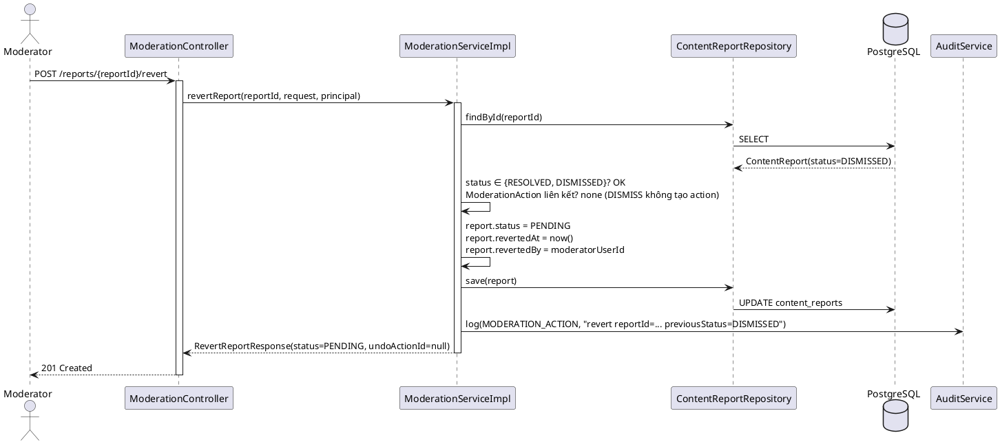
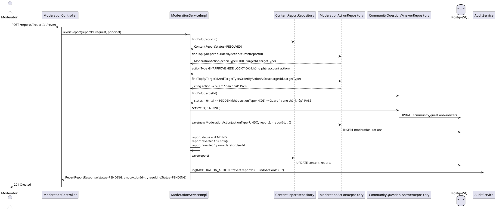
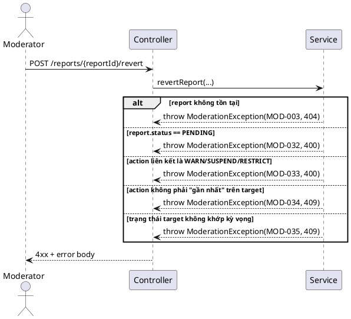
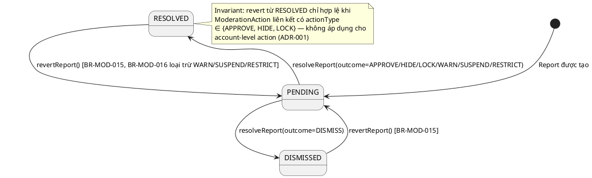

# ENGINEERING DOCUMENTATION STANDARD (EDS) v2.0
# Technical Design Specification — Tách tab "Báo cáo" / "Đã xử lý" và Hoàn tác báo cáo đã xử lý

| Field              | Value                                   |
| ------------------ | ---------------------------------------- |
| **Document ID**    | `CB-MOD-IMP-015`                        |
| **Version**        | `1.0`                                   |
| **Date**           | `2026-07-20`                            |
| **Status**         | `Approved`                              |
| **Document Owner** | `HuyND`                                 |
| **Author**         | `AI Agent — Claude`                     |
| **Reviewed by**    | `[x] HuyND — 2026-07-20`                |
| **DPO Sign-off**   | `N/A` — Internal moderation audit trail, không xử lý PII export |
| **Approved by**    | `[x] HuyND — 2026-07-20 (xác nhận bằng lời "Approved")` |
| **Last Review**    | `2026-07-20`                            |
| **Based on EDS**   | `v2.0`                                  |

---

## CHANGELOG

> **Policy 4.4 — Immutable History:** Không bao giờ xóa thông tin cũ. Mọi thay đổi phải ghi vào bảng này.

| Ngày       | Người thực hiện    | Nội dung thay đổi                                                                   |
| ---------- | ------------------- | ------------------------------------------------------------------------------------ |
| 2026-07-20 | AI Agent — Claude   | Tạo tài liệu lần đầu (Status=Draft). Phạm vi hoàn tác (chỉ DISMISS + hành động nội dung APPROVE/HIDE/LOCK, **không** WARN/SUSPEND/RESTRICT) và trình tự (gộp cả tách tab + hoàn tác trong 1 spec) đã được người dùng xác nhận qua `AskUserQuestion` trước khi viết tài liệu này. |
| 2026-07-20 | HuyND | Approved qua chat ("Approved") — chuyển Status sang `Approved`, cho phép Phase 3 Implementation bắt đầu |
| 2026-07-20 | AI Agent — Claude (Dev Agent) | Phase 3: Implementation — 15 unit tests (`ModerationServiceImplTest`) + 2 security tests (`ModerationControllerSecurityTest`) + 3 integration tests (`RevertReportIntegrationTest`, WebMvcTest+mocked-service — this package has no Testcontainers harness, same convention as `UndoModerationActionIntegrationTest`) all PASS. Migration `V20260720100000__add_content_report_revert_columns.sql` written; on the shared dev Supabase DB (`flyway.enabled=false`) the 2 columns were actually applied automatically via `hibernate.ddl-auto=update` on app restart, verified via `psql \d content_reports`. Full backend regression: 0 new failures (pre-existing ~125 Testcontainers/Docker-unavailable errors + 5 unrelated pre-existing failures in `ModerateContentServiceImplTest`/`ResolveReportServiceImplTest`/`WarnOrSuspendAccountServiceImplTest`, none touched by this change). Frontend: `revertReport()` + `RevertReportResult` added; `ReportsQueuePage.tsx` split into "Báo cáo"/"Đã xử lý" tabs (client-side merge of RESOLVED+DISMISSED per ADR-003) with a "Hoàn tác" button reusing `ConfirmDialog`. `npx tsc -b` + `npm run build` PASS. Verified end-to-end in browser as `moderator@carebridge.dev`: tab split renders correctly, revert on an account-level-resolved report correctly surfaces MOD-033, revert on a content-action-resolved report succeeds and the report reappears in the "Báo cáo" tab. |
| 2026-07-20 | AI Agent — Claude (Dev Agent) | Bug fix phát hiện sau khi triển khai: `ContentReportDetailPage`/`AccountReportDetailPage` (trang "Xem chi tiết") gọi `fetchModerationQueue()` không truyền `status`, và `ModerationQueueFilter` mặc định `status=PENDING` khi thiếu — nên "Xem chi tiết" từ tab "Đã xử lý" luôn báo "Không tìm thấy báo cáo". Theo lựa chọn của người dùng, tái sử dụng 2 trang chi tiết hiện có thay vì tạo trang riêng: (1) sửa `loadItem()` ở cả 2 trang để query cả 3 status (PENDING/RESOLVED/DISMISSED) rồi tìm theo id; (2) mở rộng `ModerationQueueItemResponse`/`ModerationMapper` thêm `resolvedAt`/`assignedModeratorId`/`revertedAt`/`revertedBy` (đọc thẳng từ `ContentReport` entity, không cần migration mới); (3) khi `item.status !== 'PENDING'`, cả 2 trang chuyển sang panel chỉ xem (trạng thái + thời điểm xử lý + người xử lý ID + lịch sử revert nếu có) kèm nút "Hoàn tác" tái dùng `revertReport()`/`ConfirmDialog`. Verify: `./mvnw test` (package `moderation`) không có regression mới; `tsc -b` + `npm run build` PASS; xác nhận qua trình duyệt cả 2 nhánh (DISMISSED hoàn tác thành công, RESOLVED-qua-WARN bị từ chối đúng MOD-033). |

---

## MỤC LỤC

1. [Tổng quan Module](#1-tổng-quan-module)
2. [Ma trận Truy vết](#2-ma-trận-truy-vết)
3. [Architecture Decision Records (ADR)](#3-architecture-decision-records-adr)
4. [Non-Functional Requirements & SLA](#4-non-functional-requirements--sla)
5. [Static Modeling](#5-static-modeling)
6. [Dynamic Modeling](#6-dynamic-modeling)
7. [Domain Event Catalog](#7-domain-event-catalog)
8. [Interface Specification](#8-interface-specification)
9. [API Specification](#9-api-specification)
10. [Bảng mã lỗi](#10-bảng-mã-lỗi)
11. [Quy trình Triển khai](#11-quy-trình-triển-khai)
12. [Rollback & Incident Runbook](#12-rollback--incident-runbook)
13. [Kịch bản Kiểm thử Chi tiết](#13-kịch-bản-kiểm-thử-chi-tiết)
14. [Phương pháp Xác minh](#14-phương-pháp-xác-minh)
15. [API Verification Samples](#15-api-verification-samples)
16. [Authorization Matrix](#16-authorization-matrix)
17. [AI Prompt Constraints (CASE 2.0)](#17-ai-prompt-constraints-case-20)

---

## 1. Tổng quan Module

| Field                     | Value                                                                                                                                  |
| ------------------------- | --------------------------------------------------------------------------------------------------------------------------------------- |
| **Module Name**           | `Moderator Reports — Tabs + Revert Resolution`                                                                                          |
| **Bounded Context**       | `content` (package `com.carebridge.backend.content`, cùng UC-99/UC-100/UC-101/CB-MOD-IMP-009)                                          |
| **Primary Actor**         | `Community Moderator (ROLE_MODERATOR)`                                                                                                  |
| **Platform**              | `Admin Web Portal` (`/moderator/reports`)                                                                                               |
| **Data Classification**   | `Internal`                                                                                                                              |
| **Compliance Scope**      | `N/A` (moderation decisions là operational audit data, không phải PII export)                                                          |
| **Upstream Dependencies** | `content (ContentReport, ModerationAction, ModerationException, ModerationServiceImpl)`, `community (CommunityQuestion/Answer repos)`, `audit (AuditService)` |
| **Downstream Consumers**  | Trang `ReportsQueuePage.tsx` (web), `AccountReportDetailPage.tsx`/`ContentReportDetailPage.tsx`                                        |

**Mô tả:**

Trang `/moderator/reports` hiện chỉ hiển thị MỘT bảng phẳng, luôn gọi `fetchModerationQueue({status:'PENDING'})` — không có cách nào xem lại các report đã `RESOLVED`/`DISMISSED`, và không có cách hoàn tác một quyết định resolve. Module này bổ sung 2 khả năng độc lập nhưng liên quan chặt:

1. **Tách tab (Frontend-only, tái sử dụng API có sẵn):** Thêm 2 tab "Báo cáo" (status=PENDING, hành vi hiện tại giữ nguyên) và "Đã xử lý" (status ∈ {RESOLVED, DISMISSED}). Không cần thay đổi backend — `GET /queue` đã hỗ trợ filter theo `status` (§1 nhưng chỉ nhận 1 giá trị/lần gọi — xem ADR-003 về cách gộp 2 status).
2. **Hoàn tác báo cáo đã xử lý (Backend mới + Frontend):** Endpoint mới `POST /api/v1/admin/moderation/reports/{reportId}/revert` đưa 1 `ContentReport` đang `RESOLVED`/`DISMISSED` về lại `PENDING`.
   - **DISMISS → PENDING:** không có `ModerationAction` liên kết (BR-MOD-010 của UC-101) → chỉ cần đổi `status`.
   - **RESOLVED với outcome APPROVE/HIDE/LOCK → PENDING:** phải đảo ngược cả `ModerationAction` liên kết (`reportId` khớp) — tái sử dụng chính xác cơ chế mutate-target-status của `undoModerationAction()` (CB-MOD-IMP-009), nhưng đường vào là `reportId` chứ không phải `actionId` (vì CB-MOD-IMP-009 ADR-004 **cố tình** từ chối undo trực tiếp các action có `reportId != null` qua `MOD-027`).
   - **RESOLVED với outcome WARN/SUSPEND/RESTRICT (account-level) → KHÔNG được hoàn tác** ở v1 này (xác nhận qua `AskUserQuestion` — xem ADR-001).

---

## 2. Ma trận Truy vết

| Requirement ID | Loại          | Mô tả yêu cầu                                                                                  | Thành phần Code                                  | Compliance Target | ADR liên quan |
| --------------- | -------------- | ------------------------------------------------------------------------------------------------ | -------------------------------------------------- | ------------------- | --------------- |
| REQ-001         | User Request  | Tách trang `/moderator/reports` thành tab "Báo cáo" và "Đã xử lý"                                 | `ReportsQueuePage.tsx`                             | —                  | ADR-003         |
| REQ-002         | User Request  | Cho phép hoàn tác báo cáo đã xử lý                                                                | `ModerationController.revertReport()`              | —                  | ADR-001/ADR-002 |
| BR-MOD-015      | Business Rule | Chỉ report `status ∈ {RESOLVED, DISMISSED}` mới được revert; `PENDING` bị từ chối                | `ModerationServiceImpl.revertReport()`             | —                  | ADR-002         |
| BR-MOD-016      | Business Rule | Outcome account-level (WARN/SUSPEND/RESTRICT) không được hoàn tác qua tính năng này              | `ModerationServiceImpl.revertReport()`             | —                  | ADR-001         |
| BR-MOD-017      | Business Rule | Revert một report `RESOLVED` (content action) phải áp dụng đúng 2 guard "gần nhất" + "trạng thái khớp" như CB-MOD-IMP-009 ADR-002 | `ModerationServiceImpl.revertReport()`             | —                  | ADR-004         |
| BR-MOD-018      | Business Rule | `ContentReport.resolvedAt`/`assignedModeratorId` gốc được **giữ nguyên** (lịch sử ai đã resolve) — revert ghi vào cột mới `reverted_at`/`reverted_by` | `ContentReport` entity, Flyway migration mới        | —                  | ADR-005         |
| BR-AUDIT-002    | Business Rule | Mọi lần revert (dù DISMISS hay RESOLVED) đều phải audit log                                       | `AuditService.log(MODERATION_ACTION, ...)`         | —                  | —              |
| BR-RBAC-002     | Business Rule | Chỉ MODERATOR mới được gọi endpoint revert                                                        | `@PreAuthorize("hasRole('MODERATOR')")`            | —                  | —              |

---

## 3. Architecture Decision Records (ADR)

### ADR-001 — Phạm vi Revert: DISMISS + content action (APPROVE/HIDE/LOCK); loại trừ account action (WARN/SUSPEND/RESTRICT)

| Field          | Value                      |
| -------------- | --------------------------- |
| **Status**     | `Accepted` — người dùng đã chọn qua `AskUserQuestion` trước khi viết tài liệu |
| **Deciders**   | `HuyND` (xác nhận qua AskUserQuestion) |
| **Date**       | `2026-07-20`                |

#### Bối cảnh
`ResolveReportRequest.outcome` có 7 giá trị: `DISMISS`, `APPROVE`, `HIDE`, `LOCK` (content-level) và `WARN`, `SUSPEND`, `RESTRICT` (account-level, tác động lên `users` qua `WarnOrSuspendAccountResponse` — khoá/đình chỉ tài khoản, có `expiresAt`). Hoàn tác một content action chỉ cần đưa 1 `CommunityQuestion`/`CommunityAnswer.status` về PENDING (an toàn, đã có tiền lệ ở CB-MOD-IMP-009). Hoàn tác một account action phức tạp hơn nhiều về mặt an toàn nghiệp vụ: phải đảo ngược đúng effect (bỏ suspend/restrict, khôi phục quyền đăng bài), xử lý trường hợp `expiresAt` đã trôi qua tự nhiên, và không có yêu cầu nguồn nào (SRS/FS) đặc tả rõ ngữ nghĩa "un-suspend".

#### Các phương án đã xem xét

| Phương án | Mô tả | Ưu điểm | Nhược điểm |
| --------- | ----- | -------- | ----------- |
| A | Hoàn tác mọi outcome kể cả account-level | Đầy đủ tính năng ngay từ v1 | Rủi ro cao hơn cho workflow an toàn tài khoản (CLAUDE.md: "AI provides guidance only; never diagnose, prescribe, or delay emergency routing" — tương tự tinh thần thận trọng cho account enforcement); chưa có spec nguồn cho ngữ nghĩa un-suspend; vi phạm "smallest scoped change" |
| B | Chỉ hoàn tác DISMISS + content action (APPROVE/HIDE/LOCK); account action bị từ chối tường minh với lỗi rõ ràng | Phạm vi an toàn, nhất quán với CB-MOD-IMP-009 (vốn cũng chỉ giới hạn content-level); không cần thiết kế lại account-suspension reversal | Moderator vẫn phải xử lý thủ công (qua kênh khác) nếu muốn huỷ 1 lần suspend — chấp nhận được vì đây là hành động hiếm và rủi ro cao hơn, xứng đáng có review riêng |

#### Quyết định
Chọn **Phương án B** — người dùng đã xác nhận qua AskUserQuestion. `revertReport()` từ chối với lỗi `MOD-033` khi `ModerationAction` liên kết có `actionType ∈ {WARN, SUSPEND, RESTRICT}`.

#### Hệ quả
**Tích cực:** Phạm vi nhất quán với ADR-004 của CB-MOD-IMP-009; không cần thiết kế "un-suspend" chưa có yêu cầu nguồn.
**Tiêu cực / Trade-offs:** Tính năng "hoàn tác" chưa đầy đủ 100% outcome — ghi nhận `Open` cho một spec riêng nếu có yêu cầu sau này.

---

### ADR-002 — Thiết kế endpoint mới `POST /reports/{reportId}/revert` thay vì nới lỏng guard `MOD-027` của `undo`

| Field          | Value                      |
| -------------- | --------------------------- |
| **Status**     | `Accepted`                  |
| **Deciders**   | `HuyND`                     |
| **Date**       | `2026-07-20`                |

#### Bối cảnh
`ModerationQueueItemResponse` (queue DTO) không có `actionId`, và `ModerationActionRepository` không có `findByReportId` — nghĩa là frontend không có cách nào lấy `actionId` để gọi `POST /actions/{actionId}/undo` cho một report đã resolve. Hơn nữa, `undoModerationAction()` **cố tình** từ chối (`MOD-027`) mọi action có `reportId != null` (CB-MOD-IMP-009 ADR-004) — đây là 1 guard nghiệp vụ có chủ đích, không phải thiếu sót.

#### Các phương án đã xem xét

| Phương án | Mô tả | Ưu điểm | Nhược điểm |
| --------- | ----- | -------- | ----------- |
| A | Nới lỏng `MOD-027`, thêm `actionId`/`actionType` vào `ModerationQueueItemResponse`, frontend tự tìm actionId rồi gọi `/undo` | Tái dùng 100% endpoint cũ | Phá vỡ 1 guard được thiết kế có chủ đích (ADR-004 của CB-MOD-IMP-009); phải đổi contract của queue DTO (breaking cho consumer khác); trộn lẫn 2 luồng ngữ nghĩa khác nhau (direct action vs report resolution) vào 1 endpoint |
| B | Thêm endpoint mới `POST /reports/{reportId}/revert`, đối xứng với `POST /reports/{reportId}/resolve` đã có | Giữ nguyên ranh giới report-centric vs action-centric; không cần đổi `ModerationQueueItemResponse`; không cần `findByReportId` phức tạp trên frontend — chỉ cần `reportId` đã có sẵn trong `ModerationQueueItem.id` | Thêm 1 repository method mới (`findTopByReportIdOrderByActionAtDesc`) và 1 service method mới |

#### Quyết định
Chọn **Phương án B**. Endpoint mới nằm cạnh `resolveReport()` trong `ModerationController`, cùng pattern request/response (`RevertReportRequest`/`RevertReportResponse`). `ModerationActionRepository` có thêm `Optional<ModerationAction> findTopByReportIdOrderByActionAtDesc(UUID reportId)` (không cần migration — `report_id` column đã tồn tại).

#### Hệ quả
**Tích cực:** Không đụng tới guard `MOD-027`/`undoModerationAction()` hiện có — zero regression risk cho CB-MOD-IMP-009. Contract mới độc lập, dễ test.
**Tiêu cực / Trade-offs:** Có 2 endpoint "hoàn tác" song song (`/undo` cho direct action, `/revert` cho report resolution) — chấp nhận được vì phản ánh đúng 2 luồng nghiệp vụ tách biệt đã có từ UC-100/UC-101.

---

### ADR-003 — Tab "Đã xử lý" gộp 2 lần gọi API (RESOLVED + DISMISSED) ở frontend, không đổi contract `GET /queue`

| Field          | Value                      |
| -------------- | --------------------------- |
| **Status**     | `Accepted`                  |
| **Deciders**   | `HuyND`                     |
| **Date**       | `2026-07-20`                |

#### Bối cảnh
`fetchModerationQueue({status})` chỉ nhận 1 giá trị `ReportStatus` — tab "Đã xử lý" cần cả `RESOLVED` và `DISMISSED`.

#### Các phương án đã xem xét

| Phương án | Mô tả | Ưu điểm | Nhược điểm |
| --------- | ----- | -------- | ----------- |
| A | Đổi `status` param của `GET /queue` thành list (`status=RESOLVED,DISMISSED`) | 1 network call | Đổi contract backend hiện có (rủi ro cho consumer khác), cần thay đổi `ModerationServiceImpl.getModerationQueue()` + repository query |
| B | Frontend gọi 2 lần (`status=RESOLVED`, `status=DISMISSED`), gộp + sort theo `reportedAt` desc ở client | Không đổi backend, an toàn tuyệt đối, nhỏ gọn | 2 network calls thay vì 1 — chấp nhận được vì trang moderator không có yêu cầu real-time/throughput cao |

#### Quyết định
Chọn **Phương án B**.

#### Hệ quả
**Tích cực:** Zero backend risk cho phần tách tab.
**Tiêu cực / Trade-offs:** Phân trang (`page`/`size`) của tab "Đã xử lý" là "gộp 2 trang riêng rồi cắt" — chấp nhận đơn giản hoá: v1 lấy `size=50` cho mỗi status (không phân trang server-side cho tab này), đủ dùng cho khối lượng report hiện tại. Nếu sau này cần phân trang chính xác trên tập gộp, ghi nhận `Open` cho 1 spec riêng.

---

### ADR-004 — Revert tái sử dụng chính xác 2 guard của `undoModerationAction()` (CB-MOD-IMP-009 ADR-002)

| Field          | Value                      |
| -------------- | --------------------------- |
| **Status**     | `Accepted`                  |
| **Deciders**   | `HuyND`                     |
| **Date**       | `2026-07-20`                |

#### Quyết định
`revertReport()` (nhánh RESOLVED + content action) áp dụng lại đúng 2 guard đã kiểm chứng ở CB-MOD-IMP-009:
1. **Guard "gần nhất":** `ModerationAction` liên kết với report phải là action **mới nhất** trên `(targetId, targetType)` đó (dùng lại `findTopByTargetIdAndTargetTypeOrderByActionAtDesc`) — nếu không → `MOD-034` (409).
2. **Guard "trạng thái khớp":** trạng thái hiện tại của `CommunityQuestion`/`CommunityAnswer` phải đúng bằng kết quả action đó tạo ra (`APPROVE→APPROVED`, `HIDE→HIDDEN`, `LOCK→LOCKED`) — nếu không → `MOD-035` (409).

Lý do: cùng rủi ro "chồng lấn action" đã phân tích ở CB-MOD-IMP-009 ADR-002 — report resolution cũng ghi `ModerationAction`, nên có thể bị một hành động trực tiếp mới hơn (`POST /actions`) hoặc một report khác che lấp.

#### Hệ quả
**Tích cực:** Nhất quán logic, tái dùng 2 helper guard đã test kỹ ở CB-MOD-IMP-009 (refactor thành `private` helper dùng chung nếu tiện, không bắt buộc).
**Tiêu cực / Trade-offs:** Không có thêm rủi ro mới ngoài rủi ro đã được chấp nhận ở CB-MOD-IMP-009.

---

### ADR-005 — Thêm cột `reverted_at`/`reverted_by` vào `content_reports` (migration mới) thay vì ghi đè `resolved_at`/`assigned_moderator_id`

| Field          | Value                      |
| -------------- | --------------------------- |
| **Status**     | `Accepted`                  |
| **Deciders**   | `HuyND`                     |
| **Date**       | `2026-07-20`                |

#### Bối cảnh
`content_reports` không có cột nào ghi nhận "ai/khi nào revert". Nếu tái sử dụng `resolved_at`/`assigned_moderator_id` (set lại `null` hoặc ghi đè bằng thông tin revert), sự kiện "report từng được resolve bởi ai, lúc nào" sẽ bị mất — vi phạm tinh thần audit của module moderation (CLAUDE.md: "enforce existing... audit requirements" cho các workflow an toàn).

#### Các phương án đã xem xét

| Phương án | Mô tả | Ưu điểm | Nhược điểm |
| --------- | ----- | -------- | ----------- |
| A | Set `resolved_at=null`, `assigned_moderator_id=null` khi revert | Không cần migration | Mất vĩnh viễn lịch sử "ai đã resolve" — không audit được nếu revert xảy ra |
| B | Thêm 2 cột mới `reverted_at TIMESTAMPTZ NULL`, `reverted_by UUID NULL` — giữ nguyên `resolved_at`/`assigned_moderator_id` khi revert | Giữ đủ lịch sử (resolve + revert đều có dấu vết); đơn giản, append-style, không phá schema hiện có | Cần 1 Flyway migration mới |

#### Quyết định
Chọn **Phương án B**. Migration `V{n}__add_content_report_revert_columns.sql`:
```sql
ALTER TABLE content_reports
  ADD COLUMN reverted_at TIMESTAMPTZ NULL,
  ADD COLUMN reverted_by UUID NULL;
```
Khi revert thành công: `status` → `PENDING`, `reverted_at` = `Instant.now()`, `reverted_by` = moderator hiện tại. `resolved_at`/`assigned_moderator_id` giữ nguyên giá trị cũ (không set null, không ghi đè) làm bằng chứng lịch sử. Nếu report bị resolve lại sau revert rồi lại revert lần nữa, `resolved_at`/`reverted_at` chỉ giữ lần **gần nhất** (không phải mảng lịch sử đầy đủ) — chấp nhận được vì `audit_logs` (qua `auditService.log`) đã là nguồn append-only đầy đủ cho từng sự kiện.

#### Hệ quả
**Tích cực:** Không mất thông tin ai đã resolve ban đầu; đủ dữ liệu cho UI hiển thị "Đã xử lý bởi X lúc T, hoàn tác bởi Y lúc T2".
**Tiêu cực / Trade-offs:** Cần 1 migration mới, phải chạy trên staging trước theo Pre-Migration Checklist (§11.2).

---

## 4. Non-Functional Requirements & SLA

| Category      | Requirement                          | Target                | Verification Method     |
| ------------- | ------------------------------------- | ---------------------- | ------------------------- |
| Latency       | `POST .../revert` p99                | `< 300ms`              | Manual timing / log       |
| Consistency   | Revert là 1 transaction (report + action + target status) | 100% all-or-nothing | `@Transactional` + integration test |
| Audit         | Mọi lần revert phải có `audit_logs` record | 100%                | DB query (§14.1)          |

---

## 5. Static Modeling

### 5.1. Entity thay đổi

```java
// ContentReport.java — thêm 2 field mới, không đổi field cũ
@Entity
@Table(name = "content_reports")
public class ContentReport {
    // ... các field hiện có giữ nguyên (id, targetId, targetType, status,
    //     category, reportSource, description, reporterUserId,
    //     assignedModeratorId, createdAt, resolvedAt, updatedAt) ...

    @Column(name = "reverted_at")
    private Instant revertedAt;      // NULL nếu chưa từng bị revert

    @Column(name = "reverted_by")
    private UUID revertedBy;         // moderatorUserId đã thực hiện revert gần nhất
}
```

### 5.2. Data Structure (Flyway SQL Migration)

Tạo file: `src/main/resources/db/migration/V{n}__add_content_report_revert_columns.sql`

```sql
-- === CONTENT_REPORTS: REVERT AUDIT COLUMNS ===
ALTER TABLE content_reports
  ADD COLUMN reverted_at TIMESTAMPTZ NULL,   -- thời điểm report gần nhất được revert về PENDING
  ADD COLUMN reverted_by UUID NULL;          -- moderator_user_id đã thực hiện revert gần nhất
```

> **Quy tắc đặt tên:** snake_case, đúng convention hiện có của `content_reports` (`resolved_at`, `assigned_moderator_id`).
> `{n}` = version tiếp theo sau migration mới nhất hiện có (`V20260713020000__add_content_report_source.sql`) — dùng timestamp-style version theo đúng convention đang dùng cho migration gần nhất của bảng này.

### 5.3. DTO mới

```java
// RevertReportRequest.java
public record RevertReportRequest(
    String reason   // optional — lý do hoàn tác, ghi vào ModerationAction(UNDO)/audit log
) {}

// RevertReportResponse.java
public record RevertReportResponse(
    UUID reportId,
    ReportStatus reportStatus,       // luôn "PENDING" khi thành công
    UUID revertedByModeratorId,
    Instant revertedAt,
    UUID undoActionId,               // id của ModerationAction(UNDO) mới tạo — null nếu report gốc là DISMISS (không có action để hoàn tác)
    ReportTargetType targetType,
    UUID targetId,
    String resultingStatus           // "PENDING" — trạng thái mới của target (nếu có), hoặc null cho nhánh DISMISS
) {}
```

---

## 6. Dynamic Modeling

### 6.1. Sequence — Revert report `DISMISSED` (happy path)



### 6.2. Sequence — Revert report `RESOLVED` với content action (happy path)



### 6.3. Sequence — Error path (report chưa resolve / account action / guard fail)



### 6.4. State Machine — `ContentReport.status`



> **⚠️ Invariant bất biến:** `resolved_at`/`assigned_moderator_id` KHÔNG bao giờ bị xoá/null khi revert (ADR-005) — chỉ `status` và `reverted_at`/`reverted_by` thay đổi.

---

## 7. Domain Event Catalog

Không phát sinh domain event mới (module hiện tại dùng `AuditService.log()` trực tiếp, không dùng ApplicationEvent bus — nhất quán với UC-100/UC-101/CB-MOD-IMP-009).

---

## 8. Interface Specification

### 8.1. Service Interface (bổ sung vào `IModerationService` hiện có)

```java
// IModerationService.java — thêm method mới
public interface IModerationService {
    // ... methods hiện có (getQueue, resolveReport, undoModerationAction, ...) ...

    /**
     * Đưa 1 ContentReport đang RESOLVED/DISMISSED về lại PENDING.
     * @throws ModerationException (MOD-003) nếu report không tồn tại
     * @throws ModerationException (MOD-032) nếu report đang PENDING (chưa resolve)
     * @throws ModerationException (MOD-033) nếu action liên kết là WARN/SUSPEND/RESTRICT
     * @throws ModerationException (MOD-034) nếu action liên kết không phải action gần nhất trên target
     * @throws ModerationException (MOD-035) nếu trạng thái target hiện tại không khớp kỳ vọng
     */
    RevertReportResponse revertReport(UUID reportId, RevertReportRequest request, Principal principal);
}
```

### 8.2. Repository Interface (bổ sung vào `ModerationActionRepository`)

```java
public interface ModerationActionRepository extends JpaRepository<ModerationAction, UUID> {
    // ... methods hiện có ...

    // Mới: lấy ModerationAction gần nhất được tạo bởi một report resolution cụ thể.
    // DISMISS không tạo ModerationAction nên method này trả Optional.empty() cho report DISMISSED.
    Optional<ModerationAction> findTopByReportIdOrderByActionAtDesc(UUID reportId);
}
```

Không cần thêm method cho `ContentReportRepository` — `findById` (kế thừa từ `JpaRepository`) đã đủ, đúng pattern `resolveReport()` đang dùng.

---

## 9. API Specification

### 9.1. Endpoints Table

| Method | Path                                          | Auth Level | Required Roles | Idempotent? |
| ------ | ----------------------------------------------- | ------------ | ----------------- | ------------- |
| `POST` | `/api/v1/admin/moderation/reports/{reportId}/revert` | JWT Bearer | `ROLE_MODERATOR` | No (gọi lần 2 sẽ 400 MOD-032 vì report đã về PENDING) |

`GET /api/v1/admin/moderation/queue` — **không đổi**, tiếp tục dùng `status` param hiện có (frontend gọi 2 lần cho tab "Đã xử lý" — ADR-003).

### 9.2. Request / Response Schemas

#### `POST /api/v1/admin/moderation/reports/{reportId}/revert`

**Request Body:**
```json
{
  "reason": "Bấm nhầm, cần xem lại nội dung trước khi quyết định"
}
```

**Response — 201 Created (Happy Path — report gốc RESOLVED/HIDE):**
```json
{
  "reportId": "550e8400-e29b-41d4-a716-446655440000",
  "reportStatus": "PENDING",
  "revertedByModeratorId": "6f1c2e10-...-...",
  "revertedAt": "2026-07-20T09:15:00.000Z",
  "undoActionId": "a1b2c3d4-...-...",
  "targetType": "ANSWER",
  "targetId": "9e8d7c6b-...-...",
  "resultingStatus": "PENDING"
}
```

**Response — 400 Bad Request (chưa resolve):**
```json
{
  "error": { "code": "MOD-032", "message": "Report đang ở trạng thái PENDING, chưa được xử lý nên không thể hoàn tác." }
}
```

**Response — 400 Bad Request (account action, ngoài phạm vi):**
```json
{
  "error": { "code": "MOD-033", "message": "Không thể hoàn tác báo cáo đã xử lý bằng hành động lên tài khoản (cảnh cáo/đình chỉ/hạn chế)." }
}
```

**Response — 409 Conflict (không phải action gần nhất):**
```json
{
  "error": { "code": "MOD-034", "message": "Đã có hành động mới hơn trên nội dung này sau khi báo cáo được xử lý — không thể hoàn tác." }
}
```

**Response — 409 Conflict (trạng thái đã bị thay đổi khác):**
```json
{
  "error": { "code": "MOD-035", "message": "Trạng thái nội dung đã thay đổi kể từ khi báo cáo được xử lý — không thể hoàn tác." }
}
```

---

## 10. Bảng mã lỗi

> Tiếp nối dãy mã `MOD-xxx` hiện có (mới nhất: `MOD-031`, xem khảo sát backend). Bỏ qua `MOD-004`/`MOD-006`/`MOD-014` (đã retired, không tái sử dụng).

| Code      | HTTP Status | Message (VI)                                                                                   | Trigger Condition |
| --------- | ----------- | -------------------------------------------------------------------------------------------------- | -------------------- |
| `MOD-032` | 400         | Report đang PENDING, chưa được xử lý nên không thể hoàn tác.                                       | `report.status == PENDING` khi gọi `revertReport()` |
| `MOD-033` | 400         | Không thể hoàn tác báo cáo đã xử lý bằng hành động lên tài khoản.                                  | `ModerationAction` liên kết có `actionType ∈ {WARN, SUSPEND, RESTRICT}` |
| `MOD-034` | 409         | Đã có hành động mới hơn trên nội dung này — không thể hoàn tác.                                     | Action liên kết không phải action gần nhất trên `(targetId, targetType)` (mirror `MOD-029`) |
| `MOD-035` | 409         | Trạng thái nội dung đã thay đổi kể từ khi báo cáo được xử lý — không thể hoàn tác.                  | Trạng thái target hiện tại không khớp kỳ vọng của action (mirror `MOD-030`) |

---

## 11. Quy trình Triển khai

### 11.1. Prerequisites

- [x] TDS này đã được review và approve (Status chuyển `Approved`)
- [x] CB-MOD-IMP-009 (Undo) đã implemented — `revertReport()` tái dùng 2 guard helper của nó (ADR-004)
- [x] UC-101 (Resolve Report) đã implemented — `revertReport()` là nghịch đảo của `resolveReport()`

### 11.2. Pre-Migration Checklist

- [x] Migration `V20260720100000__add_content_report_revert_columns.sql` áp dụng thành công trên DB dev dùng chung (qua `hibernate.ddl-auto=update`, vì `flyway.enabled=false` trên DB này — xác nhận bằng `psql \d content_reports`; migration file vẫn được giữ để môi trường có Flyway bật (CI/staging riêng) áp dụng đúng cách)
- [ ] Rollback script đã test trên staging riêng có Flyway bật (chưa có staging riêng cho batch này)

### 11.3. Implementation Steps

#### Chặng 1 — Flyway migration

```sql
ALTER TABLE content_reports
  ADD COLUMN reverted_at TIMESTAMPTZ NULL,
  ADD COLUMN reverted_by UUID NULL;
```

#### Chặng 2 — Backend: entity, DTO, repository, service, controller, error codes

- `ContentReport.java`: thêm field `revertedAt`, `revertedBy`.
- `RevertReportRequest.java`, `RevertReportResponse.java`: DTO mới (§5.3).
- `ModerationActionRepository.java`: thêm `findTopByReportIdOrderByActionAtDesc`.
- `ModerationException.java`: thêm factory `reportNotYetResolved(reportId)` (MOD-032), `revertNotSupportedForAccountAction(actionId)` (MOD-033), `revertNotMostRecentAction(actionId)` (MOD-034), `revertStatusSuperseded(actionId)` (MOD-035).
- `ModerationServiceImpl.revertReport()`: logic §6.1/§6.2, tái dùng guard helper của `undoModerationAction()` nếu đã factor thành `private` method dùng chung (khuyến nghị, không bắt buộc).
- `ModerationController.java`: thêm `POST /reports/{reportId}/revert` với `@PreAuthorize("hasRole('MODERATOR')")`, `@ResponseStatus(HttpStatus.CREATED)`.

#### Chặng 3 — Frontend: tabs + revert action

- `moderationApi.ts`: thêm `revertReport(reportId, reason?)`.
- `models/moderation.ts`: thêm `RevertReportResult` type.
- `ReportsQueuePage.tsx`: thêm tab control (2 tab: "Báo cáo" / "Đã xử lý"). Tab "Đã xử lý" gọi `fetchModerationQueue({status:'RESOLVED'})` + `fetchModerationQueue({status:'DISMISSED'})` song song, gộp + sort theo `reportedAt` desc (ADR-003). Mỗi hàng ở tab "Đã xử lý" có nút "Hoàn tác" gọi `revertReport(item.id)`, hiển thị lỗi cụ thể (MOD-032/033/034/035) nếu API trả lỗi, refresh lại danh sách khi thành công.

#### Chặng 4 — Verification sau deploy

```bash
curl -X GET https://[host]/api/v1/admin/moderation/queue?status=RESOLVED \
  -H "Authorization: Bearer [MODERATOR_JWT]"
# Expected: 200, danh sách report RESOLVED

curl -X POST https://[host]/api/v1/admin/moderation/reports/[reportId]/revert \
  -H "Authorization: Bearer [MODERATOR_JWT]" -H "Content-Type: application/json" -d '{}'
# Expected: 201, reportStatus="PENDING"
```

### 11.4. Deployment Checklist

- [x] Migration chạy thành công, 2 cột mới tồn tại (`\d content_reports`)
- [x] `GET /queue?status=RESOLVED` và `status=DISMISSED` trả 200 (verified qua tab "Đã xử lý" trong trình duyệt)
- [x] `POST .../revert` happy path + error path (MOD-003/032/033/034/035) đều đúng mã lỗi (unit + integration tests; MOD-033 cũng verify trực tiếp qua trình duyệt)
- [x] Frontend build (`npm run build`) và `tsc -b` PASS
- [x] Tab "Đã xử lý" hiển thị đúng cả RESOLVED và DISMISSED, nút "Hoàn tác" hoạt động (verified qua trình duyệt với tài khoản `moderator@carebridge.dev`)

---

## 12. Rollback & Incident Runbook

### 12.1. Điều kiện kích hoạt Rollback

| Điều kiện                              | Ngưỡng          | Người quyết định |
| ---------------------------------------- | ----------------- | ------------------ |
| Revert vô tình đổi trạng thái sai target | Bất kỳ case nào    | Tech Lead          |
| Error rate endpoint revert tăng đột biến | > 5% trong 5 phút  | On-call Engineer   |

### 12.2. Rollback Procedure

```bash
# Bước 1: Revert migration (chỉ khi 2 cột mới gây lỗi — an toàn vì nullable, không có FK/index phụ thuộc)
psql -h $DB_HOST -U $DB_USER -d $DB_NAME \
  -c "ALTER TABLE content_reports DROP COLUMN IF EXISTS reverted_at, DROP COLUMN IF EXISTS reverted_by;"
psql -h $DB_HOST -U $DB_USER -d $DB_NAME \
  -c "DELETE FROM flyway_schema_history WHERE version = '{n}';"

# Bước 2: Revert code
git checkout -- src/main/java/com/carebridge/backend/content/
git checkout -- 05_Development/CareBridgeWebApp/src/features/moderation/
```

### 12.3. Notification Protocol

Không cần notify DPO (không có PII impact). Notify Tech Lead nếu rollback được kích hoạt.

---

## 13. Kịch bản Kiểm thử Chi tiết

> Xem file `ModeratorReportsRevert_Test-Spec.md` (theo `PHASE-4_Test-Spec.md` template) cho toàn bộ test case chi tiết (`MRR-TC-xxx`).

---

## 14. Phương pháp Xác minh

### 14.1. Database Inspection

```sql
-- Verify revert đã ghi đúng
SELECT report_id, status, resolved_at, assigned_moderator_id, reverted_at, reverted_by
FROM content_reports WHERE report_id = '[uuid]';
-- Expected: status='PENDING', resolved_at giữ nguyên giá trị cũ, reverted_at/reverted_by mới set

-- Verify ModerationAction(UNDO) mới được ghi (nhánh RESOLVED content action)
SELECT * FROM moderation_actions
WHERE report_id = '[uuid]' AND action_type = 'UNDO'
ORDER BY action_at DESC LIMIT 1;
```

### 14.2. Log / Audit Verification

```bash
grep '"eventType":"MODERATION_ACTION"' app.log | grep 'revert reportId=[uuid]'
```

---

## 15. API Verification Samples

Xem §11.3 Chặng 4.

---

## 16. Authorization Matrix

| Endpoint                                                    | `GUEST` | `MOTHER/FAMILY` | `MODERATOR` | `CONTENT_ADMIN` | `SYSTEM_ADMIN` |
| -------------------------------------------------------------- | --------- | ------------------ | ------------- | ------------------ | ---------------- |
| `POST /api/v1/admin/moderation/reports/{reportId}/revert`      | ❌        | ❌                  | ✅            | ❌                  | ❌                |
| `GET /api/v1/admin/moderation/queue?status=RESOLVED/DISMISSED` | ❌        | ❌                  | ✅            | ❌                  | ❌                |

**Chú thích:** Nhất quán với toàn bộ `ModerationController` hiện có — chỉ `ROLE_MODERATOR`, kể cả `SYSTEM_ADMIN` không có quyền vượt cấp (đúng nguyên tắc Least Privilege đang áp dụng cho module này).

---

## 17. AI Prompt Constraints (CASE 2.0)

### 17.1 Constraint Summary Table

| # | Constraint | Source (ADR/BR) | Last Verified |
|---|-----------|-----------------|---------------|
| C1 | Revert CHỈ áp dụng cho outcome DISMISS/APPROVE/HIDE/LOCK — TỪ CHỐI tường minh với `MOD-033` nếu action liên kết là WARN/SUSPEND/RESTRICT | ADR-001, BR-MOD-016 | 2026-07-20 |
| C2 | KHÔNG nới lỏng guard `MOD-027` của `undoModerationAction()` hiện có — endpoint revert phải hoàn toàn tách biệt | ADR-002 | 2026-07-20 |
| C3 | Dùng `findTopByReportIdOrderByActionAtDesc` mới, KHÔNG thêm `actionId` vào `ModerationQueueItemResponse` | ADR-002 | 2026-07-20 |
| C4 | Identity lấy từ `Principal` qua `SecurityUtils.requireCurrentUserId(principal)`, đúng pattern `resolveReport()`/`undoModerationAction()` | — | 2026-07-20 |
| C5 | Controller CHỈ validate + map, toàn bộ business logic (guard "gần nhất"/"trạng thái khớp") nằm trong `ModerationServiceImpl`, đúng CLAUDE.md package convention | CLAUDE.md Architecture | 2026-07-20 |
| C6 | `resolved_at`/`assigned_moderator_id` gốc KHÔNG bao giờ bị null/ghi đè khi revert — chỉ set `reverted_at`/`reverted_by` mới | ADR-005, BR-MOD-018 | 2026-07-20 |

### 17.2 Constraint Injection Block

```
[CONSTRAINT BLOCK — Module: Moderator Reports Revert]
Theo TDS CB-MOD-IMP-015 và các ADR liên quan:

1. Revert chỉ áp dụng DISMISS/APPROVE/HIDE/LOCK; account action (WARN/SUSPEND/RESTRICT) bị từ chối MOD-033.
2. KHÔNG đụng vào undoModerationAction()/MOD-027 hiện có — endpoint mới hoàn toàn tách biệt.
3. Dùng ModerationActionRepository.findTopByReportIdOrderByActionAtDesc(reportId) mới thêm.
4. Identity từ Principal qua SecurityUtils.requireCurrentUserId().
5. Business logic (2 guard: gần nhất + trạng thái khớp) nằm trong ModerationServiceImpl, không phải Controller.
6. resolved_at/assigned_moderator_id gốc không bị ghi đè — chỉ set reverted_at/reverted_by mới.

[CONTEXT BLOCK]
- Bounded Context: content
- Data Classification: Internal
- Existing interfaces: §8 Service/Repository Interface
- Error codes: §10 (MOD-032..035)
- Auth matrix: §16

[TASK BLOCK]
Implement revertReport() + tab split thỏa mãn constraints trên.
Tests phải cover §13 (xem Test-Spec riêng).
```

### 17.3 Constraint Quality Checklist

- [x] Mỗi constraint traceable về ADR/BR cụ thể
- [x] Không có constraint generic
- [x] Constraint block ≥ 3 constraints cụ thể (6 constraints)
- [x] Reference §8 Interface + §16 Auth Matrix

---

*Tài liệu này áp dụng EDS v2.0. Status hiện tại: `Draft` — chờ người dùng xác nhận `Approved` trước khi sang Phase 3 Implementation theo `.claude/rules/implement-flow.md`.*
</content>
