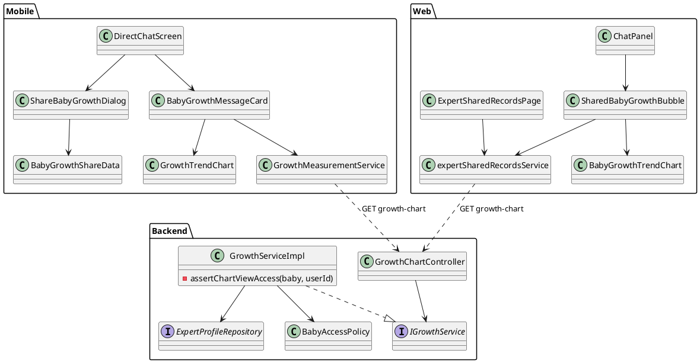
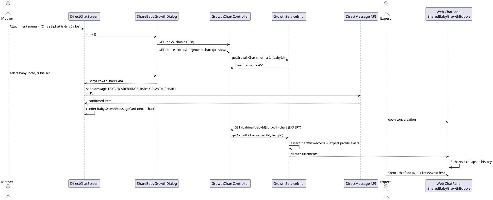

# ENGINEERING DOCUMENTATION STANDARD (EDS) v2.0
# Technical Design Specification — Share Baby Growth in Direct Chat

| Field | Value |
| --- | --- |
| **Document ID** | `SBG-TDS` (ShareBabyGrowthInDirectChat) |
| **Version** | `1.0` |
| **Date** | `2026-09-14` |
| **Status** | `Approved` |
| **Document Owner** | `CareBridge Team` |
| **Author** | `AI Agent` |
| **Reviewed by** | `Open` |
| **DPO Sign-off** | `Open — feature widens EXPERT read access to child growth data (see OPEN-02)` |
| **Approved by** | `huynd4104 (user, replied "Approved" 2026-09-14)` |
| **Last Review** | `2026-09-14` |
| **Based on EDS** | `v2.0` |

> Drafts must not claim approval, implementation completion, test success, legal
> compliance, clinical accuracy, availability, or latency without dated evidence.

---

## CHANGELOG

| Date | Author | Change |
| --- | --- | --- |
| `2026-09-14` | `AI Agent` | Initial code- and source-researched Draft. User decisions UD-01..UD-08 recorded. |
| `2026-09-14` | `AI Agent — Amelia (Dev Agent)` | Implemented per §11.2: backend chart-only expert read + role grant, mobile share dialog/card/extracted `GrowthTrendChart`, web `SharedBabyGrowthBubble`/`BabyGrowthTrendChart`/ChatPanel/Shared Records tab. 18/18 SBG test cases pass (Test-Spec §5.3). Existing `BabyCareControllerAuthorizationContractTest` updated for ADR-SBG-002. OPEN-01/OPEN-02 remain open. |

---

## TABLE OF CONTENTS

1. [Module Overview](#1-module-overview)
2. [Traceability Matrix](#2-traceability-matrix)
3. [Architecture Decision Records](#3-architecture-decision-records-adr)
4. [Non-Functional Requirements and SLA](#4-non-functional-requirements-and-sla)
5. [Static Modeling](#5-static-modeling)
6. [Dynamic Modeling](#6-dynamic-modeling)
7. [Domain Event Catalog](#7-domain-event-catalog)
8. [Interface Specification](#8-interface-specification)
9. [API Specification](#9-api-specification)
10. [Error Codes](#10-error-codes)
11. [Implementation and Deployment Plan](#11-implementation-and-deployment-plan)
12. [Rollback and Incident Runbook](#12-rollback-and-incident-runbook)
13. [Verification Scenario Groups](#13-verification-scenario-groups)
14. [Verification Methods](#14-verification-methods)
15. [Verification Samples](#15-verification-samples)
16. [Authorization Matrix](#16-authorization-matrix)
17. [AI Prompt Constraints — CASE 2.0](#17-ai-prompt-constraints--case-20)

---

## 1. Module Overview

| Field | Value |
| --- | --- |
| **Feature Name** | Share Baby Growth in Direct Chat |
| **Bounded Context** | Backend `carejourney` (growth read access); Mobile `features/directChat` + `features/baby`; Web `features/directChat` + `features/expert` |
| **Function / UC IDs** | Extends `UC-EX-10 ExchangeDirectMessages` and `UC-EX-12 ReviewSharedMaternalCare`; consumes `UC-BC-05 ManageGrowthMeasurements` data. No dedicated SRS function ID exists (see OPEN-05). |
| **SRS Reference** | None found. `02_Requirements/SRS/Report3_Functional_Specifications.md` has no growth-sharing-to-expert statement. Oracle = user request and decisions dated 2026-09-14 (UD-01..UD-08). |
| **Primary Actor** | MOTHER (sender, owner of the baby profile) |
| **Secondary Actors** | EXPERT (viewer on Web portal and, if used, Mobile); MOTHER also views her own sent card |
| **Trigger** | Mother opens the attachment menu in a direct conversation and chooses "Chia sẻ phát triển của bé" |
| **User Outcome** | A chat card shows three growth trend charts (weight, height, head circumference) over **all** measurements of the selected baby, plus an expand/collapse measurement history list below the charts. Both participants see it. The Web expert portal renders the same card in chat and lists it on the Shared Records page. |
| **Platforms** | Backend / Web / Mobile |
| **Priority** | `Open unless sourced` |
| **Data Classification** | Sensitive-PII (child health measurements: `weight_kg`, `height_cm`, `head_circumference_cm`, baby nickname, birth date) |
| **Compliance Scope** | Health data RBAC per `CLAUDE.md` Safety Rules; PDPA/consent scope `Open` (OPEN-02) |
| **Upstream Dependencies** | `GET /api/v1/babies/{babyId}/growth-chart`; `GET /api/v1/babies`; direct message send `POST` used by `DirectChatService.sendMessage`; `V12` body check |
| **Downstream Consumers** | Mobile `DirectChatScreen` bubble; Web `ChatPanel`; Web `ExpertSharedRecordsPage` via `fetchExpertSharedRecords` |

### 1.1 Current-State Baseline

- **Health-metrics share (precedent).** Mobile `ShareHealthMetricsDialog` (`CareBridgeMobileApp/lib/features/directChat/widgets/share_health_metrics_dialog.dart`) returns `HealthMetricsShareData`. `DirectChatScreen._openShareHealthMetrics` serializes it as `'[CAREBRIDGE_HEALTH_SHARE]\n' + JSON` and sends it as a `TEXT` message (`direct_chat_screen.dart:450-488`). Rendering is client-side tag parsing: Mobile `HealthMetricsMessageCard` (`health_metrics_message_card.dart`), Web `SharedHealthMetricsBubble` (`CareBridgeWebApp/src/features/directChat/components/SharedHealthMetricsBubble.tsx`) via `parseHealthMetricsShare` in `expertSharedRecordsService.ts:84`. Cards live-refresh from `GET /api/v1/journeys/{journeyId}/metrics`. Backend has no knowledge of share tags.
- **Checklist share** follows the same tag pattern (`[CAREBRIDGE_CHECKLIST_SHARE]`).
- **Message body limit.** `V12__restore_direct_message_body_check.sql` enforces `length(btrim(message_body)) BETWEEN 1 AND 2000` (BR-DCC-005).
- **Growth data.** `GrowthChartController.getGrowthChart` (`carejourney/controller/GrowthChartController.java`) is `@PreAuthorize("hasAnyRole('MOTHER', 'FAMILY')")`. `GrowthServiceImpl.getGrowthChart` → `assertViewAccess` (owner or `BabyAccessPolicy.canView`). It returns **all** non-deleted measurements ordered by `measured_date ASC` with `ageInDays`. `measuredDate` is `LocalDate`, so no time-of-day is stored.
- **Expert access precedent.** `HealthMetricServiceImpl.requireTrendAccess` allows the journey owner **or any user with an `ExpertProfile`** (`expertProfileRepository.findByUserId(userId).isPresent()`), with no conversation scoping and no audit.
- **Mobile growth charts.** `BabyProfileDetailScreen` growth tab draws charts with private `_TrendChartPainter` (`baby_profile_detail_screen.dart:2186`). It is covered by the staged test `test/features/baby/baby_growth_charts_tab_test.dart`.
- **Web charts.** No chart dependency in `CareBridgeWebApp/package.json`; inline SVG only.
- **Web Shared Records.** `SharedRecordEntry.type` is `'HEALTH_METRICS' | 'CHECKLIST'` (`expertSharedRecordsService.ts:73`); `ExpertSharedRecordsPage.tsx` groups records per mother, with tabs `ALL | HEALTH_METRICS | CHECKLIST`.
- **Gap.** No baby-growth share exists on any platform. EXPERT cannot read growth data (403 at controller).

### 1.2 In Scope

- Mobile attachment option "Chia sẻ phát triển của bé", baby picker bottom sheet (UD-04), and sending a tagged reference message.
- Mobile `BabyGrowthMessageCard`: three trend charts over all measurements (UD-02), history toggle below charts (UD-03), and date + age per row (UD-06).
- Web `SharedBabyGrowthBubble` in `ChatPanel` with the same content/behavior (UD-07).
- Web Shared Records page: new record type `BABY_GROWTH`, tab filter and card section (UD-07).
- Backend: allow EXPERT to call `GET /api/v1/babies/{babyId}/growth-chart`, with the same broad expert-profile rule as `requireTrendAccess` (UD-05).
- Extract the mobile trend painter into a reusable public widget with no visual change to the baby profile growth tab.

### 1.3 Out of Scope

- Embedding the full measurement history in the message body. Blocked by the 2000-char limit (ADR-SBG-001).
- EXPERT access to `GET /growth-measurements` (paginated history) or any growth write endpoint.
- Conversation-scoped or consent-scoped expert authorization. The user rejected it for parity with health metrics (UD-05); the risk is recorded in OPEN-02.
- Storing time-of-day for measurements (UD-06 — no schema change).
- Month/period filters inside the shared card (UD-02 "tất cả chứ không theo tháng").
- WHO percentile bands, clinical interpretation or status labels (not sourced; AI/clinical safety rule).
- FAMILY-initiated sharing (direct conversations are MOTHER ↔ EXPERT only: `DirectConversation.motherUserId/expertUserId`).
- A new `MessageType` enum value or Backend message parsing.

### 1.4 Preconditions and Postconditions

| Type | ID | Condition | Oracle source |
| --- | --- | --- | --- |
| Precondition | `PRE-01` | Caller is the MOTHER participant of an ACTIVE direct conversation with write permission (`_canWrite`) | `direct_chat_screen.dart:451` precedent |
| Precondition | `PRE-02` | Mother owns at least one baby profile returned by `GET /api/v1/babies` | `BabyService.listBabyProfiles` |
| Postcondition | `POST-01` | One `TEXT` direct message exists whose body starts with `[CAREBRIDGE_BABY_GROWTH_SHARE]` and whose trimmed length is ≤ 2000 | `V12` check; UD-01 |
| Postcondition | `POST-02` | Rendering the message on Mobile/Web fetches `growth-chart` and shows 3 charts over all returned measurements | UD-02 |
| Postcondition | `POST-03` | No growth measurement row is created, updated or deleted | ADR-SBG-002 |

### 1.5 Open Questions and Contradictions

| ID | Question or contradiction | Evidence | Decision required |
| --- | --- | --- | --- |
| `OPEN-01` | Should an EXPERT read of `growth-chart` write an audit event? The precedent `requireTrendAccess` does not audit. `CLAUDE.md` requires audit to be preserved for health workflows, but no existing rule mandates read audits. | `HealthMetricServiceImpl.java:305-313`; `AuditAction.java` has no read action | Reviewer/DPO. The Draft adds **no** audit (parity). If approved, add `AuditAction` value; `audit_events.event_category` is `varchar(80)` without check constraint, so no migration is needed. |
| `OPEN-02` | Any verified-or-unverified expert profile holder can read any baby's growth chart by UUID, including babies never shared with them. | UD-05 (user chose parity with health metrics); `requireTrendAccess` | DPO sign-off / risk acceptance. The user decision stands for this Draft. |
| `OPEN-03` | User wrote "vòng đời"; interpreted as **vòng đầu** (head circumference), the third growth series. | User request; `GrowthMeasurement.headCircumferenceCm`; growth tab label "Vòng đầu" | Confirm on review |
| `OPEN-04` | Archived baby: `getGrowthChart` does not check `BabyProfileStatus`, so an old share of an archived baby still renders data. | `GrowthServiceImpl.getGrowthChart` | Accept current behavior (Draft assumes accept) |
| `OPEN-05` | No SRS function ID/UC number for this feature. | SRS search 2026-09-14 | Assign UC ID if required by traceability process |

---

## 2. Traceability Matrix

| Requirement / Decision ID | Type | Requirement or decision | Source location | Owning component | Test condition |
| --- | --- | --- | --- | --- | --- |
| `UD-01` | User decision | Add "share baby development" to the attachment/share menu of mother↔expert direct chat | User request 2026-09-14 | Mobile `DirectChatScreen._showAttachmentMenu` | `COND-11` |
| `UD-02` | User decision | Share the **whole** weight/height/head-circumference trend, not month-filtered | User request 2026-09-14 | `BabyGrowthMessageCard`, `SharedBabyGrowthBubble` | `COND-08` |
| `UD-03` | User decision | Sent card has an expand button showing measurement history (date + indices), collapsible, located below the 3 charts; visible to expert and mother | User request 2026-09-14 | same | `COND-09`, `COND-11` |
| `UD-04` | User decision | Baby picker bottom sheet (preselect, single-baby auto-select, preview, note) | AskUserQuestion answer 2026-09-14 | `ShareBabyGrowthDialog` | `COND-07` |
| `UD-05` | User decision | Expert access rule = any expert profile (same as health metrics) | AskUserQuestion answer 2026-09-14 | `GrowthServiceImpl`, `GrowthChartController` | `COND-01`..`COND-04` |
| `UD-06` | User decision | History row = measured date + baby age at that date; no schema change | AskUserQuestion answer 2026-09-14 | card/bubble formatters | `COND-09` |
| `UD-07` | User decision | Web portal: ChatPanel bubble **and** Shared Records page type/tab | AskUserQuestion answer 2026-09-14 | Web components/service | `COND-13`, `COND-14` |
| `UD-08` | User decision | Logic mirrors the health-metrics share (tag + live sync) | User request 2026-09-14 | all clients | `COND-05`, `COND-06` |
| `BR-DCC-005` | BR | TEXT body 1..2000 chars after trim | `V12__restore_direct_message_body_check.sql:5-9` | `BabyGrowthShareData.serialize` | `COND-05` |
| `ADR-SBG-001` | ADR | Reference payload + live fetch | §3 | clients | `COND-05`, `COND-08` |
| `ADR-SBG-002` | ADR | Read-only widening of growth-chart only | §3 | backend | `COND-03`, `COND-04` |
| `ADR-SBG-003` | ADR | Extract reusable mobile trend chart | §3 | Mobile `growth_trend_chart.dart` | `COND-12` |
| `SAFE-01` | Repo rule | Preserve RBAC; do not weaken validation; no clinical diagnosis | `CLAUDE.md` Safety Rules | all | `COND-03`, `COND-15` |

---

## 3. Architecture Decision Records (ADR)

### ADR-SBG-001 — Reference payload with live fetch instead of snapshot

| Field | Value |
| --- | --- |
| **Status** | `Proposed` |
| **Date** | `2026-09-14` |
| **Deciders** | `Open` (driven by UD-02 + BR-DCC-005) |
| **Sources** | `V12__restore_direct_message_body_check.sql`; `HealthMetricsShareData` precedent |

#### Context

UD-02 requires all measurements. A compact measurement is about 45 JSON characters. At about 40 measurements, the 2000-character body limit is reached, so a snapshot cannot hold an unbounded history.

#### Options Considered

| Option | Benefits | Costs / Risks |
| --- | --- | --- |
| A. Full snapshot in body | Works without backend change | Violates `direct_messages_body_ck` for long histories; must truncate → contradicts UD-02 |
| B. Reference `{babyId,…}` + latest snapshot; card fetches `growth-chart` | Unbounded history; always up to date; mirrors health `isLiveSync` | Requires EXPERT read access (ADR-SBG-002); card shows current data, not data at send time |
| C. Backend file attachment (JSON/PDF) | No body limit | New generation pipeline; not a chart card; larger scope |

#### Decision

Option B. The body carries `babyId`, `babyNickname`, `birthDate`, `measurementCount`, a `latest` snapshot for offline fallback, an optional `note` (≤ 500 chars client-side), and `isLiveSync: true`.

#### Consequences

- Positive: Satisfies "all measurements"; no schema change; same parsing model as existing shares.
- Trade-off: Deleted or edited measurements change what old cards display.
- Compatibility: Old clients render the body as plain text (same as other tags today).

### ADR-SBG-002 — Widen only `GET growth-chart` to EXPERT using expert-profile rule

| Field | Value |
| --- | --- |
| **Status** | `Proposed` (rule chosen by UD-05; DPO sign-off Open) |
| **Date** | `2026-09-14` |
| **Deciders** | User (UD-05); DPO `Open` |
| **Sources** | `HealthMetricServiceImpl.requireTrendAccess`; `GrowthServiceImpl.assertViewAccess` |

#### Context

Live fetch requires EXPERT to read growth data. Today the controller denies EXPERT, and `BabyAccessPolicy.canView` only covers the owner and care-group members.

#### Options Considered

| Option | Benefits | Costs / Risks |
| --- | --- | --- |
| A. Any expert profile (parity) | Matches health-metrics share; simple | Broad read (OPEN-02) |
| B. Expert with ACTIVE conversation with baby owner | Least privilege | Rejected by user (UD-05) |
| C. Add EXPERT to `BabyAccessPolicy.canView` | Central | Would widen every baby read path (profile, logs, vaccinations) — unacceptable blast radius |

#### Decision

Option A, applied **only** to `getGrowthChart`. `GrowthServiceImpl` gets a new private `assertChartViewAccess(baby, userId)`: owner, `babyAccessPolicy.canView`, or `expertProfileRepository.findByUserId(userId).isPresent()`. The shared `assertViewAccess` (used by history) and `BabyAccessPolicy` stay unchanged.

#### Consequences

- Positive: No other baby endpoint changes behavior.
- Trade-off: Duplicates the expert rule already in `HealthMetricServiceImpl`; not consolidated into a shared policy.
- Compatibility: MOTHER/FAMILY behavior unchanged.

### ADR-SBG-003 — Extract mobile trend painter into a public widget

| Field | Value |
| --- | --- |
| **Status** | `Proposed` |
| **Date** | `2026-09-14` |
| **Deciders** | `Open` |
| **Sources** | `baby_profile_detail_screen.dart:1836-1904, 2186-2335`; `baby_growth_charts_tab_test.dart` |

#### Context

The card needs the same chart visuals as the baby growth tab, but the painter is file-private.

#### Options Considered

| Option | Benefits | Costs / Risks |
| --- | --- | --- |
| A. Extract to `lib/features/baby/widgets/growth_trend_chart.dart` | Single visual source | Touches a file with staged changes; regression test must stay green |
| B. Duplicate painter in chat widget | No touch to baby screen | Visual drift, duplicated code |

#### Decision

Option A. Move the painter code without changing its behavior. The existing growth tab test is the regression oracle.

#### Consequences

- Positive: Consistent visuals.
- Trade-off: Minor refactor of a large screen file.
- Compatibility: No API change.

---

## 4. Non-Functional Requirements and SLA

| Category | Requirement | Target | Verification method | Oracle source |
| --- | --- | --- | --- | --- |
| Performance | Card fetch per render | `Open` — one `growth-chart` call per mounted card; no SLA sourced | Code review | Precedent `syncLiveHealthMetrics` |
| Availability | Card must not crash when fetch fails | Fallback to `latest` snapshot + error text | Widget/component tests | ADR-SBG-001 |
| Security | EXPERT access limited to `growth-chart` read | 403 on history/write for EXPERT | Service + WebMvc tests | ADR-SBG-002 |
| Privacy | Body contains no measurement history array | Only `latest` snapshot | Unit test on `serialize` | ADR-SBG-001 |
| Accessibility | Toggle is a button with visible text label | Text "Xem lịch sử đo (N)" / "Thu gọn lịch sử" | Widget/component tests | UD-03 |
| Data integrity | Serialized body ≤ 2000 chars trimmed | Note ≤ 500 chars, nickname as stored | Unit test (boundary) | BR-DCC-005 |

---

## 5. Static Modeling

### 5.1 Component Responsibilities and Planned Paths

Paths are relative to `05_Development/`.

| Platform / Layer | Current or planned path | Symbol / artifact | Responsibility | Change type |
| --- | --- | --- | --- | --- |
| Backend Controller | `CareBridgeAPI/src/main/java/com/carebridge/backend/carejourney/controller/GrowthChartController.java` | `getGrowthChart` | `@PreAuthorize("hasAnyRole('MOTHER', 'FAMILY', 'EXPERT')")` | Modify |
| Backend Controller | `.../carejourney/controller/GrowthMeasurementController.java` | all | Unchanged (EXPERT still denied) | None |
| Backend Service | `.../carejourney/service/impl/GrowthServiceImpl.java` | `getGrowthChart`, new private `assertChartViewAccess` | Inject `com.carebridge.backend.expert.repository.ExpertProfileRepository`; chart-only expert rule | Modify |
| Backend Service | `.../carejourney/service/IGrowthService.java` | `getGrowthChart` Javadoc | Document expert access | Modify (doc) |
| Policy | `.../baby/policy/BabyAccessPolicy.java` | — | Unchanged | None |
| Mobile model+card | `CareBridgeMobileApp/lib/features/directChat/widgets/baby_growth_message_card.dart` | `BabyGrowthShareData`, `BabyGrowthLatestSnapshot`, `BabyGrowthMessageCard` | Tag parse/serialize; fetch chart; 3 charts; history toggle; note; fallback | Add |
| Mobile dialog | `CareBridgeMobileApp/lib/features/directChat/widgets/share_baby_growth_dialog.dart` | `ShareBabyGrowthDialog.show` | Baby picker, preview, note (≤500), confirm | Add |
| Mobile screen | `CareBridgeMobileApp/lib/features/directChat/screens/direct_chat_screen.dart` | `_showAttachmentMenu`, new `_openShareBabyGrowth`, bubble `isRichCard`, `_buildTextOrRichContent` | Menu option; send; render card | Modify |
| Mobile chart | `CareBridgeMobileApp/lib/features/baby/widgets/growth_trend_chart.dart` | `GrowthTrendChart`, `GrowthTrendChartPainter`, `formatBabyAgeAt` | Extracted painter + age formatter | Add |
| Mobile screen | `CareBridgeMobileApp/lib/features/baby/screens/baby_profile_detail_screen.dart` | `_buildTrendChart` | Use extracted painter | Modify |
| Mobile service | `CareBridgeMobileApp/lib/features/healthRecords/services/growth_measurement_service.dart` | new `getGrowthChartMeasurements(babyId)` | Parse `growth-chart` `measurements` via `GrowthMeasurement.fromJson` | Modify |
| Web service | `CareBridgeWebApp/src/features/expert/services/expertSharedRecordsService.ts` | `BABY_GROWTH_SHARE_TAG`, `BabyGrowthShareData`, `parseBabyGrowthShare`, `fetchBabyGrowthChart`, `formatBabyAgeAt`, `SharedRecordEntry.type` + `babyGrowthData`, `fetchExpertSharedRecords` branch | Parse, fetch, records | Modify |
| Web component | `CareBridgeWebApp/src/features/directChat/components/BabyGrowthTrendChart.tsx` | `BabyGrowthTrendChart` | Inline SVG polyline chart | Add |
| Web component | `CareBridgeWebApp/src/features/directChat/components/SharedBabyGrowthBubble.tsx` | `SharedBabyGrowthBubble` | Card mirroring mobile | Add |
| Web component | `CareBridgeWebApp/src/features/directChat/components/ChatPanel.tsx` | message render branch | Route tag → bubble | Modify |
| Web page | `CareBridgeWebApp/src/features/expert/pages/ExpertSharedRecordsPage.tsx` | `TabType`, grouping, `cardTabMap`, tab buttons | Add `BABY_GROWTH` tab/section | Modify |
| External adapter | — | — | Not applicable — no provider | None |

### 5.2 Class / Component Diagram



### 5.3 Data Model and Schema Delta

| Table / Store | Current fields used | Planned delta | Classification | Owner |
| --- | --- | --- | --- | --- |
| `growth_measurements` (via `GrowthMeasurement`) | `measured_date`, `weight_kg`, `height_cm`, `head_circumference_cm`, `note`, `deleted_at` | None (read only) | Sensitive-PII | `carejourney` |
| `baby_profiles` | `id`, `owner_user_id`, `nickname`, `birth_date` | None | Sensitive-PII | `baby` |
| `expert_profiles` | `user_id` lookup | None | PII | `expert` |
| `direct_messages` | `message_body` (TEXT, ≤2000) | None — new client tag only | Sensitive-PII | `directchat` |

#### Share payload (client-side contract, inside `message_body`)

```text
[CAREBRIDGE_BABY_GROWTH_SHARE]
{"title":"Phát triển của bé","babyId":"<uuid>","babyNickname":"<string>","birthDate":"YYYY-MM-DD",
 "measurementCount":<int>,"latest":{"measuredDate":"YYYY-MM-DD","weightKg":<num|null>,"heightCm":<num|null>,"headCircumferenceCm":<num|null>} | null,
 "isLiveSync":true,"note":"<≤500 chars>" | null}
```

Parse rule (both clients): body trimmed starts with the tag; JSON decodes; `babyId` is a non-empty string. Otherwise `null` (render as plain text).

#### Migration Plan

- Current authoritative baseline: `V1__baseline_production_schema.sql` + V2..V12 migrations.
- Existing relevant migrations: `V12__restore_direct_message_body_check.sql`.
- New migration required: `No`.
- Collision check: Not applicable.
- Baseline sync action: Not applicable — no schema delta.
- Roll-forward and data-backfill constraints: None. If OPEN-01 is approved, the new `AuditAction` value needs no migration (`audit_events.event_category varchar(80)`, no general check constraint).

---

## 6. Dynamic Modeling

### 6.1 Happy Path Sequence



### 6.2 Alternative and Empty-State Flows

| Flow ID | Trigger | Behavior | Postcondition | Oracle |
| --- | --- | --- | --- | --- |
| `ALT-01` | Mother has exactly one baby | Picker preselects it | Send enabled | UD-04 |
| `ALT-02` | Multiple babies | Preselect `BabyProfileSelectionStorage.readLastOpenedBabyProfileId()` if in list, else first | — | UD-04 |
| `ALT-03` | Mother has no baby | Empty state "Chưa có hồ sơ bé" and disabled send | No message | UD-04 |
| `ALT-04` | Baby has 0 measurements | Send allowed; each chart shows "Chưa có dữ liệu cân nặng/chiều cao/vòng đầu."; toggle hidden | Message sent with `measurementCount:0`, `latest:null` | Growth tab empty-text precedent `baby_profile_detail_screen.dart:1858-1866` |
| `ALT-05` | Measurement has null series value | Point skipped in that chart; history row shows `—` | — | `_buildTrendChart` null filtering precedent |
| `ALT-06` | Only 1 point in a series | Range text shows single value `"x.x unit"` | — | `baby_profile_detail_screen.dart:1888-1893` |
| `ALT-07` | Message recalled | Not rendered as card | — | `isRichCard` requires `recalledAt == null` (`direct_chat_screen.dart:1217-1219`) |
| `ALT-08` | Viewer is the mother (own message) | Same card; fetch as owner | — | UD-03 |

### 6.3 Error, Timeout, Retry, and Concurrency Flows

| Flow ID | Failure or race | Detection | System response | Side effects | Oracle |
| --- | --- | --- | --- | --- | --- |
| `ERR-01` | `growth-chart` returns 403/404/network error on card | Exception from service | Card shows `latest` snapshot and text "Không thể tải dữ liệu tăng trưởng mới nhất"; charts replaced by that notice | None | ADR-SBG-001; health card silent fallback precedent |
| `ERR-02` | Send fails | `sendMessage` throws | Remove optimistic item; snackbar "Không thể gửi phát triển của bé. Vui lòng thử lại." | None | `_openShareHealthMetrics` precedent |
| `ERR-03` | Malformed tagged body | JSON decode fails / no `babyId` | Render plain text | None | `HealthMetricsShareData.parse` precedent |
| `ERR-04` | Serialized body > 2000 | Client pre-check | Block send; snackbar asks to shorten note | None | BR-DCC-005 |
| `ERR-05` | Double tap send | `_sending` guard | Second call ignored | One message | `_openShareHealthMetrics` guard |
| `ERR-06` | Non-expert, non-owner, non-member calls chart | `assertChartViewAccess` | 403 `BABY-071` | None | `GrowthServiceImpl.assertViewAccess` |

### 6.4 State Machine and Invariants

Not applicable. The feature has no persisted lifecycle. Card UI state: `loading → loaded | failed`; history `collapsed ↔ expanded` (default collapsed).

Invariants:
- `INV-01` Charts always use all measurements returned by `growth-chart` (no period filter).
- `INV-02` Charts order points by `measuredDate` ascending; the history list orders them descending.
- `INV-03` EXPERT never reaches history/write growth endpoints.
- `INV-04` No clinical status/percentile label is shown.

---

## 7. Domain Event Catalog

| Event | Published by | Trigger | Payload schema | Consumers | Delivery / retry |
| --- | --- | --- | --- | --- | --- |
| Existing direct-message events (unchanged) | `DirectMessageService` / `ConversationEventDomainEvent` | Message send | Unchanged | `DirectMessageNotificationListener`, Firebase signal | Unchanged |

Not applicable for new events. The share is an ordinary TEXT message.

---

## 8. Interface Specification

### 8.1 Service Interfaces

```java
// Signature-only contract. Signature unchanged; Javadoc gains expert rule.
public interface IGrowthService {
    /** @throws BusinessException BABY-070/404 not found; BABY-071/403 when caller is not owner,
     *  not a care-group viewer, and has no ExpertProfile. */
    GrowthChartResponse getGrowthChart(UUID userId, UUID babyId);
    Page<GrowthMeasurementHistoryItem> getGrowthMeasurementHistory(UUID userId, UUID babyId, Pageable pageable); // unchanged, no expert access
}
```

### 8.2 Repository Interfaces

```java
// Existing, reused.
public interface ExpertProfileRepository {
    Optional<ExpertProfile> findByUserId(UUID userId);
}
public interface GrowthMeasurementStore {
    List<GrowthMeasurement> findByBabyIdAndDeletedAtIsNullOrderByMeasuredDateAsc(UUID babyId);
}
```

### 8.3 Client and External Adapter Interfaces

| Interface | Input | Output | Timeout / retry | Failure mapping | Source |
| --- | --- | --- | --- | --- | --- |
| Mobile `GrowthMeasurementService.getGrowthChartMeasurements(String babyId)` | babyId | `Future<List<GrowthMeasurement>>` (ASC) | Default `api_client` | Throws → ERR-01 | planned |
| Mobile `BabyGrowthShareData.parse(String?)` / `serialize()` / `isBabyGrowthShareMessage` | body | data / string | — | null on malformed | planned |
| Mobile `ShareBabyGrowthDialog.show(BuildContext)` | — | `Future<BabyGrowthShareData?>` | — | null on dismiss | planned |
| Mobile `formatBabyAgeAt(DateTime birthDate, DateTime at)` | dates | `String` mirroring `BabyProfile.ageLabel` with `now` replaced by `at`: `months = (at.year - birthDate.year) * 12 + at.month - birthDate.month` (**day-of-month ignored**); `months < 1` → `"<at.difference(birthDate).inDays> ngày tuổi"`; `months < 12` → `"<months> tháng tuổi"`; else `years = months ~/ 12`, `rem = months % 12` → `"<years> tuổi"` if `rem == 0`, otherwise `"<years> tuổi <rem> tháng"` | — | — | `baby_model.dart:57-70` |
| Web `parseBabyGrowthShare(body?: string): BabyGrowthShareData \| null` | body | data | — | null | planned |
| Web `fetchBabyGrowthChart(babyId: string): Promise<BabyGrowthPoint[]>` | babyId | ASC points | axios default | rejects → ERR-01 | planned |
| Web `formatBabyAgeAt(birthDate: string, at: string): string` | ISO dates | same rules as mobile | — | — | planned |

---

## 9. API Specification

### 9.1 Endpoint Table

| Method | Path | Handler | Exact source | Authentication / roles / scope | Request type | Response type | Explicit statuses |
| --- | --- | --- | --- | --- | --- | --- | --- |
| GET | `/api/v1/babies/{babyId}/growth-chart` | `GrowthChartController.getGrowthChart` | `carejourney/controller/GrowthChartController.java` | JWT; `hasAnyRole('MOTHER','FAMILY','EXPERT')` (**Modify**); service: owner OR `BabyAccessPolicy.canView` OR ExpertProfile exists | path `babyId` UUID | `ApiResponse<GrowthChartResponse>` | 200, 401, 403 `BABY-071`, 404 `BABY-070` |
| GET | `/api/v1/babies/{babyId}/growth-measurements` | `GrowthMeasurementController.getGrowthMeasurementHistory` | same package | Unchanged `MOTHER, FAMILY` | — | — | EXPERT → 403 (regression) |
| GET | `/api/v1/babies` | `BabyController` | `baby/controller/BabyController.java` | Unchanged | — | — | Consumed by picker |
| POST | direct message send (existing) | `DirectMessageController` | `directchat/controller/DirectMessageController.java` | Unchanged | `messageType:TEXT`, `messageBody`, `clientMessageId` | Unchanged | Unchanged |

### 9.2 Request / Response Contract

#### `GET /api/v1/babies/{babyId}/growth-chart`

| Item | Exact current contract |
| --- | --- |
| Handler / source | `GrowthChartController.getGrowthChart` / `GrowthServiceImpl.getGrowthChart` |
| Authorization | `@PreAuthorize("hasAnyRole('MOTHER', 'FAMILY', 'EXPERT')")` + `assertChartViewAccess` |
| Parameters | `babyId` (UUID path), `Principal` |
| Request fields / validators | None |
| Response fields | `babyId:UUID`, `nickname:String`, `birthDate:LocalDate`, `measurements:[{growthMeasurementId:UUID, measuredDate:LocalDate, weightKg:BigDecimal?, heightCm:BigDecimal?, headCircumferenceCm:BigDecimal?, note:String?, ageInDays:int}]` ASC |
| Positive / negative test mapping | `COND-01`, `COND-04` / `COND-02`, `COND-03` → `SBG-TC-001..005` |

**Request**

```json
{}
```

**Success response**

```json
{
  "success": true,
  "data": {
    "babyId": "11111111-1111-1111-1111-111111111111",
    "nickname": "Bé Test",
    "birthDate": "2025-01-10",
    "measurements": [
      {"growthMeasurementId": "22222222-2222-2222-2222-222222222222", "measuredDate": "2025-01-10",
       "weightKg": 3.20, "heightCm": 50.0, "headCircumferenceCm": 34.0, "note": null, "ageInDays": 0}
    ]
  }
}
```

**Validation, authorization, conflict, and dependency responses**

| Condition | HTTP | Error code | Response rule | Oracle |
| --- | --- | --- | --- | --- |
| No/invalid JWT | 401 | — | Spring Security | Security config |
| Role not in MOTHER/FAMILY/EXPERT | 403 | — | `@PreAuthorize` | ADR-SBG-002 |
| Baby not found | 404 | `BABY-070` | existing | `GrowthServiceImpl.getBabyOrThrow` |
| Not owner, not care-group viewer, no ExpertProfile | 403 | `BABY-071` | existing message "Baby not accessible to user" | `GrowthServiceImpl.assertViewAccess` |

---

## 10. Error Codes

| Code | HTTP status | Message / semantic | Trigger | Owning mapper | Test condition |
| --- | --- | --- | --- | --- | --- |
| `BABY-070` | 404 | Baby not found | Unknown `babyId` | `GrowthServiceImpl` / `BusinessException` handler | `COND-02` |
| `BABY-071` | 403 | Baby not accessible to user | ERR-06; EXPERT on history endpoint service path | `GrowthServiceImpl` | `COND-02`, `COND-03` |
| (client) | — | "Không thể tải dữ liệu tăng trưởng mới nhất" | ERR-01 | Mobile card / Web bubble | `COND-10` |
| (client) | — | "Không thể gửi phát triển của bé. Vui lòng thử lại." | ERR-02 | `DirectChatScreen` | `COND-11` |

No new backend error codes.

---

## 11. Implementation and Deployment Plan

### 11.1 Prerequisites

- [x] TDS and paired Test-Spec reviewed; status remains Draft until human approval.
- [ ] OPEN-01 (audit) and OPEN-02 (DPO risk acceptance) decided or explicitly deferred.
- [x] GitNexus `impact` run on `GrowthServiceImpl.getGrowthChart`, `GrowthChartController.getGrowthChart`, `_TrendChartPainter`, `fetchExpertSharedRecords`, `SharedRecordEntry` before editing.

### 11.2 Ordered Implementation Steps

1. Migration: Not applicable.
2. Backend: `GrowthServiceImpl` inject `ExpertProfileRepository`, add `assertChartViewAccess`, use it in `getGrowthChart`; update `IGrowthService` Javadoc; extend `GrowthServiceTest`.
3. API/security: `GrowthChartController` `@PreAuthorize` add `EXPERT`; add `GrowthChartControllerSecurityTest`.
4. Mobile shared chart: extract `_TrendChartPainter` → `lib/features/baby/widgets/growth_trend_chart.dart` (`GrowthTrendChart` widget + `formatBabyAgeAt`); update `baby_profile_detail_screen.dart`; run `baby_growth_charts_tab_test.dart`.
5. Mobile service: `GrowthMeasurementService.getGrowthChartMeasurements`.
6. Mobile share: `baby_growth_message_card.dart`, `share_baby_growth_dialog.dart`; wire `direct_chat_screen.dart` (menu option icon `Icons.child_care_rounded`, title "Chia sẻ phát triển của bé", subtitle "Gửi biểu đồ cân nặng, chiều cao, vòng đầu của bé"; `_openShareBabyGrowth`; `isRichCard`; `_buildTextOrRichContent`).
7. Web: service additions; `BabyGrowthTrendChart.tsx`; `SharedBabyGrowthBubble.tsx`; `ChatPanel.tsx` branch; `ExpertSharedRecordsPage.tsx` tab "Tăng trưởng bé", per-mother `latestBabyGrowthRecord`/`allBabyGrowthRecords`, and card section rendering `SharedBabyGrowthBubble`.
8. Tests per Test-Spec; `flutter analyze`, `flutter test`, `npm run lint`, `npm run build`, `npm run test:run`, targeted `./mvnw test`.

#### Card layout contract (Mobile and Web identical order)

1. Header: icon (child care), title `Phát triển của bé`, `Live` badge, subtitle `"<babyNickname> · <age now> · <N> lần đo"`.
   **Count source:** after a successful fetch, `N` (subtitle and toggle) = length of the fetched measurement list. Payload `measurementCount` and `latest` are used only in the ERR-01 fallback.
2. Chart 1 `Xu hướng cân nặng` (kg), Chart 2 `Xu hướng chiều cao` (cm), Chart 3 `Xu hướng vòng đầu` (cm). Each has a range caption `"a.a unit – b.b unit"`, where `a` = the first and `b` = the last **chronological** non-null value of that series (not min/max; same as `_buildTrendChart` `values.first`/`values.last`). With one point the caption is `"a.a unit"`; with zero points it shows the empty text.
3. Toggle button (only when N ≥ 1): collapsed label `Xem lịch sử đo (N)`, expanded label `Thu gọn lịch sử`.
4. History list (expanded): newest first; row = `"dd/MM/yyyy · <formatBabyAgeAt(birthDate, measuredDate)>"` + `"<w> kg · <h> cm · <hc> cm"`. Null values render as `—`, using 1 decimal.
5. Note block (if note present), same style as health card.

### 11.3 Compatibility Strategy

- API compatibility: Additive role grant; response unchanged.
- Data compatibility: No schema change.
- Client rollout order: Backend first (otherwise EXPERT cards show ERR-01 fallback); then Web and Mobile in any order. Old clients show raw tagged text.
- Feature flag / staged rollout: `Open` — none sourced.

### 11.4 Deployment Checklist

- [x] No migration.
- [x] `./mvnw test -Dtest=GrowthServiceTest,GrowthChartControllerSecurityTest`
- [ ] `npm run lint && npm run build && npm run test:run` — build passed; eslint on changed files and vitest for directChat/expert (40/40) passed; full lint/test:run not executed
- [ ] `flutter analyze && flutter test` — not fully green: `flutter analyze` crashed (analysis server exit 255; `dart analyze` on changed files clean) and pre-existing unrelated mobile test failures remain (Test-Spec EVD-05)

---

## 12. Rollback and Incident Runbook

### 12.1 Rollback Triggers

| Trigger | Threshold | Decision owner |
| --- | --- | --- |
| Evidence of unauthorized/abusive expert reads of growth data | `Open` | DPO / Tech lead |
| Card crashes chat timeline | Any reproducible crash | Tech lead |
| Growth tab regression in baby profile | Any failing `baby_growth_charts_tab_test` | Mobile owner |

### 12.2 Rollback Procedure

Revert the backend commit to remove `EXPERT` from `@PreAuthorize` and the chart expert rule. Existing shared cards then degrade to the ERR-01 fallback for experts. No data repair is needed. Client reverts are independent: tagged messages render as plain text. No Flyway involvement.

### 12.3 Notification and Post-Incident Review

`Open`.

---

## 13. Verification Scenario Groups

Detailed test cases belong in the paired Test-Spec.

| Group | Conditions | Test-Spec IDs |
| --- | --- | --- |
| Happy path | COND-01, COND-07, COND-08, COND-09, COND-11, COND-13, COND-14 | SBG-TC-001, 008, 009, 010, 012, 015, 017, 018 |
| Boundary / validation | COND-05, COND-06 | SBG-TC-006, 007, 014 |
| Authorization / ownership | COND-02, COND-03, COND-04 | SBG-TC-002, 003, 004, 005 |
| State / concurrency / idempotency | COND-11 (send guard, recalled) | SBG-TC-012 |
| Privacy / safety | COND-05, COND-15 | SBG-TC-006, 009, 015 |
| Provider failure / recovery | COND-10 | SBG-TC-011, 016 |
| Regression | COND-12 | SBG-TC-013 |

---

## 14. Verification Methods

### 14.1 Automated Commands

```bash
# Backend (05_Development/CareBridgeAPI)
./mvnw test -Dtest=GrowthServiceTest,GrowthChartControllerSecurityTest

# Web (05_Development/CareBridgeWebApp)
npm run lint
npm run build
npm run test:run

# Mobile (05_Development/CareBridgeMobileApp)
flutter analyze
flutter test test/features/directChat test/features/baby
```

### 14.2 Database, Audit, and Static Inspection

- `grep -n "hasAnyRole" GrowthMeasurementController.java` → still `'MOTHER', 'FAMILY'` only (INV-03).
- `BabyAccessPolicy.java` has no diff (ADR-SBG-002).
- No new file under `db/migration`.

---

## 15. Verification Samples

Synthetic only.

```text
[CAREBRIDGE_BABY_GROWTH_SHARE]
{"title":"Phát triển của bé","babyId":"11111111-1111-1111-1111-111111111111","babyNickname":"Bé Test","birthDate":"2025-01-10","measurementCount":3,"latest":{"measuredDate":"2025-03-10","weightKg":5.6,"heightCm":58.0,"headCircumferenceCm":39.0},"isLiveSync":true,"note":"Nhờ chuyên gia xem giúp"}
```

Expected history rows (newest first) for measurements 2025-01-10 (3.2/50.0/34.0), 2025-02-10 (4.5/54.5/null), 2025-03-10 (5.6/58.0/39.0):
- `10/03/2025 · 2 tháng tuổi` — `5.6 kg · 58.0 cm · 39.0 cm`
- `10/02/2025 · 1 tháng tuổi` — `4.5 kg · 54.5 cm · —`
- `10/01/2025 · 0 ngày tuổi` — `3.2 kg · 50.0 cm · 34.0 cm`

---

## 16. Authorization Matrix

| Operation / Endpoint | MOTHER | FAMILY | EXPERT | MODERATOR | CONTENT_ADMIN | SYSTEM_ADMIN | Ownership / consent rule |
| --- | --- | --- | --- | --- | --- | --- | --- |
| GET `/babies/{id}/growth-chart` | Allow (owner) | Allow (care group `BABY_VIEW`) | **Allow (any ExpertProfile)** | Deny | Deny | Deny | UD-05; OPEN-02 |
| GET `/babies/{id}/growth-measurements` | Allow | Allow | Deny | Deny | Deny | Deny | Unchanged |
| POST/PATCH/DELETE growth measurements | Allow | Allow (`BABY_GROWTH_WRITE`) | Deny | Deny | Deny | Deny | Unchanged |
| Send growth share message | Allow (conversation participant) | N/A | N/A (no picker for expert) | N/A | N/A | N/A | Existing direct-message policy |
| View growth share card | Allow | N/A | Allow | N/A | N/A | N/A | Conversation participant (existing timeline policy) |

---

## 17. AI Prompt Constraints — CASE 2.0

### 17.1 Constraint Summary Table

| ID | Constraint | Source | Last verified |
| --- | --- | --- | --- |
| `C1` | Serialized share body trimmed length ≤ 2000; no history array in body | BR-DCC-005, ADR-SBG-001 | 2026-09-14 |
| `C2` | Only `growth-chart` gains EXPERT; `BabyAccessPolicy` and `GrowthMeasurementController` unchanged | ADR-SBG-002 | 2026-09-14 |
| `C3` | Charts use all measurements, no period filter | UD-02 | 2026-09-14 |
| `C4` | History toggle below 3 charts, default collapsed, rows newest first, date + age + 3 values | UD-03, UD-06 | 2026-09-14 |
| `C5` | Tag `[CAREBRIDGE_BABY_GROWTH_SHARE]`, messageType `TEXT`, no backend parsing | UD-08 | 2026-09-14 |
| `C6` | No schema/migration, no new dependency (web charts are inline SVG) | CLAUDE.md, §5.3 | 2026-09-14 |
| `C7` | No clinical interpretation/percentile/status labels | CLAUDE.md Safety Rules | 2026-09-14 |
| `C8` | Baby profile growth tab visuals unchanged after painter extraction | ADR-SBG-003 | 2026-09-14 |

### 17.2 Constraint Injection Block

```text
[CONSTRAINT]
1. Share body = "[CAREBRIDGE_BABY_GROWTH_SHARE]\n" + JSON reference; trimmed length <= 2000; note <= 500.
2. Add EXPERT only to GET /api/v1/babies/{babyId}/growth-chart via GrowthServiceImpl.assertChartViewAccess (owner | canView | ExpertProfile).
3. Do not modify BabyAccessPolicy, GrowthMeasurementController, migrations, or package.json dependencies.
4. Card: header, 3 charts (weight/height/head circumference, all data), toggle below, history newest first.
5. No medical interpretation text.

[CONTEXT]
- Bounded context: carejourney (backend), directChat/baby (mobile), directChat/expert (web)
- Data classification: Sensitive-PII child growth data
- Existing interfaces: TDS §8
- Authorization: TDS §16

[TASK]
Produce only the planned artifacts in TDS §11 and satisfy the paired Test-Spec.
```

### 17.3 Constraint Quality Checklist

- [x] Every constraint is specific and traceable.
- [x] Unknowns are Open rather than guessed.
- [x] API, data, authorization, and state constraints agree with §§5–10 and §16.
- [x] No foreign-project identifier, dependency, law, SLA, or path remains.

### 17.4 Anti-Pattern Detection

| AP-ID | Anti-pattern | Signal | Required action |
| --- | --- | --- | --- |
| `AP-AI-001` | Unconstrained generation | Output ignores C1–C8 | Reject |
| `AP-AI-002` | Invented contract | Endpoint/field/error absent from sources | Reject |
| `AP-AI-003` | Implicit architecture decision | Expert rule placed in `BabyAccessPolicy` or conversation scoping added without approval | Stop and mark Open |
| `AP-AI-004` | Layer violation | Authorization moved into controller or client | Reject |
| `AP-AI-005` | Unsafe migration | Any migration added/edited | Reject |
| `AP-AI-006` | Snapshot overflow | Full history serialized into message body | Reject |

---

*Status remains Draft until a human approver reviews the complete source trace,
open items, TDS, and paired Test-Spec.*
