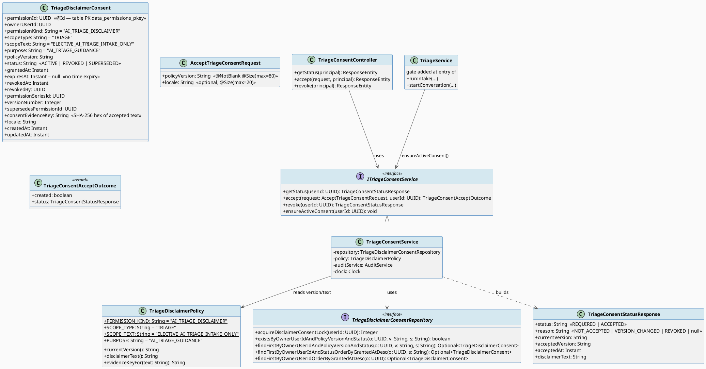
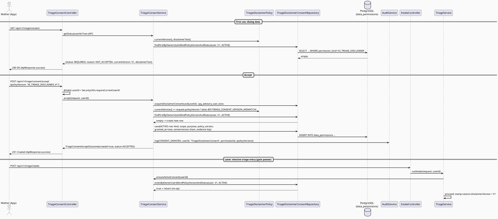
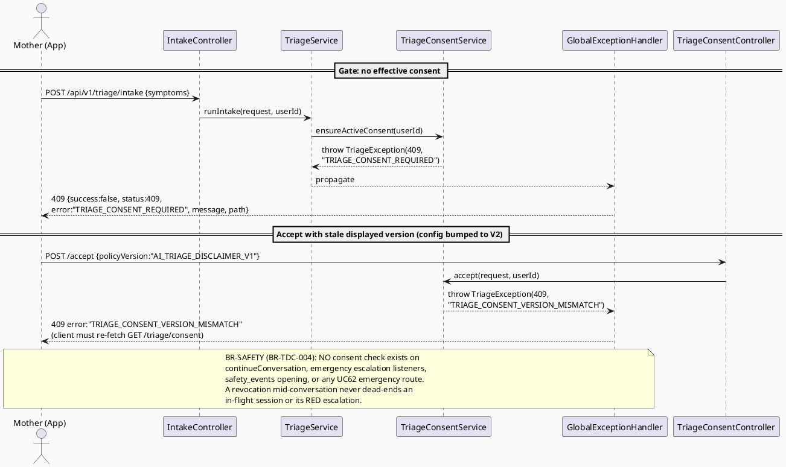
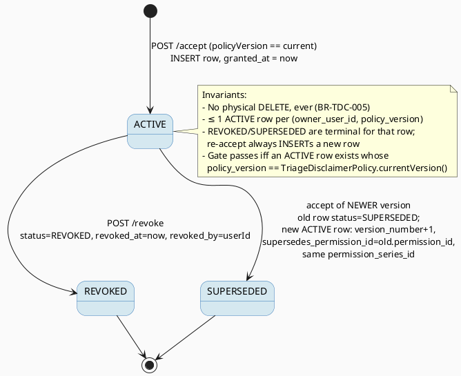

# ENGINEERING DOCUMENTATION STANDARD (EDS) v2.0
# TriageDisclaimerConsent — AI Triage Disclaimer Acknowledgement Gate

| Field | Value |
|-------|-------|
| **Document ID** | `CB-TRIAGE-CONSENT-IMP-001` |
| **Version** | `1.0` |
| **Date** | `2026-07-26` |
| **Status** | `Implemented` *(2026-07-27 — 20/20 TCs passing; the 7 Testcontainers integration TCs executed green on a Docker-capable host, incl. release blocker TDC-TC-18. Spec review status remains Approved.)* |
| **Document Owner** | `AI Agent` |
| **Author** | `AI Agent` |
| **Reviewed by** | `[ ] Pending` |
| **DPO Sign-off** | `[ ] Pending` *(required — module records consent evidence for a Sensitive-PII flow)* |
| **Approved by** | `[ ] Pending` |
| **Last Review** | `2026-07-26` |
| **Based on EDS** | `v2.0` |

> **Scope boundary (explicit):** This TDS is **backend-first**. The Web (React) and Mobile (Flutter) consent dialogs are specified here **only as API contract + interaction notes** (§9.3). UI implementation is **out of scope** of this document and must be specified/implemented separately against the API contract in §9.

---

## CHANGELOG

> **Policy 4.4 — Immutable History:** Never delete old information. Every change must be recorded in this table.

| Ngày | Người thực hiện | Nội dung thay đổi |
|------|-----------------|-------------------|
| 2026-07-26 | AI Agent | Initial document — TDS for TriageDisclaimerConsent (roadmap Part III item 4) |
| 2026-07-26 | AI Agent — Amelia (Dev Agent) | Phase 3: Implementation — 13/20 tests PASS (TDC-TC-01…05/09…15/19 🟢; TDC-TC-06/07/08/16/17/18/INT-01 fully written but environment-blocked: Docker unavailable for Testcontainers). Delivered per §8.3 file plan: `TriageDisclaimerConsent` entity (kind-fenced on `data_permissions`, ADR-TDC-001), `TriageDisclaimerConsentRepository` (advisory lock ADR-TDC-004), `TriageDisclaimerPolicy` + `carebridge.triage.disclaimer.*` config (ADR-TDC-003, wording still Open), `ITriageConsentService`/`TriageConsentService` (idempotent accept, supersession chain, revoke, gate — C1–C7), `TriageConsentController` (MOTHER-only, 201/200 mapping), gate as FIRST statement of `TriageService.runIntake`/`startConversation` ONLY (BR-TDC-004), `IntakeSession.disclaimerVersion` mapping + stamping. Extra modified file beyond §8.3: `IntakeSessionWriter` (adds `disclaimer_version` to the DB-arbitrated conversation insert so §14.1's "no NULL-stamp sessions" invariant also holds on the idempotency path). NO Flyway migration; consent package untouched. Full regression 2026-07-26: 3024 run / 1 failure / 75 errors — all in the known pre-existing set (Checklist SHA-drift + Docker-unavailable Testcontainers, incl. the new env-blocked `TriageConsentIntegrationTest`). |
| 2026-07-27 | AI Agent — Amelia (Dev Agent) | Docker host available: integration TCs executed — 7/7 PASS (TDC-TC-06/07/08/16/17/18/INT-01); TDC-TC-18 (BR-SAFETY release blocker) GREEN. No production/migration change for this feature; enabled by test-harness fixes only (`bridge-bootstrap.sql` init script + test-only `db/testfix` Flyway shim). Finding reported (outside this spec): `TriageService.startConversation` non-idempotent path (no `clientRequestId`) throws `StaleObjectStateException` on real PostgreSQL due to pre-assigned `@GeneratedValue` id at `TriageService.java:326`. |
| 2026-07-27 | AI Agent | Note: the reported `startConversation` StaleObjectStateException bug is now FIXED under `04_Implement/TriageFreshDbBootstrapFix/` (CB-TRIAGE-FDBB-IMP-001, D3 / ADR-TFBF-003). The same feature also fixed the fresh-DB Flyway bootstrap in the REAL chain (new guarded migrations `V20260724120000` + `V20260724214150`) and REMOVED the test-harness workarounds referenced above (`bridge-bootstrap.sql` init script + `db/testfix` shim are deleted; `AbstractPostgresIntegrationTest` reverted to `classpath:db/migration` only). This suite's TCs now run against the true migration chain. |

---

## MỤC LỤC

1. [Tổng quan Module](#1-tổng-quan-module)
2. [Ma trận Truy vết (Traceability Matrix)](#2-ma-trận-truy-vết-traceability-matrix)
3. [Architecture Decision Records (ADR)](#3-architecture-decision-records-adr)
4. [Non-Functional Requirements & SLA](#4-non-functional-requirements--sla)
5. [Static Modeling (Mô hình Tĩnh)](#5-static-modeling-mô-hình-tĩnh)
6. [Dynamic Modeling (Mô hình Động)](#6-dynamic-modeling-mô-hình-động)
7. [Domain Event Catalog](#7-domain-event-catalog)
8. [Interface Specification (Đặc tả Giao diện)](#8-interface-specification-đặc-tả-giao-diện)
9. [API Specification](#9-api-specification)
10. [Bảng mã lỗi (Error Codes)](#10-bảng-mã-lỗi-error-codes)
11. [Quy trình Triển khai (Step-by-Step)](#11-quy-trình-triển-khai-step-by-step)
12. [Rollback & Incident Runbook](#12-rollback--incident-runbook)
13. [Kịch bản Kiểm thử Chi tiết](#13-kịch-bản-kiểm-thử-chi-tiết)
14. [Phương pháp Xác minh](#14-phương-pháp-xác-minh)
15. [Mẫu thử thực tế (API Verification Samples)](#15-mẫu-thử-thực-tế-api-verification-samples)
16. [Bảng tổng hợp phân quyền (Authorization Matrix)](#16-bảng-tổng-hợp-phân-quyền-authorization-matrix)
17. [AI Prompt Constraints (CASE 2.0)](#17-ai-prompt-constraints-case-20)

---

## 1. Tổng quan Module

> **Current state (verified in code):** the AI-triage disclaimer is only stored per session on `triage_sessions.disclaimer_text` (mapped by `IntakeSession.java:77-78`); the sibling column `triage_sessions.disclaimer_version` exists in the canonical baseline but is **not mapped or written anywhere in the Java backend** (verified by repository-wide search). There is **no user-acknowledgement gate**: any authenticated MOTHER can start AI triage without ever confirming she understands that the AI output is guidance only.
>
> **Feature intent (requirement oracle — `04_Implement/AITriageCompletion/AITriage_Assessment_Roadmap.md`, Part III item 4):** on first use, require the user to confirm *"Tôi hiểu rằng AI Triage chỉ mang tính chất tham khảo…"* and persist that acknowledgement into **`data_permissions`** (canonical replacement of the dropped `consent_grants` table); subsequent sessions must verify an effective (ACTIVE, current-version, non-revoked) consent exists before elective AI triage may start.

| Field | Value |
|-------|-------|
| **Module Name** | `Triage Disclaimer Consent` |
| **Bounded Context** | `triage` (persists into the canonical consent table `data_permissions`) |
| **Data Classification** | `PII` *(consent evidence: user id + timestamps + policy version; no symptom text is stored by this feature)* |
| **Compliance Scope** | `PDPA` — per the project's existing compliance mapping for consent records (`04_Implement/UC17_GrantDataPermission/UC17_GrantDataPermission_TDS.md` §2.3) and CLAUDE.md ("enforce existing RBAC, consent scope/expiry, and audit requirements"). *No new legal claims are made by this TDS; legal wording of the disclaimer is `Open` — see §3 ADR-TDC-003.* |
| **Upstream Dependencies** | `IAM (JWT auth, SecurityUtils)`, `audit` module (`AuditService`) |
| **Downstream Consumers** | `TriageService.runIntake()` / `startConversation()` (gate), Web/Mobile consent dialog (API consumers) |

---

## 2. Ma trận Truy vết (Traceability Matrix)

> Direct mapping: [Requirement] → [Code component] → [Compliance target]. No code without a rule.

| Requirement ID | Loại (BR/ADR/US) | Mô tả yêu cầu | Thành phần Code | Compliance Target | ADR liên quan |
|----------------|------------------|---------------|-----------------|-------------------|---------------|
| BR-TDC-001 | Business Rule | First elective AI-triage use requires explicit disclaimer acknowledgement, persisted in `data_permissions` (roadmap Part III.4) | `TriageConsentService.accept()` | PDPA (project consent conventions — UC17 TDS §2.3) | ADR-TDC-001 |
| BR-TDC-002 | Business Rule | Consent is only effective for the **current** disclaimer version; a version bump forces re-consent | `TriageConsentService.ensureActiveConsent()` | PDPA (project consent conventions) | ADR-TDC-003 |
| BR-TDC-003 | Business Rule | Revocation is supported (status `REVOKED` + `revoked_at`); the next elective intake then requires re-accept | `TriageConsentService.revoke()` | PDPA (project consent conventions) | ADR-TDC-001 |
| BR-TDC-004 | Business Rule (**BR-SAFETY**) | The consent gate must **NOT** block or delay any emergency/SOS flow. It gates **only** the elective AI-triage entry points (`runIntake`, `startConversation`). Emergency escalation (`safety_events`, `EmergencyEscalationTriggered`), `continueConversation` of an in-flight session, and all UC62 emergency routing stay ungated | `TriageService` (gate placement only at the two entry methods) | BR-SAFETY (CLAUDE.md: "never … delay emergency routing"; roadmap compliance note) | ADR-TDC-002 |
| BR-TDC-005 | Business Rule | Consent records are append-style: no physical DELETE; state changes only via `status` / `revoked_at` / supersession columns | `TriageDisclaimerConsentRepository` | PDPA audit-trail conventions (UC17 TDS, `ConsentServiceImpl.revokeConsent`) | ADR-TDC-001 |
| BR-TDC-006 | Business Rule | `owner_user_id` always comes from the JWT `SecurityContext` — never from the request body | `TriageConsentController` + `SecurityUtils.requireCurrentUserId` | BR-RBAC (existing `IntakeController` pattern) | — |
| BR-TDC-007 | Business Rule | Every accept/revoke is audit-logged via the existing `AuditService` (`CONSENT_GRANTED` / `CONSENT_REVOKED`) | `TriageConsentService` → `AuditService.log(...)` | CLAUDE.md audit requirements; `ConsentServiceImpl` precedent | — |
| US-TDC-001 | User Story | As a MOTHER, I can see whether I must (re-)accept the AI-triage disclaimer, and accept it once | `GET /api/v1/triage/consent`, `POST /api/v1/triage/consent/accept` | — | ADR-TDC-002 |
| ADR-TDC-001 | Decision | Dedicated JPA entity on `data_permissions` with `permission_kind = 'AI_TRIAGE_DISCLAIMER'` — **no schema change** | `TriageDisclaimerConsent` entity | — | — |
| ADR-TDC-002 | Decision | Gate failure → HTTP **409** with semantic code `TRIAGE_CONSENT_REQUIRED` | `TriageException` | — | — |
| ADR-TDC-003 | Decision | Disclaimer version/text sourced from configuration; sessions are stamped with `disclaimer_version` | `TriageDisclaimerPolicy`, `IntakeSession` | — | — |
| ADR-TDC-004 | Decision | Concurrency via `pg_advisory_xact_lock` (existing repo pattern) — no new unique index | `TriageDisclaimerConsentRepository` | — | — |

---

## 3. Architecture Decision Records (ADR)

### ADR-TDC-001 — Dedicated entity on canonical `data_permissions` with `permission_kind = 'AI_TRIAGE_DISCLAIMER'`

| Field | Value |
|-------|-------|
| **Status** | `Proposed` |
| **Deciders** | `AI Agent (pending Tech Lead review)` |
| **Date** | `2026-07-26` |
| **Supersedes** | — (note: UC17's `ADR-CONSENT-017-001` chose the old `consent_grants` table; that table was **dropped** in the Phase-2 consolidation. Per CLAUDE.md, current code and migrations override historical design notes.) |

#### Bối cảnh (Context)
The roadmap (Part III.4) mandates persisting disclaimer acknowledgement into **`data_permissions`** ("KHÔNG dùng `consent_grants` — đã drop"). The existing `ConsentGrant.java` entity already maps `data_permissions`, **but** it carries `@SQLRestriction("permission_kind = 'CONSENT_GRANT'")`, forces `permission_kind = 'CONSENT_GRANT'` in `@PrePersist`, types `scope_type`/`purpose` as the closed enums `ConsentDataType`/`ConsentPurpose` (no triage values), and declares `expires_at` as `nullable = false`. A disclaimer acknowledgement has no natural expiry and needs a distinct kind.

#### Các phương án đã xem xét (Options Considered)

| Phương án | Mô tả | Ưu điểm | Nhược điểm |
|-----------|-------|----------|------------|
| A | Reuse `ConsentGrant` entity, add `AI_TRIAGE` values to `ConsentDataType`/`ConsentPurpose` and relax its restrictions | Single entity | Touches the shared consent domain (UC17/UC18, `LifecycleConsentValidator`) — wide blast radius; `@SQLRestriction`/`@PrePersist` would need behavioural changes; violates "smallest scoped change" |
| B | New table via Flyway migration | Clean model | Contradicts the roadmap (canonical table is `data_permissions`) and requires a schema change for no benefit |
| C | **New dedicated entity `TriageDisclaimerConsent` mapping `data_permissions` with `@SQLRestriction("permission_kind = 'AI_TRIAGE_DISCLAIMER'")`** | Zero schema change; zero impact on the existing consent domain; mirrors the proven `ConsentGrant` mapping pattern (PK strategy improved: `permission_id` UUID, the table PK) | Two entities over one table (already the case today: `IntakeSession` + `StructuredIntakeData` both map `triage_sessions`) |

#### Quyết định (Decision)
Choose **Option C**. Column budget check against the baseline DDL (`B20260724111500__canonical_70_table_baseline.sql`): `permission_kind varchar(30)` ⊇ `'AI_TRIAGE_DISCLAIMER'` (20 chars ✔), `scope_type varchar(50)` ⊇ `'TRIAGE'` ✔, `policy_version varchar(80)` ⊇ `'AI_TRIAGE_DISCLAIMER_V1'` (23 chars ✔), `purpose varchar(255)` ⊇ `'AI_TRIAGE_GUIDANCE'` ✔. `expires_at` is nullable in the DDL → stored as `NULL` (validity is bounded by policy-version match + revocation, not time). `legacy_consent_id` is `GENERATED BY DEFAULT AS IDENTITY` → the new entity simply does **not map** that column and the DB fills it. Table PK is `permission_id` (baseline: `data_permissions_pkey PRIMARY KEY (permission_id)`), used as the entity `@Id`.

#### Hệ quả (Consequences)

**Tích cực:**
- No Flyway migration; no change to UC17/UC18/`LifecycleConsentValidator` behaviour (`ConsentGrant` queries are already fenced to `permission_kind = 'CONSENT_GRANT'`).
- Re-consent chains use the purpose-built columns `permission_series_id`, `version_number`, `supersedes_permission_id` already present in the baseline.

**Tiêu cực / Trade-offs:**
- Two Hibernate entities on one table → they must never be loaded in the same persistence-context write path for the same row. Mitigation: disjoint `@SQLRestriction` kinds guarantee disjoint row sets.

**Compliance Impact:**
- Keeps all consent evidence in the single canonical PDPA consent table, consistent with the project's consolidation decision.

---

### ADR-TDC-002 — Gate failure returns HTTP 409 `TRIAGE_CONSENT_REQUIRED` (not 403)

| Field | Value |
|-------|-------|
| **Status** | `Proposed` |
| **Deciders** | `AI Agent (pending Tech Lead review)` |
| **Date** | `2026-07-26` |
| **Supersedes** | — |

#### Bối cảnh (Context)
When a MOTHER without effective consent calls `POST /api/v1/triage/intake` or `/conversation/start`, the backend must refuse with a machine-readable domain error so clients can open the consent dialog. Candidates: 403 Forbidden vs 409 Conflict.

#### Các phương án đã xem xét (Options Considered)

| Phương án | Mô tả | Ưu điểm | Nhược điểm |
|-----------|-------|----------|------------|
| A | `403` + code | "Forbidden" reads naturally | In this codebase 403 is produced by Spring Security RBAC denials (`@PreAuthorize`, `AccessDeniedException` handler). Overloading it makes clients unable to distinguish "wrong role — dead end" from "user action can fix this" |
| B | **`409` + `TRIAGE_CONSENT_REQUIRED`** | Exactly mirrors the in-repo precedent for the same pattern: `LifecycleConsentValidator` throws `BusinessException(HttpStatus.CONFLICT, "LIFECYCLE_CONSENT_REQUIRED", …)` / `"BASELINE_REQUIRED"`. The request conflicts with current resource state and is resolvable by a user action (accept) | 409 is less intuitive at first glance |

#### Quyết định (Decision)
Choose **Option B**: **HTTP 409, code `TRIAGE_CONSENT_REQUIRED`**, thrown as `TriageException(HttpStatus.CONFLICT, "TRIAGE_CONSENT_REQUIRED", …)` (handled by the existing `GlobalExceptionHandler.handleTriage`). Semantic (non-numeric) code chosen to mirror `LIFECYCLE_CONSENT_REQUIRED`; the numeric `TRIAGE-0NN` family (currently up to `TRIAGE-016`) is reserved for intake-processing errors. The whole feature uses one consistent semantic family (§10).

#### Hệ quả (Consequences)

**Tích cực:** deterministic client branching; 403 stays a pure RBAC signal.
**Tiêu cực / Trade-offs:** two error-code styles coexist in the triage domain — documented in §10.
**Compliance Impact:** none.

---

### ADR-TDC-003 — Disclaimer version/text from configuration; sessions stamped with `disclaimer_version`

| Field | Value |
|-------|-------|
| **Status** | `Proposed` — version/text source partially **`Open`** (see below) |
| **Deciders** | `AI Agent (pending Tech Lead + DPO review)` |
| **Date** | `2026-07-26` |
| **Supersedes** | — |

#### Bối cảnh (Context)
Where does the current disclaimer text/version come from today (verified):
- **Text:** per-session, from the Python AI response (`TriageService.java:416` — `session.setDisclaimer(result.path("disclaimer").asText(null))`; also `:714`, `:818`) or from the Java fallback constants `TriageGraphService.DISCLAIMER` (line 14) / `TriageGraphService.disclaimer(stage)` (line 186). The RAG module separately pins `STANDARD_DISCLAIMER` constants (`GeminiRagServiceImpl` et al.).
- **Version:** `triage_sessions.disclaimer_version varchar(80)` exists in the baseline DDL but **no Java code maps or writes it** — there is currently **no source of truth for a disclaimer version**. → **`Open`**.

#### Quyết định (Decision)
Introduce configuration-backed canonical values, read by a `TriageDisclaimerPolicy` component (mirrors the `TriageExpertHandoffPolicy.POLICY_VERSION` constant-holder pattern):

```yaml
# application.yaml (proposed keys — Open until product/DPO approve the wording)
carebridge:
  triage:
    disclaimer:
      version: "AI_TRIAGE_DISCLAIMER_V1"
      text: "Tôi hiểu rằng AI Triage chỉ mang tính chất tham khảo, không chẩn đoán bệnh, không kê đơn và không thay thế nhân viên y tế. Trong tình huống khẩn cấp, hãy liên hệ cấp cứu ngay."
```

- `policy_version` persisted on the consent row = this config value.
- Additionally, `IntakeSession` gains the (already-existing-in-DDL) column mapping `disclaimer_version`, stamped with the config value at session creation once the gate passes — closing today's gap where the column is never written. No schema change.
- **`Open` items:** (1) final Vietnamese/English disclaimer wording requires product + DPO sign-off (the default above extends the roadmap's quoted phrase and `TriageGraphService.DISCLAIMER`, it is not a legal text); (2) whether version bumps are config-only deploys or need an admin UI is out of scope here.

#### Hệ quả (Consequences)

**Tích cực:** single authoritative version string; re-consent trigger is a one-line config change.
**Tiêu cực / Trade-offs:** a config typo would force fleet-wide re-consent; mitigated by test TDC-TC-09 and deployment checklist §11.4.
**Compliance Impact:** consent evidence (`policy_version`, `consent_evidence_key` = SHA-256 of the accepted text) lets an auditor reconstruct exactly which wording was accepted.

---

### ADR-TDC-004 — Serialize accepts with `pg_advisory_xact_lock` (no new unique index)

| Field | Value |
|-------|-------|
| **Status** | `Proposed` |
| **Deciders** | `AI Agent (pending Tech Lead review)` |
| **Date** | `2026-07-26` |
| **Supersedes** | — |

#### Bối cảnh (Context)
Two parallel `accept` calls (double-tap, two devices) must not create two ACTIVE rows for the same user + version. The baseline has **no** unique index covering `(owner_user_id, permission_kind, policy_version, status)` and this design must need **no schema change**.

#### Quyết định (Decision)
Reuse the exact pattern of `ConsentGrantRepository.acquireLifecycleOwnerLock`: a native `SELECT pg_advisory_xact_lock(hashtextextended(CAST(:userId AS text) || ':AI_TRIAGE_DISCLAIMER', 0))` acquired at the start of the `@Transactional` accept/revoke methods, then check-then-insert inside the same transaction. (The suffix keys the lock away from the lifecycle-consent lock space.)

#### Hệ quả (Consequences)
**Tích cực:** race-free without DDL; proven in-repo pattern.
**Tiêu cực / Trade-offs:** advisory locks serialize per-user only on the consent endpoints — negligible contention.
**Compliance Impact:** guarantees a single unambiguous ACTIVE consent record per user/version.

---

## 4. Non-Functional Requirements & SLA

### 4.1. Performance & Availability

| Category | Requirement | Target SLA | Measurement Method | Compliance Basis |
|----------|-------------|------------|---------------------|------------------|
| Latency | `GET /triage/consent` p99 | `< 200ms` (single indexed read + config read) | k6 load test | — |
| Latency | `POST /triage/consent/accept` p99 | `< 400ms` (advisory lock + 1–2 writes + audit) | k6 load test | — |
| Latency overhead | Gate check added to `runIntake`/`startConversation` p99 | `< 30ms` extra (one `EXISTS` query) | APM trace diff | BR-TDC-004 (must not delay triage entry materially) |
| Availability | Consent endpoints uptime | Same as API monolith (modular monolith — no new infra) | Uptime monitor | — |
| Throughput | Concurrent requests | `100 req/s` (aligned with triage module scale, §4.4 of UC60 TDS) | Load test | — |

### 4.2. Data Integrity & Retention

| Category | Requirement | Target | Verification Method | Compliance Basis |
|----------|-------------|--------|---------------------|------------------|
| Durability | Zero consent-record loss | RPO = 0 | Transaction log | Project consent conventions (UC17 TDS §2.3) |
| Retention | Consent rows are never physically deleted (status transitions only) | 100% | SQL check §14.1 | BR-TDC-005 |
| Consistency | Accept ↔ audit-log entry | 1:1 | Reconciliation query §14.2 | BR-TDC-007 |
| Uniqueness | ≤ 1 ACTIVE row per (user, version) | 100% | SQL check §14.1 | ADR-TDC-004 |

### 4.3. Security

| Category | Requirement | Target | Verification Method | Compliance Basis |
|----------|-------------|--------|---------------------|------------------|
| Access control | Role-based, MOTHER only; ownership from JWT | Least privilege | Auth Matrix §16, TDC-TC-14..16 | BR-RBAC / BR-TDC-006 |
| Encryption in transit | All endpoints | TLS (platform standard) | SSL scan | Platform baseline |
| PII in logs | No disclaimer-acceptance PII beyond userId in structured audit log | 100% | Log scan | CLAUDE.md audit requirements |
| Injection | `policyVersion` treated as opaque validated string (`@Size(max=80)`), parameterized queries only | 100% | Code review + TDC-TC-19 | — |

### 4.4. Scalability & Capacity Planning

> One consent row per user per disclaimer version (+ revocation/supersession rows). With the triage module's projected 500 sessions/day (UC60 TDS §4.4), consent-table growth is bounded by user count × version bumps — negligible. No caching required initially; the gate's `EXISTS` query hits the PK-adjacent index path (`owner_user_id` filter; note the baseline partial index `data_permissions_consent_owner_ix` covers only `CONSENT_GRANT`, so a sequential-scan check on this small table is acceptable at current scale — revisit if `data_permissions` exceeds ~10⁶ rows).

---

## 5. Static Modeling (Mô hình Tĩnh)

### 5.1. Class Diagram (PlantUML)



### 5.2. Data Structure (Flyway SQL Migration)

> **NO SCHEMA CHANGE REQUIRED.** This feature writes exclusively to the existing canonical table `data_permissions` from baseline `B20260724111500__canonical_70_table_baseline.sql`. For reference, the relevant baseline DDL (persistence oracle):

```sql
-- EXISTING — baseline B20260724111500 (do NOT recreate)
CREATE TABLE public.data_permissions (
    permission_id uuid DEFAULT gen_random_uuid() NOT NULL,      -- PK (data_permissions_pkey)
    created_at timestamp(6) with time zone NOT NULL,
    expires_at timestamp(6) with time zone,                      -- NULL for disclaimer consent
    granted_at timestamp(6) with time zone,                      -- acceptance instant
    grantee_user_id uuid,                                        -- NULL (consent to platform, no recipient)
    owner_user_id uuid,                                          -- accepting user (from JWT)
    purpose character varying(255),                              -- 'AI_TRIAGE_GUIDANCE'
    revoked_at timestamp(6) with time zone,
    scope_reference_id uuid,                                     -- NULL
    scope_type character varying(50),                            -- 'TRIAGE'
    status character varying(20) DEFAULT 'ACTIVE' NOT NULL,      -- ACTIVE | REVOKED | SUPERSEDED
    updated_at timestamp(6) with time zone,
    permission_series_id uuid,                                   -- stable per user re-consent chain
    version_number integer,                                      -- 1, 2, ... per chain
    supersedes_permission_id uuid,                               -- FK → data_permissions(permission_id)
    revoked_by uuid,
    policy_version character varying(80),                        -- e.g. 'AI_TRIAGE_DISCLAIMER_V1'
    consent_evidence_key character varying(255),                 -- SHA-256 hex of accepted disclaimer text
    legacy_consent_id bigint NOT NULL,                           -- GENERATED BY DEFAULT AS IDENTITY (unmapped)
    permission_kind character varying(30) DEFAULT 'DATA_PERMISSION' NOT NULL, -- 'AI_TRIAGE_DISCLAIMER'
    recipient character varying(120),                            -- NULL
    scope_text text,                                             -- 'ELECTIVE_AI_TRIAGE_INTAKE_ONLY'
    evidence_key uuid,                                           -- NULL (uuid-typed; we use consent_evidence_key)
    locale character varying(20)                                 -- e.g. 'vi'
);
-- Also existing: triage_sessions.disclaimer_version varchar(80) + disclaimer_text text
```

> **Naming rule:** all columns snake_case — satisfied by reuse.

---

## 6. Dynamic Modeling (Mô hình Động)

### 6.1. Sequence Diagram — Happy Path (PlantUML)



### 6.2. Sequence Diagram — Error Path (PlantUML)



### 6.3. State Machine *(module has status state — required)*



> **⚠️ Invariants:** listed in the note above. A row never transitions back; re-consent is a new row (append-style), preserving the full audit chain via `permission_series_id`.

---

## 7. Domain Event Catalog

### 7.1. Events Published (Phát ra)

> **No new Spring `ApplicationEvent` is published.** The consent state is read synchronously by the gate; there is no asynchronous consumer. Instead, the existing **audit log** records every transition (project convention — `ConsentServiceImpl` uses the same mechanism):

| Audit Action (existing `AuditAction` enum) | Trigger | Publisher | Resource Type / Id | Payload details |
|--------------------------------------------|---------|-----------|--------------------|-----------------|
| `CONSENT_GRANTED` | accept creates a new ACTIVE row | `TriageConsentService.accept()` | `"TriageDisclaimerConsent"` / `permissionId` | `{policyVersion, versionNumber, locale}` |
| `CONSENT_REVOKED` | revoke transitions ACTIVE → REVOKED | `TriageConsentService.revoke()` | `"TriageDisclaimerConsent"` / `permissionId` | `{policyVersion}` |

### 7.2. Events Consumed (Tiêu thụ)

`Not applicable` — this module consumes no domain events. (Rationale: the gate is a synchronous pre-condition check; version bumps arrive via configuration, not events.)

### 7.3. Payload Schema

`Not applicable` — no new event records. Audit payloads are `Map<String,Object>` per the existing `AuditService.log(AuditAction, UUID, String, String, Object)` signature.

---

## 8. Interface Specification (Đặc tả Giao diện)

> **Policy (EDS v2.0):** every interface declares `@version`. Breaking changes require a new ADR. **Signatures only — no implementations in this document.**

### 8.1. Service Interface

```java
// AcceptTriageConsentRequest.java — Input DTO
// @version 1.0
// package com.carebridge.backend.triage.dto.request
public class AcceptTriageConsentRequest {
    @NotBlank
    @Size(max = 80)                 // matches data_permissions.policy_version varchar(80)
    private String policyVersion;   // the version the client DISPLAYED to the user

    @Size(max = 20)                 // matches data_permissions.locale varchar(20)
    private String locale;          // optional, e.g. "vi"
    // getters / setters
}

// TriageConsentStatusResponse.java — Output DTO
// @version 1.0
// package com.carebridge.backend.triage.dto.response
public class TriageConsentStatusResponse {
    private String status;          // "REQUIRED" | "ACCEPTED"
    private String reason;          // when REQUIRED: "NOT_ACCEPTED" | "VERSION_CHANGED" | "REVOKED"; else null
    private String currentVersion;  // TriageDisclaimerPolicy.currentVersion()
    private String acceptedVersion; // policy_version of the effective ACTIVE row; null if none
    private Instant acceptedAt;     // granted_at of that row; null if none
    private String disclaimerText;  // canonical dialog text (config)
    // getters / setters
}

// TriageConsentAcceptOutcome.java — service-layer result (controller maps created → 201/200)
// @version 1.0
// package com.carebridge.backend.triage.dto.response
public record TriageConsentAcceptOutcome(boolean created, TriageConsentStatusResponse status) {}

// ITriageConsentService.java — Service Contract
// @version 1.0
// package com.carebridge.backend.triage.service
public interface ITriageConsentService {

    /** Current consent state for the dialog. Never throws domain errors for missing consent. */
    TriageConsentStatusResponse getStatus(UUID userId);

    /**
     * Idempotent acceptance of the CURRENT disclaimer version.
     * @throws TriageException (409, TRIAGE_CONSENT_VERSION_MISMATCH) when request.policyVersion
     *         does not equal TriageDisclaimerPolicy.currentVersion()
     */
    TriageConsentAcceptOutcome accept(AcceptTriageConsentRequest request, UUID userId);

    /**
     * Revokes the newest ACTIVE consent row of this user.
     * @throws TriageException (404, TRIAGE_CONSENT_NOT_FOUND) when no ACTIVE row exists
     */
    TriageConsentStatusResponse revoke(UUID userId);

    /**
     * GATE — called by TriageService.runIntake() and startConversation() ONLY (BR-TDC-004).
     * @throws TriageException (409, TRIAGE_CONSENT_REQUIRED) when no ACTIVE row matches the
     *         current disclaimer version
     */
    void ensureActiveConsent(UUID userId);
}

// TriageDisclaimerPolicy.java — config-backed constants
// @version 1.0
// package com.carebridge.backend.triage.policy
public class TriageDisclaimerPolicy {
    public static final String PERMISSION_KIND = "AI_TRIAGE_DISCLAIMER"; // 20 ≤ varchar(30)
    public static final String SCOPE_TYPE      = "TRIAGE";               // ≤ varchar(50)
    public static final String SCOPE_TEXT      = "ELECTIVE_AI_TRIAGE_INTAKE_ONLY";
    public static final String PURPOSE         = "AI_TRIAGE_GUIDANCE";   // ≤ varchar(255)

    public String currentVersion();                 // carebridge.triage.disclaimer.version
    public String disclaimerText();                 // carebridge.triage.disclaimer.text
    public String evidenceKeyFor(String text);      // SHA-256 hex (64 chars ≤ varchar(255))
}
```

### 8.2. Repository Interface

```java
// TriageDisclaimerConsentRepository.java
// @version 1.0
// package com.carebridge.backend.triage.repository
public interface TriageDisclaimerConsentRepository
        extends JpaRepository<TriageDisclaimerConsent, UUID> {   // @Id = permission_id (table PK)

    /** Serializes accept/revoke per user — ADR-TDC-004 (pattern: ConsentGrantRepository.acquireLifecycleOwnerLock). */
    @Query(value = """
            SELECT 1 FROM pg_advisory_xact_lock(
                hashtextextended(CAST(:userId AS text) || ':AI_TRIAGE_DISCLAIMER', 0))
            """, nativeQuery = true)
    Integer acquireDisclaimerConsentLock(@Param("userId") UUID userId);

    boolean existsByOwnerUserIdAndPolicyVersionAndStatus(UUID ownerUserId, String policyVersion, String status);

    Optional<TriageDisclaimerConsent> findFirstByOwnerUserIdAndPolicyVersionAndStatus(
            UUID ownerUserId, String policyVersion, String status);

    Optional<TriageDisclaimerConsent> findFirstByOwnerUserIdAndStatusOrderByGrantedAtDesc(
            UUID ownerUserId, String status);

    Optional<TriageDisclaimerConsent> findFirstByOwnerUserIdOrderByGrantedAtDesc(UUID ownerUserId);

    // NO delete methods — append-style (BR-TDC-005). Status transitions via entity save only.
    // Entity carries @SQLRestriction("permission_kind = 'AI_TRIAGE_DISCLAIMER'") so every derived
    // query is automatically fenced to this kind (same pattern as ConsentGrant).
}
```

### 8.3. Planned file paths (component responsibilities)

| Planned file (all under `05_Development/CareBridgeAPI/`) | New/Modified | Responsibility |
|---|---|---|
| `src/main/java/com/carebridge/backend/triage/entity/TriageDisclaimerConsent.java` | New | JPA entity on `data_permissions`, `@SQLRestriction("permission_kind = 'AI_TRIAGE_DISCLAIMER'")`, `@Id permission_id` |
| `src/main/java/com/carebridge/backend/triage/repository/TriageDisclaimerConsentRepository.java` | New | Persistence only (§8.2) |
| `src/main/java/com/carebridge/backend/triage/policy/TriageDisclaimerPolicy.java` | New | Constants + config-backed version/text + evidence hash (no I/O) |
| `src/main/java/com/carebridge/backend/triage/service/ITriageConsentService.java` | New | Service contract (§8.1) |
| `src/main/java/com/carebridge/backend/triage/service/impl/TriageConsentService.java` | New | Workflows, transactions, advisory lock, audit calls, gate check |
| `src/main/java/com/carebridge/backend/triage/controller/TriageConsentController.java` | New | Validation + mapping only; `@PreAuthorize("hasRole('MOTHER')")` per method; userId via `SecurityUtils.requireCurrentUserId` |
| `src/main/java/com/carebridge/backend/triage/dto/request/AcceptTriageConsentRequest.java` | New | Input DTO |
| `src/main/java/com/carebridge/backend/triage/dto/response/TriageConsentStatusResponse.java` | New | Output DTO |
| `src/main/java/com/carebridge/backend/triage/dto/response/TriageConsentAcceptOutcome.java` | New | Service-layer accept result record |
| `src/main/java/com/carebridge/backend/triage/service/impl/TriageService.java` | Modified | Add `ensureActiveConsent(userId)` at the top of `runIntake()` and `startConversation()` **only**; stamp `session.setDisclaimerVersion(policy.currentVersion())` on session creation |
| `src/main/java/com/carebridge/backend/triage/entity/IntakeSession.java` | Modified | Map existing column: `@Column(name = "disclaimer_version", length = 80) private String disclaimerVersion;` (no schema change) |
| `src/main/resources/application.yaml` | Modified | Add `carebridge.triage.disclaimer.version` / `.text` (ADR-TDC-003 — wording `Open`) |
| `src/test/java/com/carebridge/backend/triage/TriageConsentTestFactory.java` | New | Props-isolation factories (Test-Spec §4) |
| `src/test/java/com/carebridge/backend/triage/TriageConsentServiceTest.java` | New | Unit tests (mock repository/policy/audit) |
| `src/test/java/com/carebridge/backend/triage/TriageConsentControllerTest.java` | New | `@WebMvcTest` slice tests |
| `src/test/java/com/carebridge/backend/triage/TriageConsentIntegrationTest.java` | New | Testcontainers PostgreSQL end-to-end incl. exact `data_permissions` column assertions |

Web/Mobile (out of scope — contract consumers only): `05_Development/CareBridgeWebApp` and `05_Development/CareBridgeMobileApp` will implement the dialog against §9; no file paths are prescribed here.

---

## 9. API Specification

### 9.1. Endpoints Table

| Method | Path | Auth Level | Required Roles | Rate Limit | Idempotent? |
|--------|------|------------|----------------|------------|-------------|
| `GET` | `/api/v1/triage/consent` | JWT Bearer | `ROLE_MOTHER` | 60/min | Yes |
| `POST` | `/api/v1/triage/consent/accept` | JWT Bearer | `ROLE_MOTHER` | 10/min | **Yes** (re-accept of same version is a no-op returning 200) |
| `POST` | `/api/v1/triage/consent/revoke` | JWT Bearer | `ROLE_MOTHER` | 10/min | No (second call → 404, state already REVOKED) |
| *(gated, existing)* `POST` | `/api/v1/triage/intake` | JWT Bearer | `ROLE_MOTHER` | existing | adds 409 `TRIAGE_CONSENT_REQUIRED` |
| *(gated, existing)* `POST` | `/api/v1/triage/intake/conversation/start` | JWT Bearer | `ROLE_MOTHER` | existing | adds 409 `TRIAGE_CONSENT_REQUIRED` |

> All success bodies use the project envelope `ApiResponse<T>` = `{success, data, message, timestamp}`. All error bodies use the project `ErrorResponse` = `{success:false, status, error, message, path, details?, timestamp}` produced by `GlobalExceptionHandler` (the domain code travels in the top-level `error` field — verified against `ErrorResponse.java` / `GlobalExceptionHandler.handleTriage`).

### 9.2. Request / Response Schemas

#### `GET /api/v1/triage/consent` — consent status for the dialog

**Response — 200 OK (never accepted):**
```json
{
  "success": true,
  "data": {
    "status": "REQUIRED",
    "reason": "NOT_ACCEPTED",
    "currentVersion": "AI_TRIAGE_DISCLAIMER_V1",
    "acceptedVersion": null,
    "acceptedAt": null,
    "disclaimerText": "Tôi hiểu rằng AI Triage chỉ mang tính chất tham khảo, ..."
  },
  "timestamp": "2026-07-26T08:00:00.000Z"
}
```

**Response — 200 OK (accepted, effective):**
```json
{
  "success": true,
  "data": {
    "status": "ACCEPTED",
    "reason": null,
    "currentVersion": "AI_TRIAGE_DISCLAIMER_V1",
    "acceptedVersion": "AI_TRIAGE_DISCLAIMER_V1",
    "acceptedAt": "2026-07-26T08:00:00.000Z",
    "disclaimerText": "Tôi hiểu rằng AI Triage chỉ mang tính chất tham khảo, ..."
  },
  "timestamp": "2026-07-26T08:05:00.000Z"
}
```

**Response — 200 OK (version bumped to V2 — `reason: "VERSION_CHANGED"`, or revoked — `reason: "REVOKED"`):** same shape, `status: "REQUIRED"`.

#### `POST /api/v1/triage/consent/accept` — record acknowledgement (idempotent)

**Request Body:**
```json
{ "policyVersion": "AI_TRIAGE_DISCLAIMER_V1", "locale": "vi" }
```

**Response — 201 Created (first acceptance of this version):** body = same `data` shape as GET with `status: "ACCEPTED"`.

**Response — 200 OK (already accepted this version — idempotent no-op, no new row):** same body.

**Response — 400 Bad Request (blank / over-length `policyVersion`):** standard `GlobalExceptionHandler` validation `ErrorResponse` (status 400, `details[]` populated).

**Response — 409 Conflict (stale displayed version):**
```json
{
  "success": false,
  "status": 409,
  "error": "TRIAGE_CONSENT_VERSION_MISMATCH",
  "message": "The disclaimer has been updated. Reload the consent dialog and accept the current version.",
  "path": "/api/v1/triage/consent/accept",
  "timestamp": "2026-07-26T08:00:00.000Z"
}
```

#### `POST /api/v1/triage/consent/revoke` — withdraw acknowledgement

**Request Body:** *(empty)*

**Response — 200 OK:** `data` = status shape with `status: "REQUIRED"`, `reason: "REVOKED"`.

**Response — 404 Not Found (no ACTIVE consent):** `ErrorResponse` with `error: "TRIAGE_CONSENT_NOT_FOUND"`.

#### Gated existing endpoints — new error only

**`POST /api/v1/triage/intake` and `POST /api/v1/triage/intake/conversation/start` — 409 Conflict when no effective consent:**
```json
{
  "success": false,
  "status": 409,
  "error": "TRIAGE_CONSENT_REQUIRED",
  "message": "You must accept the AI triage disclaimer before starting an AI triage session.",
  "path": "/api/v1/triage/intake",
  "timestamp": "2026-07-26T08:00:00.000Z"
}
```
No other behaviour of these endpoints changes. `GET` endpoints (`getResult`, `listSessions`), `continueConversation`, and the continuation endpoints are **not** gated (BR-TDC-004 + user must always be able to read past results).

### 9.3. Web/Mobile dialog — interaction notes (UI implementation OUT OF SCOPE)

> Contract-level guidance only; screens/widgets are not specified here.

1. On entering the elective AI-triage feature (Web: triage page mount; Mobile: triage screen init), call `GET /api/v1/triage/consent`. If `status == "REQUIRED"`, show a blocking modal with `disclaimerText`, an explicit affirmative checkbox/button, and pass the **displayed** `currentVersion` back in `POST /accept`.
2. If any triage call returns `409 TRIAGE_CONSENT_REQUIRED` (race: revoked/bumped elsewhere), re-run step 1.
3. On `409 TRIAGE_CONSENT_VERSION_MISMATCH`, re-fetch GET (text changed) and re-display — never silently re-submit.
4. **Emergency UI paths (SOS button, UC62 emergency flow) must never call the consent endpoints nor block on them** (BR-TDC-004).

---

## 10. Bảng mã lỗi (Error Codes)

> This feature uses a **semantic code family** (`TRIAGE_CONSENT_*`), mirroring the in-repo consent-gate precedent `LIFECYCLE_CONSENT_REQUIRED` (`LifecycleConsentValidator`). The numeric `TRIAGE-0NN` family (currently `TRIAGE-003`…`TRIAGE-016`) remains reserved for intake-processing errors — see ADR-TDC-002. Codes travel in `ErrorResponse.error`.

| Code | HTTP Status | Message (EN) | Message (VI) | Trigger Condition |
|------|-------------|--------------|--------------|-------------------|
| `TRIAGE_CONSENT_REQUIRED` | 409 | You must accept the AI triage disclaimer before starting an AI triage session. | Bạn cần xác nhận tuyên bố miễn trừ AI Triage trước khi bắt đầu phiên. | `runIntake`/`startConversation` with no ACTIVE row matching `TriageDisclaimerPolicy.currentVersion()` (never accepted, revoked, or version bumped) |
| `TRIAGE_CONSENT_VERSION_MISMATCH` | 409 | The disclaimer has been updated. Reload the consent dialog and accept the current version. | Nội dung tuyên bố đã thay đổi. Vui lòng tải lại và xác nhận phiên bản mới. | `POST /accept` with `policyVersion != currentVersion()` |
| `TRIAGE_CONSENT_NOT_FOUND` | 404 | No active disclaimer consent to revoke. | Không có bản ghi đồng ý đang hiệu lực để thu hồi. | `POST /revoke` when the user has no ACTIVE row |
| *(framework)* | 400 | Validation failed (standard `ErrorResponse` + `details[]`) | Dữ liệu không hợp lệ | `policyVersion` blank or > 80 chars; malformed body |
| *(framework)* | 401 | Authentication required | Chưa xác thực | Missing/invalid JWT (security filter chain) |
| *(framework)* | 403 | Access denied | Không đủ quyền | Role ≠ MOTHER (`@PreAuthorize`) — **never** used for the consent-gate itself (ADR-TDC-002) |

---

## 11. Quy trình Triển khai (Step-by-Step)

### 11.1. Prerequisites

- [ ] ADR-TDC-001…004 reviewed and Accepted (§3)
- [ ] DPO sign-off on the disclaimer wording + consent-evidence design (Open item, ADR-TDC-003)
- [x] This TDS and the companion Test-Spec status = `Approved` (implement-flow rule — verified Approved before implementation started, 2026-07-26)
- [ ] Staging environment available

### 11.2. Pre-Migration Checklist

`Not applicable — no Flyway migration.` This feature performs **zero schema changes**; it only inserts/updates rows in the existing `data_permissions` and stamps the existing `triage_sessions.disclaimer_version` column. (DB backup policy unchanged.)

### 11.3. Implementation Steps

#### Chặng 0 — Red Gate (per Test-Spec §5.1)
Write all tests from the Test-Spec; implement `TriageConsentService` methods as `throw new UnsupportedOperationException("Not implemented — Red Phase stub")`; run `./mvnw test -Dtest=TriageConsentServiceTest,TriageConsentControllerTest` and confirm **all FAIL**.

#### Chặng 1 — Policy + configuration
Add `TriageDisclaimerPolicy` + `carebridge.triage.disclaimer.*` keys to `application.yaml` (values per ADR-TDC-003; wording placeholder until DPO sign-off).

#### Chặng 2 — Entity + repository
`TriageDisclaimerConsent` (maps `data_permissions`, kind-fenced, `@Id permission_id`, does **not** map `legacy_consent_id`) + `TriageDisclaimerConsentRepository` (§8.2).

#### Chặng 3 — Service + controller
`TriageConsentService` (accept/revoke inside `@Transactional` with advisory lock first; audit after state change) + `TriageConsentController` (validation/mapping only).

#### Chặng 4 — Gate wiring (smallest scoped change)
In `TriageService`: inject `ITriageConsentService`; first statement of `runIntake()` and `startConversation()` = `triageConsentService.ensureActiveConsent(userId);`. Map + stamp `disclaimerVersion` on the new `IntakeSession`. **Do not touch** `continueConversation`, continuation endpoints, emergency/escalation listeners, or `TriageGraphService` (BR-TDC-004).

#### Chặng 5 — Green + verification
```bash
cd 05_Development/CareBridgeAPI
./mvnw test -Dtest=TriageConsentServiceTest
./mvnw test -Dtest=TriageConsentControllerTest
./mvnw test -Dtest=TriageConsentIntegrationTest
./mvnw test          # full regression (existing TriageServiceTest/IntakeControllerTest must stay green
                     #  — they will need consent fixtures added for the two gated entry points)
```

### 11.4. Deployment Checklist

- [ ] `carebridge.triage.disclaimer.version` present and **unchanged from the intended value** in the target environment (a typo forces fleet-wide re-consent — ADR-TDC-003 trade-off)
- [ ] Health check 200; error rate < 1% in first 10 minutes
- [ ] Audit log shows `CONSENT_GRANTED` entries with resourceType `TriageDisclaimerConsent` on first accepts
- [ ] Spot-check: `POST /api/v1/triage/intake` without consent → 409 `TRIAGE_CONSENT_REQUIRED`; emergency/SOS flows unaffected (manual smoke of UC62 entry)

---

## 12. Rollback & Incident Runbook

### 12.1. Điều kiện kích hoạt Rollback (Trigger Conditions)

| Điều kiện | Ngưỡng | Người quyết định |
|-----------|--------|------------------|
| 409 `TRIAGE_CONSENT_REQUIRED` spike blocking legitimate accepted users (gate bug) | > 5% of intake calls from accepted users in 5 min | On-call Engineer |
| Any evidence the gate touches an emergency/SOS path | Any single case | Tech Lead + DPO — **immediate rollback** (BR-SAFETY) |
| Consent rows written with wrong kind/columns (cross-contamination with `CONSENT_GRANT` rows) | Any case | Tech Lead + DPO |
| Audit log stops recording consent actions | > 1 minute | On-call Engineer |

### 12.2. Rollback Procedure

```bash
# NO migration to revert — code rollback only.
# Step 1: Re-deploy previous version (removes gate + endpoints)
kubectl rollout undo deployment/carebridge-api
kubectl rollout status deployment/carebridge-api

# Step 2 (optional, DEV/STAGING ONLY — data hygiene; production rows are KEPT as audit evidence):
psql -h $DB_HOST -U $DB_USER -d $DB_NAME -c \
  "DELETE FROM data_permissions WHERE permission_kind = 'AI_TRIAGE_DISCLAIMER';"
# Production: NEVER delete consent evidence. Leaving rows in place is harmless —
# the previous code version contains no reader for kind 'AI_TRIAGE_DISCLAIMER'.

# Step 3: Smoke test
curl -X GET https://$HOST/api/v1/health           # {"status":"ok"}
# and verify POST /api/v1/triage/intake works again for a seeded MOTHER account
```

### 12.3. Notification Protocol

| Thời điểm | Người nhận | Kênh | Template |
|-----------|------------|------|----------|
| Immediately | On-call team | Slack `#incident` | "🚨 TRIAGE-CONSENT incident: [description]" |
| Within 30 min | DPO | Email | Required if consent evidence integrity is affected |
| Per PDPA process | DPA | Email | Only if an actual data breach occurred (project protocol) |

### 12.4. Post-Incident Review (PIR)

Standard project PIR within 48h: Timeline, Root Cause (5 Whys), Impact (was any emergency flow delayed? — explicit question, BR-SAFETY), Remediation, Prevention.

---

## 13. Kịch bản Kiểm thử Chi tiết

> Full machine-checkable test cases with stable IDs (`TDC-TC-01`…), oracles, fixtures and Red-Gate protocol live in the companion **`TriageDisclaimerConsent_Test-Spec.md`**. This section summarizes the scenario families. Test Data Classification: **SYNTHETIC** everywhere.

### 13.1. Unit Tests

```gherkin
Feature: Triage disclaimer consent
  Background:
    Given test data classification: SYNTHETIC
    And an authenticated user with ROLE_MOTHER

  Scenario: First accept persists an ACTIVE data_permissions row (TDC-TC-02)
    Given no AI_TRIAGE_DISCLAIMER row exists for the user
    When accept(policyVersion = current) is called
    Then a row is saved with permission_kind 'AI_TRIAGE_DISCLAIMER', scope_type 'TRIAGE',
         purpose 'AI_TRIAGE_GUIDANCE', policy_version = current, status 'ACTIVE',
         granted_at set, expires_at NULL, version_number 1
    And audit CONSENT_GRANTED is logged exactly once

  Scenario: Gate blocks elective intake without consent (TDC-TC-06/07)
    Given no ACTIVE consent for the current version
    When runIntake / startConversation is called
    Then TriageException(409, "TRIAGE_CONSENT_REQUIRED") is thrown
    And no triage_sessions row is created

  Scenario: Version bump forces re-consent (TDC-TC-09/10)
    Given an ACTIVE consent for V1 and current version V2
    Then the gate throws TRIAGE_CONSENT_REQUIRED
    And re-accept creates version_number 2 superseding the V1 row

  Scenario: Revocation (TDC-TC-11..13)
    Given an ACTIVE consent
    When revoke() then runIntake()
    Then the row is REVOKED (revoked_at, revoked_by set) and intake returns 409
```

### 13.2. Integration Tests

```gherkin
  Scenario: Full accept → intake → session stamped (TDC-TC-INT-01)
    Given Testcontainers PostgreSQL with the canonical baseline applied by Flyway
    When POST /accept then POST /triage/intake
    Then data_permissions contains exactly 1 ACTIVE AI_TRIAGE_DISCLAIMER row
    And the created triage_sessions row has disclaimer_version = current version

  Scenario: Concurrency — parallel accepts collapse to one row (TDC-TC-17)
    When two accept() calls run in parallel for the same user and version
    Then exactly one ACTIVE row exists afterwards (advisory lock, ADR-TDC-004)
```

### 13.3. E2E / Security Tests

```gherkin
  Scenario: RBAC (TDC-TC-14/15)
    When any consent endpoint is called without JWT → 401
    When called with ROLE_EXPERT/ROLE_FAMILY → 403

  Scenario: Ownership from JWT only (TDC-TC-16)
    When user B accepts, then user A calls GET /triage/consent
    Then A's status is still REQUIRED (rows are keyed to the JWT user; the request
         body has no owner field to tamper with)

  Scenario: BR-SAFETY — emergency paths never gated (TDC-TC-18)
    Given a conversation started under valid consent, then consent revoked mid-flight
    When continueConversation completes with RED risk
    Then the turn is processed and emergency escalation still fires (no consent check)
```

---

## 14. Phương pháp Xác minh

### 14.1. Database Inspection

> **Oracle rule:** all expected columns/constraints trace to `B20260724111500__canonical_70_table_baseline.sql` (persistence oracle), not ERD.

```sql
-- Verify the consent row after accept
SELECT permission_id, owner_user_id, permission_kind, scope_type, scope_text, purpose,
       policy_version, status, granted_at, expires_at, revoked_at, revoked_by,
       permission_series_id, version_number, supersedes_permission_id,
       consent_evidence_key, locale
FROM data_permissions
WHERE permission_kind = 'AI_TRIAGE_DISCLAIMER' AND owner_user_id = '[uuid]';

-- Invariant: at most one ACTIVE row per (user, version)
SELECT owner_user_id, policy_version, count(*)
FROM data_permissions
WHERE permission_kind = 'AI_TRIAGE_DISCLAIMER' AND status = 'ACTIVE'
GROUP BY 1, 2 HAVING count(*) > 1;          -- Expected: 0 rows

-- Invariant: no cross-contamination with the consent domain
SELECT count(*) FROM data_permissions
WHERE permission_kind = 'CONSENT_GRANT' AND scope_type = 'TRIAGE';   -- Expected: 0

-- Sessions created after the gate carry the version stamp
SELECT triage_session_id, disclaimer_version FROM triage_sessions
WHERE created_at > '[deploy time]' AND disclaimer_version IS NULL;   -- Expected: 0 rows
```

### 14.2. Log / Audit Verification

```bash
# Consent audit entries present (1:1 with accepts)
kubectl logs -l app=carebridge-api | grep 'CONSENT_GRANTED' | grep 'TriageDisclaimerConsent' | head -5

# BR-SAFETY: gate code must never appear on emergency paths
kubectl logs -l app=carebridge-api | grep 'TRIAGE_CONSENT_REQUIRED' | grep -i 'safety\|emergency'
# Expected: no output
```

### 14.3. Tool-based Verification

```bash
# Verify JWT role claim used by the endpoints
echo "$JWT" | cut -d'.' -f2 | base64 -d | jq '.roles'   # Expected: ["ROLE_MOTHER"]

# Verify the evidence key matches the configured text (audit reproducibility)
printf '%s' "$DISCLAIMER_TEXT" | shasum -a 256          # == consent_evidence_key
```

---

## 15. Mẫu thử thực tế (API Verification Samples)

### 15.1. Happy Path

```bash
# 1) Status (first use)
curl -X GET https://$HOST/api/v1/triage/consent \
  -H "Authorization: Bearer $MOTHER_JWT"
# Expected 200: data.status = "REQUIRED", data.reason = "NOT_ACCEPTED"

# 2) Accept
curl -X POST https://$HOST/api/v1/triage/consent/accept \
  -H "Authorization: Bearer $MOTHER_JWT" -H "Content-Type: application/json" \
  -d '{"policyVersion":"AI_TRIAGE_DISCLAIMER_V1","locale":"vi"}'
# Expected 201: data.status = "ACCEPTED", data.acceptedVersion = "AI_TRIAGE_DISCLAIMER_V1"

# 3) Re-accept (idempotent)
#   same call → Expected 200, same body, no second row

# 4) Intake now passes the gate
curl -X POST https://$HOST/api/v1/triage/intake \
  -H "Authorization: Bearer $MOTHER_JWT" -H "Content-Type: application/json" \
  -d '{"symptoms":"SYNTHETIC test symptoms"}'
# Expected 201 (existing UC60 behaviour)
```

### 15.2. Error Paths

```bash
# Intake without consent → 409
curl -X POST https://$HOST/api/v1/triage/intake \
  -H "Authorization: Bearer $FRESH_MOTHER_JWT" -H "Content-Type: application/json" \
  -d '{"symptoms":"SYNTHETIC"}'
# Expected 409: {"success":false,"status":409,"error":"TRIAGE_CONSENT_REQUIRED",...}

# Accept with stale version → 409
curl -X POST https://$HOST/api/v1/triage/consent/accept \
  -H "Authorization: Bearer $MOTHER_JWT" -H "Content-Type: application/json" \
  -d '{"policyVersion":"AI_TRIAGE_DISCLAIMER_V0"}'
# Expected 409: error = "TRIAGE_CONSENT_VERSION_MISMATCH"

# Revoke twice → second call 404
curl -X POST https://$HOST/api/v1/triage/consent/revoke -H "Authorization: Bearer $MOTHER_JWT"
curl -X POST https://$HOST/api/v1/triage/consent/revoke -H "Authorization: Bearer $MOTHER_JWT"
# Expected: 200 then 404 error = "TRIAGE_CONSENT_NOT_FOUND"

# No JWT → 401 ; wrong role → 403
curl -X GET https://$HOST/api/v1/triage/consent                       # 401
curl -X GET https://$HOST/api/v1/triage/consent -H "Authorization: Bearer $EXPERT_JWT"   # 403
```

---

## 16. Bảng tổng hợp phân quyền (Authorization Matrix)

> Least privilege; mirrors the existing per-method `@PreAuthorize("hasRole('MOTHER')")` style of `IntakeController`.

| Endpoint | `GUEST` | `ROLE_MOTHER` | `ROLE_FAMILY` | `ROLE_EXPERT` | `ROLE_PARTNER` | Admin roles |
|----------|---------|---------------|---------------|---------------|----------------|-------------|
| `GET /api/v1/triage/consent` | ❌ (401) | ✅ Own | ❌ | ❌ | ❌ | ❌ |
| `POST /api/v1/triage/consent/accept` | ❌ (401) | ✅ Own | ❌ | ❌ | ❌ | ❌ |
| `POST /api/v1/triage/consent/revoke` | ❌ (401) | ✅ Own | ❌ | ❌ | ❌ | ❌ |
| `POST /api/v1/triage/intake` *(existing + gate)* | ❌ (401) | ✅ Own *(409 without consent)* | ❌ | ❌ | ❌ | ❌ |
| `POST /api/v1/triage/intake/conversation/start` *(existing + gate)* | ❌ (401) | ✅ Own *(409 without consent)* | ❌ | ❌ | ❌ | ❌ |

**Chú thích:** ✅ = allowed · ❌ = denied (401 unauthenticated / 403 wrong role) · `Own` = strictly the JWT user's own record (`owner_user_id` from `SecurityUtils.requireCurrentUserId`; no admin read endpoint is introduced — auditors use the audit log / DB, out of scope here).

---

## 17. AI Prompt Constraints (CASE 2.0)

### 17.1 Constraint Summary Table

| # | Constraint | Source (ADR/BR) | Last Verified |
|---|-----------|-----------------|---------------|
| C1 | Persist consent ONLY into existing `data_permissions` with `permission_kind='AI_TRIAGE_DISCLAIMER'`, `scope_type='TRIAGE'`, `purpose='AI_TRIAGE_GUIDANCE'`, `policy_version=TriageDisclaimerPolicy.currentVersion()`, `expires_at=NULL` — **NO Flyway migration, NO new table** | `ADR-TDC-001` / roadmap Part III.4 | `2026-07-26` |
| C2 | Do NOT modify `ConsentGrant.java`, `ConsentDataType`, `ConsentPurpose`, or any `consent` package class — create the dedicated kind-fenced entity instead | `ADR-TDC-001` | `2026-07-26` |
| C3 | Gate = `ensureActiveConsent(userId)` as the FIRST statement of `TriageService.runIntake()` and `startConversation()` ONLY. NEVER add consent checks to `continueConversation`, continuation endpoints, emergency escalation listeners, `safety_events` flows, or any UC62 path | `BR-TDC-004 (BR-SAFETY)` | `2026-07-26` |
| C4 | Gate failure → `TriageException(HttpStatus.CONFLICT, "TRIAGE_CONSENT_REQUIRED", …)`; accept-version mismatch → 409 `TRIAGE_CONSENT_VERSION_MISMATCH`; revoke-nothing → 404 `TRIAGE_CONSENT_NOT_FOUND`. No other codes; never 403 for the gate | `ADR-TDC-002` / §10 | `2026-07-26` |
| C5 | `owner_user_id` from `SecurityUtils.requireCurrentUserId(principal)` — NEVER from request body; controller does validation + mapping only, all logic in `TriageConsentService` | `BR-TDC-006` / CLAUDE.md Architecture | `2026-07-26` |
| C6 | Accept/revoke are `@Transactional` and FIRST acquire `pg_advisory_xact_lock(hashtextextended(userId || ':AI_TRIAGE_DISCLAIMER', 0))`; idempotent re-accept returns the existing row (created=false), never a duplicate | `ADR-TDC-004` | `2026-07-26` |
| C7 | Never DELETE consent rows; revoke = `status='REVOKED'` + `revoked_at` + `revoked_by`; version bump re-accept = new row (`version_number+1`, `supersedes_permission_id`, same `permission_series_id`) + old row `status='SUPERSEDED'`; audit each transition via `AuditService.log(CONSENT_GRANTED/CONSENT_REVOKED, …, "TriageDisclaimerConsent", …)` | `BR-TDC-005` / `BR-TDC-007` | `2026-07-26` |

### 17.2 Constraint Injection Block (Copy-Paste vào AI Prompt)

```
[CONSTRAINT BLOCK — Module: TriageDisclaimerConsent — CB-TRIAGE-CONSENT-IMP-001]
Per TDS CB-TRIAGE-CONSENT-IMP-001 and its ADRs:

1. Write consent rows ONLY to existing table data_permissions (permission_kind='AI_TRIAGE_DISCLAIMER',
   scope_type='TRIAGE', purpose='AI_TRIAGE_GUIDANCE', expires_at=NULL). NO migration, NO new table. (ADR-TDC-001)
2. Do NOT touch the consent package (ConsentGrant, ConsentDataType, ConsentPurpose, ConsentService). (ADR-TDC-001)
3. Consent gate ONLY in TriageService.runIntake() and startConversation(). NEVER in continueConversation,
   continuations, emergency/SOS/safety_events/escalation code. AI triage remains guidance-only;
   never delay emergency routing. (BR-TDC-004 / BR-SAFETY)
4. Errors: 409 TRIAGE_CONSENT_REQUIRED (gate), 409 TRIAGE_CONSENT_VERSION_MISMATCH (stale accept),
   404 TRIAGE_CONSENT_NOT_FOUND (revoke without active row) — via TriageException. Never 403 for the gate. (ADR-TDC-002)
5. owner_user_id from JWT SecurityContext only; controller = validation + DTO mapping, zero business logic. (BR-TDC-006)
6. Serialize accept/revoke with pg_advisory_xact_lock(hashtextextended(userId||':AI_TRIAGE_DISCLAIMER',0));
   re-accept of the same version is idempotent (no duplicate row). (ADR-TDC-004)
7. Append-style lifecycle: never DELETE; REVOKED/SUPERSEDED transitions + series/version/supersedes columns;
   audit every transition with AuditService (CONSENT_GRANTED/CONSENT_REVOKED). (BR-TDC-005/007)

[CONTEXT BLOCK]
- Bounded Context: triage (writes canonical consent table data_permissions)
- Data Classification: PII (consent evidence)
- Compliance: PDPA per project consent conventions (UC17 TDS §2.3); BR-SAFETY
- Existing interfaces: §8.1 Service Interface + §8.2 Repository Interface (do not invent others)
- Error codes: §10 table
- Auth matrix: §16 (ROLE_MOTHER only, Own)

[TASK BLOCK]
Implement ITriageConsentService + TriageConsentController + entity/repository per §8,
and wire the gate per C3, satisfying all constraints above.
Tests must cover the companion Test-Spec CB-TRIAGE-CONSENT-IMP-001-TEST.
```

### 17.3 Constraint Quality Checklist

- [x] Every constraint traceable to a specific ADR or BR
- [x] No generic constraints ("best practices" absent)
- [x] Every constraint `Last Verified` = 2026-07-26 (≤ 2 sprints)
- [x] ≥ 3 specific constraints (7 present)
- [x] Injection block references §8 Interface (no invented contracts)
- [x] Injection block references §16 Auth Matrix (no invented authorization)

### 17.4 Anti-Pattern Detection (cho AI-Generated Code từ Block này)

| AP-ID | Anti-Pattern | Dấu hiệu | Hành động |
|-------|-------------|-----------|----------|
| AP-AI-001 | Unconstrained Gen | Code không match bất kỳ constraint C1–C7 nào (vd: tạo migration mới, dùng bảng khác) | Reject — inject lại constraints |
| AP-AI-003 | Implicit Decision | Code thêm consent check vào emergency/continuation path (vi phạm C3) hoặc tự chọn HTTP status khác §10 | Reject — viết/cập nhật ADR trước |
| AP-AI-005 | Hallucinated Contract | Code import service/type không có trong §8 (vd: `ConsentPolicyEngine`, `DataPermissionService`) | Reject — verify contract existence |

---

## PHỤ LỤC

### A. Glossary (Thuật ngữ)

| Thuật ngữ | Định nghĩa |
|-----------|------------|
| Disclaimer consent | User's explicit acknowledgement that AI triage is guidance only — not diagnosis, prescription, or a substitute for medical care |
| Effective consent | An `AI_TRIAGE_DISCLAIMER` row with `status='ACTIVE'` and `policy_version` equal to the currently configured version |
| Elective AI-triage entry | `POST /api/v1/triage/intake` and `POST /api/v1/triage/intake/conversation/start` — the only gated operations |
| Version bump | Change of `carebridge.triage.disclaimer.version` → all prior consents become non-effective; re-consent required |
| Supersession | Re-accept after a version bump: new ACTIVE row chained via `supersedes_permission_id` / `permission_series_id`; old row `SUPERSEDED` |
| BR-SAFETY | Project rule: AI never diagnoses/prescribes and nothing may delay emergency routing (CLAUDE.md) |
| Append-style | No physical DELETE; state changes via status columns only |
| Red Gate | CASE 2.0 gate: all tests must FAIL against the throw-stub before implementation |

### B. Tài liệu tham chiếu

| Document | Link / Path |
|----------|-------------|
| Requirement oracle (Part III item 4) | `04_Implement/AITriageCompletion/AITriage_Assessment_Roadmap.md` |
| Canonical schema baseline (persistence oracle) | `05_Development/CareBridgeAPI/src/main/resources/db/migration/B20260724111500__canonical_70_table_baseline.sql` |
| Kind-fenced entity precedent | `05_Development/CareBridgeAPI/src/main/java/com/carebridge/backend/consent/entity/ConsentGrant.java` |
| Advisory-lock + consent query precedent | `.../consent/repository/ConsentGrantRepository.java` |
| Consent-gate 409 precedent | `.../journey/service/LifecycleConsentValidator.java` |
| Policy-version constant precedent | `.../consultation/context/policy/TriageExpertHandoffPolicy.java` |
| Gated controller (RBAC style) | `.../triage/controller/IntakeController.java` |
| Audit convention | `.../consent/service/impl/ConsentServiceImpl.java` (`AuditAction.CONSENT_GRANTED/CONSENT_REVOKED`) |
| Error envelope | `.../common/response/ErrorResponse.java`, `.../common/exception/GlobalExceptionHandler.java` |
| Consent conventions / compliance mapping | `04_Implement/UC17_GrantDataPermission/UC17_GrantDataPermission_TDS.md` (note: its table choice is superseded — see ADR-TDC-001) |
| House-style TDS example | `04_Implement/UC60_RunAISymptomIntake/UC60_RunAISymptomIntake_TDS.md` |
| Companion Test-Spec | `04_Implement/TriageDisclaimerConsent/TriageDisclaimerConsent_Test-Spec.md` |
