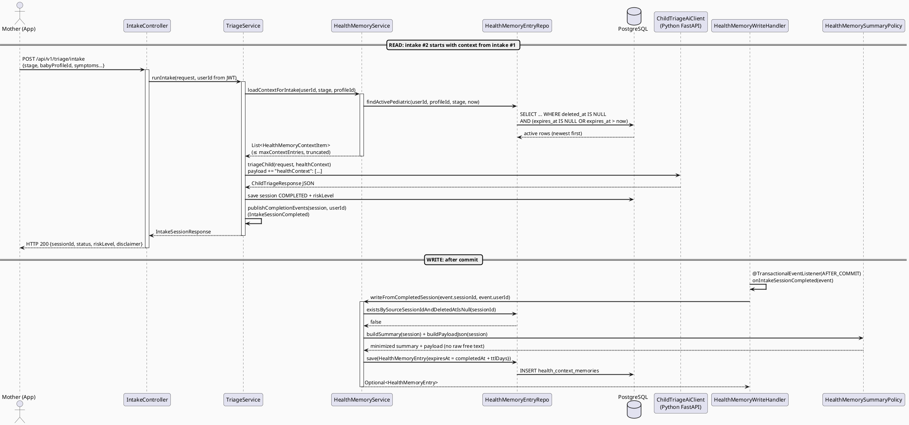
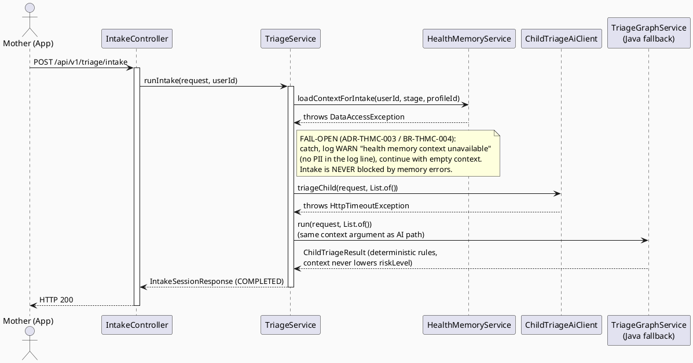
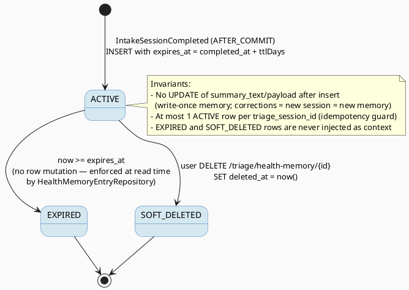

# ENGINEERING DOCUMENTATION STANDARD (EDS) v2.0
# TriageHealthMemoryContext — Connect Health Context Memory to the Triage Flow

| Field | Value |
|-------|-------|
| **Document ID** | `CB-TRIAGE-THMC-IMP-001` |
| **Version** | `1.0` |
| **Date** | `2026-07-26` |
| **Status** | `Implemented` *(2026-07-27 — 18/18 TCs passing; INT-01/02 executed green on a Docker-capable host)* |
| **Document Owner** | `AI Agent` |
| **Author** | `AI Agent` |
| **Reviewed by** | `[ ] Pending` |
| **DPO Sign-off** | `[ ] Pending` *(required — module handles Sensitive-PII: health summaries)* |
| **Approved by** | `[ ] Pending` |
| **Last Review** | `2026-07-26` |
| **Based on EDS** | `v2.0` |

---

## CHANGELOG

> **Policy 4.4 — Immutable History:** Never delete old information. Every change must be recorded in this table.

| Ngày | Người thực hiện | Nội dung thay đổi |
|------|-----------------|-------------------|
| 2026-07-26 | AI Agent | Initial creation — TDS for TriageHealthMemoryContext (roadmap Part III item 1) |
| 2026-07-26 | AI Agent — Amelia (Dev Agent) | Deviation D1: empty server-loaded context keeps the legacy one-arg `triageChild(request)`/`run(request)` calls (wire-identical to omitting the additive field); two-arg overloads used only for NON-EMPTY context — required to keep `legacy triage integration coverage` green. Full regression 2026-07-26: 2981 run / 1 failure / 73 errors, all in the known pre-existing set (Checklist SHA drift + Docker-unavailable Testcontainers). |
| 2026-07-26 | AI Agent — Amelia (Dev Agent) | Phase 3: Implementation — 16/18 tests PASS (THMC-TC-01…16 🟢; THMC-TC-INT-01/02 written but environment-blocked: Docker unavailable for Testcontainers). Delivered per §5.1 file plan: entity `memory_payload_jsonb` mapping (L1), `existsBySourceSessionIdAndDeletedAtIsNull`, `HealthMemoryService` v2.0 (`writeFromCompletedSession`/`loadContextForIntake`), `HealthMemoryWriteHandler` (AFTER_COMMIT), `HealthMemorySummaryPolicy`, `HealthMemoryProperties` + `application.yaml` keys, `TriageService` fail-open injection (runIntake + startConversation), `ChildTriageAiClient` v2.0 default overload, `HttpChildTriageAiClient` healthContext serialization, `TriageGraphService.run(request, ctx)` narrative-only overload, Python additive `HealthContextItem`/`healthContext` (schemas/main/graph/gemini_client — 233 pytest passed). No Flyway migration (ADR-THMC-004). |
| 2026-07-27 | AI Agent — Amelia (Dev Agent) | Docker host available: integration TCs executed — 2/2 PASS (THMC-TC-INT-01/02). ADR-THMC-001 verified on real PostgreSQL: memory-save failure did NOT roll back the COMPLETED session; TTL and strict `expires_at > now` boundary verified at SQL level. No production change for this feature; integration test file updated for the real full context (consent-gate mock per Test-Spec §6 fixture, one-arg overload stubbing per Deviation D1/BR-THMC-004, trigger-safe cleanup). |

---

## MỤC LỤC

1. [Tổng quan Module](#1-tổng-quan-module)
2. [Ma trận Truy vết (Traceability Matrix)](#2-ma-trận-truy-vết-traceability-matrix)
3. [Architecture Decision Records (ADR)](#3-architecture-decision-records-adr)
4. [Non-Functional Requirements & SLA](#4-non-functional-requirements--sla)
5. [Static Modeling (Mô hình Tĩnh)](#5-static-modeling-mô-hình-tĩnh)
6. [Dynamic Modeling (Mô hình Động)](#6-dynamic-modeling-mô-hình-động)
7. [Domain Event Catalog](#7-domain-event-catalog)
8. [Interface Specification (Đặc tả Giao diện)](#8-interface-specification-đặc-tả-giao-diện)
9. [API Specification](#9-api-specification)
10. [Bảng mã lỗi (Error Codes)](#10-bảng-mã-lỗi-error-codes)
11. [Quy trình Triển khai (Step-by-Step)](#11-quy-trình-triển-khai-step-by-step)
12. [Rollback & Incident Runbook](#12-rollback--incident-runbook)
13. [Kịch bản Kiểm thử Chi tiết](#13-kịch-bản-kiểm-thử-chi-tiết)
14. [Phương pháp Xác minh](#14-phương-pháp-xác-minh)
15. [Mẫu thử thực tế (API Verification Samples)](#15-mẫu-thử-thực-tế-api-verification-samples)
16. [Bảng tổng hợp phân quyền (Authorization Matrix)](#16-bảng-tổng-hợp-phân-quyền-authorization-matrix)
17. [AI Prompt Constraints (CASE 2.0)](#17-ai-prompt-constraints-case-20)

---

## 1. Tổng quan Module

> The table `health_context_memories`, `HealthMemoryService`, and `HealthMemoryEntryRepository` (with TTL enforced on read) already exist, but the triage flow neither reads nor writes them — the infrastructure is dead code on the intake path (verified: `TriageService.java` contains zero references to HealthMemory).
> This feature closes the loop:
> **(a) WRITE** — after a triage session reaches `COMPLETED` with a persistable risk level, persist a short-term health-context memory (`summary_text` + `memory_payload_jsonb`, `related_stage`, `expires_at = completed_at + TTL`, linkage `triage_session_id` / `user_id` / `mother_profile_id` / `baby_profile_id`).
> **(b) READ** — when starting a new intake (one-shot `runIntake` and conversation `startConversation`), load non-expired, non-deleted memories for the same user + subject profile + stage and inject them as advisory context into BOTH the Python AI request payload AND the Java fallback engine input.
> AI remains guidance-only; memory context may never diagnose, never delay emergency routing, and never lower a computed risk level (BR-SAFETY).

| Field | Value |
|-------|-------|
| **Module Name** | `Triage Health Memory Context` |
| **Bounded Context** | `triage` |
| **Data Classification** | `Sensitive-PII` *(minimized health summaries; raw conversation text is never stored — `HealthMemoryEntry.java:32`)* |
| **Compliance Scope** | `PDPA / Luật 91/2025` |
| **Upstream Dependencies** | `IAM (JWT auth)`, `TriageService` (completion events), `IntakeSessionCompleted` event, `health_context_memories` table (canonical baseline) |
| **Downstream Consumers** | `CareBridgeAITriageService` (Python FastAPI — receives `healthContext`), `TriageGraphService` (Java fallback engine), `HealthMemoryController` (existing list/delete UI) |

**Source baseline (verified 2026-07-26):**

* `05_Development/CareBridgeAPI/src/main/java/com/carebridge/backend/triage/service/impl/TriageService.java` — one-shot flow `runIntake` :384-440 with AI-or-fallback at :442-457; conversation start AI call :307-315; conversation continue :368-376; `publishCompletionEvents` :768-777.
* `05_Development/CareBridgeAPI/src/main/java/com/carebridge/backend/triage/entity/HealthMemoryEntry.java` — maps `@Table(name = "health_context_memories")`; **does NOT yet map `memory_payload_jsonb`** (DB default `'{}'::jsonb` currently fills it).
* `05_Development/CareBridgeAPI/src/main/java/com/carebridge/backend/triage/repository/HealthMemoryEntryRepository.java` :14-33 — active-read queries already filter `deletedAt is null` and `(expiresAt is null or expiresAt > :now)` per user + profile + stage.
* `05_Development/CareBridgeAPI/src/main/java/com/carebridge/backend/ai/service/IntakeSessionCompletedHandler.java` — existing `AFTER_COMMIT` listener pattern for `IntakeSessionCompleted`.
* `05_Development/CareBridgeAITriageService/app/schemas.py` — `ChildTriageRequest` :12-28, `IntakeStartRequest` :153-156; endpoints in `app/main.py` (`/triage/child` :45, `/triage/intake/start` :52, `/triage/intake/continue` :69).
* DDL: `B20260724111500__canonical_70_table_baseline.sql` :999-1012 — table `health_context_memories` exists with every column this feature needs. **No schema change is required.**
* Requirement oracle: `04_Implement/AITriageCompletion/AITriage_Assessment_Roadmap.md` Part III item 1.

---

## 2. Ma trận Truy vết (Traceability Matrix)

> Direct mapping: [Requirement ID] → [Code component] → [Compliance target].
> **Policy:** No code is written unless it serves a stated rule.

| Requirement ID | Loại (BR/ADR/US) | Mô tả yêu cầu | Thành phần Code | Compliance Target | ADR liên quan |
|----------------|------------------|---------------|-----------------|-------------------|---------------|
| US-THMC-001 | User Story | After a triage session completes, the system remembers a short-term health-context summary so the next intake is better informed (Roadmap Part III.1a) | `HealthMemoryWriteHandler.onIntakeSessionCompleted()` | — | ADR-THMC-001 |
| US-THMC-002 | User Story | When starting a new intake, prior valid memories for the same subject are injected as context to the AI and to the Java fallback (Roadmap Part III.1b) | `TriageService.runIntake()` / `TriageService.startConversation()` | — | ADR-THMC-003 |
| BR-THMC-001 | Business Rule | Write a memory ONLY when the session status is `COMPLETED` and `risk_level` is persistable (GREEN/YELLOW/RED); exactly one active memory per source session (idempotent) | `HealthMemoryService.writeFromCompletedSession()` | PDPA (data minimization) | ADR-THMC-001 |
| BR-THMC-002 | Business Rule | Read ONLY non-expired (`expires_at > now` or null), non-deleted (`deleted_at is null`) memories of the SAME user + subject profile + stage | `HealthMemoryEntryRepository.findActiveMaternal/findActivePediatric` (existing, reused) | Luật 91/2025 (ownership) | ADR-THMC-004 |
| BR-THMC-003 | Business Rule | Memory stores minimized/processed data only — NEVER raw `parentFreeText`/`symptoms` free text, never raw conversation text (`HealthMemoryEntry.java:32` javadoc) | `HealthMemorySummaryPolicy.buildSummary()` | PDPA (data minimization) | ADR-THMC-004 |
| BR-THMC-004 | Business Rule (BR-SAFETY) | Memory context is advisory only: it must never lower the computed risk level and its read/write failures must never block or delay triage or emergency routing | `TriageGraphService.run(request, healthContext)`, fail-open wrapper in `TriageService` | BR-SAFETY (CLAUDE.md) | ADR-THMC-003 |
| BR-THMC-005 | Business Rule | Every triage-written memory carries an absolute `expires_at = completed_at + TTL`; TTL is configurable, proposed default 30 days (**Open** — see ADR-THMC-002) | `HealthMemoryProperties.ttlDays` | PDPA Art. storage limitation principle | ADR-THMC-002 |
| BR-THMC-006 | Business Rule | `healthContext` sent to the Python service and fallback is server-populated only; any client-supplied `healthContext` value is discarded | `TriageService` (context assembled after auth from repository, never from request DTO) | Luật 91/2025 | ADR-THMC-003 |
| ADR-THMC-001 | Decision | Event-driven write after commit | `HealthMemoryWriteHandler` | — | — |
| ADR-THMC-002 | Decision | Absolute `expires_at`, configurable TTL | `HealthMemoryProperties` | PDPA | — |
| ADR-THMC-003 | Decision | Advisory, fail-open context injection | `TriageService`, `TriageGraphService` | BR-SAFETY | — |
| ADR-THMC-004 | Decision | Reuse existing table/entity/repository; map `memory_payload_jsonb` on entity; no schema change | `HealthMemoryEntry`, `HealthMemoryEntryRepository` | — | — |

---

## 3. Architecture Decision Records (ADR)

### ADR-THMC-001 — Write memories via an `AFTER_COMMIT` listener on `IntakeSessionCompleted`

| Field | Value |
|-------|-------|
| **Status** | `Proposed` |
| **Deciders** | `AI Agent (proposal) — pending Tech Lead review` |
| **Date** | `2026-07-26` |
| **Supersedes** | `—` |

#### Bối cảnh (Context)
The completion of a triage session already publishes `IntakeSessionCompleted` from `TriageService.publishCompletionEvents` (`TriageService.java:768-777`), consumed by `IntakeSessionCompletedHandler` (`ai/service`) at `TransactionPhase.AFTER_COMMIT` for structured-intake extraction. Memory writing is a side effect of completion; a failure to record memory must never fail or roll back the triage session (BR-SAFETY).

#### Các phương án đã xem xét (Options Considered)

| Phương án | Mô tả | Ưu điểm | Nhược điểm |
|-----------|-------|----------|------------|
| A | Write the memory inline inside `TriageService.runIntake` / `persistConversationEnvelope` (same transaction) | Atomic with the session | A memory-write bug rolls back a COMPLETED triage session — violates BR-SAFETY; couples memory logic into an already-large service |
| B | New `HealthMemoryWriteHandler` with `@TransactionalEventListener(phase = AFTER_COMMIT)` on the existing `IntakeSessionCompleted` event, mirroring `IntakeSessionCompletedHandler` | Failure-isolated; zero change to completion logic; consistent with the established post-commit pattern; both one-shot and conversation flows publish the same event so one handler covers both | Handler must reload the session by id; eventual (post-commit) consistency; a retryable duplicate event requires an idempotency guard |

#### Quyết định (Decision)
Choose **Option B**. Add an idempotency guard (`existsBySourceSessionIdAndDeletedAtIsNull`) so a duplicated event never produces a second active memory for the same session.

#### Hệ quả (Consequences)

**Tích cực:**
- Triage completion latency and transactional integrity are untouched.
- One handler covers both `runIntake` (:423-426) and `persistConversationEnvelope` (:726-729) completion paths.

**Tiêu cực / Trade-offs:**
- The memory is not queryable in the same transaction that completed the session — acceptable, readers only need it at the *next* intake.
- Failures are logged-and-swallowed (like `IntakeSessionCompletedHandler`), so a metric/log line is required for observability.

**Compliance Impact:**
- None negative; the write path is reached only after the standard completion pipeline (including RED escalation, which is published BEFORE `IntakeSessionCompleted` in `publishCompletionEvents`) has already run.

---

### ADR-THMC-002 — Absolute `expires_at` with configurable TTL (proposed default 30 days)

| Field | Value |
|-------|-------|
| **Status** | `Proposed` *(TTL default value: **Open** — no product/legal source found; 30 days is a proposal to confirm with the Document Owner/DPO)* |
| **Deciders** | `AI Agent (proposal) — pending DPO confirmation` |
| **Date** | `2026-07-26` |
| **Supersedes** | `—` |

#### Bối cảnh (Context)
The canonical schema stores `expires_at timestamptz` (absolute instant, **not** a `ttl_seconds` counter — roadmap Part I.2), and `HealthMemoryEntryRepository` already enforces expiry on read (`expiresAt is null or expiresAt > :now`). The feature must choose the TTL that the write path stamps.

#### Các phương án đã xem xét (Options Considered)

| Phương án | Mô tả | Ưu điểm | Nhược điểm |
|-----------|-------|----------|------------|
| A | Hard-code a TTL constant | Simple | Not tunable per environment; DPO cannot adjust retention without redeploy |
| B | `@ConfigurationProperties` (`carebridge.triage.health-memory.ttl-days`), default 30 days | Tunable; testable via property override; explicit in config | Requires a properties class |
| C | `expires_at = null` (never expires) | No decision needed | Violates the short-term-memory intent (Roadmap III.1a "short-term") and PDPA storage limitation |

#### Quyết định (Decision)
Choose **Option B**. Set `expires_at = completed_at + ttlDays`. The default of **30 days is an engineering proposal only** and is recorded as **Open** in §Traceability (BR-THMC-005) until confirmed.

#### Hệ quả (Consequences)

**Tích cực:** Retention is explicit, tunable, and enforced by the existing read queries with no new expiry job.

**Tiêu cực / Trade-offs:** Expired rows remain physically stored until a future purge job (out of scope here — recorded as an Open item).

**Compliance Impact:** Supports the storage-limitation principle; DPO sign-off should confirm the numeric TTL.

---

### ADR-THMC-003 — Context injection is advisory and fail-open; it can never lower risk or block intake

| Field | Value |
|-------|-------|
| **Status** | `Proposed` |
| **Deciders** | `AI Agent (proposal) — pending Tech Lead review` |
| **Date** | `2026-07-26` |
| **Supersedes** | `—` |

#### Bối cảnh (Context)
BR-SAFETY (CLAUDE.md): AI provides guidance only; never diagnose, prescribe, or delay emergency routing. Memory context increases assessment quality but must not become a new failure mode or a risk-downgrading channel.

#### Các phương án đã xem xét (Options Considered)

| Phương án | Mô tả | Ưu điểm | Nhược điểm |
|-----------|-------|----------|------------|
| A | Fail-closed: if memory read fails, reject the intake | Context always present when intake succeeds | A memory outage blocks health triage — unacceptable under BR-SAFETY |
| B | Fail-open: wrap the read in try/catch; on any error log a warning and continue with an empty context. Context is passed to AI + fallback as *supporting narrative only*; the deterministic rule outcome is never reduced by context | Triage availability unchanged; safety rules keep authority | A degraded run silently lacks context (mitigated by warn log + metric) |

#### Quyết định (Decision)
Choose **Option B**. Additionally: (1) `healthContext` is server-populated only — values arriving in any client payload are ignored (BR-THMC-006); (2) in the Java fallback, context participates only in summary phrasing, never in rule matching, so the computed `riskLevel` with context ≥ the `riskLevel` without context for identical symptom input; (3) context list is bounded (`maxContextEntries`, proposed 5) and each summary truncated (`maxSummaryChars`, proposed 500) to bound prompt size.

#### Hệ quả (Consequences)

**Tích cực:** No new hard dependency on the memories table for triage; deterministic risk authority preserved.

**Tiêu cực / Trade-offs:** Silent degradation possible — mitigated with a WARN log (`health memory context unavailable`) and follow-up metric.

**Compliance Impact:** BR-SAFETY preserved: emergency routing (`EmergencyEscalationTriggered`) is untouched by this feature.

---

### ADR-THMC-004 — Reuse the existing table/entity/repository; map `memory_payload_jsonb` on the entity; no schema change

| Field | Value |
|-------|-------|
| **Status** | `Proposed` |
| **Deciders** | `AI Agent (proposal) — pending Tech Lead review` |
| **Date** | `2026-07-26` |
| **Supersedes** | `—` |

#### Bối cảnh (Context)
`health_context_memories` (baseline :999-1012) already has every column required: `memory_id`, `user_id`, `care_subject_id`, `triage_session_id`, `related_stage`, `summary_text`, `memory_payload_jsonb NOT NULL DEFAULT '{}'`, `created_at`, `expires_at`, `deleted_at`, `mother_profile_id`, `baby_profile_id`. However, `HealthMemoryEntry.java` does not map `memory_payload_jsonb` (or `care_subject_id`), so the structured payload cannot currently be written from Java.

#### Các phương án đã xem xét (Options Considered)

| Phương án | Mô tả | Ưu điểm | Nhược điểm |
|-----------|-------|----------|------------|
| A | New dedicated memory table/migration | "Clean slate" | Violates canonical-70 baseline discipline; duplicate data; unnecessary migration |
| B | Extend `HealthMemoryEntry` with a `memoryPayloadJson` field mapped to `memory_payload_jsonb` (`@JdbcTypeCode(SqlTypes.JSON)`), keep `care_subject_id` unmapped (unused by this feature) | Zero schema change; existing list/delete UI keeps working | Entity change ripples into the builder used by `HealthMemoryServiceImplTest` (additive, non-breaking) |

#### Quyết định (Decision)
Choose **Option B**. **No Flyway migration is required.** (Optional performance index — see §4.1 note and §11.3, recorded as an Open item with an exact migration plan; it is NOT part of this feature's default scope.)

#### Hệ quả (Consequences)

**Tích cực:** Smallest scoped change; canonical baseline untouched.

**Tiêu cực / Trade-offs:** JSON payload schema is owned by application code — versioned via a `schemaVersion` field inside the payload (`"1.0"`).

**Compliance Impact:** None; column already exists and is already classified with the table.

---

## 4. Non-Functional Requirements & SLA

> NFR targets below marked *(proposed)* are engineering proposals for this feature, measured relative to the existing triage NFRs in `CB-TRIAGE-IMP-001 §4`; they are not contractual SLAs until approved.

### 4.1. Performance & Availability

| Category | Requirement | Target SLA | Measurement Method | Compliance Basis |
|----------|-------------|------------|---------------------|------------------|
| Latency overhead (read) | Added latency of memory lookup + context assembly on `POST /triage/intake` and `/conversation/start` | `< 50ms p99` *(proposed)* | Timer around `loadContextForIntake` (Micrometer) | — |
| Latency overhead (write) | Memory write happens post-commit | `0ms added to API response` (by construction, ADR-THMC-001) | APM trace: write occurs after HTTP response | — |
| Availability coupling | Memory-store failure must not fail intake | `0` intake failures caused by memory errors (fail-open) | Chaos test THMC-TC-13 + error-rate dashboard | BR-SAFETY |
| Prompt bounding | Context injected into AI payload | `≤ 5 entries × ≤ 500 chars` *(proposed defaults, configurable)* | Unit test THMC-TC-16 | — |

> **Index note (Open):** the baseline defines only the PK on `health_context_memories`. The active-read query filters `user_id + (mother|baby)_profile_id + related_stage`. Expected per-user row counts are small (bounded by TTL), so no index is planned now. If p99 exceeds target in staging, apply the optional migration plan in §11.3 Chặng 6 (a NEW versioned Flyway file — never modify an applied migration).

### 4.2. Data Integrity & Retention

| Category | Requirement | Target | Verification Method | Compliance Basis |
|----------|-------------|--------|---------------------|------------------|
| Retention | Triage-written memories expire | `expires_at = completed_at + ttlDays` (default 30d — **Open**, ADR-THMC-002) | SQL check §14.1 | PDPA storage limitation |
| Idempotency | ≤ 1 active memory per `triage_session_id` | 100% | DB check §14.1 + THMC-TC-03 | — |
| Minimization | No raw free text (`parentFreeText`, raw `symptoms`, conversation text) in `summary_text`/`memory_payload_jsonb` | 100% | THMC-TC-04 + SQL audit §14.1 | PDPA data minimization / `HealthMemoryEntry.java:32` |
| Consistency | Memory row references an existing `COMPLETED` session | 100% | `triage_session_id` join check §14.1 | — |

### 4.3. Security

| Category | Requirement | Target | Verification Method | Compliance Basis |
|----------|-------------|--------|---------------------|------------------|
| Ownership | Only the session owner's memories are ever read/injected (userId from JWT, never from body) | 100% | THMC-TC-09, THMC-TC-15 | Luật 91/2025 |
| PII in logs | `summary_text` / payload never logged plaintext | 100% | Log scan §14.2 | PDPA |
| Transport | Context leaves the JVM only toward the internal Python AI service over its existing channel (`ai.triage-service.url` + internal API key config) | Existing channel only, no new egress | Code review + THMC-TC-06 | PDPA |
| Access control | No new public endpoint; existing `ROLE_MOTHER`-only surfaces unchanged | Auth Matrix §16 | Security tests | Luật 91/2025 |

### 4.4. Scalability & Capacity Planning

> Expected volume mirrors triage volume (`CB-TRIAGE-IMP-001 §4.4`: ~500 sessions/day proposed): ≤ 1 memory insert per completed session, ≤ 1 bounded select per intake start. Row growth is naturally capped by the TTL for reads; physical purge of expired rows is an **Open** follow-up item (out of scope).

---

## 5. Static Modeling (Mô hình Tĩnh)

### 5.1. Class Diagram (PlantUML)

```plantuml
@startuml TriageHealthMemoryContext_ClassDiagram
skinparam classAttributeIconSize 0
skinparam classFontStyle bold
skinparam backgroundColor #FAFAFA
skinparam ArrowColor #555555
skinparam ClassBorderColor #2E75B6
skinparam ClassHeaderBackgroundColor #D5E8F0

' === EXISTING ENTITY (modified: + memoryPayloadJson) ===
class HealthMemoryEntry {
  + id: UUID  <<memory_id>>
  + userId: UUID
  + motherProfileId: UUID
  + babyProfileId: UUID
  + relatedStage: TriageStage
  + summaryText: String  <<minimized only>>
  + memoryPayloadJson: String  <<NEW mapping: memory_payload_jsonb>>
  + sourceSessionId: UUID  <<triage_session_id>>
  + createdAt: Instant
  + expiresAt: Instant
  + deletedAt: Instant
}

enum TriageStage {
  PRECONCEPTION
  PREGNANCY
  POSTPARTUM
  INFANT
  TODDLER
  + isMaternal(): boolean
  + isPediatric(): boolean
}

' === NEW VALUE OBJECT ===
class HealthMemoryContextItem <<ValueObject>> {
  + summaryText: String
  + relatedStage: String
  + createdAt: Instant
  + expiresAt: Instant
  ' immutable record — no setters
}

' === SERVICES ===
interface HealthMemoryService <<interface>> {
  + list(userId: UUID, stage: TriageStage, profileId: UUID): List<HealthMemoryEntry>
  + delete(userId: UUID, entryId: UUID): void
  + writeFromCompletedSession(sessionId: UUID, userId: UUID): Optional<HealthMemoryEntry>  <<NEW>>
  + loadContextForIntake(userId: UUID, stage: TriageStage, profileId: UUID): List<HealthMemoryContextItem>  <<NEW>>
}

class HealthMemoryServiceImpl implements HealthMemoryService {
  - repository: HealthMemoryEntryRepository
  - intakeSessionRepository: IIntakeSessionRepository
  - summaryPolicy: HealthMemorySummaryPolicy
  - properties: HealthMemoryProperties
}

class HealthMemoryWriteHandler <<NEW, @Component>> {
  - healthMemoryService: HealthMemoryService
  + onIntakeSessionCompleted(event: IntakeSessionCompleted): void  <<AFTER_COMMIT>>
}

class HealthMemorySummaryPolicy <<NEW, policy>> {
  + buildSummary(session: IntakeSession): String
  + buildPayloadJson(session: IntakeSession): String
  ' enforces BR-THMC-003: structured fields only, never raw free text
}

class HealthMemoryProperties <<NEW, @ConfigurationProperties("carebridge.triage.health-memory")>> {
  + ttlDays: int = 30
  + maxContextEntries: int = 5
  + maxSummaryChars: int = 500
}

' === EXISTING (modified) ===
class TriageService {
  - healthMemoryService: HealthMemoryService  <<NEW dep>>
  + runIntake(request, userId)
  + startConversation(request, userId)
}

interface ChildTriageAiClient <<interface>> {
  + triageChild(request: RunIntakeRequest): String
  + triageChild(request: RunIntakeRequest, healthContext: List<HealthMemoryContextItem>): String  <<NEW default>>
  + startIntake(request: Map): String
  + continueIntake(request: Map): String
}

class TriageGraphService {
  + run(request: RunIntakeRequest): ChildTriageResult
  + run(request: RunIntakeRequest, healthContext: List<HealthMemoryContextItem>): ChildTriageResult  <<NEW overload>>
}

interface HealthMemoryEntryRepository <<interface>> {
  + findActiveMaternal(userId, profileId, stage, now): List<HealthMemoryEntry>
  + findActivePediatric(userId, profileId, stage, now): List<HealthMemoryEntry>
  + findByIdAndUserIdAndDeletedAtIsNull(id, userId): Optional<HealthMemoryEntry>
  + existsBySourceSessionIdAndDeletedAtIsNull(sessionId: UUID): boolean  <<NEW>>
}

' === RELATIONSHIPS ===
HealthMemoryWriteHandler --> HealthMemoryService : writeFromCompletedSession
HealthMemoryServiceImpl --> HealthMemoryEntryRepository : uses
HealthMemoryServiceImpl --> HealthMemorySummaryPolicy : uses
HealthMemoryServiceImpl --> HealthMemoryProperties : uses
TriageService --> HealthMemoryService : loadContextForIntake
TriageService --> ChildTriageAiClient : calls (with healthContext)
TriageService --> TriageGraphService : fallback (with healthContext)
HealthMemoryEntry *-- TriageStage : relatedStage

@enduml
```



**Planned file paths (exact):**

| Action | Path |
|--------|------|
| Modify | `05_Development/CareBridgeAPI/src/main/java/com/carebridge/backend/triage/entity/HealthMemoryEntry.java` *(add `memoryPayloadJson` mapped to `memory_payload_jsonb`)* |
| Modify | `05_Development/CareBridgeAPI/src/main/java/com/carebridge/backend/triage/repository/HealthMemoryEntryRepository.java` *(add `existsBySourceSessionIdAndDeletedAtIsNull`)* |
| Modify | `05_Development/CareBridgeAPI/src/main/java/com/carebridge/backend/triage/service/HealthMemoryService.java` *(add 2 methods)* |
| Modify | `05_Development/CareBridgeAPI/src/main/java/com/carebridge/backend/triage/service/impl/HealthMemoryServiceImpl.java` |
| New | `05_Development/CareBridgeAPI/src/main/java/com/carebridge/backend/triage/service/HealthMemoryWriteHandler.java` |
| New | `05_Development/CareBridgeAPI/src/main/java/com/carebridge/backend/triage/policy/HealthMemorySummaryPolicy.java` |
| New | `05_Development/CareBridgeAPI/src/main/java/com/carebridge/backend/triage/service/HealthMemoryProperties.java` |
| New | `05_Development/CareBridgeAPI/src/main/java/com/carebridge/backend/triage/dto/HealthMemoryContextItem.java` |
| Modify | `05_Development/CareBridgeAPI/src/main/java/com/carebridge/backend/triage/service/impl/TriageService.java` *(read+inject in `runIntake` and `startConversation`; pass context to fallback)* |
| Modify | `05_Development/CareBridgeAPI/src/main/java/com/carebridge/backend/triage/service/ChildTriageAiClient.java` *(new `default` overload — non-breaking)* |
| Modify | `05_Development/CareBridgeAPI/src/main/java/com/carebridge/backend/triage/service/impl/HttpChildTriageAiClient.java` *(serialize `healthContext` into `/triage/child` payload)* |
| Modify | `05_Development/CareBridgeAPI/src/main/java/com/carebridge/backend/triage/engine/TriageGraphService.java` *(overload `run(request, healthContext)`)* |
| Modify | `05_Development/CareBridgeAITriageService/app/schemas.py` *(new `HealthContextItem` model; `healthContext` fields on `ChildTriageRequest` and `IntakeStartRequest`)* |
| Modify | `05_Development/CareBridgeAITriageService/app/main.py` *(thread `healthContext` into the Gemini prompt/summary context as advisory text)* |
| Modify | `05_Development/CareBridgeAPI/src/main/resources/application.yaml` *(new `carebridge.triage.health-memory.*` keys with defaults)* |

### 5.2. Data Structure (Flyway SQL Migration)

> **CareBridge rule:** the canonical baseline `B20260724111500__canonical_70_table_baseline.sql` and approved Flyway migrations are the primary schema source.

**No new migration is created by this feature (ADR-THMC-004).** The already-applied baseline defines (verbatim, baseline :999-1012):

```sql
-- ALREADY APPLIED — reference only, DO NOT re-create
CREATE TABLE public.health_context_memories (
    memory_id            uuid DEFAULT gen_random_uuid() NOT NULL,   -- PK
    user_id              uuid NOT NULL,                              -- session owner (JWT)
    care_subject_id      uuid,                                       -- unused by this feature (stays NULL)
    triage_session_id    uuid,                                       -- source COMPLETED session
    related_stage        character varying(30) NOT NULL,             -- TriageStage name
    summary_text         text NOT NULL,                              -- minimized summary (no raw free text)
    memory_payload_jsonb jsonb DEFAULT '{}'::jsonb NOT NULL,         -- structured payload, schemaVersion "1.0"
    created_at           timestamp with time zone DEFAULT now() NOT NULL,
    expires_at           timestamp with time zone,                   -- completed_at + ttlDays
    deleted_at           timestamp with time zone,                   -- soft delete (user-initiated)
    mother_profile_id    uuid,                                       -- maternal subject linkage
    baby_profile_id      uuid                                        -- pediatric subject linkage
);
ALTER TABLE ONLY public.health_context_memories
    ADD CONSTRAINT health_context_memories_pkey PRIMARY KEY (memory_id);
```

**`memory_payload_jsonb` application-owned schema (version `1.0`):**

```json
{
  "schemaVersion": "1.0",
  "sourceSessionId": "uuid",
  "stage": "INFANT",
  "riskLevel": "GREEN",
  "recommendationCode": "SELF_CARE_MONITOR",
  "normalizedSymptoms": ["fever", "cough"],
  "fallbackUsed": false,
  "completedAt": "2026-07-26T08:00:00Z"
}
```

> **Naming rule:** all columns are snake_case (already satisfied by the baseline).
> **Optional index (Open, NOT default scope):** see §11.3 Chặng 6 for the exact new-migration plan if staging p99 requires it.

---

## 6. Dynamic Modeling (Mô hình Động)

### 6.1. Sequence Diagram — Happy Path (PlantUML)



### 6.2. Sequence Diagram — Error Path (PlantUML)



### 6.3. State Machine *(memory-entry lifecycle)*



> **⚠️ Invariants:** (1) memory rows are write-once (no content UPDATE; only `deleted_at` may be set, by the existing delete flow); (2) `EXPIRED`/`SOFT_DELETED` are terminal for injection purposes; (3) a session that is not `COMPLETED` with persistable risk never produces a memory.

---

## 7. Domain Event Catalog

### 7.1. Events Published (Phát ra)

| Event Name | Trigger | Publisher | Subscriber(s) | Payload Schema | Async? |
|------------|---------|-----------|---------------|----------------|--------|
| — *(none new)* | This feature publishes no new domain events (smallest-scope rule). Observability is via WARN logs + Micrometer counters, not events. | — | — | — | — |

### 7.2. Events Consumed (Tiêu thụ)

| Event Name | Source | Handler | Action thực hiện |
|------------|--------|---------|------------------|
| `IntakeSessionCompleted` | `TriageService.publishCompletionEvents` (`TriageService.java:768-777`) — both one-shot and conversation completion paths | `HealthMemoryWriteHandler` (NEW, `AFTER_COMMIT`, mirrors `IntakeSessionCompletedHandler`) | Reload session by `sessionId + userId`; if status `COMPLETED` and `riskLevel != null` and no active memory exists for this session → build minimized summary/payload and INSERT `health_context_memories`. Exceptions are caught and logged (never rethrown). |

### 7.3. Payload Schema

The consumed event already exists — reproduced verbatim as the handler's input contract (existing file, no change):

```java
// 05_Development/CareBridgeAPI/src/main/java/com/carebridge/backend/triage/event/IntakeSessionCompleted.java
// EXISTING — consumed as-is (@version 1.0, unchanged by this feature)
public record IntakeSessionCompleted(
        UUID eventId,       // random UUID per publish — dedup handled by the idempotency guard, not eventId
        UUID sessionId,     // triage_sessions.triage_session_id
        UUID userId,        // session owner
        RiskLevel riskLevel,// GREEN / YELLOW / RED
        Instant completedAt // basis for expires_at computation
) {}
```

> Note: the event does not carry stage/profile/symptom data. The handler intentionally reloads the `IntakeSession` row (via `IIntakeSessionRepository.findByIdAndUserId`) rather than widening the event contract — same pattern as `StructuredIntakeService.extract(event)`.

---

## 8. Interface Specification (Đặc tả Giao diện)

> **Policy (EDS v2.0):** every interface declares `@version`. Breaking changes require a new ADR. All additions below are backward-compatible (new methods / default methods / new optional fields).

### 8.1. Service Interface

```java
// HealthMemoryContextItem.java — NEW immutable context DTO (triage/dto)
// @version 1.0
public record HealthMemoryContextItem(
        String summaryText,   // minimized summary, truncated to maxSummaryChars
        String relatedStage,  // TriageStage name, e.g. "INFANT"
        Instant createdAt,
        Instant expiresAt     // nullable
) {}

// HealthMemoryService.java — EXTENDED service contract (existing interface)
// @version 2.0 (additive — existing list/delete signatures unchanged)
public interface HealthMemoryService {

    // ===== existing (v1.0, unchanged) =====
    List<HealthMemoryEntry> list(UUID userId, TriageStage stage, UUID profileId);
    void delete(UUID userId, UUID entryId);

    // ===== NEW =====
    /**
     * WRITE path (BR-THMC-001/003/005). Loads the session owned by userId; when it is
     * COMPLETED with a persistable riskLevel and no active memory exists for it yet,
     * inserts one health_context_memories row with expires_at = completedAt + ttlDays.
     * Returns Optional.empty() (and writes nothing) for NEED_MORE_INFO/FAILED/PROCESSING
     * sessions, for replayed events (idempotency), or when the session is not found.
     * MUST NOT throw for business no-op cases; repository exceptions propagate to the
     * caller (the AFTER_COMMIT handler catches and logs them).
     */
    Optional<HealthMemoryEntry> writeFromCompletedSession(UUID sessionId, UUID userId);

    /**
     * READ path (BR-THMC-002/004/006). Returns the newest-first active (non-expired,
     * non-deleted) memories of THIS user for the given stage + subject profile, mapped
     * to bounded HealthMemoryContextItem values (maxContextEntries / maxSummaryChars).
     * Returns an empty list when profileId is null (legacy sessions without a profile)
     * — it never throws TRIAGE-014, unlike list(), because intake must not be blocked.
     */
    List<HealthMemoryContextItem> loadContextForIntake(UUID userId, TriageStage stage, UUID profileId);
}

// ChildTriageAiClient.java — EXTENDED with a non-breaking default overload
// @version 2.0
public interface ChildTriageAiClient {
    String triageChild(RunIntakeRequest request);                    // existing
    String startIntake(Map<String, Object> request);                 // existing
    String continueIntake(Map<String, Object> request);              // existing

    /**
     * NEW (BR-THMC-004/006): one-shot triage with server-populated health context.
     * Default delegates to triageChild(request) so existing implementations
     * (e.g. GeminiTriageClientAdapter) stay source-compatible.
     */
    default String triageChild(RunIntakeRequest request, List<HealthMemoryContextItem> healthContext) {
        return triageChild(request);
    }
}

// TriageGraphService.java — NEW overload on the Java fallback engine
// @version 2.0 (existing run(request) unchanged)
public class TriageGraphService {
    public ChildTriageResult run(RunIntakeRequest request);          // existing

    /**
     * NEW: same deterministic rule evaluation as run(request); healthContext is used
     * ONLY for narrative fields (summary/possibleConcern phrasing). It never changes
     * rule matching, therefore never lowers riskLevel (BR-THMC-004 / ADR-THMC-003).
     */
    public ChildTriageResult run(RunIntakeRequest request, List<HealthMemoryContextItem> healthContext) { /* signature only */ }
}

// HealthMemoryProperties.java — NEW configuration contract
// @version 1.0
@ConfigurationProperties(prefix = "carebridge.triage.health-memory")
public class HealthMemoryProperties {
    private int ttlDays = 30;          // Open — proposed default, ADR-THMC-002
    private int maxContextEntries = 5; // proposed
    private int maxSummaryChars = 500; // proposed
    // getters / setters
}

// HealthMemorySummaryPolicy.java — NEW domain policy (triage/policy)
// @version 1.0
public class HealthMemorySummaryPolicy {
    /**
     * Builds summary_text from STRUCTURED session data only (stage, riskLevel,
     * normalizedSymptoms from the canonical result snapshot, recommendationCode,
     * completion date). MUST NOT include parentFreeText, raw symptoms text, or any
     * conversation content (BR-THMC-003, HealthMemoryEntry.java:32).
     */
    public String buildSummary(IntakeSession session) { /* signature only */ }

    /** Builds memory_payload_jsonb (schemaVersion "1.0" — see §5.2) under the same minimization rule. */
    public String buildPayloadJson(IntakeSession session) { /* signature only */ }
}
```

### 8.2. Repository Interface

```java
// HealthMemoryEntryRepository.java — EXTENDED (existing queries unchanged)
// @version 2.0
public interface HealthMemoryEntryRepository extends JpaRepository<HealthMemoryEntry, UUID> {

    // ===== existing (v1.0) — the ONLY read paths for injection; both already enforce
    // deletedAt IS NULL and (expiresAt IS NULL OR expiresAt > :now), newest first =====
    List<HealthMemoryEntry> findActiveMaternal(UUID userId, UUID profileId, TriageStage stage, Instant now);
    List<HealthMemoryEntry> findActivePediatric(UUID userId, UUID profileId, TriageStage stage, Instant now);
    Optional<HealthMemoryEntry> findByIdAndUserIdAndDeletedAtIsNull(UUID id, UUID userId);

    // ===== NEW — idempotency guard for the write path (BR-THMC-001) =====
    boolean existsBySourceSessionIdAndDeletedAtIsNull(UUID sourceSessionId);

    // NOTE: no delete() usage — memory rows are write-once; removal is the existing
    // soft-delete (deleted_at) via HealthMemoryService.delete() only (Sensitive-PII module).
}
```

**Internal Python contract extension (Pydantic, `app/schemas.py`):**

```python
# NEW model — @version 1.0
class HealthContextItem(BaseModel):
    summaryText: str = Field(max_length=500)
    relatedStage: TriageStage
    createdAt: str | None = None   # ISO-8601
    expiresAt: str | None = None   # ISO-8601

# EXTENDED (additive, defaults keep old clients valid):
class ChildTriageRequest(BaseModel):
    ...existing fields (schemas.py:12-28) unchanged...
    healthContext: list[HealthContextItem] = Field(default_factory=list, max_length=5)

class IntakeStartRequest(BaseModel):
    ...existing fields (schemas.py:153-156) unchanged...
    healthContext: list[HealthContextItem] = Field(default_factory=list, max_length=5)
```

---

## 9. API Specification

### 9.1. Endpoints Table

**No new public REST endpoint and no request/response contract change on existing public endpoints.** `healthContext` never appears in the public API: it is assembled server-side (BR-THMC-006). Affected surfaces:

| Method | Path | Auth Level | Required Roles | Rate Limit | Idempotent? | Change |
|--------|------|------------|----------------|------------|-------------|--------|
| `POST` | `/api/v1/triage/intake` | JWT Bearer | `ROLE_MOTHER` | existing | No | Behavior only: server loads memories and forwards them to AI/fallback; public request/response schema unchanged |
| `POST` | `/api/v1/triage/intake/conversation/start` | JWT Bearer | `ROLE_MOTHER` | existing | Yes (clientRequestId) | Behavior only: same injection |
| `POST` | `/api/v1/triage/intake/conversation/continue` | JWT Bearer | `ROLE_MOTHER` | existing | Yes | **Unchanged** — context is read at start only (Roadmap III.1b scope) |
| `GET` | `/api/v1/triage/health-memory?stage=&profileId=` | JWT Bearer | `ROLE_MOTHER` | existing | Yes | Unchanged contract; now returns triage-written entries too |
| `DELETE` | `/api/v1/triage/health-memory/{entryId}` | JWT Bearer | `ROLE_MOTHER` | existing | Yes | Unchanged — user can erase any memory (privacy control) |
| `POST` | *(internal)* `{ai.triage-service.url}/triage/child` | Internal API key (existing channel) | service-to-service | — | No | **Extended**: optional `healthContext[]` field (additive) |
| `POST` | *(internal)* `{ai.triage-service.url}/triage/intake/start` | Internal API key (existing channel) | service-to-service | — | No | **Extended**: optional `healthContext[]` field (additive) |

### 9.2. Request / Response Schemas

#### *(internal)* `POST /triage/child` — extended payload sent by `HttpChildTriageAiClient`

**Request Body (new optional field only — all existing fields per `HttpChildTriageAiClient.toAiPayload` :63-82 unchanged):**
```json
{
  "stage": "INFANT",
  "babyProfileId": "3d0f8f5e-0000-4000-8000-000000000021",
  "symptomList": ["ho", "sốt nhẹ"],
  "parentFreeText": "…",
  "healthContext": [
    {
      "summaryText": "INFANT triage on 2026-07-20: risk YELLOW; symptoms fever, cough; advice CONTACT_HEALTHCARE_PROVIDER.",
      "relatedStage": "INFANT",
      "createdAt": "2026-07-20T09:00:00Z",
      "expiresAt": "2026-08-19T09:00:00Z"
    }
  ]
}
```

**Response:** unchanged (`ChildTriageResponse`, `schemas.py:65-92`).

#### *(internal)* `POST /triage/intake/start` — extended payload

```json
{
  "initialText": "…",
  "currentIntake": { "stage": "INFANT", "babyProfileId": "…" },
  "intakeSessionId": "…",
  "stage": "INFANT",
  "healthContext": [ { "summaryText": "…", "relatedStage": "INFANT" } ]
}
```

#### Public `GET /api/v1/triage/health-memory` — contract unchanged (sample of a triage-written entry)

**Response — 200 OK:**
```json
{
  "success": true,
  "data": [
    {
      "id": "3f6c1a9e-0000-4000-8000-000000000031",
      "relatedStage": "INFANT",
      "summaryText": "INFANT triage on 2026-07-20: risk YELLOW; symptoms fever, cough; advice CONTACT_HEALTHCARE_PROVIDER.",
      "createdAt": "2026-07-20T09:00:00Z",
      "expiresAt": "2026-08-19T09:00:00Z"
    }
  ]
}
```

**Error responses:** existing triage error envelope, see §10 (no new shapes).

---

## 10. Bảng mã lỗi (Error Codes)

> Module prefix `TRIAGE-` (existing). Codes `TRIAGE-003…TRIAGE-016` are already allocated in the codebase (verified by grep). **This feature introduces NO new public error code**: write failures are swallowed post-commit (ADR-THMC-001) and read failures are fail-open (ADR-THMC-003). Existing codes that participate in the touched flows:

| Code | HTTP Status | Message (EN) | Message (VI) | Trigger Condition (relevance to this feature) |
|------|-------------|--------------|--------------|-------------------|
| `TRIAGE-003` | 404 | Intake session not found | Không tìm thấy phiên | Session reload inside `writeFromCompletedSession` uses owner-scoped lookup; a missing/foreign session results in a silent no-op (Optional.empty), never a thrown 404, because the handler runs post-commit |
| `TRIAGE-005` | 503 | Triage processing failed | Xử lý triage thất bại | Unchanged one-shot failure semantics — memory read/write must never be the cause (THMC-TC-13) |
| `TRIAGE-014` | 400 | A matching profile is required for health memory | Cần hồ sơ phù hợp cho bộ nhớ sức khỏe | Existing `HealthMemoryService.list()` behavior (controller path) — **unchanged**; `loadContextForIntake` deliberately returns `[]` instead of throwing this |
| `TRIAGE-015` | 404 | Health memory entry not found | Không tìm thấy mục bộ nhớ | Existing delete flow — unchanged |
| *(reserved)* `TRIAGE-017` | — | — | — | Next free code; NOT used by this feature — reserved to prevent parallel-feature collision |

---

## 11. Quy trình Triển khai (Step-by-Step)

### 11.1. Prerequisites

- [ ] ADR-THMC-001…004 reviewed and Accepted (currently `Proposed`)
- [ ] TTL default (30 days) confirmed by Document Owner/DPO (**Open** — ADR-THMC-002)
- [ ] DPO sign-off (module writes Sensitive-PII summaries)
- [ ] Test-Spec `CB-TRIAGE-THMC-IMP-001-TEST` approved; Red Gate protocol ready
- [ ] Staging environment with Python AI service reachable (`ai.triage-service.url`)

### 11.2. Pre-Migration Checklist *(no migration in default scope)*

- [ ] Confirm NO new Flyway file is being added (ADR-THMC-004). This checklist applies only if the optional index of Chặng 6 is activated:
- [ ] DB backup taken: `pg_dump -h $DB_HOST -U $DB_USER $DB_NAME > backup_$(date +%Y%m%d).sql`
- [ ] Optional index migration ran on staging ≥ 24h with no lock incidents (`CREATE INDEX CONCURRENTLY` recommended)
- [ ] Rollback script tested on staging (§12.2)
- [ ] DPO informed (index changes no PII structure — notification only)

### 11.3. Implementation Steps

> Ordered plan; each step compiles and keeps `./mvnw test` green before the next.

#### Chặng 1 — Contracts & configuration (no behavior change)
* Add `HealthMemoryContextItem` (record), `HealthMemoryProperties` (+ register `@ConfigurationPropertiesScan`/`@EnableConfigurationProperties` as the project convention dictates), `application.yaml` keys:
  ```yaml
  carebridge:
    triage:
      health-memory:
        ttl-days: 30          # Open — pending confirmation (ADR-THMC-002)
        max-context-entries: 5
        max-summary-chars: 500
  ```
* Add `memoryPayloadJson` mapping (`memory_payload_jsonb`, `@JdbcTypeCode(SqlTypes.JSON)`) to `HealthMemoryEntry`.
* Add `existsBySourceSessionIdAndDeletedAtIsNull` to `HealthMemoryEntryRepository`.

#### Chặng 2 — Red Gate stubs
* Extend `HealthMemoryService` with the two new methods; stub both in `HealthMemoryServiceImpl` with `throw new UnsupportedOperationException("Not implemented — Red Phase stub")`.
* Create `HealthMemorySummaryPolicy` and `HealthMemoryWriteHandler` as throwing stubs.
* Run the full Test-Spec suite → **all THMC tests must FAIL** (Test-Spec §5.1).

#### Chặng 3 — WRITE path (Green)
* Implement `HealthMemorySummaryPolicy` (structured fields only — parses the canonical result snapshot for `normalizedSymptoms`/`recommendationCode`; never touches `parentFreeText`).
* Implement `writeFromCompletedSession` (status/risk gate → idempotency guard → build → save with `expiresAt = completedAt.plus(ttlDays, DAYS)`).
* Implement `HealthMemoryWriteHandler` (`@TransactionalEventListener(phase = AFTER_COMMIT)`, catch RuntimeException → WARN log without PII, mirroring `IntakeSessionCompletedHandler`).

#### Chặng 4 — READ path (Green)
* Implement `loadContextForIntake` (null profile → `[]`; maternal/pediatric routing identical to `HealthMemoryServiceImpl.list`; cap + truncate).
* `TriageService.runIntake`: assemble context after `validateStageProfile` (fail-open try/catch); call new `childTriageAiClient.triageChild(request, healthContext)`; pass the same list to `triageGraphService.run(request, healthContext)` in the fallback branch of `triageWithAiServiceOrFallback`.
* `TriageService.startConversation`: `canonicalRequest.put("healthContext", contextItems)` before `childTriageAiClient.startIntake(...)`; pass the same list into `fallbackConversation`'s graph run.
* `HttpChildTriageAiClient`: serialize `healthContext` into the `/triage/child` payload (`toAiPayload` extension); `startIntake` forwards the map untouched (already generic).
* `TriageGraphService.run(request, healthContext)`: delegate to existing rule evaluation; context only augments narrative fields.

#### Chặng 5 — Python service (additive)
* `app/schemas.py`: add `HealthContextItem`; add `healthContext` to `ChildTriageRequest` and `IntakeStartRequest` (defaults keep the old contract valid).
* `app/main.py` (+ `graph.py`/`gemini_client.py` where the prompt is composed): append a clearly-delimited advisory block ("Prior health context — reference only, do not lower risk") to the model context; deterministic `risk_rules.py` remains untouched.

#### Chặng 6 — *(optional, Open — only if staging p99 breaches §4.1)* lookup index
Create a NEW migration (never modify an applied one), e.g. `V20260801000000__add_health_context_memories_lookup_idx.sql`:
```sql
CREATE INDEX IF NOT EXISTS idx_hcm_user_baby_stage
  ON health_context_memories (user_id, baby_profile_id, related_stage, created_at DESC)
  WHERE deleted_at IS NULL;
CREATE INDEX IF NOT EXISTS idx_hcm_user_mother_stage
  ON health_context_memories (user_id, mother_profile_id, related_stage, created_at DESC)
  WHERE deleted_at IS NULL;
```

#### Chặng 7 — Verification after deploy
```bash
curl -X GET https://$HOST/api/v1/health          # Expected: {"status":"ok"}
curl -X GET $AI_TRIAGE_SERVICE_URL/health        # Python service healthy
# Functional smoke: complete one intake, then §14.1 SQL checks + §15 samples
```

### 11.4. Deployment Checklist

- [ ] `./mvnw test` and `./mvnw verify` green; `flutter`/web untouched (backend + Python only)
- [ ] Health checks 200 (Java + Python)
- [ ] Error rate < 1% in first 10 minutes; zero intake failures attributed to memory code paths
- [ ] WARN counter `health memory context unavailable` ≈ 0 in steady state
- [ ] Spot-check: completed session produces exactly 1 `health_context_memories` row (§14.1)
- [ ] No `summary_text`/free-text content in application logs (§14.2)
- [ ] DPO notified that memory writing is now active (Sensitive-PII processing change)

---

## 12. Rollback & Incident Runbook

### 12.1. Điều kiện kích hoạt Rollback (Trigger Conditions)

| Điều kiện | Ngưỡng | Người quyết định |
|-----------|--------|------------------|
| Intake error rate spike after deploy | > 5% within 5 minutes | On-call Engineer |
| Intake p99 latency regression | > 2× pre-deploy baseline | On-call Engineer |
| Raw free text discovered in `summary_text`/`memory_payload_jsonb` | Any single case | Tech Lead + DPO |
| Cross-user memory leakage (context from another user injected) | Any single case | Tech Lead + DPO (privacy incident) |
| Memory writes flooding (> 1 active row per session) | Any recurring case | On-call Engineer |

### 12.2. Rollback Procedure

```bash
# Step 1: No schema rollback needed by default (no migration was applied — ADR-THMC-004).
# If the OPTIONAL Chặng-6 index migration was applied, revert it:
psql -h $DB_HOST -U $DB_USER -d $DB_NAME \
  -c "DROP INDEX IF EXISTS idx_hcm_user_baby_stage; DROP INDEX IF EXISTS idx_hcm_user_mother_stage;"
psql -h $DB_HOST -U $DB_USER -d $DB_NAME \
  -c "DELETE FROM flyway_schema_history WHERE version = '20260801000000';"

# Step 2: Re-deploy the previous application versions (Java API + Python AI service)
kubectl rollout undo deployment/carebridge-api
kubectl rollout undo deployment/carebridge-ai-triage
kubectl rollout status deployment/carebridge-api
kubectl rollout status deployment/carebridge-ai-triage

# Step 3: Data hygiene — if bad memories were written (privacy trigger), soft-delete them
# (append-safe; do NOT physically delete without DPO instruction):
psql -h $DB_HOST -U $DB_USER -d $DB_NAME -c \
  "UPDATE health_context_memories SET deleted_at = now()
   WHERE deleted_at IS NULL AND created_at >= '<DEPLOY_TIMESTAMP>';"

# Step 4: Smoke test
curl -X GET https://$HOST/api/v1/health   # Expected: {"status":"ok"}
# Run one intake end-to-end; verify no memory row is created and intake still completes.
```

### 12.3. Notification Protocol

| Thời điểm | Người nhận | Kênh | Template |
|-----------|------------|------|----------|
| Immediately | On-call team | Slack `#incident` | "🚨 THMC incident: [description]" |
| Within 30 minutes | DPO | Email | Mandatory if health PII affected (cross-user leak / raw-text storage) |
| Within 72 hours | Regulator (per PDPA process) | Email | Only if a confirmed data breach occurred |

### 12.4. Post-Incident Review (PIR)

> PIR document required within **48 hours** of resolution: Timeline, Root Cause (5 Whys), Impact (users affected, PII exposure yes/no), Remediation, Prevention action items.

---

## 13. Kịch bản Kiểm thử Chi tiết

> **Policy (EDS v2.0 — Test Data):** all scenarios use `SYNTHETIC` data only. Full executable specifications live in `TriageHealthMemoryContext_Test-Spec.md` (IDs `THMC-TC-01…16`, `THMC-TC-INT-01/02`); this section summarizes the design intent.

### 13.1. Unit Tests

#### TC-UNIT — Write path (maps to THMC-TC-01…05)

```gherkin
Feature: Persist health-context memory after triage completion
  Background:
    Given test data classification: SYNTHETIC
    And a COMPLETED IntakeSession (stage INFANT, riskLevel YELLOW, completedAt fixed instant)

  Scenario: Completed session produces exactly one memory (THMC-TC-01/03)
    When writeFromCompletedSession(sessionId, userId) is invoked
    Then one HealthMemoryEntry is saved with userId, sourceSessionId, relatedStage = session stage,
         babyProfileId = session babyProfileId, expiresAt = completedAt + ttlDays
    And a second invocation for the same session saves nothing (idempotency guard)

  Scenario: Non-completed session writes nothing (THMC-TC-02)
    Given the session status is NEED_MORE_INFO (riskLevel null)
    When writeFromCompletedSession is invoked
    Then Optional.empty is returned and repository.save is never called

  Scenario: Minimization — no raw free text (THMC-TC-04)
    Given the session snapshot contains parentFreeText "UNIQUE_RAW_MARKER_XYZ"
    When the memory is written
    Then neither summary_text nor memory_payload_jsonb contains "UNIQUE_RAW_MARKER_XYZ"
```

**Functions under test:** `HealthMemoryServiceImpl.writeFromCompletedSession()`, `HealthMemorySummaryPolicy.buildSummary()/buildPayloadJson()`, `HealthMemoryWriteHandler.onIntakeSessionCompleted()`
**Invariants:** write-once; ≤1 active memory per session; BR-THMC-003 minimization.

#### TC-UNIT — Read/injection path (maps to THMC-TC-06…16)

```gherkin
Feature: Inject active health memories into new intakes
  Scenario: Active memory injected into Python payload (THMC-TC-06) and fallback (THMC-TC-11)
    Given one active memory for (user, babyProfile, INFANT)
    When runIntake is called for the same user/profile/stage
    Then childTriageAiClient receives healthContext containing that summary
    And when the AI client throws, triageGraphService.run receives the SAME healthContext

  Scenario: Expired / soft-deleted / foreign / other-subject memories are never injected
    (THMC-TC-07/08/09/10 — boundary at expiresAt == now)

  Scenario: Memory failure never blocks intake (THMC-TC-13)
    Given loadContextForIntake throws a repository exception
    Then runIntake still completes and the AI client is called with an empty context

  Scenario: Safety — context never lowers risk (THMC-TC-12)
    Given fallback input with a RED red-flag symptom and a benign GREEN memory context
    Then the fallback result riskLevel is RED (identical to the no-context run)
```

### 13.2. Integration Tests

#### TC-INT (maps to THMC-TC-INT-01/02)

```gherkin
  Scenario: Full loop with Testcontainers PostgreSQL
    Given test data classification: SYNTHETIC and mocked AI client
    When intake #1 completes (GREEN) and intake #2 starts for the same subject
    Then health_context_memories contains exactly 1 row for session #1
    And the captured AI payload of intake #2 contains that memory in healthContext

  Scenario: AFTER_COMMIT isolation
    Given the memory repository throws on save
    When an intake completes
    Then the triage session remains COMPLETED in the database (no rollback)
```

**External dependencies:** PostgreSQL (Testcontainers); `ChildTriageAiClient` mocked (no live Gemini/Python in tests).

### 13.3. E2E / Security Tests

```gherkin
  Scenario: Ownership enforcement (THMC-TC-09)
    Given user B has active memories for the same stage/profile-shape
    When user A runs an intake
    Then user B's summaries never appear in the outbound AI payload

  Scenario: Client-supplied context is discarded (THMC-TC-15)
    Given a request body that smuggles a "healthContext" JSON field
    When POST /api/v1/triage/intake is called
    Then the outbound payload contains only server-loaded context (empty if none exists)
```

---

## 14. Phương pháp Xác minh

### 14.1. Database Inspection

> **Oracle rule:** every expected table/column/constraint traces to `B20260724111500__canonical_70_table_baseline.sql` (:999-1012), not to ERD.

```sql
-- 1 completed session ⇒ exactly 1 active memory
SELECT m.memory_id, m.related_stage, m.expires_at, m.created_at
FROM health_context_memories m
WHERE m.triage_session_id = '<sessionId>' AND m.deleted_at IS NULL;
-- Expected: exactly 1 row

-- TTL correctness (default 30 days — Open)
SELECT (m.expires_at = s.completed_at + INTERVAL '30 days') AS ttl_ok
FROM health_context_memories m
JOIN triage_sessions s ON s.triage_session_id = m.triage_session_id
WHERE m.triage_session_id = '<sessionId>';
-- Expected: ttl_ok = true

-- Minimization audit: no raw free-text marker leaked
SELECT count(*) FROM health_context_memories
WHERE summary_text ILIKE '%UNIQUE_RAW_MARKER%'
   OR memory_payload_jsonb::text ILIKE '%UNIQUE_RAW_MARKER%';
-- Expected: 0

-- Write-once check: no UPDATE trail on content (created_at is the only timestamp set at insert;
-- deleted_at may be set later ONLY by the user delete flow)
SELECT memory_id FROM health_context_memories
WHERE deleted_at IS NOT NULL AND deleted_at < created_at;
-- Expected: 0 rows
```

### 14.2. Log / Audit Verification

```bash
# Post-commit write activity (no PII in the line)
kubectl logs -l app=carebridge-api | grep "health memory" | head -5
# Expected format: level=WARN/INFO, sessionId only — NEVER summary text

# PDPA: no memory summary content in logs
kubectl logs -l app=carebridge-api | grep -i "summaryText\|memory_payload"
# Expected: no plaintext summary values

# Fail-open observability
kubectl logs -l app=carebridge-api | grep "health memory context unavailable" | wc -l
# Expected: ~0 in steady state; > 0 only during DB incidents
```

### 14.3. Tool-based Verification

```bash
# Outbound Python payload contains healthContext (staging, with a capture proxy or Python debug log)
curl -s -X POST $AI_TRIAGE_SERVICE_URL/triage/child \
  -H "Content-Type: application/json" \
  -d '{"stage":"INFANT","symptomList":["ho"],"healthContext":[{"summaryText":"synthetic","relatedStage":"INFANT"}]}' | jq '.riskLevel'
# Expected: valid RiskLevel — proves the extended Pydantic contract accepts healthContext

# JWT ownership check
echo "$MOTHER_JWT" | cut -d'.' -f2 | base64 -d | jq '.sub'
# The sub claim is the ONLY source of userId used for memory lookup
```

---

## 15. Mẫu thử thực tế (API Verification Samples)

### 15.1. Happy Path

```bash
# Step 1 — complete an intake (memory is written post-commit)
curl -X POST https://$HOST/api/v1/triage/intake \
  -H "Authorization: Bearer $MOTHER_JWT" \
  -H "Content-Type: application/json" \
  -H "X-Correlation-Id: $(uuidgen)" \
  -d '{
    "stage": "INFANT",
    "babyProfileId": "'$BABY_PROFILE_ID'",
    "symptomList": ["ho", "sốt nhẹ"],
    "childAgeMonths": 7
  }'
```

**Expected Response (200, existing contract — unchanged):**
```json
{
  "sessionId": "550e8400-e29b-41d4-a716-446655440000",
  "stage": "INFANT",
  "status": "COMPLETED",
  "riskLevel": "GREEN",
  "disclaimer": "CareBridge không chẩn đoán bệnh, không kê thuốc và không thay thế bác sĩ. ...",
  "createdAt": "2026-07-26T08:00:00.000Z",
  "completedAt": "2026-07-26T08:00:02.000Z"
}
```

```bash
# Step 2 — the memory is now visible on the existing listing endpoint
curl -X GET "https://$HOST/api/v1/triage/health-memory?stage=INFANT&profileId=$BABY_PROFILE_ID" \
  -H "Authorization: Bearer $MOTHER_JWT"
# Expected: data[] contains one entry with relatedStage=INFANT,
# expiresAt = completedAt + 30 days, summaryText without any raw free text
```

### 15.2. Error Paths

```bash
# Ownership: another mother's JWT sees no foreign memories
curl -X GET "https://$HOST/api/v1/triage/health-memory?stage=INFANT&profileId=$BABY_PROFILE_ID" \
  -H "Authorization: Bearer $OTHER_MOTHER_JWT"
```
**Expected (200):** `{"success": true, "data": []}`

```bash
# No JWT → 401 (existing behavior, unchanged)
curl -X GET "https://$HOST/api/v1/triage/health-memory?stage=INFANT&profileId=$BABY_PROFILE_ID"
```
**Expected:** HTTP 401

```bash
# Smuggled healthContext in the public request body is ignored (BR-THMC-006):
curl -X POST https://$HOST/api/v1/triage/intake \
  -H "Authorization: Bearer $MOTHER_JWT" -H "Content-Type: application/json" \
  -d '{"stage":"INFANT","babyProfileId":"'$BABY_PROFILE_ID'","symptomList":["ho"],
       "healthContext":[{"summaryText":"INJECTED"}]}'
# Expected: request is processed as if healthContext were absent (unknown field ignored /
# never mapped into RunIntakeRequest); outbound AI payload contains only server-loaded context.
```

---

## 16. Bảng tổng hợp phân quyền (Authorization Matrix)

> **Least Privilege.** No new endpoint; matrix restates the touched surfaces. `Own` = only resources whose `user_id` equals the JWT subject.

| Endpoint / Surface | `GUEST` | `ROLE_MOTHER` | `ROLE_FAMILY` | `ROLE_EXPERT` | `ROLE_SYSTEM_ADMIN` |
|----------|---------|---------------|----------------|---------------|--------------|
| `POST /api/v1/triage/intake` *(context injected server-side)* | ❌ | ✅ Own | ❌ | ❌ | ❌ |
| `POST /api/v1/triage/intake/conversation/start` | ❌ | ✅ Own | ❌ | ❌ | ❌ |
| `GET /api/v1/triage/health-memory` | ❌ | ✅ Own | ❌ | ❌ | ❌ |
| `DELETE /api/v1/triage/health-memory/{entryId}` | ❌ | ✅ Own | ❌ | ❌ | ❌ |
| Memory WRITE (internal, `HealthMemoryWriteHandler`) | — | system-internal, scoped to the event's `userId` (session owner) | — | — | — |
| Memory READ for injection (internal, `loadContextForIntake`) | — | system-internal, `userId` from JWT only — **never** from request body | — | — | — |

**Chú thích:** ✅ = allowed | ❌ = denied (401/403 by the existing `@PreAuthorize("hasRole('MOTHER')")` guards — `IntakeController.java`, `HealthMemoryController.java`) | `Own` = own resources only. Family/expert access to memories is **out of scope** (no consent-share design exists for this table — recorded as Open if ever requested).

---

## 17. AI Prompt Constraints (CASE 2.0)

### 17.1 Constraint Summary Table

| # | Constraint | Source (ADR/BR) | Last Verified |
|---|-----------|-----------------|---------------|
| C1 | Memory is written ONLY after `IntakeSessionCompleted`, in an `AFTER_COMMIT` handler; the triage transaction must NEVER be failed or slowed by memory writing; exactly one active memory per `triage_session_id` | `ADR-THMC-001 / BR-THMC-001` | `2026-07-26` |
| C2 | `summary_text` and `memory_payload_jsonb` contain minimized structured data ONLY — never `parentFreeText`, raw `symptoms` text, or conversation content; never log summary content plaintext | `BR-THMC-003 / HealthMemoryEntry.java:32` | `2026-07-26` |
| C3 | Read path reuses `HealthMemoryEntryRepository.findActiveMaternal/findActivePediatric` exclusively (they enforce owner + profile + stage + `deleted_at IS NULL` + `expires_at > now`); do NOT write new ad-hoc queries that bypass these filters | `BR-THMC-002 / ADR-THMC-004` | `2026-07-26` |
| C4 | `userId` comes from the JWT SecurityContext only; any `healthContext` field arriving in a client request is discarded — context is server-assembled | `BR-THMC-006` | `2026-07-26` |
| C5 | Context is advisory: inject into BOTH the Python payload (`healthContext[]`) and `TriageGraphService.run(request, healthContext)`; it must never change deterministic rule matching, never lower `riskLevel`, and read failures are fail-open (empty context + WARN log) | `BR-THMC-004 / ADR-THMC-003 / BR-SAFETY` | `2026-07-26` |
| C6 | `expires_at = completed_at + carebridge.triage.health-memory.ttl-days` (default 30 — Open); no schema change; NO new Flyway file in default scope; never modify an applied migration | `ADR-THMC-002 / ADR-THMC-004 / BR-THMC-005` | `2026-07-26` |
| C7 | Layering per CLAUDE.md: controller untouched (no new logic), workflow in service, minimization rule in `triage/policy/HealthMemorySummaryPolicy`, persistence-only repository; never expose `HealthMemoryEntry` in API responses (existing `HealthMemoryEntryResponse` mapper stays the boundary) | `CLAUDE.md Architecture` | `2026-07-26` |

> ⚠️ `Last Verified` > 2 sprints → re-verify each constraint before injecting.

### 17.2 Constraint Injection Block (Copy-Paste vào AI Prompt)

```
[CONSTRAINT BLOCK — Module: Triage Health Memory Context — CB-TRIAGE-THMC-IMP-001]
Per TDS CB-TRIAGE-THMC-IMP-001 and its ADRs:

1. WRITE only via HealthMemoryWriteHandler on IntakeSessionCompleted with
   @TransactionalEventListener(phase = AFTER_COMMIT); catch-and-log failures; idempotent
   per triage_session_id via existsBySourceSessionIdAndDeletedAtIsNull (ADR-THMC-001, BR-THMC-001).
2. summary_text / memory_payload_jsonb: structured minimized data only — NEVER parentFreeText,
   raw symptoms text, or conversation content; never log summaries (BR-THMC-003).
3. READ only through the existing findActiveMaternal / findActivePediatric queries —
   they are the sole expiry/ownership/soft-delete gate (BR-THMC-002).
4. userId from JWT SecurityContext only; discard any client-supplied healthContext (BR-THMC-006).
5. Inject context into BOTH the Python payload ("healthContext": [...]) and
   TriageGraphService.run(request, healthContext); context is narrative-only —
   it must never lower riskLevel and its failures are fail-open (BR-THMC-004, ADR-THMC-003).
6. expires_at = completed_at + ttlDays from carebridge.triage.health-memory.ttl-days
   (default 30 — Open); NO new Flyway migration; never touch applied migrations (ADR-THMC-002/004).
7. Follow CLAUDE.md layering; DTO boundary via HealthMemoryEntryResponse /
   HealthMemoryContextItem — never expose the JPA entity (C7).

[CONTEXT BLOCK]
- Bounded Context: triage
- Data Classification: Sensitive-PII (minimized health summaries)
- Compliance: PDPA / Luật 91/2025 / BR-SAFETY
- Existing interfaces: §8.1 Service Interface + §8.2 Repository Interface (signatures fixed)
- Error codes: §10 (no new public codes; TRIAGE-017 reserved, unused)
- Auth matrix: §16 (ROLE_MOTHER, Own-only; no new endpoints)

[TASK BLOCK]
Implement the WRITE path (HealthMemoryWriteHandler, HealthMemorySummaryPolicy,
HealthMemoryServiceImpl.writeFromCompletedSession) and the READ path
(loadContextForIntake + TriageService/HttpChildTriageAiClient/TriageGraphService/
Python schema injection) satisfying constraints 1–7.
Output must conform to §8 Interface Specification exactly.
Tests must cover §13 scenarios / Test-Spec CB-TRIAGE-THMC-IMP-001-TEST.
```

### 17.3 Constraint Quality Checklist

- [x] Every constraint traceable to a specific ADR or BR
- [x] No generic constraints ("use best practices" — none present)
- [x] Every constraint has `Last Verified` ≤ 2 sprints (all 2026-07-26)
- [x] Constraint block has ≥ 3 specific constraints (has 7)
- [x] Constraint block references §8 Interface (AI must not invent contracts)
- [x] Constraint block references §16 Auth Matrix (AI must not invent permissions)

### 17.4 Anti-Pattern Detection (cho AI-Generated Code từ Block này)

| AP-ID | Anti-Pattern | Dấu hiệu | Hành động |
|-------|-------------|-----------|----------|
| AP-AI-001 | Unconstrained Gen | Code does not match any constraint C1–C7 (e.g., inline write inside the triage transaction) | Reject — re-inject constraints |
| AP-AI-003 | Implicit Decision | Code assumes architecture absent from §3 (e.g., new expiry cron job, new event, new endpoint, new table) | Reject — write an ADR first |
| AP-AI-005 | Hallucinated Contract | Code imports services/types not in §8 (e.g., a nonexistent `CareSubjectService`, or a `ttl_seconds` column) | Reject — verify contract existence |

---

## PHỤ LỤC

### A. Glossary (Thuật ngữ)

| Thuật ngữ | Định nghĩa |
|-----------|------------|
| Health-context memory | A minimized, TTL-bounded summary of a completed triage session stored in `health_context_memories` |
| Subject (subject profile) | The person the triage concerns: `mother_profile_id` for maternal stages, `baby_profile_id` for pediatric stages |
| Fail-open | On memory read error the intake proceeds with empty context instead of failing (BR-SAFETY) |
| Write-once | Memory content is never updated after insert; only `deleted_at` may later be set by the user delete flow |
| TTL | Time-to-live; realized as absolute `expires_at`, enforced at read time by the repository queries |
| BR-SAFETY | Project rule: AI guidance only — never diagnose, prescribe, or delay emergency routing |
| Red Gate | CASE 2.0 gate: all tests must FAIL against throwing stubs before implementation |
| Sensitive-PII | Health-related personally identifiable information (highest protection class in this project) |

### B. Tài liệu tham chiếu

| Document | Link / Path |
|----------|-------------|
| Requirement oracle (Part III item 1) | `04_Implement/AITriageCompletion/AITriage_Assessment_Roadmap.md` |
| Companion Test-Spec | `04_Implement/TriageHealthMemoryContext/TriageHealthMemoryContext_Test-Spec.md` |
| Canonical schema baseline | `05_Development/CareBridgeAPI/src/main/resources/db/migration/B20260724111500__canonical_70_table_baseline.sql` (:999-1012) |
| Triage TDS predecessor (house style) | `04_Implement/UC60_RunAISymptomIntake/UC60_RunAISymptomIntake_TDS.md` (CB-TRIAGE-IMP-001) |
| EDS v2.0 Template | `08_References/Template/PHASE-3_TDS.md` |
| Test-Spec Template | `08_References/Template/PHASE-4_Test-Spec.md` |
| Project rules (architecture, BR-SAFETY, Flyway) | `CLAUDE.md` |

### C. Open Items (must be resolved before/at approval)

| # | Item | Status | Owner |
|---|------|--------|-------|
| O1 | TTL default value (proposed 30 days) — no product/legal source found | **Open** | Document Owner + DPO |
| O2 | Physical purge job for expired memory rows (retention hygiene) | **Open** (out of scope here) | Tech Lead |
| O3 | Optional lookup index (§11.3 Chặng 6) — only if staging p99 > 50ms | **Open** | Tech Lead |
| O4 | `maxContextEntries=5`, `maxSummaryChars=500` — proposed bounding defaults | **Open** (confirm with prompt-size budget) | Tech Lead |
| O5 | Family/expert visibility of memories via consent share | **Open** (explicitly out of scope) | Product |

---

*EDS v2.1 — CASE 2.0 AI Prompt Constraints integrated (§17).*
