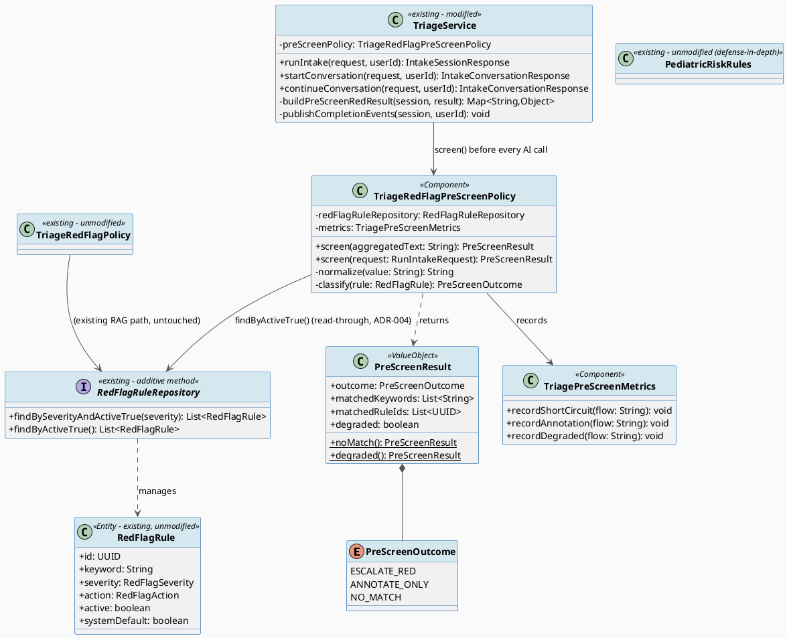
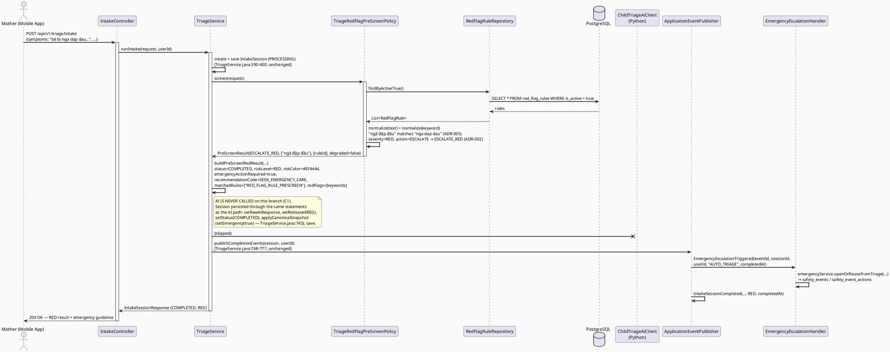
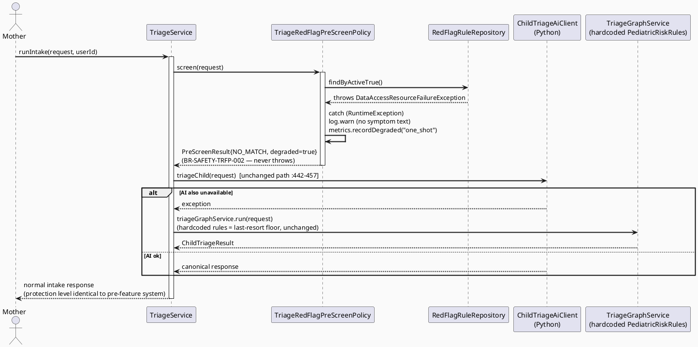
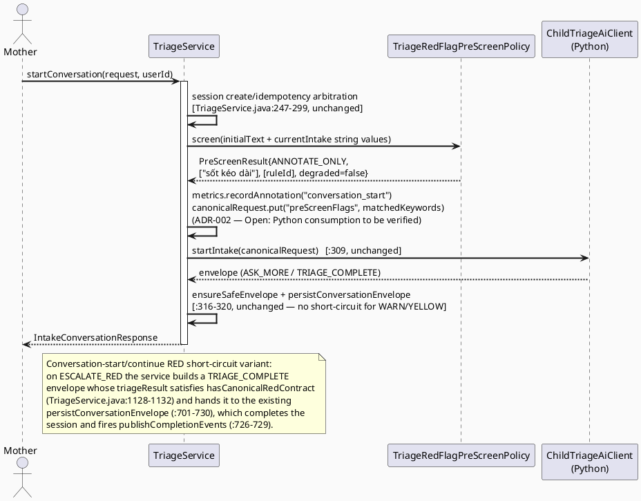

# ENGINEERING DOCUMENTATION STANDARD (EDS) v2.0
# Technical Design Specification — TriageRedFlagPreScreen: Consume `red_flag_rules` on the Intake Path

| Field              | Value                                        |
| ------------------ | -------------------------------------------- |
| **Document ID**    | `CB-TRIAGE-IMP-003`                          |
| **Version**        | `1.0`                                        |
| **Date**           | `2026-07-26`                                 |
| **Status**         | `Implemented`                                      |
| **Document Owner** | `HuyND`                                      |
| **Author**         | `AI Agent`                                   |
| **Reviewed by**    | `[ ] Pending`                                |
| **DPO Sign-off**   | `[ ] Pending` *(module touches PII: free-text health symptom descriptions pass through the pre-screen matcher — same classification as UC-60 `CB-TRIAGE-IMP-001`)* |
| **Approved by**    | `[ ] Pending`                                |
| **Last Review**    | `2026-07-26`                                 |
| **Based on EDS**   | `v2.0`                                       |

---

## CHANGELOG

> **Policy 4.4 — Immutable History:** Never delete old information. Every change must be recorded in this table.

| Date       | Performed by | Change description                                                                 |
| ---------- | ------------ | ---------------------------------------------------------------------------------- |
| 2026-07-26 | AI Agent     | Initial creation — TDS for TriageRedFlagPreScreen (Draft, roadmap Part III item 2)  |
| 2026-07-26 | AI Agent — Amelia (Dev Agent) | Phase 3: Implementation — 21/21 tests PASS (Red Gate 20/21 FAIL + documented SEC exception; GREEN feature run `Tests run: 21, Failures: 0, Errors: 0`; full regression: all triage suites green, only pre-existing unrelated failures remain — `ChecklistTemplateMigrationTest` V1 checksum drift from commit `faef9640` and 72 Docker-gated Testcontainers suites). Files: NEW `triage/policy/PreScreenOutcome.java`, `triage/policy/PreScreenResult.java`, `triage/policy/TriageRedFlagPreScreenPolicy.java`, `triage/service/TriagePreScreenMetrics.java`; MODIFIED `triage/repository/RedFlagRuleRepository.java` (+`findByActiveTrue()`), `triage/service/impl/TriageService.java` (3 pre-screen insertion points + builders). O1 resolved POSITIVE (`app/schemas.py` intake requests tolerate extra keys) → `preScreenFlags` injected on conversation flows; one-shot annotation metric/log-only per ADR-002. Deviations: `PreScreenResult.degradedNoMatch()` replaces the planned static `degraded()` (Java record accessor name clash); normalize() adds 'đ'→'d' mapping (NFD does not decompose U+0111; `normalizeAnswerToken` precedent — required for BR-SAFETY-TRFP-004); degraded metric recorded inside the policy with fixed flow label `"screen"` (screen() has no flow context) |

---

## TABLE OF CONTENTS

1. [Module Overview](#1-module-overview)
2. [Traceability Matrix](#2-traceability-matrix)
3. [Architecture Decision Records (ADR)](#3-architecture-decision-records-adr)
4. [Non-Functional Requirements & SLA](#4-non-functional-requirements--sla)
5. [Static Modeling](#5-static-modeling)
6. [Dynamic Modeling](#6-dynamic-modeling)
7. [Domain Event Catalog](#7-domain-event-catalog)
8. [Interface Specification](#8-interface-specification)
9. [API Specification](#9-api-specification)
10. [Error Codes](#10-error-codes)
11. [Implementation Plan (Step-by-Step)](#11-implementation-plan-step-by-step)
12. [Rollback & Incident Runbook](#12-rollback--incident-runbook)
13. [Test Strategy](#13-test-strategy)
14. [Verification Methods](#14-verification-methods)
15. [API Verification Samples](#15-api-verification-samples)
16. [Authorization Matrix](#16-authorization-matrix)
17. [AI Prompt Constraints (CASE 2.0)](#17-ai-prompt-constraints-case-20)

---

## 1. Module Overview

| Field                     | Value                                                                                                    |
| ------------------------- | -------------------------------------------------------------------------------------------------------- |
| **Feature ID**            | `TriageRedFlagPreScreen` (no dedicated UC number — completion item from `AITriage_Assessment_Roadmap.md` Part III item 2; runtime consumer of UC-110's admin-managed rules) |
| **Module Name**           | `Triage Red-Flag Pre-Screen`                                                                              |
| **Bounded Context**       | `triage`                                                                                                  |
| **Primary Actor**         | `Mother (ROLE_MOTHER)` — indirect: the pre-screen runs inside her existing intake requests               |
| **Platform**              | `Backend only (Spring Boot)` — no UI change                                                              |
| **Data Classification**   | `Sensitive-PII` (free-text health symptom descriptions are read by the matcher; nothing new is stored beyond what the intake flow already persists in `triage_sessions`) |
| **Compliance Scope**      | `BR-SAFETY` (CLAUDE.md — "AI provides guidance only; never diagnose, prescribe, or delay emergency routing"); PDPA scope inherited from UC-60 (no new data category collected) |
| **Upstream Dependencies** | `red_flag_rules` table + `RedFlagRuleRepository` (UC-110, `CB-MOD-IMP-005`), `TriageService` intake flows (UC-60, `CB-TRIAGE-IMP-001`) |
| **Downstream Consumers**  | Existing RED escalation chain: `EmergencyEscalationTriggered` → `EmergencyEscalationHandler` → `EmergencyService.openOrReuseFromTriage` → `safety_events` / `safety_event_actions` |

**Description:**
Today the admin-managed table `red_flag_rules` (UC-110) is **not consulted anywhere on the AI-intake path** (verified — roadmap Part II "Điểm sai lệch": `TriageRedFlagPolicy` serves only the RAG query filter `integration/gemini/filter/TriageRedFlagSafetyFilter.java`, `integration/gemini/service/RagPolicyServiceImpl.java`, and community moderation `community/policy/CommunitySafetyPolicy.java`; the Java fallback engine uses hardcoded `triage/engine/PediatricRiskRules.java`; the Python service uses hardcoded `app/risk_rules.py` with no DB access). Consequence: an admin adding an emergency keyword through UC-110 has **no effect** on the actual triage of a mother's symptom text.

This feature adds a **pre-screen step in Spring Boot that runs BEFORE the Python AI service is called**, in all three intake flows of `triage/service/impl/TriageService.java`:

1. **One-shot** `runIntake` — AI call at `triageWithAiServiceOrFallback` (`TriageService.java:442-457`, invoked from `runIntake` at `:404`);
2. **Conversation start** `startConversation` — AI call at `:309` (`childTriageAiClient.startIntake`, fallback catch `:310-315`);
3. **Conversation continue** `continueConversation` — AI call at `:370` (`childTriageAiClient.continueIntake`, fallback catch `:371-376`).

The pre-screen normalizes the free-text symptom input (diacritic-stripped, lowercase — same approach as `triage/engine/SymptomNormalizer.java:83-86`, `Normalizer.Form.NFD` + `\p{M}+` removal), matches it against ACTIVE `red_flag_rules`, and:

* On a **RED-severity match with action `ESCALATE` or `BLOCK`** → **short-circuits the session to risk RED immediately**, using the **same completion path that already triggers emergency escalation today** (`publishCompletionEvents`, `TriageService.java:768-777` → `EmergencyEscalationTriggered` + `IntakeSessionCompleted`; `session.setEmergency(riskLevel == RED)` at `:743`) — **without depending on the AI call at all**.
* On **`WARN`-action or YELLOW-severity matches** → does **not** short-circuit; annotates the intake context and continues to the AI (ADR-002).
* On **no match, or rule-lookup failure** → the flow proceeds exactly as today (ADR-003).

The hardcoded rules (`PediatricRiskRules.java`, `app/risk_rules.py`) **remain untouched as last-resort defense-in-depth** — this feature only adds an earlier, admin-configurable detection layer. It **accelerates** emergency routing (removes the AI round-trip for obvious RED cases) and can never delay it (ADR-003 fail-open-to-AI on lookup failure) — BR-SAFETY compliant by construction.

**Out of Scope (explicit, nothing invented):**
- Any change to `PediatricRiskRules.java`, `TriageGraphService.java`, `SymptomNormalizer.java`, or the Python service (`app/risk_rules.py` stays hardcoded, no DB access added to Python).
- Any change to `TriageRedFlagPolicy.java` or its RAG/community consumers — the pre-screen is a **new, separate** policy component (see ADR-001 for why `TriageRedFlagPolicy` is not reused as-is).
- Any change to UC-110 admin CRUD, the `red_flag_rules` schema, or its seed data. **No Flyway migration** — the canonical table already exists in baseline `B20260724111500__canonical_70_table_baseline.sql:1437-1450`.
- New API endpoints, request/response DTO shape changes, or mobile/web UI changes.
- Differentiated runtime behavior for `severity=GREEN` (remains configuration-only, consistent with UC-110 ADR-003).

---

## 2. Traceability Matrix

| Requirement ID       | Type          | Requirement description                                                                                          | Code Component                                                     | Compliance Target | Related ADR |
| -------------------- | ------------- | ----------------------------------------------------------------------------------------------------------------- | ------------------------------------------------------------------ | ----------------- | ----------- |
| RM-III-2             | Roadmap Item  | Pre-process symptom text in Spring Boot against ACTIVE RED `red_flag_rules` **before** calling Python; on match, mark emergency immediately (short-circuit to RED) independent of AI; keep hardcoded rules as final defense layer (`AITriage_Assessment_Roadmap.md` Part III item 2) | `TriageRedFlagPreScreenPolicy`, `TriageService` (3 insertion points) | —                 | ADR-001     |
| BR-SAFETY (CLAUDE.md)| Business Rule | "AI provides guidance only; never diagnose, prescribe, or delay emergency routing" — the pre-screen may only **accelerate** routing, never delay or block it | `TriageRedFlagPreScreenPolicy.screen()` degraded path; `TriageService` short-circuit branch | —                 | ADR-002, ADR-003 |
| BR-SAFETY-TRFP-001   | Business Rule | A rule match with `severity=RED` and `action IN (ESCALATE, BLOCK)` and `is_active=true` MUST complete the session as RED through the existing completion path (`publishCompletionEvents`) so that `EmergencyEscalationTriggered` fires | `TriageService` short-circuit branch → `publishCompletionEvents` (`:768-777`) | —                 | ADR-001, ADR-002 |
| BR-SAFETY-TRFP-002   | Business Rule | Failure to load `red_flag_rules` (DB outage/timeout) MUST degrade to a no-op pre-screen (log + metric) — never throw, never fail or delay the intake request; hardcoded rules downstream remain the safety floor | `TriageRedFlagPreScreenPolicy.screen()` try/catch                   | —                 | ADR-003     |
| BR-SAFETY-TRFP-003   | Business Rule | Hardcoded rule engines (`PediatricRiskRules.java`, `app/risk_rules.py`) MUST NOT be removed or weakened — defense-in-depth                                    | *(no code change — guarded by C4, §17)*                             | —                 | ADR-001     |
| BR-SAFETY-TRFP-004   | Business Rule | Matching MUST be case-insensitive and diacritic-insensitive on both rule keyword and input text ("khó thở" matches "kho tho" and vice versa)                  | `TriageRedFlagPreScreenPolicy` normalization helper                 | —                 | ADR-005     |
| BR-SAFETY-TRFP-005   | Business Rule | `WARN`-action and YELLOW-severity matches never short-circuit; they annotate and continue to AI. GREEN matches are ignored                                     | `TriageRedFlagPreScreenPolicy.screen()` outcome classification      | —                 | ADR-002     |
| SRS-3.2.2.12         | Functional    | Admin-configured safety rules, dangerous keywords, levels, actions (UC-110) must take real runtime effect                                                      | `TriageRedFlagPreScreenPolicy` reads `red_flag_rules`               | —                 | ADR-004     |
| UC-60 / UC-131       | Use Case      | Intake flows produce a canonical RED contract on RED results (`hasCanonicalRedContract`, `TriageService.java:1128-1132`)                                       | Short-circuit result builder                                        | —                 | ADR-001     |

---

## 3. Architecture Decision Records (ADR)

### ADR-001 — New pre-screen policy component; short-circuit through the existing completion path

| Field          | Value        |
| -------------- | ------------ |
| **Status**     | `Proposed`   |
| **Deciders**   | `HuyND — System Architect (pending review)` |
| **Date**       | `2026-07-26` |
| **Supersedes** | —            |

#### Context
Roadmap Part III item 2 says "Tiền xử lý văn bản triệu chứng tại Spring Boot **qua `TriageRedFlagPolicy`**". However, the existing `TriageRedFlagPolicy` (verified `triage/policy/TriageRedFlagPolicy.java:31-52`) (a) matches with diacritics intact (`toLowerCase().contains()` only — "kho tho" does NOT match its keyword "khó thở"), (b) ignores the `action` column entirely (`findBySeverityAndActiveTrue(RED)` at `:45` filters severity only), (c) returns a plain boolean with no matched-keyword detail, and (d) is the live safety gate for three other consumers (RAG filter, RAG policy, community moderation) — changing its matching semantics would silently change RAG/community behavior, violating "smallest scoped change" (CLAUDE.md Delivery Rules). Additionally, the short-circuit must produce a full canonical RED triage result and fire the existing escalation events — behavior that belongs to the intake flow, not to a boolean keyword check.

#### Options Considered

| Option | Description | Pros | Cons |
| ------ | ----------- | ---- | ---- |
| A      | Extend `TriageRedFlagPolicy` with normalization + action semantics + result detail, reuse for intake | One rule-matching component | Changes matching behavior for 3 existing consumers (RAG filter, RAG policy, community) without a requirement to do so; boolean API insufficient for WARN/annotation semantics; blast radius spans 2 other bounded contexts |
| B      | New dedicated `TriageRedFlagPreScreenPolicy` in `triage.policy`, reading the same `RedFlagRuleRepository`; `TriageService` invokes it before each of the three AI calls and, on ESCALATE outcome, builds a canonical RED result and completes the session through the **existing** save/`applyCanonicalSnapshot`/`publishCompletionEvents` code path | Zero behavior change for existing consumers; intake-specific semantics (action column, annotation, normalization) live in one place; short-circuit reuses the exact escalation chain already tested for AI-produced RED results | A second component reads `red_flag_rules` (acceptable — both are thin read-throughs over the same repository) |
| C      | Implement the rule check inside the Python AI service (DB access from Python) | Single evaluation point for AI flows | Violates roadmap intent ("**trước khi** gọi Python", independent of AI availability); adds DB coupling + credentials to the Python service (new infrastructure — forbidden without approval); does not cover the Java-fallback path when Python is down |

#### Decision
Choose **Option B**. New component `com.carebridge.backend.triage.policy.TriageRedFlagPreScreenPolicy` + result types; `TriageService` gains one pre-screen call before each of the three `childTriageAiClient` invocations (`:404→442`, `:309`, `:370`). On `ESCALATE_RED` outcome the service does **not** call the AI; it constructs a result map that satisfies the already-enforced canonical RED contract (`hasCanonicalRedContract`, `TriageService.java:1128-1132`: `emergencyActionRequired=true`, `recommendationCode="SEEK_EMERGENCY_CARE"`, non-empty `matchedRules`) and persists/completes the session through the same statements the AI path uses, so `publishCompletionEvents` (`:768-777`) fires `EmergencyEscalationTriggered` + `IntakeSessionCompleted` unchanged. No bespoke escalation path is created.

#### Consequences

**Positive:**
- Admin rule changes (UC-110) finally take effect on real triage; RED short-circuit responses return faster than any AI round-trip (routing accelerated, never delayed).
- Escalation side effects (`safety_events`, family alerts) are produced by the exact code already in production for AI-detected RED — no second escalation implementation to keep consistent.
- RAG/community behavior is byte-for-byte unchanged.

**Negative / Trade-offs:**
- Two components now read `red_flag_rules` with different matching semantics (diacritic-sensitive in RAG filter vs. insensitive in pre-screen). Mitigation: documented here and in code comments; unifying them is a candidate follow-up ADR, out of scope now (`Open`).
- No runtime kill-switch in v1 — disabling the pre-screen requires redeploying the previous build (see §12). A config toggle (`carebridge.triage.prescreen.enabled`) is recorded as `Open` for reviewer decision.

**Compliance Impact:** Directly serves BR-SAFETY (faster emergency routing). No new PII storage.

---

### ADR-002 — Action/severity semantics on the intake path (derived from the DDL check constraints)

| Field        | Value        |
| ------------ | ------------ |
| **Status**   | `Proposed`   |
| **Deciders** | `HuyND — System Architect (pending review)` |
| **Date**     | `2026-07-26` |

#### Context
The canonical DDL (`B20260724111500__canonical_70_table_baseline.sql:1437-1450`) constrains `severity IN ('GREEN','YELLOW','RED')` and `action IN ('BLOCK','WARN','ESCALATE')` but defines no runtime meaning. UC-110 ADR-003 deliberately deferred runtime semantics ("only RED+ESCALATE+active affects `isRedFlag()`; GREEN/YELLOW/BLOCK/WARN stored but inert"). This feature is the first consumer that must give `action` a precise meaning on the intake path. Note (verified): the existing `TriageRedFlagPolicy` ignores `action` entirely — a `RED+WARN` rule already triggers the RAG red-flag today; the intake pre-screen defines stricter semantics for the intake context only.

#### Options Considered

| Option | Description | Pros | Cons |
| ------ | ----------- | ---- | ---- |
| A      | `BLOCK` = suppress/reject the intake request (literal reading of "block") | Literal | **Unsafe**: refusing or halting a symptom intake because it contains an emergency keyword is the exact opposite of safe behavior — it delays emergency routing (BR-SAFETY violation). Rejected outright |
| B      | Short-circuit set = `severity=RED AND action IN (ESCALATE, BLOCK) AND is_active=true`. `WARN` (any severity, incl. RED+WARN) and YELLOW severity = annotate-only, continue to AI. GREEN = ignored entirely | On an intake path there is nothing that can be safely "blocked"; escalation is the only interpretation of BLOCK that cannot delay care. WARN keeps a human-meaningful middle tier for admins. GREEN stays inert (consistent with UC-110 ADR-003) | `RED+WARN` behaves differently on intake (annotate) vs. RAG filter (red-flags today) — asymmetry documented below |
| C      | Short-circuit on any RED match regardless of action (mirror `TriageRedFlagPolicy`) | Simplest; symmetric with RAG | Erases the admin's ability to express "flag this to the AI but don't auto-escalate" — the only reason `WARN` exists; contradicts the roadmap's "record WARN behavior as decision" instruction |

#### Decision
Choose **Option B**. Precise classification, evaluated per active rule whose normalized keyword is contained in the normalized input text:

| Matched rule (`is_active=true`)        | Pre-screen outcome  | Effect |
| -------------------------------------- | ------------------- | ------ |
| `severity=RED`, `action=ESCALATE`      | `ESCALATE_RED`      | Short-circuit session to RED; AI not called; emergency events fired |
| `severity=RED`, `action=BLOCK`         | `ESCALATE_RED`      | Same as above — "block" can never suppress an intake (BR-SAFETY); treated as escalate, and this equivalence is documented for admins |
| `severity=RED`, `action=WARN`          | `ANNOTATE_ONLY`     | No short-circuit; matched keywords annotated into the AI request context; flow continues |
| `severity=YELLOW`, any action          | `ANNOTATE_ONLY`     | Same annotation behavior; never short-circuits |
| `severity=GREEN`, any action           | *(ignored)*         | No runtime effect (consistent with UC-110 ADR-003) |
| `is_active=false`, any severity/action | *(ignored)*         | Inactive rules never match |

If both `ESCALATE_RED` and `ANNOTATE_ONLY` rules match the same text, `ESCALATE_RED` wins (most-severe-wins; annotation is moot because the AI is not called).

**Annotation mechanism (v1):** matched WARN/YELLOW keywords are (a) recorded via `TriagePreScreenMetrics` + structured log (keyword + ruleId, no free-text PII in the log line), and (b) injected into the AI request context as an additive key `preScreenFlags` (list of matched keywords) placed into the canonical request map next to the existing keys (`currentIntake`, `stage`, … — built at `TriageService.java:300-306`, `:337-345`) and into the one-shot request via `RunIntakeRequest`'s existing free-text aggregation is **not** modified — one-shot annotation is metadata-only in v1. Whether the Python service consumes `preScreenFlags` (schema tolerance / prompt use) is **`Open`** — it must be verified against `app/schemas.py` before implementation; if the Python contract rejects unknown keys, v1 ships with log/metric annotation only. This sub-decision does not affect the RED short-circuit path in any way.

#### Consequences
**Positive:** `action` column becomes meaningful; no interpretation can delay routing; GREEN inertness preserved.
**Negative / Trade-offs:** `RED+WARN` asymmetry between intake (annotate) and RAG filter (red-flag) — accepted for v1, documented in §Glossary and code comments; a follow-up ADR may align `TriageRedFlagPolicy` with action semantics (`Open`).
**Compliance Impact:** BR-SAFETY upheld — no branch suppresses or delays intake.

---

### ADR-003 — Failure mode: pre-screen degrades to no-op (fail-open **to the AI + hardcoded floor**, never to the user)

| Field        | Value        |
| ------------ | ------------ |
| **Status**   | `Proposed`   |
| **Deciders** | `HuyND — System Architect (pending review)` |
| **Date**     | `2026-07-26` |

#### Context
The pre-screen adds a DB read on the intake hot path. If `red_flag_rules` cannot be read (outage, timeout), the request must not fail: unlike UC-110's RAG gate (where fail-closed means "keep the floor keywords active"), the intake path already has its safety floor **downstream** — the AI service plus the hardcoded `PediatricRiskRules.java` fallback (invoked at `TriageService.java:450`, `:794`) and Python's `app/risk_rules.py`. Throwing from the pre-screen would convert a detection *enhancement* into a new *outage mode* for the whole triage feature — that would "delay emergency routing" and violate BR-SAFETY.

#### Decision
`TriageRedFlagPreScreenPolicy.screen()` catches `RuntimeException` from the repository, logs a WARN (no symptom text in the log message), increments a degradation metric, and returns `PreScreenResult` with `outcome=NO_MATCH, degraded=true`. `TriageService` treats a degraded result exactly like NO_MATCH: it proceeds to the AI call and, if that also fails, to the existing hardcoded Java fallback. The pre-screen can therefore only ever **add** a faster RED detection; it can never remove or delay any protection that exists today. (Options considered: fail request with 503 — rejected, creates new outage mode; silent swallow without metric — rejected, unobservable degradation.)

#### Consequences
**Positive:** Zero new failure modes for the user; degradation is observable (metric + log).
**Negative / Trade-offs:** During a `red_flag_rules` outage, admin-added keywords are temporarily inert on intake (hardcoded rules still apply) — acceptable: identical protection level to the system as it exists before this feature.
**Compliance Impact:** BR-SAFETY — routing never delayed by this component.

---

### ADR-004 — Rule loading strategy: read-through per request, no cache (staleness trade-off)

| Field        | Value        |
| ------------ | ------------ |
| **Status**   | `Proposed`   |
| **Deciders** | `HuyND — System Architect (pending review)` |
| **Date**     | `2026-07-26` |

#### Context
The pre-screen needs all ACTIVE rules (RED for short-circuit, YELLOW/RED+WARN for annotation) on every intake request. Expected table size < 200 rows (UC-110 TDS §4.4), indexed by `(is_active, severity)` (`idx_red_flag_rules_active_severity`, UC-110 migration). Intake traffic is low-frequency, human-paced (one mother submitting symptoms). UC-110 ADR-004 already resolved the same question for the RAG path as "read-through, no cache".

#### Options Considered

| Option | Description | Pros | Cons |
| ------ | ----------- | ---- | ---- |
| A      | Read-through: one `findByActiveTrue()` query per pre-screen invocation | Zero staleness — an admin-added emergency keyword protects the **very next** intake request; no new infra; consistent with UC-110 ADR-004; simplest failure analysis for a safety component | One extra indexed SELECT per intake request (~1 per multi-second user interaction) |
| B      | Short-TTL in-memory cache (30–60 s) inside the policy bean | Removes the per-request query | **Staleness window on a safety rule set**: a newly activated RED keyword is ignored for up to TTL — the exact scenario this feature exists to fix would intermittently not work, and would be untestable/nondeterministic in support situations. Also new invalidation/concurrency surface, no `@Cacheable`/Redis precedent in the `triage` package (verified in UC-110 ADR-004 analysis) |
| C      | Startup load + event-driven invalidation from UC-110 CRUD | No staleness, no per-request query | Couples UC-110 service to this component; multi-instance invalidation needs shared infrastructure (not present); largest scope |

#### Decision
Choose **Option A** for v1 — read-through, no cache. The staleness trade-off is decisive: for an emergency-keyword rule set, freshness is a correctness property, not a performance nicety; and the measured cost is one indexed SELECT over <200 rows on a human-paced endpoint. If production APM later shows the pre-screen query exceeding its latency budget (§4.1), re-evaluate Option B in a follow-up ADR with measured numbers — do not add cache speculatively. This mirrors and stays consistent with UC-110 ADR-004.

#### Consequences
**Positive:** Deterministic freshness (testable — Test-Spec `TRFP-TC-019`); no invalidation logic.
**Negative / Trade-offs:** +1 DB round-trip per intake request — bounded by §4.1 budget; acceptable.
**Compliance Impact:** None beyond BR-SAFETY freshness argument above.

---

### ADR-005 — Normalization: diacritic-stripped, lowercase, substring matching (reuse `SymptomNormalizer` approach)

| Field        | Value        |
| ------------ | ------------ |
| **Status**   | `Proposed`   |
| **Deciders** | `HuyND — System Architect (pending review)` |
| **Date**     | `2026-07-26` |

#### Context
Mothers type Vietnamese with or without diacritics ("khó thở" / "kho tho"). Rule keywords in `red_flag_rules` are stored with diacritics (UC-110 seed rows). The codebase already has a proven normalization approach: `SymptomNormalizer.stripAccents` (`triage/engine/SymptomNormalizer.java:83-86`) — `Normalizer.normalize(value.toLowerCase(Locale.ROOT), Form.NFD)` then remove `\p{M}+` (pattern at `:18`) — plus whitespace collapsing and space-padding in `toSearchText` (`:67-81`). `SymptomNormalizer`'s helpers are `private` and its keyword map is intake-symptom-specific, so it cannot be called directly.

#### Decision
`TriageRedFlagPreScreenPolicy` implements a private static `normalize(String)` that replicates the exact `SymptomNormalizer` approach (lowercase `Locale.ROOT` → NFD → strip `\p{M}+` → collapse whitespace to single spaces → trim). Normalization is applied to **both** the rule keyword and the aggregated input text at match time; matching is plain substring `contains` (same semantics as the existing floor check in `TriageRedFlagPolicy.java:38` and the DDL comment "substring/phrase matched case-insensitively"). No refactor of `SymptomNormalizer` (Delivery Rules — do not refactor unrelated code); extracting a shared `TriageTextNormalizer` utility is a candidate cleanup, recorded `Open`. Input aggregation per flow is specified in §8.1.

Known accepted limitation: substring matching can over-match inside longer words; identical limitation already accepted in `TriageRedFlagPolicy` and UC-110 — over-matching errs on the safe side (escalation), never the unsafe side.

#### Consequences
**Positive:** "khó thở" ↔ "kho tho" match in both directions; consistent with the codebase's only existing Vietnamese-normalization precedent.
**Negative / Trade-offs:** Small code duplication (≈6 lines) vs. refactoring shared code — chosen deliberately.
**Compliance Impact:** None.

---

## 4. Non-Functional Requirements & SLA

### 4.1. Performance & Availability

| Category | Requirement | Target SLA | Measurement Method | Compliance Basis |
| -------- | ----------- | ---------- | ------------------- | ---------------- |
| Latency  | Pre-screen added overhead on the non-short-circuit path (rule SELECT + in-memory matching, per request) | p95 ≤ 30 ms, p99 ≤ 50 ms *(proposed — no sourced SLA exists for this path; derived from "one indexed SELECT over <200 rows"; confirm at review — `Open`)* | APM trace around `TriageRedFlagPreScreenPolicy.screen()` | BR-SAFETY (pre-screen must not become a delay) |
| Latency  | RED short-circuit path, `runIntake` end-to-end (no AI call) | p99 ≤ 500 ms *(proposed/`Open` — must in any case be strictly faster than the current AI-path RED, since it removes the AI round-trip)* | APM / k6 | BR-SAFETY (accelerated routing) |
| Availability | Pre-screen degradation (rule lookup failing) must not reduce intake availability | 0 intake requests failed due to pre-screen errors | Error-rate dashboard + `TriagePreScreenMetrics` degraded counter | BR-SAFETY-TRFP-002 |
| Throughput | No change to intake throughput envelope | Same as UC-60 baseline | Load test | — |

### 4.2. Data Integrity & Retention

| Category  | Requirement | Target | Verification Method | Compliance Basis |
| --------- | ----------- | ------ | ------------------- | ---------------- |
| Integrity | Short-circuited sessions carry the full canonical RED contract (`emergencyActionRequired=true`, `recommendationCode=SEEK_EMERGENCY_CARE`, non-empty `matchedRules`) and `triage_sessions.emergency_flag=true` | 100% | Test-Spec `TRFP-TC-011`, DB inspection §14.1 | BR-SAFETY-TRFP-001 |
| Integrity | Escalation event parity: every pre-screen RED completion publishes exactly one `EmergencyEscalationTriggered` + one `IntakeSessionCompleted` (same as AI-detected RED) | 100% | Test-Spec `TRFP-TC-012`, `TRFP-TC-018` (no duplicates on idempotent replay) | BR-SAFETY-TRFP-001 |
| Retention | No new tables/columns; retention identical to existing `triage_sessions` policy | — | Schema diff = empty | — |
| Freshness | Admin rule activation takes effect on the next intake request (no cache) | 100% | Test-Spec `TRFP-TC-019` | ADR-004 |

### 4.3. Security

| Category | Requirement | Target | Verification Method | Compliance Basis |
| -------- | ----------- | ------ | ------------------- | ---------------- |
| Access control | No new endpoints; existing `@PreAuthorize("hasRole('MOTHER')")` on all 7 intake endpoints unchanged (verified `IntakeController.java:36-89`) | Unchanged | Auth Matrix §16, Test-Spec `TRFP-TC-SEC-001` | BR-RBAC (existing) |
| PII in logs | Pre-screen log lines contain rule keyword/ruleId only — never the mother's free symptom text | 0 occurrences | Log grep §14.2 | PDPA / GDPR-analog hygiene, same rule as UC-60 |

### 4.4. Scalability & Capacity Planning

Rule table < 200 rows (UC-110 §4.4); one additional indexed SELECT per intake request at human-paced traffic. No scaling action needed; matching is O(rules × text length) in memory, negligible at these sizes.

---

## 5. Static Modeling

### 5.1. Class Diagram (PlantUML)



**Planned file paths (exact):**

| # | File | Status |
| - | ---- | ------ |
| 1 | `05_Development/CareBridgeAPI/src/main/java/com/carebridge/backend/triage/policy/PreScreenOutcome.java` | NEW |
| 2 | `05_Development/CareBridgeAPI/src/main/java/com/carebridge/backend/triage/policy/PreScreenResult.java` | NEW |
| 3 | `05_Development/CareBridgeAPI/src/main/java/com/carebridge/backend/triage/policy/TriageRedFlagPreScreenPolicy.java` | NEW |
| 4 | `05_Development/CareBridgeAPI/src/main/java/com/carebridge/backend/triage/service/TriagePreScreenMetrics.java` | NEW (mirrors existing `TriageFallbackMetrics` pattern) |
| 5 | `05_Development/CareBridgeAPI/src/main/java/com/carebridge/backend/triage/repository/RedFlagRuleRepository.java` | MODIFIED — additive method `findByActiveTrue()` only |
| 6 | `05_Development/CareBridgeAPI/src/main/java/com/carebridge/backend/triage/service/impl/TriageService.java` | MODIFIED — 3 pre-screen insertion points + short-circuit result builders |

**Component responsibilities:**
- `TriageRedFlagPreScreenPolicy` (policy layer, per CLAUDE.md package rules — reusable domain safety rule): load active rules, normalize, match, classify outcome, degrade safely. No transaction ownership, no persistence, no event publishing.
- `TriageService` (service layer): decides *what to do* with the outcome — short-circuit completion (persist + events) or annotate-and-continue. All workflow/transaction/event responsibilities stay here.
- `TriagePreScreenMetrics`: observability only.
- No controller change, no DTO change, no mapper change, no entity change.

### 5.2. Data Structure (Flyway SQL Migration)

**Not applicable — no schema change.** The consumed table already exists in the canonical baseline `05_Development/CareBridgeAPI/src/main/resources/db/migration/B20260724111500__canonical_70_table_baseline.sql:1437-1450` (read-only reference, quoted for the oracle):

```sql
CREATE TABLE public.red_flag_rules (
    id uuid DEFAULT gen_random_uuid() NOT NULL,
    keyword character varying(255) NOT NULL,
    severity character varying(20) NOT NULL,
    action character varying(20) NOT NULL,
    is_active boolean DEFAULT true NOT NULL,
    is_system_default boolean DEFAULT false NOT NULL,
    created_by uuid,
    updated_by uuid,
    created_at timestamp with time zone DEFAULT now() NOT NULL,
    updated_at timestamp with time zone DEFAULT now() NOT NULL,
    CONSTRAINT chk_red_flag_rules_action CHECK (((action)::text = ANY ((ARRAY['BLOCK'::character varying, 'WARN'::character varying, 'ESCALATE'::character varying])::text[]))),
    CONSTRAINT chk_red_flag_rules_severity CHECK (((severity)::text = ANY ((ARRAY['GREEN'::character varying, 'YELLOW'::character varying, 'RED'::character varying])::text[])))
);
```

No new Flyway file is created; per CLAUDE.md, applied migrations are never modified.

---

## 6. Dynamic Modeling

### 6.1. Sequence Diagram — Happy Path (one-shot RED short-circuit)



### 6.2. Sequence Diagram — Error Path (rule lookup fails → degrade, never delay)



### 6.3. Sequence Diagram — Alternative Path (conversation start, WARN/YELLOW annotation)



### 6.4. State Machine

**Not applicable — no new states.** The pre-screen reuses the existing `IntakeStatus` transitions (`PROCESSING → COMPLETED` with `riskLevel=RED`), identical to an AI-detected RED completion (see UC-60 TDS for the session state machine). Invariant preserved: a COMPLETED session with `riskLevel=RED` always has `emergency_flag=true` (`applyCanonicalSnapshot`, `TriageService.java:743`) and always publishes the escalation events exactly once.

---

## 7. Domain Event Catalog

### 7.1. Events Published

No new event types. The short-circuit branch **reuses** the existing publications (publisher code unchanged — `publishCompletionEvents`, `TriageService.java:768-777`):

| Event Name                    | Trigger                                                        | Publisher       | Subscriber(s)                                                      | Payload Schema | Async? |
| ----------------------------- | -------------------------------------------------------------- | --------------- | ------------------------------------------------------------------ | -------------- | ------ |
| `EmergencyEscalationTriggered`| Session completed with `riskLevel=RED` — now also reachable via pre-screen short-circuit (new trigger cause, same event) | `TriageService` | `emergency/service/EmergencyEscalationHandler` → `EmergencyService.openOrReuseFromTriage` → `safety_events`/`safety_event_actions` | `ai/event/EmergencyEscalationTriggered.java` (existing record: `eventId, sessionId, userId, triggerSource="AUTO_TRIAGE", triggeredAt`) | No (Spring `@EventListener`, same-context) |
| `IntakeSessionCompleted`      | Session completed with a persistable risk level — now also reachable via pre-screen short-circuit | `TriageService` | `StructuredIntakeService` (structured data snapshot into `triage_sessions`) and existing listeners | `triage/event/IntakeSessionCompleted.java` (existing record: `eventId, sessionId, userId, riskLevel, completedAt`) | No |

> **Design rule (C2, §17):** the pre-screen branch must reach these events **only** through the existing `publishCompletionEvents`/`persistConversationEnvelope` code, guaranteeing payload and ordering parity with AI-detected RED. `triggerSource` stays `"AUTO_TRIAGE"` (existing constant at `TriageService.java:772`); introducing a distinguishing trigger-source value is `Open` (would touch the event contract — not needed for v1 behavior).

### 7.2. Events Consumed

| Event Name | Source | Handler | Action |
| ---------- | ------ | ------- | ------ |
| *(none)*   | —      | —       | This feature consumes no domain events. |

### 7.3. Payload Schema

Not applicable — no new event records are defined; existing records are listed in §7.1 and are not modified.

---

## 8. Interface Specification

> **Policy (EDS v2.0):** each interface declares `@version`. Signatures only — no implementation bodies in this document.

### 8.1. Policy Interface (new)

```java
// com.carebridge.backend.triage.policy.PreScreenOutcome
// @version 1.0
public enum PreScreenOutcome { ESCALATE_RED, ANNOTATE_ONLY, NO_MATCH }

// com.carebridge.backend.triage.policy.PreScreenResult
// @version 1.0
// Immutable value object. degraded=true means the rule lookup failed and the
// pre-screen intentionally no-ops (ADR-003); outcome is then always NO_MATCH.
public record PreScreenResult(
        PreScreenOutcome outcome,
        List<String> matchedKeywords,   // original (un-normalized) keywords of matched rules
        List<UUID> matchedRuleIds,
        boolean degraded) {

    public static PreScreenResult noMatch();
    public static PreScreenResult degraded();
}

// com.carebridge.backend.triage.policy.TriageRedFlagPreScreenPolicy
// @version 1.0
// Spring @Component. Stateless; queries RedFlagRuleRepository per invocation (ADR-004).
// NEVER throws on rule-lookup failure (ADR-003 / BR-SAFETY-TRFP-002).
public class TriageRedFlagPreScreenPolicy {

    /**
     * Screens an aggregated free-text string against ACTIVE red_flag_rules.
     * Classification per ADR-002:
     *   RED + (ESCALATE|BLOCK)          -> ESCALATE_RED
     *   RED + WARN, or YELLOW (any)     -> ANNOTATE_ONLY
     *   GREEN (any), inactive, no match -> NO_MATCH
     * Most-severe-wins when multiple rules match.
     * Matching: normalize(keyword) contained in normalize(text) (ADR-005).
     */
    public PreScreenResult screen(String aggregatedText);

    /**
     * Convenience overload for the one-shot flow: aggregates the same String fields
     * as SymptomNormalizer.toSearchText (SymptomNormalizer.java:67-81) — symptomList,
     * symptoms, duration, feedingStatus, breathingStatus, consciousnessStatus,
     * vomiting, diarrhea, rash, parentFreeText, dehydrationSigns — then delegates
     * to screen(String).
     */
    public PreScreenResult screen(RunIntakeRequest request);
}
```

**Input aggregation per flow (what `TriageService` passes to `screen`):**

| Flow | Insertion point (before AI call) | Aggregated text source |
| ---- | -------------------------------- | ---------------------- |
| One-shot `runIntake` | Inside the try block, before `triageWithAiServiceOrFallback` (currently invoked at `TriageService.java:404`) | `screen(RunIntakeRequest)` — field aggregation as above |
| Conversation start | After session creation/idempotency arbitration, before `childTriageAiClient.startIntake` (`:309`) | `request.getInitialText()` + all `String` values of `request.getCurrentIntake()` |
| Conversation continue | After answer filtering (`:361-366`), before `childTriageAiClient.continueIntake` (`:370`) | All `String` values of the filtered `newAnswers` + all `String` values of the previous `mergedIntake` map |

### 8.2. Repository Interface (existing — one additive method)

```java
// com.carebridge.backend.triage.repository.RedFlagRuleRepository
// @version 1.1 (additive — no existing method is changed or removed)
public interface RedFlagRuleRepository extends JpaRepository<RedFlagRule, UUID> {

    // existing (UC-110) — unchanged, still used by TriageRedFlagPolicy (RAG path):
    List<RedFlagRule> findBySeverityAndActiveTrue(RedFlagSeverity severity);
    boolean existsByKeywordIgnoreCase(String keyword);
    Page<RedFlagRule> findBySeverityAndActive(RedFlagSeverity severity, Boolean active, Pageable pageable);

    /**
     * NEW — single query for the intake pre-screen (all severities needed:
     * RED for short-circuit, YELLOW/RED+WARN for annotation — ADR-002/ADR-004).
     * Property name is "Active" (not "IsActive") — verified naming constraint from
     * UC-110 implementation (entity exposes boolean via isActive()/active field).
     */
    List<RedFlagRule> findByActiveTrue();
}
```

### 8.3. Service changes (existing `ITriageService` — contract unchanged)

`ITriageService`'s public contract (`runIntake`, `startConversation`, `continueConversation` signatures) is **not modified**. New private members in `TriageService`:

```java
// signatures only — private helpers inside TriageService
private Map<String, Object> buildPreScreenRedResult(IntakeSession session, PreScreenResult preScreen);
    // Produces the one-shot result map. MUST satisfy hasCanonicalRedContract
    // (TriageService.java:1128-1132). Oracle values from existing code:
    //   status = "COMPLETED", riskLevel = "RED",
    //   riskColor = "#EF4444"                       (TriageGraphService.java:135)
    //   emergencyActionRequired = true,
    //   recommendationCode = "SEEK_EMERGENCY_CARE"  (TriageRecommendationCode.forRisk("RED"))
    //   matchedRules = ["RED_FLAG_RULE_PRESCREEN"], redFlags = preScreen.matchedKeywords(),
    //   recommendedAction = TriageRedFlagPolicy emergency guidance text (call 115),
    //   disclaimer = TriageGraphService.DISCLAIMER  (TriageGraphService.java:14)
    //   stage = session.getStage().name(), citations = [], claims = [], evidenceIds = []

private Map<String, Object> buildPreScreenRedEnvelope(IntakeSession session, PreScreenResult preScreen, int round);
    // Conversation variant: {status:"TRIAGE_COMPLETE", intakeSessionId, stage,
    //  mergedIntake:<current merged map>, round, assistantMessage:<emergency guidance>,
    //  triageResult:<buildPreScreenRedResult map>} — only keys from
    //  CONVERSATION_RESPONSE_FIELDS/METADATA (TriageService.java:67-80) so that
    //  sanitizeEnvelope/ensureSafeEnvelope (:1065-1110) accept it unchanged.
```

---

## 9. API Specification

### 9.1. Endpoints Table

**No new endpoints; no path, auth, or DTO changes.** Affected existing endpoints (behavioral impact only):

| Method | Path | Auth Level | Required Roles | Behavioral change introduced by this feature |
| ------ | ---- | ---------- | -------------- | -------------------------------------------- |
| `POST` | `/api/v1/triage/intake` (one-shot `runIntake`) | JWT Bearer | `ROLE_MOTHER` | May now return a COMPLETED/RED result **without** an AI call when an active RED ESCALATE/BLOCK rule matches; response shape identical |
| `POST` | `/api/v1/triage/intake/conversation` (start) | JWT Bearer | `ROLE_MOTHER` | May return `TRIAGE_COMPLETE` with a RED `triageResult` at round 1 (short-circuit) instead of `ASK_MORE` |
| `POST` | `/api/v1/triage/intake/conversation/continue` | JWT Bearer | `ROLE_MOTHER` | May return `TRIAGE_COMPLETE`/RED on any round when new answers match a RED rule |
| *(other 4 intake endpoints)* | `getResult`, `listSessions`, `resolveContinuation`, `acknowledgeContinuation` | JWT Bearer | `ROLE_MOTHER` | Unchanged |

### 9.2. Request / Response Schemas

Request schemas: unchanged. Response schemas: unchanged (same DTOs). Observable differences in the **content** of a short-circuited RED response (contract-compatible — these fields already exist on AI/fallback RED responses):

```json
// POST /api/v1/triage/intake — short-circuited RED (illustrative content)
{
  "status": "COMPLETED",
  "riskLevel": "RED",
  "riskColor": "#EF4444",
  "emergencyActionRequired": true,
  "recommendationCode": "SEEK_EMERGENCY_CARE",
  "matchedRules": ["RED_FLAG_RULE_PRESCREEN"],
  "redFlags": ["ngã đập đầu"],
  "recommendedAction": "Đây có thể là tình huống khẩn cấp y tế. Hãy gọi 115 hoặc đến cơ sở y tế gần nhất ngay lập tức. Đừng chờ đợi.",
  "disclaimer": "CareBridge không chẩn đoán bệnh, không kê thuốc và không thay thế bác sĩ. ..."
}
```

Clients require no changes: `matchedRules` values are already free-form rule identifiers (the Java fallback emits values like `RED_BREATHING_DISTRESS`); `RED_FLAG_RULE_PRESCREEN` is one more identifier in the same namespace.

---

## 10. Error Codes

**No new error codes.** The pre-screen never fails a request (ADR-003). Existing codes on the touched paths, unchanged (verified against `TriageException` usages — `TRIAGE-003..016` currently claimed; next free code would be `TRIAGE-017`, none is claimed by this feature):

| Code | HTTP Status | Message (EN) | Message (VI) | Trigger Condition | Status |
| ---- | ----------- | ------------ | ------------ | ----------------- | ------ |
| `TRIAGE-005` | 503 | Triage processing failed | Xử lý sàng lọc thất bại | Existing: unrecoverable failure inside `runIntake` try block (`TriageService.java:429-436`). A pre-screen bug that *throws* would surface here — which is exactly why BR-SAFETY-TRFP-002 forbids the policy from throwing (Red-Gate-tested, Test-Spec `TRFP-TC-009`) | Existing — unchanged |
| `TRIAGE-003` / `TRIAGE-008` / `TRIAGE-009` / `TRIAGE-010` | 404/409/409/400 | (existing conversation-flow validation errors) | — | Unchanged — pre-screen runs after all of these validations, so their behavior is identical | Existing — unchanged |
| *(none — empty body)* | 401 | — | — | Missing/invalid JWT — framework default (`HttpStatusEntryPoint`), verified precedent UC-110 TDS §10 | Existing framework path |
| `ACCESS_DENIED` | 403 | Insufficient permissions | Không đủ quyền | Non-MOTHER calls an intake endpoint (existing `@PreAuthorize`) | Existing — unchanged |

---

## 11. Implementation Plan (Step-by-Step)

### 11.1. Prerequisites

- [x] ADR-001…ADR-005 reviewed and Accepted (document approved as a whole — header `Status: Approved` verified before implementation)
- [x] Open items in §Open Items triaged — O1 resolved POSITIVE 2026-07-26 (`app/schemas.py` `IntakeStartRequest`/`IntakeContinueRequest` have no `extra="forbid"` → `preScreenFlags` tolerated); O2 (kill-switch) and O3 (trigger-source) remain `Open` with reviewer owners, not implemented (smallest scope)
- [x] Test-Spec `CB-TRIAGE-TEST-003` approved; Red Gate protocol followed (evidence: `red-gate-evidence.log`)
- [ ] DPO sign-off decision recorded (module processes symptom free text in memory; no new storage) — still `Pending` in header

### 11.2. Pre-Migration Checklist

**Not applicable — no migration.** (Baseline `B20260724111500` already contains `red_flag_rules`; verify on the target environment: `SELECT count(*) FROM red_flag_rules;` returns ≥ 19 system-default rows per UC-110 seed.)

### 11.3. Implementation Steps (ordered — TDD, Red Gate first)

```
Stage 0 — Red Gate scaffolding (types + stubs only, all logic throws):
  1. PreScreenOutcome.java, PreScreenResult.java (records/enums — pure data, no logic)
  2. TriageRedFlagPreScreenPolicy.java with both screen(...) methods throwing
     UnsupportedOperationException("Not implemented — Red Phase stub")
  3. TriagePreScreenMetrics.java (counter no-ops acceptable at stub stage)
  4. RedFlagRuleRepository: add findByActiveTrue() (interface method — Spring Data derives it)
  5. TriageService: inject TriageRedFlagPreScreenPolicy + TriagePreScreenMetrics
     (constructor wiring only; call sites added but branch bodies reach the stub)
  6. Write ALL Test-Spec §4 tests; run ./mvnw test — confirm every TRFP-TC fails (Red Gate §5.1)

Stage 1 — Policy (make TRFP-TC-001..010 green):
  7. Implement normalize(String) (ADR-005), findByActiveTrue() read-through, classify(rule)
     per ADR-002 table, degraded catch (ADR-003), most-severe-wins aggregation

Stage 2 — One-shot short-circuit (TRFP-TC-011/012):
  8. In runIntake: call preScreenPolicy.screen(request) at the top of the existing try block;
     on ESCALATE_RED build buildPreScreenRedResult(...) and feed it through the EXISTING
     persistence statements (setRawAiResponse → setRiskLevel → setStatus(COMPLETED) →
     applyCanonicalSnapshot → save → publishCompletionEvents) instead of calling
     triageWithAiServiceOrFallback; on ANNOTATE_ONLY record metric and continue;
     on NO_MATCH/degraded continue unchanged

Stage 3 — Conversation short-circuit (TRFP-TC-013/014/018):
  9. startConversation: screen(initialText + currentIntake strings) before :309;
     on ESCALATE_RED build buildPreScreenRedEnvelope(...) and pass it to the EXISTING
     persistConversationEnvelope (:701-730) — do NOT bypass ensureSafeEnvelope invariants
 10. continueConversation: screen(newAnswers + mergedIntake strings) before :370; same handling

Stage 4 — Annotation + observability (TRFP-TC-015/016/017/019):
 11. preScreenFlags injection into conversation canonical request maps (guarded by the
     Open-item verification of Python schema tolerance; if unresolved, ship log/metric-only)
 12. Metrics wiring for short_circuit / annotation / degraded per flow

Stage 5 — Integration + regression:
 13. TRFP-TC-INT-001 (@SpringBootTest + H2 — project convention, no Testcontainers exist
     in this codebase, verified in UC-110 implementation notes)
 14. Full ./mvnw test regression; verify TriageRedFlagPolicyTest, TriageServiceTest,
     PediatricRedParityTest, RedFlagRule* suites all still green (no behavior drift)
```

### 11.4. Deployment Checklist

- [x] `./mvnw clean test` run 2026-07-26: all pre-existing triage suites green (no regression); only pre-existing unrelated failures remain (V1 checksum drift `faef9640`; 72 Docker-gated Testcontainers suites — Docker unavailable in this environment)
- [ ] Staging smoke: intake with an admin-added RED keyword (not present in any hardcoded list) returns RED without AI involvement; `safety_events` row created — NOT PERFORMED (no staging deployment in this session)
- [ ] Staging smoke: intake with neutral text behaves exactly as before (AI called) — NOT PERFORMED
- [ ] Metrics visible: `prescreen short_circuit / annotation / degraded` counters — counters implemented (`TriagePreScreenMetrics`) and log-verified in tests; ops-dashboard visibility NOT VERIFIED (no deployment)
- [ ] Error rate < 1% in first 10 minutes; pre-screen latency within §4.1 budget — NOT MEASURED (no deployment)
- [x] CRITICAL gate: Test-Spec `TRFP-TC-009` and `TRFP-TC-016` (degradation safety) pass — both 🟢 GREEN in the 2026-07-26 run

---

## 12. Rollback & Incident Runbook

### 12.1. Rollback Trigger Conditions

| Condition | Threshold | Decision maker |
| --------- | --------- | -------------- |
| Intake requests failing due to pre-screen (any `TRIAGE-005` traced to `TriageRedFlagPreScreenPolicy`) | Any occurrence — **P0** | On-call Engineer + Tech Lead |
| RED short-circuit fires without matching rule (false escalation storm) | > 3 unexplained escalations / hour | Tech Lead |
| Escalation chain broken (RED session without `safety_events` row) | Any occurrence — **P0** | On-call + Tech Lead |
| Intake latency p99 regression | > 2× baseline for 10 min | On-call Engineer |

### 12.2. Rollback Procedure

```bash
# Code-only feature — NO database rollback exists or is needed (no migration, no new tables).

# Step 1: Re-deploy the previous build (pre-feature TriageService has no dependency
# on TriageRedFlagPreScreenPolicy — old behavior is fully restored by the old binary)
kubectl rollout undo deployment/carebridge-api
kubectl rollout status deployment/carebridge-api

# Step 2: Verify
curl -X GET https://api.carebridge.vn/actuator/health   # Expected: {"status":"UP"}

# Step 3: Smoke test — confirm intake still works and hardcoded RED detection is intact
# (submit "khó thở" symptom text via /api/v1/triage/intake with a MOTHER token;
#  expect RED via AI or Java fallback — the pre-feature protection level)

# Dev-only source rollback:
git checkout -- 05_Development/CareBridgeAPI/src/main/java/com/carebridge/backend/triage/policy/PreScreenOutcome.java
git checkout -- 05_Development/CareBridgeAPI/src/main/java/com/carebridge/backend/triage/policy/PreScreenResult.java
git checkout -- 05_Development/CareBridgeAPI/src/main/java/com/carebridge/backend/triage/policy/TriageRedFlagPreScreenPolicy.java
git checkout -- 05_Development/CareBridgeAPI/src/main/java/com/carebridge/backend/triage/service/TriagePreScreenMetrics.java
git checkout -- 05_Development/CareBridgeAPI/src/main/java/com/carebridge/backend/triage/repository/RedFlagRuleRepository.java
git checkout -- 05_Development/CareBridgeAPI/src/main/java/com/carebridge/backend/triage/service/impl/TriageService.java
```

### 12.3. Notification Protocol

| When | Recipient | Channel | Template |
| ---- | --------- | ------- | -------- |
| Escalation chain broken (P0) | On-call + Tech Lead | Slack `#incident` | "🚨 P0 [TriageRedFlagPreScreen]: RED completion without safety_events — rollback now" |
| Any other trigger | On-call team | Slack `#incident` | "INCIDENT [TriageRedFlagPreScreen]: <description>" |
| Within 30 min if health data flow affected | DPO | Email | Per PDPA notification duty (symptom data in scope) |

### 12.4. Post-Incident Review

PIR within 48h of resolution; mandatory 5-Whys if BR-SAFETY (routing delay or missed escalation) was implicated.

---

## 13. Test Strategy

> Per `/create-specs` process rule: detailed test cases (Gherkin/AAA, Props Isolation, Red Gate) live only in `TriageRedFlagPreScreen_Test-Spec.md` (`CB-TRIAGE-TEST-003`). This section states strategy and condition mapping only.

| Layer | Coverage Strategy | Test-Spec Reference |
| ----- | ----------------- | ------------------- |
| Unit — policy (CRITICAL) | `TriageRedFlagPreScreenPolicy.screen()` with mocked `RedFlagRuleRepository`: RED/ESCALATE match, diacritics both directions, case-insensitivity, inactive rule, WARN vs ESCALATE vs BLOCK actions, YELLOW/GREEN severities, DB-throw degradation, blank input boundary | `TRFP-TC-001..010` |
| Unit — service wiring (CRITICAL) | `TriageService` with mocked AI client + policy: AI-never-called on short-circuit, canonical RED contract + `emergency=true` persisted, both events published, conversation short-circuit envelope validity, no-match passthrough, degraded → AI → hardcoded-fallback chain, annotation non-interference, idempotent replay without duplicate events, per-invocation freshness | `TRFP-TC-011..019` |
| Security | Intake endpoints still MOTHER-only (unchanged `@PreAuthorize`) | `TRFP-TC-SEC-001` |
| Integration | `@SpringBootTest` + H2 (project convention — no Testcontainers harness exists in this codebase): seeded RED rule → one-shot intake with accent-less matching text → session RED/COMPLETED/emergency + escalation listener effect | `TRFP-TC-INT-001` |

**Risk-based priority:** `TRFP-TC-009`, `TRFP-TC-016` (degradation must never fail/delay intake) and `TRFP-TC-011/012/013` (short-circuit correctness + event parity) are CRITICAL and gate the merge (§11.4).

---

## 14. Verification Methods

### 14.1. Database Inspection

> Oracle rule: persistence assertions trace to the canonical baseline `B20260724111500__canonical_70_table_baseline.sql`, not to ERD.

```sql
-- A short-circuited session must look exactly like an AI-detected RED session:
SELECT id, status, risk_level, emergency_flag, completed_at
FROM triage_sessions
WHERE id = '<sessionId>';
-- Expected: status='COMPLETED', risk_level='RED', emergency_flag=true, completed_at NOT NULL

-- Escalation side effect (same chain as AI-detected RED):
SELECT * FROM safety_events WHERE triage_session_id-linkage-per-existing-schema; -- via triage_emergency_escalation_links
SELECT count(*) FROM triage_emergency_escalation_links WHERE intake_session_id = '<sessionId>';
-- Expected: >= 1 after short-circuit

-- Rule set actually consulted (freshness check, ADR-004):
SELECT keyword, severity, action, is_active FROM red_flag_rules WHERE is_active = true;
```

### 14.2. Log / Audit Verification

```bash
# Short-circuit observability (keyword + ruleId only, never mother's free text):
kubectl logs -l app=carebridge-api | grep "prescreen" | head -5
# Expected pattern: "Triage pre-screen short-circuit flow=one_shot ruleCount=1" (no symptom text)

# PII hygiene — symptom free text must not appear in pre-screen log lines:
kubectl logs -l app=carebridge-api | grep "prescreen" | grep -iv "flow=\|degraded\|ruleCount" 
# Expected: no free-text payloads

# Degradation visibility:
kubectl logs -l app=carebridge-api | grep "red_flag_rules lookup failed"
```

### 14.3. Behavioral Verification (BR-SAFETY — manual staging smoke)

```bash
# 1) Admin adds a rule not present in any hardcoded list (UC-110 API), e.g. "ngã đập đầu" RED/ESCALATE.
# 2) Stop/deny the Python AI service in staging.
# 3) Submit intake with "be bi nga dap dau" (no diacritics) — expect COMPLETED/RED instantly:
curl -X POST https://staging.carebridge.vn/api/v1/triage/intake \
  -H "Authorization: Bearer $MOTHER_TOKEN" -H "Content-Type: application/json" \
  -d '{"symptoms": "be bi nga dap dau xuong san", "stage": "INFANT", "babyProfileId": "<uuid>"}'
# Expected: riskLevel=RED, matchedRules contains RED_FLAG_RULE_PRESCREEN — proving independence from AI.
# 4) Deactivate the rule via UC-110, repeat with neutral text — expect normal (non-RED) flow.
```

---

## 15. API Verification Samples

### 15.1. Happy Path (short-circuit)

```bash
curl -X POST "https://api.carebridge.vn/api/v1/triage/intake" \
  -H "Authorization: Bearer $MOTHER_TOKEN" \
  -H "Content-Type: application/json" \
  -H "X-Correlation-Id: $(uuidgen)" \
  -d '{
    "stage": "INFANT",
    "babyProfileId": "<uuid>",
    "symptoms": "bé bị ngã đập đầu xuống sàn",
    "parentFreeText": "con tôi vừa ngã"
  }'
```

**Expected Response (200):** `status=COMPLETED`, `riskLevel=RED`, `emergencyActionRequired=true`, `recommendationCode=SEEK_EMERGENCY_CARE`, `matchedRules` contains `RED_FLAG_RULE_PRESCREEN` — see §9.2.

### 15.2. Error / Negative Paths

```bash
# Non-MOTHER role → 403 (unchanged security)
curl -X POST "https://api.carebridge.vn/api/v1/triage/intake" \
  -H "Authorization: Bearer $EXPERT_TOKEN" -d '{"symptoms":"..."}'
# Expected: 403 ACCESS_DENIED (existing framework path)

# Neutral text (no rule match) → identical to pre-feature behavior (AI or fallback decides)
curl -X POST "https://api.carebridge.vn/api/v1/triage/intake" \
  -H "Authorization: Bearer $MOTHER_TOKEN" \
  -d '{"stage":"INFANT","babyProfileId":"<uuid>","symptoms":"bé hơi quấy khóc nhẹ"}'
# Expected: normal intake response; matchedRules does NOT contain RED_FLAG_RULE_PRESCREEN
```

---

## 16. Authorization Matrix

No new endpoints and no RBAC change; matrix restated for the touched endpoints (verified `IntakeController.java` — `@PreAuthorize("hasRole('MOTHER')")` on every method, lines 36–89):

| Endpoint | `MOTHER` | `FAMILY` | `EXPERT` | `PARTNER` | `MODERATOR` | `CONTENT_ADMIN` | `SYSTEM_ADMIN` |
| -------- | -------- | -------- | -------- | --------- | ----------- | --------------- | -------------- |
| `POST /api/v1/triage/intake` (one-shot) | ✅ Own | ❌ | ❌ | ❌ | ❌ | ❌ | ❌ |
| `POST /api/v1/triage/intake/conversation` (start) | ✅ Own | ❌ | ❌ | ❌ | ❌ | ❌ | ❌ |
| `POST /api/v1/triage/intake/conversation/continue` | ✅ Own | ❌ | ❌ | ❌ | ❌ | ❌ | ❌ |

**Notes:**
- ✅ Own = session ownership enforced in service (`findForUpdateByIdAndUserId`, `TriageService.java:327`) in addition to the role check.
- The pre-screen executes **after** authentication/authorization and after all existing request validation — it cannot widen access, and a rule match never bypasses ownership checks.
- Rule *management* remains SYSTEM_ADMIN-only under UC-110's matrix (unchanged, out of scope here).

---

## 17. AI Prompt Constraints (CASE 2.0)

### 17.1 Constraint Summary Table

| #  | Constraint | Source (ADR/BR) | Last Verified |
| -- | ---------- | --------------- | ------------- |
| C1 | The pre-screen MUST run before every `childTriageAiClient` call in all three flows (`runIntake` before `:404→442`, start before `:309`, continue before `:370`); on `ESCALATE_RED` the AI client MUST NOT be invoked for that request | `RM-III-2, ADR-001` | `2026-07-26` |
| C2 | Short-circuit completion MUST go through the existing paths only — one-shot: existing persistence statements + `publishCompletionEvents` (`TriageService.java:768-777`); conversation: `persistConversationEnvelope` (`:701-730`). NEVER publish `EmergencyEscalationTriggered` directly from new code and never bypass `applyCanonicalSnapshot` (emergency flag, `:743`) | `BR-SAFETY-TRFP-001, ADR-001` | `2026-07-26` |
| C3 | `TriageRedFlagPreScreenPolicy.screen()` MUST catch rule-lookup `RuntimeException`, return `NO_MATCH/degraded=true`, and NEVER throw — a pre-screen failure must not fail, block, or delay any intake request | `BR-SAFETY-TRFP-002, ADR-003` | `2026-07-26` |
| C4 | DO NOT modify or remove `PediatricRiskRules.java`, `TriageGraphService.java`, `SymptomNormalizer.java`, `app/risk_rules.py`, or `TriageRedFlagPolicy.java` — hardcoded rules stay as defense-in-depth; RAG/community behavior stays byte-identical | `BR-SAFETY-TRFP-003, ADR-001` | `2026-07-26` |
| C5 | Short-circuit ONLY on `severity=RED AND action IN (ESCALATE, BLOCK) AND is_active=true`. `RED+WARN` and YELLOW = annotate-only (no short-circuit); GREEN and inactive rules = ignored. BLOCK must NEVER be implemented as request suppression/rejection | `ADR-002, BR-SAFETY-TRFP-005` | `2026-07-26` |
| C6 | Matching = lowercase(Locale.ROOT) + NFD + strip `\p{M}+` + whitespace-collapse applied to BOTH keyword and text, then substring `contains` (same approach as `SymptomNormalizer.java:83-86`) — no regex-per-rule, no fuzzy matching | `BR-SAFETY-TRFP-004, ADR-005` | `2026-07-26` |
| C7 | No caching of rules — one `findByActiveTrue()` read-through per `screen()` invocation. Do NOT add `@Cacheable`, TTL maps, or startup caches without a new ADR | `ADR-004` | `2026-07-26` |
| C8 | The one-shot RED result map MUST satisfy `hasCanonicalRedContract` (`TriageService.java:1128-1132`): `emergencyActionRequired=true`, `recommendationCode="SEEK_EMERGENCY_CARE"`, non-empty `matchedRules`; the conversation envelope MUST use only keys in `CONVERSATION_RESPONSE_FIELDS`/`..._METADATA_FIELDS` (`:67-80`) | `ADR-001, §8.3` | `2026-07-26` |
| C9 | No new endpoints, DTO shape changes, DB schema changes, Python changes, or role/permission changes. `ITriageService` public contract unchanged | `§1 Out of Scope, §9, §16` | `2026-07-26` |

### 17.2 Constraint Injection Block (copy-paste into the AI prompt)

```
[CONSTRAINT BLOCK — Module: TriageRedFlagPreScreen — CB-TRIAGE-IMP-003]
Per TDS CB-TRIAGE-IMP-003 and its ADRs:

1. [C1] Run TriageRedFlagPreScreenPolicy.screen() BEFORE every childTriageAiClient call in all
   three intake flows; on ESCALATE_RED do NOT call the AI for that request.
2. [C2] Complete short-circuited sessions ONLY through the existing completion code
   (publishCompletionEvents / persistConversationEnvelope). Never publish escalation events
   from new code paths; never skip applyCanonicalSnapshot.
3. [C3] screen() catches RuntimeException from the repository and returns NO_MATCH/degraded=true.
   It NEVER throws. A degraded pre-screen behaves exactly like no-match.
4. [C4] Do not touch PediatricRiskRules.java, TriageGraphService.java, SymptomNormalizer.java,
   TriageRedFlagPolicy.java, or the Python service. Hardcoded rules remain defense-in-depth.
5. [C5] Short-circuit condition is exactly: severity=RED AND action IN (ESCALATE, BLOCK) AND
   is_active=true. RED+WARN and YELLOW annotate only. GREEN and inactive are ignored.
   BLOCK must never reject or suppress an intake request.
6. [C6] Normalize both keyword and text: toLowerCase(Locale.ROOT) → NFD → remove \p{M}+ →
   collapse whitespace; then substring contains. No other matching algorithm.
7. [C7] Read-through only: one findByActiveTrue() per screen() call. No caching of any kind.
8. [C8] One-shot RED map must pass hasCanonicalRedContract (emergencyActionRequired=true,
   recommendationCode=SEEK_EMERGENCY_CARE, non-empty matchedRules); conversation envelope must
   use only CONVERSATION_RESPONSE_FIELDS keys so ensureSafeEnvelope accepts it.
9. [C9] No new endpoints/DTO shapes/migrations/Python changes/RBAC changes.

[CONTEXT BLOCK]
- Bounded Context: triage
- Data Classification: Sensitive-PII (symptom free text in memory; no new storage)
- Compliance: BR-SAFETY (CLAUDE.md) — pre-screen may only ACCELERATE emergency routing
- Existing interfaces: TDS §8 (policy + repository signatures); §8.3 private helpers
- Error codes: §10 — no new codes
- Auth matrix: §16 — unchanged, MOTHER-only intake endpoints

[TASK BLOCK]
Implement TriageRedFlagPreScreenPolicy, PreScreenOutcome, PreScreenResult, TriagePreScreenMetrics,
RedFlagRuleRepository.findByActiveTrue(), and the three TriageService insertion points per §11.3,
satisfying C1–C9. Output must conform to §8 Interface Specification.
Tests must cover Test-Spec CB-TRIAGE-TEST-003 §4 (Red Gate first — all TRFP-TC fail on stubs).
```

### 17.3 Constraint Quality Checklist

- [x] Every constraint traceable to a specific ADR or BR
- [x] No generic constraints ("use best practices" absent)
- [x] Every constraint has `Last Verified` ≤ 2 sprints (all 2026-07-26)
- [x] Constraint block has ≥ 3 specific constraints (9)
- [x] Constraint block references §8 Interface (no invented contracts)
- [x] Constraint block references §16 Auth Matrix (no invented permissions)

### 17.4 Anti-Pattern Detection (for AI-generated code from this block)

| AP-ID | Anti-Pattern | Signal | Action |
| ----- | ------------ | ------ | ------ |
| AP-AI-001 | Unconstrained Gen | Code calls the AI client on the ESCALATE_RED branch, or short-circuits on WARN/YELLOW | Reject — re-inject C1/C5 |
| AP-AI-003 | Implicit Decision | Code adds a cache/TTL map (no ADR), a config toggle (Open item), or a new event type | Reject — write/resolve the ADR first (C7, §7.1 note) |
| AP-AI-004 | Layer Violation | Matching/classification logic implemented inside `TriageService` or the controller instead of the policy | Reject — policy owns domain rule, service owns workflow (§5.1 responsibilities) |
| AP-AI-005 | Hallucinated Contract | Code references `findByIsActiveTrue()` (wrong property name — verified UC-110 finding), a `preScreen` DTO field on API responses, or new envelope keys outside `CONVERSATION_RESPONSE_FIELDS` | Reject — verify against §8 and `TriageService.java:67-80` |
| AP-AI-006 | Safety-Delay Bug | `screen()` can throw, or BLOCK implemented as request rejection, or short-circuit path skips `publishCompletionEvents` | **Reject immediately — worst possible BR-SAFETY violation in this module** |
| AP-AI-007 | Floor Removal | Any diff touching `PediatricRiskRules.java` / `app/risk_rules.py` / `TriageRedFlagPolicy.java` | Reject — C4 |

---

## OPEN ITEMS (tracked — none may silently become decisions)

| # | Item | Status | Owner |
| - | ---- | ------ | ----- |
| O1 | Python contract tolerance for additive `preScreenFlags` key in conversation canonical requests (`app/schemas.py` pydantic behavior) — determines whether ADR-002 annotation reaches the AI prompt or stays log/metric-only in v1 | `Open` | Implementer (verify before Stage 4) |
| O2 | Runtime kill-switch `carebridge.triage.prescreen.enabled` (ops convenience vs. smallest-scope) | `Open` | Reviewer |
| O3 | Distinct `triggerSource` value for pre-screen-caused escalations (currently reuses `"AUTO_TRIAGE"`) | `Open` | Reviewer + emergency-domain owner |
| O4 | Latency SLA numbers in §4.1 (proposed, unsourced) | `Open` | Tech Lead |
| O5 | Follow-up ADR: align `TriageRedFlagPolicy` (RAG) with ADR-002 action semantics; shared `TriageTextNormalizer` extraction | `Open` | Architect (out of scope v1) |

---

## APPENDIX

### A. Glossary

| Term | Definition |
| ---- | ---------- |
| Pre-screen | Deterministic keyword screening of intake free text against `red_flag_rules`, executed in Spring Boot before any AI call |
| Short-circuit | Completing the intake session as RED (with full escalation side effects) without invoking the AI service |
| Annotate-only | A WARN/YELLOW match that adds context for the AI (and metrics/logs) but never changes the flow |
| Degraded | Pre-screen state when `red_flag_rules` cannot be read — behaves as no-match; downstream hardcoded rules remain the safety floor |
| Defense-in-depth | Layering: pre-screen (admin-configurable) → Python `risk_rules.py` → Java `PediatricRiskRules` fallback — no layer removal |
| Canonical RED contract | `emergencyActionRequired=true` + `recommendationCode=SEEK_EMERGENCY_CARE` + non-empty `matchedRules` (`TriageService.java:1128-1132`) |

### B. References

| Document | Path |
| -------- | ---- |
| Requirement oracle (Part III item 2) | `04_Implement/AITriageCompletion/AITriage_Assessment_Roadmap.md` |
| UC-110 TDS (rule table owner, terminology source) | `04_Implement/UC110_ManageAIRedFlagRules/UC110_ManageAIRedFlagRules_TDS.md` (`CB-MOD-IMP-005`) |
| UC-60 TDS (intake flows) | `04_Implement/UC60_RunAISymptomIntake/UC60_RunAISymptomIntake_TDS.md` (`CB-TRIAGE-IMP-001`) |
| Canonical DDL baseline | `05_Development/CareBridgeAPI/src/main/resources/db/migration/B20260724111500__canonical_70_table_baseline.sql` (lines 1437–1450) |
| Intake service (3 insertion points) | `05_Development/CareBridgeAPI/src/main/java/com/carebridge/backend/triage/service/impl/TriageService.java` |
| Normalization precedent | `05_Development/CareBridgeAPI/src/main/java/com/carebridge/backend/triage/engine/SymptomNormalizer.java` |
| Existing RAG-side policy (unmodified) | `05_Development/CareBridgeAPI/src/main/java/com/carebridge/backend/triage/policy/TriageRedFlagPolicy.java` |
| Escalation chain | `05_Development/CareBridgeAPI/src/main/java/com/carebridge/backend/emergency/service/EmergencyEscalationHandler.java` |
| Python hardcoded rules (unmodified) | `05_Development/CareBridgeAITriageService/app/risk_rules.py` |
| CLAUDE.md — BR-SAFETY / Delivery Rules | `CLAUDE.md` |

---

*EDS v2.1 — CASE 2.0 AI Prompt Constraints integrated (§17).*
