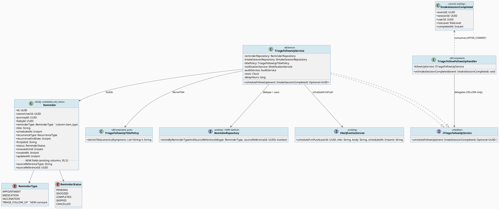
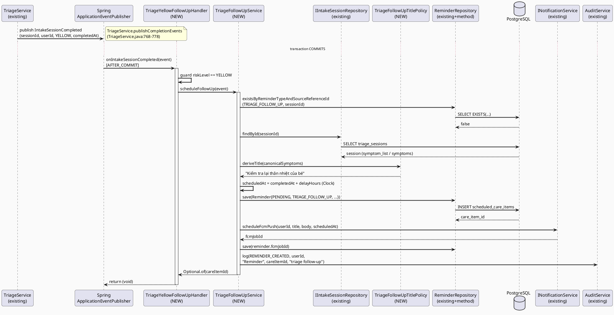
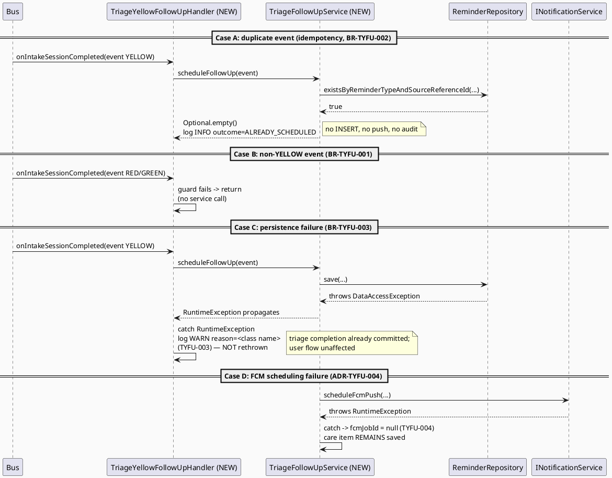
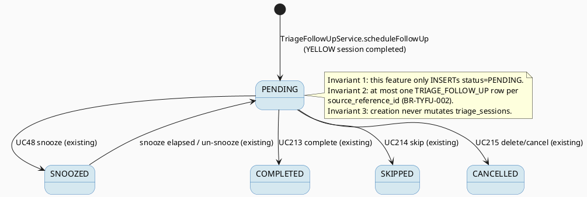

# ENGINEERING DOCUMENTATION STANDARD (EDS) v2.0
# TriageYellowFollowUp — Automatic Follow-Up Care Task for YELLOW Triage Risk

| Field | Value |
|-------|-------|
| **Document ID** | `CB-TYFU-IMP-001` |
| **Version** | `1.0` |
| **Date** | `2026-07-26` |
| **Status** | `Implemented` *(2026-07-27 — 14/14 TCs passing; TYFU-TC-INT-01 + TC-13 integration part executed green on a Docker-capable host)* |
| **Document Owner** | `AI Agent` |
| **Author** | `AI Agent — Tech Lead` |
| **Reviewed by** | `[ ] Pending` |
| **DPO Sign-off** | `[ ] Pending` *(required — feature consumes triage session data classified Sensitive-PII)* |
| **Approved by** | `[ ] Pending` |
| **Last Review** | `2026-07-26` |
| **Based on EDS** | `v2.0` |

---

## CHANGELOG

> **Policy 4.4 — Immutable History:** Never delete old information. Every change must be recorded in this table.

| Ngày | Người thực hiện | Nội dung thay đổi |
|------|-----------------|-------------------|
| 2026-07-26 | AI Agent — Tech Lead | Initial creation — TDS for TriageYellowFollowUp (roadmap `AITriage_Assessment_Roadmap.md` Part III item 3) |
| 2026-07-26 | AI Agent — Amelia (Dev Agent) | Phase 3: Implementation — 13/14 tests PASS (TYFU-TC-01…13 🟢 incl. TC-13 unit part; TYFU-TC-INT-01 + TC-13 integration read-isolation part written but environment-blocked — Docker unavailable for Testcontainers). Delivered per §5.1 file plan: `ReminderType.TRIAGE_FOLLOW_UP`, `Reminder.sourceReferenceType/sourceReferenceId` mappings (existing baseline columns, no migration), `ReminderRepository.existsByReminderTypeAndSourceReferenceId`, `ITriageFollowUpService`, `TriageFollowUpService` (REQUIRES_NEW, injected Clock, delay guard TYFU-005), `TriageFollowUpTitlePolicy` (ADR-TYFU-006 table), `TriageYellowFollowUpHandler` (AFTER_COMMIT, YELLOW guard, containment), `application.yaml` key `carebridge.triage.follow-up.delay-hours`. Deviation D1: title path (a) "parse `triage_sessions.symptom_list`" unreachable via the §5.1 dependency set (`symptom_list` mapped only on `ai/entity/StructuredIntakeData`); free-text keyword path (b) implemented, matching Test-Spec L5. |
| 2026-07-27 | AI Agent — Amelia (Dev Agent) | Docker host available: integration TCs executed — 2/2 PASS (TYFU-TC-INT-01 + TC-13 integration part). Production fix required by this TDS's audit NFR ("Every created item logged via `AuditAction.REMINDER_CREATED` — 100% — audit_log query — Luật 91/2025"): `REMINDER_CREATED` added to `AuditEligibilityPolicy.SENSITIVE_ACTIONS`; without eligibility the audit row was never persisted (the integration DB oracle exposed this — unit tests mock `AuditService`). Side effect (in convention's spirit): pre-existing `ReminderServiceImpl` REMINDER_CREATED audits now persist too. Regression guards green (`AuditEligibilityPolicyTest`, `TriageFollowUpServiceTest`, `UpdateReminderServiceTest`). |

---

## MỤC LỤC

1. [Tổng quan Module](#1-tổng-quan-module)
2. [Ma trận Truy vết (Traceability Matrix)](#2-ma-trận-truy-vết-traceability-matrix)
3. [Architecture Decision Records (ADR)](#3-architecture-decision-records-adr)
4. [Non-Functional Requirements & SLA](#4-non-functional-requirements--sla)
5. [Static Modeling (Mô hình Tĩnh)](#5-static-modeling-mô-hình-tĩnh)
6. [Dynamic Modeling (Mô hình Động)](#6-dynamic-modeling-mô-hình-động)
7. [Domain Event Catalog](#7-domain-event-catalog)
8. [Interface Specification (Đặc tả Giao diện)](#8-interface-specification-đặc-tả-giao-diện)
9. [API Specification](#9-api-specification)
10. [Bảng mã lỗi (Error Codes)](#10-bảng-mã-lỗi-error-codes)
11. [Quy trình Triển khai (Step-by-Step)](#11-quy-trình-triển-khai-step-by-step)
12. [Rollback & Incident Runbook](#12-rollback--incident-runbook)
13. [Kịch bản Kiểm thử Chi tiết](#13-kịch-bản-kiểm-thử-chi-tiết)
14. [Phương pháp Xác minh](#14-phương-pháp-xác-minh)
15. [Mẫu thử thực tế (API Verification Samples)](#15-mẫu-thử-thực-tế-api-verification-samples)
16. [Bảng tổng hợp phân quyền (Authorization Matrix)](#16-bảng-tổng-hợp-phân-quyền-authorization-matrix)
17. [AI Prompt Constraints (CASE 2.0)](#17-ai-prompt-constraints-case-20)

---

## 1. Tổng quan Module

> When an AI triage session completes with `risk_level = YELLOW`, the system automatically creates a follow-up care task scheduled **4–6 hours later** (default 4 h, configurable — exact value `Open`, see §3 ADR-TYFU-005) in the canonical `scheduled_care_items` table, plus a scheduled push notification, so the mother re-checks the child's condition (e.g. "Kiểm tra lại thân nhiệt của bé"). This **adds to** — and never replaces — the existing YELLOW behaviors: recommendation `CONTACT_HEALTHCARE_PROVIDER` (`triage/TriageRecommendationCode.java:11`) and the consented expert handoff (`consultation/context/service/TriageExpertHandoffService.java`). RED emergency routing is untouched (BR-SAFETY).
>
> Requirement oracle: `04_Implement/AITriageCompletion/AITriage_Assessment_Roadmap.md` — Part III, item 3 (`TriageYellowFollowUp`). The legacy `reminders` table is **dropped**; only canonical tables may be used.

| Field | Value |
|-------|-------|
| **Module Name** | `Triage Yellow Follow-Up` |
| **Bounded Context** | `reminder` (consumer) ← event from `triage` (producer) |
| **Data Classification** | `PII` *(care-item title derived from normalized symptom category; no raw symptom text is copied)* |
| **Compliance Scope** | `PDPA / Luật 91/2025 / BR-SAFETY` |
| **Upstream Dependencies** | `triage` (`IntakeSessionCompleted` event), `reminder` (entity/repository/notification), `audit` |
| **Downstream Consumers** | UC49 View Today Tasks (`TodayTaskServiceImpl`), UC212–UC215 reminder detail/complete/skip/delete, UC158 Receive Reminder Notification |

---

## 2. Ma trận Truy vết (Traceability Matrix)

> Direct mapping: [Requirement ID] → [Code Component] → [Compliance Target].
> **Policy:** No code is written without knowing which rule it serves.

| Requirement ID | Loại (BR/ADR/US) | Mô tả yêu cầu | Thành phần Code | Compliance Target | ADR liên quan |
|----------------|------------------|---------------|-----------------|-------------------|---------------|
| RM-III-3 | User Story | Roadmap Part III.3: on YELLOW completion auto-create follow-up task 4–6 h later into canonical scheduling table + push notification | `TriageFollowUpService.scheduleFollowUp()` | — | ADR-TYFU-001, ADR-TYFU-002 |
| BR-TYFU-001 | Business Rule | Follow-up is created **only** for `riskLevel == YELLOW`; GREEN/RED sessions create nothing | `TriageYellowFollowUpHandler` guard | BR-SAFETY | ADR-TYFU-002 |
| BR-TYFU-002 | Business Rule | Duplicate/re-published completion events must not create duplicate follow-ups (dedupe on `source_reference_id` + `item_type`) | `ReminderRepository.existsByReminderTypeAndSourceReferenceId()` | Data integrity | ADR-TYFU-003 |
| BR-TYFU-003 | Business Rule | Follow-up creation must never block, delay, or fail the triage completion transaction or emergency routing | `@TransactionalEventListener(AFTER_COMMIT)` + catch-all in handler | BR-SAFETY | ADR-TYFU-002 |
| BR-TYFU-004 | Business Rule | Task title is derived from normalized symptom categories with a generic fallback; raw free-text symptoms are never copied into the care item or logs | `TriageFollowUpTitlePolicy.deriveTitle()` | PDPA (data minimization) | ADR-TYFU-006 |
| BR-TYFU-005 | Business Rule | Use canonical `scheduled_care_items` only — legacy `reminders` table is dropped | `Reminder` entity (`@Table(name = "scheduled_care_items")`) | Schema governance | ADR-TYFU-001 |
| BR-SAFETY | Business Rule | AI provides guidance only; follow-up reminder never replaces emergency routing or expert handoff | Handler scope limited to YELLOW; RED path (`EmergencyEscalationTriggered`) untouched | BR-SAFETY | ADR-TYFU-002 |
| ADR-TYFU-001 | Decision | Target table = `scheduled_care_items` (not `family_tasks`) | `reminder/entity/Reminder.java` | — | — |
| ADR-TYFU-002 | Decision | Trigger = existing `IntakeSessionCompleted` event, AFTER_COMMIT listener | `TriageYellowFollowUpHandler` | BR-SAFETY | — |
| ADR-TYFU-003 | Decision | Application-level idempotency, no schema change | `ReminderRepository` | — | — |
| ADR-TYFU-004 | Decision | Push notification via existing `INotificationService.scheduleFcmPush` + `fcm_job_id` | `TriageFollowUpService` | — | — |
| ADR-TYFU-005 | Decision | Delay configurable via application property, default 4 h (`Open`) | `application.yaml` | — | — |
| ADR-TYFU-006 | Decision | Title mapping from canonical symptom codes of `SymptomNormalizer` | `TriageFollowUpTitlePolicy` | PDPA | — |

---

## 3. Architecture Decision Records (ADR)

### ADR-TYFU-001 — Target table: `scheduled_care_items` (not `family_tasks`)

| Field | Value |
|-------|-------|
| **Status** | `Proposed` |
| **Deciders** | `AI Agent — Tech Lead` (pending human review) |
| **Date** | `2026-07-26` |
| **Supersedes** | `—` |

#### Bối cảnh (Context)
Roadmap Part III.3 permits either **`family_tasks`** or **`scheduled_care_items`** as the follow-up target (legacy `reminders` is dropped). The design must need **no schema change** against baseline `B20260724111500__canonical_70_table_baseline.sql`.

#### Các phương án đã xem xét (Options Considered)

| Phương án | Mô tả | Ưu điểm | Nhược điểm |
|-----------|-------|----------|------------|
| A | `scheduled_care_items` (baseline :1587-1610) | + `owner_user_id` maps directly to the mother (`event.userId()`); no group needed. + Already has `source_reference_type`/`source_reference_id` (dedupe key), `fcm_job_id` (push wiring), `status` lifecycle, `journey_id`, `baby_id`. + Existing entity `reminder/entity/Reminder.java` (`@Table(name = "scheduled_care_items")`), repository, service, controller (UC45–49, UC212–215) surface the item to the mother with zero new API. + `CHECK` constraint `scheduled_care_items_vaccination_ck` only restricts `item_type = 'VACCINATION'` — a new non-VACCINATION `item_type` is unconstrained. | − `item_type` is mapped as Java enum `ReminderType` → requires adding an enum constant (code change, §5.2 — not a schema change). |
| B | `family_tasks` (baseline: `care_group_id uuid NOT NULL`) | + Visible to family members via care-group flows (UC73/UC85). | − `care_group_id NOT NULL`: a mother without a care group **cannot** receive a follow-up → feature silently fails for exactly the solo mothers who need it most. − Requires resolving/creating a care group inside an event handler (side effects, larger blast radius). − No `source_reference_*` columns → dedupe would need a schema change or fragile title matching. − No `fcm_job_id`/scheduling semantics (`due_at` is a deadline, not a reminder time). |

#### Quyết định (Decision)
Choose **Option A — `scheduled_care_items`**: `owner_user_id = event.userId()` (mother), `item_type = 'TRIAGE_FOLLOW_UP'`, `scheduled_at = completedAt + delay`, `source_reference_type = 'TRIAGE_SESSION'`, `source_reference_id = triage_session_id`, `status = 'PENDING'`.

#### Hệ quả (Consequences)

**Tích cực:**
- Zero schema change; zero new API; item automatically appears in UC49 Today Tasks and UC212–215 flows.
- Works for mothers with or without a care group.

**Tiêu cực / Trade-offs:**
- Family members do not see the follow-up as a family task. Mitigation: out of scope; a future feature may mirror into `family_tasks` when a care group exists (`Open`, not in this scope).

**Compliance Impact:**
- PDPA: only a category-derived title is stored, no raw symptom text (BR-TYFU-004).

---

### ADR-TYFU-002 — Trigger mechanism: reuse `IntakeSessionCompleted` with AFTER_COMMIT listener

| Field | Value |
|-------|-------|
| **Status** | `Proposed` |
| **Deciders** | `AI Agent — Tech Lead` (pending human review) |
| **Date** | `2026-07-26` |
| **Supersedes** | `—` |

#### Bối cảnh (Context)
`TriageService.publishCompletionEvents` (`triage/service/impl/TriageService.java:768-778`, verified 2026-07-26) already publishes `triage/event/IntakeSessionCompleted.java` — a record `(UUID eventId, UUID sessionId, UUID userId, RiskLevel riskLevel, Instant completedAt)` — for **every** completed session, and additionally `EmergencyEscalationTriggered` for RED. Two consumer patterns exist: `ai/service/IntakeSessionCompletedHandler.java` (`@TransactionalEventListener(phase = AFTER_COMMIT)`, catch-all `RuntimeException`, WARN log) and `emergency/service/EmergencyEscalationHandler.java` (`@EventListener`, rethrows).

#### Các phương án đã xem xét (Options Considered)

| Phương án | Mô tả | Ưu điểm | Nhược điểm |
|-----------|-------|----------|------------|
| A | New listener on existing `IntakeSessionCompleted`, `AFTER_COMMIT`, exception-swallowing (mirror `IntakeSessionCompletedHandler`) | + No producer change; session row committed before handler reads it; failures never roll back triage completion (BR-TYFU-003). | − At-most-once: if the process dies between commit and handler, the follow-up is lost (accepted — guidance-only reminder, not safety-critical routing). |
| B | Inline call inside `TriageService.persistConversationEnvelope` | + Same transaction, atomic. | − Couples triage to reminder domain; a reminder failure would roll back the completed triage session — violates BR-TYFU-003/BR-SAFETY. |
| C | New dedicated event published by `TriageService` | + Explicit contract. | − Producer change for no benefit; duplicates existing event payload. |

#### Quyết định (Decision)
Choose **Option A**: new component `reminder/service/TriageYellowFollowUpHandler.java` with `@TransactionalEventListener(phase = TransactionPhase.AFTER_COMMIT)`, guard `event.riskLevel() == RiskLevel.YELLOW`, catch `RuntimeException` → WARN log (exception class name only, no PII).

#### Hệ quả (Consequences)

**Tích cực:** smallest scoped change; RED/GREEN paths byte-identical to today.
**Tiêu cực / Trade-offs:** at-most-once delivery (see above); ordering vs. the structured-intake listener on the same event is unspecified — mitigated by ADR-TYFU-006 (title derivation does not depend on `symptom_list` having been extracted yet).
**Compliance Impact:** BR-SAFETY — follow-up can never delay emergency routing (it runs after commit, only for YELLOW).

---

### ADR-TYFU-003 — Idempotency: application-level dedupe on (`item_type`, `source_reference_id`), no schema change

| Field | Value |
|-------|-------|
| **Status** | `Proposed` |
| **Deciders** | `AI Agent — Tech Lead` (pending human review) |
| **Date** | `2026-07-26` |
| **Supersedes** | `—` |

#### Bối cảnh (Context)
Spring application events may be re-published (retry loops, future outbox replay). Each `IntakeSessionCompleted` carries a fresh random `eventId` (`TriageService.java:775` uses `UUID.randomUUID()`), so `eventId` **cannot** be the dedupe key; `sessionId` is the stable business key. The design must not change the baseline schema.

#### Các phương án đã xem xét (Options Considered)

| Phương án | Mô tả | Ưu điểm | Nhược điểm |
|-----------|-------|----------|------------|
| A | `existsByReminderTypeAndSourceReferenceId(TRIAGE_FOLLOW_UP, sessionId)` check before insert | + No migration; mirrors `StructuredIntakeService.extract` idempotency (`existsBySessionId`, `ai/service/impl/StructuredIntakeService.java:42-45`). | − Small race window under concurrent duplicate events. Acceptable: modular monolith, single event dispatch thread per publish; worst case is one duplicated *guidance* reminder. |
| B | Partial unique index `ON scheduled_care_items(item_type, source_reference_id) WHERE item_type='TRIAGE_FOLLOW_UP'` | + Race-proof. | − Requires a new Flyway migration — out of scope ("design should need NO schema change"). |

#### Quyết định (Decision)
Choose **Option A**. Option B is recorded as an optional hardening follow-up (`Open` — future migration, needs user approval).

#### Hệ quả (Consequences)
**Tích cực:** re-published/duplicate events are no-ops (INFO log `outcome=ALREADY_SCHEDULED`).
**Tiêu cực / Trade-offs:** theoretical race duplicates possible; harmless and user-deletable via UC215.
**Compliance Impact:** none.

---

### ADR-TYFU-004 — Push notification: reuse `INotificationService.scheduleFcmPush` → `fcm_job_id`

| Field | Value |
|-------|-------|
| **Status** | `Proposed` |
| **Deciders** | `AI Agent — Tech Lead` (pending human review) |
| **Date** | `2026-07-26` |
| **Supersedes** | `—` |

#### Bối cảnh (Context)
Verified state of push/reminder infrastructure (2026-07-26):
- `reminder/service/INotificationService.java` declares `String scheduleFcmPush(UUID userId, String title, String body, Instant scheduledAt)` returning an FCM job id; `ReminderServiceImpl.createReminder` (`:65-68`) calls it after saving and stores the returned id into `fcm_job_id`. This is the **only existing "scheduled push" convention** for `scheduled_care_items`.
- The only implementation today is `reminder/service/impl/DummyNotificationService.java` (returns `"dummy-job-id"`, no real delivery).
- Immediate (not scheduled) reminder pushes exist: `notification/service/impl/ReminderNotificationService.java` (preference-gated, `DeviceToken` + `FcmServiceImpl`/`FirebaseFcmServiceImpl`, writes `notification_records` + audit) — but **no component currently calls `IReminderNotificationService`**, and **no `@Scheduled` job scans due `scheduled_care_items`** (verified: `@Scheduled` exists only in file/notification-outbox/consultation/emergency/safety/directchat jobs).

#### Quyết định (Decision)
Follow the existing `ReminderServiceImpl` convention: after saving the care item, call `notificationService.scheduleFcmPush(userId, title, "Nhắc theo dõi: " + title, scheduledAt)` and persist the returned job id into `fcm_job_id`. A `scheduleFcmPush` failure is caught: the care item is still saved with `fcm_job_id = null` (same resilience contract as UC45 ADR-REM-001).

#### Hệ quả (Consequences)
**Tích cực:** consistent with every other reminder type; when a real `INotificationService` implementation lands, this feature gets real pushes for free.
**Tiêu cực / Trade-offs:** **`Open` — end-to-end push delivery.** Until `DummyNotificationService` is replaced by a real scheduler (or a due-item dispatch job calling `IReminderNotificationService` is built), no device push is actually delivered at `scheduled_at` for ANY reminder type, including this one. That platform gap is explicitly **out of scope** here; this feature's scope ends at "care item persisted + `scheduleFcmPush` invoked + `fcm_job_id` stored".
**Compliance Impact:** notification body contains only the category-derived title (BR-TYFU-004).

---

### ADR-TYFU-005 — Follow-up delay: configurable property, default 4 hours

| Field | Value |
|-------|-------|
| **Status** | `Proposed` |
| **Deciders** | `AI Agent — Tech Lead` (pending human review) |
| **Date** | `2026-07-26` |
| **Supersedes** | `—` |

#### Bối cảnh (Context)
Roadmap Part III.3 specifies "4–6 hours". A fixed constant would need a redeploy to tune.

#### Quyết định (Decision)
Property `carebridge.triage.follow-up.delay-hours` in `application.yaml` (namespace pattern matches existing `carebridge.*` keys, `application.yaml:52-82`), env override `TRIAGE_FOLLOW_UP_DELAY_HOURS`, **default `4`**. Values outside `[1..24]` fall back to the default with a WARN log (`TYFU-005`). `scheduled_at = event.completedAt() + Duration.ofHours(delay)`; if `completedAt` is null, fall back to `clock.instant()` (injected `java.time.Clock`, default `Clock.systemUTC()` — codebase pattern of `TriageContinuationService.java:30` and `TriageExpertHandoffService.java:97`).

> **`Open`:** exact default value (4 vs 5 vs 6 h) requires user/product confirmation before implementation.

#### Hệ quả (Consequences)
**Tích cực:** tunable without redeploy; deterministic testing via fixed `Clock`.
**Tiêu cực / Trade-offs:** none material.
**Compliance Impact:** none.

---

### ADR-TYFU-006 — Title derivation from canonical symptom codes with generic fallback

| Field | Value |
|-------|-------|
| **Status** | `Proposed` |
| **Deciders** | `AI Agent — Tech Lead` (pending human review) |
| **Date** | `2026-07-26` |
| **Supersedes** | `—` |

#### Bối cảnh (Context)
The title should reflect what to re-check (roadmap example: "Kiểm tra lại thân nhiệt của bé"). Sources available at handler time: `triage_sessions.symptom_list` (jsonb) is written **asynchronously** by `StructuredIntakeService` (a *sibling* AFTER_COMMIT listener on the same event — ordering unspecified, Gemini-dependent), so it may not exist yet. The deterministic source is `triage/engine/SymptomNormalizer.java` (17 canonical codes: `fever`, `high_fever`, `cough`, `runny_nose`, `difficulty_breathing`, `chest_indrawing`, `cyanosis`, `seizure`, `lethargy`, `difficult_to_wake`, `unable_to_drink`, `poor_feeding`, `vomiting`, `persistent_vomiting`, `diarrhea`, `rash`, `mild_dehydration`, `severe_dehydration`).

#### Quyết định (Decision)
New pure policy `reminder/policy/TriageFollowUpTitlePolicy.java`: `deriveTitle(List<String> canonicalSymptoms)`. The service resolves `canonicalSymptoms` as: (a) parse `triage_sessions.symptom_list` if already populated, else (b) keyword-match the session's `symptoms` text against the same canonical keyword table (mirroring `SymptomNormalizer.KEYWORDS` semantics), else (c) empty list. First match wins, in this fixed priority order:

| Priority | Canonical codes matched | Title (VI) |
|---|---|---|
| 1 | `fever`, `high_fever` | `Kiểm tra lại thân nhiệt của bé` |
| 2 | `vomiting`, `persistent_vomiting` | `Kiểm tra lại tình trạng nôn trớ của bé` |
| 3 | `diarrhea`, `mild_dehydration`, `severe_dehydration` | `Kiểm tra lại tình trạng đi ngoài và dấu hiệu mất nước của bé` |
| 4 | `cough`, `runny_nose`, `difficulty_breathing` | `Kiểm tra lại tình trạng ho và nhịp thở của bé` |
| Fallback | *(no match / empty)* | `Theo dõi lại tình trạng sức khỏe của bé sau sàng lọc AI` |

All titles ≤ 255 chars (column `title varchar(255)`). Raw free text is never used as a title (BR-TYFU-004).

#### Hệ quả (Consequences)
**Tích cực:** deterministic, PII-minimal, independent of extraction ordering.
**Tiêu cực / Trade-offs:** coarse categories only; unmapped canonical codes (`chest_indrawing`, `cyanosis`, `seizure`, …) get the generic title — acceptable, those usually escalate beyond YELLOW anyway.
**Compliance Impact:** PDPA data minimization satisfied.

> *(Add new ADRs below; never delete old ones. Superseded ADRs are marked `Superseded by ADR-[NNN]`.)*

---

## 4. Non-Functional Requirements & SLA

### 4.1. Performance & Availability

| Category | Requirement | Target SLA | Measurement Method | Compliance Basis |
|----------|-------------|------------|---------------------|------------------|
| Latency | Handler execution (post-commit, off the API critical path) | `< 500ms p99` | log timing / APM | — |
| Latency impact on triage API | Zero added latency to `POST /api/v1/triage/intake/**` responses | `0ms` (AFTER_COMMIT) | integration test | BR-SAFETY |
| Availability | Follow-up creation success for YELLOW sessions | `≥ 99%` (best-effort, at-most-once) | log outcome ratio | — |
| Throughput | Matches triage volume (≈500 sessions/day per CB-TRIAGE-IMP-001 §4.4) | trivial | — | — |

### 4.2. Data Integrity & Retention

| Category | Requirement | Target | Verification Method | Compliance Basis |
|----------|-------------|--------|---------------------|------------------|
| Idempotency | ≤ 1 follow-up per (`TRIAGE_FOLLOW_UP`, `source_reference_id`) | 100% (app-level, ADR-TYFU-003) | SQL count check (§14.1) | Data integrity |
| Consistency | Follow-up references only committed sessions | 100% (AFTER_COMMIT) | integration test | — |
| Retention | Same as other `scheduled_care_items` rows (no special retention) | inherit | — | — |
| Audit | Every created item logged via `AuditAction.REMINDER_CREATED` (`audit/entity/AuditAction.java:76`) | 100% | audit_log query | Luật 91/2025 |

### 4.3. Security

| Category | Requirement | Target | Verification Method | Compliance Basis |
|----------|-------------|--------|---------------------|------------------|
| PII in logs | Log only `sessionId`, outcome, exception class name — never symptom text or title | 100% | log scan (§14.2) | PDPA |
| PII in care item | Title = category-derived string only (ADR-TYFU-006) | 100% | unit test TYFU-TC-05/06 | PDPA |
| Access control | Created item accessible only to `owner_user_id` via existing `ROLE_MOTHER` endpoints + `findByIdAndOwnerUserId` | Least privilege | Auth Matrix §16 | Luật 91/2025 |
| Encryption in transit / at rest | Inherited from platform (TLS, PostgreSQL at-rest) | inherit | — | PDPA |

### 4.4. Scalability & Capacity Planning

> YELLOW share of ≈500 triage sessions/day ⇒ well under 500 inserts/day into `scheduled_care_items`. Existing indexes `scheduled_care_items_owner_status_ix` and `scheduled_care_items_context_ix` (baseline :3767, :3774) cover read paths. The dedupe `exists` query filters on `item_type` + `source_reference_id` (unindexed) — negligible at this volume; optional partial index recorded as `Open` in ADR-TYFU-003.

---

## 5. Static Modeling (Mô hình Tĩnh)

### 5.1. Class Diagram (PlantUML)



**Planned file inventory (exact paths, all under `05_Development/CareBridgeAPI/`):**

| Action | File |
|--------|------|
| NEW | `src/main/java/com/carebridge/backend/reminder/service/ITriageFollowUpService.java` |
| NEW | `src/main/java/com/carebridge/backend/reminder/service/impl/TriageFollowUpService.java` |
| NEW | `src/main/java/com/carebridge/backend/reminder/service/TriageYellowFollowUpHandler.java` |
| NEW | `src/main/java/com/carebridge/backend/reminder/policy/TriageFollowUpTitlePolicy.java` |
| MODIFY | `src/main/java/com/carebridge/backend/reminder/entity/ReminderType.java` — add `TRIAGE_FOLLOW_UP` |
| MODIFY | `src/main/java/com/carebridge/backend/reminder/entity/Reminder.java` — map existing columns `source_reference_type`, `source_reference_id` |
| MODIFY | `src/main/java/com/carebridge/backend/reminder/repository/ReminderRepository.java` — add `existsByReminderTypeAndSourceReferenceId` |
| MODIFY | `src/main/resources/application.yaml` — add `carebridge.triage.follow-up.delay-hours: ${TRIAGE_FOLLOW_UP_DELAY_HOURS:4}` |
| NEW (test) | `src/test/java/com/carebridge/backend/reminder/TriageFollowUpServiceTest.java` |
| NEW (test) | `src/test/java/com/carebridge/backend/reminder/TriageYellowFollowUpHandlerTest.java` |
| NEW (test) | `src/test/java/com/carebridge/backend/reminder/TriageFollowUpTitlePolicyTest.java` |
| NEW (test) | `src/test/java/com/carebridge/backend/reminder/TriageFollowUpTestFactory.java` |

### 5.2. Data Structure (Flyway SQL Migration)

> **No new migration.** The canonical baseline `B20260724111500__canonical_70_table_baseline.sql` already provides everything this feature writes (`scheduled_care_items` at :1587-1610) and reads (`triage_sessions` at :1714-1745). Verified column facts used by this design:
>
> - `scheduled_care_items.item_type varchar(40) NOT NULL` — `'TRIAGE_FOLLOW_UP'` (16 chars) fits; the only CHECK constraint (`scheduled_care_items_vaccination_ck`) applies exclusively to `item_type = 'VACCINATION'`, so no `vaccination_record_id`/`care_subject_id` is required for this type.
> - `source_reference_type varchar(60)`, `source_reference_id uuid` — exist in the table but are **not yet mapped** on `reminder/entity/Reminder.java`; adding the two `@Column` fields is a **code change recorded here, not a schema change**.
> - `item_type` is persisted via `@Enumerated(EnumType.STRING) ReminderType` (`Reminder.java:34-36`) → adding enum constant `TRIAGE_FOLLOW_UP` is a **code change recorded here, not a schema change**. (Note: the entity annotation declares `length = 50` while the DB column is `varchar(40)`; pre-existing discrepancy, harmless for a 16-char value — no change made.)
> - `triage_sessions.symptom_list jsonb` (nullable) and `symptoms text NOT NULL` are the title-derivation inputs (ADR-TYFU-006).
>
> Legacy `reminders` and `consultation_bookings` tables are dropped — never referenced (BR-TYFU-005).

```sql
-- Reference only — ALREADY IN BASELINE, DO NOT RE-CREATE (B20260724111500 :1587-1610)
-- scheduled_care_items(care_item_id uuid PK, owner_user_id uuid NOT NULL, item_type varchar(40) NOT NULL,
--   title varchar(255) NOT NULL, scheduled_at timestamptz NOT NULL, status varchar(30) DEFAULT 'PENDING' NOT NULL,
--   source_reference_type varchar(60), source_reference_id uuid, fcm_job_id varchar(255),
--   journey_id uuid, baby_id uuid, created_at, updated_at, ...)
```

**Row written by this feature:**

| Column | Value | Source |
|--------|-------|--------|
| `owner_user_id` | `event.userId()` | `IntakeSessionCompleted` |
| `item_type` | `'TRIAGE_FOLLOW_UP'` | ADR-TYFU-001 |
| `title` | per ADR-TYFU-006 mapping | `TriageFollowUpTitlePolicy` |
| `scheduled_at` | `event.completedAt() + delayHours` (fallback `clock.instant() + delayHours`) | ADR-TYFU-005 |
| `status` | `'PENDING'` | `ReminderStatus.PENDING` |
| `source_reference_type` | `'TRIAGE_SESSION'` | ADR-TYFU-003 |
| `source_reference_id` | `event.sessionId()` | ADR-TYFU-003 |
| `journey_id` | `session.journeyId` (nullable) | `IntakeSession.java:42` |
| `baby_id` | `session.babyProfileId` (nullable) | `IntakeSession.java:28` |
| `recurrence_type` | `NONE` | one-shot reminder |
| `fcm_job_id` | return of `scheduleFcmPush` or `NULL` on failure | ADR-TYFU-004 |

---

## 6. Dynamic Modeling (Mô hình Động)

### 6.1. Sequence Diagram — Happy Path (PlantUML)



### 6.2. Sequence Diagram — Error Path (PlantUML)



### 6.3. State Machine *(bắt buộc nếu module có trạng thái)*

> The created care item reuses the **existing** `ReminderStatus` lifecycle (`reminder/entity/ReminderStatus.java`); this feature only ever creates items in `PENDING`. Transitions below are executed by existing UC48/UC213/UC214/UC215 flows, not by this feature.



> **⚠️ Invariant bất biến:** (1) creation only, `PENDING` only; (2) one follow-up per triage session; (3) no writes to `triage_sessions`; (4) no follow-up for GREEN/RED.

---

## 7. Domain Event Catalog

### 7.1. Events Published (Phát ra)

> **Not applicable — this feature publishes no new domain events.** Rationale: the smallest scoped change (CLAUDE.md Delivery Rules); downstream visibility is achieved through the persisted `scheduled_care_items` row and the audit log. If future consumers need it, a `TriageFollowUpScheduled` event would be introduced via a new ADR.

### 7.2. Events Consumed (Tiêu thụ)

| Event Name | Source | Handler | Action thực hiện |
|------------|--------|---------|------------------|
| `IntakeSessionCompleted` | `triage` — `TriageService.publishCompletionEvents` (`TriageService.java:768-778`) | `reminder/service/TriageYellowFollowUpHandler.java` (NEW) `@TransactionalEventListener(phase = AFTER_COMMIT)` | If `riskLevel == YELLOW`: create idempotent follow-up care item + schedule push (§6.1). Otherwise: no-op. Exceptions swallowed with WARN (BR-TYFU-003). |

### 7.3. Payload Schema

```java
// EXISTING — src/main/java/com/carebridge/backend/triage/event/IntakeSessionCompleted.java
// (verified 2026-07-26; NOT modified by this feature)
public record IntakeSessionCompleted(
        UUID eventId,        // random per publish — NOT usable as dedupe key (ADR-TYFU-003)
        UUID sessionId,      // triage_sessions.triage_session_id — dedupe key via source_reference_id
        UUID userId,         // mother — becomes scheduled_care_items.owner_user_id
        RiskLevel riskLevel, // GREEN | YELLOW | RED (triage/RiskLevel.java)
        Instant completedAt  // triage_sessions.completed_at — base of scheduled_at
) {}
```

---

## 8. Interface Specification (Đặc tả Giao diện)

> **Policy (EDS v2.0):** every interface declares `@version`. Breaking changes require a new ADR. **Signatures only — no implementation code in this document.**

### 8.1. Service Interface

```java
// src/main/java/com/carebridge/backend/reminder/service/ITriageFollowUpService.java  (NEW)
// @version 1.0
public interface ITriageFollowUpService {

    /**
     * Creates the follow-up scheduled care item for a completed YELLOW triage session.
     * Idempotent on (ReminderType.TRIAGE_FOLLOW_UP, event.sessionId()) — BR-TYFU-002.
     *
     * @return Optional with the created care_item_id, or Optional.empty() when skipped
     *         (non-YELLOW risk, duplicate, or session not found — TYFU-001/TYFU-002).
     * @throws org.springframework.dao.DataAccessException on persistence failure (TYFU-003;
     *         contained by the handler, never reaches the user).
     */
    Optional<UUID> scheduleFollowUp(IntakeSessionCompleted event);
}
```

```java
// src/main/java/com/carebridge/backend/reminder/service/TriageYellowFollowUpHandler.java  (NEW)
// @version 1.0 — mirrors ai/service/IntakeSessionCompletedHandler.java
@Component
public class TriageYellowFollowUpHandler {

    @TransactionalEventListener(phase = TransactionPhase.AFTER_COMMIT)
    public void onIntakeSessionCompleted(IntakeSessionCompleted event);
    // guard: event.riskLevel() == RiskLevel.YELLOW; catch(RuntimeException) -> WARN log, no rethrow
}
```

```java
// src/main/java/com/carebridge/backend/reminder/policy/TriageFollowUpTitlePolicy.java  (NEW)
// @version 1.0 — pure domain rule, no dependencies (CLAUDE.md policy layer)
@Component
public class TriageFollowUpTitlePolicy {

    /**
     * Maps canonical symptom codes (SymptomNormalizer vocabulary) to a follow-up title
     * per ADR-TYFU-006 priority table; returns the generic fallback for null/empty/unmapped input.
     * Never returns null; result length <= 255.
     */
    public String deriveTitle(List<String> canonicalSymptoms);
}
```

### 8.2. Repository Interface

```java
// src/main/java/com/carebridge/backend/reminder/repository/ReminderRepository.java  (EXISTING — one added method)
// @version 1.1
public interface ReminderRepository extends JpaRepository<Reminder, UUID> {

    // ... existing methods unchanged (findByIdAndOwnerUserId, findByOwnerUserIdOrderByScheduledAtDesc, ...) ...

    /** NEW — idempotency probe for BR-TYFU-002 / ADR-TYFU-003. */
    boolean existsByReminderTypeAndSourceReferenceId(ReminderType reminderType, UUID sourceReferenceId);
}
```

```java
// src/main/java/com/carebridge/backend/reminder/entity/Reminder.java  (EXISTING — two added field mappings)
// Columns already exist in baseline; no migration.
@Column(name = "source_reference_type", length = 60)
private String sourceReferenceType;

@Column(name = "source_reference_id")
private UUID sourceReferenceId;
```

```java
// src/main/java/com/carebridge/backend/reminder/entity/ReminderType.java  (EXISTING — one added constant)
public enum ReminderType { APPOINTMENT, MEDICATION, VACCINATION, TRIAGE_FOLLOW_UP }
```

**Reused existing contracts (verified, unchanged):** `reminder/service/INotificationService.scheduleFcmPush(UUID, String, String, Instant): String`; `audit/service/AuditService.log(AuditAction, UUID, String, String, String)` with `AuditAction.REMINDER_CREATED`; `triage/repository/IIntakeSessionRepository.findById(UUID)`.

---

## 9. API Specification

### 9.1. Endpoints Table

> **Not applicable — no new or changed endpoints.** The feature is entirely event-driven (system actor). The created item automatically surfaces through **existing** endpoints (impact listed for completeness; contracts unchanged):

| Method | Path | Auth Level | Required Roles | Impact of this feature |
|--------|------|------------|----------------|------------------------|
| `GET` | `/api/v1/reminders` | JWT Bearer | `MOTHER` | List now may include `reminderType = "TRIAGE_FOLLOW_UP"` items |
| `GET` | `/api/v1/reminders/{reminderId}` | JWT Bearer | `MOTHER` (owner) | Detail of the follow-up item |
| `PATCH` | `/api/v1/reminders/{reminderId}/complete` \| `/skip` \| snooze / `DELETE` | JWT Bearer | `MOTHER` (owner) | Standard lifecycle applies to the follow-up item |
| `GET` | `/api/v1/reminders/today` | JWT Bearer | `MOTHER, FAMILY` | Today-task list may include the follow-up when due |

> Client note (`Open` — frontend scope, not this backend feature): web/mobile may want an icon/label for the new `reminderType` value `TRIAGE_FOLLOW_UP`; existing DTOs (`ReminderDetailResponse`, `TodayTaskItem`) serialize the enum name as-is, so no backend DTO change is needed.

### 9.2. Request / Response Schemas

> **Not applicable** — no new request schema (no new endpoint). Existing `GET /api/v1/reminders/{id}` response example after this feature runs:

```json
{
  "id": "9c7f2a10-4a2e-4c1b-9a55-1e2f3a4b5c6d",
  "reminderType": "TRIAGE_FOLLOW_UP",
  "title": "Kiểm tra lại thân nhiệt của bé",
  "scheduledAt": "2026-07-26T14:05:00Z",
  "status": "PENDING",
  "recurrenceType": "NONE"
}
```

---

## 10. Bảng mã lỗi (Error Codes)

> Prefix `TYFU-`. This feature exposes **no HTTP surface**, so these codes are internal outcome/log codes (structured log field `code=`), not API error bodies. Existing reminder endpoints keep their own `REM-*` codes.

| Code | HTTP Status | Message (EN) | Message (VI) | Trigger Condition | Handling |
|------|-------------|--------------|--------------|-------------------|----------|
| `TYFU-001` | — (log WARN) | Triage session not found for follow-up | Không tìm thấy phiên triage để tạo nhắc theo dõi | `findById(sessionId)` empty after commit (should not happen) | Skip, return `Optional.empty()` |
| `TYFU-002` | — (log INFO) | Follow-up already scheduled | Nhắc theo dõi đã tồn tại | Dedupe probe returns `true` (duplicate event) | Skip silently — success outcome, not an error |
| `TYFU-003` | — (log WARN) | Follow-up persistence failed | Lưu nhắc theo dõi thất bại | `DataAccessException` on INSERT | Handler catches; triage flow unaffected; no retry (at-most-once, ADR-TYFU-002) |
| `TYFU-004` | — (log WARN) | Push scheduling failed; item saved without fcm job | Đặt lịch thông báo đẩy thất bại; vẫn lưu nhắc | `scheduleFcmPush` throws | Care item kept, `fcm_job_id = null` (mirrors UC45 ADR-REM-001) |
| `TYFU-005` | — (log WARN) | Invalid follow-up delay config; using default | Cấu hình trễ không hợp lệ; dùng mặc định | `delay-hours` outside `[1..24]` | Fall back to default 4 h (ADR-TYFU-005) |

---

## 11. Quy trình Triển khai (Step-by-Step)

### 11.1. Prerequisites

- [x] This TDS and `TriageYellowFollowUp_Test-Spec.md` both `Approved` (implement-flow rule — verified before implementation, 2026-07-26)
- [ ] ADR-TYFU-001…006 accepted by reviewer; `Open` items resolved (delay default; see §17 open list) *(ADRs remain `Proposed`; implementation used the proposed defaults — O1 = 4 h)*
- [ ] DPO sign-off pending (header) — feature reads Sensitive-PII triage rows
- [x] Baseline `B20260724111500` applied (already true on `dev`)

### 11.2. Pre-Migration Checklist *(bắt buộc tick trước khi chạy migration)*

> **Not applicable — no Flyway migration in this feature** (§5.2). Checklist retained for audit trail:
- [x] No schema change: verified `scheduled_care_items` columns + CHECK constraint against baseline :1587-1610
- [ ] N/A — no backup/rollback of DDL required

### 11.3. Implementation Steps

#### Chặng 1 — Red Phase (tests first)
Write the four test files listed in §5.1 per `TriageYellowFollowUp_Test-Spec.md`; add Red Phase stubs (`throw new UnsupportedOperationException("Not implemented — Red Phase stub")`); run `./mvnw test -Dtest=TriageFollowUp*Test,TriageYellowFollowUpHandlerTest` and record all-FAIL evidence (Red Gate).

#### Chặng 2 — Entity/enum/repository plumbing
Add `TRIAGE_FOLLOW_UP` to `ReminderType`; add `sourceReferenceType`/`sourceReferenceId` mappings to `Reminder`; add `existsByReminderTypeAndSourceReferenceId` to `ReminderRepository`. Run the full reminder test package to prove no regression (`./mvnw test -Dtest="com.carebridge.backend.reminder.*"`).

#### Chặng 3 — Policy, service, handler
Implement `TriageFollowUpTitlePolicy`, `TriageFollowUpService` (constructor overload with `Clock`, default `Clock.systemUTC()` — codebase pattern), `TriageYellowFollowUpHandler`. Config key in `application.yaml`.

#### Chặng 4 — Verification sau deploy

```bash
# Trigger a YELLOW triage session (mother3@carebridge.dev / Test@1234, DevDataSeeder env), then:
psql "$DB_URL" -c "SELECT item_type, title, scheduled_at, status, source_reference_type, source_reference_id, fcm_job_id
                   FROM scheduled_care_items WHERE item_type = 'TRIAGE_FOLLOW_UP' ORDER BY created_at DESC LIMIT 5;"
# Expected: 1 row per YELLOW session, status PENDING, scheduled_at = completed_at + 4h
```

### 11.4. Deployment Checklist

- [ ] `./mvnw test` green (no skips) *(2026-07-26 actual: 3008 run / 1 failure / 74 errors / 100 skipped — all in the known pre-existing set: Checklist SHA drift + Docker-unavailable Testcontainers; all 26 new feature unit tests green)*
- [x] No new migration in the deploy artifact (guard against accidental DDL — verified: no new file under `db/migration`)
- [ ] YELLOW smoke test creates exactly one item; repeating the event creates none *(deploy-time step — not executed in Phase 3)*
- [ ] Audit log rows `REMINDER_CREATED` present for created items *(deploy-time step — not executed in Phase 3)*
- [ ] Error rate on `/api/v1/triage/**` unchanged (feature must add zero API latency) *(deploy-time step — not executed in Phase 3)*

---

## 12. Rollback & Incident Runbook

### 12.1. Điều kiện kích hoạt Rollback (Trigger Conditions)

| Điều kiện | Ngưỡng | Người quyết định |
|-----------|--------|------------------|
| Triage completion errors attributable to the new handler | any occurrence | On-call Engineer |
| Duplicate follow-up storm (dedupe defect) | > 2 rows per session observed | Tech Lead |
| PII (symptom text) found in logs or titles | any occurrence | Tech Lead + DPO |
| `scheduled_care_items` insert failure spike | > 5% of YELLOW sessions in 15 min | On-call Engineer |

### 12.2. Rollback Procedure

```bash
# No migration to revert — code rollback only.
# Step 1: revert the feature commit(s)
git revert <feature-commit-sha>   # or redeploy previous image

# Step 2 (optional data hygiene): remove created follow-ups — plain rows, safe to delete
psql "$DB_URL" -c "DELETE FROM scheduled_care_items WHERE item_type = 'TRIAGE_FOLLOW_UP';"

# Step 3: verify
curl -s https://<host>/actuator/health   # expect UP
psql "$DB_URL" -c "SELECT count(*) FROM scheduled_care_items WHERE item_type='TRIAGE_FOLLOW_UP';"  # expect 0
# Step 4: smoke — run a YELLOW triage; confirm NO follow-up row is created and triage still completes
```

### 12.3. Notification Protocol

| Thời điểm | Người nhận | Kênh | Template |
|-----------|------------|------|----------|
| Immediately | On-call team | Slack `#incident` | "🚨 TriageYellowFollowUp incident: [description]" |
| Within 30 min | DPO | Email | *(mandatory only if PII leaked into titles/logs)* |
| Within 72 h | DPA | Email | *(only if an actual data breach occurred)* |

### 12.4. Post-Incident Review (PIR)

> Standard PIR within 48 h (timeline, 5-Whys root cause, impact incl. PII exposure check on `scheduled_care_items.title`, remediation, prevention).

---

## 13. Kịch bản Kiểm thử Chi tiết

> Full test-case specifications (IDs `TYFU-TC-01…`, fixtures, oracles, Red Gate) live in `04_Implement/TriageYellowFollowUp/TriageYellowFollowUp_Test-Spec.md`. This section summarizes the scenarios; all data `SYNTHETIC`.

### 13.1. Unit Tests

#### TC-UNIT (summary) — mapped to TYFU-TC-01…13

```gherkin
Feature: Triage YELLOW follow-up scheduling
  Background:
    Given test data classification: SYNTHETIC
    And a fixed Clock at 2026-07-26T10:00:00Z

  Scenario: YELLOW completion creates one PENDING follow-up (TYFU-TC-01)
    Given a committed YELLOW triage session completed at 10:00:00Z
    When the IntakeSessionCompleted event is handled
    Then one scheduled_care_items row is saved with item_type TRIAGE_FOLLOW_UP,
         scheduled_at 14:00:00Z, status PENDING, source_reference_id = sessionId
    And scheduleFcmPush is called once and fcm_job_id stored
    And audit REMINDER_CREATED is logged

  Scenario: GREEN / RED create nothing (TYFU-TC-02 / TYFU-TC-03)
    When the event has riskLevel GREEN or RED
    Then no repository save, no push, no audit occurs

  Scenario: duplicate event is idempotent (TYFU-TC-04)
    Given a follow-up already exists for the session
    When the same event is handled again
    Then no second row is created (outcome ALREADY_SCHEDULED)

  Scenario: failures are contained (TYFU-TC-07/08/09)
    When persistence or push scheduling fails, or the session is missing
    Then no exception escapes the handler and behavior matches TYFU-003/004/001
```

**Hàm được test:** `TriageFollowUpService.scheduleFollowUp()`, `TriageYellowFollowUpHandler.onIntakeSessionCompleted()`, `TriageFollowUpTitlePolicy.deriveTitle()`
**Invariant kiểm tra:** §6.3 invariants 1–4.

### 13.2. Integration Tests

#### TC-INT (summary) — mapped to TYFU-TC-INT-01

```gherkin
  Scenario: end-to-end event → row → audit (Testcontainers PostgreSQL)
    Given test data classification: SYNTHETIC
    And a persisted YELLOW triage_sessions row
    When IntakeSessionCompleted is published inside a committed transaction (twice)
    Then exactly ONE scheduled_care_items row exists for the session
    And the audit_log contains REMINDER_CREATED for that care item
```

**External dependencies:** PostgreSQL (Testcontainers); FCM fully mocked (`INotificationService` is `DummyNotificationService` / mock).
**Mock strategy:** mock `INotificationService`; real JPA + Flyway baseline.

### 13.3. E2E / Security Tests

```gherkin
  Scenario: ownership isolation (TYFU-TC-13)
    Given mother A's YELLOW session created a follow-up owned by A
    When mother B requests GET /api/v1/reminders/{careItemId}
    Then 404/denied via existing findByIdAndOwnerUserId ownership guard

  Scenario: no PII in title/logs (BR-TYFU-004)
    Given a session whose free-text symptoms contain a name-like string
    When the follow-up is created
    Then the title is one of the five fixed strings of ADR-TYFU-006
    And logs contain only sessionId + outcome codes
```

---

## 14. Phương pháp Xác minh

### 14.1. Database Inspection

> **Oracle rule:** persistence assertions trace to baseline `B20260724111500__canonical_70_table_baseline.sql` (:1587-1610), not ERD.

```sql
-- One follow-up per YELLOW session (BR-TYFU-002)
SELECT source_reference_id, count(*)
FROM scheduled_care_items
WHERE item_type = 'TRIAGE_FOLLOW_UP'
GROUP BY source_reference_id HAVING count(*) > 1;
-- Expected: 0 rows

-- Field correctness for latest follow-up
SELECT sci.owner_user_id = ts.user_id            AS owner_ok,
       sci.source_reference_type                  AS ref_type,          -- 'TRIAGE_SESSION'
       sci.scheduled_at - ts.completed_at         AS delay,             -- '04:00:00'
       sci.status                                 AS status             -- 'PENDING'
FROM scheduled_care_items sci
JOIN triage_sessions ts ON ts.triage_session_id = sci.source_reference_id
WHERE sci.item_type = 'TRIAGE_FOLLOW_UP'
ORDER BY sci.created_at DESC LIMIT 1;

-- No follow-ups for non-YELLOW sessions (BR-TYFU-001)
SELECT count(*) FROM scheduled_care_items sci
JOIN triage_sessions ts ON ts.triage_session_id = sci.source_reference_id
WHERE sci.item_type = 'TRIAGE_FOLLOW_UP' AND ts.risk_level <> 'YELLOW';
-- Expected: 0
```

### 14.2. Log / Audit Verification

```bash
# Outcome codes present, no symptom text
grep -E "TYFU-00[1-5]|ALREADY_SCHEDULED|FOLLOW_UP_SCHEDULED" app.log | head
# PII scan — expected: no output
grep -iE "sot|non tro|tieu chay|parentFreeText" app.log
# Audit trail
psql "$DB_URL" -c "SELECT action, entity_type, entity_id FROM audit_log WHERE action = 'REMINDER_CREATED' ORDER BY created_at DESC LIMIT 5;"
```

### 14.3. Tool-based Verification

> **Not applicable (mostly)** — no new endpoint, no new crypto, no new JWT handling. Only relevant check: `./mvnw test` (unit + Red Gate evidence) and `./mvnw compile` contract-existence check (§17.3 / Exit Criteria of the Test-Spec).

---

## 15. Mẫu thử thực tế (API Verification Samples)

> **Not applicable for creation** — creation has no API (event-driven, system actor). Verification uses the existing reminder read API after a YELLOW session:

### 15.1. Happy Path

```bash
# 1. Log in as mother3@carebridge.dev (Test@1234), run a YELLOW-yielding triage conversation
#    via POST /api/v1/triage/intake/conversation ... (existing UC60 flow)
# 2. Read reminders:
curl -s -X GET "https://<host>/api/v1/reminders" \
  -H "Authorization: Bearer $JWT" | jq '.[] | select(.reminderType=="TRIAGE_FOLLOW_UP")'
```

**Expected Response (200, element):**
```json
{
  "id": "<uuid>",
  "reminderType": "TRIAGE_FOLLOW_UP",
  "title": "Kiểm tra lại thân nhiệt của bé",
  "scheduledAt": "<completedAt + 4h, ISO-8601 UTC>",
  "status": "PENDING"
}
```

### 15.2. Error Paths

```bash
# Ownership: another mother reads the item -> 404 (existing REM behavior, findByIdAndOwnerUserId)
curl -s -o /dev/null -w "%{http_code}\n" \
  -X GET "https://<host>/api/v1/reminders/<careItemIdOfMotherA>" \
  -H "Authorization: Bearer $JWT_OF_MOTHER_B"
# Expected: 404
```

---

## 16. Bảng tổng hợp phân quyền (Authorization Matrix)

> Creation actor is **SYSTEM** (event handler) — no endpoint, no role can invoke it directly. Read/lifecycle uses existing `ReminderController` authorization (verified `@PreAuthorize` values, `ReminderController.java:40-183`).

| Operation / Endpoint | `GUEST` | `MOTHER` | `FAMILY` | `EXPERT` | `ADMIN` roles | `SYSTEM` |
|----------|---------|--------|---------|-------|-------|----------|
| Create TRIAGE_FOLLOW_UP item *(event handler, no endpoint)* | ❌ | ❌ | ❌ | ❌ | ❌ | ✅ (only path) |
| `GET /api/v1/reminders` (list incl. follow-ups) | ❌ | ✅ Own | ❌ | ❌ | ❌ | — |
| `GET /api/v1/reminders/{id}` | ❌ | ✅ Own | ❌ | ❌ | ❌ | — |
| `PATCH .../complete`, `.../skip`, snooze, `DELETE` | ❌ | ✅ Own | ❌ | ❌ | ❌ | — |
| `GET /api/v1/reminders/today` | ❌ | ✅ Own | ✅ (shared view) | ❌ | ❌ | — |

**Chú thích:** ✅ = allowed; ❌ = denied (403/404); `Own` = only own resources via `findByIdAndOwnerUserId`. This feature adds **no changes** to the authorization configuration.

---

## 17. AI Prompt Constraints (CASE 2.0)

### 17.1 Constraint Summary Table

| # | Constraint | Source (ADR/BR) | Last Verified |
|---|-----------|-----------------|---------------|
| C1 | MUST write follow-ups only to canonical `scheduled_care_items` via existing `reminder/entity/Reminder.java` + `ReminderRepository`; NEVER reference dropped tables `reminders` / `consultation_bookings`; NO new Flyway migration. | ADR-TYFU-001 / BR-TYFU-005 | 2026-07-26 |
| C2 | MUST trigger via a new `@TransactionalEventListener(phase = AFTER_COMMIT)` on the EXISTING `triage/event/IntakeSessionCompleted` record (do not modify producer `TriageService.publishCompletionEvents` :768-778); create only when `riskLevel == RiskLevel.YELLOW`; catch `RuntimeException` in the handler and log WARN — never rethrow, never touch RED emergency routing or `TriageExpertHandoffService`. | ADR-TYFU-002 / BR-TYFU-001 / BR-TYFU-003 / BR-SAFETY | 2026-07-26 |
| C3 | MUST dedupe before insert with `existsByReminderTypeAndSourceReferenceId(ReminderType.TRIAGE_FOLLOW_UP, event.sessionId())`; persist `source_reference_type='TRIAGE_SESSION'`, `source_reference_id=sessionId`; `eventId` is NOT a dedupe key. | ADR-TYFU-003 / BR-TYFU-002 | 2026-07-26 |
| C4 | `scheduled_at = event.completedAt() + Duration.ofHours(delay)` with `carebridge.triage.follow-up.delay-hours` (default 4, valid range 1–24, fallback WARN `TYFU-005`); time from constructor-injected `java.time.Clock` (default `Clock.systemUTC()`), NEVER `Instant.now()` directly in service logic. | ADR-TYFU-005 | 2026-07-26 |
| C5 | Title MUST come from `TriageFollowUpTitlePolicy.deriveTitle(...)` fixed mapping (ADR-TYFU-006 table) — never raw symptom free text; logs carry only `sessionId` + outcome code, no PII. Push via existing `INotificationService.scheduleFcmPush(...)`; on push failure keep the saved item with `fcm_job_id=null` (`TYFU-004`). Audit via `AuditAction.REMINDER_CREATED`. | ADR-TYFU-004 / ADR-TYFU-006 / BR-TYFU-004 | 2026-07-26 |

> ⚠️ **`Last Verified` > 2 sprints → re-verify constraints before injection.**

### 17.2 Constraint Injection Block (Copy-Paste vào AI Prompt)

```
[CONSTRAINT BLOCK — Module: Triage Yellow Follow-Up]
Per TDS CB-TYFU-IMP-001 and related ADRs:

1. Write only to canonical scheduled_care_items through the existing Reminder entity/repository
   (reminder domain). No new migration. Never reference dropped tables (reminders, consultation_bookings).
2. Trigger: new @TransactionalEventListener(AFTER_COMMIT) on existing IntakeSessionCompleted;
   act only on riskLevel == YELLOW; swallow RuntimeException with WARN; do not modify the triage
   producer, RED emergency routing, or the YELLOW expert handoff.
3. Idempotency: existsByReminderTypeAndSourceReferenceId(TRIAGE_FOLLOW_UP, sessionId) before insert;
   store source_reference_type='TRIAGE_SESSION', source_reference_id=sessionId.
4. scheduled_at = completedAt + configurable delay (carebridge.triage.follow-up.delay-hours, default 4,
   range 1–24); all time via injected java.time.Clock (default Clock.systemUTC()).
5. Title only from TriageFollowUpTitlePolicy fixed mapping (generic fallback); no raw symptom text in
   title or logs; push via INotificationService.scheduleFcmPush -> fcm_job_id (null on failure, item kept);
   audit with AuditAction.REMINDER_CREATED.

[CONTEXT BLOCK]
- Bounded Context: reminder (consumer of triage event)
- Data Classification: PII
- Compliance: PDPA / Luật 91/2025 / BR-SAFETY
- Existing interfaces: §8 Service Interface + §8.2 Repository Interface
- Error codes: §10 Error Codes Table (TYFU-001..005, log-level)
- Auth matrix: §16 (no authorization changes)

[TASK BLOCK]
Implement TriageYellowFollowUp satisfying the constraints above.
Output must conform to §8 Interface Specification (signatures fixed).
Tests must cover the Test-Spec TYFU-TC-01..13 + TYFU-TC-INT-01.
```

### 17.3 Constraint Quality Checklist

- [x] Every constraint traceable to a specific ADR or BR (column 3 of §17.1)
- [x] No generic constraints ("use best practices" absent)
- [x] Every constraint `Last Verified` = 2026-07-26 (≤ 2 sprints)
- [x] Constraint block has ≥ 3 specific constraints (has 5)
- [x] Constraint block references §8 Interface (AI must not invent contracts)
- [x] Constraint block references §16 Auth Matrix (AI must not invent authorization)

### 17.4 Anti-Pattern Detection (cho AI-Generated Code từ Block này)

| AP-ID | Anti-Pattern | Dấu hiệu | Hành động |
|-------|-------------|-----------|----------|
| AP-AI-001 | Unconstrained Gen | Code matches none of C1–C5 (e.g. writes to `family_tasks`, polls instead of listening) | Reject — re-inject constraints |
| AP-AI-003 | Implicit Decision | Code adds a new event, a migration, an outbox, or retry queue not in §3 ADRs | Reject — write ADR first |
| AP-AI-005 | Hallucinated Contract | Code imports non-existent types (e.g. `ScheduledCareItemService`, `FollowUpRepository`) instead of §8 contracts (`Reminder`, `ReminderRepository`, `INotificationService`) | Reject — verify contract existence (`./mvnw compile`) |

---

## PHỤ LỤC

### A. Glossary (Thuật ngữ)

| Thuật ngữ | Định nghĩa |
|-----------|------------|
| YELLOW | Middle triage risk level (`triage/RiskLevel.java`): needs healthcare-provider contact, not emergency |
| Follow-up care item | Row in `scheduled_care_items` with `item_type='TRIAGE_FOLLOW_UP'` reminding the mother to re-check the child |
| Canonical table | Table present in baseline `B20260724111500__canonical_70_table_baseline.sql`; legacy names are dropped |
| At-most-once | Event handled after commit without retry — a crash may lose one follow-up but never duplicates or blocks triage |
| Dedupe key | (`item_type`, `source_reference_id`) = (`'TRIAGE_FOLLOW_UP'`, `triage_session_id`) |
| Red Gate | CASE 2.0 gate: all tests must FAIL against the throw-stub before implementation |

### B. Tài liệu tham chiếu

| Document | Link / Path |
|----------|-------------|
| Requirement oracle (Part III.3) | `04_Implement/AITriageCompletion/AITriage_Assessment_Roadmap.md` |
| Canonical baseline DDL | `05_Development/CareBridgeAPI/src/main/resources/db/migration/B20260724111500__canonical_70_table_baseline.sql` |
| Event producer | `05_Development/CareBridgeAPI/src/main/java/com/carebridge/backend/triage/service/impl/TriageService.java` (`publishCompletionEvents` :768-778) |
| Listener pattern | `.../ai/service/IntakeSessionCompletedHandler.java`, `.../emergency/service/EmergencyEscalationHandler.java` |
| Reminder domain (reused) | `.../reminder/entity/Reminder.java`, `.../reminder/repository/ReminderRepository.java`, `.../reminder/service/INotificationService.java`, `.../reminder/service/impl/ReminderServiceImpl.java` |
| Symptom vocabulary | `.../triage/engine/SymptomNormalizer.java` |
| Sibling TDS (house style) | `04_Implement/UC60_RunAISymptomIntake/UC60_RunAISymptomIntake_TDS.md` (CB-TRIAGE-IMP-001), `04_Implement/UC45_CreateAppointmentReminder/UC45_CreateAppointmentReminder_TDS.md` |
| Test-Spec (pair document) | `04_Implement/TriageYellowFollowUp/TriageYellowFollowUp_Test-Spec.md` (CB-TYFU-TDD-001) |

### C. Open Items (require user decision before implementation)

| # | Item | Options | Default proposed |
|---|------|---------|------------------|
| O1 | Exact follow-up delay default | 4 / 5 / 6 hours (roadmap range 4–6) | **4 h** (ADR-TYFU-005) |
| O2 | Real push delivery at `scheduled_at` | Replace `DummyNotificationService` OR build due-item dispatch job calling `IReminderNotificationService` | Out of scope — platform gap affects all reminder types (ADR-TYFU-004) |
| O3 | DB-level partial unique index for dedupe hardening | New migration (needs approval) | Not now (ADR-TYFU-003 Option B) |
| O4 | Mirror follow-up into `family_tasks` when a care group exists | Future feature | Not now (ADR-TYFU-001) |
| O5 | Frontend label/icon for `reminderType = TRIAGE_FOLLOW_UP` | Web + Mobile change | Out of backend scope (§9.1 note) |

---

*EDS v2.1 — CASE 2.0 AI Prompt Constraints integrated (§17). Status remains `Draft` until human review; never self-approve.*
