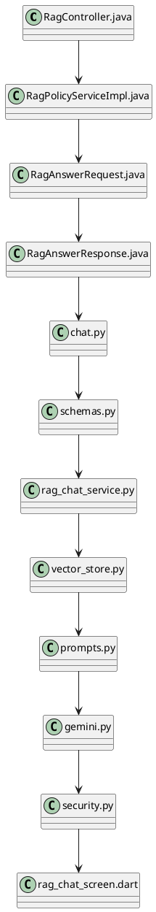
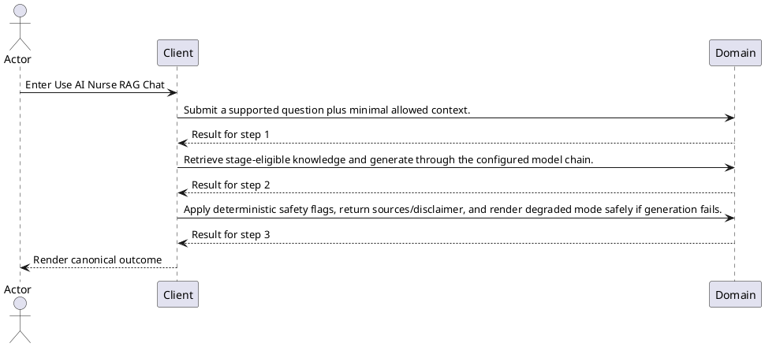
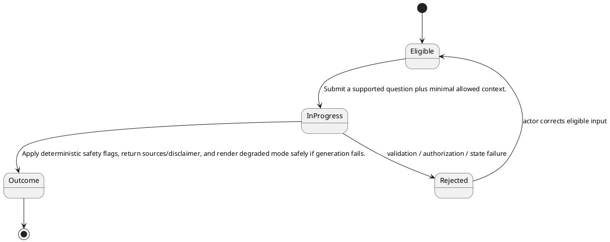

# ENGINEERING DOCUMENTATION STANDARD (EDS) v2.0

# TECHNICAL DESIGN SPECIFICATION — Use AI Nurse RAG Chat

| Field | Value |
| --- | --- |
| Document ID | `UC-AI-01-TDS` |
| Version | `0.1` |
| Date | `2026-08-23` |
| Status | `Draft` |
| Function ID | `UC-AI-01` |
| Canonical Use Case | `UC-AI-01 — Use AI Nurse RAG Chat` |
| Module / Bounded Context | `AI Nurse and Clinical Assistance` |
| Primary Actor | `Mother / Family where allowed` |
| Platforms | `Mobile / Spring Gateway / Python AI Service` |
| Priority | `High` |
| Data Classification | `Restricted health context for Mother; Confidential conversation history; Family receives no mother-only clinical context` |
| Compliance Scope | `PDPA purpose limitation, role-based minimization, disclaimer, citation provenance, internal-service credential protection` |
| Owner | `CareBridge Team` |
| Reviewer / Approver |  |
| Source Baseline | Current worktree on `2026-08-23`; SRS `UC-AI-01`; exact evidence in Section 1.4 |

## CHANGELOG

| Version | Date | Author | Change | Status |
| --- | --- | --- | --- | --- |
| 0.1 | 2026-08-23 | CareBridge Team | Initial evidence-first full-form draft | Draft |

## TABLE OF CONTENTS

1. Module Overview
2. Traceability Matrix
3. Architecture Decision Records
4. Non-Functional Requirements and SLA
5. Static Modeling
6. Dynamic Modeling
7. Domain Event Catalog
8. Interface Specification
9. API Specification
10. Error Codes
11. Implementation and Deployment Plan
12. Rollback and Incident Runbook
13. Verification Scenario Groups
14. Verification Methods
15. Verification Samples
16. Authorization Matrix
17. AI Prompt Constraints — CASE 2.0

## 1. Module Overview

### 1.1 Actor Goal, Trigger, and Outcome

- **Goal:** Ask a maternal-care question through the reachable AI Nurse chat, receive a grounded advisory response with citations/disclaimer, and follow deterministic expert/emergency guardrails.
- **Trigger:** The actor enters Mobile `/rag/chat` and local chat history/session sheet.
- **Outcome:** Apply deterministic safety flags, return sources/disclaimer, and render degraded mode safely if generation fails.
- **Current state:** `High` confidence from reachable code/test audit; documented limitations remain visible below.
- **Target state:** Preserve current code-backed behavior and resolve only explicitly evidenced limitations through approved implementation work.

### 1.2 Scope

**In scope**

- Mobile `/rag/chat` and local chat history/session sheet

- POST Spring `/api/v1/rag/answer`
- POST Python `/api/v1/chat/message`

**Out of scope / limitations**

- Open / current limitation: Structured triage session/history/handoff backend infrastructure has no reachable intake UI and remains Partial.
- Open / current limitation: The literal `carebridge` key is accepted even when another expected production key is configured; record this as a failing production-security expectation.
- Open / current limitation: No focused Mobile test currently proves Python failure to Spring fallback and response-shape downgrade.

### 1.3 Preconditions and Postconditions

| Type | Condition |
| --- | --- |
| Precondition | Mother / Family where allowed is authenticated/authorized where the current contract requires it. |
| Precondition | Required ownership, membership, consent, resource state, and device/provider prerequisites pass current policies. |
| Postcondition | Apply deterministic safety flags, return sources/disclaimer, and render degraded mode safely if generation fails. |
| Postcondition | No side effect outside the feature-owned persistence/event/provider boundary occurs. |

### 1.4 Evidence Baseline

| Source ID | Type | Exact path | Revision | Authority |
| --- | --- | --- | --- | --- |
| `SRC-SRS-01` | Requirement | `02_Requirements/SRS/Report3_Functional_Specifications.md` — UC-AI-01 | 2026-08-23 | Draft code-first requirement |
| `SRC-ARCH-01` | Approved AI architecture | `docs/AI/01_THIET_KE_KIEN_TRUC_AI_RAG_VA_BAO_VE_DO_AN.md` | Restored HEAD baseline | Approved immutable reference; never generator-owned |
| `SRC-CODE-01` | Current code | `05_Development/CareBridgeAPI/src/main/java/com/carebridge/backend/integration/gemini/controller/RagController.java` | Worktree `2026-08-23` | Current-state evidence |
| `SRC-CODE-02` | Current code | `05_Development/CareBridgeAPI/src/main/java/com/carebridge/backend/integration/gemini/service/RagPolicyServiceImpl.java` | Worktree `2026-08-23` | Current-state evidence |
| `SRC-CODE-03` | Current code | `05_Development/CareBridgeAPI/src/main/java/com/carebridge/backend/integration/gemini/dto/RagAnswerRequest.java` | Worktree `2026-08-23` | Current-state evidence |
| `SRC-CODE-04` | Current code | `05_Development/CareBridgeAPI/src/main/java/com/carebridge/backend/integration/gemini/dto/RagAnswerResponse.java` | Worktree `2026-08-23` | Current-state evidence |
| `SRC-CODE-05` | Current code | `05_Development/CareBridgeAITriageService/app/api/v1/chat.py` | Worktree `2026-08-23` | Current-state evidence |
| `SRC-CODE-06` | Current code | `05_Development/CareBridgeAITriageService/app/models/schemas.py` | Worktree `2026-08-23` | Current-state evidence |
| `SRC-CODE-07` | Current code | `05_Development/CareBridgeAITriageService/app/services/rag_chat_service.py` | Worktree `2026-08-23` | Current-state evidence |
| `SRC-CODE-08` | Current code | `05_Development/CareBridgeAITriageService/app/rag/vector_store.py` | Worktree `2026-08-23` | Current-state evidence |
| `SRC-CODE-09` | Current code | `05_Development/CareBridgeAITriageService/app/rag/prompts.py` | Worktree `2026-08-23` | Current-state evidence |
| `SRC-CODE-10` | Current code | `05_Development/CareBridgeAITriageService/app/core/gemini.py` | Worktree `2026-08-23` | Current-state evidence |
| `SRC-CODE-11` | Current code | `05_Development/CareBridgeAITriageService/app/core/security.py` | Worktree `2026-08-23` | Current-state evidence |
| `SRC-CODE-12` | Current code | `05_Development/CareBridgeMobileApp/lib/features/aiTriage/screens/rag_chat_screen.dart` | Worktree `2026-08-23` | Current-state evidence |
| `SRC-TEST-01` | Existing test | `05_Development/CareBridgeAPI/src/test/java/com/carebridge/backend/integration/gemini/RagControllerTest.java` | Worktree `2026-08-23` | Current-state evidence |
| `SRC-TEST-02` | Existing test | `05_Development/CareBridgeAITriageService/tests/test_api_endpoints.py` | Worktree `2026-08-23` | Current-state evidence |
| `SRC-TEST-03` | Existing test | `05_Development/CareBridgeAITriageService/tests/test_rag_chat.py` | Worktree `2026-08-23` | Current-state evidence |

### 1.5 Open Contradictions / Questions

- Open / current limitation: Structured triage session/history/handoff backend infrastructure has no reachable intake UI and remains Partial.
- Open / current limitation: The literal `carebridge` key is accepted even when another expected production key is configured; record this as a failing production-security expectation.
- Open / current limitation: No focused Mobile test currently proves Python failure to Spring fallback and response-shape downgrade.

## 2. Traceability Matrix

| Requirement | Behavior | Exact oracle source | Component | Test condition / case |
| --- | --- | --- | --- | --- |
| `UC-AI-01-FR-01` | Submit a supported question plus minimal allowed context. | `02_Requirements/SRS/Report3_Functional_Specifications.md` — UC-AI-01 Normal Flow 1 | `05_Development/CareBridgeAITriageService/app/api/v1/chat.py` | `COND-01` / `UC-AI-01-TC-001` |
| `UC-AI-01-FR-02` | Retrieve stage-eligible knowledge and generate through the configured model chain. | `02_Requirements/SRS/Report3_Functional_Specifications.md` — UC-AI-01 Normal Flow 2 | `05_Development/CareBridgeAPI/src/main/java/com/carebridge/backend/integration/gemini/controller/RagController.java` | `COND-02` / `UC-AI-01-TC-002` |
| `UC-AI-01-FR-03` | Apply deterministic safety flags, return sources/disclaimer, and render degraded mode safely if generation fails. | `02_Requirements/SRS/Report3_Functional_Specifications.md` — UC-AI-01 Normal Flow 3 | `05_Development/CareBridgeAPI/src/main/java/com/carebridge/backend/integration/gemini/controller/RagController.java` | `COND-03` / `UC-AI-01-TC-003` |
| `BR-01` | Python `RagChatRequest` carries message, stage, optional mother-only gestational age/survey/recent metrics, role, and conversation history; `RagChatResponse` returns answer, critical/expert flags, follow-ups, citations, disclaimer, and generated time. | `05_Development/CareBridgeAITriageService/app/models/schemas.py` | `05_Development/CareBridgeAITriageService/app/models/schemas.py` | `COND-AI-CONTRACT` / `UC-AI-01-TC-001` |
| `BR-02` | Mobile currently calls Python directly with literal internal key `carebridge`, then falls back to authenticated Spring `/api/v1/rag/answer`; this compiled-key boundary is not production-safe. | `05_Development/CareBridgeMobileApp/lib/features/aiTriage/screens/rag_chat_screen.dart` | `05_Development/CareBridgeMobileApp/lib/features/aiTriage/screens/rag_chat_screen.dart` | `COND-AI-MOBILE-FALLBACK` / `UC-AI-01-TC-021` |
| `BR-03` | Python retrieval defaults stage to `PREGNANCY`, includes stage plus `ALL`, requests top 4, and excludes returned chunks with similarity below `0.35` before prompting. | `05_Development/CareBridgeAITriageService/app/services/rag_chat_service.py` | `05_Development/CareBridgeAITriageService/app/services/rag_chat_service.py` | `COND-AI-RETRIEVAL` / `UC-AI-01-TC-005` |
| `BR-04` | Hybrid retrieval ranks by `0.35 * vector similarity + 0.20 * keyword ratio + title/phrase boosts` and de-duplicates title/section candidates. | `05_Development/CareBridgeAITriageService/app/rag/vector_store.py` | `05_Development/CareBridgeAITriageService/app/rag/vector_store.py` | `COND-AI-RANKING` / `UC-AI-01-TC-007` |
| `BR-05` | Retrieval-query expansion uses the latest user/human turn among the last two history messages; the prompt includes at most the last six messages. | `05_Development/CareBridgeAITriageService/app/services/rag_chat_service.py` | `05_Development/CareBridgeAITriageService/app/rag/prompts.py` | `COND-AI-QUERY-EXPANSION` / `UC-AI-01-TC-011` |
| `BR-06` | Family requests exclude gestational age, survey profile, and recent metrics; Mother requests include only supported formatted fields. | `05_Development/CareBridgeAITriageService/app/services/rag_chat_service.py` | `05_Development/CareBridgeAITriageService/app/services/rag_chat_service.py` | `COND-AI-FAMILY-PRIVACY` / `UC-AI-01-TC-013` |
| `BR-07` | Citations are created only from valid retrieved chunks, de-duplicated by title/section, and omit a generic root citation when a specific section exists. | `05_Development/CareBridgeAITriageService/app/services/rag_chat_service.py` | `05_Development/CareBridgeAITriageService/app/services/rag_chat_service.py` | `COND-AI-CITATION` / `UC-AI-01-TC-008` |
| `BR-08` | Generation tries distinct configured/fallback Gemini models and returns a bounded static response when all provider calls fail. | `05_Development/CareBridgeAITriageService/app/core/gemini.py` | `05_Development/CareBridgeAITriageService/app/core/gemini.py` | `COND-AI-MODEL-FALLBACK` / `UC-AI-01-TC-016` |
| `BR-09` | Model tags are removed from visible text and mapped to critical/expert flags/follow-ups; deterministic abnormal-metric rules can raise but never lower expert consultation. | `05_Development/CareBridgeAITriageService/app/services/rag_chat_service.py` | `05_Development/CareBridgeAITriageService/app/services/rag_chat_service.py` | `COND-AI-SAFETY-FLOOR` / `UC-AI-01-TC-019` |
| `BR-10` | Every Python success/degraded response includes the configured medical disclaimer; Spring returns its own constant disclaimer and explicit fallback flag. | `05_Development/CareBridgeAITriageService/app/services/rag_chat_service.py` | `05_Development/CareBridgeAPI/src/main/java/com/carebridge/backend/integration/gemini/dto/RagAnswerResponse.java` | `COND-AI-DISCLAIMER` / `UC-AI-01-TC-020` |
| `BR-11` | RAG is advisory/non-diagnostic; deterministic safety rules are the floor and citations must come from retrieved knowledge. | `docs/AI/01_THIET_KE_KIEN_TRUC_AI_RAG_VA_BAO_VE_DO_AN.md` | `05_Development/CareBridgeAITriageService/app/services/rag_chat_service.py` | `COND-AI-SAFETY-FLOOR` / `UC-AI-01-TC-019` |

## 3. Architecture Decision Records (ADR)

### ADR-UC-AI-01-01 — Use a distinct actor-goal boundary

| Item | Decision |
| --- | --- |
| Context | The retired 43-UC catalogue grouped multiple triggers, lifecycles, and permission boundaries, making implementation/test traceability generic. |
| Options | Keep the broad catalogue; split by screen; split by actor goal plus lifecycle/security boundary. |
| Decision | Use `UC-AI-01 — Use AI Nurse RAG Chat` as the canonical boundary because its operations share the stated actor outcome and current implementation evidence. |
| Consequences | Related supporting screens/endpoints stay in one TDS; different lifecycle/actor outcomes have separate UCs. |
| Source / Status | SRS Section 3.1 and current code audit / Draft |

### ADR-UC-AI-01-02 — Preserve unknowns as Open

| Item | Decision |
| --- | --- |
| Context | Exact schema fields, SLA values, and some controller error codes are not fully evidenced by this manifest alone. |
| Decision | Do not invent them. Mark them `Open` and require the exact DTO/entity/migration/policy oracle before production-code changes. |
| Consequences | This document accurately characterizes current scope; unresolved design-changing items block implementation approval. |
| Source / Status | `create-specs` evidence discipline / Draft |

## 4. Non-Functional Requirements and SLA

| NFR | Target | Oracle Source | Verification |
| --- | --- | --- | --- |
| Authorization / isolation | All requests follow exact role/ownership/membership/consent policy in current code. | `05_Development/CareBridgeAPI/src/main/java/com/carebridge/backend/integration/gemini/controller/RagController.java` | Negative security cases in paired Test-Spec |
| Protected-data handling | No secrets or unnecessary health/location/identity/conversation/file payloads in logs, fixtures, screenshots, or audit detail. | Data classification header plus exact Section 9 request/response field inventories | Log/fixture review plus security tests |
| Availability / latency | Open — no approved feature-specific numeric SLA found. | Evidence needed: approved NFR/SLA source | Measure only; do not assert a fixed threshold |
| Accessibility | Open — confirm project-standard criteria for reachable UI surfaces. | Evidence needed: approved UX/accessibility standard | Applicable Web/Mobile UI checks |
| Retry / idempotency | Apply only semantics explicitly implemented by the owning service. | No explicit lock/version/idempotency marker is evidenced in the cited implementation sources; preserve observed behavior and add characterization before changing concurrency semantics | State/duplicate/concurrency cases where applicable |

## 5. Static Modeling

### 5.1 Component Responsibilities and Change Disposition

| Exact path | Disposition | Responsibility |
| --- | --- | --- |
| `05_Development/CareBridgeAPI/src/main/java/com/carebridge/backend/integration/gemini/controller/RagController.java` | Reuse | Current implementation evidence for Use AI Nurse RAG Chat; inspect the exact symbol before implementation changes. |
| `05_Development/CareBridgeAPI/src/main/java/com/carebridge/backend/integration/gemini/service/RagPolicyServiceImpl.java` | Reuse | Current implementation evidence for Use AI Nurse RAG Chat; inspect the exact symbol before implementation changes. |
| `05_Development/CareBridgeAPI/src/main/java/com/carebridge/backend/integration/gemini/dto/RagAnswerRequest.java` | Reuse | Current implementation evidence for Use AI Nurse RAG Chat; inspect the exact symbol before implementation changes. |
| `05_Development/CareBridgeAPI/src/main/java/com/carebridge/backend/integration/gemini/dto/RagAnswerResponse.java` | Reuse | Current implementation evidence for Use AI Nurse RAG Chat; inspect the exact symbol before implementation changes. |
| `05_Development/CareBridgeAITriageService/app/api/v1/chat.py` | Reuse | Current implementation evidence for Use AI Nurse RAG Chat; inspect the exact symbol before implementation changes. |
| `05_Development/CareBridgeAITriageService/app/models/schemas.py` | Reuse | Current implementation evidence for Use AI Nurse RAG Chat; inspect the exact symbol before implementation changes. |
| `05_Development/CareBridgeAITriageService/app/services/rag_chat_service.py` | Reuse | Current implementation evidence for Use AI Nurse RAG Chat; inspect the exact symbol before implementation changes. |
| `05_Development/CareBridgeAITriageService/app/rag/vector_store.py` | Reuse | Current implementation evidence for Use AI Nurse RAG Chat; inspect the exact symbol before implementation changes. |
| `05_Development/CareBridgeAITriageService/app/rag/prompts.py` | Reuse | Current implementation evidence for Use AI Nurse RAG Chat; inspect the exact symbol before implementation changes. |
| `05_Development/CareBridgeAITriageService/app/core/gemini.py` | Reuse | Current implementation evidence for Use AI Nurse RAG Chat; inspect the exact symbol before implementation changes. |
| `05_Development/CareBridgeAITriageService/app/core/security.py` | Reuse | Current implementation evidence for Use AI Nurse RAG Chat; inspect the exact symbol before implementation changes. |
| `05_Development/CareBridgeMobileApp/lib/features/aiTriage/screens/rag_chat_screen.dart` | Reuse | Current implementation evidence for Use AI Nurse RAG Chat; inspect the exact symbol before implementation changes. |

### 5.2 Current Component Diagram

### 5.3 Data / Schema / Migration Assessment

| Item | Assessment |
| --- | --- |
| Current stores/entities | `05_Development/CareBridgeAITriageService/app/core/database.py`; `05_Development/CareBridgeAITriageService/app/models/db_models.py`; `05_Development/CareBridgeAITriageService/app/models/schemas.py`; `05_Development/CareBridgeAITriageService/app/rag/vector_store.py`; `05_Development/CareBridgeAPI/src/main/java/com/carebridge/backend/content/entity/ContentStage.java` |
| Sensitive fields | Restricted health context for Mother; Confidential conversation history; Family receives no mother-only clinical context. Exact transport fields and validators are enumerated per handler in Section 9; entity-only fields require the cited service/entity source before a schema change. |
| Schema delta for documentation alignment | Not applicable — this Draft does not change runtime schema. |
| Future implementation migration | Use additive, versioned migrations only when an approved behavior requires schema change. |
| V1 synchronization | Not applicable — this documentation alignment changes no schema; any future schema work must inspect current Flyway history and must never rewrite an applied migration. |

## 6. Dynamic Modeling

### 6.1 Happy Path Sequence

### 6.2 Alternative, Error, Retry, and Concurrency Flows

| Flow | Expected design behavior | Oracle |
| --- | --- | --- |
| Cancel before mutation | No unintended write or provider side effect. | SRS UC-AI-01 Alternative Flow |
| Invalid input/state | Reject with the current contract; keep canonical state unchanged. | `05_Development/CareBridgeAPI/src/main/java/com/carebridge/backend/integration/gemini/controller/RagController.java` |
| Wrong actor/scope | Fail closed without protected resource disclosure. | `05_Development/CareBridgeAPI/src/main/java/com/carebridge/backend/integration/gemini/controller/RagController.java` |
| Dependency failure | Use only the implemented bounded fallback/retry; never report false success. | `05_Development/CareBridgeAITriageService/app/core/gemini.py`; `05_Development/CareBridgeAITriageService/app/core/security.py`; `05_Development/CareBridgeAITriageService/app/rag/embedder.py`; `05_Development/CareBridgeAITriageService/app/rag/prompts.py`; `05_Development/CareBridgeAITriageService/app/rag/vector_store.py`; `05_Development/CareBridgeAITriageService/app/services/rag_chat_service.py`; `05_Development/CareBridgeAPI/src/main/java/com/carebridge/backend/integration/gemini/dto/RagAnswerRequest.java`; `05_Development/CareBridgeAPI/src/main/java/com/carebridge/backend/integration/gemini/dto/RagAnswerResponse.java`; `05_Development/CareBridgeAPI/src/main/java/com/carebridge/backend/integration/gemini/dto/RagAudienceContext.java`; `05_Development/CareBridgeAPI/src/main/java/com/carebridge/backend/integration/gemini/dto/RagExecutionContext.java`; `05_Development/CareBridgeAPI/src/main/java/com/carebridge/backend/integration/gemini/dto/RagSafetyResult.java`; `05_Development/CareBridgeAPI/src/main/java/com/carebridge/backend/integration/gemini/dto/UserStage.java`; `05_Development/CareBridgeAPI/src/main/java/com/carebridge/backend/integration/gemini/exception/RagException.java`; `05_Development/CareBridgeAPI/src/main/java/com/carebridge/backend/integration/gemini/filter/RagSafetyFilter.java`; `05_Development/CareBridgeAPI/src/main/java/com/carebridge/backend/integration/gemini/service/RagPolicyService.java` |
| Duplicate/concurrent mutation | Apply only current lock/version/idempotency semantics. | No explicit lock/version/idempotency marker is evidenced in the cited implementation sources; preserve observed behavior and add characterization before changing concurrency semantics |

### 6.3 State Model and Invariants

- Python `RagChatRequest` carries message, stage, optional mother-only gestational age/survey/recent metrics, role, and conversation history; `RagChatResponse` returns answer, critical/expert flags, follow-ups, citations, disclaimer, and generated time.
- Mobile currently calls Python directly with literal internal key `carebridge`, then falls back to authenticated Spring `/api/v1/rag/answer`; this compiled-key boundary is not production-safe.
- Python retrieval defaults stage to `PREGNANCY`, includes stage plus `ALL`, requests top 4, and excludes returned chunks with similarity below `0.35` before prompting.
- Hybrid retrieval ranks by `0.35 * vector similarity + 0.20 * keyword ratio + title/phrase boosts` and de-duplicates title/section candidates.
- Retrieval-query expansion uses the latest user/human turn among the last two history messages; the prompt includes at most the last six messages.
- Family requests exclude gestational age, survey profile, and recent metrics; Mother requests include only supported formatted fields.
- Citations are created only from valid retrieved chunks, de-duplicated by title/section, and omit a generic root citation when a specific section exists.
- Generation tries distinct configured/fallback Gemini models and returns a bounded static response when all provider calls fail.
- Model tags are removed from visible text and mapped to critical/expert flags/follow-ups; deterministic abnormal-metric rules can raise but never lower expert consultation.
- Every Python success/degraded response includes the configured medical disclaimer; Spring returns its own constant disclaimer and explicit fallback flag.
- RAG is advisory/non-diagnostic; deterministic safety rules are the floor and citations must come from retrieved knowledge.

## 7. Domain Event Catalog

| Direction | Event | Producer / Consumer | Payload / delivery / idempotency |
| --- | --- | --- | --- |
| Publish / consume | Current event evidence | Not applicable at this cited baseline — no event type, publisher, or listener is evidenced in the listed implementation sources | Preserve only events evidenced by the cited source set; if later call-path inspection finds none, the flow remains synchronous. |

## 8. Interface Specification

### 8.1 User / Operator Interfaces

| # | Entry point | Actor | Contract |
| ---: | --- | --- | --- |
| 1 | Mobile `/rag/chat` and local chat history/session sheet | Mother / Family where allowed | Reachable current entry point |

### 8.2 Service / Repository Interfaces

| Interface evidence | Required responsibility |
| --- | --- |
| `05_Development/CareBridgeAPI/src/main/java/com/carebridge/backend/integration/gemini/controller/RagController.java` | Support the mapped operations without broadening authorization or lifecycle semantics. |
| `05_Development/CareBridgeAPI/src/main/java/com/carebridge/backend/integration/gemini/service/RagPolicyServiceImpl.java` | Support the mapped operations without broadening authorization or lifecycle semantics. |
| `05_Development/CareBridgeAPI/src/main/java/com/carebridge/backend/integration/gemini/dto/RagAnswerRequest.java` | Support the mapped operations without broadening authorization or lifecycle semantics. |
| `05_Development/CareBridgeAPI/src/main/java/com/carebridge/backend/integration/gemini/dto/RagAnswerResponse.java` | Support the mapped operations without broadening authorization or lifecycle semantics. |
| `05_Development/CareBridgeAITriageService/app/api/v1/chat.py` | Support the mapped operations without broadening authorization or lifecycle semantics. |
| `05_Development/CareBridgeAITriageService/app/models/schemas.py` | Support the mapped operations without broadening authorization or lifecycle semantics. |
| `05_Development/CareBridgeAITriageService/app/services/rag_chat_service.py` | Support the mapped operations without broadening authorization or lifecycle semantics. |
| `05_Development/CareBridgeAITriageService/app/rag/vector_store.py` | Support the mapped operations without broadening authorization or lifecycle semantics. |
| `05_Development/CareBridgeAITriageService/app/rag/prompts.py` | Support the mapped operations without broadening authorization or lifecycle semantics. |
| `05_Development/CareBridgeAITriageService/app/core/gemini.py` | Support the mapped operations without broadening authorization or lifecycle semantics. |
| `05_Development/CareBridgeAITriageService/app/core/security.py` | Support the mapped operations without broadening authorization or lifecycle semantics. |
| `05_Development/CareBridgeMobileApp/lib/features/aiTriage/screens/rag_chat_screen.dart` | Support the mapped operations without broadening authorization or lifecycle semantics. |

## 9. API Specification

| ID | Method / path or grouped controller surface | Auth / role | Request / response / errors |
| --- | --- | --- | --- |
| `API-01` | POST Python `/api/v1/chat/message` | `X-Internal-API-Key` / `X-API-Key` / `X-CareBridge-Internal-Key`; current development bypass is a known gap | Request: `message`, `stage=PREGNANCY`, optional mother-only `gestational_age_weeks`, `survey_profile`, `recent_metrics`, `user_role`, `conversation_history`. Response: `answer`, `has_critical_warning`, `need_expert_consultation`, `suggested_followups`, `sources`, `disclaimer`, `generated_at`. |
| `API-02` | POST Spring `/api/v1/rag/answer` | Bearer auth; roles MOTHER, FAMILY, EXPERT, MODERATOR, CONTENT_ADMIN, SYSTEM_ADMIN; OPERATIONS is rejected | Request: `query` 3..500, optional `userStage`, `topicId`, `maxContextChunks<=10`. Response envelope data: `answer`, constant `disclaimer`, `sources`, `fallback`, `generatedAt`. |

Python and Spring request/response fields, authorization boundaries, errors, and degraded behavior are enumerated from exact current sources above; the literal Mobile internal key remains an explicit production-security gap.

### 9.1 Handler Contract — `POST /api/v1/chat/message`

| Item | Exact current contract |
| --- | --- |
| Handler | `chat_with_ai_nurse` |
| Source | `05_Development/CareBridgeAITriageService/app/api/v1/chat.py` |
| Authorization annotation / boundary | Internal API key via `verify_internal_api_key` dependency |
| Parameters | body `request`: `RagChatRequest`; dependency `_auth`: `str`; dependency `db`: `AsyncSession` |
| Request body type | `RagChatRequest` |
| Request fields and validators | `message`: `str` (`Field(description="Câu hỏi hoặc chia sẻ của mẹ bầu hoặc người thân")`); `stage`: `MaternalStage` (`Field(default=MaternalStage.PREGNANCY, description="Giai đoạn của người dùng")`); `gestational_age_weeks`: `Optional[int]` (`Field(default=None, description="Tuần thai hiện tại (chỉ áp dụng cho MOTHER)")`); `user_role`: `Optional[str]` (`Field(default="MOTHER", description="Role của người dùng: MOTHER hoặc FAMILY")`); `survey_profile`: `Optional[Dict[str, Any]]` (`Field(default=None, description="Thông tin tiền sử y tế từ khảo sát onboarding (chỉ áp dụng cho MOTHER)")`); `conversation_history`: `List[ChatMessage]` (`Field(default_factory=list, description="Lịch sử đoạn hội thoại trước đó")`); `recent_metrics`: `Optional[HealthMetricsLogRequest]` (`Field(default=None, description="Chỉ số sinh hiệu gần nhất để AI nắm bối cảnh (chỉ áp dụng cho MOTHER)")`) |
| Response type | `RagChatResponse` |
| Response payload fields | `answer`: `str` (`Field(description="Nội dung giải đáp chi tiết, ân cần từ AI Nurse Assistant")`); `has_critical_warning`: `bool` (`Field(default=False, description="True nếu câu hỏi của mẹ chứa dấu hiệu nguy hiểm cần đi viện")`); `need_expert_consultation`: `bool` (`Field(default=False, description="True nếu phát hiện dấu hiệu hoặc chỉ số sức khỏe bất thường cần tham vấn bác sĩ chuyên khoa")`); `suggested_followups`: `List[str]` (`Field(default_factory=list, description="Các câu hỏi gợi ý tiếp theo")`); `sources`: `List[SourceCitation]` (`Field(default_factory=list, description="Các đoạn tài liệu cẩm nang y tế được trích dẫn")`); `disclaimer`: `str` (`Field(description="Cảnh báo y tế không thay thế chẩn đoán bác sĩ")`); `generated_at`: `datetime` (`Field(default_factory=datetime.utcnow)`) |
| Explicit/documented statuses | `200` |
| Positive test mapping | `COND-API-001` / `UC-AI-01-TC-API-001` |
| Negative test mapping | `COND-AUTH`; DTO/service-only negative paths require their exact cited oracle |

### 9.2 Handler Contract — `POST /api/v1/rag/answer`

| Item | Exact current contract |
| --- | --- |
| Handler | `generateAnswer` |
| Source | `05_Development/CareBridgeAPI/src/main/java/com/carebridge/backend/integration/gemini/controller/RagController.java` |
| Authorization annotation / boundary | No @PreAuthorize on handler/class; effective access comes from the security chain |
| Parameters | body `request`: `RagAnswerRequest`; principal `principal`: `Principal` |
| Request body type | `RagAnswerRequest` |
| Request fields and validators | `query`: `String` (no field annotation in current DTO); `userStage`: `UserStage` (no field annotation in current DTO); `topicId`: `UUID` (no field annotation in current DTO); `maxContextChunks`: `Integer` (no field annotation in current DTO) |
| Response type | `ResponseEntity<ApiResponse<RagAnswerResponse>>` |
| Response payload fields | `answer`: `String` (no field annotation in current DTO); `disclaimer`: `String` (no field annotation in current DTO); `sources`: `List<RagSource>` (no field annotation in current DTO); `fallback`: `boolean` (no field annotation in current DTO); `generatedAt`: `LocalDateTime` (no field annotation in current DTO) |
| Explicit/documented statuses | `200` |
| Positive test mapping | `COND-API-002` / `UC-AI-01-TC-API-002` |
| Negative test mapping | `COND-AUTH`; DTO/service-only negative paths require their exact cited oracle |

## 10. Error Codes

| Error class | HTTP / code | Trigger | Client behavior | Oracle |
| --- | --- | --- | --- | --- |
| Python request validation | `422` FastAPI validation | Missing/malformed `message`, stage, history, or metric shape | Show bounded validation/error state; no retrieval/provider call | `app/models/schemas.py`, FastAPI contract |
| Python internal key | `401` | Missing/invalid key in strict non-debug configuration | Do not retry with secrets in UI/logs | `app/core/security.py` |
| Spring query | `400 / RAG-001` | Query null/blank, shorter than 3, or longer than 500 | Show actionable input error | `RagException.invalidQuery()` |
| Spring context limit | `400 / RAG-002` | `maxContextChunks > 10` | Reduce to allowed bound | `RagException.contextChunksExceeded()` |
| Spring authentication | `401` | Missing/invalid bearer token | Return to authentication flow | `RagControllerTest` |
| Spring role | `403` | Role outside controller allow-list (for example OPERATIONS) | Fail closed; no policy/generation call | `RagController` and `RagControllerTest` |
| Provider/model exhaustion | `200` degraded response | All configured Gemini generation models fail | Render bounded fallback and disclaimer; do not fabricate citations | Python `gemini.py` / Spring fallback response |
| Mobile transport exhaustion | Local bounded message | Python candidates and Spring fallback fail/empty | Show retry/direct-clinical-support guidance without false success | `rag_chat_screen.dart` |

## 11. Implementation and Deployment Plan

1. Preserve this current code-backed boundary and resolve every `Open` item that changes tests, schema, auth, API, or state.
2. Map exact DTO fields, service/repository symbols, migrations, events, and error codes from the listed evidence.
3. Write paired Test-Spec Red cases before production changes.
4. Implement only the approved gap; reuse current components listed in Section 5.
5. Run targeted and affected suites; record commands/counts only after execution.
6. Deploy compatible server/schema changes before clients that depend on them; preserve old-client compatibility where required.

## 12. Rollback and Incident Runbook

| Trigger | Safe rollback / containment | Verification |
| --- | --- | --- |
| Documentation error | Revert only this generated pair/manifest change to the last reviewed version. | Regenerate and run document validators. |
| Client regression | Disable/revert the feature-owned client change while keeping compatible server contracts. | Targeted route/widget/component tests. |
| Server regression | Revert the feature-owned change or deploy a forward corrective fix. | Targeted backend/AI suite and smoke contract. |
| Schema issue | Stop rollout; restore through additive corrective migration or isolated backup procedure. Never edit applied Flyway history. | Migration validation and data-integrity checks. |
| Provider incident | Disable optional integration or use only the approved degraded mode. | Provider-fake/sandbox contract tests. |

## 13. Verification Scenario Groups

| Group | Behavior | Condition | Test case |
| --- | --- | --- | --- |
| `VG-01` | Submit a supported question plus minimal allowed context. | `COND-01` | `UC-AI-01-TC-001` |
| `VG-02` | Retrieve stage-eligible knowledge and generate through the configured model chain. | `COND-02` | `UC-AI-01-TC-002` |
| `VG-03` | Apply deterministic safety flags, return sources/disclaimer, and render degraded mode safely if generation fails. | `COND-03` | `UC-AI-01-TC-003` |
| `VG-AI-001` | Python chat returns the documented response contract | `COND-AI-CONTRACT` | `UC-AI-01-TC-001` |
| `VG-AI-002` | Transport-invalid Python request is rejected before generation | `COND-AI-VALIDATION` | `UC-AI-01-TC-002` |
| `VG-AI-003` | Strict internal-key configuration rejects missing or invalid key | `COND-AI-KEY` | `UC-AI-01-TC-003` |
| `VG-AI-004` | Literal carebridge key exposes the production-security gap | `COND-AI-KEY-GAP` | `UC-AI-01-TC-004` |
| `VG-AI-005` | Retrieval is stage scoped and bounded to four candidates | `COND-AI-RETRIEVAL` | `UC-AI-01-TC-005` |
| `VG-AI-006` | Similarity threshold includes the 0.35 boundary | `COND-AI-THRESHOLD` | `UC-AI-01-TC-006` |
| `VG-AI-007` | Hybrid ranking uses implemented weights and boosts | `COND-AI-RANKING` | `UC-AI-01-TC-007` |
| `VG-AI-008` | Citation de-duplication prefers specific sections | `COND-AI-CITATION` | `UC-AI-01-TC-008` |
| `VG-AI-009` | No relevant chunk does not fabricate citations | `COND-AI-NO-CONTEXT` | `UC-AI-01-TC-009` |
| `VG-AI-010` | Prompt history is limited to the last six messages | `COND-AI-HISTORY` | `UC-AI-01-TC-010` |
| `VG-AI-011` | Retrieval query expands with the latest recent user turn | `COND-AI-QUERY-EXPANSION` | `UC-AI-01-TC-011` |
| `VG-AI-012` | Older user turn does not expand retrieval query | `COND-AI-QUERY-BOUNDARY` | `UC-AI-01-TC-012` |
| `VG-AI-013` | Family prompt excludes mother-only clinical context | `COND-AI-FAMILY-PRIVACY` | `UC-AI-01-TC-013` |
| `VG-AI-014` | Mother prompt includes only supported formatted context | `COND-AI-MOTHER-CONTEXT` | `UC-AI-01-TC-014` |
| `VG-AI-015` | Local chat sessions are isolated by authenticated user | `COND-AI-MOBILE-ISOLATION` | `UC-AI-01-TC-015` |
| `VG-AI-016` | Generation tries distinct fallback models in order | `COND-AI-MODEL-FALLBACK` | `UC-AI-01-TC-016` |
| `VG-AI-017` | All model failures return bounded degraded text | `COND-AI-DEGRADED` | `UC-AI-01-TC-017` |
| `VG-AI-018` | Clinical tags are removed and mapped to response flags | `COND-AI-TAGS` | `UC-AI-01-TC-018` |
| `VG-AI-019` | Deterministic abnormal metrics raise the expert flag | `COND-AI-SAFETY-FLOOR` | `UC-AI-01-TC-019` |
| `VG-AI-020` | Every Python response contains medical disclaimer | `COND-AI-DISCLAIMER` | `UC-AI-01-TC-020` |
| `VG-AI-021` | Mobile falls back from Python to authenticated Spring RAG | `COND-AI-MOBILE-FALLBACK` | `UC-AI-01-TC-021` |
| `VG-AI-022` | Metric yellow branch prefills chat without auto-send | `COND-AI-PREFILL` | `UC-AI-01-TC-022` |
| `VG-AUTH` | Reject wrong authentication/role/ownership/membership/consent scope | `COND-AUTH` | `UC-AI-01-TC-SEC-001` |
| `VG-GAP` | Characterize each known gap without claiming a false completed path | `COND-GAP` | `UC-AI-01-TC-GAP-001` |

## 14. Verification Methods

Existing focused evidence:

- `05_Development/CareBridgeAPI/src/test/java/com/carebridge/backend/integration/gemini/RagControllerTest.java`
- `05_Development/CareBridgeAITriageService/tests/test_api_endpoints.py`
- `05_Development/CareBridgeAITriageService/tests/test_rag_chat.py`

Exact supported commands derived from the audited test paths:

- `cd 05_Development/CareBridgeAPI && ./mvnw -Dtest=RagControllerTest test`
- `cd 05_Development/CareBridgeAITriageService && pytest tests/test_api_endpoints.py`
- `cd 05_Development/CareBridgeAITriageService && pytest tests/test_rag_chat.py`

Record pass/fail/skip counts only after executing these commands on the exact revision.

## 15. Verification Samples

| Sample | Value |
| --- | --- |
| Primary contract | POST Spring `/api/v1/rag/answer` |
| Request | `POST /api/v1/chat/message` → `chat_with_ai_nurse`; `RagChatRequest` with `message`: `str` (`Field(description="Câu hỏi hoặc chia sẻ của mẹ bầu hoặc người thân")`); `stage`: `MaternalStage` (`Field(default=MaternalStage.PREGNANCY, description="Giai đoạn của người dùng")`); `gestational_age_weeks`: `Optional[int]` (`Field(default=None, description="Tuần thai hiện tại (chỉ áp dụng cho MOTHER)")`); `user_role`: `Optional[str]` (`Field(default="MOTHER", description="Role của người dùng: MOTHER hoặc FAMILY")`); `survey_profile`: `Optional[Dict[str, Any]]` (`Field(default=None, description="Thông tin tiền sử y tế từ khảo sát onboarding (chỉ áp dụng cho MOTHER)")`); `conversation_history`: `List[ChatMessage]` (`Field(default_factory=list, description="Lịch sử đoạn hội thoại trước đó")`); `recent_metrics`: `Optional[HealthMetricsLogRequest]` (`Field(default=None, description="Chỉ số sinh hiệu gần nhất để AI nắm bối cảnh (chỉ áp dụng cho MOTHER)")`); authorization: Internal API key via `verify_internal_api_key` dependency. |
| Success response | `RagChatResponse` with `answer`: `str` (`Field(description="Nội dung giải đáp chi tiết, ân cần từ AI Nurse Assistant")`); `has_critical_warning`: `bool` (`Field(default=False, description="True nếu câu hỏi của mẹ chứa dấu hiệu nguy hiểm cần đi viện")`); `need_expert_consultation`: `bool` (`Field(default=False, description="True nếu phát hiện dấu hiệu hoặc chỉ số sức khỏe bất thường cần tham vấn bác sĩ chuyên khoa")`); `suggested_followups`: `List[str]` (`Field(default_factory=list, description="Các câu hỏi gợi ý tiếp theo")`); `sources`: `List[SourceCitation]` (`Field(default_factory=list, description="Các đoạn tài liệu cẩm nang y tế được trích dẫn")`); `disclaimer`: `str` (`Field(description="Cảnh báo y tế không thay thế chẩn đoán bác sĩ")`); `generated_at`: `datetime` (`Field(default_factory=datetime.utcnow)`); explicit/documented statuses `200`. |
| Negative sample | Use wrong role/owner/state and assert the exact mapped error without protected payload. |

## 16. Authorization Matrix

| Actor / role | Operation | Decision |
| --- | --- | --- |
| Mother / Family where allowed | `POST /api/v1/chat/message` | Internal API key via `verify_internal_api_key` dependency; handler oracle `05_Development/CareBridgeAITriageService/app/api/v1/chat.py` |
| Mother / Family where allowed | `POST /api/v1/rag/answer` | No @PreAuthorize on handler/class; effective access comes from the security chain; handler oracle `05_Development/CareBridgeAPI/src/main/java/com/carebridge/backend/integration/gemini/controller/RagController.java` |
| Unauthenticated / wrong role / wrong owner-member | All protected operations | Deny without resource disclosure |

## 17. AI Prompt Constraints — CASE 2.0

- Treat the restored AI architecture document as an immutable oracle/reference.
- Retrieval citations must originate from retrieved knowledge.
- Deterministic safety/role/privacy policy cannot be lowered by model output.

### Quality and Anti-Pattern Checklist

- [ ] All 17 sections remain present.
- [ ] Every known semantic value has an exact source; unresolved values are `Open` with evidence needed.
- [ ] Requirement → component → condition → test traceability is preserved.
- [ ] No historical pass count, SLA, accuracy, or provider claim is copied without current evidence.
- [ ] No generic endpoint group is treated as an implementation-ready field/error contract.
- [ ] No production code, schema, or immutable AI architecture source is modified by spec generation.
