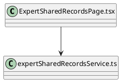
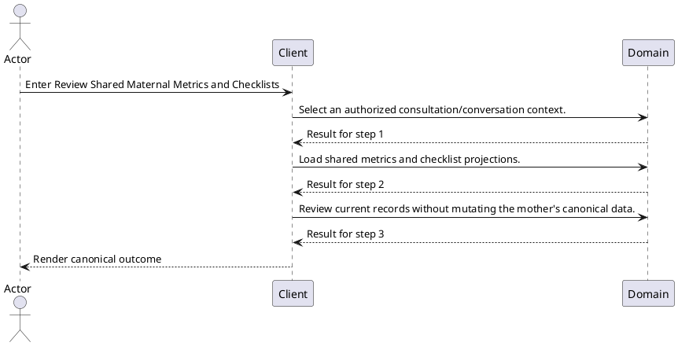
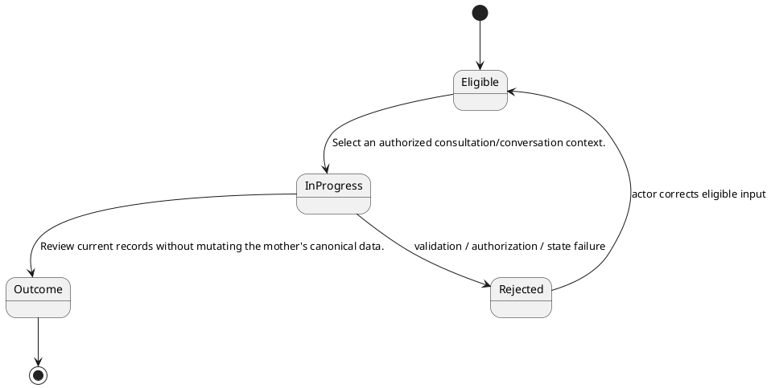

# ENGINEERING DOCUMENTATION STANDARD (EDS) v2.0

# TECHNICAL DESIGN SPECIFICATION — Review Shared Maternal Metrics and Checklists

| Field | Value |
| --- | --- |
| Document ID | `UC-EX-12-TDS` |
| Version | `0.1` |
| Date | `2026-08-23` |
| Status | `Draft` |
| Function ID | `UC-EX-12` |
| Canonical Use Case | `UC-EX-12 — Review Shared Maternal Metrics and Checklists` |
| Module / Bounded Context | `Expert and Consultation` |
| Primary Actor | `Authorized Expert` |
| Platforms | `Web / Backend` |
| Priority | `Medium` |
| Data Classification | `Confidential professional and consultation data; Restricted identity/credential evidence and purpose-bound attachments` |
| Compliance Scope | `PDPA purpose limitation, least privilege, purpose-bound file access, consultation confidentiality, and consent-aware recording` |
| Owner | `CareBridge Team` |
| Reviewer / Approver |  |
| Source Baseline | Current worktree on `2026-08-23`; SRS `UC-EX-12`; exact evidence in Section 1.4 |

## CHANGELOG

| Version | Date | Author | Change | Status |
| --- | --- | --- | --- | --- |
| 0.1 | 2026-08-23 | CareBridge Team | Initial evidence-first full-form draft | Draft |

## TABLE OF CONTENTS

1. Module Overview
2. Traceability Matrix
3. Architecture Decision Records
4. Non-Functional Requirements and SLA
5. Static Modeling
6. Dynamic Modeling
7. Domain Event Catalog
8. Interface Specification
9. API Specification
10. Error Codes
11. Implementation and Deployment Plan
12. Rollback and Incident Runbook
13. Verification Scenario Groups
14. Verification Methods
15. Verification Samples
16. Authorization Matrix
17. AI Prompt Constraints — CASE 2.0

## 1. Module Overview

### 1.1 Actor Goal, Trigger, and Outcome

- **Goal:** Review maternal metrics and checklist information shared through an authorized consultation relationship.
- **Trigger:** The actor enters Web `/expert/shared-records`.
- **Outcome:** Review current records without mutating the mother's canonical data.
- **Current state:** `Medium` confidence from reachable code/test audit; documented limitations remain visible below.
- **Target state:** Preserve current code-backed behavior and resolve only explicitly evidenced limitations through approved implementation work.

### 1.2 Scope

**In scope**

- Web `/expert/shared-records`
- Shared items in direct-chat context

- Authorized conversation timeline and live-sync metric/checklist endpoints

**Out of scope / limitations**

- Open / current limitation: No dedicated shared-record backend resource exists; this UC composes existing authorized endpoints.

### 1.3 Preconditions and Postconditions

| Type | Condition |
| --- | --- |
| Precondition | Authorized Expert is authenticated/authorized where the current contract requires it. |
| Precondition | Required ownership, membership, consent, resource state, and device/provider prerequisites pass current policies. |
| Postcondition | Review current records without mutating the mother's canonical data. |
| Postcondition | No side effect outside the feature-owned persistence/event/provider boundary occurs. |

### 1.4 Evidence Baseline

| Source ID | Type | Exact path | Revision | Authority |
| --- | --- | --- | --- | --- |
| `SRC-SRS-01` | Requirement | `02_Requirements/SRS/Report3_Functional_Specifications.md` — UC-EX-12 | 2026-08-23 | Draft code-first requirement |
| `SRC-CODE-01` | Current code | `05_Development/CareBridgeWebApp/src/features/expert/pages/ExpertSharedRecordsPage.tsx` | Worktree `2026-08-23` | Current-state evidence |
| `SRC-CODE-02` | Current code | `05_Development/CareBridgeWebApp/src/features/expert/services/expertSharedRecordsService.ts` | Worktree `2026-08-23` | Current-state evidence |
| `SRC-TEST-01` | Existing test | `05_Development/CareBridgeWebApp/src/features/directChat/services/directChatApi.test.ts` | Worktree `2026-08-23` | Current-state evidence |

### 1.5 Open Contradictions / Questions

- Open / current limitation: No dedicated shared-record backend resource exists; this UC composes existing authorized endpoints.

## 2. Traceability Matrix

| Requirement | Behavior | Exact oracle source | Component | Test condition / case |
| --- | --- | --- | --- | --- |
| `UC-EX-12-FR-01` | Select an authorized consultation/conversation context. | `02_Requirements/SRS/Report3_Functional_Specifications.md` — UC-EX-12 Normal Flow 1 | `05_Development/CareBridgeWebApp/src/features/expert/pages/ExpertSharedRecordsPage.tsx` | `COND-01` / `UC-EX-12-TC-001` |
| `UC-EX-12-FR-02` | Load shared metrics and checklist projections. | `02_Requirements/SRS/Report3_Functional_Specifications.md` — UC-EX-12 Normal Flow 2 | `05_Development/CareBridgeWebApp/src/features/expert/services/expertSharedRecordsService.ts` | `COND-02` / `UC-EX-12-TC-002` |
| `UC-EX-12-FR-03` | Review current records without mutating the mother's canonical data. | `02_Requirements/SRS/Report3_Functional_Specifications.md` — UC-EX-12 Normal Flow 3 | `05_Development/CareBridgeWebApp/src/features/expert/services/expertSharedRecordsService.ts` | `COND-03` / `UC-EX-12-TC-003` |
| `BR-01` | The active sharing/consultation relationship is rechecked by the backend. | `05_Development/CareBridgeWebApp/src/features/expert/services/expertSharedRecordsService.ts` | `05_Development/CareBridgeWebApp/src/features/expert/services/expertSharedRecordsService.ts` | `COND-BR-01` / `UC-EX-12-TC-BR-001` |
| `BR-02` | Read access must not broaden to unrelated journeys or accounts. | `05_Development/CareBridgeWebApp/src/features/expert/services/expertSharedRecordsService.ts` | `05_Development/CareBridgeWebApp/src/features/expert/services/expertSharedRecordsService.ts` | `COND-BR-02` / `UC-EX-12-TC-BR-002` |

## 3. Architecture Decision Records (ADR)

### ADR-UC-EX-12-01 — Use a distinct actor-goal boundary

| Item | Decision |
| --- | --- |
| Context | The retired 43-UC catalogue grouped multiple triggers, lifecycles, and permission boundaries, making implementation/test traceability generic. |
| Options | Keep the broad catalogue; split by screen; split by actor goal plus lifecycle/security boundary. |
| Decision | Use `UC-EX-12 — Review Shared Maternal Metrics and Checklists` as the canonical boundary because its operations share the stated actor outcome and current implementation evidence. |
| Consequences | Related supporting screens/endpoints stay in one TDS; different lifecycle/actor outcomes have separate UCs. |
| Source / Status | SRS Section 3.1 and current code audit / Draft |

### ADR-UC-EX-12-02 — Preserve unknowns as Open

| Item | Decision |
| --- | --- |
| Context | Exact schema fields, SLA values, and some controller error codes are not fully evidenced by this manifest alone. |
| Decision | Do not invent them. Mark them `Open` and require the exact DTO/entity/migration/policy oracle before production-code changes. |
| Consequences | This document accurately characterizes current scope; unresolved design-changing items block implementation approval. |
| Source / Status | `create-specs` evidence discipline / Draft |

## 4. Non-Functional Requirements and SLA

| NFR | Target | Oracle Source | Verification |
| --- | --- | --- | --- |
| Authorization / isolation | All requests follow exact role/ownership/membership/consent policy in current code. | `05_Development/CareBridgeWebApp/src/features/expert/pages/ExpertSharedRecordsPage.tsx` | Negative security cases in paired Test-Spec |
| Protected-data handling | No secrets or unnecessary health/location/identity/conversation/file payloads in logs, fixtures, screenshots, or audit detail. | Data classification header plus exact Section 9 request/response field inventories | Log/fixture review plus security tests |
| Availability / latency | Open — no approved feature-specific numeric SLA found. | Evidence needed: approved NFR/SLA source | Measure only; do not assert a fixed threshold |
| Accessibility | Open — confirm project-standard criteria for reachable UI surfaces. | Evidence needed: approved UX/accessibility standard | Applicable Web/Mobile UI checks |
| Retry / idempotency | Apply only semantics explicitly implemented by the owning service. | No explicit lock/version/idempotency marker is evidenced in the cited implementation sources; preserve observed behavior and add characterization before changing concurrency semantics | State/duplicate/concurrency cases where applicable |

## 5. Static Modeling

### 5.1 Component Responsibilities and Change Disposition

| Exact path | Disposition | Responsibility |
| --- | --- | --- |
| `05_Development/CareBridgeWebApp/src/features/expert/pages/ExpertSharedRecordsPage.tsx` | Reuse | Current implementation evidence for Review Shared Maternal Metrics and Checklists; inspect the exact symbol before implementation changes. |
| `05_Development/CareBridgeWebApp/src/features/expert/services/expertSharedRecordsService.ts` | Reuse | Current implementation evidence for Review Shared Maternal Metrics and Checklists; inspect the exact symbol before implementation changes. |

### 5.2 Current Component Diagram

### 5.3 Data / Schema / Migration Assessment

| Item | Assessment |
| --- | --- |
| Current stores/entities | No entity/repository import is present in the cited entry/source set; follow the exact handler-to-service call path before any schema change |
| Sensitive fields | Confidential professional and consultation data; Restricted identity/credential evidence and purpose-bound attachments. Exact transport fields and validators are enumerated per handler in Section 9; entity-only fields require the cited service/entity source before a schema change. |
| Schema delta for documentation alignment | Not applicable — this Draft does not change runtime schema. |
| Future implementation migration | Use additive, versioned migrations only when an approved behavior requires schema change. |
| V1 synchronization | Not applicable — this documentation alignment changes no schema; any future schema work must inspect current Flyway history and must never rewrite an applied migration. |

## 6. Dynamic Modeling

### 6.1 Happy Path Sequence

### 6.2 Alternative, Error, Retry, and Concurrency Flows

| Flow | Expected design behavior | Oracle |
| --- | --- | --- |
| Cancel before mutation | No unintended write or provider side effect. | SRS UC-EX-12 Alternative Flow |
| Invalid input/state | Reject with the current contract; keep canonical state unchanged. | `05_Development/CareBridgeWebApp/src/features/expert/pages/ExpertSharedRecordsPage.tsx` |
| Wrong actor/scope | Fail closed without protected resource disclosure. | `05_Development/CareBridgeWebApp/src/features/expert/pages/ExpertSharedRecordsPage.tsx` |
| Dependency failure | Use only the implemented bounded fallback/retry; never report false success. | Not applicable at this cited baseline — no external adapter/provider import is evidenced in the listed implementation sources |
| Duplicate/concurrent mutation | Apply only current lock/version/idempotency semantics. | No explicit lock/version/idempotency marker is evidenced in the cited implementation sources; preserve observed behavior and add characterization before changing concurrency semantics |

### 6.3 State Model and Invariants

- The active sharing/consultation relationship is rechecked by the backend.
- Read access must not broaden to unrelated journeys or accounts.

## 7. Domain Event Catalog

| Direction | Event | Producer / Consumer | Payload / delivery / idempotency |
| --- | --- | --- | --- |
| Publish / consume | Current event evidence | Not applicable at this cited baseline — no event type, publisher, or listener is evidenced in the listed implementation sources | Preserve only events evidenced by the cited source set; if later call-path inspection finds none, the flow remains synchronous. |

## 8. Interface Specification

### 8.1 User / Operator Interfaces

| # | Entry point | Actor | Contract |
| ---: | --- | --- | --- |
| 1 | Web `/expert/shared-records` | Authorized Expert | Reachable current entry point |
| 2 | Shared items in direct-chat context | Authorized Expert | Reachable current entry point |

### 8.2 Service / Repository Interfaces

| Interface evidence | Required responsibility |
| --- | --- |
| `05_Development/CareBridgeWebApp/src/features/expert/pages/ExpertSharedRecordsPage.tsx` | Support the mapped operations without broadening authorization or lifecycle semantics. |
| `05_Development/CareBridgeWebApp/src/features/expert/services/expertSharedRecordsService.ts` | Support the mapped operations without broadening authorization or lifecycle semantics. |

## 9. API Specification

| ID | Method / path or grouped controller surface | Auth / role | Request / response / errors |
| --- | --- | --- | --- |
| `API-01` | GET `/api/v1/direct-conversations` | Bearer-authenticated expert; server conversation membership filters the list | `fetchExpertSharedRecords` calls `listMyConversations`; response is `DirectConversationSummary[]`. Exact composition oracle: `05_Development/CareBridgeWebApp/src/features/expert/pages/ExpertSharedRecordsPage.tsx`; `05_Development/CareBridgeWebApp/src/features/expert/services/expertSharedRecordsService.ts`. |
| `API-02` | GET `/api/v1/direct-conversations/{conversationId}/timeline?limit=50` | Bearer-authenticated conversation member | Reads `TimelinePage`; only non-recalled `MESSAGE` items tagged `[CAREBRIDGE_HEALTH_SHARE]` or `[CAREBRIDGE_CHECKLIST_SHARE]` become shared-record projections. Exact composition oracle: `05_Development/CareBridgeWebApp/src/features/expert/pages/ExpertSharedRecordsPage.tsx`; `05_Development/CareBridgeWebApp/src/features/expert/services/expertSharedRecordsService.ts`. |
| `API-03` | GET `/api/v1/journeys/{journeyId}/metrics?metricType={code}` | Existing authorized share/conversation context; backend remains the authorization authority | Live-syncs each shared metric; failed refresh preserves the already-shared projection instead of fabricating a new value. Exact composition oracle: `05_Development/CareBridgeWebApp/src/features/expert/pages/ExpertSharedRecordsPage.tsx`; `05_Development/CareBridgeWebApp/src/features/expert/services/expertSharedRecordsService.ts`. |
| `API-04` | GET `/api/v1/checklists/journeys/{journeyId}/tasks` | Existing authorized share/conversation context | Live-syncs journey checklist sections `overdue`, `today`, `upcoming`, and `unscheduled`; completed state is normalized from `COMPLETED`/`DONE`. Exact composition oracle: `05_Development/CareBridgeWebApp/src/features/expert/pages/ExpertSharedRecordsPage.tsx`; `05_Development/CareBridgeWebApp/src/features/expert/services/expertSharedRecordsService.ts`. |
| `API-05` | GET `/api/v1/checklists/users/{motherUserId}/tasks` | Fallback only when the shared payload lacks `journeyId` and includes the conversation-derived mother user | Uses the same checklist projection rules; this UC creates no dedicated shared-record backend resource. Exact composition oracle: `05_Development/CareBridgeWebApp/src/features/expert/pages/ExpertSharedRecordsPage.tsx`; `05_Development/CareBridgeWebApp/src/features/expert/services/expertSharedRecordsService.ts`. |

This is a code-backed composition contract, not a missing aggregate API. The rows above enumerate the exact currently called owning endpoints and projection rules; request/response/error ownership remains with those underlying resources.

### 9.1 Composition Contract — GET `/api/v1/direct-conversations`

| Item | Exact current contract |
| --- | --- |
| Contract kind | Client-side composition of an existing owning resource; no aggregate write resource is introduced |
| Authorization | Bearer-authenticated expert; server conversation membership filters the list |
| Projection behavior | `fetchExpertSharedRecords` calls `listMyConversations`; response is `DirectConversationSummary[]`. |
| Client oracle | `05_Development/CareBridgeWebApp/src/features/expert/pages/ExpertSharedRecordsPage.tsx`; `05_Development/CareBridgeWebApp/src/features/expert/services/expertSharedRecordsService.ts` |
| Failure boundary | Preserve only authorized/current data, show the implemented error/degraded state, and never invent a count or record |
| Test mapping | `COND-API-001` / `UC-EX-12-TC-API-001` |

### 9.2 Composition Contract — GET `/api/v1/direct-conversations/{conversationId}/timeline?limit=50`

| Item | Exact current contract |
| --- | --- |
| Contract kind | Client-side composition of an existing owning resource; no aggregate write resource is introduced |
| Authorization | Bearer-authenticated conversation member |
| Projection behavior | Reads `TimelinePage`; only non-recalled `MESSAGE` items tagged `[CAREBRIDGE_HEALTH_SHARE]` or `[CAREBRIDGE_CHECKLIST_SHARE]` become shared-record projections. |
| Client oracle | `05_Development/CareBridgeWebApp/src/features/expert/pages/ExpertSharedRecordsPage.tsx`; `05_Development/CareBridgeWebApp/src/features/expert/services/expertSharedRecordsService.ts` |
| Failure boundary | Preserve only authorized/current data, show the implemented error/degraded state, and never invent a count or record |
| Test mapping | `COND-API-002` / `UC-EX-12-TC-API-002` |

### 9.3 Composition Contract — GET `/api/v1/journeys/{journeyId}/metrics?metricType={code}`

| Item | Exact current contract |
| --- | --- |
| Contract kind | Client-side composition of an existing owning resource; no aggregate write resource is introduced |
| Authorization | Existing authorized share/conversation context; backend remains the authorization authority |
| Projection behavior | Live-syncs each shared metric; failed refresh preserves the already-shared projection instead of fabricating a new value. |
| Client oracle | `05_Development/CareBridgeWebApp/src/features/expert/pages/ExpertSharedRecordsPage.tsx`; `05_Development/CareBridgeWebApp/src/features/expert/services/expertSharedRecordsService.ts` |
| Failure boundary | Preserve only authorized/current data, show the implemented error/degraded state, and never invent a count or record |
| Test mapping | `COND-API-003` / `UC-EX-12-TC-API-003` |

### 9.4 Composition Contract — GET `/api/v1/checklists/journeys/{journeyId}/tasks`

| Item | Exact current contract |
| --- | --- |
| Contract kind | Client-side composition of an existing owning resource; no aggregate write resource is introduced |
| Authorization | Existing authorized share/conversation context |
| Projection behavior | Live-syncs journey checklist sections `overdue`, `today`, `upcoming`, and `unscheduled`; completed state is normalized from `COMPLETED`/`DONE`. |
| Client oracle | `05_Development/CareBridgeWebApp/src/features/expert/pages/ExpertSharedRecordsPage.tsx`; `05_Development/CareBridgeWebApp/src/features/expert/services/expertSharedRecordsService.ts` |
| Failure boundary | Preserve only authorized/current data, show the implemented error/degraded state, and never invent a count or record |
| Test mapping | `COND-API-004` / `UC-EX-12-TC-API-004` |

### 9.5 Composition Contract — GET `/api/v1/checklists/users/{motherUserId}/tasks`

| Item | Exact current contract |
| --- | --- |
| Contract kind | Client-side composition of an existing owning resource; no aggregate write resource is introduced |
| Authorization | Fallback only when the shared payload lacks `journeyId` and includes the conversation-derived mother user |
| Projection behavior | Uses the same checklist projection rules; this UC creates no dedicated shared-record backend resource. |
| Client oracle | `05_Development/CareBridgeWebApp/src/features/expert/pages/ExpertSharedRecordsPage.tsx`; `05_Development/CareBridgeWebApp/src/features/expert/services/expertSharedRecordsService.ts` |
| Failure boundary | Preserve only authorized/current data, show the implemented error/degraded state, and never invent a count or record |
| Test mapping | `COND-API-005` / `UC-EX-12-TC-API-005` |

## 10. Error Codes

| Error class | HTTP / code | Trigger | Client behavior | Oracle |
| --- | --- | --- | --- | --- |
| Underlying endpoint rejection | Owning endpoint's current `4xx` mapping | Authentication, membership, ownership, baby access, journey access, or malformed identifier fails | Keep the hub/shared projection closed or unchanged; never merge cross-user data | Exact client composition in `05_Development/CareBridgeWebApp/src/features/expert/pages/ExpertSharedRecordsPage.tsx` plus owning endpoint TDS |
| Partial composition failure | Client-local degraded/partial state as implemented | One of several parallel/read-refresh calls fails | Show current error or preserve only previously authorized shared data; do not invent counts/measurements | `05_Development/CareBridgeWebApp/src/features/expert/pages/ExpertSharedRecordsPage.tsx`; `05_Development/CareBridgeWebApp/src/features/expert/services/expertSharedRecordsService.ts` |
| No dedicated aggregate resource | Not applicable | These UCs compose existing resources and intentionally have no hub/shared-record write endpoint | Route mutations to the owning resource UC only | SRS `UC-EX-12` Known Gaps / Exclusions |

## 11. Implementation and Deployment Plan

1. Preserve this current code-backed boundary and resolve every `Open` item that changes tests, schema, auth, API, or state.
2. Map exact DTO fields, service/repository symbols, migrations, events, and error codes from the listed evidence.
3. Write paired Test-Spec Red cases before production changes.
4. Implement only the approved gap; reuse current components listed in Section 5.
5. Run targeted and affected suites; record commands/counts only after execution.
6. Deploy compatible server/schema changes before clients that depend on them; preserve old-client compatibility where required.

## 12. Rollback and Incident Runbook

| Trigger | Safe rollback / containment | Verification |
| --- | --- | --- |
| Documentation error | Revert only this generated pair/manifest change to the last reviewed version. | Regenerate and run document validators. |
| Client regression | Disable/revert the feature-owned client change while keeping compatible server contracts. | Targeted route/widget/component tests. |
| Server regression | Revert the feature-owned change or deploy a forward corrective fix. | Targeted backend/AI suite and smoke contract. |
| Schema issue | Stop rollout; restore through additive corrective migration or isolated backup procedure. Never edit applied Flyway history. | Migration validation and data-integrity checks. |
| Provider incident | Disable optional integration or use only the approved degraded mode. | Provider-fake/sandbox contract tests. |

## 13. Verification Scenario Groups

| Group | Behavior | Condition | Test case |
| --- | --- | --- | --- |
| `VG-01` | Select an authorized consultation/conversation context. | `COND-01` | `UC-EX-12-TC-001` |
| `VG-02` | Load shared metrics and checklist projections. | `COND-02` | `UC-EX-12-TC-002` |
| `VG-03` | Review current records without mutating the mother's canonical data. | `COND-03` | `UC-EX-12-TC-003` |
| `VG-AUTH` | Reject wrong authentication/role/ownership/membership/consent scope | `COND-AUTH` | `UC-EX-12-TC-SEC-001` |
| `VG-GAP` | Characterize each known gap without claiming a false completed path | `COND-GAP` | `UC-EX-12-TC-GAP-001` |

## 14. Verification Methods

Existing focused evidence:

- `05_Development/CareBridgeWebApp/src/features/directChat/services/directChatApi.test.ts`

Exact supported commands derived from the audited test paths:

- `cd 05_Development/CareBridgeWebApp && npm test -- src/features/directChat/services/directChatApi.test.ts`

Record pass/fail/skip counts only after executing these commands on the exact revision.

## 15. Verification Samples

| Sample | Value |
| --- | --- |
| Primary contract | Authorized conversation timeline and live-sync metric/checklist endpoints |
| Request | Composition call GET `/api/v1/direct-conversations`; authorization: Bearer-authenticated expert; server conversation membership filters the list. |
| Success response | `fetchExpertSharedRecords` calls `listMyConversations`; response is `DirectConversationSummary[]`. |
| Negative sample | Use wrong role/owner/state and assert the exact mapped error without protected payload. |

## 16. Authorization Matrix

| Actor / role | Operation | Decision |
| --- | --- | --- |
| Authorized Expert | GET `/api/v1/direct-conversations` | Bearer-authenticated expert; server conversation membership filters the list |
| Authorized Expert | GET `/api/v1/direct-conversations/{conversationId}/timeline?limit=50` | Bearer-authenticated conversation member |
| Authorized Expert | GET `/api/v1/journeys/{journeyId}/metrics?metricType={code}` | Existing authorized share/conversation context; backend remains the authorization authority |
| Authorized Expert | GET `/api/v1/checklists/journeys/{journeyId}/tasks` | Existing authorized share/conversation context |
| Authorized Expert | GET `/api/v1/checklists/users/{motherUserId}/tasks` | Fallback only when the shared payload lacks `journeyId` and includes the conversation-derived mother user |
| Unauthenticated / wrong role / wrong owner-member | All protected operations | Deny without resource disclosure |

## 17. AI Prompt Constraints — CASE 2.0

- Not applicable — this UC does not generate clinical AI output. Generic documentation assistance remains evidence-first.

### Quality and Anti-Pattern Checklist

- [ ] All 17 sections remain present.
- [ ] Every known semantic value has an exact source; unresolved values are `Open` with evidence needed.
- [ ] Requirement → component → condition → test traceability is preserved.
- [ ] No historical pass count, SLA, accuracy, or provider claim is copied without current evidence.
- [ ] No generic endpoint group is treated as an implementation-ready field/error contract.
- [ ] No production code, schema, or immutable AI architecture source is modified by spec generation.
