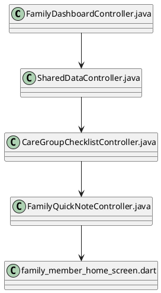
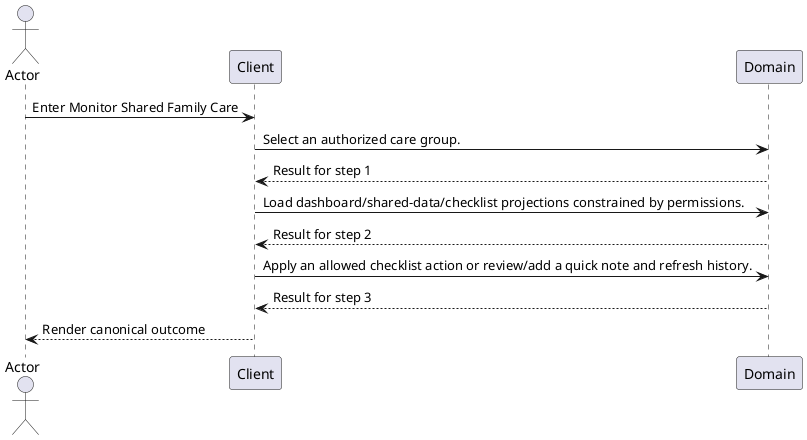
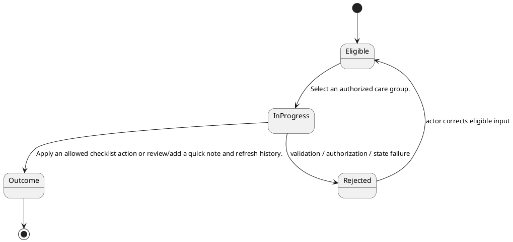

# ENGINEERING DOCUMENTATION STANDARD (EDS) v2.0

# TECHNICAL DESIGN SPECIFICATION — Monitor Shared Family Care

| Field | Value |
| --- | --- |
| Document ID | `UC-FM-05-TDS` |
| Version | `0.1` |
| Date | `2026-08-23` |
| Status | `Draft` |
| Function ID | `UC-FM-05` |
| Canonical Use Case | `UC-FM-05 — Monitor Shared Family Care` |
| Module / Bounded Context | `Family Cooperative Care` |
| Primary Actor | `Authorized Family Member / Mother` |
| Platforms | `Mobile / Backend` |
| Priority | `Medium` |
| Data Classification | `Restricted care-group relationship, shared-care task, appointment, note, permission, and consent-scoped data` |
| Compliance Scope | `PDPA relationship/consent scoping, least privilege, cross-member isolation, and auditability of permission-changing actions` |
| Owner | `CareBridge Team` |
| Reviewer / Approver |  |
| Source Baseline | Current worktree on `2026-08-23`; SRS `UC-FM-05`; exact evidence in Section 1.4 |

## CHANGELOG

| Version | Date | Author | Change | Status |
| --- | --- | --- | --- | --- |
| 0.1 | 2026-08-23 | CareBridge Team | Initial evidence-first full-form draft | Draft |

## TABLE OF CONTENTS

1. Module Overview
2. Traceability Matrix
3. Architecture Decision Records
4. Non-Functional Requirements and SLA
5. Static Modeling
6. Dynamic Modeling
7. Domain Event Catalog
8. Interface Specification
9. API Specification
10. Error Codes
11. Implementation and Deployment Plan
12. Rollback and Incident Runbook
13. Verification Scenario Groups
14. Verification Methods
15. Verification Samples
16. Authorization Matrix
17. AI Prompt Constraints — CASE 2.0

## 1. Module Overview

### 1.1 Actor Goal, Trigger, and Outcome

- **Goal:** View family dashboard projections, permitted shared maternal/baby data, care-group checklist state/actions, and quick-note history.
- **Trigger:** The actor enters Family home, care-group detail, shared-data, and quick-note history screens.
- **Outcome:** Apply an allowed checklist action or review/add a quick note and refresh history.
- **Current state:** `High` confidence from reachable code/test audit; no manifest-level exclusion is recorded.
- **Target state:** Preserve current code-backed behavior and resolve only explicitly evidenced limitations through approved implementation work.

### 1.2 Scope

**In scope**

- Family home, care-group detail, shared-data, and quick-note history screens

- GET `/api/v1/family/dashboard`
- GET `/api/v1/care-groups/{groupId}/shared-data`
- GET `/api/v1/care-groups/{careGroupId}/checklists/current/tasks`
- GET `/api/v1/care-groups/{careGroupId}/checklists/history`
- POST `/api/v1/care-groups/{careGroupId}/checklists/tasks/{taskId}/actions`
- Quick-note endpoints under `/api/v1/care-groups/{careGroupId}/quick-notes`

**Out of scope / limitations**

- Not applicable — no manifest-level exclusion is recorded. Scope is limited to the entry points and exact contracts listed above; unrelated handlers in the same module are excluded.

### 1.3 Preconditions and Postconditions

| Type | Condition |
| --- | --- |
| Precondition | Authorized Family Member / Mother is authenticated/authorized where the current contract requires it. |
| Precondition | Required ownership, membership, consent, resource state, and device/provider prerequisites pass current policies. |
| Postcondition | Apply an allowed checklist action or review/add a quick note and refresh history. |
| Postcondition | No side effect outside the feature-owned persistence/event/provider boundary occurs. |

### 1.4 Evidence Baseline

| Source ID | Type | Exact path | Revision | Authority |
| --- | --- | --- | --- | --- |
| `SRC-SRS-01` | Requirement | `02_Requirements/SRS/Report3_Functional_Specifications.md` — UC-FM-05 | 2026-08-23 | Draft code-first requirement |
| `SRC-CODE-01` | Current code | `05_Development/CareBridgeAPI/src/main/java/com/carebridge/backend/family/controller/FamilyDashboardController.java` | Worktree `2026-08-23` | Current-state evidence |
| `SRC-CODE-02` | Current code | `05_Development/CareBridgeAPI/src/main/java/com/carebridge/backend/family/controller/SharedDataController.java` | Worktree `2026-08-23` | Current-state evidence |
| `SRC-CODE-03` | Current code | `05_Development/CareBridgeAPI/src/main/java/com/carebridge/backend/checklist/today/controller/CareGroupChecklistController.java` | Worktree `2026-08-23` | Current-state evidence |
| `SRC-CODE-04` | Current code | `05_Development/CareBridgeAPI/src/main/java/com/carebridge/backend/family/controller/FamilyQuickNoteController.java` | Worktree `2026-08-23` | Current-state evidence |
| `SRC-CODE-05` | Current code | `05_Development/CareBridgeMobileApp/lib/features/home/screens/family_member_home_screen.dart` | Worktree `2026-08-23` | Current-state evidence |
| `SRC-TEST-01` | Existing test | `05_Development/CareBridgeAPI/src/test/java/com/carebridge/backend/family/service/FamilyDashboardServiceTest.java` | Worktree `2026-08-23` | Current-state evidence |
| `SRC-TEST-02` | Existing test | `05_Development/CareBridgeAPI/src/test/java/com/carebridge/backend/family/service/SharedDataServiceImplTest.java` | Worktree `2026-08-23` | Current-state evidence |
| `SRC-TEST-03` | Existing test | `05_Development/CareBridgeAPI/src/test/java/com/carebridge/backend/family/service/FamilyQuickNoteServiceTest.java` | Worktree `2026-08-23` | Current-state evidence |
| `SRC-TEST-04` | Existing test | `05_Development/CareBridgeMobileApp/test/features/familySync/family_dashboard_contract_test.dart` | Worktree `2026-08-23` | Current-state evidence |
| `SRC-ERROR-01` | Current exception advice | `05_Development/CareBridgeAPI/src/main/java/com/carebridge/backend/common/exception/GlobalExceptionHandler.java` | Worktree `2026-08-23` | Current-state evidence |

### 1.5 Open Contradictions / Questions

- No material contradiction was found among the exact sources cited in Section 1.4. Behavior not evidenced by those sources is not approved or implied by this Draft.

## 2. Traceability Matrix

| Requirement | Behavior | Exact oracle source | Component | Test condition / case |
| --- | --- | --- | --- | --- |
| `UC-FM-05-FR-01` | Select an authorized care group. | `02_Requirements/SRS/Report3_Functional_Specifications.md` — UC-FM-05 Normal Flow 1 | `05_Development/CareBridgeAPI/src/main/java/com/carebridge/backend/checklist/today/controller/CareGroupChecklistController.java` | `COND-01` / `UC-FM-05-TC-001` |
| `UC-FM-05-FR-02` | Load dashboard/shared-data/checklist projections constrained by permissions. | `02_Requirements/SRS/Report3_Functional_Specifications.md` — UC-FM-05 Normal Flow 2 | `05_Development/CareBridgeAPI/src/main/java/com/carebridge/backend/checklist/today/controller/CareGroupChecklistController.java` | `COND-02` / `UC-FM-05-TC-002` |
| `UC-FM-05-FR-03` | Apply an allowed checklist action or review/add a quick note and refresh history. | `02_Requirements/SRS/Report3_Functional_Specifications.md` — UC-FM-05 Normal Flow 3 | `05_Development/CareBridgeAPI/src/main/java/com/carebridge/backend/checklist/today/controller/CareGroupChecklistController.java` | `COND-03` / `UC-FM-05-TC-003` |
| `BR-01` | Membership, permission, and consent are rechecked for every projection. | `05_Development/CareBridgeAPI/src/main/java/com/carebridge/backend/checklist/today/controller/CareGroupChecklistController.java` | `05_Development/CareBridgeAPI/src/main/java/com/carebridge/backend/checklist/today/controller/CareGroupChecklistController.java` | `COND-BR-01` / `UC-FM-05-TC-BR-001` |
| `BR-02` | Family emergency alerts are specified under UC-ES-03, not duplicated here. | `05_Development/CareBridgeAPI/src/main/java/com/carebridge/backend/family/controller/FamilyDashboardController.java` | `05_Development/CareBridgeAPI/src/main/java/com/carebridge/backend/family/controller/FamilyDashboardController.java` | `COND-BR-02` / `UC-FM-05-TC-BR-002` |

## 3. Architecture Decision Records (ADR)

### ADR-UC-FM-05-01 — Use a distinct actor-goal boundary

| Item | Decision |
| --- | --- |
| Context | The retired 43-UC catalogue grouped multiple triggers, lifecycles, and permission boundaries, making implementation/test traceability generic. |
| Options | Keep the broad catalogue; split by screen; split by actor goal plus lifecycle/security boundary. |
| Decision | Use `UC-FM-05 — Monitor Shared Family Care` as the canonical boundary because its operations share the stated actor outcome and current implementation evidence. |
| Consequences | Related supporting screens/endpoints stay in one TDS; different lifecycle/actor outcomes have separate UCs. |
| Source / Status | SRS Section 3.1 and current code audit / Draft |

### ADR-UC-FM-05-02 — Preserve unknowns as Open

| Item | Decision |
| --- | --- |
| Context | Exact schema fields, SLA values, and some controller error codes are not fully evidenced by this manifest alone. |
| Decision | Do not invent them. Mark them `Open` and require the exact DTO/entity/migration/policy oracle before production-code changes. |
| Consequences | This document accurately characterizes current scope; unresolved design-changing items block implementation approval. |
| Source / Status | `create-specs` evidence discipline / Draft |

## 4. Non-Functional Requirements and SLA

| NFR | Target | Oracle Source | Verification |
| --- | --- | --- | --- |
| Authorization / isolation | All requests follow exact role/ownership/membership/consent policy in current code. | `05_Development/CareBridgeAPI/src/main/java/com/carebridge/backend/family/controller/FamilyDashboardController.java` | Negative security cases in paired Test-Spec |
| Protected-data handling | No secrets or unnecessary health/location/identity/conversation/file payloads in logs, fixtures, screenshots, or audit detail. | Data classification header plus exact Section 9 request/response field inventories | Log/fixture review plus security tests |
| Availability / latency | Open — no approved feature-specific numeric SLA found. | Evidence needed: approved NFR/SLA source | Measure only; do not assert a fixed threshold |
| Accessibility | Open — confirm project-standard criteria for reachable UI surfaces. | Evidence needed: approved UX/accessibility standard | Applicable Web/Mobile UI checks |
| Retry / idempotency | Apply only semantics explicitly implemented by the owning service. | No explicit lock/version/idempotency marker is evidenced in the cited implementation sources; preserve observed behavior and add characterization before changing concurrency semantics | State/duplicate/concurrency cases where applicable |

## 5. Static Modeling

### 5.1 Component Responsibilities and Change Disposition

| Exact path | Disposition | Responsibility |
| --- | --- | --- |
| `05_Development/CareBridgeAPI/src/main/java/com/carebridge/backend/family/controller/FamilyDashboardController.java` | Reuse | Current implementation evidence for Monitor Shared Family Care; inspect the exact symbol before implementation changes. |
| `05_Development/CareBridgeAPI/src/main/java/com/carebridge/backend/family/controller/SharedDataController.java` | Reuse | Current implementation evidence for Monitor Shared Family Care; inspect the exact symbol before implementation changes. |
| `05_Development/CareBridgeAPI/src/main/java/com/carebridge/backend/checklist/today/controller/CareGroupChecklistController.java` | Reuse | Current implementation evidence for Monitor Shared Family Care; inspect the exact symbol before implementation changes. |
| `05_Development/CareBridgeAPI/src/main/java/com/carebridge/backend/family/controller/FamilyQuickNoteController.java` | Reuse | Current implementation evidence for Monitor Shared Family Care; inspect the exact symbol before implementation changes. |
| `05_Development/CareBridgeMobileApp/lib/features/home/screens/family_member_home_screen.dart` | Reuse | Current implementation evidence for Monitor Shared Family Care; inspect the exact symbol before implementation changes. |

### 5.2 Current Component Diagram

### 5.3 Data / Schema / Migration Assessment

| Item | Assessment |
| --- | --- |
| Current stores/entities | `05_Development/CareBridgeAPI/src/main/java/com/carebridge/backend/family/entity/SharedDataCategory.java`; `05_Development/CareBridgeAPI/src/main/java/com/carebridge/backend/health/entity/MetricType.java` |
| Sensitive fields | Restricted care-group relationship, shared-care task, appointment, note, permission, and consent-scoped data. Exact transport fields and validators are enumerated per handler in Section 9; entity-only fields require the cited service/entity source before a schema change. |
| Schema delta for documentation alignment | Not applicable — this Draft does not change runtime schema. |
| Future implementation migration | Use additive, versioned migrations only when an approved behavior requires schema change. |
| V1 synchronization | Not applicable — this documentation alignment changes no schema; any future schema work must inspect current Flyway history and must never rewrite an applied migration. |

## 6. Dynamic Modeling

### 6.1 Happy Path Sequence

### 6.2 Alternative, Error, Retry, and Concurrency Flows

| Flow | Expected design behavior | Oracle |
| --- | --- | --- |
| Cancel before mutation | No unintended write or provider side effect. | SRS UC-FM-05 Alternative Flow |
| Invalid input/state | Reject with the current contract; keep canonical state unchanged. | `05_Development/CareBridgeAPI/src/main/java/com/carebridge/backend/family/controller/FamilyDashboardController.java` |
| Wrong actor/scope | Fail closed without protected resource disclosure. | `05_Development/CareBridgeAPI/src/main/java/com/carebridge/backend/family/controller/FamilyDashboardController.java` |
| Dependency failure | Use only the implemented bounded fallback/retry; never report false success. | Not applicable at this cited baseline — no external adapter/provider import is evidenced in the listed implementation sources |
| Duplicate/concurrent mutation | Apply only current lock/version/idempotency semantics. | No explicit lock/version/idempotency marker is evidenced in the cited implementation sources; preserve observed behavior and add characterization before changing concurrency semantics |

### 6.3 State Model and Invariants

- Membership, permission, and consent are rechecked for every projection.
- Family emergency alerts are specified under UC-ES-03, not duplicated here.

## 7. Domain Event Catalog

| Direction | Event | Producer / Consumer | Payload / delivery / idempotency |
| --- | --- | --- | --- |
| Publish / consume | Current event evidence | Not applicable at this cited baseline — no event type, publisher, or listener is evidenced in the listed implementation sources | Preserve only events evidenced by the cited source set; if later call-path inspection finds none, the flow remains synchronous. |

## 8. Interface Specification

### 8.1 User / Operator Interfaces

| # | Entry point | Actor | Contract |
| ---: | --- | --- | --- |
| 1 | Family home, care-group detail, shared-data, and quick-note history screens | Authorized Family Member / Mother | Reachable current entry point |

### 8.2 Service / Repository Interfaces

| Interface evidence | Required responsibility |
| --- | --- |
| `05_Development/CareBridgeAPI/src/main/java/com/carebridge/backend/family/controller/FamilyDashboardController.java` | Support the mapped operations without broadening authorization or lifecycle semantics. |
| `05_Development/CareBridgeAPI/src/main/java/com/carebridge/backend/family/controller/SharedDataController.java` | Support the mapped operations without broadening authorization or lifecycle semantics. |
| `05_Development/CareBridgeAPI/src/main/java/com/carebridge/backend/checklist/today/controller/CareGroupChecklistController.java` | Support the mapped operations without broadening authorization or lifecycle semantics. |
| `05_Development/CareBridgeAPI/src/main/java/com/carebridge/backend/family/controller/FamilyQuickNoteController.java` | Support the mapped operations without broadening authorization or lifecycle semantics. |
| `05_Development/CareBridgeMobileApp/lib/features/home/screens/family_member_home_screen.dart` | Support the mapped operations without broadening authorization or lifecycle semantics. |

## 9. API Specification

| ID | Method / path or grouped controller surface | Auth / role | Request / response / errors |
| --- | --- | --- | --- |
| `API-01` | `GET /api/v1/care-groups/{careGroupId}/checklists/current/tasks` | hasRole('FAMILY') | Handler `getCurrentTasks`; parameters: path `careGroupId`: `UUID`; query `date`: `LocalDate`; context `timezone`: `String`; principal `principal`: `Principal`; request body: `None`; request fields/validation: Not applicable — no request body; response: `CurrentChecklistResponse`; response payload fields: `asOf`: `Instant` (no field annotation in current DTO); `zoneId`: `String` (no field annotation in current DTO); `horizonDays`: `int` (no field annotation in current DTO); `sections`: `CurrentChecklistSections` (no field annotation in current DTO); `counts`: `TodayTaskCounts` (no field annotation in current DTO); `correlationId`: `UUID` (no field annotation in current DTO); `sequence`: `TodaySequenceProjection` (no field annotation in current DTO); explicit/documented statuses: `Not explicit in handler syntax; inherited from framework/advice`; source: `05_Development/CareBridgeAPI/src/main/java/com/carebridge/backend/checklist/today/controller/CareGroupChecklistController.java` |
| `API-02` | `GET /api/v1/care-groups/{careGroupId}/checklists/history` | hasRole('FAMILY') | Handler `listHistory`; parameters: path `careGroupId`: `UUID`; query `page`: `int`; query `size`: `int`; query `targetSubject`: `ChecklistTargetSubject`; principal `principal`: `Principal`; request body: `None`; request fields/validation: Not applicable — no request body; response: `ResponseEntity<ApiResponse<ChecklistHistoryPageResponse>>`; response payload fields: `items`: `List<ChecklistHistoryItemResponse>` (no field annotation in current DTO); `page`: `int` (no field annotation in current DTO); `size`: `int` (no field annotation in current DTO); `totalElements`: `long` (no field annotation in current DTO); `totalPages`: `int` (no field annotation in current DTO); explicit/documented statuses: `200`; source: `05_Development/CareBridgeAPI/src/main/java/com/carebridge/backend/checklist/today/controller/CareGroupChecklistController.java` |
| `API-03` | `POST /api/v1/care-groups/{careGroupId}/checklists/tasks/{taskId}/actions` | hasRole('FAMILY') | Handler `applyAction`; parameters: path `careGroupId`: `UUID`; path `taskId`: `UUID`; body `request`: `TaskActionRequest`; principal `principal`: `Principal`; request body: `TaskActionRequest`; request fields/validation: `action`: `TaskAction` (@NotNull); `clientRequestId`: `UUID` (@NotNull); `reason`: `String` (@Pattern(regexp = "^[A-Z0-9_]{1,80}$")); response: `CurrentChecklistActionResponse`; response payload fields: `taskId`: `UUID` (no field annotation in current DTO); `instanceId`: `UUID` (no field annotation in current DTO); `action`: `TaskAction` (no field annotation in current DTO); `previousStatus`: `String` (no field annotation in current DTO); `status`: `String` (no field annotation in current DTO); `appliedAt`: `Instant` (no field annotation in current DTO); `idempotentReplay`: `boolean` (no field annotation in current DTO); `correlationId`: `UUID` (no field annotation in current DTO); explicit/documented statuses: `Not explicit in handler syntax; inherited from framework/advice`; source: `05_Development/CareBridgeAPI/src/main/java/com/carebridge/backend/checklist/today/controller/CareGroupChecklistController.java` |
| `API-04` | `GET /api/v1/care-groups/{careGroupId}/quick-notes` | hasAnyRole('MOTHER', 'FAMILY') | Handler `getHistory`; parameters: path `careGroupId`: `UUID`; query `metricType`: `MetricType`; query `from`: `Instant`; query `to`: `Instant`; principal `principal`: `Principal`; request body: `None`; request fields/validation: Not applicable — no request body; response: `ResponseEntity<ApiResponse<MetricTrendResponse>>`; response payload fields: `metricType`: `String` (no field annotation in current DTO); `unit`: `String` (no field annotation in current DTO); `dataPoints`: `List<MetricDataPoint>` (no field annotation in current DTO); `disclaimer`: `String` (no field annotation in current DTO); explicit/documented statuses: `200`; source: `05_Development/CareBridgeAPI/src/main/java/com/carebridge/backend/family/controller/FamilyQuickNoteController.java` |
| `API-05` | `GET /api/v1/care-groups/{groupId}/shared-data` | isAuthenticated() | Handler `getSharedData`; parameters: path `groupId`: `UUID`; query `category`: `String`; query `page`: `int`; query `size`: `int`; principal `principal`: `Principal`; request body: `None`; request fields/validation: Not applicable — no request body; response: `ResponseEntity<ApiResponse<SharedDataResponse>>`; response payload fields: `groupId`: `UUID` (no field annotation in current DTO); `category`: `String` (no field annotation in current DTO); `totalItems`: `int` (no field annotation in current DTO); `items`: `List<SharedDataItemDto>` (no field annotation in current DTO); `asOf`: `Instant` (no field annotation in current DTO); explicit/documented statuses: `200`; source: `05_Development/CareBridgeAPI/src/main/java/com/carebridge/backend/family/controller/SharedDataController.java` |
| `API-06` | `GET /api/v1/family/dashboard` | isAuthenticated() | Handler `getDashboard`; parameters: query `selectedCareGroupId`: `UUID`; principal `principal`: `Principal`; request body: `None`; request fields/validation: Not applicable — no request body; response: `ResponseEntity<ApiResponse<FamilyDashboardResponse>>`; response payload fields: `groups`: `List<Group>` (no field annotation in current DTO); `globalAggregate`: `Aggregate` (no field annotation in current DTO); `selectedCareGroupId`: `UUID` (no field annotation in current DTO); `selectedGroupDetail`: `Detail` (no field annotation in current DTO); explicit/documented statuses: `200`; source: `05_Development/CareBridgeAPI/src/main/java/com/carebridge/backend/family/controller/FamilyDashboardController.java` |

Method-level Spring handlers, authorization annotations, request DTO fields/validators, response payload fields, and explicit/documented statuses above were extracted from the cited current source. Service/advice-only application error codes are not claimed where the controller does not declare them.

### 9.1 Handler Contract — `GET /api/v1/care-groups/{careGroupId}/checklists/current/tasks`

| Item | Exact current contract |
| --- | --- |
| Handler | `getCurrentTasks` |
| Source | `05_Development/CareBridgeAPI/src/main/java/com/carebridge/backend/checklist/today/controller/CareGroupChecklistController.java` |
| Authorization annotation / boundary | hasRole('FAMILY') |
| Parameters | path `careGroupId`: `UUID`; query `date`: `LocalDate`; context `timezone`: `String`; principal `principal`: `Principal` |
| Request body type | `None` |
| Request fields and validators | Not applicable — no request body |
| Response type | `CurrentChecklistResponse` |
| Response payload fields | `asOf`: `Instant` (no field annotation in current DTO); `zoneId`: `String` (no field annotation in current DTO); `horizonDays`: `int` (no field annotation in current DTO); `sections`: `CurrentChecklistSections` (no field annotation in current DTO); `counts`: `TodayTaskCounts` (no field annotation in current DTO); `correlationId`: `UUID` (no field annotation in current DTO); `sequence`: `TodaySequenceProjection` (no field annotation in current DTO) |
| Explicit/documented statuses | `Not explicit in handler syntax; inherited from framework/advice` |
| Positive test mapping | `COND-API-001` / `UC-FM-05-TC-API-001` |
| Negative test mapping | `COND-AUTH`; DTO/service-only negative paths require their exact cited oracle |

### 9.2 Handler Contract — `GET /api/v1/care-groups/{careGroupId}/checklists/history`

| Item | Exact current contract |
| --- | --- |
| Handler | `listHistory` |
| Source | `05_Development/CareBridgeAPI/src/main/java/com/carebridge/backend/checklist/today/controller/CareGroupChecklistController.java` |
| Authorization annotation / boundary | hasRole('FAMILY') |
| Parameters | path `careGroupId`: `UUID`; query `page`: `int`; query `size`: `int`; query `targetSubject`: `ChecklistTargetSubject`; principal `principal`: `Principal` |
| Request body type | `None` |
| Request fields and validators | Not applicable — no request body |
| Response type | `ResponseEntity<ApiResponse<ChecklistHistoryPageResponse>>` |
| Response payload fields | `items`: `List<ChecklistHistoryItemResponse>` (no field annotation in current DTO); `page`: `int` (no field annotation in current DTO); `size`: `int` (no field annotation in current DTO); `totalElements`: `long` (no field annotation in current DTO); `totalPages`: `int` (no field annotation in current DTO) |
| Explicit/documented statuses | `200` |
| Positive test mapping | `COND-API-002` / `UC-FM-05-TC-API-002` |
| Negative test mapping | `COND-AUTH`; DTO/service-only negative paths require their exact cited oracle |

### 9.3 Handler Contract — `POST /api/v1/care-groups/{careGroupId}/checklists/tasks/{taskId}/actions`

| Item | Exact current contract |
| --- | --- |
| Handler | `applyAction` |
| Source | `05_Development/CareBridgeAPI/src/main/java/com/carebridge/backend/checklist/today/controller/CareGroupChecklistController.java` |
| Authorization annotation / boundary | hasRole('FAMILY') |
| Parameters | path `careGroupId`: `UUID`; path `taskId`: `UUID`; body `request`: `TaskActionRequest`; principal `principal`: `Principal` |
| Request body type | `TaskActionRequest` |
| Request fields and validators | `action`: `TaskAction` (@NotNull); `clientRequestId`: `UUID` (@NotNull); `reason`: `String` (@Pattern(regexp = "^[A-Z0-9_]{1,80}$")) |
| Response type | `CurrentChecklistActionResponse` |
| Response payload fields | `taskId`: `UUID` (no field annotation in current DTO); `instanceId`: `UUID` (no field annotation in current DTO); `action`: `TaskAction` (no field annotation in current DTO); `previousStatus`: `String` (no field annotation in current DTO); `status`: `String` (no field annotation in current DTO); `appliedAt`: `Instant` (no field annotation in current DTO); `idempotentReplay`: `boolean` (no field annotation in current DTO); `correlationId`: `UUID` (no field annotation in current DTO) |
| Explicit/documented statuses | `Not explicit in handler syntax; inherited from framework/advice` |
| Positive test mapping | `COND-API-003` / `UC-FM-05-TC-API-003` |
| Negative test mapping | `COND-API-003-VAL` / `UC-FM-05-TC-API-003-VAL`; plus `COND-AUTH` for protected access |

### 9.4 Handler Contract — `GET /api/v1/care-groups/{careGroupId}/quick-notes`

| Item | Exact current contract |
| --- | --- |
| Handler | `getHistory` |
| Source | `05_Development/CareBridgeAPI/src/main/java/com/carebridge/backend/family/controller/FamilyQuickNoteController.java` |
| Authorization annotation / boundary | hasAnyRole('MOTHER', 'FAMILY') |
| Parameters | path `careGroupId`: `UUID`; query `metricType`: `MetricType`; query `from`: `Instant`; query `to`: `Instant`; principal `principal`: `Principal` |
| Request body type | `None` |
| Request fields and validators | Not applicable — no request body |
| Response type | `ResponseEntity<ApiResponse<MetricTrendResponse>>` |
| Response payload fields | `metricType`: `String` (no field annotation in current DTO); `unit`: `String` (no field annotation in current DTO); `dataPoints`: `List<MetricDataPoint>` (no field annotation in current DTO); `disclaimer`: `String` (no field annotation in current DTO) |
| Explicit/documented statuses | `200` |
| Positive test mapping | `COND-API-004` / `UC-FM-05-TC-API-004` |
| Negative test mapping | `COND-AUTH`; DTO/service-only negative paths require their exact cited oracle |

### 9.5 Handler Contract — `GET /api/v1/care-groups/{groupId}/shared-data`

| Item | Exact current contract |
| --- | --- |
| Handler | `getSharedData` |
| Source | `05_Development/CareBridgeAPI/src/main/java/com/carebridge/backend/family/controller/SharedDataController.java` |
| Authorization annotation / boundary | isAuthenticated() |
| Parameters | path `groupId`: `UUID`; query `category`: `String`; query `page`: `int`; query `size`: `int`; principal `principal`: `Principal` |
| Request body type | `None` |
| Request fields and validators | Not applicable — no request body |
| Response type | `ResponseEntity<ApiResponse<SharedDataResponse>>` |
| Response payload fields | `groupId`: `UUID` (no field annotation in current DTO); `category`: `String` (no field annotation in current DTO); `totalItems`: `int` (no field annotation in current DTO); `items`: `List<SharedDataItemDto>` (no field annotation in current DTO); `asOf`: `Instant` (no field annotation in current DTO) |
| Explicit/documented statuses | `200` |
| Positive test mapping | `COND-API-005` / `UC-FM-05-TC-API-005` |
| Negative test mapping | `COND-AUTH`; DTO/service-only negative paths require their exact cited oracle |

### 9.6 Handler Contract — `GET /api/v1/family/dashboard`

| Item | Exact current contract |
| --- | --- |
| Handler | `getDashboard` |
| Source | `05_Development/CareBridgeAPI/src/main/java/com/carebridge/backend/family/controller/FamilyDashboardController.java` |
| Authorization annotation / boundary | isAuthenticated() |
| Parameters | query `selectedCareGroupId`: `UUID`; principal `principal`: `Principal` |
| Request body type | `None` |
| Request fields and validators | Not applicable — no request body |
| Response type | `ResponseEntity<ApiResponse<FamilyDashboardResponse>>` |
| Response payload fields | `groups`: `List<Group>` (no field annotation in current DTO); `globalAggregate`: `Aggregate` (no field annotation in current DTO); `selectedCareGroupId`: `UUID` (no field annotation in current DTO); `selectedGroupDetail`: `Detail` (no field annotation in current DTO) |
| Explicit/documented statuses | `200` |
| Positive test mapping | `COND-API-006` / `UC-FM-05-TC-API-006` |
| Negative test mapping | `COND-AUTH`; DTO/service-only negative paths require their exact cited oracle |

## 10. Error Codes

| Error class | HTTP / code | Trigger | Client behavior | Oracle |
| --- | --- | --- | --- | --- |
| Validation/business rule | `400` | Malformed field, range, enum, or rejected transition | Return the current stable error envelope without protected data or unintended mutation | `05_Development/CareBridgeAPI/src/main/java/com/carebridge/backend/common/exception/GlobalExceptionHandler.java`; application error code is limited to what those sources/advice explicitly declare |

## 11. Implementation and Deployment Plan

1. Preserve this current code-backed boundary and resolve every `Open` item that changes tests, schema, auth, API, or state.
2. Map exact DTO fields, service/repository symbols, migrations, events, and error codes from the listed evidence.
3. Write paired Test-Spec Red cases before production changes.
4. Implement only the approved gap; reuse current components listed in Section 5.
5. Run targeted and affected suites; record commands/counts only after execution.
6. Deploy compatible server/schema changes before clients that depend on them; preserve old-client compatibility where required.

## 12. Rollback and Incident Runbook

| Trigger | Safe rollback / containment | Verification |
| --- | --- | --- |
| Documentation error | Revert only this generated pair/manifest change to the last reviewed version. | Regenerate and run document validators. |
| Client regression | Disable/revert the feature-owned client change while keeping compatible server contracts. | Targeted route/widget/component tests. |
| Server regression | Revert the feature-owned change or deploy a forward corrective fix. | Targeted backend/AI suite and smoke contract. |
| Schema issue | Stop rollout; restore through additive corrective migration or isolated backup procedure. Never edit applied Flyway history. | Migration validation and data-integrity checks. |
| Provider incident | Disable optional integration or use only the approved degraded mode. | Provider-fake/sandbox contract tests. |

## 13. Verification Scenario Groups

| Group | Behavior | Condition | Test case |
| --- | --- | --- | --- |
| `VG-01` | Select an authorized care group. | `COND-01` | `UC-FM-05-TC-001` |
| `VG-02` | Load dashboard/shared-data/checklist projections constrained by permissions. | `COND-02` | `UC-FM-05-TC-002` |
| `VG-03` | Apply an allowed checklist action or review/add a quick note and refresh history. | `COND-03` | `UC-FM-05-TC-003` |
| `VG-AUTH` | Reject wrong authentication/role/ownership/membership/consent scope | `COND-AUTH` | `UC-FM-05-TC-SEC-001` |
| `VG-GAP` | Characterize each known gap without claiming a false completed path | `COND-GAP` | `UC-FM-05-TC-GAP-001` |

## 14. Verification Methods

Existing focused evidence:

- `05_Development/CareBridgeAPI/src/test/java/com/carebridge/backend/family/service/FamilyDashboardServiceTest.java`
- `05_Development/CareBridgeAPI/src/test/java/com/carebridge/backend/family/service/SharedDataServiceImplTest.java`
- `05_Development/CareBridgeAPI/src/test/java/com/carebridge/backend/family/service/FamilyQuickNoteServiceTest.java`
- `05_Development/CareBridgeMobileApp/test/features/familySync/family_dashboard_contract_test.dart`

Exact supported commands derived from the audited test paths:

- `cd 05_Development/CareBridgeAPI && ./mvnw -Dtest=FamilyDashboardServiceTest test`
- `cd 05_Development/CareBridgeAPI && ./mvnw -Dtest=SharedDataServiceImplTest test`
- `cd 05_Development/CareBridgeAPI && ./mvnw -Dtest=FamilyQuickNoteServiceTest test`
- `cd 05_Development/CareBridgeMobileApp && flutter test test/features/familySync/family_dashboard_contract_test.dart`

Record pass/fail/skip counts only after executing these commands on the exact revision.

## 15. Verification Samples

| Sample | Value |
| --- | --- |
| Primary contract | GET `/api/v1/family/dashboard` |
| Request | `GET /api/v1/care-groups/{careGroupId}/checklists/current/tasks` → `getCurrentTasks`; `None` with Not applicable — no request body; authorization: hasRole('FAMILY'). |
| Success response | `CurrentChecklistResponse` with `asOf`: `Instant` (no field annotation in current DTO); `zoneId`: `String` (no field annotation in current DTO); `horizonDays`: `int` (no field annotation in current DTO); `sections`: `CurrentChecklistSections` (no field annotation in current DTO); `counts`: `TodayTaskCounts` (no field annotation in current DTO); `correlationId`: `UUID` (no field annotation in current DTO); `sequence`: `TodaySequenceProjection` (no field annotation in current DTO); explicit/documented statuses `Not explicit in handler syntax; inherited from framework/advice`. |
| Negative sample | Use wrong role/owner/state and assert the exact mapped error without protected payload. |

## 16. Authorization Matrix

| Actor / role | Operation | Decision |
| --- | --- | --- |
| Authorized Family Member / Mother | `GET /api/v1/care-groups/{careGroupId}/checklists/current/tasks` | hasRole('FAMILY'); handler oracle `05_Development/CareBridgeAPI/src/main/java/com/carebridge/backend/checklist/today/controller/CareGroupChecklistController.java` |
| Authorized Family Member / Mother | `GET /api/v1/care-groups/{careGroupId}/checklists/history` | hasRole('FAMILY'); handler oracle `05_Development/CareBridgeAPI/src/main/java/com/carebridge/backend/checklist/today/controller/CareGroupChecklistController.java` |
| Authorized Family Member / Mother | `POST /api/v1/care-groups/{careGroupId}/checklists/tasks/{taskId}/actions` | hasRole('FAMILY'); handler oracle `05_Development/CareBridgeAPI/src/main/java/com/carebridge/backend/checklist/today/controller/CareGroupChecklistController.java` |
| Authorized Family Member / Mother | `GET /api/v1/care-groups/{careGroupId}/quick-notes` | hasAnyRole('MOTHER', 'FAMILY'); handler oracle `05_Development/CareBridgeAPI/src/main/java/com/carebridge/backend/family/controller/FamilyQuickNoteController.java` |
| Authorized Family Member / Mother | `GET /api/v1/care-groups/{groupId}/shared-data` | isAuthenticated(); handler oracle `05_Development/CareBridgeAPI/src/main/java/com/carebridge/backend/family/controller/SharedDataController.java` |
| Authorized Family Member / Mother | `GET /api/v1/family/dashboard` | isAuthenticated(); handler oracle `05_Development/CareBridgeAPI/src/main/java/com/carebridge/backend/family/controller/FamilyDashboardController.java` |
| Unauthenticated / wrong role / wrong owner-member | All protected operations | Deny without resource disclosure |

## 17. AI Prompt Constraints — CASE 2.0

- Not applicable — this UC does not generate clinical AI output. Generic documentation assistance remains evidence-first.

### Quality and Anti-Pattern Checklist

- [ ] All 17 sections remain present.
- [ ] Every known semantic value has an exact source; unresolved values are `Open` with evidence needed.
- [ ] Requirement → component → condition → test traceability is preserved.
- [ ] No historical pass count, SLA, accuracy, or provider claim is copied without current evidence.
- [ ] No generic endpoint group is treated as an implementation-ready field/error contract.
- [ ] No production code, schema, or immutable AI architecture source is modified by spec generation.
