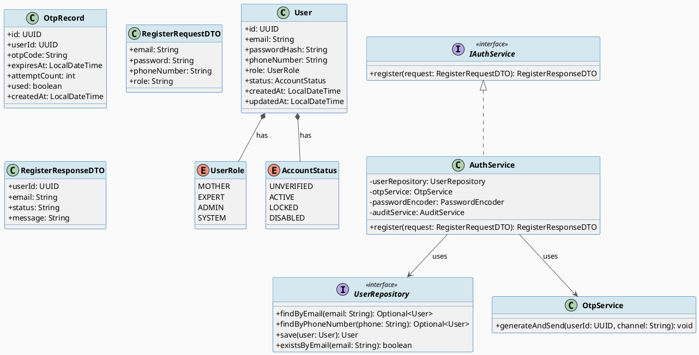
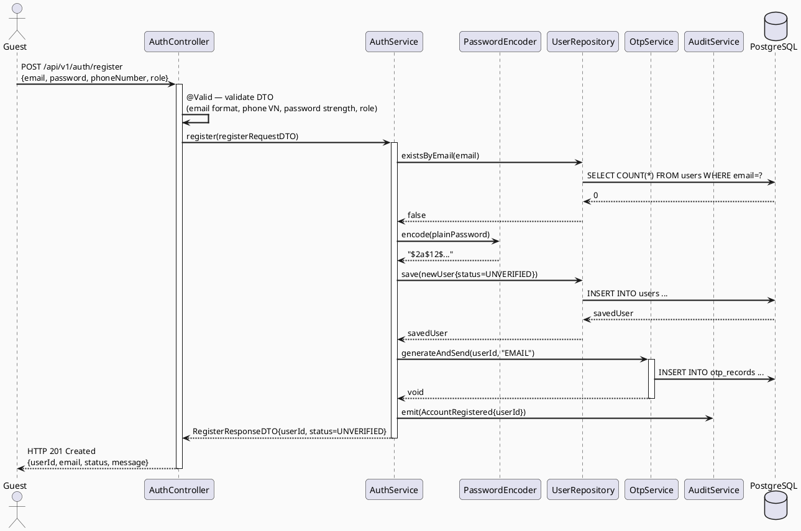
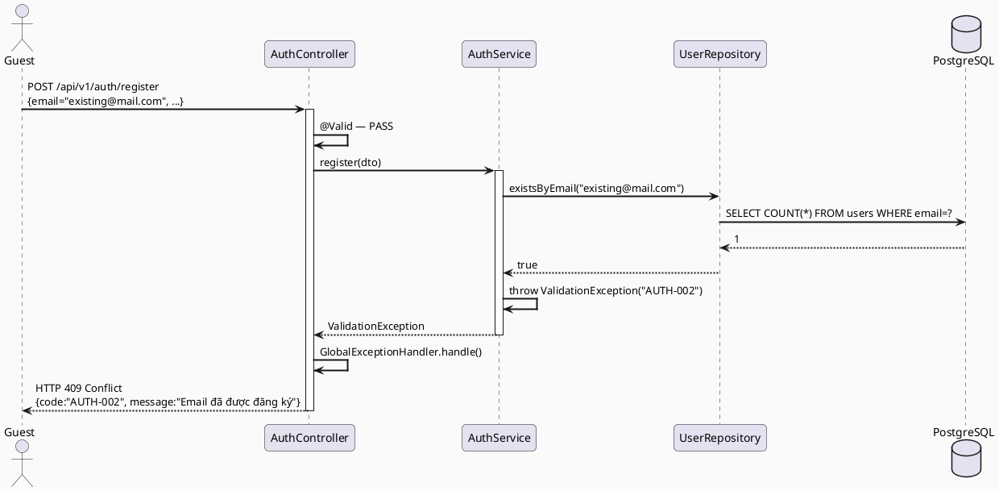
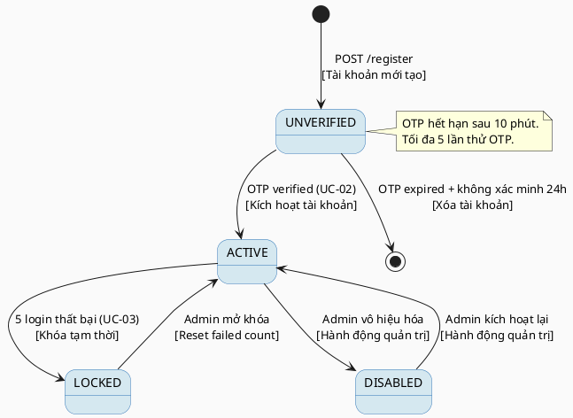

# ENGINEERING DOCUMENTATION STANDARD (EDS) v2.0
# Technical Design Specification — UC-01 Register Account

| Field | Value |
|-------|-------|
| **Document ID** | `CB-AUTH-IMP-001` |
| **Version** | `1.0` |
| **Date** | `2026-06-26` |
| **Status** | `Approved` |
| **Document Owner** | `PhuongNT` |
| **Author** | `AI Agent` |
| **Reviewed by** | `[Tech Lead]` |
| **DPO Sign-off** | `[ ] Pending` |
| **Approved by** | `[Principal Architect]` |
| **Last Review** | `2026-06-26` |
| **Based on EDS** | `v2.0` |

---

## CHANGELOG

| Ngày | Người thực hiện | Nội dung thay đổi |
|------|-----------------|-------------------|
| 2026-06-26 | AI Agent | Tạo tài liệu lần đầu cho UC-01 Register Account |

---

## MỤC LỤC

1. [Tổng quan Module](#1-tổng-quan-module)
2. [Ma trận Truy vết (Traceability Matrix)](#2-ma-trận-truy-vết-traceability-matrix)
3. [Architecture Decision Records (ADR)](#3-architecture-decision-records-adr)
4. [Non-Functional Requirements & SLA](#4-non-functional-requirements--sla)
5. [Static Modeling (Mô hình Tĩnh)](#5-static-modeling-mô-hình-tĩnh)
6. [Dynamic Modeling (Mô hình Động)](#6-dynamic-modeling-mô-hình-động)
7. [Domain Event Catalog](#7-domain-event-catalog)
8. [Interface Specification (Đặc tả Giao diện)](#8-interface-specification-đặc-tả-giao-diện)
9. [API Specification](#9-api-specification)
10. [Bảng mã lỗi (Error Codes)](#10-bảng-mã-lỗi-error-codes)
11. [Quy trình Triển khai (Step-by-Step)](#11-quy-trình-triển-khai-step-by-step)
12. [Rollback & Incident Runbook](#12-rollback--incident-runbook)
13. [Kịch bản Kiểm thử Chi tiết](#13-kịch-bản-kiểm-thử-chi-tiết)
14. [Phương pháp Xác minh](#14-phương-pháp-xác-minh)
15. [Mẫu thử thực tế (API Verification Samples)](#15-mẫu-thử-thực-tế-api-verification-samples)
16. [Bảng tổng hợp phân quyền (Authorization Matrix)](#16-bảng-tổng-hợp-phân-quyền-authorization-matrix)
17. [AI Prompt Constraints (CASE 2.0)](#17-ai-prompt-constraints-case-20)

---

## 1. Tổng quan Module

| Field | Value |
|-------|-------|
| **Module Name** | `RegisterAccount` |
| **Bounded Context** | `auth` |
| **UC ID** | `UC-01` |
| **SRS Reference** | `3.1.1.1` |
| **Primary Actor** | `Guest (ROLE_GUEST — unauthenticated)` |
| **Platform** | `Web App + Mobile App` |
| **Data Classification** | `Sensitive-PII` |
| **Compliance Scope** | `BR-RBAC, BR-PRIVACY, PDPA` |
| **Upstream Dependencies** | `Firebase Cloud Messaging (OTP), Email SMTP (OTP delivery)` |
| **Downstream Consumers** | `auth (VerifyOTP), audit (SecurityEventLog), notification` |

**Mô tả:** Cho phép khách (GUEST) đăng ký tài khoản mới với email, mật khẩu, số điện thoại, và vai trò mong muốn (MOTHER hoặc EXPERT). Hệ thống tạo tài khoản ở trạng thái `UNVERIFIED` và gửi OTP qua Firebase/email để xác thực. Tài khoản chỉ được kích hoạt sau khi hoàn thành UC-02 Verify OTP.

---

## 2. Ma trận Truy vết (Traceability Matrix)

| Requirement ID | Loại | Mô tả yêu cầu | Thành phần Code | Compliance Target | ADR liên quan |
|----------------|------|---------------|-----------------|-------------------|---------------|
| UC-01 | Use Case | Guest đăng ký tài khoản | `AuthController.register()` | BR-RBAC | ADR-AUTH-001 |
| BR-AUTH-001 | Business Rule | Email phải duy nhất trong hệ thống | `AuthService.validateEmailUnique()` | Data Integrity | ADR-AUTH-001 |
| BR-AUTH-002 | Business Rule | Số điện thoại phải đúng định dạng Việt Nam | `@VietnamesePhoneNumber` trên DTO | Data Integrity | — |
| BR-AUTH-003 | Business Rule | Mật khẩu ≥ 8 ký tự, có chữ hoa + số + ký tự đặc biệt | `PasswordValidator.validate()` | Security | ADR-AUTH-002 |
| BR-AUTH-004 | Business Rule | Vai trò chỉ được là MOTHER hoặc EXPERT | `@ValidRole` annotation trên DTO | BR-RBAC | ADR-AUTH-001 |
| BR-AUTH-005 | Business Rule | Mật khẩu phải được hash trước khi lưu | `BCryptPasswordEncoder.encode()` | Security / PDPA | ADR-AUTH-002 |
| BR-AUTH-006 | Business Rule | Gửi OTP ngay sau khi tạo tài khoản | `OtpService.generateAndSend()` | — | ADR-AUTH-003 |
| BR-PRIVACY-001 | Business Rule | Không ghi password plain-text vào log | `@JsonIgnore` trên field password | PDPA | ADR-AUTH-002 |

---

## 3. Architecture Decision Records (ADR)

### ADR-AUTH-001 — Vai trò đăng ký được giới hạn ở MOTHER và EXPERT

| Field | Value |
|-------|-------|
| **Status** | `Accepted` |
| **Deciders** | `PhuongNT — Backend Lead` |
| **Date** | `2026-06-26` |
| **Supersedes** | `—` |

#### Bối cảnh (Context)
CareBridge là nền tảng y tế thai sản. Tài khoản ADMIN và SYSTEM không được phép tự đăng ký mà phải được cấp bởi quản trị viên nội bộ. Việc cho phép đăng ký tùy ý có thể tạo ra lỗ hổng leo thang quyền.

#### Các phương án đã xem xét (Options Considered)

| Phương án | Mô tả | Ưu điểm | Nhược điểm |
|-----------|-------|----------|------------|
| A | Chỉ cho phép đăng ký MOTHER và EXPERT | + Kiểm soát bảo mật chặt chẽ | - Cần flow riêng cho ADMIN |
| B | Cho phép đăng ký tất cả vai trò | + Đơn giản hóa | - Rủi ro leo thang quyền |

#### Quyết định (Decision)
Chọn **Phương án A**: Endpoint đăng ký chỉ chấp nhận `role ∈ {MOTHER, EXPERT}`. Validation thực hiện ở tầng DTO bằng `@Pattern` hoặc enum constraint.

#### Hệ quả (Consequences)

**Tích cực:**
- Ngăn chặn leo thang quyền từ phía ngoài
- Phù hợp nguyên tắc Least Privilege

**Tiêu cực / Trade-offs:**
- ADMIN phải được tạo thông qua quy trình nội bộ riêng

**Compliance Impact:**
- Tuân thủ BR-RBAC — không để người dùng tự cấp quyền cao hơn.

---

### ADR-AUTH-002 — BCrypt cho password hashing, không dùng MD5/SHA1

| Field | Value |
|-------|-------|
| **Status** | `Accepted` |
| **Deciders** | `PhuongNT — Backend Lead` |
| **Date** | `2026-06-26` |
| **Supersedes** | `—` |

#### Bối cảnh (Context)
Mật khẩu người dùng là PII nhạy cảm. MD5 và SHA1 đã bị crack. BCrypt có cost factor điều chỉnh được, phù hợp tiêu chuẩn OWASP.

#### Các phương án đã xem xét (Options Considered)

| Phương án | Mô tả | Ưu điểm | Nhược điểm |
|-----------|-------|----------|------------|
| A | BCrypt (cost=12) | + OWASP recommended, slow-by-design | - Tốn CPU hơn plain hash |
| B | SHA-256 + salt | + Nhanh hơn | - Susceptible to GPU brute force |

#### Quyết định (Decision)
Chọn **Phương án A** — `BCryptPasswordEncoder(12)` qua Spring Security.

#### Hệ quả (Consequences)

**Tích cực:**
- Chống brute force hiệu quả
- Không thể reverse-engineer plain password từ hash

**Tiêu cực / Trade-offs:**
- Tăng ~100ms latency cho login/register — chấp nhận được vì đây là auth operation

**Compliance Impact:**
- PDPA Art. 37 — bảo vệ dữ liệu bằng biện pháp kỹ thuật phù hợp.

---

### ADR-AUTH-003 — OTP gửi qua Firebase Cloud Messaging + Email SMTP

| Field | Value |
|-------|-------|
| **Status** | `Accepted` |
| **Deciders** | `PhuongNT — Backend Lead` |
| **Date** | `2026-06-26` |
| **Supersedes** | `—` |

#### Bối cảnh (Context)
Hệ thống cần xác minh tài khoản ngay sau khi đăng ký. OTP cần được gửi đến người dùng qua kênh đáng tin cậy.

#### Các phương án đã xem xét (Options Considered)

| Phương án | Mô tả | Ưu điểm | Nhược điểm |
|-----------|-------|----------|------------|
| A | Firebase (SMS/Push) + Email SMTP | + Đa kênh, đã có trong stack | - Phụ thuộc Firebase availability |
| B | SMS-only qua Twilio | + Đơn giản hơn | - Chi phí cao, không có sẵn |

#### Quyết định (Decision)
Chọn **Phương án A**: OTP gửi qua Firebase FCM (mobile) và Gmail SMTP (email).

#### Hệ quả (Consequences)

**Tích cực:**
- Tái sử dụng infrastructure đã có
- Hỗ trợ cả mobile và web

**Tiêu cực / Trade-offs:**
- Cần fallback nếu Firebase down — log lỗi và trả HTTP 503

---

## 4. Non-Functional Requirements & SLA

### 4.1. Performance & Availability

| Category | Requirement | Target SLA | Measurement Method | Compliance Basis |
|----------|-------------|------------|---------------------|------------------|
| Latency | API response (p99) | `< 300ms` (không tính BCrypt) | k6 load test | — |
| Availability | Uptime (monthly) | `99.9%` | Uptime monitor | — |
| Throughput | Concurrent registrations | `100 req/s` | Load test | — |

### 4.2. Data Integrity & Retention

| Category | Requirement | Target | Verification Method | Compliance Basis |
|----------|-------------|--------|---------------------|------------------|
| Uniqueness | Email unique | 100% | DB UNIQUE constraint | Data Integrity |
| Retention | Audit log retention | 7 năm | DB backup policy | PDPA |
| OTP Expiry | OTP hết hạn sau 10 phút | 100% | Unit test | BR-AUTH-006 |

### 4.3. Security

| Category | Requirement | Target | Verification Method | Compliance Basis |
|----------|-------------|--------|---------------------|------------------|
| Password | BCrypt cost ≥ 12 | 100% | Code review | OWASP ASVS |
| Encryption in transit | TLS 1.3+ | 100% | SSL Labs scan | PDPA |
| Password in log | Không xuất hiện | 0 instance | Log scan | PDPA |

### 4.4. Scalability & Capacity Planning

Dự kiến 10,000 đăng ký/tháng đầu. OTP gửi qua Firebase — scale tự động. BCrypt là bottleneck duy nhất; nếu tải tăng, tách vào `@Async` thread pool riêng.

---

## 5. Static Modeling (Mô hình Tĩnh)

### 5.1. Class Diagram (PlantUML)



### 5.2. Data Structure (PostgreSQL DDL)

```sql
-- === AUTH SCHEMA: users table ===
CREATE TABLE users (
    id            UUID PRIMARY KEY DEFAULT gen_random_uuid(),
    email         VARCHAR(255) NOT NULL UNIQUE,
    password_hash VARCHAR(255) NOT NULL,
    phone_number  VARCHAR(15),
    role          VARCHAR(20)  NOT NULL CHECK (role IN ('MOTHER','EXPERT','ADMIN','SYSTEM')),
    status        VARCHAR(20)  NOT NULL DEFAULT 'UNVERIFIED'
                  CHECK (status IN ('UNVERIFIED','ACTIVE','LOCKED','DISABLED')),
    created_at    TIMESTAMP WITH TIME ZONE NOT NULL DEFAULT NOW(),
    updated_at    TIMESTAMP WITH TIME ZONE NOT NULL DEFAULT NOW(),
    created_by    UUID  -- NULL cho self-registration
);

CREATE INDEX idx_users_email   ON users(email);
CREATE INDEX idx_users_phone   ON users(phone_number);
CREATE INDEX idx_users_status  ON users(status);

-- === AUTH SCHEMA: otp_records table ===
CREATE TABLE otp_records (
    id            UUID PRIMARY KEY DEFAULT gen_random_uuid(),
    user_id       UUID NOT NULL REFERENCES users(id) ON DELETE CASCADE,
    otp_code      VARCHAR(6) NOT NULL,
    expires_at    TIMESTAMP WITH TIME ZONE NOT NULL,
    attempt_count INT NOT NULL DEFAULT 0,
    used          BOOLEAN NOT NULL DEFAULT FALSE,
    created_at    TIMESTAMP WITH TIME ZONE NOT NULL DEFAULT NOW()
);

CREATE INDEX idx_otp_user_id ON otp_records(user_id);
CREATE INDEX idx_otp_expires ON otp_records(expires_at);
```

---

## 6. Dynamic Modeling (Mô hình Động)

### 6.1. Sequence Diagram — Happy Path (PlantUML)



### 6.2. Sequence Diagram — Error Path (PlantUML)



### 6.3. State Machine — Account Status



---

## 7. Domain Event Catalog

### 7.1. Events Published (Phát ra)

| Event Name | Trigger | Publisher | Subscriber(s) | Payload Schema | Async? |
|------------|---------|-----------|---------------|----------------|--------|
| `AccountRegistered` | User save thành công | `AuthService` | `AuditService, NotificationService` | Xem §7.3 | Yes |
| `OtpSent` | OTP gửi thành công | `OtpService` | `AuditService` | `{userId, channel, sentAt}` | Yes |

### 7.2. Events Consumed (Tiêu thụ)

| Event Name | Source | Handler | Action thực hiện |
|------------|--------|---------|------------------|
| *(không có)* | — | — | — |

### 7.3. Payload Schema

```java
// AccountRegisteredEvent.java
public record AccountRegisteredEvent(
    String eventId,          // UUID — deduplicate
    String eventType,        // "AccountRegistered"
    Instant occurredAt,      // ISO 8601
    String version,          // "1.0"
    Payload payload,
    Metadata metadata
) {
    public record Payload(
        UUID userId,
        String email,
        String role,
        String status         // "UNVERIFIED"
    ) {}

    public record Metadata(
        String correlationId, // trace ID
        String causedBy       // "SYSTEM" (self-registration)
    ) {}
}
```

---

## 8. Interface Specification (Đặc tả Giao diện)

### 8.1. Service Interface

```java
// IAuthService.java
// @version 1.0
package com.carebridge.backend.auth.service;

import com.carebridge.backend.auth.dto.RegisterRequestDTO;
import com.carebridge.backend.auth.dto.RegisterResponseDTO;

/**
 * Contract đăng ký tài khoản mới.
 * Mọi breaking change phải tạo ADR mới trước khi sửa interface này.
 */
public interface IAuthService {

    /**
     * Đăng ký tài khoản mới.
     * Tạo User với status=UNVERIFIED, sau đó gửi OTP.
     *
     * @param request DTO chứa email, password, phoneNumber, role
     * @return RegisterResponseDTO chứa userId và hướng dẫn xác minh
     * @throws ValidationException  AUTH-001 khi dữ liệu không hợp lệ
     * @throws ValidationException  AUTH-002 khi email đã tồn tại
     */
    RegisterResponseDTO register(RegisterRequestDTO request);
}
```

### 8.2. Repository Interface

```java
// UserRepository.java
// @version 1.0
package com.carebridge.backend.auth.repository;

import com.carebridge.backend.auth.entity.User;
import org.springframework.data.jpa.repository.JpaRepository;

import java.util.Optional;
import java.util.UUID;

public interface UserRepository extends JpaRepository<User, UUID> {
    Optional<User> findByEmail(String email);
    Optional<User> findByPhoneNumber(String phoneNumber);
    boolean existsByEmail(String email);
    boolean existsByPhoneNumber(String phoneNumber);
}
```

### 8.3. DTO Definitions

```java
// RegisterRequestDTO.java
package com.carebridge.backend.auth.dto;

import com.carebridge.backend.common.validation.VietnamesePhoneNumber;
import jakarta.validation.constraints.*;

public record RegisterRequestDTO(
    @NotBlank @Email
    String email,

    @NotBlank @Size(min = 8, max = 100)
    @Pattern(
        regexp = "^(?=.*[A-Z])(?=.*\\d)(?=.*[^A-Za-z0-9]).{8,}$",
        message = "Mật khẩu phải có chữ hoa, số và ký tự đặc biệt"
    )
    String password,

    @NotBlank @VietnamesePhoneNumber
    String phoneNumber,

    @NotBlank @Pattern(regexp = "^(MOTHER|EXPERT)$",
        message = "Vai trò chỉ được là MOTHER hoặc EXPERT")
    String role
) {}

// RegisterResponseDTO.java
package com.carebridge.backend.auth.dto;

import java.util.UUID;

public record RegisterResponseDTO(
    UUID userId,
    String email,
    String status,
    String message
) {}
```

---

## 9. API Specification

### 9.1. Endpoints Table

| Method | Path | Auth Level | Required Roles | Rate Limit | Idempotent? |
|--------|------|------------|----------------|------------|-------------|
| `POST` | `/api/v1/auth/register` | None | `ROLE_GUEST` (public) | 10/min per IP | No |

### 9.2. Request / Response Schemas

#### `POST /api/v1/auth/register` — Đăng ký tài khoản

**Request Body:**
```json
{
  "email": "nguyen.thi.a@gmail.com",
  "password": "StrongP@ss1",
  "phoneNumber": "0912345678",
  "role": "MOTHER"
}
```

**Response — 201 Created (Happy Path):**
```json
{
  "success": true,
  "data": {
    "userId": "550e8400-e29b-41d4-a716-446655440000",
    "email": "nguyen.thi.a@gmail.com",
    "status": "UNVERIFIED",
    "message": "Tài khoản đã được tạo. Vui lòng kiểm tra email để nhập OTP."
  }
}
```

**Response — 400 Bad Request (Validation Error):**
```json
{
  "success": false,
  "error": {
    "code": "AUTH-001",
    "message": "Dữ liệu đầu vào không hợp lệ",
    "details": [
      { "field": "password", "message": "Mật khẩu phải có chữ hoa, số và ký tự đặc biệt" }
    ]
  }
}
```

**Response — 409 Conflict (Email đã tồn tại):**
```json
{
  "success": false,
  "error": {
    "code": "AUTH-002",
    "message": "Email đã được đăng ký trong hệ thống"
  }
}
```

---

## 10. Bảng mã lỗi (Error Codes)

| Code | HTTP Status | Message (EN) | Message (VI) | Trigger Condition |
|------|-------------|--------------|--------------|-------------------|
| `AUTH-001` | 400 | Validation failed | Dữ liệu đầu vào không hợp lệ | Email sai format, password yếu, phone sai, role không hợp lệ |
| `AUTH-002` | 409 | Email already registered | Email đã được đăng ký | Email tồn tại trong DB |
| `AUTH-003` | 409 | Phone number already registered | Số điện thoại đã được đăng ký | Phone tồn tại trong DB |
| `AUTH-004` | 503 | OTP service unavailable | Không thể gửi OTP | Firebase/SMTP lỗi |
| `AUTH-005` | 500 | Internal server error | Lỗi hệ thống nội bộ | Lỗi không xác định |

---

## 11. Quy trình Triển khai (Step-by-Step)

### 11.1. Prerequisites

- [ ] ADR-AUTH-001, ADR-AUTH-002, ADR-AUTH-003 đã được Accepted
- [ ] DPO đã sign-off (module xử lý PII: email, phone, password)
- [ ] Môi trường staging đã sẵn sàng và PostgreSQL đang chạy
- [ ] Firebase credentials đã được cấu hình trong `.env`

### 11.2. Pre-Migration Checklist

- [ ] Đã backup DB: `pg_dump -h localhost -U carebridge carebridge_db > backup_20260626.sql`
- [ ] Migration đã chạy thành công trên staging ≥ 24 giờ
- [ ] Rollback script đã được test trên staging

### 11.3. Implementation Steps

#### Chặng 1 — Flyway Migration

```bash
# Tạo file migration
# src/main/resources/db/migration/V1__create_users_and_otp_records.sql
# Nội dung: DDL từ §5.2

./mvnw flyway:migrate
```

#### Chặng 2 — Entity & Enum

```java
// com.carebridge.backend.auth.entity.User
@Entity
@Table(name = "users")
public class User {
    @Id @GeneratedValue(strategy = GenerationType.UUID)
    private UUID id;

    @Column(nullable = false, unique = true)
    private String email;

    @Column(name = "password_hash", nullable = false)
    @JsonIgnore
    private String passwordHash;

    @Column(name = "phone_number")
    private String phoneNumber;

    @Enumerated(EnumType.STRING)
    @Column(nullable = false)
    private UserRole role;

    @Enumerated(EnumType.STRING)
    @Column(nullable = false)
    private AccountStatus status = AccountStatus.UNVERIFIED;

    @CreationTimestamp
    private LocalDateTime createdAt;

    @UpdateTimestamp
    private LocalDateTime updatedAt;
}
```

#### Chặng 3 — Service Implementation

```java
@Service
@Transactional
public class AuthService implements IAuthService {

    private final UserRepository userRepository;
    private final PasswordEncoder passwordEncoder;
    private final OtpService otpService;
    private final ApplicationEventPublisher eventPublisher;

    @Override
    public RegisterResponseDTO register(RegisterRequestDTO request) {
        if (userRepository.existsByEmail(request.email())) {
            throw new ValidationException("AUTH-002", "Email đã được đăng ký");
        }
        if (userRepository.existsByPhoneNumber(request.phoneNumber())) {
            throw new ValidationException("AUTH-003", "Số điện thoại đã được đăng ký");
        }

        User user = new User();
        user.setEmail(request.email());
        user.setPasswordHash(passwordEncoder.encode(request.password()));
        user.setPhoneNumber(request.phoneNumber());
        user.setRole(UserRole.valueOf(request.role()));
        user.setStatus(AccountStatus.UNVERIFIED);

        User saved = userRepository.save(user);
        otpService.generateAndSend(saved.getId(), "EMAIL");

        eventPublisher.publishEvent(new AccountRegisteredEvent(
            UUID.randomUUID().toString(), "AccountRegistered",
            Instant.now(), "1.0",
            new AccountRegisteredEvent.Payload(saved.getId(), saved.getEmail(),
                saved.getRole().name(), saved.getStatus().name()),
            new AccountRegisteredEvent.Metadata(
                MDC.get("correlationId"), "SYSTEM")
        ));

        return new RegisterResponseDTO(saved.getId(), saved.getEmail(),
            saved.getStatus().name(),
            "Tài khoản đã được tạo. Vui lòng kiểm tra email để nhập OTP.");
    }
}
```

#### Chặng 4 — Controller

```java
@RestController
@RequestMapping("/api/v1/auth")
@Validated
public class AuthController {

    private final IAuthService authService;

    @PostMapping("/register")
    @ResponseStatus(HttpStatus.CREATED)
    public ApiResponse<RegisterResponseDTO> register(
            @RequestBody @Valid RegisterRequestDTO request) {
        return ApiResponse.success(authService.register(request));
    }
}
```

#### Chặng 5 — Verification sau deploy

```bash
curl -X POST http://localhost:8080/api/v1/auth/register \
  -H "Content-Type: application/json" \
  -d '{"email":"test@example.com","password":"Test@1234","phoneNumber":"0912345678","role":"MOTHER"}'
# Expected: 201 Created
```

### 11.4. Deployment Checklist

- [ ] Migration V1 chạy thành công
- [ ] Health check: `GET /actuator/health` → 200
- [ ] Error rate < 1% trong 10 phút đầu
- [ ] Audit log sinh ra đúng format `AccountRegistered`

---

## 12. Rollback & Incident Runbook

### 12.1. Điều kiện kích hoạt Rollback

| Điều kiện | Ngưỡng | Người quyết định |
|-----------|--------|------------------|
| Error rate tăng đột biến | > 5% trong 5 phút | On-call Engineer |
| OTP không gửi được | > 10% registrations | On-call Engineer |
| Dữ liệu không nhất quán | Bất kỳ case nào | Tech Lead + DPO |

### 12.2. Rollback Procedure

```bash
# Bước 1: Revert Flyway migration
./mvnw flyway:undo
# Hoặc chạy script rollback thủ công:
# DROP TABLE otp_records; DROP TABLE users;

# Bước 2: Re-deploy phiên bản cũ
# (Sử dụng CI/CD pipeline rollback)

# Bước 3: Verify
curl http://localhost:8080/actuator/health
```

### 12.3. Notification Protocol

| Thời điểm | Người nhận | Kênh | Template |
|-----------|------------|------|----------|
| Ngay khi phát hiện | On-call team | Slack `#incident` | "CAREBRIDGE AUTH INCIDENT: Register endpoint down" |
| Trong 30 phút | DPO | Email | Bắt buộc nếu PII bị lộ |

### 12.4. Post-Incident Review (PIR)

- **Timeline:** Diễn biến từng bước theo thứ tự thời gian
- **Root Cause:** Nguyên nhân gốc rễ (5 Whys)
- **Impact:** Số user ảnh hưởng, thời gian downtime, PII exposure?
- **Remediation:** Các bước đã thực hiện
- **Prevention:** Action items tránh tái diễn

---

## 13. Kịch bản Kiểm thử Chi tiết

### 13.1. Unit Tests

#### TC-UNIT-001 — Đăng ký thành công với dữ liệu hợp lệ

```gherkin
Feature: Register Account
  Background:
    Given test data classification: SYNTHETIC
    And database không có user với email "new@example.com"

  Scenario: Đăng ký thành công
    Given Guest gửi request với email="new@example.com", password="Test@1234",
          phoneNumber="0912345678", role="MOTHER"
    When POST /api/v1/auth/register được gọi
    Then response status là 201
    And response body chứa userId (UUID hợp lệ)
    And response body chứa status="UNVERIFIED"
    And database chứa user với email="new@example.com" và status=UNVERIFIED
    And OTP record được tạo cho userId đó
```

#### TC-UNIT-002 — Từ chối khi email đã tồn tại

```gherkin
  Scenario: Email đã được đăng ký
    Given database đã có user với email="existing@example.com"
    When POST /api/v1/auth/register với email="existing@example.com"
    Then response status là 409
    And response body chứa error code "AUTH-002"
    And không có user mới nào được tạo trong database
```

#### TC-UNIT-003 — Từ chối mật khẩu yếu

```gherkin
  Scenario: Mật khẩu không đủ mạnh
    When POST /api/v1/auth/register với password="12345678"
    Then response status là 400
    And response body chứa error code "AUTH-001"
    And details chứa field="password"
```

### 13.2. Integration Tests

#### TC-INT-001 — Toàn bộ flow đăng ký và OTP được tạo

```gherkin
  Scenario: Integration — register tạo user và OTP
    Given test data classification: SYNTHETIC
    And database sạch (không có user nào)
    When AuthService.register() được gọi với dữ liệu hợp lệ
    Then UserRepository.save() được gọi đúng 1 lần
    And OtpService.generateAndSend() được gọi đúng 1 lần
    And database chứa 1 user mới với status=UNVERIFIED
    And database chứa 1 otp_record cho userId đó với expires_at = now + 10 phút
```

### 13.3. Security Tests

#### TC-SEC-001 — SQL Injection qua email field

```gherkin
  Scenario: SQL Injection attempt
    Given test data classification: SYNTHETIC
    When POST /api/v1/auth/register với email="'; DROP TABLE users; --"
    Then response status là 400 (validation reject)
    And database không bị ảnh hưởng
```

---

## 14. Phương pháp Xác minh

### 14.1. Database Inspection

```sql
-- Verify user được tạo với status UNVERIFIED
SELECT id, email, role, status, created_at
FROM users
WHERE email = 'test@example.com';
-- Expected: 1 row, status = 'UNVERIFIED'

-- Verify password không lưu plaintext
SELECT password_hash FROM users WHERE email = 'test@example.com';
-- Expected: bắt đầu bằng "$2a$12$"

-- Verify OTP được tạo
SELECT id, user_id, expires_at, attempt_count, used
FROM otp_records
WHERE user_id = '[userId]';
-- Expected: 1 row, used=false, expires_at = created_at + 10 phút
```

### 14.2. Log / Audit Verification

```bash
# Kiểm tra event AccountRegistered
grep '"eventType":"AccountRegistered"' /var/log/carebridge/audit.log | tail -5

# Kiểm tra không có password trong log
grep -i "password\|passwordHash" /var/log/carebridge/app.log
# Expected: No output
```

---

## 15. Mẫu thử thực tế (API Verification Samples)

### 15.1. Happy Path

```bash
curl -X POST http://localhost:8080/api/v1/auth/register \
  -H "Content-Type: application/json" \
  -H "X-Correlation-Id: $(uuidgen)" \
  -d '{
    "email": "testmother@example.com",
    "password": "SecureP@ss1",
    "phoneNumber": "0912345678",
    "role": "MOTHER"
  }'
```

**Expected Response (201):**
```json
{
  "success": true,
  "data": {
    "userId": "550e8400-e29b-41d4-a716-446655440000",
    "email": "testmother@example.com",
    "status": "UNVERIFIED",
    "message": "Tài khoản đã được tạo. Vui lòng kiểm tra email để nhập OTP."
  }
}
```

### 15.2. Error Paths

```bash
# Email đã tồn tại → 409
curl -X POST http://localhost:8080/api/v1/auth/register \
  -H "Content-Type: application/json" \
  -d '{"email":"existing@example.com","password":"SecureP@ss1","phoneNumber":"0912345678","role":"MOTHER"}'
```

**Expected Response (409):**
```json
{
  "success": false,
  "error": {
    "code": "AUTH-002",
    "message": "Email đã được đăng ký trong hệ thống"
  }
}
```

---

## 16. Bảng tổng hợp phân quyền (Authorization Matrix)

| Endpoint | `GUEST` | `MOTHER` | `EXPERT` | `ADMIN` | `SYSTEM` |
|----------|---------|----------|----------|---------|----------|
| `POST /api/v1/auth/register` | ✅ | ❌ | ❌ | ❌ | ❌ |

**Chú thích:**
- ✅ = Được phép (public endpoint)
- ❌ = Bị từ chối (đã đăng nhập không cần đăng ký lại)

---

## 17. AI Prompt Constraints (CASE 2.0)

### 17.1 Constraint Summary Table

| # | Constraint | Source (ADR/BR) | Last Verified |
|---|-----------|-----------------|---------------|
| C1 | PHẢI dùng `BCryptPasswordEncoder(12)` — KHÔNG dùng MD5/SHA/plain text | `ADR-AUTH-002` | `2026-06-26` |
| C2 | KHÔNG được expose password/passwordHash trong bất kỳ response hay log nào | `BR-PRIVACY-001` | `2026-06-26` |
| C3 | Vai trò chỉ được là `MOTHER` hoặc `EXPERT` — validate bằng `@Pattern` trên DTO | `ADR-AUTH-001` | `2026-06-26` |
| C4 | Sau khi save User, PHẢI gọi `OtpService.generateAndSend()` trong cùng transaction | `BR-AUTH-006` | `2026-06-26` |
| C5 | Controller KHÔNG chứa business logic — chỉ validation và delegate sang Service | `CLAUDE.md Architecture` | `2026-06-26` |

### 17.2 Constraint Injection Block

```
[CONSTRAINT BLOCK — Module: RegisterAccount]
Theo TDS CB-AUTH-IMP-001 và ADR-AUTH-001, ADR-AUTH-002, ADR-AUTH-003:

1. PHẢI dùng BCryptPasswordEncoder(12) để hash password. KHÔNG dùng MD5, SHA1, SHA-256, hay plaintext.
2. KHÔNG expose passwordHash trong bất kỳ response, log, hay event payload nào.
3. Role chỉ được là MOTHER hoặc EXPERT — validate bằng @Pattern(regexp="^(MOTHER|EXPERT)$") trên DTO.
4. Sau khi UserRepository.save() thành công, PHẢI gọi OtpService.generateAndSend(userId, "EMAIL").
5. Controller chỉ làm validation và delegate sang IAuthService — không chứa business logic.

[CONTEXT BLOCK]
- Bounded Context: auth
- Data Classification: Sensitive-PII
- Compliance: BR-RBAC, BR-PRIVACY, PDPA
- Existing interfaces: §8 Service Interface + §8.2 Repository Interface
- Error codes: §10 Error Codes Table
- Auth matrix: §16 Authorization Matrix

[TASK BLOCK]
Implement AuthService.register() thỏa mãn constraints trên.
Output phải tuân thủ §8 Interface Specification.
Tests phải cover §13 Test Scenarios.
```

### 17.3 Constraint Quality Checklist

- [x] Mỗi constraint traceable về ADR hoặc BR cụ thể
- [x] Không có constraint generic
- [x] Mỗi constraint có `Last Verified` date ≤ 2 sprints
- [x] Constraint block có ≥ 5 constraints cụ thể
- [x] Constraint block reference §8 Interface
- [x] Constraint block reference §16 Auth Matrix

### 17.4 Anti-Pattern Detection

| AP-ID | Anti-Pattern | Dấu hiệu | Hành động |
|-------|-------------|-----------|----------|
| AP-AI-001 | Unconstrained Gen | Code không dùng BCrypt | Reject — inject C1 |
| AP-AI-003 | Implicit Decision | Tự thêm role ADMIN vào register | Reject — enforce ADR-AUTH-001 |
| AP-AI-005 | Hallucinated Contract | Import service không có trong §8 | Reject — verify contract |

---

## PHỤ LỤC

### A. Glossary

| Thuật ngữ | Định nghĩa |
|-----------|------------|
| UNVERIFIED | Trạng thái tài khoản mới tạo, chưa xác minh OTP |
| OTP | One-Time Password — mã 6 chữ số, hết hạn sau 10 phút |
| BCrypt | Thuật toán hashing mật khẩu với cost factor, OWASP recommended |
| PII | Personally Identifiable Information — email, phone, password hash |

### B. Tài liệu tham chiếu

| Document | Path |
|----------|------|
| SRS UC-01 | `02_Requirements/SRS/` |
| PDPA Compliance | Legal team |
| OWASP Password Guide | https://owasp.org/www-project-cheat-sheets/cheatsheets/Password_Storage_Cheat_Sheet |
| Spring Security BCrypt | https://docs.spring.io/spring-security/reference/ |
