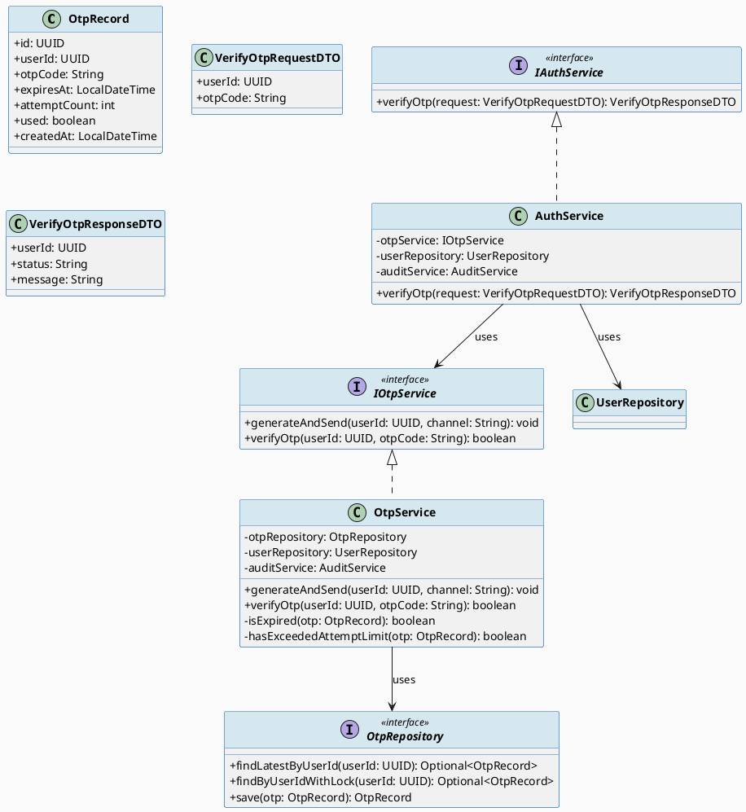
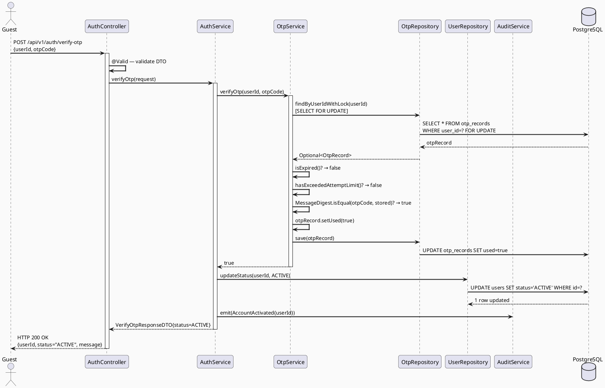
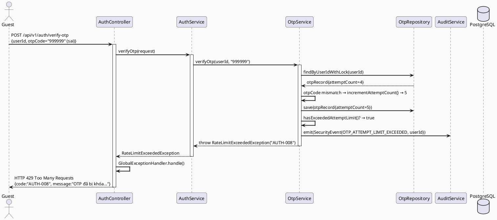
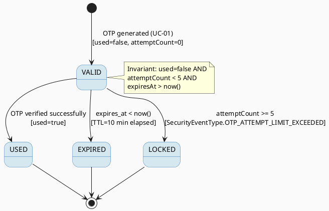

# ENGINEERING DOCUMENTATION STANDARD (EDS) v2.0
# Technical Design Specification — UC-02 Verify OTP

| Field | Value |
|-------|-------|
| **Document ID** | `CB-AUTH-IMP-002` |
| **Version** | `1.0` |
| **Date** | `2026-06-26` |
| **Status** | `Approved` |
| **Document Owner** | `PhuongNT` |
| **Author** | `AI Agent` |
| **Reviewed by** | `[Tech Lead]` |
| **DPO Sign-off** | `[ ] Pending` |
| **Approved by** | `[Principal Architect]` |
| **Last Review** | `2026-06-26` |
| **Based on EDS** | `v2.0` |

---

## CHANGELOG

| Ngày | Người thực hiện | Nội dung thay đổi |
|------|-----------------|-------------------|
| 2026-06-26 | AI Agent | Tạo tài liệu lần đầu cho UC-02 Verify OTP |

---

## MỤC LỤC

1. [Tổng quan Module](#1-tổng-quan-module)
2. [Ma trận Truy vết (Traceability Matrix)](#2-ma-trận-truy-vết-traceability-matrix)
3. [Architecture Decision Records (ADR)](#3-architecture-decision-records-adr)
4. [Non-Functional Requirements & SLA](#4-non-functional-requirements--sla)
5. [Static Modeling (Mô hình Tĩnh)](#5-static-modeling-mô-hình-tĩnh)
6. [Dynamic Modeling (Mô hình Động)](#6-dynamic-modeling-mô-hình-động)
7. [Domain Event Catalog](#7-domain-event-catalog)
8. [Interface Specification (Đặc tả Giao diện)](#8-interface-specification-đặc-tả-giao-diện)
9. [API Specification](#9-api-specification)
10. [Bảng mã lỗi (Error Codes)](#10-bảng-mã-lỗi-error-codes)
11. [Quy trình Triển khai (Step-by-Step)](#11-quy-trình-triển-khai-step-by-step)
12. [Rollback & Incident Runbook](#12-rollback--incident-runbook)
13. [Kịch bản Kiểm thử Chi tiết](#13-kịch-bản-kiểm-thử-chi-tiết)
14. [Phương pháp Xác minh](#14-phương-pháp-xác-minh)
15. [Mẫu thử thực tế (API Verification Samples)](#15-mẫu-thử-thực-tế-api-verification-samples)
16. [Bảng tổng hợp phân quyền (Authorization Matrix)](#16-bảng-tổng-hợp-phân-quyền-authorization-matrix)
17. [AI Prompt Constraints (CASE 2.0)](#17-ai-prompt-constraints-case-20)

---

## 1. Tổng quan Module

| Field | Value |
|-------|-------|
| **Module Name** | `VerifyOTP` |
| **Bounded Context** | `auth` |
| **UC ID** | `UC-02` |
| **SRS Reference** | `3.1.1.2` |
| **Primary Actor** | `Guest (ROLE_GUEST — unverified account holder)` |
| **Platform** | `Web App + Mobile App` |
| **Data Classification** | `Sensitive-PII` |
| **Compliance Scope** | `BR-RBAC, BR-SECURITY, PDPA` |
| **Upstream Dependencies** | `UC-01 RegisterAccount (otp_records created)` |
| **Downstream Consumers** | `UC-03 Login, audit (SecurityEventLog), notification` |

**Mô tả:** Sau khi đăng ký (UC-01), người dùng nhập `userId` và mã OTP 6 chữ số nhận được. Hệ thống xác minh OTP hợp lệ (còn hiệu lực, chưa dùng, chưa vượt 5 lần thử), kích hoạt tài khoản sang trạng thái `ACTIVE` nếu thành công. Mỗi lần thử sai tăng `attempt_count`; đạt 5 lần → khóa OTP và ghi sự kiện `OTP_ATTEMPT_LIMIT_EXCEEDED`.

---

## 2. Ma trận Truy vết (Traceability Matrix)

| Requirement ID | Loại | Mô tả yêu cầu | Thành phần Code | Compliance Target | ADR liên quan |
|----------------|------|---------------|-----------------|-------------------|---------------|
| UC-02 | Use Case | Guest xác minh OTP để kích hoạt tài khoản | `AuthController.verifyOtp()` | BR-RBAC | ADR-AUTH-004 |
| BR-OTP-001 | Business Rule | OTP hết hạn sau 10 phút kể từ khi tạo | `OtpService.isExpired()` | Security | ADR-AUTH-004 |
| BR-OTP-002 | Business Rule | Tối đa 5 lần thử OTP; vượt quá → khóa | `OtpService.checkAttemptLimit()` | Security | ADR-AUTH-004 |
| BR-OTP-003 | Business Rule | OTP đã dùng không được dùng lại | `OtpRecord.used == false` | Security | ADR-AUTH-004 |
| BR-OTP-004 | Business Rule | Kích hoạt account khi OTP đúng | `UserRepository.updateStatus(ACTIVE)` | Data Integrity | — |
| BR-OTP-005 | Business Rule | Ghi sự kiện khi vượt giới hạn thử OTP | `AuditService.emit(OTP_ATTEMPT_LIMIT_EXCEEDED)` | Security Audit | ADR-AUTH-004 |
| BR-OTP-006 | Business Rule | OTP chỉ hợp lệ với đúng userId được gửi đến | `OtpRecord.userId == request.userId` | Security | ADR-AUTH-004 |

---

## 3. Architecture Decision Records (ADR)

### ADR-AUTH-004 — OTP design: 6-digit numeric, 10-min TTL, max-5-attempts lockout

| Field | Value |
|-------|-------|
| **Status** | `Accepted` |
| **Deciders** | `PhuongNT — Backend Lead` |
| **Date** | `2026-06-26` |
| **Supersedes** | `—` |

#### Bối cảnh (Context)
Cần cơ chế xác minh tài khoản đơn giản, bảo mật, và thân thiện với người dùng. Mã OTP phải đủ ngắn để nhập thủ công, đủ phức tạp để không dễ đoán, và có TTL để hạn chế window tấn công.

#### Các phương án đã xem xét (Options Considered)

| Phương án | Mô tả | Ưu điểm | Nhược điểm |
|-----------|-------|----------|------------|
| A | 6-digit numeric OTP, TTL=10 phút, max 5 attempts | + Cân bằng UX và security | - Brute force 1M combinations (giảm thiểu bằng attempt limit) |
| B | Magic link qua email | + Không cần nhập code | - Không hỗ trợ SMS/push, UX phức tạp hơn |
| C | TOTP (Google Authenticator) | + Rất bảo mật | - UX phức tạp cho người dùng mới |

#### Quyết định (Decision)
Chọn **Phương án A**: 6-digit OTP, TTL 10 phút, max 5 attempts, sau đó ghi `OTP_ATTEMPT_LIMIT_EXCEEDED` và yêu cầu resend OTP.

#### Hệ quả (Consequences)

**Tích cực:**
- UX đơn giản, quen thuộc
- Attempt lockout ngăn brute force hiệu quả

**Tiêu cực / Trade-offs:**
- OTP 6 chữ số có entropy thấp hơn UUID link — giảm thiểu bằng TTL ngắn và lockout

**Compliance Impact:**
- Tuân thủ PDPA yêu cầu xác thực danh tính trước khi cho phép truy cập

---

### ADR-AUTH-005 — Append-only OTP records (không UPDATE used=true trực tiếp, dùng transaction lock)

| Field | Value |
|-------|-------|
| **Status** | `Accepted` |
| **Deciders** | `PhuongNT — Backend Lead` |
| **Date** | `2026-06-26` |

#### Bối cảnh (Context)
Race condition: nếu hai request đồng thời verify cùng OTP, cả hai có thể thấy `used=false` trước khi một trong hai kịp set `used=true`.

#### Quyết định (Decision)
Dùng `SELECT FOR UPDATE` (pessimistic lock) trên `otp_records` row khi verify, kết hợp với `@Transactional`. Chỉ 1 request thắng lock; request kia sẽ thấy `used=true` và từ chối.

#### Hệ quả (Consequences)

**Tích cực:**
- Ngăn replay attack trong concurrent scenario

**Tiêu cực / Trade-offs:**
- Tăng nhẹ latency (~5ms) — chấp nhận được cho auth operation

---

## 4. Non-Functional Requirements & SLA

### 4.1. Performance & Availability

| Category | Requirement | Target SLA | Measurement Method | Compliance Basis |
|----------|-------------|------------|---------------------|------------------|
| Latency | API response (p99) | `< 300ms` | k6 load test | — |
| Availability | Uptime (monthly) | `99.9%` | Uptime monitor | — |
| OTP TTL | Hết hạn đúng 10 phút | 100% accurate | Unit test + DB query | BR-OTP-001 |

### 4.2. Data Integrity & Retention

| Category | Requirement | Target | Verification Method | Compliance Basis |
|----------|-------------|--------|---------------------|------------------|
| Replay Prevention | OTP không dùng lại | 100% | SELECT FOR UPDATE | BR-OTP-003 |
| Audit | Attempt limit events logged | 100% | Log inspection | BR-OTP-005 |

### 4.3. Security

| Category | Requirement | Target | Verification Method | Compliance Basis |
|----------|-------------|--------|---------------------|------------------|
| Brute Force | Max 5 attempts | Hard limit | Unit + Integration test | BR-OTP-002 |
| Timing Attack | Constant-time OTP compare | Required | Code review | OWASP |
| OTP in log | KHÔNG xuất hiện trong log | 0 instance | Log scan | PDPA |

---

## 5. Static Modeling (Mô hình Tĩnh)

### 5.1. Class Diagram (PlantUML)



### 5.2. Data Structure (PostgreSQL DDL)

```sql
-- Tham chiếu DDL từ UC-01 (otp_records đã tạo trong V1)
-- UC-02 không cần migration mới, chỉ dùng otp_records hiện có

-- Nếu cần thêm index tối ưu query:
-- V2__add_otp_performance_index.sql
CREATE INDEX IF NOT EXISTS idx_otp_user_latest
    ON otp_records(user_id, created_at DESC);
```

---

## 6. Dynamic Modeling (Mô hình Động)

### 6.1. Sequence Diagram — Happy Path



### 6.2. Sequence Diagram — Error Path (OTP vượt giới hạn)



### 6.3. State Machine — OTP Record Status



---

## 7. Domain Event Catalog

### 7.1. Events Published (Phát ra)

| Event Name | Trigger | Publisher | Subscriber(s) | Payload Schema | Async? |
|------------|---------|-----------|---------------|----------------|--------|
| `AccountActivated` | OTP verified OK, user status→ACTIVE | `AuthService` | `AuditService, NotificationService` | Xem §7.3 | Yes |
| `OtpVerificationFailed` | OTP mismatch | `OtpService` | `AuditService` | `{userId, attemptCount}` | Yes |
| `OtpAttemptLimitExceeded` | attemptCount == 5 | `OtpService` | `AuditService` | `{userId, SecurityEventType}` | Yes |

### 7.2. Events Consumed (Tiêu thụ)

| Event Name | Source | Handler | Action thực hiện |
|------------|--------|---------|------------------|
| `AccountRegistered` | `AuthService (UC-01)` | *(implicit — OTP already in DB)* | OTP record đã tồn tại khi UC-02 chạy |

### 7.3. Payload Schema

```java
// AccountActivatedEvent.java
public record AccountActivatedEvent(
    String eventId,
    String eventType,       // "AccountActivated"
    Instant occurredAt,
    String version,         // "1.0"
    Payload payload,
    Metadata metadata
) {
    public record Payload(
        UUID userId,
        String email,
        String newStatus    // "ACTIVE"
    ) {}

    public record Metadata(
        String correlationId,
        String causedBy     // userId (self)
    ) {}
}

// SecurityEventRecord.java (mapped to SecurityEventType enum)
// SecurityEventType.OTP_ATTEMPT_LIMIT_EXCEEDED
public record OtpAttemptLimitExceededEvent(
    String eventId,
    String eventType,       // "OtpAttemptLimitExceeded"
    Instant occurredAt,
    String version,
    Payload payload,
    Metadata metadata
) {
    public record Payload(
        UUID userId,
        int attemptCount,
        String securityEventType  // "OTP_ATTEMPT_LIMIT_EXCEEDED"
    ) {}

    public record Metadata(
        String correlationId,
        String causedBy
    ) {}
}
```

---

## 8. Interface Specification (Đặc tả Giao diện)

### 8.1. Service Interface

```java
// IAuthService.java (bổ sung method verifyOtp)
// @version 1.0
package com.carebridge.backend.auth.service;

import com.carebridge.backend.auth.dto.VerifyOtpRequestDTO;
import com.carebridge.backend.auth.dto.VerifyOtpResponseDTO;

public interface IAuthService {

    /**
     * Xác minh OTP để kích hoạt tài khoản.
     *
     * @param request DTO chứa userId và otpCode
     * @return VerifyOtpResponseDTO với status="ACTIVE" nếu thành công
     * @throws ResourceNotFoundException AUTH-006 nếu userId không tồn tại
     * @throws ValidationException       AUTH-007 nếu OTP sai/hết hạn/đã dùng
     * @throws RateLimitExceededException AUTH-008 nếu vượt 5 lần thử
     */
    VerifyOtpResponseDTO verifyOtp(VerifyOtpRequestDTO request);
}
```

### 8.2. OTP Service Interface

```java
// IOtpService.java
// @version 1.0
package com.carebridge.backend.auth.service;

import java.util.UUID;

public interface IOtpService {

    /**
     * Tạo OTP mới và gửi qua kênh chỉ định.
     * @throws ServiceException AUTH-004 nếu không gửi được
     */
    void generateAndSend(UUID userId, String channel);

    /**
     * Xác minh OTP. Tăng attemptCount nếu sai.
     * Ghi SecurityEvent nếu đạt giới hạn.
     * @return true nếu hợp lệ
     * @throws RateLimitExceededException nếu attemptCount >= 5
     */
    boolean verifyOtp(UUID userId, String otpCode);
}
```

### 8.3. Repository Interface

```java
// OtpRepository.java
// @version 1.0
package com.carebridge.backend.auth.repository;

import com.carebridge.backend.auth.entity.OtpRecord;
import org.springframework.data.jpa.repository.JpaRepository;
import org.springframework.data.jpa.repository.Lock;
import org.springframework.data.jpa.repository.Query;

import jakarta.persistence.LockModeType;
import java.util.Optional;
import java.util.UUID;

public interface OtpRepository extends JpaRepository<OtpRecord, UUID> {

    @Query("SELECT o FROM OtpRecord o WHERE o.userId = :userId ORDER BY o.createdAt DESC LIMIT 1")
    Optional<OtpRecord> findLatestByUserId(UUID userId);

    @Lock(LockModeType.PESSIMISTIC_WRITE)
    @Query("SELECT o FROM OtpRecord o WHERE o.userId = :userId AND o.used = false ORDER BY o.createdAt DESC LIMIT 1")
    Optional<OtpRecord> findActiveByUserIdWithLock(UUID userId);
}
```

### 8.4. DTO Definitions

```java
// VerifyOtpRequestDTO.java
package com.carebridge.backend.auth.dto;

import jakarta.validation.constraints.*;
import java.util.UUID;

public record VerifyOtpRequestDTO(
    @NotNull
    UUID userId,

    @NotBlank @Size(min = 6, max = 6)
    @Pattern(regexp = "\\d{6}", message = "OTP phải là 6 chữ số")
    String otpCode
) {}

// VerifyOtpResponseDTO.java
public record VerifyOtpResponseDTO(
    UUID userId,
    String status,
    String message
) {}
```

---

## 9. API Specification

### 9.1. Endpoints Table

| Method | Path | Auth Level | Required Roles | Rate Limit | Idempotent? |
|--------|------|------------|----------------|------------|-------------|
| `POST` | `/api/v1/auth/verify-otp` | None | `ROLE_GUEST` (public) | 10/min per userId | No |
| `POST` | `/api/v1/auth/resend-otp` | None | `ROLE_GUEST` | 3/min per userId | No |

### 9.2. Request / Response Schemas

#### `POST /api/v1/auth/verify-otp`

**Request Body:**
```json
{
  "userId": "550e8400-e29b-41d4-a716-446655440000",
  "otpCode": "123456"
}
```

**Response — 200 OK (Happy Path):**
```json
{
  "success": true,
  "data": {
    "userId": "550e8400-e29b-41d4-a716-446655440000",
    "status": "ACTIVE",
    "message": "Tài khoản đã được kích hoạt thành công."
  }
}
```

**Response — 400 Bad Request (OTP sai hoặc hết hạn):**
```json
{
  "success": false,
  "error": {
    "code": "AUTH-007",
    "message": "OTP không hợp lệ hoặc đã hết hạn",
    "details": [
      { "field": "otpCode", "message": "OTP không đúng. Còn 2 lần thử." }
    ]
  }
}
```

**Response — 429 Too Many Requests (vượt giới hạn):**
```json
{
  "success": false,
  "error": {
    "code": "AUTH-008",
    "message": "OTP đã bị khóa do nhập sai quá nhiều lần. Vui lòng yêu cầu OTP mới."
  }
}
```

---

## 10. Bảng mã lỗi (Error Codes)

| Code | HTTP Status | Message (EN) | Message (VI) | Trigger Condition |
|------|-------------|--------------|--------------|-------------------|
| `AUTH-006` | 404 | User not found | Không tìm thấy người dùng | userId không tồn tại |
| `AUTH-007` | 400 | Invalid or expired OTP | OTP không hợp lệ hoặc đã hết hạn | OTP sai, hết hạn, hoặc đã dùng |
| `AUTH-008` | 429 | OTP attempt limit exceeded | Vượt giới hạn thử OTP | attemptCount >= 5 |
| `AUTH-009` | 400 | Account already active | Tài khoản đã được kích hoạt | User status đã là ACTIVE |
| `AUTH-010` | 404 | No active OTP found | Không tìm thấy OTP hợp lệ | Không có otp_record chưa dùng |

---

## 11. Quy trình Triển khai (Step-by-Step)

### 11.1. Prerequisites

- [ ] UC-01 đã implement (users + otp_records table tồn tại)
- [ ] `SecurityEventType.OTP_ATTEMPT_LIMIT_EXCEEDED` đã có trong enum

### 11.2. Pre-Migration Checklist

- [ ] Migration V2 (index tối ưu) đã test trên staging nếu cần

### 11.3. Implementation Steps

#### Chặng 1 — OtpService implementation

```java
@Service
@Transactional
public class OtpService implements IOtpService {

    private final OtpRepository otpRepository;
    private final UserRepository userRepository;
    private final ApplicationEventPublisher eventPublisher;

    private static final int MAX_ATTEMPTS = 5;
    private static final int OTP_TTL_MINUTES = 10;

    @Override
    public boolean verifyOtp(UUID userId, String otpCode) {
        OtpRecord otp = otpRepository.findActiveByUserIdWithLock(userId)
            .orElseThrow(() -> new ResourceNotFoundException("AUTH-010", "Không tìm thấy OTP hợp lệ"));

        if (otp.getExpiresAt().isBefore(LocalDateTime.now())) {
            throw new ValidationException("AUTH-007", "OTP đã hết hạn");
        }

        if (otp.isUsed()) {
            throw new ValidationException("AUTH-007", "OTP đã được sử dụng");
        }

        // Constant-time comparison để chống timing attack
        boolean matches = MessageDigest.isEqual(
            otpCode.getBytes(StandardCharsets.UTF_8),
            otp.getOtpCode().getBytes(StandardCharsets.UTF_8)
        );

        if (!matches) {
            otp.setAttemptCount(otp.getAttemptCount() + 1);
            otpRepository.save(otp);

            if (otp.getAttemptCount() >= MAX_ATTEMPTS) {
                eventPublisher.publishEvent(new OtpAttemptLimitExceededEvent(
                    UUID.randomUUID().toString(), "OtpAttemptLimitExceeded",
                    Instant.now(), "1.0",
                    new OtpAttemptLimitExceededEvent.Payload(
                        userId, otp.getAttemptCount(), "OTP_ATTEMPT_LIMIT_EXCEEDED"),
                    new OtpAttemptLimitExceededEvent.Metadata(
                        MDC.get("correlationId"), userId.toString())
                ));
                throw new RateLimitExceededException("AUTH-008",
                    "OTP đã bị khóa. Vui lòng yêu cầu OTP mới.");
            }

            int remaining = MAX_ATTEMPTS - otp.getAttemptCount();
            throw new ValidationException("AUTH-007",
                "OTP không đúng. Còn " + remaining + " lần thử.");
        }

        otp.setUsed(true);
        otpRepository.save(otp);
        return true;
    }
}
```

#### Chặng 2 — AuthService.verifyOtp()

```java
@Override
public VerifyOtpResponseDTO verifyOtp(VerifyOtpRequestDTO request) {
    User user = userRepository.findById(request.userId())
        .orElseThrow(() -> new ResourceNotFoundException("AUTH-006", "Không tìm thấy người dùng"));

    if (user.getStatus() == AccountStatus.ACTIVE) {
        throw new ValidationException("AUTH-009", "Tài khoản đã được kích hoạt");
    }

    otpService.verifyOtp(request.userId(), request.otpCode());

    user.setStatus(AccountStatus.ACTIVE);
    userRepository.save(user);

    eventPublisher.publishEvent(new AccountActivatedEvent(/* ... */));

    return new VerifyOtpResponseDTO(user.getId(), "ACTIVE",
        "Tài khoản đã được kích hoạt thành công.");
}
```

### 11.4. Deployment Checklist

- [ ] OtpService và AuthService.verifyOtp() unit tests xanh
- [ ] Integration test: verify OTP → user status ACTIVE trong DB
- [ ] SecurityEvent `OTP_ATTEMPT_LIMIT_EXCEEDED` được ghi sau 5 lần thử sai

---

## 12. Rollback & Incident Runbook

### 12.1. Điều kiện kích hoạt Rollback

| Điều kiện | Ngưỡng | Người quyết định |
|-----------|--------|------------------|
| OTP không verify được dù mã đúng | > 1% requests | On-call Engineer |
| Race condition: hai request verify cùng OTP thành công | Bất kỳ | Tech Lead |
| Audit event không ghi khi attempt limit đạt | Bất kỳ | Tech Lead + DPO |

### 12.2. Rollback Procedure

```bash
# Bước 1: Revert service code
git checkout -- src/main/java/com/carebridge/backend/auth/service/OtpService.java

# Bước 2: Không cần undo migration (không thêm bảng mới)

# Bước 3: Re-deploy và verify
curl -X POST http://localhost:8080/api/v1/auth/verify-otp \
  -H "Content-Type: application/json" \
  -d '{"userId":"...", "otpCode":"123456"}'
```

---

## 13. Kịch bản Kiểm thử Chi tiết

### 13.1. Unit Tests

#### TC-UNIT-001 — Xác minh OTP đúng → kích hoạt tài khoản

```gherkin
Feature: Verify OTP
  Background:
    Given test data classification: SYNTHETIC
    And user "user-001" có status UNVERIFIED
    And OTP record tồn tại: {userId:"user-001", code:"123456", used:false, expiresAt: +5 phút}

  Scenario: OTP đúng → ACTIVE
    When POST /api/v1/auth/verify-otp với {userId:"user-001", otpCode:"123456"}
    Then response status là 200
    And response body chứa status="ACTIVE"
    And database: users WHERE id="user-001" có status=ACTIVE
    And database: otp_records có used=true
```

#### TC-UNIT-002 — Từ chối OTP hết hạn

```gherkin
  Scenario: OTP hết hạn
    Given OTP record có expiresAt = 15 phút trước
    When POST /api/v1/auth/verify-otp với otpCode="123456"
    Then response status là 400
    And error code "AUTH-007"
    And user status vẫn là UNVERIFIED
```

#### TC-UNIT-003 — Đếm attempt khi OTP sai

```gherkin
  Scenario: OTP sai lần 1
    Given OTP record có attemptCount=0
    When POST /api/v1/auth/verify-otp với otpCode="000000" (sai)
    Then response status là 400, code AUTH-007
    And otp_records.attemptCount = 1
    And SecurityEvent KHÔNG ghi (chưa đến 5)
```

#### TC-UNIT-004 — Khóa OTP sau 5 lần thử sai

```gherkin
  Scenario: Vượt giới hạn 5 lần
    Given OTP record có attemptCount=4
    When POST /api/v1/auth/verify-otp với otpCode="000000" (sai)
    Then response status là 429
    And error code "AUTH-008"
    And SecurityEvent OTP_ATTEMPT_LIMIT_EXCEEDED được ghi
    And otp_records.attemptCount = 5
```

### 13.2. Integration Tests

#### TC-INT-001 — Full flow: verify OTP → user ACTIVE trong DB

```gherkin
  Scenario: Integration verify OTP
    Given database có user UNVERIFIED và OTP record hợp lệ
    When OtpService.verifyOtp() được gọi với code đúng
    Then UserRepository.updateStatus() được gọi với ACTIVE
    And DB: users.status = 'ACTIVE'
    And DB: otp_records.used = true
    And Event AccountActivated được publish
```

### 13.3. Security Tests

#### TC-SEC-001 — Replay attack: dùng OTP đã verify

```gherkin
  Scenario: Replay OTP
    Given OTP "123456" đã được dùng thành công (used=true)
    When POST /api/v1/auth/verify-otp lại với otpCode="123456"
    Then response status là 400
    And error code "AUTH-007"
    And user status không thay đổi (vẫn ACTIVE)
```

---

## 14. Phương pháp Xác minh

### 14.1. Database Inspection

```sql
-- Verify user được kích hoạt
SELECT id, status, updated_at FROM users WHERE id = '[userId]';
-- Expected: status = 'ACTIVE'

-- Verify OTP đã dùng
SELECT id, used, attempt_count, expires_at FROM otp_records WHERE user_id = '[userId]';
-- Expected: used = true

-- Verify attempt_count tăng đúng
SELECT attempt_count FROM otp_records WHERE user_id = '[userId]' ORDER BY created_at DESC LIMIT 1;
```

### 14.2. Log / Audit Verification

```bash
# Kiểm tra event AccountActivated
grep '"eventType":"AccountActivated"' /var/log/carebridge/audit.log

# Kiểm tra event OTP_ATTEMPT_LIMIT_EXCEEDED
grep '"securityEventType":"OTP_ATTEMPT_LIMIT_EXCEEDED"' /var/log/carebridge/security.log

# Kiểm tra không có OTP code trong log
grep -E '"otpCode"\s*:\s*"[0-9]{6}"' /var/log/carebridge/app.log
# Expected: No output
```

---

## 15. Mẫu thử thực tế (API Verification Samples)

### 15.1. Happy Path

```bash
curl -X POST http://localhost:8080/api/v1/auth/verify-otp \
  -H "Content-Type: application/json" \
  -H "X-Correlation-Id: $(uuidgen)" \
  -d '{
    "userId": "550e8400-e29b-41d4-a716-446655440000",
    "otpCode": "123456"
  }'
```

**Expected Response (200):**
```json
{
  "success": true,
  "data": {
    "userId": "550e8400-e29b-41d4-a716-446655440000",
    "status": "ACTIVE",
    "message": "Tài khoản đã được kích hoạt thành công."
  }
}
```

### 15.2. Error Path — Vượt giới hạn

```bash
# Gửi 5 lần với OTP sai
for i in {1..5}; do
  curl -X POST http://localhost:8080/api/v1/auth/verify-otp \
    -H "Content-Type: application/json" \
    -d '{"userId":"[userId]","otpCode":"000000"}'
done
# Lần thứ 5: Expected 429
```

---

## 16. Bảng tổng hợp phân quyền (Authorization Matrix)

| Endpoint | `GUEST` | `MOTHER` | `EXPERT` | `ADMIN` | `SYSTEM` |
|----------|---------|----------|----------|---------|----------|
| `POST /api/v1/auth/verify-otp` | ✅ | ❌ | ❌ | ❌ | ❌ |
| `POST /api/v1/auth/resend-otp` | ✅ | ❌ | ❌ | ❌ | ❌ |

---

## 17. AI Prompt Constraints (CASE 2.0)

### 17.1 Constraint Summary Table

| # | Constraint | Source (ADR/BR) | Last Verified |
|---|-----------|-----------------|---------------|
| C1 | PHẢI dùng `MessageDigest.isEqual()` để so sánh OTP — KHÔNG dùng String.equals() (timing attack) | `ADR-AUTH-005` | `2026-06-26` |
| C2 | PHẢI dùng `SELECT FOR UPDATE` (pessimistic lock) khi đọc otp_record để verify | `ADR-AUTH-005` | `2026-06-26` |
| C3 | Tăng `attemptCount` TRƯỚC khi check limit (không check trước rồi mới tăng) | `BR-OTP-002` | `2026-06-26` |
| C4 | PHẢI ghi `SecurityEventType.OTP_ATTEMPT_LIMIT_EXCEEDED` khi attemptCount đạt 5 | `BR-OTP-005` | `2026-06-26` |
| C5 | KHÔNG log otpCode plain text trong bất kỳ log nào | `BR-PRIVACY-001` | `2026-06-26` |

### 17.2 Constraint Injection Block

```
[CONSTRAINT BLOCK — Module: VerifyOTP]
Theo TDS CB-AUTH-IMP-002 và ADR-AUTH-004, ADR-AUTH-005:

1. PHẢI dùng MessageDigest.isEqual() để so sánh OTP — KHÔNG dùng String.equals().
2. PHẢI dùng @Lock(PESSIMISTIC_WRITE) khi query otp_record để verify (race condition prevention).
3. Tăng attemptCount TRƯỚC khi kiểm tra limit: increment → save → nếu >= 5 → throw.
4. PHẢI emit SecurityEventType.OTP_ATTEMPT_LIMIT_EXCEEDED khi attemptCount đạt 5.
5. KHÔNG log otpCode plain text trong application logs hoặc error messages.

[CONTEXT BLOCK]
- Bounded Context: auth
- Data Classification: Sensitive-PII
- SecurityEventType enum: đã có OTP_ATTEMPT_LIMIT_EXCEEDED
- Existing interfaces: §8 Service Interface + §8.2 OtpService Interface
- Error codes: §10 (AUTH-006 đến AUTH-010)
```

### 17.3 Constraint Quality Checklist

- [x] Mỗi constraint traceable về ADR hoặc BR cụ thể
- [x] Không có constraint generic
- [x] Constraint block có ≥ 3 constraints cụ thể

### 17.4 Anti-Pattern Detection

| AP-ID | Anti-Pattern | Dấu hiệu | Hành động |
|-------|-------------|-----------|----------|
| AP-AI-001 | Unconstrained Gen | Code không match constraint C1-C5 | Reject — inject lại constraints |
| AP-AI-003 | Implicit Decision | Code assume architecture không có ADR | Reject — viết ADR trước |
| AP-AI-005 | Hallucinated Contract | Code import không có trong §8 | Reject — verify contract |

---

## PHỤ LỤC

### A. Glossary

| Thuật ngữ | Định nghĩa |
|-----------|------------|
| Replay Attack | Tấn công tái sử dụng credential/token đã dùng |
| Timing Attack | Tấn công đo thời gian phản hồi để suy luận thông tin bí mật |
| Pessimistic Lock | SELECT FOR UPDATE — khóa row trong DB để tránh race condition |
| OTP_ATTEMPT_LIMIT_EXCEEDED | SecurityEventType — ghi nhận khi OTP bị brute force |
