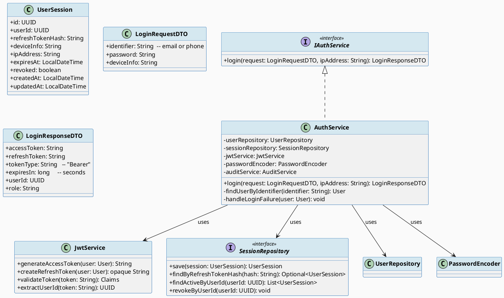
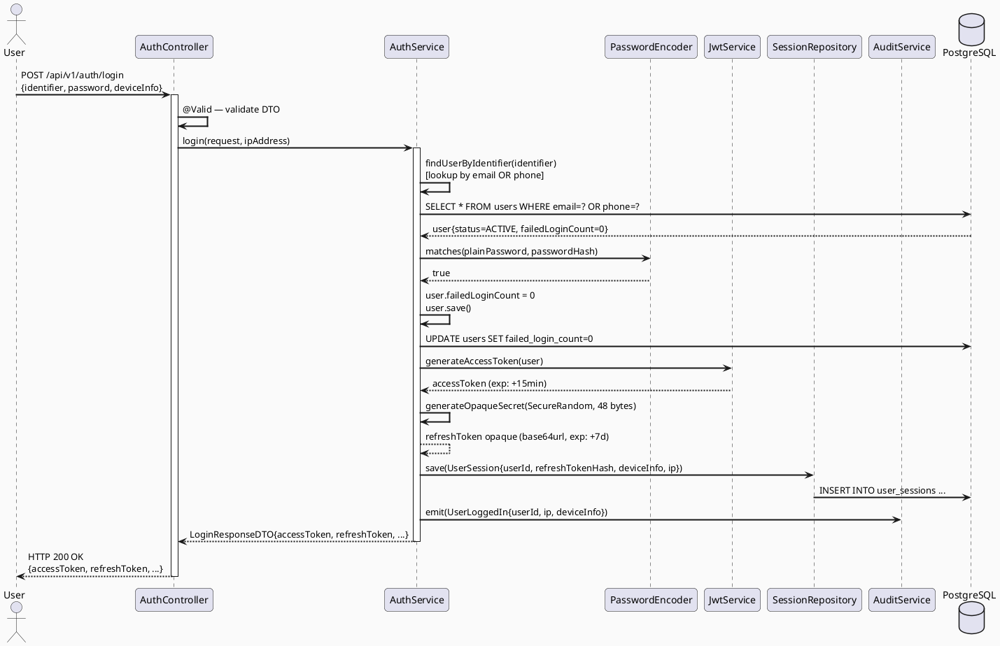
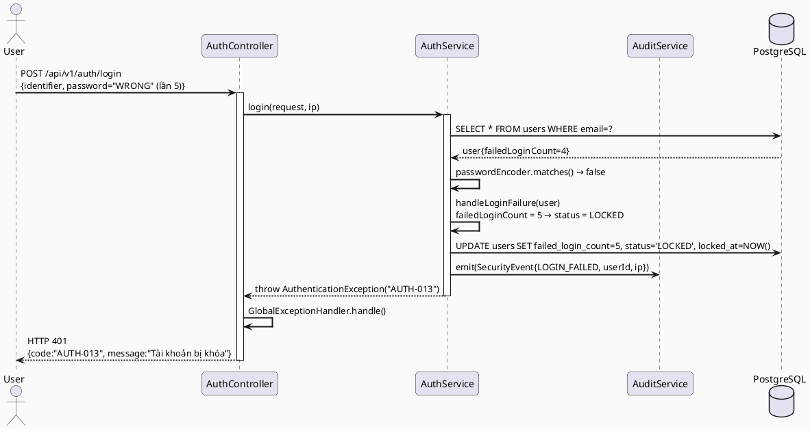
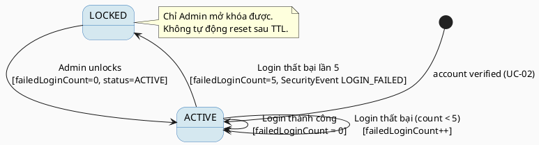

# ENGINEERING DOCUMENTATION STANDARD (EDS) v2.0
# Technical Design Specification — UC-03 Login

| Field | Value |
|-------|-------|
| **Document ID** | `CB-AUTH-IMP-003` |
| **Version** | `1.1` |
| **Date** | `2026-07-16` |
| **Status** | `Approved` |
| **Document Owner** | `PhuongNT` |
| **Author** | `AI Agent` |
| **Reviewed by** | `[Tech Lead]` |
| **DPO Sign-off** | `[ ] Pending` |
| **Approved by** | `[Principal Architect]` |
| **Last Review** | `2026-06-26` |
| **Based on EDS** | `v2.0` |

---

## CHANGELOG

| Ngày | Người thực hiện | Nội dung thay đổi |
|------|-----------------|-------------------|
| 2026-06-26 | AI Agent | Tạo tài liệu lần đầu cho UC-03 Login |
| 2026-07-16 | AI Agent | Đề xuất mở rộng đăng nhập Google và Firebase Phone Auth; chờ phê duyệt |
| 2026-07-16 | User | Approved v1.1 federated login extension |

---

## MỤC LỤC

1. [Tổng quan Module](#1-tổng-quan-module)
2. [Ma trận Truy vết (Traceability Matrix)](#2-ma-trận-truy-vết-traceability-matrix)
3. [Architecture Decision Records (ADR)](#3-architecture-decision-records-adr)
4. [Non-Functional Requirements & SLA](#4-non-functional-requirements--sla)
5. [Static Modeling (Mô hình Tĩnh)](#5-static-modeling-mô-hình-tĩnh)
6. [Dynamic Modeling (Mô hình Động)](#6-dynamic-modeling-mô-hình-động)
7. [Domain Event Catalog](#7-domain-event-catalog)
8. [Interface Specification (Đặc tả Giao diện)](#8-interface-specification-đặc-tả-giao-diện)
9. [API Specification](#9-api-specification)
10. [Bảng mã lỗi (Error Codes)](#10-bảng-mã-lỗi-error-codes)
11. [Quy trình Triển khai (Step-by-Step)](#11-quy-trình-triển-khai-step-by-step)
12. [Rollback & Incident Runbook](#12-rollback--incident-runbook)
13. [Kịch bản Kiểm thử Chi tiết](#13-kịch-bản-kiểm-thử-chi-tiết)
14. [Phương pháp Xác minh](#14-phương-pháp-xác-minh)
15. [Mẫu thử thực tế (API Verification Samples)](#15-mẫu-thử-thực-tế-api-verification-samples)
16. [Bảng tổng hợp phân quyền (Authorization Matrix)](#16-bảng-tổng-hợp-phân-quyền-authorization-matrix)
17. [AI Prompt Constraints (CASE 2.0)](#17-ai-prompt-constraints-case-20)

---

## 1. Tổng quan Module

| Field | Value |
|-------|-------|
| **Module Name** | `Login` |
| **Bounded Context** | `auth` |
| **UC ID** | `UC-03` |
| **SRS Reference** | `3.1.1.3` |
| **Primary Actor** | `User (MOTHER / EXPERT — account status = ACTIVE)` |
| **Platform** | `Web App + Mobile App` |
| **Data Classification** | `Sensitive-PII` |
| **Compliance Scope** | `BR-RBAC, BR-SECURITY, PDPA` |
| **Upstream Dependencies** | `UC-02 VerifyOTP (Account phải ACTIVE)` |
| **Downstream Consumers** | `All protected endpoints, audit (SecurityEventLog), UC-04 Logout` |

**Mô tả:** Người dùng đã kích hoạt tài khoản đăng nhập bằng email/phone + password. Hệ thống xác thực credentials, phát hành access token JWT ký RS256 (TTL 15 phút) và refresh token opaque ngẫu nhiên (TTL 7 ngày), tạo session record trong `user_sessions`. Sau 5 lần đăng nhập thất bại liên tiếp, tài khoản bị khóa (`LOCKED`) và ghi sự kiện `LOGIN_FAILED`.

---

## 2. Ma trận Truy vết (Traceability Matrix)

| Requirement ID | Loại | Mô tả yêu cầu | Thành phần Code | Compliance Target | ADR liên quan |
|----------------|------|---------------|-----------------|-------------------|---------------|
| UC-03 | Use Case | User đăng nhập nhận RS256 access JWT và opaque refresh token | `AuthController.login()` | BR-RBAC | ADR-AUTH-006 |
| BR-LOGIN-001 | Business Rule | Chỉ tài khoản ACTIVE mới được đăng nhập | `AuthService.validateAccountStatus()` | Security | ADR-AUTH-006 |
| BR-LOGIN-002 | Business Rule | Tối đa 5 lần đăng nhập sai → khóa tài khoản | `AuthService.handleLoginFailure()` | Security | ADR-AUTH-007 |
| BR-LOGIN-003 | Business Rule | Mỗi đăng nhập ghi audit log | `AuditService.emit(UserLoggedIn/LOGIN_FAILED)` | Security Audit | ADR-AUTH-006 |
| BR-LOGIN-004 | Business Rule | Access token TTL = 15 phút | `JwtService.generateAccessToken()` | Security | ADR-AUTH-006 |
| BR-LOGIN-005 | Business Rule | Opaque refresh token TTL = 7 ngày | `AuthServiceImpl.createRefreshToken()` | Security | ADR-AUTH-006 |
| BR-LOGIN-006 | Business Rule | Tạo session record khi đăng nhập thành công | `SessionRepository.save()` | Traceability | ADR-AUTH-008 |
| BR-LOGIN-007 | Business Rule | Password không xuất hiện trong log hay response | `@JsonIgnore` | PDPA | ADR-AUTH-002 |
| BR-LOGIN-008 | Business Rule | Cho phép login bằng email hoặc số điện thoại | `AuthService.findUserByIdentifier()` | Usability | — |

---

## 3. Architecture Decision Records (ADR)

### ADR-AUTH-006 — JWT stateless access token (15 phút) + stateful refresh token (7 ngày)

| Field | Value |
|-------|-------|
| **Status** | `Accepted` |
| **Deciders** | `PhuongNT — Backend Lead` |
| **Date** | `2026-06-26` |
| **Supersedes** | `—` |

#### Bối cảnh (Context)
Cần cơ chế xác thực scalable cho cả Web và Mobile. Session thuần túy không phù hợp với stateless REST API. JWT cho phép validate mà không cần query DB trên mỗi request.

#### Các phương án đã xem xét (Options Considered)

| Phương án | Mô tả | Ưu điểm | Nhược điểm |
|-----------|-------|----------|------------|
| A | Short-lived JWT (15min) + refresh token (7d) stored in DB | + Revocable, scalable | - Cần DB lookup khi refresh |
| B | Long-lived JWT (7d) không có refresh | + Đơn giản | - Không thể revoke, rủi ro cao nếu bị đánh cắp |
| C | Session-only (server-side) | + Dễ revoke | - Không stateless, không scale tốt |

#### Quyết định (Decision)
Chọn **Phương án A**: access token 15 phút là stateless JWT ký RS256 với `kid`; refresh token 7 ngày là secret opaque 48-byte sinh bằng `SecureRandom`, trả về dạng base64url và chỉ lưu SHA-256 hash trong `refresh_tokens`/`user_sessions` (stateful, rotated khi refresh).

#### Hệ quả (Consequences)

**Tích cực:**
- Access token ngắn → giảm window nếu bị đánh cắp
- Refresh token có thể revoke → UC-04 Logout hoạt động hiệu quả
- Stateless access → không tạo DB load trên mỗi request

**Tiêu cực / Trade-offs:**
- Cần implement refresh token rotation và revocation
- DB cần index tốt trên `user_sessions.refresh_token_hash`

**Compliance Impact:**
- PDPA Art. 37 — bảo vệ session data
- Tuân thủ yêu cầu logout functionality (UC-04)

---

### ADR-AUTH-007 — Account lockout sau 5 lần login thất bại (không reset sau TTL)

| Field | Value |
|-------|-------|
| **Status** | `Accepted` |
| **Deciders** | `PhuongNT — Backend Lead` |
| **Date** | `2026-06-26` |

#### Bối cảnh (Context)
Cần chống brute force password. Tài khoản y tế chứa thông tin nhạy cảm của bà mẹ và thai nhi.

#### Quyết định (Decision)
5 lần thất bại liên tiếp → `status = LOCKED`. Mở khóa chỉ qua Admin action (không tự động reset). Ghi `SecurityEventType.LOGIN_FAILED` mỗi lần.

#### Hệ quả (Consequences)

**Tích cực:**
- Chống brute force mạnh

**Tiêu cực / Trade-offs:**
- UX: user cần liên hệ Admin để mở khóa — cần kênh support rõ ràng

---

### ADR-AUTH-008 — Session tracking trong user_sessions table

| Field | Value |
|-------|-------|
| **Status** | `Accepted` |
| **Deciders** | `PhuongNT — Backend Lead` |
| **Date** | `2026-06-26` |

#### Bối cảnh (Context)
Cần khả năng logout từ thiết bị cụ thể (UC-04) và audit trail cho security review.

#### Quyết định (Decision)
Mỗi login thành công tạo 1 record trong `user_sessions` với `refreshToken` (hashed), `deviceInfo`, `ipAddress`, `expiresAt`, `revoked=false`.

---

## 4. Non-Functional Requirements & SLA

### 4.1. Performance & Availability

| Category | Requirement | Target SLA | Measurement Method | Compliance Basis |
|----------|-------------|------------|---------------------|------------------|
| Latency | Login API response (p99) | `< 500ms` (BCrypt included) | k6 load test | — |
| Availability | Uptime (monthly) | `99.9%` | Uptime monitor | — |
| Throughput | Concurrent logins | `200 req/s` | Load test | — |

### 4.2. Security

| Category | Requirement | Target | Verification Method | Compliance Basis |
|----------|-------------|--------|---------------------|------------------|
| JWT RS256 keys | Active `kid`, PKCS#8 private key và SPKI public-key ring từ ENV; RSA ≥ 2048 bit; không hard-code | 100% | Config validation + code review | Security |
| Access Token TTL | 15 phút chính xác | ±5s | Unit test | BR-LOGIN-004 |
| Refresh Token TTL | 7 ngày | ±1 phút | Unit test | BR-LOGIN-005 |
| Lockout | Khóa sau đúng 5 lần thất bại | 100% | Integration test | BR-LOGIN-002 |
| Password in response | Không xuất hiện | 0 instance | Response body scan | PDPA |

---

## 5. Static Modeling (Mô hình Tĩnh)

### 5.1. Class Diagram (PlantUML)



### 5.2. Data Structure (PostgreSQL DDL)

```sql
-- V3__create_user_sessions.sql
CREATE TABLE user_sessions (
    id                  UUID PRIMARY KEY DEFAULT gen_random_uuid(),
    user_id             UUID NOT NULL REFERENCES users(id) ON DELETE CASCADE,
    refresh_token_hash  VARCHAR(255) NOT NULL UNIQUE,
    device_info         VARCHAR(512),
    ip_address          VARCHAR(45),      -- IPv6 max length
    expires_at          TIMESTAMP WITH TIME ZONE NOT NULL,
    revoked             BOOLEAN NOT NULL DEFAULT FALSE,
    revoked_at          TIMESTAMP WITH TIME ZONE,
    created_at          TIMESTAMP WITH TIME ZONE NOT NULL DEFAULT NOW(),
    updated_at          TIMESTAMP WITH TIME ZONE NOT NULL DEFAULT NOW()
);

CREATE INDEX idx_sessions_user_id         ON user_sessions(user_id);
CREATE INDEX idx_sessions_token_hash      ON user_sessions(refresh_token_hash);
CREATE INDEX idx_sessions_expires_revoked ON user_sessions(expires_at, revoked);

-- Thêm cột failed_login_count vào users (nếu chưa có)
ALTER TABLE users ADD COLUMN IF NOT EXISTS
    failed_login_count INT NOT NULL DEFAULT 0;
ALTER TABLE users ADD COLUMN IF NOT EXISTS
    locked_at TIMESTAMP WITH TIME ZONE;
```

---

## 6. Dynamic Modeling (Mô hình Động)

### 6.1. Sequence Diagram — Happy Path



### 6.2. Sequence Diagram — Error Path (Login thất bại → lockout)



### 6.3. State Machine — User Login Failures



---

## 7. Domain Event Catalog

### 7.1. Events Published (Phát ra)

| Event Name | Trigger | Publisher | Subscriber(s) | Payload Schema | Async? |
|------------|---------|-----------|---------------|----------------|--------|
| `UserLoggedIn` | Login thành công | `AuthService` | `AuditService, SessionService` | Xem §7.3 | Yes |
| `LoginFailed` | Password sai | `AuthService` | `AuditService` | `{userId, ip, attemptCount, SecurityEventType}` | Yes |
| `AccountLocked` | failedLoginCount == 5 | `AuthService` | `AuditService, NotificationService` | `{userId, lockedAt, reason}` | Yes |

### 7.3. Payload Schema

```java
// UserLoggedInEvent.java
public record UserLoggedInEvent(
    String eventId,
    String eventType,        // "UserLoggedIn"
    Instant occurredAt,
    String version,          // "1.0"
    Payload payload,
    Metadata metadata
) {
    public record Payload(
        UUID userId,
        String role,
        String ipAddress,
        String deviceInfo,
        UUID sessionId
    ) {}

    public record Metadata(
        String correlationId,
        String causedBy      // userId
    ) {}
}

// LoginFailedEvent.java
public record LoginFailedEvent(
    String eventId,
    String eventType,        // "LoginFailed"
    Instant occurredAt,
    String version,
    Payload payload,
    Metadata metadata
) {
    public record Payload(
        UUID userId,          // nullable nếu user không tồn tại
        String identifier,    // email/phone (masked: a***@gmail.com)
        String ipAddress,
        int attemptCount,
        String securityEventType  // "LOGIN_FAILED"
    ) {}

    public record Metadata(
        String correlationId,
        String causedBy
    ) {}
}
```

---

## 8. Interface Specification (Đặc tả Giao diện)

### 8.1. Service Interface

```java
// IAuthService.java (bổ sung login)
// @version 1.0
package com.carebridge.backend.auth.service;

import com.carebridge.backend.auth.dto.LoginRequestDTO;
import com.carebridge.backend.auth.dto.LoginResponseDTO;

public interface IAuthService {

    /**
     * Đăng nhập bằng email/phone + password.
     * Phát hành RS256 access JWT và opaque rotating refresh token.
     * Tạo session record.
     *
     * @param request    DTO chứa identifier, password, deviceInfo
     * @param ipAddress  IP của client (từ HttpServletRequest)
     * @return LoginResponseDTO với access token và refresh token
     * @throws AuthenticationException    AUTH-011 khi credential sai
     * @throws AccountLockedException     AUTH-013 khi tài khoản bị khóa
     * @throws AccountDisabledException   AUTH-014 khi tài khoản bị vô hiệu hóa
     * @throws AuthenticationException    AUTH-015 khi tài khoản chưa xác minh
     */
    LoginResponseDTO login(LoginRequestDTO request, String ipAddress);
}
```

### 8.2. Access JWT Provider Interface

```java
// JwtService.java
// @version 1.0
package com.carebridge.backend.auth.service;

import com.carebridge.backend.auth.entity.User;
import io.jsonwebtoken.Claims;
import java.util.UUID;

public interface JwtService {

    /**
     * Tạo access token JWT RS256 với TTL 15 phút.
     * Header: alg=RS256, kid=activeKeyId. Claims: sub, role, type, iat, exp.
     */
    String generateAccessToken(User user);

    /**
     * Chỉ chấp nhận RS256 và public key có `kid` trong verification ring.
     * @throws AuthenticationException nếu token invalid/expired
     */
    Claims validateToken(String token);

    UUID extractUserId(String token);
}
```

### 8.3. Repository Interface

```java
// SessionRepository.java
// @version 1.0
package com.carebridge.backend.auth.repository;

import com.carebridge.backend.auth.entity.UserSession;
import org.springframework.data.jpa.repository.JpaRepository;
import org.springframework.data.jpa.repository.Modifying;
import org.springframework.data.jpa.repository.Query;

import java.util.List;
import java.util.Optional;
import java.util.UUID;

public interface SessionRepository extends JpaRepository<UserSession, UUID> {

    Optional<UserSession> findByRefreshTokenHash(String hash);

    List<UserSession> findByUserIdAndRevokedFalse(UUID userId);

    @Modifying
    @Query("UPDATE UserSession s SET s.revoked = true, s.revokedAt = NOW() WHERE s.userId = :userId")
    void revokeAllByUserId(UUID userId);

    @Modifying
    @Query("UPDATE UserSession s SET s.revoked = true, s.revokedAt = NOW() WHERE s.id = :sessionId")
    void revokeById(UUID sessionId);
}
```

### 8.4. DTO Definitions

```java
// LoginRequestDTO.java
package com.carebridge.backend.auth.dto;

import jakarta.validation.constraints.*;

public record LoginRequestDTO(
    @NotBlank
    String identifier,      // email hoặc phone

    @NotBlank
    String password,

    String deviceInfo       // optional, để tracking session
) {}

// LoginResponseDTO.java
public record LoginResponseDTO(
    String accessToken,
    String refreshToken,
    String tokenType,       // "Bearer"
    long expiresIn,         // giây (900 = 15 phút)
    UUID userId,
    String role
) {}
```

---

## 9. API Specification

### 9.1. Endpoints Table

| Method | Path | Auth Level | Required Roles | Rate Limit | Idempotent? |
|--------|------|------------|----------------|------------|-------------|
| `POST` | `/api/v1/auth/login` | None | `ROLE_GUEST` (public) | 10/min per IP | No |

### 9.2. Request / Response Schemas

#### `POST /api/v1/auth/login`

**Request Body:**
```json
{
  "identifier": "nguyen.thi.a@gmail.com",
  "password": "StrongP@ss1",
  "deviceInfo": "Mozilla/5.0 (iPhone; CPU iPhone OS 17)"
}
```

**Response — 200 OK (Happy Path):**
```json
{
  "success": true,
  "data": {
    "accessToken": "eyJhbGciOiJSUzI1NiIsImtpZCI6ImFjdGl2ZS0yMDI2LTA3In0...",
    "refreshToken": "opaque-base64url-secret-without-jwt-segments",
    "tokenType": "Bearer",
    "expiresIn": 900,
    "userId": "550e8400-e29b-41d4-a716-446655440000",
    "role": "MOTHER"
  }
}
```

**Response — 401 Unauthorized (Sai mật khẩu):**
```json
{
  "success": false,
  "error": {
    "code": "AUTH-011",
    "message": "Email/số điện thoại hoặc mật khẩu không đúng"
  }
}
```

**Response — 401 (Tài khoản bị khóa):**
```json
{
  "success": false,
  "error": {
    "code": "AUTH-013",
    "message": "Tài khoản đã bị khóa do đăng nhập thất bại quá nhiều lần. Vui lòng liên hệ hỗ trợ."
  }
}
```

---

## 10. Bảng mã lỗi (Error Codes)

| Code | HTTP Status | Message (EN) | Message (VI) | Trigger Condition |
|------|-------------|--------------|--------------|-------------------|
| `AUTH-011` | 401 | Invalid credentials | Email/SĐT hoặc mật khẩu không đúng | Password mismatch |
| `AUTH-012` | 404 | User not found | Tài khoản không tồn tại | Identifier không tìm thấy |
| `AUTH-013` | 401 | Account locked | Tài khoản bị khóa | failedLoginCount >= 5 |
| `AUTH-014` | 403 | Account disabled | Tài khoản bị vô hiệu hóa | status = DISABLED |
| `AUTH-015` | 403 | Account not verified | Tài khoản chưa xác minh | status = UNVERIFIED |
| `AUTH-016` | 500 | Token generation failed | Lỗi tạo token | JwtService exception |

---

## 11. Quy trình Triển khai (Step-by-Step)

### 11.1. Prerequisites

- [ ] UC-01, UC-02 đã implement (users table, sessions table)
- [ ] RS256 access-token keys đã cấu hình từ ENV: `JWT_ACTIVE_KEY_ID`, base64 DER PKCS#8 `JWT_PRIVATE_KEY`, và `JWT_PUBLIC_KEYS` dạng `kid:base64-DER-SPKI`; RSA ≥ 2048 bit
- [ ] ADR-AUTH-006, 007, 008 đã được Accepted

### 11.2. Pre-Migration Checklist

- [ ] Migration V3 (user_sessions, thêm cột users) đã test trên staging ≥ 24 giờ
- [ ] DB backup: `pg_dump carebridge_db > backup_20260626.sql`

### 11.3. Implementation Steps

#### Chặng 1 — Flyway Migration

```bash
# src/main/resources/db/migration/V3__create_user_sessions.sql
# Nội dung: DDL từ §5.2
./mvnw flyway:migrate
```

#### Chặng 2 — JwtTokenProvider Implementation

```java
@Component
public class JwtTokenProvider {

    @Value("${carebridge.security.jwt.active-key-id}")
    private String activeKeyId;

    @Value("${carebridge.security.jwt.private-key}")
    private String privateKeyPkcs8;

    @Value("${carebridge.security.jwt.public-keys}")
    private String publicKeyRing;

    private static final long ACCESS_TOKEN_MS  = 15 * 60 * 1000L;   // 15 phút
    public String generateAccessToken(User user) {
        return Jwts.builder()
            .subject(user.getId().toString())
            .claim("role", user.getRole().name())
            .issuedAt(new Date())
            .expiration(new Date(System.currentTimeMillis() + ACCESS_TOKEN_MS))
            .header().keyId(activeKeyId).and()
            .signWith(loadRsaPrivateKey(privateKeyPkcs8), Jwts.SIG.RS256)
            .compact();
    }

    // Verification rejects alg != RS256, unknown/missing kid, expired tokens,
    // RSA keys below 2048 bits, and active private/public key mismatch.
}
```

Refresh tokens are not JWTs and are not produced by this provider. `AuthServiceImpl` generates 48 random bytes with `SecureRandom`, base64url-encodes them without padding, persists only SHA-256 hashes, and rotates/revokes them through the stateful refresh/session repositories.

#### Chặng 3 — AuthService OTP verification and session issuance

The block below is the post-OTP issuance portion only. Normal `/login` validates credentials and creates an OTP challenge without issuing tokens; `verifyOtp` issues the RS256 access JWT plus opaque refresh token and session after the challenge is verified. The dev/test-only direct-login controller may reuse this issuance boundary only under its profile and property gates.

```java
@Override
@Transactional
public LoginResponseDTO login(LoginRequestDTO request, String ipAddress) {
    User user = findUserByIdentifier(request.identifier())
        .orElseThrow(() -> new AuthenticationException("AUTH-011",
            "Email/số điện thoại hoặc mật khẩu không đúng"));

    if (user.getStatus() == AccountStatus.LOCKED) {
        throw new AccountLockedException("AUTH-013", "Tài khoản bị khóa");
    }
    if (user.getStatus() == AccountStatus.DISABLED) {
        throw new AccountDisabledException("AUTH-014", "Tài khoản bị vô hiệu hóa");
    }
    if (user.getStatus() == AccountStatus.UNVERIFIED) {
        throw new AuthenticationException("AUTH-015", "Tài khoản chưa được xác minh");
    }

    if (!passwordEncoder.matches(request.password(), user.getPasswordHash())) {
        handleLoginFailure(user, ipAddress);
        throw new AuthenticationException("AUTH-011",
            "Email/số điện thoại hoặc mật khẩu không đúng");
    }

    // Reset failed count on success
    user.setFailedLoginCount(0);
    userRepository.save(user);

    String accessToken  = jwtService.generateAccessToken(user);
    String refreshToken = generateOpaqueSecret(); // SecureRandom: 48 bytes, base64url without padding

    UserSession session = new UserSession();
    session.setUserId(user.getId());
    session.setRefreshTokenHash(hashToken(refreshToken));
    session.setDeviceInfo(request.deviceInfo());
    session.setIpAddress(ipAddress);
    session.setExpiresAt(LocalDateTime.now().plusDays(7));
    session.setRevoked(false);
    UserSession saved = sessionRepository.save(session);

    eventPublisher.publishEvent(new UserLoggedInEvent(
        UUID.randomUUID().toString(), "UserLoggedIn", Instant.now(), "1.0",
        new UserLoggedInEvent.Payload(user.getId(), user.getRole().name(),
            ipAddress, request.deviceInfo(), saved.getId()),
        new UserLoggedInEvent.Metadata(MDC.get("correlationId"), user.getId().toString())
    ));

    return new LoginResponseDTO(accessToken, refreshToken, "Bearer", 900L,
        user.getId(), user.getRole().name());
}

private void handleLoginFailure(User user, String ipAddress) {
    user.setFailedLoginCount(user.getFailedLoginCount() + 1);
    if (user.getFailedLoginCount() >= 5) {
        user.setStatus(AccountStatus.LOCKED);
        user.setLockedAt(LocalDateTime.now());
    }
    userRepository.save(user);

    eventPublisher.publishEvent(new LoginFailedEvent(/* ... */));
}

private String hashToken(String token) {
    // SHA-256 hash of refresh token for storage
    return DigestUtils.sha256Hex(token);
}
```

### 11.4. Deployment Checklist

- [ ] Migration V3 chạy thành công
- [ ] `JWT_ACTIVE_KEY_ID`, `JWT_PRIVATE_KEY`, `JWT_PUBLIC_KEYS` đã set; active private/public key pair khớp và public ring giữ key cũ trong cửa sổ rotation cần thiết
- [ ] Login happy path test: receive accessToken với `exp` = now+900s
- [ ] Lockout test: 5 lần login sai → status LOCKED

---

## 12. Rollback & Incident Runbook

### 12.1. Điều kiện kích hoạt Rollback

| Điều kiện | Ngưỡng | Người quyết định |
|-----------|--------|------------------|
| JWT validation fails sau deploy | > 1% requests | On-call Engineer |
| Session records không được tạo | Bất kỳ | Tech Lead |
| Account lockout sai (quá sớm/muộn) | Bất kỳ | Tech Lead |

### 12.2. Rollback Procedure

```bash
# Bước 1: Revert migration V3
# DROP TABLE user_sessions;
# ALTER TABLE users DROP COLUMN failed_login_count, DROP COLUMN locked_at;
./mvnw flyway:undo

# Bước 2: Re-deploy phiên bản cũ
# Bước 3: Verify health
curl http://localhost:8080/actuator/health
```

---

## 13. Kịch bản Kiểm thử Chi tiết

### 13.1. Unit Tests

#### TC-UNIT-001 — Login thành công với email

```gherkin
Feature: Login
  Background:
    Given test data classification: SYNTHETIC
    And user "u-001" có status ACTIVE, password hash tương ứng "SecureP@ss1"

  Scenario: Login thành công
    When POST /api/v1/auth/login với {identifier:"test@example.com", password:"SecureP@ss1"}
    Then response status là 200
    And response body chứa accessToken (JWT hợp lệ)
    And response body chứa refreshToken
    And tokenType = "Bearer"
    And expiresIn = 900
    And user_sessions table có 1 record mới
```

#### TC-UNIT-002 — Từ chối tài khoản UNVERIFIED

```gherkin
  Scenario: UNVERIFIED account
    Given user có status = UNVERIFIED
    When POST /api/v1/auth/login
    Then response status là 403
    And error code "AUTH-015"
```

#### TC-UNIT-003 — Từ chối password sai (tăng failed count)

```gherkin
  Scenario: Wrong password lần 1
    Given user có failedLoginCount = 0
    When POST /api/v1/auth/login với password sai
    Then response status là 401, code AUTH-011
    And users.failed_login_count = 1
    And SecurityEvent LOGIN_FAILED được ghi
```

#### TC-UNIT-004 — Khóa tài khoản sau 5 lần thất bại

```gherkin
  Scenario: Account locked after 5 failures
    Given user có failedLoginCount = 4
    When POST /api/v1/auth/login với password sai lần thứ 5
    Then response status là 401, code AUTH-013
    And users.status = 'LOCKED'
    And users.locked_at IS NOT NULL
    And SecurityEvent LOGIN_FAILED được ghi
```

### 13.2. Integration Tests

#### TC-INT-001 — Login tạo session trong DB

```gherkin
  Scenario: Session record được tạo
    Given user ACTIVE với credentials hợp lệ
    When POST /api/v1/auth/login thành công
    Then user_sessions table có 1 record
    And refresh_token_hash là SHA-256 hash của refreshToken
    And revoked = false
    And expires_at = now + 7 ngày
```

### 13.3. Security Tests

#### TC-SEC-001 — Credential enumeration: response giống nhau cho sai email vs sai password

```gherkin
  Scenario: Anti-enumeration
    When POST login với email không tồn tại
    Then response status 401, message "Email/số điện thoại hoặc mật khẩu không đúng"
    When POST login với email đúng nhưng sai password
    Then response status 401, SAME message
    -- Không phân biệt được user có tồn tại không
```

---

## 14. Phương pháp Xác minh

### 14.1. Database Inspection

```sql
-- Verify session được tạo
SELECT id, user_id, ip_address, expires_at, revoked
FROM user_sessions
WHERE user_id = '[userId]'
ORDER BY created_at DESC LIMIT 1;

-- Verify failed_login_count tăng
SELECT id, failed_login_count, status, locked_at
FROM users WHERE email = 'test@example.com';

-- Verify refresh token hash (không plain text)
SELECT refresh_token_hash FROM user_sessions WHERE user_id = '[userId]';
-- Expected: 64-char hex string (SHA-256)
```

### 14.2. JWT Verification

```bash
# Decode JWT claims (không verify signature)
echo "[ACCESS_TOKEN]" | cut -d'.' -f2 | base64 -d | python3 -m json.tool
# Expected: {"sub":"[userId]","role":"MOTHER","iat":...,"exp": iat+900}

# Verify exp = iat + 900 seconds
```

---

## 15. Mẫu thử thực tế (API Verification Samples)

### 15.1. Happy Path

```bash
curl -X POST http://localhost:8080/api/v1/auth/login \
  -H "Content-Type: application/json" \
  -H "X-Correlation-Id: $(uuidgen)" \
  -d '{
    "identifier": "testmother@example.com",
    "password": "SecureP@ss1",
    "deviceInfo": "test-client"
  }'
```

**Expected Response (200):**
```json
{
  "success": true,
  "data": {
    "accessToken": "eyJhbGci...",
    "refreshToken": "opaque-base64url-secret...",
    "tokenType": "Bearer",
    "expiresIn": 900,
    "userId": "550e8400-...",
    "role": "MOTHER"
  }
}
```

### 15.2. Error Path — Sai mật khẩu

```bash
curl -X POST http://localhost:8080/api/v1/auth/login \
  -H "Content-Type: application/json" \
  -d '{"identifier":"testmother@example.com","password":"WrongPass","deviceInfo":"test"}'
```

**Expected Response (401):**
```json
{
  "success": false,
  "error": {
    "code": "AUTH-011",
    "message": "Email/số điện thoại hoặc mật khẩu không đúng"
  }
}
```

---

## 16. Bảng tổng hợp phân quyền (Authorization Matrix)

| Endpoint | `GUEST` | `MOTHER` | `EXPERT` | `ADMIN` | `SYSTEM` |
|----------|---------|----------|----------|---------|----------|
| `POST /api/v1/auth/login` | ✅ | ✅* | ✅* | ✅* | ❌ |

**Chú thích:**
- `*` = Đã đăng nhập rồi cũng có thể gọi lại để login trên thiết bị khác

---

## 17. AI Prompt Constraints (CASE 2.0)

### 17.1 Constraint Summary Table

| # | Constraint | Source (ADR/BR) | Last Verified |
|---|-----------|-----------------|---------------|
| C1 | RS256 active `kid`, PKCS#8 private key và SPKI public-key ring PHẢI đọc từ ENV (`JWT_ACTIVE_KEY_ID`, `JWT_PRIVATE_KEY`, `JWT_PUBLIC_KEYS`); RSA ≥ 2048 bit, không hard-code | `ADR-AUTH-006` | `2026-07-25` |
| C2 | Access token TTL = 900 giây (15 phút) chính xác | `BR-LOGIN-004` | `2026-06-26` |
| C3 | Refresh token phải được SHA-256 hash trước khi lưu vào DB | `ADR-AUTH-008` | `2026-06-26` |
| C4 | handleLoginFailure() PHẢI tăng failedLoginCount và ghi SecurityEvent LOGIN_FAILED | `BR-LOGIN-002, BR-LOGIN-003` | `2026-06-26` |
| C5 | Response message cho sai email và sai password PHẢI giống nhau (anti-enumeration) | `TC-SEC-001` | `2026-06-26` |

### 17.2 Constraint Injection Block

```
[CONSTRAINT BLOCK — Module: Login]
Theo TDS CB-AUTH-IMP-003 và ADR-AUTH-006, ADR-AUTH-007, ADR-AUTH-008:

1. RS256 access JWT PHẢI dùng `kid`, active PKCS#8 private key và SPKI public-key ring từ ENV; reject algorithm confusion/unknown `kid`; không hard-code key material.
2. Refresh token PHẢI là 48-byte opaque random secret (base64url), không phải JWT; chỉ SHA-256 hash được lưu và token được rotate/revoke statefully.
3. Access token TTL = 900 seconds (15 phút), opaque refresh token TTL = 604800 seconds (7 ngày).
4. Lưu SHA-256 hash của refresh token trong user_sessions/refresh_tokens, không lưu plaintext.
5. handleLoginFailure(): increment failedLoginCount → save → nếu >= 5, set status=LOCKED → emit SecurityEvent(LOGIN_FAILED).
6. Error message cho "user not found" và "wrong password" PHẢI giống nhau: "EMAIL/SĐT hoặc mật khẩu không đúng" (anti-enumeration).

[CONTEXT BLOCK]
- Bounded Context: auth
- user_sessions table: §5.2 DDL
- Error codes: §10 (AUTH-011 đến AUTH-016)
- Auth matrix: §16
```

### 17.3 Constraint Quality Checklist

- [x] Mỗi constraint traceable về ADR hoặc BR cụ thể
- [x] Không có constraint generic
- [x] Constraint block có ≥ 3 constraints cụ thể

### 17.4 Anti-Pattern Detection

| AP-ID | Anti-Pattern | Dấu hiệu | Hành động |
|-------|-------------|-----------|----------|
| AP-AI-001 | Unconstrained Gen | Code không match constraint C1-C5 | Reject — inject lại constraints |
| AP-AI-003 | Implicit Decision | Code assume architecture không có ADR | Reject — viết ADR trước |
| AP-AI-005 | Hallucinated Contract | Code import không có trong §8 | Reject — verify contract |

---

## PHỤ LỤC

### A. Glossary

| Thuật ngữ | Định nghĩa |
|-----------|------------|
| Access Token | JWT ngắn hạn (15 phút) dùng để authenticate từng request |
| Refresh Token | JWT dài hạn (7 ngày) dùng để lấy access token mới |
| Credential Enumeration | Tấn công phân biệt "user not found" vs "wrong password" để liệt kê users |
| SHA-256 Hash | Hàm hash một chiều dùng để lưu trữ refresh token reference |

---

## Amendment v1.1 — Federated Login (Google and Phone)

This `Approved / Partially Implemented` amendment adopts the UC-01 v1.1 federated identity model. The federated target suite is GREEN, while full backend and Web regression gates remain blocked by documented baseline failures. UC-03 does not trust Firebase as the CareBridge authorization server: after external proof is verified, CareBridge applies its own account-state, role, session, audit, JWT and refresh-token rules.

### L1. Contract

- Endpoint: `POST /api/v1/auth/federated`, shared with first-time registration to avoid client-side account-existence branching.
- Request: `{ "idToken": "<Firebase ID token>", "deviceInfo": "optional, bounded" }`.
- Response: existing `ApiResponse<AuthResponse>` plus `isNewUser` and `profileCompleted` fields.
- Firebase UID/provider subject is the lookup key through `user_identities`; email/phone lookup is forbidden for normal federated login.
- Existing `/login`, `/verify-otp`, `/login-direct`, `/refresh`, and `/logout` contracts remain unchanged. `/login-direct` remains dev/test only and must be disabled outside approved profiles.

### L2. Login invariants and failure behavior

1. Invalid provider proof always fails before user lookup and produces no CareBridge token.
2. Disabled, locked, suspended, or deleted CareBridge accounts remain blocked even when Firebase authentication succeeds.
3. Every successful federated login creates the same refresh-token and `user_sessions` records as password login, including SHA-256 refresh-token storage.
4. Provider outage returns `503 AUTH-FED-005`; clients may retry with bounded backoff, but backend processing is idempotent by provider identity.
5. Successful provider proof does not increment or reset password failure counters.
6. Role-less users can access only role completion, own profile, refresh and logout until a permitted role is selected.

### L3. Authorization and routing

`SecurityConfig` permits anonymous POST only for `/api/v1/auth/federated`. The returned CareBridge JWT remains the sole credential accepted by protected `/api/v1/**` resources. React and Flutter route `profileCompleted=false` to role completion; otherwise they use the existing role route resolver.

### L4. Observability and rollout

- Metrics: success/failure by provider and reason, verification latency, collision count and provider-unavailable count; no PII labels.
- Audit: successful login and rejected account state; redact tokens and provider subject.
- Rollout: backend endpoint behind `AUTH_FEDERATED_ENABLED`, then Web Google, Mobile Google, and Phone Auth by platform.
- Incident trigger: abnormal verification failures, collision spike, duplicate-identity constraint errors, or token verification latency breaching the approved SLO.

### L5. Verification references

Detailed cases are in `UC03_Login_Test-Spec.md`, conditions `FED-LOGIN-COND-001` through `FED-LOGIN-COND-010`. Existing UC-03 cases remain mandatory regression coverage.
