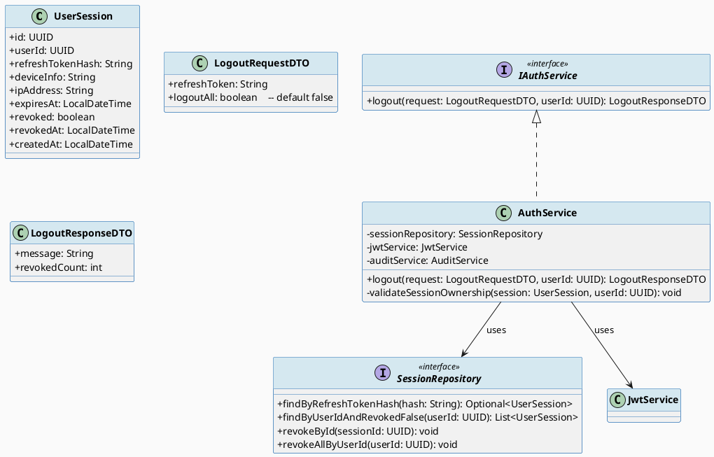
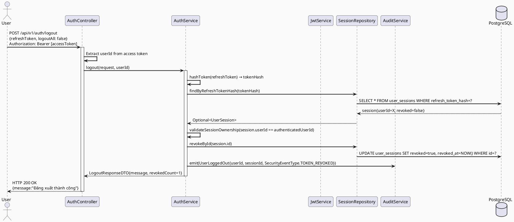
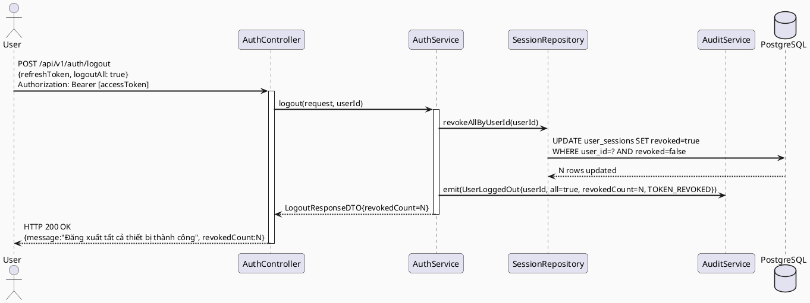
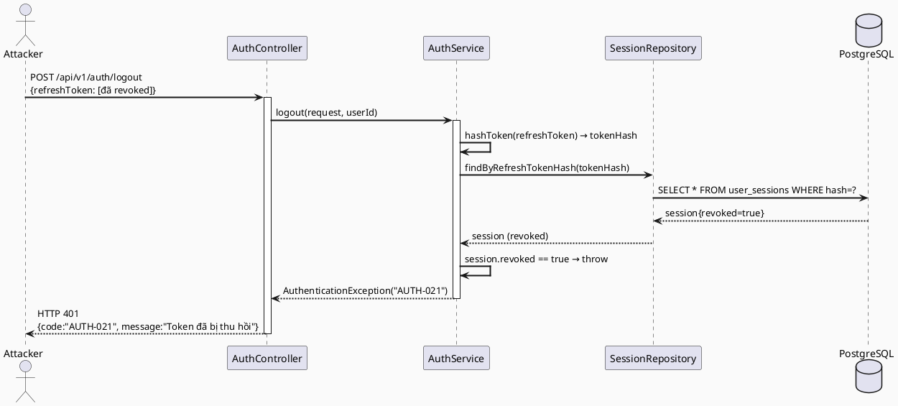
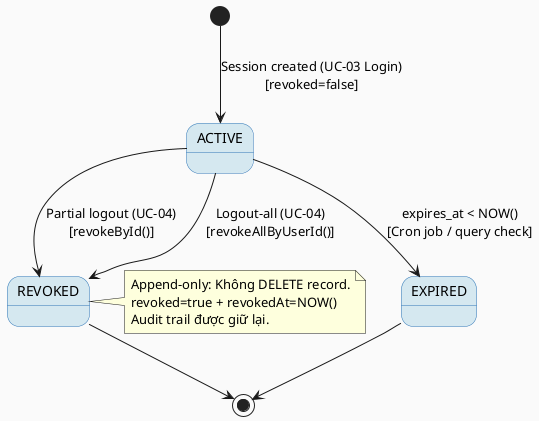

# ENGINEERING DOCUMENTATION STANDARD (EDS) v2.0
# Technical Design Specification — UC-04 Logout

| Field | Value |
|-------|-------|
| **Document ID** | `CB-AUTH-IMP-004` |
| **Version** | `1.0` |
| **Date** | `2026-06-26` |
| **Status** | `Approved` |
| **Document Owner** | `PhuongNT` |
| **Author** | `AI Agent` |
| **Reviewed by** | `[Tech Lead]` |
| **DPO Sign-off** | `[ ] Pending` |
| **Approved by** | `[Principal Architect]` |
| **Last Review** | `2026-06-26` |
| **Based on EDS** | `v2.0` |

---

## CHANGELOG

| Ngày | Người thực hiện | Nội dung thay đổi |
|------|-----------------|-------------------|
| 2026-06-26 | AI Agent | Tạo tài liệu lần đầu cho UC-04 Logout |

---

## MỤC LỤC

1. [Tổng quan Module](#1-tổng-quan-module)
2. [Ma trận Truy vết (Traceability Matrix)](#2-ma-trận-truy-vết-traceability-matrix)
3. [Architecture Decision Records (ADR)](#3-architecture-decision-records-adr)
4. [Non-Functional Requirements & SLA](#4-non-functional-requirements--sla)
5. [Static Modeling (Mô hình Tĩnh)](#5-static-modeling-mô-hình-tĩnh)
6. [Dynamic Modeling (Mô hình Động)](#6-dynamic-modeling-mô-hình-động)
7. [Domain Event Catalog](#7-domain-event-catalog)
8. [Interface Specification (Đặc tả Giao diện)](#8-interface-specification-đặc-tả-giao-diện)
9. [API Specification](#9-api-specification)
10. [Bảng mã lỗi (Error Codes)](#10-bảng-mã-lỗi-error-codes)
11. [Quy trình Triển khai (Step-by-Step)](#11-quy-trình-triển-khai-step-by-step)
12. [Rollback & Incident Runbook](#12-rollback--incident-runbook)
13. [Kịch bản Kiểm thử Chi tiết](#13-kịch-bản-kiểm-thử-chi-tiết)
14. [Phương pháp Xác minh](#14-phương-pháp-xác-minh)
15. [Mẫu thử thực tế (API Verification Samples)](#15-mẫu-thử-thực-tế-api-verification-samples)
16. [Bảng tổng hợp phân quyền (Authorization Matrix)](#16-bảng-tổng-hợp-phân-quyền-authorization-matrix)
17. [AI Prompt Constraints (CASE 2.0)](#17-ai-prompt-constraints-case-20)

---

## 1. Tổng quan Module

| Field | Value |
|-------|-------|
| **Module Name** | `Logout` |
| **Bounded Context** | `auth` |
| **UC ID** | `UC-04` |
| **SRS Reference** | `3.1.1.4` |
| **Primary Actor** | `Authenticated User (MOTHER / EXPERT — với valid access token)` |
| **Platform** | `Web App + Mobile App` |
| **Data Classification** | `Sensitive-PII` |
| **Compliance Scope** | `BR-RBAC, BR-SECURITY, PDPA` |
| **Upstream Dependencies** | `UC-03 Login (user_sessions table)` |
| **Downstream Consumers** | `audit (SecurityEventLog), session management` |

**Mô tả:** Người dùng đã đăng nhập gửi request logout kèm refresh token. Hệ thống thu hồi session tương ứng (partial logout — chỉ thiết bị hiện tại) hoặc thu hồi tất cả sessions (logout-all). Token revocation được ghi nhận bằng `SecurityEventType.TOKEN_REVOKED`. Access token hiện tại vẫn hợp lệ cho đến khi hết hạn (stateless JWT), chỉ refresh token bị vô hiệu hóa.

---

## 2. Ma trận Truy vết (Traceability Matrix)

| Requirement ID | Loại | Mô tả yêu cầu | Thành phần Code | Compliance Target | ADR liên quan |
|----------------|------|---------------|-----------------|-------------------|---------------|
| UC-04 | Use Case | User logout, thu hồi session | `AuthController.logout()` | BR-RBAC | ADR-AUTH-009 |
| BR-LOGOUT-001 | Business Rule | Ghi SecurityEventType.TOKEN_REVOKED khi logout | `AuditService.emit(TOKEN_REVOKED)` | Security Audit | ADR-AUTH-009 |
| BR-LOGOUT-002 | Business Rule | Partial logout chỉ thu hồi session hiện tại | `SessionRepository.revokeById()` | Security | ADR-AUTH-009 |
| BR-LOGOUT-003 | Business Rule | Logout-all thu hồi mọi session của user | `SessionRepository.revokeAllByUserId()` | Security | ADR-AUTH-009 |
| BR-LOGOUT-004 | Business Rule | Refresh token không hợp lệ → từ chối | `SessionService.validateRefreshToken()` | Security | ADR-AUTH-009 |
| BR-LOGOUT-005 | Business Rule | Access token vẫn hợp lệ cho đến hết hạn | Stateless JWT — không blacklist | Architecture | ADR-AUTH-010 |
| BR-LOGOUT-006 | Business Rule | Refresh token đã revoked không thể dùng lại | `UserSession.revoked == false` check | Security | ADR-AUTH-009 |
| BR-LOGOUT-007 | Business Rule | Chỉ owner của session mới được logout nó | `session.userId == authenticatedUserId` | Security | ADR-AUTH-009 |

---

## 3. Architecture Decision Records (ADR)

### ADR-AUTH-009 — Partial logout (single session) vs logout-all, cả hai supported

| Field | Value |
|-------|-------|
| **Status** | `Accepted` |
| **Deciders** | `PhuongNT — Backend Lead` |
| **Date** | `2026-06-26` |
| **Supersedes** | `—` |

#### Bối cảnh (Context)
Người dùng CareBridge sử dụng cả phone (Flutter) và browser. Họ cần khả năng đăng xuất từ một thiết bị cụ thể (ví dụ: điện thoại bị mất) mà không ảnh hưởng các thiết bị khác. Đồng thời cần option đăng xuất toàn bộ.

#### Các phương án đã xem xét (Options Considered)

| Phương án | Mô tả | Ưu điểm | Nhược điểm |
|-----------|-------|----------|------------|
| A | Single endpoint, query param `?all=true/false` | + Linh hoạt, 1 endpoint | - Cần validate query param |
| B | 2 endpoints: `/logout` và `/logout-all` | + Rõ ràng, explicit intent | - Thêm endpoint |
| C | Chỉ logout-all | + Đơn giản | - Kém UX khi đăng xuất 1 thiết bị |

#### Quyết định (Decision)
Chọn **Phương án A**: Một endpoint `POST /api/v1/auth/logout` với request body chứa `refreshToken` và optional `logoutAll: boolean`. Default = partial logout.

#### Hệ quả (Consequences)

**Tích cực:**
- Flexible: hỗ trợ cả 2 use cases
- Một endpoint để maintain

**Tiêu cực / Trade-offs:**
- `logoutAll=true` là destructive — cần confirmation trong UI (không phải trách nhiệm backend)

**Compliance Impact:**
- Tuân thủ PDPA yêu cầu quyền kiểm soát session của người dùng

---

### ADR-AUTH-010 — Access token không bị blacklist (stateless); chỉ refresh token được revoke

| Field | Value |
|-------|-------|
| **Status** | `Accepted` |
| **Deciders** | `PhuongNT — Backend Lead` |
| **Date** | `2026-06-26` |

#### Bối cảnh (Context)
Blacklisting access token yêu cầu kiểm tra Redis/DB trên mỗi request → tăng latency. Access token TTL chỉ 15 phút — window rủi ro nhỏ.

#### Quyết định (Decision)
Chấp nhận window tối đa 15 phút sau logout trong đó access token vẫn technically valid nhưng không thể refresh. Đây là trade-off tiêu chuẩn trong JWT architecture.

#### Hệ quả (Consequences)

**Tích cực:**
- Không tăng latency trên mọi API call
- Kiến trúc đơn giản hơn

**Tiêu cực / Trade-offs:**
- After logout, stolen access token valid ≤ 15 phút — documented risk, mitigated by short TTL
- Cần document rõ cho security team

---

## 4. Non-Functional Requirements & SLA

### 4.1. Performance & Availability

| Category | Requirement | Target SLA | Measurement Method | Compliance Basis |
|----------|-------------|------------|---------------------|------------------|
| Latency | Logout API response (p99) | `< 300ms` | k6 load test | — |
| Availability | Uptime (monthly) | `99.9%` | Uptime monitor | — |

### 4.2. Security

| Category | Requirement | Target | Verification Method | Compliance Basis |
|----------|-------------|--------|---------------------|------------------|
| Token Revocation | Revoked session không thể refresh | 100% | Integration test | BR-LOGOUT-004 |
| Audit | TOKEN_REVOKED event ghi đúng | 100% | Log inspection | BR-LOGOUT-001 |
| Authorization | Chỉ owner logout session của mình | 100% | Unit test | BR-LOGOUT-007 |
| Replay Prevention | Revoked refresh token bị từ chối | 100% | Security test | BR-LOGOUT-006 |

---

## 5. Static Modeling (Mô hình Tĩnh)

### 5.1. Class Diagram (PlantUML)



### 5.2. Data Structure (PostgreSQL DDL)

```sql
-- Không cần migration mới.
-- user_sessions đã có: revoked BOOLEAN, revoked_at TIMESTAMP.
-- Tham chiếu V3 từ UC-03.

-- Verify cấu trúc hiện tại:
-- SELECT column_name, data_type FROM information_schema.columns
-- WHERE table_name = 'user_sessions';
```

---

## 6. Dynamic Modeling (Mô hình Động)

### 6.1. Sequence Diagram — Happy Path (Partial Logout)



### 6.2. Sequence Diagram — Logout-All



### 6.3. Sequence Diagram — Error Path (Revoked token dùng lại)



### 6.4. State Machine — UserSession Status



---

## 7. Domain Event Catalog

### 7.1. Events Published (Phát ra)

| Event Name | Trigger | Publisher | Subscriber(s) | Payload Schema | Async? |
|------------|---------|-----------|---------------|----------------|--------|
| `UserLoggedOut` | Partial logout thành công | `AuthService` | `AuditService` | Xem §7.3 | Yes |
| `UserLoggedOutAll` | Logout-all thành công | `AuthService` | `AuditService, NotificationService` | `{userId, revokedCount, ip}` | Yes |

### 7.2. Events Consumed (Tiêu thụ)

*(Không có)*

### 7.3. Payload Schema

```java
// UserLoggedOutEvent.java
public record UserLoggedOutEvent(
    String eventId,
    String eventType,           // "UserLoggedOut"
    Instant occurredAt,
    String version,             // "1.0"
    Payload payload,
    Metadata metadata
) {
    public record Payload(
        UUID userId,
        UUID sessionId,          // null nếu logoutAll
        boolean logoutAll,
        int revokedCount,
        String ipAddress,
        String securityEventType  // "TOKEN_REVOKED"
    ) {}

    public record Metadata(
        String correlationId,
        String causedBy          // userId
    ) {}
}
```

---

## 8. Interface Specification (Đặc tả Giao diện)

### 8.1. Service Interface

```java
// IAuthService.java (bổ sung logout)
// @version 1.0
package com.carebridge.backend.auth.service;

import com.carebridge.backend.auth.dto.LogoutRequestDTO;
import com.carebridge.backend.auth.dto.LogoutResponseDTO;
import java.util.UUID;

public interface IAuthService {

    /**
     * Đăng xuất: thu hồi session liên kết với refresh token.
     * Nếu logoutAll=true, thu hồi tất cả sessions của user.
     *
     * @param request       DTO chứa refreshToken và logoutAll flag
     * @param userId        ID của user đang đăng nhập (từ access token)
     * @param ipAddress     IP của client
     * @return LogoutResponseDTO với số session bị thu hồi
     * @throws AuthenticationException  AUTH-021 khi token đã revoked
     * @throws AuthorizationException   AUTH-022 khi session không thuộc về user
     * @throws ResourceNotFoundException AUTH-023 khi session không tìm thấy
     */
    LogoutResponseDTO logout(LogoutRequestDTO request, UUID userId, String ipAddress);
}
```

### 8.2. Repository Interface

```java
// SessionRepository.java (đã khai báo ở UC-03, bổ sung thêm method)
// @version 1.0
package com.carebridge.backend.auth.repository;

import com.carebridge.backend.auth.entity.UserSession;
import org.springframework.data.jpa.repository.JpaRepository;
import org.springframework.data.jpa.repository.Modifying;
import org.springframework.data.jpa.repository.Query;

import java.util.List;
import java.util.Optional;
import java.util.UUID;

public interface SessionRepository extends JpaRepository<UserSession, UUID> {
    Optional<UserSession> findByRefreshTokenHash(String hash);
    List<UserSession> findByUserIdAndRevokedFalse(UUID userId);

    @Modifying
    @Query("UPDATE UserSession s SET s.revoked = true, s.revokedAt = CURRENT_TIMESTAMP WHERE s.id = :sessionId")
    void revokeById(UUID sessionId);

    @Modifying
    @Query("UPDATE UserSession s SET s.revoked = true, s.revokedAt = CURRENT_TIMESTAMP WHERE s.userId = :userId AND s.revoked = false")
    int revokeAllByUserId(UUID userId);
}
```

### 8.3. DTO Definitions

```java
// LogoutRequestDTO.java
package com.carebridge.backend.auth.dto;

import jakarta.validation.constraints.NotBlank;

public record LogoutRequestDTO(
    @NotBlank
    String refreshToken,

    boolean logoutAll    // default false — handled in service if null
) {}

// LogoutResponseDTO.java
public record LogoutResponseDTO(
    String message,
    int revokedCount
) {}
```

---

## 9. API Specification

### 9.1. Endpoints Table

| Method | Path | Auth Level | Required Roles | Rate Limit | Idempotent? |
|--------|------|------------|----------------|------------|-------------|
| `POST` | `/api/v1/auth/logout` | JWT Bearer | `ROLE_MOTHER, ROLE_EXPERT` | 10/min per user | Yes (idempotent: logout twice → same result) |

### 9.2. Request / Response Schemas

#### `POST /api/v1/auth/logout` — Đăng xuất thiết bị hiện tại

**Request Body:**
```json
{
  "refreshToken": "eyJhbGciOiJIUzI1NiJ9...",
  "logoutAll": false
}
```

**Request Headers:**
```
Authorization: Bearer [ACCESS_TOKEN]
Content-Type: application/json
```

**Response — 200 OK (Partial Logout):**
```json
{
  "success": true,
  "data": {
    "message": "Đăng xuất thành công",
    "revokedCount": 1
  }
}
```

**Response — 200 OK (Logout All):**
```json
{
  "success": true,
  "data": {
    "message": "Đăng xuất tất cả thiết bị thành công",
    "revokedCount": 3
  }
}
```

**Response — 401 (Token đã revoked):**
```json
{
  "success": false,
  "error": {
    "code": "AUTH-021",
    "message": "Token đã bị thu hồi hoặc không hợp lệ"
  }
}
```

**Response — 401 (Không có access token):**
```json
{
  "success": false,
  "error": {
    "code": "AUTH-020",
    "message": "Yêu cầu xác thực"
  }
}
```

---

## 10. Bảng mã lỗi (Error Codes)

| Code | HTTP Status | Message (EN) | Message (VI) | Trigger Condition |
|------|-------------|--------------|--------------|-------------------|
| `AUTH-020` | 401 | Authentication required | Yêu cầu xác thực | Không có access token |
| `AUTH-021` | 401 | Token already revoked | Token đã bị thu hồi | session.revoked == true |
| `AUTH-022` | 403 | Forbidden: session ownership | Không có quyền thu hồi session này | session.userId != authenticatedUserId |
| `AUTH-023` | 404 | Session not found | Không tìm thấy session | refresh token hash không có trong DB |
| `AUTH-024` | 400 | Missing refresh token | Thiếu refresh token | refreshToken null/blank |

---

## 11. Quy trình Triển khai (Step-by-Step)

### 11.1. Prerequisites

- [ ] UC-03 đã implement (user_sessions table tồn tại, SessionRepository có sẵn)
- [ ] `SecurityEventType.TOKEN_REVOKED` đã có trong enum
- [ ] JwtService có thể extract userId từ access token

### 11.2. Pre-Migration Checklist

- [ ] Không cần migration mới (dùng lại user_sessions từ V3)

### 11.3. Implementation Steps

#### Chặng 1 — AuthService.logout()

```java
@Override
@Transactional
public LogoutResponseDTO logout(LogoutRequestDTO request, UUID userId, String ipAddress) {
    if (request.logoutAll()) {
        return logoutAll(userId, ipAddress);
    }
    return logoutSingle(request.refreshToken(), userId, ipAddress);
}

private LogoutResponseDTO logoutSingle(String refreshToken, UUID userId, String ipAddress) {
    String tokenHash = DigestUtils.sha256Hex(refreshToken);

    UserSession session = sessionRepository.findByRefreshTokenHash(tokenHash)
        .orElseThrow(() -> new ResourceNotFoundException("AUTH-023", "Không tìm thấy session"));

    if (session.isRevoked()) {
        throw new AuthenticationException("AUTH-021", "Token đã bị thu hồi");
    }

    if (!session.getUserId().equals(userId)) {
        throw new AuthorizationException("AUTH-022", "Không có quyền thu hồi session này");
    }

    sessionRepository.revokeById(session.getId());

    eventPublisher.publishEvent(new UserLoggedOutEvent(
        UUID.randomUUID().toString(), "UserLoggedOut", Instant.now(), "1.0",
        new UserLoggedOutEvent.Payload(userId, session.getId(), false, 1, ipAddress, "TOKEN_REVOKED"),
        new UserLoggedOutEvent.Metadata(MDC.get("correlationId"), userId.toString())
    ));

    return new LogoutResponseDTO("Đăng xuất thành công", 1);
}

private LogoutResponseDTO logoutAll(UUID userId, String ipAddress) {
    int revokedCount = sessionRepository.revokeAllByUserId(userId);

    eventPublisher.publishEvent(new UserLoggedOutEvent(
        UUID.randomUUID().toString(), "UserLoggedOut", Instant.now(), "1.0",
        new UserLoggedOutEvent.Payload(userId, null, true, revokedCount, ipAddress, "TOKEN_REVOKED"),
        new UserLoggedOutEvent.Metadata(MDC.get("correlationId"), userId.toString())
    ));

    return new LogoutResponseDTO(
        "Đăng xuất tất cả thiết bị thành công", revokedCount);
}
```

#### Chặng 2 — AuthController

```java
@PostMapping("/logout")
@PreAuthorize("isAuthenticated()")
public ApiResponse<LogoutResponseDTO> logout(
        @RequestBody @Valid LogoutRequestDTO request,
        @AuthenticationPrincipal UserDetails userDetails,
        HttpServletRequest httpRequest) {
    UUID userId = UUID.fromString(userDetails.getUsername());
    String ipAddress = httpRequest.getRemoteAddr();
    return ApiResponse.success(authService.logout(request, userId, ipAddress));
}
```

### 11.4. Deployment Checklist

- [ ] Logout single session → revoked=true trong DB
- [ ] Logout-all → tất cả sessions revoked
- [ ] SecurityEvent TOKEN_REVOKED ghi đúng
- [ ] Revoked token không thể được dùng để refresh

---

## 12. Rollback & Incident Runbook

### 12.1. Điều kiện kích hoạt Rollback

| Điều kiện | Ngưỡng | Người quyết định |
|-----------|--------|------------------|
| Logout không revoke session (session vẫn active) | Bất kỳ | Tech Lead |
| Logout-all thu hồi sessions của user khác | Bất kỳ | Tech Lead + DPO |
| SecurityEvent TOKEN_REVOKED không ghi | > 1% logouts | On-call |

### 12.2. Rollback Procedure

```bash
# Revert service code
git checkout -- src/main/java/com/carebridge/backend/auth/service/AuthService.java
git checkout -- src/main/java/com/carebridge/backend/auth/controller/AuthController.java

# Không cần undo migration (không thêm bảng mới)

# Emergency: Re-activate revoked sessions nếu bug rollback
# UPDATE user_sessions SET revoked=false, revoked_at=NULL
# WHERE revoked_at > '[deploy_time]' AND revoked_at < '[rollback_time]';
-- CẢNH BÁO: Chỉ dùng khi có lỗi logic nghiêm trọng
```

### 12.3. Notification Protocol

| Thời điểm | Người nhận | Kênh | Template |
|-----------|------------|------|----------|
| Ngay khi phát hiện session leak | On-call + DPO | Slack `#incident` + Email | "SECURITY: Logout bug — sessions not revoked" |
| Trong 30 phút | DPO | Email | Bắt buộc nếu sessions bị lộ |

---

## 13. Kịch bản Kiểm thử Chi tiết

### 13.1. Unit Tests

#### TC-UNIT-001 — Partial logout: thu hồi đúng session, không ảnh hưởng session khác

```gherkin
Feature: Logout
  Background:
    Given test data classification: SYNTHETIC
    And user "u-001" có 2 active sessions: session-A và session-B
    And request chứa refreshToken tương ứng session-A

  Scenario: Partial logout thành công
    Given user đã đăng nhập với access token hợp lệ
    When POST /api/v1/auth/logout với {refreshToken:[session-A token], logoutAll:false}
    Then response status là 200
    And response body chứa revokedCount = 1
    And user_sessions: session-A.revoked = true
    And user_sessions: session-B.revoked = false (KHÔNG bị ảnh hưởng)
    And SecurityEvent TOKEN_REVOKED được ghi với sessionId=session-A
```

#### TC-UNIT-002 — Logout-all: thu hồi tất cả sessions

```gherkin
  Scenario: Logout all devices
    Given user "u-001" có 3 active sessions
    When POST /api/v1/auth/logout với {refreshToken:[any], logoutAll:true}
    Then response body chứa revokedCount = 3
    And tất cả sessions của user-001 có revoked = true
    And SecurityEvent TOKEN_REVOKED với revokedCount=3
```

#### TC-UNIT-003 — Từ chối token đã revoked (replay attack)

```gherkin
  Scenario: Token đã bị thu hồi
    Given session-X có revoked = true
    When POST /api/v1/auth/logout với refreshToken của session-X
    Then response status là 401
    And error code "AUTH-021"
```

#### TC-UNIT-004 — Từ chối khi session thuộc về user khác

```gherkin
  Scenario: Session ownership violation
    Given session-Y thuộc về user "u-002"
    And request được gửi bởi user "u-001" (access token của u-001)
    When POST /api/v1/auth/logout với refreshToken của session-Y
    Then response status là 403
    And error code "AUTH-022"
    And session-Y KHÔNG bị revoke
```

### 13.2. Integration Tests

#### TC-INT-001 — Full flow: login → logout → refresh token không còn hiệu lực

```gherkin
  Scenario: Post-logout refresh token rejected
    Given test data classification: SYNTHETIC
    And PostgreSQL Testcontainer running
    When POST /api/v1/auth/login → receive refreshToken
    And POST /api/v1/auth/logout với refreshToken đó
    And POST /api/v1/auth/token/refresh với cùng refreshToken
    Then lần refresh: response status là 401, code AUTH-021
```

### 13.3. Security Tests

#### TC-SEC-001 — Access token vẫn hợp lệ trong window sau logout (documented behavior)

```gherkin
  Scenario: Access token window post-logout
    Given access token với TTL còn 5 phút
    When user logout thành công
    And gọi protected endpoint với access token vừa logout
    Then response status là 200 (access token vẫn valid — stateless JWT)
    -- NOTE: Đây là documented trade-off (ADR-AUTH-010), không phải bug
```

---

## 14. Phương pháp Xác minh

### 14.1. Database Inspection

```sql
-- Verify session bị revoke
SELECT id, user_id, revoked, revoked_at
FROM user_sessions
WHERE refresh_token_hash = '[hash]';
-- Expected: revoked = true, revoked_at IS NOT NULL

-- Verify logout-all
SELECT id, revoked, revoked_at
FROM user_sessions
WHERE user_id = '[userId]';
-- Expected: tất cả rows có revoked = true

-- Verify session của user khác không bị ảnh hưởng
SELECT COUNT(*) FROM user_sessions
WHERE user_id != '[userId]' AND revoked = true;
-- Expected: count không tăng sau logout
```

### 14.2. Log / Audit Verification

```bash
# Kiểm tra TOKEN_REVOKED event
grep '"securityEventType":"TOKEN_REVOKED"' /var/log/carebridge/security.log | tail -5

# Verify refreshToken không xuất hiện trong log
grep -E '"refreshToken"\s*:\s*"ey' /var/log/carebridge/app.log
# Expected: No output
```

---

## 15. Mẫu thử thực tế (API Verification Samples)

### 15.1. Partial Logout

```bash
# Step 1: Login để lấy tokens
LOGIN_RESPONSE=$(curl -s -X POST http://localhost:8080/api/v1/auth/login \
  -H "Content-Type: application/json" \
  -d '{"identifier":"testmother@example.com","password":"SecureP@ss1","deviceInfo":"test"}')

ACCESS_TOKEN=$(echo $LOGIN_RESPONSE | python3 -c "import sys,json; print(json.load(sys.stdin)['data']['accessToken'])")
REFRESH_TOKEN=$(echo $LOGIN_RESPONSE | python3 -c "import sys,json; print(json.load(sys.stdin)['data']['refreshToken'])")

# Step 2: Logout
curl -X POST http://localhost:8080/api/v1/auth/logout \
  -H "Authorization: Bearer $ACCESS_TOKEN" \
  -H "Content-Type: application/json" \
  -H "X-Correlation-Id: $(uuidgen)" \
  -d "{\"refreshToken\":\"$REFRESH_TOKEN\",\"logoutAll\":false}"
```

**Expected Response (200):**
```json
{
  "success": true,
  "data": {
    "message": "Đăng xuất thành công",
    "revokedCount": 1
  }
}
```

### 15.2. Logout without access token → 401

```bash
curl -X POST http://localhost:8080/api/v1/auth/logout \
  -H "Content-Type: application/json" \
  -d '{"refreshToken":"some-token","logoutAll":false}'
```

**Expected Response (401):**
```json
{
  "success": false,
  "error": {
    "code": "AUTH-020",
    "message": "Yêu cầu xác thực"
  }
}
```

---

## 16. Bảng tổng hợp phân quyền (Authorization Matrix)

| Endpoint | `GUEST` | `MOTHER` | `EXPERT` | `ADMIN` | `SYSTEM` |
|----------|---------|----------|----------|---------|----------|
| `POST /api/v1/auth/logout` | ❌ | ✅ Own sessions | ✅ Own sessions | ✅ Any session | ❌ |

**Chú thích:**
- ✅ Own sessions = chỉ thu hồi sessions của chính mình
- ADMIN có thể force-logout bất kỳ user (separate admin endpoint, không nằm trong UC-04)

---

## 17. AI Prompt Constraints (CASE 2.0)

### 17.1 Constraint Summary Table

| # | Constraint | Source (ADR/BR) | Last Verified |
|---|-----------|-----------------|---------------|
| C1 | PHẢI ghi `SecurityEventType.TOKEN_REVOKED` khi logout thành công | `BR-LOGOUT-001` | `2026-06-26` |
| C2 | Partial logout: chỉ revoke session khớp với `SHA-256(refreshToken)` — KHÔNG revoke session khác | `BR-LOGOUT-002`, `ADR-AUTH-009` | `2026-06-26` |
| C3 | PHẢI verify `session.userId == authenticatedUserId` trước khi revoke | `BR-LOGOUT-007` | `2026-06-26` |
| C4 | Access token KHÔNG bị blacklist — đây là documented trade-off, KHÔNG thêm token blacklist | `ADR-AUTH-010` | `2026-06-26` |
| C5 | KHÔNG delete session records — chỉ set `revoked=true, revokedAt=NOW()` (audit trail) | `BR-LOGOUT-001` | `2026-06-26` |

### 17.2 Constraint Injection Block

```
[CONSTRAINT BLOCK — Module: Logout]
Theo TDS CB-AUTH-IMP-004 và ADR-AUTH-009, ADR-AUTH-010:

1. PHẢI emit SecurityEventType.TOKEN_REVOKED sau mỗi logout thành công.
2. Partial logout: revoke chỉ session tương ứng SHA-256(refreshToken). KHÔNG ảnh hưởng sessions khác.
3. PHẢI verify session.userId == authenticatedUserId trước khi revoke (throw AUTH-022 nếu không khớp).
4. KHÔNG implement token blacklist cho access token — đây là trade-off đã accepted (ADR-AUTH-010).
5. KHÔNG DELETE session records — chỉ UPDATE revoked=true, revokedAt=NOW().

[CONTEXT BLOCK]
- Bounded Context: auth
- user_sessions: §5.2 DDL (revoked, revokedAt columns)
- SecurityEventType enum: đã có TOKEN_REVOKED
- Error codes: §10 (AUTH-020 đến AUTH-024)
- Auth matrix: §16
```

### 17.3 Constraint Quality Checklist

- [x] Mỗi constraint traceable về ADR hoặc BR
- [x] Không có constraint generic
- [x] Constraint block có ≥ 5 constraints cụ thể
- [x] Reference §16 Auth Matrix

### 17.4 Anti-Pattern Detection

| AP-ID | Anti-Pattern | Dấu hiệu | Hành động |
|-------|-------------|-----------|----------|
| AP-AI-001 | Unconstrained Gen | Logout không ghi SecurityEvent | Reject — enforce C1 |
| AP-AI-003 | Implicit Decision | Code thêm JWT blacklist không có ADR | Reject — document trong ADR trước |
| AP-AI-005 | Hallucinated Contract | Import `TokenBlacklistService` không trong §8 | Reject |

---

## PHỤ LỤC

### A. Glossary

| Thuật ngữ | Định nghĩa |
|-----------|------------|
| Partial Logout | Đăng xuất một thiết bị/session cụ thể |
| Logout-All | Đăng xuất tất cả thiết bị — revoke mọi session |
| TOKEN_REVOKED | SecurityEventType — ghi nhận khi token bị thu hồi chủ động |
| Append-only Session | Không DELETE session records — giữ audit trail |
| Stateless JWT | Access token không thể revoke trước hạn — chấp nhận window tối đa 15 phút |

### B. Tài liệu tham chiếu

| Document | Path |
|----------|------|
| SRS UC-04 | `02_Requirements/SRS/` |
| UC-03 Login TDS | `04_Implement/UC03_Login/UC03_Login_TDS.md` |
| ADR-AUTH-006 | §3 UC-03 TDS |
| OWASP Session Management Cheat Sheet | https://owasp.org/www-project-cheat-sheets/ |
