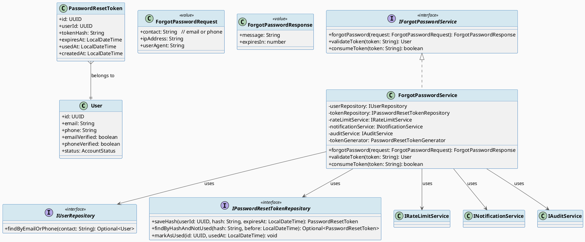
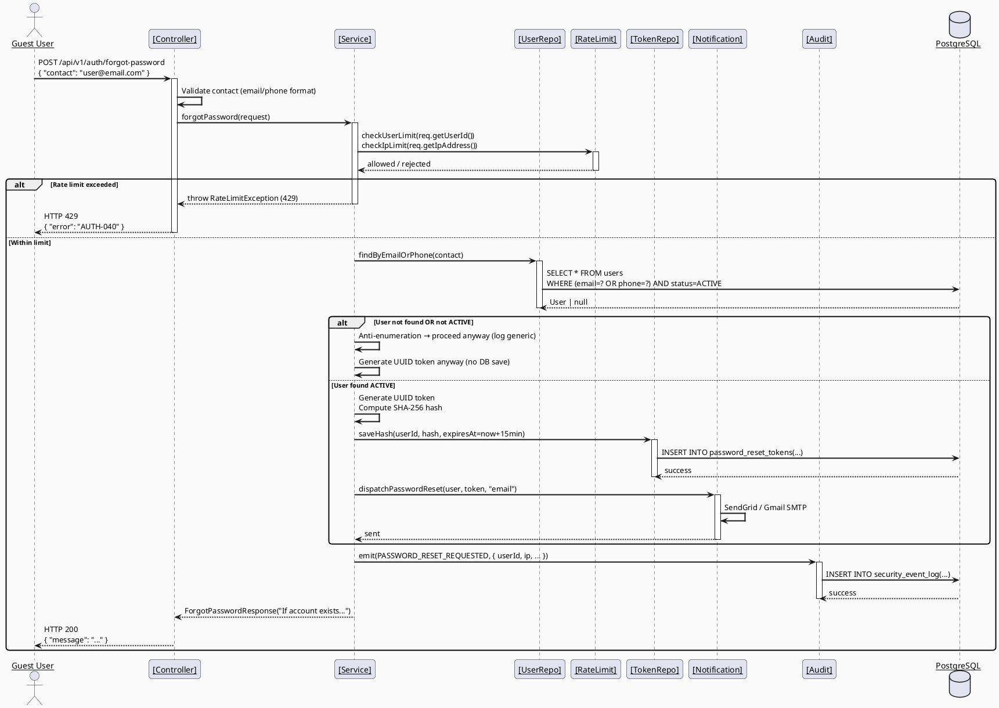
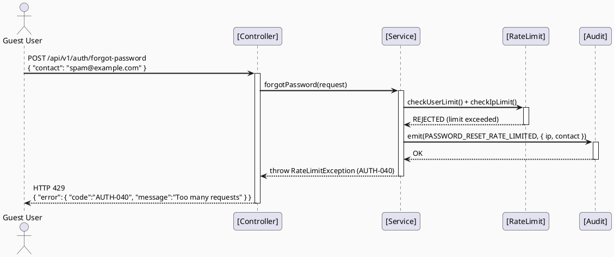
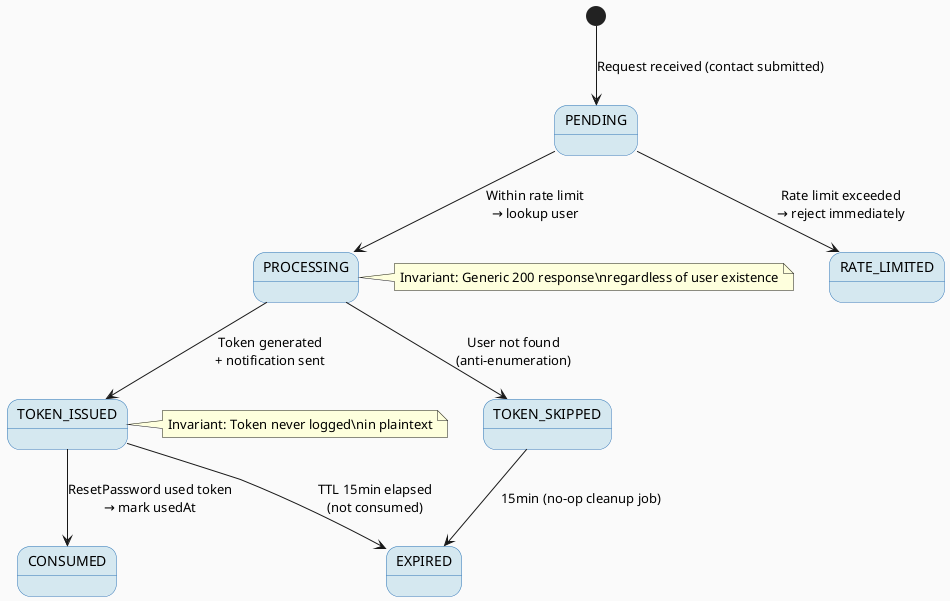

# ENGINEERING DOCUMENTATION STANDARD (EDS) v2.0

# Technical Design Specification — UC-05 Forgot Password

| Field                    | Value                     |
| ------------------------ | ------------------------- |
| **Document ID**    | `CB-AUTH-IMP-005`       |
| **Version**        | `1.0`                   |
| **Date**           | `2026-06-26`            |
| **Status**         | `Implemented`                 |
| **Document Owner** | `PhuongNT`              |
| **Author**         | `AI Agent`              |
| **Reviewed by**    | `[Tech Lead]`           |
| **DPO Sign-off**   | `[ ] Pending`           |
| **Approved by**    | `[Principal Architect]` |
| **Last Review**    | `2026-06-26`            |
| **Based on EDS**   | `v2.0`                  |

---

## CHANGELOG

| Ngày      | Người thực hiện | Nội dung thay đổi                                 |
| ---------- | ------------------- | ---------------------------------------------------- |
| 2026-06-26 | AI Agent            | Tạo tài liệu lần đầu cho UC-05 Forgot Password |

---

## MỤC LỤC

1. [Tổng quan Module](#1-tổng-quan-module)
2. [Ma trận Truy vết (Traceability Matrix)](#2-ma-trận-truy-vết-traceability-matrix)
3. [Architecture Decision Records (ADR)](#3-architecture-decision-records-adr)
4. [Non-Functional Requirements &amp; SLA](#4-non-functional-requirements--sla)
5. [Static Modeling (Mô hình Tĩnh)](#5-static-modeling-mô-hình-tĩnh)
6. [Dynamic Modeling (Mô hình Động)](#6-dynamic-modeling-mô-hình-động)
7. [Domain Event Catalog](#7-domain-event-catalog)
8. [Interface Specification (Đặc tả Giao diện)](#8-interface-specification-đặc-tả-giao-diện)
9. [API Specification](#9-api-specification)
10. [Bảng mã lỗi (Error Codes)](#10-bảng-mã-lỗi-error-codes)
11. [Quy trình Triển khai (Step-by-Step)](#11-quy-trình-triển-khai-step-by-step)
12. [Rollback &amp; Incident Runbook](#12-rollback--incident-runbook)
13. [Kịch bản Kiểm thử Chi tiết](#13-kịch-bản-kiểm-thử-chi-tiết)
14. [Phương pháp Xác minh](#14-phương-pháp-xác-minh)
15. [Mẫu thử thực tế (API Verification Samples)](#15-mẫu-thử-thực-tế-api-verification-samples)
16. [Bảng tổng hợp phân quyền (Authorization Matrix)](#16-bảng-tổng-hợp-phân-quyền-authorization-matrix)
17. [AI Prompt Constraints (CASE 2.0)](#17-ai-prompt-constraints-case-20)

---

## 1. Tổng quan Module

| Field                           | Value                                                                  |
| ------------------------------- | ---------------------------------------------------------------------- |
| **Module Name**           | `ForgotPassword`                                                     |
| **Bounded Context**       | `auth`                                                               |
| **UC ID**                 | `UC-05`                                                              |
| **SRS Reference**         | `3.1.1.5`                                                            |
| **Primary Actor**         | `Guest (unauthenticated)`                                            |
| **Platform**              | `Web App + Mobile App`                                               |
| **Data Classification**   | `Sensitive-PII`                                                      |
| **Compliance Scope**      | `BR-RBAC, BR-SECURITY, PDPA`                                         |
| **Upstream Dependencies** | `UC-02 VerifyOTP (account must be ACTIVE)`                           |
| **Downstream Consumers**  | `UC-06 ResetPassword, Audit (SecurityEventLog), NotificationService` |

**Mô tả:** Guest user gửi email/số điện thoại để yêu cầu đặt lại mật khẩu. Hệ thống xác thực user tồn tại và ACTIVE, tạo reset token UUID (TTL 15 phút), lưu SHA-256 hash vào `password_reset_tokens`, và gửi email với link reset (hoặc SMS với mã 6 số nếu phone được verify). Trả về response 200 đồng nhất (anti-enumeration). Rate limit: 3/user/giờ, 10/IP/giờ.

---

## 2. Ma trận Truy vết (Traceability Matrix)

| Requirement ID | Loại         | Mô tả yêu cầu                                   | Thành phần Code                               | Compliance Target | ADR liên quan |
| -------------- | ------------- | --------------------------------------------------- | ----------------------------------------------- | ----------------- | -------------- |
| UC-05          | Use Case      | Request password reset → email/SMS                 | `ForgotPasswordController.forgotPassword()`   | BR-RBAC           | ADR-AUTH-011   |
| BR-AUTH-011    | Business Rule | Validate user exists & ACTIVE                       | `UserService.validateUserForReset()`          | Security          | ADR-AUTH-011   |
| BR-AUTH-012    | Business Rule | Generate secure reset token (UUID, TTL 15min)       | `PasswordResetTokenGenerator.generate()`      | Security          | ADR-AUTH-012   |
| BR-AUTH-013    | Business Rule | Store token as SHA-256 hash (constant-time compare) | `PasswordResetTokenRepository.saveHash()`     | Security          | ADR-AUTH-012   |
| BR-AUTH-014    | Business Rule | Anti-enumeration: always return 200 generic         | `ForgotPasswordController` response           | PDPA              | ADR-AUTH-013   |
| BR-AUTH-015    | Business Rule | Rate limit: user 3/giờ, IP 10/giờ                 | `RateLimitService` với Redis sliding window  | Security          | ADR-AUTH-014   |
| BR-AUTH-016    | Business Rule | Send email if verified, else SMS if phone verified  | `NotificationService.dispatchPasswordReset()` | Usability         | ADR-AUTH-015   |
| BR-AUTH-017    | Business Rule | Audit event`PASSWORD_RESET_REQUESTED`             | `AuditService.emit()`                         | Security Audit    | ADR-AUTH-016   |

---

## 3. Architecture Decision Records (ADR)

### ADR-AUTH-011 — Use existing user table, no separate "forgot password" entity

| Field              | Value                        |
| ------------------ | ---------------------------- |
| **Status**   | `Accepted`                 |
| **Deciders** | `PhuongNT — Backend Lead` |
| **Date**     | `2026-06-26`               |

#### Bối cảnh (Context)

Forgot Password cần xác thực user tồn tại nhưng không yêu cầu user đang authenticated. Cần cách kiểm tra identity mà không expose thông tin user.

#### Các phương án đã xem xét (Options Considered)

| Phương án | Mô tả                                | Ưu điểm                           | Nhược điểm                 |
| ------------ | -------------------------------------- | ------------------------------------ | ------------------------------ |
| A            | Query`User` table by email/phone     | + Reuse existing entity, đơn giản | - Tiếp cận PII cần audit    |
| B            | Separate`PasswordResetRequest` table | + Isolated audit trail               | - Thêm bảng, sync complexity |

#### Quyết định (Decision)

Chọn **Phương án A**: Reuse `User` entity, chỉ đọc `email`, `phone`, `status`. Không lưu thêm gì ngoài reset token hash trong `password_reset_tokens`.

#### Hệ quả (Consequences)

**Tích cực:**

- Không thêm bảng mới, giảm complexity
- Leverage existing RBAC trên User entity

**Tiêu cực / Trade-offs:**

- Query vào bảng User chứa PII → cần audit log access

**Compliance Impact:**

- PDPA Art. 32 — giám sát access vào PII

---

### ADR-AUTH-012 — Reset token: UUID + SHA-256 hash, constant-time compare, TTL 15 phút

| Field              | Value                        |
| ------------------ | ---------------------------- |
| **Status**   | `Accepted`                 |
| **Deciders** | `PhuongNT — Backend Lead` |
| **Date**     | `2026-06-26`               |

#### Bối cảnh (Context)

Reset token là single-use credential. Nếu lưu plaintext trong DB, compromise → attacker dùng trực tiếp. Cần storage resistant đến theft.

#### Các phương án đã xem xét (Options Considered)

| Phương án | Mô tả                              | Ưu điểm                            | Nhược điểm                         |
| ------------ | ------------------------------------ | ------------------------------------- | -------------------------------------- |
| A            | UUID plaintext + TTL index           | + Đơn giản                         | - DB compromise → immediate abuse     |
| B            | SHA-256 hash + constant-time compare | + DB theft không dùng được token | - Cần compute hash mỗi lần validate |
| C            | Encrypted token (AES)                | + Reversible nếu cần                | - Key management, complexity           |

#### Quyết định (Decision)

Chọn **Phương án B**: `token = UUID.randomUUID()`, `hash = SHA256(token)`. Lưu `hash`, `expiresAt`. Validate bằng `MessageDigest.isEqual()`.

#### Hệ quả (Consequences)

**Tích cực:**

- DB theft không dùng được reset token
- Constant-time compare ngăn timing attack

**Tiêu cực / Trade-offs:**

- Không thể recover token nếu mất (by design)
- Compute hash thêm ~1ms (acceptable)

**Compliance Impact:**

- GDPR Art. 32 — security of processing

---

### ADR-AUTH-013 — Anti-enumeration: always HTTP 200 + generic message

| Field              | Value                        |
| ------------------ | ---------------------------- |
| **Status**   | `Accepted`                 |
| **Deciders** | `PhuongNT — Backend Lead` |
| **Date**     | `2026-06-26`               |

#### Bối cảnh (Context)

Nếu trả về "User not found" vs "Email sent", attacker có thể probe database để enumerate valid accounts.

#### Quyết định (Decision)

Luôn trả về HTTP 200 với message: `"If the account exists and is active, a reset instruction has been sent to the provided contact."` — bất kể user tồn tại hay không.

#### Hệ quả (Consequences)

**Tích cực:**

- Ngăn account enumeration
- User experience: không tiết lộ thông tin

**Tiêu cực / Trade-offs:**

- Legitimate user không biết nhầm email/phone → rate limit hỗ trợ

---

### ADR-AUTH-014 — Rate limit: 3/user/giờ, 10/IP/giờ via Redis sliding window

| Field              | Value                        |
| ------------------ | ---------------------------- |
| **Status**   | `Accepted`                 |
| **Deciders** | `PhuongNT — Backend Lead` |
| **Date**     | `2026-06-26`               |

#### Bối cảnh (Context)

Forgot Password là attack vector phổ biến (credential stuffing, spam). Cần giới hạn request để giảm tấn công và DoS.

#### Các phương án đã xem xét

| Phương án | Mô tả                           | Ưu điểm              | Nhược điểm               |
| ------------ | --------------------------------- | ----------------------- | ---------------------------- |
| A            | Fixed window (token bucket)       | + Đơn giản           | - Bypass được ở boundary |
| B            | Sliding window (Redis sorted set) | + Chính xác, an toàn | - Cần Redis                 |
| C            | Leaky bucket                      | + Smooth                | - Khó tune                  |

#### Quyết định (Decision)

Chọn **Phương án B**: Redis sorted set `ZADD` với timestamp, `ZREMRANGEBYSCORE` để giữ window 1h, `ZCARD` để count.

#### Hệ quả (Consequences)

**Tích cực:**

- Sliding window chống burst tại boundary
- Separate limits user vs IP → chống cả user-targeted và IP-targeted spam

**Tiêu cực / Trade-offs:**

- Phụ thuộc Redis availability

---

### ADR-AUTH-015 — Notification fallback: email → SMS nếu phone verified

| Field              | Value                        |
| ------------------ | ---------------------------- |
| **Status**   | `Accepted`                 |
| **Deciders** | `PhuongNT — Backend Lead` |
| **Date**     | `2026-06-26`               |

#### Bối cảnh (Context)

Một số user chưa verify email nhưng verify phone (qua OTP). Cần gửi reset instruction qua kênh nào user có thể access.

#### Quyết định (Decision)

Primary: email (nếu `emailVerified=true`). Fallback: SMS (nếu `phoneVerified=true` và email gửi fail). Không gửi nếu cả hai đều unverified — user phải contact support.

#### Hệ quả (Consequences)

**Tích cực:**

- User có ít nhất 1 kênh nhận reset

**Tiêu cực / Trade-offs:**

- SMS tốn phí → chỉ dùng fallback

---

### ADR-AUTH-016 — Audit: log PASSWORD_RESET_REQUESTED event với minimal PII

| Field              | Value                        |
| ------------------ | ---------------------------- |
| **Status**   | `Accepted`                 |
| **Deciders** | `PhuongNT — Backend Lead` |
| **Date**     | `2026-06-26`               |

#### Bối cảnh (Context)

Mọi password reset request cần được audit cho security monitoring và compliance (GDPR Art. 30).

#### Quyết định (Decision)

Publish `SecurityEventType.PASSWORD_RESET_REQUESTED` với payload: `{ userId, contactMethod: "email"|"sms", ipAddress, userAgent, requestId }`. Không log email/phone number trong event.

#### Hệ quả (Consequences)

**Tích cực:**

- Audit trail đầy đủ, PII-minimized
- Dễ monitor abnormal patterns

---

## 4. Non-Functional Requirements & SLA

### 4.1. Performance & Availability

| Category     | Requirement                       | Target SLA    | Measurement Method | Compliance Basis |
| ------------ | --------------------------------- | ------------- | ------------------ | ---------------- |
| Latency      | ForgotPassword API response (p99) | `< 500ms`   | k6 load test       | —               |
| Availability | Uptime (monthly)                  | `99.9%`     | Uptime monitor     | —               |
| Throughput   | Concurrent requests               | `200 req/s` | Load test          | —               |

### 4.2. Security

| Category         | Requirement                  | Target         | Verification Method | Compliance Basis |
| ---------------- | ---------------------------- | -------------- | ------------------- | ---------------- |
| Token secrecy    | Reset token never logged     | 0 incidents    | Log scan            | GDPR Art. 32     |
| Rate limiting    | User: 3/h, IP: 10/h enforced | 100%           | Integration test    | BR-AUTH-015      |
| Constant-time    | Token hash compare timing    | < 1ms variance | Profiling           | BR-AUTH-013      |
| Anti-enumeration | Response always 200 generic  | 100%           | Functional test     | ADR-AUTH-013     |

### 4.3. Data Integrity & Retention

| Category     | Requirement               | Target | Verification Method | Compliance Basis |
| ------------ | ------------------------- | ------ | ------------------- | ---------------- |
| Token TTL    | Expire after 15 minutes   | 100%   | DB query            | ADR-AUTH-012     |
| One-time use | Token consumed → deleted | 100%   | Integration test    | ADR-AUTH-012     |
| Append-only  | No UPDATE on used tokens  | 100%   | DB constraint       | GDPR Art. 5.1(e) |

### 4.4. Scalability & Capacity Planning

Forecast: ≤ 1000 reset requests/day trong peak season. Redis và DB có đủ capacity. Scale horizontally via stateless service.

---

## 5. Static Modeling (Mô hình Tĩnh)

### 5.1. Class Diagram (PlantUML)



---

### 5.2. Data Structure (Prisma Schema)

```sql
-- Flyway: V{n}__create_password_reset_tokens.sql
CREATE TABLE password_reset_tokens (
  id          UUID        PRIMARY KEY DEFAULT gen_random_uuid(),
  user_id     UUID        NOT NULL REFERENCES users(id) ON DELETE CASCADE,
  token_hash  VARCHAR(64) NOT NULL,
  expires_at  TIMESTAMPTZ NOT NULL,
  used_at     TIMESTAMPTZ,
  created_at  TIMESTAMPTZ NOT NULL DEFAULT NOW(),

  CONSTRAINT uq_prt_token_hash UNIQUE (token_hash)
);

CREATE INDEX idx_prt_token_hash  ON password_reset_tokens(token_hash);
CREATE INDEX idx_prt_user_active ON password_reset_tokens(user_id, expires_at) WHERE used_at IS NULL;
CREATE INDEX idx_prt_expires_at  ON password_reset_tokens(expires_at);
```

---

## 6. Dynamic Modeling (Mô hình Động)

### 6.1. Sequence Diagram — Happy Path (PlantUML)



---

### 6.2. Sequence Diagram — Error Path (PlantUML)



---

### 6.3. State Machine



---

## 7. Domain Event Catalog

### 7.1. Events Published

| Event Name                   | Trigger             | Publisher                 | Subscriber(s)                         | Payload Schema                       | Async? |
| ---------------------------- | ------------------- | ------------------------- | ------------------------------------- | ------------------------------------ | ------ |
| `PasswordResetRequested`   | User requests reset | `ForgotPasswordService` | `AuditService`, `SecurityMonitor` | `PasswordResetRequestedEvent.ts`   | Yes    |
| `PasswordResetRateLimited` | Rate limit exceeded | `ForgotPasswordService` | `SecurityMonitor`                   | `PasswordResetRateLimitedEvent.ts` | Yes    |

### 7.2. Events Consumed

| Event Name | Source | Handler | Action thực hiện                   |
| ---------- | ------ | ------- | ------------------------------------ |
| *(none)* | —     | —      | ForgotPassword không consume events |

### 7.3. Payload Schema

```java
// PasswordResetRequestedEvent.java
public record PasswordResetRequestedEvent(
    UUID    eventId,          // UUID.randomUUID()
    String  eventType,        // "PasswordResetRequested"
    Instant occurredAt,       // Instant.now()
    String  version,          // "1.0"
    Payload payload,
    Metadata metadata
) implements ApplicationEvent {

    public record Payload(
        UUID   userId,          // null nếu user không tồn tại
        String contactMethod,   // "email" | "sms"
        String contactValue,    // masked: "us***@example.com"
        String ipAddress,
        String userAgent,
        UUID   requestId
    ) {}

    public record Metadata(
        UUID   correlationId,
        String causedBy         // "system"
    ) {}
}

// PasswordResetRateLimitedEvent.java
public record PasswordResetRateLimitedEvent(
    UUID    eventId,
    String  eventType,          // "PasswordResetRateLimited"
    Instant occurredAt,
    String  version,            // "1.0"
    Payload payload,
    Metadata metadata
) implements ApplicationEvent {

    public record Payload(
        String limitType,       // "user" | "ip"
        String identifier,      // userId hoặc ipAddress
        int    currentCount,
        int    maxAllowed,
        int    windowSeconds
    ) {}

    public record Metadata(
        UUID   correlationId,
        String causedBy         // "system"
    ) {}
}
```

---

## 8. Interface Specification (Đặc tả Giao diện)

### 8.1. Service Interface

```java
// ForgotPasswordRequest.java
// @version 1.0
public class ForgotPasswordRequest {
    private String contact;      // email hoặc phone (E.164)
    private String ipAddress;
    private String userAgent;
    // getters / setters
}

// ForgotPasswordResponse.java
public class ForgotPasswordResponse {
    private String message;      // "If the account exists..."
    private int    expiresIn;    // TTL in seconds (900)
    // getters / setters
}

// IForgotPasswordService.java
// @version 1.0
public interface IForgotPasswordService {

    /**
     * Xử lý forgot password request.
     * @throws RateLimitException           (AUTH-040) nếu vượt rate limit
     * @throws InvalidContactFormatException (AUTH-041) nếu contact không hợp lệ
     */
    ForgotPasswordResponse forgotPassword(ForgotPasswordRequest request);

    /**
     * Validate reset token và trả về User entity.
     * Dùng bởi UC-06 ResetPassword.
     * @throws InvalidTokenException (AUTH-050) nếu token không hợp lệ / expired / used
     */
    User validateToken(String token);

    /**
     * Đánh dấu token đã dùng (consume).
     * Gọi sau khi ResetPassword thành công.
     */
    boolean consumeToken(String token);
}
```

### 8.2. Repository Interface

```java
// IUserRepository.java (extended)
public interface IUserRepository extends JpaRepository<User, UUID> {
    Optional<User> findByEmailOrPhone(String contact);
    // ... existing methods
}

// IPasswordResetTokenRepository.java
// @version 1.0
public interface IPasswordResetTokenRepository extends JpaRepository<PasswordResetToken, UUID> {

    /**
     * Lưu token hash (không lưu plaintext).
     */
    PasswordResetToken saveHash(UUID userId, String tokenHash, LocalDateTime expiresAt);

    /**
     * Tìm token chưa dùng, chưa expire, khớp hash (constant-time compare trong impl).
     */
    Optional<PasswordResetToken> findByTokenHashAndUsedAtIsNullAndExpiresAtAfter(
        String tokenHash, LocalDateTime now);

    /**
     * Đánh dấu token đã dùng (append-only: chỉ set used_at, không xóa row).
     */
    @Modifying
    @Query("UPDATE PasswordResetToken t SET t.usedAt = :usedAt WHERE t.id = :id")
    void markAsUsed(@Param("id") UUID id, @Param("usedAt") LocalDateTime usedAt);
}
```

---

## 9. API Specification

### 9.1. Endpoints Table

| Method   | Path                                  | Auth Level | Required Roles | Rate Limit  | Idempotent? |
| -------- | ------------------------------------- | ---------- | -------------- | ----------- | ----------- |
| `POST` | `/api/v1/auth/forgot-password`      | None       | `GUEST`      | 3/h (user), 10/h (IP) | Yes         |
| `POST` | `/api/v1/auth/validate-reset-token` | None       | `GUEST`      | 10/h (IP)             | Yes         |

### 9.2. Request / Response Schemas

#### `POST /api/v1/auth/forgot-password` — Request password reset

**Request Body:**

```json
{
  "contact": "user@example.com"   // email OR phone (E.164)
}
```

**Response — 200 OK (Always — anti-enumeration):**

```json
{
  "message": "If the account exists and is active, a reset instruction has been sent to the provided contact.",
  "expiresIn": 900
}
```

**Response — 429 Too Many Requests:**

```json
{
  "error": {
    "code": "AUTH-040",
    "message": "Rate limit exceeded. Please try again later."
  }
}
```

**Response — 400 Bad Request (Invalid contact format):**

```json
{
  "error": {
    "code": "AUTH-041",
    "message": "Invalid contact format. Provide a valid email or phone number."
  }
}
```

---

#### `POST /api/v1/auth/validate-reset-token` — Validate token before reset form

**Request Body:**

```json
{
  "token": "550e8400-e29b-41d4-a716-446655440000"
}
```

**Response — 200 OK (Token valid):**

```json
{
  "valid": true,
  "expiresIn": 420
}
```

**Response — 400 Bad Request (Invalid/expired/used token):**

```json
{
  "error": {
    "code": "AUTH-050",
    "message": "Invalid or expired reset token."
  }
}
```

---

## 10. Bảng mã lỗi (Error Codes)

| Code         | HTTP Status | Message (EN)                   | Message (VI)                         | Trigger Condition          |
| ------------ | ----------- | ------------------------------ | ------------------------------------ | -------------------------- |
| `AUTH-040` | 429         | Rate limit exceeded            | Vượt quá giới hạn yêu cầu     | User: 3/h, IP: 10/h        |
| `AUTH-041` | 400         | Invalid contact format         | Địa chỉ liên hệ không hợp lệ | Email/phone regex fail     |
| `AUTH-042` | 500         | Failed to generate reset token | Không thể tạo reset token         | Token generation error     |
| `AUTH-043` | 500         | Notification send failed       | Không thể gửi thông báo         | Email/SMS service down     |
| `AUTH-050` | 400         | Invalid reset token            | Token reset không hợp lệ          | Not found / expired / used |

---

## 11. Quy trình Triển khai (Step-by-Step)

### 11.1. Prerequisites

- [ ] ADR đã được Accepted (xem §3)
- [ ] DPO đã sign-off vì module xử lý PII (email/phone)
- [ ] Flyway migration `V{n}__create_password_reset_tokens.sql` đã approve và chạy thành công trên staging
- [ ] Redis connection string configured (`REDIS_URL`)
- [ ] SendGrid / Gmail SMTP credentials configured
- [ ] Twilio SMS credentials configured (fallback)

### 11.2. Pre-Migration Checklist

- [ ] Backup DB production: `pg_dump -h [host] -U [user] [db] > backup_YYYYMMDD.sql`
- [ ] Migration đã chạy thành công trên staging ≥ 24h
- [ ] Rollback script đã chuẩn bị: `DELETE FROM flyway_schema_history WHERE version = '{n}'; DROP TABLE IF EXISTS password_reset_tokens;`
- [ ] DPO đã sign-off

### 11.3. Implementation Steps

#### Chặng 1 — Create Flyway migration

Tạo file: `src/main/resources/db/migration/V{n}__create_password_reset_tokens.sql`

```sql
CREATE TABLE password_reset_tokens (
  id          UUID        PRIMARY KEY DEFAULT gen_random_uuid(),
  user_id     UUID        NOT NULL REFERENCES users(id) ON DELETE CASCADE,
  token_hash  VARCHAR(64) NOT NULL,
  expires_at  TIMESTAMPTZ NOT NULL,
  used_at     TIMESTAMPTZ,
  created_at  TIMESTAMPTZ NOT NULL DEFAULT NOW(),

  CONSTRAINT uq_prt_token_hash UNIQUE (token_hash)
);

CREATE INDEX idx_prt_token_hash  ON password_reset_tokens(token_hash);
CREATE INDEX idx_prt_user_active ON password_reset_tokens(user_id, expires_at) WHERE used_at IS NULL;
CREATE INDEX idx_prt_expires_at  ON password_reset_tokens(expires_at);
```

Chạy migration:

```bash
./mvnw flyway:migrate
```

#### Chặng 2 — Implement Service layer

```typescript
// ForgotPasswordService.java (Java)
@Service
@Transactional
public class ForgotPasswordService {
  private final IUserRepository userRepo;
  private final IPasswordResetTokenRepository tokenRepo;
  private final IRateLimitService rateLimit;
  private final INotificationService notification;
  private final IAuditService audit;
  
  public ForgotPasswordResponse forgotPassword(ForgotPasswordRequest req) {
    // 1. Rate limit check
    if (!rateLimit.checkUserLimit(req.getUserId()) || !rateLimit.checkIpLimit(req.getIpAddress())) {
      audit.emit(new PasswordResetRateLimitedEvent(...));
      throw new RateLimitException("AUTH-040");
    }

    // 2. Validate contact format
    if (!isValidEmail(req.getContact()) && !isValidPhone(req.getContact())) {
      throw new InvalidContactFormatException("AUTH-041");
    }

    // 3. Lookup user
    User user = userRepo.findByEmailOrPhone(req.getContact());
  
    // 4. Generate token (always, for anti-enumeration)
    String token = UUID.randomUUID().toString();
    String tokenHash = DigestUtils.sha256Hex(token);
    LocalDateTime expiresAt = LocalDateTime.now().plusMinutes(15);
  
    if (user != null && user.getStatus() == AccountStatus.ACTIVE) {
      tokenRepo.saveHash(user.getId(), tokenHash, expiresAt);
      notification.dispatchPasswordReset(user, token, 
        user.getEmailVerified() ? "email" : "sms");
    } else {
      // Log but don't save token (anti-enumeration)
      logger.info("Forgot password for inactive/non-existent user: {}", maskContact(req.getContact()));
    }

    // 5. Audit
    audit.emit(new PasswordResetRequestedEvent(user != null ? user.getId() : null, ...));

    return new ForgotPasswordResponse(
      "If the account exists and is active, a reset instruction has been sent to the provided contact.",
      900
    );
  }
  
  public User validateToken(String token) {
    String hash = DigestUtils.sha256Hex(token);
    PasswordResetToken prt = tokenRepo.findByHashAndNotUsed(hash, LocalDateTime.now());
    if (prt == null || prt.getExpiresAt().isBefore(LocalDateTime.now())) {
      throw new InvalidTokenException("AUTH-050");
    }
    return userRepo.findById(prt.getUserId()).orElseThrow();
  }
  
  public boolean consumeToken(String token) {
    String hash = DigestUtils.sha256Hex(token);
    PasswordResetToken prt = tokenRepo.findByHashAndNotUsed(hash, LocalDateTime.now());
    if (prt == null) return false;
    tokenRepo.markAsUsed(prt.getId(), LocalDateTime.now());
    return true;
  }
}
```

---

#### Chặng 3 — Controller & DTOs

```java
// ForgotPasswordController.java
@RestController
@RequestMapping("/api/v1/auth")
public class ForgotPasswordController {
  
  @PostMapping("/forgot-password")
  public ResponseEntity<ForgotPasswordResponse> forgotPassword(
    @Valid @RequestBody ForgotPasswordRequestDTO req,
    @RequestHeader("X-Forwarded-For") String ip,
    @RequestHeader("User-Agent") String userAgent
  ) {
    req.setIpAddress(ip);
    req.setUserAgent(userAgent);
    ForgotPasswordResponse resp = forgotPasswordService.forgotPassword(req.toDomain());
    return ResponseEntity.ok(resp);
  }
  
  @PostMapping("/validate-reset-token")
  public ResponseEntity<Map<String, Object>> validateResetToken(
    @Valid @RequestBody ValidateTokenRequestDTO req
  ) {
    // validateToken throws InvalidTokenException (AUTH-050) nếu invalid/expired/used
    forgotPasswordService.validateToken(req.getToken());
    PasswordResetToken prt = tokenRepository
        .findByTokenHashAndUsedAtIsNullAndExpiresAtAfter(
            DigestUtils.sha256Hex(req.getToken()), LocalDateTime.now())
        .orElseThrow(() -> new InvalidTokenException("AUTH-050"));
    long expiresIn = Duration.between(LocalDateTime.now(), prt.getExpiresAt()).getSeconds();
    return ResponseEntity.ok(Map.of(
      "valid", true,
      "expiresIn", expiresIn
    ));
  }
}
```

---

#### Chặng 4 — Verification

```bash
# Test token generation & hash
curl -X POST http://localhost:8080/api/v1/auth/forgot-password \
  -H "Content-Type: application/json" \
  -d '{"contact":"test@example.com"}'

# Expected: 200 with generic message
# Check DB: password_reset_tokens contains SHA-256 hash, not plaintext

# Test rate limit (3/user, 10/IP)
for i in {1..4}; do
  curl -X POST ... -d '{"contact":"test@example.com"}'
done
# 4th → 429 AUTH-040

# Test anti-enumeration (same message for non-existent user)
curl -X POST ... -d '{"contact":"nonexistent@example.com"}'
# Same 200 message
```

### 11.4. Deployment Checklist

- [ ] Flyway migration chạy thành công: `password_reset_tokens` table tồn tại (`\d password_reset_tokens`)
- [ ] Redis rate limit keys working: `ZCARD` counts correct
- [ ] Email/SMS templates đã verify nội dung reset link/code
- [ ] Health check endpoint trả về 200
- [ ] Audit logs chứa `PasswordResetRequested` events
- [ ] DPO notified (PII module)

---

## 12. Rollback & Incident Runbook

### 12.1. Trigger Conditions

| Điều kiện              | Ngưỡng                      | Người quyết định |
| ------------------------- | ----------------------------- | --------------------- |
| Rate limit false positive | > 1% legitimate users blocked | On-call + Tech Lead   |
| Email/SMS not sending     | > 5 min delay                 | On-call Engineer      |
| Token validation failures | Spike > 2x baseline           | Tech Lead             |

### 12.2. Rollback Procedure

```bash
# Revert migration (chạy thủ công trên DB — Flyway không hỗ trợ auto-rollback)
psql -h $DB_HOST -U $DB_USER -d $DB_NAME \
  -c "DROP TABLE IF EXISTS password_reset_tokens CASCADE;"
psql -h $DB_HOST -U $DB_USER -d $DB_NAME \
  -c "DELETE FROM flyway_schema_history WHERE version = '{n}';"

# Disable forgot password feature (feature flag)
kubectl set env deployment/carebridge-api FORGOT_PASSWORD_ENABLED=false

# Re-deploy previous version
kubectl rollout undo deployment/carebridge-api

# Verify
kubectl rollout status deployment/carebridge-api
```

### 12.3. Notification Protocol

| Thời điểm   | Người nhận | Kênh           | Template                                            |
| -------------- | ------------- | --------------- | --------------------------------------------------- |
| Immediate (P0) | On-call       | Slack #incident | "🚨 ForgotPassword rate limit blocking legit users" |
| Within 30 min  | DPO           | Email           | GDPR Art. 33 if PII exposure                        |
| Within 24h     | Security Team | Email           | Incident report                                     |

### 12.4. Post-Incident Review (PIR)

Complete PIR within 48h. Focus: rate limit tuning, notification fallback failures.

---

## 13. Kịch bản Kiểm thử Chi tiết

> Test Data Classification: SYNTHETIC (no PII)

### 13.1. Unit Tests

#### TC-UNIT-001 — ForgotPassword: valid email → token generated + email sent

```gherkin
Feature: Forgot Password
  Background:
    Given test data classification: SYNTHETIC
    And user repository returns ACTIVE user for "test@example.com"
    And rate limiter allows request
    And email service mock ready

  Scenario: Happy path — email verified
    When forgotPasswordRequest(contact="test@example.com", ip="127.0.0.1")
    Then response status = 200
    And response.message contains "If the account exists"
    And tokenRepository.saveHash() called 1 time with SHA-256 hash
    And emailService.sendPasswordResetEmail() called 1 time
    And auditService.emit(PASSWORD_RESET_REQUESTED) called 1 time
```

**Hàm được test:** `ForgotPasswordService.forgotPassword()`
**Invariant:** Token hash never equals plaintext token; audit event contains masked contact.

#### TC-UNIT-002 — ForgotPassword: user not found (anti-enumeration)

```gherkin
  Scenario: User does not exist
    Given user repository returns null for "unknown@example.com"
    When forgotPasswordRequest(contact="unknown@example.com")
    Then response status = 200
    And response.message IDENTICAL to TC-001 (same generic message)
    And tokenRepository.saveHash() NOT called
    And emailService NOT called
    And auditService.emit() called with userId=null
```

**Invariant:** Response message identical regardless of user existence.

#### TC-UNIT-003 — Rate limit exceeded (user)

```gherkin
  Scenario: User exceeds 3 requests/hour
    Given user has made 3 requests in past hour
    When forgotPasswordRequest(contact="test@example.com")
    Then exception RateLimitException thrown
    And errorCode = "AUTH-040"
    And auditService.emit(PASSWORD_RESET_RATE_LIMITED) called
```

---

### 13.2. Integration Tests

#### TC-INT-001 — Full flow: forgot password → validate token → reset password

```gherkin
  Scenario: End-to-end password reset flow
    Given database contains ACTIVE user with email "test@example.com"
    And rate limiter disabled for test
    When POST /api/v1/auth/forgot-password with {"contact":"test@example.com"}
    Then response 200, extract token from DB (query tokenHash)
    When POST /api/v1/auth/validate-reset-token with {"token": "<plaintext token>"}
    Then response 200, valid=true, expiresIn > 0
    When POST /api/v1/auth/reset-password with {"token":"<plaintext>", "newPassword":"NewP@ss123"}
    Then response 200, user password updated (BCrypt check)
    And tokenRepository.markAsUsed() called for token
```

**External dependencies:** PostgreSQL (Testcontainers), Redis (Testcontainers)
**Mock strategy:** Email service mocked, SMS mocked

---

### 13.3. Security Tests

#### TC-SEC-001 — Token hash constant-time compare (timing attack resistant)

```gherkin
  Scenario: Token validation uses constant-time comparison
    Given valid token hash in DB: "abc123..."
    When attacker tries token with first char different (1000 times, measure avg time)
    And attacker tries token with all chars correct (1000 times, measure avg time)
    Then timing difference < 1ms (95th percentile)
```

**Feature Under Test:** `PasswordResetTokenRepository.findByHashAndNotUsed()`
**Oracle Source:** `ADR-AUTH-012` (constant-time requirement)

---

## 14. Phương pháp Xác minh

### 14.1. Database Inspection

```sql
-- Verify token hash stored (not plaintext)
SELECT tokenHash FROM password_reset_tokens 
WHERE userId = 'user-uuid' AND usedAt IS NULL;

-- Should be 64-char hex string, NOT UUID format
-- Expected length: 64, pattern: '[0-9a-f]{64}'

-- Verify token expired cleanup (cron job)
SELECT COUNT(*) FROM password_reset_tokens 
WHERE expiresAt < NOW() AND usedAt IS NULL;
-- Should be 0 (cleaned) or decreasing daily
```

### 14.2. Log / Audit Verification

```bash
# Check audit log contains event
kubectl logs -l app=carebridge-api | grep '"eventType":"PasswordResetRequested"' | head -5

# Verify PII not leaked in logs
kubectl logs -l app=carebridge-api | grep -E "test@example\.com|0912345678"
# Expected: no output (contact masked in audit event)
```

### 14.3. Tool-based Verification

```bash
# Test rate limit: 4th request should 429
for i in {1..4}; do
  curl -X POST http://localhost:8080/api/v1/auth/forgot-password \
    -H "Content-Type: application/json" \
    -d '{"contact":"test@example.com"}' \
    -w "HTTP %{http_code}\n"
done
# Output: 200 200 200 429

# Verify token hash (constant-time compare not directly testable via CLI)
# Use unit test with System.nanoTime() measurements instead
```

---

## 15. Mẫu thử thực tế (API Verification Samples)

### 15.1. Happy Path (valid email)

```bash
curl -X POST http://localhost:8080/api/v1/auth/forgot-password \
  -H "Content-Type: application/json" \
  -H "X-Forwarded-For: 203.0.113.1" \
  -H "User-Agent: Mozilla/5.0..." \
  -d '{
    "contact": "test@example.com"
  }'
```

**Expected Response (200):**

```json
{
  "message": "If the account exists and is active, a reset instruction has been sent to the provided contact.",
  "expiresIn": 900
}
```

**Verify DB state:**

```sql
SELECT tokenHash, expiresAt FROM password_reset_tokens 
WHERE userId = '<user-id>' AND usedAt IS NULL;
-- Returns 1 row with 64-char hex hash
```

### 15.2. Error Paths

```bash
# Rate limit exceeded (4th request within 1h)
curl -X POST ... -d '{"contact":"test@example.com"}' -w "\n"
# HTTP/1.1 429 Too Many Requests

# Invalid email format
curl -X POST ... -d '{"contact":"not-an-email"}' 
# HTTP/1.1 400 Bad Request
# {"error":{"code":"AUTH-041","message":"Invalid contact format"}}
```

```bash
# Validate expired token
curl -X POST http://localhost:8080/api/v1/auth/validate-reset-token \
  -H "Content-Type: application/json" \
  -d '{"token": "expired-uuid-here"}'
# HTTP/1.1 400
# {"error":{"code":"AUTH-050","message":"Invalid or expired reset token"}}
```

---

## 16. Bảng tổng hợp phân quyền (Authorization Matrix)

| Endpoint                                   | `GUEST`            | `MOTHER` | `EXPERT` | `ADMIN` | `DPO` |
| ------------------------------------------ | -------------------- | ---------- | ---------- | --------- | ------- |
| `POST /api/v1/auth/forgot-password`      | ✅ (unauthenticated) | ✅         | ✅         | ✅        | ✅      |
| `POST /api/v1/auth/validate-reset-token` | ✅                   | ✅         | ✅         | ✅        | ✅      |

**Chú thích:**

- ✅ = Được phép (public endpoints — no JWT required)
- Rate limits apply: 3/h per user + 10/h per IP for forgot-password; 10/h per IP for validate-reset-token (per ADR-AUTH-014)

---

## 17. AI Prompt Constraints (CASE 2.0)

### 17.1 Constraint Summary Table

| #  | Constraint                                                                              | Source (ADR/BR)  | Last Verified |
| -- | --------------------------------------------------------------------------------------- | ---------------- | ------------- |
| C1 | ForgotPasswordService.phải check rate limit TRƯỚC khi lookup user (anti-enumeration) | `ADR-AUTH-014` | 2026-06-26    |
| C2 | Luôn trả về HTTP 200 với generic message, bất kể user tồn tại hay không        | `ADR-AUTH-013` | 2026-06-26    |
| C3 | Reset token phải là UUID, lưu SHA-256 hash trong DB (không plaintext)               | `ADR-AUTH-012` | 2026-06-26    |
| C4 | Token comparison phải dùng constant-time`MessageDigest.isEqual()`                   | `BR-AUTH-013`  | 2026-06-26    |
| C5 | Notification: email nếu verified, SMS fallback nếu phone verified                     | `ADR-AUTH-015` | 2026-06-26    |
| C6 | Không được log reset token plaintext trong audit hoặc application logs             | `ADR-AUTH-016` | 2026-06-26    |

### 17.2 Constraint Injection Block

```
[CONSTRAINT BLOCK — Module: ForgotPassword]
Theo TDS CB-AUTH-IMP-005 và các ADR liên quan:

1. Rate limit check phải diễn TRƯỚC khi lookup user (chống user enumeration via timing)
2. Response message phải là generic: "If the account exists and is active, a reset instruction has been sent to the provided contact." — KHÔNG được thay đổi theo user exists hay not
3. Reset token: String token = UUID.randomUUID().toString(); lưu tokenHash = DigestUtils.sha256Hex(token) vào DB, không lưu token plaintext
4. Token comparison: dùng MessageDigest.isEqual(hash1, hash2) — constant-time, không dùng .equals()
5. Notification: nếu user.getEmailVerified() → gửi email, else nếu user.getPhoneVerified() → gửi SMS, else không gửi gì (user phải contact support)
6. Không log token plaintext bất kỳ đâu. Audit event chỉ chứa userId (nếu có), contactMethod, masked contact, ip, userAgent

[CONTEXT BLOCK]
- Bounded Context: auth
- Data Classification: Sensitive-PII
- Compliance: BR-RBAC, BR-SECURITY, PDPA
- Existing interfaces: IForgotPasswordService (§8.1), IPasswordResetTokenRepository (§8.2)
- Error codes: §10 (AUTH-040, AUTH-041, AUTH-042, AUTH-043, AUTH-050)
- Auth matrix: §16 (GUEST allowed)

[TASK BLOCK]
Implement ForgotPasswordService.forgotPassword() thỏa mãn constraints trên.
Test phải cover: unit (service), integration (full flow), security (constant-time).
```

### 17.3 Constraint Quality Checklist

- [x] Mỗi constraint traceable về ADR hoặc BR cụ thể
- [x] Không có constraint generic
- [x] Constraint block có ≥ 3 constraints cụ thể

### 17.4 Anti-Pattern Detection

| AP-ID | Anti-Pattern | Dấu hiệu | Hành động |
|-------|-------------|-----------|----------|
| AP-AI-001 | Unconstrained Gen | Code không match constraint C1-C5 | Reject — inject lại constraints |
| AP-AI-003 | Implicit Decision | Code assume architecture không có ADR | Reject — viết ADR trước |
| AP-AI-005 | Hallucinated Contract | Code import không có trong §8 | Reject — verify contract |

---

## PHỤ LỤC

### A. Glossary

| Thuật ngữ               | Định nghĩa                                                                           |
| ------------------------- | --------------------------------------------------------------------------------------- |
| PII                       | Personally Identifiable Information                                                     |
| Anti-enumeration          | Chống tra cứu để xác định user tồn tại — luôn trả về response đồng nhất |
| Constant-time compare     | So sánh hash mà không phụ thuộc vào số ký tự khớp (chống timing attack)      |
| Sliding window rate limit | Dùng timestamp để đếm request trong window X giây, sliding thay vì fixed bucket  |
| Append-only               | Chỉ INSERT, không UPDATE/DELETE — token markAsUsed nhưng không xóa row            |

### B. Tài liệu tham chiếu

| Document                              | Link / Path                                                                                        |
| ------------------------------------- | -------------------------------------------------------------------------------------------------- |
| GDPR Art. 32 (Security of processing) | [GDPR Article 32](https://gdpr.eu/article-32/)                                                        |
| OWASP A04:2021 — Insecure Design     | [OWASP Top 10](https://owasp.org/Top10/A04_2021-Insecure_Design/)                                     |
| ADR-AUTH-011 đến ADR-AUTH-016       | `03_Design/Architecture/ADR/`                                                                    |
| Password Reset Token Blueprint        | `03_implement/AUTH_PASSWORD_RESET.md`                                                            |
| Rate Limiting Service                 | `05_Development/CareBridgeAPI/src/main/java/com/carebridge/backend/common/RateLimitService.java` |
| CASE 2.0 Methodology                  | `vii_reports/FPT-EDU-REP-METH-002_CASE_AI_METHODOLOGY_v1.1.md`                                   |
| TDD Template (CASE 2.0)               | `08_References/Template/PHASE-4_Test-Spec.md`                                                    |

---

*EDS v2.1 — Tích hợp CASE 2.0 AI Prompt Constraints (§17).*
*Sections đánh dấu ⭐ là bổ sung EDS v2.0. Section đánh dấu ⭐⭐ là bổ sung CASE 2.0.*
