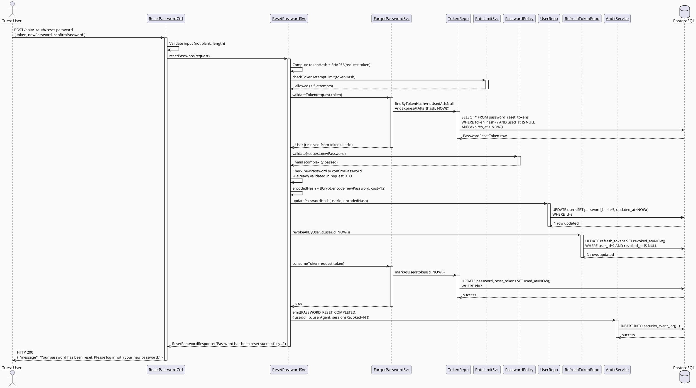
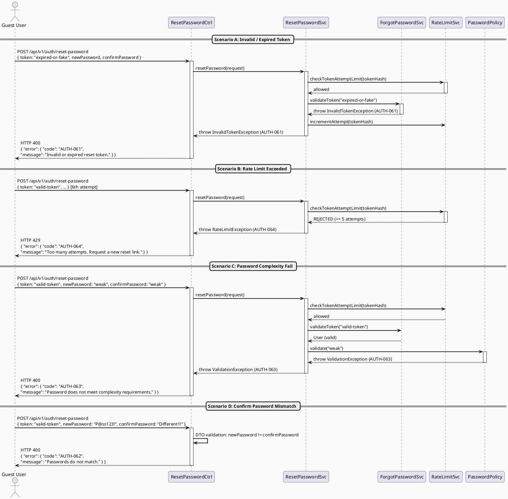
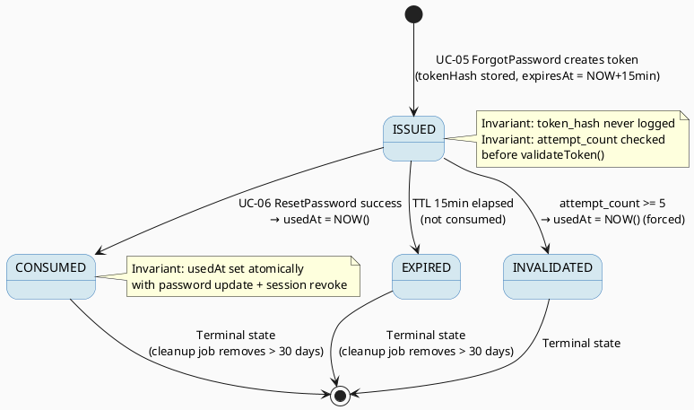

# ENGINEERING DOCUMENTATION STANDARD (EDS) v2.0

# Technical Design Specification — UC-06 Reset Password

| Field                    | Value                     |
| ------------------------ | ------------------------- |
| **Document ID**    | `CB-AUTH-IMP-006`       |
| **Version**        | `1.0`                   |
| **Date**           | `2026-06-26`            |
| **Status**         | `Draft`                 |
| **Document Owner** | `PhuongNT`              |
| **Author**         | `AI Agent`              |
| **Reviewed by**    | `[Tech Lead]`           |
| **DPO Sign-off**   | `[ ] Pending`           |
| **Approved by**    | `[Principal Architect]` |
| **Last Review**    | `2026-06-26`            |
| **Based on EDS**   | `v2.0`                  |

---

## CHANGELOG

| Ngày       | Người thực hiện | Nội dung thay đổi                                   |
| ---------- | --------------- | ---------------------------------------------------- |
| 2026-06-26 | AI Agent        | Tạo tài liệu lần đầu cho UC-06 Reset Password       |

---

## MỤC LỤC

1. [Tổng quan Module](#1-tổng-quan-module)
2. [Ma trận Truy vết (Traceability Matrix)](#2-ma-trận-truy-vết-traceability-matrix)
3. [Architecture Decision Records (ADR)](#3-architecture-decision-records-adr)
4. [Non-Functional Requirements & SLA](#4-non-functional-requirements--sla)
5. [Static Modeling (Mô hình Tĩnh)](#5-static-modeling-mô-hình-tĩnh)
6. [Dynamic Modeling (Mô hình Động)](#6-dynamic-modeling-mô-hình-động)
7. [Domain Event Catalog](#7-domain-event-catalog)
8. [Interface Specification (Đặc tả Giao diện)](#8-interface-specification-đặc-tả-giao-diện)
9. [API Specification](#9-api-specification)
10. [Bảng mã lỗi (Error Codes)](#10-bảng-mã-lỗi-error-codes)
11. [Quy trình Triển khai (Step-by-Step)](#11-quy-trình-triển-khai-step-by-step)
12. [Rollback & Incident Runbook](#12-rollback--incident-runbook)
13. [Kịch bản Kiểm thử Chi tiết](#13-kịch-bản-kiểm-thử-chi-tiết)
14. [Phương pháp Xác minh](#14-phương-pháp-xác-minh)
15. [Mẫu thử thực tế (API Verification Samples)](#15-mẫu-thử-thực-tế-api-verification-samples)
16. [Bảng tổng hợp phân quyền (Authorization Matrix)](#16-bảng-tổng-hợp-phân-quyền-authorization-matrix)
17. [AI Prompt Constraints (CASE 2.0)](#17-ai-prompt-constraints-case-20)

---

## 1. Tổng quan Module

| Field                           | Value                                                                           |
| ------------------------------- | ------------------------------------------------------------------------------- |
| **Module Name**           | `ResetPassword`                                                               |
| **Bounded Context**       | `auth`                                                                        |
| **UC ID**                 | `UC-06`                                                                       |
| **SRS Reference**         | `3.1.1.6`                                                                     |
| **Primary Actor**         | `Guest (unauthenticated)`                                                     |
| **Platform**              | `Web App + Mobile App`                                                        |
| **Data Classification**   | `Sensitive-PII`                                                               |
| **Compliance Scope**      | `BR-RBAC, BR-SECURITY, PDPA`                                                  |
| **Upstream Dependencies** | `UC-05 ForgotPassword (tạo password_reset_token)`, `PasswordResetToken table` |
| **Downstream Consumers**  | `AuditService (SecurityEventLog)`, `SessionService (revoke all tokens)`        |

**Mô tả:** Guest user gửi reset token (nhận qua email/SMS từ UC-05) cùng với mật khẩu mới để đặt lại mật khẩu. Hệ thống xác thực token hợp lệ (không hết hạn, chưa dùng, SHA-256 hash match bằng constant-time compare), kiểm tra độ phức tạp mật khẩu qua `PasswordComplexityPolicy`, cập nhật `passwordHash` trong bảng `users`, vô hiệu hóa tất cả refresh token (session invalidation), đánh dấu reset token là đã dùng (`usedAt`), và emit audit event `PASSWORD_RESET_COMPLETED`. Trả về 200 OK với generic message (anti-enumeration). Rate limit: 5 lần thử/token.

---

## 2. Ma trận Truy vết (Traceability Matrix)

| Requirement ID | Loại         | Mô tả yêu cầu                                        | Thành phần Code                                          | Compliance Target | ADR liên quan |
| -------------- | ------------ | ----------------------------------------------------- | -------------------------------------------------------- | ----------------- | -------------- |
| UC-06          | Use Case     | Reset password bằng valid reset token từ UC-05        | `ResetPasswordController.resetPassword()`               | BR-RBAC           | ADR-AUTH-021   |
| BR-AUTH-021    | Business Rule | Validate reset token: SHA-256 hash + TTL + single use | `ForgotPasswordService.validateToken()`                 | Security          | ADR-AUTH-021   |
| BR-AUTH-022    | Business Rule | Password complexity check via PasswordComplexityPolicy| `PasswordComplexityPolicy.validate()`                   | BR-SECURITY       | ADR-AUTH-022   |
| BR-AUTH-023    | Business Rule | confirmPassword phải khớp newPassword                 | `ResetPasswordRequest` validation                        | Usability         | ADR-AUTH-022   |
| BR-AUTH-024    | Business Rule | Update passwordHash (BCrypt) trong users table        | `UserService.updatePasswordHash()`                      | Security          | ADR-AUTH-021   |
| BR-AUTH-025    | Business Rule | Invalidate tất cả refresh tokens của user sau reset   | `RefreshTokenRepository.revokeAllByUserId()`            | Security          | ADR-AUTH-023   |
| BR-AUTH-026    | Business Rule | Mark token as used (usedAt) — không xóa row          | `ForgotPasswordService.consumeToken()`                  | GDPR Art. 5.1(e)  | ADR-AUTH-024   |
| BR-AUTH-027    | Business Rule | Anti-enumeration: 200 generic message cho mọi kết quả| `ResetPasswordController` response                       | PDPA              | ADR-AUTH-025   |
| BR-AUTH-028    | Business Rule | Rate limit: 5 thử/token                              | `RateLimitService.checkTokenAttemptLimit()`             | Security          | ADR-AUTH-026   |
| BR-AUTH-029    | Business Rule | Audit event `PASSWORD_RESET_COMPLETED`               | `AuditService.emit()`                                   | Security Audit    | ADR-AUTH-027   |
| BR-AUTH-030    | Business Rule | Không log plaintext token, không log plaintext password | `ResetPasswordService` logging policy                  | GDPR Art. 32      | ADR-AUTH-027   |

---

## 3. Architecture Decision Records (ADR)

### ADR-AUTH-021 — Validate reset token qua SHA-256 hash, không lưu plaintext

| Field              | Value                        |
| ------------------ | ---------------------------- |
| **Status**   | `Accepted`                 |
| **Deciders** | `PhuongNT — Backend Lead` |
| **Date**     | `2026-06-26`               |
| **Supersedes** | —                          |

#### Bối cảnh (Context)

UC-06 nhận plaintext token từ client (qua URL hoặc form). Hệ thống cần xác thực token này với dữ liệu đã lưu trong DB. UC-05 đã thiết kế lưu SHA-256 hash (ADR-AUTH-012). UC-06 phải tái sử dụng thiết kế này: compute hash từ plaintext token nhận được, so sánh với hash trong DB bằng constant-time.

#### Các phương án đã xem xét (Options Considered)

| Phương án | Mô tả                                         | Ưu điểm                                  | Nhược điểm                         |
| ---------- | ---------------------------------------------- | ----------------------------------------- | ----------------------------------- |
| A          | So sánh hash với `MessageDigest.isEqual()`    | + Constant-time, chống timing attack     | - Cần compute hash trước khi query |
| B          | So sánh plaintext token trực tiếp với DB index | + Đơn giản                              | - DB phải lưu plaintext → rủi ro  |
| C          | JWT-based reset token                          | + Stateless, không cần DB lookup          | - Không thể revoke trước TTL       |

#### Quyết định (Decision)

Chọn **Phương án A**: Compute `SHA-256(plaintext_token)`, query `password_reset_tokens.token_hash`, so sánh bằng `MessageDigest.isEqual()`. Không truyền hash qua API — chỉ nhận plaintext token từ client.

#### Hệ quả (Consequences)

**Tích cực:**
- Consistent với UC-05 thiết kế (ADR-AUTH-012)
- DB compromise không thể dùng hash để reset password
- Constant-time compare ngăn timing attack

**Tiêu cực / Trade-offs:**
- Phải compute SHA-256 trước mỗi DB query (~1ms overhead, acceptable)

**Compliance Impact:**
- GDPR Art. 32 — security of processing: hash storage is appropriate technical measure

---

### ADR-AUTH-022 — Password complexity: delegate to PasswordComplexityPolicy

| Field              | Value                        |
| ------------------ | ---------------------------- |
| **Status**   | `Accepted`                 |
| **Deciders** | `PhuongNT — Backend Lead` |
| **Date**     | `2026-06-26`               |

#### Bối cảnh (Context)

`PasswordComplexityPolicy.java` đã tồn tại trong codebase. Reset password cần enforce cùng policy với Register và ChangePassword để nhất quán toàn hệ thống.

#### Các phương án đã xem xét (Options Considered)

| Phương án | Mô tả                                              | Ưu điểm                                    | Nhược điểm                    |
| ---------- | --------------------------------------------------- | ------------------------------------------- | ------------------------------ |
| A          | Inline validation trong `ResetPasswordService`     | + Đơn giản                                 | - Code duplication, drift risk |
| B          | Delegate to `PasswordComplexityPolicy.validate()`  | + DRY, nhất quán toàn app                 | - Policy phải stable API       |

#### Quyết định (Decision)

Chọn **Phương án B**: Inject `PasswordComplexityPolicy`, gọi `validate(newPassword)` trong service. Throw `ValidationException("AUTH-063")` nếu fail.

#### Hệ quả (Consequences)

**Tích cực:**
- Single point of truth cho password policy
- Khi policy thay đổi (e.g., min length tăng), tất cả UC tự động được cập nhật

**Tiêu cực / Trade-offs:**
- Breaking change trong `PasswordComplexityPolicy` sẽ ảnh hưởng toàn bộ UC → cần test kỹ khi thay đổi

**Compliance Impact:**
- BR-SECURITY: đảm bảo password đủ mạnh trên toàn hệ thống

---

### ADR-AUTH-023 — Session invalidation: revoke all refresh tokens sau password reset

| Field              | Value                        |
| ------------------ | ---------------------------- |
| **Status**   | `Accepted`                 |
| **Deciders** | `PhuongNT — Backend Lead` |
| **Date**     | `2026-06-26`               |

#### Bối cảnh (Context)

Khi password bị reset (có thể do account bị compromise), tất cả active sessions của user đó phải bị terminated để ngăn attacker tiếp tục dùng session cũ.

#### Các phương án đã xem xét (Options Considered)

| Phương án | Mô tả                                                  | Ưu điểm                                        | Nhược điểm                                  |
| ---------- | ------------------------------------------------------- | ----------------------------------------------- | --------------------------------------------|
| A          | Revoke tất cả refresh tokens trong DB                  | + Immediate effect, chắc chắn                  | - Phải có refresh_tokens table               |
| B          | Set `tokenVersion` trên User, check trong JWT filter   | + Không cần query refresh_tokens table          | - Cần thêm field, phức tạp JWT middleware    |
| C          | Chỉ invalidate refresh token hiện tại                  | + Đơn giản                                     | - Không clear sessions khác → security gap  |

#### Quyết định (Decision)

Chọn **Phương án A**: Sau khi update password hash thành công, gọi `RefreshTokenRepository.revokeAllByUserId(userId)` — set `revokedAt = NOW()` cho tất cả active tokens. User phải login lại.

#### Hệ quả (Consequences)

**Tích cực:**
- Tất cả active sessions bị terminated ngay lập tức
- Nếu account bị compromise, attacker không thể tiếp tục

**Tiêu cực / Trade-offs:**
- User đang dùng app sẽ bị force logout — cần UX warning
- Phụ thuộc vào `refresh_tokens` table schema

**Compliance Impact:**
- GDPR Art. 32 — appropriate technical measures to ensure ongoing security

---

### ADR-AUTH-024 — Append-only token: mark usedAt thay vì xóa row

| Field              | Value                        |
| ------------------ | ---------------------------- |
| **Status**   | `Accepted`                 |
| **Deciders** | `PhuongNT — Backend Lead` |
| **Date**     | `2026-06-26`               |

#### Bối cảnh (Context)

Sau khi reset token được sử dụng, cần ngăn không cho dùng lại. Có hai cách: xóa row hoặc đánh dấu.

#### Quyết định (Decision)

**Append-only**: Chỉ set `used_at = NOW()`, không `DELETE`. Consistent với UC-05 `markAsUsed()`. Cho phép audit "khi nào token được dùng" và điều tra security incidents.

#### Hệ quả (Consequences)

**Tích cực:**
- Audit trail đầy đủ
- Chống replay attack (token có `usedAt != null` sẽ bị reject)

**Tiêu cực / Trade-offs:**
- Table tăng dần → cần cron job cleanup expired+used tokens (> 30 ngày)

**Compliance Impact:**
- GDPR Art. 5.1(e) — data minimization: cleanup job đảm bảo không giữ data vô thời hạn

---

### ADR-AUTH-025 — Anti-enumeration: generic 200 response, nhưng 400 cho token validation errors

| Field              | Value                        |
| ------------------ | ---------------------------- |
| **Status**   | `Accepted`                 |
| **Deciders** | `PhuongNT — Backend Lead` |
| **Date**     | `2026-06-26`               |

#### Bối cảnh (Context)

UC-05 dùng anti-enumeration (luôn 200). UC-06 khác: client đã có token, nếu token không hợp lệ phải thông báo để user biết cần request token mới. Tuy nhiên không được tiết lộ thông tin về account.

#### Quyết định (Decision)

- **Token invalid/expired/used** → 400 với `AUTH-061` (generic: "Invalid or expired reset token" — không tiết lộ lý do cụ thể để chống timing correlation)
- **Password complexity fail** → 400 với `AUTH-063` (cụ thể để user biết sửa gì)
- **Success** → 200 với generic success message

#### Hệ quả (Consequences)

**Tích cực:**
- User experience: biết token hết hạn để request mới
- Security: không tiết lộ account existence hay token state chi tiết

**Tiêu cực / Trade-offs:**
- Cần careful error design để không leak information qua timing

---

### ADR-AUTH-026 — Rate limit: 5 attempts per token

| Field              | Value                        |
| ------------------ | ---------------------------- |
| **Status**   | `Accepted`                 |
| **Deciders** | `PhuongNT — Backend Lead` |
| **Date**     | `2026-06-26`               |

#### Bối cảnh (Context)

Attacker có thể brute-force token nếu token format ngắn. Dù token là UUID (128-bit entropy), rate limiting thêm tầng bảo vệ.

#### Quyết định (Decision)

Rate limit 5 attempts per token (Redis counter, keyed by `rp_attempt:{tokenHash}`). Sau 5 lần fail, token bị auto-invalidate (set `usedAt` để chặn dùng).

#### Hệ quả (Consequences)

**Tích cực:**
- Ngăn brute-force dù token space lớn
- Auto-invalidate token khi bị brute-forced

**Tiêu cực / Trade-offs:**
- Legitimate user đánh sai token 5 lần → phải request token mới

---

### ADR-AUTH-027 — Audit: PASSWORD_RESET_COMPLETED với minimal PII

| Field              | Value                        |
| ------------------ | ---------------------------- |
| **Status**   | `Accepted`                 |
| **Deciders** | `PhuongNT — Backend Lead` |
| **Date**     | `2026-06-26`               |

#### Bối cảnh (Context)

Mọi password change cần audit trail cho security monitoring và compliance. Nhưng audit log không được chứa password hash mới hay plaintext token.

#### Quyết định (Decision)

Emit `SecurityEventType.PASSWORD_RESET_COMPLETED` với payload: `{ userId, ipAddress, userAgent, requestId, sessionsRevoked: N }`. Không chứa tokenHash, oldPasswordHash, newPasswordHash.

#### Hệ quả (Consequences)

**Tích cực:**
- Audit trail đầy đủ, PII-minimized
- `sessionsRevoked` giúp monitor bất thường

---

## 4. Non-Functional Requirements & SLA

### 4.1. Performance & Availability

| Category     | Requirement                        | Target SLA    | Measurement Method | Compliance Basis |
| ------------ | ---------------------------------- | ------------- | ------------------ | ---------------- |
| Latency      | ResetPassword API response (p99)   | `< 500ms`   | k6 load test       | —               |
| Availability | Uptime (monthly)                   | `99.9%`     | Uptime monitor     | —               |
| Throughput   | Concurrent requests                | `100 req/s` | Load test          | —               |

### 4.2. Security

| Category             | Requirement                              | Target      | Verification Method  | Compliance Basis |
| -------------------- | ---------------------------------------- | ----------- | -------------------- | ---------------- |
| Token validation     | Constant-time hash compare               | < 1ms variance | Profiling         | ADR-AUTH-021    |
| Rate limit           | 5 attempts/token enforced               | 100%        | Integration test     | ADR-AUTH-026    |
| Session invalidation | All refresh tokens revoked after reset  | 100%        | DB assertion         | ADR-AUTH-023    |
| Password hashing     | BCrypt cost factor ≥ 12                 | 100%        | Code review          | BR-SECURITY     |
| No PII in logs       | Token/password never logged plaintext   | 0 incidents | Log scan             | GDPR Art. 32    |

### 4.3. Data Integrity & Retention

| Category     | Requirement                         | Target | Verification Method | Compliance Basis |
| ------------ | ----------------------------------- | ------ | ------------------- | ---------------- |
| Atomicity    | Password update + token consume + session revoke in one transaction | 100% | Integration test | ADR-AUTH-023 |
| Append-only  | Token row not deleted (usedAt set)  | 100%   | DB constraint       | ADR-AUTH-024    |
| Audit sync   | Audit event emitted after success   | 100%   | Integration test    | ADR-AUTH-027    |

### 4.4. Scalability & Capacity Planning

Forecast: ≤ 500 reset completions/day trong peak season. Stateless service — scale horizontally. Redis rate limit counter per token (TTL 1h auto-expire).

---

## 5. Static Modeling (Mô hình Tĩnh)

### 5.1. Class Diagram (PlantUML)

```plantuml
@startuml UC06_ResetPassword_ClassDiagram
skinparam classAttributeIconSize 0
skinparam classFontStyle bold
skinparam backgroundColor #FAFAFA
skinparam ArrowColor #555555
skinparam ClassBorderColor #2E75B6
skinparam ClassHeaderBackgroundColor #D5E8F0

' === ENTITIES ===
class User {
  + id: UUID
  + passwordHash: String
  + accountStatus: AccountStatus
  + emailVerified: boolean
  + phoneVerified: boolean
  + updatedAt: LocalDateTime
}

class PasswordResetToken {
  + id: UUID
  + userId: UUID
  + tokenHash: String       // SHA-256 hex (64 chars)
  + expiresAt: LocalDateTime
  + usedAt: LocalDateTime   // null = unused; non-null = consumed
  + createdAt: LocalDateTime
}

class RefreshToken {
  + id: UUID
  + userId: UUID
  + tokenHash: String
  + revokedAt: LocalDateTime  // null = active
  + expiresAt: LocalDateTime
}

' === VALUE OBJECTS ===
class ResetPasswordRequest <<ValueObject>> {
  + token: String         // plaintext UUID from email/SMS link
  + newPassword: String   // min 8, max 100
  + confirmPassword: String
}

class ResetPasswordResponse <<ValueObject>> {
  + message: String       // generic success message
}

' === SERVICES ===
interface IResetPasswordService <<interface>> {
  + resetPassword(request: ResetPasswordRequest): ResetPasswordResponse
}

class ResetPasswordService implements IResetPasswordService {
  - forgotPasswordService: IForgotPasswordService
  - userRepository: IUserRepository
  - refreshTokenRepository: IRefreshTokenRepository
  - rateLimitService: IRateLimitService
  - passwordComplexityPolicy: PasswordComplexityPolicy
  - auditService: IAuditService
  - passwordEncoder: PasswordEncoder
  + resetPassword(request: ResetPasswordRequest): ResetPasswordResponse
}

class PasswordComplexityPolicy {
  + validate(password: String): void
}

' === REPOSITORIES ===
interface IUserRepository <<interface>> {
  + findById(id: UUID): Optional<User>
  + updatePasswordHash(id: UUID, newHash: String): void
}

interface IPasswordResetTokenRepository <<interface>> {
  + findByTokenHashAndUsedAtIsNullAndExpiresAtAfter(hash: String, now: LocalDateTime): Optional<PasswordResetToken>
  + markAsUsed(id: UUID, usedAt: LocalDateTime): void
  + incrementAttemptCount(tokenHash: String): int
}

interface IRefreshTokenRepository <<interface>> {
  + revokeAllByUserId(userId: UUID, revokedAt: LocalDateTime): int
}

interface IForgotPasswordService <<interface>> {
  + validateToken(token: String): User
  + consumeToken(token: String): boolean
}

' === RELATIONSHIPS ===
ResetPasswordService --> IForgotPasswordService : delegates token validation
ResetPasswordService --> IUserRepository : updates passwordHash
ResetPasswordService --> IRefreshTokenRepository : revokes all sessions
ResetPasswordService --> IRateLimitService : checks attempt limit
ResetPasswordService --> PasswordComplexityPolicy : validates newPassword
ResetPasswordService --> IAuditService : emits event
PasswordResetToken }--|| User : belongs to
RefreshToken }--|| User : belongs to

@enduml
```



---

### 5.2. Data Structure (Flyway SQL Migration)

> UC-06 dùng bảng `password_reset_tokens` đã được định nghĩa trong UC-05. Không cần thêm migration mới cho bảng này. Tuy nhiên, nếu `password_reset_tokens` chưa có cột `attempt_count`, thêm vào migration UC-05 hoặc tạo migration riêng:

```sql
-- Flyway: V{n}__add_attempt_count_to_password_reset_tokens.sql
-- Thêm attempt counter để enforce rate limit per token (ADR-AUTH-026)

ALTER TABLE password_reset_tokens
  ADD COLUMN IF NOT EXISTS attempt_count INTEGER NOT NULL DEFAULT 0;

-- Index hỗ trợ lookup nhanh khi validate token
-- (đã có từ UC-05 migration: idx_prt_token_hash)

-- Comment: attempt_count tăng mỗi lần có POST /reset-password với token này
-- Khi attempt_count >= 5 → token bị auto-consume (usedAt set)
```

> **Lưu ý:** `password_reset_tokens` table schema đầy đủ xem tại UC-05 TDS §5.2. UC-06 không tạo schema mới, chỉ extend với `attempt_count`.

---

## 6. Dynamic Modeling (Mô hình Động)

### 6.1. Sequence Diagram — Happy Path (PlantUML)



---

### 6.2. Sequence Diagram — Error Path (PlantUML)



---

### 6.3. State Machine — Reset Token Lifecycle



> **Invariant bất biến:**
> 1. Token `CONSUMED` và `INVALIDATED` không thể transition sang `ISSUED` lại.
> 2. Mọi state transition đều phải có audit event tương ứng.
> 3. Token plaintext không bao giờ được persist hay log.

---

## 7. Domain Event Catalog

### 7.1. Events Published (Phát ra)

| Event Name                    | Trigger                          | Publisher              | Subscriber(s)                      | Payload Schema                     | Async? |
| ----------------------------- | -------------------------------- | ---------------------- | ---------------------------------- | ---------------------------------- | ------ |
| `PasswordResetCompleted`    | Reset thành công                | `ResetPasswordService` | `AuditService`, `SecurityMonitor` | `PasswordResetCompletedEvent.java` | Yes    |
| `PasswordResetAttemptFailed`| Token invalid / rate limit       | `ResetPasswordService` | `SecurityMonitor`                  | `PasswordResetAttemptFailedEvent.java` | Yes |

### 7.2. Events Consumed (Tiêu thụ)

| Event Name | Source | Handler | Action thực hiện |
| ---------- | ------ | ------- | ---------------- |
| *(none)*   | —     | —      | ResetPassword không consume events |

### 7.3. Payload Schema

```java
// PasswordResetCompletedEvent.java
public record PasswordResetCompletedEvent(
    UUID    eventId,          // UUID.randomUUID()
    String  eventType,        // "PasswordResetCompleted"
    Instant occurredAt,       // Instant.now()
    String  version,          // "1.0"
    Payload payload,
    Metadata metadata
) implements ApplicationEvent {

    public record Payload(
        UUID   userId,          // ID của user đặt lại mật khẩu
        String ipAddress,       // IP client
        String userAgent,       // User-Agent header
        UUID   requestId,       // X-Correlation-Id header
        int    sessionsRevoked  // Số refresh token bị revoke
        // KHÔNG chứa: tokenHash, oldPasswordHash, newPasswordHash
    ) {}

    public record Metadata(
        UUID   correlationId,   // Dùng để trace request xuyên suốt
        String causedBy         // "user:{userId}"
    ) {}
}

// PasswordResetAttemptFailedEvent.java
public record PasswordResetAttemptFailedEvent(
    UUID    eventId,
    String  eventType,          // "PasswordResetAttemptFailed"
    Instant occurredAt,
    String  version,            // "1.0"
    Payload payload,
    Metadata metadata
) implements ApplicationEvent {

    public record Payload(
        String failureReason,   // "INVALID_TOKEN" | "RATE_LIMIT" | "COMPLEXITY"
        String ipAddress,
        String userAgent,
        int    attemptNumber    // Attempt sequence (1-5)
        // KHÔNG chứa: tokenHash, token plaintext
    ) {}

    public record Metadata(
        UUID   correlationId,
        String causedBy
    ) {}
}
```

---

## 8. Interface Specification (Đặc tả Giao diện)

### 8.1. Service Interface

```java
// ResetPasswordRequest.java — Input DTO
// @version 1.0
public class ResetPasswordRequest {

    @NotBlank(message = "Token is required")
    private String token;              // Plaintext UUID token từ email/SMS link

    @NotBlank(message = "New password is required")
    @Size(min = 8, max = 100, message = "Password must be between 8 and 100 characters")
    private String newPassword;        // Mật khẩu mới

    @NotBlank(message = "Confirm password is required")
    private String confirmPassword;    // Phải khớp với newPassword

    // Custom validator: newPassword.equals(confirmPassword)
    // Annotation: @PasswordMatch hoặc validate trong service
}

// ResetPasswordResponse.java — Output DTO
// @version 1.0
public class ResetPasswordResponse {
    private String message;            // Generic success message (anti-enumeration)
    // getters
}

// IResetPasswordService.java — Service Contract
// @version 1.0
public interface IResetPasswordService {

    /**
     * Đặt lại mật khẩu bằng reset token từ UC-05 ForgotPassword.
     *
     * Thứ tự thực hiện (atomic transaction):
     * 1. Check rate limit (< 5 attempts per token)
     * 2. Validate token via ForgotPasswordService.validateToken()
     * 3. Validate password complexity via PasswordComplexityPolicy
     * 4. Update passwordHash (BCrypt, cost=12) trong users table
     * 5. Revoke all refresh tokens for this user
     * 6. Consume reset token (set usedAt)
     * 7. Emit PASSWORD_RESET_COMPLETED audit event
     *
     * @throws RateLimitException      (AUTH-064) nếu vượt 5 attempts/token
     * @throws InvalidTokenException   (AUTH-061) nếu token invalid/expired/used
     * @throws ValidationException     (AUTH-062) nếu confirmPassword không khớp
     * @throws ValidationException     (AUTH-063) nếu password không đủ complexity
     */
    ResetPasswordResponse resetPassword(ResetPasswordRequest request);
}
```

### 8.2. Repository Interface

```java
// IPasswordResetTokenRepository.java (extended từ UC-05)
// @version 1.1 — thêm attempt_count methods
public interface IPasswordResetTokenRepository extends JpaRepository<PasswordResetToken, UUID> {

    /**
     * Tìm token chưa dùng, chưa expire. Dùng constant-time hash compare.
     */
    Optional<PasswordResetToken> findByTokenHashAndUsedAtIsNullAndExpiresAtAfter(
        String tokenHash, LocalDateTime now);

    /**
     * Đánh dấu token đã dùng — append-only (set usedAt, không xóa row).
     */
    @Modifying
    @Query("UPDATE PasswordResetToken t SET t.usedAt = :usedAt WHERE t.id = :id")
    void markAsUsed(@Param("id") UUID id, @Param("usedAt") LocalDateTime usedAt);

    /**
     * Tăng attempt_count, trả về giá trị mới. Nếu >= 5, caller phải invalidate token.
     */
    @Modifying
    @Query("UPDATE PasswordResetToken t SET t.attemptCount = t.attemptCount + 1 WHERE t.tokenHash = :tokenHash")
    int incrementAttemptCount(@Param("tokenHash") String tokenHash);
}

// IRefreshTokenRepository.java
// @version 1.0
public interface IRefreshTokenRepository extends JpaRepository<RefreshToken, UUID> {

    /**
     * Thu hồi tất cả refresh tokens của user (session invalidation).
     * @return số lượng tokens bị revoke
     */
    @Modifying
    @Query("UPDATE RefreshToken t SET t.revokedAt = :revokedAt " +
           "WHERE t.userId = :userId AND t.revokedAt IS NULL")
    int revokeAllByUserId(@Param("userId") UUID userId,
                          @Param("revokedAt") LocalDateTime revokedAt);
}

// IUserRepository.java (extended)
// @version 1.1
public interface IUserRepository extends JpaRepository<User, UUID> {

    Optional<User> findById(UUID id);

    /**
     * Update password hash — chỉ update password_hash, không update fields khác.
     */
    @Modifying
    @Query("UPDATE User u SET u.passwordHash = :passwordHash, u.updatedAt = :updatedAt " +
           "WHERE u.id = :id")
    void updatePasswordHash(@Param("id") UUID id,
                            @Param("passwordHash") String passwordHash,
                            @Param("updatedAt") LocalDateTime updatedAt);
}
```

---

## 9. API Specification

### 9.1. Endpoints Table

| Method   | Path                               | Auth Level | Required Roles | Rate Limit     | Idempotent? |
| -------- | ---------------------------------- | ---------- | -------------- | -------------- | ----------- |
| `POST` | `/api/v1/auth/reset-password`    | None       | `GUEST`      | 5/token (Redis) | No         |

### 9.2. Request / Response Schemas

#### `POST /api/v1/auth/reset-password` — Đặt lại mật khẩu

**Request Body:**
```json
{
  "token": "550e8400-e29b-41d4-a716-446655440000",
  "newPassword": "NewP@ssw0rd!",
  "confirmPassword": "NewP@ssw0rd!"
}
```

**Field Validation:**
| Field            | Rule                                   | Error Code |
| ---------------- | -------------------------------------- | ---------- |
| `token`         | Required, UUID format                  | AUTH-061   |
| `newPassword`   | Required, min 8, max 100 chars         | AUTH-063   |
| `confirmPassword`| Required, must equal `newPassword`   | AUTH-062   |

**Response — 200 OK (Happy Path):**
```json
{
  "message": "Your password has been reset successfully. Please log in with your new password."
}
```

**Response — 400 Bad Request (Invalid/Expired Token):**
```json
{
  "error": {
    "code": "AUTH-061",
    "message": "Invalid or expired reset token. Please request a new password reset link."
  }
}
```

**Response — 400 Bad Request (Password Mismatch):**
```json
{
  "error": {
    "code": "AUTH-062",
    "message": "Passwords do not match. Please ensure both password fields are identical."
  }
}
```

**Response — 400 Bad Request (Password Complexity):**
```json
{
  "error": {
    "code": "AUTH-063",
    "message": "Password does not meet complexity requirements. Password must be at least 8 characters and include uppercase, lowercase, number, and special character."
  }
}
```

**Response — 429 Too Many Requests (Rate Limit):**
```json
{
  "error": {
    "code": "AUTH-064",
    "message": "Too many reset attempts for this token. Please request a new password reset link."
  }
}
```

**Response — 500 Internal Server Error:**
```json
{
  "error": {
    "code": "AUTH-065",
    "message": "An unexpected error occurred. Please try again later."
  }
}
```

---

## 10. Bảng mã lỗi (Error Codes)

| Code       | HTTP Status | Message (EN)                                      | Message (VI)                                                 | Trigger Condition                                      |
| ---------- | ----------- | ------------------------------------------------- | ------------------------------------------------------------ | ------------------------------------------------------ |
| `AUTH-061` | 400         | Invalid or expired reset token                    | Token đặt lại mật khẩu không hợp lệ hoặc đã hết hạn        | Token không tồn tại, đã dùng, hoặc hết hạn 15 phút   |
| `AUTH-062` | 400         | Passwords do not match                            | Mật khẩu xác nhận không khớp                                | `newPassword != confirmPassword`                       |
| `AUTH-063` | 400         | Password does not meet complexity requirements    | Mật khẩu không đáp ứng yêu cầu độ phức tạp                | `PasswordComplexityPolicy.validate()` fail             |
| `AUTH-064` | 429         | Too many reset attempts for this token            | Quá nhiều lần thử với token này. Vui lòng yêu cầu link mới | `attempt_count >= 5` per token                         |
| `AUTH-065` | 500         | Internal error during password reset              | Lỗi hệ thống khi đặt lại mật khẩu                          | Unexpected exception trong service/DB                  |

---

## 11. Quy trình Triển khai (Step-by-Step)

### 11.1. Prerequisites

- [ ] UC-05 ForgotPassword đã được deploy (cung cấp `password_reset_tokens` table và `IForgotPasswordService`)
- [ ] ADR-AUTH-021 đến ADR-AUTH-027 đã được Accepted
- [ ] DPO đã sign-off (module xử lý password hash — PII)
- [ ] `PasswordComplexityPolicy.java` đã tồn tại và stable API
- [ ] Redis connection configured (`REDIS_URL`)
- [ ] `refresh_tokens` table tồn tại (check migration history)

### 11.2. Pre-Migration Checklist

- [ ] Backup DB production: `pg_dump -h [host] -U [user] [db] > backup_YYYYMMDD.sql`
- [ ] Migration `V{n}__add_attempt_count_to_password_reset_tokens.sql` chạy thành công trên staging ≥ 24h
- [ ] Rollback script chuẩn bị: `ALTER TABLE password_reset_tokens DROP COLUMN IF EXISTS attempt_count;`
- [ ] DPO đã sign-off

### 11.3. Implementation Steps

#### Chặng 1 — Flyway Migration

```sql
-- V{n}__add_attempt_count_to_password_reset_tokens.sql
ALTER TABLE password_reset_tokens
  ADD COLUMN IF NOT EXISTS attempt_count INTEGER NOT NULL DEFAULT 0;
```

```bash
./mvnw flyway:migrate
```

#### Chặng 2 — Service Implementation

```java
// ResetPasswordService.java
@Service
@Transactional
@Slf4j
public class ResetPasswordService implements IResetPasswordService {

    private final IForgotPasswordService forgotPasswordService;
    private final IUserRepository userRepository;
    private final IRefreshTokenRepository refreshTokenRepository;
    private final IRateLimitService rateLimitService;
    private final PasswordComplexityPolicy passwordComplexityPolicy;
    private final IAuditService auditService;
    private final PasswordEncoder passwordEncoder;

    @Override
    public ResetPasswordResponse resetPassword(ResetPasswordRequest request) {
        String tokenHash = DigestUtils.sha256Hex(request.getToken());

        // 1. Rate limit check (per token, not per IP/user)
        if (!rateLimitService.checkTokenAttemptLimit(tokenHash, 5)) {
            throw new RateLimitException("AUTH-064");
        }

        // 2. Validate confirm password match (defensive — also in DTO validator)
        if (!request.getNewPassword().equals(request.getConfirmPassword())) {
            throw new ValidationException("AUTH-062");
        }

        // 3. Password complexity
        passwordComplexityPolicy.validate(request.getNewPassword()); // throws AUTH-063

        // 4. Validate token (throws InvalidTokenException AUTH-061 if invalid)
        User user = forgotPasswordService.validateToken(request.getToken());

        // 5. Update password hash (BCrypt cost=12)
        String newHash = passwordEncoder.encode(request.getNewPassword());
        userRepository.updatePasswordHash(user.getId(), newHash, LocalDateTime.now());

        // 6. Revoke all refresh tokens (session invalidation)
        int revokedCount = refreshTokenRepository.revokeAllByUserId(user.getId(), LocalDateTime.now());

        // 7. Consume reset token (append-only: set usedAt)
        forgotPasswordService.consumeToken(request.getToken());

        // 8. Audit
        auditService.emit(new PasswordResetCompletedEvent(
            UUID.randomUUID(), "PasswordResetCompleted", Instant.now(), "1.0",
            new PasswordResetCompletedEvent.Payload(
                user.getId(),
                request.getIpAddress(),
                request.getUserAgent(),
                request.getRequestId(),
                revokedCount
            ),
            new PasswordResetCompletedEvent.Metadata(request.getCorrelationId(), "user:" + user.getId())
        ));

        log.info("Password reset completed for userId={}, sessionsRevoked={}", user.getId(), revokedCount);
        // KHÔNG log token, password hash

        return new ResetPasswordResponse(
            "Your password has been reset successfully. Please log in with your new password."
        );
    }
}
```

#### Chặng 3 — Controller

```java
// ResetPasswordController.java
@RestController
@RequestMapping("/api/v1/auth")
@Slf4j
public class ResetPasswordController {

    private final IResetPasswordService resetPasswordService;

    @PostMapping("/reset-password")
    public ResponseEntity<ResetPasswordResponse> resetPassword(
        @Valid @RequestBody ResetPasswordRequestDTO requestDTO,
        @RequestHeader(value = "X-Forwarded-For", required = false) String ip,
        @RequestHeader(value = "User-Agent", required = false) String userAgent,
        @RequestHeader(value = "X-Correlation-Id", required = false) UUID correlationId
    ) {
        ResetPasswordRequest request = requestDTO.toDomain();
        request.setIpAddress(ip != null ? ip : "unknown");
        request.setUserAgent(userAgent != null ? userAgent : "unknown");
        request.setCorrelationId(correlationId != null ? correlationId : UUID.randomUUID());
        request.setRequestId(UUID.randomUUID());

        ResetPasswordResponse response = resetPasswordService.resetPassword(request);
        return ResponseEntity.ok(response);
    }
}
```

#### Chặng 4 — Verification sau deploy

```bash
# Test happy path
curl -X POST http://localhost:8080/api/v1/auth/reset-password \
  -H "Content-Type: application/json" \
  -H "X-Correlation-Id: $(uuidgen)" \
  -d '{
    "token": "<plaintext-token-from-email>",
    "newPassword": "NewP@ssw0rd!",
    "confirmPassword": "NewP@ssw0rd!"
  }'
# Expected: 200 + generic success message

# Verify DB
psql -c "SELECT used_at FROM password_reset_tokens WHERE token_hash='<sha256-hash>';"
# Expected: used_at NOT NULL

psql -c "SELECT COUNT(*) FROM refresh_tokens WHERE user_id='<user-id>' AND revoked_at IS NULL;"
# Expected: 0 (all revoked)
```

### 11.4. Deployment Checklist

- [ ] Migration `attempt_count` column tồn tại: `\d password_reset_tokens`
- [ ] Health check endpoint trả về 200
- [ ] Error rate < 1% trong 10 phút đầu
- [ ] Audit log chứa `PasswordResetCompleted` events
- [ ] Test reset token một lần → `used_at` set trong DB
- [ ] Test 5 attempts với sai token → 429 returned
- [ ] DPO notified (PII module deployed)

---

## 12. Rollback & Incident Runbook

### 12.1. Điều kiện kích hoạt Rollback

| Điều kiện                          | Ngưỡng                   | Người quyết định      |
| ---------------------------------- | ------------------------ | --------------------- |
| Error rate tăng đột biến           | > 5% trong 5 phút        | On-call Engineer      |
| Password reset không hoạt động    | > 2 user reports         | Tech Lead             |
| Session không bị revoke sau reset  | Bất kỳ case nào          | Tech Lead + DPO       |
| Audit log ngừng hoạt động         | > 1 phút không có events | On-call Engineer      |
| DB transaction rollback spike      | > 1% requests            | Tech Lead             |

### 12.2. Rollback Procedure

```bash
# Bước 1: Revert migration (nếu cần)
psql -h $DB_HOST -U $DB_USER -d $DB_NAME \
  -c "ALTER TABLE password_reset_tokens DROP COLUMN IF EXISTS attempt_count;"
psql -h $DB_HOST -U $DB_USER -d $DB_NAME \
  -c "DELETE FROM flyway_schema_history WHERE version = '{n}';"

# Bước 2: Disable feature flag (nếu có)
kubectl set env deployment/carebridge-api RESET_PASSWORD_ENABLED=false

# Bước 3: Re-deploy phiên bản cũ
kubectl rollout undo deployment/carebridge-api

# Bước 4: Verify rollback
kubectl rollout status deployment/carebridge-api
curl -X GET https://[host]/api/v1/health
# Expected: {"status": "ok"}

# Bước 5: Smoke test
curl -X POST https://[host]/api/v1/auth/reset-password \
  -H "Content-Type: application/json" \
  -d '{"token":"test","newPassword":"Test@123","confirmPassword":"Test@123"}'
# Expected: 400 AUTH-061 (invalid token — service alive but token check works)
```

### 12.3. Notification Protocol

| Thời điểm      | Người nhận  | Kênh           | Template                                                    |
| -------------- | ----------- | -------------- | ----------------------------------------------------------- |
| Ngay khi xảy ra | On-call    | Slack #incident | "🚨 ResetPassword incident: [mô tả]"                       |
| Trong 30 phút  | DPO         | Email          | Bắt buộc nếu password data có thể bị exposed (GDPR Art. 33) |
| Trong 72 giờ   | DPA         | Email          | Bắt buộc nếu có data breach (GDPR Art. 33)                 |

### 12.4. Post-Incident Review (PIR)

Hoàn thành PIR document trong vòng **48 giờ** sau khi incident resolve.
- **Timeline:** Diễn biến từng bước
- **Root Cause:** 5 Whys
- **Impact:** Số users ảnh hưởng, thời gian downtime, PII exposure?
- **Remediation:** Các bước đã thực hiện
- **Prevention:** Action items để tránh tái diễn

---

## 13. Kịch bản Kiểm thử Chi tiết

> Test Data Classification: **SYNTHETIC** (không dùng PII thật)

### 13.1. Unit Tests

#### TC-UNIT-001 — ResetPassword: valid token + valid password → success

```gherkin
Feature: Reset Password
  Background:
    Given test data classification: SYNTHETIC
    And ForgotPasswordService mock: validateToken("valid-uuid") returns User{id=user-001}
    And ForgotPasswordService mock: consumeToken("valid-uuid") returns true
    And rateLimitService.checkTokenAttemptLimit() returns true (allowed)
    And passwordComplexityPolicy.validate("NewP@ss123!") → valid
    And userRepository.updatePasswordHash() → success
    And refreshTokenRepository.revokeAllByUserId() returns 3

  Scenario: Happy path — valid token, valid password
    When resetPasswordService.resetPassword({
      token: "valid-uuid",
      newPassword: "NewP@ss123!",
      confirmPassword: "NewP@ss123!"
    })
    Then return ResetPasswordResponse with generic success message
    And userRepository.updatePasswordHash() called 1 time with BCrypt hash
    And refreshTokenRepository.revokeAllByUserId(user-001) called 1 time
    And forgotPasswordService.consumeToken("valid-uuid") called 1 time
    And auditService.emit(PasswordResetCompleted, { userId: user-001, sessionsRevoked: 3 }) called 1 time
```

**Hàm được test:** `ResetPasswordService.resetPassword()`
**Invariant:** Password hash không xuất hiện trong audit event; token không log plaintext.

#### TC-UNIT-002 — Invalid token → AUTH-061

```gherkin
  Scenario: Token expired or not found
    Given forgotPasswordService.validateToken() throws InvalidTokenException("AUTH-061")
    When resetPasswordService.resetPassword({ token: "expired-uuid", ... })
    Then throw InvalidTokenException with errorCode = "AUTH-061"
    And userRepository.updatePasswordHash() NOT called
    And refreshTokenRepository.revokeAllByUserId() NOT called
    And auditService.emit(PasswordResetAttemptFailed, { failureReason: "INVALID_TOKEN" }) called
```

#### TC-UNIT-003 — Password mismatch → AUTH-062

```gherkin
  Scenario: confirmPassword không khớp newPassword
    When resetPasswordService.resetPassword({
      token: "valid-uuid",
      newPassword: "P@ss123!",
      confirmPassword: "Different!"
    })
    Then throw ValidationException with errorCode = "AUTH-062"
    And forgotPasswordService.validateToken() NOT called
```

#### TC-UNIT-004 — Password complexity fail → AUTH-063

```gherkin
  Scenario: Password quá yếu
    Given passwordComplexityPolicy.validate("weak") throws ValidationException("AUTH-063")
    When resetPasswordService.resetPassword({
      token: "valid-uuid",
      newPassword: "weak",
      confirmPassword: "weak"
    })
    Then throw ValidationException with errorCode = "AUTH-063"
    And userRepository.updatePasswordHash() NOT called
```

#### TC-UNIT-005 — Rate limit exceeded → AUTH-064

```gherkin
  Scenario: 5th attempt với cùng token
    Given rateLimitService.checkTokenAttemptLimit(tokenHash) returns false (>= 5 attempts)
    When resetPasswordService.resetPassword({ token: "some-token", ... })
    Then throw RateLimitException with errorCode = "AUTH-064"
    And forgotPasswordService.validateToken() NOT called
```

#### TC-UNIT-006 — Atomicity: DB fail → full rollback

```gherkin
  Scenario: userRepository.updatePasswordHash() throws DataAccessException
    Given validateToken() returns valid User
    And userRepository.updatePasswordHash() throws DataAccessException
    When resetPasswordService.resetPassword(validRequest)
    Then throw RuntimeException (mapped to AUTH-065)
    And refreshTokenRepository.revokeAllByUserId() NOT called (transaction rolled back)
    And consumeToken() NOT called (transaction rolled back)
```

---

### 13.2. Integration Tests

#### TC-INT-001 — Full reset flow: forgot → validate → reset

```gherkin
  Scenario: End-to-end password reset
    Given test data classification: SYNTHETIC
    And PostgreSQL container running (Testcontainers)
    And database contains User{ id=user-001, email=test@example.com, status=ACTIVE, emailVerified=true }
    And password_reset_tokens contains { tokenHash=SHA256("test-token-uuid"), userId=user-001, expiresAt=NOW+15min, usedAt=null }

    When POST /api/v1/auth/reset-password with:
      { "token": "test-token-uuid", "newPassword": "NewP@ss123!", "confirmPassword": "NewP@ss123!" }

    Then HTTP 200 with generic success message
    And password_reset_tokens.used_at IS NOT NULL for tokenHash
    And users.password_hash updated (BCrypt verify: BCrypt.checkpw("NewP@ss123!", newHash) = true)
    And refresh_tokens: all rows for user-001 have revoked_at NOT NULL
    And security_event_log contains PasswordResetCompleted event for user-001
```

**External dependencies:** PostgreSQL (Testcontainers)
**Mock strategy:** Email/SMS mocked; Redis mocked for rate limit

#### TC-INT-002 — Token single-use: second reset attempt fails

```gherkin
  Scenario: Attempt to reuse already-consumed token
    Given first reset succeeded (used_at set for token)
    When POST /api/v1/auth/reset-password again with same token
    Then HTTP 400 with error code AUTH-061
    And users.password_hash unchanged from second reset attempt
```

---

### 13.3. Security Tests

#### TC-SEC-001 — Constant-time token hash compare (timing attack)

```gherkin
  Scenario: Timing attack resistance
    Given 1000 invalid tokens (first char different)
    And 1000 invalid tokens (all chars different)
    When measure average response time for both sets
    Then timing difference < 5ms (95th percentile)
    And ResponseEntity không tiết lộ lý do cụ thể (valid vs expired vs not found)
```

**Oracle Source:** `ADR-AUTH-021` (constant-time requirement)

#### TC-SEC-002 — Rate limit enforcement

```gherkin
  Scenario: Brute-force protection
    Given token "test-uuid" exists and not expired
    When POST /api/v1/auth/reset-password 5 times with wrong passwords
    Then responses 1-5: HTTP 400 (AUTH-063 or AUTH-061 depending on impl)
    And 6th attempt: HTTP 429 (AUTH-064) even with correct password
    And password_reset_tokens.used_at set (token auto-invalidated after 5 attempts)
```

#### TC-SEC-003 — No PII in audit logs

```gherkin
  Scenario: Audit log không chứa PII sensitive
    When resetPassword() succeeds
    Then audit event PasswordResetCompleted does NOT contain:
      - tokenHash
      - newPasswordHash
      - email
      - phone
    And application logs do NOT contain token plaintext or password
```

---

## 14. Phương pháp Xác minh

### 14.1. Database Inspection

```sql
-- Verify token consumed sau khi reset
SELECT id, token_hash, expires_at, used_at, attempt_count
FROM password_reset_tokens
WHERE user_id = '<user-uuid>'
ORDER BY created_at DESC
LIMIT 1;
-- Expected: used_at NOT NULL, attempt_count < 5

-- Verify all refresh tokens revoked
SELECT COUNT(*)
FROM refresh_tokens
WHERE user_id = '<user-uuid>' AND revoked_at IS NULL;
-- Expected: 0

-- Verify password hash updated (not the old hash)
SELECT password_hash, updated_at
FROM users
WHERE id = '<user-uuid>';
-- Expected: updated_at = NOW() (within last few seconds); hash starts with "$2a$12$" (BCrypt)

-- Verify audit log entry
SELECT event_type, occurred_at, payload
FROM security_event_log
WHERE payload->>'userId' = '<user-uuid>'
  AND event_type = 'PasswordResetCompleted'
ORDER BY occurred_at DESC
LIMIT 1;
-- Expected: 1 row, payload NOT containing tokenHash or passwordHash
```

### 14.2. Log / Audit Verification

```bash
# Verify audit event format
kubectl logs -l app=carebridge-api | grep '"eventType":"PasswordResetCompleted"' | head -5

# Verify no PII leak (token, password) in logs
kubectl logs -l app=carebridge-api | grep -iE "token|password|hash" | grep -v "eventType\|sessionsRevoked"
# Expected: No sensitive plaintext output

# Verify BCrypt cost factor
kubectl logs -l app=carebridge-api | jq 'select(.message | contains("Password reset completed"))'
```

### 14.3. Tool-based Verification

```bash
# Verify BCrypt hash format
echo "<new-password-hash>" | grep -E '^\$2[aby]\$12\$'
# Expected: match (BCrypt, cost=12)

# Verify TLS version on endpoint
openssl s_client -connect [host]:443 -tls1_3 2>&1 | grep "Protocol"
# Expected: Protocol : TLSv1.3

# Rate limit test (must 429 after 5 attempts)
TOKEN="<valid-uuid-token>"
for i in {1..6}; do
  STATUS=$(curl -s -o /dev/null -w "%{http_code}" \
    -X POST http://localhost:8080/api/v1/auth/reset-password \
    -H "Content-Type: application/json" \
    -d "{\"token\":\"$TOKEN\",\"newPassword\":\"weak\",\"confirmPassword\":\"weak\"}")
  echo "Attempt $i: HTTP $STATUS"
done
# Expected: 1-5 = 400, 6 = 429
```

---

## 15. Mẫu thử thực tế (API Verification Samples)

### 15.1. Happy Path

```bash
# POST reset-password với valid token + strong password
curl -X POST https://[host]/api/v1/auth/reset-password \
  -H "Content-Type: application/json" \
  -H "X-Forwarded-For: 203.0.113.1" \
  -H "User-Agent: Mozilla/5.0 (iPhone; CPU iPhone OS 17_0)" \
  -H "X-Correlation-Id: $(uuidgen)" \
  -d '{
    "token": "550e8400-e29b-41d4-a716-446655440000",
    "newPassword": "Secure@Pass123",
    "confirmPassword": "Secure@Pass123"
  }'
```

**Expected Response (200):**
```json
{
  "message": "Your password has been reset successfully. Please log in with your new password."
}
```

### 15.2. Error Paths

```bash
# Invalid/expired token → 400 AUTH-061
curl -X POST https://[host]/api/v1/auth/reset-password \
  -H "Content-Type: application/json" \
  -d '{
    "token": "00000000-0000-0000-0000-000000000000",
    "newPassword": "NewP@ss123!",
    "confirmPassword": "NewP@ss123!"
  }'
```

**Expected Response (400):**
```json
{
  "error": {
    "code": "AUTH-061",
    "message": "Invalid or expired reset token. Please request a new password reset link."
  }
}
```

```bash
# Password mismatch → 400 AUTH-062
curl -X POST https://[host]/api/v1/auth/reset-password \
  -H "Content-Type: application/json" \
  -d '{
    "token": "<valid-token>",
    "newPassword": "NewP@ss123!",
    "confirmPassword": "Different!"
  }'
```

**Expected Response (400):**
```json
{
  "error": {
    "code": "AUTH-062",
    "message": "Passwords do not match. Please ensure both password fields are identical."
  }
}
```

```bash
# Weak password → 400 AUTH-063
curl -X POST https://[host]/api/v1/auth/reset-password \
  -H "Content-Type: application/json" \
  -d '{
    "token": "<valid-token>",
    "newPassword": "password",
    "confirmPassword": "password"
  }'
```

**Expected Response (400):**
```json
{
  "error": {
    "code": "AUTH-063",
    "message": "Password does not meet complexity requirements."
  }
}
```

---

## 16. Bảng tổng hợp phân quyền (Authorization Matrix)

| Endpoint                             | `GUEST`            | `MOTHER` | `EXPERT` | `ADMIN` | `DPO` | `SYSTEM` |
| ------------------------------------ | -------------------- | -------- | -------- | ------- | ----- | -------- |
| `POST /api/v1/auth/reset-password` | ✅ (no JWT required) | ✅       | ✅       | ✅      | ✅    | ✅       |

**Chú thích:**
- ✅ = Được phép (public endpoint — no JWT required, stateless)
- Rate limit: 5 attempts/token (per ADR-AUTH-026)
- Token tự authenticate: ai có token hợp lệ mới reset được password

---

## 17. AI Prompt Constraints (CASE 2.0)

### 17.1 Constraint Summary Table

| #  | Constraint                                                                                          | Source (ADR/BR)   | Last Verified |
| -- | --------------------------------------------------------------------------------------------------- | ----------------- | ------------- |
| C1 | Compute `SHA-256(plaintext_token)` TRƯỚC khi query DB; so sánh bằng `MessageDigest.isEqual()`   | `ADR-AUTH-021`  | 2026-06-26    |
| C2 | Delegate password complexity check sang `PasswordComplexityPolicy.validate()` — không inline      | `ADR-AUTH-022`  | 2026-06-26    |
| C3 | Sau khi update password: gọi `RefreshTokenRepository.revokeAllByUserId()` để invalidate sessions  | `ADR-AUTH-023`  | 2026-06-26    |
| C4 | Mark token là used bằng `markAsUsed()` (set usedAt) — không DELETE row                           | `ADR-AUTH-024`  | 2026-06-26    |
| C5 | Rate limit: check `attempt_count < 5` per tokenHash TRƯỚC khi validateToken()                    | `ADR-AUTH-026`  | 2026-06-26    |
| C6 | KHÔNG log token plaintext, password plaintext, hay password hash bất kỳ đâu                      | `ADR-AUTH-027`  | 2026-06-26    |
| C7 | Toàn bộ (updatePassword + revokeTokens + consumeToken) phải nằm trong một `@Transactional`       | `BR-AUTH-024`   | 2026-06-26    |
| C8 | Audit event `PasswordResetCompleted` phải emit sau khi transaction commit thành công             | `ADR-AUTH-027`  | 2026-06-26    |

### 17.2 Constraint Injection Block

```
[CONSTRAINT BLOCK — Module: ResetPassword]
Theo TDS CB-AUTH-IMP-006 và các ADR liên quan:

1. Token validation: compute tokenHash = DigestUtils.sha256Hex(request.getToken()); dùng MessageDigest.isEqual() để compare — constant-time, không dùng .equals()
2. Password complexity: gọi passwordComplexityPolicy.validate(newPassword) — throw ValidationException("AUTH-063") nếu fail
3. Session invalidation: sau khi updatePasswordHash() thành công, gọi refreshTokenRepository.revokeAllByUserId(userId, NOW())
4. Token consumption: gọi forgotPasswordService.consumeToken(token) — set usedAt, không xóa row
5. Rate limit: checkTokenAttemptLimit(tokenHash, maxAttempts=5) PHẢI được check TRƯỚC validateToken()
6. Transaction boundary: steps 4-6 (updatePasswordHash + revokeAll + consumeToken) trong @Transactional
7. No PII logging: KHÔNG log token plaintext, password, hay BCrypt hash

[CONTEXT BLOCK]
- Bounded Context: auth
- Data Classification: Sensitive-PII
- Compliance: BR-RBAC, BR-SECURITY, PDPA, GDPR Art. 32
- Upstream: IForgotPasswordService.validateToken() + consumeToken() (UC-05)
- Existing interfaces: IResetPasswordService (§8.1), IPasswordResetTokenRepository (§8.2), IRefreshTokenRepository (§8.2)
- Error codes: §10 (AUTH-061, AUTH-062, AUTH-063, AUTH-064, AUTH-065)
- Auth matrix: §16 (GUEST allowed — no JWT)

[TASK BLOCK]
Implement ResetPasswordService.resetPassword() thỏa mãn constraints trên.
Tests phải cover: unit (service + mocks), integration (Testcontainers), security (rate limit, timing).
```

### 17.3 Constraint Quality Checklist

- [x] Mỗi constraint traceable về ADR hoặc BR cụ thể
- [x] Không có constraint generic
- [x] Mỗi constraint có `Last Verified` date ≤ 2 sprints
- [x] Constraint block có ≥ 5 constraints cụ thể
- [x] Constraint block reference §8 Interface
- [x] Constraint block reference §16 Auth Matrix

### 17.4 Anti-Pattern Detection

| AP-ID     | Anti-Pattern          | Dấu hiệu                                                    | Hành động                       |
| --------- | --------------------- | ------------------------------------------------------------ | ------------------------------- |
| AP-AI-001 | Unconstrained Gen     | Code không match constraint C1-C8                           | Reject — inject lại constraints |
| AP-AI-003 | Implicit Decision     | Code assume architecture không có trong ADR-AUTH-021 đến 027 | Reject — viết ADR trước        |
| AP-AI-005 | Hallucinated Contract | Code import service/type không có trong §8                  | Reject — verify contract        |
| AP-AI-004 | Layer Violation       | Business logic (hash comparison) trong Controller           | Reject — move to Service        |

---

## PHỤ LỤC

### A. Glossary

| Thuật ngữ            | Định nghĩa                                                                                                |
| -------------------- | --------------------------------------------------------------------------------------------------------- |
| PII                  | Personally Identifiable Information                                                                        |
| Anti-enumeration     | Thiết kế response không tiết lộ sự tồn tại hay trạng thái của user/token                                |
| Constant-time compare | So sánh hash mà thời gian không phụ thuộc vào số ký tự khớp — ngăn timing attack                      |
| Append-only          | Chỉ INSERT hoặc UPDATE trạng thái, không DELETE — bảo toàn audit trail                                  |
| Session invalidation | Vô hiệu hóa tất cả active sessions (refresh tokens) của user                                             |
| BCrypt               | Thuật toán hash password adaptive, cost factor kiểm soát độ mạnh (khuyến nghị ≥ 12)                    |
| DPO                  | Data Protection Officer                                                                                    |

### B. Tài liệu tham chiếu

| Document                              | Link / Path                                                                                          |
| ------------------------------------- | ---------------------------------------------------------------------------------------------------- |
| UC-05 TDS (ForgotPassword)            | `04_Implement/UC05_ForgotPassword/UC05_ForgotPassword_TDS.md`                                       |
| GDPR Art. 32 (Security of processing) | [GDPR Article 32](https://gdpr.eu/article-32/)                                                       |
| OWASP A07:2021 — Identification Failures | [OWASP Top 10](https://owasp.org/Top10/A07_2021-Identification_and_Authentication_Failures/)      |
| OWASP Password Reset Cheat Sheet      | [OWASP PRCS](https://cheatsheetseries.owasp.org/cheatsheets/Forgot_Password_Cheat_Sheet.html)       |
| PasswordComplexityPolicy              | `05_Development/CareBridgeAPI/src/main/java/com/carebridge/backend/security/PasswordComplexityPolicy.java` |
| ChangePasswordRequest.java            | `05_Development/CareBridgeAPI/src/main/java/com/carebridge/backend/security/dto/ChangePasswordRequest.java` |
| CASE 2.0 Methodology                  | `vii_reports/FPT-EDU-REP-METH-002_CASE_AI_METHODOLOGY_v1.1.md`                                     |

---

*EDS v2.1 — Tích hợp CASE 2.0 AI Prompt Constraints (§17).*
*Sections đánh dấu ⭐ là bổ sung EDS v2.0. Section đánh dấu ⭐⭐ là bổ sung CASE 2.0.*
