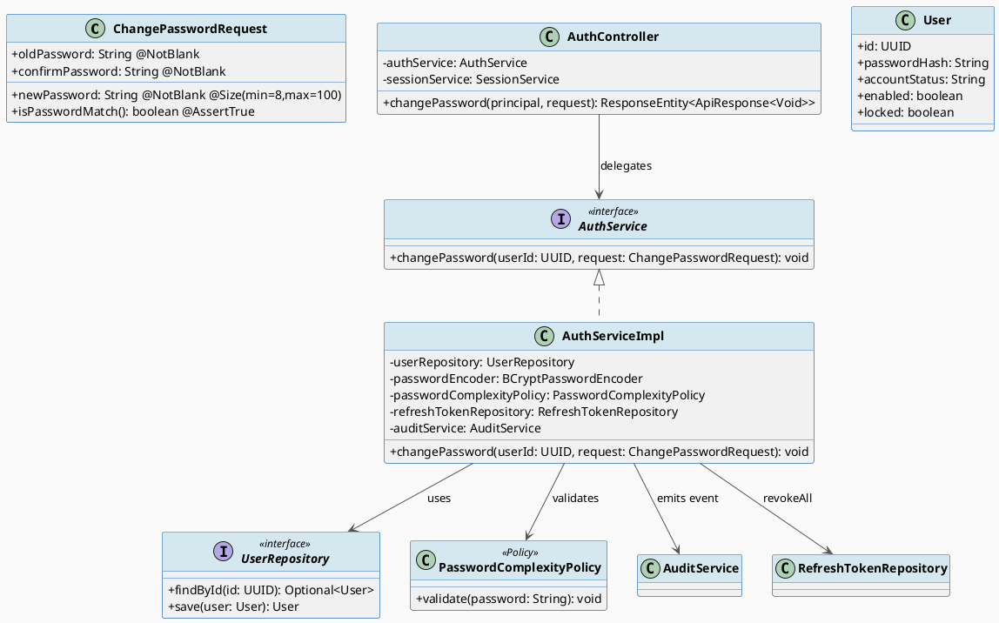
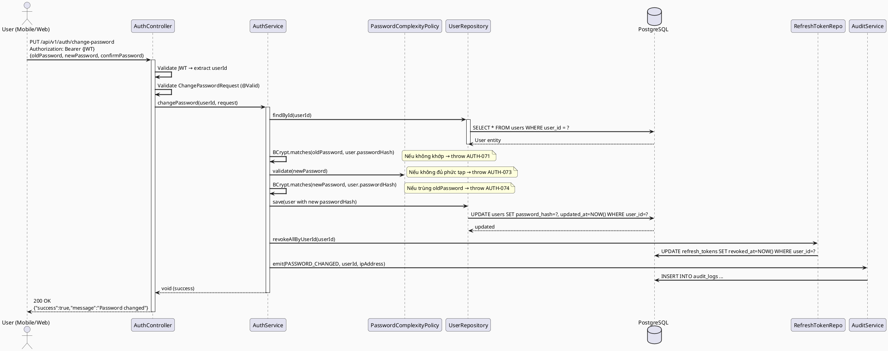
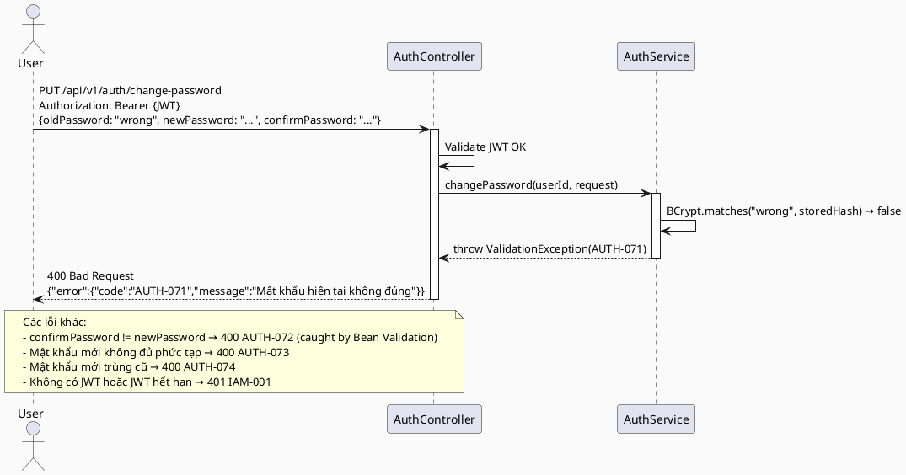

# ENGINEERING DOCUMENTATION STANDARD (EDS) v2.0
# Technical Design Specification — UC-07 Change Password

| Field              | Value                   |
| ------------------ | ----------------------- |
| **Document ID**    | `CB-AUTH-IMP-007`       |
| **Version**        | `1.0`                   |
| **Date**           | `2026-06-26`            |
| **Status**         | `Draft`                 |
| **Document Owner** | `PhuongNT`              |
| **Author**         | `AI Agent`              |
| **Reviewed by**    | `[Tech Lead]`           |
| **DPO Sign-off**   | `[ ] Pending`           |
| **Approved by**    | `[Principal Architect]` |
| **Last Review**    | `2026-06-26`            |
| **Based on EDS**   | `v2.0`                  |

---

## CHANGELOG

| Ngày       | Người thực hiện | Nội dung thay đổi                               |
| ---------- | --------------- | ----------------------------------------------- |
| 2026-06-26 | AI Agent        | Tạo tài liệu lần đầu cho UC-07 Change Password |

---

## MỤC LỤC

1. [Tổng quan Module](#1-tổng-quan-module)
2. [Ma trận Truy vết (Traceability Matrix)](#2-ma-trận-truy-vết-traceability-matrix)
3. [Architecture Decision Records (ADR)](#3-architecture-decision-records-adr)
4. [Non-Functional Requirements & SLA](#4-non-functional-requirements--sla)
5. [Static Modeling (Mô hình Tĩnh)](#5-static-modeling-mô-hình-tĩnh)
6. [Dynamic Modeling (Mô hình Động)](#6-dynamic-modeling-mô-hình-động)
7. [Domain Event Catalog](#7-domain-event-catalog)
8. [Interface Specification (Đặc tả Giao diện)](#8-interface-specification-đặc-tả-giao-diện)
9. [API Specification](#9-api-specification)
10. [Bảng mã lỗi (Error Codes)](#10-bảng-mã-lỗi-error-codes)
11. [Quy trình Triển khai (Step-by-Step)](#11-quy-trình-triển-khai-step-by-step)
12. [Rollback & Incident Runbook](#12-rollback--incident-runbook)
13. [Kịch bản Kiểm thử Chi tiết](#13-kịch-bản-kiểm-thử-chi-tiết)
14. [Phương pháp Xác minh](#14-phương-pháp-xác-minh)
15. [Mẫu thử thực tế (API Verification Samples)](#15-mẫu-thử-thực-tế-api-verification-samples)
16. [Bảng tổng hợp phân quyền (Authorization Matrix)](#16-bảng-tổng-hợp-phân-quyền-authorization-matrix)
17. [AI Prompt Constraints (CASE 2.0)](#17-ai-prompt-constraints-case-20)

---

## 1. Tổng quan Module

| Field                     | Value                                                                     |
| ------------------------- | ------------------------------------------------------------------------- |
| **Module Name**           | `ChangePassword`                                                          |
| **Bounded Context**       | `auth`                                                                    |
| **UC ID**                 | `UC-07`                                                                   |
| **SRS Reference**         | `3.1.1.7`                                                                 |
| **Primary Actor**         | `User (authenticated — ROLE_MOTHER, ROLE_EXPERT, ROLE_ADMIN)`            |
| **Platform**              | `Web App + Mobile App`                                                    |
| **Data Classification**   | `Sensitive-PII`                                                           |
| **Compliance Scope**      | `BR-RBAC, BR-SECURITY, PDPA`                                              |
| **Upstream Dependencies** | `UC-03 Login (user must have active session)`, `PasswordComplexityPolicy` |
| **Downstream Consumers**  | `AuditService (PASSWORD_CHANGED)`, `SessionService (revoke other sessions)` |

**Mô tả:** User đang đăng nhập thực hiện thay đổi mật khẩu bằng cách cung cấp mật khẩu hiện tại (`oldPassword`) và mật khẩu mới (`newPassword` + `confirmPassword`). Hệ thống xác thực mật khẩu hiện tại bằng BCrypt, kiểm tra mật khẩu mới đáp ứng `PasswordComplexityPolicy`, đảm bảo mật khẩu mới khác mật khẩu cũ, cập nhật `passwordHash` trong bảng `users`, vô hiệu hóa tất cả session khác (giữ session hiện tại hoặc yêu cầu login lại — theo ADR), và emit audit event `PASSWORD_CHANGED`.

---

## 2. Ma trận Truy vết (Traceability Matrix)

| Requirement ID | Loại          | Mô tả yêu cầu                                              | Thành phần Code                                    | Compliance Target | ADR liên quan |
| -------------- | ------------- | ---------------------------------------------------------- | -------------------------------------------------- | ----------------- | -------------- |
| UC-07          | Use Case      | Change password khi đã đăng nhập — xác thực current pass  | `AuthController.changePassword()`                  | BR-RBAC           | ADR-AUTH-031   |
| BR-AUTH-031    | Business Rule | Xác thực oldPassword bằng BCryptPasswordEncoder.matches()  | `AuthServiceImpl.changePassword()`                 | Security          | ADR-AUTH-031   |
| BR-AUTH-032    | Business Rule | Kiểm tra newPassword qua PasswordComplexityPolicy          | `PasswordComplexityPolicy.validate()`              | BR-SECURITY       | ADR-AUTH-032   |
| BR-AUTH-033    | Business Rule | newPassword != oldPassword (không được dùng lại cùng pass) | `AuthServiceImpl.changePassword()` validation      | Security          | ADR-AUTH-033   |
| BR-AUTH-034    | Business Rule | confirmPassword phải khớp newPassword                      | `ChangePasswordRequest` @AssertTrue validation     | Usability         | ADR-AUTH-032   |
| BR-AUTH-035    | Business Rule | Revoke tất cả refresh tokens khác sau khi đổi mật khẩu    | `RefreshTokenRepository.revokeAllByUserId()`       | Security          | ADR-AUTH-035   |
| BR-AUTH-036    | Business Rule | Emit audit event PASSWORD_CHANGED với userId + IP          | `AuditService.emit(PASSWORD_CHANGED)`              | Security Audit    | ADR-AUTH-036   |
| BR-AUTH-037    | Business Rule | Không log passwordHash hoặc oldPassword trong audit/logs   | `AuditServiceImpl` + Logback filter                | PDPA              | ADR-AUTH-036   |

---

## 3. Architecture Decision Records (ADR)

### ADR-AUTH-031 — Xác thực mật khẩu hiện tại trước khi cho phép đổi

| Field          | Value                        |
| -------------- | ---------------------------- |
| **Status**     | `Accepted`                   |
| **Deciders**   | `PhuongNT — Backend Lead`    |
| **Date**       | `2026-06-26`                 |
| **Supersedes** | N/A                          |

#### Bối cảnh (Context)
Change Password là thao tác nhạy cảm. Nếu chỉ yêu cầu JWT (có thể bị leak), kẻ tấn công có thể dùng stolen token để đổi mật khẩu. Cần re-authentication bằng mật khẩu hiện tại.

#### Các phương án đã xem xét (Options Considered)

| Phương án | Mô tả | Ưu điểm | Nhược điểm |
| --------- | ----- | -------- | ---------- |
| A | Yêu cầu oldPassword + JWT | Bảo mật cao, double factor | User phải nhớ password |
| B | Chỉ yêu cầu JWT | UX đơn giản hơn | Token leak = account takeover |

#### Quyết định (Decision)
Chọn **Phương án A** — yêu cầu `oldPassword` + JWT Bearer token.

#### Hệ quả (Consequences)
**Tích cực:** Ngăn chặn account takeover qua stolen JWT. Compliance với OWASP ASVS Level 2.
**Tiêu cực:** User phải nhớ current password. Mitigated bằng ForgotPassword flow (UC-05/UC-06).

---

### ADR-AUTH-032 — Áp dụng PasswordComplexityPolicy nhất quán

| Field        | Value                     |
| ------------ | ------------------------- |
| **Status**   | `Accepted`                |
| **Deciders** | `PhuongNT — Backend Lead` |
| **Date**     | `2026-06-26`              |

#### Quyết định (Decision)
`PasswordComplexityPolicy.validate()` được dùng cho cả Register, ResetPassword, và ChangePassword. Policy: min 8 ký tự, có chữ hoa, chữ thường, số. Không có giới hạn trên (trừ DB column = 100 ký tự).

---

### ADR-AUTH-035 — Revoke all other sessions sau khi đổi mật khẩu

| Field        | Value                     |
| ------------ | ------------------------- |
| **Status**   | `Accepted`                |
| **Deciders** | `PhuongNT — Backend Lead` |
| **Date**     | `2026-06-26`              |

#### Quyết định (Decision)
Sau khi đổi mật khẩu thành công, revoke ALL refresh tokens của user (bao gồm session hiện tại). User sẽ cần đăng nhập lại. Đây là defensive-first choice — nếu account bị compromise, đổi mật khẩu sẽ kick out kẻ tấn công trên tất cả devices.

#### Hệ quả
**Tích cực:** Kẻ tấn công bị kick out ngay lập tức. OWASP compliant.
**Tiêu cực:** UX friction — user phải login lại. Client phải xử lý 401 sau khi nhận 200 từ change-password.

---

## 4. Non-Functional Requirements & SLA

### 4.1. Performance & Availability

| Category     | Requirement          | Target SLA | Measurement Method | Compliance Basis |
| ------------ | -------------------- | ---------- | ------------------- | ---------------- |
| Latency      | API response (p99)   | `< 500ms`  | BCrypt cost factor  | —                |
| Availability | Uptime (monthly)     | `99.9%`    | Health check monitor | —               |

> **Ghi chú:** BCrypt với cost factor 12 mất ~200-400ms, đây là intentional security delay.

### 4.2. Data Integrity & Retention

| Category    | Requirement                       | Target  | Verification Method | Compliance Basis |
| ----------- | --------------------------------- | ------- | ------------------- | ---------------- |
| Atomicity   | updatePassword + revokeAll atomic | 100%    | `@Transactional`    | GDPR Art. 5.1(f) |
| Audit       | PASSWORD_CHANGED log retention    | 7 năm   | DB backup policy    | GDPR Art. 5.1(e) |

### 4.3. Security

| Category              | Requirement                    | Target        | Verification Method    | Compliance Basis |
| --------------------- | ------------------------------ | ------------- | ---------------------- | ---------------- |
| Password storage      | BCrypt hash (cost ≥ 12)        | Cost=12       | Unit test verify hash  | GDPR Art. 32     |
| Log sanitization      | Không log password/hash        | Zero leakage  | Log scan CI check      | PDPA             |
| Transport encryption  | HTTPS / TLS 1.3+               | TLS 1.3       | SSL Labs scan          | GDPR Art. 32     |

### 4.4. Scalability

Tải dự kiến: < 100 req/min (thao tác hiếm, không cần scale đặc biệt). Không cần caching.

---

## 5. Static Modeling (Mô hình Tĩnh)

### 5.1. Class Diagram (PlantUML)



### 5.2. Data Structure

Không cần migration mới. UC-07 chỉ cập nhật column `password_hash` trong bảng `users` hiện có.

```sql
-- Không có DDL mới. Xem V1__init_schema.sql cho bảng users.
-- Update thực hiện qua:
UPDATE users SET password_hash = :newHash, updated_at = NOW() WHERE user_id = :userId;
```

---

## 6. Dynamic Modeling (Mô hình Động)

### 6.1. Sequence Diagram — Happy Path (PlantUML)



### 6.2. Sequence Diagram — Error Path (PlantUML)



### 6.3. State Machine

Không có state machine riêng cho ChangePassword. User entity không thay đổi trạng thái (accountStatus vẫn ACTIVE). Chỉ `passwordHash` được cập nhật.

---

## 7. Domain Event Catalog

### 7.1. Events Published (Phát ra)

| Event Name        | Trigger                   | Publisher          | Subscriber(s)         | Payload Schema        | Async? |
| ----------------- | ------------------------- | ------------------ | --------------------- | --------------------- | ------ |
| `PasswordChanged` | Đổi mật khẩu thành công  | `AuthServiceImpl`  | `AuditService`        | `PasswordChanged.java` | No     |

### 7.2. Events Consumed (Tiêu thụ)

Không có event consumed trong UC-07.

### 7.3. Payload Schema

```java
// PasswordChanged.java
public record PasswordChanged(
    UUID    eventId,       // UUID.randomUUID()
    String  eventType,     // "PasswordChanged"
    Instant occurredAt,    // Instant.now()
    String  version,       // "1.0"
    Payload payload,
    Metadata metadata
) {
    public record Payload(
        UUID userId        // PII — không log raw value
    ) {}

    public record Metadata(
        UUID   correlationId,
        String causedBy,   // userId string
        String ipAddress   // IP của request
    ) {}
}
```

---

## 8. Interface Specification (Đặc tả Giao diện)

### 8.1. Service Interface

```java
// ChangePasswordRequest.java — đã tồn tại, cần bổ sung confirmPassword
// @version 1.1
public class ChangePasswordRequest {
    @NotBlank
    private String oldPassword;

    @NotBlank
    @Size(min = 8, max = 100)
    private String newPassword;

    @NotBlank
    private String confirmPassword;

    @AssertTrue(message = "Mật khẩu xác nhận không khớp")
    public boolean isPasswordMatch() {
        return newPassword != null && newPassword.equals(confirmPassword);
    }
}

// AuthService.java — bổ sung method mới
public interface AuthService {
    // ... existing methods ...

    /**
     * Thay đổi mật khẩu cho user đang đăng nhập.
     * @throws ValidationException (AUTH-071) khi oldPassword không đúng
     * @throws ValidationException (AUTH-073) khi newPassword không đủ phức tạp
     * @throws ValidationException (AUTH-074) khi newPassword trùng oldPassword
     */
    void changePassword(UUID userId, ChangePasswordRequest request);
}
```

### 8.2. Repository Interface

```java
// UserRepository.java — đã có findById và save, không cần method mới
// RefreshTokenRepository.java — cần thêm method:
public interface RefreshTokenRepository extends JpaRepository<RefreshToken, UUID> {
    // Đã có các method khác...

    @Modifying
    @Query("UPDATE RefreshToken r SET r.revokedAt = :now WHERE r.userId = :userId AND r.revokedAt IS NULL")
    int revokeAllByUserId(UUID userId, Instant now);
}
```

---

## 9. API Specification

### 9.1. Endpoints Table

| Method  | Path                             | Auth Level   | Required Roles                          | Rate Limit  | Idempotent? |
| ------- | -------------------------------- | ------------ | --------------------------------------- | ----------- | ----------- |
| `PUT`   | `/api/v1/auth/change-password`   | JWT Bearer   | `ROLE_MOTHER, ROLE_EXPERT, ROLE_ADMIN`  | 5/user/hour | No          |

### 9.2. Request / Response Schemas

#### `PUT /api/v1/auth/change-password` — Đổi mật khẩu

**Request Headers:**
```
Authorization: Bearer {access_token}
Content-Type: application/json
```

**Request Body:**
```json
{
  "oldPassword": "CurrentPassword@123",
  "newPassword": "NewSecurePass@456",
  "confirmPassword": "NewSecurePass@456"
}
```

**Response — 200 OK (Happy Path):**
```json
{
  "success": true,
  "message": "Mật khẩu đã được thay đổi thành công. Vui lòng đăng nhập lại.",
  "data": null
}
```

**Response — 400 Bad Request (Wrong current password):**
```json
{
  "error": {
    "code": "AUTH-071",
    "message": "Mật khẩu hiện tại không đúng"
  }
}
```

**Response — 400 Bad Request (Password mismatch):**
```json
{
  "error": {
    "code": "AUTH-072",
    "message": "Mật khẩu xác nhận không khớp với mật khẩu mới"
  }
}
```

**Response — 400 Bad Request (Weak password):**
```json
{
  "error": {
    "code": "AUTH-073",
    "message": "Mật khẩu mới không đủ độ mạnh (tối thiểu 8 ký tự, có chữ hoa, chữ thường và số)"
  }
}
```

**Response — 401 Unauthorized:**
```json
{
  "error": {
    "code": "IAM-001",
    "message": "Yêu cầu xác thực. Vui lòng đăng nhập lại."
  }
}
```

---

## 10. Bảng mã lỗi (Error Codes)

| Code       | HTTP Status | Message (EN)                          | Message (VI)                                        | Trigger Condition                         |
| ---------- | ----------- | ------------------------------------- | --------------------------------------------------- | ----------------------------------------- |
| `AUTH-071` | 400         | Current password is incorrect         | Mật khẩu hiện tại không đúng                       | BCrypt.matches() returns false            |
| `AUTH-072` | 400         | Password confirmation does not match  | Mật khẩu xác nhận không khớp                       | newPassword != confirmPassword            |
| `AUTH-073` | 400         | Password complexity requirement fail  | Mật khẩu mới không đủ độ mạnh                     | PasswordComplexityPolicy.validate() fails |
| `AUTH-074` | 400         | New password same as current password | Mật khẩu mới không được trùng với mật khẩu cũ     | BCrypt.matches(newPass, currentHash) true |
| `IAM-001`  | 401         | Authentication required               | Yêu cầu xác thực                                   | Missing/expired/invalid JWT               |
| `AUTH-075` | 500         | Internal error during password change | Lỗi hệ thống khi thay đổi mật khẩu                | Unexpected exception in service           |

---

## 11. Quy trình Triển khai (Step-by-Step)

### 11.1. Prerequisites

- [ ] ADR-AUTH-031 đến ADR-AUTH-036 đã được Accepted
- [ ] `PasswordComplexityPolicy` đã hoạt động (từ UC-01/UC-06)
- [ ] `RefreshTokenRepository.revokeAllByUserId()` đã được verify (từ UC-06)
- [ ] Staging environment sẵn sàng

### 11.2. Pre-Migration Checklist

Không có migration mới. Skip section này.

### 11.3. Implementation Steps

#### Chặng 1 — Cập nhật `ChangePasswordRequest`

Bổ sung field `confirmPassword` và validation `@AssertTrue`:

```java
// File: src/main/java/com/carebridge/backend/security/dto/request/ChangePasswordRequest.java
@AssertTrue(message = "Mật khẩu xác nhận không khớp")
public boolean isPasswordMatch() {
    return newPassword != null && newPassword.equals(confirmPassword);
}
```

#### Chặng 2 — Thêm method vào `AuthService` + `AuthServiceImpl`

```java
// AuthServiceImpl.java
@Override
@Transactional
public void changePassword(UUID userId, ChangePasswordRequest request) {
    User user = userRepository.findById(userId)
        .orElseThrow(() -> new ResourceNotFoundException("User not found"));

    if (!passwordEncoder.matches(request.getOldPassword(), user.getPasswordHash())) {
        throw new ValidationException("AUTH-071", "Mật khẩu hiện tại không đúng");
    }

    passwordComplexityPolicy.validate(request.getNewPassword());

    if (passwordEncoder.matches(request.getNewPassword(), user.getPasswordHash())) {
        throw new ValidationException("AUTH-074", "Mật khẩu mới không được trùng với mật khẩu cũ");
    }

    user.setPasswordHash(passwordEncoder.encode(request.getNewPassword()));
    userRepository.save(user);

    refreshTokenRepository.revokeAllByUserId(userId, Instant.now());

    auditService.emit(AuditAction.PASSWORD_CHANGED, userId, SecurityUtils.getCurrentIpAddress());
}
```

#### Chặng 3 — Thêm endpoint vào `AuthController`

```java
// AuthController.java
@PutMapping("/change-password")
@Operation(summary = "Change current user password")
public ResponseEntity<ApiResponse<Void>> changePassword(
        Principal principal,
        @Valid @RequestBody ChangePasswordRequest request) {
    authService.changePassword(SecurityUtils.requireCurrentUserId(principal), request);
    return ResponseEntity.ok(ApiResponse.success(null, "Mật khẩu đã được thay đổi"));
}
```

#### Chặng 4 — Verification sau deploy

```bash
curl -X PUT https://[host]/api/v1/auth/change-password \
  -H "Authorization: Bearer [JWT]" \
  -H "Content-Type: application/json" \
  -d '{"oldPassword":"test","newPassword":"NewPass@123","confirmPassword":"NewPass@123"}'
# Expected nếu oldPassword sai: 400 AUTH-071
```

### 11.4. Deployment Checklist

- [ ] `./mvnw clean package` thành công
- [ ] Unit tests xanh: `./mvnw test -pl backend`
- [ ] Integration test xanh với Testcontainers
- [ ] Audit log `PASSWORD_CHANGED` xuất hiện đúng format
- [ ] Không có plaintext password trong logs

---

## 12. Rollback & Incident Runbook

### 12.1. Điều kiện kích hoạt Rollback

| Điều kiện                        | Ngưỡng               | Người quyết định     |
| -------------------------------- | -------------------- | -------------------- |
| Error rate tăng đột biến         | > 5% trong 5 phút    | On-call Engineer     |
| Password được đổi không có audit | Bất kỳ case          | Tech Lead + Security |
| Session revocation thất bại      | > 1% cases           | On-call Engineer     |

### 12.2. Rollback Procedure

```bash
# Revert code deployment
kubectl rollout undo deployment/carebridge-api

# Verify rollback
kubectl rollout status deployment/carebridge-api
curl -X GET https://[host]/api/v1/health
```

> **Note:** Không cần rollback migration vì UC-07 không có DDL mới.

### 12.3. Notification Protocol

| Thời điểm        | Người nhận    | Kênh          |
| ---------------- | ------------- | ------------- |
| Ngay khi phát hiện | On-call team | Slack #incident |
| Trong 30 phút    | DPO           | Email         |

### 12.4. Post-Incident Review (PIR)

PIR bắt buộc trong 48h nếu password của user bị thay đổi ngoài ý muốn.

---

## 13. Kịch bản Kiểm thử Chi tiết

> Xem chi tiết trong `04_Implement/UC07_ChangePassword/UC07_ChangePassword_Test-Spec.md`

### Tóm tắt kịch bản:

| TC ID          | Loại        | Mô tả                                       | Kết quả mong đợi |
| -------------- | ----------- | ------------------------------------------- | ---------------- |
| AUTH-TC-007-001 | Unit        | Happy path — đổi mật khẩu hợp lệ           | 200 OK           |
| AUTH-TC-007-002 | Unit        | oldPassword sai                             | 400 AUTH-071     |
| AUTH-TC-007-003 | Unit        | confirmPassword không khớp                  | 400 AUTH-072     |
| AUTH-TC-007-004 | Unit        | Mật khẩu mới yếu                           | 400 AUTH-073     |
| AUTH-TC-007-005 | Unit        | Mật khẩu mới trùng cũ                       | 400 AUTH-074     |
| AUTH-TC-007-006 | Security    | Không có JWT                                | 401 IAM-001      |
| AUTH-TC-007-007 | Integration | Sessions bị revoke sau đổi mật khẩu         | DB assertion     |

---

## 14. Phương pháp Xác minh

### 14.1. Database Inspection

```sql
-- Verify password hash changed
SELECT password_hash, updated_at FROM users WHERE user_id = '[uuid]';

-- Verify all refresh tokens revoked
SELECT COUNT(*) FROM refresh_tokens WHERE user_id = '[uuid]' AND revoked_at IS NULL;
-- Expected: 0

-- Verify audit log
SELECT action, actor_user_id, created_at FROM audit_logs
WHERE actor_user_id = '[uuid]' AND action = 'SECURITY_EVENT'
ORDER BY created_at DESC LIMIT 1;
```

### 14.2. Log / Audit Verification

```bash
# Kiểm tra audit log không chứa password
kubectl logs -l app=carebridge-api | grep "PASSWORD_CHANGED" | head -5
# Verify log không có plaintext password
kubectl logs -l app=carebridge-api | grep -i "password" | grep -v "changed"
# Expected: No output với raw password values
```

### 14.3. Tool-based Verification

```bash
# Verify JWT after password change is invalid
curl -X GET https://[host]/api/v1/auth/profile \
  -H "Authorization: Bearer [OLD_JWT]"
# Expected: 401 (nếu token đã revoke) hoặc 200 (nếu AT còn hạn — AT expiry là 15min)
```

---

## 15. Mẫu thử thực tế (API Verification Samples)

### 15.1. Happy Path

```bash
# Đổi mật khẩu thành công
curl -X PUT https://[host]/api/v1/auth/change-password \
  -H "Authorization: Bearer [VALID_JWT]" \
  -H "Content-Type: application/json" \
  -H "X-Correlation-Id: $(uuidgen)" \
  -d '{
    "oldPassword": "CurrentPass@123",
    "newPassword": "NewSecurePass@456",
    "confirmPassword": "NewSecurePass@456"
  }'
```

**Expected Response (200):**
```json
{
  "success": true,
  "message": "Mật khẩu đã được thay đổi thành công. Vui lòng đăng nhập lại.",
  "data": null
}
```

### 15.2. Error Paths

```bash
# Mật khẩu hiện tại sai → 400 AUTH-071
curl -X PUT https://[host]/api/v1/auth/change-password \
  -H "Authorization: Bearer [VALID_JWT]" \
  -H "Content-Type: application/json" \
  -d '{"oldPassword":"WrongPass","newPassword":"NewPass@123","confirmPassword":"NewPass@123"}'
```

```bash
# Không có JWT → 401
curl -X PUT https://[host]/api/v1/auth/change-password \
  -H "Content-Type: application/json" \
  -d '{"oldPassword":"X","newPassword":"Y","confirmPassword":"Y"}'
```

---

## 16. Bảng tổng hợp phân quyền (Authorization Matrix)

| Endpoint                           | `GUEST` | `MOTHER` | `EXPERT` | `ADMIN` | `SYSTEM` |
| ---------------------------------- | ------- | -------- | -------- | ------- | -------- |
| `PUT /api/v1/auth/change-password` | ❌      | ✅ Own   | ✅ Own   | ✅ Own  | ❌       |

**Chú thích:** Own = chỉ được đổi mật khẩu của chính mình (userId lấy từ JWT).

---

## 17. AI Prompt Constraints (CASE 2.0)

### 17.1 Constraint Summary Table

| # | Constraint                                                                                | Source (ADR/BR)   | Last Verified |
| - | ----------------------------------------------------------------------------------------- | ----------------- | ------------- |
| C1 | PHẢI xác thực `oldPassword` bằng `BCryptPasswordEncoder.matches()` trước khi thay đổi    | `ADR-AUTH-031`    | `2026-06-26`  |
| C2 | PHẢI gọi `PasswordComplexityPolicy.validate(newPassword)` — không tự implement logic     | `ADR-AUTH-032`    | `2026-06-26`  |
| C3 | PHẢI revoke ALL refresh tokens của user sau đổi mật khẩu (không chỉ current session)     | `ADR-AUTH-035`    | `2026-06-26`  |
| C4 | KHÔNG được log `oldPassword`, `newPassword`, hoặc `passwordHash` ở bất kỳ layer nào      | `BR-AUTH-037`     | `2026-06-26`  |
| C5 | PHẢI emit `PASSWORD_CHANGED` audit event với `userId` và `ipAddress`                      | `BR-AUTH-036`     | `2026-06-26`  |
| C6 | `updatePassword` + `revokeAll` + `auditEmit` PHẢI nằm trong một `@Transactional` block   | `ADR-AUTH-031`    | `2026-06-26`  |

### 17.2 Constraint Injection Block

```
[CONSTRAINT BLOCK — Module: ChangePassword — CB-AUTH-IMP-007]
Theo TDS CB-AUTH-IMP-007 và các ADR liên quan:

1. (C1) PHẢI verify oldPassword bằng BCryptPasswordEncoder.matches() — không skip step này dù JWT đã xác thực
2. (C2) Dùng PasswordComplexityPolicy.validate() — không tự implement password strength check
3. (C3) Revoke ALL refresh_tokens của user sau thay đổi mật khẩu thành công
4. (C4) Tuyệt đối không log raw password, confirmPassword, hoặc password hash
5. (C5) Emit PASSWORD_CHANGED event qua AuditService — không optional
6. (C6) Toàn bộ operation là @Transactional — rollback nếu bất kỳ bước nào fail

[CONTEXT BLOCK]
- Bounded Context: auth (security package)
- Data Classification: Sensitive-PII
- Compliance: PDPA, BR-SECURITY
- Existing: ChangePasswordRequest.java (cần bổ sung confirmPassword), AuthService, UserRepository, RefreshTokenRepository, PasswordComplexityPolicy
- Auth matrix: §16 — chỉ Own user, không có Guest hoặc cross-user access

[TASK BLOCK]
Implement changePassword(UUID userId, ChangePasswordRequest) thỏa mãn constraints trên.
Tests phải cover §13 kịch bản kiểm thử.
```

### 17.3 Constraint Quality Checklist

- [x] Mỗi constraint traceable về ADR/BR cụ thể
- [x] Không có constraint generic
- [x] Last Verified date ≤ 2 sprints
- [x] Constraint block reference §8 Interface
- [x] Constraint block reference §16 Auth Matrix

### 17.4 Anti-Pattern Detection

| AP-ID      | Anti-Pattern           | Dấu hiệu                                      | Hành động              |
| ---------- | ---------------------- | --------------------------------------------- | ---------------------- |
| AP-AI-001  | Unconstrained Gen      | Code không check oldPassword                  | Reject — thêm C1       |
| AP-AI-003  | Implicit Decision      | Code tự implement password strength           | Reject — dùng Policy   |
| AP-AI-005  | Hallucinated Contract  | Code import service không có trong §8         | Reject — verify first  |

---

*EDS v2.0 — UC-07 Change Password*
*Status: Draft — chờ Tech Lead review.*
