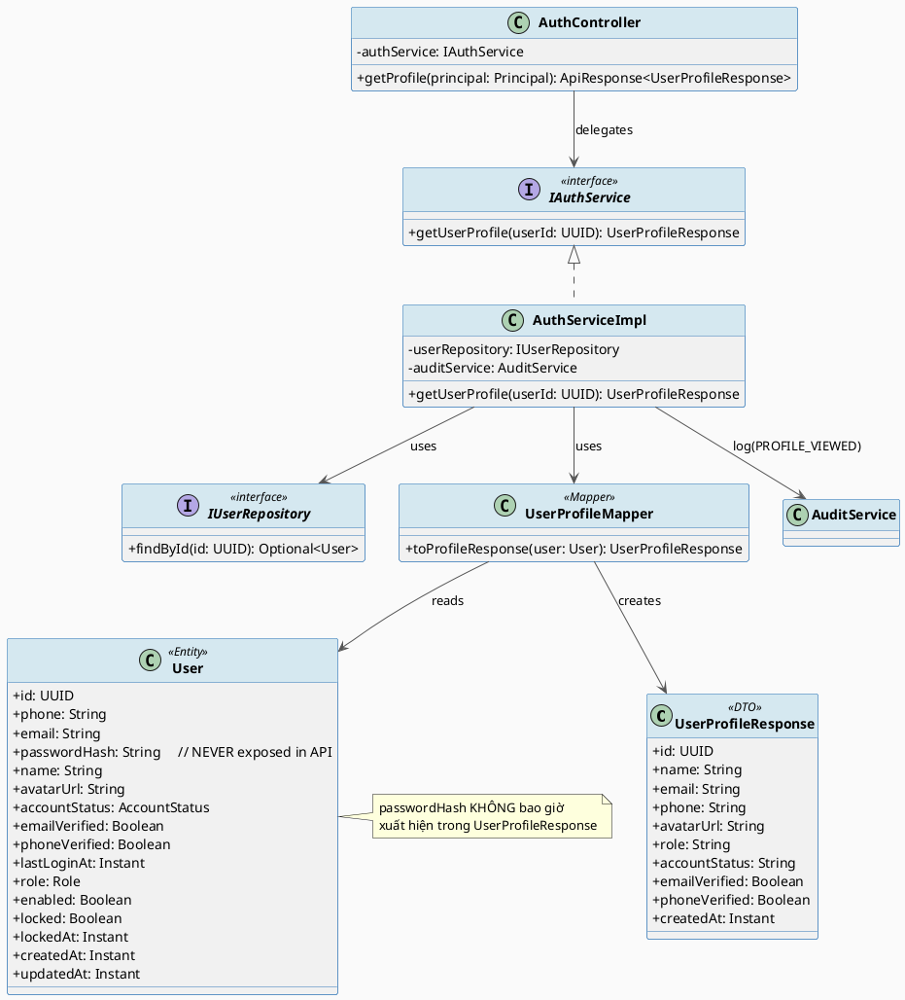
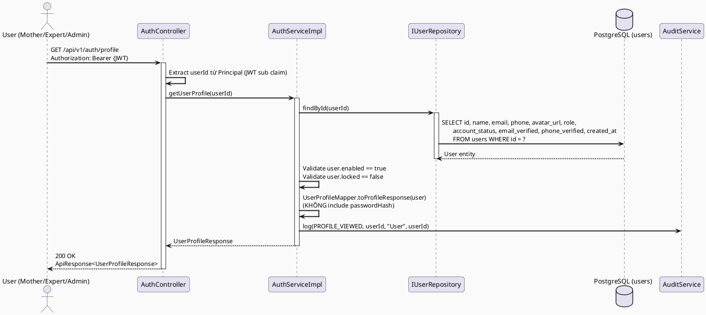
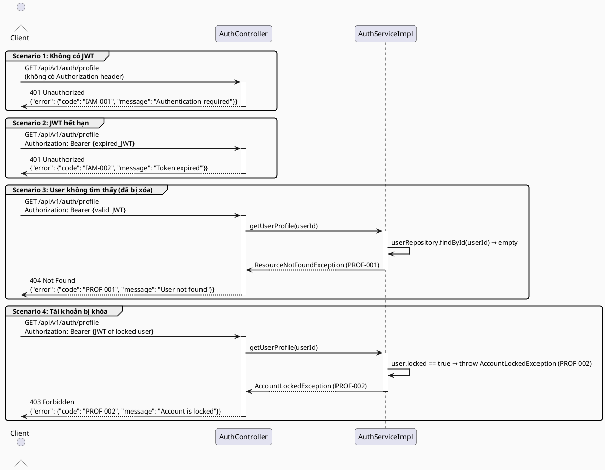

# ENGINEERING DOCUMENTATION STANDARD (EDS) v2.0
# Technical Design Specification — UC-08 View Account Profile

| Field              | Value                             |
| ------------------ | --------------------------------- |
| **Document ID**    | `CB-AUTH-IMP-008`                 |
| **Version**        | `1.0`                             |
| **Date**           | `2026-06-26`                      |
| **Status**         | `Draft`                           |
| **Document Owner** | `PhuongNT`                        |
| **Author**         | `AI Agent`                        |
| **Reviewed by**    | `[Tech Lead]`                     |
| **DPO Sign-off**   | `[ ] Pending`                     |
| **Approved by**    | `[Principal Architect]`           |
| **Last Review**    | `2026-06-26`                      |
| **Based on EDS**   | `v2.0`                            |

---

## CHANGELOG

> **Policy 4.4 — Immutable History:** Không bao giờ xóa thông tin cũ. Mọi thay đổi phải ghi vào bảng này.

| Ngày       | Người thực hiện | Nội dung thay đổi                                       |
| ---------- | --------------- | ------------------------------------------------------- |
| 2026-06-26 | AI Agent        | Tạo tài liệu lần đầu cho UC-08 View Account Profile    |

---

## MỤC LỤC

1. [Tổng quan Module](#1-tổng-quan-module)
2. [Ma trận Truy vết (Traceability Matrix)](#2-ma-trận-truy-vết-traceability-matrix)
3. [Architecture Decision Records (ADR)](#3-architecture-decision-records-adr)
4. [Non-Functional Requirements & SLA](#4-non-functional-requirements--sla)
5. [Static Modeling (Mô hình Tĩnh)](#5-static-modeling-mô-hình-tĩnh)
6. [Dynamic Modeling (Mô hình Động)](#6-dynamic-modeling-mô-hình-động)
7. [Domain Event Catalog](#7-domain-event-catalog)
8. [Interface Specification (Đặc tả Giao diện)](#8-interface-specification-đặc-tả-giao-diện)
9. [API Specification](#9-api-specification)
10. [Bảng mã lỗi (Error Codes)](#10-bảng-mã-lỗi-error-codes)
11. [Quy trình Triển khai (Step-by-Step)](#11-quy-trình-triển-khai-step-by-step)
12. [Rollback & Incident Runbook](#12-rollback--incident-runbook)
13. [Kịch bản Kiểm thử Chi tiết](#13-kịch-bản-kiểm-thử-chi-tiết)
14. [Phương pháp Xác minh](#14-phương-pháp-xác-minh)
15. [Mẫu thử thực tế (API Verification Samples)](#15-mẫu-thử-thực-tế-api-verification-samples)
16. [Bảng tổng hợp phân quyền (Authorization Matrix)](#16-bảng-tổng-hợp-phân-quyền-authorization-matrix)
17. [AI Prompt Constraints (CASE 2.0)](#17-ai-prompt-constraints-case-20)

---

## 1. Tổng quan Module

> UC-08 cho phép người dùng đã xác thực xem thông tin hồ sơ tài khoản cá nhân của chính mình, bao gồm: id, tên, email, số điện thoại, ảnh đại diện, vai trò (role), trạng thái tài khoản, trạng thái xác minh email/phone, và thời gian tạo tài khoản. Đây là tính năng đọc (read-only) trên dữ liệu Sensitive-PII — không có side effect ghi dữ liệu, nhưng vẫn phải kiểm tra RBAC (chỉ được xem profile của chính mình). Endpoint `GET /api/v1/auth/profile` đã tồn tại trong codebase; TDS này chính thức hóa hợp đồng API, bổ sung audit log cho mỗi lần truy cập, và mở rộng `UserProfileResponse` để bao gồm đầy đủ các trường cần thiết.

| Field                     | Value                                                                           |
| ------------------------- | ------------------------------------------------------------------------------- |
| **Module Name**           | `View Account Profile`                                                          |
| **Bounded Context**       | `auth`                                                                          |
| **UC ID**                 | `UC-08`                                                                         |
| **SRS Reference**         | `3.1.1.8`                                                                       |
| **Platform**              | `Mobile App (Flutter) + Web App (React)`                                        |
| **Data Classification**   | `Sensitive-PII`                                                                 |
| **Compliance Scope**      | `PDPA (Vietnam) — Luật 91/2025 Điều 17; GDPR Art. 5.1(a), Art. 15, Art. 32`   |
| **Upstream Dependencies** | `security (JWT Auth)`, `identity (User entity)`                                 |
| **Downstream Consumers**  | `profile (UC-09 Update Profile)`, `notification (UC-10–12)`, `community`        |

---

## 2. Ma trận Truy vết (Traceability Matrix)

> Ánh xạ trực tiếp: [Mã yêu cầu] → [Thành phần Code] → [Mục tiêu Tuân thủ].

| Requirement ID | Loại          | Mô tả yêu cầu                                                              | Thành phần Code                                                           | Compliance Target             | ADR liên quan |
| -------------- | ------------- | --------------------------------------------------------------------------- | ------------------------------------------------------------------------- | ----------------------------- | ------------- |
| UC-08          | User Story    | Người dùng xem hồ sơ tài khoản cá nhân của chính mình                      | `AuthController.getProfile()`                                             | PDPA Điều 17; GDPR Art. 15    | ADR-008-001   |
| BR-PROF-OWN    | Business Rule | Người dùng chỉ được xem profile của chính mình                             | `AuthController` — extract userId từ JWT, không nhận userId từ path param | PDPA Điều 17; GDPR Art. 5.1   | ADR-008-001   |
| BR-PROF-RESP   | Business Rule | Response phải bao gồm: id, name, email, phone, avatarUrl, role, accountStatus, emailVerified, phoneVerified, createdAt | `UserProfileResponse` DTO                           | —                             | —             |
| BR-PROF-AUDIT  | Business Rule | Mỗi lần xem profile phải ghi audit log `ProfileViewed`                     | `AuthService` → `AuditService.log(ProfileViewed)`                         | GDPR Art. 15; PDPA Điều 7    | ADR-008-002   |
| BR-PROF-NOEXP  | Business Rule | Không bao giờ expose `passwordHash` hoặc field nội bộ trong response       | `UserProfileResponse` DTO — chỉ chứa safe fields                          | GDPR Art. 5.1(c)              | ADR-008-001   |
| SRS-3.1.1.8    | Functional    | Hiển thị thông tin cá nhân, role, trạng thái tài khoản, và cài đặt cơ bản | `GET /api/v1/auth/profile`                                                | —                             | —             |

---

## 3. Architecture Decision Records (ADR)

### ADR-008-001 — Sử dụng endpoint hiện có, mở rộng UserProfileResponse

| Field        | Value                          |
| ------------ | ------------------------------ |
| **Status**   | `Accepted`                     |
| **Deciders** | `PhuongNT — Tech Lead`         |
| **Date**     | `2026-06-26`                   |
| **Supersedes** | `—`                          |

#### Bối cảnh (Context)
`GET /api/v1/auth/profile` đã tồn tại trong `AuthController` và trả về `UserProfileResponse`. Tuy nhiên, `UserProfileResponse` hiện tại có thể thiếu một số trường cần thiết (emailVerified, phoneVerified, accountStatus, createdAt). UC-08 yêu cầu hiển thị đầy đủ thông tin — cần mở rộng DTO mà không tạo thêm endpoint mới.

#### Các phương án đã xem xét (Options Considered)

| Phương án | Mô tả                                                      | Ưu điểm                                  | Nhược điểm                                             |
| --------- | ---------------------------------------------------------- | ----------------------------------------- | ------------------------------------------------------- |
| A         | Tạo endpoint mới `GET /api/v1/profile` trong package mới   | Tách biệt hơn                             | Duplicate với endpoint hiện có; cần migration client   |
| B         | Mở rộng `UserProfileResponse` hiện có trong `auth` package | Không breaking; reuse code sẵn có        | `auth` package phải xử lý thêm fields PII              |

#### Quyết định (Decision)
Chọn **Phương án B**: giữ nguyên `GET /api/v1/auth/profile`, mở rộng `UserProfileResponse` để include tất cả fields cần thiết. Không expose `passwordHash`, `lockedAt`, hoặc field nội bộ khác.

#### Hệ quả (Consequences)

**Tích cực:**
- Không breaking change cho client hiện tại.
- Không cần migration endpoint.

**Tiêu cực / Trade-offs:**
- `UserProfileResponse` ngày càng lớn hơn — cần monitor khi có thêm fields.

**Compliance Impact:**
- GDPR Art. 15 (Right of Access): người dùng được xem data của mình — đây là nghĩa vụ pháp lý.

---

### ADR-008-002 — Audit log cho read operation

| Field        | Value                          |
| ------------ | ------------------------------ |
| **Status**   | `Accepted`                     |
| **Deciders** | `PhuongNT — Tech Lead`         |
| **Date**     | `2026-06-26`                   |

#### Bối cảnh (Context)
Thông thường read operations không cần audit log. Tuy nhiên, đây là truy cập vào dữ liệu Sensitive-PII (email, phone, role) — GDPR Art. 15 và PDPA Điều 7 khuyến nghị ghi lại mọi access vào dữ liệu cá nhân để đáp ứng accountability principle.

#### Các phương án đã xem xét (Options Considered)

| Phương án | Mô tả                              | Ưu điểm                           | Nhược điểm                                 |
| --------- | ---------------------------------- | ---------------------------------- | ------------------------------------------- |
| A         | Không audit read operation         | Latency thấp hơn                   | Thiếu accountability; vi phạm best practice |
| B         | Audit mỗi GET `/api/v1/auth/profile`| Accountability đầy đủ              | Tăng nhẹ latency và DB writes              |

#### Quyết định (Decision)
Chọn **Phương án B**: gọi `AuditService.log(PROFILE_VIEWED, ...)` sau mỗi lần `getProfile()` thành công. Đây là yêu cầu từ GDPR Art. 15 accountability.

#### Hệ quả (Consequences)

**Tích cực:**
- Đáp ứng GDPR accountability — có thể trace ai xem profile vào lúc nào.

**Tiêu cực / Trade-offs:**
- Mỗi GET ghi 1 audit record — cần retention policy để tránh DB bloat.

**Compliance Impact:**
- GDPR Art. 5.1(f): integrity and confidentiality — access phải được ghi lại.

---

## 4. Non-Functional Requirements & SLA

### 4.1. Performance & Availability

| Category     | Requirement              | Target SLA | Measurement Method  | Compliance Basis |
| ------------ | ------------------------ | ---------- | ------------------- | ---------------- |
| Latency      | API response (p99)       | `< 200ms`  | k6 load test        | —                |
| Availability | Uptime (monthly)         | `99.9%`    | Uptime monitor      | —                |
| Throughput   | Concurrent read req/s    | `500 req/s`| Load test           | —                |

### 4.2. Data Integrity & Retention

| Category    | Requirement                            | Target    | Verification Method        | Compliance Basis  |
| ----------- | -------------------------------------- | --------- | -------------------------- | ----------------- |
| Read-only   | GET không gây side-effect ghi dữ liệu | 100%      | Code review; unit test     | GDPR Art. 5.1(c)  |
| Retention   | Audit log ProfileViewed                | 7 năm     | DB backup policy           | GDPR Art. 5.1(e)  |
| Consistency | Response không chứa stale data         | 100%      | Direct DB read; no cache   | GDPR Art. 5.1(d)  |

### 4.3. Security

| Category              | Requirement              | Target     | Verification Method    | Compliance Basis |
| --------------------- | ------------------------ | ---------- | ---------------------- | ---------------- |
| Encryption in transit | Tất cả endpoint          | TLS 1.3+   | SSL Labs scan          | GDPR Art. 32     |
| Data minimization     | Không expose passwordHash| 0 leaks    | Response schema review | GDPR Art. 5.1(c) |
| Access control        | Own-resource only        | Reject 403 | Auth Matrix (§16)      | GDPR Art. 25     |

### 4.4. Scalability & Capacity Planning

> Endpoint đọc — dự kiến tần suất cao (mỗi lần vào app là 1 lần gọi). 10,000 users × 5 sessions/day = 50,000 req/day. Không cần cache vì data thay đổi ít (profile update), nhưng cần index trên `users.id` (đã có PK).

---

## 5. Static Modeling (Mô hình Tĩnh)

### 5.1. Class Diagram (PlantUML)



### 5.2. Data Structure

> UC-08 là read-only operation. Không có Flyway migration mới. Sử dụng bảng `users` đã tồn tại.

```sql
-- Không có migration mới cho UC-08.
-- Bảng users đã tồn tại với cấu trúc:
--   id (UUID PK), phone, email, password_hash, name, avatar_url,
--   account_status, email_verified, phone_verified, last_login_at,
--   role, enabled, locked, locked_at, created_at, updated_at
--
-- Index hiện có: PRIMARY KEY idx_users_pkey ON users(id)
-- Index cần có (nếu chưa có): idx_users_email ON users(email)

-- Câu truy vấn thực hiện bởi UC-08:
SELECT id, name, email, phone, avatar_url, role, account_status,
       email_verified, phone_verified, created_at
FROM users
WHERE id = :userId;
```

---

## 6. Dynamic Modeling (Mô hình Động)

### 6.1. Sequence Diagram — Happy Path (PlantUML)



### 6.2. Sequence Diagram — Error Path (PlantUML)



### 6.3. State Machine

> UC-08 là read-only, không thay đổi trạng thái. State machine không áp dụng cho UC-08.

---

## 7. Domain Event Catalog

### 7.1. Events Published (Phát ra)

| Event Name       | Trigger                         | Publisher          | Subscriber(s)   | Payload Schema           | Async? |
| ---------------- | ------------------------------- | ------------------ | --------------- | ------------------------ | ------ |
| `ProfileViewed`  | Truy cập GET /api/v1/auth/profile thành công | `AuthServiceImpl` | `AuditService` | `ProfileViewedEvent.java` | No     |

### 7.2. Events Consumed (Tiêu thụ)

| Event Name | Source | Handler | Action thực hiện |
| ---------- | ------ | ------- | ---------------- |
| _(Không có)_ | — | — | — |

### 7.3. Payload Schema

```java
// ProfileViewedEvent.java
// @version 1.0
public record ProfileViewedEvent(
    String  eventId,          // UUID — dùng để deduplicate
    String  eventType,        // "ProfileViewed"
    Instant occurredAt,       // ISO 8601
    String  version,          // "1.0"
    Payload payload,
    Metadata metadata
) {
    public record Payload(
        UUID userId          // ID người dùng xem profile của chính mình
    ) {}

    public record Metadata(
        String correlationId, // Request trace ID (X-Correlation-Id header)
        UUID   causedBy       // userId thực hiện — bằng userId trong payload
    ) {}
}
```

---

## 8. Interface Specification (Đặc tả Giao diện)

### 8.1. Service Interface

```java
// IAuthService.java (bổ sung method getUserProfile)
// @version 1.1
// Package: com.carebridge.backend.security.service

/**
 * Phương thức xem profile người dùng hiện tại.
 * Chỉ trả về profile của chính người dùng đang đăng nhập.
 */
public interface IAuthService {

    /**
     * Lấy thông tin hồ sơ của người dùng đang xác thực.
     * @param authenticatedUserId  ID người dùng từ JWT (không phải từ request param)
     * @return UserProfileResponse  Thông tin profile — KHÔNG chứa passwordHash
     * @throws ResourceNotFoundException [PROF-001] Khi userId không tồn tại trong DB
     * @throws AccountLockedException    [PROF-002] Khi tài khoản bị khóa
     */
    UserProfileResponse getUserProfile(UUID authenticatedUserId);
}

// UserProfileResponse.java
// @version 1.1
// Package: com.carebridge.backend.security.dto.response
public class UserProfileResponse {
    private UUID    id;
    private String  name;
    private String  email;
    private String  phone;
    private String  avatarUrl;
    private String  role;              // Enum name: ROLE_MOTHER / ROLE_EXPERT / ROLE_ADMIN
    private String  accountStatus;    // Enum name: ACTIVE / INACTIVE / SUSPENDED
    private Boolean emailVerified;
    private Boolean phoneVerified;
    private Instant createdAt;
    // passwordHash, lockedAt, enabled — KHÔNG có trong DTO này
    // getters / setters / @JsonInclude(NON_NULL)
}
```

### 8.2. Repository Interface

```java
// IUserRepository.java (đã tồn tại — chỉ sử dụng, không thay đổi)
// @version 1.0
// Package: com.carebridge.backend.security.repository
public interface IUserRepository extends JpaRepository<User, UUID> {
    Optional<User> findById(UUID id);           // Đã có — dùng cho UC-08
    Optional<User> findByEmail(String email);   // Đã có
    // Không thêm method mới cho UC-08
}
```

---

## 9. API Specification

### 9.1. Endpoints Table

| Method | Path                        | Auth Level  | Required Roles                                 | Rate Limit | Idempotent? |
| ------ | --------------------------- | ----------- | ---------------------------------------------- | ---------- | ----------- |
| `GET`  | `/api/v1/auth/profile`      | JWT Bearer  | `ROLE_MOTHER`, `ROLE_EXPERT`, `ROLE_ADMIN`     | 300/min    | Yes         |

### 9.2. Request / Response Schemas

#### `GET /api/v1/auth/profile` — Xem hồ sơ tài khoản

**Request Headers:**
```
Authorization: Bearer {JWT_TOKEN}
X-Correlation-Id: {uuid}    (optional — dùng cho audit trace)
```

**Request Body:** Không có (GET request)

**Response — 200 OK (Happy Path):**
```json
{
  "data": {
    "id": "550e8400-e29b-41d4-a716-446655440000",
    "name": "Nguyễn Thị Lan",
    "email": "lan.nguyen@example.com",
    "phone": "0912345678",
    "avatarUrl": "https://cdn.carebridge.vn/avatars/user123.jpg",
    "role": "ROLE_MOTHER",
    "accountStatus": "ACTIVE",
    "emailVerified": true,
    "phoneVerified": false,
    "createdAt": "2026-01-15T08:30:00.000Z"
  },
  "message": "Profile retrieved successfully",
  "timestamp": "2026-06-26T10:00:00.000Z"
}
```

**Response — 401 Unauthorized (Không có hoặc JWT hết hạn):**
```json
{
  "error": {
    "code": "IAM-001",
    "message": "Authentication required"
  }
}
```

**Response — 404 Not Found (User không tồn tại):**
```json
{
  "error": {
    "code": "PROF-001",
    "message": "User not found"
  }
}
```

**Response — 403 Forbidden (Tài khoản bị khóa):**
```json
{
  "error": {
    "code": "PROF-002",
    "message": "Account is locked"
  }
}
```

---

## 10. Bảng mã lỗi (Error Codes)

> Tiền tố mã lỗi: `PROF-` cho profile view operation của UC-08.

| Code       | HTTP Status | Message (EN)                  | Message (VI)                        | Trigger Condition                                      |
| ---------- | ----------- | ----------------------------- | ----------------------------------- | ------------------------------------------------------ |
| `PROF-001` | 404         | User not found                | Không tìm thấy người dùng           | userId từ JWT không có trong bảng `users`              |
| `PROF-002` | 403         | Account is locked             | Tài khoản bị khóa                   | `users.locked == true` tại thời điểm gọi API           |
| `PROF-003` | 500         | Internal error                | Lỗi hệ thống                        | Lỗi DB hoặc AuditService không phản hồi               |

---

## 11. Quy trình Triển khai (Step-by-Step)

### 11.1. Prerequisites

- [ ] ADR-008-001 và ADR-008-002 đã được Accepted (xem §3)
- [ ] DPO đã sign-off (module truy cập Sensitive-PII)
- [ ] Blueprint đã được Principal Architect approve
- [ ] Môi trường staging đã sẵn sàng

### 11.2. Pre-Migration Checklist

> UC-08 không có Flyway migration mới. Checklist tập trung vào code change.

- [ ] Đã review `UserProfileResponse` hiện tại — xác nhận cần bổ sung fields nào
- [ ] Đã xác nhận `passwordHash` và `lockedAt` KHÔNG có trong DTO
- [ ] Code review đã hoàn thành bởi Tech Lead

### 11.3. Implementation Steps

#### Chặng 1 — Mở rộng UserProfileResponse DTO

```java
// File: src/main/java/com/carebridge/backend/security/dto/response/UserProfileResponse.java
// Bổ sung các fields: role, accountStatus, emailVerified, phoneVerified, createdAt
// (Xem §8.1 cho schema đầy đủ)
// Chú ý: KHÔNG thêm passwordHash, lockedAt, enabled
```

#### Chặng 2 — Cập nhật UserProfileMapper

```java
// Tạo hoặc cập nhật: com/carebridge/backend/security/mapper/UserProfileMapper.java
// Đảm bảo toProfileResponse() map đầy đủ các fields mới
// Đảm bảo passwordHash không bị map sang bất kỳ field nào
```

#### Chặng 3 — Bổ sung AuditAction và audit log trong service

```java
// Trong AuthServiceImpl.getUserProfile():
// Sau khi lấy user thành công:
auditService.log(AuditAction.PROFILE_VIEWED, userId, "User", userId, null);
```

#### Chặng 4 — Verification sau deploy

```bash
# Kiểm tra endpoint trả về đúng fields
TOKEN=$(curl -s -X POST https://[host]/api/v1/auth/login \
  -H "Content-Type: application/json" \
  -d '{"email":"test@example.com","password":"TestPass123!"}' | jq -r '.data.accessToken')

curl -X GET https://[host]/api/v1/auth/profile \
  -H "Authorization: Bearer $TOKEN" | jq .

# Verify không có passwordHash trong response
curl -X GET https://[host]/api/v1/auth/profile \
  -H "Authorization: Bearer $TOKEN" | jq 'keys | contains(["passwordHash"])'
# Expected: false
```

### 11.4. Deployment Checklist

- [ ] GET `/api/v1/auth/profile` với JWT hợp lệ → 200 OK với đầy đủ fields
- [ ] Response KHÔNG chứa `passwordHash`
- [ ] GET `/api/v1/auth/profile` không có JWT → 401
- [ ] Audit log có record `PROFILE_VIEWED` sau mỗi lần gọi thành công
- [ ] p99 latency < 200ms dưới 100 concurrent requests

---

## 12. Rollback & Incident Runbook

### 12.1. Điều kiện kích hoạt Rollback

| Điều kiện                            | Ngưỡng                      | Người quyết định        |
| ------------------------------------ | --------------------------- | ----------------------- |
| Error rate tăng đột biến             | > 5% trong 5 phút           | On-call Engineer        |
| Latency p99 vượt ngưỡng              | > 2x baseline (> 400ms)     | On-call Engineer        |
| PII leak phát hiện trong response    | Bất kỳ case nào             | Tech Lead + DPO — CRITICAL |
| Audit log ngừng hoạt động            | > 1 phút                    | On-call Engineer        |

### 12.2. Rollback Procedure

```bash
# UC-08 không có DB migration — rollback chỉ là code rollback

# Bước 1: Re-deploy phiên bản cũ
kubectl rollout undo deployment/carebridge-api

# Bước 2: Verify rollback thành công
kubectl rollout status deployment/carebridge-api
curl -X GET https://[host]/api/v1/health

# Bước 3: Chạy smoke test
TOKEN=<jwt>
curl -X GET https://[host]/api/v1/auth/profile -H "Authorization: Bearer $TOKEN"
# Expected: 200 OK
```

### 12.3. Notification Protocol

| Thời điểm         | Người nhận     | Kênh             | Template                                              |
| ----------------- | -------------- | ---------------- | ----------------------------------------------------- |
| Ngay khi phát hiện | On-call team  | Slack `#incident` | "[PROF] UC-08 incident detected: [mô tả]"            |
| Trong 30 phút     | DPO            | Email            | Bắt buộc nếu PII bị ảnh hưởng (GDPR Art. 33)         |
| Trong 72 giờ      | DPA            | Email            | Bắt buộc nếu có data breach (GDPR Art. 33)            |

### 12.4. Post-Incident Review (PIR)

> Bắt buộc hoàn thành PIR document trong vòng **48 giờ** sau khi incident được resolve.

**PIR Template:**
- **Timeline:** Diễn biến từng bước theo thứ tự thời gian
- **Root Cause:** Nguyên nhân gốc rễ (5 Whys)
- **Impact:** Số users ảnh hưởng, thời gian downtime, PII exposure?
- **Remediation:** Các bước đã thực hiện để khắc phục
- **Prevention:** Action items để tránh tái diễn

---

## 13. Kịch bản Kiểm thử Chi tiết

> **Policy (EDS v2.0 — Test Data):** Mọi test dùng dữ liệu `SYNTHETIC`. Tuyệt đối không dùng PII thật.

### 13.1. Unit Tests

#### TC-UNIT-001 — Lấy profile thành công (Happy Path)

```gherkin
Feature: View Account Profile
  Background:
    Given test data classification: SYNTHETIC
    And user có userId = "user-test-008" đã xác thực với JWT hợp lệ
    And users table chứa record có id = "user-test-008", name="Test User", role="ROLE_MOTHER"

  Scenario: Lấy profile thành công
    Given userId = "user-test-008" tồn tại trong DB
    When AuthServiceImpl.getUserProfile("user-test-008") được gọi
    Then trả về UserProfileResponse có id = "user-test-008"
    And response.role = "ROLE_MOTHER"
    And response không chứa passwordHash
    And AuditService.log(PROFILE_VIEWED, ...) được gọi đúng 1 lần
```

**Hàm được test:** `AuthServiceImpl.getUserProfile()`
**Invariant kiểm tra:** passwordHash không bao giờ xuất hiện trong response.

#### TC-UNIT-002 — User không tồn tại

```gherkin
  Scenario: userId không tồn tại trong DB
    Given userId = "non-existent-uuid" không có trong users table
    When AuthServiceImpl.getUserProfile("non-existent-uuid") được gọi
    Then ResourceNotFoundException được ném với code "PROF-001"
    And AuditService.log() KHÔNG được gọi
```

### 13.2. Integration Tests

#### TC-INT-001 — Service + Repository phối hợp đúng

```gherkin
  Scenario: Service gọi đúng repository và trả về đúng data
    Given test data classification: SYNTHETIC
    And database chứa user "user-int-008" với đầy đủ fields
    When AuthServiceImpl.getUserProfile("user-int-008") được gọi
    Then userRepository.findById("user-int-008") được gọi đúng 1 lần
    And response.name đúng với dữ liệu trong DB
    And response.passwordHash == null (không có field này)
    And audit_logs có record PROFILE_VIEWED cho userId "user-int-008"
```

### 13.3. E2E / Security Tests

#### TC-E2E-001 — Luồng hoàn chỉnh qua API

```gherkin
  Scenario: GET /api/v1/auth/profile thành công
    Given test data classification: SYNTHETIC
    And user "mother-008" đã đăng nhập, có JWT hợp lệ với role ROLE_MOTHER
    When GET /api/v1/auth/profile được gọi với:
      | Header          | Value              |
      | Authorization   | Bearer {token}     |
      | X-Correlation-Id| {uuid}             |
    Then response status là 200
    And response.data.role = "ROLE_MOTHER"
    And response.data không có field "passwordHash"
    And response.data không có field "lockedAt"

  Scenario: Không có JWT
    When GET /api/v1/auth/profile được gọi không có Authorization header
    Then response status là 401
    And response.error.code = "IAM-001"

  Scenario: JWT hợp lệ nhưng user bị khóa
    Given user "locked-user-008" có locked = true trong DB
    And JWT hợp lệ cho "locked-user-008"
    When GET /api/v1/auth/profile được gọi
    Then response status là 403
    And response.error.code = "PROF-002"
```

---

## 14. Phương pháp Xác minh

### 14.1. Database Inspection

```sql
-- Verify user tồn tại và có đủ fields
SELECT id, name, email, phone, avatar_url, role, account_status,
       email_verified, phone_verified, created_at
FROM users
WHERE id = '{userId}';

-- Verify KHÔNG có passwordHash trong câu query (code review)
-- Đảm bảo SELECT statement không bao gồm column password_hash

-- Verify audit log có record PROFILE_VIEWED
SELECT id, action, user_id, entity_type, entity_id, created_at
FROM audit_logs
WHERE user_id = '{userId}' AND action = 'PROFILE_VIEWED'
ORDER BY created_at DESC
LIMIT 5;
```

### 14.2. Log / Audit Verification

```bash
# Kiểm tra audit log sau khi GET profile
kubectl logs -l app=carebridge-api | grep "PROFILE_VIEWED" | tail -5

# Verify không có passwordHash trong application logs
kubectl logs -l app=carebridge-api | grep -i "passwordHash\|password_hash"
# Expected: No output

# Verify không có PII trong logs
kubectl logs -l app=carebridge-api | grep -i "phone\|email" | grep -v "audit"
# Expected: No plaintext PII outside audit records
```

### 14.3. Tool-based Verification

```bash
# Verify response không chứa passwordHash
TOKEN=<jwt>
curl -s GET https://[host]/api/v1/auth/profile \
  -H "Authorization: Bearer $TOKEN" | jq 'has("passwordHash")'
# Expected: false

# Verify TLS 1.3
openssl s_client -connect [host]:443 -tls1_3 2>&1 | grep "Protocol"
# Expected: Protocol: TLSv1.3
```

---

## 15. Mẫu thử thực tế (API Verification Samples)

### 15.1. Happy Path

```bash
# Lấy JWT
TOKEN=$(curl -s -X POST https://[host]/api/v1/auth/login \
  -H "Content-Type: application/json" \
  -d '{"email":"testmother@carebridge.vn","password":"TestPass123!"}' \
  | jq -r '.data.accessToken')

# GET profile
curl -X GET https://[host]/api/v1/auth/profile \
  -H "Authorization: Bearer $TOKEN" \
  -H "X-Correlation-Id: $(uuidgen)"
```

**Expected Response (200):**
```json
{
  "data": {
    "id": "550e8400-e29b-41d4-a716-446655440000",
    "name": "Nguyễn Thị Test",
    "email": "testmother@carebridge.vn",
    "phone": "0912345678",
    "avatarUrl": null,
    "role": "ROLE_MOTHER",
    "accountStatus": "ACTIVE",
    "emailVerified": true,
    "phoneVerified": false,
    "createdAt": "2026-01-15T08:30:00.000Z"
  },
  "message": "Profile retrieved successfully",
  "timestamp": "2026-06-26T10:00:00.000Z"
}
```

### 15.2. Error Paths

```bash
# Không có JWT → 401
curl -X GET https://[host]/api/v1/auth/profile
```

**Expected Response (401):**
```json
{
  "error": {
    "code": "IAM-001",
    "message": "Authentication required"
  }
}
```

---

## 16. Bảng tổng hợp phân quyền (Authorization Matrix)

> Nguyên tắc **Least Privilege**: người dùng chỉ xem được profile của chính mình.

| Endpoint                      | `GUEST` | `ROLE_MOTHER` | `ROLE_EXPERT` | `ROLE_ADMIN` | `ROLE_SYSTEM` |
| ----------------------------- | ------- | ------------- | ------------- | ------------ | ------------- |
| `GET /api/v1/auth/profile`    | ❌      | ✅ Own        | ✅ Own        | ✅ Own       | ✅ Any        |

**Chú thích:**
- ✅ = Được phép
- ❌ = Bị từ chối (401 nếu chưa đăng nhập, 403 nếu đã đăng nhập nhưng không đủ quyền)
- `Own` = Chỉ trả về profile của chính mình (userId lấy từ JWT, không nhận từ request)
- `Any` = SYSTEM service có thể query bất kỳ user profile

---

## 17. AI Prompt Constraints (CASE 2.0)

### 17.1 Constraint Summary Table

| # | Constraint | Source (ADR/BR) | Last Verified |
| - | ---------- | --------------- | ------------- |
| C1 | `userId` phải lấy từ JWT Principal — KHÔNG nhận userId từ request param hay path variable | `BR-PROF-OWN` | `2026-06-26` |
| C2 | `UserProfileResponse` KHÔNG được chứa bất kỳ field nào là `passwordHash`, `lockedAt`, `enabled` | `ADR-008-001; GDPR Art. 5.1(c)` | `2026-06-26` |
| C3 | `AuditService.log(PROFILE_VIEWED, ...)` PHẢI được gọi sau mỗi lần `getUserProfile()` thành công | `ADR-008-002` | `2026-06-26` |
| C4 | Controller chỉ extract principal và delegate sang `IAuthService` — KHÔNG có business logic | `CLAUDE.md §Architecture` | `2026-06-26` |
| C5 | Endpoint `GET /api/v1/auth/profile` đã tồn tại — KHÔNG tạo endpoint mới; chỉ mở rộng DTO và service | `ADR-008-001` | `2026-06-26` |

### 17.2 Constraint Injection Block (Copy-Paste vào AI Prompt)

```
[CONSTRAINT BLOCK — Module: Auth — UC-08 View Account Profile]
Theo TDS CB-AUTH-IMP-008 và các ADR liên quan:

1. (C1) userId PHẢI lấy từ JWT Principal trong SecurityContext. KHÔNG nhận userId từ request body hay path param.
2. (C2) UserProfileResponse KHÔNG được chứa: passwordHash, lockedAt, enabled. Dùng @JsonIgnore hoặc không map các field này.
3. (C3) AuditService.log(AuditAction.PROFILE_VIEWED, userId, "User", userId, null) PHẢI được gọi sau mỗi lần getUserProfile() thành công.
4. (C4) Controller layer: chỉ extract principal, gọi IAuthService.getUserProfile(). Không có if/else business logic.
5. (C5) Sử dụng endpoint GET /api/v1/auth/profile đã có. Không tạo endpoint mới.

[CONTEXT BLOCK]
- Bounded Context: auth
- Data Classification: Sensitive-PII
- Compliance: PDPA Luật 91/2025; GDPR Art. 5.1, 15, 32
- Existing interfaces: §8 Service Interface + §8.2 Repository Interface
- Error codes: §10 Error Codes Table (prefix PROF-)
- Auth matrix: §16 Authorization Matrix

[TASK BLOCK]
Implement UC-08 View Account Profile thỏa mãn constraints C1–C5.
Output phải tuân thủ §8 Interface Specification.
Tests phải cover §13 Test Scenarios.
```

### 17.3 Constraint Quality Checklist

- [x] Mỗi constraint traceable về ADR hoặc BR cụ thể
- [x] Không có constraint generic
- [x] Mỗi constraint có `Last Verified` date ≤ 2 sprints
- [x] Constraint block có ≥ 3 constraints cụ thể (có 5)
- [x] Constraint block reference §8 Interface
- [x] Constraint block reference §16 Auth Matrix

### 17.4 Anti-Pattern Detection

| AP-ID     | Anti-Pattern           | Dấu hiệu                                               | Hành động                              |
| --------- | ---------------------- | ------------------------------------------------------ | --------------------------------------- |
| AP-AI-001 | Unconstrained Gen      | Code không match constraint C1-C5 nào                  | Reject — inject lại constraints         |
| AP-AI-003 | Implicit Decision      | Code tạo endpoint mới thay vì reuse endpoint hiện có   | Reject — tuân thủ ADR-008-001           |
| AP-AI-005 | Hallucinated Contract  | Code trả về `passwordHash` trong response              | Reject — CRITICAL security violation    |

---

## PHỤ LỤC

### A. Glossary

| Thuật ngữ       | Định nghĩa                                                                         |
| --------------- | ---------------------------------------------------------------------------------- |
| Sensitive-PII   | Thông tin cá nhân nhạy cảm: email, số điện thoại, role, account status           |
| Own-resource    | Policy chỉ cho phép người dùng truy cập dữ liệu của chính mình                   |
| profileHash     | KHÔNG tồn tại trong system — passwordHash là internal field, không expose ra ngoài |
| GDPR Art. 15    | Right of Access — người dùng có quyền xem dữ liệu cá nhân mà hệ thống lưu trữ   |

### B. Tài liệu tham chiếu

| Document | Link / Path |
| -------- | ----------- |
| GDPR Art. 5, 15, 32 | https://gdpr-info.eu/art-5-gdpr/ |
| PDPA Vietnam Luật 91/2025 | — |
| AuthController | `05_Development/CareBridgeAPI/src/main/java/com/carebridge/backend/security/controller/AuthController.java` |
| UserProfileResponse | `05_Development/CareBridgeAPI/src/main/java/com/carebridge/backend/security/dto/response/UserProfileResponse.java` |
| UC-09 TDS (reference) | `04_Implement/UC09_UpdateAccountProfile/UC09_UpdateAccountProfile_TDS.md` |
