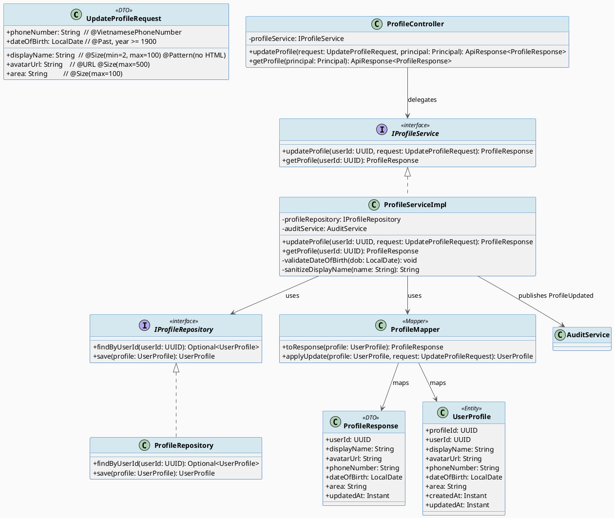
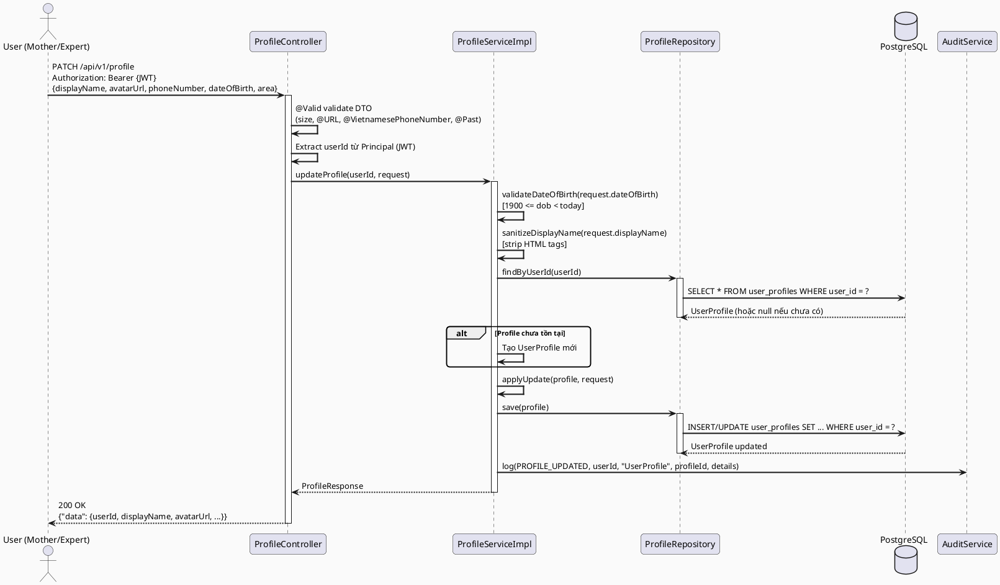
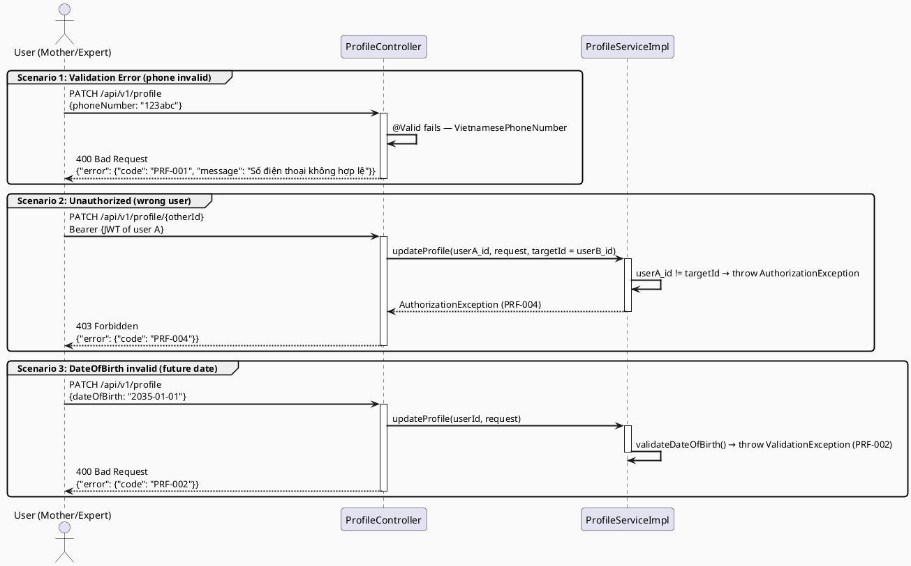
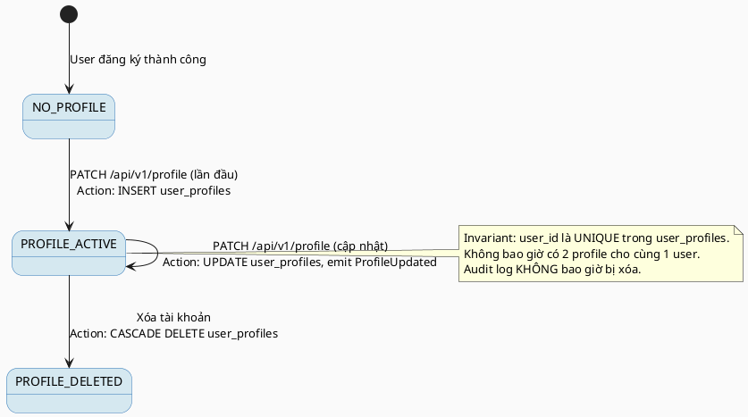

# ENGINEERING DOCUMENTATION STANDARD (EDS) v2.0
# Technical Design Specification — UC-09 Update Account Profile

| Field              | Value                             |
| ------------------ | --------------------------------- |
| **Document ID**    | `CB-PRF-IMP-001`                  |
| **Version**        | `1.0`                             |
| **Date**           | `2026-06-26`                      |
| **Status**         | `Approved`                        |
| **Document Owner** | `PhuongNT`                        |
| **Author**         | `AI Agent`                        |
| **Reviewed by**    | `[Tech Lead]`                     |
| **DPO Sign-off**   | `[ ] Pending`                     |
| **Approved by**    | `[Principal Architect]`           |
| **Last Review**    | `2026-06-26`                      |
| **Based on EDS**   | `v2.0`                            |

---

## CHANGELOG

> **Policy 4.4 — Immutable History:** Không bao giờ xóa thông tin cũ. Mọi thay đổi phải ghi vào bảng này.

| Ngày       | Người thực hiện | Nội dung thay đổi                                          |
| ---------- | --------------- | ---------------------------------------------------------- |
| 2026-06-26 | AI Agent        | Tạo tài liệu lần đầu cho UC-09 Update Account Profile     |

---

## MỤC LỤC

1. [Tổng quan Module](#1-tổng-quan-module)
2. [Ma trận Truy vết (Traceability Matrix)](#2-ma-trận-truy-vết-traceability-matrix)
3. [Architecture Decision Records (ADR)](#3-architecture-decision-records-adr)
4. [Non-Functional Requirements & SLA](#4-non-functional-requirements--sla)
5. [Static Modeling (Mô hình Tĩnh)](#5-static-modeling-mô-hình-tĩnh)
6. [Dynamic Modeling (Mô hình Động)](#6-dynamic-modeling-mô-hình-động)
7. [Domain Event Catalog](#7-domain-event-catalog)
8. [Interface Specification (Đặc tả Giao diện)](#8-interface-specification-đặc-tả-giao-diện)
9. [API Specification](#9-api-specification)
10. [Bảng mã lỗi (Error Codes)](#10-bảng-mã-lỗi-error-codes)
11. [Quy trình Triển khai (Step-by-Step)](#11-quy-trình-triển-khai-step-by-step)
12. [Rollback & Incident Runbook](#12-rollback--incident-runbook)
13. [Kịch bản Kiểm thử Chi tiết](#13-kịch-bản-kiểm-thử-chi-tiết)
14. [Phương pháp Xác minh](#14-phương-pháp-xác-minh)
15. [Mẫu thử thực tế (API Verification Samples)](#15-mẫu-thử-thực-tế-api-verification-samples)
16. [Bảng tổng hợp phân quyền (Authorization Matrix)](#16-bảng-tổng-hợp-phân-quyền-authorization-matrix)
17. [AI Prompt Constraints (CASE 2.0)](#17-ai-prompt-constraints-case-20)

---

## 1. Tổng quan Module

> UC-09 cho phép người dùng đã xác thực cập nhật thông tin hồ sơ cá nhân của chính họ, bao gồm: tên hiển thị (`displayName`), ảnh đại diện (`avatarUrl`), số điện thoại (`phoneNumber`), ngày sinh (`dateOfBirth`) và tỉnh/khu vực (`area`). Đây là tính năng ghi (write) trên dữ liệu PII nhạy cảm — toàn bộ thay đổi phải được kiểm tra RBAC (chỉ được sửa profile của chính mình), validate nghiêm ngặt và ghi vào audit log dưới dạng domain event `ProfileUpdated`. DPO sign-off bắt buộc trước khi deploy.

| Field                     | Value                                                                           |
| ------------------------- | ------------------------------------------------------------------------------- |
| **Module Name**           | `Update Account Profile`                                                        |
| **Bounded Context**       | `profile`                                                                       |
| **UC ID**                 | `UC-09`                                                                         |
| **SRS Reference**         | `3.1.1.9`                                                                       |
| **Platform**              | `Mobile App (Flutter) + Web App (React)`                                        |
| **Data Classification**   | `Sensitive-PII`                                                                 |
| **Compliance Scope**      | `PDPA (Vietnam) — Luật 91/2025 Điều 17; GDPR Art. 5.1(d), Art. 16, Art. 32`   |
| **Upstream Dependencies** | `security (JWT Auth)`, `identity (User entity)`, `audit (AuditService)`        |
| **Downstream Consumers**  | `community (display name in feed)`, `expert-profile (linked user info)`         |

---

## 2. Ma trận Truy vết (Traceability Matrix)

> Ánh xạ trực tiếp: [Mã yêu cầu] → [Thành phần Code] → [Mục tiêu Tuân thủ].

| Requirement ID | Loại          | Mô tả yêu cầu                                                              | Thành phần Code                                                           | Compliance Target             | ADR liên quan |
| -------------- | ------------- | --------------------------------------------------------------------------- | ------------------------------------------------------------------------- | ----------------------------- | ------------- |
| UC-09          | User Story    | Người dùng cập nhật hồ sơ cá nhân của chính mình                           | `ProfileController.updateProfile()`                                       | PDPA Điều 17                  | ADR-001       |
| BR-PRF-OWN     | Business Rule | Người dùng chỉ được cập nhật profile của chính mình                        | `ProfileService.updateProfile()` — kiểm tra `userId == authenticatedId`  | PDPA Điều 17; GDPR Art. 5.1   | ADR-001       |
| BR-PRF-PHONE   | Business Rule | Số điện thoại phải hợp lệ theo chuẩn Việt Nam                              | `@VietnamesePhoneNumber` annotation trên DTO                              | —                             | —             |
| BR-PRF-DOB     | Business Rule | Ngày sinh phải trong quá khứ, trong khoảng 1900–ngày hôm nay               | `ProfileServiceImpl.validateDateOfBirth()`                                | —                             | —             |
| BR-PRF-NAME    | Business Rule | Tên hiển thị 2–100 ký tự, không chứa HTML                                  | `@Size(min=2, max=100)` + `@Pattern` trên DTO                             | GDPR Art. 5.1(d)              | —             |
| BR-PRF-AVATAR  | Business Rule | avatarUrl tối đa 500 ký tự, phải là URL hợp lệ                             | `@URL @Size(max=500)` trên DTO                                            | —                             | —             |
| BR-PRF-AUDIT   | Business Rule | Mọi thay đổi profile phải được ghi vào audit log dưới dạng `ProfileUpdated`| `ProfileServiceImpl` → `AuditService.log(ProfileUpdated)`                 | GDPR Art. 5.1(e); PDPA Điều 7 | ADR-002       |
| SRS-3.1.1.9    | Functional    | Người dùng nhập displayName, avatarUrl, phoneNumber, dateOfBirth, area      | `UpdateProfileRequest` DTO                                                | —                             | —             |

---

## 3. Architecture Decision Records (ADR)

### ADR-001 — Tách package `profile` khỏi `security`

| Field        | Value                          |
| ------------ | ------------------------------ |
| **Status**   | `Accepted`                     |
| **Deciders** | `PhuongNT — Tech Lead`         |
| **Date**     | `2026-06-26`                   |
| **Supersedes** | `—`                          |

#### Bối cảnh (Context)
Hiện tại `UpdateProfileRequest` nằm trong package `security.dto.request` và chỉ có 2 field (`name`, `avatarUrl`). UC-09 yêu cầu thêm `phoneNumber`, `dateOfBirth`, `area` — đây là dữ liệu PII nhạy cảm cần lifecycle riêng, validator riêng và audit event riêng, không nên trộn với logic xác thực.

#### Các phương án đã xem xét (Options Considered)

| Phương án | Mô tả                                               | Ưu điểm                                   | Nhược điểm                                        |
| --------- | --------------------------------------------------- | ----------------------------------------- | ------------------------------------------------- |
| A         | Mở rộng `security` package, thêm field vào DTO cũ  | Ít file mới                               | Vi phạm SRP; PII logic rải rác trong `security`   |
| B         | Tạo package `profile` mới, tách hoàn toàn           | Bounded context rõ ràng; audit riêng biệt | Thêm package mới — phải tạo entity/service/repo   |

#### Quyết định (Decision)
Chọn **Phương án B**: tạo package `com.carebridge.backend.profile` với entity `UserProfile`, service `ProfileService`, repository `ProfileRepository`, controller `ProfileController`. Table `user_profiles` tham chiếu `users.user_id`. Không xóa `UpdateProfileRequest` cũ — đổi tên thành deprecated hoặc giữ nguyên cho backward compat.

#### Hệ quả (Consequences)

**Tích cực:**
- Bounded context profile độc lập — dễ audit, dễ scale.
- Validation PII tập trung tại `profile` package.

**Tiêu cực / Trade-offs:**
- Cần tạo thêm Flyway migration `V4__add_user_profiles.sql`.
- Cần mapper mới `ProfileMapper`.

**Compliance Impact:**
- PDPA / GDPR: PII profile tập trung một package giúp DPO dễ kiểm tra phạm vi xử lý dữ liệu (Art. 30 GDPR — Records of processing activities).

---

### ADR-002 — Audit ProfileUpdated bằng AuditService nội bộ

| Field        | Value                          |
| ------------ | ------------------------------ |
| **Status**   | `Accepted`                     |
| **Deciders** | `PhuongNT — Tech Lead`         |
| **Date**     | `2026-06-26`                   |

#### Bối cảnh (Context)
Thay đổi PII profile cần được ghi lại để đáp ứng GDPR Art. 5.1(e) (data accuracy accountability) và PDPA Điều 7. Có 2 lựa chọn: dùng `AuditService` nội bộ (đã có) hoặc outbox pattern với event bus.

#### Các phương án đã xem xét (Options Considered)

| Phương án | Mô tả                             | Ưu điểm                    | Nhược điểm                            |
| --------- | --------------------------------- | -------------------------- | ------------------------------------- |
| A         | `AuditService.log()` synchronous  | Đơn giản, atomic với TX    | Tightly coupled                       |
| B         | Outbox pattern / event bus        | Loosely coupled, async     | Phức tạp hơn, over-engineering        |

#### Quyết định (Decision)
Chọn **Phương án A**: gọi `AuditService.log(AuditAction.PROFILE_UPDATED, ...)` trong cùng transaction với `@Transactional`. Đơn giản, đủ dùng cho milestone M3 Alpha.

#### Hệ quả (Consequences)

**Tích cực:**
- Audit log đồng bộ với update — đảm bảo không mất event dù transaction rollback.

**Tiêu cực / Trade-offs:**
- Latency nhẹ tăng do ghi audit log trong cùng transaction.

**Compliance Impact:**
- GDPR Art. 5.1(e): audit log lưu ít nhất 7 năm theo retention policy hiện tại.

---

## 4. Non-Functional Requirements & SLA

### 4.1. Performance & Availability

| Category     | Requirement              | Target SLA | Measurement Method  | Compliance Basis |
| ------------ | ------------------------ | ---------- | ------------------- | ---------------- |
| Latency      | API response (p99)       | `< 300ms`  | k6 load test        | —                |
| Availability | Uptime (monthly)         | `99.9%`    | Uptime monitor      | —                |
| Throughput   | Concurrent write req/s   | `100 req/s`| Load test           | —                |

### 4.2. Data Integrity & Retention

| Category    | Requirement                        | Target    | Verification Method        | Compliance Basis  |
| ----------- | ---------------------------------- | --------- | -------------------------- | ----------------- |
| Durability  | Không mất record khi update        | RPO = 0   | Transaction log            | GDPR Art. 5.1(f)  |
| Retention   | Audit log ProfileUpdated           | 7 năm     | DB backup policy           | GDPR Art. 5.1(e)  |
| Consistency | Profile ↔ Audit sync trong cùng TX | 100%      | `@Transactional` rollback  | GDPR Art. 7.1     |

### 4.3. Security

| Category              | Requirement        | Target     | Verification Method    | Compliance Basis |
| --------------------- | ------------------ | ---------- | ---------------------- | ---------------- |
| Encryption at rest    | PII fields         | AES-256    | DB-level encryption    | GDPR Art. 32     |
| Encryption in transit | Tất cả endpoint    | TLS 1.3+   | SSL Labs scan          | GDPR Art. 32     |
| Access control        | Own-resource only  | Reject 403 | Auth Matrix (§16)      | GDPR Art. 25     |
| XSS Prevention        | displayName field  | Sanitize   | OWASP ZAP scan         | OWASP A03:2021   |

### 4.4. Scalability & Capacity Planning

> Dự kiến: 10,000 users active, 500 profile updates/day. Không cần scale đặc biệt ở M3 Alpha. Table `user_profiles` có 1 row/user — O(1) update. Index trên `user_id` (PRIMARY KEY và FK).

---

## 5. Static Modeling (Mô hình Tĩnh)

### 5.1. Class Diagram (PlantUML)



### 5.2. Data Structure (PostgreSQL DDL)

```sql
-- ============================================================
-- Migration: V4__add_user_profiles.sql
-- ============================================================

CREATE TABLE IF NOT EXISTS public.user_profiles (
    profile_id      UUID        NOT NULL DEFAULT gen_random_uuid(),
    user_id         UUID        NOT NULL,
    display_name    VARCHAR(100),                         -- tên hiển thị 2-100 ký tự
    avatar_url      VARCHAR(500),                         -- URL ảnh đại diện
    phone_number    VARCHAR(20),                          -- số điện thoại Việt Nam
    date_of_birth   DATE,                                 -- ngày sinh, phải trong quá khứ
    area            VARCHAR(100),                         -- tỉnh/khu vực
    created_at      TIMESTAMPTZ NOT NULL DEFAULT NOW(),
    updated_at      TIMESTAMPTZ NOT NULL DEFAULT NOW(),
    CONSTRAINT user_profiles_pkey PRIMARY KEY (profile_id),
    CONSTRAINT user_profiles_user_id_key UNIQUE (user_id),
    CONSTRAINT user_profiles_user_id_fkey
        FOREIGN KEY (user_id) REFERENCES public.users(user_id) ON DELETE CASCADE,
    CONSTRAINT chk_display_name_length
        CHECK (display_name IS NULL OR (LENGTH(display_name) >= 2 AND LENGTH(display_name) <= 100)),
    CONSTRAINT chk_date_of_birth_range
        CHECK (date_of_birth IS NULL OR (date_of_birth >= '1900-01-01' AND date_of_birth < CURRENT_DATE))
);

CREATE INDEX IF NOT EXISTS idx_user_profiles_user_id
    ON public.user_profiles (user_id);
```

---

## 6. Dynamic Modeling (Mô hình Động)

### 6.1. Sequence Diagram — Happy Path (PlantUML)



### 6.2. Sequence Diagram — Error Path (PlantUML)



### 6.3. State Machine — Profile update trạng thái



> **Invariant bất biến:**
> - `user_profiles.user_id` phải là UNIQUE — một user chỉ có một profile.
> - Audit log `ProfileUpdated` không bao giờ bị DELETE — append-only.
> - `displayName` không được chứa HTML tags — phải sanitize trước khi lưu.

---

## 7. Domain Event Catalog

### 7.1. Events Published (Phát ra)

| Event Name       | Trigger                          | Publisher             | Subscriber(s)                      | Payload Schema            | Async? |
| ---------------- | -------------------------------- | --------------------- | ---------------------------------- | ------------------------- | ------ |
| `ProfileUpdated` | Cập nhật hồ sơ thành công        | `ProfileServiceImpl`  | `AuditService`, `CommunityService` | `ProfileUpdatedEvent.java`| No     |

### 7.2. Events Consumed (Tiêu thụ)

| Event Name | Source | Handler | Action thực hiện |
| ---------- | ------ | ------- | ---------------- |
| _(Không có)_ | — | — | — |

### 7.3. Payload Schema

```java
// ProfileUpdatedEvent.java
// @version 1.0
public record ProfileUpdatedEvent(
    String eventId,          // UUID — dùng để deduplicate
    String eventType,        // "ProfileUpdated"
    Instant occurredAt,      // ISO 8601
    String version,          // "1.0"
    Payload payload,
    Metadata metadata
) {
    public record Payload(
        UUID userId,          // Chủ profile
        UUID profileId,       // ID bản ghi user_profiles
        List<String> updatedFields, // Danh sách field đã thay đổi (không chứa giá trị cũ/mới để tránh PII leak trong log)
        Instant updatedAt     // Thời điểm update
    ) {}

    public record Metadata(
        String correlationId, // Request trace ID
        UUID causedBy         // userId thực hiện — phải bằng userId trong payload
    ) {}
}
```

---

## 8. Interface Specification (Đặc tả Giao diện)

> **Policy (EDS v2.0):** Mỗi interface phải khai báo `@version`. Mọi breaking change phải tạo ADR mới.

### 8.1. Service Interface

```java
// IProfileService.java
// @version 1.0
// Package: com.carebridge.backend.profile.service

/**
 * Dịch vụ quản lý hồ sơ cá nhân của người dùng.
 * Mọi thao tác write đều yêu cầu userId == authenticatedId (own-resource enforcement).
 */
public interface IProfileService {

    /**
     * Cập nhật hồ sơ cá nhân của người dùng.
     * @param authenticatedUserId  ID người dùng từ JWT (không phải từ request body)
     * @param request              Dữ liệu cập nhật đã validated
     * @return ProfileResponse     Hồ sơ sau khi cập nhật
     * @throws ValidationException    [PRF-001] Khi dữ liệu không hợp lệ (phone, dob, name)
     * @throws AuthorizationException [PRF-004] Khi cố gắng sửa profile của người khác
     */
    ProfileResponse updateProfile(UUID authenticatedUserId, UpdateProfileRequest request);

    /**
     * Lấy hồ sơ của người dùng hiện tại.
     * @param authenticatedUserId  ID người dùng từ JWT
     * @return ProfileResponse
     * @throws ResourceNotFoundException [PRF-003] Khi profile chưa được tạo
     */
    ProfileResponse getProfile(UUID authenticatedUserId);
}
```

### 8.2. Repository Interface

```java
// IProfileRepository.java
// @version 1.0
// Package: com.carebridge.backend.profile.repository
// Extends: JpaRepository<UserProfile, UUID>

public interface IProfileRepository extends JpaRepository<UserProfile, UUID> {

    /**
     * Tìm profile theo userId. Kết quả là Optional vì user mới chưa có profile.
     */
    Optional<UserProfile> findByUserId(UUID userId);

    // Không có delete() — profile bị xóa theo CASCADE khi User bị xóa.
    // Không có update-by-query — luôn dùng save() để trigger JPA audit.
}
```

---

## 9. API Specification

### 9.1. Endpoints Table

| Method  | Path                  | Auth Level  | Required Roles                                 | Rate Limit | Idempotent? |
| ------- | --------------------- | ----------- | ---------------------------------------------- | ---------- | ----------- |
| `GET`   | `/api/v1/profile`     | JWT Bearer  | `ROLE_MOTHER`, `ROLE_EXPERT`, `ROLE_ADMIN`     | 300/min    | Yes         |
| `PATCH` | `/api/v1/profile`     | JWT Bearer  | `ROLE_MOTHER`, `ROLE_EXPERT`, `ROLE_ADMIN`     | 60/min     | Yes         |

### 9.2. Request / Response Schemas

#### `PATCH /api/v1/profile` — Cập nhật hồ sơ

**Request Headers:**
```
Authorization: Bearer {JWT_TOKEN}
Content-Type: application/json
X-Correlation-Id: {uuid}
```

**Request Body:**
```json
{
  "displayName": "Nguyễn Thị Lan",
  "avatarUrl": "https://cdn.carebridge.vn/avatars/user123.jpg",
  "phoneNumber": "0912345678",
  "dateOfBirth": "1995-06-15",
  "area": "Hà Nội"
}
```

**Validation Rules:**
- `displayName`: 2–100 ký tự; không chứa `<`, `>`, `&lt;`, `&gt;`, `<script>`; không required (partial update)
- `avatarUrl`: URL hợp lệ (http/https); max 500 ký tự; không required
- `phoneNumber`: Chuẩn Việt Nam (`@VietnamesePhoneNumber`); bắt đầu bằng 0 + 9 chữ số, hoặc +84; không required
- `dateOfBirth`: định dạng `YYYY-MM-DD`; phải `< today`; phải `>= 1900-01-01`; không required
- `area`: max 100 ký tự; không required

**Response — 200 OK (Happy Path):**
```json
{
  "data": {
    "userId": "550e8400-e29b-41d4-a716-446655440000",
    "displayName": "Nguyễn Thị Lan",
    "avatarUrl": "https://cdn.carebridge.vn/avatars/user123.jpg",
    "phoneNumber": "0912345678",
    "dateOfBirth": "1995-06-15",
    "area": "Hà Nội",
    "updatedAt": "2026-06-26T10:00:00.000Z"
  },
  "message": "Profile updated successfully",
  "timestamp": "2026-06-26T10:00:00.000Z"
}
```

**Response — 400 Bad Request (Validation Error):**
```json
{
  "error": {
    "code": "PRF-001",
    "message": "Dữ liệu không hợp lệ",
    "details": [
      { "field": "phoneNumber", "message": "Số điện thoại không đúng định dạng Việt Nam" }
    ]
  }
}
```

**Response — 403 Forbidden:**
```json
{
  "error": {
    "code": "PRF-004",
    "message": "Không có quyền chỉnh sửa profile của người khác"
  }
}
```

#### `GET /api/v1/profile` — Lấy hồ sơ hiện tại

**Response — 200 OK:**
```json
{
  "data": {
    "userId": "550e8400-e29b-41d4-a716-446655440000",
    "displayName": "Nguyễn Thị Lan",
    "avatarUrl": "https://cdn.carebridge.vn/avatars/user123.jpg",
    "phoneNumber": "0912345678",
    "dateOfBirth": "1995-06-15",
    "area": "Hà Nội",
    "updatedAt": "2026-06-26T10:00:00.000Z"
  }
}
```

---

## 10. Bảng mã lỗi (Error Codes)

> Tiền tố mã lỗi: `PRF-` cho Profile module.

| Code      | HTTP Status | Message (EN)                              | Message (VI)                                       | Trigger Condition                                             |
| --------- | ----------- | ----------------------------------------- | -------------------------------------------------- | ------------------------------------------------------------- |
| `PRF-001` | 400         | Validation failed                         | Dữ liệu không hợp lệ                              | Dữ liệu đầu vào vi phạm: phone, displayName, dob, avatarUrl  |
| `PRF-002` | 400         | Date of birth invalid                     | Ngày sinh không hợp lệ                            | dateOfBirth >= today hoặc < 1900-01-01                        |
| `PRF-003` | 404         | Profile not found                         | Không tìm thấy hồ sơ                              | GET profile khi user chưa có profile                          |
| `PRF-004` | 403         | Cannot update another user's profile      | Không có quyền chỉnh sửa profile của người khác   | userId trong JWT != target userId                             |
| `PRF-005` | 400         | Display name contains illegal characters  | Tên hiển thị chứa ký tự không hợp lệ (HTML/XSS)  | displayName chứa thẻ HTML hoặc ký tự nguy hiểm               |
| `PRF-006` | 400         | Avatar URL invalid                        | URL ảnh đại diện không hợp lệ                     | avatarUrl không phải URL http/https hợp lệ                    |
| `PRF-007` | 500         | Internal error                            | Lỗi hệ thống                                      | Lỗi DB hoặc audit service không phản hồi                     |

---

## 11. Quy trình Triển khai (Step-by-Step)

### 11.1. Prerequisites

- [ ] ADR-001 và ADR-002 đã được Accepted (xem §3)
- [ ] DPO đã sign-off (module xử lý Sensitive-PII)
- [ ] Blueprint đã được Principal Architect approve
- [ ] Môi trường staging đã sẵn sàng

### 11.2. Pre-Migration Checklist

- [ ] Đã backup DB production: `pg_dump -h [host] -U [user] carebridge > backup_20260626.sql`
- [ ] Migration `V4__add_user_profiles.sql` đã chạy thành công trên staging ≥ 24 giờ
- [ ] Rollback script `V4__rollback_user_profiles.sql` đã được test trên staging
- [ ] DPO đã sign-off vì migration thêm bảng lưu PII

### 11.3. Implementation Steps

#### Chặng 1 — Flyway Migration

```sql
-- File: src/main/resources/db/migration/V4__add_user_profiles.sql
-- (Xem DDL đầy đủ tại §5.2)
CREATE TABLE IF NOT EXISTS public.user_profiles ( ... );
CREATE INDEX IF NOT EXISTS idx_user_profiles_user_id ON public.user_profiles (user_id);
```

#### Chặng 2 — Entity và Repository

```java
// Tạo: com/carebridge/backend/profile/entity/UserProfile.java
@Entity
@Table(name = "user_profiles")
@EntityListeners(AuditingEntityListener.class)
public class UserProfile {
    @Id @GeneratedValue(strategy = GenerationType.UUID)
    private UUID profileId;

    @Column(name = "user_id", nullable = false, unique = true)
    private UUID userId;

    @Size(min = 2, max = 100)
    @Column(name = "display_name", length = 100)
    private String displayName;

    @Size(max = 500)
    @Column(name = "avatar_url", length = 500)
    private String avatarUrl;

    @Column(name = "phone_number", length = 20)
    private String phoneNumber;

    @Column(name = "date_of_birth")
    private LocalDate dateOfBirth;

    @Size(max = 100)
    @Column(name = "area", length = 100)
    private String area;

    @CreatedDate
    @Column(name = "created_at", nullable = false, updatable = false)
    private Instant createdAt;

    @LastModifiedDate
    @Column(name = "updated_at", nullable = false)
    private Instant updatedAt;
}
```

#### Chặng 3 — DTO, Mapper, Service, Controller

```java
// Tạo các file theo thứ tự:
// 1. dto/request/UpdateProfileRequest.java  (validation annotations)
// 2. dto/response/ProfileResponse.java
// 3. mapper/ProfileMapper.java             (@Mapper Mapstruct hoặc manual)
// 4. service/IProfileService.java          (xem §8.1)
// 5. service/impl/ProfileServiceImpl.java
// 6. controller/ProfileController.java
```

#### Chặng 4 — Thêm AuditAction nếu chưa có

```java
// Trong: com/carebridge/backend/audit/entity/AuditAction.java
// Thêm: PROFILE_UPDATED
```

#### Chặng 5 — Verification sau deploy

```bash
# Kiểm tra health
curl -X GET https://[host]/api/v1/health
# Expected: {"status": "ok"}

# Test PATCH profile với JWT hợp lệ
curl -X PATCH https://[host]/api/v1/profile \
  -H "Authorization: Bearer [JWT]" \
  -H "Content-Type: application/json" \
  -d '{"displayName": "Test User"}'
# Expected: 200 OK
```

### 11.4. Deployment Checklist

- [ ] Migration `V4__add_user_profiles.sql` chạy thành công (`flyway_schema_history` có record)
- [ ] Health check endpoint trả về 200
- [ ] PATCH `/api/v1/profile` với JWT hợp lệ → 200 OK
- [ ] PATCH `/api/v1/profile` với phone không hợp lệ → 400 + `PRF-001`
- [ ] PATCH `/api/v1/profile` không có JWT → 401
- [ ] Audit log có record `PROFILE_UPDATED` sau khi cập nhật thành công
- [ ] Thông báo DPO sau deploy (PII processing change)

---

## 12. Rollback & Incident Runbook

### 12.1. Điều kiện kích hoạt Rollback

| Điều kiện                            | Ngưỡng                      | Người quyết định        |
| ------------------------------------ | --------------------------- | ----------------------- |
| Error rate tăng đột biến             | > 5% trong 5 phút           | On-call Engineer        |
| Latency p99 vượt ngưỡng              | > 2x baseline (> 600ms)     | On-call Engineer        |
| Dữ liệu PII không nhất quán          | Bất kỳ case nào             | Tech Lead + DPO         |
| Audit log ngừng hoạt động            | > 1 phút                    | On-call Engineer        |
| Profile update ghi sai userId        | Bất kỳ case nào             | Tech Lead — CRITICAL    |

### 12.2. Rollback Procedure

```bash
# Bước 1: Revert Flyway migration (staging only — KHÔNG chạy trên prod nếu đã có data)
# Nếu chưa có data trong user_profiles:
DROP TABLE IF EXISTS public.user_profiles;

# Bước 2: Re-deploy phiên bản cũ
kubectl rollout undo deployment/carebridge-api

# Bước 3: Verify rollback thành công
kubectl rollout status deployment/carebridge-api
curl -X GET https://[host]/api/v1/health
# Expected: {"status": "ok"}

# Bước 4: Chạy smoke test
curl -X GET https://[host]/api/v1/profile -H "Authorization: Bearer [JWT]"
# Expected: 404 (profile endpoint removed) hoặc hoạt động bình thường với version cũ
```

### 12.3. Notification Protocol

| Thời điểm         | Người nhận     | Kênh            | Template                                             |
| ----------------- | -------------- | --------------- | ---------------------------------------------------- |
| Ngay khi phát hiện | On-call team  | Slack `#incident`| "🚨 [PRF] UC-09 incident detected: [mô tả]"         |
| Trong 30 phút     | DPO            | Email           | Bắt buộc nếu PII bị ảnh hưởng (GDPR Art. 33)        |
| Trong 72 giờ      | DPA            | Email           | Bắt buộc nếu có data breach (GDPR Art. 33)           |

### 12.4. Post-Incident Review (PIR)

> Bắt buộc hoàn thành PIR document trong vòng **48 giờ** sau khi incident được resolve.

**PIR Template:**
- **Timeline:** Diễn biến từng bước theo thứ tự thời gian
- **Root Cause:** Nguyên nhân gốc rễ (5 Whys)
- **Impact:** Số users ảnh hưởng, thời gian downtime, PII exposure?
- **Remediation:** Các bước đã thực hiện để khắc phục
- **Prevention:** Action items để tránh tái diễn

---

## 13. Kịch bản Kiểm thử Chi tiết

> **Policy (EDS v2.0 — Test Data):** Mọi test dùng dữ liệu `SYNTHETIC`. Tuyệt đối không dùng PII thật.

### 13.1. Unit Tests

#### TC-UNIT-001 — Cập nhật profile hợp lệ (Happy Path)

```gherkin
Feature: Update Account Profile
  Background:
    Given test data classification: SYNTHETIC
    And user có userId = "user-test-001" đã xác thực với JWT hợp lệ
    And user_profiles không có record cho "user-test-001"

  Scenario: Cập nhật profile lần đầu thành công
    Given request body hợp lệ: displayName="Nguyễn Test", phoneNumber="0912345678", dateOfBirth="1995-06-15", area="Hà Nội"
    When ProfileServiceImpl.updateProfile("user-test-001", request) được gọi
    Then UserProfile mới được tạo trong DB với userId="user-test-001"
    And response.displayName = "Nguyễn Test"
    And AuditService.log(PROFILE_UPDATED, ...) được gọi đúng 1 lần
```

**Hàm được test:** `ProfileServiceImpl.updateProfile()`
**Invariant kiểm tra:** User chỉ có đúng 1 profile; audit được gọi mỗi lần update.

#### TC-UNIT-002 — Validate phone không hợp lệ

```gherkin
  Scenario: Phone number không đúng chuẩn Việt Nam
    Given request body có phoneNumber = "123abc"
    When PATCH /api/v1/profile được gọi
    Then response status là 400
    And response.error.code = "PRF-001"
    And response.error.details[0].field = "phoneNumber"
    And không có record mới trong user_profiles
```

#### TC-UNIT-003 — DateOfBirth trong tương lai

```gherkin
  Scenario: dateOfBirth là ngày tương lai
    Given request body có dateOfBirth = "2035-01-01"
    When ProfileServiceImpl.updateProfile() được gọi
    Then ValidationException được ném với code "PRF-002"
    And không có record mới trong user_profiles
```

### 13.2. Integration Tests

#### TC-INT-001 — Service + Repository phối hợp đúng

```gherkin
  Scenario: Service gọi đúng repository và lưu đúng data
    Given test data classification: SYNTHETIC
    And database đang chạy với user "user-int-001" đã tồn tại trong users table
    When ProfileServiceImpl.updateProfile("user-int-001", validRequest) được gọi
    Then profileRepository.save() được gọi đúng 1 lần
    And database chứa record với user_id="user-int-001" và display_name="Nguyễn Test"
    And audit_logs chứa record với action="PROFILE_UPDATED" và user_id="user-int-001"
```

### 13.3. E2E / Security Tests

#### TC-E2E-001 — Luồng hoàn chỉnh qua API

```gherkin
  Scenario: PATCH /api/v1/profile thành công
    Given test data classification: SYNTHETIC
    And user "mother-001" đã đăng nhập, có JWT hợp lệ với role ROLE_MOTHER
    When PATCH /api/v1/profile được gọi với:
      | Header          | Value              |
      | Authorization   | Bearer {token}     |
      | Content-Type    | application/json   |
      | X-Correlation-Id| {uuid}             |
      | Body            | {displayName: "Nguyễn Test", phoneNumber: "0912345678"} |
    Then response status là 200
    And response.data.displayName = "Nguyễn Test"
    And database user_profiles chứa record mới

  Scenario: Không có JWT → 401
    When PATCH /api/v1/profile được gọi không có Authorization header
    Then response status là 401

  Scenario: XSS trong displayName
    Given request body có displayName = "<script>alert(1)</script>"
    When PATCH /api/v1/profile được gọi
    Then response status là 400
    And response.error.code = "PRF-005"
    And không có script tag nào được lưu vào DB
```

---

## 14. Phương pháp Xác minh

### 14.1. Database Inspection

```sql
-- Verify profile được tạo/cập nhật đúng
SELECT profile_id, user_id, display_name, phone_number, date_of_birth, area, updated_at
FROM user_profiles
WHERE user_id = '{userId}';

-- Verify audit log có record PROFILE_UPDATED
SELECT id, action, user_id, entity_type, entity_id, description, created_at
FROM audit_logs
WHERE user_id = '{userId}' AND action = 'PROFILE_UPDATED'
ORDER BY created_at DESC
LIMIT 5;

-- Verify không có HTML trong display_name
SELECT display_name FROM user_profiles
WHERE display_name ~ '<[^>]+>';
-- Expected: 0 rows
```

### 14.2. Log / Audit Verification

```bash
# Kiểm tra audit log format sau khi cập nhật profile
kubectl logs -l app=carebridge-api | grep "PROFILE_UPDATED" | tail -10

# Verify không có PII (phone, dob) trong application logs
kubectl logs -l app=carebridge-api | grep -i "phoneNumber\|dateOfBirth\|phone_number"
# Expected: No plaintext PII
```

### 14.3. Tool-based Verification

```bash
# Verify JWT claims sau khi login
echo "[JWT_TOKEN]" | cut -d'.' -f2 | base64 -d | python3 -m json.tool

# Verify TLS 1.3
openssl s_client -connect [host]:443 -tls1_3 2>&1 | grep "Protocol"
# Expected: Protocol: TLSv1.3

# OWASP ZAP passive scan cho XSS
zap-cli quick-scan --self-contained --start-options '-config api.disablekey=true' \
  https://[host]/api/v1/profile
```

---

## 15. Mẫu thử thực tế (API Verification Samples)

### 15.1. Happy Path

```bash
# Lấy JWT (login trước)
TOKEN=$(curl -s -X POST https://[host]/api/v1/auth/login \
  -H "Content-Type: application/json" \
  -d '{"email":"test@example.com","password":"TestPass123!"}' | jq -r '.data.accessToken')

# PATCH profile
curl -X PATCH https://[host]/api/v1/profile \
  -H "Authorization: Bearer $TOKEN" \
  -H "Content-Type: application/json" \
  -H "X-Correlation-Id: $(uuidgen)" \
  -d '{
    "displayName": "Nguyễn Thị Test",
    "phoneNumber": "0912345678",
    "dateOfBirth": "1995-06-15",
    "area": "Hà Nội"
  }'
```

**Expected Response (200):**
```json
{
  "data": {
    "userId": "550e8400-...",
    "displayName": "Nguyễn Thị Test",
    "phoneNumber": "0912345678",
    "dateOfBirth": "1995-06-15",
    "area": "Hà Nội",
    "updatedAt": "2026-06-26T10:00:00.000Z"
  }
}
```

### 15.2. Error Paths

```bash
# Phone không hợp lệ → 400
curl -X PATCH https://[host]/api/v1/profile \
  -H "Authorization: Bearer $TOKEN" \
  -H "Content-Type: application/json" \
  -d '{"phoneNumber": "123abc"}'
```

**Expected Response (400):**
```json
{
  "error": {
    "code": "PRF-001",
    "message": "Dữ liệu không hợp lệ",
    "details": [{ "field": "phoneNumber", "message": "Số điện thoại không đúng định dạng Việt Nam" }]
  }
}
```

```bash
# Không có JWT → 401
curl -X PATCH https://[host]/api/v1/profile \
  -H "Content-Type: application/json" \
  -d '{"displayName": "Test"}'
```

**Expected Response (401):**
```json
{
  "error": { "code": "IAM-001", "message": "Authentication required" }
}
```

---

## 16. Bảng tổng hợp phân quyền (Authorization Matrix)

> Nguyên tắc **Least Privilege**: mỗi role chỉ được thao tác với profile của chính mình.

| Endpoint                  | `GUEST` | `ROLE_MOTHER` | `ROLE_EXPERT` | `ROLE_ADMIN` | `ROLE_SYSTEM` |
| ------------------------- | ------- | ------------- | ------------- | ------------ | ------------- |
| `GET /api/v1/profile`     | ❌      | ✅ Own        | ✅ Own        | ✅ Any       | ✅ Any        |
| `PATCH /api/v1/profile`   | ❌      | ✅ Own        | ✅ Own        | ✅ Any       | ✅ Any        |
| `GET /api/v1/audit`       | ❌      | ❌            | ❌            | ✅           | ✅            |

**Chú thích:**
- ✅ = Được phép
- ❌ = Bị từ chối (403 Forbidden)
- `Own` = Chỉ được thao tác với profile của chính mình (userId từ JWT == profileOwner)
- `Any` = ADMIN/SYSTEM có thể xem profile bất kỳ (nhưng không PATCH thay người dùng)

---

## 17. AI Prompt Constraints (CASE 2.0)

### 17.1 Constraint Summary Table

| # | Constraint | Source (ADR/BR) | Last Verified |
| - | ---------- | --------------- | ------------- |
| C1 | `userId` phải lấy từ JWT Principal, KHÔNG được lấy từ request body hoặc path param | `BR-PRF-OWN` | `2026-06-26` |
| C2 | `displayName` phải được sanitize HTML (strip tags) trước khi lưu vào DB — không lưu raw input | `BR-PRF-NAME` | `2026-06-26` |
| C3 | `phoneNumber` phải qua `@VietnamesePhoneNumber` validator — không tự bịa regex | `BR-PRF-PHONE` | `2026-06-26` |
| C4 | `dateOfBirth` phải validate: `>= 1900-01-01` VÀ `< today` — hai điều kiện cùng lúc | `BR-PRF-DOB` | `2026-06-26` |
| C5 | `AuditService.log(PROFILE_UPDATED, ...)` phải được gọi trong cùng `@Transactional` với save — không async | `ADR-002` | `2026-06-26` |
| C6 | Controller chỉ chứa validation và request/response mapping — KHÔNG có business logic | `CLAUDE.md §Architecture` | `2026-06-26` |
| C7 | Không expose `UserProfile` entity trực tiếp trong API response — dùng `ProfileResponse` DTO + mapper | `CLAUDE.md §Architecture` | `2026-06-26` |

### 17.2 Constraint Injection Block (Copy-Paste vào AI Prompt)

```
[CONSTRAINT BLOCK — Module: Profile — UC-09 Update Account Profile]
Theo TDS CB-PRF-IMP-001 và các ADR liên quan:

1. (C1) userId PHẢI lấy từ JWT Principal trong SecurityContext. KHÔNG nhận userId từ request body hay path param.
2. (C2) displayName PHẢI được strip HTML tags (loại bỏ <...>) trước khi persist vào DB.
3. (C3) phoneNumber PHẢI validate bằng @VietnamesePhoneNumber annotation đã có trong codebase tại com.carebridge.backend.common.validation.
4. (C4) dateOfBirth PHẢI thỏa mãn: >= 1900-01-01 VÀ < ngày hôm nay (LocalDate.now()). Nếu vi phạm → throw ValidationException với code PRF-002.
5. (C5) AuditService.log(AuditAction.PROFILE_UPDATED, ...) PHẢI được gọi trong cùng @Transactional block với save(). Không tách ra async.
6. (C6) Controller layer: chỉ @Valid DTO, extract principal, delegate sang IProfileService. Không có if/else business logic.
7. (C7) API response PHẢI dùng ProfileResponse DTO. Không return UserProfile entity trực tiếp.

[CONTEXT BLOCK]
- Bounded Context: profile
- Data Classification: Sensitive-PII
- Compliance: PDPA Luật 91/2025; GDPR Art. 5.1, 16, 32
- Existing interfaces: §8 Service Interface + §8.2 Repository Interface
- Error codes: §10 Error Codes Table (prefix PRF-)
- Auth matrix: §16 Authorization Matrix

[TASK BLOCK]
Implement UC-09 Update Account Profile thỏa mãn constraints C1–C7.
Output phải tuân thủ §8 Interface Specification.
Tests phải cover §13 Test Scenarios.
```

### 17.3 Constraint Quality Checklist

- [x] Mỗi constraint traceable về ADR hoặc BR cụ thể
- [x] Không có constraint generic
- [x] Mỗi constraint có `Last Verified` date ≤ 2 sprints
- [x] Constraint block có ≥ 3 constraints cụ thể (có 7)
- [x] Constraint block reference §8 Interface
- [x] Constraint block reference §16 Auth Matrix

### 17.4 Anti-Pattern Detection (cho AI-Generated Code từ Block này)

| AP-ID     | Anti-Pattern           | Dấu hiệu                                               | Hành động                                |
| --------- | ---------------------- | ------------------------------------------------------ | ---------------------------------------- |
| AP-AI-001 | Unconstrained Gen      | Code không match constraint C1-C7 nào                  | Reject — inject lại constraints          |
| AP-AI-003 | Implicit Decision      | Code assume architecture không có trong §3 ADR         | Reject — viết ADR trước                  |
| AP-AI-005 | Hallucinated Contract  | Code import service/type không có trong §8             | Reject — verify contract existence       |

---

## PHỤ LỤC

### A. Glossary

| Thuật ngữ           | Định nghĩa                                                                         |
| ------------------- | ---------------------------------------------------------------------------------- |
| Sensitive-PII       | Thông tin cá nhân nhạy cảm: ngày sinh, số điện thoại, địa chỉ                    |
| Own-resource        | Policy chỉ cho phép người dùng thao tác với tài nguyên của chính mình             |
| XSS                 | Cross-Site Scripting — tấn công inject script vào input                            |
| Append-only         | Audit log chỉ INSERT, không UPDATE/DELETE                                          |
| DPO                 | Data Protection Officer                                                             |
| ProfileUpdated      | Domain event phát ra sau khi profile được cập nhật thành công                      |

### B. Tài liệu tham chiếu

| Document | Link / Path |
| -------- | ----------- |
| GDPR Art. 5, 16, 32 | https://gdpr-info.eu/art-5-gdpr/ |
| PDPA Vietnam Luật 91/2025 | — |
| VietnamesePhoneNumber validator | `05_Development/CareBridgeAPI/src/main/java/com/carebridge/backend/common/validation/VietnamesePhoneNumber.java` |
| V1 Init Schema | `05_Development/CareBridgeAPI/src/main/resources/db/migration/V1__init_schema.sql` |
| CASE 2.0 Methodology | `08_References/Template/PHASE-3_TDS.md` |
