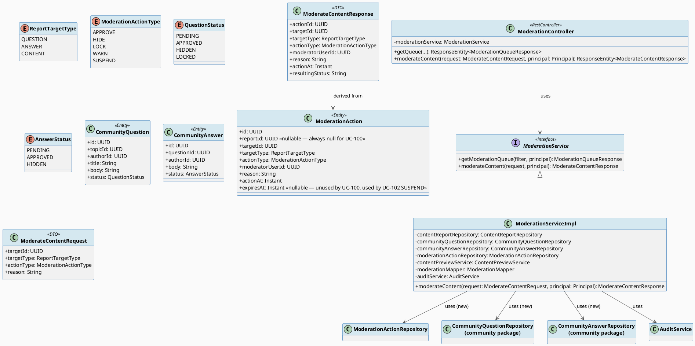
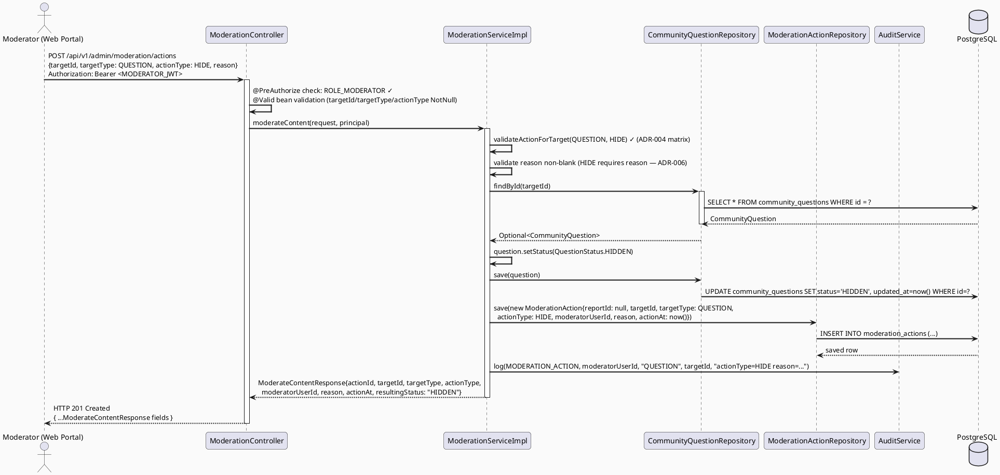
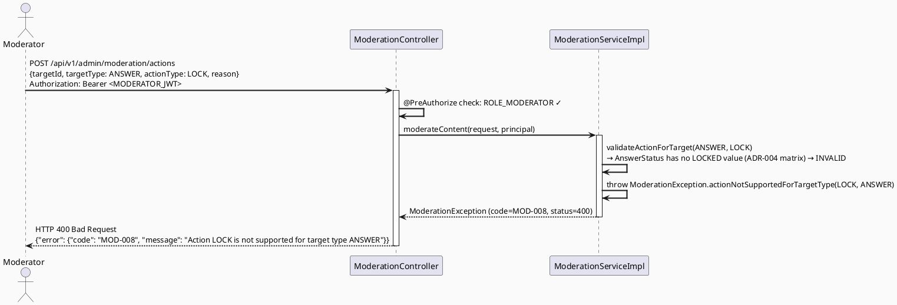
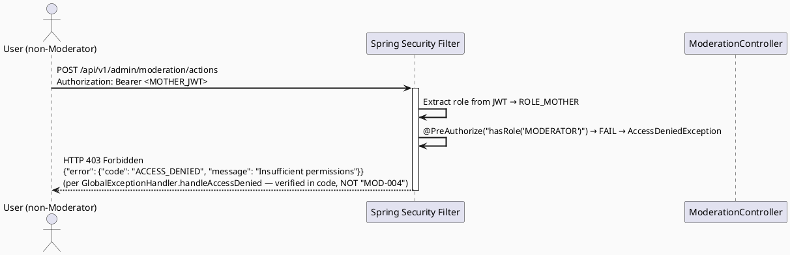

# ENGINEERING DOCUMENTATION STANDARD (EDS) v2.0
# Technical Design Specification — UC-100: Moderate Community Content

| Field              | Value                                   |
| ------------------ | ---------------------------------------- |
| **Document ID**    | `CB-MOD-IMP-002`                        |
| **Version**        | `1.0`                                   |
| **Date**           | `2026-07-01`                            |
| **Status**         | `Draft`                                 |
| **Document Owner** | `HuyND`                                 |
| **Author**         | `AI Agent — Winston (System Architect)` |
| **Reviewed by**    | `[ ] Pending`                           |
| **DPO Sign-off**   | `[ ] Pending` *(N/A — Internal moderation data, not PII export)* |
| **Approved by**    | `[ ] Pending`                           |
| **Last Review**    | `2026-07-01`                            |
| **Based on EDS**   | `v2.0`                                  |

---

## CHANGELOG

| Ngày       | Người thực hiện    | Nội dung thay đổi                                                                   |
| ---------- | ------------------- | ------------------------------------------------------------------------------------ |
| 2026-07-01 | AI Agent — Winston  | Tạo tài liệu lần đầu — TDS cho UC-100 Moderate Community Content (Status=Draft)      |

---

## MỤC LỤC

1. [Tổng quan Module](#1-tổng-quan-module)
2. [Ma trận Truy vết](#2-ma-trận-truy-vết)
3. [Architecture Decision Records (ADR)](#3-architecture-decision-records-adr)
4. [Non-Functional Requirements & SLA](#4-non-functional-requirements--sla)
5. [Static Modeling](#5-static-modeling)
6. [Dynamic Modeling](#6-dynamic-modeling)
7. [Domain Event Catalog](#7-domain-event-catalog)
8. [Interface Specification](#8-interface-specification)
9. [API Specification](#9-api-specification)
10. [Bảng mã lỗi](#10-bảng-mã-lỗi)
11. [Quy trình Triển khai](#11-quy-trình-triển-khai)
12. [Rollback & Incident Runbook](#12-rollback--incident-runbook)
13. [Kịch bản Kiểm thử Chi tiết](#13-kịch-bản-kiểm-thử-chi-tiết)
14. [Phương pháp Xác minh](#14-phương-pháp-xác-minh)
15. [API Verification Samples](#15-api-verification-samples)
16. [Authorization Matrix](#16-authorization-matrix)
17. [AI Prompt Constraints (CASE 2.0)](#17-ai-prompt-constraints-case-20)

---

## 1. Tổng quan Module

| Field                     | Value                                                                                                                                  |
| ------------------------- | --------------------------------------------------------------------------------------------------------------------------------------- |
| **UC ID**                 | `UC-100`                                                                                                                               |
| **FS Reference**          | `3.2.2.2 Moderate Community Content` (Table 68, `02_Requirements/SRS/3_Functional_Specification.md`)                                  |
| **Module Name**           | `Moderate Community Content`                                                                                                           |
| **Bounded Context**       | `content` (existing package — moderation lives inside `com.carebridge.backend.content`, not a new top-level package)                  |
| **Primary Actor**         | `Community Moderator (ROLE_MODERATOR)`                                                                                                 |
| **Platform**              | `Admin Web Portal`                                                                                                                     |
| **Priority**              | `High` (per FS Table 68)                                                                                                               |
| **Frequency of Use**      | `Regular` (per FS Table 68)                                                                                                            |
| **Data Classification**   | `Internal`                                                                                                                              |
| **Compliance Scope**      | `N/A` (no PII exported; moderation decisions are operational audit data)                                                               |
| **Upstream Dependencies** | `security (JWT auth)`, `community (CommunityQuestion, CommunityAnswer)`, `content (ModerationAction)`, `audit (AuditService)`          |
| **Downstream Consumers**  | `UC-99 View Moderation Queue` (queue items reflect post-action status indirectly via `community_questions`/`community_answers`), `UC-101 Resolve Report` (reuses the action-recording pattern established here), `UC-102 Warn or Suspend Account` (separate target type — accounts, not content) |

**Mô tả:**
UC-100 cho phép Community Moderator hành động trực tiếp trên một câu hỏi (`CommunityQuestion`) hoặc câu trả lời (`CommunityAnswer`) — APPROVE / HIDE / LOCK — **độc lập với việc có `ContentReport` hay không** (proactive moderation). Mỗi hành động: (1) ghi một dòng `ModerationAction` mới (audit trail bất biến — append-only), và (2) cập nhật đồng bộ trường `status` trên chính entity mục tiêu (`CommunityQuestion.status` hoặc `CommunityAnswer.status`) để phản ánh kết quả ngay lập tức trên các luồng đọc công khai (`CommunityFeedServiceImpl`, `CommunityQuestionServiceImpl`...).

UC-100 **không** sửa `ContentReport.status` — đó là phạm vi của UC-101 Resolve Report (report-centric orchestration). `ModerationAction.reportId` luôn là `null` cho mọi action được tạo qua UC-100, để phân biệt rõ với hành động xuất phát từ việc xử lý một report cụ thể (UC-101).

**Phạm vi rõ ràng (xem ADR-004 — Scope Boundary): UC-100 v1 chỉ hỗ trợ `targetType ∈ {QUESTION, ANSWER}`.** `ReportTargetType.CONTENT` (tức `ContentItem`, thuộc sở hữu của `CONTENT_ADMIN` qua `AdminContentController`) bị từ chối ở endpoint này — xem ADR-004 để biết lý do và phương án thay thế.

---

## 2. Ma trận Truy vết

| Requirement ID | Loại          | Mô tả yêu cầu                                                                                  | Thành phần Code                                  | Compliance Target | ADR liên quan |
| --------------- | -------------- | ------------------------------------------------------------------------------------------------ | -------------------------------------------------- | ------------------- | --------------- |
| UC-100          | Use Case      | Moderator approves/hides/locks a question or answer                                              | `ModerationController.moderateContent()`           | —                  | ADR-001         |
| FS-3.2.2.2      | Functional    | "Approves, hides, locks comments, or requests edits for community content"                       | See note below — "requests edits" out of scope     | —                  | ADR-005         |
| BR-RBAC-001     | Business Rule | Chỉ MODERATOR mới được gọi endpoint moderate-content                                              | `@PreAuthorize("hasRole('MODERATOR')")`            | —                  | ADR-002         |
| BR-MOD-004      | Business Rule | Mọi action ghi 1 dòng `ModerationAction` append-only, `reportId = null`                          | `ModerationServiceImpl.moderateContent()`          | —                  | ADR-001         |
| BR-MOD-005      | Business Rule | Action phải đồng bộ cập nhật `status` trên entity mục tiêu trong cùng transaction                | `ModerationServiceImpl.moderateContent()`          | —                  | ADR-001         |
| BR-MOD-006      | Business Rule | Action–TargetType compatibility matrix (xem §6.4)                                                | `ModerationServiceImpl.validateActionForTarget()`  | —                  | ADR-004         |
| BR-MOD-007      | Business Rule | `reason` bắt buộc (non-blank) cho HIDE/LOCK, tùy chọn cho APPROVE                                 | `ModerationServiceImpl.moderateContent()`          | —                  | ADR-006         |
| BR-MOD-008      | Business Rule | Chỉ chấp nhận `actionType ∈ {APPROVE, HIDE, LOCK}` ở endpoint này — WARN/SUSPEND thuộc UC-102      | `ModerationServiceImpl.moderateContent()`          | —                  | ADR-004         |
| BR-AUDIT-001    | Business Rule | Mọi action thành công phải được audit log                                                         | `AuditService.log(MODERATION_ACTION, ...)`         | —                  | ADR-003         |

> **Note (FS-3.2.2.2 "requests edits"):** the FS description literally lists "requests edits" as a possible outcome. There is no `ModerationActionType` value or status representing "request edit" anywhere in the schema (`ModerationActionType` = APPROVE/HIDE/LOCK/WARN/SUSPEND only; `QuestionStatus`/`AnswerStatus` have no "EDIT_REQUESTED" state). This is recorded as **`Open`** — out of scope for UC-100 v1 — rather than inventing a new status/enum value not grounded in any source. A human reviewer should decide whether "request edit" needs a future enum extension or is covered informally via a HIDE + moderator comment/notification (not modeled here).

---

## 3. Architecture Decision Records (ADR)

### ADR-001 — Synchronous Target-Entity Status Mutation + Append-Only Action Log

| Field          | Value                      |
| -------------- | --------------------------- |
| **Status**     | `Accepted`                 |
| **Deciders**   | `HuyND — System Architect` |
| **Date**       | `2026-07-01`                |
| **Supersedes** | —                           |

#### Bối cảnh
Dossier ban đầu mô tả UC-100 chỉ là "insert một dòng `ModerationAction`". Tuy nhiên việc đọc trực tiếp `CommunityQuestion.java` / `QuestionStatus.java` / `CommunityAnswer.java` / `AnswerStatus.java` cho thấy hai entity mục tiêu **đã có sẵn trường `status`** mirror chính xác các giá trị action (`QuestionStatus`: PENDING/APPROVED/HIDDEN/LOCKED; `AnswerStatus`: PENDING/APPROVED/HIDDEN). Các luồng đọc công khai hiện tại (`CommunityFeedServiceImpl`, `CommunityAnswerServiceImpl`, `CommunityQuestionServiceImpl.editQuestion()` dòng 87) đã filter/gate dựa trên các giá trị `status` này. Nếu UC-100 chỉ ghi `ModerationAction` mà không cập nhật `status` trên entity gốc, hành động "Hide" của moderator sẽ **không có hiệu lực thực tế** — nội dung vẫn hiển thị công khai.

#### Các phương án đã xem xét

| Phương án | Mô tả                                                                                          | Ưu điểm                                              | Nhược điểm                                            |
| --------- | -------------------------------------------------------------------------------------------------- | ------------------------------------------------------- | ---------------------------------------------------------- |
| A         | Chỉ ghi `ModerationAction` (audit log), không đổi `status` entity gốc                              | Đơn giản, đúng với mô tả ban đầu trong dossier           | Hành động không có hiệu lực — bug nghiêm trọng, không đạt mục đích UC |
| B         | Ghi `ModerationAction` **và** cập nhật `status` entity gốc trong cùng 1 transaction                | Hành động có hiệu lực thật; nhất quán với cách `editQuestion()` đã dùng `status` để gate quyền sửa | Cần load + save thêm 1 entity; cần transaction boundary rõ ràng |

#### Quyết định
Chọn **Phương án B**. `ModerationServiceImpl.moderateContent()` chạy trong `@Transactional`: (1) load entity mục tiêu theo `targetId` + `targetType`, (2) validate action hợp lệ cho targetType (ADR-004), (3) cập nhật `status` entity, `save()`, (4) insert `ModerationAction` với `reportId = null`, (5) `AuditService.log(MODERATION_ACTION, ...)`. Nếu bất kỳ bước nào throw, toàn bộ transaction rollback (không có action "mồ côi" không khớp trạng thái entity).

#### Hệ quả

**Tích cực:**
- Hành động moderation có hiệu lực thực tế ngay lập tức trên dữ liệu công khai.
- `ModerationAction` vẫn là append-only audit trail đầy đủ (không update/delete record cũ).

**Tiêu cực / Trade-offs:**
- Service phải biết cách map `targetType` → repository tương ứng (`CommunityQuestionRepository` / `CommunityAnswerRepository`) — tăng số dependency của `ModerationServiceImpl` so với UC-99 (chỉ cần `ContentReportRepository`).
- Không có cơ chế optimistic locking rõ ràng cho race condition 2 moderator action cùng lúc trên 1 target — ghi nhận là `Open` (xem §4.1 NFR Concurrency).

**Compliance Impact:** N/A.

---

### ADR-002 — RBAC Enforcement tại Controller Layer

| Field        | Value                      |
| ------------ | --------------------------- |
| **Status**   | `Accepted`                 |
| **Deciders** | `HuyND — System Architect` |
| **Date**     | `2026-07-01`                |

#### Bối cảnh
Cùng pattern với UC-99 (`CB-MOD-IMP-001` ADR-002): endpoint nhạy cảm, chỉ MODERATOR được phép thay đổi trạng thái nội dung community.

#### Quyết định
Dùng `@PreAuthorize("hasRole('MODERATOR')")` trên method mới `moderateContent()` của `ModerationController` (cùng class với `getQueue()`, không tạo controller mới). Đồng thời thêm rule tương ứng vào `SecurityConfig.securityFilterChain()`:
```java
.requestMatchers(HttpMethod.POST, "/api/v1/admin/moderation/actions").hasRole("MODERATOR")
```
(theo đúng pattern hiện có cho `GET /api/v1/admin/moderation/queue` — defense-in-depth giữa URL-level rule và method-level `@PreAuthorize`).

#### Hệ quả
**Tích cực:** Nhất quán với UC-99, centralized, dễ audit.
**Tiêu cực:** Controller method không được chứa business logic — chỉ validate + delegate sang Service.

---

### ADR-003 — Audit Logging dùng `AuditAction.MODERATION_ACTION` đã tồn tại

| Field        | Value                      |
| ------------ | --------------------------- |
| **Status**   | `Accepted`                 |
| **Deciders** | `HuyND — System Architect` |
| **Date**     | `2026-07-01`                |

#### Bối cảnh
`AuditAction.java` đã có sẵn giá trị `MODERATION_ACTION` (chưa được dùng ở đâu trong code hiện tại — chỉ `MODERATION_QUEUE_VIEWED` đang được dùng bởi UC-99). Không cần thêm enum value mới.

#### Quyết định
`ModerationServiceImpl.moderateContent()` gọi `auditService.log(AuditAction.MODERATION_ACTION, moderatorUserId, targetType.name(), targetId.toString(), details)` sau khi transaction thành công, với `details` chứa `actionType` + `reason` (truncated nếu cần). Dùng overload `log(AuditAction, UUID, String, String, Object)` đã tồn tại trong `AuditService` interface — không cần thêm overload mới.

#### Hệ quả
**Tích cực:** Tái sử dụng contract đã có, không cần migration cho `audit_logs`/enum.
**Tiêu cực:** Không có.

---

### ADR-004 — Scope Boundary: `targetType` Compatibility Matrix (QUESTION/ANSWER only, CONTENT excluded)

| Field          | Value                      |
| -------------- | --------------------------- |
| **Status**     | `Accepted`                 |
| **Deciders**   | `HuyND — System Architect` |
| **Date**       | `2026-07-01`                |
| **Supersedes** | —                           |

#### Bối cảnh
`ReportTargetType` có 3 giá trị: `QUESTION`, `ANSWER`, `CONTENT`. `ModerationActionType` có 5 giá trị, UC-100 chỉ dùng `APPROVE`/`HIDE`/`LOCK` (WARN/SUSPEND thuộc UC-102, target khác — account, không phải content). Khi map action ↔ status thực tế trên từng entity:

| targetType | Entity         | Status enum thực tế (đọc trực tiếp từ code) | Có HIDDEN? | Có LOCKED? |
| ---------- | -------------- | ---------------------------------------------- | ----------- | ----------- |
| QUESTION   | `CommunityQuestion` | `QuestionStatus`: PENDING, APPROVED, HIDDEN, LOCKED | ✅ | ✅ |
| ANSWER     | `CommunityAnswer`   | `AnswerStatus`: PENDING, APPROVED, HIDDEN          | ✅ | ❌ (không có `LOCKED`) |
| CONTENT    | `ContentItem`       | `ContentStatus`: DRAFT, APPROVED, ARCHIVED         | ❌ (không có `HIDDEN`) | ❌ (không có `LOCKED`) |

Ngoài ra, `ContentItem` (`targetType=CONTENT`) thuộc sở hữu nghiệp vụ của `CONTENT_ADMIN` — `AdminContentController` (`@PreAuthorize("hasRole('CONTENT_ADMIN')")`) là nơi duy nhất hiện ghi (`POST`) vào bảng `content_items`. Cho MODERATOR ghi trực tiếp vào `ContentItem.status` (kể cả chỉ APPROVE) sẽ vượt qua ranh giới bounded-context/role mà CLAUDE.md package-by-domain ngụ ý (Policy layer cho moderation rules khác với Content Admin's publishing workflow), và còn chồng lấn với phạm vi tương lai của UC-106/UC-108 (Update Content, Approve Content Version — đã được dossier xác định là chưa xây dựng, có khoảng trống thiết kế riêng về `PENDING_REVIEW` state).

#### Các phương án đã xem xét

| Phương án | Mô tả                                                                                                       | Ưu điểm                                                                          | Nhược điểm                                                                                  |
| --------- | ----------------------------------------------------------------------------------------------------------- | ----------------------------------------------------------------------------------- | ------------------------------------------------------------------------------------------------ |
| A         | UC-100 chỉ hỗ trợ `targetType ∈ {QUESTION, ANSWER}`. `CONTENT` bị từ chối ở mọi `actionType` (lỗi `MOD-008`). | Tôn trọng ranh giới role MODERATOR vs CONTENT_ADMIN; không cần schema mới; nhỏ gọn, đúng phạm vi "Moderate **Community** Content" | Report có `targetType=CONTENT` trong UC-99 queue (nếu có) không thể xử lý qua UC-100 — phải chờ UC-101 (dismiss) hoặc luồng Content Admin riêng |
| B         | UC-100 hỗ trợ `CONTENT` nhưng chỉ cho `APPROVE` (map vào `ContentStatus.APPROVED` đã tồn tại); HIDE/LOCK vẫn bị từ chối | Cho phép xử lý nhanh report trên CONTENT mà không cần CONTENT_ADMIN can thiệp     | Moderator (không phải CONTENT_ADMIN) có quyền "publish" nội dung biên tập — vượt ranh giới role; không nhất quán với việc `AdminContentController` là nơi duy nhất ghi `ContentItem` |
| C         | Mở rộng `ContentStatus` thêm `HIDDEN`/`LOCKED` qua migration mới để đối xứng với QUESTION/ANSWER             | Đối xứng hoàn toàn 3 targetType                                                   | Vượt phạm vi nhỏ nhất cần thiết (CLAUDE.md "smallest scoped change"); không có yêu cầu rõ ràng nào đòi hỏi `ContentItem` cần trạng thái HIDDEN/LOCKED ở UC-100 — nên loại trừ |

#### Quyết định
Chọn **Phương án A**. UC-100 v1 giới hạn `targetType ∈ {QUESTION, ANSWER}`. Request với `targetType=CONTENT` bị từ chối với `ModerationException` code `MOD-008` (`HTTP 400`). Đây là quyết định **nổi bật, cần con người review** — đánh dấu rõ trong §16 và §10.

#### Hệ quả

**Tích cực:**
- Không cần migration.
- Tôn trọng ranh giới `MODERATOR` vs `CONTENT_ADMIN` đã có trong code hiện tại.
- Phù hợp tên gọi FS "**Community** Content" (community_questions/community_answers).

**Tiêu cực / Trade-offs:**
- Report `targetType=CONTENT` trong UC-99 queue chưa có hành động trực tiếp tương ứng trong UC-100 — cần UC-101 (dismiss, không đổi `ContentItem`) hoặc một UC riêng cho Content Admin xử lý report trên `ContentItem`. Ghi nhận là **`Open`** — cần Tech Lead xác nhận hướng xử lý report CONTENT.

**Compliance Impact:** N/A.

---

### ADR-005 — "Request Edit" Outcome Excluded from v1

| Field        | Value                      |
| ------------ | --------------------------- |
| **Status**   | `Accepted`                 |
| **Deciders** | `HuyND — System Architect` |
| **Date**     | `2026-07-01`                |

#### Bối cảnh
FS-3.2.2.2 liệt kê "requests edits" như một outcome có thể của UC-100. Không có `ModerationActionType` hay status value nào đại diện cho "yêu cầu sửa" trong schema (`ModerationActionType` = APPROVE/HIDE/LOCK/WARN/SUSPEND; không có enum/cột nào khác liên quan trong `V1__init_schema.sql` hay các migration tiếp theo).

#### Quyết định
Loại "request edits" khỏi phạm vi UC-100 v1. Endpoint chỉ chấp nhận `actionType ∈ {APPROVE, HIDE, LOCK}`. Ghi nhận `Open` — không suy đoán cơ chế ("request edit" có thể tương lai cần thêm 1 `ModerationActionType.REQUEST_EDIT` + một cách thông báo cho author, nhưng không có nguồn nào xác nhận thiết kế đó).

#### Hệ quả
**Tích cực:** Không phát minh enum/migration không có căn cứ.
**Tiêu cực:** FS coverage cho UC-100 chưa đầy đủ 100% — explicit gap, không che giấu.

---

### ADR-006 — `reason` Required for HIDE/LOCK, Optional for APPROVE; No Forbidden-Transition Guard (Idempotent Overwrite)

| Field        | Value                      |
| ------------ | --------------------------- |
| **Status**   | `Accepted`                 |
| **Deciders** | `HuyND — System Architect` |
| **Date**     | `2026-07-01`                |

#### Bối cảnh
`ModerationAction.reason` là `TEXT` nullable trong schema — không có ràng buộc NOT NULL ở DB level. Không có nguồn (FS/BR) nào quy định reason có bắt buộc hay không, và không có state-machine/transition-guard nào tồn tại trong code hiện tại cho `QuestionStatus`/`AnswerStatus` (chỉ có 1 chỗ dùng giá trị này để **gate** hành vi khác — `editQuestion()` — không phải transition validation).

#### Quyết định
1. **Reason policy (design decision, không phải fact từ source — ghi rõ là assumption):** `reason` bắt buộc non-blank cho `HIDE`/`LOCK` (lý do kiểm duyệt cần giải trình được — accountability), tùy chọn cho `APPROVE`. Vi phạm → `ModerationException` `MOD-010` (400).
2. **Không có forbidden-transition guard ở v1:** action hợp lệ cho targetType (theo ADR-004 matrix) được phép áp dụng **bất kể trạng thái hiện tại** của entity (ví dụ: `LOCK` một câu hỏi đang `HIDDEN` sẽ ghi đè thành `LOCKED` — không bị chặn). Mỗi lần gọi vẫn tạo 1 dòng `ModerationAction` mới (audit trail đầy đủ các lần tác động, kể cả lặp lại cùng action). Đây là lựa chọn **tối giản nhất** vì không có nguồn nào định nghĩa state machine bắt buộc; được ghi nhận là `Open`/giả định cần Product/Tech Lead xác nhận, không phải invariant cứng.

#### Hệ quả

**Tích cực:** Không cần thiết kế/migrate một state machine phức tạp không có căn cứ; đơn giản hóa logic.
**Tiêu cực / Trade-offs:** Một moderator có thể vô tình ghi đè trạng thái do moderator khác vừa đặt (race) mà không có cảnh báo "đã bị xử lý" — ghi nhận `Open`, đề xuất tương lai: optimistic locking (`@Version`) hoặc concurrency check nếu xảy ra report trùng lặp trong thực tế (không invent SLA/threshold cụ thể).

**Compliance Impact:** N/A.

---

## 4. Non-Functional Requirements & SLA

### 4.1. Performance & Availability

| Category     | Requirement                 | Target SLA  | Measurement Method | Compliance Basis |
| ------------ | ---------------------------- | ----------- | -------------------- | ------------------- |
| Latency      | API response (p99)           | `Open` — no sourced SLA; recommend reuse of UC-99's `< 300ms` as a starting baseline (same package/load profile), needs Tech Lead confirmation | k6 load test          | — |
| Availability | Uptime (monthly)             | `Open` — reuse UC-99's `99.5%` as baseline, needs confirmation | Uptime monitor        | — |
| Concurrency  | Two moderators acting on the same `targetId` concurrently | `Open` — no optimistic locking designed in v1 (see ADR-006); last-write-wins | Code review            | — |

### 4.2. Data Integrity & Retention

| Category   | Requirement                                                              | Target                | Verification Method | Compliance Basis |
| ---------- | ------------------------------------------------------------------------- | ------------------------ | ---------------------- | ------------------- |
| Append-only | `moderation_actions` never UPDATEd/DELETEd by this UC                   | 0 UPDATE/DELETE ops on `moderation_actions` | Code review + `pg_stat_user_tables` (§14.1) | — |
| Atomicity  | Status update on target entity + `ModerationAction` insert + audit log đều trong 1 transaction | All-or-nothing            | Integration test (rollback scenario) | — |
| `reportId` separation | `ModerationAction.reportId` luôn `null` cho action tạo qua UC-100        | 100%                      | Unit test assertion    | — |

### 4.3. Security

| Category        | Requirement                                                  | Target          | Verification Method | Compliance Basis |
| ---------------- | --------------------------------------------------------------- | ------------------ | ----------------------- | ------------------- |
| Encryption in transit | All endpoints                                              | TLS 1.3+            | SSL Labs scan            | — |
| Access control   | MODERATOR role only (no implicit SYSTEM_ADMIN bypass — verified: no `RoleHierarchy` bean exists in `SecurityConfig.java`) | Least privilege     | Auth Matrix (§16)        | — |
| Input validation | `targetId` must be a valid UUID resolving to an existing `CommunityQuestion`/`CommunityAnswer` row before any mutation | 100% reject unknown targets | Unit + integration test | — |

### 4.4. Scalability

Không có dữ liệu tải cụ thể nguồn gốc (`Open`). Giả định tải tương tự UC-99 (5-10 moderators concurrent, nội bộ admin tool) — cần xác nhận.

---

## 5. Static Modeling

### 5.1. Class Diagram (PlantUML)



### 5.2. Data Structure — No Schema Change

> Per ADR-001/ADR-004, UC-100 needs **no new table, column, index, constraint, or enum value**.
> `moderation_actions`, `community_questions.status`, `community_answers.status` already exist
> exactly as needed (`V1__init_schema.sql` lines 222-286 for `moderation_actions`/`content_reports`;
> `community_questions`/`community_answers` tables created by earlier community migrations and
> read directly from `CommunityQuestion.java`/`CommunityAnswer.java` JPA mappings — verified by
> reading the entity files, not the FS prose).
>
> **No new Flyway migration is proposed for UC-100.** (See §11.2 / CG-9 confirmation in the handoff
> report.)

```sql
-- No DDL changes required. Existing relevant columns (read-only reference, already present):
-- moderation_actions(moderation_action_id, report_id, target_id, target_type, action_type,
--                     moderator_user_id, reason, action_at, expires_at)
-- community_questions(id, ..., status)   -- QuestionStatus: PENDING/APPROVED/HIDDEN/LOCKED
-- community_answers(id, ..., status)     -- AnswerStatus: PENDING/APPROVED/HIDDEN
```

---

## 6. Dynamic Modeling

### 6.1. Sequence Diagram — Happy Path (HIDE a QUESTION)



### 6.2. Sequence Diagram — Error Path (Invalid Action for Target Type)



### 6.3. Sequence Diagram — Error Path (Unauthorized — non-MODERATOR)



> **Verified finding (not invented):** `GlobalExceptionHandler.java` line ~284-287 handles
> `AccessDeniedException` with `error(HttpStatus.FORBIDDEN, "ACCESS_DENIED", "Insufficient permissions", request)`.
> There is **no** `MOD-004` factory method in `ModerationException.java` and **no** `IAM-001` string
> anywhere in the production Java source (`grep` confirmed zero matches). The sibling UC-99 TDS/Test-Spec
> (`CB-MOD-IMP-001`) documents `MOD-004`/`MOD-006`/`IAM-001` for 403/401 cases, but those codes are
> **not actually wired** into `GlobalExceptionHandler` — they appear to be an aspirational convention used
> across many sibling spec documents in `04_Implement/` without corresponding code. This UC-100 TDS documents
> the **real** current behavior (`ACCESS_DENIED` for 403; a bodiless `401` from
> `SecurityConfig`'s `HttpStatusEntryPoint(HttpStatus.UNAUTHORIZED)` for missing/invalid JWT) and flags the
> drift as `Open` for reviewer awareness. Per CLAUDE.md "smallest scoped change," this TDS does **not**
> propose fixing the global 401/403 envelope — that would touch every endpoint and is out of scope for UC-100.

### 6.4. Action × TargetType Compatibility Matrix (State Transition Reference)

> Descriptive table — **not** a forbidden-transition state machine (see ADR-006: v1 has no transition
> guard beyond this compatibility check). Each cell shows the resulting `status` value when the action
> is valid for that target type.

| actionType | QUESTION (`QuestionStatus`) | ANSWER (`AnswerStatus`) | CONTENT (`ContentStatus`) |
| ---------- | ----------------------------- | --------------------------- | ------------------------------ |
| `APPROVE`  | → `APPROVED`                   | → `APPROVED`                 | ❌ Rejected (ADR-004 — out of scope, `MOD-008`) |
| `HIDE`     | → `HIDDEN`                     | → `HIDDEN`                   | ❌ Rejected (`MOD-008`) |
| `LOCK`     | → `LOCKED`                     | ❌ Rejected — `AnswerStatus` has no `LOCKED` value (`MOD-008`) | ❌ Rejected (`MOD-008`) |
| `WARN`/`SUSPEND` | ❌ Rejected — not a content action; belongs to UC-102 (`MOD-009`) | ❌ Rejected (`MOD-009`) | ❌ Rejected (`MOD-009`) |

**Oracle for this matrix:** `community/entity/QuestionStatus.java`, `community/entity/AnswerStatus.java`,
`content/entity/ContentStatus.java`, `content/entity/ModerationActionType.java` — read directly, not
inferred from FS prose.

---

## 7. Domain Event Catalog

### 7.1. Events Published (Phát ra)

| Event Name              | Trigger                                 | Publisher                | Subscriber(s)  | Payload Schema | Async?          |
| ------------------------ | ------------------------------------------ | --------------------------- | ----------------- | ---------------- | ------------------ |
| (none — see note)        | —                                          | —                            | —                  | —                 | —                  |

> **Open:** UC-100 does not publish a dedicated domain event (no `ApplicationEvent` record exists in
> the codebase for moderation actions today — `ModerationServiceImpl` for UC-99 only calls
> `AuditService.log()` synchronously, no `ApplicationEventPublisher` usage found in the `content` package).
> UC-100 follows the same synchronous audit-log pattern (ADR-003) rather than introducing a new
> pub/sub event, to stay consistent with the existing codebase and avoid inventing infrastructure not
> requested. If UC-101/UC-102/UC-111 (dashboard) later need to react to moderation actions
> asynchronously, introducing a `ModerationActionRecorded` event is a future ADR, not part of this TDS.

### 7.2. Events Consumed (Tiêu thụ)

| Event Name | Source | Handler | Action thực hiện |
| ----------- | -------- | --------- | ------------------- |
| (none)      | —        | —          | —                    |

### 7.3. Payload Schema

N/A — no domain event introduced (see §7.1).

---

## 8. Interface Specification

### 8.1. Service Interface

```java
// com.carebridge.backend.content.service.ModerationService
// @version 1.1 — adds moderateContent() (UC-100); getModerationQueue() unchanged (UC-99)

package com.carebridge.backend.content.service;

public interface ModerationService {

    ModerationQueueResponse getModerationQueue(ModerationQueueFilter filter, Principal principal);

    /**
     * Applies an APPROVE/HIDE/LOCK action directly to a community question or answer,
     * independent of any ContentReport (proactive moderation).
     * Updates the target entity's status synchronously and records an append-only
     * ModerationAction with reportId = null (ADR-001).
     *
     * @throws ModerationException (MOD-007) if targetId/targetType does not resolve to an existing row
     * @throws ModerationException (MOD-008) if actionType is not supported for targetType (ADR-004 matrix)
     * @throws ModerationException (MOD-009) if actionType is WARN/SUSPEND (belongs to UC-102) or
     *         targetType is CONTENT (belongs to a future Content Admin flow, ADR-004)
     * @throws ModerationException (MOD-010) if reason is blank for HIDE/LOCK (ADR-006)
     */
    ModerateContentResponse moderateContent(ModerateContentRequest request, Principal principal);
}
```

### 8.2. Repository Interfaces

```java
// com.carebridge.backend.content.repository.ModerationActionRepository — existing, unchanged
// @version 1.0
public interface ModerationActionRepository extends JpaRepository<ModerationAction, UUID> {
    // No new finder methods required for UC-100 — save() from JpaRepository is sufficient.
}

// com.carebridge.backend.community.repository.CommunityQuestionRepository — existing, unchanged
// CommunityQuestionServiceImpl already shows findById() is implicitly available via JpaRepository.

// com.carebridge.backend.community.repository.CommunityAnswerRepository — existing, unchanged
// findById() implicitly available via JpaRepository<CommunityAnswer, UUID>.
```

### 8.3. DTO Definitions

```java
// ModerateContentRequest.java — new
// com.carebridge.backend.content.dto.request
public record ModerateContentRequest(
        @NotNull UUID targetId,
        @NotNull ReportTargetType targetType,
        @NotNull ModerationActionType actionType,
        String reason   // business-rule required for HIDE/LOCK — validated in service, not @NotBlank
                         // at DTO level, because it's conditionally required (ADR-006)
) {}

// ModerateContentResponse.java — new
// com.carebridge.backend.content.dto.response
public record ModerateContentResponse(
        UUID actionId,
        UUID targetId,
        ReportTargetType targetType,
        ModerationActionType actionType,
        UUID moderatorUserId,
        String reason,
        Instant actionAt,
        String resultingStatus   // String representation of the new QuestionStatus/AnswerStatus value
                                  // (different enum types per targetType — DTO uses String to stay
                                  // target-type-agnostic; see Open item in Test-Spec §2)
) {}
```

---

## 9. API Specification

### 9.1. Endpoints Table

| Method | Path                                | Auth Level | Required Roles   | Rate Limit | Idempotent? |
| ------ | -------------------------------------- | ------------ | ------------------- | ------------ | -------------- |
| `POST` | `/api/v1/admin/moderation/actions`     | JWT Bearer   | `ROLE_MODERATOR`    | `Open` — no sourced value, recommend reuse of UC-99's 120/min as baseline | No (each call creates a new `ModerationAction` row — see ADR-006, not strictly idempotent by design) |

> **Style note:** Following `ModerationController`'s existing precedent (its only current endpoint,
> `getQueue()`, returns `ResponseEntity<ModerationQueueResponse>` directly — no `ApiResponse<T>`
> wrapper), this new endpoint also returns the DTO directly, **not** wrapped in `ApiResponse<T>` (which
> is used by the sibling `AdminContentController` in the same package, but that is a different
> controller class with its own existing convention). This is a deliberate consistency choice with the
> file being modified, flagged here so a reviewer can override if a project-wide `ApiResponse<T>`
> standard is later enforced.

### 9.2. Request / Response Schemas

#### `POST /api/v1/admin/moderation/actions`

**Request Body:**
```json
{
  "targetId": "550e8400-e29b-41d4-a716-446655440001",
  "targetType": "QUESTION",
  "actionType": "HIDE",
  "reason": "Nội dung chứa tư vấn y tế sai lệch, có khả năng gây hại"
}
```

**Response — 201 Created (Happy Path):**
```json
{
  "actionId": "660e8400-e29b-41d4-a716-446655440099",
  "targetId": "550e8400-e29b-41d4-a716-446655440001",
  "targetType": "QUESTION",
  "actionType": "HIDE",
  "moderatorUserId": "770e8400-e29b-41d4-a716-446655440002",
  "reason": "Nội dung chứa tư vấn y tế sai lệch, có khả năng gây hại",
  "actionAt": "2026-07-01T10:15:00.000Z",
  "resultingStatus": "HIDDEN"
}
```

**Response — 400 Bad Request (Missing required field):**
```json
{
  "error": {
    "code": "MOD-001",
    "message": "Validation failed",
    "details": [{ "field": "targetType", "message": "must not be null" }]
  }
}
```
> Note: `MOD-001` reused here for generic bean-validation failures consistent with its UC-99 documented
> meaning ("invalid filter/parameter"); this is the first place `MOD-001` would actually be wired to a
> real `@ExceptionHandler` for `MethodArgumentNotValidException` — flagged as `Open`/implementation note
> in §11, since today no handler maps that exception to `MOD-001` either (same drift noted in §6.3).

**Response — 400 Bad Request (Action not supported for target type — MOD-008):**
```json
{
  "error": {
    "code": "MOD-008",
    "message": "Action LOCK is not supported for target type ANSWER"
  }
}
```

**Response — 400 Bad Request (Action type out of scope for this endpoint — MOD-009):**
```json
{
  "error": {
    "code": "MOD-009",
    "message": "Action type WARN is not supported by this endpoint — use the account moderation endpoint (UC-102)"
  }
}
```

**Response — 400 Bad Request (Reason required — MOD-010):**
```json
{
  "error": {
    "code": "MOD-010",
    "message": "reason is required for action type HIDE"
  }
}
```

**Response — 404 Not Found (Target not found — MOD-007):**
```json
{
  "error": {
    "code": "MOD-007",
    "message": "Target QUESTION with id 550e8400-e29b-41d4-a716-446655440001 not found"
  }
}
```

**Response — 401 Unauthorized (Missing/Invalid JWT):**
```json
{}
```
> Body is empty / framework default — `SecurityConfig`'s `HttpStatusEntryPoint(HttpStatus.UNAUTHORIZED)`
> only sets the status code, it does not write a JSON error envelope (verified in code, not assumed).

**Response — 403 Forbidden (Wrong Role):**
```json
{
  "error": {
    "code": "ACCESS_DENIED",
    "message": "Insufficient permissions"
  }
}
```

**Response — 500 Internal Server Error:**
```json
{
  "error": {
    "code": "INTERNAL_ERROR",
    "message": "An unexpected error occurred"
  }
}
```
> **Verified finding:** `ModerationException.internalError()` (`MOD-005`) exists as a static factory but is
> **never called anywhere in the codebase** (`grep -rn "internalError" content/` returns only the
> declaration itself). An unhandled exception during `moderateContent()` therefore falls through to
> `GlobalExceptionHandler.handleGeneric(Exception ex, ...)` (line ~318), which returns
> `HttpStatus.INTERNAL_SERVER_ERROR` with code **`INTERNAL_ERROR`**, not `MOD-005`. This TDS documents the
> real fallback path. `MOD-005` remains a defined-but-unreachable code; this UC-100 TDS does not propose
> wiring it up (out of scope — would require a broader try/catch convention change across the service,
> not justified by this single feature).

---

## 10. Bảng mã lỗi

| Code         | HTTP Status | Message (EN)                                       | Message (VI)                                  | Trigger Condition                                                                 | Status in code |
| ------------- | ------------- | ----------------------------------------------------- | ------------------------------------------------ | ------------------------------------------------------------------------------------ | ----------------- |
| `MOD-001`    | 400           | Validation failed                                    | Dữ liệu không hợp lệ                            | `@Valid` bean validation failure on `ModerateContentRequest` (missing/null field)    | New wiring needed — `ModerationException` factory does not exist yet for this; needs a `MethodArgumentNotValidException` handler or explicit throw |
| `MOD-005`    | 500           | Internal server error                                | Lỗi hệ thống                                    | Defined factory exists (`ModerationException.internalError()`) but is **dead code — never called anywhere in the codebase** (verified by grep) | **Not reachable in practice** — see real fallback below |
| `INTERNAL_ERROR` | 500       | An unexpected error occurred                         | Lỗi không xác định                              | Real fallback for any unhandled exception during `moderateContent()` — `GlobalExceptionHandler.handleGeneric()` | **Reused — already implemented** (generic `@ExceptionHandler(Exception.class)`) |
| `MOD-007`    | 404           | Target content not found                             | Không tìm thấy nội dung mục tiêu                | `targetId` + `targetType` does not resolve to an existing `CommunityQuestion`/`CommunityAnswer` row | **New — to implement** |
| `MOD-008`    | 400           | Action not supported for target type                 | Hành động không được hỗ trợ cho loại nội dung này | `LOCK` on `ANSWER`/`CONTENT`, `HIDE`/`APPROVE` on `CONTENT` (ADR-004 matrix)         | **New — to implement** |
| `MOD-009`    | 400           | Action type not supported by this endpoint            | Loại hành động không được hỗ trợ tại endpoint này | `actionType` is `WARN`/`SUSPEND` (UC-102 scope), or `targetType=CONTENT` (ADR-004)   | **New — to implement** |
| `MOD-010`    | 400           | Reason required for this action                       | Cần nhập lý do cho hành động này                | `reason` blank/null for `HIDE`/`LOCK` (ADR-006)                                      | **New — to implement** |
| `ACCESS_DENIED` | 403        | Insufficient permissions                              | Không đủ quyền                                  | Non-MODERATOR calls this endpoint — **verified real code path**, not `MOD-004`       | Reused — already implemented (`GlobalExceptionHandler.handleAccessDenied`) |
| *(none — empty body)* | 401  | —                                                     | —                                                | Missing/invalid JWT — **verified real code path** (`HttpStatusEntryPoint`), not `MOD-006`/`IAM-001` | Existing framework default — no JSON envelope |

> **Numbering confirmation (per dossier §2):** `MOD-001..MOD-006` were reserved by UC-99
> (`CB-MOD-IMP-001`). This TDS claims `MOD-007`, `MOD-008`, `MOD-009`, `MOD-010` as new codes for
> UC-100, none of which collide with the UC-99 table. `MOD-003` ("Report not found") remains reserved
> for UC-101 as documented in the UC-99 TDS — not reused here.

---

## 11. Quy trình Triển khai

### 11.1. Prerequisites

- [ ] ADR-001..ADR-006 đã được Accepted (review bởi Tech Lead — đặc biệt ADR-004 vì giới hạn phạm vi CONTENT cần xác nhận sản phẩm)
- [x] Spring Security đã cấu hình `@EnableMethodSecurity` (xác nhận từ `SecurityConfig.java`)
- [x] Bảng `moderation_actions`, `community_questions`, `community_answers` đã tồn tại (không cần migration)
- [ ] Môi trường staging sẵn sàng

### 11.2. Pre-Migration Checklist

- [x] **Không cần migration mới** — đã xác minh trực tiếp `community_questions.status`/`community_answers.status`/`moderation_actions` tồn tại đầy đủ cho phạm vi QUESTION/ANSWER (ADR-004). Không có schema delta cho UC-100.
- [x] CG-9 (Consistency Gate — schema delta sync): N/A, không có delta để sync vào `V1__init_schema.sql`.

### 11.3. Implementation Steps

#### Chặng 1 — DTOs

```
1. ModerateContentRequest.java (record, §8.3)
2. ModerateContentResponse.java (record, §8.3)
```

#### Chặng 2 — Exception factories (extend ModerationException.java — existing class, add static methods)

```java
public static ModerationException targetNotFound(UUID targetId, ReportTargetType targetType) {
    return new ModerationException("MOD-007",
            "Target " + targetType + " with id " + targetId + " not found",
            HttpStatus.NOT_FOUND);
}

public static ModerationException actionNotSupportedForTargetType(
        ModerationActionType actionType, ReportTargetType targetType) {
    return new ModerationException("MOD-008",
            "Action " + actionType + " is not supported for target type " + targetType,
            HttpStatus.BAD_REQUEST);
}

public static ModerationException unsupportedActionType(ModerationActionType actionType) {
    return new ModerationException("MOD-009",
            "Action type " + actionType + " is not supported by this endpoint",
            HttpStatus.BAD_REQUEST);
}

public static ModerationException reasonRequired(ModerationActionType actionType) {
    return new ModerationException("MOD-010",
            "reason is required for action type " + actionType,
            HttpStatus.BAD_REQUEST);
}
```

#### Chặng 3 — Service extension

```
1. ModerationService.moderateContent(request, principal) — interface method (§8.1)
2. ModerationServiceImpl.moderateContent() — implementation:
   a. Reject actionType WARN/SUSPEND → MOD-009
   b. Reject targetType CONTENT → MOD-009 (ADR-004 — treated as "not supported by this endpoint",
      same code as WARN/SUSPEND since both represent "out of UC-100 scope" rather than a structural
      target-type incompatibility like MOD-008)
   c. validateActionForTarget(targetType, actionType) per §6.4 matrix → MOD-008 if invalid combo
      (LOCK+ANSWER)
   d. Validate reason non-blank for HIDE/LOCK → MOD-010
   e. Load target entity (CommunityQuestionRepository/CommunityAnswerRepository by targetId) →
      MOD-007 if absent
   f. Mutate status field, save()
   g. Build + save ModerationAction (reportId=null)
   h. auditService.log(MODERATION_ACTION, ...)
   i. Map to ModerateContentResponse, return
3. New constructor dependencies on ModerationServiceImpl: CommunityQuestionRepository,
   CommunityAnswerRepository, ModerationActionRepository (all already exist as Spring beans)
```

#### Chặng 4 — Controller + SecurityConfig

```java
@PostMapping("/actions")
@PreAuthorize("hasRole('MODERATOR')")
@ResponseStatus(HttpStatus.CREATED)
public ResponseEntity<ModerateContentResponse> moderateContent(
        @Valid @RequestBody ModerateContentRequest request,
        Principal principal) {
    ModerateContentResponse response = moderationService.moderateContent(request, principal);
    return ResponseEntity.status(HttpStatus.CREATED).body(response);
}
```

```java
// SecurityConfig.java — add one line to authorizeHttpRequests(...)
.requestMatchers(HttpMethod.POST, "/api/v1/admin/moderation/actions").hasRole("MODERATOR")
```

#### Chặng 5 — Verification sau deploy

```bash
curl -X GET https://api.carebridge.vn/actuator/health
# Expected: {"status": "UP"}

curl -X POST "https://api.carebridge.vn/api/v1/admin/moderation/actions" \
  -H "Authorization: Bearer $MODERATOR_TOKEN" \
  -H "Content-Type: application/json" \
  -d '{"targetId":"<existing-question-id>","targetType":"QUESTION","actionType":"APPROVE"}'
# Expected: 201 with resultingStatus = "APPROVED"
```

### 11.4. Deployment Checklist

- [ ] Không cần migration (verified — không có schema delta)
- [ ] Health check endpoint trả về 200
- [ ] Error rate < 1% trong 10 phút đầu
- [ ] `AuditAction.MODERATION_ACTION` thực sự được ghi sau mỗi action thành công (kiểm tra log thật, không giả định)

---

## 12. Rollback & Incident Runbook

### 12.1. Điều kiện kích hoạt Rollback

| Điều kiện                                          | Ngưỡng            | Người quyết định |
| ------------------------------------------------------ | -------------------- | ------------------- |
| Error rate tăng đột biến                                | > 5% trong 5 phút      | On-call Engineer     |
| Một action ghi `ModerationAction` nhưng KHÔNG cập nhật được `status` entity (vi phạm ADR-001 atomicity) | Bất kỳ case nào        | Tech Lead (CRITICAL — hành động "ma" không có hiệu lực) |
| 403 sai cho MODERATOR hợp lệ                            | Bất kỳ case nào        | Tech Lead             |
| Audit log ngừng                                         | > 1 phút               | On-call Engineer      |

### 12.2. Rollback Procedure

```bash
# Bước 1: Re-deploy phiên bản cũ
kubectl rollout undo deployment/carebridge-api

# Bước 2: Verify rollback thành công
kubectl rollout status deployment/carebridge-api

# Bước 3: Không có migration để revert (UC-100 không thay đổi schema)

# Bước 4: Smoke test
curl -X GET https://api.carebridge.vn/actuator/health
```

### 12.3. Notification Protocol

| Thời điểm          | Người nhận   | Kênh              | Template                          |
| ---------------------- | -------------- | ------------------- | ------------------------------------ |
| Ngay khi phát hiện     | On-call team   | Slack `#incident`   | "INCIDENT [MOD-ACTION]: [mô tả]"    |
| Trong 30 phút          | Tech Lead      | Slack DM             | Báo cáo tóm tắt                      |

### 12.4. Post-Incident Review

Hoàn thành PIR document trong 48 giờ sau khi resolve (theo cùng convention UC-99).

---

## 13. Kịch bản Kiểm thử Chi tiết

> Chi tiết đầy đủ test case nằm trong `UC100_ModerateCommunityContent_Test-Spec.md`
> (`CB-MOD-TEST-002`). Mục này chỉ liệt kê các nhóm scenario chính làm test basis cho Test-Spec.

### 13.1. Unit Tests (Service layer)

- Happy path: APPROVE/HIDE/LOCK trên QUESTION — status entity + ModerationAction đều đúng
- Happy path: APPROVE/HIDE trên ANSWER
- Reject: LOCK trên ANSWER → MOD-008
- Reject: bất kỳ action trên CONTENT → MOD-008/MOD-009 (ADR-004)
- Reject: WARN/SUSPEND ở endpoint này → MOD-009
- Reject: HIDE/LOCK thiếu `reason` → MOD-010
- Reject: targetId không tồn tại → MOD-007
- `reportId` luôn `null` trên `ModerationAction` được tạo
- `AuditService.log()` được gọi đúng 1 lần với `MODERATION_ACTION`

### 13.2. Integration Tests

- Full API flow: POST → DB có `ModerationAction` mới + `community_questions.status` cập nhật đúng (Testcontainers)
- Rollback test: force exception sau khi update status nhưng trước khi insert ModerationAction → xác nhận cả 2 thay đổi đều bị rollback (atomicity — ADR-001)

### 13.3. Security Tests

- Non-MODERATOR → 403 `ACCESS_DENIED`
- Không có JWT → 401 (bodiless)
- SQL injection trong `reason` field → parameterized query an toàn (JPA)

---

## 14. Phương pháp Xác minh

### 14.1. Database Inspection

```sql
-- Verify action được ghi và status entity đồng bộ
SELECT ma.action_type, ma.target_type, ma.reason, ma.action_at, cq.status
FROM moderation_actions ma
JOIN community_questions cq ON cq.id = ma.target_id
WHERE ma.target_id = '<target-uuid>'
ORDER BY ma.action_at DESC
LIMIT 5;

-- Verify reportId luôn null cho action UC-100
SELECT count(*) FROM moderation_actions WHERE report_id IS NOT NULL;
-- Expected: 0 cho các action được tạo qua UC-100 (action UC-101 sẽ có report_id, ngoài phạm vi)

-- Verify không có UPDATE/DELETE trên moderation_actions (append-only)
SELECT n_tup_upd, n_tup_del FROM pg_stat_user_tables WHERE relname = 'moderation_actions';
-- n_tup_upd và n_tup_del phải = 0 (chỉ INSERT)
```

### 14.2. Log / Audit Verification

```bash
grep '"action":"MODERATION_ACTION"' /var/log/carebridge/audit.log | tail -5
grep '"action":"MODERATION_ACTION"' /var/log/carebridge/audit.log | jq '{userId, resourceType, resourceId, details}'
grep -i "password\|phone\|email" /var/log/carebridge/app.log
# Expected: No output
```

---

## 15. API Verification Samples

### 15.1. Happy Path

```bash
export MODERATOR_TOKEN="eyJhbGc..."

curl -X POST "https://api.carebridge.vn/api/v1/admin/moderation/actions" \
  -H "Authorization: Bearer $MODERATOR_TOKEN" \
  -H "Content-Type: application/json" \
  -H "X-Correlation-Id: $(uuidgen)" \
  -d '{
    "targetId": "550e8400-e29b-41d4-a716-446655440001",
    "targetType": "QUESTION",
    "actionType": "HIDE",
    "reason": "Nội dung chứa tư vấn y tế sai lệch"
  }'
```

**Expected Response (201):**
```json
{
  "actionId": "660e8400-e29b-41d4-a716-446655440099",
  "targetId": "550e8400-e29b-41d4-a716-446655440001",
  "targetType": "QUESTION",
  "actionType": "HIDE",
  "moderatorUserId": "770e8400-e29b-41d4-a716-446655440002",
  "reason": "Nội dung chứa tư vấn y tế sai lệch",
  "actionAt": "2026-07-01T10:15:00.000Z",
  "resultingStatus": "HIDDEN"
}
```

### 15.2. Error Paths

```bash
# LOCK trên ANSWER → 400 MOD-008
curl -X POST "https://api.carebridge.vn/api/v1/admin/moderation/actions" \
  -H "Authorization: Bearer $MODERATOR_TOKEN" \
  -H "Content-Type: application/json" \
  -d '{"targetId":"<answer-id>","targetType":"ANSWER","actionType":"LOCK","reason":"test"}'
```
**Expected Response (400):**
```json
{ "error": { "code": "MOD-008", "message": "Action LOCK is not supported for target type ANSWER" } }
```

```bash
# Wrong role → 403
curl -X POST "https://api.carebridge.vn/api/v1/admin/moderation/actions" \
  -H "Authorization: Bearer $MOTHER_TOKEN" \
  -H "Content-Type: application/json" \
  -d '{"targetId":"<question-id>","targetType":"QUESTION","actionType":"APPROVE"}'
```
**Expected Response (403):**
```json
{ "error": { "code": "ACCESS_DENIED", "message": "Insufficient permissions" } }
```

---

## 16. Authorization Matrix

| Endpoint                                  | `MOTHER` | `FAMILY` | `EXPERT` | `MODERATOR`  | `CONTENT_ADMIN` | `PARTNER` | `SYSTEM_ADMIN` |
| ------------------------------------------- | ---------- | ---------- | ---------- | --------------- | ------------------ | ----------- | ----------------- |
| `POST /api/v1/admin/moderation/actions`     | ❌        | ❌        | ❌        | ✅              | ❌                  | ❌          | ❌ *(see note)*    |

**Chú thích:**
- ✅ = Được phép, ❌ = Bị từ chối (403)
- **Note on `SYSTEM_ADMIN`:** Unlike the footnote in the UC-99 TDS ("SYSTEM_ADMIN có quyền truy cập mọi
  admin endpoint"), this matrix reflects the **real, verified** `SecurityConfig.java`/`@PreAuthorize`
  behavior: there is no `RoleHierarchy` bean and no `hasAnyRole('MODERATOR','SYSTEM_ADMIN')` anywhere in
  the codebase. `SYSTEM_ADMIN` does **not** implicitly get MODERATOR-only endpoints. This is flagged as
  `Open` — if SYSTEM_ADMIN superuser access is an actual product requirement, it needs an explicit
  `@PreAuthorize("hasAnyRole('MODERATOR','SYSTEM_ADMIN')")` change (cross-cutting, out of scope here).
- `targetType=CONTENT` requests are rejected for **all** roles at this endpoint (ADR-004), including
  `CONTENT_ADMIN` — `ContentItem` mutation belongs to `AdminContentController`, not this endpoint.

---

## 17. AI Prompt Constraints (CASE 2.0)

### 17.1 Constraint Summary Table

| #   | Constraint                                                                                                                 | Source (ADR/BR)  | Last Verified |
| --- | ------------------------------------------------------------------------------------------------------------------------- | ------------------ | --------------- |
| C1  | Controller PHẢI dùng `@PreAuthorize("hasRole('MODERATOR')")` trên `moderateContent()` — không chứa business logic         | `ADR-002`           | `2026-07-01`     |
| C2  | Service PHẢI cập nhật `status` trên entity mục tiêu (`CommunityQuestion`/`CommunityAnswer`) VÀ insert `ModerationAction` trong cùng `@Transactional` | `ADR-001`           | `2026-07-01`     |
| C3  | `ModerationAction.reportId` PHẢI luôn `null` cho action tạo qua endpoint này (phân biệt với UC-101)                        | `BR-MOD-004`        | `2026-07-01`     |
| C4  | Service PHẢI từ chối `targetType=CONTENT` và `actionType ∈ {WARN, SUSPEND}` với `MOD-009` — KHÔNG mở rộng phạm vi tự ý     | `ADR-004`           | `2026-07-01`     |
| C5  | Service PHẢI validate action–targetType compatibility theo đúng bảng §6.4 (đọc trực tiếp từ `QuestionStatus`/`AnswerStatus`, không suy đoán) trước khi mutate | `ADR-004`           | `2026-07-01`     |
| C6  | `reason` PHẢI bắt buộc non-blank cho HIDE/LOCK (`MOD-010`), tùy chọn cho APPROVE                                            | `ADR-006`           | `2026-07-01`     |
| C7  | Service PHẢI gọi `AuditService.log(AuditAction.MODERATION_ACTION, ...)` sau khi transaction thành công                     | `ADR-003`           | `2026-07-01`     |

### 17.2 Constraint Injection Block

```
[CONSTRAINT BLOCK — Module: Moderate Community Content (UC-100)]
Theo TDS CB-MOD-IMP-002 và các ADR liên quan:

1. [C1] Controller ModerationController.moderateContent() PHẢI có @PreAuthorize("hasRole('MODERATOR')").
   Controller KHÔNG được chứa business logic — chỉ @Valid + delegate sang Service.
2. [C2] ModerationServiceImpl.moderateContent() chạy trong @Transactional, PHẢI cập nhật status trên
   CommunityQuestion/CommunityAnswer VÀ insert ModerationAction trong cùng transaction (rollback toàn bộ nếu lỗi).
3. [C3] ModerationAction được tạo qua endpoint này PHẢI có reportId = null.
4. [C4] targetType=CONTENT và actionType WARN/SUSPEND PHẢI bị từ chối với MOD-009 — KHÔNG tự ý mở rộng
   sang ContentItem hoặc account suspension trong UC-100.
5. [C5] PHẢI validate theo đúng bảng compatibility §6.4 TDS trước khi mutate status (LOCK chỉ hợp lệ cho QUESTION).
6. [C6] reason PHẢI bắt buộc (non-blank) cho HIDE/LOCK — throw MOD-010 nếu thiếu.
7. [C7] PHẢI gọi AuditService.log(MODERATION_ACTION, moderatorUserId, targetType, targetId, details) sau
   khi transaction thành công.

[CONTEXT BLOCK]
- Bounded Context: content (community entities accessed cross-package, read-only repos reused)
- Data Classification: Internal
- Compliance: N/A
- Existing interfaces: §8 Service Interface + §8.2/8.3 Repository/DTO
- Error codes: §10 Error Codes Table (MOD-007..MOD-010 new; MOD-005 reused; ACCESS_DENIED is the REAL
  403 code, not MOD-004)
- Auth matrix: §16 Authorization Matrix

[TASK BLOCK]
Implement ModerationController.moderateContent(), ModerationServiceImpl.moderateContent(),
ModerateContentRequest/Response DTOs, and 4 new ModerationException factory methods (MOD-007..010)
thỏa mãn constraints C1-C7.
Output phải tuân thủ §8 Interface Specification.
Tests phải cover §13 Test Scenarios (chi tiết trong Test-Spec CB-MOD-TEST-002).
```

### 17.3 Constraint Quality Checklist

- [x] Mỗi constraint traceable về ADR hoặc BR cụ thể
- [x] Không có constraint generic
- [x] Mỗi constraint có `Last Verified` date ≤ 2 sprints
- [x] Constraint block có ≥ 3 constraints cụ thể (7 constraints)
- [x] Constraint block reference §8 Interface
- [x] Constraint block reference §16 Auth Matrix

### 17.4 Anti-Pattern Detection

| AP-ID     | Anti-Pattern          | Dấu hiệu                                                                 | Hành động                |
| --------- | ---------------------- | ---------------------------------------------------------------------------- | --------------------------- |
| AP-AI-001 | Unconstrained Gen     | Code không check MODERATOR role hoặc bỏ qua action–targetType matrix         | Reject — inject lại C1/C5  |
| AP-AI-003 | Implicit Decision     | Code tự thêm `HIDDEN`/`LOCKED` vào `ContentStatus` mà không có migration/ADR mới | Reject — viết ADR trước     |
| AP-AI-005 | Hallucinated Contract | Code import `ModerationFacade`/`ContentModerationService` không có trong §8 | Reject — verify contract    |

---

## PHỤ LỤC

### A. Glossary

| Thuật ngữ        | Định nghĩa                                                                  |
| ------------------ | -------------------------------------------------------------------------------- |
| Proactive Moderation | Hành động kiểm duyệt không xuất phát từ một `ContentReport` cụ thể (`reportId=null`) |
| ModerationAction  | Entity ghi nhận hành động moderator đã thực hiện (append-only audit trail)        |
| Target Entity     | `CommunityQuestion` hoặc `CommunityAnswer` — entity bị tác động trực tiếp bởi action |
| Compatibility Matrix | Bảng ánh xạ action nào hợp lệ cho targetType nào (§6.4), nguồn từ enum thực tế trong code |

### B. Tài liệu tham chiếu

| Document                                                  | Path                                                                 |
| ------------------------------------------------------------ | ------------------------------------------------------------------------ |
| SRS — Section 3.2.2.2                                      | `02_Requirements/SRS/3_Functional_Specification.md`                     |
| UC-99 View Moderation Queue TDS (sibling, Approved)        | `04_Implement/UC99_ViewModerationQueue/UC99_ViewModerationQueue_TDS.md` |
| CLAUDE.md — Architecture / Delivery Rules                  | `CLAUDE.md §3, §5`                                                       |
| V1__init_schema.sql (moderation_actions/content_reports)   | `05_Development/CareBridgeAPI/src/main/resources/db/migration/V1__init_schema.sql` lines 222-286 |

---

*EDS v2.1 — Tích hợp CASE 2.0 AI Prompt Constraints (§17).*
*Document Status: Draft — chờ Tech Lead / Product review, đặc biệt ADR-004 (CONTENT scope exclusion) và ADR-006 (reason policy, no transition guard).*
