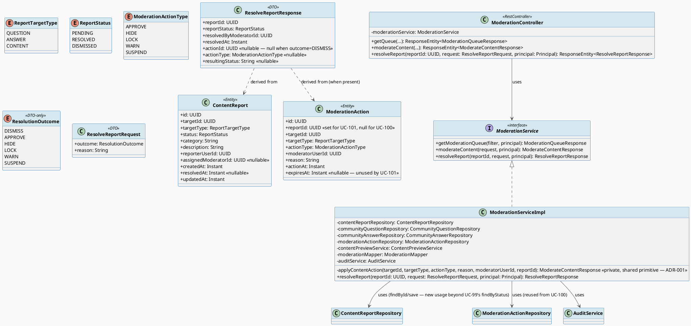
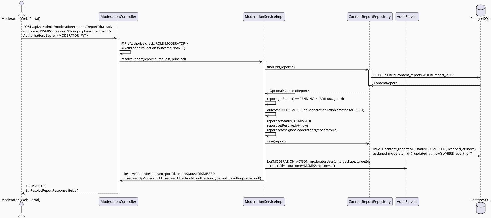
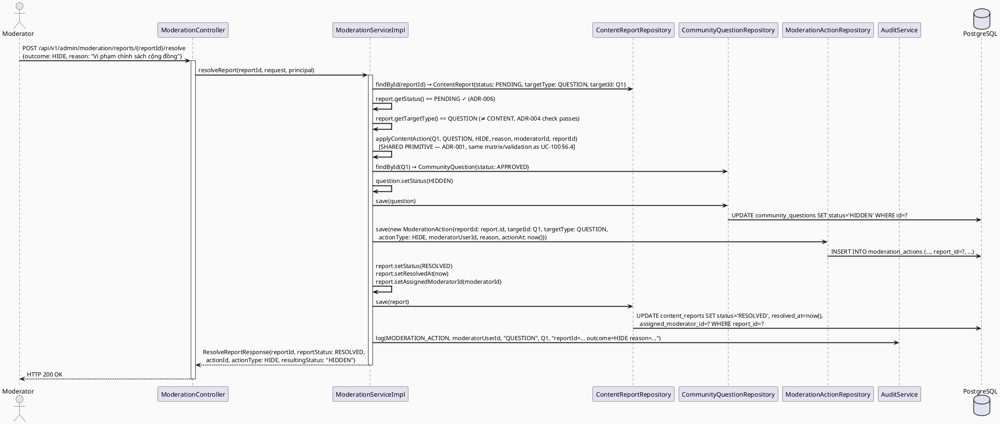
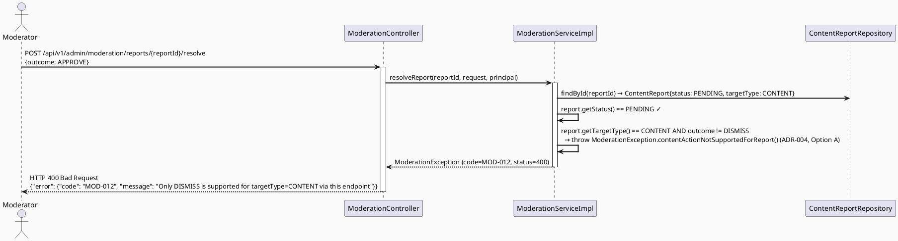
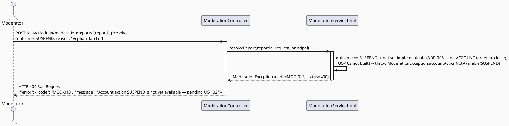
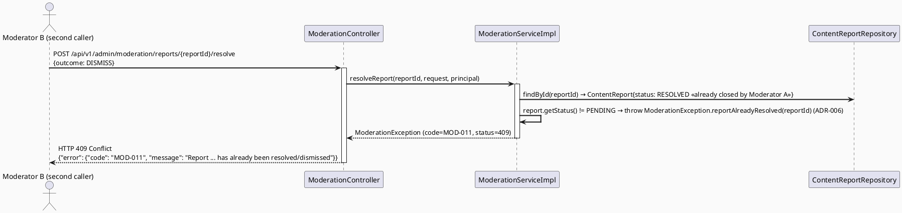
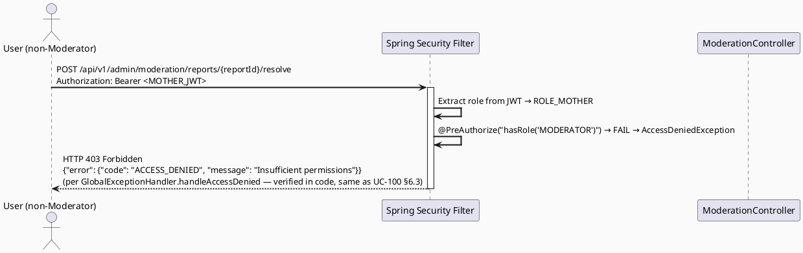

# ENGINEERING DOCUMENTATION STANDARD (EDS) v2.0
# Technical Design Specification — UC-101: Resolve Report

| Field              | Value                                   |
| ------------------ | ---------------------------------------- |
| **Document ID**    | `CB-MOD-IMP-003`                        |
| **Version**        | `1.0`                                   |
| **Date**           | `2026-07-01`                            |
| **Status**         | `Implemented`                           |
| **Document Owner** | `HuyND`                                 |
| **Author**         | `AI Agent — Winston (System Architect)` |
| **Reviewed by**    | `[ ] Pending`                           |
| **DPO Sign-off**   | `[ ] Pending` *(N/A — Internal moderation data, not PII export)* |
| **Approved by**    | `[ ] Pending`                           |
| **Last Review**    | `2026-07-01`                            |
| **Based on EDS**   | `v2.0`                                  |

---

## CHANGELOG

| Ngày       | Người thực hiện    | Nội dung thay đổi                                                                   |
| ---------- | ------------------- | ------------------------------------------------------------------------------------ |
| 2026-07-01 | AI Agent — Winston  | Tạo tài liệu lần đầu — TDS cho UC-101 Resolve Report (Status=Draft)                  |
| 2026-07-01 | AI Agent — Amelia (Dev Agent) | Phase 3: Implementation — 28/28 tests PASS (RES-TC-INT-004 race condition not implemented — no Testcontainers harness). Refactored UC-100's moderateContent() into shared applyContentAction() primitive per ADR-001; fixed a pre-existing SecurityContextHolder leak in SessionServiceImplTest. |
| 2026-07-03 | AI Agent — Claude (Audit Pass) | `resolveReport()` has always accepted `outcome=APPROVE` (`ResolutionOutcome.APPROVE`), but no web page ever sent it — the two report-detail pages only offered Hide/Dismiss, so a reported PENDING item could never be moved to APPROVED through the UI. Added a "Duyệt nội dung" button (see UC-100 changelog for the same entry — this endpoint is UC-100/UC-101 shared). Also relabeled the existing "Bỏ qua" button to "Bỏ qua báo cáo (không đổi trạng thái)" with a tooltip, since it was easy to confuse with Approve (Dismiss closes the report only; it never changes `QuestionStatus`/`AnswerStatus`). No backend change. |

---

## MỤC LỤC

1. [Tổng quan Module](#1-tổng-quan-module)
2. [Ma trận Truy vết](#2-ma-trận-truy-vết)
3. [Architecture Decision Records (ADR)](#3-architecture-decision-records-adr)
4. [Non-Functional Requirements & SLA](#4-non-functional-requirements--sla)
5. [Static Modeling](#5-static-modeling)
6. [Dynamic Modeling](#6-dynamic-modeling)
7. [Domain Event Catalog](#7-domain-event-catalog)
8. [Interface Specification](#8-interface-specification)
9. [API Specification](#9-api-specification)
10. [Bảng mã lỗi](#10-bảng-mã-lỗi)
11. [Quy trình Triển khai](#11-quy-trình-triển-khai)
12. [Rollback & Incident Runbook](#12-rollback--incident-runbook)
13. [Kịch bản Kiểm thử Chi tiết](#13-kịch-bản-kiểm-thử-chi-tiết)
14. [Phương pháp Xác minh](#14-phương-pháp-xác-minh)
15. [API Verification Samples](#15-api-verification-samples)
16. [Authorization Matrix](#16-authorization-matrix)
17. [AI Prompt Constraints (CASE 2.0)](#17-ai-prompt-constraints-case-20)

---

## 1. Tổng quan Module

| Field                     | Value                                                                                                                                  |
| ------------------------- | --------------------------------------------------------------------------------------------------------------------------------------- |
| **UC ID**                 | `UC-101`                                                                                                                                |
| **FS Reference**          | `3.2.2.3 Resolve Report` (Table 69, `02_Requirements/SRS/3_Functional_Specification.md`)                                              |
| **Module Name**           | `Resolve Report`                                                                                                                        |
| **Bounded Context**       | `content` (existing package — moderation lives inside `com.carebridge.backend.content`, same as UC-99/UC-100)                          |
| **Primary Actor**         | `Community Moderator (ROLE_MODERATOR)`                                                                                                  |
| **Platform**              | `Admin Web Portal`                                                                                                                       |
| **Priority**              | `High` (per FS Table 69)                                                                                                                |
| **Frequency of Use**      | `Regular` (per FS Table 69)                                                                                                              |
| **Data Classification**   | `Internal`                                                                                                                               |
| **Compliance Scope**      | `N/A` (no PII exported; moderation decisions are operational audit data)                                                                |
| **Upstream Dependencies** | `security (JWT auth)`, `content (ContentReport, ModerationAction, ModerationException)`, `community (CommunityQuestion, CommunityAnswer repos — reused, not duplicated)`, `audit (AuditService)`, `UC-100's action-application primitive (reused, ADR-001 below)` |
| **Downstream Consumers**  | `UC-99 View Moderation Queue` (resolved/dismissed reports drop out of the default PENDING-filtered queue), `UC-102 Warn or Suspend Account` (forward dependency — see ADR-005; not yet built) |

**Mô tả:**
UC-101 là **report-centric orchestration entry point**: moderator mở MỘT `ContentReport` đang `PENDING` (từ hàng đợi UC-99) và chọn một outcome để đóng report đó. Hai nhóm outcome:

1. **DISMISS** (giữ nguyên, không hành động — "keep"): `ContentReport.status` → `DISMISSED`, `resolvedAt`/`assignedModeratorId` được set. **Không** tạo `ModerationAction`.
2. **Hành động nội dung** (`APPROVE`/`HIDE`/`LOCK`, chỉ áp dụng khi `targetType ∈ {QUESTION, ANSWER}`): tái sử dụng đúng primitive đã thiết kế ở UC-100 (mutate `status` trên `CommunityQuestion`/`CommunityAnswer` + insert `ModerationAction`), nhưng lần này `ModerationAction.reportId` **được set** (≠ null, khác UC-100), và `ContentReport.status` → `RESOLVED`, `resolvedAt`/`assignedModeratorId` được set, cùng transaction.

UC-101 **không** tự định nghĩa lại logic mutate `status`/ghi `ModerationAction` — nó **gọi lại** service method đã có ở UC-100 với tham số `reportId` khác null (xem ADR-001). Đây là điểm khác biệt cốt lõi so với UC-100 (proactive, `reportId=null`, không đụng đến `ContentReport`).

**Khoảng trống quan trọng được giải quyết tường minh (CONTENT targetType):** `ContentReport.targetType` (`ReportTargetType`: QUESTION/ANSWER/**CONTENT**) bao gồm `CONTENT`, trong khi UC-100 chỉ hỗ trợ QUESTION/ANSWER (ADR-004 của UC-100 loại CONTENT khỏi phạm vi MODERATOR). UC-100 TDS đã ghi nhận khoảng trống này là `Open`: *"Report `targetType=CONTENT` trong UC-99 queue chưa có hành động trực tiếp tương ứng trong UC-100 — cần UC-101 (dismiss, không đổi `ContentItem`) hoặc một UC riêng cho Content Admin xử lý report trên `ContentItem`."* UC-101 v1 đóng khoảng trống này một cách tường minh (xem ADR-004 dưới đây): **report với `targetType=CONTENT` chỉ có thể `DISMISS` qua UC-101 v1** — hành động `APPROVE`/`HIDE`/`LOCK` trực tiếp trên `ContentItem` bị từ chối (giữ đúng ranh giới `MODERATOR` vs `CONTENT_ADMIN` đã thiết lập ở ADR-004 của UC-100), và cơ chế "escalate to Content Admin" thật sự (một trạng thái/route riêng để chuyển tiếp report cho `CONTENT_ADMIN` xử lý) được ghi nhận `Open` — cần một `ReportStatus` value mới (vd. `ESCALATED`) + migration, KHÔNG được phát minh ở v1 vì không có nguồn nào yêu cầu nó và vi phạm "smallest scoped change".

**Khoảng trống thứ hai (WARN/SUSPEND — forward dependency UC-102):** FS-3.2.2.3 liệt kê "warn" và "suspend" là outcome hợp lệ. `ModerationActionType` đã có `WARN`/`SUSPEND`, nhưng các giá trị này nhắm vào một **tài khoản người dùng**, không phải `targetId`/`targetType` (content) mà `ContentReport`/`ModerationAction` hiện mô hình hóa — không có giá trị `ACCOUNT` trong `ReportTargetType`, và không có service nào ghi `users.enabled`/`users.locked` hay cột `suspended_until` (chưa tồn tại). UC-102 (Warn or Suspend Account) chưa được xây dựng trong batch này. UC-101 v1 **chấp nhận** `WARN`/`SUSPEND` ở tầng contract (đúng theo FS) nhưng **từ chối tường minh** ở tầng service với lỗi báo rõ "chưa khả dụng, chờ UC-102" (ADR-005) — không tự ý lắp ráp một phần triển khai account-suspension không có spec nguồn.

---

## 2. Ma trận Truy vết

| Requirement ID | Loại          | Mô tả yêu cầu                                                                                  | Thành phần Code                                  | Compliance Target | ADR liên quan |
| --------------- | -------------- | ------------------------------------------------------------------------------------------------ | -------------------------------------------------- | ------------------- | --------------- |
| UC-101          | Use Case      | Moderator mở một report PENDING và chọn outcome để đóng nó                                       | `ModerationController.resolveReport()`             | —                  | ADR-001         |
| FS-3.2.2.3      | Functional    | "Reviews a report and decides whether to keep, label, hide, warn, or suspend"                    | "label" out of scope — see note below              | —                  | ADR-007         |
| BR-RBAC-001     | Business Rule | Chỉ MODERATOR mới được gọi endpoint resolve-report                                                | `@PreAuthorize("hasRole('MODERATOR')")`            | —                  | ADR-002         |
| BR-MOD-009      | Business Rule | Report được resolve qua UC-101 PHẢI set `resolvedAt`/`assignedModeratorId`, dù outcome nào         | `ModerationServiceImpl.resolveReport()`            | —                  | ADR-001/ADR-006 |
| BR-MOD-010      | Business Rule | Chỉ outcome hành động nội dung (APPROVE/HIDE/LOCK) mới tạo `ModerationAction`; DISMISS thì không  | `ModerationServiceImpl.resolveReport()`            | —                  | ADR-001         |
| BR-MOD-011      | Business Rule | `ModerationAction` tạo qua UC-101 PHẢI có `reportId = report.id` (≠ null, khác UC-100)            | `ModerationServiceImpl.resolveReport()`            | —                  | ADR-001         |
| BR-MOD-012      | Business Rule | Report `targetType=CONTENT` chỉ chấp nhận outcome DISMISS — APPROVE/HIDE/LOCK bị từ chối           | `ModerationServiceImpl.resolveReport()`            | —                  | ADR-004         |
| BR-MOD-013      | Business Rule | outcome WARN/SUSPEND bị từ chối ở v1 — chờ UC-102                                                  | `ModerationServiceImpl.resolveReport()`            | —                  | ADR-005         |
| BR-MOD-014      | Business Rule | Report đã `RESOLVED`/`DISMISSED` (không còn `PENDING`) không thể resolve lại                       | `ModerationServiceImpl.resolveReport()`            | —                  | ADR-006         |
| BR-AUDIT-001    | Business Rule | Mọi outcome (kể cả DISMISS) đều phải được audit log                                                | `AuditService.log(MODERATION_ACTION, ...)`         | —                  | ADR-003         |

> **Note (FS-3.2.2.3 "label"):** FS liệt kê "label" như một outcome khả dĩ. Không có `ModerationActionType`/`ReportStatus`/status value nào đại diện cho "gắn nhãn" trong schema hiện tại — tương tự khoảng trống "request edits" mà UC-100 ADR-005 đã ghi nhận. Xem ADR-007.

---

## 3. Architecture Decision Records (ADR)

### ADR-001 — Report-Centric Orchestration Reuses UC-100's Action-Application Primitive (DRY) + `reportId` Propagation

| Field          | Value                      |
| -------------- | --------------------------- |
| **Status**     | `Accepted`                 |
| **Deciders**   | `HuyND — System Architect` |
| **Date**       | `2026-07-01`                |
| **Supersedes** | —                           |

#### Bối cảnh
UC-100 (`CB-MOD-IMP-002`) đã thiết kế đầy đủ logic "mutate `CommunityQuestion`/`CommunityAnswer.status` + insert `ModerationAction` trong cùng transaction" cho `targetType ∈ {QUESTION, ANSWER}` và `actionType ∈ {APPROVE, HIDE, LOCK}` (ADR-001/ADR-004/ADR-006 của UC-100). UC-101 cần CHÍNH XÁC logic đó khi outcome là một hành động nội dung — khác biệt duy nhất là `ModerationAction.reportId` phải được set (= report đang resolve) thay vì `null`, và sau khi action thành công, `ContentReport.status` phải chuyển `PENDING → RESOLVED` trong cùng transaction.

#### Các phương án đã xem xét

| Phương án | Mô tả                                                                                          | Ưu điểm                                              | Nhược điểm                                            |
| --------- | -------------------------------------------------------------------------------------------------- | ------------------------------------------------------- | ---------------------------------------------------------- |
| A         | Sao chép logic mutate/insert của UC-100 vào một method riêng trong `resolveReport()`               | Độc lập hoàn toàn, dễ đọc                                | Trùng lặp logic (DRY violation) — sửa ADR-004/ADR-006 của UC-100 sau này dễ quên đồng bộ UC-101 |
| B         | `ModerationServiceImpl` factor ra 1 `private` method dùng chung `applyContentAction(targetId, targetType, actionType, reason, moderatorUserId, reportId)`; cả `moderateContent()` (UC-100, `reportId=null`) và `resolveReport()` (UC-101, `reportId=report.id`) đều gọi method này | Không trùng lặp logic; thay đổi action–targetType matrix chỉ sửa 1 chỗ | Tăng coupling nội bộ giữa 2 use case trong cùng 1 class — chấp nhận được vì cùng `ModerationServiceImpl`, cùng bounded context |

#### Quyết định
Chọn **Phương án B**. `ModerationServiceImpl` có thêm `private ModerateContentResponse applyContentAction(UUID targetId, ReportTargetType targetType, ModerationActionType actionType, String reason, UUID moderatorUserId, UUID reportId)` — đây là phiên bản tổng quát hóa của `moderateContent()` body (UC-100), nhận thêm tham số `reportId` (nullable). `ModerationServiceImpl.moderateContent()` (UC-100) gọi `applyContentAction(..., reportId=null)`. `ModerationServiceImpl.resolveReport()` (UC-101) gọi `applyContentAction(..., reportId=report.getId())` cho nhánh APPROVE/HIDE/LOCK, sau đó tự cập nhật `ContentReport.status=RESOLVED`/`resolvedAt`/`assignedModeratorId` trong cùng `@Transactional`.

#### Hệ quả

**Tích cực:**
- Một nguồn sự thật duy nhất cho action–targetType compatibility matrix (UC-100 §6.4) — UC-101 không định nghĩa lại.
- `reportId` propagation đúng 100% theo BR-MOD-011, không có rủi ro quên set.

**Tiêu cực / Trade-offs:**
- `ModerationServiceImpl.resolveReport()` **phụ thuộc trực tiếp vào việc UC-100 đã được implement trước** (cùng class). Thứ tự triển khai khuyến nghị: UC-100 trước, UC-101 sau (ghi rõ ở §11.1 Prerequisites).
- Nếu UC-100 thay đổi signature của `applyContentAction`, UC-101 phải được review lại đồng thời — ghi nhận trong Authorization/Interface review checklist.

**Compliance Impact:** N/A.

---

### ADR-002 — RBAC Enforcement tại Controller Layer (mirror UC-100 ADR-002)

| Field        | Value                      |
| ------------ | --------------------------- |
| **Status**   | `Accepted`                 |
| **Deciders** | `HuyND — System Architect` |
| **Date**     | `2026-07-01`                |

#### Quyết định
`@PreAuthorize("hasRole('MODERATOR')")` trên method mới `resolveReport()` của `ModerationController` (cùng class với `getQueue()`/`moderateContent()`). Thêm rule tương ứng vào `SecurityConfig.securityFilterChain()`:
```java
.requestMatchers(HttpMethod.POST, "/api/v1/admin/moderation/reports/*/resolve").hasRole("MODERATOR")
```
Cùng pattern defense-in-depth với UC-99/UC-100 (URL-level rule + method-level `@PreAuthorize`).

#### Hệ quả
**Tích cực:** Nhất quán toàn bộ cluster moderation. **Tiêu cực:** Controller method không được chứa business logic — chỉ validate + delegate sang Service.

---

### ADR-003 — Audit Logging dùng `AuditAction.MODERATION_ACTION` cho MỌI outcome (kể cả DISMISS)

| Field        | Value                      |
| ------------ | --------------------------- |
| **Status**   | `Accepted`                 |
| **Deciders** | `HuyND — System Architect` |
| **Date**     | `2026-07-01`                |

#### Bối cảnh
UC-100 ADR-003 tái sử dụng `AuditAction.MODERATION_ACTION` đã tồn tại cho hành động nội dung. UC-101 thêm một nhánh không tạo `ModerationAction` (DISMISS) — câu hỏi: nhánh này có cần audit không?

#### Quyết định
**Có.** Mọi lệnh gọi `resolveReport()` thành công (cả DISMISS lẫn hành động nội dung) đều gọi `auditService.log(AuditAction.MODERATION_ACTION, moderatorUserId, targetType.name(), targetId.toString(), details)` với `details` chứa `reportId`, `outcome`, `reason` (nếu có). Lý do: quyết định "dismiss" (không hành động) vẫn là một quyết định kiểm duyệt có trách nhiệm giải trình (accountability) — không log sẽ tạo lỗ hổng audit trail cho mọi report bị "đóng êm" mà không có dấu vết ai/khi nào. Không thêm `AuditAction` enum value mới (vd. `REPORT_DISMISSED`) vì `MODERATION_ACTION` đã đủ tổng quát và việc thêm enum value mới không được yêu cầu bởi nguồn nào — `Open`: nếu cần phân biệt rõ DISMISS với hành động thật trong audit log query sau này, đó là một cải tiến tương lai, không phải v1.

#### Hệ quả
**Tích cực:** Audit trail đầy đủ 100% các quyết định đóng report. **Tiêu cực:** `details` payload phải tự chứa `outcome=DISMISS` để phân biệt — không có cách lọc theo `AuditAction` enum riêng.

---

### ADR-004 — CONTENT targetType Resolution: DISMISS-only in v1; "Escalate to Content Admin" Deferred (Open)

| Field          | Value                      |
| -------------- | --------------------------- |
| **Status**     | `Accepted`                 |
| **Deciders**   | `HuyND — System Architect` |
| **Date**       | `2026-07-01`                |
| **Supersedes** | —                           |

#### Bối cảnh
`ContentReport.targetType` có 3 giá trị (`QUESTION`/`ANSWER`/`CONTENT`), khác với UC-100 vốn chỉ hỗ trợ `QUESTION`/`ANSWER` (UC-100 ADR-004, vì `ContentItem` thuộc sở hữu `CONTENT_ADMIN`). Khi một report có `targetType=CONTENT` xuất hiện trong hàng đợi UC-99, moderator vẫn cần một cách để "xử lý xong" report đó qua UC-101 — đây chính xác là khoảng trống UC-100 TDS đã gắn cờ `Open` ở ADR-004 của nó.

#### Các phương án đã xem xét

| Phương án | Mô tả                                                                                                       | Ưu điểm                                                                          | Nhược điểm                                                                                      |
| --------- | ----------------------------------------------------------------------------------------------------------- | ------------------------------------------------------------------------------- | ------------------------------------------------------------------------------------------------ |
| A         | Report `targetType=CONTENT` chỉ chấp nhận outcome `DISMISS` qua UC-101. Outcome `APPROVE`/`HIDE`/`LOCK` bị từ chối với lỗi mới (`MOD-012`). Không có cơ chế "escalate" thật (không thêm `ReportStatus` value mới). | Tôn trọng đúng ranh giới `MODERATOR` vs `CONTENT_ADMIN` (nhất quán với UC-100 ADR-004); không cần migration; nhỏ gọn nhất | Report CONTENT cần hành động thật (không chỉ dismiss) hiện KHÔNG có lối ra chính thức trong hệ thống — Content Admin phải được thông báo ngoài luồng (thủ công/Slack) cho đến khi có một UC riêng — `Open`, cần Tech Lead/Product xác nhận |
| B         | Thêm `ReportStatus.ESCALATED` (migration mới) — UC-101 set report này thành `ESCALATED` thay vì bị chặn, một service/queue riêng cho `CONTENT_ADMIN` xử lý tiếp (UC chưa tồn tại) | Có lối ra chính thức, không "mất dấu" report CONTENT cần xử lý                    | Vượt phạm vi nhỏ nhất; đòi hỏi xây cả phía `CONTENT_ADMIN` tiêu thụ trạng thái `ESCALATED` (UC mới, không có trong batch 17 spec này) — không có nguồn FS nào yêu cầu cụ thể luồng này |
| C         | Cho phép UC-101 ghi trực tiếp vào `ContentItem.status` (vd. APPROVE → `ContentStatus.APPROVED`) khi resolve report CONTENT | Có hành động thật ngay lập tức, không cần escalate                                | Vi phạm trực tiếp ranh giới role mà UC-100 ADR-004 vừa thiết lập (MODERATOR ghi vào bảng thuộc CONTENT_ADMIN) — loại trừ |

#### Quyết định
Chọn **Phương án A**. UC-101 v1: report `targetType=CONTENT` → outcome hợp lệ duy nhất là `DISMISS` (lỗi `MOD-012`, `HTTP 400`, cho mọi outcome hành động nội dung). Đây là quyết định **nổi bật, cần con người review** — đánh dấu rõ trong §16 và §10. Cơ chế "escalate to Content Admin" chính thức (Phương án B) được ghi nhận **`Open`** — không triển khai ở v1, cần một ADR/migration riêng nếu Product xác nhận yêu cầu.

#### Hệ quả

**Tích cực:**
- Không cần migration.
- Đóng khoảng trống `Open` mà UC-100 TDS đã gắn cờ, một cách tường minh thay vì im lặng bỏ qua.
- Nhất quán hoàn toàn với ranh giới role đã thiết lập ở UC-100.

**Tiêu cực / Trade-offs:**
- Report CONTENT cần hành động thật sự (không chỉ "bỏ qua") chưa có lối ra hệ thống — phụ thuộc quy trình ngoài luồng cho đến khi có UC escalate chính thức. Ghi nhận `Open`, cần Tech Lead/Product quyết định có ưu tiên xây Phương án B trong sprint tới hay không.

**Compliance Impact:** N/A.

---

### ADR-005 — WARN/SUSPEND Outcomes Rejected in v1 — Forward Dependency on UC-102 (Account-Target Schema Gap)

| Field          | Value                      |
| -------------- | --------------------------- |
| **Status**     | `Accepted`                 |
| **Deciders**   | `HuyND — System Architect` |
| **Date**       | `2026-07-01`                |
| **Supersedes** | —                           |

#### Bối cảnh
`ModerationActionType.WARN`/`SUSPEND` đã tồn tại trong enum, và FS-3.2.2.3 liệt kê "warn"/"suspend" như outcome hợp lệ của Resolve Report. Tuy nhiên các action này về bản chất nhắm vào **tài khoản người dùng vi phạm** (vd. tác giả của `CommunityQuestion`/`CommunityAnswer` bị report), KHÔNG phải `targetId`/`targetType` (content) mà `ModerationAction` hiện mô hình hóa. `ReportTargetType` không có giá trị `ACCOUNT`. Không có service nào ghi `users.enabled`/`users.locked`, và không có cột `suspended_until` (UC-102 — dossier §4.2 — đề xuất cần thêm cột này qua migration riêng, nhưng UC-102 chưa được viết trong batch này).

#### Các phương án đã xem xét

| Phương án | Mô tả                                                                                                       | Ưu điểm                                                                          | Nhược điểm                                                                                      |
| --------- | ----------------------------------------------------------------------------------------- | ------------------------------------------------------------------------------- | ------------------------------------------------------------------------------------------------ |
| A         | UC-101 v1 từ chối tường minh outcome `WARN`/`SUSPEND` với lỗi mới (`MOD-013`, "chưa khả dụng, chờ UC-102"). Report **giữ nguyên `PENDING`** (không bị tiêu thụ bởi lệnh gọi thất bại). | Không lắp ráp logic account-suspension chưa có spec; không tạo `ModerationAction` "mồ côi" trỏ sai target | Moderator cần thực hiện WARN/SUSPEND ngoài luồng UC-101 cho đến khi UC-102 tồn tại — report đó vẫn nằm trong queue PENDING |
| B         | UC-101 v1 tạm thời ghi `ModerationAction{targetId: report.targetId, targetType: report.targetType, actionType: WARN/SUSPEND, reportId}` (dùng content targetType như target giả) và set report `RESOLVED` | Có thể "đóng" report ngay                                                         | Sai ngữ nghĩa nghiêm trọng — `ModerationAction` sẽ ghi nhận WARN/SUSPEND "trên một câu hỏi/câu trả lời" thay vì trên tài khoản, gây hiểu lầm vĩnh viễn trong audit trail (không thể sửa vì append-only) — loại trừ |

#### Quyết định
Chọn **Phương án A**. `resolveReport()` với `outcome ∈ {WARN, SUSPEND}` luôn throw `ModerationException` `MOD-013` (`HTTP 400`), KHÔNG mutate `ContentReport`, KHÔNG tạo `ModerationAction`. Documented forward dependency: khi UC-102 được xây dựng, nó cần định nghĩa cách `ModerationAction` (hoặc một bảng mới) ghi nhận action nhắm vào tài khoản — gợi ý 2 hướng (không quyết định ở đây, để UC-102 TDS riêng quyết định): (a) mở rộng `ReportTargetType` thêm giá trị `ACCOUNT` (xác nhận: cột `target_type` trong `moderation_actions`/`content_reports` là `varchar(30)` KHÔNG có DB-level CHECK constraint — verified bằng cách đọc `V1__init_schema.sql` dòng 222-234/276-286 — nên việc thêm 1 Java enum value không cần migration schema, chỉ cần migration nếu muốn enforce CHECK constraint); (b) bảng `account_moderation_actions` riêng. Ghi nhận `Open` cho UC-102 quyết định.

#### Hệ quả

**Tích cực:** Không phát minh logic account-suspension không có nguồn; tránh ghi sai ngữ nghĩa vào audit trail bất biến (append-only — không sửa được sau này).
**Tiêu cực / Trade-offs:** Report yêu cầu WARN/SUSPEND không thể đóng hoàn toàn qua UC-101 cho tới khi UC-102 ra đời — quy trình tạm thời (ngoài hệ thống) cần thiết, ghi nhận `Open` cho Product.

**Compliance Impact:** N/A.

---

### ADR-006 — Report Re-resolution Guard: PENDING-only Transition (khác với UC-100's Idempotent Overwrite)

| Field          | Value                      |
| -------------- | --------------------------- |
| **Status**     | `Accepted`                 |
| **Deciders**   | `HuyND — System Architect` |
| **Date**       | `2026-07-01`                |
| **Supersedes** | —                           |

#### Bối cảnh
UC-100 ADR-006 chọn **không** có forbidden-transition guard cho hành động trên content (mỗi lần gọi vẫn ghi đè `status`, tạo `ModerationAction` mới — phù hợp vì đó là công cụ lặp lại được). UC-101 thì khác về bản chất: một `ContentReport` đại diện cho MỘT "ticket" cần đóng đúng MỘT lần — `resolvedAt`/`assignedModeratorId` mang ý nghĩa "ai đã đóng ticket này, lúc nào" (accountability cho riêng report đó, không phải cho content). Không có nguồn FS/BR nào nói rõ có cho phép resolve lại một report đã `RESOLVED`/`DISMISSED` hay không — đây là **design decision**, không phải sourced fact.

#### Các phương án đã xem xét

| Phương án | Mô tả                                                                                          | Ưu điểm                                              | Nhược điểm                                            |
| --------- | ---------------------------------------------------------------------------------------------- | ----------------------------------------------------- | ------------------------------------------------------ |
| A         | Cho phép resolve lại bất kỳ lúc nào (giống UC-100, idempotent overwrite)                        | Đơn giản, nhất quán style với UC-100                   | `resolvedAt`/`assignedModeratorId` bị ghi đè bởi moderator thứ 2 → mất dấu ai thực sự xử lý report đầu tiên; UC-99 mặc định chỉ hiển thị PENDING nên UI thường sẽ không cho cơ hội resolve lại — guard giúp phát hiện race condition rõ ràng thay vì âm thầm ghi đè |
| B         | Chặn resolve lại — chỉ cho phép khi `report.status == PENDING`; nếu không, throw `MOD-011` (409 Conflict) | Bảo vệ tính toàn vẹn attribution của từng report; phát hiện race condition (2 moderator cùng mở 1 report) tường minh bằng lỗi thay vì silent overwrite | Cần thêm 1 check + error code mới; nếu moderator thực sự muốn sửa lại quyết định, không có đường "un-resolve" (out of scope v1, ghi nhận `Open`) |

#### Quyết định
Chọn **Phương án B**. `resolveReport()` kiểm tra `report.getStatus() == ReportStatus.PENDING` TRƯỚC khi xử lý outcome; nếu không, throw `ModerationException.reportAlreadyResolved(reportId)` (`MOD-011`, `HTTP 409 Conflict`). Đây là điểm khác biệt **có chủ đích** so với UC-100 — lý do: report là "ticket" cần đóng đúng 1 lần, content action là "công cụ" có thể lặp lại trên cùng nội dung. Ghi nhận `Open`: không có cơ chế "un-resolve"/"reopen" report ở v1 — nếu cần, đó là một mở rộng tương lai.

#### Hệ quả

**Tích cực:** Bảo vệ accountability của resolution attribution; phát hiện race condition rõ ràng (409, không phải silent overwrite).
**Tiêu cực / Trade-offs:** Không có cơ chế sửa sai/reopen report ở v1 — `Open`, cần Product xác nhận có cần thiết không.

**Compliance Impact:** N/A.

---

### ADR-007 — "Label" Outcome Excluded from v1 (mirror UC-100 ADR-005)

| Field        | Value                      |
| ------------ | --------------------------- |
| **Status**   | `Accepted`                 |
| **Deciders** | `HuyND — System Architect` |
| **Date**     | `2026-07-01`                |

#### Bối cảnh
FS-3.2.2.3 liệt kê "label" như một outcome khả dĩ. Không có `ModerationActionType`/`ReportStatus`/status value nào đại diện cho "gắn nhãn" trong schema hiện tại (giống hệt khoảng trống "request edits" của UC-100 ADR-005).

#### Quyết định
`ResolutionOutcome` (DTO-level enum, §8.3) KHÔNG bao gồm giá trị `LABEL`. Request với outcome không khớp enum sẽ bị JSON deserialization từ chối ở tầng bean validation (400, lỗi chung — xem `MOD-001` reused convention, cùng drift đã ghi nhận ở UC-100 §6.3/§9.2). Ghi nhận `Open` — không suy đoán cơ chế "label" (có thể tương lai cần `ModerationActionType.LABEL` + cách hiển thị nhãn trên UI, nhưng không có nguồn nào xác nhận thiết kế đó).

#### Hệ quả
**Tích cực:** Không phát minh enum/migration không có căn cứ. **Tiêu cực:** FS coverage cho UC-101 chưa đầy đủ 100% — explicit gap, không che giấu.

---

## 4. Non-Functional Requirements & SLA

### 4.1. Performance & Availability

| Category     | Requirement                 | Target SLA  | Measurement Method | Compliance Basis |
| ------------ | ---------------------------- | ----------- | -------------------- | ------------------- |
| Latency      | API response (p99)           | `Open` — no sourced SLA; recommend reuse of UC-99/UC-100's `< 300ms` baseline, needs Tech Lead confirmation | k6 load test          | — |
| Availability | Uptime (monthly)             | `Open` — reuse `99.5%` baseline, needs confirmation | Uptime monitor        | — |
| Concurrency  | Hai moderator cùng mở một report `PENDING` đồng thời | Bảo vệ bằng `MOD-011` guard (ADR-006) — second caller nhận 409, không silent overwrite; vẫn không có optimistic locking (`@Version`) thật, có thể có race nhỏ giữa `findById` và `save` (TOCTOU) — `Open`, ghi nhận như UC-100's concurrency note | Code review + integration test | — |

### 4.2. Data Integrity & Retention

| Category   | Requirement                                                              | Target                | Verification Method | Compliance Basis |
| ---------- | ------------------------------------------------------------------------- | ------------------------ | ---------------------- | ------------------- |
| Append-only | `moderation_actions` never UPDATEd/DELETEd by this UC                   | 0 UPDATE/DELETE ops on `moderation_actions` | Code review + `pg_stat_user_tables` | — |
| Atomicity  | `ContentReport.status`/`resolvedAt`/`assignedModeratorId` mutation + (nếu có) `CommunityQuestion`/`CommunityAnswer.status` mutation + `ModerationAction` insert + audit log đều trong 1 transaction | All-or-nothing            | Integration test (rollback scenario) | — |
| `reportId` propagation | `ModerationAction.reportId` luôn = `report.id` cho action tạo qua UC-101 (≠ null) | 100%                      | Unit test assertion    | — |
| Single resolution | Một `ContentReport` chỉ chuyển trạng thái từ `PENDING` đúng 1 lần thành công (ADR-006) | 100%                      | Unit + integration test | — |

### 4.3. Security

| Category        | Requirement                                                  | Target          | Verification Method | Compliance Basis |
| ---------------- | --------------------------------------------------------------- | ------------------ | ----------------------- | ------------------- |
| Encryption in transit | All endpoints                                              | TLS 1.3+            | SSL Labs scan            | — |
| Access control   | MODERATOR role only (no implicit SYSTEM_ADMIN bypass — verified: no `RoleHierarchy` bean exists in `SecurityConfig.java`, same finding as UC-100) | Least privilege     | Auth Matrix (§16)        | — |
| Input validation | `reportId` (path variable) must resolve to an existing `ContentReport` before any mutation | 100% reject unknown reports | Unit + integration test | — |

### 4.4. Scalability

Không có dữ liệu tải cụ thể nguồn gốc (`Open`). Giả định tải tương tự UC-99/UC-100 (5-10 moderators concurrent, nội bộ admin tool) — cần xác nhận.

---

## 5. Static Modeling

### 5.1. Class Diagram (PlantUML)



### 5.2. Data Structure — No Schema Change

> Per ADR-001/ADR-004/ADR-005, UC-101 needs **no new table, column, index, constraint, or enum value**.
> `content_reports` (status/resolvedAt/assignedModeratorId already present), `moderation_actions`
> (reportId already present), `community_questions.status`, `community_answers.status` already exist
> exactly as needed (`V1__init_schema.sql` lines 222-234 `content_reports`, lines 276-286
> `moderation_actions`; `community_questions`/`community_answers` from earlier community migrations,
> verified by reading the entity files directly).
>
> **No new Flyway migration is proposed for UC-101.** Latest migration as of this TDS is
> `V20260629000002__create_community_answer_likes.sql` — UC-101 does not add a successor.

```sql
-- No DDL changes required. Existing relevant columns (read-only reference, already present):
-- content_reports(report_id, target_id, target_type, status, category, description,
--                  reporter_user_id, assigned_moderator_id, created_at, resolved_at, updated_at)
-- moderation_actions(moderation_action_id, report_id, target_id, target_type, action_type,
--                     moderator_user_id, reason, action_at, expires_at)
-- community_questions(id, ..., status)   -- QuestionStatus: PENDING/APPROVED/HIDDEN/LOCKED
-- community_answers(id, ..., status)     -- AnswerStatus: PENDING/APPROVED/HIDDEN
```

---

## 6. Dynamic Modeling

### 6.1. Sequence Diagram — Happy Path (DISMISS a report)



### 6.2. Sequence Diagram — Happy Path (HIDE outcome on a QUESTION report)



### 6.3. Sequence Diagram — Error Path (targetType=CONTENT with action outcome → MOD-012)



### 6.4. Sequence Diagram — Error Path (WARN/SUSPEND → MOD-013, forward dependency on UC-102)



### 6.5. Sequence Diagram — Error Path (Already resolved → MOD-011)



### 6.6. Sequence Diagram — Error Path (Unauthorized — non-MODERATOR)



> **Verified finding (reused from UC-100, not re-derived):** `GlobalExceptionHandler.java` line ~284-287
> handles `AccessDeniedException` with `error(HttpStatus.FORBIDDEN, "ACCESS_DENIED", ...)`. No `MOD-004`
> factory exists. 401 for missing/invalid JWT is bodiless (`HttpStatusEntryPoint`). This TDS documents the
> real current behavior, same as UC-100 §6.3.

### 6.7. Resolution Outcome × targetType Decision Matrix

| outcome      | QUESTION/ANSWER (`ContentReport.targetType`)                          | CONTENT (`ContentReport.targetType`)                          |
| ------------ | ----------------------------------------------------------------------- | ----------------------------------------------------------------- |
| `DISMISS`    | ✅ `ContentReport.status → DISMISSED`, no `ModerationAction`            | ✅ `ContentReport.status → DISMISSED`, no `ModerationAction`      |
| `APPROVE`    | ✅ via `applyContentAction()` (UC-100 §6.4 matrix) → `ContentReport.status → RESOLVED` | ❌ Rejected (`MOD-012`, ADR-004 Option A)                          |
| `HIDE`       | ✅ (ANSWER also valid)                                                   | ❌ Rejected (`MOD-012`)                                            |
| `LOCK`       | ✅ QUESTION only — ANSWER → `MOD-008` (reused UC-100 matrix)             | ❌ Rejected (`MOD-012`)                                            |
| `WARN`       | ❌ Rejected (`MOD-013`, ADR-005 — forward dependency UC-102)             | ❌ Rejected (`MOD-013`)                                            |
| `SUSPEND`    | ❌ Rejected (`MOD-013`)                                                  | ❌ Rejected (`MOD-013`)                                            |

**Oracle for this matrix:** `content/entity/ReportTargetType.java`, `content/entity/ModerationActionType.java`,
UC-100 TDS §6.4 (reused, not redefined), ADR-004/ADR-005 of this document.

---

## 7. Domain Event Catalog

### 7.1. Events Published (Phát ra)

| Event Name              | Trigger                                 | Publisher                | Subscriber(s)  | Payload Schema | Async?          |
| ------------------------ | ------------------------------------------ | --------------------------- | ----------------- | ---------------- | ------------------ |
| (none — see note)        | —                                          | —                            | —                  | —                 | —                  |

> **Open:** Giống UC-100 §7.1 — không có `ApplicationEvent`/pub-sub trong codebase hiện tại cho moderation.
> UC-101 tuân theo cùng pattern audit-log đồng bộ (ADR-003) thay vì phát minh hạ tầng event mới. Nếu UC-111
> (Community Dashboard) sau này cần phản ứng real-time với report resolution, một event
> `ReportResolvedEvent` là một ADR tương lai, không thuộc TDS này.

### 7.2. Events Consumed (Tiêu thụ)

| Event Name | Source | Handler | Action thực hiện |
| ----------- | -------- | --------- | ------------------- |
| (none)      | —        | —          | —                    |

### 7.3. Payload Schema

N/A — no domain event introduced (see §7.1).

---

## 8. Interface Specification

### 8.1. Service Interface

```java
// com.carebridge.backend.content.service.ModerationService
// @version 1.2 — adds resolveReport() (UC-101); getModerationQueue() (UC-99) and
// moderateContent() (UC-100) unchanged in signature, but ModerationServiceImpl gains a
// shared private applyContentAction() primitive (ADR-001) used by both.

package com.carebridge.backend.content.service;

public interface ModerationService {

    ModerationQueueResponse getModerationQueue(ModerationQueueFilter filter, Principal principal);

    ModerateContentResponse moderateContent(ModerateContentRequest request, Principal principal);

    /**
     * Resolves a single PENDING ContentReport by choosing an outcome: DISMISS (no action,
     * report.status -> DISMISSED) or a content action APPROVE/HIDE/LOCK (delegates to the same
     * validation/mutation primitive as UC-100's moderateContent(), with reportId populated;
     * report.status -> RESOLVED). WARN/SUSPEND are accepted at the DTO contract level per FS but
     * rejected at v1 (ADR-005 — forward dependency on UC-102, not yet built).
     *
     * @throws ModerationException (MOD-003) if reportId does not resolve to an existing ContentReport
     * @throws ModerationException (MOD-011) if report.status is not PENDING (already resolved/dismissed, ADR-006)
     * @throws ModerationException (MOD-012) if report.targetType == CONTENT and outcome != DISMISS (ADR-004)
     * @throws ModerationException (MOD-013) if outcome is WARN or SUSPEND (ADR-005)
     * @throws ModerationException (MOD-008) if outcome is a content action not supported for report.targetType
     *         (reused UC-100 §6.4 matrix — e.g. LOCK on ANSWER)
     * @throws ModerationException (MOD-007) if report.targetId does not resolve to an existing
     *         CommunityQuestion/CommunityAnswer row (reused from UC-100)
     * @throws ModerationException (MOD-010) if reason is blank for HIDE/LOCK (reused ADR-006 of UC-100)
     */
    ResolveReportResponse resolveReport(UUID reportId, ResolveReportRequest request, Principal principal);
}
```

### 8.2. Repository Interfaces

```java
// com.carebridge.backend.content.repository.ContentReportRepository — existing, unchanged
// findById()/save() from JpaRepository<ContentReport, UUID> are sufficient for UC-101 —
// no new finder method required (UC-101 looks up by primary key only, unlike UC-99's
// findByStatus/findByStatusAndTargetType for the queue listing).

// com.carebridge.backend.content.repository.ModerationActionRepository — existing, unchanged
// save() sufficient (reused from UC-100, ADR-001).

// com.carebridge.backend.community.repository.CommunityQuestionRepository — existing, unchanged
// com.carebridge.backend.community.repository.CommunityAnswerRepository — existing, unchanged
// findById() reused via the shared applyContentAction() primitive (ADR-001) — no new methods.
```

### 8.3. DTO Definitions

```java
// ResolutionOutcome.java — new, DTO-level enum (NOT a JPA-mapped entity enum, not persisted as-is)
// com.carebridge.backend.content.dto.request
public enum ResolutionOutcome {
    DISMISS, APPROVE, HIDE, LOCK, WARN, SUSPEND
    // "LABEL" intentionally excluded — ADR-007 (no schema support, mirrors UC-100 ADR-005)
}

// ResolveReportRequest.java — new
// com.carebridge.backend.content.dto.request
public record ResolveReportRequest(
        @NotNull ResolutionOutcome outcome,
        String reason   // business-rule required for HIDE/LOCK outcomes (reused ADR-006 of UC-100),
                         // optional for DISMISS/APPROVE — validated in service, not @NotBlank at DTO
                         // level (conditionally required)
) {}

// ResolveReportResponse.java — new
// com.carebridge.backend.content.dto.response
public record ResolveReportResponse(
        UUID reportId,
        ReportStatus reportStatus,        // RESOLVED or DISMISSED
        UUID resolvedByModeratorId,
        Instant resolvedAt,
        UUID actionId,                    // nullable — null when outcome == DISMISS
        ModerationActionType actionType,  // nullable — null when outcome == DISMISS
        String resultingStatus            // nullable — String repr of CommunityQuestion/AnswerStatus
                                           // new value; null when outcome == DISMISS
) {}
```

---

## 9. API Specification

### 9.1. Endpoints Table

| Method | Path                                              | Auth Level | Required Roles   | Rate Limit | Idempotent? |
| ------ | ---------------------------------------------------- | ------------ | ------------------- | ------------ | -------------- |
| `POST` | `/api/v1/admin/moderation/reports/{reportId}/resolve` | JWT Bearer   | `ROLE_MODERATOR`    | `Open` — no sourced value, recommend reuse of UC-99/UC-100's 120/min baseline | No — first call resolves the report (200); any subsequent call on the same `reportId` returns `409 MOD-011` (ADR-006), so the endpoint is **not safely retriable** without checking prior response |

> **Style note:** Same convention as UC-100 — returns the DTO directly (no `ApiResponse<T>` wrapper),
> consistent with `ModerationController`'s existing endpoints in this same class.

### 9.2. Request / Response Schemas

#### `POST /api/v1/admin/moderation/reports/{reportId}/resolve`

**Request Body — DISMISS:**
```json
{
  "outcome": "DISMISS",
  "reason": "Nội dung không vi phạm chính sách cộng đồng sau khi xem xét"
}
```

**Response — 200 OK (DISMISS):**
```json
{
  "reportId": "880e8400-e29b-41d4-a716-446655440003",
  "reportStatus": "DISMISSED",
  "resolvedByModeratorId": "770e8400-e29b-41d4-a716-446655440002",
  "resolvedAt": "2026-07-01T10:20:00.000Z",
  "actionId": null,
  "actionType": null,
  "resultingStatus": null
}
```

**Request Body — HIDE (content action):**
```json
{
  "outcome": "HIDE",
  "reason": "Nội dung chứa tư vấn y tế sai lệch, có khả năng gây hại"
}
```

**Response — 200 OK (HIDE):**
```json
{
  "reportId": "880e8400-e29b-41d4-a716-446655440003",
  "reportStatus": "RESOLVED",
  "resolvedByModeratorId": "770e8400-e29b-41d4-a716-446655440002",
  "resolvedAt": "2026-07-01T10:21:00.000Z",
  "actionId": "660e8400-e29b-41d4-a716-446655440099",
  "actionType": "HIDE",
  "resultingStatus": "HIDDEN"
}
```

**Response — 400 Bad Request (Content action on targetType=CONTENT — MOD-012):**
```json
{
  "error": {
    "code": "MOD-012",
    "message": "Only DISMISS is supported for targetType=CONTENT via this endpoint"
  }
}
```

**Response — 400 Bad Request (WARN/SUSPEND not yet available — MOD-013):**
```json
{
  "error": {
    "code": "MOD-013",
    "message": "Account action SUSPEND is not yet available — pending UC-102"
  }
}
```

**Response — 409 Conflict (Report already resolved — MOD-011):**
```json
{
  "error": {
    "code": "MOD-011",
    "message": "Report 880e8400-e29b-41d4-a716-446655440003 has already been resolved/dismissed"
  }
}
```

**Response — 404 Not Found (Report not found — MOD-003, first real use of this reserved code):**
```json
{
  "error": {
    "code": "MOD-003",
    "message": "Report not found"
  }
}
```

**Response — 400 Bad Request (Action not supported for target type — MOD-008, reused from UC-100):**
```json
{
  "error": {
    "code": "MOD-008",
    "message": "Action LOCK is not supported for target type ANSWER"
  }
}
```

**Response — 400 Bad Request (Reason required — MOD-010, reused from UC-100):**
```json
{
  "error": {
    "code": "MOD-010",
    "message": "reason is required for action type HIDE"
  }
}
```

**Response — 404 Not Found (Target content not found — MOD-007, reused from UC-100):**
```json
{
  "error": {
    "code": "MOD-007",
    "message": "Target QUESTION with id ... not found"
  }
}
```

**Response — 401 Unauthorized (Missing/Invalid JWT):**
```json
{}
```
> Bodiless — `HttpStatusEntryPoint(HttpStatus.UNAUTHORIZED)` only sets status, same verified finding as UC-100.

**Response — 403 Forbidden (Wrong Role):**
```json
{
  "error": {
    "code": "ACCESS_DENIED",
    "message": "Insufficient permissions"
  }
}
```

**Response — 500 Internal Server Error:**
```json
{
  "error": {
    "code": "INTERNAL_ERROR",
    "message": "An unexpected error occurred"
  }
}
```
> Real fallback per `GlobalExceptionHandler.handleGeneric()` — same finding as UC-100 §9.2 (`MOD-005` remains dead code, not reachable).

---

## 10. Bảng mã lỗi

| Code         | HTTP Status | Message (EN)                                       | Message (VI)                                  | Trigger Condition                                                                 | Status in code |
| ------------- | ------------- | ----------------------------------------------------- | ------------------------------------------------ | ------------------------------------------------------------------------------------ | ----------------- |
| `MOD-001`    | 400           | Validation failed                                    | Dữ liệu không hợp lệ                            | `@Valid` bean validation failure on `ResolveReportRequest` (`outcome` null/invalid)  | Same drift as UC-100 §10 — no `MethodArgumentNotValidException` handler wired to `MOD-001` today |
| `MOD-003`    | 404           | Report not found                                     | Không tìm thấy báo cáo                          | `reportId` does not resolve to an existing `ContentReport`                           | **Reserved by UC-99, first real implementation here** |
| `MOD-005`    | 500           | Internal server error                                | Lỗi hệ thống                                    | Defined factory exists but **dead code** — same finding as UC-100                    | **Not reachable in practice** |
| `INTERNAL_ERROR` | 500       | An unexpected error occurred                         | Lỗi không xác định                              | Real fallback — `GlobalExceptionHandler.handleGeneric()`                             | **Reused — already implemented** |
| `MOD-007`    | 404           | Target content not found                             | Không tìm thấy nội dung mục tiêu                | `report.targetId` does not resolve to an existing `CommunityQuestion`/`CommunityAnswer` row (via shared `applyContentAction()`) | **Reused from UC-100** |
| `MOD-008`    | 400           | Action not supported for target type                 | Hành động không được hỗ trợ cho loại nội dung này | Outcome `LOCK` on `ANSWER` (UC-100 §6.4 matrix, reused via shared primitive)          | **Reused from UC-100** |
| `MOD-010`    | 400           | Reason required for this action                       | Cần nhập lý do cho hành động này                | `reason` blank/null for outcome `HIDE`/`LOCK` (ADR-006 of UC-100, reused)             | **Reused from UC-100** |
| `MOD-011`    | 409           | Report already resolved                               | Báo cáo đã được xử lý                           | `report.status != PENDING` when `resolveReport()` is called (ADR-006)                | **New — to implement** |
| `MOD-012`    | 400           | Content action not supported for this report          | Không hỗ trợ hành động nội dung cho báo cáo này  | `report.targetType == CONTENT` and `outcome != DISMISS` (ADR-004, Option A)          | **New — to implement** |
| `MOD-013`    | 400           | Account action not yet available                      | Hành động tài khoản chưa khả dụng               | `outcome ∈ {WARN, SUSPEND}` (ADR-005 — forward dependency on UC-102, not yet built)   | **New — to implement** |
| `ACCESS_DENIED` | 403        | Insufficient permissions                              | Không đủ quyền                                  | Non-MODERATOR calls this endpoint — verified real code path                          | Reused — already implemented |
| *(none — empty body)* | 401  | —                                                     | —                                                | Missing/invalid JWT — verified real code path                                        | Existing framework default |

> **Numbering confirmation (per dossier §2):** `MOD-001..MOD-006` reserved by UC-99; `MOD-007..MOD-010`
> claimed by UC-100 (`CB-MOD-IMP-002`). `MOD-003` ("Report not found") was explicitly reserved by the
> UC-99 TDS for a sub-feature, and UC-100 TDS §10 confirmed it remains reserved for UC-101 — this TDS is
> the first to actually implement it. This TDS claims **`MOD-011`, `MOD-012`, `MOD-013`** as new codes,
> all ≥ `MOD-011` per batch instruction to avoid collision with UC-100. No collisions with UC-99/UC-100.

---

## 11. Quy trình Triển khai

### 11.1. Prerequisites

- [ ] ADR-001..ADR-007 đã được Accepted (review bởi Tech Lead/Product — đặc biệt **ADR-004** (CONTENT DISMISS-only), **ADR-005** (WARN/SUSPEND forward dependency), **ADR-006** (re-resolution guard) cần xác nhận sản phẩm)
- [ ] **UC-100 (`CB-MOD-IMP-002`) phải được implement TRƯỚC UC-101** — `applyContentAction()` shared primitive (ADR-001) là điều kiện tiên quyết kỹ thuật, không chỉ là khuyến nghị thứ tự
- [x] Spring Security đã cấu hình `@EnableMethodSecurity` (xác nhận từ `SecurityConfig.java`)
- [x] Bảng `content_reports`, `moderation_actions`, `community_questions`, `community_answers` đã tồn tại (không cần migration)
- [ ] Môi trường staging sẵn sàng

### 11.2. Pre-Migration Checklist

- [x] **Không cần migration mới** — đã xác minh trực tiếp `content_reports.status`/`resolved_at`/`assigned_moderator_id` và `moderation_actions.report_id` tồn tại đầy đủ cho phạm vi UC-101 (ADR-001/ADR-004/ADR-005). Không có schema delta.
- [x] CG-9 (Consistency Gate — schema delta sync): N/A, không có delta để sync vào `V1__init_schema.sql`.

### 11.3. Implementation Steps

#### Chặng 1 — DTOs

```
1. ResolutionOutcome.java (enum, §8.3)
2. ResolveReportRequest.java (record, §8.3)
3. ResolveReportResponse.java (record, §8.3)
```

#### Chặng 2 — Exception factories (extend ModerationException.java — existing class, add static methods)

```java
public static ModerationException reportNotFound(UUID reportId) {
    return new ModerationException("MOD-003",
            "Report not found",
            HttpStatus.NOT_FOUND);
}

public static ModerationException reportAlreadyResolved(UUID reportId) {
    return new ModerationException("MOD-011",
            "Report " + reportId + " has already been resolved/dismissed",
            HttpStatus.CONFLICT);
}

public static ModerationException contentActionNotSupportedForReport() {
    return new ModerationException("MOD-012",
            "Only DISMISS is supported for targetType=CONTENT via this endpoint",
            HttpStatus.BAD_REQUEST);
}

public static ModerationException accountActionNotAvailable(ModerationActionType actionType) {
    return new ModerationException("MOD-013",
            "Account action " + actionType + " is not yet available — pending UC-102",
            HttpStatus.BAD_REQUEST);
}
```

#### Chặng 3 — Service refactor (UC-100 prerequisite) + extension

```
1. Refactor ModerationServiceImpl.moderateContent() (UC-100) body into a private
   applyContentAction(targetId, targetType, actionType, reason, moderatorUserId, reportId)
   method (ADR-001). moderateContent() becomes a thin wrapper calling
   applyContentAction(..., reportId=null).
2. ModerationService.resolveReport(reportId, request, principal) — interface method (§8.1)
3. ModerationServiceImpl.resolveReport() — implementation:
   a. Load ContentReport by reportId → MOD-003 if absent
   b. Validate report.status == PENDING → MOD-011 if not (ADR-006)
   c. If outcome == DISMISS:
      - report.status = DISMISSED, resolvedAt = now, assignedModeratorId = moderatorId, save
      - No ModerationAction created
   d. Else if outcome ∈ {APPROVE, HIDE, LOCK}:
      - If report.targetType == CONTENT → MOD-012 (ADR-004)
      - response = applyContentAction(report.targetId, report.targetType, mapped actionType,
        request.reason(), moderatorId, report.getId())  [reuses UC-100 §6.4 matrix/validation
        internally — MOD-008/MOD-007/MOD-010 may be thrown from inside this call]
      - report.status = RESOLVED, resolvedAt = now, assignedModeratorId = moderatorId, save
   e. Else if outcome ∈ {WARN, SUSPEND} → MOD-013 (ADR-005), report untouched
   f. auditService.log(MODERATION_ACTION, moderatorUserId, targetType, targetId,
      "reportId=... outcome=... reason=...") — called for EVERY successful outcome (ADR-003)
   g. Map to ResolveReportResponse, return
4. No new constructor dependencies beyond what UC-100 already requires on ModerationServiceImpl
   (ContentReportRepository already exists from UC-99).
```

#### Chặng 4 — Controller + SecurityConfig

```java
@PostMapping("/reports/{reportId}/resolve")
@PreAuthorize("hasRole('MODERATOR')")
public ResponseEntity<ResolveReportResponse> resolveReport(
        @PathVariable UUID reportId,
        @Valid @RequestBody ResolveReportRequest request,
        Principal principal) {
    ResolveReportResponse response = moderationService.resolveReport(reportId, request, principal);
    return ResponseEntity.ok(response);
}
```

```java
// SecurityConfig.java — add one line to authorizeHttpRequests(...)
.requestMatchers(HttpMethod.POST, "/api/v1/admin/moderation/reports/*/resolve").hasRole("MODERATOR")
```

#### Chặng 5 — Verification sau deploy

```bash
curl -X GET https://api.carebridge.vn/actuator/health
# Expected: {"status": "UP"}

curl -X POST "https://api.carebridge.vn/api/v1/admin/moderation/reports/<existing-pending-report-id>/resolve" \
  -H "Authorization: Bearer $MODERATOR_TOKEN" \
  -H "Content-Type: application/json" \
  -d '{"outcome":"DISMISS","reason":"Verified no violation"}'
# Expected: 200 with reportStatus = "DISMISSED"
```

### 11.4. Deployment Checklist

- [ ] Không cần migration (verified — không có schema delta)
- [ ] **UC-100 đã deploy trước UC-101** (kỹ thuật phụ thuộc trực tiếp, ADR-001)
- [ ] Health check endpoint trả về 200
- [ ] Error rate < 1% trong 10 phút đầu
- [ ] `AuditAction.MODERATION_ACTION` thực sự được ghi sau mỗi outcome thành công (kể cả DISMISS — kiểm tra log thật)

---

## 12. Rollback & Incident Runbook

### 12.1. Điều kiện kích hoạt Rollback

| Điều kiện                                          | Ngưỡng            | Người quyết định |
| ------------------------------------------------------ | -------------------- | ------------------- |
| Error rate tăng đột biến                                | > 5% trong 5 phút      | On-call Engineer     |
| Report bị resolve nhưng `ModerationAction` không khớp `reportId` (vi phạm BR-MOD-011) | Bất kỳ case nào        | Tech Lead (CRITICAL — phá vỡ liên kết report↔action) |
| Report bị resolve 2 lần thành công (vi phạm guard ADR-006) | Bất kỳ case nào        | Tech Lead (CRITICAL — race condition vượt qua guard) |
| 403 sai cho MODERATOR hợp lệ                            | Bất kỳ case nào        | Tech Lead             |
| Audit log ngừng                                         | > 1 phút               | On-call Engineer      |

### 12.2. Rollback Procedure

```bash
# Bước 1: Re-deploy phiên bản cũ
kubectl rollout undo deployment/carebridge-api

# Bước 2: Verify rollback thành công
kubectl rollout status deployment/carebridge-api

# Bước 3: Không có migration để revert (UC-101 không thay đổi schema)

# Bước 4: Smoke test
curl -X GET https://api.carebridge.vn/actuator/health
```

### 12.3. Notification Protocol

| Thời điểm          | Người nhận   | Kênh              | Template                          |
| ---------------------- | -------------- | ------------------- | ------------------------------------ |
| Ngay khi phát hiện     | On-call team   | Slack `#incident`   | "INCIDENT [RESOLVE-REPORT]: [mô tả]" |
| Trong 30 phút          | Tech Lead      | Slack DM             | Báo cáo tóm tắt                      |

### 12.4. Post-Incident Review

Hoàn thành PIR document trong 48 giờ sau khi resolve (theo cùng convention UC-99/UC-100).

---

## 13. Kịch bản Kiểm thử Chi tiết

> Chi tiết đầy đủ test case nằm trong `UC101_ResolveReport_Test-Spec.md` (`CB-MOD-TEST-003`).
> Mục này chỉ liệt kê các nhóm scenario chính làm test basis cho Test-Spec.

### 13.1. Unit Tests (Service layer)

- Happy path: DISMISS một report PENDING → status DISMISSED, không tạo ModerationAction
- Happy path: APPROVE/HIDE/LOCK trên report targetType=QUESTION → status RESOLVED + action với reportId đúng
- Happy path: APPROVE/HIDE trên report targetType=ANSWER → tương tự
- Reject: LOCK trên report targetType=ANSWER → MOD-008 (reused matrix)
- Reject: APPROVE/HIDE/LOCK trên report targetType=CONTENT → MOD-012 (ADR-004)
- Happy path: DISMISS trên report targetType=CONTENT → vẫn cho phép
- Reject: WARN/SUSPEND ở bất kỳ targetType nào → MOD-013 (ADR-005)
- Reject: resolve report không tồn tại → MOD-003
- Reject: resolve report đã RESOLVED/DISMISSED → MOD-011 (ADR-006)
- Reject: HIDE/LOCK thiếu reason → MOD-010 (reused)
- `ModerationAction.reportId` luôn = report.id (không null) cho mọi action tạo qua UC-101
- `ContentReport.resolvedAt`/`assignedModeratorId` luôn được set cho cả DISMISS và RESOLVED
- `AuditService.log()` được gọi đúng 1 lần cho MỌI outcome thành công (kể cả DISMISS)

### 13.2. Integration Tests

- Full API flow DISMISS: POST → DB `content_reports.status='DISMISSED'`, không có `ModerationAction` mới
- Full API flow HIDE: POST → DB `content_reports.status='RESOLVED'` + `moderation_actions` có row mới với `report_id` khớp + `community_questions.status` cập nhật đúng
- Rollback test: force exception giữa action mutation và report status update → xác nhận TẤT CẢ thay đổi rollback (atomicity)
- Race condition: 2 lệnh gọi resolve cùng `reportId` gần như đồng thời → đúng 1 thành công, 1 nhận `MOD-011`

### 13.3. Security Tests

- Non-MODERATOR → 403 `ACCESS_DENIED`
- Không có JWT → 401 (bodiless)
- SQL injection trong `reason` field → parameterized query an toàn (JPA)

---

## 14. Phương pháp Xác minh

### 14.1. Database Inspection

```sql
-- Verify report resolved đúng và action liên kết khớp reportId
SELECT cr.report_id, cr.status, cr.resolved_at, cr.assigned_moderator_id,
       ma.moderation_action_id, ma.action_type, ma.report_id AS action_report_id
FROM content_reports cr
LEFT JOIN moderation_actions ma ON ma.report_id = cr.report_id
WHERE cr.report_id = '<report-uuid>';

-- Verify DISMISS không tạo ModerationAction
SELECT count(*) FROM moderation_actions WHERE report_id = '<dismissed-report-uuid>';
-- Expected: 0

-- Verify không có report nào bị resolve 2 lần (mọi report RESOLVED/DISMISSED chỉ có resolved_at set 1 lần,
-- không thể kiểm tra trực tiếp qua SQL vì append-only history không tồn tại cho content_reports — đây là
-- lý do test-level guard (MOD-011) quan trọng, không có safety-net ở DB level)
SELECT count(*) FROM content_reports WHERE status IN ('RESOLVED','DISMISSED') AND resolved_at IS NULL;
-- Expected: 0 (mọi report đã đóng phải có resolved_at)
```

### 14.2. Log / Audit Verification

```bash
grep '"action":"MODERATION_ACTION"' /var/log/carebridge/audit.log | grep '"outcome":"DISMISS"' | tail -5
grep '"action":"MODERATION_ACTION"' /var/log/carebridge/audit.log | jq '{userId, resourceType, resourceId, details}'
grep -i "password\|phone\|email" /var/log/carebridge/app.log
# Expected: No output
```

---

## 15. API Verification Samples

### 15.1. Happy Path — DISMISS

```bash
export MODERATOR_TOKEN="eyJhbGc..."

curl -X POST "https://api.carebridge.vn/api/v1/admin/moderation/reports/880e8400-e29b-41d4-a716-446655440003/resolve" \
  -H "Authorization: Bearer $MODERATOR_TOKEN" \
  -H "Content-Type: application/json" \
  -H "X-Correlation-Id: $(uuidgen)" \
  -d '{
    "outcome": "DISMISS",
    "reason": "Nội dung không vi phạm chính sách sau khi xem xét"
  }'
```

**Expected Response (200):**
```json
{
  "reportId": "880e8400-e29b-41d4-a716-446655440003",
  "reportStatus": "DISMISSED",
  "resolvedByModeratorId": "770e8400-e29b-41d4-a716-446655440002",
  "resolvedAt": "2026-07-01T10:20:00.000Z",
  "actionId": null,
  "actionType": null,
  "resultingStatus": null
}
```

### 15.2. Happy Path — HIDE (content action)

```bash
curl -X POST "https://api.carebridge.vn/api/v1/admin/moderation/reports/880e8400-e29b-41d4-a716-446655440004/resolve" \
  -H "Authorization: Bearer $MODERATOR_TOKEN" \
  -H "Content-Type: application/json" \
  -d '{"outcome":"HIDE","reason":"Nội dung chứa tư vấn y tế sai lệch"}'
```

**Expected Response (200):**
```json
{
  "reportId": "880e8400-e29b-41d4-a716-446655440004",
  "reportStatus": "RESOLVED",
  "resolvedByModeratorId": "770e8400-e29b-41d4-a716-446655440002",
  "resolvedAt": "2026-07-01T10:21:00.000Z",
  "actionId": "660e8400-e29b-41d4-a716-446655440099",
  "actionType": "HIDE",
  "resultingStatus": "HIDDEN"
}
```

### 15.3. Error Paths

```bash
# Report targetType=CONTENT với outcome=APPROVE → 400 MOD-012
curl -X POST "https://api.carebridge.vn/api/v1/admin/moderation/reports/<content-report-id>/resolve" \
  -H "Authorization: Bearer $MODERATOR_TOKEN" \
  -H "Content-Type: application/json" \
  -d '{"outcome":"APPROVE"}'
```
**Expected Response (400):**
```json
{ "error": { "code": "MOD-012", "message": "Only DISMISS is supported for targetType=CONTENT via this endpoint" } }
```

```bash
# outcome=SUSPEND → 400 MOD-013
curl -X POST "https://api.carebridge.vn/api/v1/admin/moderation/reports/<report-id>/resolve" \
  -H "Authorization: Bearer $MODERATOR_TOKEN" \
  -H "Content-Type: application/json" \
  -d '{"outcome":"SUSPEND","reason":"Vi phạm lặp lại"}'
```
**Expected Response (400):**
```json
{ "error": { "code": "MOD-013", "message": "Account action SUSPEND is not yet available — pending UC-102" } }
```

```bash
# Report đã resolve trước đó → 409 MOD-011
curl -X POST "https://api.carebridge.vn/api/v1/admin/moderation/reports/<already-resolved-report-id>/resolve" \
  -H "Authorization: Bearer $MODERATOR_TOKEN" \
  -H "Content-Type: application/json" \
  -d '{"outcome":"DISMISS"}'
```
**Expected Response (409):**
```json
{ "error": { "code": "MOD-011", "message": "Report ... has already been resolved/dismissed" } }
```

```bash
# Wrong role → 403
curl -X POST "https://api.carebridge.vn/api/v1/admin/moderation/reports/<report-id>/resolve" \
  -H "Authorization: Bearer $MOTHER_TOKEN" \
  -H "Content-Type: application/json" \
  -d '{"outcome":"DISMISS"}'
```
**Expected Response (403):**
```json
{ "error": { "code": "ACCESS_DENIED", "message": "Insufficient permissions" } }
```

---

## 16. Authorization Matrix

| Endpoint                                              | `MOTHER` | `FAMILY` | `EXPERT` | `MODERATOR`  | `CONTENT_ADMIN` | `PARTNER` | `SYSTEM_ADMIN` |
| ------------------------------------------------------- | ---------- | ---------- | ---------- | --------------- | ------------------ | ----------- | ----------------- |
| `POST /api/v1/admin/moderation/reports/{reportId}/resolve` | ❌        | ❌        | ❌        | ✅              | ❌                  | ❌          | ❌ *(see note)*    |

**Chú thích:**
- ✅ = Được phép, ❌ = Bị từ chối (403)
- **Note on `SYSTEM_ADMIN`:** Same verified finding as UC-100 §16 — no `RoleHierarchy` bean, no
  `hasAnyRole('MODERATOR','SYSTEM_ADMIN')` anywhere in the codebase. `SYSTEM_ADMIN` does **not**
  implicitly get MODERATOR-only endpoints. Flagged `Open` for the same reason as UC-100.
- **Note on `CONTENT_ADMIN`:** Rejected for ALL report `targetType` values at this endpoint, including
  `CONTENT` reports — UC-101 ADR-004 explicitly keeps `CONTENT` report resolution DISMISS-only via
  MODERATOR; a true Content-Admin-facing report queue/resolution path does not exist (see ADR-004 Open
  item).

---

## 17. AI Prompt Constraints (CASE 2.0)

### 17.1 Constraint Summary Table

| #   | Constraint                                                                                                                 | Source (ADR/BR)  | Last Verified |
| --- | ------------------------------------------------------------------------------------------------------------------------- | ------------------ | --------------- |
| C1  | Controller PHẢI dùng `@PreAuthorize("hasRole('MODERATOR')")` trên `resolveReport()` — không chứa business logic           | `ADR-002`           | `2026-07-01`     |
| C2  | Service PHẢI tái sử dụng `applyContentAction()` (shared primitive với UC-100) cho outcome hành động nội dung — KHÔNG sao chép logic mutate/insert riêng | `ADR-001`           | `2026-07-01`     |
| C3  | `ModerationAction.reportId` PHẢI luôn = `report.getId()` cho action tạo qua endpoint này (≠ null, ngược UC-100)            | `BR-MOD-011`        | `2026-07-01`     |
| C4  | Service PHẢI từ chối outcome hành động nội dung (APPROVE/HIDE/LOCK) khi `report.targetType == CONTENT` với `MOD-012`      | `ADR-004`           | `2026-07-01`     |
| C5  | Service PHẢI từ chối outcome `WARN`/`SUSPEND` với `MOD-013` — KHÔNG tự lắp ráp logic account-suspension chưa có UC-102    | `ADR-005`           | `2026-07-01`     |
| C6  | Service PHẢI kiểm tra `report.status == PENDING` TRƯỚC khi xử lý outcome bất kỳ — nếu không, throw `MOD-011`              | `ADR-006`           | `2026-07-01`     |
| C7  | Service PHẢI gọi `AuditService.log(AuditAction.MODERATION_ACTION, ...)` cho MỌI outcome thành công, kể cả DISMISS         | `ADR-003`           | `2026-07-01`     |
| C8  | `ContentReport.resolvedAt`/`assignedModeratorId` PHẢI được set cho cả nhánh DISMISS lẫn RESOLVED                          | `ADR-001`/`BR-MOD-009` | `2026-07-01`  |

### 17.2 Constraint Injection Block

```
[CONSTRAINT BLOCK — Module: Resolve Report (UC-101)]
Theo TDS CB-MOD-IMP-003 và các ADR liên quan:

1. [C1] Controller ModerationController.resolveReport() PHẢI có @PreAuthorize("hasRole('MODERATOR')").
   Controller KHÔNG được chứa business logic — chỉ @Valid + delegate sang Service.
2. [C2] ModerationServiceImpl.resolveReport() PHẢI gọi lại applyContentAction() (shared primitive với
   UC-100's moderateContent()) cho outcome APPROVE/HIDE/LOCK — KHÔNG triển khai lại action–targetType
   matrix hoặc status-mutation logic riêng.
3. [C3] ModerationAction được tạo qua endpoint này PHẢI có reportId = report.getId() (không null).
4. [C4] report.targetType == CONTENT và outcome != DISMISS PHẢI bị từ chối với MOD-012 — KHÔNG ghi vào
   ContentItem trực tiếp (vi phạm ranh giới CONTENT_ADMIN đã thiết lập ở UC-100 ADR-004).
5. [C5] outcome WARN/SUSPEND PHẢI bị từ chối với MOD-013 — KHÔNG tự ý mở rộng sang account suspension
   logic chưa có UC-102 backing nó.
6. [C6] PHẢI kiểm tra report.status == PENDING trước mọi mutation — nếu không, throw MOD-011 (409).
7. [C7] PHẢI gọi AuditService.log(MODERATION_ACTION, moderatorUserId, targetType, targetId, details) sau
   MỌI outcome thành công (kể cả DISMISS).
8. [C8] resolvedAt và assignedModeratorId PHẢI được set trên ContentReport cho cả 2 nhánh outcome.

[CONTEXT BLOCK]
- Bounded Context: content (community/repos reused cross-package, same as UC-100)
- Data Classification: Internal
- Compliance: N/A
- Existing interfaces: §8 Service Interface + §8.2/8.3 Repository/DTO
- Error codes: §10 Error Codes Table (MOD-011..MOD-013 new; MOD-003/MOD-007/MOD-008/MOD-010 reused;
  ACCESS_DENIED is the REAL 403 code, not MOD-004)
- Auth matrix: §16 Authorization Matrix
- Hard dependency: UC-100 (CB-MOD-IMP-002) must be implemented first — applyContentAction() primitive

[TASK BLOCK]
Implement ModerationController.resolveReport(), ModerationServiceImpl.resolveReport() (+ refactor
moderateContent() into the shared applyContentAction() primitive per ADR-001), ResolveReportRequest/
Response DTOs, ResolutionOutcome enum, and 4 new ModerationException factory methods
(reportNotFound/MOD-003, reportAlreadyResolved/MOD-011, contentActionNotSupportedForReport/MOD-012,
accountActionNotAvailable/MOD-013) thỏa mãn constraints C1-C8.
Output phải tuân thủ §8 Interface Specification.
Tests phải cover §13 Test Scenarios (chi tiết trong Test-Spec CB-MOD-TEST-003).
```

### 17.3 Constraint Quality Checklist

- [x] Mỗi constraint traceable về ADR hoặc BR cụ thể
- [x] Không có constraint generic
- [x] Mỗi constraint có `Last Verified` date ≤ 2 sprints
- [x] Constraint block có ≥ 3 constraints cụ thể (8 constraints)
- [x] Constraint block reference §8 Interface
- [x] Constraint block reference §16 Auth Matrix

### 17.4 Anti-Pattern Detection

| AP-ID     | Anti-Pattern          | Dấu hiệu                                                                 | Hành động                |
| --------- | ---------------------- | ---------------------------------------------------------------------------- | --------------------------- |
| AP-AI-001 | Unconstrained Gen     | Code không check MODERATOR role hoặc bỏ qua PENDING-only guard               | Reject — inject lại C1/C6  |
| AP-AI-003 | Implicit Decision     | Code tự cho phép APPROVE/HIDE/LOCK trên targetType=CONTENT mà không có ADR mới | Reject — viết ADR trước     |
| AP-AI-003 | Implicit Decision     | Code tự "triển khai luôn" WARN/SUSPEND bằng cách ghi `users.locked` trực tiếp mà không có UC-102 TDS | Reject — đây là scope creep, vi phạm ADR-005 |
| AP-AI-004 | Layer Violation       | Service trùng lặp action–targetType matrix logic thay vì gọi `applyContentAction()` | Reject — vi phạm C2/ADR-001 |
| AP-AI-005 | Hallucinated Contract | Code import `ReportResolutionFacade`/`AccountModerationService` không có trong §8 | Reject — verify contract    |

---

## PHỤ LỤC

### A. Glossary

| Thuật ngữ        | Định nghĩa                                                                  |
| ------------------ | -------------------------------------------------------------------------------- |
| Report-Centric Orchestration | Luồng xử lý xoay quanh việc đóng một `ContentReport` cụ thể, có thể gọi các primitive hành động nội dung bên dưới (khác với UC-100's proactive, không gắn report) |
| Resolution Outcome | Lựa chọn moderator dùng để đóng report: `DISMISS` hoặc một `ModerationActionType` (`APPROVE`/`HIDE`/`LOCK` khả dụng v1; `WARN`/`SUSPEND` chờ UC-102) |
| Forward Dependency | Một phần thiết kế cố ý hoãn lại vì phụ thuộc một UC chưa được xây dựng (ở đây: UC-102) — được từ chối tường minh thay vì lắp ráp tạm bợ |
| Shared Primitive  | `applyContentAction()` — logic mutate status + insert `ModerationAction` dùng chung giữa UC-100 và UC-101 (ADR-001) |

### B. Tài liệu tham chiếu

| Document                                                  | Path                                                                 |
| ------------------------------------------------------------ | ------------------------------------------------------------------------ |
| SRS — Section 3.2.2.3                                       | `02_Requirements/SRS/3_Functional_Specification.md`                     |
| UC-99 View Moderation Queue TDS (sibling, Approved)        | `04_Implement/UC99_ViewModerationQueue/UC99_ViewModerationQueue_TDS.md` |
| UC-100 Moderate Community Content TDS (sibling, Draft — hard dependency) | `04_Implement/UC100_ModerateCommunityContent/UC100_ModerateCommunityContent_TDS.md` (`CB-MOD-IMP-002`) |
| CLAUDE.md — Architecture / Delivery Rules                  | `CLAUDE.md §3, §5`                                                       |
| V1__init_schema.sql (content_reports/moderation_actions)   | `05_Development/CareBridgeAPI/src/main/resources/db/migration/V1__init_schema.sql` lines 222-286 |

---

*EDS v2.1 — Tích hợp CASE 2.0 AI Prompt Constraints (§17).*
*Document Status: Draft — chờ Tech Lead / Product review, đặc biệt ADR-004 (CONTENT DISMISS-only),
ADR-005 (WARN/SUSPEND forward dependency on UC-102) và ADR-006 (re-resolution guard).*
