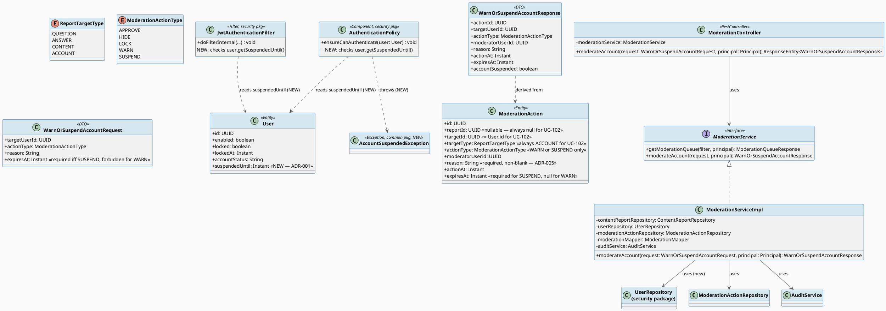
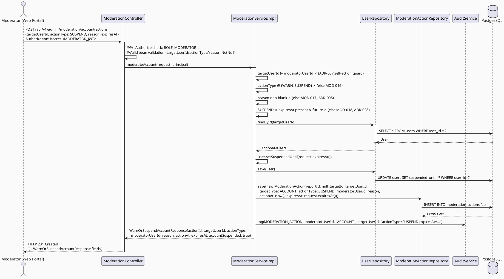
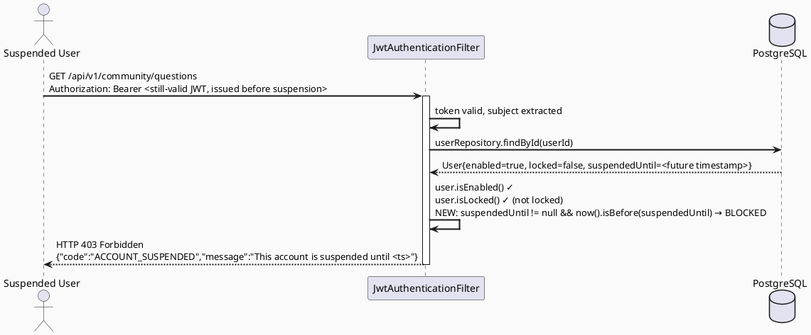
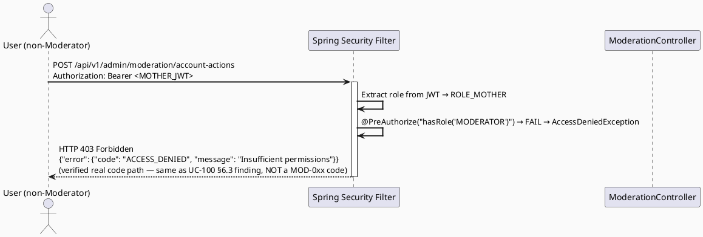

# ENGINEERING DOCUMENTATION STANDARD (EDS) v2.0
# Technical Design Specification — UC-102: Warn or Suspend Account

| Field              | Value                                   |
| ------------------ | ---------------------------------------- |
| **Document ID**    | `CB-MOD-IMP-004`                        |
| **Version**        | `1.0`                                   |
| **Date**           | `2026-07-01`                            |
| **Status**         | `Implemented`                           |
| **Document Owner** | `HuyND`                                 |
| **Author**         | `AI Agent — Winston (System Architect)` |
| **Reviewed by**    | `[ ] Pending`                           |
| **DPO Sign-off**   | `[ ] Pending` *(account-state change on a `users` row — flag for DPO awareness even though no new PII field is added)* |
| **Approved by**    | `[ ] Pending`                           |
| **Last Review**    | `2026-07-01`                            |
| **Based on EDS**   | `v2.0`                                  |

---

## CHANGELOG

| Ngày       | Người thực hiện    | Nội dung thay đổi                                                                   |
| ---------- | ------------------- | ------------------------------------------------------------------------------------ |
| 2026-07-01 | AI Agent — Winston  | Tạo tài liệu lần đầu — TDS cho UC-102 Warn or Suspend Account (Status=Draft)         |
| 2026-07-01 | AI Agent — Amelia (Dev Agent) | Phase 3: Implementation. Migration `V20260701210000__add_user_suspended_until.sql` applied; `User.suspendedUntil` field, `ReportTargetType.ACCOUNT`, `WarnOrSuspendAccountRequest`/`Response` DTOs, 6 new `ModerationException` factories (MOD-015..020), new `AccountSuspendedException` + `GlobalExceptionHandler` wiring, `ModerationServiceImpl.moderateAccount()`, `ModerationController.moderateAccount()` (`POST /account-actions`), `SecurityConfig` rule, and the ADR-003 enforcement checks in `AuthenticationPolicy.ensureCanAuthenticate()` + `JwtAuthenticationFilter.doFilterInternal()`. 24/25 WSA-TC test cases implemented and PASSING (WSA-TC-INT-003 atomicity-rollback explicitly NOT implemented — no Testcontainers/real-DB harness in this codebase, same documented gap pattern as UC-101's RES-TC-INT-004). Full regression: 0 new failures (baseline 33 pre-existing DB-dependent errors unchanged). Status → Implemented. **Not yet committed** — work is on the shared `dev` branch per repo convention it should move to `HuyND` before commit (see `.claude/rules/git-dual-remote.md`); no commit hash exists yet. |

---

## MỤC LỤC

1. [Tổng quan Module](#1-tổng-quan-module)
2. [Ma trận Truy vết](#2-ma-trận-truy-vết)
3. [Architecture Decision Records (ADR)](#3-architecture-decision-records-adr)
4. [Non-Functional Requirements & SLA](#4-non-functional-requirements--sla)
5. [Static Modeling](#5-static-modeling)
6. [Dynamic Modeling](#6-dynamic-modeling)
7. [Domain Event Catalog](#7-domain-event-catalog)
8. [Interface Specification](#8-interface-specification)
9. [API Specification](#9-api-specification)
10. [Bảng mã lỗi](#10-bảng-mã-lỗi)
11. [Quy trình Triển khai](#11-quy-trình-triển-khai)
12. [Rollback & Incident Runbook](#12-rollback--incident-runbook)
13. [Kịch bản Kiểm thử Chi tiết](#13-kịch-bản-kiểm-thử-chi-tiết)
14. [Phương pháp Xác minh](#14-phương-pháp-xác-minh)
15. [API Verification Samples](#15-api-verification-samples)
16. [Authorization Matrix](#16-authorization-matrix)
17. [AI Prompt Constraints (CASE 2.0)](#17-ai-prompt-constraints-case-20)

---

## 1. Tổng quan Module

| Field                     | Value                                                                                                                                  |
| ------------------------- | --------------------------------------------------------------------------------------------------------------------------------------- |
| **UC ID**                 | `UC-102`                                                                                                                                |
| **FS Reference**          | `3.2.2.4 Warn or Suspend Account` (`02_Requirements/SRS/3_Functional_Specification.md`)                                                |
| **Module Name**           | `Warn or Suspend Account`                                                                                                              |
| **Bounded Context**       | `content` (moderation write path, same package as UC-100/UC-99 — `com.carebridge.backend.content`) **with a required cross-cutting touchpoint into `security`** (see ADR-003) — this is the one moderation UC in this batch whose target is a `users` row, not a content item. |
| **Primary Actor**         | `Community Moderator (ROLE_MODERATOR)`                                                                                                 |
| **Platform**              | `Admin Web Portal`                                                                                                                      |
| **Priority**              | `High` (per FS — Moderation function group)                                                                                            |
| **Frequency of Use**      | `Regular`                                                                                                                                |
| **Data Classification**   | `Internal` (no new PII column; `suspended_until` is an operational/account-state timestamp)                                            |
| **Compliance Scope**      | `N/A` for new data export; account-state change is operational moderation data, not a PDPA data-subject export concern                  |
| **Upstream Dependencies** | `security (User, UserRepository, JwtAuthenticationFilter, AuthenticationPolicy)`, `content (ModerationAction, ModerationException)`, `audit (AuditService)` |
| **Downstream Consumers**  | `security` auth gates (`JwtAuthenticationFilter`, `AuthenticationPolicy`) must read the new suspension state to have any real effect — see ADR-003. `UC-101 Resolve Report` may invoke this action's underlying service method when a report's outcome is "warn"/"suspend" the reported author (out of scope to wire here — UC-101 not yet written; noted as a future integration point, not assumed). |

**Mô tả:**
UC-102 cho phép Community Moderator hành động trực tiếp trên một **tài khoản người dùng** (`users` row) — **WARN** hoặc **SUSPEND** — khi tài khoản đó vi phạm quy tắc cộng đồng. Đây là use case kiểm duyệt **duy nhất** trong cluster A có mục tiêu là `User`, không phải nội dung (`CommunityQuestion`/`CommunityAnswer`/`ContentItem`). `ReportTargetType` hiện tại (`QUESTION`/`ANSWER`/`CONTENT`) không có giá trị `ACCOUNT` — UC-102 bổ sung giá trị này (ADR-006).

**WARN** là hành động **audit-only**: ghi một dòng `ModerationAction` (`actionType=WARN`) làm bằng chứng/cảnh báo chính thức, **không** thay đổi bất kỳ trường nào trên `User` (`enabled`, `locked`, `suspended_until` đều giữ nguyên). Không có cơ chế gửi thông báo thực sự cho người dùng trong v1 (xem ADR-004).

**SUSPEND** chặn tài khoản có thời hạn (`time-bound`): ghi `ModerationAction` (`actionType=SUSPEND`, `expiresAt` bắt buộc) **và** cập nhật `User.suspendedUntil` thành cùng giá trị `expiresAt`, trong cùng transaction. Tài khoản bị chặn đăng nhập (login) và bị chặn mọi request đã xác thực (JWT) cho đến khi `suspendedUntil` trôi qua — xem ADR-001 (schema) và ADR-003 (enforcement, cross bounded-context).

**Phạm vi rõ ràng:** `ModerationActionType.APPROVE/HIDE/LOCK` (UC-100, mục tiêu content) và việc xử lý `ContentReport.status` (UC-101) đều **không** thuộc phạm vi UC-102. UC-102 chỉ chấp nhận `actionType ∈ {WARN, SUSPEND}` và `targetType = ACCOUNT` (giá trị mới, ADR-006).

---

## 2. Ma trận Truy vết

| Requirement ID | Loại          | Mô tả yêu cầu                                                                                  | Thành phần Code                                  | Compliance Target | ADR liên quan |
| --------------- | -------------- | ------------------------------------------------------------------------------------------------ | -------------------------------------------------- | ------------------- | --------------- |
| UC-102          | Use Case      | Moderator warns or suspends a user account                                                       | `ModerationController.moderateAccount()`           | —                  | ADR-002         |
| FS-3.2.2.4      | Functional    | "Warns, restricts posting, or suspends accounts that violate rules"                              | See note below — "restricts posting" out of scope | —                  | ADR-007         |
| BR-RBAC-001     | Business Rule | Chỉ MODERATOR mới được gọi endpoint account-actions                                               | `@PreAuthorize("hasRole('MODERATOR')")`            | —                  | ADR-002         |
| BR-MOD-011      | Business Rule | WARN không thay đổi bất kỳ trường nào trên `User` — audit-only                                    | `ModerationServiceImpl.moderateAccount()`          | —                  | ADR-004         |
| BR-MOD-012      | Business Rule | SUSPEND bắt buộc `expiresAt` tương lai (time-bound only, v1) và ghi `User.suspendedUntil`         | `ModerationServiceImpl.moderateAccount()`          | —                  | ADR-001, ADR-008 |
| BR-MOD-013      | Business Rule | `reason` bắt buộc non-blank cho cả WARN và SUSPEND (account-level — accountability cao hơn UC-100) | `ModerationServiceImpl.moderateAccount()`          | —                  | ADR-005         |
| BR-MOD-014      | Business Rule | Enforcement: request đã xác thực của tài khoản đang suspend phải bị từ chối 403 ngay khi `suspendedUntil` còn hiệu lực | `JwtAuthenticationFilter`, `AuthenticationPolicy` | — | ADR-003 |
| BR-MOD-015      | Business Rule | Moderator không được tự WARN/SUSPEND chính tài khoản mình                                          | `ModerationServiceImpl.moderateAccount()`          | —                  | ADR-007 (self-action guard, Accepted) |
| BR-AUDIT-001    | Business Rule | Mọi action thành công phải được audit log                                                         | `AuditService.log(MODERATION_ACTION, ...)`         | —                  | ADR-002         |

> **Note (FS-3.2.2.4 "restricts posting"):** FS liệt kê "restricts posting" như một outcome riêng biệt với WARN/SUSPEND. Không có `ModerationActionType` value hay cơ chế hạ tầng nào (ví dụ: per-endpoint posting-only block) đại diện cho "restrict posting nhưng vẫn cho phép đăng nhập/đọc" trong codebase hiện tại — chỉ có nhị phân chặn-toàn-bộ (`enabled`/`locked`, và `suspendedUntil` mới thêm). Ghi nhận **`Open`** — out of scope cho v1, giống cách UC-100 ADR-005 loại "request edits" khỏi phạm vi. SUSPEND trong tài liệu này luôn là full-account block, không phải partial posting-only restriction.

---

## 3. Architecture Decision Records (ADR)

### ADR-001 — Schema Delta: `users.suspended_until timestamptz NULL` (single-column, time-bound only)

| Field          | Value                      |
| -------------- | --------------------------- |
| **Status**     | `Proposed — needs Tech Lead/DBA confirmation` |
| **Deciders**   | `HuyND — System Architect` |
| **Date**       | `2026-07-01`                |
| **Supersedes** | —                           |

#### Bối cảnh
`users` table (`V1__init_schema.sql` line 532, plus additive columns from `V4`/`V7`) only has `enabled boolean`, `locked boolean`, `locked_at timestamptz`, `account_status varchar(30)` (a free-text string used only by the auth/registration flow: `PENDING_ACTIVATION`/`ACTIVE`/`DEACTIVATED` — verified via `grep` on `AuthServiceImpl.java`/`ForgotPasswordServiceImpl.java`/`DevDataSeeder.java`). There is **no column representing a moderation-driven, time-bound account suspension**. `ModerationAction.expiresAt` (nullable, already on the entity since UC-99's baseline) is documented in code comments as "used by UC-102 SUSPEND" but nothing on `User` consumes it today.

Critically, **`locked`/`lockedAt` cannot be reused for moderation SUSPEND**, verified by reading `AuthenticationPolicy.ensureCanAuthenticate()` (lines 19-36):
```java
if (user.isLocked()) {
    if (user.getLockedAt() != null) {
        Instant lockExpiresAt = user.getLockedAt().plusSeconds(LOCKOUT_DURATION_SECONDS); // hardcoded 15 min
        if (Instant.now().isAfter(lockExpiresAt)) {
            user.setLocked(false); user.setLockedAt(null); return; // auto-unlock
        }
    }
    throw new AccountLockedException("Account is locked");
}
```
`LOCKOUT_DURATION_SECONDS = 15 * 60` is **hardcoded** for the brute-force-lockout feature. If a moderator suspension reused `locked`+`lockedAt`, any suspension duration longer than 15 minutes would be **silently undone** the next time the user attempts to log in (auto-unlock branch fires unconditionally once 15 minutes have elapsed, with no way to express a longer, moderator-chosen duration). Additionally, `AuthServiceImpl.login()` line 329-330 sets `locked=true`/`lockedAt=now()` on **any** account that exceeds its login rate limit, and line 347-348 clears `locked=false`/`lockedAt=null` on **every successful password match** — both paths would corrupt or prematurely clear a moderation suspension if it shared the same two fields. `locked` is a `security`-domain brute-force-lockout primitive; reusing it for a `content`-domain moderation action violates the existing single-responsibility boundary and is provably unsafe, not just stylistically undesirable.

`enabled` is also unsuitable on its own: it is binary/permanent-until-explicitly-re-enabled (used today for `PENDING_ACTIVATION`→`ACTIVE` registration gating and explicit account deactivation in `AuthServiceImpl` line 875), has no time dimension, and re-enabling it after a time-bound suspension would require an external scheduled job (no such infrastructure exists in this codebase) rather than a simple "is the timestamp in the past" check.

#### Các phương án đã xem xét

| Phương án | Mô tả                                                                                          | Ưu điểm                                              | Nhược điểm                                            |
| --------- | -------------------------------------------------------------------------------------------------- | ------------------------------------------------------- | ---------------------------------------------------------- |
| A         | Reuse `users.locked`/`locked_at` for SUSPEND (indefinite via `locked=true`,`lockedAt=null`)        | No migration                                            | **Rejected — provably unsafe**: collides with the hardcoded 15-min brute-force auto-unlock and the unconditional clear-on-successful-login at `AuthServiceImpl` lines 329-330/347-348 (see Bối cảnh above) |
| B         | Reuse `users.enabled` for SUSPEND (set `false`, an admin must manually re-enable)                  | No migration                                             | Indistinguishable from a hard account disable; no auto-expiry possible without a scheduler that does not exist; conflates "moderation suspension" with "account deactivation" (`AuthServiceImpl` line 875 already uses `enabled=false` for self/admin deactivation) — loses the time-bound semantics the FS and `ModerationAction.expiresAt` both imply |
| C         | Add **two** new columns: `suspended boolean DEFAULT false NOT NULL` + `suspended_until timestamptz NULL`, supporting both indefinite (`suspended=true`,`suspended_until=null`) and time-bound suspension | Symmetric with `ModerationAction.expiresAt` nullable semantics; supports indefinite suspend | Larger schema delta than needed for what is actually sourced; FS does not state an indefinite-duration requirement; introduces a second column whose invariant (`suspended_until` only meaningful when `suspended=true`) must be maintained entirely in application code |
| D         | Add **one** new column: `suspended_until timestamptz NULL` on `users`. `NULL` = not suspended. Non-null = suspended until that timestamp. **SUSPEND requires an explicit, validated future `expiresAt` in v1 — indefinite suspension is out of scope** (see ADR-008) | Smallest schema delta that satisfies the sourced requirement (time-bound suspension, paired 1:1 with `ModerationAction.expiresAt`); no extra boolean/invariant to maintain; unambiguous (`NULL` only ever means "not suspended") | Cannot express "suspend indefinitely" without a follow-up enhancement (flagged `Open`, ADR-008) |

#### Quyết định
Chọn **Phương án D**. New Flyway migration:

```sql
-- V20260701120000__add_user_suspended_until.sql
ALTER TABLE public.users
    ADD COLUMN IF NOT EXISTS suspended_until timestamptz NULL;
```

`User.java` gets one new field:
```java
@Column(name = "suspended_until")
private Instant suspendedUntil;
```

Semantics (enforced by service, not a DB constraint — consistent with how `account_status`/`enabled`/`locked` are already enforced purely in application code, no CHECK constraints found on `users` for these columns):
- `suspendedUntil == null` → account not currently suspended via moderation.
- `suspendedUntil != null && suspendedUntil.isAfter(Instant.now())` → currently suspended, blocks login + all authenticated requests (ADR-003).
- `suspendedUntil != null && !suspendedUntil.isAfter(Instant.now())` → suspension has lapsed; treated as **not** suspended by every read-path check (no automatic DB write-back required — see ADR-003 for why this is a deliberate departure from the `lockedAt` auto-unlock-on-write pattern).

#### Hệ quả

**Tích cực:**
- Time-bound suspension finally has a real, dedicated, collision-free representation; `ModerationAction.expiresAt` (already on the entity) is no longer a dead/unused field for this UC.
- Smallest schema delta that satisfies the sourced requirement; no second column/invariant to maintain.
- Additive-only migration (`ADD COLUMN IF NOT EXISTS`), matches the project convention already used in `V4`/`V7` for other `users` column additions — Flyway-safe, never modifies an applied migration.

**Tiêu cực / Trade-offs:**
- Indefinite suspension is explicitly **not** supported in v1 (ADR-008) — flagged `Open`, needs Product confirmation on whether it's actually required; if so, a follow-up migration adding a `suspended` boolean (Option C above) is the documented fallback, not a silent reuse of `locked`/`enabled`.

**Compliance Impact:** N/A — no new PII, `suspended_until` is an operational moderation-state timestamp.

---

### ADR-002 — RBAC Enforcement at Controller Layer (same pattern as UC-100 ADR-002)

| Field        | Value                      |
| ------------ | --------------------------- |
| **Status**   | `Accepted`                 |
| **Deciders** | `HuyND — System Architect` |
| **Date**     | `2026-07-01`                |

#### Quyết định
`@PreAuthorize("hasRole('MODERATOR')")` on a new `moderateAccount()` method on the **same** `ModerationController` class (not a new controller — keeps the established `content` package convention from UC-99/UC-100). Add a matching `SecurityConfig` rule:
```java
.requestMatchers(HttpMethod.POST, "/api/v1/admin/moderation/account-actions").hasRole("MODERATOR")
```
There is **no `RoleHierarchy` bean** in `SecurityConfig.java` (verified — same finding as UC-100 ADR-002/§16) — `SYSTEM_ADMIN` does **not** implicitly gain access to this endpoint either. After a successful action, `AuditService.log(AuditAction.MODERATION_ACTION, moderatorUserId, "ACCOUNT", targetUserId.toString(), details)` is called, reusing the existing enum value (same as UC-100 ADR-003 — no new `AuditAction` value needed).

#### Hệ quả
Same as UC-100 ADR-002: controller stays thin (`@Valid` + delegate only); consistent, auditable, least-privilege.

---

### ADR-003 — Suspension Enforcement Crosses into the `security` Bounded Context (the central cross-cutting decision)

| Field          | Value                      |
| -------------- | --------------------------- |
| **Status**     | `Proposed — needs security-domain-owner review` |
| **Deciders**   | `HuyND — System Architect` |
| **Date**       | `2026-07-01`                |
| **Supersedes** | —                           |

#### Bối cảnh
UC-100's ADR-001 established the rule "an action without a corresponding state mutation on the actual gating mechanism is a ghost action with no real effect." That lesson applies even more sharply here: writing `User.suspendedUntil` from `ModerationServiceImpl` (in `content`) has **zero effect** unless something in `security` actually reads it. Unlike UC-100 (where the gate — `CommunityFeedServiceImpl` read filters — already lived in the same `community` package being touched), UC-102's gate lives in a **different bounded context** (`security`) that `content` does not otherwise depend on for writes. This is the one real package-boundary-crossing decision in this batch and must not be left implicit.

Grep for every existing `isLocked()`/`isEnabled()` read site (the closest analogous "is this account blocked" checks) found exactly four touchpoints:

| # | File | What it does today | UC-102 action needed |
| - | ---- | ------------------- | ---------------------- |
| 1 | `security/jwt/JwtAuthenticationFilter.java` (lines 74-81) | Per-request gate: rejects `enabled=false` (403 `ACCOUNT_DISABLED`) and `locked=true` (403 `ACCOUNT_LOCKED`) on **every** authenticated API call | **Required** — add a third check, `suspendedUntil != null && Instant.now().isBefore(suspendedUntil)` → 403 `ACCOUNT_SUSPENDED`. This is the primary, load-bearing enforcement point — without it, an already-issued JWT lets a suspended user keep calling the API indefinitely. |
| 2 | `security/policy/AuthenticationPolicy.ensureCanAuthenticate()` (lines 19-36), called from `AuthServiceImpl.login()` line 324 | Login-time gate: rejects disabled/locked accounts before password check | **Required** — add the same suspension check here so a suspended user gets a clear `ACCOUNT_SUSPENDED` error at login instead of obtaining a token that then fails on every subsequent call via touchpoint #1. |
| 3 | `security/service/impl/AuthServiceImpl.getProfile()` (line 802) | Ad-hoc inline `if (user.isLocked())` check, unrelated to the login/JWT flow (profile-view guard) | **Not extended in v1** — narrow, pre-existing, single-purpose check; flagged `Open` for a human reviewer to decide whether profile-view should also be suspension-gated, since touchpoint #1 already blocks the HTTP call before this method is reached in the normal authenticated flow (`getProfile` is itself behind the JWT filter). Listed here for completeness, not silently assumed covered. |
| 4 | `security/service/impl/CustomUserDetailsServiceImpl.loadUserByUsername()` | Builds a Spring Security `UserDetails` with `isEnabled()`/`accountNonLocked` flags | **Not extended** — verified via `grep -rln "CustomUserDetailsService"` that this class and its interface have **no callers anywhere** in the codebase outside their own declarations. The active auth flow (`AuthServiceImpl.login()`) does manual password verification, not Spring's `DaoAuthenticationProvider`/`UserDetailsService` flow. This class appears vestigial for the current JWT-based auth path. Flagged `Open` — no action proposed unless a future Spring-managed login path is introduced; do not silently wire it on the assumption it's load-bearing. |

This touchpoint list was produced by `grep -rn "isLocked\|isEnabled"` across the backend module on 2026-07-01 — it is **not guaranteed exhaustive** against future code changes; a human reviewer should re-grep before merge.

#### Quyết định
Implement enforcement at touchpoints **#1 and #2 only** (the two load-bearing gates — per-request and login-time). Touchpoints #3 and #4 are explicitly listed as `Open`/out-of-scope with the reasoning above, not silently ignored. New `AccountSuspendedException` (in `common/exception/`, mirroring the existing `AccountDisabledException`/`AccountLockedException` pattern exactly) is thrown by `AuthenticationPolicy`; `JwtAuthenticationFilter` writes the 403 directly via its existing `writeError(...)` helper (same style as its `ACCOUNT_DISABLED`/`ACCOUNT_LOCKED` branches). `GlobalExceptionHandler` gets one new `@ExceptionHandler(AccountSuspendedException.class)` returning `HttpStatus.FORBIDDEN`, code `ACCOUNT_SUSPENDED` — copy of the existing `handleAccountLocked()` method.

**Lazy/computed check, no write-back in the hot path:** unlike `AuthenticationPolicy`'s existing `lockedAt` auto-unlock branch (which **writes** `locked=false`/`lockedAt=null` back to the DB the moment it detects an expired lock — see lines 28-31), the suspension check is a **pure read-only comparison** (`suspendedUntil.isAfter(Instant.now())`). When a suspension has lapsed, the request is simply allowed through; `suspendedUntil` is **not** cleared back to `null`. This is a deliberate departure: the per-request `JwtAuthenticationFilter` runs on every single authenticated call, and writing to `users` on every request whose suspension has merely expired would add unnecessary write load and an UPDATE inside a hot, latency-sensitive path. The trade-off is that `suspendedUntil` retains a stale past timestamp after expiry (harmless — it never blocks anything once it's in the past, and it gives a human reviewer a quick "was this account ever suspended, and until when" signal without needing a separate history table). If a moderator later wants to look up "expired suspensions," `moderation_actions` (the append-only audit trail) remains the authoritative history, not `users.suspended_until`.

#### Hệ quả

**Tích cực:**
- Suspension actually blocks both login and active sessions — not a ghost action.
- No extra DB write on the hot per-request path.
- Touchpoints #3/#4 are explicitly surfaced for review rather than silently left inconsistent or silently "fixed" beyond this UC's stated scope.

**Tiêu cực / Trade-offs:**
- `security` package now has a one-way read dependency on a `content`-domain business outcome (`User.suspendedUntil` is written by `ModerationServiceImpl` in `content`, read by `JwtAuthenticationFilter`/`AuthenticationPolicy` in `security`). This is acceptable because the column lives on `User` itself (no cross-package entity coupling), but it is a **package-by-domain boundary note** worth flagging to the architecture owner — CLAUDE.md's package-by-domain guidance does not explicitly forbid one domain's write being read by another's gate (it already happens for `enabled`/`locked`), but a human reviewer should confirm this is acceptable for moderation-driven suspension too.
- Touchpoints #3/#4 remain unaddressed; if a future audit finds a suspended user can still view their own profile via touchpoint #3 in some code path that bypasses the JWT filter, that is a known, documented gap, not a missed one.

**Compliance Impact:** N/A.

---

### ADR-004 — WARN is Audit-Only: No `User` Mutation, No Notification Delivery in v1

| Field        | Value                      |
| ------------ | --------------------------- |
| **Status**   | `Accepted`                 |
| **Deciders** | `HuyND — System Architect` |
| **Date**     | `2026-07-01`                |

#### Bối cảnh
Per the task's explicit instruction and the absence of any "warning count"/"strikes" field anywhere on `User` or any other table (verified — no `warning_count`/`strikes` column exists in `V1__init_schema.sql` or any later migration), WARN cannot accumulate toward an automatic future suspension threshold in v1; it is a standalone, auditable record. A `NotificationService` exists (`notification/service/NotificationService.java`, method `send(SendNotificationRequest)`), which is a plausible future integration point for delivering the warning to the user (e.g., in-app or push), but no FS/BR source specifies a channel, template, or delivery SLA for this UC.

#### Quyết định
`moderateAccount()` with `actionType=WARN`: insert one `ModerationAction` row (`targetId=targetUserId`, `targetType=ACCOUNT`, `actionType=WARN`, `reason`, `expiresAt=null`), call `AuditService.log(MODERATION_ACTION, ...)`, and return. **No** `User` entity is loaded for mutation purposes (it is still loaded read-only, to validate `targetUserId` exists — MOD-015 if not). Sending an actual notification to the warned user is marked **`Open`** — out of scope for v1; if required, a future change would call `NotificationService.send(...)` from this same service method, not invented here without a sourced template/channel decision.

#### Hệ quả
**Tích cực:** No accidental account-state side effects from what the FS frames as a softer, non-blocking action. Smallest scoped change.
**Tiêu cực:** A warned user receives no actual in-product signal in v1 — only an internal audit trail visible to moderators/admins. Flagged `Open` for Product to confirm whether this is acceptable for launch.

---

### ADR-005 — `reason` Required (non-blank) for Both WARN and SUSPEND

| Field        | Value                      |
| ------------ | --------------------------- |
| **Status**   | `Accepted (design decision — not a sourced FS/BR fact, same caveat as UC-100 ADR-006)` |
| **Deciders** | `HuyND — System Architect` |
| **Date**     | `2026-07-01`                |

#### Bối cảnh
UC-100 ADR-006 made `reason` optional for APPROVE (a content-restoring action) but mandatory for HIDE/LOCK. UC-102 has no "restoring" action analogous to APPROVE — both WARN and SUSPEND are punitive actions against a person's account standing, which carries higher accountability stakes than hiding a single post. No FS/BR source states this explicitly; it is a design decision, flagged the same way UC-100 flagged ADR-006.

#### Quyết định
`reason` is required, non-blank, for **both** `WARN` and `SUSPEND` at this endpoint. Violation → `ModerationException` `MOD-017` (400).

#### Hệ quả
**Tích cực:** Every account-level punitive action is explainable/auditable — directly supports a future appeals process (out of scope to build here, but the data is captured).
**Tiêu cực:** Slightly stricter than UC-100's APPROVE carve-out; flagged `Open` for Tech Lead/Product to confirm this stricter posture is correct.

---

### ADR-006 — New `ReportTargetType.ACCOUNT` Enum Value

| Field        | Value                      |
| ------------ | --------------------------- |
| **Status**   | `Accepted`                 |
| **Deciders** | `HuyND — System Architect` |
| **Date**     | `2026-07-01`                |

#### Bối cảnh
`ReportTargetType` (QUESTION/ANSWER/CONTENT) is used by both `ContentReport.targetType` and `ModerationAction.targetType`. Neither `content_reports.target_type` nor `moderation_actions.target_type` has a database `CHECK` constraint (verified — `grep -n "CHECK"` against `V1__init_schema.sql` finds CHECK constraints on `community_questions`/`community_answers`/`audit_logs`/`otp_verifications`/`security_events` but **not** on `content_reports`/`moderation_actions`; both columns are plain `character varying(30)`). Adding a new Java enum constant is therefore **migration-free** for this column.

#### Quyết định
Add `ACCOUNT` to `ReportTargetType`. `ModerationAction` rows created by this UC always carry `targetType=ACCOUNT`, `targetId=<the user's id>`. This is a deliberate widening of a shared enum: it also means a future `ContentReport` could nominally carry `targetType=ACCOUNT` (i.e., "report this user," not "report this post") — that is a plausible, even likely, future use of the same enum value, but **building report-an-account flows is explicitly out of scope for UC-102** (UC-99's queue/UC-101's resolution flow would need their own review if/when that happens). Not building it now; just noting the enum is shared and the widening is intentional, not an accidental side effect.

#### Hệ quả
**Tích cực:** No migration; reuses the existing shared vocabulary instead of inventing a parallel `AccountTargetType` enum.
**Tiêu cực:** `ReportTargetType` now mixes "thing a report can point at" and "thing a moderation action can point at" semantics slightly more loosely than before — acceptable, flagged for awareness.

---

### ADR-007 — Self-Action Guard (Moderator Cannot WARN/SUSPEND Their Own Account) — and "Restricts Posting" Exclusion

| Field        | Value                      |
| ------------ | --------------------------- |
| **Status**   | `Accepted — resolved by project-analysis default (safe, low-cost, reversible; not sourced from FS/BR)` |
| **Deciders** | `HuyND — System Architect` |
| **Date**     | `2026-07-01`                |

#### Bối cảnh
No FS/BR source states whether a moderator can target their own account. Given the safety stakes (a moderator could lock themselves — or, more concerning, abuse the endpoint against their own account to fabricate an alibi, or simply fat-finger their own `userId`), a self-action guard is a common, low-cost safety rule in comparable systems, but it is **not derivable from any cited source**.

Separately, FS-3.2.2.4's "restricts posting" outcome (distinct from WARN/SUSPEND) has no `ModerationActionType` or infrastructure representation (see §2 note) — grouped here for consolidated visibility alongside the other "design decision, not sourced fact" items in this TDS.

#### Quyết định
**Accepted.** Adding the guard: if `targetUserId == moderatorUserId` (derived from `principal` via `SecurityUtils.requireCurrentUserId`), reject with `ModerationException` `MOD-020` (400) before any other validation. Resolved via project analysis rather than left open: the guard has near-zero implementation/maintenance cost, closes an obvious operator-error/abuse vector, and is trivially reversible (delete the check + its test) if Product later decides self-action should be allowed — the asymmetry between "cheap to add now" and "cheap to remove later" favors keeping it in v1 rather than shipping the gap.

"Restricts posting" (partial, non-account-wide restriction) remains **out of scope** for v1 — same reasoning as UC-100 ADR-005's "request edits" exclusion: no enum value, no posting-scoped enforcement infrastructure exists.

#### Hệ quả
**Tích cực:** Cheap safety net against an obvious operator-error/abuse class; reversible if Product objects.
**Tiêu cực:** Adds one more not-explicitly-sourced rule — flagged as a project-analysis default, not a sourced requirement, in case Product wants to override it before GA.

---

### ADR-008 — Indefinite Suspension Deferred (SUSPEND Requires an Explicit Future `expiresAt` in v1)

| Field        | Value                      |
| ------------ | --------------------------- |
| **Status**   | `Accepted (paired with ADR-001 Option D)` |
| **Deciders** | `HuyND — System Architect` |
| **Date**     | `2026-07-01`                |

#### Bối cảnh
See ADR-001 — the single-column `suspended_until` design cannot distinguish "not suspended" from "suspended forever" without a sentinel value or a second boolean column. No FS/BR source requires indefinite suspension; `ModerationAction.expiresAt` being nullable elsewhere (e.g., conceptually for other action types) does not, by itself, mandate that SUSPEND support a null/indefinite case here.

#### Quyết định
`SUSPEND` requests **must** include `expiresAt`, validated to be strictly after `Instant.now()` at request time. Omitting it, or supplying a past/now timestamp, is rejected with `ModerationException` `MOD-018` (400). There is currently no way to suspend a user indefinitely through this endpoint.

#### Hệ quả
**Tích cực:** Matches ADR-001 Option D's smaller schema delta; unambiguous semantics (`suspended_until == null` always means "not suspended," never "suspended forever").
**Tiêu cực:** If Product later requires indefinite suspension (e.g., for severe/repeat violations), this requires a follow-up migration (Option C from ADR-001 — add a `suspended boolean` column) plus changes to this service method and `JwtAuthenticationFilter`/`AuthenticationPolicy`. Flagged `Open` for Product to confirm whether this gap is acceptable for launch, or whether ADR-001 should be revisited to Option C before implementation starts.

---

## 4. Non-Functional Requirements & SLA

### 4.1. Performance & Availability

| Category     | Requirement                 | Target SLA  | Measurement Method | Compliance Basis |
| ------------ | ---------------------------- | ----------- | -------------------- | ------------------- |
| Latency      | API response (p99), `POST /account-actions` | `Open` — no sourced SLA; recommend reuse of UC-99/UC-100's `< 300ms` baseline, needs Tech Lead confirmation | k6 load test          | — |
| Latency      | Per-request suspension check added to `JwtAuthenticationFilter` (touchpoint #1) | `Open` — single in-memory comparison (`Instant.isAfter`), expected negligible (< 1ms); no sourced budget | Code review + APM     | — |
| Availability | Uptime (monthly)             | `Open` — reuse UC-99/UC-100's `99.5%` baseline | Uptime monitor        | — |
| Concurrency  | Two moderators WARN/SUSPEND-ing the same `targetUserId` concurrently | `Open` — no optimistic locking designed in v1, same posture as UC-100 ADR-006; last-write-wins on `suspended_until` | Code review            | — |

### 4.2. Data Integrity & Retention

| Category   | Requirement                                                              | Target                | Verification Method | Compliance Basis |
| ---------- | ------------------------------------------------------------------------- | ------------------------ | ---------------------- | ------------------- |
| Append-only | `moderation_actions` never UPDATEd/DELETEd by this UC                   | 0 UPDATE/DELETE ops       | Code review + `pg_stat_user_tables` (§14.1) | — |
| Atomicity  | `User.suspendedUntil` update + `ModerationAction` insert + audit log all in 1 transaction (SUSPEND only) | All-or-nothing            | Integration test (rollback scenario, mirrors UC-100 MOD-TC-INT-002) | — |
| WARN purity | WARN never mutates any `User` column                                    | 100%                      | Unit test assertion (negative test) | ADR-004 |
| `targetType` separation | `ModerationAction.targetType` is always `ACCOUNT` for rows created here | 100%                      | Unit test assertion    | ADR-006 |

### 4.3. Security

| Category        | Requirement                                                  | Target          | Verification Method | Compliance Basis |
| ---------------- | --------------------------------------------------------------- | ------------------ | ----------------------- | ------------------- |
| Encryption in transit | All endpoints                                              | TLS 1.3+            | SSL Labs scan            | — |
| Access control   | MODERATOR role only (no implicit SYSTEM_ADMIN bypass — verified, same as UC-100) | Least privilege     | Auth Matrix (§16)        | — |
| Enforcement correctness | A live JWT for a now-suspended user must be rejected on its very next request | 100% (no stale-session window beyond normal request latency) | Integration test (§13.3) | ADR-003 |
| Input validation | `targetUserId` must be a valid UUID resolving to an existing `users` row before any mutation | 100% reject unknown targets | Unit + integration test | — |
| Self-action guard | Moderator cannot target own `userId` (ADR-007, Accepted)        | 100% if accepted    | Unit test               | ADR-007 |

### 4.4. Scalability

Không có dữ liệu tải cụ thể nguồn gốc (`Open`). Giả định tải tương tự UC-99/UC-100 (5-10 moderators concurrent, nội bộ admin tool) — cần xác nhận.

---

## 5. Static Modeling

### 5.1. Class Diagram (PlantUML)



### 5.2. Data Structure — Schema Delta Required (ADR-001)

> **New Flyway migration required** — see ADR-001. This is the **only** UC in the Cluster A moderation
> batch (UC-100/UC-101/UC-102) that needs a schema change; UC-100 explicitly needed none.

```sql
-- File: V20260701120000__add_user_suspended_until.sql
-- (timestamp-based naming per dossier §6.3 — later than the current latest
--  V20260629000002__create_community_answer_likes.sql)

ALTER TABLE public.users
    ADD COLUMN IF NOT EXISTS suspended_until timestamptz NULL;

COMMENT ON COLUMN public.users.suspended_until IS
    'Moderation-driven time-bound account suspension (UC-102). NULL = not suspended. '
    'Non-null = suspended until this timestamp. Decoupled from locked/locked_at '
    '(security-domain brute-force lockout — see UC-102 TDS ADR-001) and from enabled '
    '(permanent account disable/deactivation).';
```

```java
// User.java — add one field (no change to existing fields)
@Column(name = "suspended_until")
private Instant suspendedUntil;
```

> **CG-9 sync note:** `V1__init_schema.sql` is the schema source of truth baseline and is **never
> modified** for an already-applied migration (per CLAUDE.md). The new column is documented here and
> will land via the new `V2026...` migration file above, exactly the same additive pattern already used
> by `V4__auth_password_reset_audit_fix.sql` (`email_verified`) and
> `V7__entity_schema_sync.sql` (`account_status`) for this same `users` table — verified by reading
> both files, not assumed.

---

## 6. Dynamic Modeling

### 6.1. Sequence Diagram — Happy Path (SUSPEND a user, time-bound)



### 6.2. Sequence Diagram — Enforcement (suspended user's next API call is rejected)



### 6.3. Sequence Diagram — Error Path (Unauthorized — non-MODERATOR)



### 6.4. Action × Field Behavior Matrix

| actionType | `User.suspendedUntil` mutated? | `ModerationAction.expiresAt` | `reason` | Enforcement effect |
| ---------- | ------------------------------- | ------------------------------ | --------- | -------------------- |
| `WARN`     | ❌ Never (ADR-004)              | always `null`                  | required (ADR-005) | None — audit-only |
| `SUSPEND`  | ✅ Set to `request.expiresAt()` | mirrors `request.expiresAt()`, required (ADR-008) | required (ADR-005) | Blocks login + all authenticated requests until `expiresAt` (ADR-003) |
| `APPROVE`/`HIDE`/`LOCK` | N/A — rejected at this endpoint, `MOD-016` (belongs to UC-100) | — | — | — |

**Oracle for this matrix:** `security/entity/User.java`, `security/policy/AuthenticationPolicy.java`, `security/jwt/JwtAuthenticationFilter.java`, `content/entity/ModerationAction.java`, `content/entity/ModerationActionType.java` — read directly, not inferred from FS prose.

---

## 7. Domain Event Catalog

### 7.1. Events Published (Phát ra)

| Event Name              | Trigger                                 | Publisher                | Subscriber(s)  | Payload Schema | Async?          |
| ------------------------ | ------------------------------------------ | --------------------------- | ----------------- | ---------------- | ------------------ |
| (none — see note)        | —                                          | —                            | —                  | —                 | —                  |

> **Open:** Same finding as UC-100 §7.1 — no `ApplicationEventPublisher` usage exists anywhere in `content`
> or `security` for moderation-style state changes. UC-102 follows the same synchronous `AuditService.log()`
> pattern. A future `AccountSuspended`/`AccountWarned` domain event (e.g., to trigger a real notification
> via `NotificationService`, addressing ADR-004's Open item) is a future ADR, not part of this TDS.

### 7.2. Events Consumed (Tiêu thụ)

| Event Name | Source | Handler | Action thực hiện |
| ----------- | -------- | --------- | ------------------- |
| (none)      | —        | —          | —                    |

### 7.3. Payload Schema

N/A — no domain event introduced (see §7.1).

---

## 8. Interface Specification

### 8.1. Service Interface

```java
// com.carebridge.backend.content.service.ModerationService
// @version 1.2 — adds moderateAccount() (UC-102); getModerationQueue() (UC-99) and the (separately
// specced) moderateContent() (UC-100) unchanged.

package com.carebridge.backend.content.service;

public interface ModerationService {

    ModerationQueueResponse getModerationQueue(ModerationQueueFilter filter, Principal principal);

    /**
     * Applies a WARN or SUSPEND action to a user account.
     * WARN is audit-only and never mutates the User entity (ADR-004).
     * SUSPEND requires a future expiresAt and sets User.suspendedUntil to that value (ADR-001, ADR-008),
     * which JwtAuthenticationFilter / AuthenticationPolicy enforce on every subsequent login/request (ADR-003).
     * Records an append-only ModerationAction with reportId = null, targetType = ACCOUNT (ADR-006).
     *
     * @throws ModerationException (MOD-015) if targetUserId does not resolve to an existing users row
     * @throws ModerationException (MOD-016) if actionType is not WARN or SUSPEND (APPROVE/HIDE/LOCK belong to UC-100)
     * @throws ModerationException (MOD-017) if reason is blank for WARN or SUSPEND (ADR-005)
     * @throws ModerationException (MOD-018) if actionType=SUSPEND and expiresAt is missing or not strictly in the future (ADR-008)
     * @throws ModerationException (MOD-019) if actionType=WARN and expiresAt is non-null (ambiguous request)
     * @throws ModerationException (MOD-020) if targetUserId equals the acting moderator's own user id (ADR-007, Accepted)
     */
    WarnOrSuspendAccountResponse moderateAccount(WarnOrSuspendAccountRequest request, Principal principal);
}
```

### 8.2. Repository Interfaces

```java
// com.carebridge.backend.security.repository.UserRepository — existing, unchanged.
// findById(UUID) already available via JpaRepository<User, UUID> — sufficient for this UC
// (no new finder method required; targetUserId lookup is a direct PK fetch).

// com.carebridge.backend.content.repository.ModerationActionRepository — existing, unchanged.
// save() from JpaRepository is sufficient (same as UC-100 §8.2).
```

### 8.3. DTO Definitions

```java
// WarnOrSuspendAccountRequest.java — new
// com.carebridge.backend.content.dto.request
public record WarnOrSuspendAccountRequest(
        @NotNull UUID targetUserId,
        @NotNull ModerationActionType actionType,   // business-rule restricted to WARN|SUSPEND in service (MOD-016)
        String reason,                                // business-rule required non-blank for both (MOD-017, ADR-005)
        Instant expiresAt                             // required iff SUSPEND (MOD-018), forbidden for WARN (MOD-019)
) {}

// WarnOrSuspendAccountResponse.java — new
// com.carebridge.backend.content.dto.response
public record WarnOrSuspendAccountResponse(
        UUID actionId,
        UUID targetUserId,
        ModerationActionType actionType,
        UUID moderatorUserId,
        String reason,
        Instant actionAt,
        Instant expiresAt,           // null for WARN
        boolean accountSuspended     // true iff actionType=SUSPEND (mirrors resultingStatus pattern from UC-100,
                                      // but boolean here since User has no multi-value "status" enum to echo)
) {}
```

---

## 9. API Specification

### 9.1. Endpoints Table

| Method | Path                                          | Auth Level | Required Roles   | Rate Limit | Idempotent? |
| ------ | ----------------------------------------------- | ------------ | ------------------- | ------------ | -------------- |
| `POST` | `/api/v1/admin/moderation/account-actions`      | JWT Bearer   | `ROLE_MODERATOR`    | `Open` — no sourced value, recommend reuse of UC-99/UC-100's 120/min baseline | No (each call creates a new `ModerationAction` row; repeated SUSPEND calls overwrite `suspended_until` — last-write-wins, same posture as UC-100 ADR-006) |

> **Style note:** Same controller, same convention as UC-100 — `ModerationController`'s precedent
> (`getQueue()` returns the DTO directly, no `ApiResponse<T>` wrapper) is followed here too: this endpoint
> returns `WarnOrSuspendAccountResponse` directly, not wrapped.
>
> **Endpoint naming:** A separate path (`/account-actions`, not `/actions`) is used rather than overloading
> UC-100's `/actions` endpoint with a `targetType=ACCOUNT` branch, because the request shape is
> meaningfully different (`targetUserId` directly, no `ReportTargetType` field on the request DTO — the
> `ACCOUNT` enum value is implied by which endpoint was called, not supplied by the caller) and because
> UC-100's ADR-004 already established that `ModerationController.moderateContent()` explicitly rejects
> `targetType=CONTENT`/`actionType ∈ {WARN,SUSPEND}` as **out of its scope** — keeping a fully separate
> endpoint for account actions is consistent with, not contradictory to, that existing decision.

### 9.2. Request / Response Schemas

#### `POST /api/v1/admin/moderation/account-actions`

**Request Body (SUSPEND, time-bound):**
```json
{
  "targetUserId": "550e8400-e29b-41d4-a716-446655440010",
  "actionType": "SUSPEND",
  "reason": "Vi phạm lặp lại quy tắc cộng đồng sau cảnh báo trước đó",
  "expiresAt": "2026-07-15T00:00:00.000Z"
}
```

**Response — 201 Created (SUSPEND happy path):**
```json
{
  "actionId": "660e8400-e29b-41d4-a716-446655440099",
  "targetUserId": "550e8400-e29b-41d4-a716-446655440010",
  "actionType": "SUSPEND",
  "moderatorUserId": "770e8400-e29b-41d4-a716-446655440002",
  "reason": "Vi phạm lặp lại quy tắc cộng đồng sau cảnh báo trước đó",
  "actionAt": "2026-07-01T10:15:00.000Z",
  "expiresAt": "2026-07-15T00:00:00.000Z",
  "accountSuspended": true
}
```

**Request Body (WARN):**
```json
{
  "targetUserId": "550e8400-e29b-41d4-a716-446655440010",
  "actionType": "WARN",
  "reason": "Ngôn từ không phù hợp trong câu trả lời, lần đầu vi phạm"
}
```

**Response — 201 Created (WARN happy path):**
```json
{
  "actionId": "660e8400-e29b-41d4-a716-446655440100",
  "targetUserId": "550e8400-e29b-41d4-a716-446655440010",
  "actionType": "WARN",
  "moderatorUserId": "770e8400-e29b-41d4-a716-446655440002",
  "reason": "Ngôn từ không phù hợp trong câu trả lời, lần đầu vi phạm",
  "actionAt": "2026-07-01T10:20:00.000Z",
  "expiresAt": null,
  "accountSuspended": false
}
```

**Response — 400 Bad Request (actionType not supported — MOD-016):**
```json
{ "error": { "code": "MOD-016", "message": "Action type APPROVE is not supported by this endpoint — use POST /api/v1/admin/moderation/actions (UC-100)" } }
```

**Response — 400 Bad Request (reason required — MOD-017):**
```json
{ "error": { "code": "MOD-017", "message": "reason is required for action type SUSPEND" } }
```

**Response — 400 Bad Request (expiresAt missing/past for SUSPEND — MOD-018):**
```json
{ "error": { "code": "MOD-018", "message": "expiresAt is required and must be in the future for action type SUSPEND" } }
```

**Response — 400 Bad Request (expiresAt supplied for WARN — MOD-019):**
```json
{ "error": { "code": "MOD-019", "message": "expiresAt must not be provided for action type WARN" } }
```

**Response — 400 Bad Request (self-action — MOD-020, per ADR-007 (Accepted)):**
```json
{ "error": { "code": "MOD-020", "message": "Moderators cannot warn or suspend their own account" } }
```

**Response — 404 Not Found (target user not found — MOD-015):**
```json
{ "error": { "code": "MOD-015", "message": "Target user with id 550e8400-e29b-41d4-a716-446655440010 not found" } }
```

**Response — 401 Unauthorized (Missing/Invalid JWT):**
```json
{}
```
> Body is empty — same verified finding as UC-100 §9.2 (`HttpStatusEntryPoint`, no JSON envelope).

**Response — 403 Forbidden (Wrong Role):**
```json
{ "error": { "code": "ACCESS_DENIED", "message": "Insufficient permissions" } }
```

**Response — 403 Forbidden (suspended user calling ANY authenticated endpoint, including this one if they were somehow MODERATOR — enforcement, not this endpoint's own business logic):**
```json
{ "code": "ACCOUNT_SUSPENDED", "message": "This account is suspended until 2026-07-15T00:00:00Z" }
```
> Written directly by `JwtAuthenticationFilter`'s existing `writeError(...)` helper — same shape as the
> existing `ACCOUNT_DISABLED`/`ACCOUNT_LOCKED` bodies it already produces (verified in code), not the
> `{"error": {...}}` envelope used by `GlobalExceptionHandler`-routed exceptions. This inconsistency
> (filter writes `{"code":...}` directly; `GlobalExceptionHandler` wraps in `{"error": {...}}`) **already
> exists today** for `ACCOUNT_DISABLED`/`ACCOUNT_LOCKED` — UC-102 reproduces the existing pattern exactly
> rather than inventing a new envelope shape for just this one case.

**Response — 500 Internal Server Error:**
```json
{ "error": { "code": "INTERNAL_ERROR", "message": "An unexpected error occurred" } }
```
> Same verified fallback as UC-100 §9.2 — `ModerationException.internalError()` (`MOD-005`) remains dead
> code; unhandled exceptions fall through to `GlobalExceptionHandler.handleGeneric()`.

---

## 10. Bảng mã lỗi

| Code         | HTTP Status | Message (EN)                                       | Message (VI)                                  | Trigger Condition                                                                 | Status in code |
| ------------- | ------------- | ----------------------------------------------------- | ------------------------------------------------ | ------------------------------------------------------------------------------------ | ----------------- |
| `MOD-015`    | 404           | Target user not found                                | Không tìm thấy tài khoản mục tiêu               | `targetUserId` does not resolve to an existing `users` row                           | **New — to implement** |
| `MOD-016`    | 400           | Action type not supported by this endpoint            | Loại hành động không được hỗ trợ tại endpoint này | `actionType ∉ {WARN, SUSPEND}` (APPROVE/HIDE/LOCK belong to UC-100)                  | **New — to implement** |
| `MOD-017`    | 400           | Reason required for this action                       | Cần nhập lý do cho hành động này                | `reason` blank/null for WARN or SUSPEND (ADR-005)                                    | **New — to implement** |
| `MOD-018`    | 400           | expiresAt required and must be in the future for SUSPEND | Cần nhập thời điểm hết hạn (trong tương lai) cho SUSPEND | `actionType=SUSPEND` and `expiresAt` missing, null, or not strictly after now (ADR-008) | **New — to implement** |
| `MOD-019`    | 400           | expiresAt must not be provided for WARN                | Không được nhập thời điểm hết hạn cho WARN      | `actionType=WARN` and `expiresAt` is non-null                                        | **New — to implement** |
| `MOD-020`    | 400           | Moderators cannot act on their own account             | Người kiểm duyệt không thể tự cảnh báo/khóa chính mình | `targetUserId == moderatorUserId` (ADR-007 — **Accepted**, resolved as a safe project-analysis default; reversible if Product objects) | **New — to implement** |
| `ACCOUNT_SUSPENDED` | 403     | This account is suspended until {timestamp}            | Tài khoản đang bị tạm khóa đến {timestamp}      | Enforcement (ADR-003) — any authenticated request (including login) from a user whose `suspendedUntil` is still in the future | **New — to implement** (`AccountSuspendedException` + `GlobalExceptionHandler` handler + `JwtAuthenticationFilter`/`AuthenticationPolicy` checks) |
| `MOD-005`    | 500           | Internal server error                                | Lỗi hệ thống                                    | Pre-existing dead-code factory (`ModerationException.internalError()`), unreachable — same finding as UC-100 | **Not reachable in practice** (unchanged from UC-100) |
| `INTERNAL_ERROR` | 500       | An unexpected error occurred                         | Lỗi không xác định                              | Real fallback for unhandled exceptions — `GlobalExceptionHandler.handleGeneric()`    | **Reused — already implemented** |
| `ACCESS_DENIED` | 403        | Insufficient permissions                              | Không đủ quyền                                  | Non-MODERATOR calls this endpoint — verified real code path                          | Reused — already implemented |
| *(none — empty body)* | 401  | —                                                     | —                                                | Missing/invalid JWT — verified real code path                                        | Existing framework default |

> **Numbering confirmation (per orchestrator instruction):** This batch's other sibling specs claim
> `MOD-007..MOD-010` (UC-100, `CB-MOD-IMP-002`, Approved-pending-review) and `MOD-011`+ (UC-101, not yet
> written as of this document's authoring — confirmed via directory listing, `04_Implement/` has no
> `UC101_*` folder yet). Per the orchestrator's explicit instruction, this TDS claims **`MOD-015` through
> `MOD-020`** to leave headroom above UC-101's reserved range, even though UC-101 may end up using fewer
> codes than `015`. `ACCOUNT_SUSPENDED` is a new code in the **shared, ungated** error-code namespace
> (same tier as `ACCESS_DENIED`/`ACCOUNT_DISABLED`/`ACCOUNT_LOCKED`, not `MOD-xxx`-prefixed) — it lives in
> `common/exception`, not `content/exception/ModerationException`, mirroring exactly how
> `ACCOUNT_DISABLED`/`ACCOUNT_LOCKED` are already structured. A final consistency pass across all sibling
> specs in this batch should re-verify no other UC has independently claimed `MOD-015..MOD-020` or
> `ACCOUNT_SUSPENDED`.

---

## 11. Quy trình Triển khai

### 11.1. Prerequisites

- [ ] ADR-001..ADR-008 đã được Tech Lead/Product/Security-domain-owner review — **đặc biệt ADR-001 (schema delta), ADR-003 (cross-bounded-context enforcement), ADR-005, ADR-007, ADR-008** (tất cả đánh dấu rõ là design decisions/Proposed, chưa Accepted-by-human)
- [x] Spring Security đã cấu hình `@EnableMethodSecurity` (xác nhận từ `SecurityConfig.java`, kế thừa từ UC-99/UC-100)
- [ ] Migration `V20260701120000__add_user_suspended_until.sql` đã apply trên môi trường target
- [ ] Môi trường staging sẵn sàng

### 11.2. Pre-Migration Checklist

- [ ] **Cần 1 migration mới** — `V20260701120000__add_user_suspended_until.sql` (ADR-001). Đây là **schema delta DUY NHẤT** trong toàn batch Cluster A (UC-100 không cần migration; UC-101 chưa được viết, không giả định trạng thái của nó).
- [ ] CG-9 (Consistency Gate — schema delta sync): cột `suspended_until` được ghi nhận đầy đủ ở §5.2 TDS này; `V1__init_schema.sql` **không** bị sửa (file baseline giữ nguyên, theo đúng quy tắc Flyway "never modify an applied migration").
- [ ] Xác nhận migration filename timestamp (`20260701120000`) lớn hơn migration mới nhất hiện có (`V20260629000002__create_community_answer_likes.sql`) tại thời điểm implement — nếu có migration mới hơn được merge trước khi UC-102 implement, **phải đổi timestamp** cho lớn hơn migration đó, không giữ cứng `20260701120000`.

### 11.3. Implementation Steps

#### Chặng 1 — Migration + Entity

```
1. V20260701120000__add_user_suspended_until.sql (§5.2)
2. User.java — add `suspendedUntil` field (§5.2)
3. ReportTargetType.java — add ACCOUNT constant (ADR-006)
```

#### Chặng 2 — DTOs

```
1. WarnOrSuspendAccountRequest.java (record, §8.3)
2. WarnOrSuspendAccountResponse.java (record, §8.3)
```

#### Chặng 3 — Exception factories (extend ModerationException.java) + new AccountSuspendedException

```java
// ModerationException.java — new static factories
public static ModerationException targetUserNotFound(UUID targetUserId) {
    return new ModerationException("MOD-015",
            "Target user with id " + targetUserId + " not found",
            HttpStatus.NOT_FOUND);
}

public static ModerationException accountActionTypeNotSupported(ModerationActionType actionType) {
    return new ModerationException("MOD-016",
            "Action type " + actionType + " is not supported by this endpoint",
            HttpStatus.BAD_REQUEST);
}

public static ModerationException accountReasonRequired(ModerationActionType actionType) {
    return new ModerationException("MOD-017",
            "reason is required for action type " + actionType,
            HttpStatus.BAD_REQUEST);
}

public static ModerationException suspendExpiresAtInvalid() {
    return new ModerationException("MOD-018",
            "expiresAt is required and must be in the future for action type SUSPEND",
            HttpStatus.BAD_REQUEST);
}

public static ModerationException warnExpiresAtNotAllowed() {
    return new ModerationException("MOD-019",
            "expiresAt must not be provided for action type WARN",
            HttpStatus.BAD_REQUEST);
}

public static ModerationException selfActionForbidden() {
    return new ModerationException("MOD-020",
            "Moderators cannot warn or suspend their own account",
            HttpStatus.BAD_REQUEST);
}
```

```java
// common/exception/AccountSuspendedException.java — new, mirrors AccountLockedException exactly
package com.carebridge.backend.common.exception;

public class AccountSuspendedException extends RuntimeException {
    public AccountSuspendedException(String message) {
        super(message);
    }
}
```

```java
// GlobalExceptionHandler.java — new handler, copy of handleAccountLocked()
@ExceptionHandler(AccountSuspendedException.class)
public ResponseEntity<ErrorResponse> handleAccountSuspended(AccountSuspendedException ex, HttpServletRequest request) {
    logger.error("Account suspended: {}", ex.getMessage(), ex);
    return error(HttpStatus.FORBIDDEN, "ACCOUNT_SUSPENDED", ex.getMessage(), request);
}
```

#### Chặng 4 — Service extension

```
1. ModerationService.moderateAccount(request, principal) — interface method (§8.1)
2. ModerationServiceImpl.moderateAccount() — implementation:
   a. Resolve moderatorUserId via SecurityUtils.requireCurrentUserId(principal)
   b. Reject targetUserId == moderatorUserId → MOD-020 (ADR-007, Accepted)
   c. Reject actionType ∉ {WARN, SUSPEND} → MOD-016
   d. Validate reason non-blank → MOD-017 (ADR-005)
   e. If SUSPEND: validate expiresAt present and strictly after now() → MOD-018 (ADR-008)
      If WARN: validate expiresAt is null → MOD-019
   f. Load User by targetUserId → MOD-015 if absent
   g. If SUSPEND: user.setSuspendedUntil(request.expiresAt()); userRepository.save(user)
      If WARN: no User mutation (ADR-004)
   h. Build + save ModerationAction (reportId=null, targetType=ACCOUNT, expiresAt mirrors request for SUSPEND, null for WARN)
   i. auditService.log(MODERATION_ACTION, moderatorUserId, "ACCOUNT", targetUserId.toString(), details)
   j. Map to WarnOrSuspendAccountResponse, return
3. New constructor dependency on ModerationServiceImpl: UserRepository (already exists as a Spring bean
   in the security package; ModerationServiceImpl gains a cross-package dependency, same pattern UC-100
   established for CommunityQuestionRepository/CommunityAnswerRepository)
4. Method MUST be @Transactional (write), unlike getModerationQueue()'s class-level
   @Transactional(readOnly = true) — needs a method-level @Transactional override, same pattern UC-100
   documents for moderateContent()
```

#### Chặng 5 — Controller + SecurityConfig

```java
@PostMapping("/account-actions")
@PreAuthorize("hasRole('MODERATOR')")
@ResponseStatus(HttpStatus.CREATED)
public ResponseEntity<WarnOrSuspendAccountResponse> moderateAccount(
        @Valid @RequestBody WarnOrSuspendAccountRequest request,
        Principal principal) {
    WarnOrSuspendAccountResponse response = moderationService.moderateAccount(request, principal);
    return ResponseEntity.status(HttpStatus.CREATED).body(response);
}
```

```java
// SecurityConfig.java — add one line to authorizeHttpRequests(...)
.requestMatchers(HttpMethod.POST, "/api/v1/admin/moderation/account-actions").hasRole("MODERATOR")
```

#### Chặng 6 — Enforcement wiring (ADR-003 — the cross-cutting `security` package change)

```java
// AuthenticationPolicy.ensureCanAuthenticate(User user) — add after the existing isLocked() block
if (user.getSuspendedUntil() != null && Instant.now().isBefore(user.getSuspendedUntil())) {
    throw new AccountSuspendedException("Account is suspended until " + user.getSuspendedUntil());
}
```

```java
// JwtAuthenticationFilter — add after the existing isLocked() check (line ~81)
if (user.getSuspendedUntil() != null && Instant.now().isBefore(user.getSuspendedUntil())) {
    writeError(request, response, 403, "ACCOUNT_SUSPENDED",
            "This account is suspended until " + user.getSuspendedUntil());
    return;
}
```

#### Chặng 7 — Verification sau deploy

```bash
curl -X GET https://api.carebridge.vn/actuator/health
# Expected: {"status": "UP"}

curl -X POST "https://api.carebridge.vn/api/v1/admin/moderation/account-actions" \
  -H "Authorization: Bearer $MODERATOR_TOKEN" \
  -H "Content-Type: application/json" \
  -d '{"targetUserId":"<existing-user-id>","actionType":"WARN","reason":"test"}'
# Expected: 201, accountSuspended=false
```

### 11.4. Deployment Checklist

- [ ] Migration `V20260701120000__add_user_suspended_until.sql` applied and verified (`\d users` shows `suspended_until`)
- [ ] Health check endpoint trả về 200
- [ ] Error rate < 1% trong 10 phút đầu
- [ ] **CRITICAL:** smoke-test enforcement end-to-end — suspend a disposable test account, confirm its next API call (with a pre-issued JWT) returns 403 `ACCOUNT_SUSPENDED`, not 200 (this is the exact "ghost action" failure mode flagged in ADR-003)
- [ ] `AuditAction.MODERATION_ACTION` thực sự được ghi sau mỗi action thành công (kiểm tra log thật)

---

## 12. Rollback & Incident Runbook

### 12.1. Điều kiện kích hoạt Rollback

| Điều kiện                                          | Ngưỡng            | Người quyết định |
| ------------------------------------------------------ | -------------------- | ------------------- |
| Error rate tăng đột biến                                | > 5% trong 5 phút      | On-call Engineer     |
| `User.suspendedUntil` được set nhưng KHÔNG bị enforce (login/JWT vẫn cho qua) — "ghost suspension", đúng anti-pattern ADR-001/ADR-003 cảnh báo | Bất kỳ case nào        | Tech Lead (CRITICAL) |
| Người dùng KHÔNG bị suspend nhưng vẫn bị 403 `ACCOUNT_SUSPENDED` (false positive — ví dụ lỗi so sánh thời gian/timezone) | Bất kỳ case nào | Tech Lead (CRITICAL — chặn nhầm người dùng hợp lệ) |
| 403 sai cho MODERATOR hợp lệ                            | Bất kỳ case nào        | Tech Lead             |
| Audit log ngừng                                         | > 1 phút               | On-call Engineer      |

### 12.2. Rollback Procedure

```bash
# Bước 1: Re-deploy phiên bản cũ
kubectl rollout undo deployment/carebridge-api

# Bước 2: Verify rollback thành công
kubectl rollout status deployment/carebridge-api

# Bước 3: Migration rollback — Flyway migrations are forward-only (CLAUDE.md: never modify an applied
# migration). If suspended_until must be removed, write a NEW migration that drops it; do NOT edit or
# delete V20260701120000__add_user_suspended_until.sql once applied.
# Emergency mitigation if enforcement is broken in production (false-block or no-block):
#   UPDATE users SET suspended_until = NULL WHERE suspended_until IS NOT NULL;  -- clears ALL suspensions,
#   only as a last-resort incident mitigation, requires Tech Lead sign-off, logged as a SECURITY_EVENT.

# Bước 4: Smoke test
curl -X GET https://api.carebridge.vn/actuator/health
```

### 12.3. Notification Protocol

| Thời điểm          | Người nhận   | Kênh              | Template                          |
| ---------------------- | -------------- | ------------------- | ------------------------------------ |
| Ngay khi phát hiện     | On-call team   | Slack `#incident`   | "INCIDENT [ACCOUNT-SUSPEND]: [mô tả]" |
| Trong 30 phút          | Tech Lead      | Slack DM             | Báo cáo tóm tắt                      |

### 12.4. Post-Incident Review

Hoàn thành PIR document trong 48 giờ sau khi resolve (theo cùng convention UC-99/UC-100).

---

## 13. Kịch bản Kiểm thử Chi tiết

> Chi tiết đầy đủ test case nằm trong `UC102_WarnOrSuspendAccount_Test-Spec.md` (`CB-MOD-TEST-004`).
> Mục này chỉ liệt kê các nhóm scenario chính làm test basis cho Test-Spec.

### 13.1. Unit Tests (Service layer)

- Happy path: WARN một user → `ModerationAction` recorded, `User` KHÔNG bị mutate (negative assertion)
- Happy path: SUSPEND một user với `expiresAt` tương lai → `User.suspendedUntil` set, `ModerationAction.expiresAt` mirrors
- Reject: actionType APPROVE/HIDE/LOCK ở endpoint này → MOD-016
- Reject: reason blank cho WARN hoặc SUSPEND → MOD-017
- Reject: SUSPEND thiếu/sai `expiresAt` (null, quá khứ, đúng-bằng-now) → MOD-018
- Reject: WARN có `expiresAt` non-null → MOD-019
- Reject: targetUserId == moderatorUserId → MOD-020 (ADR-007 Accepted)
- Reject: targetUserId không tồn tại → MOD-015
- `reportId` luôn null, `targetType` luôn ACCOUNT trên `ModerationAction` được tạo
- `AuditService.log()` được gọi đúng 1 lần với `MODERATION_ACTION`/`"ACCOUNT"`

### 13.2. Integration Tests

- Full API flow: POST SUSPEND → DB có `ModerationAction` mới + `users.suspended_until` cập nhật đúng (Testcontainers)
- Full API flow: POST WARN → DB có `ModerationAction` mới + `users` row KHÔNG đổi bất kỳ cột nào
- Rollback test: force exception sau khi update `users` nhưng trước khi insert `ModerationAction` → xác nhận cả 2 thay đổi đều bị rollback (atomicity)
- **Enforcement test (CRITICAL, the central scenario this whole TDS exists to prove):** SUSPEND a seeded user with a pre-issued valid JWT → re-use that same JWT on any authenticated endpoint → assert 403 `ACCOUNT_SUSPENDED`
- **Lazy-expiry test:** seed a user with `suspended_until` in the PAST → assert the same JWT is allowed through (not blocked) — confirms the read-only/no-write-back design from ADR-003

### 13.3. Security Tests

- Non-MODERATOR → 403 `ACCESS_DENIED`
- SYSTEM_ADMIN → 403 `ACCESS_DENIED` (no implicit RoleHierarchy, same as UC-100)
- Không có JWT → 401 (bodiless)
- SQL injection trong `reason` field → parameterized query an toàn (JPA)
- Login attempt by a suspended user → `AccountSuspendedException` → 403 `ACCOUNT_SUSPENDED` at the login endpoint itself, not just on subsequent API calls

---

## 14. Phương pháp Xác minh

### 14.1. Database Inspection

```sql
-- Verify SUSPEND action được ghi và users.suspended_until đồng bộ
SELECT ma.action_type, ma.target_type, ma.reason, ma.expires_at, ma.action_at, u.suspended_until
FROM moderation_actions ma
JOIN users u ON u.user_id = ma.target_id
WHERE ma.target_id = '<target-user-uuid>' AND ma.target_type = 'ACCOUNT'
ORDER BY ma.action_at DESC
LIMIT 5;

-- Verify WARN never mutates users — count of WARN actions vs unexpected users diffs (manual review)
SELECT count(*) FROM moderation_actions WHERE action_type = 'WARN' AND target_type = 'ACCOUNT';

-- Verify reportId always null for UC-102 actions
SELECT count(*) FROM moderation_actions WHERE target_type = 'ACCOUNT' AND report_id IS NOT NULL;
-- Expected: 0

-- Verify append-only (no UPDATE/DELETE on moderation_actions)
SELECT n_tup_upd, n_tup_del FROM pg_stat_user_tables WHERE relname = 'moderation_actions';
```

### 14.2. Log / Audit Verification

```bash
grep '"action":"MODERATION_ACTION"' /var/log/carebridge/audit.log | grep '"resourceType":"ACCOUNT"' | tail -5
grep -i "ACCOUNT_SUSPENDED" /var/log/carebridge/app.log | tail -10
```

---

## 15. API Verification Samples

### 15.1. Happy Path

```bash
export MODERATOR_TOKEN="eyJhbGc..."

curl -X POST "https://api.carebridge.vn/api/v1/admin/moderation/account-actions" \
  -H "Authorization: Bearer $MODERATOR_TOKEN" \
  -H "Content-Type: application/json" \
  -H "X-Correlation-Id: $(uuidgen)" \
  -d '{
    "targetUserId": "550e8400-e29b-41d4-a716-446655440010",
    "actionType": "SUSPEND",
    "reason": "Vi phạm lặp lại quy tắc cộng đồng",
    "expiresAt": "2026-07-15T00:00:00.000Z"
  }'
```

**Expected Response (201):**
```json
{
  "actionId": "660e8400-e29b-41d4-a716-446655440099",
  "targetUserId": "550e8400-e29b-41d4-a716-446655440010",
  "actionType": "SUSPEND",
  "moderatorUserId": "770e8400-e29b-41d4-a716-446655440002",
  "reason": "Vi phạm lặp lại quy tắc cộng đồng",
  "actionAt": "2026-07-01T10:15:00.000Z",
  "expiresAt": "2026-07-15T00:00:00.000Z",
  "accountSuspended": true
}
```

### 15.2. Error Paths

```bash
# Missing expiresAt for SUSPEND → 400 MOD-018
curl -X POST "https://api.carebridge.vn/api/v1/admin/moderation/account-actions" \
  -H "Authorization: Bearer $MODERATOR_TOKEN" \
  -H "Content-Type: application/json" \
  -d '{"targetUserId":"<user-id>","actionType":"SUSPEND","reason":"test"}'
```
**Expected Response (400):**
```json
{ "error": { "code": "MOD-018", "message": "expiresAt is required and must be in the future for action type SUSPEND" } }
```

```bash
# Wrong role → 403
curl -X POST "https://api.carebridge.vn/api/v1/admin/moderation/account-actions" \
  -H "Authorization: Bearer $MOTHER_TOKEN" \
  -H "Content-Type: application/json" \
  -d '{"targetUserId":"<user-id>","actionType":"WARN","reason":"test"}'
```
**Expected Response (403):**
```json
{ "error": { "code": "ACCESS_DENIED", "message": "Insufficient permissions" } }
```

---

## 16. Authorization Matrix

| Endpoint                                          | `MOTHER` | `FAMILY` | `EXPERT` | `MODERATOR`  | `CONTENT_ADMIN` | `PARTNER` | `SYSTEM_ADMIN` |
| ---------------------------------------------------- | ---------- | ---------- | ---------- | --------------- | ------------------ | ----------- | ----------------- |
| `POST /api/v1/admin/moderation/account-actions`     | ❌        | ❌        | ❌        | ✅              | ❌                  | ❌          | ❌ *(see note)*    |

**Chú thích:**
- ✅ = Được phép, ❌ = Bị từ chối (403)
- **Note on `SYSTEM_ADMIN`:** Same verified finding as UC-100 §16 — no `RoleHierarchy` bean exists;
  `SYSTEM_ADMIN` does **not** implicitly get this MODERATOR-only endpoint. Flagged `Open` — if
  `SYSTEM_ADMIN` superuser access over moderation is an actual product requirement, it needs an explicit
  cross-cutting `@PreAuthorize` change, out of scope for this single UC.
- This matrix covers the **action endpoint only**. The separate **enforcement** behavior (ADR-003) applies
  to **every** authenticated endpoint in the system once a target account is suspended — it is not
  role-scoped, it is account-scoped (a suspended `MODERATOR` account would itself be blocked from calling
  this very endpoint, for example).

---

## 17. AI Prompt Constraints (CASE 2.0)

### 17.1 Constraint Summary Table

| #   | Constraint                                                                                                                 | Source (ADR/BR)  | Last Verified |
| --- | ------------------------------------------------------------------------------------------------------------------------- | ------------------ | --------------- |
| C1  | Controller PHẢI dùng `@PreAuthorize("hasRole('MODERATOR')")` trên `moderateAccount()` — không chứa business logic         | `ADR-002`           | `2026-07-01`     |
| C2  | WARN KHÔNG ĐƯỢC mutate bất kỳ trường nào trên `User` — chỉ insert `ModerationAction` + audit log                          | `ADR-004`           | `2026-07-01`     |
| C3  | SUSPEND BẮT BUỘC `expiresAt` tương lai hợp lệ; set `User.suspendedUntil` VÀ insert `ModerationAction` trong cùng `@Transactional` | `ADR-001`, `ADR-008` | `2026-07-01` |
| C4  | KHÔNG ĐƯỢC reuse `User.locked`/`lockedAt` hoặc `User.enabled` cho SUSPEND — PHẢI dùng `suspendedUntil` riêng               | `ADR-001`           | `2026-07-01`     |
| C5  | `reason` PHẢI bắt buộc non-blank cho cả WARN và SUSPEND                                                                    | `ADR-005`           | `2026-07-01`     |
| C6  | `ModerationAction.targetType` PHẢI luôn `ACCOUNT`, `reportId` PHẢI luôn `null` cho action tạo qua endpoint này             | `ADR-006`, `BR-MOD-004`-style | `2026-07-01` |
| C7  | PHẢI cập nhật `AuthenticationPolicy.ensureCanAuthenticate()` VÀ `JwtAuthenticationFilter` để enforce `suspendedUntil` — nếu không, SUSPEND là ghost action | `ADR-003`           | `2026-07-01`     |
| C8  | Suspension check PHẢI là read-only comparison (không write-back `suspendedUntil=null` trong hot path) khi đã hết hạn      | `ADR-003`           | `2026-07-01`     |
| C9  | Service PHẢI gọi `AuditService.log(AuditAction.MODERATION_ACTION, ...)` sau khi transaction thành công                     | `ADR-002`           | `2026-07-01`     |

### 17.2 Constraint Injection Block

```
[CONSTRAINT BLOCK — Module: Warn or Suspend Account (UC-102)]
Theo TDS CB-MOD-IMP-004 và các ADR liên quan:

1. [C1] Controller ModerationController.moderateAccount() PHẢI có @PreAuthorize("hasRole('MODERATOR')").
   Controller KHÔNG được chứa business logic — chỉ @Valid + delegate sang Service.
2. [C2] actionType=WARN KHÔNG ĐƯỢC ghi bất kỳ thay đổi nào lên entity User — chỉ ModerationAction + audit.
3. [C3] actionType=SUSPEND BẮT BUỘC expiresAt tương lai; set User.suspendedUntil VÀ insert ModerationAction
   trong cùng @Transactional (rollback toàn bộ nếu lỗi).
4. [C4] TUYỆT ĐỐI KHÔNG dùng User.locked/lockedAt hoặc User.enabled để biểu diễn suspension — đã được chứng
   minh không an toàn (xung đột với cơ chế brute-force lockout 15 phút có sẵn). PHẢI dùng cột mới
   suspendedUntil.
5. [C5] reason PHẢI bắt buộc (non-blank) cho cả WARN và SUSPEND — throw MOD-017 nếu thiếu.
6. [C6] ModerationAction tạo qua endpoint này PHẢI có targetType=ACCOUNT, reportId=null.
7. [C7] PHẢI thêm suspension check vào AuthenticationPolicy.ensureCanAuthenticate() (login gate) VÀ
   JwtAuthenticationFilter (per-request gate) — đây là bước BẮT BUỘC, thiếu bước này SUSPEND vô hiệu lực
   hoàn toàn (ghost action, đúng anti-pattern đã ghi nhận ở UC-100 ADR-001).
8. [C8] Suspension check trong JwtAuthenticationFilter PHẢI là so sánh read-only (Instant.isBefore) —
   KHÔNG được ghi đè suspendedUntil=null khi hết hạn trong hot path này.
9. [C9] PHẢI gọi AuditService.log(MODERATION_ACTION, moderatorUserId, "ACCOUNT", targetUserId, details) sau
   khi transaction thành công.

[CONTEXT BLOCK]
- Bounded Context: content (service/controller/DTO/exception) + security (enforcement touchpoints, ADR-003)
- Data Classification: Internal
- Compliance: N/A (no new PII)
- Existing interfaces: §8 Service Interface + §8.2/8.3 Repository/DTO
- Error codes: §10 Error Codes Table (MOD-015..MOD-020 new; ACCOUNT_SUSPENDED new in common/exception;
  MOD-005 reused-but-dead; ACCESS_DENIED is the REAL 403 code for wrong-role)
- Auth matrix: §16 Authorization Matrix
- Schema delta: §5.2 — V20260701120000__add_user_suspended_until.sql (the ONLY migration in this batch)

[TASK BLOCK]
Implement ModerationController.moderateAccount(), ModerationServiceImpl.moderateAccount(),
WarnOrSuspendAccountRequest/Response DTOs, 6 new ModerationException factory methods (MOD-015..020),
new AccountSuspendedException + GlobalExceptionHandler wiring, the new suspended_until column +
User.java field, the new ReportTargetType.ACCOUNT value, AND the AuthenticationPolicy/JwtAuthenticationFilter
enforcement checks (C7) — thỏa mãn constraints C1-C9.
Output phải tuân thủ §8 Interface Specification.
Tests phải cover §13 Test Scenarios (chi tiết trong Test-Spec CB-MOD-TEST-004).
```

### 17.3 Constraint Quality Checklist

- [x] Mỗi constraint traceable về ADR hoặc BR cụ thể
- [x] Không có constraint generic
- [x] Mỗi constraint có `Last Verified` date ≤ 2 sprints
- [x] Constraint block có ≥ 3 constraints cụ thể (9 constraints)
- [x] Constraint block reference §8 Interface
- [x] Constraint block reference §16 Auth Matrix

### 17.4 Anti-Pattern Detection

| AP-ID     | Anti-Pattern          | Dấu hiệu                                                                 | Hành động                |
| --------- | ---------------------- | ---------------------------------------------------------------------------- | --------------------------- |
| AP-AI-001 | Unconstrained Gen     | Code không check MODERATOR role hoặc bỏ qua reason/expiresAt validation       | Reject — inject lại C1/C5/C3 |
| AP-AI-002 | Ghost Action          | SUSPEND set `suspendedUntil` nhưng `JwtAuthenticationFilter`/`AuthenticationPolicy` không được cập nhật | Reject — đây CHÍNH XÁC là rủi ro ADR-003 cảnh báo, BLOCKING |
| AP-AI-003 | Implicit Decision     | Code tự ý reuse `User.locked`/`enabled` cho SUSPEND mà không có ADR mới override ADR-001 | Reject — viết ADR mới thay thế trước |
| AP-AI-004 | Layer Violation       | Controller gọi trực tiếp `UserRepository`                                     | Reject — chỉ Service được phép |
| AP-AI-005 | Hallucinated Contract | Code import `AccountModerationFacade`/`UserSuspensionService` không có trong §8 | Reject — verify contract    |

**Kết quả review:**

- [x] Không phát hiện anti-pattern nào trong bản thân spec này → TDD spec approved-for-RED-phase
- [ ] Phát hiện AP khi implement → fix trước khi tiếp tục (cập nhật bảng dưới)

| AP detected | TC ID | Mô tả | Fix action | Fixed? |
| ------------ | ------ | ------ | ----------- | -------- |
| —            | —      | —      | —           | —        |

---

## PHỤ LỤC

### A. Glossary

| Thuật ngữ        | Định nghĩa                                                                  |
| ------------------ | -------------------------------------------------------------------------------- |
| Ghost Action       | Một hành động ghi audit trail nhưng không thực sự thay đổi hành vi hệ thống (anti-pattern, xem UC-100 ADR-001 / UC-102 ADR-003) |
| Time-bound Suspension | Khóa tài khoản có thời hạn xác định (`suspendedUntil`), tự động hết hiệu lực khi qua mốc thời gian, không cần job nền |
| Lazy Expiry        | Kiểm tra hết hạn bằng so sánh thời gian tại thời điểm đọc, không ghi đè trạng thái ngay khi hết hạn (đối lập với "eager/write-back expiry" mà `lockedAt` auto-unlock đang dùng) |
| Self-Action Guard  | Quy tắc ngăn một actor (ở đây: moderator) thực hiện hành động kiểm duyệt lên chính tài khoản của họ |

### B. Tài liệu tham chiếu

| Document                                                  | Path                                                                 |
| ------------------------------------------------------------ | ------------------------------------------------------------------------ |
| SRS — Section 3.2.2.4                                      | `02_Requirements/SRS/3_Functional_Specification.md`                     |
| UC-99 View Moderation Queue TDS (sibling, Approved)        | `04_Implement/UC99_ViewModerationQueue/UC99_ViewModerationQueue_TDS.md` |
| UC-100 Moderate Community Content TDS (sibling, Draft, this batch) | `04_Implement/UC100_ModerateCommunityContent/UC100_ModerateCommunityContent_TDS.md` |
| CLAUDE.md — Architecture / Delivery Rules                  | `CLAUDE.md §3, §5`                                                       |
| V1__init_schema.sql (users line 532, moderation_actions line 276) | `05_Development/CareBridgeAPI/src/main/resources/db/migration/V1__init_schema.sql` |
| `security/policy/AuthenticationPolicy.java` (lockedAt 15-min auto-unlock — basis for ADR-001's rejection of Option A) | `05_Development/CareBridgeAPI/src/main/java/com/carebridge/backend/security/policy/AuthenticationPolicy.java` |
| `security/jwt/JwtAuthenticationFilter.java` (primary enforcement touchpoint, ADR-003) | `05_Development/CareBridgeAPI/src/main/java/com/carebridge/backend/security/jwt/JwtAuthenticationFilter.java` |

---

*EDS v2.1 — Tích hợp CASE 2.0 AI Prompt Constraints (§17).*
*Document Status: Implemented (2026-07-01). Approved by explicit user instruction prior to implementation
("approved tất cả rồi implement-feature đi"); ADR-001 (schema), ADR-003 (cross-bounded-context
enforcement), ADR-005 (reason policy), ADR-007 (self-action guard), and ADR-008 (indefinite suspension
deferred) remain flagged in their individual sections as design decisions resolved via project analysis,
not independently re-reviewed by a human Tech Lead/DBA/Security-domain-owner outside this approval. See
Test-Spec `CB-MOD-TEST-004` §5/§6 for the actual (not assumed) test results.*
