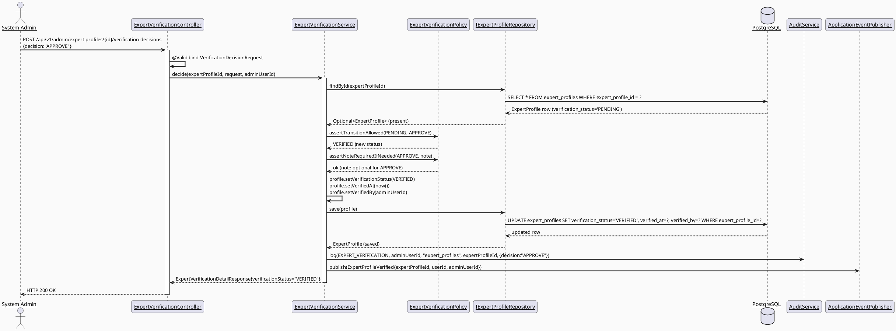
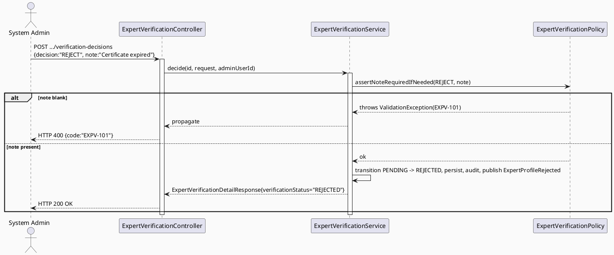
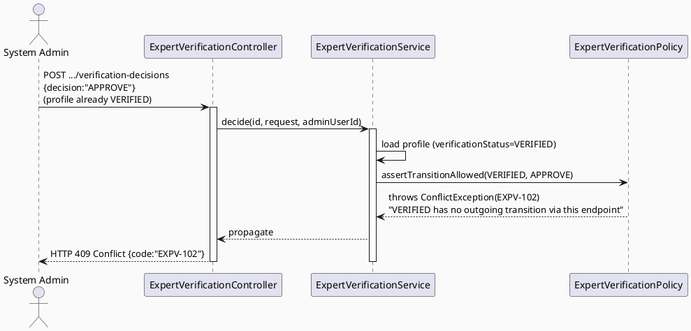
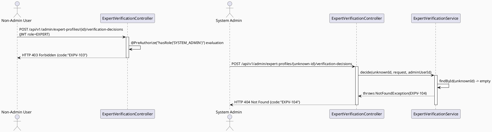
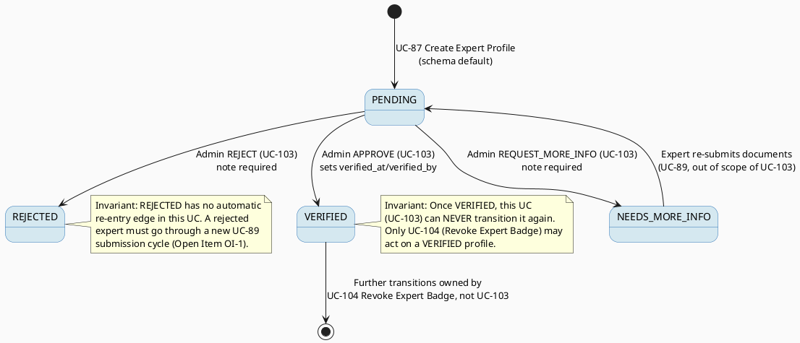

# ENGINEERING DOCUMENTATION STANDARD (EDS) v2.0
# UC-103 Verify Expert Profile — Technical Design Specification

| Field | Value |
|-------|-------|
| **Document ID** | `CB-EXPGOV-IMP-103` |
| **Version** | `1.0` |
| **Date** | `2026-07-02` |
| **Status** | `Draft` |
| **Document Owner** | `TV4-Lâm` |
| **Author** | `AI Agent (Technical Architect)` |
| **Reviewed by** | `[ ] Pending` |
| **DPO Sign-off** | `[ ] Pending` *(module reads expert PII/credentials to render an admin decision)* |
| **Approved by** | `[ ] Pending` |
| **Last Review** | `2026-07-02` |
| **Based on EDS** | `v2.0` |

---

## CHANGELOG

| Ngày | Người thực hiện | Nội dung thay đổi |
|------|-----------------|-------------------|
| 2026-07-02 | AI Agent | Khởi tạo TDS cho UC-103, đồng bộ với schema thật `V1__init_schema.sql` (`expert_profiles`, `expert_credentials`) |

---

## MỤC LỤC

1. [Tổng quan Module](#1-tổng-quan-module)
2. [Ma trận Truy vết (Traceability Matrix)](#2-ma-trận-truy-vết-traceability-matrix)
3. [Architecture Decision Records (ADR)](#3-architecture-decision-records-adr)
4. [Non-Functional Requirements & SLA](#4-non-functional-requirements--sla)
5. [Static Modeling](#5-static-modeling-mô-hình-tĩnh)
6. [Dynamic Modeling](#6-dynamic-modeling-mô-hình-động)
7. [Domain Event Catalog](#7-domain-event-catalog)
8. [Interface Specification](#8-interface-specification-đặc-tả-giao-diện)
9. [API Specification](#9-api-specification)
10. [Bảng mã lỗi (Error Codes)](#10-bảng-mã-lỗi-error-codes)
11. [Quy trình Triển khai (Step-by-Step)](#11-quy-trình-triển-khai-step-by-step)
12. [Rollback & Incident Runbook](#12-rollback--incident-runbook)
13. [Kịch bản Kiểm thử Chi tiết](#13-kịch-bản-kiểm-thử-chi-tiết)
14. [Phương pháp Xác minh](#14-phương-pháp-xác-minh)
15. [Mẫu thử thực tế (API Verification Samples)](#15-mẫu-thử-thực-tế-api-verification-samples)
16. [Bảng tổng hợp phân quyền (Authorization Matrix)](#16-bảng-tổng-hợp-phân-quyền-authorization-matrix)
17. [AI Prompt Constraints (CASE 2.0)](#17-ai-prompt-constraints-case-20)
18. [Open Items / Research Gate](#18-open-items--research-gate)

---

## 1. Tổng quan Module

| Field | Value |
|-------|-------|
| **Module Name** | `VerifyExpertProfile` |
| **Bounded Context** | `expert` (backend package `com.carebridge.backend.expert`, admin-facing sub-slice) |
| **Function ID / UC** | `3.2.2.5 Verify Expert Profile` / `UC-103` |
| **Primary Actor** | System Admin |
| **Secondary Actors** | None (SRS §3.2.2.5, line 1097) |
| **Platform** | Web — Admin Portal (React + TypeScript + Vite) |
| **Priority** | High |
| **Frequency of Use** | Regular (SRS Table 71) |
| **Sprint / Owner** | Sprint 3 "Cross-Domain Integration" — TV4-Lâm (per `function-spec-task-allocation.md`, line 571) |
| **Data Classification** | `PII` (expert professional identity + uploaded credential documents) |
| **Compliance Scope** | `PDPA` |
| **Upstream Dependencies** | `expert` UC-87 Create Expert Profile / UC-89 Upload Verification Documents (produce the `expert_profiles`/`expert_credentials` rows this UC reads and transitions); `auth` (JWT → admin `userId`); `audit` (`AuditService`) |
| **Downstream Consumers** | UC-80/UC-81 View Expert Directory/Profile (read `verification_status` to gate visibility — out of scope, informational only), UC-104 Revoke Expert Badge (operates on the same `verification_status`/`verified_at`/`verified_by` fields once VERIFIED), UC-112 View Expert Dashboard (aggregates verification counts) |

**Mô tả (SRS):** "Approves, rejects, or requests additional expert profile and document information." (SRS §3.2.2.5, line 1099)

**Vị trí trong vòng đời hồ sơ chuyên gia:** UC-87 tạo `expert_profiles` row với `verification_status='PENDING'` (schema default, `V1__init_schema.sql` line 794). UC-89 (out of scope) tạo các `expert_credentials` rows với `review_status='PENDING'` (schema default, line 811) cho từng tài liệu upload. UC-103 (tài liệu này) là bước **duy nhất** trong SRS cho phép System Admin chuyển `expert_profiles.verification_status` từ `PENDING` sang một trạng thái quyết định. UC-104 (Revoke Expert Badge) là bước kế tiếp trong vòng đời — chỉ áp dụng cho hồ sơ đã ở trạng thái `VERIFIED`.

---

## 2. Ma trận Truy vết (Traceability Matrix)

| Requirement ID | Loại (BR/ADR/US) | Mô tả yêu cầu | Thành phần Code | Compliance Target | ADR liên quan |
|----------------|------------------|---------------|-----------------|-------------------|---------------|
| UC-103 (SRS §3.2.2.5, dòng 1092-1111) | User Story | System Admin approves/rejects/requests-more-info on an expert profile | `ExpertVerificationController.POST /api/v1/admin/expert-profiles/{id}/verification-decisions` | — | ADR-EXP-201 |
| BR-RBAC | Business Rule | Users may access only functions allowed by their role and permission scope | `@PreAuthorize("hasRole('SYSTEM_ADMIN')")` on all endpoints | — | ADR-EXP-203 |
| PRE-3 (SRS common preconditions) | Precondition | Actor authenticated with required role | Spring Security filter chain + `SecurityUtils.requireCurrentUserId()` | — | ADR-EXP-203 |
| PRE-4 (SRS common preconditions) | Precondition | Required reference data exists when the UC processes an existing record | `findById()` 404 guard before any decision | — | — |
| POST-2 (SRS common postconditions) | Postcondition | Related records/statuses/notifications updated when applicable | `ExpertProfile.verificationStatus/verifiedAt/verifiedBy` update; `NotificationService` (existing `notification` module, TV1 contract) notifies the expert of the decision | — | ADR-EXP-201 |
| POST-3 (SRS common postconditions) | Postcondition | Sensitive actions recorded for audit, safety, or privacy review | `AuditService.log(EXPERT_VERIFICATION, ...)`; `ExpertProfileVerified`/`ExpertProfileRejected`/`ExpertProfileInfoRequested` domain events | PDPA | ADR-EXP-202 |
| E1 (SRS Exceptions) | Exception | Access denied when unauthenticated/unauthorized/out-of-scope | 401/403 responses, EXPV-1xx codes | — | ADR-EXP-203 |
| E2 (SRS Exceptions) | Exception | Invalid/missing/conflicting data rejected with field-level message | Bean Validation on `VerificationDecisionRequest`; state-machine guard (§ADR-EXP-201) | — | ADR-EXP-201 |
| ADR-EXP-201 | Decision | Verification decision state machine: `PENDING → VERIFIED / REJECTED / NEEDS_MORE_INFO`, `NEEDS_MORE_INFO → PENDING` (re-submit, out of scope trigger) | `ExpertVerificationStatus` enum, `ExpertVerificationPolicy.assertTransitionAllowed()` | — | — |
| ADR-EXP-202 | Decision | Every decision emits a domain event + audit log with reviewer identity and reason | `ExpertVerificationServiceImpl.decide()` | PDPA | — |
| ADR-EXP-203 | Decision | SYSTEM_ADMIN-only; no MODERATOR access (SRS Primary Actor field states "System Admin" only) | `@PreAuthorize`, §16 Authorization Matrix | — | — |

---

## 3. Architecture Decision Records (ADR)

### ADR-EXP-201 — Verification decision state machine

| Field | Value |
|-------|-------|
| **Status** | `Accepted` |
| **Deciders** | `AI Agent (Technical Architect role)` |
| **Date** | `2026-07-02` |

#### Bối cảnh (Context)
`expert_profiles.verification_status` is `varchar(30) NOT NULL DEFAULT 'PENDING'` (`V1__init_schema.sql` line 794) with **no DB-level CHECK constraint** on allowed values (verified by reading lines 786-800 and the full constraint block lines 1799-1809 — no `CHECK` clause exists for this column). SRS UC-103 description names three outcomes: "Approves, rejects, or requests additional expert profile and document information." This gives three terminal-ish states plus the existing `PENDING` default. The codebase must define this enum in the application layer since the schema does not enforce it.

#### Các phương án đã xem xét (Options Considered)

| Phương án | Mô tả | Ưu điểm | Nhược điểm |
|-----------|-------|----------|------------|
| A | Two states only: `PENDING`, `VERIFIED` (reject = stay PENDING with a note) | Simplest | Loses SRS's explicit "rejects" and "requests additional info" as distinct, trackable outcomes |
| B | Four states: `PENDING`, `VERIFIED`, `REJECTED`, `NEEDS_MORE_INFO`, with an explicit transition table enforced in a policy class | Matches SRS wording exactly; each admin action is auditable as a distinct terminal/semi-terminal state | Requires an application-level enum (no DB CHECK) — must be enforced 100% in code, documented as a risk |
| C | Add a DB `CHECK` constraint via new migration to enforce the enum at the schema level | Strongest guarantee, defense-in-depth | Touches a shared, already-seeded column; higher-risk migration for a Draft-status UC; deferred per CareBridge's "smallest scoped change" delivery rule unless explicitly requested |

#### Quyết định (Decision)
Chọn **Phương án B**. Define `ExpertVerificationStatus` Java enum with exactly four values: `PENDING`, `VERIFIED`, `REJECTED`, `NEEDS_MORE_INFO` (stored as the existing `varchar(30)` — all four values fit within 30 chars). This is the canonical enum name shared verbatim across UC-103/UC-104/UC-112 TDS documents (cross-feature naming consistency requirement).

**Allowed transitions (enforced by `ExpertVerificationPolicy.assertTransitionAllowed()`):**

| From | To | Trigger (this UC's actions) |
|------|----|------|
| `PENDING` | `VERIFIED` | Admin action = APPROVE |
| `PENDING` | `REJECTED` | Admin action = REJECT |
| `PENDING` | `NEEDS_MORE_INFO` | Admin action = REQUEST_MORE_INFO |
| `NEEDS_MORE_INFO` | `PENDING` | Expert re-submits documents (UC-89, **out of scope of UC-103** — this UC does not implement the re-submit trigger, only documents it as the state machine's return edge) |
| `REJECTED` | *(no automatic re-entry)* | A rejected expert must create a new submission cycle via UC-89 re-upload flow (Open — see §18 OI-1) |
| `VERIFIED` | *(not reachable from this UC)* | Only UC-104 Revoke Expert Badge may transition `VERIFIED` further (`LOCKED`/`REVOKED` — see UC-104 TDS) |

Any request attempting a transition NOT in this table (e.g., `VERIFIED → VERIFIED`, `REJECTED → VERIFIED` directly) is rejected with `EXPV-101` before any write.

#### Hệ quả (Consequences)

**Tích cực:** Every state change is explicit and auditable; matches SRS wording precisely; shared enum name (`ExpertVerificationStatus`) keeps UC-103/104/112 consistent.

**Tiêu cực / Trade-offs:** No DB-level enforcement — a future direct-SQL write or ORM bug could set an invalid string. Mitigated by: (1) JPA `@Enumerated(EnumType.STRING)` mapping, (2) integration test asserting only the 4 known values ever appear, (3) flagged as Open Item OI-2 for a future defense-in-depth migration.

**Compliance Impact:** PDPA — verification decisions gate whether an expert's PII-bearing public profile becomes visible platform-wide; the state machine's auditability supports accountability obligations.

---

### ADR-EXP-202 — Decision payload, reason capture, and notification

| Field | Value |
|-------|-------|
| **Status** | `Accepted` |
| **Date** | `2026-07-02` |

#### Bối cảnh (Context)
SRS POST-3 requires sensitive actions to be recorded for audit/safety/privacy review. A verification decision (especially REJECTED/NEEDS_MORE_INFO) needs a human-readable reason so the expert understands what to fix, and so a future auditor can see *why* an admin decided as they did.

#### Quyết định (Decision)
`VerificationDecisionRequest` requires a `decision` enum value (`APPROVE`/`REJECT`/`REQUEST_MORE_INFO`) and an optional `note` (`@Size(max = 2000)`), **required (non-blank) when `decision` is `REJECT` or `REQUEST_MORE_INFO`** (validated in service layer, not just Bean Validation, since it is conditional). On successful decision:
1. `expert_profiles.verification_status`, `verified_at = now()`, `verified_by = adminUserId` are updated (APPROVE only sets `verified_at`/`verified_by`; REJECT/REQUEST_MORE_INFO also set `verified_by`/timestamp to record *who reviewed and when*, even though the badge is not granted — this is intentional so "who touched this record last" is always answerable).
2. `AuditService.log(AuditAction.EXPERT_VERIFICATION, adminUserId, "expert_profiles", expertProfileId, detailsPayload)` fires (existing `EXPERT_VERIFICATION` enum value in `AuditAction.java` line 13 — reused, no new enum value required for the audit log itself).
3. A domain event (`ExpertProfileVerified` / `ExpertProfileRejected` / `ExpertProfileInfoRequested`, §7) is published so the existing `notification` module (TV1 contract, out of scope to modify here) can notify the expert.

#### Hệ quả (Consequences)
**Tích cực:** Full traceability of who decided what and why; reuses existing `AuditAction.EXPERT_VERIFICATION` value — no `AuditAction` enum change needed.
**Tiêu cực / Trade-offs:** `verified_by`/`verified_at` being overwritten on REJECT/NEEDS_MORE_INFO means these columns represent "last admin who touched the verification record," not literally "the person who approved it" — flagged as Open Item OI-3 for Product/DPO confirmation this semantic is acceptable (schema has no separate `last_reviewed_by`/`last_reviewed_at` column).

---

### ADR-EXP-203 — SYSTEM_ADMIN-only authorization, no MODERATOR access

| Field | Value |
|-------|-------|
| **Status** | `Accepted` |
| **Date** | `2026-07-02` |

#### Bối cảnh (Context)
SRS Table 71 "Primary Actor" field states exactly "System Admin" with "Secondary Actors: None." Community Moderator-related use cases (e.g., 3.2.2.4 Warn or Suspend Account) are explicitly separate SRS entries with their own Primary Actor "Community Moderator." There is no SRS statement granting MODERATOR access to expert verification.

#### Quyết định (Decision)
`@PreAuthorize("hasRole('SYSTEM_ADMIN')")` on every UC-103 endpoint. No MODERATOR, CONTENT_ADMIN, or EXPERT role may call these endpoints. This is verified against the SRS Primary Actor field rather than assumed from role-adjacency to other admin functions.

#### Hệ quả (Consequences)
**Tích cực:** Matches SRS exactly; avoids privilege creep.
**Tiêu cực / Trade-offs:** If Product later wants MODERATOR to triage first-pass verification, that requires an explicit SRS/BR update and a new ADR — flagged Open Item OI-4.

---

## 4. Non-Functional Requirements & SLA

### 4.1. Performance & Availability

| Category | Requirement | Target SLA | Measurement Method | Compliance Basis |
|----------|-------------|------------|---------------------|------------------|
| Latency | `GET /api/v1/admin/expert-profiles?status=PENDING` (p99, queue list) | `< 500ms` | Manual timing / future k6 | — |
| Latency | `POST .../verification-decisions` (p99) | `< 300ms` | Manual timing | — |
| Availability | Uptime (monthly) | `99.9%` | Uptime monitor | — |

### 4.2. Data Integrity & Retention

| Category | Requirement | Target | Verification Method | Compliance Basis |
|----------|-------------|--------|---------------------|------------------|
| Durability | Zero record loss on decision | RPO = 0 | Transaction-scoped JPA save | PDPA data integrity |
| Consistency | `verification_status` transitions only via allowed edges (§ADR-EXP-201) | 100% | Unit test UC103-TC on policy; DB spot-check §14.1 | ADR-EXP-201 |
| Auditability | Every decision has a matching `AuditService` log entry | 100% | Integration test asserting audit row exists | ADR-EXP-202 |

### 4.3. Security

| Category | Requirement | Target | Verification Method | Compliance Basis |
|----------|-------------|--------|---------------------|------------------|
| Access control | Role-based | `SYSTEM_ADMIN` only | `@PreAuthorize` + E2E role matrix tests | BR-RBAC, ADR-EXP-203 |
| Input validation | Reject invalid transitions/oversized notes | 100% | Bean Validation + policy tests | ADR-EXP-201 |
| Idempotency | Re-submitting the same decision on an already-decided profile is rejected, not silently re-applied | 100% | EXPV-102 conflict test | ADR-EXP-201 |

### 4.4. Scalability & Capacity Planning
Expected load: low (bounded by number of PENDING expert submissions awaiting review, expected low tens per week in near term). No special scaling strategy needed beyond standard connection pooling already configured for the modular monolith.

---

## 5. Static Modeling (Mô hình Tĩnh)

### 5.1. Class Diagram (PlantUML)

```plantuml
@startuml VerifyExpertProfile_ClassDiagram
skinparam classAttributeIconSize 0
skinparam classFontStyle bold
skinparam backgroundColor #FAFAFA
skinparam ArrowColor #555555
skinparam ClassBorderColor #2E75B6
skinparam ClassHeaderBackgroundColor #D5E8F0

' === ENTITY (existing table) ===
class ExpertProfile {
  + expertProfileId: UUID
  + userId: UUID
  + specialty: String
  + professionalTitle: String
  + experienceYears: Short
  + workplace: String
  + consultationScope: String
  + verificationStatus: ExpertVerificationStatus
  + verifiedAt: Instant
  + verifiedBy: UUID
  + ratingAvg: BigDecimal
  + createdAt: Instant
  + updatedAt: Instant
}

class ExpertCredential {
  + credentialId: UUID
  + expertProfileId: UUID
  + credentialType: String
  + credentialNumber: String
  + issuer: String
  + issuedDate: LocalDate
  + expiryDate: LocalDate
  + fileUrl: String
  + reviewStatus: String
  + reviewNote: String
  + createdAt: Instant
  + updatedAt: Instant
}

enum ExpertVerificationStatus {
  PENDING
  VERIFIED
  REJECTED
  NEEDS_MORE_INFO
}

enum VerificationDecisionAction {
  APPROVE
  REJECT
  REQUEST_MORE_INFO
}

' === DTOs ===
class VerificationDecisionRequest {
  + decision: VerificationDecisionAction
  + note: String
}

class ExpertVerificationQueueItemResponse {
  + expertProfileId: UUID
  + userId: UUID
  + fullName: String
  + specialty: String
  + verificationStatus: ExpertVerificationStatus
  + credentialCount: int
  + submittedAt: Instant
}

class ExpertVerificationDetailResponse {
  + expertProfileId: UUID
  + userId: UUID
  + specialty: String
  + professionalTitle: String
  + experienceYears: Short
  + workplace: String
  + consultationScope: String
  + verificationStatus: ExpertVerificationStatus
  + verifiedAt: Instant
  + verifiedBy: UUID
  + credentials: List<ExpertCredentialResponse>
}

class ExpertCredentialResponse {
  + credentialId: UUID
  + credentialType: String
  + credentialNumber: String
  + issuer: String
  + issuedDate: LocalDate
  + expiryDate: LocalDate
  + fileUrl: String
  + reviewStatus: String
}

' === SERVICE ===
interface IExpertVerificationService <<interface>> {
  + listQueue(ExpertVerificationStatus filter, Pageable): Page<ExpertVerificationQueueItemResponse>
  + getDetail(UUID expertProfileId): ExpertVerificationDetailResponse
  + decide(UUID expertProfileId, VerificationDecisionRequest, UUID adminUserId): ExpertVerificationDetailResponse
}

class ExpertVerificationServiceImpl implements IExpertVerificationService {
  - expertProfileRepository: IExpertProfileRepository
  - expertCredentialRepository: IExpertCredentialRepository
  - expertVerificationMapper: ExpertVerificationMapper
  - verificationPolicy: ExpertVerificationPolicy
  - auditService: AuditService
  - applicationEventPublisher: ApplicationEventPublisher
  + listQueue(...): Page<ExpertVerificationQueueItemResponse>
  + getDetail(...): ExpertVerificationDetailResponse
  + decide(...): ExpertVerificationDetailResponse
}

' === REPOSITORY ===
interface IExpertProfileRepository <<interface>> {
  + findById(expertProfileId: UUID): Optional<ExpertProfile>
  + findByVerificationStatus(status: ExpertVerificationStatus, pageable: Pageable): Page<ExpertProfile>
  + save(entity: ExpertProfile): ExpertProfile
}

interface IExpertCredentialRepository <<interface>> {
  + findByExpertProfileId(expertProfileId: UUID): List<ExpertCredential>
}

' === POLICY ===
class ExpertVerificationPolicy {
  + assertTransitionAllowed(ExpertVerificationStatus from, VerificationDecisionAction action): ExpertVerificationStatus
  + assertNoteRequiredIfNeeded(VerificationDecisionAction action, String note): void
}

' === MAPPER ===
class ExpertVerificationMapper {
  + toQueueItem(ExpertProfile entity): ExpertVerificationQueueItemResponse
  + toDetail(ExpertProfile entity, List<ExpertCredential> credentials): ExpertVerificationDetailResponse
}

' === RELATIONSHIPS ===
ExpertProfile "1" *-- "many" ExpertCredential : has
ExpertVerificationServiceImpl --> IExpertProfileRepository : uses
ExpertVerificationServiceImpl --> IExpertCredentialRepository : uses
ExpertVerificationServiceImpl --> ExpertVerificationPolicy : uses
ExpertVerificationServiceImpl --> ExpertVerificationMapper : uses
ExpertVerificationServiceImpl --> AuditService : uses
ExpertVerificationMapper ..> ExpertVerificationDetailResponse : produces
ExpertVerificationPolicy ..> ExpertVerificationStatus : validates

@enduml
```



### 5.2. Data Structure (Flyway SQL Migration)

**No schema migration required.** `expert_profiles` (lines 786-800) and `expert_credentials` (lines 802-815) already exist in `V1__init_schema.sql` with all columns needed for this UC. `ExpertVerificationStatus` is an **application-layer enum** stored in the existing `verification_status varchar(30)` column (no DB CHECK constraint exists or is added — see ADR-EXP-201 Option C, deferred).

Reference (existing, unchanged):
```sql
-- From V1__init_schema.sql, lines 786-815 (source of truth — read-only reference)
CREATE TABLE public.expert_profiles (
    expert_profile_id   uuid         NOT NULL DEFAULT gen_random_uuid(),
    user_id             uuid         NOT NULL,
    specialty           varchar(100),
    professional_title  varchar(150),
    experience_years    smallint,
    workplace           varchar(200),
    consultation_scope  text,
    verification_status varchar(30)  NOT NULL DEFAULT 'PENDING',
    verified_at         timestamptz,
    verified_by         uuid,
    rating_avg          numeric,
    created_at          timestamptz  NOT NULL DEFAULT now(),
    updated_at          timestamptz  NOT NULL DEFAULT now()
);
-- PK: expert_profile_id (line 1404-1405); UNIQUE: user_id (line 1523-1524)
-- FK: user_id -> users(user_id) (line 1799-1800); verified_by -> users(user_id) (line 1802-1803)
-- INDEX: idx_expert_profiles_verification_status (line 1631)

CREATE TABLE public.expert_credentials (
    credential_id     uuid        NOT NULL DEFAULT gen_random_uuid(),
    expert_profile_id uuid        NOT NULL,
    credential_type   varchar(50) NOT NULL,
    credential_number varchar(100),
    issuer            varchar(200),
    issued_date       date,
    expiry_date       date,
    file_url          text,
    review_status     varchar(30) NOT NULL DEFAULT 'PENDING',
    review_note       text,
    created_at        timestamptz NOT NULL DEFAULT now(),
    updated_at        timestamptz NOT NULL DEFAULT now()
);
-- PK: credential_id (line 1407-1408)
-- FK: expert_profile_id -> expert_profiles(expert_profile_id) (line 1805-1806)
-- INDEX: idx_expert_credentials_expert_profile_id (line 1632)
```

> **If a future decision requires a DB CHECK constraint on `verification_status`** (ADR-EXP-201 Option C) or a dedicated `verification_decisions` audit-detail table, that would be introduced under migration version **`V20260704100000`** (this UC's assigned range start; increment by `00100` for subsequent migrations if needed — no collision with `090000`/`110000`/`120000`/`130000` ranges reserved for sibling agents, and no collision with the confirmed highest existing migration `V20260629000002`). **Not created in this Draft TDS** since no genuine schema gap was found — flagged Open Item OI-2.

---

## 6. Dynamic Modeling (Mô hình Động)

### 6.1. Sequence Diagram — Happy Path: Approve (PlantUML)



### 6.2. Sequence Diagram — Alt Path: Reject / Request More Info (PlantUML)



### 6.3. Sequence Diagram — Error Path: Invalid Transition (PlantUML)



### 6.4. Sequence Diagram — Error Path: Not Found / Unauthorized (PlantUML)



### 6.5. State Machine — `ExpertVerificationStatus`



**Invariant bất biến:**
- `PENDING` is the only state from which UC-103 can act (defense-in-depth: `assertTransitionAllowed` rejects any call where current status is not `PENDING`).
- No transition ever deletes an `expert_profiles` or `expert_credentials` row.
- `verified_at`/`verified_by` are set on **every** decision (APPROVE/REJECT/REQUEST_MORE_INFO), not only APPROVE (see ADR-EXP-202).

---

## 7. Domain Event Catalog

### 7.1. Events Published (Phát ra)

| Event Name | Trigger | Publisher | Subscriber(s) | Payload Schema | Async? |
|------------|---------|-----------|---------------|----------------|--------|
| `ExpertProfileVerified` | Successful APPROVE decision | `ExpertVerificationServiceImpl` | `AuditService` (log), `notification` module (out of scope — notifies expert), UC-112 dashboard read model (on-demand query, not a subscriber in practice) | `ExpertProfileVerified.java` | No (synchronous emit within request; consumers may process async) |
| `ExpertProfileRejected` | Successful REJECT decision | `ExpertVerificationServiceImpl` | `AuditService`, `notification` module | `ExpertProfileRejected.java` | No |
| `ExpertProfileInfoRequested` | Successful REQUEST_MORE_INFO decision | `ExpertVerificationServiceImpl` | `AuditService`, `notification` module | `ExpertProfileInfoRequested.java` | No |

### 7.2. Events Consumed (Tiêu thụ)

None — this UC does not consume domain events from other modules.

### 7.3. Payload Schema

```java
// ExpertProfileVerified.java / ExpertProfileRejected.java / ExpertProfileInfoRequested.java
// (identical payload shape across the three events, only eventType differs)
public record ExpertProfileVerified(
    UUID    eventId,          // UUID.randomUUID()
    String  eventType,        // "ExpertProfileVerified" | "ExpertProfileRejected" | "ExpertProfileInfoRequested"
    Instant occurredAt,       // Instant.now()
    String  version,          // "1.0"
    Payload payload,
    Metadata metadata
) implements ApplicationEvent {

    public record Payload(
        UUID expertProfileId,
        UUID expertUserId,
        String note            // reason/context — null for APPROVE unless provided
    ) {}

    public record Metadata(
        UUID   correlationId,
        String causedBy        // adminUserId of the deciding System Admin
    ) {}
}
```

---

## 8. Interface Specification (Đặc tả Giao diện)

### 8.1. Service Interface

```java
// VerificationDecisionRequest.java — Input DTO
// @version 1.0
public class VerificationDecisionRequest {
    @NotNull
    private VerificationDecisionAction decision;   // APPROVE | REJECT | REQUEST_MORE_INFO

    @Size(max = 2000)
    private String note;   // required (non-blank) when decision != APPROVE — enforced in service, not just annotation
    // getters / setters / @Valid annotations
}

// VerificationDecisionAction.java — Enum
public enum VerificationDecisionAction {
    APPROVE,
    REJECT,
    REQUEST_MORE_INFO
}

// ExpertVerificationStatus.java — Enum (SHARED name across UC-103/104/112 TDS)
public enum ExpertVerificationStatus {
    PENDING,
    VERIFIED,
    REJECTED,
    NEEDS_MORE_INFO
}

// ExpertVerificationQueueItemResponse.java — Output DTO (list view)
public class ExpertVerificationQueueItemResponse {
    private UUID expertProfileId;
    private UUID userId;
    private String fullName;          // joined from users table via userId (read-only projection)
    private String specialty;
    private ExpertVerificationStatus verificationStatus;
    private int credentialCount;
    private Instant submittedAt;      // = expert_profiles.created_at
    // getters / setters
}

// ExpertVerificationDetailResponse.java — Output DTO (detail view)
public class ExpertVerificationDetailResponse {
    private UUID expertProfileId;
    private UUID userId;
    private String specialty;
    private String professionalTitle;
    private Short experienceYears;
    private String workplace;
    private String consultationScope;
    private ExpertVerificationStatus verificationStatus;
    private Instant verifiedAt;
    private UUID verifiedBy;
    private List<ExpertCredentialResponse> credentials;
    // getters / setters
}

// ExpertCredentialResponse.java — Output DTO
public class ExpertCredentialResponse {
    private UUID credentialId;
    private String credentialType;
    private String credentialNumber;
    private String issuer;
    private LocalDate issuedDate;
    private LocalDate expiryDate;
    private String fileUrl;
    private String reviewStatus;
    // getters / setters
}

// IExpertVerificationService.java — Service Contract
// @version 1.0
public interface IExpertVerificationService {
    /**
     * Lists expert profiles for the admin review queue, optionally filtered by status.
     */
    Page<ExpertVerificationQueueItemResponse> listQueue(ExpertVerificationStatus filter, Pageable pageable);

    /**
     * @throws NotFoundException (EXPV-104) if no expert_profiles row for expertProfileId
     */
    ExpertVerificationDetailResponse getDetail(UUID expertProfileId);

    /**
     * Applies an admin verification decision.
     * @throws ValidationException (EXPV-101) if note is required (REJECT/REQUEST_MORE_INFO) and blank
     * @throws NotFoundException (EXPV-104) if expertProfileId does not exist
     * @throws ConflictException (EXPV-102) if current status has no outgoing edge for the requested decision
     * @throws ForbiddenException (EXPV-103) if caller lacks ROLE_SYSTEM_ADMIN (defense-in-depth; primary gate is @PreAuthorize)
     */
    ExpertVerificationDetailResponse decide(UUID expertProfileId, VerificationDecisionRequest request, UUID adminUserId);
}
```

### 8.2. Repository Interface

```java
// IExpertProfileRepository.java
// @version 1.0
public interface IExpertProfileRepository extends JpaRepository<ExpertProfile, UUID> {

    Optional<ExpertProfile> findById(UUID expertProfileId);

    Page<ExpertProfile> findByVerificationStatus(ExpertVerificationStatus status, Pageable pageable);

    // No delete() exposed — expert_profiles rows are never deleted by this module.
}

// IExpertCredentialRepository.java
// @version 1.0
public interface IExpertCredentialRepository extends JpaRepository<ExpertCredential, UUID> {

    List<ExpertCredential> findByExpertProfileId(UUID expertProfileId);
}
```

### 8.3. Policy / Mapper

```java
// ExpertVerificationPolicy.java
// @version 1.0
@Component
public class ExpertVerificationPolicy {

    private static final Map<ExpertVerificationStatus, Map<VerificationDecisionAction, ExpertVerificationStatus>> TRANSITIONS = Map.of(
        ExpertVerificationStatus.PENDING, Map.of(
            VerificationDecisionAction.APPROVE, ExpertVerificationStatus.VERIFIED,
            VerificationDecisionAction.REJECT, ExpertVerificationStatus.REJECTED,
            VerificationDecisionAction.REQUEST_MORE_INFO, ExpertVerificationStatus.NEEDS_MORE_INFO
        )
    );

    public ExpertVerificationStatus assertTransitionAllowed(ExpertVerificationStatus current, VerificationDecisionAction action) {
        Map<VerificationDecisionAction, ExpertVerificationStatus> allowed = TRANSITIONS.get(current);
        if (allowed == null || !allowed.containsKey(action)) {
            throw new ConflictException("EXPV-102");
        }
        return allowed.get(action);
    }

    public void assertNoteRequiredIfNeeded(VerificationDecisionAction action, String note) {
        boolean noteRequired = action == VerificationDecisionAction.REJECT
            || action == VerificationDecisionAction.REQUEST_MORE_INFO;
        if (noteRequired && (note == null || note.isBlank())) {
            throw new ValidationException("EXPV-101");
        }
    }
}

// ExpertVerificationMapper.java
// @version 1.0
@Component
public class ExpertVerificationMapper {
    public ExpertVerificationQueueItemResponse toQueueItem(ExpertProfile entity) { /* maps entity -> queue item DTO */ }
    public ExpertVerificationDetailResponse toDetail(ExpertProfile entity, List<ExpertCredential> credentials) { /* maps entity + credentials -> detail DTO */ }
}
```

---

## 9. API Specification

### 9.1. Endpoints Table

| Method | Path | Auth Level | Required Roles | Rate Limit | Idempotent? |
|--------|------|------------|----------------|------------|-------------|
| `GET` | `/api/v1/admin/expert-profiles?status={status}&page={n}&size={n}` | JWT Bearer | `SYSTEM_ADMIN` | 300/min | Yes |
| `GET` | `/api/v1/admin/expert-profiles/{expertProfileId}` | JWT Bearer | `SYSTEM_ADMIN` | 300/min | Yes |
| `POST` | `/api/v1/admin/expert-profiles/{expertProfileId}/verification-decisions` | JWT Bearer | `SYSTEM_ADMIN` | 60/min | No *(each call attempts a state transition; a second identical call on an already-transitioned resource returns 409, not a duplicate success — see §6.3)* |

### 9.2. Request / Response Schemas

#### `GET /api/v1/admin/expert-profiles?status=PENDING` — List verification queue

**Response — 200 OK:**
```json
{
  "success": true,
  "data": {
    "content": [
      {
        "expertProfileId": "550e8400-e29b-41d4-a716-446655440000",
        "userId": "9c858901-8a57-4791-81fe-4c455b099bc9",
        "fullName": "Nguyễn Văn A",
        "specialty": "Obstetrics",
        "verificationStatus": "PENDING",
        "credentialCount": 2,
        "submittedAt": "2026-06-30T09:00:00.000Z"
      }
    ],
    "totalElements": 1,
    "totalPages": 1
  },
  "message": null,
  "timestamp": "2026-07-02T10:15:00.000Z"
}
```

#### `POST /api/v1/admin/expert-profiles/{id}/verification-decisions` — Approve/Reject/Request info

**Request Body:**
```json
{
  "decision": "REJECT",
  "note": "Chứng chỉ hành nghề đã hết hạn, vui lòng nộp bản mới."
}
```

**Response — 200 OK (Happy Path):**
```json
{
  "success": true,
  "data": {
    "expertProfileId": "550e8400-e29b-41d4-a716-446655440000",
    "userId": "9c858901-8a57-4791-81fe-4c455b099bc9",
    "verificationStatus": "REJECTED",
    "verifiedAt": "2026-07-02T10:15:00.000Z",
    "verifiedBy": "11111111-1111-1111-1111-111111111111",
    "credentials": []
  },
  "message": "Verification decision recorded",
  "timestamp": "2026-07-02T10:15:00.000Z"
}
```

**Response — 400 Bad Request (missing required note):**
```json
{
  "success": false,
  "error": { "code": "EXPV-101", "message": "Note is required for REJECT or REQUEST_MORE_INFO decisions" }
}
```

**Response — 409 Conflict (invalid transition):**
```json
{
  "success": false,
  "error": { "code": "EXPV-102", "message": "Expert profile is not in a state that allows this decision" }
}
```

**Response — 404 Not Found:**
```json
{
  "success": false,
  "error": { "code": "EXPV-104", "message": "Expert profile not found" }
}
```

---

## 10. Bảng mã lỗi (Error Codes)

| Code | HTTP Status | Message (EN) | Message (VI) | Trigger Condition |
|------|-------------|--------------|--------------|-------------------|
| `EXPV-101` | 400 | Note required for this decision | Bắt buộc nhập ghi chú cho quyết định này | `decision` is `REJECT`/`REQUEST_MORE_INFO` and `note` is blank/missing |
| `EXPV-102` | 409 | Invalid verification state transition | Trạng thái xác thực hiện tại không cho phép hành động này | Profile's current `verificationStatus` has no outgoing edge for the requested `decision` (§ADR-EXP-201) |
| `EXPV-103` | 403 | Access denied | Không đủ quyền | Caller lacks `SYSTEM_ADMIN` role |
| `EXPV-104` | 404 | Expert profile not found | Không tìm thấy hồ sơ chuyên gia | `expertProfileId` does not exist in `expert_profiles` |
| `EXPV-105` | 500 | Internal error | Lỗi hệ thống | Unexpected failure (DB, mapping) |

> **Note:** Codes use a new `EXPV-` prefix (Expert Verification) distinct from UC-88's `EXP-` prefix, to avoid collision while both modules coexist under the same `expert` bounded context. Follow-up unification is an Open Item shared with UC-88 TDS OI-5.

---

## 11. Quy trình Triển khai (Step-by-Step)

### 11.1. Prerequisites

- [ ] ADR-EXP-201, -202, -203 reviewed and Accepted (§3)
- [ ] UC-87/UC-89 have produced at least one `expert_profiles`/`expert_credentials` row with `verification_status='PENDING'` for manual testing (or seed directly in integration tests)
- [ ] `com.carebridge.backend.expert` package skeleton exists (confirmed — `.gitkeep` placeholders present in all layer subfolders including `service/`)
- [ ] Web feature folder `src/features/expert/` exists (confirmed — `pages/ExpertDashboardPage.tsx` stub present); this UC introduces a **new** `src/features/adminExpertGovernance/` (or equivalent admin feature slice) since verification is an Admin Portal, not Expert Portal, concern

### 11.2. Pre-Migration Checklist

**N/A — no migration required for this UC** (§5.2). Skip straight to implementation steps.

### 11.3. Implementation Steps

#### Chặng 1 — Map JPA Entities and enums

Files:
- `05_Development/CareBridgeAPI/src/main/java/com/carebridge/backend/expert/entity/ExpertProfile.java`
- `05_Development/CareBridgeAPI/src/main/java/com/carebridge/backend/expert/entity/ExpertCredential.java`
- `05_Development/CareBridgeAPI/src/main/java/com/carebridge/backend/expert/entity/ExpertVerificationStatus.java`

```java
@Entity
@Table(name = "expert_profiles")
public class ExpertProfile {
    @Id
    @Column(name = "expert_profile_id")
    private UUID expertProfileId;

    @Column(name = "user_id", nullable = false, unique = true)
    private UUID userId;

    @Column(name = "specialty", length = 100)
    private String specialty;

    @Column(name = "professional_title", length = 150)
    private String professionalTitle;

    @Column(name = "experience_years")
    private Short experienceYears;

    @Column(name = "workplace", length = 200)
    private String workplace;

    @Column(name = "consultation_scope")
    private String consultationScope;

    @Enumerated(EnumType.STRING)
    @Column(name = "verification_status", nullable = false, length = 30)
    private ExpertVerificationStatus verificationStatus;

    @Column(name = "verified_at")
    private Instant verifiedAt;

    @Column(name = "verified_by")
    private UUID verifiedBy;

    @Column(name = "rating_avg")
    private BigDecimal ratingAvg;

    @Column(name = "created_at", nullable = false, updatable = false)
    private Instant createdAt;

    @Column(name = "updated_at", nullable = false)
    private Instant updatedAt;
}
```

> If UC-88's `ExpertProfile` entity is implemented first, this UC MUST reuse the **same** entity class (`com.carebridge.backend.expert.entity.ExpertProfile`) rather than creating a duplicate mapping — verify no collision before creating the file.

#### Chặng 2 — Repository, Policy, Mapper

Files: `expert/repository/IExpertProfileRepository.java` (extend if UC-88 already created it — add `findByVerificationStatus`), `expert/repository/IExpertCredentialRepository.java`, `expert/policy/ExpertVerificationPolicy.java`, `expert/mapper/ExpertVerificationMapper.java` — per §8.2/§8.3.

#### Chặng 3 — Service

File: `expert/service/impl/ExpertVerificationServiceImpl.java`

```java
@Override
@Transactional
public ExpertVerificationDetailResponse decide(UUID expertProfileId, VerificationDecisionRequest request, UUID adminUserId) {
    ExpertProfile profile = expertProfileRepository.findById(expertProfileId)
        .orElseThrow(() -> new NotFoundException("EXPV-104"));

    verificationPolicy.assertNoteRequiredIfNeeded(request.getDecision(), request.getNote());
    ExpertVerificationStatus newStatus = verificationPolicy.assertTransitionAllowed(
        profile.getVerificationStatus(), request.getDecision());

    profile.setVerificationStatus(newStatus);
    profile.setVerifiedAt(Instant.now());
    profile.setVerifiedBy(adminUserId);
    ExpertProfile saved = expertProfileRepository.save(profile);

    auditService.log(AuditAction.EXPERT_VERIFICATION, adminUserId, "expert_profiles",
        expertProfileId.toString(), Map.of("decision", request.getDecision(), "newStatus", newStatus));

    publishDecisionEvent(saved, request, adminUserId);

    List<ExpertCredential> credentials = expertCredentialRepository.findByExpertProfileId(expertProfileId);
    return expertVerificationMapper.toDetail(saved, credentials);
}
```

#### Chặng 4 — Controller

File: `expert/controller/ExpertVerificationController.java`

```java
@RestController
@RequestMapping("/api/v1/admin/expert-profiles")
@RequiredArgsConstructor
public class ExpertVerificationController {

    private final IExpertVerificationService expertVerificationService;

    @GetMapping
    @PreAuthorize("hasRole('SYSTEM_ADMIN')")
    public ResponseEntity<ApiResponse<Page<ExpertVerificationQueueItemResponse>>> listQueue(
            @RequestParam(required = false) ExpertVerificationStatus status, Pageable pageable) {
        return ResponseEntity.ok(ApiResponse.success(expertVerificationService.listQueue(status, pageable)));
    }

    @GetMapping("/{expertProfileId}")
    @PreAuthorize("hasRole('SYSTEM_ADMIN')")
    public ResponseEntity<ApiResponse<ExpertVerificationDetailResponse>> getDetail(@PathVariable UUID expertProfileId) {
        return ResponseEntity.ok(ApiResponse.success(expertVerificationService.getDetail(expertProfileId)));
    }

    @PostMapping("/{expertProfileId}/verification-decisions")
    @PreAuthorize("hasRole('SYSTEM_ADMIN')")
    public ResponseEntity<ApiResponse<ExpertVerificationDetailResponse>> decide(
            @PathVariable UUID expertProfileId,
            Principal principal,
            @Valid @RequestBody VerificationDecisionRequest request) {
        UUID adminUserId = SecurityUtils.requireCurrentUserId(principal);
        return ResponseEntity.ok(ApiResponse.success(
            expertVerificationService.decide(expertProfileId, request, adminUserId), "Verification decision recorded"));
    }
}
```

#### Chặng 5 — Web feature (React + TypeScript)

Files under `05_Development/CareBridgeWebApp/src/features/adminExpertGovernance/` (new feature slice, admin-side; distinct from the existing expert-self-service `features/expert/`):
- `models/expertVerification.ts` — types + Zod schema mirroring §8.1.
- `services/expertVerificationApi.ts` — `listVerificationQueue()`, `getVerificationDetail(id)`, `submitVerificationDecision(id, data)` via `apiClient`.
- `pages/ExpertVerificationQueuePage.tsx` — list/queue page with status filter (react-query `useQuery`).
- `pages/ExpertVerificationDetailPage.tsx` — detail page with Approve/Reject/Request-Info actions (react-hook-form + Zod resolver + TanStack Query `useMutation`).

```ts
// models/expertVerification.ts (excerpt)
import { z } from 'zod';

export const expertVerificationStatusSchema = z.enum(['PENDING', 'VERIFIED', 'REJECTED', 'NEEDS_MORE_INFO']);
export type ExpertVerificationStatus = z.infer<typeof expertVerificationStatusSchema>;

export const verificationDecisionActionSchema = z.enum(['APPROVE', 'REJECT', 'REQUEST_MORE_INFO']);

export const verificationDecisionSchema = z.object({
  decision: verificationDecisionActionSchema,
  note: z.string().max(2000).optional(),
}).refine(
  (data) => data.decision === 'APPROVE' || (data.note && data.note.trim().length > 0),
  { message: 'Note is required for REJECT or REQUEST_MORE_INFO', path: ['note'] }
);

export type VerificationDecisionRequest = z.infer<typeof verificationDecisionSchema>;
```

#### Chặng 6 — Verification sau deploy

```bash
curl -X GET https://[host]/api/v1/health
# Expected: {"status": "ok"}
```

### 11.4. Deployment Checklist

- [ ] `./mvnw clean package` succeeds
- [ ] `./mvnw test` green
- [ ] `npm run build` (web) succeeds
- [ ] `npm run test:run` (web, Vitest) green
- [ ] Manual smoke: SYSTEM_ADMIN logs in, GET queue shows a PENDING profile, APPROVE it, re-GET confirms `VERIFIED` + `verifiedAt`/`verifiedBy` set
- [ ] Audit log shows `EXPERT_VERIFICATION` action with correct payload

---

## 12. Rollback & Incident Runbook

### 12.1. Điều kiện kích hoạt Rollback (Trigger Conditions)

| Điều kiện | Ngưỡng | Người quyết định |
|-----------|--------|------------------|
| Error rate tăng đột biến | > 5% trong 5 phút | On-call Engineer |
| Non-SYSTEM_ADMIN successfully calls a decision endpoint (canary alert) | Bất kỳ case nào | Tech Lead + DPO — **P0 security incident** |
| `verification_status` set to a value outside the 4-value enum | Bất kỳ case nào | Tech Lead — **P1 data integrity incident** |

### 12.2. Rollback Procedure

```bash
# No migration to revert (application-layer only feature). Revert code:
git checkout -- 05_Development/CareBridgeAPI/src/main/java/com/carebridge/backend/expert/
git checkout -- 05_Development/CareBridgeWebApp/src/features/adminExpertGovernance/
kubectl rollout undo deployment/carebridge-api
kubectl rollout status deployment/carebridge-api
curl -X GET https://[host]/api/v1/health
```

### 12.3. Notification Protocol

| Thời điểm | Người nhận | Kênh | Template |
|-----------|------------|------|----------|
| Ngay khi phát hiện unauthorized decision bug | On-call + DPO | Slack `#incident` + Email | "🚨 UC-103 verification decision authorization bypass — P0" |
| Trong 30 phút | DPO | Email | Bắt buộc — PDPA |

### 12.4. Post-Incident Review (PIR)
Bắt buộc trong 48 giờ. Root cause phải trace lại §ADR-EXP-203 authorization boundary nếu liên quan đến unauthorized access.

---

## 13. Kịch bản Kiểm thử Chi tiết

> Chi tiết đầy đủ nằm ở `UC103_VerifyExpertProfile_Test-Spec.md`. Section này tóm tắt các nhóm scenario bắt buộc.

### 13.1. Unit Tests
- Happy path: APPROVE from PENDING → VERIFIED, `verifiedAt`/`verifiedBy` set.
- REJECT/REQUEST_MORE_INFO with note → correct target state.
- Missing note on REJECT/REQUEST_MORE_INFO → EXPV-101.
- Invalid transition (e.g., APPROVE on already-VERIFIED) → EXPV-102.
- Not-found expertProfileId → EXPV-104.

### 13.2. Integration Tests
- DB row updated with correct `verification_status`/`verified_at`/`verified_by`.
- Audit log (`AuditService`) entry created with `EXPERT_VERIFICATION` action.
- Domain event published with correct payload.

### 13.3. E2E / Security Tests
- `SYSTEM_ADMIN` role → 200; `MODERATOR`/`EXPERT`/`MOTHER`/unauthenticated → 403/401.
- Full lifecycle: PENDING → REJECTED (note required) → confirmed no auto re-entry to PENDING via this UC's endpoints.

---

## 14. Phương pháp Xác minh

### 14.1. Database Inspection

```sql
-- Verify decision applied correctly
SELECT expert_profile_id, verification_status, verified_at, verified_by
FROM expert_profiles
WHERE expert_profile_id = '<uuid>';
-- Expected: verification_status in ('PENDING','VERIFIED','REJECTED','NEEDS_MORE_INFO') always.

-- Verify no invalid enum value has ever been written
SELECT DISTINCT verification_status FROM expert_profiles;
-- Expected: subset of {PENDING, VERIFIED, REJECTED, NEEDS_MORE_INFO}
```

### 14.2. Log / Audit Verification

```bash
kubectl logs -l app=carebridge-api | grep '"eventType":"ExpertProfileVerified"' | head -5
kubectl logs -l app=carebridge-api | jq 'select(.eventType == "ExpertProfileVerified" or .eventType == "ExpertProfileRejected" or .eventType == "ExpertProfileInfoRequested") | {eventId, occurredAt, payload}'
```

### 14.3. Tool-based Verification

```bash
echo "[JWT_TOKEN]" | cut -d'.' -f2 | base64 -d | jq .
```

---

## 15. Mẫu thử thực tế (API Verification Samples)

### 15.1. Happy Path

```bash
curl -X POST https://[host]/api/v1/admin/expert-profiles/<id>/verification-decisions \
  -H "Authorization: Bearer <SYSTEM_ADMIN_JWT>" \
  -H "Content-Type: application/json" \
  -d '{"decision": "APPROVE"}'
```

**Expected Response (200):**
```json
{ "success": true, "data": { "verificationStatus": "VERIFIED", "...": "..." }, "message": "Verification decision recorded" }
```

### 15.2. Error Paths

```bash
# Missing note on REJECT -> 400
curl -X POST https://[host]/api/v1/admin/expert-profiles/<id>/verification-decisions \
  -H "Authorization: Bearer <SYSTEM_ADMIN_JWT>" -d '{"decision": "REJECT"}'
```
**Expected Response (400):** `{"success": false, "error": {"code": "EXPV-101", ...}}`

```bash
# EXPERT role -> 403
curl -X POST https://[host]/api/v1/admin/expert-profiles/<id>/verification-decisions \
  -H "Authorization: Bearer <EXPERT_JWT>" -d '{"decision": "APPROVE"}'
```
**Expected Response (403):** `{"success": false, "error": {"code": "EXPV-103", "message": "Access denied"}}`

---

## 16. Bảng tổng hợp phân quyền (Authorization Matrix)

| Endpoint | `GUEST` | `MOTHER`/`FAMILY` | `EXPERT` | `MODERATOR`/`CONTENT_ADMIN` | `SYSTEM_ADMIN` |
|----------|---------|--------|---------|-------|----------|
| `GET /api/v1/admin/expert-profiles` | ❌ 401 | ❌ 403 | ❌ 403 | ❌ 403 | ✅ |
| `GET /api/v1/admin/expert-profiles/{id}` | ❌ 401 | ❌ 403 | ❌ 403 | ❌ 403 | ✅ |
| `POST /api/v1/admin/expert-profiles/{id}/verification-decisions` | ❌ 401 | ❌ 403 | ❌ 403 | ❌ 403 | ✅ |

**Chú thích:**
- ✅ = Được phép | ❌ = Bị từ chối
- Per ADR-EXP-203, MODERATOR is explicitly **not** granted access — verified against SRS Table 71 Primary Actor field ("System Admin", Secondary Actors: "None"), not assumed.

---

## 17. AI Prompt Constraints (CASE 2.0)

### 17.1 Constraint Summary Table

| # | Constraint | Source (ADR/BR) | Last Verified |
|---|-----------|-----------------|---------------|
| C1 | `adminUserId` MUST be extracted from JWT `Principal` via `SecurityUtils.requireCurrentUserId()`, NEVER from request body or path param | ADR-EXP-202 | 2026-07-02 |
| C2 | `hasRole('SYSTEM_ADMIN')` required via `@PreAuthorize` on ALL three endpoints; NO MODERATOR access permitted | BR-RBAC, ADR-EXP-203 | 2026-07-02 |
| C3 | `ExpertVerificationStatus` enum MUST have exactly 4 values (`PENDING`, `VERIFIED`, `REJECTED`, `NEEDS_MORE_INFO`) — this exact name and value set is SHARED across UC-103/UC-104/UC-112 | ADR-EXP-201 | 2026-07-02 |
| C4 | `ExpertVerificationPolicy.assertTransitionAllowed()` MUST be the single source of truth for allowed transitions — service layer MUST NOT inline transition logic | ADR-EXP-201 | 2026-07-02 |
| C5 | `note` is REQUIRED (non-blank) when `decision` is `REJECT` or `REQUEST_MORE_INFO`; OPTIONAL for `APPROVE` — validated in `ExpertVerificationPolicy`, not only Bean Validation | ADR-EXP-202 | 2026-07-02 |
| C6 | `verified_at`/`verified_by` MUST be set on every decision (APPROVE, REJECT, REQUEST_MORE_INFO), not only APPROVE | ADR-EXP-202 | 2026-07-02 |
| C7 | `AuditService.log(AuditAction.EXPERT_VERIFICATION, ...)` MUST fire after successful save, reusing the EXISTING `EXPERT_VERIFICATION` enum value — do NOT add a new `AuditAction` value for this UC | ADR-EXP-202, §10 audit trail requirement | 2026-07-02 |
| C8 | No Flyway migration is created for this UC — `expert_profiles`/`expert_credentials` schema is final as-is per `V1__init_schema.sql` | §5.2 | 2026-07-02 |

### 17.2 Constraint Injection Block (Copy-Paste vào AI Prompt)

```
[CONSTRAINT BLOCK — Module: VerifyExpertProfile (CB-EXPGOV-IMP-103)]
Theo TDS CB-EXPGOV-IMP-103 và các ADR liên quan:

1. (C1 — ADR-EXP-202) adminUserId PHẢI extract từ JWT Principal qua SecurityUtils.requireCurrentUserId().
2. (C2 — BR-RBAC/ADR-EXP-203) @PreAuthorize("hasRole('SYSTEM_ADMIN')") bắt buộc trên CẢ 3 endpoint — KHÔNG cho MODERATOR truy cập.
3. (C3 — ADR-EXP-201) ExpertVerificationStatus enum PHẢI có đúng 4 giá trị: PENDING, VERIFIED, REJECTED, NEEDS_MORE_INFO — tên này DÙNG CHUNG với UC-104/UC-112.
4. (C4 — ADR-EXP-201) Toàn bộ logic transition PHẢI nằm trong ExpertVerificationPolicy.assertTransitionAllowed() — KHÔNG inline trong service.
5. (C5 — ADR-EXP-202) note BẮT BUỘC (không blank) khi decision là REJECT/REQUEST_MORE_INFO; optional khi APPROVE.
6. (C6 — ADR-EXP-202) verified_at/verified_by PHẢI được set trên MỌI quyết định, không chỉ APPROVE.
7. (C7 — ADR-EXP-202) AuditService.log(EXPERT_VERIFICATION, ...) PHẢI gọi sau khi save() thành công — dùng lại enum value CÓ SẴN, KHÔNG thêm giá trị mới vào AuditAction.
8. (C8) KHÔNG tạo Flyway migration mới cho UC này.

[CONTEXT BLOCK]
- Bounded Context: expert
- Data Classification: PII
- Compliance: PDPA
- Existing interfaces: §8 Service Interface + §8.2/§8.3 Repository/Policy/Mapper
- Error codes: EXPV-101 to EXPV-105 (§10)
- Auth matrix: §16

[TASK BLOCK]
Implement ExpertVerificationService.decide() thỏa mãn constraints trên.
Output phải tuân thủ §8 Interface Specification.
Tests phải cover §13 Test Scenarios (đầy đủ tại Test-Spec).
```

### 17.3 Constraint Quality Checklist

- [x] Mỗi constraint traceable về ADR hoặc BR cụ thể
- [x] Không có constraint generic
- [x] Constraint block có ≥ 5 constraints cụ thể (8 constraints)
- [x] Reference §8 Interface
- [x] Reference §16 Auth Matrix

### 17.4 Anti-Pattern Detection (cho AI-Generated Code từ Block này)

| AP-ID | Anti-Pattern | Dấu hiệu | Hành động |
|-------|-------------|-----------|----------|
| AP-AI-001 | Unconstrained Gen | Code không reference `ExpertVerificationPolicy` cho transition logic (C4) | Reject — inject lại constraints |
| AP-AI-003 | Implicit Decision | Code cho phép MODERATOR gọi decision endpoint | Reject — CRITICAL, ADR-EXP-203 violation |
| AP-AI-005 | Hallucinated Contract | Code dùng enum values khác 4 giá trị đã định (vd: `APPROVED` thay vì `VERIFIED`) | Reject — verify against ADR-EXP-201 exact naming |
| AP-AI-006 *(custom)* | New Enum Sprawl | Code thêm giá trị mới vào `AuditAction` thay vì dùng `EXPERT_VERIFICATION` có sẵn | Reject — C7 violation |

---

## 18. Open Items / Research Gate

> Các mục dưới đây KHÔNG được tự ý quyết định — cần Product Owner / Tech Lead xác nhận trước khi implement nếu ảnh hưởng.

| ID | Open Item | Impact if unresolved | Recommendation (non-binding) |
|----|-----------|----------------------|-------------------------------|
| OI-1 | No SRS-defined re-submission flow for a `REJECTED` profile (only `NEEDS_MORE_INFO → PENDING` is implied by "requests additional... information"). | A rejected expert may have no path back to verification without a separate/undocumented UC-89 re-submit action. | Recommend Product clarify whether REJECTED should also support re-submission (would require ADR-EXP-201 update); default in this TDS is REJECTED = no automatic re-entry. |
| OI-2 | `verification_status` has no DB-level CHECK constraint — enum is enforced only in application code (ADR-EXP-201 Option B chosen over C). | A direct-SQL write or future ORM misconfiguration could write an invalid status string. | Ship as-is for this Draft; propose a defense-in-depth migration (`V20260704100000` range, reserved) in a follow-up if audits find any drift. |
| OI-3 | `verified_by`/`verified_at` are overwritten on REJECT/REQUEST_MORE_INFO, not only APPROVE — schema has no separate "last reviewed by" column distinct from "approved by." | Could be confusing to a future reader of `expert_profiles` who expects `verified_by` to mean "the admin who approved this." | Confirm with DPO/Product this semantic (`verified_by` = "last admin who recorded a verification decision") is acceptable; otherwise a schema change would be needed (out of this Draft's scope). |
| OI-4 | MODERATOR access to expert verification is explicitly excluded per SRS, but this may not match organizational intent if MODERATOR handles first-pass triage elsewhere. | If Product later wants MODERATOR involved, requires new SRS/BR + ADR update. | Confirm with Product/Tech Lead before implementation; default is SYSTEM_ADMIN-only per SRS Primary Actor field. |
| OI-5 | Error code prefix `EXPV-` chosen to avoid collision with UC-88's `EXP-` prefix; not yet unified across the whole `expert` bounded context. | Minor — inconsistent prefixing across UC-87/88/103/104 sibling TDS documents. | Flag for a future cross-UC error-code unification pass; not blocking for this Draft. |
| OI-6 | Rate limit values (300/min list, 60/min decision) in §9.1 are proposed defaults consistent with sibling TDS documents' style; no explicit SRS/NFR source specifies these numbers. | Rate limit may need tuning after real usage data. | Treat as a starting default, not a hard requirement. |

---

## PHỤ LỤC

### A. Glossary (Thuật ngữ)

| Thuật ngữ | Định nghĩa |
|-----------|------------|
| Expert Verification Queue | Danh sách các `expert_profiles` đang chờ System Admin xử lý (`verification_status='PENDING'`) |
| Verification Decision | Hành động Admin thực hiện: APPROVE / REJECT / REQUEST_MORE_INFO |
| `ExpertVerificationStatus` | Enum trạng thái xác thực dùng chung UC-103/104/112: PENDING, VERIFIED, REJECTED, NEEDS_MORE_INFO |
| PDPA | Nghị định bảo vệ dữ liệu cá nhân Việt Nam |

### B. Tài liệu tham chiếu

| Document | Link / Path |
|----------|-------------|
| SRS UC-103 | `02_Requirements/SRS/3_Functional_Specification.md` §3.2.2.5 (dòng 1092-1111) |
| Real DB schema | `05_Development/CareBridgeAPI/src/main/resources/db/migration/V1__init_schema.sql` (lines 786-815, 1404-1408, 1523-1524, 1631-1632, 1799-1806) |
| Task allocation | `04_Implement/implement_artifacts/function-spec-task-allocation.md` (TV4-Lâm, Sprint 3, line 571) |
| UC88 TDS (prior-batch, schema corroboration) | `04_Implement/UC88_UpdateExpertProfile/UC88_UpdateExpertProfile_TDS.md` |
| AuditService contract | `05_Development/CareBridgeAPI/src/main/java/com/carebridge/backend/audit/service/AuditService.java` |
| AuditAction enum | `05_Development/CareBridgeAPI/src/main/java/com/carebridge/backend/audit/entity/AuditAction.java` |
| SecurityUtils pattern | `05_Development/CareBridgeAPI/src/main/java/com/carebridge/backend/common/util/SecurityUtils.java` |
| ApiResponse wrapper | `05_Development/CareBridgeAPI/src/main/java/com/carebridge/backend/common/response/ApiResponse.java` |
| EDS v2.0 Template | `08_References/Template/PHASE-3_TDS.md` |

---

*EDS v2.1 — Tích hợp CASE 2.0 AI Prompt Constraints (§17).*
*Status: Draft — pending Tech Lead / TV4-Lâm review, especially §18 Open Items.*
