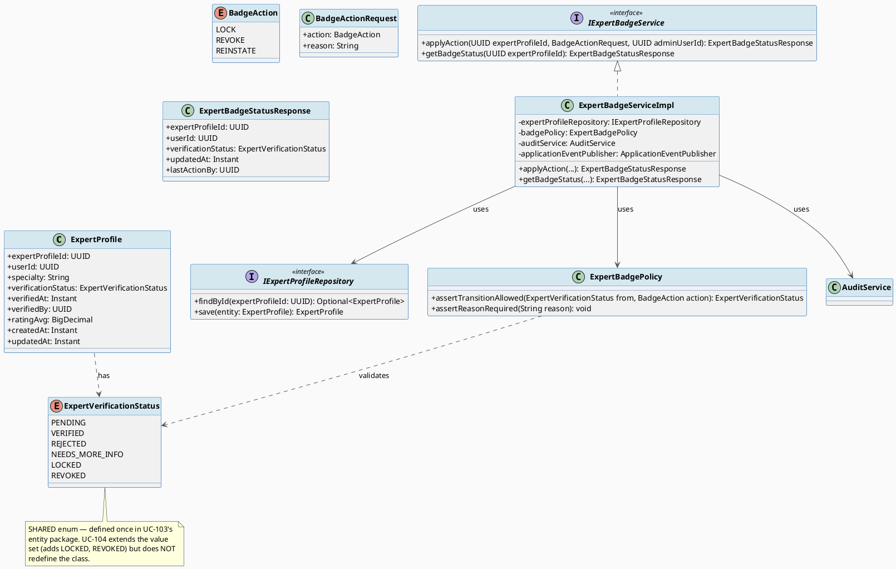
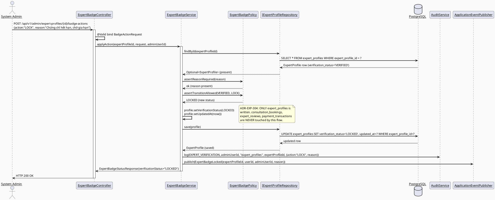
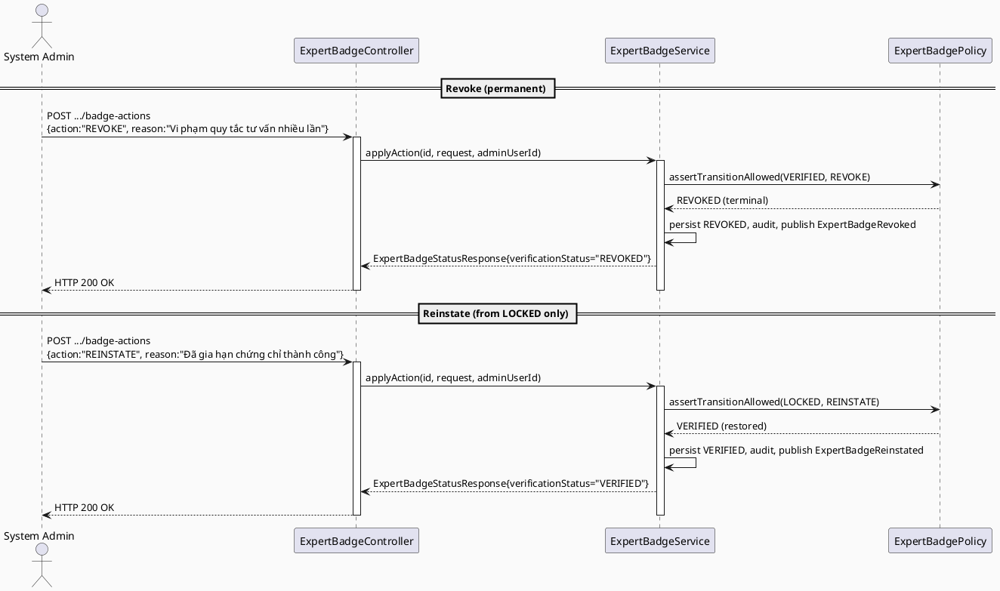
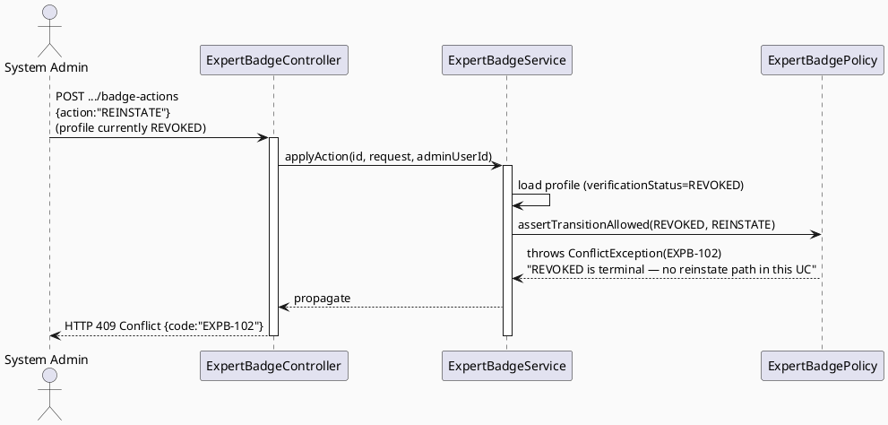
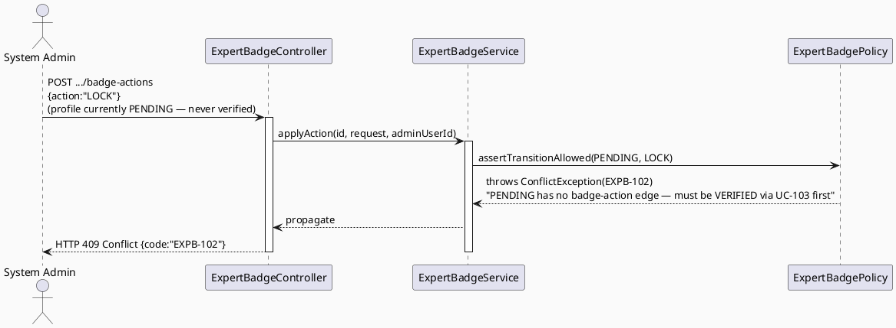
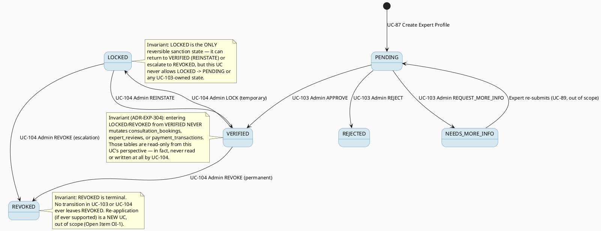

# ENGINEERING DOCUMENTATION STANDARD (EDS) v2.0
# UC-104 Revoke Expert Badge — Technical Design Specification

| Field | Value |
|-------|-------|
| **Document ID** | `CB-EXPGOV-IMP-104` |
| **Version** | `1.0` |
| **Date** | `2026-07-02` |
| **Status** | `Draft` |
| **Document Owner** | `TV4-Lâm` |
| **Author** | `AI Agent (Technical Architect)` |
| **Reviewed by** | `[ ] Pending` |
| **DPO Sign-off** | `[ ] Pending` *(module writes a sanction against an identifiable expert user; also affects consultation-adjacent visibility)* |
| **Approved by** | `[ ] Pending` |
| **Last Review** | `2026-07-02` |
| **Based on EDS** | `v2.0` |

---

## CHANGELOG

| Ngày | Người thực hiện | Nội dung thay đổi |
|------|-----------------|-------------------|
| 2026-07-02 | AI Agent | Khởi tạo TDS cho UC-104, đồng bộ với schema thật `V1__init_schema.sql` (`expert_profiles`) và UC-103's `ExpertVerificationStatus` enum |

---

## MỤC LỤC

1. [Tổng quan Module](#1-tổng-quan-module)
2. [Ma trận Truy vết (Traceability Matrix)](#2-ma-trận-truy-vết-traceability-matrix)
3. [Architecture Decision Records (ADR)](#3-architecture-decision-records-adr)
4. [Non-Functional Requirements & SLA](#4-non-functional-requirements--sla)
5. [Static Modeling](#5-static-modeling-mô-hình-tĩnh)
6. [Dynamic Modeling](#6-dynamic-modeling-mô-hình-động)
7. [Domain Event Catalog](#7-domain-event-catalog)
8. [Interface Specification](#8-interface-specification-đặc-tả-giao-diện)
9. [API Specification](#9-api-specification)
10. [Bảng mã lỗi (Error Codes)](#10-bảng-mã-lỗi-error-codes)
11. [Quy trình Triển khai (Step-by-Step)](#11-quy-trình-triển-khai-step-by-step)
12. [Rollback & Incident Runbook](#12-rollback--incident-runbook)
13. [Kịch bản Kiểm thử Chi tiết](#13-kịch-bản-kiểm-thử-chi-tiết)
14. [Phương pháp Xác minh](#14-phương-pháp-xác-minh)
15. [Mẫu thử thực tế (API Verification Samples)](#15-mẫu-thử-thực-tế-api-verification-samples)
16. [Bảng tổng hợp phân quyền (Authorization Matrix)](#16-bảng-tổng-hợp-phân-quyền-authorization-matrix)
17. [AI Prompt Constraints (CASE 2.0)](#17-ai-prompt-constraints-case-20)
18. [Open Items / Research Gate](#18-open-items--research-gate)

---

## 1. Tổng quan Module

| Field | Value |
|-------|-------|
| **Module Name** | `RevokeExpertBadge` |
| **Bounded Context** | `expert` (backend package `com.carebridge.backend.expert`, admin-facing sub-slice; shares `expert_profiles` table with UC-103) |
| **Function ID / UC** | `3.2.2.6 Revoke Expert Badge` / `UC-104` |
| **Primary Actor** | System Admin |
| **Secondary Actors** | None (SRS §3.2.2.6, line 1118) |
| **Platform** | Web — Admin Portal (React + TypeScript + Vite) |
| **Priority** | High |
| **Frequency of Use** | Occasional (SRS Table 72) |
| **Sprint / Owner** | Sprint 3 "Cross-Domain Integration" — TV4-Lâm (per `function-spec-task-allocation.md`, line 572) |
| **Data Classification** | `PII` (sanction record against an identifiable expert user) |
| **Compliance Scope** | `PDPA` |
| **Upstream Dependencies** | UC-103 Verify Expert Profile (a profile must reach `VERIFIED` before it can be locked/revoked); `auth` (JWT → admin `userId`); `audit` (`AuditService`) |
| **Downstream Consumers** | UC-80/UC-81 View Expert Directory/Profile (must stop surfacing a locked/revoked expert as bookable — out of scope to modify here, informational only), UC-75 Book Private Consultation (must reject new bookings against a non-VERIFIED expert — out of scope, informational only), UC-112 View Expert Dashboard (aggregates revoked/locked counts) |

**Mô tả (SRS):** "Temporarily locks or revokes an expert badge when rules are violated or documents expire." (SRS §3.2.2.6, line 1120)

**Vị trí trong vòng đời hồ sơ chuyên gia:** UC-103 transitions `expert_profiles.verification_status` from `PENDING` to `VERIFIED` (badge granted). UC-104 (tài liệu này) is the **only** SRS-defined path that acts on an already-`VERIFIED` profile to sanction it. Two distinct sanction actions are named in the SRS description — "temporarily locks" and "revokes" — modeled here as two distinct target states (`LOCKED` = temporary, `REVOKED` = permanent) per ADR-EXP-301.

---

## 2. Ma trận Truy vết (Traceability Matrix)

| Requirement ID | Loại (BR/ADR/US) | Mô tả yêu cầu | Thành phần Code | Compliance Target | ADR liên quan |
|----------------|------------------|---------------|-----------------|-------------------|---------------|
| UC-104 (SRS §3.2.2.6, dòng 1113-1132) | User Story | System Admin temporarily locks or revokes an expert badge on rule violation/document expiry | `ExpertBadgeController.POST /api/v1/admin/expert-profiles/{id}/badge-actions` | — | ADR-EXP-301 |
| BR-RBAC | Business Rule | Users may access only functions allowed by their role and permission scope | `@PreAuthorize("hasRole('SYSTEM_ADMIN')")` on all endpoints | — | ADR-EXP-303 |
| PRE-3 (SRS common preconditions) | Precondition | Actor authenticated with required role | Spring Security filter chain + `SecurityUtils.requireCurrentUserId()` | — | ADR-EXP-303 |
| PRE-4 (SRS common preconditions) | Precondition | Required reference data exists when the UC processes an existing record | `findById()` 404 guard; VERIFIED-only precondition guard | — | ADR-EXP-301 |
| POST-2 (SRS common postconditions) | Postcondition | Related records/statuses/notifications updated when applicable | `ExpertProfile.verificationStatus` update to `LOCKED`/`REVOKED`; `notification` module notifies expert | — | ADR-EXP-301 |
| POST-3 (SRS common postconditions) | Postcondition | Sensitive actions recorded for audit, safety, or privacy review | `AuditService.log(EXPERT_VERIFICATION, ...)`; `ExpertBadgeLocked`/`ExpertBadgeRevoked`/`ExpertBadgeReinstated` domain events | PDPA | ADR-EXP-302 |
| E1 (SRS Exceptions) | Exception | Access denied when unauthenticated/unauthorized/out-of-scope | 401/403 responses, EXPB-1xx codes | — | ADR-EXP-303 |
| E2 (SRS Exceptions) | Exception | Invalid/missing/conflicting data rejected with field-level message | Bean Validation + state-machine guard | — | ADR-EXP-301 |
| ADR-EXP-301 | Decision | Badge sanction state machine: `VERIFIED → LOCKED / REVOKED`, `LOCKED → VERIFIED` (reinstate), `LOCKED → REVOKED` (escalate); `REVOKED` terminal | `ExpertVerificationStatus` enum (extended, shared with UC-103), `ExpertBadgePolicy.assertTransitionAllowed()` | — | — |
| ADR-EXP-304 | Decision | Revocation/locking is prospective only — does NOT retroactively alter past completed `consultation_bookings`/`expert_reviews` | `ExpertBadgeServiceImpl.applyAction()` (writes ONLY `expert_profiles`; never touches `consultation_bookings`/`expert_reviews`) | BR-CONSULTATION | — |
| ADR-EXP-302 | Decision | Every badge action emits a domain event + audit log with reviewer identity and reason | `ExpertBadgeServiceImpl.applyAction()` | PDPA | — |
| ADR-EXP-303 | Decision | SYSTEM_ADMIN-only; no MODERATOR access (SRS Primary Actor field states "System Admin" only) | `@PreAuthorize`, §16 Authorization Matrix | — | — |

---

## 3. Architecture Decision Records (ADR)

### ADR-EXP-301 — Badge sanction state machine: LOCKED (temporary) vs REVOKED (permanent)

| Field | Value |
|-------|-------|
| **Status** | `Accepted` |
| **Deciders** | `AI Agent (Technical Architect role)` |
| **Date** | `2026-07-02` |

#### Bối cảnh (Context)
SRS UC-104 description explicitly names two distinct outcomes with different semantics: "**temporarily** locks **or** revokes" (SRS line 1120). This is a real distinction, not synonym repetition — "temporarily locks" implies a state the admin can later reverse (e.g., after the expert resolves a document-expiry issue), while "revokes" implies a more final sanction for rule violations. The existing `verification_status varchar(30)` column (shared with UC-103's `ExpertVerificationStatus` enum) has no DB CHECK constraint (confirmed, `V1__init_schema.sql` lines 786-800, 1799-1809), so this UC extends the SAME enum rather than introducing a parallel status column.

#### Các phương án đã xem xét (Options Considered)

| Phương án | Mô tả | Ưu điểm | Nhược điểm |
|-----------|-------|----------|------------|
| A | Single `SUSPENDED` state covering both "locked" and "revoked" (no distinction) | Simplest | Loses the SRS's explicit "temporarily... or revokes" distinction; cannot tell whether a sanction is meant to be reversible |
| B | Extend `ExpertVerificationStatus` (shared with UC-103) with two new values: `LOCKED` (temporary, reversible to `VERIFIED`) and `REVOKED` (permanent, terminal — no reinstate path in this UC) | Matches SRS wording exactly; reuses the SAME enum class/column as UC-103 (single source of truth for "what is this profile's admin-facing state"); each sanction type has distinct, auditable semantics | Enum now has 6 total values across UC-103+UC-104 (`PENDING`, `VERIFIED`, `REJECTED`, `NEEDS_MORE_INFO`, `LOCKED`, `REVOKED`) — slightly larger surface, but still one column, no schema change |
| C | New separate `badge_status` column via migration, independent from `verification_status` | Cleanest separation of "verification lifecycle" vs "sanction lifecycle" | Requires a schema migration; the schema baseline (`V1__init_schema.sql`) models exactly one status column for `expert_profiles`, and CareBridge delivery rules favor the smallest scoped change — deferred |

#### Quyết định (Decision)
Chọn **Phương án B**. Extend the SAME `ExpertVerificationStatus` enum (defined in UC-103 TDS, package `com.carebridge.backend.expert.entity`) with two additional values: `LOCKED`, `REVOKED`. Full enum (6 values, canonical across UC-103/104/112): `PENDING`, `VERIFIED`, `REJECTED`, `NEEDS_MORE_INFO`, `LOCKED`, `REVOKED`.

**Allowed transitions added by this UC (`ExpertBadgePolicy.assertTransitionAllowed()`):**

| From | To | Trigger (this UC's actions) |
|------|----|------|
| `VERIFIED` | `LOCKED` | Admin action = LOCK (temporary — e.g., document expiry pending renewal) |
| `VERIFIED` | `REVOKED` | Admin action = REVOKE (permanent — e.g., confirmed rule violation) |
| `LOCKED` | `VERIFIED` | Admin action = REINSTATE (temporary lock resolved) |
| `LOCKED` | `REVOKED` | Admin action = REVOKE (escalation from temporary lock to permanent revocation) |
| `REVOKED` | *(none)* | Terminal state — no action in this UC reverses a REVOKED badge (see §18 OI-1 for re-application path, out of scope) |

Any request attempting a transition NOT in this table (e.g., acting on a `PENDING`/`REJECTED`/`NEEDS_MORE_INFO` profile — those belong exclusively to UC-103's state space) is rejected with `EXPB-102` before any write.

#### Hệ quả (Consequences)

**Tích cực:** SRS's "temporarily... or revokes" wording is fully represented; single enum/column keeps UC-103 and UC-104 trivially consistent (no risk of two status columns drifting).

**Tiêu cực / Trade-offs:** UC-103's `ExpertVerificationPolicy` and UC-104's `ExpertBadgePolicy` are two separate policy classes operating on the same enum/column — must be carefully scoped so UC-103's policy never accidentally allows a transition into/out of `LOCKED`/`REVOKED` (defense-in-depth: UC-103's `TRANSITIONS` map only has a `PENDING` entry, so it structurally cannot touch `LOCKED`/`REVOKED`/`VERIFIED`).

**Compliance Impact:** PDPA — sanction actions against an identifiable expert are now clearly split into reversible vs permanent categories, supporting proportionality/accountability review.

---

### ADR-EXP-304 — Revocation/locking is prospective only, never retroactive

| Field | Value |
|-------|-------|
| **Status** | `Accepted` |
| **Date** | `2026-07-02` |

#### Bối cảnh (Context)
This is a task-instruction-flagged research question (RG-4): does revoking a badge retroactively affect PAST completed `consultation_bookings`/`expert_reviews`, or only block FUTURE bookings? SRS UC-104's Postconditions are the generic template ("POST-2. Related CareBridge records, statuses, or notifications are updated when applicable") — it does NOT explicitly say past records are altered, deleted, or hidden. `BR-CONSULTATION` (cited on UC-112, and applicable here since this UC touches the same `expert_profiles` entity feeding consultation flows) requires "booking, payment, dispute, refund, and pricing actions... keep an auditable lifecycle state" — this is a strong signal AGAINST retroactively rewriting history, since doing so would itself break auditability of what already happened.

#### Quyết định (Decision)
**Prospective-only.** `ExpertBadgeServiceImpl.applyAction()` writes ONLY to `expert_profiles` (`verification_status`, `updated_at`; and `verified_by`/`verified_at` are intentionally NOT touched by this UC — see §18 OI-2, those columns remain owned by UC-103's verification act). It NEVER writes to `consultation_bookings`, `consultation_sessions`, `expert_reviews`, `payment_transactions`, `commission_records`, or any other historical table. Concretely:
- Past `consultation_bookings` rows keep whatever `status` they already had (e.g., `COMPLETED`) — untouched.
- Past `expert_reviews` remain visible/unmodified.
- Downstream consumers (UC-75 Book Private Consultation, UC-80/81 View Expert Directory/Profile — both **out of scope** of this UC) are responsible for checking current `verification_status` at their own read/write time to decide whether to allow NEW bookings or surface the expert as bookable. This UC does not — and structurally cannot, since it never queries `consultation_bookings` — reach into those flows.

This is recorded as an **ADR** (not silently assumed) per the task's explicit instruction, since SRS does not state it outright.

#### Hệ quả (Consequences)

**Tích cực:** Historical financial/consultation records remain a stable audit trail (`BR-CONSULTATION` compliant); simpler, safer implementation — no cascading writes across 5+ tables; matches the general CareBridge principle that admin actions in one bounded context should not silently mutate another context's history.

**Tiêu cực / Trade-offs:** A user browsing their OLD consultation history will still see a (now-revoked) expert's name/rating exactly as it was — this is intentional per this ADR, but flagged as Open Item OI-3 for Product/DPO to confirm this is the desired user-facing experience (vs. e.g. showing a "this expert's badge has since been revoked" banner, which would be a UC-80/81 concern, out of scope here).

**Compliance Impact:** PDPA — no unexpected retroactive data mutation; BR-CONSULTATION — auditable lifecycle of past bookings preserved unchanged.

---

### ADR-EXP-303 — SYSTEM_ADMIN-only authorization, no MODERATOR access

| Field | Value |
|-------|-------|
| **Status** | `Accepted` |
| **Date** | `2026-07-02` |

#### Bối cảnh (Context)
Same reasoning as UC-103's ADR-EXP-203: SRS Table 72 "Primary Actor" field states exactly "System Admin" with "Secondary Actors: None." No SRS statement grants MODERATOR access to badge revocation.

#### Quyết định (Decision)
`@PreAuthorize("hasRole('SYSTEM_ADMIN')")` on every UC-104 endpoint. No MODERATOR, CONTENT_ADMIN, or EXPERT role may call these endpoints.

#### Hệ quả (Consequences)
**Tích cực:** Matches SRS exactly; consistent with UC-103's authorization boundary.
**Tiêu cực / Trade-offs:** None beyond UC-103's already-documented trade-off (OI-4 in UC-103 TDS, applies here too).

---

### ADR-EXP-302 — Badge action payload, reason capture, and notification

| Field | Value |
|-------|-------|
| **Status** | `Accepted` |
| **Date** | `2026-07-02` |

#### Bối cảnh (Context)
Same PDPA/audit rationale as UC-103's ADR-EXP-202. A sanction action (LOCK/REVOKE/REINSTATE) needs a documented reason, both for the expert to understand the sanction and for future audit review — this is arguably MORE important than UC-103's verification decision, since it is an adverse action against an already-active expert.

#### Quyết định (Decision)
`BadgeActionRequest` requires an `action` enum value (`LOCK`/`REVOKE`/`REINSTATE`) and a `reason` (`@Size(max = 2000)`), **required (non-blank) for ALL three actions** (stricter than UC-103, where `note` is optional for APPROVE — here, even REINSTATE requires a reason, since un-sanctioning is itself a decision worth recording). On successful action:
1. `expert_profiles.verification_status` updated to the target state (§ADR-EXP-301); `updated_at` bumped.
2. `AuditService.log(AuditAction.EXPERT_VERIFICATION, adminUserId, "expert_profiles", expertProfileId, detailsPayload)` fires (reusing the existing `EXPERT_VERIFICATION` enum value, same as UC-103 — no new `AuditAction` value needed).
3. A domain event (`ExpertBadgeLocked` / `ExpertBadgeRevoked` / `ExpertBadgeReinstated`, §7) is published for the `notification` module (out of scope to modify) to notify the expert.

#### Hệ quả (Consequences)
**Tích cực:** Every sanction and every reversal is reason-documented and auditable; reuses existing `AuditAction.EXPERT_VERIFICATION` value.
**Tiêu cực / Trade-offs:** Requiring a reason on REINSTATE is stricter than SRS explicitly states — flagged as Open Item OI-4 for Product confirmation (default: required, since it is the safer choice for an admin-sanction audit trail).

---

## 4. Non-Functional Requirements & SLA

### 4.1. Performance & Availability

| Category | Requirement | Target SLA | Measurement Method | Compliance Basis |
|----------|-------------|------------|---------------------|------------------|
| Latency | `POST .../badge-actions` (p99) | `< 300ms` | Manual timing / future k6 | — |
| Availability | Uptime (monthly) | `99.9%` | Uptime monitor | — |

### 4.2. Data Integrity & Retention

| Category | Requirement | Target | Verification Method | Compliance Basis |
|----------|-------------|--------|---------------------|------------------|
| Durability | Zero record loss on action | RPO = 0 | Transaction-scoped JPA save | PDPA data integrity |
| Consistency | `verification_status` transitions only via allowed edges (§ADR-EXP-301) | 100% | Unit test on policy; DB spot-check §14.1 | ADR-EXP-301 |
| Non-retroactivity | `consultation_bookings`/`expert_reviews`/`payment_transactions` rows NEVER written by this UC | 100% | Integration test asserting zero writes to those tables | ADR-EXP-304 |
| Auditability | Every action has a matching `AuditService` log entry | 100% | Integration test asserting audit row exists | ADR-EXP-302 |

### 4.3. Security

| Category | Requirement | Target | Verification Method | Compliance Basis |
|----------|-------------|--------|---------------------|------------------|
| Access control | Role-based | `SYSTEM_ADMIN` only | `@PreAuthorize` + E2E role matrix tests | BR-RBAC, ADR-EXP-303 |
| Input validation | Reject invalid transitions/missing reason | 100% | Bean Validation + policy tests | ADR-EXP-301, ADR-EXP-302 |
| Idempotency | Re-applying the same action on an already-sanctioned profile is rejected, not silently re-applied | 100% | EXPB-102 conflict test | ADR-EXP-301 |

### 4.4. Scalability & Capacity Planning
Expected load: low (bounded by number of VERIFIED experts requiring sanction review, expected very low in near term). No special scaling strategy needed.

---

## 5. Static Modeling (Mô hình Tĩnh)

### 5.1. Class Diagram (PlantUML)



### 5.2. Data Structure (Flyway SQL Migration)

**No schema migration required.** `expert_profiles` (`V1__init_schema.sql` lines 786-800) already has the `verification_status varchar(30)` column this UC needs — `LOCKED` (6 chars) and `REVOKED` (7 chars) both fit well within the 30-char limit alongside UC-103's existing 4 values. `consultation_bookings`, `expert_reviews`, `payment_transactions`, `commission_records` are read-verified as **untouched** by this UC (§ADR-EXP-304) — no migration needed for those either.

Reference (existing, unchanged):
```sql
-- From V1__init_schema.sql, lines 786-800 (source of truth — read-only reference)
CREATE TABLE public.expert_profiles (
    expert_profile_id   uuid         NOT NULL DEFAULT gen_random_uuid(),
    user_id             uuid         NOT NULL,
    specialty           varchar(100),
    professional_title  varchar(150),
    experience_years    smallint,
    workplace           varchar(200),
    consultation_scope  text,
    verification_status varchar(30)  NOT NULL DEFAULT 'PENDING',
    verified_at         timestamptz,
    verified_by         uuid,
    rating_avg          numeric,
    created_at          timestamptz  NOT NULL DEFAULT now(),
    updated_at          timestamptz  NOT NULL DEFAULT now()
);
-- PK: expert_profile_id (line 1404-1405); UNIQUE: user_id (line 1523-1524)
-- INDEX: idx_expert_profiles_verification_status (line 1631) — this UC's queries
-- (e.g., "list all VERIFIED/LOCKED/REVOKED experts") benefit from this existing index.

-- Tables verified UNTOUCHED by this UC (ADR-EXP-304):
-- consultation_bookings (lines 876-896), expert_reviews (lines 957-967),
-- payment_transactions (lines 923-939), commission_records (lines 941-955)
```

> **If a future decision requires a dedicated `badge_sanction_history` audit-detail table** (beyond the generic `AuditService` log — e.g., for a structured "sanction reason + expiry review date" record), that would be introduced under migration version **`V20260704100100`** (this UC's assigned range, second slot after UC-103's reserved `V20260704100000`; no collision with `090000`/`110000`/`120000`/`130000` ranges or the confirmed highest existing migration `V20260629000002`). **Not created in this Draft TDS** — flagged Open Item OI-2.

---

## 6. Dynamic Modeling (Mô hình Động)

### 6.1. Sequence Diagram — Happy Path: Lock (temporary) (PlantUML)



### 6.2. Sequence Diagram — Alt Path: Revoke (permanent) and Reinstate (PlantUML)



### 6.3. Sequence Diagram — Error Path: Reinstate on REVOKED rejected (PlantUML)



### 6.4. Sequence Diagram — Error Path: Action on non-VERIFIED/LOCKED profile (e.g., still PENDING) (PlantUML)



### 6.5. State Machine — `ExpertVerificationStatus` (UC-103 + UC-104 combined view)



**Invariant bất biến:**
- `LOCK`/`REVOKE` are only valid from `VERIFIED` (or `LOCKED`→`REVOKED` for escalation) — never from `PENDING`/`REJECTED`/`NEEDS_MORE_INFO` (those belong to UC-103's exclusive state space).
- `REINSTATE` is only valid from `LOCKED` — never from `REVOKED` (terminal) or any UC-103 state.
- No transition ever deletes an `expert_profiles` row, nor writes to `consultation_bookings`/`expert_reviews`/`payment_transactions`/`commission_records` (ADR-EXP-304).

---

## 7. Domain Event Catalog

### 7.1. Events Published (Phát ra)

| Event Name | Trigger | Publisher | Subscriber(s) | Payload Schema | Async? |
|------------|---------|-----------|---------------|----------------|--------|
| `ExpertBadgeLocked` | Successful LOCK action | `ExpertBadgeServiceImpl` | `AuditService` (log), `notification` module (out of scope — notifies expert), UC-80/81 read models (must stop surfacing expert as bookable — out of scope consumer, informational) | `ExpertBadgeLocked.java` | No |
| `ExpertBadgeRevoked` | Successful REVOKE action | `ExpertBadgeServiceImpl` | `AuditService`, `notification` module | `ExpertBadgeRevoked.java` | No |
| `ExpertBadgeReinstated` | Successful REINSTATE action | `ExpertBadgeServiceImpl` | `AuditService`, `notification` module | `ExpertBadgeReinstated.java` | No |

### 7.2. Events Consumed (Tiêu thụ)

None — this UC does not consume domain events from other modules.

### 7.3. Payload Schema

```java
// ExpertBadgeLocked.java / ExpertBadgeRevoked.java / ExpertBadgeReinstated.java
// (identical payload shape, only eventType differs)
public record ExpertBadgeLocked(
    UUID    eventId,          // UUID.randomUUID()
    String  eventType,        // "ExpertBadgeLocked" | "ExpertBadgeRevoked" | "ExpertBadgeReinstated"
    Instant occurredAt,       // Instant.now()
    String  version,          // "1.0"
    Payload payload,
    Metadata metadata
) implements ApplicationEvent {

    public record Payload(
        UUID expertProfileId,
        UUID expertUserId,
        String reason,                        // always non-null per ADR-EXP-302
        ExpertVerificationStatus previousStatus,
        ExpertVerificationStatus newStatus
    ) {}

    public record Metadata(
        UUID   correlationId,
        String causedBy        // adminUserId of the deciding System Admin
    ) {}
}
```

---

## 8. Interface Specification (Đặc tả Giao diện)

### 8.1. Service Interface

```java
// BadgeActionRequest.java — Input DTO
// @version 1.0
public class BadgeActionRequest {
    @NotNull
    private BadgeAction action;   // LOCK | REVOKE | REINSTATE

    @NotBlank
    @Size(max = 2000)
    private String reason;        // REQUIRED for all 3 actions (stricter than UC-103's conditional note — ADR-EXP-302)
    // getters / setters / @Valid annotations
}

// BadgeAction.java — Enum
public enum BadgeAction {
    LOCK,
    REVOKE,
    REINSTATE
}

// ExpertVerificationStatus.java — Enum EXTENDED by this UC (SHARED with UC-103/112; defined once in UC-103's entity package)
public enum ExpertVerificationStatus {
    PENDING,          // UC-103 exclusive
    VERIFIED,         // UC-103 grants; UC-104 sanctions from here
    REJECTED,         // UC-103 exclusive
    NEEDS_MORE_INFO,  // UC-103 exclusive
    LOCKED,           // UC-104 exclusive — temporary sanction
    REVOKED           // UC-104 exclusive — permanent sanction
}

// ExpertBadgeStatusResponse.java — Output DTO
public class ExpertBadgeStatusResponse {
    private UUID expertProfileId;
    private UUID userId;
    private ExpertVerificationStatus verificationStatus;
    private Instant updatedAt;
    private UUID lastActionBy;   // = adminUserId of the most recent LOCK/REVOKE/REINSTATE caller (service-layer tracked, NOT persisted to a new column — see §18 OI-2)
    // getters / setters
}

// IExpertBadgeService.java — Service Contract
// @version 1.0
public interface IExpertBadgeService {
    /**
     * Applies a badge sanction/reinstatement action.
     * @throws ValidationException (EXPB-101) if reason is blank/missing
     * @throws NotFoundException (EXPB-104) if expertProfileId does not exist
     * @throws ConflictException (EXPB-102) if current status has no outgoing edge for the requested action
     * @throws ForbiddenException (EXPB-103) if caller lacks ROLE_SYSTEM_ADMIN (defense-in-depth; primary gate is @PreAuthorize)
     */
    ExpertBadgeStatusResponse applyAction(UUID expertProfileId, BadgeActionRequest request, UUID adminUserId);

    /**
     * @throws NotFoundException (EXPB-104) if expertProfileId does not exist
     */
    ExpertBadgeStatusResponse getBadgeStatus(UUID expertProfileId);
}
```

### 8.2. Repository Interface

```java
// IExpertProfileRepository.java — SHARED with UC-103, extend only if a new query method is needed
// @version 1.0
public interface IExpertProfileRepository extends JpaRepository<ExpertProfile, UUID> {

    Optional<ExpertProfile> findById(UUID expertProfileId);

    Page<ExpertProfile> findByVerificationStatus(ExpertVerificationStatus status, Pageable pageable);  // reused for LOCKED/REVOKED listing too

    // No delete() exposed — expert_profiles rows are never deleted by this module.
    // NO methods added for consultation_bookings/expert_reviews/payment_transactions —
    // this UC intentionally has NO repository dependency on those tables (ADR-EXP-304).
}
```

### 8.3. Policy

```java
// ExpertBadgePolicy.java
// @version 1.0
@Component
public class ExpertBadgePolicy {

    private static final Map<ExpertVerificationStatus, Map<BadgeAction, ExpertVerificationStatus>> TRANSITIONS = Map.of(
        ExpertVerificationStatus.VERIFIED, Map.of(
            BadgeAction.LOCK, ExpertVerificationStatus.LOCKED,
            BadgeAction.REVOKE, ExpertVerificationStatus.REVOKED
        ),
        ExpertVerificationStatus.LOCKED, Map.of(
            BadgeAction.REINSTATE, ExpertVerificationStatus.VERIFIED,
            BadgeAction.REVOKE, ExpertVerificationStatus.REVOKED
        )
    );

    public ExpertVerificationStatus assertTransitionAllowed(ExpertVerificationStatus current, BadgeAction action) {
        Map<BadgeAction, ExpertVerificationStatus> allowed = TRANSITIONS.get(current);
        if (allowed == null || !allowed.containsKey(action)) {
            throw new ConflictException("EXPB-102");
        }
        return allowed.get(action);
    }

    public void assertReasonRequired(String reason) {
        if (reason == null || reason.isBlank()) {
            throw new ValidationException("EXPB-101");
        }
    }
}
```

---

## 9. API Specification

### 9.1. Endpoints Table

| Method | Path | Auth Level | Required Roles | Rate Limit | Idempotent? |
|--------|------|------------|----------------|------------|-------------|
| `GET` | `/api/v1/admin/expert-profiles/{expertProfileId}/badge-status` | JWT Bearer | `SYSTEM_ADMIN` | 300/min | Yes |
| `POST` | `/api/v1/admin/expert-profiles/{expertProfileId}/badge-actions` | JWT Bearer | `SYSTEM_ADMIN` | 30/min | No *(each call attempts a state transition; a second identical call on an already-transitioned resource returns 409, not a duplicate success)* |

### 9.2. Request / Response Schemas

#### `POST /api/v1/admin/expert-profiles/{id}/badge-actions` — Lock/Revoke/Reinstate

**Request Body:**
```json
{
  "action": "LOCK",
  "reason": "Chứng chỉ hành nghề sắp hết hạn, tạm khóa chờ gia hạn."
}
```

**Response — 200 OK (Happy Path):**
```json
{
  "success": true,
  "data": {
    "expertProfileId": "550e8400-e29b-41d4-a716-446655440000",
    "userId": "9c858901-8a57-4791-81fe-4c455b099bc9",
    "verificationStatus": "LOCKED",
    "updatedAt": "2026-07-02T10:15:00.000Z",
    "lastActionBy": "11111111-1111-1111-1111-111111111111"
  },
  "message": "Badge action applied",
  "timestamp": "2026-07-02T10:15:00.000Z"
}
```

**Response — 400 Bad Request (missing reason):**
```json
{
  "success": false,
  "error": { "code": "EXPB-101", "message": "Reason is required for badge actions" }
}
```

**Response — 409 Conflict (invalid transition, e.g. REINSTATE on REVOKED):**
```json
{
  "success": false,
  "error": { "code": "EXPB-102", "message": "Expert profile is not in a state that allows this badge action" }
}
```

**Response — 404 Not Found:**
```json
{
  "success": false,
  "error": { "code": "EXPB-104", "message": "Expert profile not found" }
}
```

---

## 10. Bảng mã lỗi (Error Codes)

| Code | HTTP Status | Message (EN) | Message (VI) | Trigger Condition |
|------|-------------|--------------|--------------|-------------------|
| `EXPB-101` | 400 | Reason required for this badge action | Bắt buộc nhập lý do cho hành động này | `reason` is blank/missing for LOCK, REVOKE, or REINSTATE |
| `EXPB-102` | 409 | Invalid badge state transition | Trạng thái hiện tại không cho phép hành động này | Profile's current `verificationStatus` has no outgoing edge for the requested `action` (§ADR-EXP-301) |
| `EXPB-103` | 403 | Access denied | Không đủ quyền | Caller lacks `SYSTEM_ADMIN` role |
| `EXPB-104` | 404 | Expert profile not found | Không tìm thấy hồ sơ chuyên gia | `expertProfileId` does not exist in `expert_profiles` |
| `EXPB-105` | 500 | Internal error | Lỗi hệ thống | Unexpected failure (DB, mapping) |

> **Note:** Codes use a new `EXPB-` prefix (Expert Badge) distinct from UC-103's `EXPV-` prefix and UC-88's `EXP-` prefix, to avoid collision while all three modules coexist under the same `expert` bounded context. Follow-up unification is a shared Open Item with UC-103 TDS OI-5.

---

## 11. Quy trình Triển khai (Step-by-Step)

### 11.1. Prerequisites

- [ ] ADR-EXP-301, -302, -303, -304 reviewed and Accepted (§3)
- [ ] UC-103 `ExpertVerificationStatus` enum and `ExpertProfile` entity implemented FIRST (this UC extends the same enum/entity, does not redefine it)
- [ ] At least one `expert_profiles` row with `verification_status='VERIFIED'` exists for manual testing (or seed directly in integration tests)
- [ ] `com.carebridge.backend.expert` package skeleton exists (confirmed — `.gitkeep` placeholders present in all layer subfolders)

### 11.2. Pre-Migration Checklist

**N/A — no migration required for this UC** (§5.2). Skip straight to implementation steps.

### 11.3. Implementation Steps

#### Chặng 1 — Extend `ExpertVerificationStatus` enum (do NOT redefine)

File: `05_Development/CareBridgeAPI/src/main/java/com/carebridge/backend/expert/entity/ExpertVerificationStatus.java`

> ⚠️ If UC-103 has already created this file with 4 values, this UC's implementer MUST add `LOCKED`/`REVOKED` to the SAME enum file — never create a second competing enum class. Verify no duplicate class exists before editing.

```java
public enum ExpertVerificationStatus {
    PENDING, VERIFIED, REJECTED, NEEDS_MORE_INFO,  // UC-103
    LOCKED, REVOKED                                 // UC-104 (this UC)
}
```

#### Chặng 2 — Policy

File: `expert/policy/ExpertBadgePolicy.java` — per §8.3.

#### Chặng 3 — Service

File: `expert/service/impl/ExpertBadgeServiceImpl.java`

```java
@Override
@Transactional
public ExpertBadgeStatusResponse applyAction(UUID expertProfileId, BadgeActionRequest request, UUID adminUserId) {
    ExpertProfile profile = expertProfileRepository.findById(expertProfileId)
        .orElseThrow(() -> new NotFoundException("EXPB-104"));

    badgePolicy.assertReasonRequired(request.getReason());
    ExpertVerificationStatus previousStatus = profile.getVerificationStatus();
    ExpertVerificationStatus newStatus = badgePolicy.assertTransitionAllowed(previousStatus, request.getAction());

    profile.setVerificationStatus(newStatus);
    // Note: verifiedAt/verifiedBy are intentionally NOT touched here (owned by UC-103 — see §18 OI-2)
    ExpertProfile saved = expertProfileRepository.save(profile);

    auditService.log(AuditAction.EXPERT_VERIFICATION, adminUserId, "expert_profiles",
        expertProfileId.toString(), Map.of("action", request.getAction(), "reason", request.getReason(),
            "previousStatus", previousStatus, "newStatus", newStatus));

    publishBadgeEvent(saved, request, adminUserId, previousStatus, newStatus);

    return toBadgeStatusResponse(saved, adminUserId);
}
```

> ⚠️ **`applyAction()` MUST NOT inject or call any repository/service for `consultation_bookings`, `expert_reviews`, `payment_transactions`, or `commission_records`** — this is the concrete enforcement of ADR-EXP-304 (verified by AP-AI-006 custom anti-pattern check, §17.4).

#### Chặng 4 — Controller

File: `expert/controller/ExpertBadgeController.java`

```java
@RestController
@RequestMapping("/api/v1/admin/expert-profiles")
@RequiredArgsConstructor
public class ExpertBadgeController {

    private final IExpertBadgeService expertBadgeService;

    @GetMapping("/{expertProfileId}/badge-status")
    @PreAuthorize("hasRole('SYSTEM_ADMIN')")
    public ResponseEntity<ApiResponse<ExpertBadgeStatusResponse>> getBadgeStatus(@PathVariable UUID expertProfileId) {
        return ResponseEntity.ok(ApiResponse.success(expertBadgeService.getBadgeStatus(expertProfileId)));
    }

    @PostMapping("/{expertProfileId}/badge-actions")
    @PreAuthorize("hasRole('SYSTEM_ADMIN')")
    public ResponseEntity<ApiResponse<ExpertBadgeStatusResponse>> applyAction(
            @PathVariable UUID expertProfileId,
            Principal principal,
            @Valid @RequestBody BadgeActionRequest request) {
        UUID adminUserId = SecurityUtils.requireCurrentUserId(principal);
        return ResponseEntity.ok(ApiResponse.success(
            expertBadgeService.applyAction(expertProfileId, request, adminUserId), "Badge action applied"));
    }
}
```

#### Chặng 5 — Web feature (React + TypeScript)

Files under `05_Development/CareBridgeWebApp/src/features/adminExpertGovernance/` (shared feature slice with UC-103):
- `models/expertBadge.ts` — types + Zod schema mirroring §8.1.
- `services/expertBadgeApi.ts` — `getBadgeStatus(id)`, `applyBadgeAction(id, data)` via `apiClient`.
- `pages/ExpertBadgeActionPage.tsx` (or a panel embedded in `ExpertVerificationDetailPage.tsx`, only reachable when `verificationStatus` is `VERIFIED`/`LOCKED`) — Lock/Revoke/Reinstate action form (react-hook-form + Zod resolver + TanStack Query `useMutation`).

```ts
// models/expertBadge.ts (excerpt)
import { z } from 'zod';

export const badgeActionSchema = z.enum(['LOCK', 'REVOKE', 'REINSTATE']);

export const badgeActionRequestSchema = z.object({
  action: badgeActionSchema,
  reason: z.string().min(1, 'Reason is required').max(2000),
});

export type BadgeActionRequest = z.infer<typeof badgeActionRequestSchema>;
```

> The client UI MUST only offer LOCK/REVOKE actions when `verificationStatus === 'VERIFIED'`, REVOKE/REINSTATE when `'LOCKED'`, and hide all badge-action buttons when `'REVOKED'` (terminal) — mirroring §6.5 state machine, so a disallowed action is never even offered, not just rejected server-side.

#### Chặng 6 — Verification sau deploy

```bash
curl -X GET https://[host]/api/v1/health
# Expected: {"status": "ok"}
```

### 11.4. Deployment Checklist

- [ ] `./mvnw clean package` succeeds
- [ ] `./mvnw test` green
- [ ] `npm run build` (web) succeeds
- [ ] `npm run test:run` (web, Vitest) green
- [ ] Manual smoke: SYSTEM_ADMIN logs in, GET a VERIFIED profile's badge-status, LOCK it, re-GET confirms `LOCKED`, REINSTATE it, re-GET confirms `VERIFIED`
- [ ] Audit log shows `EXPERT_VERIFICATION` action with correct payload for each of LOCK/REVOKE/REINSTATE
- [ ] Confirm NO writes occurred to `consultation_bookings`/`expert_reviews` during the smoke test (ADR-EXP-304)

---

## 12. Rollback & Incident Runbook

### 12.1. Điều kiện kích hoạt Rollback (Trigger Conditions)

| Điều kiện | Ngưỡng | Người quyết định |
|-----------|--------|------------------|
| Error rate tăng đột biến | > 5% trong 5 phút | On-call Engineer |
| Non-SYSTEM_ADMIN successfully calls a badge-action endpoint (canary alert) | Bất kỳ case nào | Tech Lead + DPO — **P0 security incident** |
| Write detected against `consultation_bookings`/`expert_reviews`/`payment_transactions` originating from `ExpertBadgeServiceImpl` | Bất kỳ case nào | Tech Lead + DPO — **P0 data integrity incident (ADR-EXP-304 violation)** |

### 12.2. Rollback Procedure

```bash
# No migration to revert (application-layer only feature). Revert code:
git checkout -- 05_Development/CareBridgeAPI/src/main/java/com/carebridge/backend/expert/
git checkout -- 05_Development/CareBridgeWebApp/src/features/adminExpertGovernance/
kubectl rollout undo deployment/carebridge-api
kubectl rollout status deployment/carebridge-api
curl -X GET https://[host]/api/v1/health
```

### 12.3. Notification Protocol

| Thời điểm | Người nhận | Kênh | Template |
|-----------|------------|------|----------|
| Ngay khi phát hiện unauthorized badge action bug | On-call + DPO | Slack `#incident` + Email | "🚨 UC-104 badge action authorization bypass — P0" |
| Ngay khi phát hiện retroactive-write bug (ADR-EXP-304 violation) | On-call + DPO + Tech Lead | Slack `#incident` + Email | "🚨 UC-104 wrote to consultation_bookings/expert_reviews — P0 data integrity" |
| Trong 30 phút | DPO | Email | Bắt buộc — PDPA |

### 12.4. Post-Incident Review (PIR)
Bắt buộc trong 48 giờ. Root cause phải trace lại §ADR-EXP-303 (authorization) hoặc §ADR-EXP-304 (retroactivity) tùy loại sự cố.

---

## 13. Kịch bản Kiểm thử Chi tiết

> Chi tiết đầy đủ nằm ở `UC104_RevokeExpertBadge_Test-Spec.md`. Section này tóm tắt các nhóm scenario bắt buộc.

### 13.1. Unit Tests
- Happy path: LOCK from VERIFIED → LOCKED; REVOKE from VERIFIED → REVOKED; REVOKE from LOCKED → REVOKED (escalation); REINSTATE from LOCKED → VERIFIED.
- Missing reason on any action → EXPB-101.
- Invalid transition (REINSTATE on REVOKED; LOCK/REVOKE on PENDING/REJECTED/NEEDS_MORE_INFO) → EXPB-102.
- Not-found expertProfileId → EXPB-104.
- **Non-retroactivity assertion**: `applyAction()` never invokes any repository for `consultation_bookings`/`expert_reviews`/`payment_transactions` (verified via Mockito `verifyNoInteractions()` on those mocked repositories, even though they are not even injected — structural test).

### 13.2. Integration Tests
- DB row updated with correct `verification_status`; `verified_at`/`verified_by` UNCHANGED from pre-action values (ADR-EXP-302 note).
- Audit log entry created with `EXPERT_VERIFICATION` action.
- Domain event published with correct payload including `previousStatus`/`newStatus`.
- Seeded past `consultation_bookings`/`expert_reviews` rows for the sanctioned expert remain byte-for-byte unchanged after a REVOKE action (ADR-EXP-304 core guarantee).

### 13.3. E2E / Security Tests
- `SYSTEM_ADMIN` role → 200; `MODERATOR`/`EXPERT`/`MOTHER`/unauthenticated → 403/401.
- Full lifecycle: VERIFIED → LOCKED → VERIFIED (reinstate) → LOCKED → REVOKED (escalate) → confirmed terminal (no further action succeeds).

---

## 14. Phương pháp Xác minh

### 14.1. Database Inspection

```sql
-- Verify badge action applied correctly
SELECT expert_profile_id, verification_status, verified_at, verified_by, updated_at
FROM expert_profiles
WHERE expert_profile_id = '<uuid>';
-- Expected: verification_status in ('VERIFIED','LOCKED','REVOKED') post-UC-104 action;
-- verified_at/verified_by IDENTICAL to pre-action snapshot (only UC-103 writes those).

-- Verify no invalid enum value has ever been written (6-value superset check)
SELECT DISTINCT verification_status FROM expert_profiles;
-- Expected: subset of {PENDING, VERIFIED, REJECTED, NEEDS_MORE_INFO, LOCKED, REVOKED}

-- ADR-EXP-304 non-retroactivity spot-check: compare booking/review counts before/after a REVOKE action
SELECT COUNT(*) FROM consultation_bookings WHERE expert_profile_id = '<uuid>';
SELECT COUNT(*) FROM expert_reviews WHERE expert_profile_id = '<uuid>';
-- Expected: counts and row contents IDENTICAL before and after any UC-104 action.
```

### 14.2. Log / Audit Verification

```bash
kubectl logs -l app=carebridge-api | grep '"eventType":"ExpertBadgeLocked"\|"eventType":"ExpertBadgeRevoked"\|"eventType":"ExpertBadgeReinstated"' | head -5
kubectl logs -l app=carebridge-api | jq 'select(.eventType | startswith("ExpertBadge")) | {eventId, occurredAt, payload}'
```

### 14.3. Tool-based Verification

```bash
echo "[JWT_TOKEN]" | cut -d'.' -f2 | base64 -d | jq .
```

---

## 15. Mẫu thử thực tế (API Verification Samples)

### 15.1. Happy Path

```bash
curl -X POST https://[host]/api/v1/admin/expert-profiles/<id>/badge-actions \
  -H "Authorization: Bearer <SYSTEM_ADMIN_JWT>" \
  -H "Content-Type: application/json" \
  -d '{"action": "LOCK", "reason": "Document expiring, pending renewal"}'
```

**Expected Response (200):**
```json
{ "success": true, "data": { "verificationStatus": "LOCKED", "...": "..." }, "message": "Badge action applied" }
```

### 15.2. Error Paths

```bash
# Missing reason -> 400
curl -X POST https://[host]/api/v1/admin/expert-profiles/<id>/badge-actions \
  -H "Authorization: Bearer <SYSTEM_ADMIN_JWT>" -d '{"action": "REVOKE"}'
```
**Expected Response (400):** `{"success": false, "error": {"code": "EXPB-101", ...}}`

```bash
# REINSTATE on REVOKED (terminal) -> 409
curl -X POST https://[host]/api/v1/admin/expert-profiles/<revoked-id>/badge-actions \
  -H "Authorization: Bearer <SYSTEM_ADMIN_JWT>" -d '{"action": "REINSTATE", "reason": "test"}'
```
**Expected Response (409):** `{"success": false, "error": {"code": "EXPB-102", ...}}`

```bash
# MODERATOR role -> 403
curl -X POST https://[host]/api/v1/admin/expert-profiles/<id>/badge-actions \
  -H "Authorization: Bearer <MODERATOR_JWT>" -d '{"action": "LOCK", "reason": "test"}'
```
**Expected Response (403):** `{"success": false, "error": {"code": "EXPB-103", "message": "Access denied"}}`

---

## 16. Bảng tổng hợp phân quyền (Authorization Matrix)

| Endpoint | `GUEST` | `MOTHER`/`FAMILY` | `EXPERT` | `MODERATOR`/`CONTENT_ADMIN` | `SYSTEM_ADMIN` |
|----------|---------|--------|---------|-------|----------|
| `GET /api/v1/admin/expert-profiles/{id}/badge-status` | ❌ 401 | ❌ 403 | ❌ 403 | ❌ 403 | ✅ |
| `POST /api/v1/admin/expert-profiles/{id}/badge-actions` | ❌ 401 | ❌ 403 | ❌ 403 | ❌ 403 | ✅ |

**Chú thích:**
- ✅ = Được phép | ❌ = Bị từ chối
- Per ADR-EXP-303, MODERATOR is explicitly **not** granted access — matches UC-103's boundary exactly, verified against SRS Table 72 Primary Actor field ("System Admin", Secondary Actors: "None").

---

## 17. AI Prompt Constraints (CASE 2.0)

### 17.1 Constraint Summary Table

| # | Constraint | Source (ADR/BR) | Last Verified |
|---|-----------|-----------------|---------------|
| C1 | `adminUserId` MUST be extracted from JWT `Principal` via `SecurityUtils.requireCurrentUserId()`, NEVER from request body or path param | ADR-EXP-302 | 2026-07-02 |
| C2 | `hasRole('SYSTEM_ADMIN')` required via `@PreAuthorize` on BOTH endpoints; NO MODERATOR access permitted | BR-RBAC, ADR-EXP-303 | 2026-07-02 |
| C3 | `ExpertVerificationStatus` MUST be the SAME enum class as UC-103 (extended with `LOCKED`, `REVOKED`) — do NOT create a second/parallel status enum or column | ADR-EXP-301 | 2026-07-02 |
| C4 | `ExpertBadgePolicy.assertTransitionAllowed()` MUST be the single source of truth for allowed transitions (`VERIFIED→LOCKED`, `VERIFIED→REVOKED`, `LOCKED→VERIFIED`, `LOCKED→REVOKED` only) — service layer MUST NOT inline transition logic | ADR-EXP-301 | 2026-07-02 |
| C5 | `reason` is REQUIRED (non-blank) for ALL THREE actions (LOCK/REVOKE/REINSTATE) — stricter than UC-103's conditional note | ADR-EXP-302 | 2026-07-02 |
| C6 | `ExpertBadgeServiceImpl.applyAction()` MUST NOT read or write `consultation_bookings`, `consultation_sessions`, `expert_reviews`, `payment_transactions`, or `commission_records` under ANY circumstance — no repository/service for those tables may be injected into this class | ADR-EXP-304 | 2026-07-02 |
| C7 | `verified_at`/`verified_by` columns are NEVER written by this UC — those remain owned exclusively by UC-103's `ExpertVerificationServiceImpl` | ADR-EXP-302 (implementation note) | 2026-07-02 |
| C8 | `AuditService.log(AuditAction.EXPERT_VERIFICATION, ...)` MUST fire after successful save, reusing the EXISTING `EXPERT_VERIFICATION` enum value — do NOT add a new `AuditAction` value | ADR-EXP-302 | 2026-07-02 |
| C9 | No Flyway migration is created for this UC — `expert_profiles` schema is final as-is per `V1__init_schema.sql` | §5.2 | 2026-07-02 |

### 17.2 Constraint Injection Block (Copy-Paste vào AI Prompt)

```
[CONSTRAINT BLOCK — Module: RevokeExpertBadge (CB-EXPGOV-IMP-104)]
Theo TDS CB-EXPGOV-IMP-104 và các ADR liên quan:

1. (C1 — ADR-EXP-302) adminUserId PHẢI extract từ JWT Principal qua SecurityUtils.requireCurrentUserId().
2. (C2 — BR-RBAC/ADR-EXP-303) @PreAuthorize("hasRole('SYSTEM_ADMIN')") bắt buộc trên CẢ 2 endpoint — KHÔNG cho MODERATOR truy cập.
3. (C3 — ADR-EXP-301) ExpertVerificationStatus PHẢI là CÙNG enum class với UC-103 (mở rộng thêm LOCKED, REVOKED) — KHÔNG tạo enum/column song song.
4. (C4 — ADR-EXP-301) Toàn bộ logic transition PHẢI nằm trong ExpertBadgePolicy.assertTransitionAllowed() (chỉ 4 edges: VERIFIED→LOCKED, VERIFIED→REVOKED, LOCKED→VERIFIED, LOCKED→REVOKED).
5. (C5 — ADR-EXP-302) reason BẮT BUỘC (không blank) cho CẢ 3 action (LOCK/REVOKE/REINSTATE).
6. (C6 — ADR-EXP-304) ExpertBadgeServiceImpl.applyAction() TUYỆT ĐỐI KHÔNG được đọc/ghi consultation_bookings, consultation_sessions, expert_reviews, payment_transactions, commission_records — không inject bất kỳ repository/service nào cho các bảng này.
7. (C7 — ADR-EXP-302) verified_at/verified_by KHÔNG được ghi bởi UC này — chỉ UC-103 sở hữu 2 cột đó.
8. (C8 — ADR-EXP-302) AuditService.log(EXPERT_VERIFICATION, ...) PHẢI gọi sau khi save() thành công — dùng lại enum value CÓ SẴN.
9. (C9) KHÔNG tạo Flyway migration mới cho UC này.

[CONTEXT BLOCK]
- Bounded Context: expert
- Data Classification: PII
- Compliance: PDPA
- Existing interfaces: §8 Service Interface + §8.2/§8.3 Repository/Policy
- Error codes: EXPB-101 to EXPB-105 (§10)
- Auth matrix: §16

[TASK BLOCK]
Implement ExpertBadgeService.applyAction() thỏa mãn constraints trên.
Output phải tuân thủ §8 Interface Specification.
Tests phải cover §13 Test Scenarios (đầy đủ tại Test-Spec), ĐẶC BIỆT test C6 (non-retroactivity).
```

### 17.3 Constraint Quality Checklist

- [x] Mỗi constraint traceable về ADR hoặc BR cụ thể
- [x] Không có constraint generic
- [x] Constraint block có ≥ 5 constraints cụ thể (9 constraints)
- [x] Reference §8 Interface
- [x] Reference §16 Auth Matrix

### 17.4 Anti-Pattern Detection (cho AI-Generated Code từ Block này)

| AP-ID | Anti-Pattern | Dấu hiệu | Hành động |
|-------|-------------|-----------|----------|
| AP-AI-001 | Unconstrained Gen | Code không reference `ExpertBadgePolicy` cho transition logic (C4) | Reject — inject lại constraints |
| AP-AI-003 | Implicit Decision | Code cho phép MODERATOR gọi badge-action endpoint | Reject — CRITICAL, ADR-EXP-303 violation |
| AP-AI-005 | Hallucinated Contract | Code dùng enum values khác 6 giá trị đã định, hoặc tạo enum riêng cho UC-104 | Reject — verify against ADR-EXP-301 exact naming, MUST reuse UC-103's class |
| AP-AI-006 *(custom)* | Retroactive Mutation | Code trong `ExpertBadgeServiceImpl` inject/gọi `ConsultationBookingRepository`, `ExpertReviewRepository`, hoặc bất kỳ repository nào ngoài `IExpertProfileRepository` | **Reject — CRITICAL, ADR-EXP-304 violation.** Đây là anti-pattern nghiêm trọng nhất của UC này. |
| AP-AI-007 *(custom)* | Verification-Field Overreach | Code trong UC-104 ghi vào `verified_at`/`verified_by` | Reject — C7 violation, các cột này chỉ thuộc UC-103 |

---

## 18. Open Items / Research Gate

> Các mục dưới đây KHÔNG được tự ý quyết định — cần Product Owner / Tech Lead xác nhận trước khi implement nếu ảnh hưởng.

| ID | Open Item | Impact if unresolved | Recommendation (non-binding) |
|----|-----------|----------------------|-------------------------------|
| OI-1 | No SRS-defined re-application path exists for a `REVOKED` expert (e.g., can they ever apply again as a brand-new UC-87 submission under the same `user_id`, given `expert_profiles.user_id` has a UNIQUE constraint — line 1523-1524?). | A permanently revoked expert has no documented path back onto the platform; the UNIQUE constraint on `user_id` means even a "new" UC-87 submission would conflict with the existing revoked row. | Recommend Product/Tech Lead clarify: either (a) REVOKED is truly permanent with no re-entry (current TDS assumption), or (b) a future UC must explicitly allow re-opening a REVOKED row back to PENDING (would require a new ADR + possibly relaxing the UNIQUE constraint's interaction with this flow). Not resolved here. |
| OI-2 | `verified_at`/`verified_by` are NOT updated by LOCK/REVOKE/REINSTATE (C7) — meaning after a REVOKE, these columns still show the ORIGINAL UC-103 approval admin/timestamp, not who revoked it. `lastActionBy` in the response DTO is service-computed from the current request, NOT persisted anywhere. | An admin inspecting `expert_profiles` directly (e.g., via DB tooling) cannot see who most recently sanctioned an expert without cross-referencing the `AuditService` log — the entity itself doesn't carry that. | Confirmed via `AuditService.log()` (§7, §10) as the audit trail; if a persisted "last badge action by/at" pair is required on the entity itself, that is a genuine schema gap requiring migration `V20260704100100` (reserved, not created in this Draft). Flagged for Product/DPO decision. |
| OI-3 | ADR-EXP-304 (prospective-only) means end-users browsing OLD consultation history will still see a since-revoked expert's original name/rating with no "revoked" indicator — this UC does not build that UI treatment (belongs to UC-80/81, out of scope). | Users may be confused seeing a "verified-looking" past consultation with an expert who was later revoked. | Recommend a follow-up UC (UC-80/81 revision) to surface a "badge status has changed since this consultation" banner; not blocking for UC-104's own scope. |
| OI-4 | Requiring a `reason` on REINSTATE (not just LOCK/REVOKE) is a TDS-level strictness choice (ADR-EXP-302) not explicitly mandated by SRS wording. | Minor UX friction — admin must type a reason even when un-sanctioning. | Confirmed as the safer default (full audit trail symmetry); Product can relax this in a future revision if it proves too strict in practice. |
| OI-5 | Error code prefix `EXPB-` (this UC) vs `EXPV-` (UC-103) vs `EXP-` (UC-88) — three prefixes coexist in the same `expert` bounded context. | Minor — inconsistent prefixing across sibling UC-87/88/103/104 TDS documents. | Shared with UC-103 TDS OI-5; flag for a future cross-UC error-code unification pass. |
| OI-6 | Rate limit values (300/min status, 30/min action — stricter than UC-103's 60/min decision, reflecting this UC's higher sensitivity) in §9.1 are proposed defaults; no explicit SRS/NFR source specifies these numbers. | Rate limit may need tuning after real usage data. | Treat as a starting default, not a hard requirement. |

---

## PHỤ LỤC

### A. Glossary (Thuật ngữ)

| Thuật ngữ | Định nghĩa |
|-----------|------------|
| Badge Lock | Sanction tạm thời (`LOCKED`), có thể reinstate về `VERIFIED` |
| Badge Revoke | Sanction vĩnh viễn (`REVOKED`), terminal, không có đường quay lại trong UC này |
| Reinstate | Hành động khôi phục một expert từ `LOCKED` về `VERIFIED` |
| `ExpertVerificationStatus` | Enum trạng thái dùng chung UC-103/104/112: PENDING, VERIFIED, REJECTED, NEEDS_MORE_INFO, LOCKED, REVOKED |
| Prospective-only | Nguyên tắc ADR-EXP-304: hành động sanction chỉ ảnh hưởng tương lai, không sửa đổi lịch sử consultation/review đã có |
| PDPA | Nghị định bảo vệ dữ liệu cá nhân Việt Nam |

### B. Tài liệu tham chiếu

| Document | Link / Path |
|----------|-------------|
| SRS UC-104 | `02_Requirements/SRS/3_Functional_Specification.md` §3.2.2.6 (dòng 1113-1132) |
| Real DB schema | `05_Development/CareBridgeAPI/src/main/resources/db/migration/V1__init_schema.sql` (lines 786-800, 876-967, 923-955) |
| Task allocation | `04_Implement/implement_artifacts/function-spec-task-allocation.md` (TV4-Lâm, Sprint 3, line 572) |
| UC103 TDS (shared enum source) | `04_Implement/UC103_VerifyExpertProfile/UC103_VerifyExpertProfile_TDS.md` |
| UC88 TDS (prior-batch, schema corroboration) | `04_Implement/UC88_UpdateExpertProfile/UC88_UpdateExpertProfile_TDS.md` |
| AuditService contract | `05_Development/CareBridgeAPI/src/main/java/com/carebridge/backend/audit/service/AuditService.java` |
| AuditAction enum | `05_Development/CareBridgeAPI/src/main/java/com/carebridge/backend/audit/entity/AuditAction.java` |
| SecurityUtils pattern | `05_Development/CareBridgeAPI/src/main/java/com/carebridge/backend/common/util/SecurityUtils.java` |
| EDS v2.0 Template | `08_References/Template/PHASE-3_TDS.md` |

---

*EDS v2.1 — Tích hợp CASE 2.0 AI Prompt Constraints (§17).*
*Status: Draft — pending Tech Lead / TV4-Lâm review, especially §18 Open Items (OI-1 through OI-6).*
