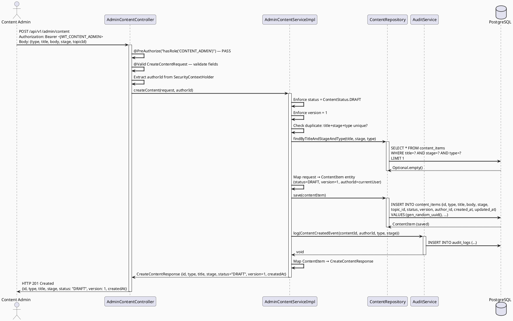
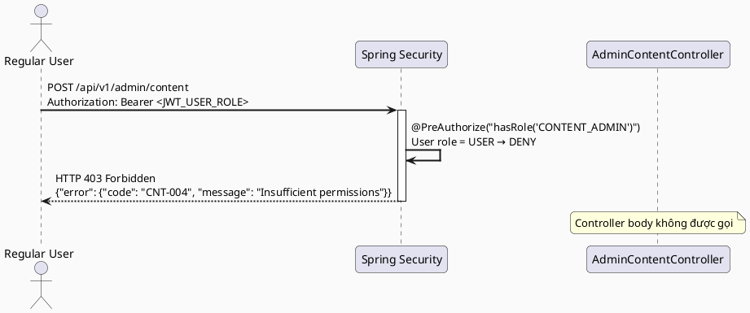
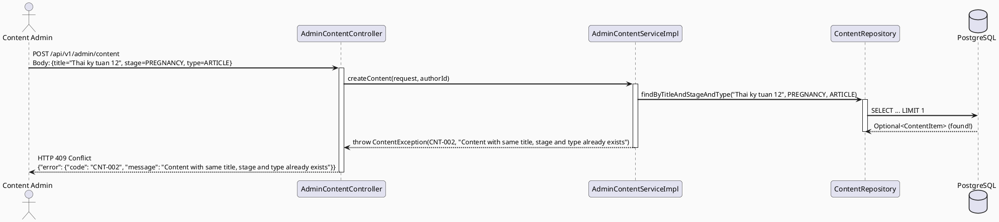
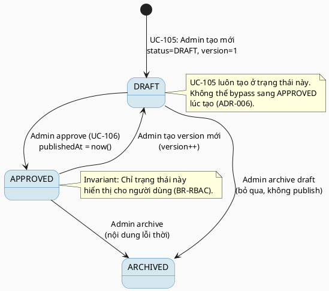

# ENGINEERING DOCUMENTATION STANDARD (EDS) v2.0
# Technical Design Specification — UC-105 Create Content/FAQ/Checklist

| Field              | Value                                   |
| ------------------ | --------------------------------------- |
| **Document ID**    | `CB-CONTENT-IMP-003`                    |
| **Version**        | `1.0`                                   |
| **Date**           | `2026-06-23`                            |
| **Status**         | `Implemented`                           |
| **Document Owner** | `HuyND`                                 |
| **Author**         | `AI Agent — Winston (System Architect)` |
| **Reviewed by**    | `[x] HuyND — 2026-06-24`               |
| **DPO Sign-off**   | `[x] HuyND — 2026-06-24`               |
| **Approved by**    | `[x] HuyND — 2026-06-24`               |
| **Last Review**    | `2026-06-24`                            |
| **Based on EDS**   | `v2.0`                                  |

---

## CHANGELOG

| Ngày       | Người thực hiện                       | Nội dung thay đổi                                                                                                                   |
| ---------- | ------------------------------------- | ----------------------------------------------------------------------------------------------------------------------------------- |
| 2026-06-23 | AI Agent — Winston (System Architect) | Tạo tài liệu lần đầu cho UC-105 Create Content/FAQ/Checklist                                                                       |
| 2026-06-24 | AI Agent — Amelia (Dev Agent)         | Implementation hoàn thành. Tạo V3 migration (stage column), content module (entity/repo/dto/mapper/service/controller), 16 tests GREEN. Status → Approved. |
| 2026-07-02 | AI Agent — Claude (Audit Pass)        | **Corrections (Status kept as `Approved`):** (1) §10 was missing `CNT-003` entirely — `AdminContentServiceImpl.createContent()` actually validates `topicId` via `CommunityTopicRepository.existsById()` and throws `ContentException.topicNotFound()` (`CNT-003`, 400) when invalid, covered by the existing `CNT-TC-008`/`createContent_topicIdNotFound_throwsContentExceptionCnt003` test — added the missing row. (2) §5.1/§5.2's `CreateContentResponse.createdAt: LocalDateTime` corrected to `Instant` (actual field type). (3) §7.3's `ContentCreatedEvent` record does not exist in the codebase — the real implementation calls `auditService.log(...)` directly; annotated as illustrative design intent, not an implemented contract. Cross-doc: this table's new `CNT-003` row also corrects UC-106's TDS, which incorrectly assumed `CNT-003` was unused before UC-106 (see UC-106 TDS §10, fixed in the same audit pass). |
| 2026-07-11 | AI Agent — Codex | Re-verified service/controller implementation; 16/16 focused tests pass. Status synchronized to Implemented. |

---

## MỤC LỤC

1. [Tổng quan Module](#1-tổng-quan-module)
2. [Ma trận Truy vết (Traceability Matrix)](#2-ma-trận-truy-vết-traceability-matrix)
3. [Architecture Decision Records (ADR)](#3-architecture-decision-records-adr)
4. [Non-Functional Requirements & SLA](#4-non-functional-requirements--sla)
5. [Static Modeling (Mô hình Tĩnh)](#5-static-modeling-mô-hình-tĩnh)
6. [Dynamic Modeling (Mô hình Động)](#6-dynamic-modeling-mô-hình-động)
7. [Domain Event Catalog](#7-domain-event-catalog)
8. [Interface Specification (Đặc tả Giao diện)](#8-interface-specification-đặc-tả-giao-diện)
9. [API Specification](#9-api-specification)
10. [Bảng mã lỗi (Error Codes)](#10-bảng-mã-lỗi-error-codes)
11. [Quy trình Triển khai (Step-by-Step)](#11-quy-trình-triển-khai-step-by-step)
12. [Rollback & Incident Runbook](#12-rollback--incident-runbook)
13. [Kịch bản Kiểm thử Chi tiết](#13-kịch-bản-kiểm-thử-chi-tiết)
14. [Phương pháp Xác minh](#14-phương-pháp-xác-minh)
15. [Mẫu thử thực tế (API Verification Samples)](#15-mẫu-thử-thực-tế-api-verification-samples)
16. [Bảng tổng hợp phân quyền (Authorization Matrix)](#16-bảng-tổng-hợp-phân-quyền-authorization-matrix)
17. [AI Prompt Constraints (CASE 2.0)](#17-ai-prompt-constraints-case-20)

---

## 1. Tổng quan Module

> UC-105 cho phép Content Admin tạo mới nội dung ngắn (ARTICLE, FAQ, hoặc CHECKLIST) theo giai đoạn và chủ đề thông qua Admin Web Portal. Nội dung được tạo luôn ở trạng thái DRAFT (version=1) và phải qua quy trình phê duyệt riêng trước khi hiển thị cho người dùng. Đây là tính năng ghi (write), phân quyền chặt chẽ — chỉ role `CONTENT_ADMIN` mới được thực hiện.

| Field                     | Value                                                                                                                 |
| ------------------------- | --------------------------------------------------------------------------------------------------------------------- |
| **Module Name**           | `Create Content / FAQ / Checklist`                                                                                    |
| **Bounded Context**       | `content`                                                                                                             |
| **UC ID**                 | `UC-105`                                                                                                              |
| **SRS Reference**         | `3.2.2.7`                                                                                                             |
| **Platform**              | `Admin Web Portal (React + Vite)`                                                                                     |
| **Data Classification**   | `Internal`                                                                                                            |
| **Compliance Scope**      | `BR-RBAC (CONTENT_ADMIN role required)`                                                                               |
| **Upstream Dependencies** | `security (JWT Auth)`, `identity (User — authorId)`, `community (Topic — topicId validation)`, `audit (AuditService)` |
| **Downstream Consumers**  | `UC-82 (View Content)`, `UC-224 (Search Content)`, `Moderation workflow`                                              |

---

## 2. Ma trận Truy vết (Traceability Matrix)

| Requirement ID | Loại          | Mô tả yêu cầu                                               | Thành phần Code                                            | Compliance Target | ADR liên quan |
| -------------- | ------------- | ----------------------------------------------------------- | ---------------------------------------------------------- | ----------------- | ------------- |
| UC-105         | User Story    | Content Admin tạo mới bài viết, FAQ hoặc checklist          | `AdminContentController.createContent()`                   | BR-RBAC           | ADR-005       |
| BR-RBAC-WRITE  | Business Rule | Chỉ role CONTENT_ADMIN được tạo content                     | `@PreAuthorize("hasRole('CONTENT_ADMIN')")`                | BR-RBAC           | ADR-005       |
| BR-DRAFT       | Business Rule | Nội dung mới tạo luôn có status=DRAFT và version=1          | `AdminContentServiceImpl.createContent()` — hardcode DRAFT | BR-RBAC           | ADR-006       |
| BR-AUDIT       | Business Rule | Mọi hành động tạo content phải được ghi vào audit log       | `AdminContentServiceImpl` → `AuditService.log()`           | Audit             | ADR-007       |
| SRS-3.2.2.7    | Functional    | Admin nhập type, title, body, stage, topicId để tạo content | `CreateContentRequest` DTO với validation                  | —                 | —             |

---

## 3. Architecture Decision Records (ADR)

### ADR-005 — AdminContentController tách biệt khỏi ContentController (user read)

| Field          | Value               |
| -------------- | ------------------- |
| **Status**     | `Accepted`          |
| **Deciders**   | `HuyND — Tech Lead` |
| **Date**       | `2026-06-23`        |
| **Supersedes** | `—`                 |

#### Bối cảnh (Context)
UC-105 (create, CONTENT_ADMIN only) và UC-82 (read, USER+) hoạt động trên cùng entity `ContentItem` nhưng có quyền truy cập hoàn toàn khác nhau. Nếu dùng chung controller sẽ khó maintain và tăng risk nhầm lẫn phân quyền.

#### Các phương án đã xem xét (Options Considered)

| Phương án | Mô tả                                                                                            | Ưu điểm                            | Nhược điểm                          |
| --------- | ------------------------------------------------------------------------------------------------ | ---------------------------------- | ----------------------------------- |
| A         | Chung `ContentController` — phân quyền per method                                                | Ít file                            | Logic phức tạp, route không rõ ràng |
| B         | `AdminContentController` tại `/api/v1/admin/content` + `ContentController` tại `/api/v1/content` | Rõ ràng, dễ audit, route phân biệt | Thêm file                           |

#### Quyết định (Decision)
Chọn **Phương án B** — `AdminContentController` tại `/api/v1/admin/content` với base `@PreAuthorize("hasRole('CONTENT_ADMIN')")` ở class level.

#### Hệ quả (Consequences)

**Tích cực:**
- Route `/api/v1/admin/*` là security boundary rõ ràng
- Dễ kiểm tra audit trail

**Tiêu cực / Trade-offs:**
- Thêm 1 controller class — mitigate bằng shared service

---

### ADR-006 — Nội dung mới tạo luôn ở DRAFT, version=1

| Field          | Value               |
| -------------- | ------------------- |
| **Status**     | `Accepted`          |
| **Deciders**   | `HuyND — Tech Lead` |
| **Date**       | `2026-06-23`        |
| **Supersedes** | `—`                 |

#### Bối cảnh (Context)
BR-RBAC yêu cầu chỉ APPROVED content hiển thị cho user. Nếu cho phép tạo APPROVED trực tiếp thì bỏ qua quy trình kiểm duyệt, vi phạm BR-RBAC.

#### Quyết định (Decision)
`AdminContentServiceImpl.createContent()` hardcode `status = ContentStatus.DRAFT` và `version = 1` bất kể request body có gửi giá trị nào. Client không được override status lúc tạo.

---

### ADR-007 — Audit log bắt buộc cho mọi hành động tạo/sửa/xóa content

| Field          | Value               |
| -------------- | ------------------- |
| **Status**     | `Accepted`          |
| **Deciders**   | `HuyND — Tech Lead` |
| **Date**       | `2026-06-23`        |
| **Supersedes** | `—`                 |

#### Bối cảnh (Context)
Content admin có quyền tạo nội dung ảnh hưởng đến toàn bộ người dùng. Cần audit trail để truy vết khi nội dung không phù hợp được tạo ra.

#### Quyết định (Decision)
Sau khi `contentRepository.save()` thành công, `AdminContentServiceImpl` gọi `AuditService.log(ContentCreatedEvent)` trong cùng transaction.

---

## 4. Non-Functional Requirements & SLA

### 4.1. Performance & Availability

| Category     | Requirement                | Target SLA                          | Measurement Method | Compliance Basis |
| ------------ | -------------------------- | ----------------------------------- | ------------------ | ---------------- |
| Latency      | Create API response (p99)  | `< 500ms`                           | k6 load test       | —                |
| Availability | Uptime (monthly)           | `99.9%`                             | Uptime monitor     | —                |
| Throughput   | Concurrent create requests | `20 req/s` (admin-only, low volume) | Load test          | —                |

### 4.2. Data Integrity & Retention

| Category           | Requirement                                                       | Target | Verification Method         | Compliance Basis |
| ------------------ | ----------------------------------------------------------------- | ------ | --------------------------- | ---------------- |
| DRAFT enforcement  | Mọi ContentItem mới có status=DRAFT, version=1                    | 100%   | Unit test TC-UNIT-002       | ADR-006          |
| Audit completeness | Mọi create action có audit log                                    | 100%   | Integration test TC-INT-002 | ADR-007          |
| Idempotency        | Double-submit không tạo duplicate (title+stage+type unique check) | 100%   | Integration test TC-INT-003 | —                |

### 4.3. Security

| Category              | Requirement                                      | Target | Verification Method      | Compliance Basis |
| --------------------- | ------------------------------------------------ | ------ | ------------------------ | ---------------- |
| Role enforcement      | Chỉ CONTENT_ADMIN được POST                      | 100%   | Security test TC-SEC-001 | BR-RBAC          |
| Input sanitization    | title, body không chứa XSS payload               | 100%   | Security test TC-SEC-002 | OWASP A03        |
| authorId injection    | Client không thể set authorId khác user hiện tại | 100%   | Unit test TC-UNIT-003    | ADR-007          |
| Encryption in transit | TLS 1.3+                                         | 100%   | SSL Labs scan            | —                |

### 4.4. Scalability & Capacity Planning

Admin portal: dự kiến 5-20 content admins, tối đa 100 create operations/day. Không cần scale đặc biệt cho endpoint này.

---

## 5. Static Modeling (Mô hình Tĩnh)

### 5.1. Class Diagram (PlantUML)

```plantuml
@startuml UC105_CreateContent_ClassDiagram
skinparam classAttributeIconSize 0
skinparam classFontStyle bold
skinparam backgroundColor #FAFAFA
skinparam ArrowColor #555555
skinparam ClassBorderColor #2E75B6
skinparam ClassHeaderBackgroundColor #D5E8F0

' === REQUEST DTO ===
class CreateContentRequest {
  + type: ContentType          // required: ARTICLE, FAQ, CHECKLIST
  + title: String              // required, max 500 chars
  + body: String               // required for ARTICLE/FAQ; optional for CHECKLIST
  + stage: ContentStage        // required
  + topicId: UUID              // optional
}

' === RESPONSE DTO ===
class CreateContentResponse {
  + id: UUID
  + type: ContentType
  + title: String
  + stage: ContentStage
  + status: String             // always "DRAFT"
  + version: Integer           // always 1
  + createdAt: Instant
}

' === ADMIN CONTROLLER ===
class AdminContentController {
  - adminContentService: AdminContentService
  + createContent(request: CreateContentRequest, principal: Authentication): ResponseEntity<CreateContentResponse>
}

' === ADMIN SERVICE ===
interface AdminContentService {
  + createContent(request: CreateContentRequest, authorId: UUID): CreateContentResponse
}

class AdminContentServiceImpl {
  - contentRepository: ContentRepository
  - contentMapper: ContentMapper
  - auditService: AuditService
  + createContent(request, authorId): CreateContentResponse
}

' === SHARED SERVICE (from UC-82) ===
interface ContentService {
  + getContents(filter, pageable): Page<ContentListResponse>
  + getContentById(id): ContentDetailResponse
  + getChecklists(stage): List<ChecklistTemplateResponse>
}

' === SHARED REPOSITORY (from UC-82) ===
interface ContentRepository {
  + save(entity: ContentItem): ContentItem
  + findByTitleAndStageAndType(title, stage, type): Optional<ContentItem>
}

' === AUDIT SERVICE ===
interface AuditService {
  + log(event: ContentCreatedEvent): void
}

' === MAPPER ===
class ContentMapper {
  + toEntity(request: CreateContentRequest, authorId: UUID): ContentItem
  + toCreateResponse(entity: ContentItem): CreateContentResponse
}

' === RELATIONSHIPS ===
AdminContentController --> AdminContentService : uses
AdminContentServiceImpl ..|> AdminContentService : implements
AdminContentServiceImpl --> ContentRepository : uses
AdminContentServiceImpl --> ContentMapper : uses
AdminContentServiceImpl --> AuditService : uses

@enduml
```



### 5.2. JPA Entity (Java) — Reuse từ UC-82

```java
// ContentItem.java — reuse từ UC-82 (CB-CONTENT-IMP-001)
// Không có thay đổi entity structure
// Xem: UC82_ViewContentAndChecklist_TDS.md §5.2

// CreateContentRequest.java — com.carebridge.backend.content.dto.request
@Getter
@Setter
@NoArgsConstructor
public class CreateContentRequest {

    @NotNull(message = "Content type is required")
    private ContentType type;

    @NotBlank(message = "Title is required")
    @Size(max = 500, message = "Title max length is 500")
    private String title;

    @Size(max = 50000, message = "Body max length is 50000")
    private String body;   // Optional for CHECKLIST type

    @NotNull(message = "Stage is required")
    private ContentStage stage;

    private UUID topicId;  // Optional
}

// CreateContentResponse.java — com.carebridge.backend.content.dto.response
@Getter
@Builder
public class CreateContentResponse {
    private UUID id;
    private ContentType type;
    private String title;
    private ContentStage stage;
    private String status;     // Always "DRAFT"
    private Integer version;   // Always 1
    private Instant createdAt;  // audit correction (2026-07-02): actual code uses Instant, not LocalDateTime
}
```

---

## 6. Dynamic Modeling (Mô hình Động)

### 6.1. Sequence Diagram — Happy Path (PlantUML)



### 6.2. Sequence Diagram — Error Path: Không đủ quyền (PlantUML)



### 6.3. Sequence Diagram — Error Path: Duplicate Content (PlantUML)



### 6.4. State Machine — ContentItem Status (bao gồm UC-105)



---

## 7. Domain Event Catalog

### 7.1. Events Published (Phát ra)

| Event Name       | Trigger                              | Publisher                 | Subscriber(s)  | Payload Schema | Async?                              |
| ---------------- | ------------------------------------ | ------------------------- | -------------- | -------------- | ----------------------------------- |
| `ContentCreated` | Admin tạo ContentItem mới thành công | `AdminContentServiceImpl` | `AuditService` | Xem §7.3       | No (sync — audit trong transaction) |

### 7.2. Events Consumed (Tiêu thụ)

| Event Name | Source | Handler | Action thực hiện                              |
| ---------- | ------ | ------- | --------------------------------------------- |
| —          | —      | —       | Module này không consume event từ module khác |

### 7.3. Payload Schema

> **Audit correction (2026-07-02):** `ContentCreatedEvent` below does **not** exist as a class in the
> codebase — verified, no such file under `com.carebridge.backend.content`. The actual implementation calls
> `auditService.log(AuditAction.CONTENT_CREATED, authorUserId, "ContentItem", entity.getId().toString(),
> "created")` directly (`AdminContentServiceImpl.createContent()`) — a plain method call, not a published
> domain-event object with this payload shape. The record below documents the *original design intent*, not
> what was built; treat it as illustrative/aspirational, not a contract to implement against.

```java
// ContentCreatedEvent.java — com.carebridge.backend.content.entity (domain event) — NOT IMPLEMENTED, see note above
public record ContentCreatedEvent(
    String eventId,            // UUID
    String eventType,          // "ContentCreated"
    LocalDateTime occurredAt,
    String version,            // "1.0"
    Payload payload,
    Metadata metadata
) {
    public record Payload(
        UUID contentId,
        ContentType contentType,
        ContentStage stage,
        String title,
        UUID authorId
    ) {}

    public record Metadata(
        String correlationId,   // X-Correlation-Id header
        String causedBy         // authorId (userId của content admin)
    ) {}
}
```

---

## 8. Interface Specification (Đặc tả Giao diện)

### 8.1. Service Interface

```java
// AdminContentService.java — com.carebridge.backend.content.service
// @version 1.0

package com.carebridge.backend.content.service;

public interface AdminContentService {

    /**
     * Tạo mới ContentItem với status=DRAFT và version=1.
     * authorId được lấy từ tham số, KHÔNG nhận từ request body.
     * Audit log được tạo sau khi save thành công (ADR-007).
     *
     * @param request CreateContentRequest — type, title, body, stage, topicId
     * @param authorId UUID của content admin đang đăng nhập (từ SecurityContext)
     * @throws ContentException(CNT-002) Nếu đã tồn tại content cùng title+stage+type
     * @throws ContentException(CNT-001) Nếu request validation fail
     */
    CreateContentResponse createContent(CreateContentRequest request, UUID authorId);
}
```

### 8.2. Repository Interface

```java
// ContentRepository.java (bổ sung method cho UC-105) — com.carebridge.backend.content.repository
// @version 1.0

@Repository
public interface ContentRepository extends JpaRepository<ContentItem, UUID> {

    // Existing methods from UC-82...

    /**
     * Kiểm tra duplicate: tìm ContentItem có cùng title, stage, type (bất kể status).
     * Dùng để prevent duplicate content khi tạo mới.
     */
    Optional<ContentItem> findByTitleIgnoreCaseAndStageAndType(
        String title,
        ContentStage stage,
        ContentType type
    );
}
```

---

## 9. API Specification

### 9.1. Endpoints Table

| Method | Path                    | Auth Level | Required Roles  | Rate Limit | Idempotent? |
| ------ | ----------------------- | ---------- | --------------- | ---------- | ----------- |
| `POST` | `/api/v1/admin/content` | JWT Bearer | `CONTENT_ADMIN` | 60/min     | No          |

### 9.2. Request / Response Schemas

#### `POST /api/v1/admin/content` — Tạo nội dung mới

**Request Body:**
```json
{
  "type": "ARTICLE",
  "title": "Chăm sóc sức khỏe thai kỳ tuần 12",
  "body": "<p>Nội dung chi tiết về chăm sóc thai kỳ tuần 12...</p>",
  "stage": "PREGNANCY",
  "topicId": "7c9e6679-7425-40de-944b-e07fc1f90ae7"
}
```

**Validation Rules:**

| Field     | Rule                                                         | Error khi vi phạm |
| --------- | ------------------------------------------------------------ | ----------------- |
| `type`    | Required, ENUM[ARTICLE/FAQ/CHECKLIST]                        | CNT-001           |
| `title`   | Required, not blank, max 500 chars                           | CNT-001           |
| `body`    | Optional cho CHECKLIST, max 50000 chars                      | CNT-001           |
| `stage`   | Required, ENUM[PRE_PREGNANCY/PREGNANCY/POSTPARTUM/BABY_CARE] | CNT-001           |
| `topicId` | Optional, valid UUID format                                  | CNT-001           |

**Response — 201 Created:**
```json
{
  "id": "a1b2c3d4-e5f6-7890-abcd-ef1234567890",
  "type": "ARTICLE",
  "title": "Chăm sóc sức khỏe thai kỳ tuần 12",
  "stage": "PREGNANCY",
  "status": "DRAFT",
  "version": 1,
  "createdAt": "2026-06-23T10:30:00.000Z"
}
```

**Response — 400 Bad Request (Validation):**
```json
{
  "error": {
    "code": "CNT-001",
    "message": "Validation failed",
    "details": [
      { "field": "title", "message": "Title is required" },
      { "field": "type", "message": "Content type is required" }
    ]
  }
}
```

**Response — 401 Unauthorized:**
```json
{
  "error": {
    "code": "IAM-001",
    "message": "Authentication required"
  }
}
```

**Response — 403 Forbidden:**
```json
{
  "error": {
    "code": "CNT-004",
    "message": "Insufficient permissions. Required role: CONTENT_ADMIN"
  }
}
```

**Response — 409 Conflict (Duplicate):**
```json
{
  "error": {
    "code": "CNT-002",
    "message": "Content with same title, stage and type already exists"
  }
}
```

---

## 10. Bảng mã lỗi (Error Codes)

| Code      | HTTP Status | Message (EN)                                           | Message (VI)         | Trigger Condition                                                               |
| --------- | ----------- | ------------------------------------------------------ | -------------------- | ------------------------------------------------------------------------------- |
| `CNT-001` | 400         | Validation failed                                      | Dữ liệu không hợp lệ | type/stage enum sai; title blank/quá dài; body quá dài; topicId không phải UUID |
| `CNT-002` | 409         | Content with same title, stage and type already exists | Nội dung trùng lặp   | Tồn tại ContentItem với title+stage+type giống nhau                             |
| `CNT-003` | 400         | Topic not found: {topicId}                              | Topic không tồn tại  | `topicId` được cung cấp nhưng `CommunityTopicRepository.existsById(topicId)` trả về false — **audit fix (2026-07-02): missing from this table originally**, verified present in `AdminContentServiceImpl.createContent()` and covered by `CNT-TC-008`/`createContent_topicIdNotFound_throwsContentExceptionCnt003` |
| `CNT-004` | 403         | Insufficient permissions                               | Không đủ quyền       | User không có role CONTENT_ADMIN                                                |
| `CNT-005` | 500         | Internal server error                                  | Lỗi hệ thống         | Database save error, audit log failure                                          |
| `IAM-001` | 401         | Authentication required                                | Yêu cầu xác thực     | Không có JWT hoặc JWT không hợp lệ                                              |

---

## 11. Quy trình Triển khai (Step-by-Step)

### 11.1. Prerequisites

- [ ] UC-82 đã được triển khai (bảng `content_items` và entities đã tồn tại)
- [ ] ADR-005, ADR-006, ADR-007 đã được Accepted
- [ ] `CONTENT_ADMIN` role đã được định nghĩa trong `identity.entity.Role`
- [ ] `AuditService` interface đã tồn tại trong `audit.service`
- [ ] Môi trường staging đã sẵn sàng

### 11.2. Pre-Migration Checklist

- [ ] Không có migration mới — reuse schema từ UC-82
- [ ] Verify `CONTENT_ADMIN` role tồn tại trong bảng `roles`
- [ ] Verify `AuditService.log()` hoạt động trên staging

### 11.3. Implementation Steps

#### Chặng 1 — Không cần migration mới

Bảng `content_items` đã được tạo trong UC-82 (V001). Không cần migration thêm.

> ⚠️ **Chú ý:** Nếu chạy UC-105 trước UC-82, phải chạy migration V001 của UC-82 trước.

#### Chặng 2 — Backend Implementation

Thứ tự implement (tái sử dụng entity và repository từ UC-82):
1. DTO: `CreateContentRequest` (validation annotations), `CreateContentResponse`
2. Repository: Thêm `findByTitleIgnoreCaseAndStageAndType()` vào `ContentRepository`
3. Mapper: Thêm `toEntity()` và `toCreateResponse()` vào `ContentMapper`
4. Service interface: `AdminContentService`
5. Service impl: `AdminContentServiceImpl`
   - `createContent()`: enforce DRAFT, version=1, authorId từ param
   - Gọi `AuditService.log(ContentCreatedEvent)` sau khi save
6. Controller: `AdminContentController` tại `/api/v1/admin/content`
   - Class-level `@PreAuthorize("hasRole('CONTENT_ADMIN')")`
   - Extract authorId từ `Authentication.getPrincipal()`

#### Chặng 3 — Verification

```bash
# Tạo content với CONTENT_ADMIN JWT
curl -X POST "https://carebridge-api/api/v1/admin/content" \
  -H "Authorization: Bearer $CONTENT_ADMIN_JWT" \
  -H "Content-Type: application/json" \
  -d '{"type":"ARTICLE","title":"Test Title","body":"Test body","stage":"PREGNANCY"}'
# Expected: 201 Created với status="DRAFT", version=1

# Kiểm tra audit log
psql -h $DB_HOST -U $DB_USER -d $DB_NAME -c \
  "SELECT * FROM audit_logs WHERE event_type='ContentCreated' ORDER BY created_at DESC LIMIT 1;"
```

### 11.4. Deployment Checklist

- [ ] POST /api/v1/admin/content với CONTENT_ADMIN JWT → 201 Created
- [ ] POST /api/v1/admin/content với USER JWT → 403
- [ ] POST /api/v1/admin/content không có JWT → 401
- [ ] Audit log được tạo sau mỗi content creation
- [ ] Response luôn có `status: "DRAFT"` và `version: 1`

---

## 12. Rollback & Incident Runbook

### 12.1. Điều kiện kích hoạt Rollback

| Điều kiện                            | Ngưỡng      | Người quyết định              |
| ------------------------------------ | ----------- | ----------------------------- |
| Content được tạo với status != DRAFT | Bất kỳ case | Tech Lead (ADR-006 violation) |
| Audit log không được tạo             | > 1 case    | Tech Lead (ADR-007 violation) |
| USER role có thể tạo content         | Bất kỳ case | Tech Lead (BR-RBAC violation) |
| Error rate > 5% trong 5 phút         | —           | On-call Engineer              |

### 12.2. Rollback Procedure

```bash
# Bước 1: Re-deploy phiên bản cũ
kubectl rollout undo deployment/carebridge-api

# Bước 2: Verify rollback
kubectl rollout status deployment/carebridge-api

# Bước 3: Xóa content DRAFT được tạo sai (nếu có)
# (chỉ xóa content với status=DRAFT trong khoảng thời gian incident)
psql -h $DB_HOST -U $DB_USER -d $DB_NAME -c \
  "SELECT id, title, status, created_at FROM content_items
   WHERE created_at BETWEEN '<incident_start>' AND '<incident_end>'
   AND status = 'DRAFT';"
-- Review trước, không xóa tự động
```

### 12.3. Notification Protocol

| Thời điểm          | Người nhận   | Kênh              | Template                                                                             |
| ------------------ | ------------ | ----------------- | ------------------------------------------------------------------------------------ |
| Ngay khi phát hiện | On-call team | Slack `#incident` | "INCIDENT [CONTENT-ADMIN]: BR-RBAC violation — non-CONTENT_ADMIN có thể tạo content" |
| Trong 30 phút      | Tech Lead    | Email             | Chi tiết incident                                                                    |

### 12.4. Post-Incident Review (PIR)

- **Root Cause:** Kiểm tra `@PreAuthorize` annotation có bị remove không
- **Prevention:** Thêm test TC-SEC-001 (USER role → 403) vào CI pipeline

---

## 13. Kịch bản Kiểm thử Chi tiết

### 13.1. Unit Tests

#### TC-UNIT-001 — createContent trả về DRAFT với version=1

```gherkin
Feature: Create Content
  Background:
    Given test data classification: SYNTHETIC
    And ContentRepository được mock
    And AuditService được mock

  Scenario: Tạo ARTICLE hợp lệ
    Given ContentRepository.findByTitleIgnoreCaseAndStageAndType trả về Optional.empty()
    And ContentRepository.save trả về ContentItem với id mới
    When AdminContentServiceImpl.createContent(request{type=ARTICLE, title="Test", stage=PREGNANCY}, authorId) được gọi
    Then ContentRepository.save được gọi với ContentItem có status=DRAFT và version=1
    And AuditService.log được gọi với ContentCreatedEvent
    And kết quả CreateContentResponse có status="DRAFT" và version=1
    And kết quả không có authorId trong response
```

#### TC-UNIT-002 — Không thể override status hoặc version từ request

```gherkin
  Scenario: Client cố gắng set status=APPROVED qua request body (nếu có field đó)
    Given request body bất kỳ (dù có hay không có status field)
    When AdminContentServiceImpl.createContent(request, authorId) được gọi
    Then entity được save có status = ContentStatus.DRAFT (hardcoded)
    And entity được save có version = 1 (hardcoded)
```

#### TC-UNIT-003 — authorId lấy từ SecurityContext, không từ request

```gherkin
  Scenario: authorId trong entity phải là userId của người dùng đang đăng nhập
    Given SecurityContext chứa user với id = "admin-user-uuid"
    And request body không có field authorId
    When POST /api/v1/admin/content được gọi
    Then entity được save có authorId = "admin-user-uuid"
    And authorId trong entity KHÔNG phải giá trị từ request body
```

#### TC-UNIT-004 — Duplicate content ném ContentException(CNT-002)

```gherkin
  Scenario: Duplicate title+stage+type
    Given ContentRepository.findByTitleIgnoreCaseAndStageAndType trả về Optional<ContentItem> (found)
    When AdminContentServiceImpl.createContent(request, authorId) được gọi
    Then ContentException với code CNT-002 và HTTP 409 được ném
    And ContentRepository.save KHÔNG được gọi
    And AuditService.log KHÔNG được gọi
```

### 13.2. Integration Tests

#### TC-INT-001 — POST /api/v1/admin/content tạo record trong database

```gherkin
  Scenario: Tạo ARTICLE thành công
    Given test data classification: SYNTHETIC
    And user có role CONTENT_ADMIN với JWT hợp lệ
    And database không có ContentItem với title="Integration Test Article", stage=PREGNANCY, type=ARTICLE
    When POST /api/v1/admin/content được gọi với body:
      | type  | ARTICLE |
      | title | Integration Test Article |
      | body  | Test body content |
      | stage | PREGNANCY |
    Then response status là 201
    And response body có status="DRAFT" và version=1
    And database chứa 1 record với title="Integration Test Article" và status=DRAFT
    And response body không có field authorId
```

#### TC-INT-002 — Audit log được tạo sau khi content creation

```gherkin
  Scenario: Audit log tồn tại sau khi create thành công
    Given test data classification: SYNTHETIC
    And user có role CONTENT_ADMIN
    When POST /api/v1/admin/content được gọi thành công
    Then audit_logs table chứa record với event_type="ContentCreated"
    And audit log chứa contentId = id của ContentItem mới tạo
    And audit log chứa authorId = userId của content admin
```

#### TC-INT-003 — Double-submit tạo conflict 409

```gherkin
  Scenario: Gửi cùng 1 request 2 lần
    Given test data classification: SYNTHETIC
    And user có role CONTENT_ADMIN
    And lần đầu POST /api/v1/admin/content với title="Dup Test", stage=PREGNANCY, type=FAQ → 201 Created
    When lần hai POST /api/v1/admin/content với cùng title+stage+type
    Then response status là 409
    And response chứa error code CNT-002
    And database chỉ có 1 record với title="Dup Test"
```

### 13.3. Security Tests

#### TC-SEC-001 — USER role không thể tạo content

```gherkin
  Scenario: User thường cố gắng tạo content
    Given test data classification: SYNTHETIC
    And user có role USER (không phải CONTENT_ADMIN)
    When POST /api/v1/admin/content được gọi với JWT của USER role
    Then response status là 403
    And response chứa error code CNT-004
    And database KHÔNG chứa record mới nào
    And AuditService.log KHÔNG được gọi
```

#### TC-SEC-002 — XSS payload trong body bị xử lý an toàn

```gherkin
  Scenario: Body chứa XSS payload
    Given test data classification: SYNTHETIC
    And user có role CONTENT_ADMIN
    When POST /api/v1/admin/content với body = "<script>alert('xss')</script>"
    Then response status là 201 (input được lưu as-is, XSS escaped khi render)
    And database lưu body với HTML entities escaped (hoặc raw, tùy frontend render strategy)
    And không có JavaScript execution trên server side
```

#### TC-SEC-003 — Không có JWT bị từ chối

```gherkin
  Scenario: Request không có Authorization header
    When POST /api/v1/admin/content được gọi không có JWT
    Then response status là 401
    And response chứa error code IAM-001
```

---

## 14. Phương pháp Xác minh

### 14.1. Database Inspection

```sql
-- Verify content vừa tạo có status=DRAFT và version=1
SELECT id, type, title, stage, status, version, author_id, created_at
FROM content_items
WHERE created_at >= now() - interval '5 minutes'
ORDER BY created_at DESC;

-- Verify audit log tồn tại
SELECT id, event_type, entity_id, actor_id, created_at
FROM audit_logs
WHERE event_type = 'ContentCreated'
ORDER BY created_at DESC LIMIT 5;

-- Verify không có content nào được tạo với status != DRAFT
SELECT COUNT(*) FROM content_items
WHERE status != 'DRAFT'
AND created_at >= now() - interval '1 hour';
-- Expected: số này bằng số content đã được approve (không phải 0 sau approve)
```

### 14.2. Log / Audit Verification

```bash
# Kiểm tra ContentCreated event
kubectl logs -l app=carebridge-api | grep '"eventType":"ContentCreated"' | head -5

# Verify authorId trong audit log khớp với token subject
kubectl logs -l app=carebridge-api | grep '"eventType":"ContentCreated"' | jq '.payload.authorId'
```

### 14.3. Role-based Verification

```bash
# Verify CONTENT_ADMIN có thể tạo (expect 201)
curl -X POST "https://carebridge-api/api/v1/admin/content" \
  -H "Authorization: Bearer $CONTENT_ADMIN_JWT" \
  -H "Content-Type: application/json" \
  -d '{"type":"FAQ","title":"Verify Test FAQ","stage":"PREGNANCY"}' \
  -w "\nHTTP Status: %{http_code}"
# Expected HTTP Status: 201

# Verify USER không thể tạo (expect 403)
curl -X POST "https://carebridge-api/api/v1/admin/content" \
  -H "Authorization: Bearer $USER_JWT" \
  -H "Content-Type: application/json" \
  -d '{"type":"FAQ","title":"Should Fail","stage":"PREGNANCY"}' \
  -w "\nHTTP Status: %{http_code}"
# Expected HTTP Status: 403
```

---

## 15. Mẫu thử thực tế (API Verification Samples)

### 15.1. Happy Path

```bash
# Tạo ARTICLE mới
curl -X POST "https://carebridge-api/api/v1/admin/content" \
  -H "Authorization: Bearer $CONTENT_ADMIN_JWT" \
  -H "Content-Type: application/json" \
  -H "X-Correlation-Id: $(uuidgen)" \
  -d '{
    "type": "ARTICLE",
    "title": "Chăm sóc sức khỏe thai kỳ tuần 12",
    "body": "<p>Nội dung chi tiết...</p>",
    "stage": "PREGNANCY",
    "topicId": "7c9e6679-7425-40de-944b-e07fc1f90ae7"
  }'
```

**Expected Response (201 Created):**
```json
{
  "id": "a1b2c3d4-e5f6-7890-abcd-ef1234567890",
  "type": "ARTICLE",
  "title": "Chăm sóc sức khỏe thai kỳ tuần 12",
  "stage": "PREGNANCY",
  "status": "DRAFT",
  "version": 1,
  "createdAt": "2026-06-23T10:30:00.000Z"
}
```

```bash
# Tạo CHECKLIST (body optional)
curl -X POST "https://carebridge-api/api/v1/admin/content" \
  -H "Authorization: Bearer $CONTENT_ADMIN_JWT" \
  -H "Content-Type: application/json" \
  -d '{
    "type": "CHECKLIST",
    "title": "Checklist khám thai tháng 1",
    "stage": "PREGNANCY"
  }'
```

### 15.2. Error Paths

```bash
# Thiếu required field → 400
curl -X POST "https://carebridge-api/api/v1/admin/content" \
  -H "Authorization: Bearer $CONTENT_ADMIN_JWT" \
  -H "Content-Type: application/json" \
  -d '{"body": "Missing type, title, stage"}'
```

**Expected Response (400):**
```json
{
  "error": {
    "code": "CNT-001",
    "message": "Validation failed",
    "details": [
      { "field": "type", "message": "Content type is required" },
      { "field": "title", "message": "Title is required" },
      { "field": "stage", "message": "Stage is required" }
    ]
  }
}
```

```bash
# USER role → 403
curl -X POST "https://carebridge-api/api/v1/admin/content" \
  -H "Authorization: Bearer $USER_JWT" \
  -H "Content-Type: application/json" \
  -d '{"type":"ARTICLE","title":"Test","stage":"PREGNANCY"}'
```

**Expected Response (403):**
```json
{
  "error": {
    "code": "CNT-004",
    "message": "Insufficient permissions. Required role: CONTENT_ADMIN"
  }
}
```

```bash
# Duplicate → 409
curl -X POST "https://carebridge-api/api/v1/admin/content" \
  -H "Authorization: Bearer $CONTENT_ADMIN_JWT" \
  -H "Content-Type: application/json" \
  -d '{"type":"ARTICLE","title":"Existing Title","stage":"PREGNANCY"}'
```

**Expected Response (409):**
```json
{
  "error": {
    "code": "CNT-002",
    "message": "Content with same title, stage and type already exists"
  }
}
```

---

## 16. Bảng tổng hợp phân quyền (Authorization Matrix)

| Endpoint                     | `GUEST` | `USER` | `MODERATOR` | `CONTENT_ADMIN` | `SYSTEM_ADMIN` |
| ---------------------------- | ------- | ------ | ----------- | --------------- | -------------- |
| `POST /api/v1/admin/content` | ❌       | ❌      | ❌           | ✅               | ✅              |

**Chú thích:**
- ✅ = Được phép tạo content (luôn tạo với status=DRAFT)
- ❌ = Bị từ chối — 401 nếu chưa auth; 403 nếu không đủ role

---

## 17. AI Prompt Constraints (CASE 2.0)

### 17.1 Constraint Summary Table

| #   | Constraint                                                                                                                                                  | Source (ADR/BR)      | Last Verified |
| --- | ----------------------------------------------------------------------------------------------------------------------------------------------------------- | -------------------- | ------------- |
| C1  | `AdminContentServiceImpl.createContent()` PHẢI hardcode `status = ContentStatus.DRAFT` và `version = 1` — không đọc giá trị này từ request body             | `ADR-006`            | `2026-06-23`  |
| C2  | `authorId` trong entity PHẢI lấy từ parameter `UUID authorId` (do controller truyền từ `SecurityContextHolder`) — không nhận từ `CreateContentRequest` body | `ADR-007`, `BR-RBAC` | `2026-06-23`  |
| C3  | `AuditService.log(ContentCreatedEvent)` PHẢI được gọi sau khi `contentRepository.save()` thành công — cùng trong transaction                                | `ADR-007`            | `2026-06-23`  |
| C4  | `AdminContentController` PHẢI có `@PreAuthorize("hasRole('CONTENT_ADMIN')")` ở class level — không đặt ở method level để tránh bỏ sót                       | `ADR-005`, `BR-RBAC` | `2026-06-23`  |
| C5  | `CreateContentResponse` KHÔNG ĐƯỢC bao gồm field `authorId` — chỉ trả về `id, type, title, stage, status, version, createdAt`                               | `BR-PRIVACY`         | `2026-06-23`  |
| C6  | Duplicate check: `findByTitleIgnoreCaseAndStageAndType()` phải được gọi trước `save()` — nếu found → throw `ContentException(CNT-002)`                      | `§10 Error Codes`    | `2026-06-23`  |

### 17.2 Constraint Injection Block (Copy-Paste vào AI Prompt)

```
[CONSTRAINT BLOCK — Module: Create Content/FAQ/Checklist — CB-CONTENT-IMP-003]
Theo TDS CB-CONTENT-IMP-003 và các ADR liên quan:

1. createContent() PHẢI hardcode status=DRAFT và version=1 — client không thể override (ADR-006).
2. authorId phải lấy từ parameter UUID authorId (từ SecurityContextHolder qua controller) — không nhận từ request body (ADR-007, BR-RBAC).
3. AuditService.log(ContentCreatedEvent) phải được gọi sau contentRepository.save() thành công — trong cùng transaction (ADR-007).
4. AdminContentController phải có @PreAuthorize("hasRole('CONTENT_ADMIN')") ở class level (ADR-005).
5. CreateContentResponse KHÔNG được include authorId (BR-PRIVACY).
6. Duplicate check: findByTitleIgnoreCaseAndStageAndType() trước save() → nếu found → ContentException(CNT-002, HTTP 409).

[CONTEXT BLOCK]
- Bounded Context: content
- Data Classification: Internal
- Compliance: BR-RBAC, BR-PRIVACY
- Existing interfaces: §8 Service Interface (AdminContentService) + §8.2 Repository Interface
- Error codes: §10 (CNT-001, CNT-002, CNT-004, CNT-005, IAM-001)
- Auth matrix: §16 (chỉ CONTENT_ADMIN và SYSTEM_ADMIN)

[TASK BLOCK]
Implement AdminContentController, AdminContentServiceImpl, và bổ sung findByTitleIgnoreCaseAndStageAndType() vào ContentRepository.
Reuse ContentItem entity, ContentRepository, ContentMapper từ UC-82 (CB-CONTENT-IMP-001).
Tests phải cover §13: TC-UNIT-001, TC-UNIT-002, TC-UNIT-003, TC-INT-001, TC-INT-002, TC-SEC-001.
```

### 17.3 Constraint Quality Checklist

- [x] Mỗi constraint traceable về ADR hoặc BR cụ thể
- [x] Không có constraint generic
- [x] Mỗi constraint có `Last Verified` date ≤ 2 sprints
- [x] Constraint block có ≥ 3 constraints cụ thể (có 6)
- [x] Constraint block reference §8 Interface
- [x] Constraint block reference §16 Auth Matrix

### 17.4 Anti-Pattern Detection

| AP-ID     | Anti-Pattern          | Dấu hiệu                                             | Hành động                         |
| --------- | --------------------- | ---------------------------------------------------- | --------------------------------- |
| AP-AI-001 | Unconstrained Gen     | Code cho phép client set status=APPROVED khi create  | Reject — enforce C1               |
| AP-AI-003 | Implicit Decision     | Code lấy authorId từ request body                    | Reject — enforce C2               |
| AP-AI-004 | Layer Violation       | Business logic (DRAFT enforcement) trong controller  | Reject — logic phải trong Service |
| AP-AI-005 | Hallucinated Contract | Code import AdminContentRepository không có trong §8 | Reject — dùng ContentRepository   |

---

## PHỤ LỤC

### A. Glossary

| Thuật ngữ       | Định nghĩa                                                           |
| --------------- | -------------------------------------------------------------------- |
| `CONTENT_ADMIN` | Role cho phép tạo, sửa, phê duyệt và archive nội dung                |
| `DRAFT`         | Trạng thái ban đầu của mọi nội dung mới tạo — chưa hiển thị cho user |
| Duplicate check | Kiểm tra title+stage+type unique trước khi insert                    |
| Audit log       | Bản ghi immutable lưu lại hành động của admin                        |

### B. Tài liệu tham chiếu

| Document                                          | Path                                                                            |
| ------------------------------------------------- | ------------------------------------------------------------------------------- |
| UC-82 TDS (ContentItem entity, ContentRepository) | `04_Implement/implement_artifacts/UC82_ViewContentAndChecklist_TDS.md`          |
| CLAUDE.md — Architecture Rules                    | `/CareBridge_SEP490_G79/CLAUDE.md`                                              |
| SRS UC-105                                        | `02_Requirements/SRS/`                                                          |
| Test-Spec                                         | `04_Implement/implement_artifacts/UC105_CreateContentFAQChecklist_Test-Spec.md` |
| AuditService interface                            | `com.carebridge.backend.audit.service.AuditService`                             |
