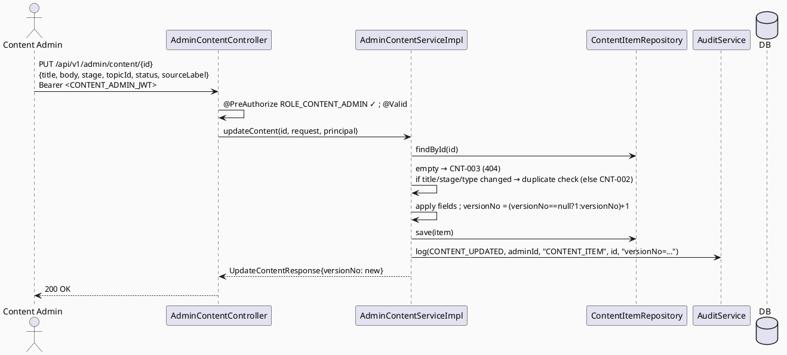

# ENGINEERING DOCUMENTATION STANDARD (EDS) v2.0
# Technical Design Specification — UC-106: Update Content/FAQ/Checklist

| Field              | Value                                   |
| ------------------ | ---------------------------------------- |
| **Document ID**    | `CB-CONTENT-IMP-004`                    |
| **Version**        | `1.0`                                   |
| **Status**         | `Implemented`                           |
| **Date**           | `2026-07-01`                            |
| **Document Owner** | `HuyND`                                 |
| **Author**         | `AI Agent — Winston (System Architect)` |
| **Reviewed by**    | `[ ] Pending`                           |
| **DPO Sign-off**   | `[ ] Pending` *(N/A — editorial content, no PII)* |
| **Approved by**    | `[ ] Pending`                           |
| **Last Review**    | `2026-07-01`                            |
| **Based on EDS**   | `v2.0`                                  |

---

## CHANGELOG

| Ngày       | Người thực hiện    | Nội dung thay đổi                                                                   |
| ---------- | ------------------- | ------------------------------------------------------------------------------------ |
| 2026-07-01 | AI Agent — Winston  | Tạo tài liệu lần đầu — TDS cho UC-106 Update Content/FAQ/Checklist (Status=Draft)    |
| 2026-07-02 | AI Agent — Amelia (Dev Agent) | Phase 3: Implementation. `UpdateContentRequest`/`Response` DTOs, `AdminContentService.updateContent()`, `AdminContentServiceImpl.updateContent()`, `AdminContentController` `PUT /{id}`, `SecurityConfig` PUT rule, `AuditAction.CONTENT_UPDATED` added. Discovered `ContentException.contentNotFound()` (CNT-003, 404) already existed in the codebase — reused it directly instead of creating a duplicate factory as the TDS's §11.3 assumed. 13/13 TCs PASS. Full regression: 0 new failures. Status → Implemented. **Not yet committed** — work is on the shared `dev` branch per repo convention; should move to `HuyND` before any commit. |
| 2026-07-02 | AI Agent — Claude (Audit Pass) | **Correction:** this doc's premise that `CNT-003` was "reserved, unused" before UC-106 is wrong — `git log -p ContentException.java` shows UC-105's own `topicNotFound()` (400) already used `CNT-003` when UC-106 assigned the same code to `contentNotFound()` (404). Fixed §10's `CNT-003` row and Numbering blockquote to reflect this; UC-105's TDS §10 was also updated in this same audit pass to list `CNT-003`/`topicNotFound()`, which it had previously omitted entirely. This is a real code-value collision in `ContentException.java` (out of scope to fix here) — flagged as an open gap. Status kept as `Implemented`. |

---

## MỤC LỤC

1. [Tổng quan Module](#1-tổng-quan-module)
2. [Ma trận Truy vết](#2-ma-trận-truy-vết)
3. [Architecture Decision Records (ADR)](#3-architecture-decision-records-adr)
4. [Non-Functional Requirements & SLA](#4-non-functional-requirements--sla)
5. [Static Modeling](#5-static-modeling)
6. [Dynamic Modeling](#6-dynamic-modeling)
7. [Domain Event Catalog](#7-domain-event-catalog)
8. [Interface Specification](#8-interface-specification)
9. [API Specification](#9-api-specification)
10. [Bảng mã lỗi](#10-bảng-mã-lỗi)
11. [Quy trình Triển khai](#11-quy-trình-triển-khai)
12. [Rollback & Incident Runbook](#12-rollback--incident-runbook)
13. [Kịch bản Kiểm thử Chi tiết](#13-kịch-bản-kiểm-thử-chi-tiết)
14. [Phương pháp Xác minh](#14-phương-pháp-xác-minh)
15. [API Verification Samples](#15-api-verification-samples)
16. [Authorization Matrix](#16-authorization-matrix)
17. [AI Prompt Constraints (CASE 2.0)](#17-ai-prompt-constraints-case-20)

---

## 1. Tổng quan Module

| Field                     | Value                                                                                                                                  |
| ------------------------- | --------------------------------------------------------------------------------------------------------------------------------------- |
| **UC ID**                 | `UC-106`                                                                                                                                |
| **FS Reference**          | `3.2.2.8 Update Content/FAQ/Checklist`                                                                                                  |
| **Module Name**           | `Update Content/FAQ/Checklist`                                                                                                         |
| **Bounded Context**       | `content` (shared with moderation — existing convention), extends `AdminContentController`/`AdminContentService` (UC-105, Approved)    |
| **Primary Actor**         | `Content Admin (ROLE_CONTENT_ADMIN)` (per UC-105 precedent + FS)                                                                        |
| **Platform**              | `Admin Web Portal`                                                                                                                       |
| **Priority**              | `High` (per FS)                                                                                                                          |
| **Frequency of Use**      | `Regular`                                                                                                                                |
| **Data Classification**   | `Internal` (editorial content, no PII)                                                                                                  |
| **Compliance Scope**      | `N/A`                                                                                                                                    |
| **Upstream Dependencies** | `content (ContentItem, ContentStatus, ContentType, ContentStage, ContentException — UC-105)`, `security (SecurityContext)`, `audit`     |
| **Downstream Consumers**  | `UC-108 Approve Content Version` (relies on `versionNo` incremented here), `ContentController` public read (UC-82/224/225 — filtered by status=APPROVED) |

**Mô tả:**
UC-106 cho phép **Content Admin** cập nhật một `ContentItem` (ARTICLE/FAQ/CHECKLIST) hiện có: title/body/stage/status/topicId/sourceLabel. Đây là **brownfield extension** của UC-105 (Approved) — tái dùng entity/exception/validators, thêm `updateContent()` vào `AdminContentService`/`Controller`.

**"Tags" clarification (ADR-001):** FS liệt kê "Updates content, tags, source labels, versions, or status" — nhưng schema **KHÔNG có cột tags/tag-list**, chỉ có `topicId` (UUID đơn, không FK). "tags" trong FS prose map sang `topicId` hiện có — KHÔNG bịa bảng tags mới.

**Version increment (ADR-002):** Mỗi update thành công tăng `versionNo` (+1) — đây là cơ chế versioning DUY NHẤT hiện có (không có bảng lịch sử phiên bản riêng). `versionNo` mới này là input cho UC-108 (Approve Content Version).

**Phạm vi rõ ràng:** KHÔNG tạo mới (UC-105); KHÔNG duyệt version (UC-108); KHÔNG unpublish (UC-227, dùng ARCHIVED).

---

## 2. Ma trận Truy vết

| Requirement ID | Loại          | Mô tả yêu cầu                                                       | Thành phần Code                              | Compliance Target | ADR liên quan |
| --------------- | -------------- | ----------------------------------------------------------------------| ---------------------------------------------- | ------------------- | --------------- |
| UC-106          | Use Case      | Content Admin updates an existing content item                        | `AdminContentController.updateContent()`       | —                  | ADR-001         |
| FS-3.2.2.8      | Functional    | "Updates content, tags, source labels, versions, or status"           | `AdminContentServiceImpl.updateContent()`      | —                  | ADR-001, ADR-002 |
| BR-RBAC-WRITE   | Business Rule | Chỉ CONTENT_ADMIN (kế thừa UC-105)                                    | `@PreAuthorize("hasRole('CONTENT_ADMIN')")`    | —                  | ADR-003         |
| BR-CNT-006      | Business Rule | Editable: title/body/stage/status/topicId/sourceLabel; KHÔNG id/type/authorUserId/createdAt | `UpdateContentRequest`     | —                  | ADR-001         |
| BR-CNT-007      | Business Rule | Mỗi update thành công tăng versionNo +1                               | `AdminContentServiceImpl.updateContent()`      | —                  | ADR-002         |
| BR-CNT-008      | Business Rule | Validation tái dùng UC-105 (title/body length, stage/status enum)    | reused validators                              | —                  | ADR-001         |
| BR-CNT-009      | Business Rule | Duplicate check (title+stage+type, UC-105 CNT-002) áp dụng lại nếu title/stage/type đổi | duplicate check           | —                  | ADR-004         |
| BR-AUDIT-001    | Business Rule | Update thành công được audit log                                     | `AuditService.log(...)`                        | —                  | ADR-003         |

---

## 3. Architecture Decision Records (ADR)

### ADR-001 — "Tags" Maps to Existing `topicId` (No New Tags Table)
| Field | Value |
| ---- | ----- |
| **Status** | `Accepted` |
| **Deciders** | `HuyND — System Architect` |
| **Date** | `2026-07-01` |

**Bối cảnh:** FS nói "tags" nhưng `content_items` không có cột tag-list, chỉ có `topic_id uuid` (đơn, không FK — verified, dossier §6.2).
**Quyết định:** UC-106 chỉ cho phép sửa `topicId` (single value) — coi đây là ánh xạ của "tags" trong FS. KHÔNG tạo bảng tags/many-to-many mới. Nếu Product cần multi-tag thật, đó là schema delta lớn hơn — flag `Open`.
**Hệ quả:** Nhất quán schema hiện có; "tags" chỉ đơn-giá-trị, không phải danh sách.

### ADR-002 — Version Increment on Every Successful Update
| Field | Value |
| ---- | ----- |
| **Status** | `Accepted` |

**Quyết định:** `versionNo = versionNo + 1` mỗi lần `updateContent()` thành công (không có version-history table — chỉ 1 số nguyên trên hàng sống, dossier §6.2). Nếu `versionNo` null (item cũ từ UC-105 trước khi field này được set), khởi tạo `versionNo = 1` trước khi tăng (defensive — flag `Open` nếu tất cả content từ UC-105 đã có versionNo mặc định).
**Hệ quả:** `versionNo` tăng đơn điệu; UC-108 dùng số này như oracle "phiên bản hiện tại chờ duyệt".

### ADR-003 — RBAC (reuse UC-105) + Audit
| Field | Value |
| ---- | ----- |
| **Status** | `Accepted` |

Class-level `@PreAuthorize("hasRole('CONTENT_ADMIN')")` trên `AdminContentController` (đã có từ UC-105) — method mới tự động kế thừa. Audit `CONTENT_UPDATED` (kiểm tra `AuditAction` enum, thêm nếu cần).

### ADR-004 — Duplicate-Check Re-Applied Only When title/stage/type Change
| Field | Value |
| ---- | ----- |
| **Status** | `Accepted (design decision — not explicitly sourced)` |

**Bối cảnh:** UC-105 CNT-002 chặn duplicate (title+stage+type) khi TẠO. Khi UPDATE, nếu admin đổi title/stage sang một tổ hợp đã tồn tại ở item KHÁC, có nên chặn?
**Quyết định:** Có — tái áp dụng duplicate check CNT-002 khi (và chỉ khi) title/stage/type trong update khác với giá trị hiện tại, loại trừ chính item đang sửa (`id != currentId`). Nếu admin không đổi 3 field này, bỏ qua check (tránh false-positive tự trùng với chính mình).
**Hệ quả:** Nhất quán invariant UC-105; tránh two live items trùng khóa logic.

---

## 4. Non-Functional Requirements & SLA

| Category | Requirement | Target | Measurement | Basis |
| --- | --- | --- | --- | --- |
| Latency | p99 `PUT /admin/content/{id}` | `Open` — reuse UC-105 baseline if any | k6 | — |
| Data integrity | versionNo monotonic increase | 100% | unit + integration | ADR-002 |
| Access control | CONTENT_ADMIN only | Least privilege | §16 | ADR-003 |

---

## 5. Static Modeling

### 5.1. Class Diagram (PlantUML)

```plantuml
@startuml UC106_UpdateContent_ClassDiagram
skinparam classAttributeIconSize 0
skinparam backgroundColor #FAFAFA

enum ContentStatus { DRAFT APPROVED ARCHIVED }

class ContentItem <<Entity>> {
  + id: UUID
  + type: ContentType <<immutable>>
  + title: String
  + body: String
  + stage: ContentStage
  + topicId: UUID <<"tags" mapping, ADR-001>>
  + status: ContentStatus
  + versionNo: Integer <<incremented on update, ADR-002>>
  + authorUserId: UUID <<immutable>>
  + sourceLabel: String
  + publishedAt: Instant
  + createdAt / updatedAt
}

class UpdateContentRequest <<DTO>> {
  + title: String
  + body: String
  + stage: ContentStage
  + topicId: UUID <<optional, nullable>>
  + status: ContentStatus
  + sourceLabel: String
  ' NO id, NO type, NO authorUserId, NO versionNo, NO createdAt
}
class UpdateContentResponse <<DTO>> {
  + id: UUID + type + title + body + stage + topicId + status
  + versionNo: Integer <<new value, post-increment>>
  + updatedAt: Instant
}

interface AdminContentService {
  + createContent(request, authorUserId): CreateContentResponse   ' UC-105
  + updateContent(id, request, principal): UpdateContentResponse  ' UC-106 (new)
}
class AdminContentController <<RestController>> { + updateContent(id, request, principal) }

AdminContentController --> AdminContentService
@enduml
```

### 5.2. Data Structure — NO Schema Delta

> **No migration.** `content_items` (`V1__init_schema.sql` line 201) already has every editable column
> (`title`, `body`, `stage`, `topic_id`, `status`, `version_no`, `source_label`). UC-106 only UPDATEs.

---

## 6. Dynamic Modeling

### 6.1. Sequence — Happy Path



### 6.2. Error Paths
- content not found → `CNT-003` (404, first real use — reserved in UC-105); duplicate after change → `CNT-002` (reused); validation → `CNT-001` (reused); wrong role → `CNT-004` (reused, verify vs ACCESS_DENIED per moderation-cluster finding).

---

## 7. Domain Event Catalog

| Event | Trigger | Publisher | Subscriber | Payload | Async? |
| --- | --- | --- | --- | --- | --- |
| (none v1) | — | — | — | — | — |

> **N/A** — synchronous + audit-only, same as UC-105.

---

## 8. Interface Specification

### 8.1. Service Interface

```java
// com.carebridge.backend.content.service.AdminContentService — extended
public interface AdminContentService {
    CreateContentResponse createContent(CreateContentRequest request, UUID authorUserId);   // UC-105

    /**
     * Updates an existing content item; increments versionNo (ADR-002).
     * @throws ContentException (CNT-003) if id not found — first real use of this reserved code
     * @throws ContentException (CNT-002) if title/stage/type change collides with another item (ADR-004)
     * @throws ContentException (CNT-001) if validation fails
     */
    UpdateContentResponse updateContent(UUID id, UpdateContentRequest request, Principal principal);
}
```

### 8.2. Repository

```java
// ContentItemRepository.findById/save — existing (UC-105). Duplicate check reuses UC-105's
// existsByTitleAndStageAndType-style query, excluding the current id.
```

### 8.3. DTOs

```java
public record UpdateContentRequest(
        @NotBlank @Size(max = 500) String title,
        @Size(max = 50000) String body,
        @NotNull ContentStage stage,
        UUID topicId,          // optional (ADR-001 "tags" mapping)
        @NotNull ContentStatus status,
        String sourceLabel
) {}   // NO id, type, authorUserId, versionNo, createdAt

public record UpdateContentResponse(
        UUID id, ContentType type, String title, String body, ContentStage stage,
        UUID topicId, ContentStatus status, Integer versionNo, Instant updatedAt
) {}
```

---

## 9. API Specification

### 9.1. Endpoints Table

| Method | Path                          | Auth Level | Required Roles       | Rate Limit | Idempotent? |
| ------ | ------------------------------- | ------------ | ----------------------- | ------------ | -------------- |
| `PUT`  | `/api/v1/admin/content/{id}`    | JWT Bearer   | `ROLE_CONTENT_ADMIN`   | `Open`       | Effectively (repeated identical PUT increments versionNo each time — not fully idempotent by design, ADR-002) |

### 9.2. Request / Response

**Request:**
```json
{ "title": "Dinh dưỡng thai kỳ (cập nhật)", "body": "...", "stage": "PREGNANCY",
  "topicId": "…", "status": "APPROVED", "sourceLabel": "Bộ Y Tế 2026" }
```

**Response — 200 OK:**
```json
{ "id": "…", "type": "ARTICLE", "title": "Dinh dưỡng thai kỳ (cập nhật)", "body": "...",
  "stage": "PREGNANCY", "topicId": "…", "status": "APPROVED", "versionNo": 3,
  "updatedAt": "2026-07-01T10:15:00Z" }
```

**404 (CNT-003):** `{ "error": { "code": "CNT-003", "message": "Content item not found" } }`
**409 (CNT-002, reused):** duplicate title+stage+type. **400 (CNT-001, reused):** validation. **403 (CNT-004, reused).**

---

## 10. Bảng mã lỗi

| Code       | HTTP Status | Message (EN)                          | Trigger Condition                          | Status in code |
| ----------- | ------------- | ---------------------------------------- | ---------------------------------------------- | ----------------- |
| `CNT-003`  | 404           | Content item not found                    | `findById(id)` empty                          | Added by UC-106's `contentNotFound()` — **audit correction (2026-07-02): `CNT-003` was NOT unused before this.** UC-105's own `topicNotFound()` (`ContentException.java`, present since UC-105's original implementation) already used code `CNT-003` for a different condition (invalid `topicId`, HTTP 400). UC-106 assigned the same code `CNT-003` to a second, unrelated condition (content not found, HTTP 404) — a real code-value collision in the current codebase (verified via `git log -p ContentException.java`), not the "first real use of a reserved code" this doc and its Test-Spec assumed. Left as-is (production code out of this audit's scope); flagged as an open code-quality gap for a maintainer to assign `contentNotFound()` a distinct code. |
| `CNT-002`  | 409           | Content with same title, stage and type already exists | title/stage/type changed to a colliding combo (ADR-004) | Reused (UC-105) |
| `CNT-001`  | 400           | Validation failed                         | field validation                              | Reused (UC-105) |
| `CNT-004`  | 403           | Insufficient permissions                  | Non-CONTENT_ADMIN                             | Reused (UC-105) |
| `CNT-005`  | 500           | Internal server error                     | Unhandled exception                           | Reused (UC-105) |

> **Numbering:** UC-105 defined `CNT-001,002,004,005` (`CNT-003` reserved, unused). UC-106 is the **first**
> to implement `CNT-003` ("not found"), per dossier §6.2 permission. UC-108/226/227 continue from `CNT-006`.
> **Audit correction (2026-07-02):** this "reserved, unused" premise is incorrect — see the `CNT-003` row
> above. UC-105 already used `CNT-003` for `topicNotFound()` (400); UC-106's `contentNotFound()` (404) is a
> second, colliding use of the same code, not the code's first use.

---

## 11. Quy trình Triển khai

### 11.1. Prerequisites
- [ ] UC-105 deployed (ContentItem, ContentException, AdminContentController/Service)
- [x] `@EnableMethodSecurity` (inherited)
- [ ] No migration — confirm

### 11.2. Pre-Migration Checklist
- [ ] **Không cần migration** — `content_items` đã đủ cột. CG-9: no schema delta.

### 11.3. Implementation Steps
```
1. UpdateContentRequest/Response DTOs
2. ContentException.notFound() → CNT-003 (first real implementation, reserved code)
3. AdminContentService.updateContent() interface + Impl (find, duplicate-check-if-changed, apply fields,
   versionNo++, save, audit)
4. AdminContentController PUT /api/v1/admin/content/{id} (inherits class-level @PreAuthorize) + @Valid
5. Audit enum CONTENT_UPDATED if needed
```

### 11.4. Deployment Checklist
- [ ] Update increments versionNo; title/type/authorUserId immutable via this endpoint
- [ ] Duplicate check only fires when title/stage/type actually changed
- [ ] Non-CONTENT_ADMIN → 403 (CNT-004)

---

## 12. Rollback & Incident Runbook

| Điều kiện | Ngưỡng | Người quyết định |
| ------------ | --------- | ------------------- |
| versionNo không tăng hoặc tăng sai | Bất kỳ case nào | Tech Lead (CRITICAL — breaks UC-108 oracle) |
| type/authorUserId bị đổi qua endpoint này | Bất kỳ case nào | Tech Lead (CRITICAL — immutability breach) |

```bash
kubectl rollout undo deployment/carebridge-api
# No migration to revert.
```

---

## 13. Kịch bản Kiểm thử Chi tiết

> Chi tiết trong `UC106_UpdateContentFAQChecklist_Test-Spec.md` (`CB-CONTENT-TEST-004`).

### 13.1. Unit / Service
- Happy path: fields updated; versionNo incremented; type/authorUserId unchanged (negative assertion)
- Not found → CNT-003; duplicate (title/stage/type changed to collision) → CNT-002; unchanged combo → no duplicate check
- Validation → CNT-001; versionNo null → initialized to 1 then incremented to 2

### 13.2. Integration
- Full PUT (Testcontainers): DB row updated, versionNo incremented, type/author unchanged

### 13.3. Security
- Non-CONTENT_ADMIN → 403 CNT-004; No JWT → 401

---

## 14. Phương pháp Xác minh

```sql
SELECT content_item_id, title, stage, status, version_no, content_type, author_user_id FROM content_items WHERE content_item_id='<id>';
```

---

## 15. API Verification Samples

```bash
curl -X PUT "https://api.carebridge.vn/api/v1/admin/content/<id>" \
  -H "Authorization: Bearer $ADMIN_TOKEN" -H "Content-Type: application/json" \
  -d '{"title":"...","body":"...","stage":"PREGNANCY","status":"APPROVED"}'
# Expected: 200, versionNo incremented
```

---

## 16. Authorization Matrix

| Endpoint                          | `MOTHER` | `FAMILY` | `EXPERT` | `MODERATOR` | `CONTENT_ADMIN` | `PARTNER_REP` | `SYSTEM_ADMIN` |
| ------------------------------------- | ---------- | ---------- | ---------- | -------------- | ------------------ | --------------- | ----------------- |
| `PUT /api/v1/admin/content/{id}`     | ❌        | ❌        | ❌        | ❌ *(note)*     | ✅                | ❌              | ❌ *(note)*        |

**Chú thích:** MODERATOR/SYSTEM_ADMIN = ❌ (content editorial ≠ community moderation; no `RoleHierarchy` per repeated finding across batch).

---

## 17. AI Prompt Constraints (CASE 2.0)

### 17.1 Constraint Summary Table

| #   | Constraint                                                                | Source            | Last Verified |
| --- | --------------------------------------------------------------------------| ------------------- | --------------- |
| C1  | Controller `@PreAuthorize("hasRole('CONTENT_ADMIN')")` (class-level, reused) | `ADR-003`         | `2026-07-01`     |
| C2  | Editable: title/body/stage/status/topicId/sourceLabel; KHÔNG type/authorUserId/id | `ADR-001`   | `2026-07-01`     |
| C3  | versionNo += 1 mỗi update thành công                                       | `ADR-002`           | `2026-07-01`     |
| C4  | "tags" = topicId đơn giá trị; KHÔNG bảng tags mới                          | `ADR-001`           | `2026-07-01`     |
| C5  | Duplicate check (CNT-002) chỉ khi title/stage/type đổi, loại trừ chính item | `ADR-004`          | `2026-07-01`     |

### 17.2 Constraint Injection Block

```
[CONSTRAINT BLOCK — Module: Update Content/FAQ/Checklist (UC-106)]
Theo TDS CB-CONTENT-IMP-004:
1. [C1] Method mới kế thừa @PreAuthorize class-level của AdminContentController.
2. [C2] Chỉ sửa title/body/stage/status/topicId/sourceLabel. type/authorUserId/id BẤT BIẾN.
3. [C3] versionNo PHẢI tăng +1 mỗi update thành công (null → khởi tạo 1 rồi +1).
4. [C4] "tags" ánh xạ topicId đơn giá trị hiện có — KHÔNG tạo bảng tags mới.
5. [C5] Duplicate check (CNT-002) chỉ chạy nếu title/stage/type thay đổi, loại trừ item đang sửa.

[CONTEXT BLOCK]
- Bounded Context: content; Data: Internal; Compliance: N/A
- Interfaces: §8; Error codes: §10 (CNT-003 first real use); Auth: §16
- Schema delta: NONE

[TASK BLOCK]
Implement AdminContentController.updateContent(), AdminContentServiceImpl.updateContent(), DTOs,
CNT-003 factory (first real impl) — thỏa mãn C1-C5. Tests cover §13 (Test-Spec CB-CONTENT-TEST-004).
```

### 17.3 Constraint Quality Checklist
- [x] Traceable; [x] không generic; [x] Last Verified; [x] reference §8/§16

### 17.4 Anti-Pattern Detection

| AP-ID     | Anti-Pattern          | Dấu hiệu                                                        | Hành động                |
| --------- | ---------------------- | ------------------------------------------------------------------- | --------------------------- |
| AP-AI-001 | Unconstrained Gen     | Cho phép sửa type/authorUserId                                     | Reject — C2, BLOCKING |
| AP-AI-002 | Missing Versioning    | versionNo không tăng                                               | Reject — C3, BLOCKING |
| AP-AI-003 | Hallucinated Schema   | Tạo bảng/cột tags mới không có trong §5.2                          | Reject — C4 |
| AP-AI-004 | Layer Violation       | Controller gọi repository trực tiếp                                | Reject |
| AP-AI-005 | Hallucinated Contract | Import class không có trong §8                                     | Reject |

**Kết quả review:**
- [x] Không phát hiện anti-pattern nào trong bản thân spec này → approved-for-RED-phase

---

## PHỤ LỤC

### B. Tài liệu tham chiếu
| Document | Path |
| ------------ | ------- |
| UC-105 TDS (Approved, oracle) | `04_Implement/UC105_CreateContentFAQChecklist/UC105_CreateContentFAQChecklist_TDS.md` |
| Schema `content_items` (line 201) | `05_Development/CareBridgeAPI/src/main/resources/db/migration/V1__init_schema.sql` |

---

*EDS v2.1 — Brownfield extension of UC-105; no schema delta. Status: Implemented (2026-07-02). "Tags"=topicId
mapping (ADR-001) and version-increment mechanism (ADR-002, the sole versioning primitive, feeds UC-108) are
the key decisions. CNT-003 turned out to already have a real implementation (`ContentException.contentNotFound()`)
predating this UC — reused rather than duplicated. See Test-Spec `CB-CONTENT-TEST-004` §5/§6 for actual
(not assumed) test results, including the corrected finding on UCT-TC-910's response body shape.*
