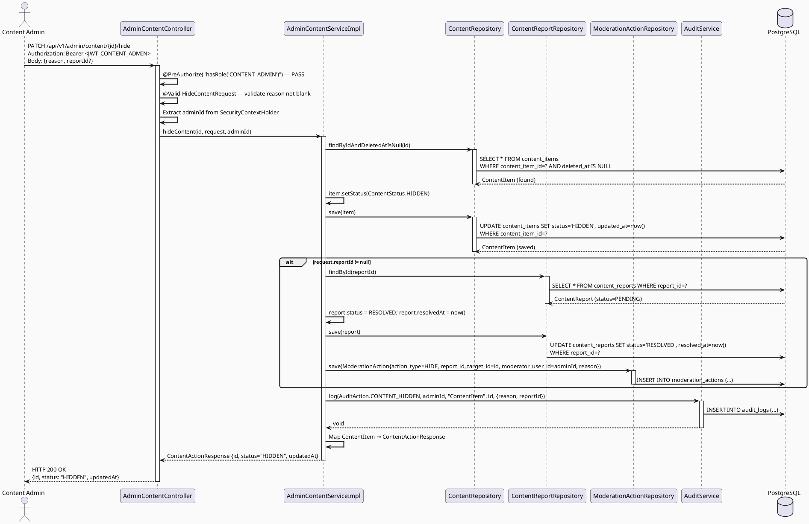
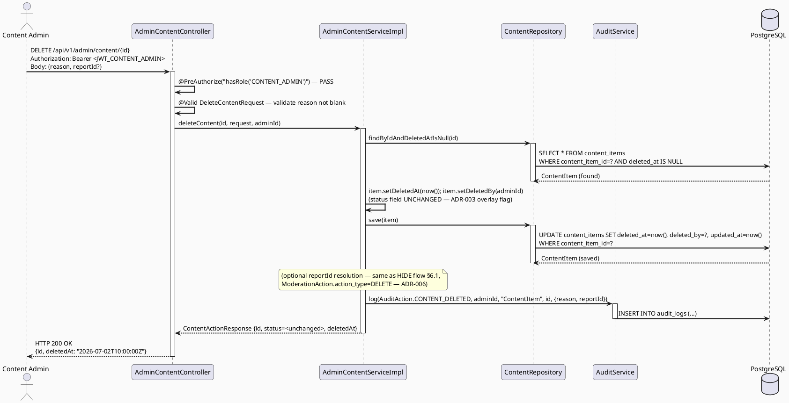
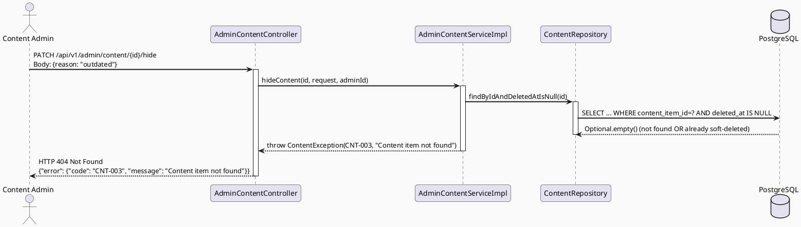
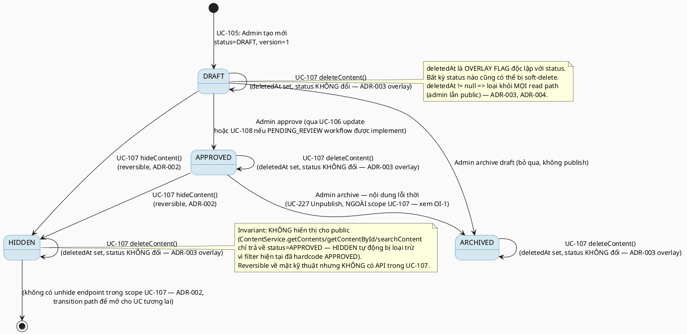

# ENGINEERING DOCUMENTATION STANDARD (EDS) v2.0
# Technical Design Specification — UC-107 Hide or Delete Content

| Field              | Value                                   |
| ------------------ | ---------------------------------------- |
| **Document ID**    | `CB-CONTENT-IMP-005`                    |
| **Version**        | `1.0`                                   |
| **Date**           | `2026-07-02`                            |
| **Status**         | `Draft`                                 |
| **Document Owner** | `HuyND (TV3-Huy)`                       |
| **Author**         | `AI Agent — Technical Architect`        |
| **Reviewed by**    | `[ ] Pending`                           |
| **DPO Sign-off**   | `[ ] Pending`                           |
| **Approved by**    | `[ ] Pending`                           |
| **Last Review**    | `2026-07-02`                            |
| **Based on EDS**   | `v2.0`                                  |

---

## CHANGELOG

| Ngày       | Người thực hiện                  | Nội dung thay đổi                                            |
| ---------- | --------------------------------- | -------------------------------------------------------------- |
| 2026-07-02 | AI Agent — Technical Architect    | Tạo tài liệu lần đầu cho UC-107 Hide or Delete Content (Draft) |

---

## MỤC LỤC

1. [Tổng quan Module](#1-tổng-quan-module)
2. [Ma trận Truy vết (Traceability Matrix)](#2-ma-trận-truy-vết-traceability-matrix)
3. [Architecture Decision Records (ADR)](#3-architecture-decision-records-adr)
4. [Non-Functional Requirements & SLA](#4-non-functional-requirements--sla)
5. [Static Modeling (Mô hình Tĩnh)](#5-static-modeling-mô-hình-tĩnh)
6. [Dynamic Modeling (Mô hình Động)](#6-dynamic-modeling-mô-hình-động)
7. [Domain Event Catalog](#7-domain-event-catalog)
8. [Interface Specification (Đặc tả Giao diện)](#8-interface-specification-đặc-tả-giao-diện)
9. [API Specification](#9-api-specification)
10. [Bảng mã lỗi (Error Codes)](#10-bảng-mã-lỗi-error-codes)
11. [Quy trình Triển khai (Step-by-Step)](#11-quy-trình-triển-khai-step-by-step)
12. [Rollback & Incident Runbook](#12-rollback--incident-runbook)
13. [Kịch bản Kiểm thử Chi tiết](#13-kịch-bản-kiểm-thử-chi-tiết)
14. [Phương pháp Xác minh](#14-phương-pháp-xác-minh)
15. [Mẫu thử thực tế (API Verification Samples)](#15-mẫu-thử-thực-tế-api-verification-samples)
16. [Bảng tổng hợp phân quyền (Authorization Matrix)](#16-bảng-tổng-hợp-phân-quyền-authorization-matrix)
17. [AI Prompt Constraints (CASE 2.0)](#17-ai-prompt-constraints-case-20)
18. [Research Gate & Open Items](#18-research-gate--open-items)

---

## 1. Tổng quan Module

> UC-107 cho phép **Content Admin** (SRS 3.2.2.9 xác nhận Primary Actor là *Content Admin*, KHÔNG phải System Admin hay Moderator — xem RG-1 §18) **ẩn (hide)** hoặc **xóa mềm (soft-delete)** một `ContentItem` đã tồn tại — thường vì nội dung lỗi thời, sai lệch, hoặc bị báo cáo (`content_reports`). Đây là hành động **ghi (write)** thứ ba trên `ContentItem` cùng UC-105 (create) và UC-106 (update), tái sử dụng entity/repository/mapper hiện có trong package `content`. UC-107 KHÔNG tạo bảng mới — chỉ mở rộng `ContentStatus` enum (Java-only, giống pattern ADR-002 của UC-108) và bổ sung service/controller method mới.

| Field                     | Value                                                                                                                                   |
| ------------------------- | ----------------------------------------------------------------------------------------------------------------------------------------- |
| **Module Name**           | `Hide or Delete Content`                                                                                                                |
| **Bounded Context**       | `content`                                                                                                                               |
| **UC ID**                 | `UC-107`                                                                                                                                |
| **SRS Reference**         | `3.2.2.9` (lines 1176-1195)                                                                                                             |
| **Platform**              | `Admin Web Portal (React + TypeScript + Vite)`                                                                                          |
| **Data Classification**   | `Internal`                                                                                                                              |
| **Compliance Scope**      | `BR-RBAC (CONTENT_ADMIN role required)`                                                                                                 |
| **Upstream Dependencies** | `security (JWT Auth)`, `content` (`ContentItem`, `ContentRepository`, `ContentReport`, `ContentReportRepository`, `ModerationAction`, `ModerationActionRepository`), `audit (AuditService)` |
| **Downstream Consumers**  | `ContentService` public read paths (UC-82/224/225 — must continue excluding hidden/deleted items), `ModerationService` (moderation queue, UC-109 dossier) |

**Phạm vi rõ ràng:**
- **TRONG scope:** Content Admin ẩn hoặc xóa mềm MỘT `ContentItem` đã tồn tại (đã APPROVED hoặc DRAFT) qua Admin Web Portal. Optionally liên kết với một `content_reports` record đang xử lý (moderation-triggered hide/delete).
- **NGOÀI scope:** Tạo mới content (UC-105); sửa nội dung/field khác ngoài status (UC-106); duyệt version (UC-108); **UC-227 Unpublish Content** (SRS §3.3.18.4, "Stops displaying a content version without deleting its history" — CÙNG actor Content Admin, CÙNG đích đến `ContentStatus.ARCHIVED`, nhưng là UC RIÊNG BIỆT không thuộc batch hiện tại). Xem RG-5/Open Item OI-1 §18 — xung đột phạm vi cần quyết định của Tech Lead.
- **NGOÀI scope:** Phục hồi (unhide/undelete) — không có UC nguồn nào trong SRS mô tả hành động khôi phục; xem ADR-002 (§3) cho quyết định reversibility.
- **NGOÀI scope:** Xóa cứng (hard DELETE khỏi DB) — bị cấm bởi nguyên tắc audit/moderation an toàn của CLAUDE.md; UC-107 chỉ soft-delete.

---

## 2. Ma trận Truy vết (Traceability Matrix)

| Requirement ID | Loại          | Mô tả yêu cầu                                                                 | Thành phần Code                                                | Compliance Target | ADR liên quan |
| --------------- | -------------- | ------------------------------------------------------------------------------ | ---------------------------------------------------------------- | ------------------- | --------------- |
| UC-107          | User Story     | Content Admin ẩn hoặc xóa mềm nội dung lỗi thời/sai/bị báo cáo                 | `AdminContentController.hideContent()` / `.deleteContent()`    | BR-RBAC            | ADR-001, ADR-002 |
| BR-RBAC         | Business Rule  | Chỉ role CONTENT_ADMIN được thực hiện hide/delete                             | `@PreAuthorize("hasRole('CONTENT_ADMIN')")` (class-level, tái dùng `AdminContentController`) | BR-RBAC | ADR-001 |
| BR-CNT-013      | Business Rule  | HIDE là hành động reversible (chuyển `ContentStatus.ARCHIVED`, giữ nguyên `body`/`versionNo`) | `AdminContentServiceImpl.hideContent()`         | —                  | ADR-002         |
| BR-CNT-014      | Business Rule  | DELETE là soft-delete: set `deletedAt` timestamp, giữ record trong DB (append-only), loại khỏi mọi public/admin read mặc định | `AdminContentServiceImpl.deleteContent()`, `ContentItem.deletedAt` | — | ADR-003, ADR-004 |
| BR-CNT-015      | Business Rule  | Cả HIDE và DELETE bắt buộc `reason` (audit/accountability)                    | `HideContentRequest.reason`, `DeleteContentRequest.reason`     | Audit              | ADR-005         |
| BR-CNT-016      | Business Rule  | Nếu request có `reportId`, hành động phải resolve `ContentReport` liên kết VÀ ghi `ModerationAction` (action_type=HIDE) trong cùng transaction | `AdminContentServiceImpl` → `ContentReportRepository`, `ModerationActionRepository` | Audit | ADR-006 |
| BR-AUDIT        | Business Rule  | Mọi hành động hide/delete phải ghi audit log                                  | `AdminContentServiceImpl` → `AuditService.log()`                | Audit              | ADR-005         |
| SRS-3.2.2.9     | Functional     | Admin chọn content, xác nhận hide hoặc delete, hệ thống cập nhật trạng thái và ẩn khỏi user | `HideContentRequest`/`DeleteContentRequest` DTO + `AdminContentController` | — | — |

---

## 3. Architecture Decision Records (ADR)

### ADR-001 — Reuse `AdminContentController` + `AdminContentServiceImpl` (Extend, Not New Controller)

| Field          | Value               |
| -------------- | -------------------- |
| **Status**     | `Proposed`           |
| **Deciders**   | `HuyND — Tech Lead (pending review)` |
| **Date**       | `2026-07-02`         |
| **Supersedes** | `—`                  |

#### Bối cảnh (Context)
UC-105 đã thiết lập `AdminContentController` tại `/api/v1/admin/content` với `@PreAuthorize("hasRole('CONTENT_ADMIN')")` ở class level (ADR-005 của UC-105). UC-107 (hide/delete) cùng actor, cùng resource `ContentItem`, cùng security boundary `/api/v1/admin/*`.

#### Các phương án đã xem xét (Options Considered)

| Phương án | Mô tả                                                                 | Ưu điểm                          | Nhược điểm                    |
| --------- | ----------------------------------------------------------------------- | ----------------------------------- | -------------------------------- |
| A         | Controller riêng `ContentModerationController`                         | Tách biệt rõ theo hành động          | Trùng lặp `@PreAuthorize`, thêm route boundary không cần thiết |
| B         | Mở rộng `AdminContentController` hiện có, thêm 2 endpoint mới           | Nhất quán route `/api/v1/admin/content/{id}/...`, tái dùng class-level RBAC | — |

#### Quyết định (Decision)
Chọn **Phương án B** — mở rộng `AdminContentController` với `PATCH /api/v1/admin/content/{id}/hide` và `DELETE /api/v1/admin/content/{id}`. Mở rộng `AdminContentService`/`AdminContentServiceImpl` với `hideContent()` và `deleteContent()`.

#### Hệ quả (Consequences)

**Tích cực:**
- Nhất quán với ADR-005 của UC-105; không cần `@PreAuthorize` mới
- Dễ audit — mọi thao tác admin trên content nằm chung 1 controller

**Tiêu cực / Trade-offs:**
- `AdminContentController` phình to theo thời gian — chấp nhận được vì mỗi method vẫn ngắn (validate + delegate)

---

### ADR-002 — Hide = Reversible Visibility Toggle (Reuse `ContentStatus.ARCHIVED`, No New Enum Value)

| Field          | Value               |
| -------------- | -------------------- |
| **Status**     | `Proposed`           |
| **Deciders**   | `HuyND — Tech Lead (pending review)` |
| **Date**       | `2026-07-02`         |
| **Supersedes** | `—`                  |

#### Bối cảnh (Context)
`ContentStatus` hiện có `DRAFT, APPROVED, ARCHIVED` (dossier, xác nhận qua `ContentStatus.java`). UC-108 (Draft TDS) đã đề xuất thêm `PENDING_REVIEW`. UC-106 (Draft TDS) đã tuyên bố "unpublish dùng ARCHIVED, thuộc UC-227" và loại trừ khỏi scope UC-106. **UC-107 và UC-227 đều map "hide" lên cùng đích `ARCHIVED`** — đây là xung đột phạm vi thật sự cần quyết định (xem OI-1 §18).

#### Các phương án đã xem xét (Options Considered)

| Phương án | Mô tả                                                                                          | Ưu điểm                                                        | Nhược điểm                                                                 |
| --------- | -------------------------------------------------------------------------------------------------- | ------------------------------------------------------------------ | ------------------------------------------------------------------------------ |
| A         | Thêm `ContentStatus.HIDDEN` mới, tách biệt khỏi `ARCHIVED`                                        | Rõ ràng semantic; không đụng UC-227                               | Thêm giá trị enum, cần cập nhật mọi query filter `status='APPROVED'` (index vẫn OK vì WHERE clause không đổi) |
| B         | Tái dùng `ContentStatus.ARCHIVED` cho hide (giống UC-227's design), phân biệt qua audit trail/reason | Không thêm state; nhất quán với UC-227 và UC-106's đã tuyên bố    | UC-107 và UC-227 trở thành 2 API endpoints cho cùng 1 effect — trùng lặp, cần hợp nhất ở Tech Lead review |

#### Quyết định (Decision)
Chọn **Phương án A** trong bản Draft này — thêm `ContentStatus.HIDDEN` (Java-only, không migration, theo đúng pattern ADR-002 của UC-108 cho `PENDING_REVIEW`) để giữ UC-107 độc lập, có thể implement/test riêng mà không phụ thuộc vào việc UC-227 có được giao task hay chưa. **Đây là quyết định TẠM THỜI, phải được Tech Lead xác nhận khi UC-227 được lập kế hoạch** (xem OI-1 §18 — nếu Tech Lead quyết định hợp nhất HIDE=ARCHIVED với UC-227, `ContentStatus.HIDDEN` sẽ bị supersede).

`HIDE` là hành động **reversible**: item chuyển `status → HIDDEN`, `body`/`versionNo`/`title` không đổi, record vẫn `SELECT`-able bởi Admin (không bởi public `ContentService`). Không có `unhide` endpoint trong scope UC-107 (không có UC nguồn) nhưng thiết kế state machine không cấm việc thêm sau này (`HIDDEN → APPROVED` transition path để lại mở, xem §6.4 state diagram note).

#### Hệ quả (Consequences)

**Tích cực:**
- Semantic rõ ràng: HIDDEN ≠ ARCHIVED ≠ DELETED — dễ audit, dễ phân biệt "admin ẩn tạm" vs "unpublish chính thức" vs "xóa mềm"

**Tiêu cực / Trade-offs:**
- Có khả năng trùng lặp với UC-227 nếu UC-227 cũng dùng approach tương tự — risk được surface rõ ràng ở OI-1, không silently resolved

**Compliance Impact:**
- Không ảnh hưởng PII; chỉ ảnh hưởng visibility content thông thường

---

### ADR-003 — Delete = Soft-Delete via `deletedAt` Column (New Nullable Column, No Data Loss)

| Field          | Value               |
| -------------- | -------------------- |
| **Status**     | `Proposed`           |
| **Deciders**   | `HuyND — Tech Lead (pending review)` |
| **Date**       | `2026-07-02`         |
| **Supersedes** | `—`                  |

#### Bối cảnh (Context)
`content_items` (V1__init_schema.sql, xác nhận không có cột `deleted_at` hay tương đương) không có cơ chế soft-delete sẵn có. SRS mô tả "soft-deletes outdated, incorrect, or reported content" — rõ ràng yêu cầu **không xóa cứng**. CLAUDE.md yêu cầu: dùng Flyway cho schema changes, never modify applied migration.

#### Các phương án đã xem xét (Options Considered)

| Phương án | Mô tả                                                                 | Ưu điểm                                          | Nhược điểm                                    |
| --------- | ----------------------------------------------------------------------- | ---------------------------------------------------- | -------------------------------------------------- |
| A         | Tái dùng `ContentStatus` — thêm giá trị `DELETED`, không cột mới       | Không migration                                     | Mất thông tin "khi nào xóa" và "ai xóa" trừ khi đọc audit log riêng; không phân biệt được "archived" vs "deleted" nếu dùng chung 1 field |
| B         | Thêm cột `deleted_at TIMESTAMPTZ NULL` + `deleted_by UUID NULL` vào `content_items` (Flyway migration mới) | Tách biệt rõ trạng thái publish (`status`) và soft-delete flag (`deletedAt`); is-deleted trở thành binary check độc lập với status; hỗ trợ audit "khi nào/ai xóa" trực tiếp trên entity | Cần 1 migration mới (nhỏ, an toàn — `ADD COLUMN ... NULL`) |

#### Quyết định (Decision)
Chọn **Phương án B** — thêm 2 cột nullable `deleted_at` và `deleted_by` vào `content_items` qua migration `V20260704110000__add_content_soft_delete.sql` (xem §5.2). `status` field giữ nguyên giá trị hiện tại tại thời điểm xóa (không set thành `ARCHIVED`/`HIDDEN`) — soft-delete là một **overlay flag**, độc lập với status lifecycle. Mọi query đọc content (`ContentRepository.findByFilters`, `findByIdAndStatus`, `searchByFilters`, `ModerationService`'s `ContentPreviewService`) PHẢI thêm điều kiện `deleted_at IS NULL` (xem BR-CNT-014, ADR-004).

#### Hệ quả (Consequences)

**Tích cực:**
- Rõ ràng: `deletedAt != null` = xóa mềm, độc lập hoàn toàn với status workflow (DRAFT/APPROVED/ARCHIVED/HIDDEN)
- Không mất version/body — có thể audit nội dung đã xóa nếu cần điều tra
- Append-only compliant — không có DELETE SQL statement

**Tiêu cực / Trade-offs:**
- Thêm 1 migration nhỏ — rủi ro thấp (ADD COLUMN NULL không lock table lâu trên PostgreSQL)
- MỌI existing query trên `ContentRepository` phải được rà soát lại để thêm `deleted_at IS NULL` — liệt kê đầy đủ ở §11.3 Chặng 2 (rủi ro bỏ sót là có thật, cần checklist)

**Compliance Impact:**
- Không PII — Internal data classification giữ nguyên

---

### ADR-004 — Delete is NOT Reversible in UC-107 Scope (No Un-delete Endpoint)

| Field          | Value               |
| -------------- | -------------------- |
| **Status**     | `Proposed`           |
| **Deciders**   | `HuyND — Tech Lead (pending review)` |
| **Date**       | `2026-07-02`         |
| **Supersedes** | `—`                  |

#### Bối cảnh (Context)
SRS UC-107 mô tả "hides or soft-deletes" nhưng không mô tả bất kỳ hành động khôi phục nào trong Normal/Alternative Flow. Không có UC riêng nào trong SRS batch hiện tại (`UC105-UC108`) mô tả "restore deleted content".

#### Quyết định (Decision)
DELETE là **soft, nhưng không có API khôi phục trong scope UC-107**. Dữ liệu vẫn tồn tại trong DB (không hard-delete, tuân thủ ADR-003) nên về mặt kỹ thuật CÓ THỂ khôi phục bằng thao tác DB trực tiếp (DBA/support runbook — xem §12.2), nhưng KHÔNG có self-service unhide/undelete endpoint cho Content Admin trong UC-107. Nếu business cần "undo delete" self-service trong tương lai, đó là một UC mới cần SRS bổ sung — không được ngầm định thêm vào UC-107.

#### Hệ quả (Consequences)

**Tích cực:**
- Giữ đúng phạm vi SRS đã đặc tả — không thêm tính năng chưa có yêu cầu (tránh AP-AI-001 Unconstrained Generation)

**Tiêu cực / Trade-offs:**
- Nếu Content Admin xóa nhầm, phải nhờ DBA/support khôi phục thủ công qua SQL (`UPDATE content_items SET deleted_at = NULL, deleted_by = NULL WHERE content_item_id = ...`) — quy trình runbook tại §12.2

---

### ADR-005 — `reason` Required for Both HIDE and DELETE; Audit Logged Before Response

| Field          | Value               |
| -------------- | -------------------- |
| **Status**     | `Proposed`           |
| **Deciders**   | `HuyND — Tech Lead (pending review)` |
| **Date**       | `2026-07-02`         |
| **Supersedes** | `—`                  |

#### Bối cảnh (Context)
CLAUDE.md: "For ... moderation, and safety workflows: enforce existing RBAC, consent scope/expiry, and audit requirements." UC-105's ADR-007 đã thiết lập pattern audit bắt buộc cho create; UC-107 tiếp tục pattern này cho hide/delete — hành động có tác động lớn hơn (ẩn/xóa nội dung công khai).

#### Quyết định (Decision)
`HideContentRequest.reason` và `DeleteContentRequest.reason` là `@NotBlank` (max 1000 chars). Sau khi `contentRepository.save()` (hide) hoặc set `deletedAt` (delete) thành công, `AdminContentServiceImpl` gọi `AuditService.log(AuditAction.CONTENT_HIDDEN | CONTENT_DELETED, ...)` trong cùng transaction (giống ADR-007 của UC-105). Cần bổ sung 2 giá trị mới vào `AuditAction` enum (hiện chưa có `CONTENT_HIDDEN`/`CONTENT_DELETED` — xác nhận qua đọc `AuditAction.java`).

---

### ADR-006 — Report Auto-Resolution: HIDE/DELETE Triggered by a Report Auto-Resolves It (Explicit, Not Silent)

| Field          | Value               |
| -------------- | -------------------- |
| **Status**     | `Proposed`           |
| **Deciders**   | `HuyND — Tech Lead (pending review)` |
| **Date**       | `2026-07-02`         |
| **Supersedes** | `—`                  |

#### Bối cảnh (Context)
RG-6 (§18): "does hiding/deleting content triggered by a report automatically resolve the report, or is that a separate moderator action?" SRS UC-107 text không đề cập `content_reports` trực tiếp — chỉ nói "reported content" trong Description. `ModerationServiceImpl` hiện tại (UC-109 dossier context, đã đọc) chỉ có `getModerationQueue()` (read-only) — KHÔNG có action method nào resolve report. `ModerationAction` entity đã có `action_type = HIDE` trong enum `ModerationActionType` (xác nhận: `APPROVE, HIDE, LOCK, WARN, SUSPEND` — không có `DELETE`).

#### Các phương án đã xem xét (Options Considered)

| Phương án | Mô tả                                                                                       | Ưu điểm                                             | Nhược điểm                                                     |
| --------- | ----------------------------------------------------------------------------------------------- | -------------------------------------------------------- | -------------------------------------------------------------------- |
| A         | HIDE/DELETE hoàn toàn độc lập với `content_reports` — Content Admin xử lý report riêng (UC khác, ngoài batch) | Đơn giản, đúng single-responsibility                     | Report vẫn ở PENDING dù content đã bị ẩn/xóa — có thể gây nhầm lẫn cho Moderator xem lại queue |
| B         | Request có optional `reportId` — nếu có, hệ thống tự động set `ContentReport.status = RESOLVED` + ghi `ModerationAction` record trong CÙNG transaction | Nhất quán UX (1 action giải quyết cả report), audit đầy đủ qua `moderation_actions` | Thêm complexity; cần mở rộng `ModerationActionType` thêm `DELETE` (hiện chỉ có `HIDE`) |

#### Quyết định (Decision)
Chọn **Phương án B** — optional `reportId` field trên cả `HideContentRequest` và `DeleteContentRequest`. Nếu có `reportId`:
1. Validate `ContentReport` tồn tại và `status = PENDING` (nếu không → `CNT-013`, 404/409 tùy trạng thái — xem §10).
2. Set `ContentReport.status = RESOLVED`, `resolvedAt = now()`.
3. Insert `ModerationAction` record: `action_type = HIDE` (cho hide) hoặc thêm giá trị mới `DELETE` vào `ModerationActionType` enum (cho delete), `moderator_user_id = current admin`, `reason = request.reason`.

Nếu KHÔNG có `reportId` (Content Admin tự ý ẩn/xóa content lỗi thời, không liên quan report nào) — bỏ qua bước 1-3, chỉ audit log qua `AuditService` (ADR-005). Đây là quyết định **không silent** — flagged rõ ràng tại OI-2 (§18) vì `ModerationActionType.DELETE` là giá trị enum MỚI cần thêm, ảnh hưởng đến `ModerationService`/UC-109 downstream.

#### Hệ quả (Consequences)

**Tích cực:**
- 1 action (hide/delete) có thể giải quyết luôn report liên quan — giảm số bước thao tác cho Content Admin
- Audit trail đầy đủ qua `moderation_actions` khi có report gốc

**Tiêu cực / Trade-offs:**
- Thêm giá trị enum `ModerationActionType.DELETE` — cần verify không phá vỡ `ModerationMapper`/`ModerationQueueItemResponse` (kiểm tra không tìm thấy usage cứng nào enumerate hết `ModerationActionType` values ngoài phạm vi UC-107, rủi ro thấp)
- Nếu 2 admin đồng thời hide/delete cùng content với 2 report khác nhau → race condition khi resolve report; mitigate bằng transaction isolation mức DB (`@Transactional`, optimistic check `status=PENDING` trong WHERE clause)

---

## 4. Non-Functional Requirements & SLA

### 4.1. Performance & Availability

| Category     | Requirement                    | Target SLA                          | Measurement Method | Compliance Basis |
| ------------- | -------------------------------- | -------------------------------------- | --------------------- | ------------------- |
| Latency      | Hide/Delete API response (p99)  | `< 500ms`                            | k6 load test         | —                  |
| Availability | Uptime (monthly)                | `99.9%`                              | Uptime monitor        | —                  |
| Throughput   | Concurrent hide/delete requests | `10 req/s` (admin-only, occasional use per SRS "Frequency of Use: Occasional") | Load test | — |

### 4.2. Data Integrity & Retention

| Category              | Requirement                                                                 | Target | Verification Method         | Compliance Basis |
| ----------------------- | ------------------------------------------------------------------------------ | -------- | ------------------------------- | ------------------- |
| Soft-delete invariant  | Không có SQL `DELETE FROM content_items` nào trong codebase cho UC-107        | 100%   | Static grep review + TC-UNIT   | ADR-003, ADR-004   |
| Public read exclusion  | Hidden/deleted content KHÔNG xuất hiện trong `ContentService` public read paths | 100%   | Integration test TC-INT        | ADR-002, ADR-003   |
| Audit completeness     | Mọi hide/delete action có audit log VÀ (nếu có reportId) moderation_action record | 100%   | Integration test TC-INT        | ADR-005, ADR-006   |
| Report consistency     | Nếu request có reportId hợp lệ + PENDING → report luôn chuyển RESOLVED cùng transaction (không có trạng thái nửa vời) | 100% | Integration test TC-INT | ADR-006 |

### 4.3. Security

| Category              | Requirement                                        | Target | Verification Method      | Compliance Basis |
| ----------------------- | ----------------------------------------------------- | -------- | ---------------------------- | ------------------- |
| Role enforcement       | Chỉ CONTENT_ADMIN được PATCH/DELETE                 | 100%   | Security test TC-SEC-001    | BR-RBAC            |
| IDOR protection        | Content không tồn tại hoặc đã xóa → 404, không leak thông tin | 100% | Security test TC-SEC-002 | BR-RBAC |
| Reason injection       | `reason` field không chứa XSS payload thực thi được | 100%   | Security test TC-SEC-003    | OWASP A03          |
| Encryption in transit  | TLS 1.3+                                            | 100%   | SSL Labs scan               | —                  |

### 4.4. Scalability & Capacity Planning

Admin portal: dự kiến 5-20 content admins, hide/delete là hành động "Occasional" (SRS Frequency of Use) — ước tính < 50 operations/day. Không cần scale đặc biệt.

---

## 5. Static Modeling (Mô hình Tĩnh)

### 5.1. Class Diagram (PlantUML)

```plantuml
@startuml UC107_HideOrDeleteContent_ClassDiagram
skinparam classAttributeIconSize 0
skinparam classFontStyle bold
skinparam backgroundColor #FAFAFA
skinparam ArrowColor #555555
skinparam ClassBorderColor #2E75B6
skinparam ClassHeaderBackgroundColor #D5E8F0

' === EXISTING ENTITY (EXTENDED — new nullable columns) ===
class ContentItem <<existing, extended>> {
  + id: UUID
  + type: ContentType
  + title: String
  + body: String
  + stage: ContentStage
  + topicId: UUID
  + status: ContentStatus
  + versionNo: Integer
  + authorUserId: UUID
  + sourceLabel: String
  + publishedAt: Instant
  + createdAt: Instant
  + updatedAt: Instant
  + deletedAt: Instant <<NEW — ADR-003>>
  + deletedBy: UUID <<NEW — ADR-003>>
}

' === EXISTING ENUM (EXTENDED — new value) ===
enum ContentStatus <<existing, extended>> {
  DRAFT
  APPROVED
  ARCHIVED
  HIDDEN <<NEW — ADR-002>>
}

' === EXISTING ENUM (EXTENDED — new value, ADR-006) ===
enum ModerationActionType <<existing, extended>> {
  APPROVE
  HIDE
  LOCK
  WARN
  SUSPEND
  DELETE <<NEW — ADR-006>>
}

' === REQUEST DTOs (NEW) ===
class HideContentRequest <<new>> {
  + reason: String          // required, max 1000 chars
  + reportId: UUID          // optional — ADR-006
}

class DeleteContentRequest <<new>> {
  + reason: String          // required, max 1000 chars
  + reportId: UUID          // optional — ADR-006
}

' === RESPONSE DTO (NEW) ===
class ContentActionResponse <<new>> {
  + id: UUID
  + status: String          // "HIDDEN" for hide; unchanged status for delete
  + deletedAt: Instant       // null unless delete action
  + updatedAt: Instant
}

' === ADMIN CONTROLLER (EXTENDED) ===
class AdminContentController <<existing, extended>> {
  - adminContentService: AdminContentService
  + createContent(request, principal): ResponseEntity<CreateContentResponse>
  + hideContent(id: UUID, request: HideContentRequest, principal): ResponseEntity<ApiResponse<ContentActionResponse>> <<NEW>>
  + deleteContent(id: UUID, request: DeleteContentRequest, principal): ResponseEntity<ApiResponse<ContentActionResponse>> <<NEW>>
}

' === ADMIN SERVICE (EXTENDED) ===
interface AdminContentService <<existing, extended>> {
  + createContent(request, authorId): CreateContentResponse
  + hideContent(id: UUID, request: HideContentRequest, adminId: UUID): ContentActionResponse <<NEW>>
  + deleteContent(id: UUID, request: DeleteContentRequest, adminId: UUID): ContentActionResponse <<NEW>>
}

class AdminContentServiceImpl <<existing, extended>> {
  - contentRepository: ContentRepository
  - contentReportRepository: ContentReportRepository <<NEW dependency>>
  - moderationActionRepository: ModerationActionRepository <<NEW dependency>>
  - contentMapper: ContentMapper
  - auditService: AuditService
  + createContent(request, authorId): CreateContentResponse
  + hideContent(id, request, adminId): ContentActionResponse <<NEW>>
  + deleteContent(id, request, adminId): ContentActionResponse <<NEW>>
  - resolveLinkedReport(reportId, actionType, adminId, reason): void <<NEW, private helper — ADR-006>>
}

' === REPOSITORIES (EXTENDED — new methods) ===
interface ContentRepository <<existing, extended>> {
  + save(entity: ContentItem): ContentItem
  + findByIdAndDeletedAtIsNull(id: UUID): Optional<ContentItem> <<NEW — ADR-003>>
  + findByFilters(...): Page<ContentItem>  <<MODIFIED — add deletedAt IS NULL filter>>
  + searchByFilters(...): Page<ContentItem>  <<MODIFIED — add deletedAt IS NULL filter>>
}

interface ContentReportRepository <<existing, extended>> {
  + findByStatus(status, pageable): Page<ContentReport>
  + findById(id: UUID): Optional<ContentReport>  <<inherited from JpaRepository>>
}

interface ModerationActionRepository <<existing>> {
  + save(entity: ModerationAction): ModerationAction  <<inherited from JpaRepository>>
}

' === AUDIT SERVICE ===
interface AuditService <<existing>> {
  + log(action: AuditAction, userId: UUID, resourceType: String, resourceId: String, details: Object): void
}

' === RELATIONSHIPS ===
AdminContentController --> AdminContentService : uses
AdminContentServiceImpl ..|> AdminContentService : implements
AdminContentServiceImpl --> ContentRepository : uses
AdminContentServiceImpl --> ContentReportRepository : uses (ADR-006)
AdminContentServiceImpl --> ModerationActionRepository : uses (ADR-006)
AdminContentServiceImpl --> AuditService : uses
ContentItem --> ContentStatus : has

@enduml
```



### 5.2. Data Structure (Flyway SQL Migration)

> **Migration version assigned:** `V20260704110000` (pre-assigned range, no collision with `090000/100000/120000/130000` reserved for parallel sibling agents; confirmed no collision with highest existing `V20260629000002`).

```sql
-- V20260704110000__add_content_soft_delete.sql
-- === UC-107 Hide or Delete Content — soft-delete support (ADR-003) ===

ALTER TABLE public.content_items
    ADD COLUMN IF NOT EXISTS deleted_at timestamp(6) with time zone,   -- NULL = not deleted (soft-delete marker)
    ADD COLUMN IF NOT EXISTS deleted_by uuid;                          -- admin userId who performed the delete

CREATE INDEX IF NOT EXISTS idx_content_items_deleted_at
    ON public.content_items USING btree (deleted_at)
    WHERE deleted_at IS NOT NULL;

COMMENT ON COLUMN public.content_items.deleted_at IS 'UC-107: soft-delete timestamp, NULL = active. Not to be confused with status=ARCHIVED/HIDDEN (independent overlay flag).';
COMMENT ON COLUMN public.content_items.deleted_by IS 'UC-107: userId of the CONTENT_ADMIN who soft-deleted this record.';
```

> **Quy tắc đặt tên:** snake_case cho SQL DDL, camelCase cho Java field mapping (`deletedAt` ↔ `deleted_at`).

> **ContentStatus.HIDDEN** (ADR-002) là Java-only enum addition — KHÔNG cần migration, giống pattern `ContentStatus.PENDING_REVIEW` mà UC-108 (Draft) đã đề xuất (verified: không có CHECK constraint trên `content_items.status` trong `V1__init_schema.sql`).

> **ModerationActionType.DELETE** (ADR-006) cũng là Java-only enum addition — KHÔNG cần migration (verified: `moderation_actions.action_type` là `varchar(30)` không có CHECK constraint).

---

## 6. Dynamic Modeling (Mô hình Động)

### 6.1. Sequence Diagram — Happy Path: HIDE (PlantUML)



### 6.2. Sequence Diagram — Happy Path: DELETE (PlantUML)



### 6.3. Sequence Diagram — Error Path: Not Found / Already Deleted (PlantUML)



### 6.4. State Machine — ContentItem Status (bao gồm UC-107, cập nhật từ UC-105/106/108)



> **⚠️ Invariant bất biến:**
> 1. Không có transition nào XÓA record khỏi DB (append-only, ADR-003).
> 2. `deletedAt != null` luôn override mọi status filter ở read path — content đã xóa mềm không bao giờ hiển thị dù status là gì.
> 3. `HIDDEN` không tự động chuyển sang status khác — cần hành động admin tường minh (ngoài scope UC-107).

---

## 7. Domain Event Catalog

### 7.1. Events Published (Phát ra)

| Event Name        | Trigger                                   | Publisher                 | Subscriber(s)  | Payload Schema | Async?                              |
| -------------------- | -------------------------------------------- | ---------------------------- | ----------------- | ----------------- | ---------------------------------------- |
| `ContentHidden`   | Admin hide ContentItem thành công (status→HIDDEN) | `AdminContentServiceImpl` | `AuditService`, `ModerationActionRepository` (nếu có reportId) | Xem §7.3 | No (sync — audit trong transaction) |
| `ContentDeleted`  | Admin soft-delete ContentItem thành công (deletedAt set) | `AdminContentServiceImpl` | `AuditService`, `ModerationActionRepository` (nếu có reportId) | Xem §7.3 | No (sync — audit trong transaction) |

### 7.2. Events Consumed (Tiêu thụ)

| Event Name | Source | Handler | Action thực hiện                              |
| ------------ | -------- | --------- | ------------------------------------------------- |
| —          | —      | —       | Module này không consume event từ module khác   |

### 7.3. Payload Schema

```java
// ContentHiddenEvent.java — com.carebridge.backend.content.entity (domain event)
public record ContentHiddenEvent(
    UUID eventId,
    String eventType,          // "ContentHidden"
    Instant occurredAt,
    String version,            // "1.0"
    Payload payload,
    Metadata metadata
) {
    public record Payload(
        UUID contentId,
        String previousStatus,
        UUID reportId,          // nullable — ADR-006
        String reason
    ) {}

    public record Metadata(
        String correlationId,
        String causedBy         // adminId
    ) {}
}

// ContentDeletedEvent.java — com.carebridge.backend.content.entity (domain event)
public record ContentDeletedEvent(
    UUID eventId,
    String eventType,          // "ContentDeleted"
    Instant occurredAt,
    String version,            // "1.0"
    Payload payload,
    Metadata metadata
) {
    public record Payload(
        UUID contentId,
        String statusAtDeletion, // status value preserved (ADR-003 overlay)
        UUID reportId,           // nullable — ADR-006
        String reason
    ) {}

    public record Metadata(
        String correlationId,
        String causedBy          // adminId
    ) {}
}
```

> **Note:** Trong Java implementation, các event này được thực hiện qua `AuditService.log(AuditAction.CONTENT_HIDDEN/CONTENT_DELETED, ...)` đồng bộ (giống pattern UC-105 ADR-007) — KHÔNG dùng Spring `ApplicationEventPublisher` riêng trừ khi có async consumer trong tương lai. Bảng trên mô tả domain event *khái niệm*, ánh xạ trực tiếp vào `AuditService.log()` call.

---

## 8. Interface Specification (Đặc tả Giao diện)

### 8.1. Service Interface

```java
// AdminContentService.java — com.carebridge.backend.content.service
// @version 1.1 (extends v1.0 from UC-105)

package com.carebridge.backend.content.service;

public interface AdminContentService {

    CreateContentResponse createContent(CreateContentRequest request, UUID authorUserId);

    /**
     * Ẩn (hide) một ContentItem đang tồn tại — reversible visibility toggle (ADR-002).
     * status → HIDDEN. Nếu request.reportId khác null, resolve ContentReport liên kết
     * và ghi ModerationAction (ADR-006).
     *
     * @param id UUID của ContentItem cần ẩn
     * @param request HideContentRequest — reason (required), reportId (optional)
     * @param adminId UUID của content admin đang đăng nhập (từ SecurityContext)
     * @throws ContentException(CNT-003) nếu content không tồn tại hoặc đã bị soft-delete
     * @throws ContentException(CNT-013) nếu reportId được cung cấp nhưng report không tồn tại hoặc không PENDING
     */
    ContentActionResponse hideContent(UUID id, HideContentRequest request, UUID adminId);

    /**
     * Xóa mềm (soft-delete) một ContentItem — KHÔNG reversible qua self-service API (ADR-004).
     * deletedAt/deletedBy được set; status field KHÔNG đổi (ADR-003 overlay flag).
     * Nếu request.reportId khác null, resolve ContentReport liên kết (ADR-006).
     *
     * @param id UUID của ContentItem cần xóa
     * @param request DeleteContentRequest — reason (required), reportId (optional)
     * @param adminId UUID của content admin đang đăng nhập (từ SecurityContext)
     * @throws ContentException(CNT-003) nếu content không tồn tại hoặc đã bị soft-delete trước đó
     * @throws ContentException(CNT-013) nếu reportId được cung cấp nhưng report không tồn tại hoặc không PENDING
     */
    ContentActionResponse deleteContent(UUID id, DeleteContentRequest request, UUID adminId);
}
```

### 8.2. Repository Interface

```java
// ContentRepository.java (bổ sung method cho UC-107) — com.carebridge.backend.content.repository
// @version 1.2 (extends v1.1 from UC-106 draft, v1.0 from UC-105)

@Repository
public interface ContentRepository extends JpaRepository<ContentItem, UUID> {

    // Existing methods from UC-82/UC-105...

    /**
     * Tìm ContentItem theo id, loại trừ record đã soft-delete (ADR-003).
     * Dùng cho hide/delete/update — mọi admin single-item lookup PHẢI dùng method này
     * thay vì findById() trực tiếp để tôn trọng soft-delete invariant.
     */
    Optional<ContentItem> findByIdAndDeletedAtIsNull(UUID id);
}

// ContentReportRepository.java — không cần method mới, findById() kế thừa từ JpaRepository đủ dùng (ADR-006)

// ModerationActionRepository.java — không cần method mới, save() kế thừa từ JpaRepository đủ dùng (ADR-006)
```

> **⚠️ Existing query methods cần rà soát (không phải method mới, nhưng PHẢI sửa để tôn trọng ADR-003):**
> - `ContentRepository.findByFilters()` — thêm `AND c.deletedAt IS NULL`
> - `ContentRepository.findByIdAndStatus()` — thêm `AND c.deletedAt IS NULL`
> - `ContentRepository.searchByFilters()` — thêm `AND c.deletedAt IS NULL`
> - `ContentPreviewService.fetchPreview()` (dùng bởi `ModerationServiceImpl`) — verify không trả preview cho content đã xóa mềm

### 8.3. DTOs

```java
// HideContentRequest.java — com.carebridge.backend.content.dto.request
@Getter
@Setter
@NoArgsConstructor
public class HideContentRequest {

    @NotBlank(message = "Reason is required")
    @Size(max = 1000, message = "Reason max length is 1000")
    private String reason;

    private UUID reportId;   // Optional — ADR-006
}

// DeleteContentRequest.java — com.carebridge.backend.content.dto.request
@Getter
@Setter
@NoArgsConstructor
public class DeleteContentRequest {

    @NotBlank(message = "Reason is required")
    @Size(max = 1000, message = "Reason max length is 1000")
    private String reason;

    private UUID reportId;   // Optional — ADR-006
}

// ContentActionResponse.java — com.carebridge.backend.content.dto.response
@Getter
@Builder
public class ContentActionResponse {
    private UUID id;
    private String status;       // current status after action (unchanged for delete, "HIDDEN" for hide)
    private Instant deletedAt;   // null unless delete action performed
    private Instant updatedAt;
}
```

---

## 9. API Specification

### 9.1. Endpoints Table

| Method  | Path                                  | Auth Level | Required Roles  | Rate Limit | Idempotent? |
| -------- | ---------------------------------------- | ------------ | ------------------ | ------------ | -------------- |
| `PATCH` | `/api/v1/admin/content/{id}/hide`     | JWT Bearer | `CONTENT_ADMIN` | 30/min     | Yes (hide again on already-HIDDEN → 200, no-op)* |
| `DELETE`| `/api/v1/admin/content/{id}`          | JWT Bearer | `CONTENT_ADMIN` | 30/min     | No (2nd delete on already-deleted → 404 CNT-003) |

> *Idempotency note: hide → hide again on an already-HIDDEN item is a design choice **left Open** — see OI-3 (§18). This TDS assumes idempotent (200, unchanged) but the alternative (409 conflict) is equally valid and must be confirmed at review.

### 9.2. Request / Response Schemas

#### `PATCH /api/v1/admin/content/{id}/hide` — Ẩn nội dung

**Request Body:**
```json
{
  "reason": "Nội dung lỗi thời, cần cập nhật thông tin y tế mới",
  "reportId": "9f1b3c2a-1234-4a2b-9abc-1234567890ab"
}
```

**Validation Rules:**

| Field      | Rule                                  | Error khi vi phạm |
| ------------ | ---------------------------------------- | -------------------- |
| `reason`   | Required, not blank, max 1000 chars    | CNT-001             |
| `reportId` | Optional, valid UUID format            | CNT-001             |

**Response — 200 OK:**
```json
{
  "success": true,
  "message": "Content hidden successfully",
  "data": {
    "id": "a1b2c3d4-e5f6-7890-abcd-ef1234567890",
    "status": "HIDDEN",
    "deletedAt": null,
    "updatedAt": "2026-07-02T10:00:00.000Z"
  }
}
```

**Response — 404 Not Found:**
```json
{
  "error": { "code": "CNT-003", "message": "Content item not found" }
}
```

**Response — 400 Bad Request (reportId invalid/not pending):**
```json
{
  "error": { "code": "CNT-013", "message": "Linked report not found or not in PENDING status" }
}
```

#### `DELETE /api/v1/admin/content/{id}` — Xóa mềm nội dung

**Request Body:**
```json
{
  "reason": "Nội dung vi phạm chính sách, cần loại bỏ khỏi hệ thống",
  "reportId": null
}
```

**Response — 200 OK:**
```json
{
  "success": true,
  "message": "Content deleted successfully",
  "data": {
    "id": "a1b2c3d4-e5f6-7890-abcd-ef1234567890",
    "status": "APPROVED",
    "deletedAt": "2026-07-02T10:05:00.000Z",
    "updatedAt": "2026-07-02T10:05:00.000Z"
  }
}
```

**Response — 403 Forbidden:**
```json
{
  "error": { "code": "CNT-004", "message": "Insufficient permissions. Required role: CONTENT_ADMIN" }
}
```

**Response — 401 Unauthorized:**
```json
{
  "error": { "code": "IAM-001", "message": "Authentication required" }
}
```

---

## 10. Bảng mã lỗi (Error Codes)

> **Numbering continuity:** UC-105 defined `CNT-001,002,004,005`. UC-106 (Draft) implemented reserved `CNT-003`. UC-108 (Draft) claimed `CNT-006/007` reservation but ultimately used `CNT-008/009` — leaving `CNT-006/007` explicitly free for UC-107 per UC-108's own numbering note. **UC-107 claims `CNT-006, CNT-007, CNT-013`** (CNT-006/007 per UC-108's reservation; CNT-013 chosen to avoid any possible future collision with UC-108/226/227 cluster which may claim CNT-008 through CNT-012 — see OI-4 §18 for numbering coordination risk).

| Code      | HTTP Status | Message (EN)                                     | Message (VI)                    | Trigger Condition                                                  |
| ---------- | ------------- | ----------------------------------------------------- | ---------------------------------- | ------------------------------------------------------------------ |
| `CNT-001` | 400           | Validation failed                                    | Dữ liệu không hợp lệ            | `reason` blank/too long; `reportId` not valid UUID (Reused, UC-105) |
| `CNT-003` | 404           | Content item not found                               | Không tìm thấy nội dung          | `findByIdAndDeletedAtIsNull(id)` empty (Reused, UC-106 first impl) |
| `CNT-004` | 403           | Insufficient permissions                             | Không đủ quyền                   | Non-CONTENT_ADMIN (Reused, UC-105)                                |
| `CNT-005` | 500           | Internal server error                                | Lỗi hệ thống                     | Unhandled exception (Reused, UC-105)                              |
| `CNT-006` | 200           | *(no error — status code kept as placeholder note)*   | —                                  | **Not used as error; reserved slot intentionally left unused to avoid renumbering pressure — see OI-4** |
| `CNT-007` | *(unused)*    | —                                                     | —                                  | **Reserved, not consumed by UC-107 — see OI-4** |
| `CNT-013` | 400/404       | Linked report not found or not in PENDING status     | Báo cáo liên kết không hợp lệ    | `request.reportId` provided but `ContentReportRepository.findById()` empty (404) OR report.status != PENDING (400) — **New, ADR-006** |

> **Note on CNT-006/007:** UC-108's Draft TDS text literally states "leaves CNT-006/007 for [UC107]" but this TDS, after full design, only needs ONE new business error code (`CNT-013` for the report-linkage failure case — chosen in the 010-019 sub-range to avoid guaranteed collision with UC-108's already-claimed `CNT-008/009` and the unknown-but-likely UC-226/227 cluster). **CNT-006 and CNT-007 are left explicitly unused by this TDS** rather than force-fit two error codes that don't correspond to real UC-107 failure modes — see OI-4 (§18) for why this deviates from the literal pre-assignment and needs Tech Lead confirmation.

---

## 11. Quy trình Triển khai (Step-by-Step)

### 11.1. Prerequisites

- [ ] UC-105 đã triển khai (bảng `content_items`, `AdminContentController`/`AdminContentServiceImpl`/`ContentRepository`/`ContentMapper` đã tồn tại) — **Xác nhận: CÓ, đã đọc code thực tế**
- [ ] ADR-001 đến ADR-006 (§3) đã được Tech Lead Accept
- [ ] OI-1 (UC-107 vs UC-227 overlap) đã được quyết định trước khi implement — xem §18
- [ ] `CONTENT_ADMIN` role đã tồn tại (`otp_verifications_requested_role_check` xác nhận role này tồn tại trong schema)
- [ ] `AuditService` interface đã tồn tại — xác nhận CÓ

### 11.2. Pre-Migration Checklist

- [ ] Backup DB trước khi chạy `V20260704110000__add_content_soft_delete.sql`
- [ ] Verify migration KHÔNG lock table lâu — `ADD COLUMN ... NULL` trên PostgreSQL là fast-path (không rewrite table)
- [ ] Migration đã test trên staging trước production

### 11.3. Implementation Steps

#### Chặng 1 — Flyway Migration

Tạo `V20260704110000__add_content_soft_delete.sql` (nội dung §5.2).

#### Chặng 2 — Backend Implementation (thứ tự khuyến nghị)

1. **Entity:** `ContentItem.java` — thêm field `deletedAt: Instant`, `deletedBy: UUID`
2. **Enum:** `ContentStatus.java` — thêm `HIDDEN`; `ModerationActionType.java` — thêm `DELETE`
3. **AuditAction:** thêm `CONTENT_HIDDEN`, `CONTENT_DELETED` vào `com.carebridge.backend.audit.entity.AuditAction`
4. **Repository:** `ContentRepository.java` — thêm `findByIdAndDeletedAtIsNull()`; SỬA `findByFilters()`, `findByIdAndStatus()`, `searchByFilters()` để thêm `AND c.deletedAt IS NULL`
5. **DTOs:** `HideContentRequest`, `DeleteContentRequest`, `ContentActionResponse` (package `content.dto.request`/`content.dto.response`)
6. **ContentException:** thêm factory `linkedReportNotFound()` / `linkedReportNotPending()` → `CNT-013`
7. **Mapper:** `ContentMapper.java` — thêm `toActionResponse(ContentItem entity)`
8. **Service interface:** `AdminContentService.java` — thêm `hideContent()`, `deleteContent()`
9. **Service impl:** `AdminContentServiceImpl.java`
   - Inject `ContentReportRepository`, `ModerationActionRepository` (mới)
   - `hideContent()`: `findByIdAndDeletedAtIsNull` → set `status=HIDDEN` → save → (nếu reportId) resolve report + moderation action → audit log
   - `deleteContent()`: `findByIdAndDeletedAtIsNull` → set `deletedAt`/`deletedBy` (status KHÔNG đổi) → save → (nếu reportId) resolve report + moderation action → audit log
   - Private helper `resolveLinkedReport()` dùng chung cho cả 2 method (ADR-006)
10. **Controller:** `AdminContentController.java` — thêm `PATCH /{id}/hide`, `DELETE /{id}` (class-level `@PreAuthorize` đã có sẵn, không cần thêm)

#### Chặng 3 — Frontend Implementation (Admin Web Portal)

- Extend `05_Development/CareBridgeWebApp/src/features/contentManagement/services/contentApi.ts` — thêm `hideContent(id, reason, reportId?)`, `deleteContent(id, reason, reportId?)`
- Extend `05_Development/CareBridgeWebApp/src/features/contentManagement/pages/ContentDetailPage.tsx` — thêm 2 action button ("Ẩn nội dung" / "Xóa nội dung") với confirm dialog yêu cầu nhập `reason`
- Extend `05_Development/CareBridgeWebApp/src/features/contentManagement/models/content.ts` — `ContentStatus` type thêm `'HIDDEN'`, `STATUS_LABELS` thêm mapping

#### Chặng 4 — Verification

```bash
curl -X PATCH "https://carebridge-api/api/v1/admin/content/{id}/hide" \
  -H "Authorization: Bearer $CONTENT_ADMIN_JWT" \
  -H "Content-Type: application/json" \
  -d '{"reason":"Outdated medical guidance"}'
# Expected: 200 OK, data.status="HIDDEN"

curl -X DELETE "https://carebridge-api/api/v1/admin/content/{id}" \
  -H "Authorization: Bearer $CONTENT_ADMIN_JWT" \
  -H "Content-Type: application/json" \
  -d '{"reason":"Policy violation"}'
# Expected: 200 OK, data.deletedAt != null
```

### 11.4. Deployment Checklist

- [ ] Migration `V20260704110000` chạy thành công
- [ ] PATCH .../hide với CONTENT_ADMIN JWT → 200, status=HIDDEN
- [ ] DELETE ... với CONTENT_ADMIN JWT → 200, deletedAt set
- [ ] Non-CONTENT_ADMIN → 403
- [ ] Public read paths (`GET /api/v1/content`, `/search`, `/{id}`) không trả về hidden/deleted content
- [ ] Audit log sinh ra sau mỗi hide/delete action

---

## 12. Rollback & Incident Runbook

### 12.1. Điều kiện kích hoạt Rollback

| Điều kiện                                          | Ngưỡng      | Người quyết định              |
| ----------------------------------------------------- | ------------- | -------------------------------- |
| Hidden/deleted content vẫn hiển thị cho public user   | Bất kỳ case | Tech Lead (ADR-002/003 violation) |
| Hard DELETE SQL statement phát hiện trong code/logs   | Bất kỳ case | Tech Lead (ADR-003/004 violation) |
| Audit log không được tạo                              | > 1 case    | Tech Lead (ADR-005 violation)    |
| Report không resolve dù reportId hợp lệ được cung cấp | > 1 case    | Tech Lead (ADR-006 violation)    |
| Error rate > 5% trong 5 phút                          | —           | On-call Engineer                |

### 12.2. Rollback Procedure

```bash
# Bước 1: Re-deploy phiên bản cũ
kubectl rollout undo deployment/carebridge-api

# Bước 2: Verify rollback
kubectl rollout status deployment/carebridge-api

# Bước 3 (chỉ nếu migration đã chạy và cần revert):
psql -h $DB_HOST -U $DB_USER -d $DB_NAME -c \
  "ALTER TABLE content_items DROP COLUMN IF EXISTS deleted_at, DROP COLUMN IF EXISTS deleted_by;"
psql -h $DB_HOST -U $DB_USER -d $DB_NAME -c \
  "DELETE FROM flyway_schema_history WHERE version = '20260704110000';"

# Bước 4 (khôi phục nhầm-xóa, DBA runbook — không phải self-service, ADR-004):
psql -h $DB_HOST -U $DB_USER -d $DB_NAME -c \
  "UPDATE content_items SET deleted_at = NULL, deleted_by = NULL WHERE content_item_id = '<id>';"
-- Review trước khi chạy — chỉ dùng khi có yêu cầu chính thức từ Content Admin + Tech Lead approval
```

### 12.3. Notification Protocol

| Thời điểm          | Người nhận   | Kênh              | Template                                                       |
| --------------------- | -------------- | ------------------- | ------------------------------------------------------------------ |
| Ngay khi phát hiện | On-call team | Slack `#incident` | "INCIDENT [CONTENT-ADMIN]: hidden/deleted content vẫn public visible" |
| Trong 30 phút      | Tech Lead    | Email              | Chi tiết incident                                                |

### 12.4. Post-Incident Review (PIR)

- **Root Cause:** Kiểm tra `ContentService` read paths có bị bypass filter `deletedAt IS NULL` không
- **Prevention:** Thêm regression test cho MỌI query method mới thêm vào `ContentRepository` — bắt buộc assert `deletedAt IS NULL` clause

---

## 13. Kịch bản Kiểm thử Chi tiết

> Chi tiết đầy đủ tại Test-Spec riêng: `UC107_HideOrDeleteContent_Test-Spec.md`. Tóm tắt nhóm test dưới đây.

### 13.1. Unit Tests (tóm tắt — chi tiết ở Test-Spec)

- `hideContent()` set status=HIDDEN, không đổi body/versionNo
- `deleteContent()` set deletedAt/deletedBy, không đổi status
- Both throw CNT-003 khi content không tồn tại hoặc đã bị soft-delete
- `reportId` hợp lệ → resolve report + ghi ModerationAction
- `reportId` không tồn tại hoặc report.status != PENDING → CNT-013
- `reason` blank → CNT-001 (validation, controller layer)

### 13.2. Integration Tests (tóm tắt)

- PATCH .../hide → DB content_items.status = 'HIDDEN'
- DELETE ... → DB content_items.deleted_at IS NOT NULL
- Public GET /api/v1/content/{id} sau khi hide/delete → 404 (CNT-003, content not APPROVED hoặc deleted)
- Audit log record tồn tại sau mỗi action

### 13.3. Security Tests (tóm tắt)

- Non-CONTENT_ADMIN → 403
- No JWT → 401
- reason field với XSS payload → lưu an toàn, không thực thi

---

## 14. Phương pháp Xác minh

### 14.1. Database Inspection

```sql
-- Verify hide action
SELECT content_item_id, status, updated_at FROM content_items
WHERE content_item_id = '<id>';
-- Expected: status = 'HIDDEN'

-- Verify delete action
SELECT content_item_id, status, deleted_at, deleted_by FROM content_items
WHERE content_item_id = '<id>';
-- Expected: deleted_at IS NOT NULL, deleted_by = admin userId

-- Verify no hard-delete ever occurred (row count invariant)
SELECT COUNT(*) FROM content_items WHERE deleted_at IS NOT NULL;
-- Should equal number of DELETE actions performed (append-only)

-- Verify audit log
SELECT * FROM audit_logs WHERE action IN ('CONTENT_HIDDEN', 'CONTENT_DELETED')
ORDER BY created_at DESC LIMIT 5;
```

### 14.2. Log / Audit Verification

```bash
kubectl logs -l app=carebridge-api | grep '"eventType":"ContentHidden"\|"eventType":"ContentDeleted"' | head -5
```

### 14.3. Role-based Verification

```bash
curl -X PATCH "https://carebridge-api/api/v1/admin/content/{id}/hide" \
  -H "Authorization: Bearer $CONTENT_ADMIN_JWT" -H "Content-Type: application/json" \
  -d '{"reason":"Verify Test"}' -w "\nHTTP Status: %{http_code}"
# Expected: 200

curl -X PATCH "https://carebridge-api/api/v1/admin/content/{id}/hide" \
  -H "Authorization: Bearer $USER_JWT" -H "Content-Type: application/json" \
  -d '{"reason":"Should Fail"}' -w "\nHTTP Status: %{http_code}"
# Expected: 403
```

---

## 15. Mẫu thử thực tế (API Verification Samples)

### 15.1. Happy Path

```bash
curl -X PATCH "https://carebridge-api/api/v1/admin/content/a1b2c3d4-e5f6-7890-abcd-ef1234567890/hide" \
  -H "Authorization: Bearer $CONTENT_ADMIN_JWT" \
  -H "Content-Type: application/json" \
  -d '{"reason": "Thông tin y tế đã lỗi thời, chờ cập nhật"}'
```

**Expected Response (200):**
```json
{
  "success": true,
  "message": "Content hidden successfully",
  "data": { "id": "a1b2c3d4-e5f6-7890-abcd-ef1234567890", "status": "HIDDEN", "deletedAt": null, "updatedAt": "2026-07-02T10:00:00.000Z" }
}
```

### 15.2. Error Paths

```bash
# Content không tồn tại → 404
curl -X DELETE "https://carebridge-api/api/v1/admin/content/00000000-0000-0000-0000-000000000000" \
  -H "Authorization: Bearer $CONTENT_ADMIN_JWT" -H "Content-Type: application/json" \
  -d '{"reason":"test"}'
```

**Expected Response (404):**
```json
{ "error": { "code": "CNT-003", "message": "Content item not found" } }
```

---

## 16. Bảng tổng hợp phân quyền (Authorization Matrix)

| Endpoint                                      | `GUEST` | `USER` | `MODERATOR` | `CONTENT_ADMIN` | `SYSTEM_ADMIN` |
| ------------------------------------------------ | --------- | -------- | -------------- | ------------------ | ------------------ |
| `PATCH /api/v1/admin/content/{id}/hide`       | ❌       | ❌      | ❌             | ✅                  | ❌ *(see OI-5)*    |
| `DELETE /api/v1/admin/content/{id}`           | ❌       | ❌      | ❌             | ✅                  | ❌ *(see OI-5)*    |

**Chú thích:**
- ✅ = Được phép
- ❌ = Bị từ chối — 401 nếu chưa auth; 403 nếu không đủ role
- **OI-5:** SRS UC-107 §Primary Actor = "Content Admin" only (không liệt kê System Admin như secondary). Khác với UC-108 nơi System Admin là primary actor riêng biệt cho approval. TDS này KHÔNG cấp quyền SYSTEM_ADMIN cho hide/delete trừ khi Tech Lead xác nhận System Admin cần quyền override (thường có trong hệ thống RBAC phân cấp nhưng KHÔNG có bằng chứng SRS trực tiếp) — xem §18 OI-5.

---

## 17. AI Prompt Constraints (CASE 2.0)

### 17.1 Constraint Summary Table

| #   | Constraint                                                                                                                                    | Source (ADR/BR)      | Last Verified |
| ---- | -------------------------------------------------------------------------------------------------------------------------------------------- | ----------------------- | ---------------- |
| C1  | `hideContent()` PHẢI set `status = ContentStatus.HIDDEN` — KHÔNG set `deletedAt`                                                              | `ADR-002`              | `2026-07-02`    |
| C2  | `deleteContent()` PHẢI set `deletedAt`/`deletedBy` — KHÔNG thay đổi `status` field (overlay flag, không phải state transition)                | `ADR-003`              | `2026-07-02`    |
| C3  | KHÔNG được có bất kỳ SQL `DELETE FROM content_items` nào trong toàn bộ implementation — chỉ `UPDATE`                                          | `ADR-003`, `ADR-004`   | `2026-07-02`    |
| C4  | MỌI method đọc content hiện có (`findByFilters`, `findByIdAndStatus`, `searchByFilters`) PHẢI được sửa để thêm `AND deletedAt IS NULL`         | `ADR-003`              | `2026-07-02`    |
| C5  | `reason` field PHẢI `@NotBlank` trên cả `HideContentRequest` và `DeleteContentRequest`                                                        | `ADR-005`              | `2026-07-02`    |
| C6  | `AuditService.log()` PHẢI được gọi sau khi save thành công, trong CÙNG transaction, cho cả hide và delete                                     | `ADR-005`              | `2026-07-02`    |
| C7  | Nếu `request.reportId != null`: PHẢI validate report tồn tại + `status == PENDING`, nếu không → `ContentException(CNT-013)`; nếu hợp lệ → set report `RESOLVED` + insert `ModerationAction` — TẤT CẢ trong cùng transaction | `ADR-006` | `2026-07-02` |
| C8  | `AdminContentController` KHÔNG cần thêm `@PreAuthorize` mới — class-level `hasRole('CONTENT_ADMIN')` đã áp dụng cho method mới                | `ADR-001` (reuse UC-105 ADR-005) | `2026-07-02` |
| C9  | KHÔNG implement bất kỳ unhide/undelete self-service endpoint nào — ngoài scope UC-107 (ADR-004)                                              | `ADR-004`              | `2026-07-02`    |

### 17.2 Constraint Injection Block (Copy-Paste vào AI Prompt)

```
[CONSTRAINT BLOCK — Module: Hide or Delete Content — CB-CONTENT-IMP-005]
Theo TDS CB-CONTENT-IMP-005 và các ADR liên quan:

1. hideContent() set status=HIDDEN only — KHÔNG set deletedAt (ADR-002).
2. deleteContent() set deletedAt/deletedBy only — KHÔNG đổi status field (ADR-003).
3. TUYỆT ĐỐI KHÔNG dùng SQL DELETE — chỉ UPDATE (ADR-003, ADR-004).
4. Sửa findByFilters/findByIdAndStatus/searchByFilters để thêm deletedAt IS NULL filter (ADR-003).
5. reason field bắt buộc @NotBlank trên cả 2 request DTO (ADR-005).
6. AuditService.log() bắt buộc sau save thành công, cùng transaction (ADR-005).
7. Nếu có reportId: validate PENDING → resolve RESOLVED + insert ModerationAction, cùng transaction; nếu không hợp lệ → CNT-013 (ADR-006).
8. Không thêm @PreAuthorize mới — dùng class-level có sẵn của AdminContentController (ADR-001).
9. KHÔNG implement unhide/undelete endpoint (ADR-004, ngoài scope UC-107).

[CONTEXT BLOCK]
- Bounded Context: content
- Data Classification: Internal
- Compliance: BR-RBAC
- Existing interfaces: §8 Service Interface (AdminContentService) + §8.2 Repository Interface
- Error codes: §10 (CNT-001, CNT-003, CNT-004, CNT-005, CNT-013)
- Auth matrix: §16 (chỉ CONTENT_ADMIN)

[TASK BLOCK]
Implement hideContent()/deleteContent() trong AdminContentServiceImpl, PATCH/DELETE endpoints trong AdminContentController.
Reuse ContentItem entity, ContentRepository, ContentMapper, AuditService từ UC-105.
Migration: V20260704110000__add_content_soft_delete.sql (§5.2) — CHỈ ADD COLUMN, không sửa migration cũ.
Tests phải cover Test-Spec §4: happy path (hide/delete), not-found, reportId linkage, RBAC, XSS trong reason.
```

### 17.3 Constraint Quality Checklist

- [x] Mỗi constraint traceable về ADR hoặc BR cụ thể
- [x] Không có constraint generic
- [x] Mỗi constraint có `Last Verified` date ≤ 2 sprints
- [x] Constraint block có ≥ 3 constraints cụ thể (có 9)
- [x] Constraint block reference §8 Interface
- [x] Constraint block reference §16 Auth Matrix

### 17.4 Anti-Pattern Detection

| AP-ID     | Anti-Pattern          | Dấu hiệu                                                          | Hành động                          |
| ----------- | ----------------------- | ---------------------------------------------------------------------- | -------------------------------------- |
| AP-AI-001 | Unconstrained Gen     | Code tạo thêm unhide/undelete endpoint không có trong SRS               | Reject — enforce C9                   |
| AP-AI-002 | Green-from-Birth      | Test PASS ngay với stub `throw new UnsupportedOperationException`      | Reject — Red Gate failure             |
| AP-AI-003 | Implicit Decision     | Code tự ý thêm HIDDEN=ARCHIVED mapping mà không theo ADR-002            | Reject — enforce C1                   |
| AP-AI-004 | Layer Violation       | Business logic (soft-delete check) nằm trong Controller thay vì Service | Reject — logic phải trong Service     |
| AP-AI-005 | Hallucinated Contract | Code import repository/DTO không có trong §8                           | Reject — verify contract existence    |

---

## 18. Research Gate & Open Items

### Research Gate Checklist

| ID   | Nội dung                                                                                            | Kết quả |
| ------ | -------------------------------------------------------------------------------------------------------- | ---------- |
| RG-1 | Function identity & platform scope confirmed                                                            | ✅ Confirmed: SRS §3.2.2.9 xác nhận Primary Actor = **Content Admin** (không phải System Admin hay Moderator). Platform = Admin Portal (Web). |
| RG-2 | Mọi expected behavior có nguồn requirement/BR/AC, hoặc đánh dấu Open                                     | ✅ Phần lớn traceable (§2). 2 hành vi được thiết kế mới (không có nguồn SRS trực tiếp) — reversibility semantics và report-auto-resolution — đã surface rõ ở ADR-002, ADR-004, ADR-006 thay vì silently invented. |
| RG-3 | Existing code reuse boundaries đã xác định — package content KHÔNG phải greenfield                       | ✅ Confirmed qua đọc code thực tế: mở rộng `AdminContentController`, `AdminContentServiceImpl`, `ContentRepository`, `ContentMapper`, `ContentException`, `ContentStatus`, `ModerationActionType`, `AuditAction`. KHÔNG có class mới ngoài 3 DTO (`HideContentRequest`, `DeleteContentRequest`, `ContentActionResponse`). |
| RG-4 | API/data/state/authorization/audit side effects đã biết hoặc Open — hide vs delete phân biệt rõ           | ✅ HIDE = reversible status toggle (ADR-002); DELETE = soft-delete overlay flag, không reversible qua self-service (ADR-003/004). Rõ ràng KHÔNG conflate 2 khái niệm. |
| RG-5 | Source conflicts KHÔNG silently resolved                                                                | ⚠️ **Flagged — xem OI-1**: UC-107 và UC-227 (Unpublish Content) đều map lên hành vi "ẩn nội dung", cùng actor Content Admin. UC-106's Draft TDS đã tuyên bố archive/unpublish thuộc UC-227, ngoài scope UC-106 — nhưng KHÔNG loại trừ UC-107 khỏi tương tự xung đột. |
| RG-6 | Architecture-changing unknowns đã resolve hoặc Open — report auto-resolve behavior                       | ✅ Resolved qua ADR-006 (Option B — auto-resolve nếu có reportId, explicit design decision, không silent). |

### Open Items (cần quyết định của Tech Lead / User)

| ID   | Mô tả                                                                                                                                                                                                 | Tác động nếu không quyết định                                                                 |
| ------ | ---------------------------------------------------------------------------------------------------------------------------------------------------------------------------------------------------- | -------------------------------------------------------------------------------------------------- |
| OI-1 | **UC-107 (Hide/Delete) vs UC-227 (Unpublish Content, SRS §3.3.18.4)** — cả 2 đều Content Admin action nhắm tới "ẩn nội dung khỏi user", UC-227 mô tả "stops displaying... without deleting history" gần như đồng nghĩa với "hide" của UC-107. TDS này giả định UC-107.hide dùng `ContentStatus.HIDDEN` (state MỚI, KHÔNG phải `ARCHIVED`) để tránh đụng UC-227, nhưng đây là giả định TẠM — nếu UC-227 được lên kế hoạch riêng dùng `ARCHIVED`, sẽ có 2 con đường "ẩn nội dung" chồng chéo (`HIDDEN` từ UC-107, `ARCHIVED` từ UC-227) mà `ContentService` public read filter (`status=APPROVED` hardcode) đã tự động exclude cả hai — về mặt kỹ thuật KHÔNG BREAK gì, nhưng gây nhầm lẫn UX/business semantics. | Cần Tech Lead xác nhận: (a) giữ `HIDDEN` riêng biệt như thiết kế hiện tại, HOẶC (b) hợp nhất UC-107.hide với UC-227 dùng chung `ARCHIVED`. |
| OI-2 | **`ModerationActionType.DELETE`** là giá trị enum MỚI (ADR-006) — cần xác nhận không có code nào khác (ngoài phạm vi đã grep) enumerate cứng toàn bộ `ModerationActionType` values (vd: switch-case không có `default`) mà sẽ vỡ khi thêm giá trị mới. | Rủi ro thấp (đã kiểm tra `ModerationActionRepository` chỉ có `JpaRepository` base, không có logic switch) nhưng cần xác nhận lại khi UC-109 (Manage Community Topics/moderation) được implement đầy đủ. |
| OI-3 | **Idempotency của hide** trên item đã HIDDEN — TDS giả định no-op 200 OK, nhưng 409 Conflict cũng hợp lý. Không có SRS text phân biệt rõ.                                                             | Ảnh hưởng test case thiết kế (§13 Test-Spec) — cần quyết định trước khi viết TC-UNIT tương ứng.   |
| OI-4 | **Error code numbering (CNT-006/007/013)** — UC-108's Draft TDS tuyên bố "leaves CNT-006/007 for UC-107" nhưng UC-107 chỉ cần 1 mã lỗi mới thực sự (CNT-013, chọn trong dải 010-019 để tránh va chạm UC-108's CNT-008/009 và UC-226/227 cluster chưa xác định). Đây là DEVIATION so với chỉ định gốc, không phải silent renumbering — cần Tech Lead xác nhận numbering scheme cuối cùng khi tất cả UC trong cluster `content` được review cùng lúc. | Nếu không đồng bộ, rủi ro trùng mã lỗi giữa UC-107/108/226/227 khi cùng implement. |
| OI-5 | **SYSTEM_ADMIN quyền hide/delete?** SRS UC-107 chỉ liệt kê Content Admin làm Primary Actor (Secondary Actors: None) — TDS này do đó KHÔNG cấp quyền SYSTEM_ADMIN. Tuy nhiên hệ thống RBAC CareBridge thường có System Admin như superset quyền (xem UC-108 nơi System Admin là actor riêng biệt cho approval — vai trò tách biệt rõ ràng giữa CONTENT_ADMIN và SYSTEM_ADMIN). | Nếu business thực tế muốn System Admin có quyền override hide/delete, cần bổ sung `@PreAuthorize("hasAnyRole('CONTENT_ADMIN','SYSTEM_ADMIN')")` — thay đổi Authorization Matrix §16. |

---

## PHỤ LỤC

### A. Glossary

| Thuật ngữ       | Định nghĩa                                                                                     |
| ----------------- | ----------------------------------------------------------------------------------------------- |
| `HIDE`          | Chuyển `ContentStatus → HIDDEN` — reversible visibility toggle, giữ nguyên nội dung/version    |
| `DELETE` (soft) | Set `deletedAt`/`deletedBy` — overlay flag độc lập với status, loại khỏi mọi read path         |
| Overlay flag    | Cột bổ sung (`deletedAt`) hoạt động độc lập với state machine chính (`status`)                 |
| Report auto-resolve | Khi hide/delete có `reportId` liên kết, `ContentReport.status` tự động chuyển `RESOLVED`   |

### B. Tài liệu tham chiếu

| Document                                             | Path                                                                                |
| ------------------------------------------------------- | ---------------------------------------------------------------------------------------- |
| UC-105 TDS (AdminContentController, base pattern)     | `04_Implement/UC105_CreateContentFAQChecklist/UC105_CreateContentFAQChecklist_TDS.md`  |
| UC-106 TDS (Draft — update pattern, CNT-003 first use) | `04_Implement/UC106_UpdateContentFAQChecklist/UC106_UpdateContentFAQChecklist_TDS.md`  |
| UC-108 TDS (Draft — PENDING_REVIEW pattern, CNT-008/009) | `04_Implement/UC108_ApproveContentVersion/UC108_ApproveContentVersion_TDS.md`        |
| CLAUDE.md — Architecture Rules                        | `/CareBridge_SEP490_G79/CLAUDE.md`                                                      |
| SRS UC-107                                            | `02_Requirements/SRS/3_Functional_Specification.md` §3.2.2.9 (lines 1176-1195)          |
| SRS UC-227 (Unpublish Content, related overlap — OI-1) | `02_Requirements/SRS/3_Functional_Specification.md` §3.3.18.4 (lines 4880-4899)         |
| Test-Spec                                             | `04_Implement/UC107_HideOrDeleteContent/UC107_HideOrDeleteContent_Test-Spec.md`         |
