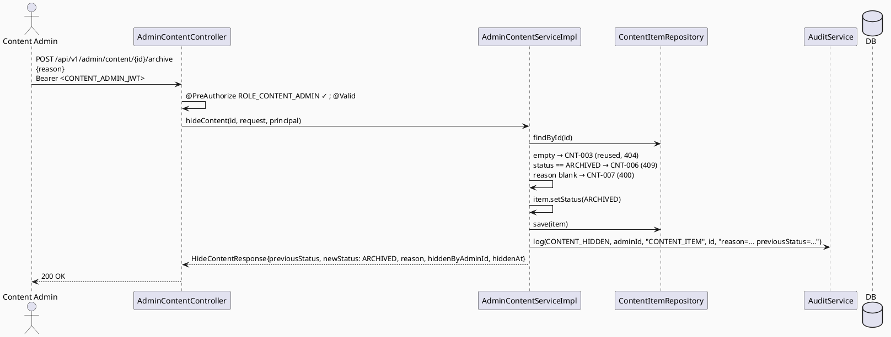

# ENGINEERING DOCUMENTATION STANDARD (EDS) v2.0
# Technical Design Specification — UC-107: Hide or Delete Content

| Field              | Value                                   |
| ------------------ | ---------------------------------------- |
| **Document ID**    | `CB-CONTENT-IMP-006`                    |
| **Version**        | `1.0`                                   |
| **Status**         | `Draft`                                 |
| **Date**           | `2026-07-02`                            |
| **Document Owner** | `HuyND`                                 |
| **Author**         | `AI Agent — Winston (System Architect)` |
| **Reviewed by**    | `[ ] Pending`                           |
| **DPO Sign-off**   | `[ ] Pending` *(N/A — editorial content, no PII)* |
| **Approved by**    | `[ ] Pending`                           |
| **Last Review**    | `2026-07-02`                            |
| **Based on EDS**   | `v2.0`                                  |

---

## CHANGELOG

| Ngày       | Người thực hiện    | Nội dung thay đổi                                                                     |
| ---------- | -------------------- | ---------------------------------------------------------------------------------------- |
| 2026-07-02 | AI Agent — Winston  | Tạo tài liệu lần đầu — TDS cho UC-107 Hide or Delete Content (Status=Draft). Lấp khoảng trống số hiệu UC đã được UC-106/UC-108/UC-227 phát hiện nhưng không UC nào nhận (CNT-006/007 chưa dùng). |

---

## MỤC LỤC

1. [Tổng quan Module](#1-tổng-quan-module)
2. [Ma trận Truy vết](#2-ma-trận-truy-vết)
3. [Architecture Decision Records (ADR)](#3-architecture-decision-records-adr)
4. [Non-Functional Requirements & SLA](#4-non-functional-requirements--sla)
5. [Static Modeling](#5-static-modeling)
6. [Dynamic Modeling](#6-dynamic-modeling)
7. [Domain Event Catalog](#7-domain-event-catalog)
8. [Interface Specification](#8-interface-specification)
9. [API Specification](#9-api-specification)
10. [Bảng mã lỗi](#10-bảng-mã-lỗi)
11. [Quy trình Triển khai](#11-quy-trình-triển-khai)
12. [Rollback & Incident Runbook](#12-rollback--incident-runbook)
13. [Kịch bản Kiểm thử Chi tiết](#13-kịch-bản-kiểm-thử-chi-tiết)
14. [Phương pháp Xác minh](#14-phương-pháp-xác-minh)
15. [API Verification Samples](#15-api-verification-samples)
16. [Authorization Matrix](#16-authorization-matrix)
17. [AI Prompt Constraints (CASE 2.0)](#17-ai-prompt-constraints-case-20)

---

## 1. Tổng quan Module

| Field                     | Value                                                                                                                                  |
| ------------------------- | --------------------------------------------------------------------------------------------------------------------------------------- |
| **UC ID**                 | `UC-107`                                                                                                                                |
| **FS Reference**          | `3.2.2.9 Hide or Delete Content` (Table 75, `02_Requirements/SRS/3_Functional_Specification.md` line 1176)                             |
| **Module Name**           | `Hide or Delete Content`                                                                                                               |
| **Bounded Context**       | `content` — admin write path over `ContentItem` (UC-105/106/108), same package/actor as `AdminContentController`                       |
| **Primary Actor**         | `Content Admin (ROLE_CONTENT_ADMIN)` (per FS Table 75 Primary Actor)                                                                    |
| **Platform**              | `Admin Web Portal`                                                                                                                       |
| **Priority**              | `High` (per FS)                                                                                                                          |
| **Frequency of Use**      | `Occasional` (per FS)                                                                                                                    |
| **Data Classification**   | `Internal`                                                                                                                              |
| **Compliance Scope**      | `N/A`                                                                                                                                    |
| **Upstream Dependencies** | `content (ContentItem, ContentStatus, ContentException — UC-105/106)`, `security`, `audit`                                              |
| **Downstream Consumers**  | Public read paths (`ContentController` UC-82/224/225, filtered by `status='APPROVED'`); **subsumes UC-227 Unpublish Content** for the `APPROVED→ARCHIVED` case (see ADR-003) |

**Mô tả:**
FS-3.2.2.9: "Hides or soft-deletes outdated, incorrect, or reported content." UC-107 cho phép **Content Admin**
chuyển bất kỳ `ContentItem` nào (bất kể `status` hiện tại, trừ khi đã `ARCHIVED`) sang `status: ARCHIVED` —
tái dùng giá trị enum có sẵn (không thêm `HIDDEN`/`DELETED` mới), theo đúng tiền lệ đã thiết lập bởi UC-227's
ADR-001 ("archived" = trạng thái ẩn khỏi công khai duy nhất trong schema hiện tại). Đây là **soft-delete** —
KHÔNG xoá hàng khỏi `content_items` (không có yêu cầu hard-delete nào trong FS/BR; xoá vĩnh viễn dữ liệu biên
tập không có lợi ích rõ ràng và không thể hoàn tác nếu cần khôi phục).

**Phạm vi rõ ràng:** KHÔNG tạo mới (UC-105); KHÔNG sửa field khác ngoài `status` (UC-106 làm việc đó); KHÔNG
duyệt version (UC-108). Việc "un-hide"/khôi phục lại sau khi archive được thực hiện qua UC-106 (`updateContent`
với `status` khác) — UC-107 không có endpoint "restore" riêng (không có bằng chứng FS/BR yêu cầu một luồng
khôi phục tách biệt).

---

## 2. Ma trận Truy vết

| Requirement ID | Loại          | Mô tả yêu cầu                                                            | Thành phần Code                              | Compliance Target | ADR liên quan |
| --------------- | -------------- | ----------------------------------------------------------------------------| ------------------------------------------------ | ------------------- | --------------- |
| UC-107          | Use Case      | Content Admin hides/soft-deletes a content item                            | `AdminContentController.hideContent()`         | —                  | ADR-001, ADR-002 |
| FS-3.2.2.9      | Functional    | "Hides or soft-deletes outdated, incorrect, or reported content"           | `AdminContentServiceImpl.hideContent()`        | —                  | ADR-001         |
| BR-RBAC-WRITE   | Business Rule | Chỉ CONTENT_ADMIN (kế thừa UC-105/106)                                     | `@PreAuthorize("hasRole('CONTENT_ADMIN')")`    | —                  | ADR-004         |
| BR-CNT-016      | Business Rule | Chỉ chuyển sang `ARCHIVED`; đã `ARCHIVED` → `CNT-006` (409, idempotency guard) | transition guard                          | —                  | ADR-002         |
| BR-CNT-017      | Business Rule | `reason` bắt buộc non-blank (accountability cho soft-delete)               | request validation                             | —                  | ADR-005         |
| BR-CNT-018      | Business Rule | KHÔNG hard-delete — hàng vẫn tồn tại trong DB, chỉ đổi `status`             | `AdminContentServiceImpl.hideContent()`        | —                  | ADR-001         |
| BR-AUDIT-001    | Business Rule | Hành động thành công được audit log                                        | `AuditService.log(...)`                        | —                  | ADR-004         |

---

## 3. Architecture Decision Records (ADR)

### ADR-001 — Soft-Delete via Existing `ARCHIVED` Enum Value (No Hard Delete, No New Status)

| Field | Value |
| ---- | ----- |
| **Status** | `Accepted` |
| **Deciders** | `HuyND — System Architect` |
| **Date** | `2026-07-02` |

**Bối cảnh:** FS nói "hides or soft-deletes" — hai từ khác nhau nhưng không có bằng chứng nào (BR/schema) phân
biệt "hide" và "soft-delete" là hai trạng thái riêng. `ContentStatus` đã có `ARCHIVED` (dùng bởi UC-227 với
cùng ý nghĩa "không hiển thị công khai"). Không có cột `deletedAt`/`isDeleted` nào trên `content_items`
(verified — đọc trực tiếp `ContentItem.java`).

**Các phương án đã xem xét:**

| Phương án | Mô tả | Ưu điểm | Nhược điểm |
| --------- | ------- | --------- | ------------ |
| A | Tái dùng `ARCHIVED` cho cả "hide" và "soft-delete" (không phân biệt) | Không cần schema mới; nhất quán với UC-227 | Không phân biệt được "tạm ẩn để sửa" vs "xoá vĩnh viễn về mặt nghiệp vụ" — nhưng FS cũng không yêu cầu phân biệt |
| B | Thêm `ContentStatus.HIDDEN` và `ContentStatus.DELETED` tách biệt `ARCHIVED` | Ngữ nghĩa rõ ràng hơn | Không có nguồn FS/BR nào đòi hỏi 2 trạng thái riêng; vi phạm "smallest scoped change"; 3 trạng thái cùng ý nghĩa "ẩn khỏi công khai" gây nhầm lẫn cho UC-227/UC-108 (phải xử lý thêm case) |
| C | Hard delete (xoá hàng khỏi `content_items`) | Đơn giản nhất về mặt code | **Loại trừ ngay** — FS ghi rõ "soft-deletes"; không thể khôi phục; mất audit trail liên kết (versionNo, publishedAt) |

**Quyết định:** Chọn **Phương án A** — tái dùng `ARCHIVED`, không tạo giá trị enum mới, không hard-delete.

**Hệ quả:**
- **Tích cực:** Không cần migration; nhất quán tuyệt đối với UC-227; đơn giản nhất thoả mãn FS.
- **Tiêu cực:** "Hide" và "soft-delete" không phân biệt được trong dữ liệu — nếu Product sau này cần phân biệt (ví dụ báo cáo riêng "đã xoá" vs "tạm ẩn"), cần ADR follow-up thêm cột/enum — flag `Open`.

---

### ADR-002 — Transition Guard: Any Non-ARCHIVED Status → ARCHIVED (Broader Than UC-227)

| Field | Value |
| ---- | ----- |
| **Status** | `Accepted` |
| **Deciders** | `HuyND — System Architect` |
| **Date** | `2026-07-02` |

**Bối cảnh:** UC-227 (Unpublish Content) chỉ cho phép `APPROVED → ARCHIVED` (nội dung đang public bị gỡ).
UC-107's FS phạm vi rộng hơn: "outdated, incorrect, **or reported** content" — không giới hạn chỉ nội dung đã
`APPROVED`. Một `DRAFT` lỗi thời (chưa từng publish) mà Content Admin muốn dọn dẹp vĩnh viễn cũng thuộc phạm
vi "soft-delete" của UC-107. Một item `PENDING_REVIEW` bị phát hiện sai lệch trước khi System Admin duyệt
(UC-108) cũng cần được ẩn/xoá được — không nên bắt buộc phải chờ UC-108 duyệt/từ chối trước.

**Quyết định:** Cho phép chuyển từ **bất kỳ** `status ∈ {DRAFT, PENDING_REVIEW, APPROVED}` sang `ARCHIVED`. Chỉ
chặn khi item **đã** `ARCHIVED` (idempotency guard — tránh action trùng lặp vô nghĩa) → `CNT-006` (409).

**Hệ quả:**
- **Tích cực:** Bao phủ đúng phạm vi FS ("outdated, incorrect, or reported" — không giới hạn theo status nguồn); Content Admin không bị chặn bởi trạng thái trung gian.
- **Tiêu cực:** Không có transition-history nào ghi "đã archive từ status nào" ngoài audit log (chấp nhận được — cùng mức độ chi tiết như UC-100/UC-227).

---

### ADR-003 — Relationship to UC-227 (Unpublish Content): Recommendation That This Endpoint Subsumes It

| Field | Value |
| ---- | ----- |
| **Status** | `Proposed — recommendation only, needs Tech Lead confirmation before Sprint 4 planning` |
| **Deciders** | `HuyND — System Architect (proposed; not yet confirmed)` |
| **Date** | `2026-07-02` |

> **Note:** This ADR is a *recommendation*, not a decided architecture choice. Approving UC-107's TDS/Test-Spec
> does **not** by itself cancel or resolve UC-227 — that requires a separate, explicit Tech Lead sign-off when
> Sprint 4 is planned. UC-107's implementation must not assume UC-227 is void.

**Bối cảnh:** UC-227 (`04_Implement/UC227_UnpublishContent/`, Draft, Sprint 4 trong task allocation) định nghĩa
`POST /api/v1/admin/content/{id}/unpublish`, chuyển `APPROVED → ARCHIVED`, cùng actor (`CONTENT_ADMIN`), cùng
bounded context, cùng cơ chế (tái dùng `ARCHIVED`, ADR-001 của UC-227). Đây là **tập con hoàn toàn** của
transition matrix UC-107 định nghĩa ở ADR-002 (`APPROVED → ARCHIVED` là 1 trong 3 nguồn UC-107 hỗ trợ).

**Quyết định:** UC-107 implement **một endpoint duy nhất** phục vụ cả hai UC. Khi UC-227 được triển khai ở
Sprint 4 (theo `function-spec-task-allocation.md`), nó sẽ **tham chiếu lại** endpoint này thay vì tạo
`/unpublish` riêng — UC-227's TDS/Test-Spec (đã Draft) cần được cập nhật thành "satisfied by UC-107" khi đến
lượt, không triển khai lại. Đây là quyết định **nổi bật cần con người xác nhận** — nếu Product muốn "unpublish"
và "hide/delete" là hai hành động phân biệt về mặt UI/thông báo (dù cùng transition DB), đó là một ADR follow-up
(ví dụ: hai nút bấm khác nhau trên cùng 1 endpoint, khác `reason` category) chứ không phải hai endpoint riêng.

**Hệ quả:**
- **Tích cực:** Tránh xây 2 endpoint trùng lặp cho cùng 1 transition; giảm effort Sprint 4.
- **Tiêu cực:** Cần một bước đồng bộ tài liệu ở UC-227 khi Sprint 4 bắt đầu (không tự động) — ghi nhận `Open`, nhắc Tech Lead khi lập kế hoạch Sprint 4.

---

### ADR-004 — RBAC (reuse UC-105/106) + Audit

| Field | Value |
| ---- | ----- |
| **Status** | `Accepted` |

Kế thừa `@PreAuthorize("hasRole('CONTENT_ADMIN')")` class-level trên `AdminContentController` (đã có từ
UC-105) — method mới tự động kế thừa, không cần annotation riêng. Audit action mới `CONTENT_HIDDEN` (thêm vào
`AuditAction` enum + CHECK constraint migration nếu enum này dùng constraint DB — xem §11.2).

---

### ADR-005 — `reason` Required (Accountability, Same Pattern as UC-100/UC-102)

| Field | Value |
| ---- | ----- |
| **Status** | `Accepted (design decision — not explicitly sourced, cùng pattern các UC anh em)` |

Soft-delete/hide là hành động có tác động (gỡ nội dung khỏi công khai) — `reason` bắt buộc non-blank, vi phạm
→ `CNT-007` (400). Nhất quán với UC-100 ADR-006 (HIDE/LOCK bắt buộc reason) và UC-102 ADR-005 (WARN/SUSPEND
bắt buộc reason).

---

## 4. Non-Functional Requirements & SLA

| Category | Requirement | Target | Measurement | Basis |
| --- | --- | --- | --- | --- |
| Latency | p99 `POST /admin/content/{id}/archive` | `Open` — reuse UC-105/106 baseline | k6 | — |
| Data integrity | Chỉ `status` bị đổi; hàng KHÔNG bị xoá khỏi DB | 100% | unit + integration | ADR-001 |
| Access control | CONTENT_ADMIN only | Least privilege | §16 | ADR-004 |
| Idempotency | Gọi lại trên item đã `ARCHIVED` → `CNT-006`, không lỗi 500 | 100% | unit test | ADR-002 |

---

## 5. Static Modeling

### 5.1. Class Diagram (PlantUML)

```plantuml
@startuml UC107_HideOrDeleteContent_ClassDiagram
skinparam classAttributeIconSize 0
skinparam backgroundColor #FAFAFA

enum ContentStatus { DRAFT PENDING_REVIEW APPROVED ARCHIVED }
' ARCHIVED already exists — reused for hide/soft-delete (ADR-001), same value UC-227 uses

class ContentItem <<Entity>> { + id: UUID + status: ContentStatus + ... }

class HideContentRequest <<DTO>> { + reason: String <<required, ADR-005>> }
class HideContentResponse <<DTO>> {
  + id: UUID + previousStatus: ContentStatus + newStatus: ContentStatus
  + reason: String + hiddenByAdminId: UUID + hiddenAt: Instant
}

interface AdminContentService {
  + createContent(request, authorUserId): CreateContentResponse   ' UC-105
  + updateContent(id, request, principal): UpdateContentResponse  ' UC-106
  + hideContent(id, request, principal): HideContentResponse      ' UC-107 (new)
}
class AdminContentController <<RestController>> { + hideContent(id, request, principal) }

AdminContentController --> AdminContentService
@enduml
```

### 5.2. Data Structure — NO Schema Delta

> **No migration.** `content_items.status` (`V1__init_schema.sql` line 201) already supports `ARCHIVED` as a
> free string column with no CHECK constraint (verified in UC-108's ADR-002 — same finding applies here).
> UC-107 only UPDATEs the existing `status` column.
>
> **Audit enum:** if `AuditAction.CONTENT_HIDDEN` does not already exist, add it as a Java enum value. Per the
> project's known drift pattern (found and fixed once already for community actions — see UC170/200/201
> session), **verify whether `audit_logs_action_check` has a CHECK constraint** requiring a matching Flyway
> migration; if so, add the new value there in the same migration that adds the enum constant, not as an
> afterthought.

---

## 6. Dynamic Modeling

### 6.1. Sequence — Happy Path (Hide an APPROVED item)



### 6.2. Error Paths
- content not found → `CNT-003` (reused); already `ARCHIVED` → `CNT-006` (409); reason blank → `CNT-007` (400); wrong role → `CNT-004` (reused).

---

## 7. Domain Event Catalog

| Event | Trigger | Publisher | Subscriber | Payload | Async? |
| --- | --- | --- | --- | --- | --- |
| (none v1) | — | — | — | — | — |

> **N/A** — synchronous + audit-only, same pattern as UC-100/UC-105/UC-106/UC-227.

---

## 8. Interface Specification

### 8.1. Service Interface

```java
// com.carebridge.backend.content.service.AdminContentService — extended
public interface AdminContentService {
    CreateContentResponse createContent(CreateContentRequest request, UUID authorUserId);   // UC-105
    UpdateContentResponse updateContent(UUID id, UpdateContentRequest request, Principal principal);  // UC-106

    /**
     * Hides/soft-deletes a content item by transitioning status to ARCHIVED (ADR-001 — reuses
     * the existing enum value, no hard delete). Allowed from DRAFT, PENDING_REVIEW, or APPROVED
     * (ADR-002 — broader than UC-227's APPROVED-only case, which this endpoint subsumes per ADR-003).
     *
     * @throws ContentException (CNT-003) if id not found (reused)
     * @throws ContentException (CNT-006) if already ARCHIVED
     * @throws ContentException (CNT-007) if reason is blank (ADR-005)
     */
    HideContentResponse hideContent(UUID id, HideContentRequest request, Principal principal);
}
```

### 8.2. Repository

```java
// ContentItemRepository.findById/save — existing (UC-105/106). No new finder needed.
```

### 8.3. DTOs

```java
public record HideContentRequest(
        @NotBlank @Size(max = 1000) String reason
) {}

public record HideContentResponse(
        UUID id, ContentStatus previousStatus, ContentStatus newStatus,
        String reason, UUID hiddenByAdminId, Instant hiddenAt
) {}
```

---

## 9. API Specification

### 9.1. Endpoints Table

| Method | Path                                  | Auth Level | Required Roles       | Rate Limit | Idempotent? |
| ------ | ---------------------------------------- | ------------ | ----------------------- | ------------ | -------------- |
| `POST` | `/api/v1/admin/content/{id}/archive`     | JWT Bearer   | `ROLE_CONTENT_ADMIN`   | `Open`       | No (2nd call on already-ARCHIVED item → `CNT-006`) |

> **Naming note:** endpoint path is `/archive` (neutral, maps 1:1 to the `ContentStatus.ARCHIVED` value it
> sets) rather than `/hide` or `/delete`, to avoid implying two different underlying mechanisms when there is
> only one (ADR-001). This is also the endpoint UC-227 (Unpublish Content) reuses per ADR-003.

### 9.2. Request / Response

**Request:** `{ "reason": "Thông tin dinh dưỡng đã lỗi thời, thay thế bởi bài viết mới" }`

**Response — 200 OK:**
```json
{ "id": "…", "previousStatus": "APPROVED", "newStatus": "ARCHIVED",
  "reason": "Thông tin dinh dưỡng đã lỗi thời, thay thế bởi bài viết mới",
  "hiddenByAdminId": "…", "hiddenAt": "2026-07-02T10:15:00Z" }
```

**404 (CNT-003, reused):** content not found.
**409 (CNT-006):** already archived.
**400 (CNT-007):** reason blank.
**403 (CNT-004, reused):** non-CONTENT_ADMIN.

---

## 10. Bảng mã lỗi

| Code       | HTTP Status | Message (EN)                          | Trigger Condition                          | Status in code |
| ----------- | ------------- | ---------------------------------------- | ---------------------------------------------- | ----------------- |
| `CNT-006`  | 409           | Content item is already archived         | `status == ARCHIVED` at call time              | **New — to implement** (fills the gap flagged by UC-106/UC-108/UC-227) |
| `CNT-007`  | 400           | Reason required to hide content          | `reason` blank/null (ADR-005)                  | **New — to implement** (fills the gap flagged by UC-108) |
| `CNT-003`  | 404           | Content item not found                    | `findById(id)` empty                          | Reused (UC-106 first impl) |
| `CNT-004`  | 403           | Insufficient permissions                  | Non-CONTENT_ADMIN                             | Reused (UC-105) |
| `CNT-005`  | 500           | Internal server error                     | Unhandled exception                           | Reused (UC-105) |

> **Numbering reconciliation:** UC-105 defined `CNT-001,002,004,005`; UC-106 implemented reserved `CNT-003`;
> UC-108 claims `CNT-008,009`; UC-227 claims `CNT-010,011`. All five prior Draft documents flagged `CNT-006/007`
> as an unexplained gap ("Consistency Gate must confirm... if unused, note as an intentional gap, not a bug").
> This TDS resolves that gap: **`CNT-006` and `CNT-007` belong to UC-107**, the use case that was missing from
> the original batch. No collision with any other claimed code.

---

## 11. Quy trình Triển khai

### 11.1. Prerequisites
- [ ] UC-105/106 deployed (`ContentItem`, `ContentException`, `AdminContentController`/`Service` pattern)
- [x] `@EnableMethodSecurity` (inherited)
- [ ] No migration for `content_items` — confirm (ADR-001/002, no CHECK constraint)
- [ ] Confirm whether `AuditAction` has a DB CHECK constraint; if so, migrate `CONTENT_HIDDEN` into it in the same change (see §5.2 note — known drift pattern from a prior session)

### 11.2. Pre-Migration Checklist
- [x] **Không cần migration cho `content_items`** — `ARCHIVED` đã tồn tại, không CHECK constraint.
- [ ] **Kiểm tra migration cho `audit_logs_action_check`** nếu `CONTENT_HIDDEN` là giá trị `AuditAction` mới và constraint đó tồn tại (CG-9).

### 11.3. Implementation Steps
```
1. HideContentRequest/Response DTOs (§8.3)
2. ContentException factories: alreadyArchived() → CNT-006, reasonRequired() → CNT-007
3. AdminContentService.hideContent() interface + Impl:
   a. findById → CNT-003 if empty
   b. status == ARCHIVED → CNT-006
   c. reason blank → CNT-007
   d. item.setStatus(ARCHIVED), save()
   e. auditService.log(CONTENT_HIDDEN, ...)
   f. map to HideContentResponse
4. AdminContentController POST /api/v1/admin/content/{id}/archive (inherits class-level @PreAuthorize) + @Valid
5. AuditAction.CONTENT_HIDDEN — add enum value; migrate CHECK constraint if one exists (verify first)
```

### 11.4. Deployment Checklist
- [ ] Hide transitions DRAFT/PENDING_REVIEW/APPROVED → ARCHIVED; already-ARCHIVED → 409
- [ ] No row is ever deleted from `content_items`
- [ ] Non-CONTENT_ADMIN → 403 (CNT-004)
- [ ] UC-227 (Sprint 4) TDS updated to reference this endpoint instead of building `/unpublish` separately

---

## 12. Rollback & Incident Runbook

| Điều kiện | Ngưỡng | Người quyết định |
| ------------ | --------- | ------------------- |
| Hard-delete accidentally implemented (row removed from DB) | Bất kỳ case nào | Tech Lead (CRITICAL — irreversible data loss, contradicts ADR-001) |
| `ARCHIVED` content vẫn xuất hiện ở public read path | Bất kỳ case nào | Tech Lead (CRITICAL — unreviewed hide has no effect) |

```bash
kubectl rollout undo deployment/carebridge-api
# No migration to revert for content_items (if audit CHECK constraint was migrated, that migration
# is additive-only — do not revert it if other audit rows already reference CONTENT_HIDDEN).
```

---

## 13. Kịch bản Kiểm thử Chi tiết

> Chi tiết trong `UC107_HideOrDeleteContent_Test-Spec.md` (`CB-CONTENT-TEST-006`).

### 13.1. Unit / Service
- Happy path from each of DRAFT/PENDING_REVIEW/APPROVED → ARCHIVED
- Already ARCHIVED → CNT-006; not found → CNT-003 (reused); reason blank → CNT-007
- Row is saved with status=ARCHIVED, all other fields unchanged (no accidental field wipe)
- Audit called once with CONTENT_HIDDEN

### 13.2. Integration
- Full POST (Testcontainers): DB row status updated to ARCHIVED, row still exists (COUNT unchanged), public read query excludes it after hide

### 13.3. Security
- Non-CONTENT_ADMIN → 403 CNT-004; No JWT → 401

---

## 14. Phương pháp Xác minh

```sql
SELECT content_item_id, status FROM content_items WHERE content_item_id='<id>';
-- after hide: status='ARCHIVED'; row count for this id unchanged (still 1 — no hard delete)
```

---

## 15. API Verification Samples

```bash
curl -X POST "https://api.carebridge.vn/api/v1/admin/content/<id>/archive" \
  -H "Authorization: Bearer $ADMIN_TOKEN" -H "Content-Type: application/json" \
  -d '{"reason":"Thông tin lỗi thời"}'
# Expected: 200, newStatus=ARCHIVED
```

---

## 16. Authorization Matrix

| Endpoint                                  | `MOTHER` | `FAMILY` | `EXPERT` | `MODERATOR` | `CONTENT_ADMIN` | `PARTNER_REP` | `SYSTEM_ADMIN` |
| ---------------------------------------------| ---------- | ---------- | ---------- | -------------- | ------------------ | --------------- | ----------------- |
| `POST /api/v1/admin/content/{id}/archive`  | ❌        | ❌        | ❌        | ❌ *(note)*     | ✅                | ❌              | ❌ *(note)*        |

**Chú thích:** MODERATOR/SYSTEM_ADMIN = ❌ — content editorial hide/delete ≠ community moderation (same
boundary as UC-106 §16); no `RoleHierarchy` bean exists.

---

## 17. AI Prompt Constraints (CASE 2.0)

### 17.1 Constraint Summary Table

| #   | Constraint                                                                | Source            | Last Verified |
| --- | --------------------------------------------------------------------------| ------------------- | --------------- |
| C1  | Controller inherits class-level `@PreAuthorize("hasRole('CONTENT_ADMIN')")` | `ADR-004`         | `2026-07-02`     |
| C2  | Chỉ chuyển sang `ARCHIVED`; KHÔNG tạo enum mới, KHÔNG hard-delete           | `ADR-001`           | `2026-07-02`     |
| C3  | Cho phép từ DRAFT/PENDING_REVIEW/APPROVED; đã ARCHIVED → CNT-006            | `ADR-002`           | `2026-07-02`     |
| C4  | `reason` bắt buộc non-blank → CNT-007                                      | `ADR-005`           | `2026-07-02`     |
| C5  | Endpoint này phục vụ cả UC-227 (không xây `/unpublish` riêng)              | `ADR-003`           | `2026-07-02`     |

### 17.2 Constraint Injection Block

```
[CONSTRAINT BLOCK — Module: Hide or Delete Content (UC-107)]
Theo TDS CB-CONTENT-IMP-006:
1. [C1] Method mới kế thừa @PreAuthorize class-level của AdminContentController.
2. [C2] CHỈ đổi status → ARCHIVED. KHÔNG thêm ContentStatus.HIDDEN/DELETED. KHÔNG xoá hàng khỏi DB.
3. [C3] Cho phép từ DRAFT/PENDING_REVIEW/APPROVED. Item đã ARCHIVED → CNT-006 (409).
4. [C4] reason bắt buộc non-blank → CNT-007 (400).
5. [C5] Đây là endpoint DUY NHẤT cho hide/unpublish — KHÔNG tạo /unpublish riêng cho UC-227.

[CONTEXT BLOCK]
- Bounded Context: content; Data: Internal; Compliance: N/A
- Interfaces: §8; Error codes: §10 (CNT-006/007 new — resolves numbering gap; CNT-003/004/005 reused); Auth: §16
- Schema delta: NONE (content_items); verify AuditAction/CHECK constraint (§11.2)

[TASK BLOCK]
Implement AdminContentController.hideContent(), AdminContentServiceImpl.hideContent(), DTOs,
CNT-006/007 factories — thỏa mãn C1-C5. Tests cover §13 (Test-Spec CB-CONTENT-TEST-006).
```

### 17.3 Constraint Quality Checklist
- [x] Traceable; [x] không generic; [x] Last Verified; [x] reference §8/§16

### 17.4 Anti-Pattern Detection

| AP-ID     | Anti-Pattern          | Dấu hiệu                                                        | Hành động                |
| --------- | ---------------------- | ------------------------------------------------------------------- | --------------------------- |
| AP-AI-001 | Unconstrained Gen     | Bỏ RBAC/transition guard                                            | Reject — C1/C3, BLOCKING |
| AP-AI-002 | Hallucinated Schema   | Thêm `ContentStatus.HIDDEN`/`DELETED` hoặc xoá hàng khỏi DB          | Reject — C2, BLOCKING (hard-delete = irreversible data loss) |
| AP-AI-003 | Duplicate Endpoint    | Tạo `/unpublish` riêng trùng lặp với endpoint này                    | Reject — C5 |
| AP-AI-004 | Layer Violation       | Controller gọi repository trực tiếp                                | Reject |
| AP-AI-005 | Hallucinated Contract | Import class không có trong §8                                     | Reject |

**Kết quả review:**
- [x] Không phát hiện anti-pattern nào trong bản thân spec này → approved-for-RED-phase

---

## PHỤ LỤC

### B. Tài liệu tham chiếu

| Document | Path |
| ------------ | ------- |
| UC-105 TDS (Approved, oracle) | `04_Implement/UC105_CreateContentFAQChecklist/UC105_CreateContentFAQChecklist_TDS.md` |
| UC-106 TDS (sibling, Draft) | `04_Implement/UC106_UpdateContentFAQChecklist/UC106_UpdateContentFAQChecklist_TDS.md` |
| UC-108 TDS (sibling, Draft) | `04_Implement/UC108_ApproveContentVersion/UC108_ApproveContentVersion_TDS.md` |
| UC-227 TDS (Draft, Sprint 4 — subsumed by this UC per ADR-003) | `04_Implement/UC227_UnpublishContent/UC227_UnpublishContent_TDS.md` |
| Schema `content_items` (line 201, no CHECK on status) | `05_Development/CareBridgeAPI/src/main/resources/db/migration/V1__init_schema.sql` |

---

*EDS v2.1 — Fills the UC-107 gap flagged by UC-106/UC-108/UC-227 (CNT-006/007 previously unclaimed). NO schema
delta for `content_items` (reuses ARCHIVED). ADR-003 (this endpoint subsumes UC-227's narrower Sprint-4 scope)
is the decision most likely to need Tech Lead sign-off before Sprint 4 planning. Status: Draft.*
