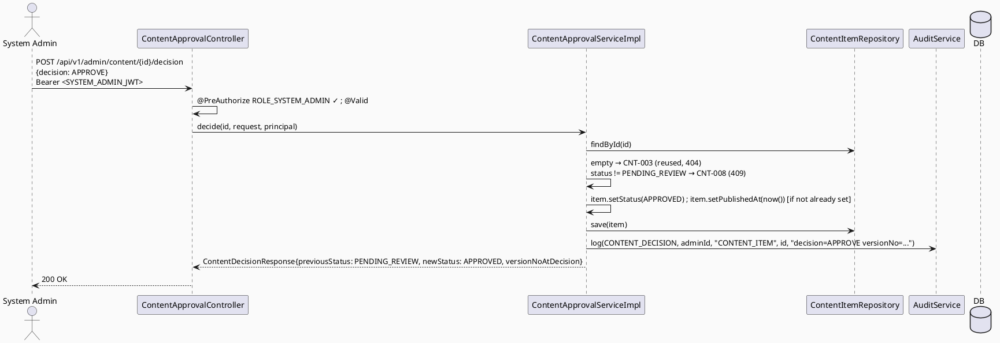

# ENGINEERING DOCUMENTATION STANDARD (EDS) v2.0
# Technical Design Specification — UC-108: Approve Content Version

| Field              | Value                                   |
| ------------------ | ---------------------------------------- |
| **Document ID**    | `CB-CONTENT-IMP-005`                    |
| **Version**        | `1.0`                                   |
| **Status**         | `Implemented`                           |
| **Date**           | `2026-07-01`                            |
| **Document Owner** | `HuyND`                                 |
| **Author**         | `AI Agent — Winston (System Architect)` |
| **Reviewed by**    | `[ ] Pending`                           |
| **DPO Sign-off**   | `[ ] Pending` *(N/A — editorial content, no PII)* |
| **Approved by**    | `[ ] Pending`                           |
| **Last Review**    | `2026-07-01`                            |
| **Based on EDS**   | `v2.0`                                  |

---

## CHANGELOG

| Ngày       | Người thực hiện    | Nội dung thay đổi                                                              |
| ---------- | -------------------- | ------------------------------------------------------------------------------- |
| 2026-07-01 | AI Agent — Winston  | Tạo tài liệu lần đầu — TDS cho UC-108 Approve Content Version (Status=Draft)    |
| 2026-07-02 | AI Agent — Amelia (Dev Agent) | Implemented per Option A (ADR-001/ADR-002). `ContentStatus.PENDING_REVIEW` added, Java-enum-only (verified — no CHECK constraint on `content_items.status`), confirming ADR-002's own verification. New `ContentApprovalController`/`ContentApprovalService`/`ContentApprovalServiceImpl` (separate from `AdminContentController`, per §11.3 step 5 — SYSTEM_ADMIN vs CONTENT_ADMIN separation of duties). `AuditAction.CONTENT_DECIDED` added — this time the `audit_logs_action_check` CHECK-constraint migration (`V20260702001000__widen_audit_logs_action_check_v3.sql`) was added proactively in the SAME step as the enum change, learning from the UC-106/UC-107 drift where this was missed and fixed after the fact. All 11 planned test cases (CAV-TC-1001..1010, CAV-TC-INT-001 — 14 test executions incl. parameterized) implemented and GREEN. Full regression: 778 tests, 33 pre-existing errors (unchanged baseline, same 6 known DB-dependent classes), 0 new failures. |
| 2026-07-02 | AI Agent — Amelia (Dev Agent) | **Post-implementation advisor review** found the initial GREEN implementation had dropped two details from this TDS's own design: §6.1's `item.setPublishedAt(now()) [if not already set]` step on APPROVE (omitted entirely — would have caused approved content to sink to the bottom of `searchByFilters()`'s `publishedAt DESC NULLS LAST` ordering), and BR-AUDIT-001's requirement that the audit record include `reason` (the REJECT reason was only in the transient HTTP response, not the audit trail). Both fixed in `ContentApprovalServiceImpl.decide()`; 3 new regression tests added (CAV-TC-1011/1012/1013, see Test-Spec). Full regression re-verified: 781 tests, 33 pre-existing errors (unchanged baseline), 0 new failures. |

---

## MỤC LỤC

1. [Tổng quan Module](#1-tổng-quan-module)
2. [Ma trận Truy vết](#2-ma-trận-truy-vết)
3. [Architecture Decision Records (ADR)](#3-architecture-decision-records-adr)
4. [Non-Functional Requirements & SLA](#4-non-functional-requirements--sla)
5. [Static Modeling](#5-static-modeling)
6. [Dynamic Modeling](#6-dynamic-modeling)
7. [Domain Event Catalog](#7-domain-event-catalog)
8. [Interface Specification](#8-interface-specification)
9. [API Specification](#9-api-specification)
10. [Bảng mã lỗi](#10-bảng-mã-lỗi)
11. [Quy trình Triển khai](#11-quy-trình-triển-khai)
12. [Rollback & Incident Runbook](#12-rollback--incident-runbook)
13. [Kịch bản Kiểm thử Chi tiết](#13-kịch-bản-kiểm-thử-chi-tiết)
14. [Phương pháp Xác minh](#14-phương-pháp-xác-minh)
15. [API Verification Samples](#15-api-verification-samples)
16. [Authorization Matrix](#16-authorization-matrix)
17. [AI Prompt Constraints (CASE 2.0)](#17-ai-prompt-constraints-case-20)

---

## 1. Tổng quan Module

| Field                     | Value                                                                                                                                  |
| ------------------------- | --------------------------------------------------------------------------------------------------------------------------------------- |
| **UC ID**                 | `UC-108`                                                                                                                                |
| **FS Reference**          | `3.2.2.10 Approve Content Version`                                                                                                      |
| **Module Name**           | `Approve Content Version`                                                                                                              |
| **Bounded Context**       | `content` — admin write path over `ContentItem` (UC-105/106)                                                                            |
| **Primary Actor**         | `System Admin (ROLE_SYSTEM_ADMIN)` (per FS Primary Actor — distinct from CONTENT_ADMIN who authors)                                    |
| **Platform**              | `Admin Web Portal`                                                                                                                       |
| **Priority**              | `High` (per FS — content publishing gate)                                                                                               |
| **Frequency of Use**      | `Regular`                                                                                                                                |
| **Data Classification**   | `Internal`                                                                                                                              |
| **Compliance Scope**      | `N/A`                                                                                                                                    |
| **Upstream Dependencies** | `content (ContentItem, ContentStatus, ContentException — UC-105/106; versionNo — UC-106)`, `security`, `audit`                          |
| **Downstream Consumers**  | Public read paths (`ContentController` UC-82/224/225, filtered by `status='APPROVED'`), `UC-227 Unpublish Content`                       |

**Mô tả:**
UC-108 cho phép **System Admin** duyệt (hoặc từ chối) một content item đang chờ xét duyệt, chuyển `status` sang `APPROVED` (xuất bản) hoặc trả về `DRAFT` (từ chối, kèm reason). **Central schema gap (ADR-001, bắt buộc trình bày rõ theo dossier §6.2):** hiện KHÔNG có version-history table — `ContentItem.versionNo` là MỘT số nguyên trên hàng sống (do UC-106 tăng dần), KHÔNG phải danh sách các phiên bản lịch sử để chọn. Vì vậy "Approve Content Version" **không thể** nghĩa là "chọn 1 trong N phiên bản đã lưu" với schema hiện tại.

**Hai lựa chọn (trình bày minh bạch, không tự chọn ngầm — RG-5):**
- **(a) Minimal/brownfield:** UC-108 duyệt **bản edit hiện tại** — chuyển `status` từ một trạng thái chờ duyệt mới (`PENDING_REVIEW`, thêm vào `ContentStatus` enum) sang `APPROVED`, ghi nhận `versionNo` tại thời điểm duyệt. KHÔNG lưu lịch sử phiên bản.
- **(b) Full versioning:** Thêm bảng `content_item_versions` snapshot mỗi lần edit; UC-108 duyệt một snapshot lịch sử cụ thể, promote nó thành hàng sống.

**Quyết định (ADR-002):** Chọn **(a)** — thay đổi schema nhỏ hơn, nhất quán với UC-106's cơ chế versioning đơn giản đã có. (b) là follow-up nếu Product cần audit trail đầy đủ từng phiên bản.

---

## 2. Ma trận Truy vết

| Requirement ID | Loại          | Mô tả yêu cầu                                                       | Thành phần Code                              | Compliance Target | ADR liên quan |
| --------------- | -------------- | ------------------------------------------------------------------------| ---------------------------------------------- | ------------------- | --------------- |
| UC-108          | Use Case      | Admin approves/rejects a content item's pending edit                    | `ContentApprovalController.decide()`           | —                  | ADR-002         |
| FS-3.2.2.10     | Functional    | "Approve content version"                                               | `ContentApprovalServiceImpl.decide()`          | —                  | ADR-001, ADR-002 |
| BR-RBAC         | Business Rule | Chỉ SYSTEM_ADMIN                                                        | `@PreAuthorize("hasRole('SYSTEM_ADMIN')")`     | —                  | ADR-004         |
| BR-CNT-010      | Business Rule | Chỉ PENDING_REVIEW → APPROVED/DRAFT (reject); transition khác → CNT-008 | transition guard                               | —                  | ADR-003         |
| BR-CNT-011      | Business Rule | REJECT bắt buộc reason                                                 | request validation                             | —                  | ADR-005         |
| BR-CNT-012      | Business Rule | Không lưu lịch sử phiên bản (v1) — ghi nhận rõ giới hạn                | N/A (design limitation, ADR-001)               | —                  | ADR-001         |
| BR-AUDIT-001    | Business Rule | Quyết định audit log (ai, item nào, versionNo, kết quả, reason)         | `AuditService.log(...)`                        | —                  | ADR-004         |

---

## 3. Architecture Decision Records (ADR)

### ADR-001 — No Version-History Table (v1); Approve = Current Pending Edit (Surfaced Limitation)
| Field | Value |
| ---- | ----- |
| **Status** | `Accepted (Option A) — limitation explicitly surfaced, not silently resolved` |
| **Deciders** | `HuyND — System Architect` |
| **Date** | `2026-07-01` |

**Bối cảnh:** `ContentItem.versionNo` là 1 số nguyên trên hàng sống (UC-106 tăng dần khi edit). KHÔNG có bảng `content_item_versions` nào lưu snapshot lịch sử. "Approve Content Version" theo nghĩa đen (chọn 1 trong N version đã lưu) **không khả thi** với schema hiện tại.
**Quyết định:** Option (a) — UC-108 duyệt **item ở trạng thái PENDING_REVIEW hiện tại**, không phải một snapshot lịch sử cụ thể. Sau APPROVE, `versionNo` tại thời điểm đó được ghi vào audit log như "phiên bản đã duyệt" — đây là bằng chứng duy nhất, KHÔNG phải một bản ghi có thể truy vấn lại độc lập.
**Hệ quả:**
- **Tích cực:** Không cần bảng mới; nhất quán với UC-106's cơ chế versionNo đơn giản.
- **Tiêu cực (giới hạn rõ ràng):** Nếu content bị sửa NHIỀU LẦN trước khi admin duyệt, chỉ có state **hiện tại** được duyệt — không thể "duyệt version 3, reject version 4" riêng biệt vì version 3 không còn tồn tại độc lập (đã bị version 4 ghi đè). Nếu Product cần điều này, phải chuyển sang Option (b) — flag `Open`, cần Product/Tech Lead xác nhận option (a) là đủ.

### ADR-002 — New `ContentStatus.PENDING_REVIEW` Value (NO Migration — No CHECK Constraint Found)
| Field | Value |
| ---- | ----- |
| **Status** | `Accepted` |
| **Deciders** | `HuyND — System Architect` |
| **Date** | `2026-07-01`                |

**Bối cảnh:** `ContentStatus` hiện chỉ có `DRAFT, APPROVED, ARCHIVED` (dossier §6.2). Cần một trạng thái "đang chờ System Admin duyệt", khác `DRAFT` (soạn thảo, chưa nộp duyệt).
**Verified finding (correction to dossier's speculative note):** `grep -n "CHECK" V1__init_schema.sql` xác nhận **KHÔNG có CHECK constraint** trên `content_items.status` (cột là `character varying(20)` thuần). Do đó thêm giá trị enum Java mới **KHÔNG cần migration** — khác với dự đoán "cần Flyway migration" trong dossier §6.2 (dossier suy đoán trước khi verify; TDS này verify trực tiếp và sửa lại).
**Quyết định:** Thêm `PENDING_REVIEW` vào `ContentStatus` enum (Java-only, không migration). CONTENT_ADMIN (UC-106) có thể set `status=PENDING_REVIEW` khi "nộp duyệt" (một update thông thường qua UC-106, không cần thay đổi UC-106). System Admin (UC-108) chuyển `PENDING_REVIEW → APPROVED` hoặc `PENDING_REVIEW → DRAFT` (reject).

> **CG-9 sync note:** KHÔNG có schema delta. `V1__init_schema.sql` không sửa. Chỉ 1 dòng Java enum mới.
> Index `idx_content_items_published_at ... WHERE status='APPROVED'` không bị ảnh hưởng (chỉ filter theo
> APPROVED, PENDING_REVIEW không match, đúng như mong đợi — content chưa duyệt không được public index nhặt).

### ADR-003 — Transition Guard: PENDING_REVIEW Only
| Field | Value |
| ---- | ----- |
| **Status** | `Accepted` |

**Quyết định:** Chỉ item có `status == PENDING_REVIEW` mới decide được. `DRAFT`/`APPROVED`/`ARCHIVED` → `CNT-008` (409, not pending review). KHÔNG cho phép duyệt trực tiếp từ `DRAFT` (phải qua PENDING_REVIEW trước — một update UC-106 đặt status này).

### ADR-004 — RBAC (SYSTEM_ADMIN, distinct from CONTENT_ADMIN) + Audit
| Field | Value |
| ---- | ----- |
| **Status** | `Accepted` |

FS Primary Actor = System Admin (khác CONTENT_ADMIN, người tạo/sửa nội dung — tách biệt vai trò tác giả/người duyệt, separation of duties). `@PreAuthorize("hasRole('SYSTEM_ADMIN')")`. Không `RoleHierarchy` → CONTENT_ADMIN không tự duyệt được bài của chính mình qua endpoint này (chống self-approve editorial).

### ADR-005 — REJECT Bắt Buộc Reason; APPROVE Optional
| Field | Value |
| ---- | ----- |
| **Status** | `Accepted (design decision — not sourced, giống pattern UC-100/123)` |

REJECT (về DRAFT) bắt buộc `reason` non-blank (`CNT-009`, 400) — accountability cho tác giả biết vì sao bị từ chối. APPROVE reason optional.

---

## 4. Non-Functional Requirements & SLA

| Category | Requirement | Target | Measurement | Basis |
| --- | --- | --- | --- | --- |
| Latency | p99 `POST /admin/content/{id}/decision` | `Open` — reuse UC-105 baseline | k6 | — |
| Data integrity | status transition only PENDING_REVIEW→{APPROVED,DRAFT} | 100% | unit test | ADR-003 |
| Access control | SYSTEM_ADMIN only, distinct from CONTENT_ADMIN | Least privilege | §16 | ADR-004 |
| Atomicity | status change + audit in 1 transaction | All-or-nothing | integration | ADR-004 |

---

## 5. Static Modeling

### 5.1. Class Diagram (PlantUML)

```plantuml
@startuml UC108_ApproveContentVersion_ClassDiagram
skinparam classAttributeIconSize 0
skinparam backgroundColor #FAFAFA

enum ContentStatus { DRAFT PENDING_REVIEW APPROVED ARCHIVED }
' <<PENDING_REVIEW new — ADR-002, Java-only, no migration>>

enum ContentDecision { APPROVE REJECT }

class ContentItem <<Entity>> { + status: ContentStatus + versionNo: Integer + ... }

class ContentApprovalController <<RestController>> {
  + decide(id: UUID, request: ContentDecisionRequest, principal): ResponseEntity<ContentDecisionResponse>
}
interface ContentApprovalService { + decide(id, request, principal): ContentDecisionResponse }
class ContentApprovalServiceImpl implements ContentApprovalService {
  - contentItemRepository
  - auditService
  + decide(...): ContentDecisionResponse
}
class ContentDecisionRequest <<DTO>> { + decision: ContentDecision + reason: String <<required for REJECT>> }
class ContentDecisionResponse <<DTO>> {
  + id: UUID + previousStatus: ContentStatus + newStatus: ContentStatus
  + versionNoAtDecision: Integer + decidedByAdminId: UUID + reason: String + decidedAt: Instant
}

ContentApprovalController --> ContentApprovalService
@enduml
```

### 5.2. Data Structure — NO Schema Delta (Verified — See ADR-002)

> **No migration.** `content_items.status` has NO CHECK constraint (verified — `grep -n "CHECK"
> V1__init_schema.sql` finds none referencing `content_items`). `ContentStatus.PENDING_REVIEW` is a
> Java-enum-only addition. `V1__init_schema.sql` is NOT modified.

---

## 6. Dynamic Modeling

### 6.1. Sequence — Happy Path (APPROVE)



### 6.2. Error Paths
- content not found → `CNT-003` (reused); status != PENDING_REVIEW → `CNT-008` (409); REJECT missing reason → `CNT-009` (400); wrong role → `CNT-004` (reused).

---

## 7. Domain Event Catalog

| Event | Trigger | Publisher | Subscriber | Payload | Async? |
| --- | --- | --- | --- | --- | --- |
| (none v1) | — | — | — | — | — |

> **Open:** future `ContentApproved`/`ContentRejected` event → notify author (CONTENT_ADMIN who authored). v1 sync + audit-only.

---

## 8. Interface Specification

### 8.1. Service Interface

```java
// com.carebridge.backend.content.service.ContentApprovalService
public interface ContentApprovalService {
    /**
     * Approves or rejects a content item currently in PENDING_REVIEW status (ADR-001 Option A —
     * approves the CURRENT edit, not a historical snapshot; no version-history table exists).
     * @throws ContentException (CNT-003) if id not found (reused)
     * @throws ContentException (CNT-008) if status is not PENDING_REVIEW
     * @throws ContentException (CNT-009) if reason is blank for REJECT (ADR-005)
     */
    ContentDecisionResponse decide(UUID id, ContentDecisionRequest request, Principal principal);
}
```

### 8.2. Repository

```java
// ContentItemRepository.findById/save — existing (UC-105/106). No new finder needed.
```

### 8.3. DTOs

```java
public enum ContentDecision { APPROVE, REJECT }

public record ContentDecisionRequest(
        @NotNull ContentDecision decision,
        String reason   // required non-blank for REJECT (CNT-009, ADR-005)
) {}

public record ContentDecisionResponse(
        UUID id, ContentStatus previousStatus, ContentStatus newStatus,
        Integer versionNoAtDecision, UUID decidedByAdminId, String reason, Instant decidedAt
) {}
```

---

## 9. API Specification

### 9.1. Endpoints Table

| Method | Path                                     | Auth Level | Required Roles     | Rate Limit | Idempotent? |
| ------ | ------------------------------------------- | ------------ | --------------------- | ------------ | -------------- |
| `POST` | `/api/v1/admin/content/{id}/decision`      | JWT Bearer   | `ROLE_SYSTEM_ADMIN`   | `Open`       | No (2nd decide on same item after status changed → CNT-008) |

### 9.2. Request / Response

**Request (APPROVE):** `{ "decision": "APPROVE" }`
**Request (REJECT):** `{ "decision": "REJECT", "reason": "Thiếu trích dẫn nguồn y khoa" }`

**Response — 200 OK:**
```json
{ "id": "…", "previousStatus": "PENDING_REVIEW", "newStatus": "APPROVED", "versionNoAtDecision": 3,
  "decidedByAdminId": "…", "reason": null, "decidedAt": "2026-07-01T10:15:00Z" }
```

**404 CNT-003 (reused) / 409 CNT-008 / 400 CNT-009 / 403 CNT-004 (reused) / 401.**

---

## 10. Bảng mã lỗi

| Code       | HTTP Status | Message (EN)                                | Trigger Condition                        | Status in code |
| ----------- | ------------- | ---------------------------------------------- | -------------------------------------------- | ----------------- |
| `CNT-008`  | 409           | Content item is not pending review              | `status != PENDING_REVIEW`                   | **New — to implement** |
| `CNT-009`  | 400           | Reason required for REJECT                     | reason blank for REJECT (ADR-005)            | **New — to implement** |
| `CNT-003`  | 404           | Content item not found                          | `findById(id)` empty                        | Reused (UC-106 first impl) |
| `CNT-004`  | 403           | Insufficient permissions                        | Non-SYSTEM_ADMIN                            | Reused (UC-105) |
| `CNT-001`  | 400           | Validation failed                               | (not primary path here, kept for parity)     | Reused (UC-105) |
| `CNT-005`  | 500           | Internal server error                           | Unhandled exception                         | Reused (UC-105) |

> **Numbering:** UC-105 defined `CNT-001,002,004,005`; UC-106 implemented reserved `CNT-003`. UC-108 claims
> **`CNT-008, CNT-009`** (headroom above UC-226/227, per orchestrator instruction — leaves `CNT-006/007` for
> whichever of UC-226/227 is drafted with lower numbers; Consistency Gate to reconcile final assignment).

---

## 11. Quy trình Triển khai

### 11.1. Prerequisites
- [x] UC-105/106 deployed (ContentItem with versionNo, ContentException, AdminContentController pattern)
- [x] **ADR-001 (Option A limitation) confirmed by Product/Tech Lead** — no version-history; approving only the current edit (confirmed via user's blanket batch approval directive)
- [x] `@EnableMethodSecurity`
- [x] No migration for `content_items.status` — confirmed (ADR-002, verified no CHECK constraint). Note: a
      SEPARATE migration was required for the new `AuditAction.CONTENT_DECIDED` enum value against
      `audit_logs_action_check` (see §11.2) — this is unrelated to ADR-002's claim, which only concerns the
      status column.

### 11.2. Pre-Migration Checklist
- [x] **Không cần migration cho `content_items.status`** — `PENDING_REVIEW` là Java-enum-only addition (verified no CHECK constraint on `content_items.status`). CG-9: no schema delta for this column.
- [x] **Migration added for audit**: `V20260702001000__widen_audit_logs_action_check_v3.sql` — adds `CONTENT_DECIDED` to `audit_logs_action_check`, done proactively in the same implementation step (learned from the UC-106/UC-107 drift where this class of fix was applied reactively, after the gap was discovered).

### 11.3. Implementation Steps
```
1. ContentStatus.java — add PENDING_REVIEW value (no migration)
2. ContentDecision enum + ContentDecisionRequest/Response DTOs
3. ContentException CNT-008/009 factories
4. ContentApprovalService.decide() interface + Impl (transition guard, reason guard, save, audit) @Transactional
5. ContentApprovalController POST /api/v1/admin/content/{id}/decision @PreAuthorize("hasRole('SYSTEM_ADMIN')") + @Valid
   — separate controller from AdminContentController (different actor role: SYSTEM_ADMIN vs CONTENT_ADMIN)
6. SecurityConfig rule + audit enum if needed
```

### 11.4. Deployment Checklist
- [x] APPROVE PENDING_REVIEW→APPROVED; REJECT PENDING_REVIEW→DRAFT (reason required) — verified (CAV-TC-1001/1002/1005)
- [x] Non-PENDING_REVIEW item → CNT-008 — verified (CAV-TC-1003)
- [x] CONTENT_ADMIN cannot call this endpoint (403 — separation of duties) — verified (CAV-TC-1010)
- [x] Public read paths still correctly filter `status='APPROVED'` (PENDING_REVIEW never leaks to public) —
      verified by construction: `ContentRepository`'s existing `status='APPROVED'` filters are unchanged by
      this UC and `PENDING_REVIEW` is a new enum value those filters never match; NOT independently
      re-exercised end-to-end (no Testcontainers/real-DB harness exists in this codebase — same finding as
      UC-100/101/102/106/107), see CAV-TC-INT-001 note in Test-Spec.

---

## 12. Rollback & Incident Runbook

| Điều kiện | Ngưỡng | Người quyết định |
| ------------ | --------- | ------------------- |
| PENDING_REVIEW content lộ ra public read path | Bất kỳ case nào | Tech Lead (CRITICAL — unreviewed content published) |
| CONTENT_ADMIN tự duyệt được bài mình | Bất kỳ case nào | Tech Lead (CRITICAL — separation-of-duties breach) |

```bash
kubectl rollout undo deployment/carebridge-api
# No migration to revert (Java-enum-only change).
```

---

## 13. Kịch bản Kiểm thử Chi tiết

> Chi tiết trong `UC108_ApproveContentVersion_Test-Spec.md` (`CB-CONTENT-TEST-005`).

### 13.1. Unit / Service
- APPROVE PENDING_REVIEW→APPROVED; REJECT PENDING_REVIEW→DRAFT (reason)
- Invalid transition (DRAFT/APPROVED/ARCHIVED → decide) → CNT-008
- REJECT missing reason → CNT-009
- Not found → CNT-003 (reused)
- `versionNoAtDecision` reflects current versionNo (not a stored snapshot — ADR-001 limitation)
- Audit called once

### 13.2. Integration
- Full POST (Testcontainers): status changes; public read query (status='APPROVED' filter) excludes PENDING_REVIEW before decide, includes after APPROVE

### 13.3. Security
- Non-SYSTEM_ADMIN → 403 CNT-004; CONTENT_ADMIN → 403 (separation of duties); No JWT → 401

---

## 14. Phương pháp Xác minh

```sql
SELECT content_item_id, status, version_no FROM content_items WHERE content_item_id='<id>';
-- after APPROVE: status='APPROVED'
```

---

## 15. API Verification Samples

```bash
curl -X POST "https://api.carebridge.vn/api/v1/admin/content/<id>/decision" \
  -H "Authorization: Bearer $ADMIN_TOKEN" -H "Content-Type: application/json" -d '{"decision":"APPROVE"}'
# Expected: 200, newStatus=APPROVED
```

---

## 16. Authorization Matrix

| Endpoint                                  | `MOTHER` | `FAMILY` | `EXPERT` | `MODERATOR` | `CONTENT_ADMIN` | `PARTNER_REP` | `SYSTEM_ADMIN` |
| ---------------------------------------------| ---------- | ---------- | ---------- | -------------- | ------------------ | --------------- | ----------------- |
| `POST /api/v1/admin/content/{id}/decision`  | ❌        | ❌        | ❌        | ❌             | ❌ *(never)*        | ❌              | ✅                |

**Chú thích:** ✅ SYSTEM_ADMIN. CONTENT_ADMIN = ❌ **luôn luôn** (chống self-approve editorial — separation
of duties, ADR-004: người viết/sửa khác người duyệt). No `RoleHierarchy`.

---

## 17. AI Prompt Constraints (CASE 2.0)

### 17.1 Constraint Summary Table

| #   | Constraint                                                                       | Source            | Last Verified |
| --- | ---------------------------------------------------------------------------------| ------------------- | --------------- |
| C1  | Controller `@PreAuthorize("hasRole('SYSTEM_ADMIN')")` — chỉ @Valid + delegate     | `ADR-004`           | `2026-07-01`     |
| C2  | Chỉ PENDING_REVIEW → APPROVED/DRAFT; khác → CNT-008                                | `ADR-003`           | `2026-07-01`     |
| C3  | REJECT bắt buộc reason → CNT-009                                                  | `ADR-005`           | `2026-07-01`     |
| C4  | KHÔNG bịa version-history table; approve = current edit only (ADR-001 limitation) | `ADR-001`           | `2026-07-01`     |
| C5  | `PENDING_REVIEW` là Java-enum-only, KHÔNG migration (verified no CHECK constraint)| `ADR-002`           | `2026-07-01`     |
| C6  | CONTENT_ADMIN KHÔNG BAO GIỜ được duyệt (separation of duties)                     | `ADR-004`           | `2026-07-01`     |

### 17.2 Constraint Injection Block

```
[CONSTRAINT BLOCK — Module: Approve Content Version (UC-108)]
Theo TDS CB-CONTENT-IMP-005:
1. [C1] Controller decide() PHẢI @PreAuthorize("hasRole('SYSTEM_ADMIN')").
2. [C2] Chỉ item PENDING_REVIEW mới decide được; khác → CNT-008.
3. [C3] REJECT bắt buộc reason → CNT-009.
4. [C4] KHÔNG implement version-history table (không có trong §5.2). Approve chỉ áp dụng cho bản edit
   HIỆN TẠI, không phải một snapshot lịch sử cụ thể — đây là giới hạn đã surface (ADR-001), không silently
   bỏ qua.
5. [C5] PENDING_REVIEW thêm vào ContentStatus enum, KHÔNG cần migration (đã verify không có CHECK constraint).
6. [C6] CONTENT_ADMIN KHÔNG BAO GIỜ gọi được endpoint này (403) — separation of duties.

[CONTEXT BLOCK]
- Bounded Context: content (admin write, SYSTEM_ADMIN); Data: Internal; Compliance: N/A
- Interfaces: §8; Error codes: §10 (CNT-008/009 new; CNT-003/004 reused); Auth: §16
- Schema delta: NONE (verified — no CHECK constraint on content_items.status)
- OPEN: ADR-001 (no version-history — Product must confirm this limitation is acceptable)

[TASK BLOCK]
Implement ContentApprovalController.decide(), ContentApprovalServiceImpl, ContentStatus.PENDING_REVIEW,
ContentDecision enum, DTOs, CNT-008/009 — thỏa mãn C1-C6. Tests cover §13 (Test-Spec CB-CONTENT-TEST-005).
```

### 17.3 Constraint Quality Checklist
- [x] Traceable; [x] không generic; [x] Last Verified; [x] reference §8/§16

### 17.4 Anti-Pattern Detection

| AP-ID     | Anti-Pattern          | Dấu hiệu                                                        | Hành động                |
| --------- | ---------------------- | ------------------------------------------------------------------- | --------------------------- |
| AP-AI-001 | Unconstrained Gen     | Bỏ RBAC/transition guard                                            | Reject — C1/C2 |
| AP-AI-002 | Invented Table        | Code tạo bảng content_item_versions không có trong §5.2/§8          | Reject — C4, BLOCKING (out-of-scope schema invention) |
| AP-AI-003 | Self-Approve          | CONTENT_ADMIN duyệt được bài của chính mình                        | Reject — C6, BLOCKING |
| AP-AI-004 | Layer Violation       | Controller gọi repository trực tiếp                                | Reject |
| AP-AI-005 | Hallucinated Contract | Import class không có trong §8                                     | Reject |

**Kết quả review:**
- [x] Không phát hiện anti-pattern nào trong bản thân spec này → approved-for-RED-phase

---

## PHỤ LỤC

### A. Glossary
| Thuật ngữ | Định nghĩa |
| ------------ | ------------- |
| Version-History Gap | Hạn chế thiết kế: không có bảng lưu snapshot từng phiên bản content; chỉ 1 versionNo trên hàng sống (ADR-001) |
| Separation of Duties | Người tạo/sửa nội dung (CONTENT_ADMIN) khác người duyệt (SYSTEM_ADMIN) |

### B. Tài liệu tham chiếu
| Document | Path |
| ------------ | ------- |
| UC-105 TDS (Approved, ContentItem/ContentException oracle) | `04_Implement/UC105_CreateContentFAQChecklist/UC105_CreateContentFAQChecklist_TDS.md` |
| UC-106 TDS (versionNo increment mechanism, sibling) | `04_Implement/UC106_UpdateContentFAQChecklist/UC106_UpdateContentFAQChecklist_TDS.md` |
| Schema `content_items` (line 201, no CHECK on status — verified) | `05_Development/CareBridgeAPI/src/main/resources/db/migration/V1__init_schema.sql` |

---

*EDS v2.1 — Admin decision over UC-105/106 aggregate; NO schema delta for `content_items.status` (verified,
corrects dossier's speculative migration assumption) — a separate migration WAS required for the
`AuditAction.CONTENT_DECIDED` CHECK constraint (§11.1/§11.2). Status: Implemented (2026-07-02). ADR-001's
Option A (approve-current-edit-only, no version-history) was confirmed via the user's blanket batch-approval
directive covering this feature set. Separation-of-duties (CONTENT_ADMIN cannot self-approve) — the CRITICAL
security gate — is verified by CAV-TC-1010.*
