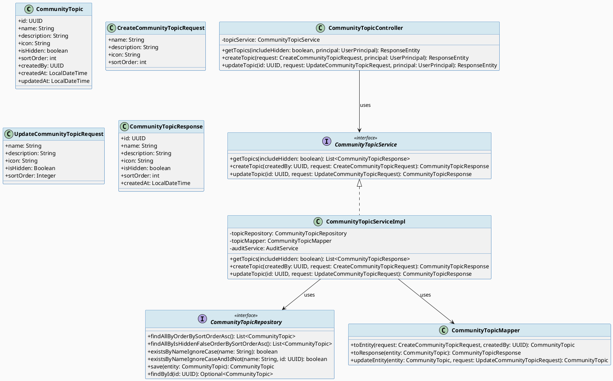
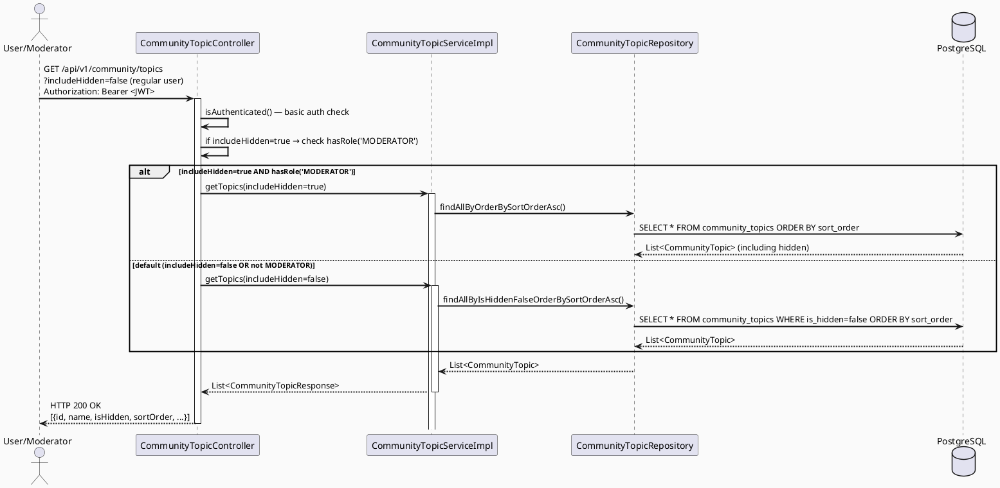
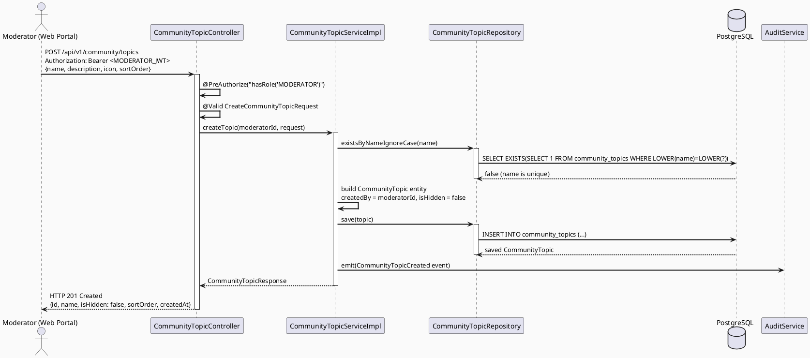
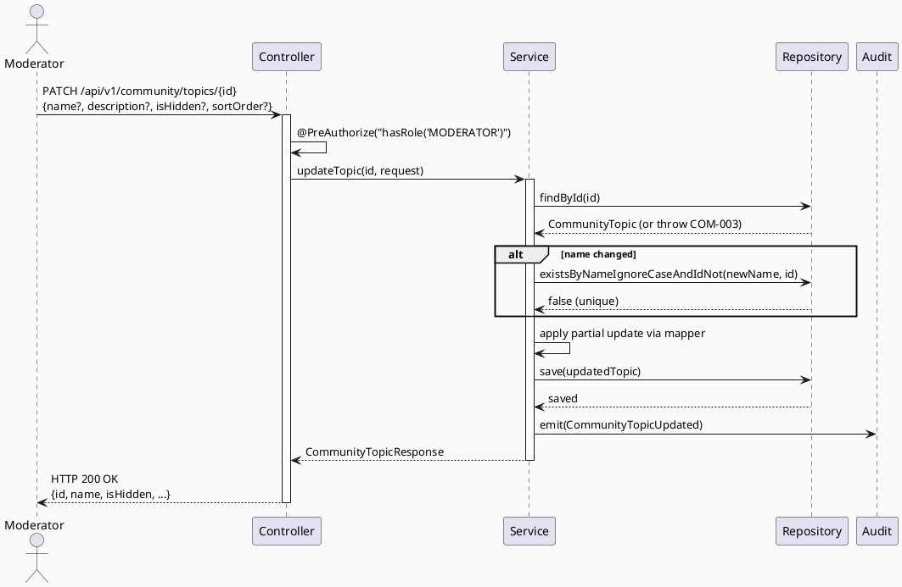
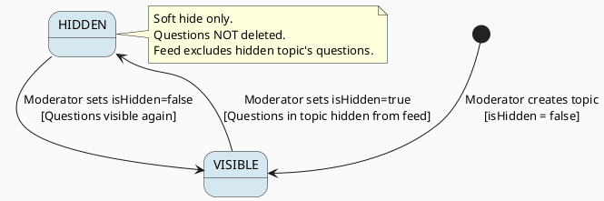

# ENGINEERING DOCUMENTATION STANDARD (EDS) v2.0
# Technical Design Specification — UC-109 Manage Community Topics

| Field              | Value                                   |
| ------------------ | --------------------------------------- |
| **Document ID**    | `CB-COMMUNITY-IMP-005`                  |
| **Version**        | `1.0`                                   |
| **Date**           | `2026-06-24`                            |
| **Status**         | `Approved`                              |
| **Document Owner** | `HuyND`                                 |
| **Author**         | `AI Agent — Winston (System Architect)` |
| **Reviewed by**    | `HuyND`                                 |
| **DPO Sign-off**   | `[x] Approved`                          |
| **Approved by**    | `[x] Approved`                          |
| **Last Review**    | `2026-06-24`                            |
| **Based on EDS**   | `v2.0`                                  |

---

## CHANGELOG

| Ngày       | Người thực hiện    | Nội dung thay đổi                                       |
| ---------- | ------------------ | ------------------------------------------------------- |
| 2026-07-01 | AI Agent — Amelia  | Sprint 2 closeout audit: xác nhận backend (`hasRole('MODERATOR')` trên create/update, không có SYSTEM_ADMIN override) và web UI (`ManageTopicsPage.tsx`) đã đầy đủ theo ADR-COM-012 (soft delete only, không hard delete). Phát hiện lệch RBAC: route `/content/topics` trên web trước đó chỉ cho `CONTENT_ADMIN, SYSTEM_ADMIN` truy cập (không có MODERATOR) dù backend chỉ chấp nhận MODERATOR — nghĩa là MODERATOR (Primary Actor đúng theo TDS) không vào được trang, còn CONTENT_ADMIN vào được trang nhưng bị 403 khi tạo/sửa/ẩn topic. Đã sửa: route guard đổi thành `requiredRoles={['MODERATOR']}`, đồng bộ với nav config (`AdminLayout.tsx`) vốn đã liệt kê MODERATOR cho mục "Danh mục"; xoá luôn mục nav `/admin/topics` (dead link, không có route tương ứng). Không chỉnh backend vì đã đúng theo TDS đã Approved. |
| 2026-06-24 | AI Agent — Amelia  | Hoàn thành cài đặt mã nguồn và kiểm thử cho UC-109       |
| 2026-06-23 | AI Agent — Winston | Tạo tài liệu lần đầu cho UC-109 Manage Community Topics |

---

## MỤC LỤC

1. [Tổng quan Module](#1-tổng-quan-module)
2. [Ma trận Truy vết (Traceability Matrix)](#2-ma-trận-truy-vết-traceability-matrix)
3. [Architecture Decision Records (ADR)](#3-architecture-decision-records-adr)
4. [Non-Functional Requirements & SLA](#4-non-functional-requirements--sla)
5. [Static Modeling (Mô hình Tĩnh)](#5-static-modeling-mô-hình-tĩnh)
6. [Dynamic Modeling (Mô hình Động)](#6-dynamic-modeling-mô-hình-động)
7. [Domain Event Catalog](#7-domain-event-catalog)
8. [Interface Specification (Đặc tả Giao diện)](#8-interface-specification-đặc-tả-giao-diện)
9. [API Specification](#9-api-specification)
10. [Bảng mã lỗi (Error Codes)](#10-bảng-mã-lỗi-error-codes)
11. [Quy trình Triển khai (Step-by-Step)](#11-quy-trình-triển-khai-step-by-step)
12. [Rollback & Incident Runbook](#12-rollback--incident-runbook)
13. [Kịch bản Kiểm thử Chi tiết](#13-kịch-bản-kiểm-thử-chi-tiết)
14. [Phương pháp Xác minh](#14-phương-pháp-xác-minh)
15. [Mẫu thử thực tế (API Verification Samples)](#15-mẫu-thử-thực-tế-api-verification-samples)
16. [Bảng tổng hợp phân quyền (Authorization Matrix)](#16-bảng-tổng-hợp-phân-quyền-authorization-matrix)
17. [AI Prompt Constraints (CASE 2.0)](#17-ai-prompt-constraints-case-20)

---

## 1. Tổng quan Module

| Field                     | Value                                                     |
| ------------------------- | --------------------------------------------------------- |
| **Module Name**           | `ManageCommunityTopics`                                   |
| **Bounded Context**       | `community`                                               |
| **UC ID**                 | `UC-109`                                                  |
| **SRS Reference**         | `3.2.2.11`                                                |
| **Primary Actor**         | `Community Moderator (ROLE_MODERATOR)`                    |
| **Platform**              | `Admin Web Portal (React TypeScript)`                     |
| **Data Classification**   | `Internal`                                                |
| **Compliance Scope**      | `BR-RBAC`                                                 |
| **Upstream Dependencies** | `security (JWT), identity (User — MODERATOR role)`        |
| **Downstream Consumers**  | `community (questions UC-54, feed UC-198, search UC-162)` |

**Mô tả:** Cho phép Community Moderator tạo, chỉnh sửa hoặc ẩn các chủ đề (topics) trong cộng đồng. Topics là phân loại cấp cao cho câu hỏi. Khi topic bị ẩn (`isHidden=true`), câu hỏi trong topic đó không được hiển thị trên feed và không nhận câu hỏi mới.

**Prerequisite for other UCs:** UC-109 phải được implement TRƯỚC UC-54, UC-162, UC-198 vì các UC đó phụ thuộc vào `community_topics` table.

---

## 2. Ma trận Truy vết (Traceability Matrix)

| Requirement ID | Loại          | Mô tả yêu cầu                                                     | Thành phần Code                                     | Compliance Target | ADR liên quan |
| -------------- | ------------- | ----------------------------------------------------------------- | --------------------------------------------------- | ----------------- | ------------- |
| UC-109         | Use Case      | Moderator quản lý community topics                                | `CommunityTopicController`                          | BR-RBAC           | ADR-COM-011   |
| BR-RBAC        | Business Rule | Chỉ ROLE_MODERATOR được tạo/sửa/ẩn topic                          | `@PreAuthorize("hasRole('MODERATOR')")`             | RBAC              | ADR-COM-011   |
| BR-COM-015     | Business Rule | Topic name phải unique (case-insensitive)                         | `CommunityTopicRepository.existsByNameIgnoreCase()` | Data integrity    | ADR-COM-012   |
| BR-COM-016     | Business Rule | Ẩn topic không xóa questions — questions vẫn tồn tại trong DB     | Soft delete only                                    | Data integrity    | ADR-COM-012   |
| BR-COM-017     | Business Rule | name không rỗng, max 100 ký tự                                    | `@NotBlank @Size(max=100)`                          | —                 | —             |
| BR-COM-018     | Business Rule | GET topics trả về tất cả topics kể cả hidden (dành cho moderator) | `findAllOrderBySortOrder()`                         | RBAC              | ADR-COM-011   |
| BR-COM-019     | Business Rule | Authenticated user GET topics chỉ thấy non-hidden topics          | `findAllByIsHiddenFalse()`                          | Separation        | ADR-COM-011   |

---

## 3. Architecture Decision Records (ADR)

### ADR-COM-011 — ROLE_MODERATOR cho Create/Update; Authenticated cho Read

| Field      | Value        |
| ---------- | ------------ |
| **Status** | `Accepted`   |
| **Date**   | `2026-06-23` |

#### Bối cảnh (Context)
Hai loại GET: (1) Moderator cần thấy tất cả topics kể cả hidden để quản lý; (2) Regular user chỉ thấy active (non-hidden) topics khi tạo câu hỏi.

#### Quyết định (Decision)
- `GET /api/v1/community/topics?includeHidden=true` — ROLE_MODERATOR only → trả cả hidden
- `GET /api/v1/community/topics` — any authenticated → trả only non-hidden

Hoặc: hai endpoint riêng. Chọn một endpoint với query param `includeHidden` được guard bằng role check.

#### Hệ quả (Consequences)
**Tích cực:** Single endpoint, clean separation via role.
**Trade-offs:** Cần role-aware logic trong service.

---

### ADR-COM-012 — Soft delete: Ẩn topic không xóa questions

| Field      | Value        |
| ---------- | ------------ |
| **Status** | `Accepted`   |
| **Date**   | `2026-06-23` |

#### Quyết định (Decision)
`isHidden=true` là soft delete. Questions trong hidden topics vẫn tồn tại trong DB — chỉ không hiển thị trên feed/search. Không cho phép hard delete topics.

---

## 4. Non-Functional Requirements & SLA

### 4.1. Performance & Availability

| Category       | Requirement          | Target SLA           |
| -------------- | -------------------- | -------------------- |
| Latency        | Topic CRUD API (p99) | `< 200ms`            |
| Topic count    | Max topics in system | ~50 topics (MVP)     |
| Read frequency | GET topics (cached)  | `< 50ms` (cache hit) |

### 4.2. Security

| Category        | Requirement                   | Verification                      |
| --------------- | ----------------------------- | --------------------------------- |
| Authorization   | ROLE_MODERATOR for write ops  | @PreAuthorize + security test     |
| Name uniqueness | Prevent duplicate topic names | Unique constraint + service check |

---

## 5. Static Modeling (Mô hình Tĩnh)

### 5.1. Class Diagram (PlantUML)



### 5.2. JPA Entity (Java)

```java
package com.carebridge.backend.community.entity;

import jakarta.persistence.*;
import lombok.*;
import org.hibernate.annotations.CreationTimestamp;
import org.hibernate.annotations.UpdateTimestamp;

import java.time.LocalDateTime;
import java.util.UUID;

@Entity
@Table(name = "community_topics", indexes = {
    @Index(name = "idx_community_topics_name", columnList = "name"),
    @Index(name = "idx_community_topics_hidden", columnList = "is_hidden")
})
@Getter @Setter @NoArgsConstructor @AllArgsConstructor @Builder
public class CommunityTopic {

    @Id
    @GeneratedValue(strategy = GenerationType.UUID)
    @Column(name = "id", updatable = false, nullable = false)
    private UUID id;

    @Column(name = "name", nullable = false, unique = true, length = 100)
    private String name;

    @Column(name = "description", columnDefinition = "TEXT")
    private String description;

    @Column(name = "icon", length = 255)
    private String icon;

    @Column(name = "is_hidden", nullable = false)
    @Builder.Default
    private boolean isHidden = false;

    @Column(name = "sort_order", nullable = false)
    @Builder.Default
    private int sortOrder = 0;

    @Column(name = "created_by", nullable = false)
    private UUID createdBy;

    @CreationTimestamp
    @Column(name = "created_at", updatable = false)
    private LocalDateTime createdAt;

    @UpdateTimestamp
    @Column(name = "updated_at")
    private LocalDateTime updatedAt;
}
```

---

## 6. Dynamic Modeling (Mô hình Động)

### 6.1. Sequence Diagram — GET Topics (PlantUML)



### 6.2. Sequence Diagram — CREATE Topic (PlantUML)



### 6.3. Sequence Diagram — UPDATE Topic (PATCH)



### 6.4. State Machine — CommunityTopic.isHidden



---

## 7. Domain Event Catalog

### 7.1. Events Published

| Event Name              | Trigger                                   | Publisher                   | Subscriber(s)                                | Async? |
| ----------------------- | ----------------------------------------- | --------------------------- | -------------------------------------------- | ------ |
| `CommunityTopicCreated` | New topic created                         | `CommunityTopicServiceImpl` | `AuditService`                               | No     |
| `CommunityTopicUpdated` | Topic name/description/visibility changed | `CommunityTopicServiceImpl` | `AuditService`                               | No     |
| `CommunityTopicHidden`  | `isHidden` changed to `true`              | `CommunityTopicServiceImpl` | `AuditService, community (questions filter)` | No     |

### 7.3. Payload Schema

```java
public record CommunityTopicCreatedEvent(
    String eventId, String eventType, String occurredAt, String version,
    Payload payload, Metadata metadata
) {
    public record Payload(UUID topicId, String name, UUID createdBy) {}
    public record Metadata(String correlationId, String causedBy) {}
}
```

---

## 8. Interface Specification (Đặc tả Giao diện)

### 8.1. Service Interface

```java
package com.carebridge.backend.community.service;

import com.carebridge.backend.community.dto.request.CreateCommunityTopicRequest;
import com.carebridge.backend.community.dto.request.UpdateCommunityTopicRequest;
import com.carebridge.backend.community.dto.response.CommunityTopicResponse;
import java.util.List;
import java.util.UUID;

/**
 * @version 1.0
 */
public interface CommunityTopicService {

    /**
     * Returns list of community topics ordered by sortOrder.
     * @param includeHidden if true, includes hidden topics (MODERATOR only)
     */
    List<CommunityTopicResponse> getTopics(boolean includeHidden);

    /**
     * Creates a new community topic.
     * @throws com.carebridge.backend.community.exception.DuplicateTopicNameException (COM-009) when name already exists
     */
    CommunityTopicResponse createTopic(UUID createdBy, CreateCommunityTopicRequest request);

    /**
     * Partially updates an existing topic.
     * @throws com.carebridge.backend.common.exception.ResourceNotFoundException (COM-003) when id not found
     * @throws com.carebridge.backend.community.exception.DuplicateTopicNameException (COM-009) when new name conflicts
     */
    CommunityTopicResponse updateTopic(UUID id, UpdateCommunityTopicRequest request);
}
```

### 8.2. Repository Interface

```java
package com.carebridge.backend.community.repository;

import com.carebridge.backend.community.entity.CommunityTopic;
import org.springframework.data.jpa.repository.JpaRepository;
import java.util.List;
import java.util.Optional;
import java.util.UUID;

/**
 * @version 1.0
 */
public interface CommunityTopicRepository extends JpaRepository<CommunityTopic, UUID> {

    List<CommunityTopic> findAllByOrderBySortOrderAsc();

    List<CommunityTopic> findAllByIsHiddenFalseOrderBySortOrderAsc();

    boolean existsByNameIgnoreCase(String name);

    boolean existsByNameIgnoreCaseAndIdNot(String name, UUID id);

    Optional<CommunityTopic> findByIdAndIsHiddenFalse(UUID id);  // Used by UC-54
}
```

### 8.3. Request/Response DTOs

```java
@Data
public class CreateCommunityTopicRequest {
    @NotBlank @Size(max = 100) private String name;
    @Size(max = 500) private String description;
    @Size(max = 255) private String icon;
    @Min(0) private int sortOrder = 0;
}

@Data
public class UpdateCommunityTopicRequest {
    @Size(max = 100) private String name;          // nullable = no change
    @Size(max = 500) private String description;   // nullable = no change
    @Size(max = 255) private String icon;          // nullable = no change
    private Boolean isHidden;                       // nullable = no change
    private Integer sortOrder;                      // nullable = no change
}
```

---

## 9. API Specification

### 9.1. Endpoints Table

| Method  | Path                            | Auth Level | Required Roles    | Rate Limit | Idempotent? |
| ------- | ------------------------------- | ---------- | ----------------- | ---------- | ----------- |
| `GET`   | `/api/v1/community/topics`      | JWT Bearer | Any authenticated | 300/min    | Yes         |
| `POST`  | `/api/v1/community/topics`      | JWT Bearer | `ROLE_MODERATOR`  | 30/min     | No          |
| `PATCH` | `/api/v1/community/topics/{id}` | JWT Bearer | `ROLE_MODERATOR`  | 60/min     | Yes         |

### 9.2. Request / Response Schemas

#### `GET /api/v1/community/topics`

**Query Parameters:**
- `includeHidden` (optional, default=false): boolean — MODERATOR only for true

**Response — 200 OK:**
```json
[
  {
    "id": "3fa85f64-5717-4562-b3fc-2c963f66afa6",
    "name": "Thai kỳ",
    "description": "Các câu hỏi về thai kỳ từ tuần 1 đến tuần 40",
    "icon": "pregnant_woman",
    "isHidden": false,
    "sortOrder": 1,
    "createdAt": "2026-06-01T00:00:00.000Z"
  },
  {
    "id": "4fb96g75-6828-5673-c4gd-3d074g77bgb7",
    "name": "Chăm sóc bé",
    "description": "Câu hỏi về chăm sóc trẻ sơ sinh và trẻ nhỏ",
    "icon": "child_care",
    "isHidden": false,
    "sortOrder": 2,
    "createdAt": "2026-06-01T00:00:00.000Z"
  }
]
```

#### `POST /api/v1/community/topics` — Tạo topic mới

**Request Body:**
```json
{
  "name": "Dinh dưỡng thai kỳ",
  "description": "Câu hỏi về chế độ ăn uống trong thai kỳ",
  "icon": "restaurant",
  "sortOrder": 3
}
```

**Response — 201 Created:**
```json
{
  "id": "550e8400-e29b-41d4-a716-446655440000",
  "name": "Dinh dưỡng thai kỳ",
  "description": "Câu hỏi về chế độ ăn uống trong thai kỳ",
  "icon": "restaurant",
  "isHidden": false,
  "sortOrder": 3,
  "createdAt": "2026-06-23T10:00:00.000Z"
}
```

**Response — 409 Conflict (duplicate name):**
```json
{
  "error": {
    "code": "COM-009",
    "message": "Community topic with this name already exists"
  }
}
```

#### `PATCH /api/v1/community/topics/{id}` — Cập nhật topic

**Request Body (partial — only changed fields):**
```json
{
  "isHidden": true
}
```

**Response — 200 OK:**
```json
{
  "id": "550e8400-e29b-41d4-a716-446655440000",
  "name": "Dinh dưỡng thai kỳ",
  "isHidden": true,
  "sortOrder": 3,
  "updatedAt": "2026-06-23T12:00:00.000Z"
}
```

---

## 10. Bảng mã lỗi (Error Codes)

| Code      | HTTP Status | Message (EN)             | Message (VI)          | Trigger Condition                  |
| --------- | ----------- | ------------------------ | --------------------- | ---------------------------------- |
| `COM-001` | 400         | Validation failed        | Dữ liệu không hợp lệ  | name rỗng hoặc quá 100 ký tự       |
| `COM-003` | 404         | Topic not found          | Chủ đề không tồn tại  | PATCH với id không tồn tại         |
| `COM-004` | 403         | Insufficient permissions | Không đủ quyền        | POST/PATCH với non-MODERATOR token |
| `COM-005` | 500         | Internal server error    | Lỗi hệ thống          | DB error                           |
| `COM-009` | 409         | Duplicate topic name     | Tên chủ đề đã tồn tại | name conflict (case-insensitive)   |

---

## 11. Quy trình Triển khai (Step-by-Step)

### 11.1. Prerequisites

- [x] ADR-COM-011, ADR-COM-012 đã được Accepted
- [x] `users` table đã tồn tại (security module)
- [x] Môi trường staging sẵn sàng

**QUAN TRỌNG:** UC-109 phải deploy TRƯỚC UC-54, UC-162, UC-198 vì tạo `community_topics` table.

### 11.2. Pre-Migration Checklist

- [x] Backup DB production
- [x] Test migration V001 trên staging ≥ 24 giờ

### 11.3. Implementation Steps

#### Chặng 1 — Database Migration (FIRST UC to deploy)

```sql
-- V001__create_community_topics.sql
CREATE TABLE community_topics (
    id UUID PRIMARY KEY DEFAULT gen_random_uuid(),
    name VARCHAR(100) NOT NULL UNIQUE,
    description TEXT,
    icon VARCHAR(255),
    is_hidden BOOLEAN NOT NULL DEFAULT FALSE,
    sort_order INT NOT NULL DEFAULT 0,
    created_by UUID NOT NULL REFERENCES users(id),
    created_at TIMESTAMPTZ NOT NULL DEFAULT NOW(),
    updated_at TIMESTAMPTZ NOT NULL DEFAULT NOW()
);

CREATE INDEX idx_community_topics_name ON community_topics(LOWER(name));
CREATE INDEX idx_community_topics_hidden ON community_topics(is_hidden);
CREATE INDEX idx_community_topics_sort_order ON community_topics(sort_order);

-- Seed initial topics
INSERT INTO community_topics (id, name, description, icon, sort_order, created_by)
VALUES
  (gen_random_uuid(), 'Thai kỳ', 'Câu hỏi về thai kỳ', 'pregnant_woman', 1, '<system-user-id>'),
  (gen_random_uuid(), 'Chăm sóc bé', 'Câu hỏi về chăm sóc trẻ', 'child_care', 2, '<system-user-id>'),
  (gen_random_uuid(), 'Dinh dưỡng', 'Câu hỏi về dinh dưỡng', 'restaurant', 3, '<system-user-id>');
```

#### Chặng 2 — Backend Implementation

```
Thứ tự implement:
1. entity/CommunityTopic.java
2. repository/CommunityTopicRepository.java
3. dto/request/CreateCommunityTopicRequest.java
4. dto/request/UpdateCommunityTopicRequest.java
5. dto/response/CommunityTopicResponse.java
6. mapper/CommunityTopicMapper.java
7. service/CommunityTopicService.java (interface)
8. service/CommunityTopicServiceImpl.java
9. controller/CommunityTopicController.java
10. exception/DuplicateTopicNameException.java
```

#### Chặng 3 — Verification sau deploy

```bash
# GET topics (any authenticated user)
curl -X GET "https://[host]/api/v1/community/topics" \
  -H "Authorization: Bearer [USER_JWT]"
# Expected: list of non-hidden topics

# POST new topic (MODERATOR)
curl -X POST "https://[host]/api/v1/community/topics" \
  -H "Authorization: Bearer [MODERATOR_JWT]" \
  -H "Content-Type: application/json" \
  -d '{"name":"Test Topic","description":"Test","sortOrder":99}'
# Expected: 201

# PATCH hide topic (MODERATOR)
curl -X PATCH "https://[host]/api/v1/community/topics/[ID]" \
  -H "Authorization: Bearer [MODERATOR_JWT]" \
  -H "Content-Type: application/json" \
  -d '{"isHidden":true}'
# Expected: 200, isHidden=true
```

### 11.4. Deployment Checklist

- [x] Migration V001 chạy thành công (community_topics created)
- [x] Health check 200
- [x] GET /api/v1/community/topics trả về seeded topics
- [x] POST với MODERATOR JWT trả về 201
- [x] POST với non-MODERATOR JWT trả về 403
- [x] Audit log sinh ra event CommunityTopicCreated

---

## 12. Rollback & Incident Runbook

### 12.1. Điều kiện kích hoạt Rollback

| Điều kiện                  | Ngưỡng    | Người quyết định |
| -------------------------- | --------- | ---------------- |
| Migration fails            | Any error | On-call Engineer |
| Error rate > 5%            | 5 phút    | On-call Engineer |
| Duplicate topics appearing | Any       | Tech Lead        |

### 12.2. Rollback Procedure

```bash
# Revert migration (CASCADE careful — other tables may depend)
psql -h [host] -U carebridge carebridge_db -c "DROP TABLE IF EXISTS community_topics CASCADE;"
# WARNING: CASCADE sẽ xóa cả community_questions nếu đã tồn tại

kubectl rollout undo deployment/carebridge-api
```

---

## 13. Kịch bản Kiểm thử Chi tiết

### 13.1. Unit Tests

#### TC-UNIT-001 — Tạo topic thành công

```gherkin
Feature: UC-109 Manage Community Topics
  Background:
    Given test data classification: SYNTHETIC

  Scenario: MODERATOR tạo topic với name unique
    Given CommunityTopicRepository.existsByNameIgnoreCase("Thai kỳ") = false
    When createTopic(moderatorId, {name="Thai kỳ", sortOrder=1}) được gọi
    Then CommunityTopicRepository.save() được gọi 1 lần
    And entity.isHidden = false (default)
    And entity.createdBy = moderatorId
    And response.name = "Thai kỳ"

  Scenario: Tên topic trùng → COM-009
    Given CommunityTopicRepository.existsByNameIgnoreCase("Thai kỳ") = true
    When createTopic() với name="THAI KỲ" (case-insensitive match)
    Then DuplicateTopicNameException được ném với code COM-009
    And save() KHÔNG được gọi
```

#### TC-UNIT-002 — Update topic: hide topic

```gherkin
  Scenario: MODERATOR ẩn topic
    Given topic tồn tại với isHidden=false
    When updateTopic(id, {isHidden=true}) được gọi
    Then entity.isHidden = true sau khi save
    And tên và các field khác không thay đổi (partial update)
    And AuditService emit CommunityTopicHidden event

  Scenario: Update với name trùng (case-insensitive) với topic khác → COM-009
    Given tồn tại topic B với name "Chăm sóc bé"
    When updateTopic(topicA.id, {name="CHĂM SÓC BÉ"}) được gọi
    Then DuplicateTopicNameException với COM-009
    And topicA.name không thay đổi
```

### 13.2. Integration Tests

#### TC-INT-001 — Full stack: POST topic → GET topics

```gherkin
  Scenario: Tạo topic → xuất hiện trong GET list
    Given MODERATOR JWT
    When POST /api/v1/community/topics {name="New Topic", sortOrder=1}
    Then response status = 201
    And GET /api/v1/community/topics trả về topic mới trong list
    And DB có record với name="New Topic", is_hidden=false

  Scenario: Hide topic → không xuất hiện trong non-moderator GET
    Given topic "Test Topic" đã tồn tại, is_hidden=false
    When PATCH /api/v1/community/topics/{id} {isHidden=true} với MODERATOR JWT
    Then DB: is_hidden=true cho topic đó
    And GET /api/v1/community/topics (user JWT) KHÔNG chứa "Test Topic"
    And GET /api/v1/community/topics?includeHidden=true (moderator JWT) VẪN chứa "Test Topic"
```

### 13.3. Security Tests

#### TC-SEC-001 — Non-MODERATOR không được tạo topic

```gherkin
  Scenario: MOTHER cố tạo topic → 403
    Given JWT với ROLE_MOTHER
    When POST /api/v1/community/topics
    Then response status = 403
    And response.error.code = "COM-004"
    And DB không có record mới

  Scenario: Unauthenticated → 401
    When POST /api/v1/community/topics mà không có JWT
    Then response status = 401

  Scenario: Regular user với includeHidden=true → không thấy hidden topics
    Given JWT với ROLE_MOTHER
    When GET /api/v1/community/topics?includeHidden=true
    Then response chỉ chứa non-hidden topics (param bị ignore hoặc 403)
```

---

## 14. Phương pháp Xác minh

### 14.1. Database Inspection

```sql
-- Verify topic tạo với defaults đúng
SELECT id, name, is_hidden, sort_order, created_by, created_at
FROM community_topics
WHERE id = '[uuid]';
-- Expected: is_hidden=false, created_by=moderator_id

-- Verify name uniqueness constraint
SELECT COUNT(*) FROM community_topics WHERE LOWER(name) = LOWER('thai kỳ');
-- Expected: 1 (unique)

-- Verify soft delete — questions still exist when topic hidden
SELECT COUNT(*) FROM community_questions WHERE topic_id = '[hidden-topic-id]';
-- Expected: > 0 (questions still in DB, just hidden from feed)
```

### 14.2. Audit Verification

```bash
kubectl logs -l app=carebridge-api | grep '"eventType":"CommunityTopicCreated"' | head -3
kubectl logs -l app=carebridge-api | grep '"eventType":"CommunityTopicHidden"' | head -3
```

---

## 15. Mẫu thử thực tế (API Verification Samples)

### 15.1. GET Topics

```bash
# Non-hidden only (any authenticated)
curl -X GET "https://[host]/api/v1/community/topics" \
  -H "Authorization: Bearer [USER_JWT]"

# All including hidden (moderator only)
curl -X GET "https://[host]/api/v1/community/topics?includeHidden=true" \
  -H "Authorization: Bearer [MODERATOR_JWT]"
```

### 15.2. POST Topic

```bash
curl -X POST "https://[host]/api/v1/community/topics" \
  -H "Authorization: Bearer [MODERATOR_JWT]" \
  -H "Content-Type: application/json" \
  -H "X-Correlation-Id: $(uuidgen)" \
  -d '{"name":"Vận động thai kỳ","description":"Các bài tập an toàn trong thai kỳ","icon":"directions_run","sortOrder":4}'
```

### 15.3. PATCH Topic

```bash
# Hide topic
curl -X PATCH "https://[host]/api/v1/community/topics/[TOPIC_ID]" \
  -H "Authorization: Bearer [MODERATOR_JWT]" \
  -H "Content-Type: application/json" \
  -d '{"isHidden":true}'

# Rename topic
curl -X PATCH "https://[host]/api/v1/community/topics/[TOPIC_ID]" \
  -H "Authorization: Bearer [MODERATOR_JWT]" \
  -H "Content-Type: application/json" \
  -d '{"name":"Vận động và thể dục","sortOrder":5}'
```

---

## 16. Bảng tổng hợp phân quyền (Authorization Matrix)

| Endpoint                              | `UNAUTHENTICATED` | `MOTHER`       | `EXPERT`       | `MODERATOR`                 | `ADMIN` |
| ------------------------------------- | ----------------- | -------------- | -------------- | --------------------------- | ------- |
| `GET /api/v1/community/topics`        | ❌ (401)           | ✅ (non-hidden) | ✅ (non-hidden) | ✅ (all, with includeHidden) | ✅       |
| `POST /api/v1/community/topics`       | ❌ (401)           | ❌ (403)        | ❌ (403)        | ✅                           | ✅       |
| `PATCH /api/v1/community/topics/{id}` | ❌ (401)           | ❌ (403)        | ❌ (403)        | ✅                           | ✅       |

---

## 17. AI Prompt Constraints (CASE 2.0)

### 17.1 Constraint Summary Table

| #   | Constraint                                                                                                       | Source                    | Last Verified |
| --- | ---------------------------------------------------------------------------------------------------------------- | ------------------------- | ------------- |
| C1  | `POST` và `PATCH` PHẢI có `@PreAuthorize("hasRole('MODERATOR')")` — không phải `isAuthenticated()`               | `ADR-COM-011, BR-RBAC`    | `2026-06-23`  |
| C2  | Topic name uniqueness check PHẢI dùng `existsByNameIgnoreCase()` — case-insensitive match                        | `BR-COM-015`              | `2026-06-23`  |
| C3  | Ẩn topic (isHidden=true) KHÔNG xóa questions — soft hide only, KHÔNG cascade delete                              | `ADR-COM-012, BR-COM-016` | `2026-06-23`  |
| C4  | GET topics với `includeHidden=false` (default) PHẢI dùng `findAllByIsHiddenFalse*` — regular users see no hidden | `ADR-COM-011`             | `2026-06-23`  |
| C5  | `createdBy` lấy từ `UserPrincipal` (JWT) — KHÔNG từ request body                                                 | `ADR-COM-011`             | `2026-06-23`  |
| C6  | PATCH là partial update — chỉ update fields được cung cấp trong request (non-null)                               | `BR-COM-016`              | `2026-06-23`  |

### 17.2 Constraint Injection Block

```
[CONSTRAINT BLOCK — Module: ManageCommunityTopics]
Theo TDS CB-COMMUNITY-IMP-005:

1. POST /topics và PATCH /topics/{id} PHẢI @PreAuthorize("hasRole('MODERATOR')"). GET có thể isAuthenticated().
2. name uniqueness check PHẢI gọi existsByNameIgnoreCase(). Không phải existsByName().
3. Ẩn topic (isHidden=true) PHẢI là soft hide — không CASCADE delete questions.
4. GET với includeHidden=false PHẢI gọi findAllByIsHiddenFalseOrderBySortOrderAsc().
5. createdBy từ UserPrincipal, không từ request body.
6. PATCH là partial update — dùng null check cho từng field trước khi update entity.
```

### 17.3 Anti-Pattern Detection

| AP-ID     | Anti-Pattern          | Dấu hiệu                                                     | Hành động   |
| --------- | --------------------- | ------------------------------------------------------------ | ----------- |
| AP-AI-001 | Unconstrained Gen     | isAuthenticated() thay vì hasRole('MODERATOR') cho write ops | Reject — C1 |
| AP-AI-003 | Implicit Decision     | Code dùng existsByName() (case-sensitive)                    | Reject — C2 |
| AP-AI-005 | Hallucinated Contract | Code gọi TopicTagService không có trong §8                   | Reject      |

### 17.4 Anti-Pattern Detection

| AP-ID | Anti-Pattern | Dấu hiệu | Hành động |
|-------|-------------|-----------|----------|
| AP-AI-001 | Unconstrained Gen | Code không match constraint C1-C6 | Reject — inject lại constraints |
| AP-AI-003 | Implicit Decision | Code assume architecture không có ADR | Reject — viết ADR trước |
| AP-AI-005 | Hallucinated Contract | Code import không có trong §8 | Reject — verify contract |

---

## PHỤ LỤC

### A. Glossary (Thuật ngữ)

| Thuật ngữ | Định nghĩa |
|-----------|------------|
| CommunityTopic | Chủ đề cộng đồng — dùng để phân loại câu hỏi (Thai kỳ, Chăm sóc bé, Dinh dưỡng, v.v.) |
| isHidden | Cờ soft-hide — ẩn topic khỏi feed nhưng không xóa questions liên quan |
| sortOrder | Thứ tự sắp xếp topics trên giao diện — số nhỏ hơn hiển thị trước |

### B. Tài liệu tham chiếu

| Document | Path |
|----------|------|
| EDS v2.0 Template | `08_References/Template/PHASE-3_TDS.md` |

---

*EDS v2.1 — Tích hợp CASE 2.0 AI Prompt Constraints (§17).*
