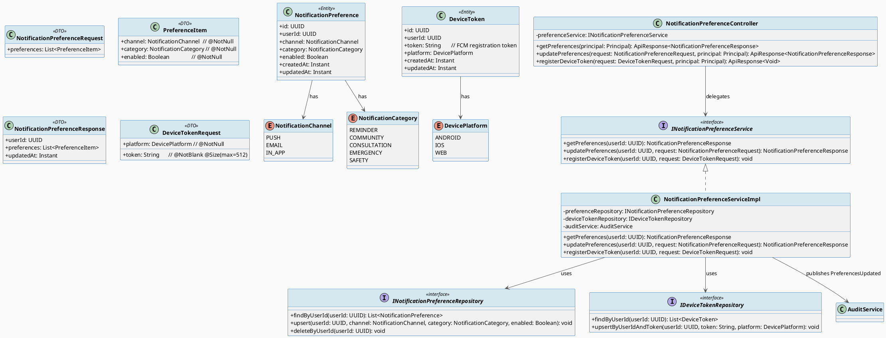
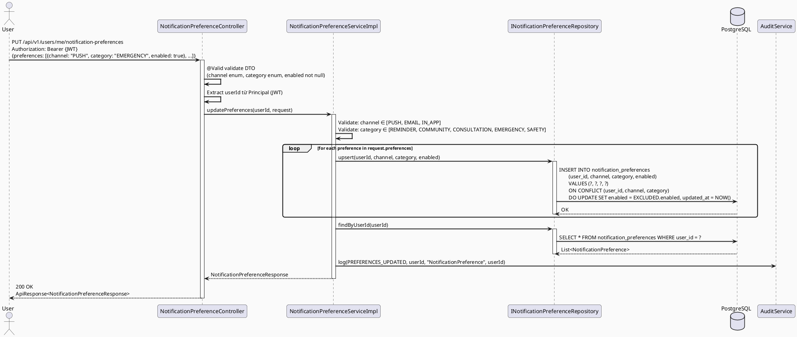
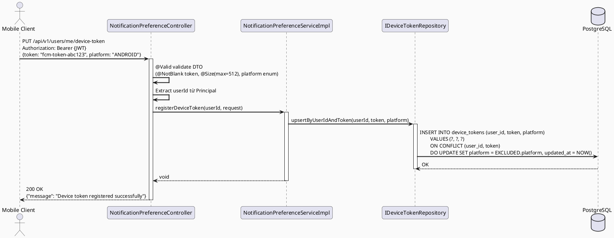
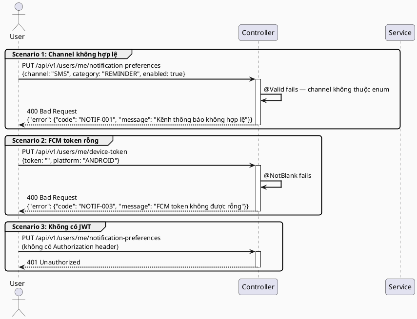
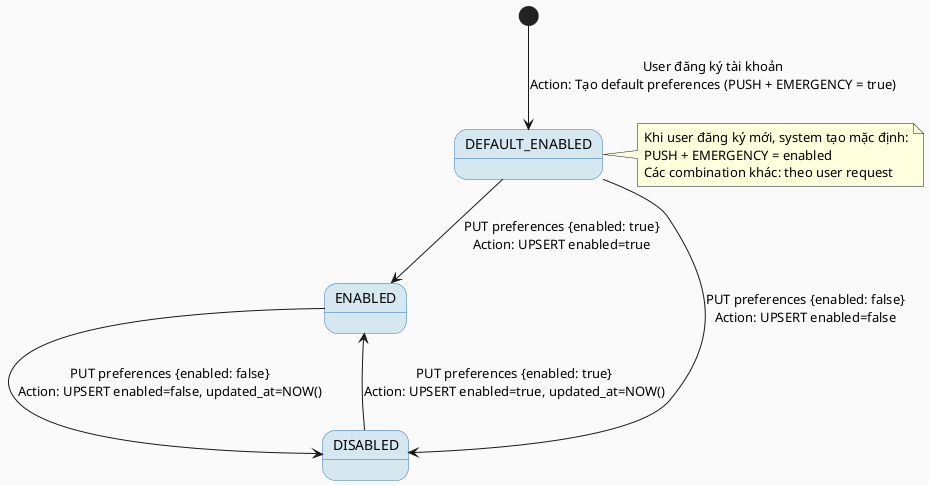

# ENGINEERING DOCUMENTATION STANDARD (EDS) v2.0
# Technical Design Specification — UC-10 Update Notification Preferences

| Field              | Value                                       |
| ------------------ | ------------------------------------------- |
| **Document ID**    | `CB-NOTIF-IMP-010`                          |
| **Version**        | `1.0`                                       |
| **Date**           | `2026-06-26`                                |
| **Status** | `Implemented`                                     |
| **Document Owner** | `PhuongNT`                                  |
| **Author**         | `AI Agent`                                  |
| **Reviewed by**    | `[Tech Lead]`                               |
| **DPO Sign-off**   | `[ ] Pending`                               |
| **Approved by**    | `[Principal Architect]`                     |
| **Last Review**    | `2026-06-26`                                |
| **Based on EDS**   | `v2.0`                                      |

---

## CHANGELOG

| Ngày       | Người thực hiện | Nội dung thay đổi                                                           |
| ---------- | --------------- | --------------------------------------------------------------------------- |
| 2026-06-26 | AI Agent        | Tạo tài liệu lần đầu cho UC-10 Update Notification Preferences             |

---

## MỤC LỤC

1. [Tổng quan Module](#1-tổng-quan-module)
2. [Ma trận Truy vết (Traceability Matrix)](#2-ma-trận-truy-vết-traceability-matrix)
3. [Architecture Decision Records (ADR)](#3-architecture-decision-records-adr)
4. [Non-Functional Requirements & SLA](#4-non-functional-requirements--sla)
5. [Static Modeling (Mô hình Tĩnh)](#5-static-modeling-mô-hình-tĩnh)
6. [Dynamic Modeling (Mô hình Động)](#6-dynamic-modeling-mô-hình-động)
7. [Domain Event Catalog](#7-domain-event-catalog)
8. [Interface Specification (Đặc tả Giao diện)](#8-interface-specification-đặc-tả-giao-diện)
9. [API Specification](#9-api-specification)
10. [Bảng mã lỗi (Error Codes)](#10-bảng-mã-lỗi-error-codes)
11. [Quy trình Triển khai (Step-by-Step)](#11-quy-trình-triển-khai-step-by-step)
12. [Rollback & Incident Runbook](#12-rollback--incident-runbook)
13. [Kịch bản Kiểm thử Chi tiết](#13-kịch-bản-kiểm-thử-chi-tiết)
14. [Phương pháp Xác minh](#14-phương-pháp-xác-minh)
15. [Mẫu thử thực tế (API Verification Samples)](#15-mẫu-thử-thực-tế-api-verification-samples)
16. [Bảng tổng hợp phân quyền (Authorization Matrix)](#16-bảng-tổng-hợp-phân-quyền-authorization-matrix)
17. [AI Prompt Constraints (CASE 2.0)](#17-ai-prompt-constraints-case-20)

---

## 1. Tổng quan Module

> UC-10 cho phép người dùng đã xác thực cấu hình tùy chọn nhận thông báo theo kênh (PUSH/EMAIL/IN_APP) và theo danh mục (REMINDER/COMMUNITY/CONSULTATION/EMERGENCY/SAFETY). Ngoài ra, UC-10 xử lý việc đăng ký/cập nhật FCM device token để gửi push notification qua Firebase Cloud Messaging. Đây là module mới hoàn toàn — cần tạo package `notification`, bảng `notification_preferences`, bảng `device_tokens`, và tích hợp với FCM integration đã có trong project. DPO sign-off bắt buộc vì lưu thông tin thiết bị (device token) và preference của người dùng.

| Field                     | Value                                                                           |
| ------------------------- | ------------------------------------------------------------------------------- |
| **Module Name**           | `Update Notification Preferences`                                               |
| **Bounded Context**       | `notification`                                                                  |
| **UC ID**                 | `UC-10`                                                                         |
| **SRS Reference**         | `3.1.1.10`                                                                      |
| **Platform**              | `Mobile App (Flutter) + Web App (React)`                                        |
| **Data Classification**   | `PII`                                                                           |
| **Compliance Scope**      | `PDPA (Vietnam) — Luật 91/2025 Điều 14; GDPR Art. 5.1, Art. 7, Art. 32`       |
| **Upstream Dependencies** | `security (JWT Auth)`, `identity (User entity)`, `firebase (FCM integration)` |
| **Downstream Consumers**  | `notification-sender (UC-11, UC-12)`, `reminder`, `community`, `emergency`     |

---

## 2. Ma trận Truy vết (Traceability Matrix)

| Requirement ID | Loại          | Mô tả yêu cầu                                                               | Thành phần Code                                                              | Compliance Target             | ADR liên quan |
| -------------- | ------------- | ---------------------------------------------------------------------------- | ---------------------------------------------------------------------------- | ----------------------------- | ------------- |
| UC-10          | User Story    | Người dùng cấu hình kênh và danh mục nhận thông báo                         | `NotificationPreferenceController`                                           | PDPA Điều 14                  | ADR-010-001   |
| BR-NOTIF-OWN   | Business Rule | Người dùng chỉ được thay đổi preferences của chính mình                     | `NotificationPreferenceService` — kiểm tra `userId == authenticatedId`      | PDPA Điều 14                  | ADR-010-001   |
| BR-NOTIF-CHAN  | Business Rule | Channel chỉ nhận: `PUSH`, `EMAIL`, `IN_APP`                                 | `NotificationChannel` enum + DTO validation                                  | —                             | —             |
| BR-NOTIF-CAT  | Business Rule | Category chỉ nhận: `REMINDER`, `COMMUNITY`, `CONSULTATION`, `EMERGENCY`, `SAFETY` | `NotificationCategory` enum + DTO validation                           | —                             | —             |
| BR-NOTIF-FCM  | Business Rule | FCM device token phải không rỗng và max 512 ký tự                           | `@NotBlank @Size(max=512)` trên `DeviceTokenRequest`                         | —                             | ADR-010-002   |
| BR-NOTIF-AUDIT | Business Rule | Mọi thay đổi preference phải được ghi audit log                             | `NotificationPreferenceService` → `AuditService.log(PreferencesUpdated)`    | GDPR Art. 5.1(e)              | ADR-010-001   |
| BR-NOTIF-UPSERT | Business Rule | Cập nhật preference là upsert (tạo nếu chưa có, update nếu đã có)          | `NotificationPreferenceRepository.upsert()`                                  | —                             | —             |

---

## 3. Architecture Decision Records (ADR)

### ADR-010-001 — Tạo package `notification` mới, bảng `notification_preferences`

| Field        | Value                          |
| ------------ | ------------------------------ |
| **Status**   | `Accepted`                     |
| **Deciders** | `PhuongNT — Tech Lead`         |
| **Date**     | `2026-06-26`                   |
| **Supersedes** | `—`                          |

#### Bối cảnh (Context)
Hệ thống chưa có notification domain. UC-10, UC-11, UC-12 cùng thuộc domain notification — cần tạo package và schema mới, không nên đặt vào `security` hay `profile`.

#### Các phương án đã xem xét (Options Considered)

| Phương án | Mô tả                                                 | Ưu điểm                                  | Nhược điểm                                           |
| --------- | ----------------------------------------------------- | ----------------------------------------- | ----------------------------------------------------- |
| A         | Thêm preference vào bảng `users` dưới dạng JSONB      | Ít bảng hơn                               | Không có cấu trúc rõ ràng; khó query theo channel/category |
| B         | Tạo bảng `notification_preferences` riêng             | Cấu trúc rõ ràng; dễ thêm channel/category mới | Thêm join khi query                              |

#### Quyết định (Decision)
Chọn **Phương án B**: mỗi row trong `notification_preferences` đại diện cho một combination (user_id, channel, category) với trạng thái enabled/disabled. Dùng UPSERT để đảm bảo idempotency.

#### Hệ quả (Consequences)

**Tích cực:**
- Dễ query: `WHERE user_id = ? AND channel = 'PUSH' AND category = 'EMERGENCY'`
- Dễ thêm channel/category mới mà không cần thay đổi schema.

**Tiêu cực / Trade-offs:**
- Số rows = users × channels × categories = 10,000 × 3 × 5 = 150,000 rows — vẫn manageable.

**Compliance Impact:**
- GDPR Art. 7: người dùng có thể withdraw consent (disable preference) bất kỳ lúc nào.

---

### ADR-010-002 — Lưu FCM device token trong bảng `device_tokens` riêng

| Field        | Value                          |
| ------------ | ------------------------------ |
| **Status**   | `Accepted`                     |
| **Deciders** | `PhuongNT — Tech Lead`         |
| **Date**     | `2026-06-26`                   |

#### Bối cảnh (Context)
FCM device token gắn với thiết bị (device) cụ thể, không phải với user profile. Một user có thể có nhiều devices (phone + tablet). Token cũng có thể expire và cần refresh.

#### Các phương án đã xem xét (Options Considered)

| Phương án | Mô tả                                      | Ưu điểm                                | Nhược điểm                               |
| --------- | ------------------------------------------ | --------------------------------------- | ---------------------------------------- |
| A         | Lưu token trong `users.fcm_token` column  | Đơn giản                               | Chỉ hỗ trợ 1 device/user; không multi-device |
| B         | Bảng `device_tokens` riêng (1 user → N devices) | Multi-device support; token lifecycle | Thêm bảng mới                          |

#### Quyết định (Decision)
Chọn **Phương án B**: bảng `device_tokens` với các fields: `id`, `user_id`, `token`, `platform` (ANDROID/IOS/WEB), `created_at`, `updated_at`. UPSERT on conflict `(user_id, token)`.

#### Hệ quả (Consequences)

**Tích cực:**
- Hỗ trợ multi-device notification.
- Có thể cleanup expired tokens dễ dàng.

**Tiêu cực / Trade-offs:**
- Cần thêm logic để invalidate token khi user logout.

**Compliance Impact:**
- Device token là dữ liệu PII (gắn với user). Cần retention policy — xóa khi user xóa tài khoản.

---

## 4. Non-Functional Requirements & SLA

### 4.1. Performance & Availability

| Category     | Requirement              | Target SLA | Measurement Method  | Compliance Basis |
| ------------ | ------------------------ | ---------- | ------------------- | ---------------- |
| Latency      | API response (p99)       | `< 300ms`  | k6 load test        | —                |
| Availability | Uptime (monthly)         | `99.9%`    | Uptime monitor      | —                |
| Throughput   | Concurrent write req/s   | `100 req/s`| Load test           | —                |

### 4.2. Data Integrity & Retention

| Category    | Requirement                           | Target    | Verification Method        | Compliance Basis  |
| ----------- | ------------------------------------- | --------- | -------------------------- | ----------------- |
| Durability  | Không mất preference khi update       | RPO = 0   | Transaction log            | GDPR Art. 5.1(f)  |
| Retention   | Audit log PreferencesUpdated          | 7 năm     | DB backup policy           | GDPR Art. 5.1(e)  |
| Consistency | Preferences ↔ Audit sync trong cùng TX| 100%      | `@Transactional` rollback  | GDPR Art. 7.1     |
| Device Token | Xóa khi user bị delete (CASCADE)    | 100%      | CASCADE FK test            | PDPA Điều 14      |

### 4.3. Security

| Category              | Requirement              | Target     | Verification Method    | Compliance Basis |
| --------------------- | ------------------------ | ---------- | ---------------------- | ---------------- |
| Encryption in transit | Tất cả endpoint          | TLS 1.3+   | SSL Labs scan          | GDPR Art. 32     |
| Access control        | Own-resource only        | Reject 403 | Auth Matrix (§16)      | GDPR Art. 25     |
| Token validation      | FCM token max 512 chars  | Validated  | `@Size(max=512)`       | —                |

### 4.4. Scalability & Capacity Planning

> 10,000 users, mỗi user có tối đa 15 preference rows (3 channels × 5 categories) = 150,000 rows. Index trên `(user_id, channel, category)` là UNIQUE. Device tokens: max 3 devices/user = 30,000 rows. Không cần cache ở M3 Alpha.

---

## 5. Static Modeling (Mô hình Tĩnh)

### 5.1. Class Diagram (PlantUML)



### 5.2. Data Structure (Flyway SQL Migration)

```sql
-- ============================================================
-- Migration: V5__add_notification_preferences.sql
-- ============================================================

-- === ENUM TYPES ===
CREATE TYPE notification_channel AS ENUM ('PUSH', 'EMAIL', 'IN_APP');
CREATE TYPE notification_category AS ENUM ('REMINDER', 'COMMUNITY', 'CONSULTATION', 'EMERGENCY', 'SAFETY');
CREATE TYPE device_platform AS ENUM ('ANDROID', 'IOS', 'WEB');

-- === NOTIFICATION PREFERENCES TABLE ===
CREATE TABLE IF NOT EXISTS public.notification_preferences (
    id          UUID                    NOT NULL DEFAULT gen_random_uuid(),
    user_id     UUID                    NOT NULL,                -- FK → users.id
    channel     notification_channel   NOT NULL,                -- PUSH / EMAIL / IN_APP
    category    notification_category  NOT NULL,                -- REMINDER / COMMUNITY / ...
    enabled     BOOLEAN                NOT NULL DEFAULT true,   -- true = nhận; false = tắt
    created_at  TIMESTAMPTZ            NOT NULL DEFAULT NOW(),
    updated_at  TIMESTAMPTZ            NOT NULL DEFAULT NOW(),

    CONSTRAINT notification_preferences_pkey PRIMARY KEY (id),
    CONSTRAINT notification_preferences_unique UNIQUE (user_id, channel, category),
    CONSTRAINT notification_preferences_user_fkey
        FOREIGN KEY (user_id) REFERENCES public.users(id) ON DELETE CASCADE
);

CREATE INDEX IF NOT EXISTS idx_notif_pref_user_id
    ON public.notification_preferences (user_id);

CREATE INDEX IF NOT EXISTS idx_notif_pref_user_channel_cat
    ON public.notification_preferences (user_id, channel, category);

-- === DEVICE TOKENS TABLE ===
CREATE TABLE IF NOT EXISTS public.device_tokens (
    id          UUID                NOT NULL DEFAULT gen_random_uuid(),
    user_id     UUID                NOT NULL,                -- FK → users.id
    token       VARCHAR(512)        NOT NULL,                -- FCM registration token
    platform    device_platform     NOT NULL,                -- ANDROID / IOS / WEB
    created_at  TIMESTAMPTZ         NOT NULL DEFAULT NOW(),
    updated_at  TIMESTAMPTZ         NOT NULL DEFAULT NOW(),

    CONSTRAINT device_tokens_pkey PRIMARY KEY (id),
    CONSTRAINT device_tokens_unique UNIQUE (user_id, token),  -- một token không duplicate
    CONSTRAINT device_tokens_user_fkey
        FOREIGN KEY (user_id) REFERENCES public.users(id) ON DELETE CASCADE
);

CREATE INDEX IF NOT EXISTS idx_device_tokens_user_id
    ON public.device_tokens (user_id);
```

> **Quy tắc đặt tên:** Tất cả column dùng **snake_case**. Không dùng camelCase trong SQL DDL.

---

## 6. Dynamic Modeling (Mô hình Động)

### 6.1. Sequence Diagram — Happy Path: Update Preferences (PlantUML)



### 6.2. Sequence Diagram — Happy Path: Register Device Token (PlantUML)



### 6.3. Sequence Diagram — Error Path (PlantUML)



### 6.3. State Machine — Notification Preference



> **Invariant bất biến:**
> - Combination `(user_id, channel, category)` là UNIQUE trong bảng.
> - Không bao giờ duplicate row cho cùng combination.
> - Audit log `PREFERENCES_UPDATED` không bao giờ bị DELETE.

---

## 7. Domain Event Catalog

### 7.1. Events Published (Phát ra)

| Event Name             | Trigger                               | Publisher                            | Subscriber(s)         | Payload Schema                    | Async? |
| ---------------------- | ------------------------------------- | ------------------------------------ | --------------------- | --------------------------------- | ------ |
| `PreferencesUpdated`   | Cập nhật preferences thành công       | `NotificationPreferenceServiceImpl`  | `AuditService`        | `PreferencesUpdatedEvent.java`    | No     |
| `DeviceTokenRegistered`| Đăng ký/cập nhật FCM token thành công | `NotificationPreferenceServiceImpl`  | _(Internal only)_     | _(inline audit log)_              | No     |

### 7.2. Events Consumed (Tiêu thụ)

| Event Name | Source | Handler | Action thực hiện |
| ---------- | ------ | ------- | ---------------- |
| `UserDeleted` | `identity` module | `NotificationPreferenceCleanupHandler` | Xóa toàn bộ preferences và device tokens của user (CASCADE DB handle) |

### 7.3. Payload Schema

```java
// PreferencesUpdatedEvent.java
// @version 1.0
public record PreferencesUpdatedEvent(
    String  eventId,
    String  eventType,     // "PreferencesUpdated"
    Instant occurredAt,
    String  version,       // "1.0"
    Payload payload,
    Metadata metadata
) {
    public record Payload(
        UUID            userId,
        List<String>    updatedChannels,   // ["PUSH", "EMAIL"] — không chứa enabled value
        List<String>    updatedCategories, // ["EMERGENCY", "SAFETY"]
        Instant         updatedAt
    ) {}

    public record Metadata(
        String correlationId,
        UUID   causedBy           // userId — phải bằng payload.userId
    ) {}
}
```

---

## 8. Interface Specification (Đặc tả Giao diện)

### 8.1. Service Interface

```java
// INotificationPreferenceService.java
// @version 1.0
// Package: com.carebridge.backend.notification.service

public interface INotificationPreferenceService {

    /**
     * Lấy tất cả notification preferences của user.
     * @param userId  ID người dùng từ JWT
     * @return NotificationPreferenceResponse
     */
    NotificationPreferenceResponse getPreferences(UUID userId);

    /**
     * Cập nhật (upsert) danh sách notification preferences.
     * @param userId   ID người dùng từ JWT
     * @param request  Danh sách preferences cần cập nhật
     * @return NotificationPreferenceResponse
     * @throws ValidationException [NOTIF-001] Channel không hợp lệ
     * @throws ValidationException [NOTIF-002] Category không hợp lệ
     */
    NotificationPreferenceResponse updatePreferences(UUID userId, NotificationPreferenceRequest request);

    /**
     * Đăng ký hoặc cập nhật FCM device token.
     * @param userId  ID người dùng từ JWT
     * @param request FCM token và platform
     * @throws ValidationException [NOTIF-003] Token rỗng hoặc quá dài
     */
    void registerDeviceToken(UUID userId, DeviceTokenRequest request);
}
```

### 8.2. Repository Interface

```java
// INotificationPreferenceRepository.java
// @version 1.0
// Package: com.carebridge.backend.notification.repository
public interface INotificationPreferenceRepository extends JpaRepository<NotificationPreference, UUID> {

    List<NotificationPreference> findByUserId(UUID userId);

    // UPSERT: dùng @Modifying + @Query với ON CONFLICT
    @Modifying
    @Query(value = """
        INSERT INTO notification_preferences (user_id, channel, category, enabled)
        VALUES (:userId, :channel, :category, :enabled)
        ON CONFLICT (user_id, channel, category)
        DO UPDATE SET enabled = EXCLUDED.enabled, updated_at = NOW()
        """, nativeQuery = true)
    void upsert(
        @Param("userId") UUID userId,
        @Param("channel") String channel,
        @Param("category") String category,
        @Param("enabled") Boolean enabled
    );
}

// IDeviceTokenRepository.java
// @version 1.0
public interface IDeviceTokenRepository extends JpaRepository<DeviceToken, UUID> {

    List<DeviceToken> findByUserId(UUID userId);

    @Modifying
    @Query(value = """
        INSERT INTO device_tokens (user_id, token, platform)
        VALUES (:userId, :token, :platform)
        ON CONFLICT (user_id, token)
        DO UPDATE SET platform = EXCLUDED.platform, updated_at = NOW()
        """, nativeQuery = true)
    void upsertByUserIdAndToken(
        @Param("userId") UUID userId,
        @Param("token") String token,
        @Param("platform") String platform
    );
}
```

---

## 9. API Specification

### 9.1. Endpoints Table

| Method  | Path                                      | Auth Level  | Required Roles                              | Rate Limit | Idempotent? |
| ------- | ----------------------------------------- | ----------- | ------------------------------------------- | ---------- | ----------- |
| `GET`   | `/api/v1/users/me/notification-preferences`| JWT Bearer  | `ROLE_MOTHER`, `ROLE_EXPERT`, `ROLE_ADMIN` | 300/min    | Yes         |
| `PUT`   | `/api/v1/users/me/notification-preferences`| JWT Bearer  | `ROLE_MOTHER`, `ROLE_EXPERT`, `ROLE_ADMIN` | 60/min     | Yes         |
| `PUT`   | `/api/v1/users/me/device-token`            | JWT Bearer  | `ROLE_MOTHER`, `ROLE_EXPERT`, `ROLE_ADMIN` | 30/min     | Yes         |

### 9.2. Request / Response Schemas

#### `GET /api/v1/users/me/notification-preferences` — Lấy preferences

**Response — 200 OK:**
```json
{
  "data": {
    "userId": "550e8400-e29b-41d4-a716-446655440000",
    "preferences": [
      { "channel": "PUSH", "category": "EMERGENCY", "enabled": true },
      { "channel": "PUSH", "category": "REMINDER", "enabled": true },
      { "channel": "EMAIL", "category": "COMMUNITY", "enabled": false },
      { "channel": "IN_APP", "category": "CONSULTATION", "enabled": true }
    ],
    "updatedAt": "2026-06-26T10:00:00.000Z"
  }
}
```

#### `PUT /api/v1/users/me/notification-preferences` — Cập nhật preferences

**Request Body:**
```json
{
  "preferences": [
    { "channel": "PUSH", "category": "EMERGENCY", "enabled": true },
    { "channel": "EMAIL", "category": "REMINDER", "enabled": false },
    { "channel": "IN_APP", "category": "SAFETY", "enabled": true }
  ]
}
```

**Response — 200 OK:**
```json
{
  "data": {
    "userId": "550e8400-e29b-41d4-a716-446655440000",
    "preferences": [
      { "channel": "PUSH", "category": "EMERGENCY", "enabled": true },
      { "channel": "EMAIL", "category": "REMINDER", "enabled": false },
      { "channel": "IN_APP", "category": "SAFETY", "enabled": true }
    ],
    "updatedAt": "2026-06-26T10:05:00.000Z"
  },
  "message": "Notification preferences updated successfully"
}
```

**Response — 400 Bad Request (Channel không hợp lệ):**
```json
{
  "error": {
    "code": "NOTIF-001",
    "message": "Kênh thông báo không hợp lệ",
    "details": [{ "field": "preferences[0].channel", "message": "Must be one of: PUSH, EMAIL, IN_APP" }]
  }
}
```

#### `PUT /api/v1/users/me/device-token` — Đăng ký FCM token

**Request Body:**
```json
{
  "token": "fcm-registration-token-xyz123",
  "platform": "ANDROID"
}
```

**Response — 200 OK:**
```json
{
  "message": "Device token registered successfully"
}
```

**Response — 400 Bad Request (Token không hợp lệ):**
```json
{
  "error": {
    "code": "NOTIF-003",
    "message": "FCM token không hợp lệ",
    "details": [{ "field": "token", "message": "Token must not be blank and max 512 characters" }]
  }
}
```

---

## 10. Bảng mã lỗi (Error Codes)

| Code        | HTTP Status | Message (EN)                | Message (VI)                         | Trigger Condition                                    |
| ----------- | ----------- | --------------------------- | ------------------------------------ | ---------------------------------------------------- |
| `NOTIF-001` | 400         | Invalid notification channel | Kênh thông báo không hợp lệ         | channel không thuộc enum [PUSH, EMAIL, IN_APP]       |
| `NOTIF-002` | 400         | Invalid notification category| Danh mục thông báo không hợp lệ     | category không thuộc enum [REMINDER, COMMUNITY, ...] |
| `NOTIF-003` | 400         | Invalid FCM token            | FCM token không hợp lệ              | token rỗng hoặc > 512 ký tự                          |
| `NOTIF-004` | 403         | Forbidden                   | Không có quyền thực hiện thao tác   | userId trong JWT != userId trong resource            |
| `NOTIF-005` | 500         | Internal error              | Lỗi hệ thống                        | Lỗi DB hoặc audit service không phản hồi             |

---

## 11. Quy trình Triển khai (Step-by-Step)

### 11.1. Prerequisites

- [ ] ADR-010-001 và ADR-010-002 đã được Accepted
- [ ] DPO đã sign-off (lưu device token là PII)
- [ ] Blueprint đã được Principal Architect approve
- [ ] Staging environment sẵn sàng

### 11.2. Pre-Migration Checklist

- [ ] Đã backup DB: `pg_dump -h [host] -U [user] carebridge > backup_20260626.sql`
- [ ] Migration `V5__add_notification_preferences.sql` đã test trên staging ≥ 24 giờ
- [ ] Rollback script đã được test
- [ ] DPO sign-off vì tạo bảng lưu PII (device token, preferences)

### 11.3. Implementation Steps

#### Chặng 1 — Flyway Migration

```bash
# File: src/main/resources/db/migration/V5__add_notification_preferences.sql
# (Xem DDL đầy đủ tại §5.2)
./mvnw flyway:migrate
```

#### Chặng 2 — Enums và Entities

```java
// 1. com/carebridge/backend/notification/entity/NotificationChannel.java (enum)
// 2. com/carebridge/backend/notification/entity/NotificationCategory.java (enum)
// 3. com/carebridge/backend/notification/entity/DevicePlatform.java (enum)
// 4. com/carebridge/backend/notification/entity/NotificationPreference.java (@Entity)
// 5. com/carebridge/backend/notification/entity/DeviceToken.java (@Entity)
```

#### Chặng 3 — Repository, Service, Controller

```java
// 6. com/carebridge/backend/notification/repository/INotificationPreferenceRepository.java
// 7. com/carebridge/backend/notification/repository/IDeviceTokenRepository.java
// 8. com/carebridge/backend/notification/service/INotificationPreferenceService.java
// 9. com/carebridge/backend/notification/service/impl/NotificationPreferenceServiceImpl.java
// 10. com/carebridge/backend/notification/controller/NotificationPreferenceController.java
// 11. com/carebridge/backend/notification/dto/request/NotificationPreferenceRequest.java
// 12. com/carebridge/backend/notification/dto/request/DeviceTokenRequest.java
// 13. com/carebridge/backend/notification/dto/response/NotificationPreferenceResponse.java
```

#### Chặng 4 — Thêm AuditAction

```java
// Trong: AuditAction.java
// Thêm: PREFERENCES_UPDATED
```

#### Chặng 5 — Verification

```bash
curl -X PUT https://[host]/api/v1/users/me/notification-preferences \
  -H "Authorization: Bearer $TOKEN" \
  -H "Content-Type: application/json" \
  -d '{"preferences":[{"channel":"PUSH","category":"EMERGENCY","enabled":true}]}'
# Expected: 200 OK
```

### 11.4. Deployment Checklist

- [ ] Bảng `notification_preferences` tồn tại trong DB
- [ ] Bảng `device_tokens` tồn tại trong DB
- [ ] PUT `/api/v1/users/me/notification-preferences` với channel hợp lệ → 200
- [ ] PUT với channel "SMS" → 400 + `NOTIF-001`
- [ ] PUT `/api/v1/users/me/device-token` → 200
- [ ] Audit log `PREFERENCES_UPDATED` được tạo sau update thành công

---

## 12. Rollback & Incident Runbook

### 12.1. Điều kiện kích hoạt Rollback

| Điều kiện                          | Ngưỡng                  | Người quyết định  |
| ---------------------------------- | ----------------------- | ----------------- |
| Error rate tăng đột biến           | > 5% trong 5 phút       | On-call Engineer  |
| Latency p99 vượt ngưỡng            | > 2x baseline           | On-call Engineer  |
| Device token leak phát hiện        | Bất kỳ case nào         | Tech Lead + DPO   |
| Audit log ngừng hoạt động          | > 1 phút                | On-call Engineer  |

### 12.2. Rollback Procedure

```bash
# Bước 1: Revert migration
psql -h $DB_HOST -U $DB_USER -d $DB_NAME \
  -c "DROP TABLE IF EXISTS public.device_tokens CASCADE;"
psql -h $DB_HOST -U $DB_USER -d $DB_NAME \
  -c "DROP TABLE IF EXISTS public.notification_preferences CASCADE;"
psql -h $DB_HOST -U $DB_USER -d $DB_NAME \
  -c "DROP TYPE IF EXISTS notification_channel CASCADE;"
psql -h $DB_HOST -U $DB_USER -d $DB_NAME \
  -c "DROP TYPE IF EXISTS notification_category CASCADE;"
psql -h $DB_HOST -U $DB_USER -d $DB_NAME \
  -c "DROP TYPE IF EXISTS device_platform CASCADE;"
psql -h $DB_HOST -U $DB_USER -d $DB_NAME \
  -c "DELETE FROM flyway_schema_history WHERE version = '5';"

# Bước 2: Re-deploy phiên bản cũ
kubectl rollout undo deployment/carebridge-api
```

### 12.3. Notification Protocol

| Thời điểm          | Người nhận     | Kênh              | Template                                              |
| ------------------ | -------------- | ----------------- | ----------------------------------------------------- |
| Ngay khi phát hiện | On-call team  | Slack `#incident` | "[NOTIF] UC-10 incident detected: [mô tả]"            |
| Trong 30 phút      | DPO            | Email             | Bắt buộc nếu device token / PII bị ảnh hưởng         |
| Trong 72 giờ       | DPA            | Email             | Bắt buộc nếu có data breach                           |

### 12.4. Post-Incident Review (PIR)

> Bắt buộc hoàn thành PIR document trong vòng **48 giờ** sau khi incident được resolve.

---

## 13. Kịch bản Kiểm thử Chi tiết

### 13.1. Unit Tests

#### TC-UNIT-001 — Cập nhật preferences thành công

```gherkin
Feature: Update Notification Preferences
  Background:
    Given test data classification: SYNTHETIC
    And user "user-test-010" đã xác thực với JWT hợp lệ

  Scenario: Cập nhật 3 preferences với channel và category hợp lệ
    Given request: [{channel: "PUSH", category: "EMERGENCY", enabled: true}, {channel: "EMAIL", category: "REMINDER", enabled: false}, {channel: "IN_APP", category: "SAFETY", enabled: true}]
    When NotificationPreferenceServiceImpl.updatePreferences("user-test-010", request) được gọi
    Then preferenceRepository.upsert() được gọi đúng 3 lần
    And response.preferences có đúng 3 items
    And AuditService.log(PREFERENCES_UPDATED, ...) được gọi đúng 1 lần
```

#### TC-UNIT-002 — Channel không hợp lệ → NOTIF-001

```gherkin
  Scenario: channel = "SMS" không thuộc enum
    Given request có preferences[0].channel = "SMS"
    When PUT /api/v1/users/me/notification-preferences được gọi
    Then response 400
    And response.error.code = "NOTIF-001"
    And không có UPSERT nào được thực hiện
```

#### TC-UNIT-003 — FCM token rỗng → NOTIF-003

```gherkin
  Scenario: token = "" (rỗng)
    Given DeviceTokenRequest có token = ""
    When PUT /api/v1/users/me/device-token được gọi
    Then response 400
    And response.error.code = "NOTIF-003"
```

### 13.2. Integration Tests

#### TC-INT-001 — UPSERT hoạt động đúng

```gherkin
  Scenario: Gọi updatePreferences 2 lần với cùng combination
    Given user "user-int-010" trong DB
    When updatePreferences lần 1: {channel: "PUSH", category: "EMERGENCY", enabled: true}
    And updatePreferences lần 2: {channel: "PUSH", category: "EMERGENCY", enabled: false}
    Then notification_preferences chỉ có 1 row với (user_id, "PUSH", "EMERGENCY")
    And row.enabled = false (giá trị lần 2)
    And không có duplicate rows
```

### 13.3. E2E / Security Tests

#### TC-E2E-001 — Luồng hoàn chỉnh

```gherkin
  Scenario: GET sau khi PUT phải trả về data đúng
    Given user "mother-010" đã đăng nhập
    When PUT /api/v1/users/me/notification-preferences với preferences [PUSH+EMERGENCY=true]
    And GET /api/v1/users/me/notification-preferences
    Then GET response.data.preferences chứa {channel: "PUSH", category: "EMERGENCY", enabled: true}

  Scenario: Không có JWT → 401
    When PUT /api/v1/users/me/notification-preferences không có Authorization
    Then response 401
```

---

## 14. Phương pháp Xác minh

### 14.1. Database Inspection

```sql
-- Verify preferences được lưu đúng
SELECT user_id, channel, category, enabled, updated_at
FROM notification_preferences
WHERE user_id = '{userId}'
ORDER BY channel, category;

-- Verify không có duplicate
SELECT user_id, channel, category, COUNT(*)
FROM notification_preferences
WHERE user_id = '{userId}'
GROUP BY user_id, channel, category
HAVING COUNT(*) > 1;
-- Expected: 0 rows

-- Verify device token được lưu
SELECT user_id, LEFT(token, 20) AS token_prefix, platform, updated_at
FROM device_tokens
WHERE user_id = '{userId}';
```

### 14.2. Log / Audit Verification

```bash
kubectl logs -l app=carebridge-api | grep "PREFERENCES_UPDATED" | tail -5
kubectl logs -l app=carebridge-api | grep -i "device.token\|fcm" | grep -v "audit"
# Expected: No plaintext token in logs
```

### 14.3. Tool-based Verification

```bash
# Verify TLS
openssl s_client -connect [host]:443 -tls1_3 2>&1 | grep "Protocol"
# Expected: TLSv1.3
```

---

## 15. Mẫu thử thực tế (API Verification Samples)

### 15.1. Happy Path

```bash
TOKEN=$(curl -s -X POST https://[host]/api/v1/auth/login \
  -H "Content-Type: application/json" \
  -d '{"email":"test@carebridge.vn","password":"TestPass123!"}' | jq -r '.data.accessToken')

# Update preferences
curl -X PUT https://[host]/api/v1/users/me/notification-preferences \
  -H "Authorization: Bearer $TOKEN" \
  -H "Content-Type: application/json" \
  -d '{"preferences":[{"channel":"PUSH","category":"EMERGENCY","enabled":true},{"channel":"EMAIL","category":"REMINDER","enabled":false}]}'

# Register device token
curl -X PUT https://[host]/api/v1/users/me/device-token \
  -H "Authorization: Bearer $TOKEN" \
  -H "Content-Type: application/json" \
  -d '{"token":"fcm-sample-token-123","platform":"ANDROID"}'
```

### 15.2. Error Paths

```bash
# Channel không hợp lệ → 400
curl -X PUT https://[host]/api/v1/users/me/notification-preferences \
  -H "Authorization: Bearer $TOKEN" \
  -H "Content-Type: application/json" \
  -d '{"preferences":[{"channel":"SMS","category":"REMINDER","enabled":true}]}'
# Expected: 400 + NOTIF-001
```

---

## 16. Bảng tổng hợp phân quyền (Authorization Matrix)

| Endpoint | `GUEST` | `ROLE_MOTHER` | `ROLE_EXPERT` | `ROLE_ADMIN` | `ROLE_SYSTEM` |
| -------- | ------- | ------------- | ------------- | ------------ | ------------- |
| `GET /api/v1/users/me/notification-preferences` | ❌ | ✅ Own | ✅ Own | ✅ Own | ✅ Any |
| `PUT /api/v1/users/me/notification-preferences` | ❌ | ✅ Own | ✅ Own | ✅ Own | ✅ Any |
| `PUT /api/v1/users/me/device-token`             | ❌ | ✅ Own | ✅ Own | ✅ Own | ✅ Any |

**Chú thích:** `Own` = userId từ JWT. Không nhận userId từ request body.

---

## 17. AI Prompt Constraints (CASE 2.0)

### 17.1 Constraint Summary Table

| # | Constraint | Source (ADR/BR) | Last Verified |
| - | ---------- | --------------- | ------------- |
| C1 | `userId` phải lấy từ JWT Principal — KHÔNG nhận từ request body | `BR-NOTIF-OWN` | `2026-06-26` |
| C2 | UPSERT preference: `ON CONFLICT (user_id, channel, category) DO UPDATE` — không INSERT duplicate | `ADR-010-001` | `2026-06-26` |
| C3 | `channel` chỉ chấp nhận: `PUSH`, `EMAIL`, `IN_APP` — validate bằng enum, ném `NOTIF-001` nếu sai | `BR-NOTIF-CHAN` | `2026-06-26` |
| C4 | `category` chỉ chấp nhận: `REMINDER`, `COMMUNITY`, `CONSULTATION`, `EMERGENCY`, `SAFETY` — ném `NOTIF-002` nếu sai | `BR-NOTIF-CAT` | `2026-06-26` |
| C5 | FCM `token` phải `@NotBlank @Size(max=512)` — ném `NOTIF-003` nếu sai | `BR-NOTIF-FCM` | `2026-06-26` |
| C6 | `AuditService.log(PREFERENCES_UPDATED, ...)` phải gọi trong cùng `@Transactional` | `BR-NOTIF-AUDIT` | `2026-06-26` |
| C7 | Không dùng Redis — chỉ dùng PostgreSQL + Spring | `CLAUDE.md §Architecture` | `2026-06-26` |

### 17.2 Constraint Injection Block

```
[CONSTRAINT BLOCK — Module: notification — UC-10 Update Notification Preferences]
Theo TDS CB-NOTIF-IMP-010:

1. (C1) userId PHẢI lấy từ JWT Principal. KHÔNG nhận userId từ request body.
2. (C2) Cập nhật preference dùng UPSERT: ON CONFLICT (user_id, channel, category) DO UPDATE. Không duplicate rows.
3. (C3) channel PHẢI thuộc enum [PUSH, EMAIL, IN_APP]. Nếu sai → ValidationException NOTIF-001.
4. (C4) category PHẢI thuộc enum [REMINDER, COMMUNITY, CONSULTATION, EMERGENCY, SAFETY]. Nếu sai → NOTIF-002.
5. (C5) FCM token: @NotBlank, @Size(max=512). Nếu sai → NOTIF-003.
6. (C6) AuditService.log(PREFERENCES_UPDATED) gọi trong cùng @Transactional.
7. (C7) KHÔNG dùng Redis hay bất kỳ in-memory cache nào. Chỉ PostgreSQL + Spring.

[CONTEXT BLOCK]
- Bounded Context: notification
- Data Classification: PII
- Existing interfaces: §8 Service Interface + §8.2 Repository Interface
- Error codes: §10 (prefix NOTIF-)
- Auth matrix: §16

[TASK BLOCK]
Implement UC-10 Update Notification Preferences thỏa mãn constraints C1–C7.
```

### 17.3 Constraint Quality Checklist

- [x] Mỗi constraint traceable về ADR hoặc BR cụ thể
- [x] Không có constraint generic
- [x] Constraint block có ≥ 3 constraints cụ thể (có 7)
- [x] Constraint block reference §8 và §16

### 17.4 Anti-Pattern Detection

| AP-ID     | Anti-Pattern           | Dấu hiệu                                              | Hành động                     |
| --------- | ---------------------- | ----------------------------------------------------- | ------------------------------ |
| AP-AI-001 | Unconstrained Gen      | Code không match constraint C1-C7                     | Reject — inject lại constraints |
| AP-AI-003 | Implicit Decision      | Code dùng Redis để cache preferences                  | Reject — tuân thủ C7           |
| AP-AI-005 | Hallucinated Contract  | Code import FCM SDK trực tiếp thay vì qua integration | Reject — dùng integration layer hiện có |

---

## PHỤ LỤC

### A. Glossary

| Thuật ngữ | Định nghĩa |
| --------- | ---------- |
| FCM | Firebase Cloud Messaging — dịch vụ push notification của Google |
| Device Token | Token định danh thiết bị để FCM gửi push notification |
| UPSERT | INSERT ... ON CONFLICT DO UPDATE — tạo mới nếu chưa có, cập nhật nếu đã có |
| PII | Personally Identifiable Information — device token gắn với user là PII |

### B. Tài liệu tham chiếu

| Document | Link / Path |
| -------- | ----------- |
| GDPR Art. 7 | https://gdpr-info.eu/art-7-gdpr/ |
| PDPA Vietnam Luật 91/2025 | — |
| Firebase integration | `05_Development/CareBridgeAPI/src/main/java/com/carebridge/backend/integration/` |
| V1 Init Schema | `05_Development/CareBridgeAPI/src/main/resources/db/migration/V1__init_schema.sql` |
