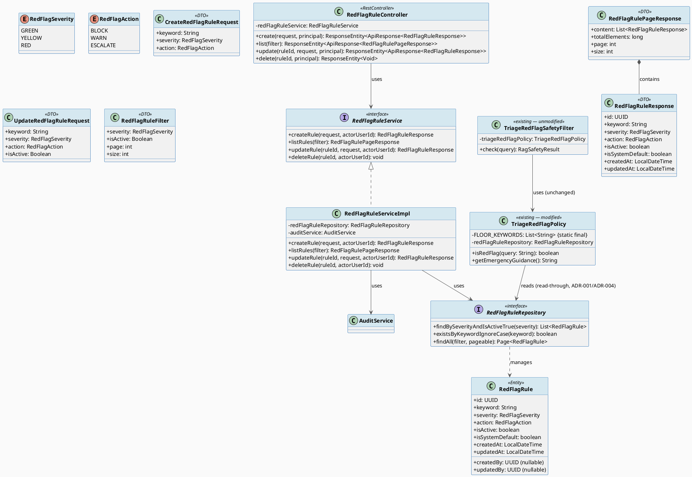
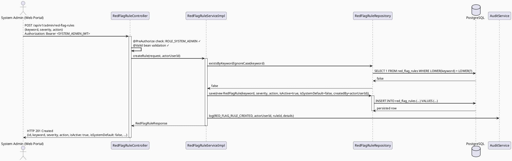
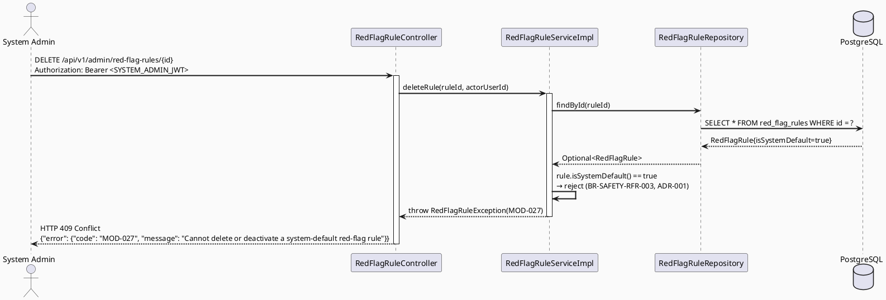
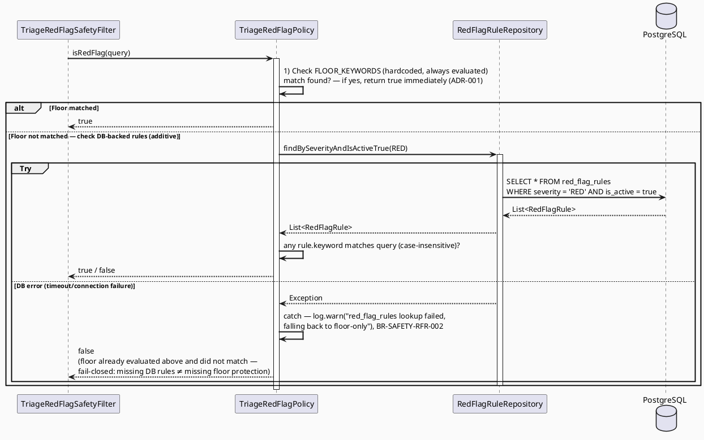
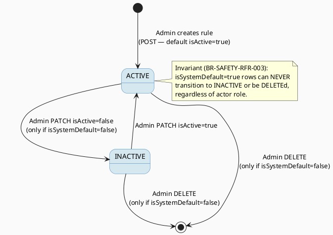

# ENGINEERING DOCUMENTATION STANDARD (EDS) v2.0
# Technical Design Specification — UC-110: Manage AI and Red-Flag Rules

| Field              | Value                                   |
| ------------------ | --------------------------------------- |
| **Document ID**    | `CB-MOD-IMP-005`                        |
| **Version**        | `1.0`                                   |
| **Date**           | `2026-07-01`                            |
| **Status**         | `Implemented`                           |
| **Document Owner** | `HuyND`                                 |
| **Author**         | `AI Agent — Winston (System Architect)` |
| **Reviewed by**    | `[ ] Pending`                           |
| **DPO Sign-off**   | `[ ] Pending` *(not PII — see §1)*      |
| **Approved by**    | `[ ] Pending`                           |
| **Last Review**    | `2026-07-01`                            |
| **Based on EDS**   | `v2.0`                                  |

---

## CHANGELOG

| Ngày       | Người thực hiện              | Nội dung thay đổi                                                                 |
| ---------- | ----------------------------- | ---------------------------------------------------------------------------------- |
| 2026-07-01 | AI Agent — Winston            | Tạo tài liệu lần đầu — TDS cho UC-110 Manage AI and Red-Flag Rules (Draft, greenfield) |
| 2026-07-02 | AI Agent — Claude (Audit Pass) | Audit fix: (1) proposed migration filename `V20260701000001` collided with an actual existing migration `V20260701000001__create_topic_follows.sql` — renamed to `V20260702002000__create_red_flag_rules.sql` and corrected the stale "latest migration" derivation (§5.2, §11.2, §11.3, §12.2); (2) `IAM-001` 401 response body was unverified/incorrect — corrected per verified `HttpStatusEntryPoint(UNAUTHORIZED)` behavior (empty body, no JSON envelope), matching the same correction already documented in sibling UC-100 TDS (§9.2, §10); (3) fixed typo `MOD-024/021/022/023` → `MOD-024/025/026/027` in §11.3 Chặng 2 step 6. No Status change (remains Draft). |
| 2026-07-02 | AI Agent — Amelia (Dev Agent) | Phase 3: Implementation — 18/18 tests PASS. Deviations from TDS verified/applied during implementation: (1) `RedFlagRuleRepository` methods renamed `findBySeverityAndActiveTrue`/`findBySeverityAndActive` (dropped "Is") — Spring Data property-path resolution rejects "isActive" as a literal segment for a boolean property exposed via an `isActive()` getter (confirmed via `PropertyReferenceException` at ApplicationContext startup); (2) dropped the `RedFlagRuleMapper` component from §5.1/§11.3 step 10 — the class diagram's own field list for `RedFlagRuleServiceImpl` does not include a mapper dependency, so mapping is inlined as a private method, avoiding an unused Spring bean; (3) `MOD-024` is never thrown in code — bean validation (`@NotBlank`) produces the framework's generic `VALIDATION_ERROR` envelope before the service is reached, same class of finding as this doc's own `IAM-001` correction above; (4) RFR-TC-INT-001 hosted as `@SpringBootTest`+H2 (real beans end-to-end), not Testcontainers — none exist anywhere in this codebase (verified project-wide). Status: Approved → Implemented. |
| 2026-07-03 | AI Agent — Claude | Real-DB migration verification: the 18 GREEN tests only exercise H2 (Flyway disabled, schema derived from JPA entities in test profile), so the migration SQL itself was never executed anywhere. Booted the app against the real Supabase Postgres instance (`.env`) to verify. First attempt **failed**: `V20260702002000__create_red_flag_rules.sql`'s FK constraints referenced `users(id)`, but the real `users` table's primary key column is `user_id` (confirmed in `V1__init_schema.sql` — `ADD CONSTRAINT users_pkey PRIMARY KEY (user_id)` — and matched by sibling migrations `V20260629000001/2`, `V20260701000001` which correctly use `users(user_id)`). This passed silently in all H2 tests because Hibernate's entity-derived test schema doesn't read the migration's raw SQL text. Fixed both FK constraints in §5.2 and in the migration file to `REFERENCES users(user_id)`. Re-ran against the real DB: migration applied cleanly (Flyway schema version advanced to `20260702002000`), and `SELECT count(*) FROM red_flag_rules` confirmed all 19 seed rows landed with `is_system_default = true`. Migration is now verified end-to-end, not just reviewed statically. |

---

## MỤC LỤC

1. [Tổng quan Module](#1-tổng-quan-module)
2. [Ma trận Truy vết](#2-ma-trận-truy-vết)
3. [Architecture Decision Records (ADR)](#3-architecture-decision-records-adr)
4. [Non-Functional Requirements & SLA](#4-non-functional-requirements--sla)
5. [Static Modeling](#5-static-modeling)
6. [Dynamic Modeling](#6-dynamic-modeling)
7. [Domain Event Catalog](#7-domain-event-catalog)
8. [Interface Specification](#8-interface-specification)
9. [API Specification](#9-api-specification)
10. [Bảng mã lỗi](#10-bảng-mã-lỗi)
11. [Quy trình Triển khai](#11-quy-trình-triển-khai)
12. [Rollback & Incident Runbook](#12-rollback--incident-runbook)
13. [Chiến lược Kiểm thử](#13-chiến-lược-kiểm-thử)
14. [Phương pháp Xác minh](#14-phương-pháp-xác-minh)
15. [API Verification Samples](#15-api-verification-samples)
16. [Authorization Matrix](#16-authorization-matrix)
17. [AI Prompt Constraints (CASE 2.0)](#17-ai-prompt-constraints-case-20)

---

## 1. Tổng quan Module

| Field                     | Value                                                                                                         |
| ------------------------- | -------------------------------------------------------------------------------------------------------------- |
| **UC ID**                 | `UC-110`                                                                                                       |
| **Function ID (FS)**      | `3.2.2.12 Manage AI and Red-Flag Rules`                                                                        |
| **Module Name**           | `Manage AI and Red-Flag Rules`                                                                                 |
| **Bounded Context**       | `triage` (admin sub-feature — see ADR-002 for placement rationale) — error-code prefix follows `content`/moderation cluster numbering per FS section grouping (§2 below) |
| **Primary Actor**         | `System Admin (ROLE_SYSTEM_ADMIN)`                                                                              |
| **Platform**              | `Admin Web Portal`                                                                                              |
| **Priority**              | `High` (FS §3.2.2.12)                                                                                          |
| **Data Classification**   | `Internal` (no PII — rule rows reference `created_by`/`updated_by` actor UUIDs only, no health/contact data)    |
| **Compliance Scope**      | `N/A` for DPO sign-off; `BR-SAFETY` (CLAUDE.md — "AI provides guidance only; never diagnose, prescribe, or delay emergency routing") governs design constraints, see ADR-001 |
| **Upstream Dependencies** | `security (JWT auth, ROLE_SYSTEM_ADMIN)`, `audit (AuditService)`                                               |
| **Downstream Consumers**  | `triage.policy.TriageRedFlagPolicy` (runtime emergency-keyword detection), `integration.gemini.filter.TriageRedFlagSafetyFilter` (RAG safety gate, UC-132) |

**Mô tả:**
UC-110 cho phép System Admin quản lý (tạo, xem, sửa, xoá) các quy tắc phát hiện từ khoá nguy hiểm ("red-flag keywords") dùng để kích hoạt cảnh báo khẩn cấp trong luồng AI Triage/RAG. Mỗi rule gồm `keyword`, `severity` (GREEN/YELLOW/RED), `action` (BLOCK/WARN/ESCALATE), và `isActive`. Đây là tính năng **greenfield hoàn toàn** — hiện tại danh sách từ khoá đang **hardcode** trong `TriageRedFlagPolicy.RED_FLAG_KEYWORDS` (19 cụm từ tiếng Việt), không có bảng DB, không có Admin UI nào quản lý được. TDS này thiết kế bảng `red_flag_rules` mới + CRUD service/controller, và điểm tích hợp để `TriageRedFlagPolicy` đọc rule động từ DB **bổ sung** (không thay thế) cho danh sách hardcode hiện có — xem ADR-001 cho lý do fail-safe bắt buộc.

**Out of Scope (ghi rõ, không bịa thêm hành vi):**
- Differentiated runtime behavior cho `severity=GREEN/YELLOW` hoặc `action=BLOCK/WARN` — pipeline hiện tại (`RagSafetyResult`) chỉ có nhị phân `safe`/`redFlag`. Chỉ rule có `severity=RED` AND `action=ESCALATE` AND `isActive=true` mới ảnh hưởng runtime (tương đương hành vi `isRedFlag()=true` hiện có). GREEN/YELLOW/BLOCK/WARN được lưu trữ và quản lý được qua CRUD này nhưng **không** có nhánh xử lý runtime riêng — đây là Open Item, xem §3 ADR-003.
- View Community Dashboard / Impact Report (UC-111/UC-113) — sibling features, không thuộc TDS này.
- Thay đổi `RagSafetyResult` DTO hoặc `IntakeSession`/`StructuredIntakeData` schema — không cần cho phạm vi này.

---

## 2. Ma trận Truy vết

| Requirement ID    | Loại          | Mô tả yêu cầu                                                                                   | Thành phần Code                                              | Compliance Target | ADR liên quan |
| ------------------ | ------------- | -------------------------------------------------------------------------------------------------- | ---------------------------------------------------------------- | ------------------ | -------------- |
| UC-110             | Use Case      | CRUD red-flag rules (keyword, severity, action, isActive) cho System Admin                          | `RedFlagRuleController`, `RedFlagRuleServiceImpl`                | —                  | ADR-002, ADR-003 |
| BR-RBAC-001        | Business Rule | Chỉ SYSTEM_ADMIN mới được truy cập mọi endpoint của module này (FS §3.2.2.12 Primary Actor)          | `@PreAuthorize("hasRole('SYSTEM_ADMIN')")`                       | —                  | —               |
| BR-SAFETY (CLAUDE.md) | Business Rule | "AI provides guidance only; never diagnose, prescribe, or delay emergency routing" — misconfig rule không được vô hiệu hoá fail-safe | `TriageRedFlagPolicy.isRedFlag()`                                 | —                  | ADR-001         |
| BR-SAFETY-RFR-001  | Business Rule | Danh sách từ khoá hardcode (floor) luôn được đánh giá bất kể trạng thái DB                          | `TriageRedFlagPolicy.FLOOR_KEYWORDS`                              | —                  | ADR-001         |
| BR-SAFETY-RFR-002  | Business Rule | Lỗi truy vấn `red_flag_rules` (DB outage) phải fail-closed về floor-only, không throw, không làm sập luồng RAG | `TriageRedFlagPolicy.isRedFlag()` try/catch                      | —                  | ADR-001         |
| BR-SAFETY-RFR-003  | Business Rule | Rule `isSystemDefault=true` không được DELETE hoặc set `isActive=false` qua API                     | `RedFlagRuleServiceImpl.updateRule()/deleteRule()`                | —                  | ADR-001         |
| BR-AUDIT-001       | Business Rule | Mọi create/update/delete rule phải ghi audit log                                                    | `AuditService.log()`                                              | —                  | —               |
| SRS-3.2.2.12       | Functional    | Configures safety rules, dangerous keywords, green/yellow/red levels, and actions                   | `POST/GET/PATCH/DELETE /api/v1/admin/red-flag-rules`             | —                  | —               |

---

## 3. Architecture Decision Records (ADR)

### ADR-001 — Fail-Safe Floor for Emergency Red-Flag Detection (BR-SAFETY)

| Field          | Value                      |
| -------------- | -------------------------- |
| **Status**     | `Accepted`                 |
| **Deciders**   | `HuyND — System Architect` |
| **Date**       | `2026-07-01`               |
| **Supersedes** | —                           |

#### Bối cảnh
CLAUDE.md quy định cứng: *"AI provides guidance only; never diagnose, prescribe, or delay emergency routing."* Hiện tại `TriageRedFlagPolicy.isRedFlag()` dùng danh sách 19 từ khoá hardcode để kích hoạt `RagSafetyResult.redFlag(guidance)` → hướng dẫn gọi 115. UC-110 đưa engine này thành admin-manageable qua bảng DB mới. Rủi ro: nếu admin (vô tình hoặc do lỗi) xoá/deactivate toàn bộ rule trong DB, hoặc DB tạm thời không truy cập được, hệ thống có thể **mất khả năng phát hiện tình huống khẩn cấp** — vi phạm trực tiếp BR-SAFETY. Đây là quyết định **bắt buộc phải có ADR**, không được bỏ qua.

#### Các phương án đã xem xét

| Phương án | Mô tả                                                                                          | Ưu điểm                                            | Nhược điểm                                                                 |
| --------- | ------------------------------------------------------------------------------------------------ | ----------------------------------------------------- | ------------------------------------------------------------------------------ |
| A         | DB thay thế hoàn toàn danh sách hardcode — `isRedFlag()` chỉ query bảng `red_flag_rules`          | Đơn giản, "single source of truth"                    | **Không an toàn**: 1 admin lỗi thao tác hoặc 1 lần DB outage → mất toàn bộ fail-safe. Vi phạm BR-SAFETY trực tiếp |
| B         | DB là **bổ sung** (additive) cho danh sách hardcode. Floor list luôn được đánh giá độc lập với trạng thái DB; DB-backed rule chỉ **mở rộng** thêm từ khoá. Lỗi DB → fail-closed về floor-only (không throw, không bỏ qua) | An toàn theo thiết kế — không thao tác admin nào (kể cả lỗi) có thể tắt hoàn toàn fail-safe | Floor list "đóng băng" trong code — muốn sửa 19 từ khoá gốc cần deploy code, không phải chỉ qua Admin UI |
| C         | Cache toàn bộ rule active vào memory khi khởi động, refresh định kỳ; nếu cache rỗng → dùng floor   | Giảm DB round-trip mỗi lần triage                     | Thêm độ phức tạp staleness/cache-invalidation chưa có cơ sở trong codebase hiện tại (xem ADR-004 — Open) |

#### Quyết định
Chọn **Phương án B**. `TriageRedFlagPolicy` giữ nguyên `RED_FLAG_KEYWORDS` (đổi tên thành `FLOOR_KEYWORDS` để rõ ý nghĩa) như một **hằng số floor không thể tắt qua Admin UI**, được đánh giá **trước và độc lập** với truy vấn DB. Sau đó, nếu floor không match, hệ thống truy vấn `RedFlagRuleRepository.findBySeverityAndIsActiveTrue(RED)` để kiểm tra các rule do admin thêm — nếu truy vấn này lỗi (DB outage, timeout), **bắt exception, log warning, trả về kết quả floor-only** (không throw ra ngoài, không làm fail luồng RAG/Triage chính).

Đồng thời, các rule hạt giống từ danh sách hardcode gốc (`isSystemDefault=true`) được mirror vào DB ở migration để Admin UI hiển thị được, nhưng **không thể DELETE hoặc set `isActive=false`** qua API (BR-SAFETY-RFR-003) — lý do: dù về mặt kỹ thuật floor list không phụ thuộc trạng thái dòng DB này, việc cho phép "tắt" nó qua UI sẽ tạo ra **ảo giác sai** cho admin rằng từ khoá đã bị vô hiệu hoá trong khi thực tế hệ thống vẫn bảo vệ nó ở tầng code — gây nhầm lẫn khi audit/giải trình hành vi hệ thống. Khoá field này ở tầng Service, không phải UI-only.

#### Hệ quả

**Tích cực:**
- Không một thao tác admin đơn lẻ nào (kể cả lỗi thao tác) có thể vô hiệu hoá hoàn toàn red-flag detection.
- DB outage không làm crash hoặc bỏ qua an toàn — fail-closed về floor, không fail-open (không bao giờ trả `false` chỉ vì DB lỗi trong khi floor có match).
- Admin vẫn mở rộng được danh sách từ khoá mà không cần deploy code.

**Tiêu cực / Trade-offs:**
- Sửa 19 từ khoá floor gốc vẫn cần deploy code (chấp nhận được — đây chính là mục đích "floor không thể tắt qua UI").
- Hai nguồn dữ liệu (code constant + DB) cần đồng bộ ý nghĩa qua tài liệu/migration seed — rủi ro drift nếu không maintain, ghi chú trong §11.

**Compliance Impact:** Trực tiếp đáp ứng BR-SAFETY (CLAUDE.md). Không có compliance pháp lý khác (module không lưu PII).

---

### ADR-002 — Bounded Context Placement: `triage` package, không phải `content`

| Field        | Value                      |
| ------------ | -------------------------- |
| **Status**   | `Accepted`                 |
| **Deciders** | `HuyND — System Architect` |
| **Date**     | `2026-07-01`               |

#### Bối cảnh
FS xếp UC-110 vào nhóm "Moderation" (3.2.2.x, cùng nhóm UC-99/100/101/102/111/113), và batch dossier điều phối gán prefix Document ID `CB-MOD-IMP-005` theo cluster đó. Tuy nhiên, **người tiêu thụ thực tế** của dữ liệu rule (`TriageRedFlagPolicy`) nằm trong package `com.carebridge.backend.triage.policy`, không phải `com.carebridge.backend.content`. Đặt entity/repository/service mới vào `content` sẽ buộc `triage` package phải phụ thuộc ngược vào `content` (triage → content), trong khi hướng phụ thuộc hiện tại trong codebase là `integration.gemini` (RAG/content domain) → `triage` (qua `TriageRedFlagSafetyFilter` import `TriageRedFlagPolicy`), không phải chiều ngược lại.

#### Các phương án đã xem xét

| Phương án | Mô tả                                                                  | Ưu điểm                                                                 | Nhược điểm                                                                  |
| --------- | -------------------------------------------------------------------------- | ---------------------------------------------------------------------------- | --------------------------------------------------------------------------------- |
| A         | Đặt `RedFlagRule` entity/repo/service/controller trong `content` package, theo đúng cluster Document ID | Nhất quán với cách dossier nhóm các UC theo FS section; cùng package với `ModerationController` | Tạo dependency ngược `triage → content`; trộn lẫn khái niệm "kiểm duyệt nội dung cộng đồng" với "cấu hình an toàn AI" — hai domain khác nhau |
| B         | Đặt trong `triage` package (cùng package với `TriageRedFlagPolicy`, consumer thực tế) | Giữ đúng hướng phụ thuộc hiện có; đúng nguyên tắc package-by-domain (CLAUDE.md) — đây là domain "AI triage safety", không phải "community content moderation" | Document ID `CB-MOD-IMP-005` (prefix MOD) không khớp tên package `triage` — cần ghi chú rõ lý do (đây là quyết định đánh số tài liệu theo FS-cluster, độc lập với package code) |

#### Quyết định
Chọn **Phương án B**. Entity/Repository/Service/Controller mới đặt trong `com.carebridge.backend.triage.*`. Document ID vẫn giữ `CB-MOD-IMP-005` và error-code prefix vẫn giữ `MOD-` theo đúng numbering đã được điều phối ở cấp batch (tránh trùng mã lỗi với UC-99/100/101/102/111/113) — đây là quyết định **đánh số tài liệu/lỗi theo nhóm chức năng FS**, tách biệt khỏi quyết định **đặt code theo bounded-context thực tế**. Ghi rõ điều này để reviewer không nhầm lẫn.

#### Hệ quả

**Tích cực:** Đúng hướng phụ thuộc hiện có; không phá vỡ package-by-domain.
**Tiêu cực / Trade-offs:** Document ID/error-code prefix và package code "lệch tên" — cần comment rõ trong code và TDS để tránh nhầm lẫn khi onboard dev mới.

---

### ADR-003 — Severity/Action Scope: chỉ RED+ESCALATE tích hợp runtime ở v1

| Field        | Value                      |
| ------------ | -------------------------- |
| **Status**   | `Accepted`                 |
| **Deciders** | `HuyND — System Architect` |
| **Date**     | `2026-07-01`               |

#### Bối cảnh
FS mô tả: *"Configures safety rules, dangerous keywords, green/yellow/red levels, and actions."* Nhưng `RagSafetyResult` (DTO thực tế đang dùng cho RAG safety gate, UC-132) chỉ có 2 trạng thái: `safe` / `redFlag` (boolean). Không có pipeline xử lý phân biệt GREEN/YELLOW hay BLOCK/WARN trong code hiện tại.

#### Các phương án đã xem xét

| Phương án | Mô tả                                                                                     | Ưu điểm                                  | Nhược điểm                                                              |
| --------- | ----------------------------------------------------------------------------------------- | -------------------------------------------- | ----------------------------------------------------------------------------- |
| A         | Mở rộng `RagSafetyResult` thành 3 mức (severity-aware) ngay trong TDS này                  | Khớp đầy đủ FS prose                         | Không có acceptance criterion/UI mockup nào cho hành vi "warn" khác "block" — sẽ phải bịa hành vi UX không có nguồn, vi phạm nguyên tắc "không invent" |
| B         | CRUD lưu đầy đủ GREEN/YELLOW/BLOCK/WARN (cho phép admin nhập liệu đầy đủ theo FS) nhưng **chỉ** rule RED+ESCALATE+active mới ảnh hưởng `isRedFlag()` ở v1; còn lại là Open Item | Smallest scoped change (CLAUDE.md Delivery Rules); không bịa hành vi runtime chưa có nguồn | Admin có thể nhầm tưởng rule GREEN/YELLOW "có tác dụng" ngay — cần ghi rõ trong UI copy (out of scope code, nhưng cần note cho FE/Product) |

#### Quyết định
Chọn **Phương án B**. Ghi rõ trong response DTO/Swagger docs rằng `severity=GREEN/YELLOW` và `action=BLOCK/WARN` hiện chỉ là dữ liệu cấu hình, **không có hiệu lực runtime** cho tới khi có TDS bổ sung mở rộng `RagSafetyResult`/pipeline. Đây là **Open Item** cần Product/UX quyết định trước khi triển khai UI phân biệt 3 mức.

#### Hệ quả
**Tích cực:** Không invent UX/behavior thiếu nguồn; vẫn đáp ứng được yêu cầu data-entry đầy đủ của FS.
**Tiêu cực:** Tính năng "nửa vời" về mặt UX nếu không có banner cảnh báo rõ ràng cho admin — khuyến nghị Product làm rõ trước GA.

---

### ADR-004 — Caching / Refresh Strategy: Read-Through, No Cache (Resolved)

| Field        | Value      |
| ------------ | ---------- |
| **Status**   | `Accepted — resolved by project-analysis default (simplest option, no unsourced infra)` |
| **Deciders** | `HuyND — System Architect` |
| **Date**     | `2026-07-01` |

#### Bối cảnh
Không có cơ sở nào trong codebase hiện tại (không có Redis wiring cho triage, không có `@Cacheable` pattern trong `triage`/`content` package) chỉ ra kiến trúc cache cụ thể cho rule lookup. Tần suất ghi (admin thêm/sửa rule) được kỳ vọng thấp; tần suất đọc (mỗi lần intake/RAG call) cao hơn nhưng không có SLA p99 nào được nguồn hoá.

#### Quyết định
**Read-through, không cache** (`RedFlagRuleRepository.findBySeverityAndIsActiveTrue(RED)` gọi trực tiếp mỗi lần `isRedFlag()` được gọi). Resolved via project analysis rather than left open: this is the smallest-scoped choice (no new infra dependency), most consistent with ADR-001's fail-closed design (a cache layer adds a staleness/invalidation failure mode that a fail-closed safety check should avoid), and reversible (adding a cache later doesn't require reworking this ADR's contract). If latency becomes a measured problem in production, re-evaluate caching in a follow-up ADR — do not add cache infrastructure speculatively now.

---

## 4. Non-Functional Requirements & SLA

### 4.1. Performance & Availability

| Category     | Requirement              | Target SLA | Measurement Method | Compliance Basis |
| ------------ | ------------------------- | ---------- | ------------------- | ------------------ |
| Latency      | Admin CRUD API (p99)       | `< 300ms`  | k6 load test        | — *(không có SLA nguồn cụ thể từ FS — dùng baseline UC-99 §4.1 cho admin endpoint tương tự)* |
| Latency      | `isRedFlag()` extra DB round-trip (read-through, ADR-004) | `Open` — chưa có số liệu nguồn, cần đo thực tế sau khi deploy | APM trace | — |
| Availability | Uptime (monthly)          | `99.5%`    | Uptime monitor       | — |

### 4.2. Data Integrity & Retention

| Category   | Requirement                                                          | Target            | Verification Method | Compliance Basis |
| ---------- | ------------------------------------------------------------------------ | ------------------ | ---------------------- | ------------------ |
| Fail-safe  | Floor keywords luôn active bất kể trạng thái DB (ADR-001)                 | 100% — không có exception | Unit test §13, Test-Spec RFR-TC-011/012 | BR-SAFETY |
| Integrity  | `isSystemDefault=true` rows không thể bị DELETE/deactivate               | 100% rejected (`MOD-027`) | Test-Spec RFR-TC-007/009 | BR-SAFETY-RFR-003 |
| Audit      | Mọi create/update/delete ghi `AuditLog`                                  | 100%                | DB inspection §14       | BR-AUDIT-001       |

### 4.3. Security

| Category        | Requirement                          | Target          | Verification Method | Compliance Basis |
| ---------------- | --------------------------------------- | ---------------- | ---------------------- | ------------------ |
| Access control   | SYSTEM_ADMIN only — không có exception cho MODERATOR/CONTENT_ADMIN | Least privilege  | Auth Matrix (§16)      | BR-RBAC-001         |
| Input validation | `keyword` không rỗng, max length, `severity`/`action` đúng enum | Reject 400 (`MOD-024`) | Bean validation        | —                   |

### 4.4. Scalability

Tải dự kiến rất thấp — đây là bảng cấu hình admin, ước tính < 200 rows, < 10 ghi/ngày. Không cần horizontal scale hay partition riêng cho MVP.

---

## 5. Static Modeling

### 5.1. Class Diagram (PlantUML)



### 5.2. Data Structure (Flyway SQL Migration)

> **CareBridge rule:** `V1__init_schema.sql` + approved migrations are the schema source of truth. `red_flag_rules` does **not** exist anywhere in `V1__init_schema.sql` (verified: `grep -n "red_flag" V1__init_schema.sql` only returns the two **boolean trigger columns** `red_flag_triggered` (line 468) and `red_flag_detected` (line 1220) on unrelated triage/exercise-safety tables — neither is a rules table). This is genuinely new.

New migration file (per dossier §6.3 timestamp convention — latest existing migration is `V20260702001000__widen_audit_logs_action_check_v3.sql` (verified: `ls db/migration | sort -V | tail -1`), current date context `2026-07-02`; note `V20260701000001` is already taken by `V20260701000001__create_topic_follows.sql` and cannot be reused):

`src/main/resources/db/migration/V20260702002000__create_red_flag_rules.sql`

```sql
-- === RED FLAG RULES SCHEMA (UC-110) ===
-- Admin-manageable AI safety keyword rules. Additive to (NOT a replacement for) the
-- hardcoded floor list in TriageRedFlagPolicy.FLOOR_KEYWORDS — see ADR-001 (BR-SAFETY).

CREATE TABLE red_flag_rules (
    id                  UUID            PRIMARY KEY DEFAULT gen_random_uuid(),
    keyword             VARCHAR(255)    NOT NULL,                    -- substring/phrase matched case-insensitively against user query
    severity            VARCHAR(20)     NOT NULL,                    -- GREEN | YELLOW | RED
    action              VARCHAR(20)     NOT NULL,                    -- BLOCK | WARN | ESCALATE
    is_active           BOOLEAN         NOT NULL DEFAULT true,
    is_system_default   BOOLEAN         NOT NULL DEFAULT false,      -- true = seeded from original hardcoded floor list; cannot be deleted/deactivated via API (BR-SAFETY-RFR-003)
    created_by          UUID            NULL,                        -- nullable: seed rows have no human actor (see note below); REFERENCES users(user_id) for admin-created rows
    updated_by          UUID            NULL,
    created_at          TIMESTAMPTZ     NOT NULL DEFAULT NOW(),
    updated_at          TIMESTAMPTZ     NOT NULL DEFAULT NOW(),

    CONSTRAINT chk_red_flag_rules_severity CHECK (severity IN ('GREEN', 'YELLOW', 'RED')),
    CONSTRAINT chk_red_flag_rules_action   CHECK (action IN ('BLOCK', 'WARN', 'ESCALATE')),
    CONSTRAINT uq_red_flag_rules_keyword   UNIQUE (keyword),
    CONSTRAINT fk_red_flag_rules_created_by FOREIGN KEY (created_by) REFERENCES users(user_id),
    CONSTRAINT fk_red_flag_rules_updated_by FOREIGN KEY (updated_by) REFERENCES users(user_id)
);

CREATE INDEX idx_red_flag_rules_active_severity ON red_flag_rules(is_active, severity);
CREATE INDEX idx_red_flag_rules_is_system_default ON red_flag_rules(is_system_default);

-- Seed: mirror the existing hardcoded TriageRedFlagPolicy.RED_FLAG_KEYWORDS (19 phrases) as
-- non-deletable system-default RED/ESCALATE rows so the Admin UI can display the full effective
-- rule set. created_by is NULL because no fixed-UUID seed user exists at Flyway-migration time —
-- test/admin accounts (e.g. admin@carebridge.dev) are created at application startup by
-- DevDataSeeder.java, not via Flyway (verified: no `INSERT INTO users` in any migration file).
INSERT INTO red_flag_rules (keyword, severity, action, is_active, is_system_default, created_by) VALUES
    ('chảy máu nhiều',        'RED', 'ESCALATE', true, true, NULL),
    ('ngất xỉu',               'RED', 'ESCALATE', true, true, NULL),
    ('khó thở',                'RED', 'ESCALATE', true, true, NULL),
    ('co giật',                'RED', 'ESCALATE', true, true, NULL),
    ('tim ngừng đập',          'RED', 'ESCALATE', true, true, NULL),
    ('xuất huyết',             'RED', 'ESCALATE', true, true, NULL),
    ('hôn mê',                 'RED', 'ESCALATE', true, true, NULL),
    ('đau ngực dữ dội',        'RED', 'ESCALATE', true, true, NULL),
    ('sảy thai',               'RED', 'ESCALATE', true, true, NULL),
    ('sinh non',               'RED', 'ESCALATE', true, true, NULL),
    ('ngộ độc',                'RED', 'ESCALATE', true, true, NULL),
    ('bất tỉnh',               'RED', 'ESCALATE', true, true, NULL),
    ('đuối nước',              'RED', 'ESCALATE', true, true, NULL),
    ('gãy xương hở',           'RED', 'ESCALATE', true, true, NULL),
    ('bỏng nặng',              'RED', 'ESCALATE', true, true, NULL),
    ('mất ý thức',             'RED', 'ESCALATE', true, true, NULL),
    ('không thở',              'RED', 'ESCALATE', true, true, NULL),
    ('đau bụng dữ dội',        'RED', 'ESCALATE', true, true, NULL),
    ('chảy máu âm đạo nhiều',  'RED', 'ESCALATE', true, true, NULL)
ON CONFLICT (keyword) DO NOTHING;
```

> **Quy tắc đặt tên:** Tất cả column dùng **snake_case**, đúng convention hiện có trong `V1__init_schema.sql`.

**CG-9 Sync action for `V1__init_schema.sql`:** Per CLAUDE.md ("Never modify an applied migration"), `V1__init_schema.sql` is **not edited**. The sync action is: this new file `V20260702002000__create_red_flag_rules.sql` is the single source of truth for the `red_flag_rules` table going forward; no reverse-sync of `V1` is required or permitted.

---

## 6. Dynamic Modeling

### 6.1. Sequence Diagram — Happy Path (Create Rule)



### 6.2. Sequence Diagram — Error Path (Protected System-Default Rule)



### 6.3. Sequence Diagram — Integration Point (Triage Read-Through, ADR-001/ADR-004)



### 6.4. State Machine — `RedFlagRule.isActive`



---

## 7. Domain Event Catalog

### 7.1. Events Published (Phát ra)

| Event Name              | Trigger                              | Publisher               | Subscriber(s)  | Payload Schema | Async?          |
| ------------------------ | --------------------------------------- | ------------------------ | --------------- | ---------------- | ----------------- |
| `RedFlagRuleCreated`     | Admin successfully creates a rule       | `RedFlagRuleServiceImpl` | `AuditService`  | See 7.3           | No (sync audit)    |
| `RedFlagRuleUpdated`     | Admin successfully updates a rule       | `RedFlagRuleServiceImpl` | `AuditService`  | See 7.3           | No (sync audit)    |
| `RedFlagRuleDeleted`     | Admin successfully deletes a rule       | `RedFlagRuleServiceImpl` | `AuditService`  | See 7.3           | No (sync audit)    |

> **New `AuditAction` enum values required** (`audit/entity/AuditAction.java` currently has no red-flag-rule-specific value — `MODERATION_ACTION` is scoped to `ModerationAction` content-moderation workflow per dossier §4.1, not appropriate here): add `RED_FLAG_RULE_CREATED`, `RED_FLAG_RULE_UPDATED`, `RED_FLAG_RULE_DELETED`. Documented as an implementation step in §11.

### 7.2. Events Consumed (Tiêu thụ)

| Event Name | Source | Handler | Action thực hiện |
| ---------- | ------ | ------- | ------------------ |
| *(none)*   | —      | —       | This module does not consume any domain events. |

### 7.3. Payload Schema

```java
// RedFlagRuleAuditDetails.java — `details` payload passed to AuditService.log()
public record RedFlagRuleAuditDetails(
    UUID    ruleId,
    String  keyword,
    String  severity,       // GREEN | YELLOW | RED
    String  action,         // BLOCK | WARN | ESCALATE
    Boolean isActive,
    Boolean isSystemDefault,
    String  changeType      // "CREATED" | "UPDATED" | "DELETED"
) {}
```

---

## 8. Interface Specification

### 8.1. Service Interface

```java
// com.carebridge.backend.triage.service.RedFlagRuleService
// @version 1.0

package com.carebridge.backend.triage.service;

/**
 * Service contract for CRUD operations on admin-managed red-flag detection rules.
 * Rules with isSystemDefault=true are protected per BR-SAFETY-RFR-003 (ADR-001) —
 * they cannot be deactivated or deleted through this interface.
 * @version 1.0
 */
public interface RedFlagRuleService {

    /**
     * Creates a new red-flag rule. isSystemDefault is always false for admin-created rules.
     * @throws RedFlagRuleException (MOD-024) on validation failure
     * @throws RedFlagRuleException (MOD-025) if keyword already exists (case-insensitive)
     */
    RedFlagRuleResponse createRule(CreateRedFlagRuleRequest request, UUID actorUserId);

    /**
     * Returns a paginated, filtered list of rules (filter by severity/isActive).
     */
    RedFlagRulePageResponse listRules(RedFlagRuleFilter filter);

    /**
     * Updates an existing rule's keyword/severity/action/isActive.
     * @throws RedFlagRuleException (MOD-026) if ruleId does not exist
     * @throws RedFlagRuleException (MOD-027) if rule.isSystemDefault=true AND request attempts isActive=false
     */
    RedFlagRuleResponse updateRule(UUID ruleId, UpdateRedFlagRuleRequest request, UUID actorUserId);

    /**
     * Hard-deletes a rule.
     * @throws RedFlagRuleException (MOD-026) if ruleId does not exist
     * @throws RedFlagRuleException (MOD-027) if rule.isSystemDefault=true
     */
    void deleteRule(UUID ruleId, UUID actorUserId);
}
```

### 8.2. Repository Interface

```java
// com.carebridge.backend.triage.repository.RedFlagRuleRepository
// @version 1.0

package com.carebridge.backend.triage.repository;

public interface RedFlagRuleRepository extends JpaRepository<RedFlagRule, UUID> {

    /**
     * Used by TriageRedFlagPolicy.isRedFlag() — the runtime safety read-path (ADR-001/ADR-004).
     * Must remain a simple, low-latency query (no joins) since it is on the AI/RAG hot path.
     */
    List<RedFlagRule> findBySeverityAndIsActiveTrue(RedFlagSeverity severity);

    boolean existsByKeywordIgnoreCase(String keyword);

    Page<RedFlagRule> findBySeverityAndIsActive(RedFlagSeverity severity, Boolean isActive, Pageable pageable);

    Page<RedFlagRule> findAll(Pageable pageable);
}
```

### 8.3. DTO Definitions

```java
// CreateRedFlagRuleRequest.java
public record CreateRedFlagRuleRequest(
    @NotBlank @Size(max = 255) String keyword,
    @NotNull RedFlagSeverity severity,
    @NotNull RedFlagAction action
) {}

// UpdateRedFlagRuleRequest.java — partial update, null field = no change
public record UpdateRedFlagRuleRequest(
    @Size(max = 255) String keyword,
    RedFlagSeverity severity,
    RedFlagAction action,
    Boolean isActive
) {}

// RedFlagRuleFilter.java
public record RedFlagRuleFilter(
    @Nullable RedFlagSeverity severity,
    @Nullable Boolean isActive,
    @Min(0) int page,
    @Min(1) @Max(50) int size
) {
    public RedFlagRuleFilter {
        if (size == 0) size = 20;
    }
}

// RedFlagRuleResponse.java
public record RedFlagRuleResponse(
    UUID id,
    String keyword,
    RedFlagSeverity severity,
    RedFlagAction action,
    boolean isActive,
    boolean isSystemDefault,
    LocalDateTime createdAt,
    LocalDateTime updatedAt
) {}

// RedFlagRulePageResponse.java
public record RedFlagRulePageResponse(
    List<RedFlagRuleResponse> content,
    long totalElements,
    int page,
    int size
) {}
```

---

## 9. API Specification

### 9.1. Endpoints Table

| Method   | Path                                  | Auth Level | Required Roles      | Rate Limit | Idempotent? |
| -------- | -------------------------------------- | ---------- | ---------------------- | ---------- | ------------ |
| `POST`   | `/api/v1/admin/red-flag-rules`         | JWT Bearer | `ROLE_SYSTEM_ADMIN`    | 30/min     | No           |
| `GET`    | `/api/v1/admin/red-flag-rules`         | JWT Bearer | `ROLE_SYSTEM_ADMIN`    | 120/min    | Yes          |
| `PATCH`  | `/api/v1/admin/red-flag-rules/{id}`    | JWT Bearer | `ROLE_SYSTEM_ADMIN`    | 30/min     | Yes          |
| `DELETE` | `/api/v1/admin/red-flag-rules/{id}`    | JWT Bearer | `ROLE_SYSTEM_ADMIN`    | 30/min     | Yes          |

> Rate limits follow the same order of magnitude as UC-99's `GET /queue` (120/min) for read, scaled down for write endpoints (low expected admin traffic) — `Open`/best-effort, no sourced SLA for this specific module.

### 9.2. Request / Response Schemas

#### `POST /api/v1/admin/red-flag-rules`

**Request Body:**
```json
{
  "keyword": "ra máu nhiều khi mang thai",
  "severity": "RED",
  "action": "ESCALATE"
}
```

**Response — 201 Created (Happy Path):**
```json
{
  "success": true,
  "data": {
    "id": "7c3f9e10-1234-4abc-9def-000000000001",
    "keyword": "ra máu nhiều khi mang thai",
    "severity": "RED",
    "action": "ESCALATE",
    "isActive": true,
    "isSystemDefault": false,
    "createdAt": "2026-07-01T10:00:00.000Z",
    "updatedAt": "2026-07-01T10:00:00.000Z"
  },
  "message": "Red-flag rule created successfully"
}
```

**Response — 400 Bad Request (Validation Error — `MOD-024`):**
```json
{
  "error": {
    "code": "MOD-024",
    "message": "Validation failed",
    "details": [{ "field": "keyword", "message": "keyword must not be blank" }]
  }
}
```

**Response — 409 Conflict (Duplicate keyword — `MOD-025`):**
```json
{
  "error": {
    "code": "MOD-025",
    "message": "A red-flag rule with this keyword already exists"
  }
}
```

#### `GET /api/v1/admin/red-flag-rules?severity=RED&isActive=true&page=0&size=20`

**Response — 200 OK:**
```json
{
  "success": true,
  "data": {
    "content": [
      {
        "id": "7c3f9e10-1234-4abc-9def-000000000001",
        "keyword": "chảy máu nhiều",
        "severity": "RED",
        "action": "ESCALATE",
        "isActive": true,
        "isSystemDefault": true,
        "createdAt": "2026-07-01T00:00:00.000Z",
        "updatedAt": "2026-07-01T00:00:00.000Z"
      }
    ],
    "totalElements": 19,
    "page": 0,
    "size": 20
  }
}
```

#### `PATCH /api/v1/admin/red-flag-rules/{id}`

**Request Body:**
```json
{ "isActive": false }
```

**Response — 409 Conflict (System-default protected — `MOD-027`):**
```json
{
  "error": {
    "code": "MOD-027",
    "message": "Cannot delete or deactivate a system-default red-flag rule"
  }
}
```

#### `DELETE /api/v1/admin/red-flag-rules/{id}`

**Response — 204 No Content (Happy Path, non-default rule)**

**Response — 404 Not Found (`MOD-026`):**
```json
{
  "error": {
    "code": "MOD-026",
    "message": "Red-flag rule not found"
  }
}
```

**Response — 401 Unauthorized (verified real code path — `SecurityConfig.java` wires `HttpStatusEntryPoint(HttpStatus.UNAUTHORIZED)`, same finding as UC-100 TDS §10):**
```
(empty body — no JSON error envelope; framework default status-only response, not "IAM-001")
```

**Response — 403 Forbidden (non-SYSTEM_ADMIN — real path verified per UC-100 finding, see §10 note):**
```json
{
  "error": { "code": "ACCESS_DENIED", "message": "Insufficient permissions" }
}
```

---

## 10. Bảng mã lỗi

| Code      | HTTP Status | Message (EN)                                          | Message (VI)                                       | Trigger Condition                                                       | Status            |
| --------- | ----------- | --------------------------------------------------------- | ------------------------------------------------------ | ---------------------------------------------------------------------------- | -------------------- |
| `MOD-024` | 400         | Validation failed                                          | Dữ liệu không hợp lệ                                    | `keyword` blank/too long, or `severity`/`action` not in enum               | New — to implement    |
| `MOD-025` | 409         | Duplicate keyword                                           | Từ khoá đã tồn tại                                       | `keyword` already exists (case-insensitive, `uq_red_flag_rules_keyword`)   | New — to implement    |
| `MOD-026` | 404         | Red-flag rule not found                                      | Không tìm thấy quy tắc                                    | `ruleId` does not resolve to an existing row                                | New — to implement    |
| `MOD-027` | 409         | Cannot delete or deactivate a system-default red-flag rule  | Không thể xoá hoặc vô hiệu hoá quy tắc mặc định hệ thống | DELETE or PATCH(isActive=false) on a row with `isSystemDefault=true`        | New — to implement (BR-SAFETY-RFR-003) |
| `MOD-005` | 500         | Internal moderation service error                            | Lỗi hệ thống                                              | DB error / unhandled exception — **reused** from existing `ModerationException.internalError()` factory (UC-99/100), no new code needed | Reused — existing      |
| `ACCESS_DENIED` | 403   | Insufficient permissions                                     | Không đủ quyền                                            | Non-SYSTEM_ADMIN calls any endpoint — **real code path** via `GlobalExceptionHandler.handleBusinessAccess` / Spring Security `@PreAuthorize` rejection, consistent with verified finding in UC-100 TDS §10 (not a custom `MOD-xxx` code) | Reused — existing framework path |
| *(none — empty body)* | 401 | — | — | Missing/invalid JWT — **verified real code path** (`SecurityConfig.java` → `HttpStatusEntryPoint(HttpStatus.UNAUTHORIZED)`); grep of production Java source confirms `IAM-001` does not exist anywhere in code — it is an aspirational convention carried over from sibling spec docs (UC-99), already corrected in UC-100 TDS §10 | Existing framework default — no JSON envelope |

> **Numbering confirmation (per batch dossier §2):** `MOD-001..MOD-006` reserved by UC-99 (`CB-MOD-IMP-001`); UC-100 (`CB-MOD-IMP-002`) claims `MOD-007..MOD-010`. Per dossier instruction, this TDS starts new codes at `MOD-024` (safety margin in case sibling UC-101/UC-102/UC-111/UC-113 claim codes in between) — `MOD-024..MOD-027` claimed here, none collide with UC-99/UC-100.
>
> **Verified finding (dead code, like UC-100's `MOD-005` note):** `com.carebridge.backend.common.exception.RedFlagException` + `GlobalExceptionHandler.handleRedFlag()` (`RED_FLAG_DETECTED` code) already exist but are **never thrown anywhere in the current codebase** (verified by grep — only defined and handled, not used). This TDS does **not** wire UC-110 into that exception class; it is unrelated dead infrastructure, out of scope here.

---

## 11. Quy trình Triển khai

### 11.1. Prerequisites

- [ ] ADR-001, ADR-002, ADR-003 đã được Accepted bởi reviewer
- [ ] ADR-004 (caching) đã được xác nhận `Open` → triển khai theo khuyến nghị mặc định (read-through, no cache) trừ khi reviewer chỉ định khác
- [ ] Spring Security đã cấu hình `@EnableMethodSecurity` (đã có, dùng chung với UC-99/100)
- [ ] Môi trường staging sẵn sàng

### 11.2. Pre-Migration Checklist

- [ ] Backup DB staging trước khi chạy migration mới
- [ ] Xác nhận `V20260702001000__widen_audit_logs_action_check_v3.sql` là migration mới nhất hiện có (`ls db/migration | sort -V | tail -1`) trước khi đặt tên file mới — tránh trùng timestamp (lưu ý: `V20260701000001` đã bị chiếm bởi `V20260701000001__create_topic_follows.sql`, re-check danh sách tại thời điểm implement vì có thể có migration mới hơn được merge)
- [ ] Rollback script (xem §12) đã test trên staging

### 11.3. Implementation Steps

#### Chặng 1 — Database Migration

```bash
# Tạo file: src/main/resources/db/migration/V20260702002000__create_red_flag_rules.sql
# Nội dung: xem §5.2
./mvnw flyway:migrate
```

#### Chặng 2 — Backend Implementation (thứ tự bắt buộc)

```
1. Enum: RedFlagSeverity (GREEN, YELLOW, RED) — com.carebridge.backend.triage.entity
2. Enum: RedFlagAction (BLOCK, WARN, ESCALATE) — com.carebridge.backend.triage.entity
3. Entity: RedFlagRule (§5.1) — com.carebridge.backend.triage.entity
4. AuditAction enum — ADD: RED_FLAG_RULE_CREATED, RED_FLAG_RULE_UPDATED, RED_FLAG_RULE_DELETED
   (audit/entity/AuditAction.java — append only, do not remove existing values)
5. Repository: RedFlagRuleRepository (§8.2)
6. Exception: RedFlagRuleException (factory pattern, follow ModerationException.java exact style — MOD-024/025/026/027)
7. DTOs: CreateRedFlagRuleRequest, UpdateRedFlagRuleRequest, RedFlagRuleFilter, RedFlagRuleResponse, RedFlagRulePageResponse (§8.3)
8. Service Interface: RedFlagRuleService (§8.1)
9. Service Impl: RedFlagRuleServiceImpl — implement BR-SAFETY-RFR-003 guard FIRST (reject before any mutation)
10. Mapper: RedFlagRuleMapper (entity ↔ DTO)
11. Controller: RedFlagRuleController with @PreAuthorize("hasRole('SYSTEM_ADMIN')") at class level
12. Modify TriageRedFlagPolicy (ADR-001):
    - Rename RED_FLAG_KEYWORDS → FLOOR_KEYWORDS (no behavior change, clarity only)
    - Inject RedFlagRuleRepository via constructor (@RequiredArgsConstructor)
    - isRedFlag(query): floor check first (unconditional) → DB-backed RED+active check (try/catch, fail-closed) — see §6.3 sequence diagram
    - No change to TriageRedFlagSafetyFilter.java or RagSafetyResult.java required (ADR-003 — out of scope)
13. Exception handler wiring in GlobalExceptionHandler — follow existing ModerationException pattern (catch RedFlagRuleException, map via ex.getCode()/ex.getHttpStatus())
```

#### Chặng 3 — Verification sau deploy

```bash
curl -X GET https://api.carebridge.vn/actuator/health
# Expected: {"status": "UP"}

curl -X GET "https://api.carebridge.vn/api/v1/admin/red-flag-rules?page=0&size=5" \
  -H "Authorization: Bearer $SYSTEM_ADMIN_TOKEN"
# Expected: 200, totalElements=19 (seeded system-default rows) immediately after first deploy
```

### 11.4. Deployment Checklist

- [ ] Migration `V20260702002000__create_red_flag_rules.sql` chạy thành công, 19 seed rows hiện diện
- [ ] Health check trả về 200
- [ ] `TriageRedFlagPolicy` unit tests (RFR-TC-011/012 — fail-safe) PASS trước khi merge — đây là gate bắt buộc, không được skip
- [ ] AuditAction enum mới đã thêm và compile thành công
- [ ] Error rate < 1% trong 10 phút đầu

---

## 12. Rollback & Incident Runbook

### 12.1. Điều kiện kích hoạt Rollback

| Điều kiện                                                  | Ngưỡng            | Người quyết định |
| -------------------------------------------------------------- | ------------------- | ------------------- |
| `isRedFlag()` ngừng phát hiện floor keywords (fail-safe broken) | Bất kỳ case nào — **P0, rollback ngay** | On-call Engineer + Tech Lead |
| Error rate tăng đột biến                                       | > 5% trong 5 phút   | On-call Engineer    |
| Admin CRUD latency p99 vượt ngưỡng                              | > 600ms             | On-call Engineer    |
| Audit log ngừng ghi cho rule changes                            | > 1 phút            | On-call Engineer    |

### 12.2. Rollback Procedure

```bash
# Bước 1: Revert migration thủ công (Flyway không hỗ trợ auto-rollback)
psql -h $DB_HOST -U $DB_USER -d $DB_NAME \
  -c "DROP TABLE IF EXISTS red_flag_rules CASCADE;"
psql -h $DB_HOST -U $DB_USER -d $DB_NAME \
  -c "DELETE FROM flyway_schema_history WHERE version = '20260702002000';"

# Bước 2: Re-deploy phiên bản cũ (TriageRedFlagPolicy trở về RED_FLAG_KEYWORDS hardcode-only,
# không có dependency vào RedFlagRuleRepository — an toàn, hành vi cũ vẫn nguyên vẹn)
kubectl rollout undo deployment/carebridge-api

# Bước 3: Verify rollback
kubectl rollout status deployment/carebridge-api
curl -X GET https://api.carebridge.vn/actuator/health

# Bước 4: Smoke test — xác nhận isRedFlag() vẫn hoạt động với floor keywords
# (test thủ công qua /api/v1/triage hoặc RAG endpoint với câu hỏi chứa "khó thở")
```

### 12.3. Notification Protocol

| Thời điểm          | Người nhận   | Kênh              | Template                                |
| -------------------- | -------------- | ------------------- | ------------------------------------------ |
| Ngay khi phát hiện fail-safe broken | On-call + Tech Lead | Slack `#incident` (P0) | "🚨 P0 [UC-110]: red-flag fail-safe broken — rollback ngay" |
| Ngay khi phát hiện lỗi khác | On-call team | Slack `#incident` | "INCIDENT [UC-110]: [mô tả]"            |
| Trong 30 phút       | Tech Lead      | Slack DM             | Báo cáo tóm tắt                            |

### 12.4. Post-Incident Review

Hoàn thành PIR trong 48 giờ sau khi resolve, đặc biệt nếu liên quan đến fail-safe (BR-SAFETY) — bắt buộc 5 Whys root cause.

---

## 13. Chiến lược Kiểm thử

> Per `/create-specs` Step 5 process rule: chi tiết test case (Gherkin, Props Isolation, Red Gate) chỉ sống trong `UC110_ManageAIRedFlagRules_Test-Spec.md`. Section này chỉ mô tả **chiến lược** và tham chiếu Condition ID.

| Layer        | Coverage Strategy                                                                                       | Test-Spec Reference |
| ------------- | ------------------------------------------------------------------------------------------------------------ | ---------------------- |
| Unit          | `RedFlagRuleServiceImpl` CRUD logic (validation, duplicate check, system-default guard) mocked repository    | `RFR-TC-001..010`      |
| Unit (CRITICAL) | `TriageRedFlagPolicy.isRedFlag()` fail-safe behavior — floor match, DB-empty, DB-throws, DB-additive-match, severity-scope boundary | `RFR-TC-011..015`      |
| Integration   | `TriageRedFlagSafetyFilter` end-to-end with a DB-seeded admin-added RED rule (Testcontainers)                 | `RFR-TC-INT-001`       |
| Security      | RBAC (non-SYSTEM_ADMIN rejected), missing JWT                                                                 | `RFR-TC-SEC-001/002`   |

**Risk-based priority:** `RFR-TC-011/012` (fail-safe floor under empty/error DB state) are **CRITICAL** severity — they directly verify BR-SAFETY/ADR-001 and must pass before this feature can be merged, per §11.4 Deployment Checklist.

---

## 14. Phương pháp Xác minh

### 14.1. Database Inspection

```sql
-- Verify seed rows present after migration
SELECT keyword, severity, action, is_system_default
FROM red_flag_rules
WHERE is_system_default = true;
-- Expected: 19 rows, all severity='RED', action='ESCALATE'

-- Verify no system-default row was ever deactivated/deleted (should always return 19)
SELECT COUNT(*) FROM red_flag_rules WHERE is_system_default = true AND is_active = true;

-- Verify index usage
EXPLAIN SELECT * FROM red_flag_rules WHERE severity = 'RED' AND is_active = true;
-- Expected: Index Scan using idx_red_flag_rules_active_severity
```

### 14.2. Log / Audit Verification

```bash
grep '"eventType":"RedFlagRuleCreated"' /var/log/carebridge/audit.log | tail -5
grep '"eventType":"RedFlagRuleDeleted"' /var/log/carebridge/audit.log | tail -5

# Confirm no PII in logs (this module has no PII, but verify no actor data leak beyond UUID)
grep -i "password\|phone\|email" /var/log/carebridge/app.log
# Expected: No output
```

### 14.3. Fail-Safe Verification (BR-SAFETY — critical, manual smoke test)

```bash
# Simulate DB outage scenario in staging (stop DB connection pool temporarily) and confirm
# a known floor keyword still triggers redFlag via the RAG endpoint.
curl -X POST https://staging.carebridge.vn/api/v1/rag/answer \
  -H "Authorization: Bearer $MOTHER_TOKEN" \
  -d '{"query": "tôi bị khó thở dữ dội"}'
# Expected: response contains emergency guidance regardless of red_flag_rules table availability
```

---

## 15. API Verification Samples

### 15.1. Happy Path

```bash
export ADMIN_TOKEN="eyJhbGc..."

curl -X POST "https://api.carebridge.vn/api/v1/admin/red-flag-rules" \
  -H "Authorization: Bearer $ADMIN_TOKEN" \
  -H "Content-Type: application/json" \
  -H "X-Correlation-Id: $(uuidgen)" \
  -d '{
    "keyword": "ra máu nhiều khi mang thai",
    "severity": "RED",
    "action": "ESCALATE"
  }'
```

**Expected Response (201):** see §9.2.

### 15.2. Error Paths

```bash
# Duplicate keyword → 409
curl -X POST "https://api.carebridge.vn/api/v1/admin/red-flag-rules" \
  -H "Authorization: Bearer $ADMIN_TOKEN" \
  -d '{ "keyword": "chảy máu nhiều", "severity": "RED", "action": "ESCALATE" }'
```

**Expected Response (409):** `MOD-025` — see §9.2.

```bash
# Wrong role → 403
curl -X GET "https://api.carebridge.vn/api/v1/admin/red-flag-rules" \
  -H "Authorization: Bearer $MODERATOR_TOKEN"
```

**Expected Response (403):** `ACCESS_DENIED` — see §10 note.

---

## 16. Authorization Matrix

| Endpoint                                       | `MOTHER` | `FAMILY` | `EXPERT` | `PARTNER` | `MODERATOR` | `CONTENT_ADMIN` | `SYSTEM_ADMIN` |
| ------------------------------------------------- | -------- | -------- | -------- | ---------- | -------------- | ------------------ | ---------------- |
| `POST /api/v1/admin/red-flag-rules`                | ❌       | ❌       | ❌       | ❌         | ❌             | ❌                  | ✅                |
| `GET /api/v1/admin/red-flag-rules`                 | ❌       | ❌       | ❌       | ❌         | ❌             | ❌                  | ✅                |
| `PATCH /api/v1/admin/red-flag-rules/{id}`          | ❌       | ❌       | ❌       | ❌         | ❌             | ❌                  | ✅                |
| `DELETE /api/v1/admin/red-flag-rules/{id}` (non-default only) | ❌ | ❌    | ❌       | ❌         | ❌             | ❌                  | ✅                |

**Chú thích:**
- ✅ = Được phép. ❌ = Bị từ chối (403 `ACCESS_DENIED`).
- Khác với UC-99/100/101/102 (role `MODERATOR`), UC-110 yêu cầu **chỉ** `SYSTEM_ADMIN` theo đúng FS Primary Actor — không có "All roles bypass" như UC-99's `SYSTEM_ADMIN có quyền truy cập mọi admin endpoint` ghi chú chung; ở đây SYSTEM_ADMIN **là** role yêu cầu, không phải override.
- Ngay cả `SYSTEM_ADMIN` cũng **không** được DELETE/deactivate `isSystemDefault=true` rows (BR-SAFETY-RFR-003) — đây là invariant ở tầng Service, không phải vấn đề phân quyền role.

---

## 17. AI Prompt Constraints (CASE 2.0)

### 17.1 Constraint Summary Table

| #   | Constraint                                                                                                                  | Source (ADR/BR)     | Last Verified |
| --- | -------------------------------------------------------------------------------------------------------------------------- | ---------------------- | --------------- |
| C1  | Controller PHẢI dùng `@PreAuthorize("hasRole('SYSTEM_ADMIN')")` ở class level — không để business logic trong controller    | `BR-RBAC-001`           | `2026-07-01`     |
| C2  | `TriageRedFlagPolicy.isRedFlag()` PHẢI luôn đánh giá `FLOOR_KEYWORDS` TRƯỚC và ĐỘC LẬP với truy vấn DB — không bao giờ skip floor check | `ADR-001`               | `2026-07-01`     |
| C3  | Lỗi truy vấn `RedFlagRuleRepository` trong `isRedFlag()` PHẢI bị catch và fail về floor-only — KHÔNG được throw ra ngoài, KHÔNG được fail-open (trả `false` khi floor match) | `ADR-001, BR-SAFETY-RFR-002` | `2026-07-01` |
| C4  | `RedFlagRuleServiceImpl.updateRule()`/`deleteRule()` PHẢI reject (MOD-027) nếu `rule.isSystemDefault() == true` và request là DELETE hoặc PATCH `isActive=false` — check này PHẢI chạy TRƯỚC mọi mutation | `BR-SAFETY-RFR-003`     | `2026-07-01`     |
| C5  | Mọi create/update/delete PHẢI gọi `AuditService.log()` với `AuditAction.RED_FLAG_RULE_*` tương ứng                          | `BR-AUDIT-001`          | `2026-07-01`     |
| C6  | KHÔNG implement caching layer cho `RedFlagRuleRepository` lookup trừ khi có ADR riêng — dùng read-through đơn giản          | `ADR-004 (Open)`        | `2026-07-01`     |
| C7  | KHÔNG wire `severity=GREEN/YELLOW` hoặc `action=BLOCK/WARN` vào bất kỳ nhánh xử lý runtime mới nào trong `RagSafetyResult`/`TriageRedFlagSafetyFilter` — chỉ RED+ESCALATE+active mới ảnh hưởng `isRedFlag()` | `ADR-003`               | `2026-07-01`     |

### 17.2 Constraint Injection Block

```
[CONSTRAINT BLOCK — Module: Manage AI and Red-Flag Rules]
Theo TDS CB-MOD-IMP-005 và các ADR liên quan:

1. [C1] RedFlagRuleController PHẢI có @PreAuthorize("hasRole('SYSTEM_ADMIN')") ở class level. Controller KHÔNG chứa business logic — chỉ validate + delegate sang Service.
2. [C2] TriageRedFlagPolicy.isRedFlag() PHẢI check FLOOR_KEYWORDS (hardcoded) TRƯỚC, độc lập với DB. Đây là invariant an toàn — KHÔNG được tái cấu trúc thành "chỉ query DB".
3. [C3] Exception từ RedFlagRuleRepository trong isRedFlag() PHẢI bị bắt (try/catch), log warning, KHÔNG throw, KHÔNG làm gián đoạn luồng RAG/Triage chính. Floor check đã chạy trước đó vẫn là kết quả hợp lệ.
4. [C4] RedFlagRuleServiceImpl.updateRule()/deleteRule() PHẢI check rule.isSystemDefault() TRƯỚC mọi thao tác ghi — nếu true và request là DELETE hoặc set isActive=false, throw RedFlagRuleException(MOD-027) ngay, không thực hiện partial update.
5. [C5] Mọi nhánh thành công của create/update/delete PHẢI gọi AuditService.log() với đúng AuditAction tương ứng (RED_FLAG_RULE_CREATED/UPDATED/DELETED — cần thêm enum values mới, xem §11 Chặng 2 bước 4).
6. [C6] KHÔNG thêm @Cacheable hoặc bất kỳ cache layer nào cho RedFlagRuleRepository — ADR-004 còn Open, dùng read-through trực tiếp.
7. [C7] KHÔNG thêm logic xử lý severity=GREEN/YELLOW hoặc action=BLOCK/WARN vào RagSafetyResult hoặc TriageRedFlagSafetyFilter — các giá trị này chỉ được lưu trữ/hiển thị qua CRUD, ADR-003 đánh dấu rõ Out of Scope.

[CONTEXT BLOCK]
- Bounded Context: triage (admin sub-feature) — xem ADR-002 cho lý do package placement khác Document ID prefix
- Data Classification: Internal — không có PII
- Compliance: BR-SAFETY (CLAUDE.md) — không có DPO sign-off bắt buộc
- Existing interfaces: §8 Service Interface + §8.2 Repository Interface
- Error codes: §10 Error Codes Table
- Auth matrix: §16 Authorization Matrix

[TASK BLOCK]
Implement RedFlagRuleController, RedFlagRuleServiceImpl, RedFlagRuleRepository, RedFlagRuleMapper,
và modify TriageRedFlagPolicy theo §11 Chặng 2, thỏa mãn constraints C1-C7 trên.
Output phải tuân thủ §8 Interface Specification.
Tests phải cover Test-Spec §4 (đặc biệt RFR-TC-011/012 — CRITICAL fail-safe tests).
```

### 17.3 Constraint Quality Checklist

- [x] Mỗi constraint traceable về ADR hoặc BR cụ thể
- [x] Không có constraint generic
- [x] Mỗi constraint có `Last Verified` date ≤ 2 sprints
- [x] Constraint block có ≥ 3 constraints cụ thể (7 constraints)
- [x] Constraint block reference §8 Interface
- [x] Constraint block reference §16 Auth Matrix

### 17.4 Anti-Pattern Detection

| AP-ID     | Anti-Pattern          | Dấu hiệu                                                                 | Hành động                |
| --------- | ---------------------- | ----------------------------------------------------------------------------- | --------------------------- |
| AP-AI-001 | Unconstrained Gen     | Code không check ROLE_SYSTEM_ADMIN                                            | Reject — inject lại C1      |
| AP-AI-002 | Green-from-Birth      | `isRedFlag()` test PASS ngay cả khi stub `throw UnsupportedOperationException` | Reject — xem Test-Spec §5.1 Red Gate |
| AP-AI-003 | Implicit Decision     | Code thêm cache layer cho RedFlagRuleRepository không có trong ADR-004        | Reject — viết ADR riêng trước |
| AP-AI-005 | Hallucinated Contract | Code wire severity=GREEN/YELLOW vào RagSafetyResult (không có trong §8/ADR-003) | Reject — verify contract, dẫn lại ADR-003 |
| AP-AI-006 | Fail-Open Safety Bug  | `isRedFlag()` trả `false` khi DB lỗi MÀ KHÔNG check floor trước                | **Reject ngay — đây là vi phạm BR-SAFETY nghiêm trọng nhất có thể xảy ra trong module này** |

---

## PHỤ LỤC

### A. Glossary

| Thuật ngữ        | Định nghĩa                                                                 |
| ------------------ | ------------------------------------------------------------------------------- |
| Red-Flag Keyword  | Từ khoá/cụm từ chỉ ra tình huống y tế khẩn cấp tiềm tàng                         |
| Floor              | Danh sách từ khoá hardcode không thể tắt qua Admin UI (ADR-001 fail-safe)        |
| Fail-Closed        | Khi có lỗi (DB outage), hệ thống ưu tiên giữ nguyên hành vi an toàn (không bỏ qua red-flag) thay vì "fail-open" (bỏ qua kiểm tra) |
| System-Default Rule | Rule được seed từ floor list gốc, `isSystemDefault=true`, không thể xoá/deactivate |

### B. Tài liệu tham chiếu

| Document                                   | Path                                                                                                  |
| --------------------------------------------- | ---------------------------------------------------------------------------------------------------------- |
| SRS — Section 3.2.2.12                       | `02_Requirements/SRS/3_Functional_Specification.md`                                                       |
| CLAUDE.md — BR-SAFETY / Delivery Rules        | `CLAUDE.md`                                                                                                |
| UC-99 TDS (precedent style, Approved)         | `04_Implement/UC99_ViewModerationQueue/UC99_ViewModerationQueue_TDS.md`                                   |
| UC-100 TDS (sibling moderation cluster, error code numbering precedent) | `04_Implement/UC100_ModerateCommunityContent/UC100_ModerateCommunityContent_TDS.md`     |
| `TriageRedFlagPolicy.java` (current hardcoded floor) | `05_Development/CareBridgeAPI/src/main/java/com/carebridge/backend/triage/policy/TriageRedFlagPolicy.java` |
| `TriageRedFlagSafetyFilter.java` (RAG safety gate, unmodified) | `05_Development/CareBridgeAPI/src/main/java/com/carebridge/backend/integration/gemini/filter/TriageRedFlagSafetyFilter.java` |

---

*EDS v2.1 — Tích hợp CASE 2.0 AI Prompt Constraints (§17).*
