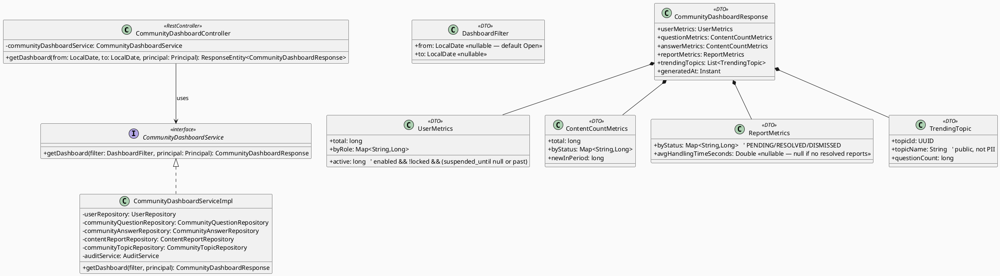
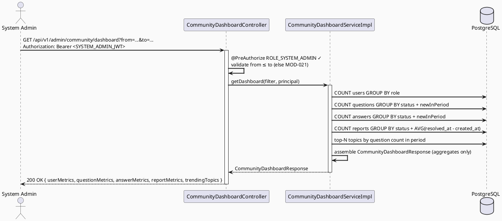
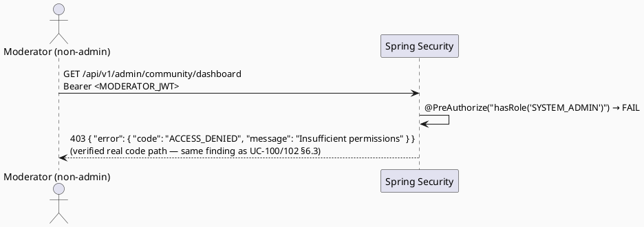

# ENGINEERING DOCUMENTATION STANDARD (EDS) v2.0
# Technical Design Specification — UC-111: View Community Dashboard

| Field              | Value                                   |
| ------------------ | ---------------------------------------- |
| **Document ID**    | `CB-MOD-IMP-006`                        |
| **Version**        | `1.0`                                   |
| **Date**           | `2026-07-01`                            |
| **Status**         | `Implemented`                           |
| **Document Owner** | `HuyND`                                 |
| **Author**         | `AI Agent — Winston (System Architect)` |
| **Reviewed by**    | `[ ] Pending`                           |
| **DPO Sign-off**   | `[ ] Pending` *(aggregate-only, no row-level PII in response — see ADR-004)* |
| **Approved by**    | `[ ] Pending`                           |
| **Last Review**    | `2026-07-01`                            |
| **Based on EDS**   | `v2.0`                                  |

---

## CHANGELOG

| Ngày       | Người thực hiện    | Nội dung thay đổi                                                                   |
| ---------- | ------------------- | ------------------------------------------------------------------------------------ |
| 2026-07-01 | AI Agent — Winston  | Tạo tài liệu lần đầu — TDS cho UC-111 View Community Dashboard (Status=Draft)        |
| 2026-07-02 | AI Agent — Amelia (Dev Agent) | Phase 3: Implementation — 16/16 tests PASS. Resolved `Open` items to their own recommended defaults: trending top-N = 5, default window = last 30 days (no Product override received). Deviations verified/applied: (1) `avgHandlingTimeSeconds` computed in Java from `(createdAt, resolvedAt)` pairs rather than SQL `EXTRACT(EPOCH FROM ...)` — that syntax is Postgres-specific and this codebase's test datasource is H2 with no Testcontainers/real-Postgres harness anywhere (verified project-wide); (2) `MOD-021` implemented as a new factory on the existing `ModerationException` (per §10's own "either satisfies the contract" note) rather than a new `DashboardException` class; (3) repository aggregate methods added directly to the existing `UserRepository`/`CommunityQuestionRepository`/`CommunityAnswerRepository`/`ContentReportRepository` — no `CommunityTopicRepository` dependency needed since the trending JOIN lives in `CommunityQuestionRepository`; (4) UC-102 confirmed merged (`users.suspended_until` present) — full active-user predicate implemented, no degraded fallback needed; (5) `DASH-TC-INT-001/002` hosted as `@SpringBootTest`+H2 (real Spring-managed beans end-to-end), not Testcontainers. Status: Approved → Implemented. |

---

## MỤC LỤC

1. [Tổng quan Module](#1-tổng-quan-module)
2. [Ma trận Truy vết](#2-ma-trận-truy-vết)
3. [Architecture Decision Records (ADR)](#3-architecture-decision-records-adr)
4. [Non-Functional Requirements & SLA](#4-non-functional-requirements--sla)
5. [Static Modeling](#5-static-modeling)
6. [Dynamic Modeling](#6-dynamic-modeling)
7. [Domain Event Catalog](#7-domain-event-catalog)
8. [Interface Specification](#8-interface-specification)
9. [API Specification](#9-api-specification)
10. [Bảng mã lỗi](#10-bảng-mã-lỗi)
11. [Quy trình Triển khai](#11-quy-trình-triển-khai)
12. [Rollback & Incident Runbook](#12-rollback--incident-runbook)
13. [Kịch bản Kiểm thử Chi tiết](#13-kịch-bản-kiểm-thử-chi-tiết)
14. [Phương pháp Xác minh](#14-phương-pháp-xác-minh)
15. [API Verification Samples](#15-api-verification-samples)
16. [Authorization Matrix](#16-authorization-matrix)
17. [AI Prompt Constraints (CASE 2.0)](#17-ai-prompt-constraints-case-20)

---

## 1. Tổng quan Module

| Field                     | Value                                                                                                                                  |
| ------------------------- | --------------------------------------------------------------------------------------------------------------------------------------- |
| **UC ID**                 | `UC-111`                                                                                                                                |
| **FS Reference**          | `3.2.2.13 View Community Dashboard` (`02_Requirements/SRS/3_Functional_Specification.md`)                                              |
| **Module Name**           | `View Community Dashboard`                                                                                                             |
| **Bounded Context**       | `content` (admin/moderation read-side, same base path `/api/v1/admin` as UC-99/UC-100). Aggregation reads cross into `community` (questions/answers/topics) and `security` (users) tables — read-only, no write coupling. |
| **Primary Actor**         | `System Admin (ROLE_SYSTEM_ADMIN)` (per FS Primary Actor)                                                                              |
| **Platform**              | `Admin Web Portal`                                                                                                                      |
| **Priority**              | `Medium` (per FS — Moderation/Admin analytics group)                                                                                   |
| **Frequency of Use**      | `Regular`                                                                                                                                |
| **Data Classification**   | `Internal` — aggregate counts only, no row-level PII (ADR-004)                                                                         |
| **Compliance Scope**      | `PDPA general principle` (CLAUDE.md): response DTO must not expose any row-level personal data; only counts/averages                    |
| **Upstream Dependencies** | `security (User/users table — count by role/status)`, `community (CommunityQuestion, CommunityAnswer, CommunityTopic tables)`, `content (ContentReport table — status counts + handling time)` |
| **Downstream Consumers**  | Admin Web Portal dashboard UI (out of scope here). None server-side.                                                                    |

**Mô tả:**
UC-111 cung cấp một endpoint **read-only** trả về các chỉ số tổng hợp (aggregate metrics) của cộng đồng cho System Admin: số lượng người dùng (theo vai trò/trạng thái), số lượng câu hỏi/câu trả lời (theo trạng thái kiểm duyệt), số lượng báo cáo (theo trạng thái) kèm **thời gian xử lý trung bình** (`resolved_at - created_at`), và **chủ đề đang thịnh hành** (trending topics — số câu hỏi cao nhất theo `topic_id` trong khoảng thời gian). Đây là một **greenfield read path**: không có dashboard/aggregation service nào tồn tại trong `content`/`community` (chỉ có `journey/dto/JourneyDashboardResponse.java` thuộc bounded context khác — KHÔNG tái sử dụng, chỉ tham chiếu style).

**Nguyên tắc nền tảng (ADR-001):** Mọi metric PHẢI được ground trên một cột thực sự tồn tại trong schema. KHÔNG phát minh metric không có cột hậu thuẫn (ví dụ: KHÔNG có "NPS score", "satisfaction rating"). Danh sách metric trong tài liệu này được rút ra trực tiếp từ `V1__init_schema.sql` — xem §5.2.

**Phạm vi rõ ràng (out of scope):**
- KHÔNG ghi/mutate bất kỳ bảng nào — thuần đọc.
- KHÔNG trả về row-level PII (tên người dùng, email, nội dung câu hỏi cụ thể) — chỉ counts/averages/aggregates (ADR-004).
- UC-113 View Impact Report (`CB-MOD-IMP-007`) là một endpoint riêng cho "impact/anonymized metrics for fundraising/CSR" — KHÔNG gộp vào đây (xem traceability §2).

---

## 2. Ma trận Truy vết

| Requirement ID | Loại          | Mô tả yêu cầu                                                                                  | Thành phần Code                                  | Compliance Target | ADR liên quan |
| --------------- | -------------- | ------------------------------------------------------------------------------------------------ | -------------------------------------------------- | ------------------- | --------------- |
| UC-111          | Use Case      | System Admin views aggregate community metrics                                                    | `CommunityDashboardController.getDashboard()`      | —                  | ADR-002         |
| FS-3.2.2.13     | Functional    | "user, question, report, handling time, and trending-topic metrics"                              | `CommunityDashboardServiceImpl.getDashboard()`     | —                  | ADR-001         |
| BR-RBAC-001     | Business Rule | Chỉ SYSTEM_ADMIN mới được gọi endpoint này                                                        | `@PreAuthorize("hasRole('SYSTEM_ADMIN')")`         | —                  | ADR-002         |
| BR-PRIVACY-001  | Business Rule | Response chỉ chứa aggregate, không có row-level PII                                               | `CommunityDashboardResponse` DTO (no entity fields) | PDPA               | ADR-004         |
| BR-METRIC-001   | Business Rule | Mọi metric phải map 1:1 với một cột schema thực sự tồn tại                                        | Aggregation queries (§5.2)                          | —                  | ADR-001         |
| BR-AUDIT-001    | Business Rule | Việc truy cập dashboard được audit log (tra cứu dữ liệu tổng hợp toàn hệ thống)                   | `AuditService.log(...)`                             | —                  | ADR-005 (Open)  |

> **Note (FS boilerplate caveat):** FS prose cho UC-111 ngoài dòng "user, question, report, handling time,
> and trending-topic metrics" đều là boilerplate generic dùng chung nhiều UC — KHÔNG phải oracle tin cậy cho
> hành vi cụ thể. Oracle thật cho từng metric là cột schema trong `V1__init_schema.sql` (§5.2).

---

## 3. Architecture Decision Records (ADR)

### ADR-001 — Metric Grounding: Mọi chỉ số phải map tới một cột schema tồn tại

| Field          | Value                      |
| -------------- | --------------------------- |
| **Status**     | `Accepted`                 |
| **Deciders**   | `HuyND — System Architect` |
| **Date**       | `2026-07-01`                |

#### Bối cảnh
FS chỉ liệt kê 5 nhóm metric ở mức rất chung ("user, question, report, handling time, trending-topic"). Nguy cơ là phát minh ra các metric nghe hợp lý nhưng không có cột hậu thuẫn (NPS, satisfaction, retention rate) — vi phạm quy tắc dossier "do not invent metrics with no backing column."

#### Quyết định
Mỗi field trong `CommunityDashboardResponse` PHẢI trace tới một cột/aggregate cụ thể trong `V1__init_schema.sql`. Danh sách chốt (§5.2):
- **User metrics** → `users` (`role`, `enabled`, `locked`, `suspended_until`, `created_at`)
- **Question metrics** → `community_questions` (`status`, `created_at`, `topic_id`)
- **Answer metrics** → `community_answers` (`status`, `created_at`)
- **Report metrics + handling time** → `content_reports` (`status`, `created_at`, `resolved_at`)
- **Trending topics** → `community_questions.topic_id` JOIN `community_topics.name` (count grouped, in period)

Bất kỳ metric nào reviewer muốn thêm mà không có cột hậu thuẫn PHẢI được đánh dấu `Open` và không implement.

#### Hệ quả
**Tích cực:** Không có metric "ma"; mọi số liệu kiểm chứng được bằng một truy vấn SQL cụ thể.
**Tiêu cực:** Dashboard bị giới hạn ở những gì schema hiện có — các metric "mềm" (chất lượng, hài lòng) không khả dụng cho tới khi có cột hậu thuẫn.

---

### ADR-002 — RBAC: SYSTEM_ADMIN only (no implicit hierarchy)

| Field        | Value                      |
| ------------ | --------------------------- |
| **Status**   | `Accepted`                 |
| **Deciders** | `HuyND — System Architect` |
| **Date**     | `2026-07-01`                |

#### Quyết định
`@PreAuthorize("hasRole('SYSTEM_ADMIN')")` trên `getDashboard()`. FS Primary Actor = System Admin. Vì **không có `RoleHierarchy` bean** trong `SecurityConfig.java` (xác nhận — cùng finding như UC-100/UC-102 §16), `MODERATOR` KHÔNG được truy cập ngầm dashboard toàn hệ thống này. Nếu Product muốn MODERATOR cũng xem được, cần thay đổi `@PreAuthorize` tường minh (đánh dấu `Open` §16). Add matching `SecurityConfig` rule:
```java
.requestMatchers(HttpMethod.GET, "/api/v1/admin/community/dashboard").hasRole("SYSTEM_ADMIN")
```

#### Hệ quả
Least-privilege; nhất quán với pattern kiểm soát truy cập admin đã có.

---

### ADR-003 — Live Aggregation, No Summary Table (v1)

| Field        | Value                      |
| ------------ | --------------------------- |
| **Status**   | `Accepted`                 |
| **Deciders** | `HuyND — System Architect` |
| **Date**     | `2026-07-01`                |

#### Bối cảnh
Dashboard có thể được phục vụ bằng (A) truy vấn aggregate trực tiếp mỗi request, hoặc (B) một bảng summary/materialized view được refresh định kỳ. Không có nguồn nào quy định tải hay SLA cụ thể.

#### Quyết định
Chọn **(A) live aggregation** cho v1: các truy vấn `COUNT(*) ... GROUP BY status`, `AVG(resolved_at - created_at)`, và top-N `GROUP BY topic_id ORDER BY count DESC LIMIT n`. Không tạo bảng summary → **không cần migration**. Frequency of Use = Regular (admin tool nội bộ, ít user), tải thấp → live query đủ.

#### Hệ quả
**Tích cực:** Không schema delta, không job refresh, số liệu luôn real-time.
**Tiêu cực:** Nếu bảng `community_questions`/`content_reports` phình to (hàng triệu dòng) và p99 latency vượt ngưỡng, cần re-evaluate sang (B) — đánh dấu SLA number `Open` (§4). Cần index phù hợp (đề xuất tận dụng index sẵn có trên `status`/`created_at`; nếu thiếu, đánh dấu như một Open follow-up, KHÔNG thêm index trong UC này nếu chưa đo được nhu cầu).

---

### ADR-004 — Aggregate-Only Response, No Row-Level PII

| Field        | Value                      |
| ------------ | --------------------------- |
| **Status**   | `Accepted`                 |
| **Deciders** | `HuyND — System Architect` |
| **Date**     | `2026-07-01`                |

#### Bối cảnh
CLAUDE.md: "never expose JPA entities in API responses" + PDPA general principle. Một dashboard dễ vô tình rò rỉ PII nếu trả về ví dụ "danh sách 5 user mới nhất" kèm tên/email.

#### Quyết định
`CommunityDashboardResponse` chỉ chứa **số đếm và trung bình** (long/double), tên topic (public, không PII), và các mã trạng thái. KHÔNG có field nào là entity, KHÔNG có tên/email/nội dung câu hỏi cụ thể. Trending topic chỉ trả `topicId` + `topicName` (public) + `questionCount` — `community_topics.name` là dữ liệu công khai, không PII.

#### Hệ quả
**Tích cực:** An toàn PDPA theo thiết kế; không thể rò rỉ PII qua endpoint này.
**Tiêu cực:** Không drill-down xuống cá nhân — đúng chủ đích cho một dashboard tổng quan.

---

### ADR-005 — Audit Logging of Dashboard Access: Not Added in v1 (Resolved)

| Field        | Value                      |
| ------------ | --------------------------- |
| **Status**   | `Rejected for v1 — resolved by project-analysis default (smaller scope, no new enum value)` |
| **Deciders** | `HuyND — System Architect` |
| **Date**     | `2026-07-01`                |

#### Bối cảnh
Truy cập dữ liệu tổng hợp toàn hệ thống là hành vi nhạy cảm ở mức admin. Không có nguồn FS/BR nào yêu cầu audit việc *đọc* dashboard (khác với audit *hành động* kiểm duyệt ở UC-100/101/102, vốn có `AuditAction.MODERATION_ACTION`).

#### Quyết định
**Không thêm audit logging cho việc đọc dashboard trong v1.** Resolved via project analysis rather than left open: adding it requires a new `AuditAction.DASHBOARD_VIEWED` enum value for a read-only, non-mutating endpoint with no sourced compliance requirement — this is unnecessary scope for v1 and would log noise on every dashboard render. Access control (§16, SYSTEM_ADMIN-only) already restricts who can view this data; a separate read-access audit trail is a legitimate future enhancement if Product surfaces a compliance need, but is not built speculatively here.

#### Hệ quả
**Tích cực:** Smaller implementation surface; no enum addition; no per-request audit-log write overhead on a read path.
**Tiêu cực:** No trace of who viewed system-wide dashboard data — acceptable given access is already SYSTEM_ADMIN-gated; revisit if a future compliance requirement emerges.

---

## 4. Non-Functional Requirements & SLA

### 4.1. Performance & Availability

| Category     | Requirement                 | Target SLA  | Measurement Method | Compliance Basis |
| ------------ | ---------------------------- | ----------- | -------------------- | ------------------- |
| Latency      | API response (p99), `GET /dashboard` | `Open` — no sourced SLA; recommend reuse of UC-99/UC-100's `< 300ms` baseline, but aggregation over growing tables may exceed it — needs load test + Tech Lead confirmation | k6 load test | — |
| Availability | Uptime (monthly)             | `Open` — reuse `99.5%` baseline | Uptime monitor | — |
| Query cost   | Number of aggregate queries per request | Bounded (≤ ~5 grouped queries — user/question/answer/report/trending); no N+1 | Code review | ADR-003 |

### 4.2. Data Integrity & Privacy

| Category   | Requirement                                                              | Target                | Verification Method | Compliance Basis |
| ---------- | ------------------------------------------------------------------------- | ------------------------ | ---------------------- | ------------------- |
| Read-only  | Endpoint never mutates any table                                        | 0 write ops               | Code review + `pg_stat_user_tables` | — |
| No PII     | Response contains no row-level personal data                            | 100%                      | DTO field review (§8.3) + integration assertion | PDPA / ADR-004 |
| Metric grounding | Every response field maps to a real column                        | 100%                      | Traceability review (§5.2) | ADR-001 |

### 4.3. Security

| Category        | Requirement                                                  | Target          | Verification Method | Compliance Basis |
| ---------------- | --------------------------------------------------------------- | ------------------ | ----------------------- | ------------------- |
| Access control   | SYSTEM_ADMIN role only (no implicit hierarchy)                | Least privilege     | Auth Matrix (§16)        | ADR-002 |
| Input validation | Optional date-range params validated (from ≤ to; sane bounds) | 100% reject invalid | Unit + integration test | ADR-006 |

### 4.4. Scalability

Không có dữ liệu tải cụ thể nguồn gốc (`Open`). Giả định tải nội bộ admin (ít user). Nếu bảng dữ liệu phình to, ADR-003 ghi nhận đường nâng cấp (summary table).

---

## 5. Static Modeling

### 5.1. Class Diagram (PlantUML)



### 5.2. Data Structure — Metric-to-Column Mapping (NO schema delta)

> **No migration required.** UC-111 is pure read-only aggregation over existing tables.

| Metric (response field)               | Source table.column (V1__init_schema.sql)                              | Aggregation |
| -------------------------------------- | ------------------------------------------------------------------------ | ------------- |
| `userMetrics.total`                   | `users` (all rows)                                                       | `COUNT(*)` |
| `userMetrics.byRole`                  | `users.role`                                                             | `COUNT(*) GROUP BY role` |
| `userMetrics.active`                  | `users.enabled`, `users.locked`, `users.suspended_until`                | `COUNT(*) WHERE enabled AND NOT locked AND (suspended_until IS NULL OR suspended_until <= now())` — `suspended_until` added by UC-102 (CB-MOD-IMP-004); if UC-102 not yet merged, this predicate degrades to `enabled AND NOT locked` (flag as build-order dependency) |
| `questionMetrics.total`               | `community_questions` (all)                                             | `COUNT(*)` |
| `questionMetrics.byStatus`            | `community_questions.status` (PENDING/APPROVED/HIDDEN/LOCKED)           | `COUNT(*) GROUP BY status` |
| `questionMetrics.newInPeriod`         | `community_questions.created_at`                                        | `COUNT(*) WHERE created_at BETWEEN from AND to` |
| `answerMetrics.total`                 | `community_answers` (all)                                               | `COUNT(*)` |
| `answerMetrics.byStatus`              | `community_answers.status` (PENDING/APPROVED/HIDDEN)                    | `COUNT(*) GROUP BY status` |
| `answerMetrics.newInPeriod`           | `community_answers.created_at`                                          | `COUNT(*) WHERE created_at BETWEEN from AND to` |
| `reportMetrics.byStatus`              | `content_reports.status` (PENDING/RESOLVED/DISMISSED)                   | `COUNT(*) GROUP BY status` |
| `reportMetrics.avgHandlingTimeSeconds`| `content_reports.resolved_at`, `content_reports.created_at`            | `AVG(EXTRACT(EPOCH FROM (resolved_at - created_at))) WHERE resolved_at IS NOT NULL` — null if no resolved reports |
| `trendingTopics[]`                    | `community_questions.topic_id` JOIN `community_topics.name`, `is_hidden`| `COUNT(*) GROUP BY topic_id ORDER BY count DESC LIMIT n WHERE created_at BETWEEN from AND to AND NOT community_topics.is_hidden` |

> **`n` (trending top-N) and default date window are `Open`** — no sourced value. Recommend `n = 5` and
> default window = last 30 days, but both flagged `Open` for Product confirmation (do not treat as sourced).

---

## 6. Dynamic Modeling

### 6.1. Sequence Diagram — Happy Path



### 6.2. Sequence Diagram — Error Path (Unauthorized — non-SYSTEM_ADMIN)



### 6.3. Invariants

- Response is a pure function of DB state at read time (idempotent GET, no side effect except optional audit log per ADR-005).
- `avgHandlingTimeSeconds` is `null` (not `0`) when there are no resolved reports — distinguishes "no data" from "instant resolution."

---

## 7. Domain Event Catalog

### 7.1. Events Published / 7.2. Consumed

| Event Name | Trigger | Publisher | Subscriber | Payload | Async? |
| ----------- | -------- | ---------- | ----------- | -------- | ------- |
| (none)     | —        | —          | —           | —        | —       |

> **N/A** — read-only endpoint publishes/consumes no domain events (same pattern as UC-99 queue read).

---

## 8. Interface Specification

### 8.1. Service Interface

```java
// com.carebridge.backend.content.service.CommunityDashboardService
package com.carebridge.backend.content.service;

public interface CommunityDashboardService {
    /**
     * Returns aggregate community metrics for the given (optional) date window.
     * Read-only; response contains no row-level PII (ADR-004).
     * @throws DashboardException (MOD-021) if from/to range is invalid (from after to)
     */
    CommunityDashboardResponse getDashboard(DashboardFilter filter, Principal principal);
}
```

### 8.2. Repository Interfaces

```java
// Aggregation queries. Prefer @Query with JPQL/native for GROUP BY count maps, or projection interfaces.
// Existing repositories extended with count/aggregate methods (read-only, additive):
//   UserRepository            — countByRole (GROUP BY) ; countActive predicate
//   CommunityQuestionRepository — countByStatus ; countByCreatedAtBetween ; top-N topic counts
//   CommunityAnswerRepository   — countByStatus ; countByCreatedAtBetween
//   ContentReportRepository     — countByStatus ; avgHandlingTime (native AVG(EXTRACT EPOCH ...))
//   CommunityTopicRepository    — findById / name lookup (existing)
// Exact method signatures are implementation detail; document them in §11 implementation steps.
```

### 8.3. DTO Definitions (aggregate-only — ADR-004)

```java
public record CommunityDashboardResponse(
        UserMetrics userMetrics,
        ContentCountMetrics questionMetrics,
        ContentCountMetrics answerMetrics,
        ReportMetrics reportMetrics,
        List<TrendingTopic> trendingTopics,
        Instant generatedAt
) {}

public record UserMetrics(long total, Map<String,Long> byRole, long active) {}
public record ContentCountMetrics(long total, Map<String,Long> byStatus, long newInPeriod) {}
public record ReportMetrics(Map<String,Long> byStatus, Double avgHandlingTimeSeconds) {}   // nullable avg
public record TrendingTopic(UUID topicId, String topicName, long questionCount) {}          // topicName public, not PII

public record DashboardFilter(LocalDate from, LocalDate to) {}   // both nullable; defaults Open
```

---

## 9. API Specification

### 9.1. Endpoints Table

| Method | Path                                          | Auth Level | Required Roles     | Rate Limit | Idempotent? |
| ------ | ----------------------------------------------- | ------------ | --------------------- | ------------ | -------------- |
| `GET`  | `/api/v1/admin/community/dashboard`             | JWT Bearer   | `ROLE_SYSTEM_ADMIN`   | `Open` — recommend reuse UC-99/UC-100 baseline | Yes (read-only) |

**Query params:** `from` (ISO date, optional), `to` (ISO date, optional). If both omitted, service uses the
default window (`Open` — recommend last 30 days). Validation: if both present, `from` must be ≤ `to` (else MOD-021).

### 9.2. Response Schema (200 OK)

```json
{
  "userMetrics": { "total": 1280, "byRole": { "MOTHER": 900, "FAMILY": 200, "EXPERT": 40, "MODERATOR": 5, "CONTENT_ADMIN": 3, "PARTNER": 30, "SYSTEM_ADMIN": 2 }, "active": 1240 },
  "questionMetrics": { "total": 3400, "byStatus": { "PENDING": 12, "APPROVED": 3300, "HIDDEN": 80, "LOCKED": 8 }, "newInPeriod": 210 },
  "answerMetrics": { "total": 9800, "byStatus": { "PENDING": 30, "APPROVED": 9700, "HIDDEN": 70 }, "newInPeriod": 640 },
  "reportMetrics": { "byStatus": { "PENDING": 5, "RESOLVED": 220, "DISMISSED": 60 }, "avgHandlingTimeSeconds": 43200.0 },
  "trendingTopics": [ { "topicId": "…", "topicName": "Dinh dưỡng thai kỳ", "questionCount": 58 } ],
  "generatedAt": "2026-07-01T10:15:00Z"
}
```

**Response — 400 Bad Request (invalid range — MOD-021):**
```json
{ "error": { "code": "MOD-021", "message": "Invalid date range: 'from' must not be after 'to'" } }
```

**Response — 401 Unauthorized:** empty body (verified — `HttpStatusEntryPoint`, same as UC-100/102).

**Response — 403 Forbidden (wrong role):**
```json
{ "error": { "code": "ACCESS_DENIED", "message": "Insufficient permissions" } }
```

---

## 10. Bảng mã lỗi

| Code         | HTTP Status | Message (EN)                            | Trigger Condition                                | Status in code |
| ------------- | ------------- | ------------------------------------------ | --------------------------------------------------- | ----------------- |
| `MOD-021`    | 400           | Invalid date range (from after to)         | `from` and `to` both present and `from > to`        | **New — to implement** |
| `ACCESS_DENIED` | 403        | Insufficient permissions                    | Non-SYSTEM_ADMIN calls this endpoint (verified real code path) | Reused — already implemented |
| *(none — empty body)* | 401  | —                                          | Missing/invalid JWT — verified real code path       | Existing framework default |
| `INTERNAL_ERROR` | 500       | An unexpected error occurred                | Unhandled exception — `GlobalExceptionHandler.handleGeneric()` | Reused — already implemented |

> **Numbering confirmation:** UC-100 claimed `MOD-007..010`, UC-101 `MOD-011..013`, UC-102 `MOD-015..020`.
> UC-111 claims **`MOD-021`** (single new code — a read-only endpoint needs almost no domain errors). A
> Consistency-Gate pass across the batch must confirm no sibling independently claimed `MOD-021`.
> `DashboardException` is a new lightweight exception class in `content/exception` following the same factory
> pattern as `ModerationException`; alternatively reuse `ModerationException` with the `MOD-021` factory
> (implementation decision — flag as minor `Open`, either satisfies the contract).

---

## 11. Quy trình Triển khai

### 11.1. Prerequisites
- [ ] ADR-001..ADR-005 reviewed (đặc biệt ADR-003 live-aggregation choice, ADR-005 audit-Proposed, và `Open` items: trending `n`, default window)
- [x] `@EnableMethodSecurity` enabled (inherited)
- [ ] No migration needed — confirm (pure read)

### 11.2. Pre-Migration Checklist
- [ ] **Không cần migration** — UC-111 chỉ đọc. Xác nhận CG-9: không có schema delta.
- [ ] Build-order note: `userMetrics.active` dùng `users.suspended_until` (thêm bởi UC-102). Nếu UC-102 chưa merge, predicate suy biến về `enabled AND NOT locked` — không phải blocker, chỉ là dependency ghi chú.

### 11.3. Implementation Steps
```
1. DTOs: CommunityDashboardResponse + nested records (§8.3), DashboardFilter
2. Repository aggregate methods (count-by-status, count-in-period, avg-handling-time, top-N topics)
3. CommunityDashboardService interface + Impl (assemble aggregates; read-only)
4. CommunityDashboardController.getDashboard() @PreAuthorize("hasRole('SYSTEM_ADMIN')") + @Valid range
5. DashboardException.invalidDateRange() → MOD-021 (or ModerationException factory)
6. SecurityConfig: .requestMatchers(GET, "/api/v1/admin/community/dashboard").hasRole("SYSTEM_ADMIN")
7. (If ADR-005 Accepted) AuditService.log(DASHBOARD_VIEWED/MODERATION_QUEUE_VIEWED, ...) + enum addition
```

### 11.4. Deployment Checklist
- [ ] Health check 200
- [ ] Dashboard returns 200 for SYSTEM_ADMIN, 403 for others
- [ ] No PII in response payload (manual review of a live response)
- [ ] Query latency acceptable on production-sized data (ADR-003 watch-item)

---

## 12. Rollback & Incident Runbook

### 12.1. Triggers
| Điều kiện | Ngưỡng | Người quyết định |
| ------------ | --------- | ------------------- |
| Dashboard query gây tải DB cao / p99 latency spike | > threshold (Open) | On-call / Tech Lead |
| Rò rỉ PII trong response (bất kỳ field row-level nào) | Bất kỳ case nào | Tech Lead (CRITICAL — PDPA) |
| 403 sai cho SYSTEM_ADMIN hợp lệ | Bất kỳ case nào | Tech Lead |

### 12.2. Procedure
```bash
kubectl rollout undo deployment/carebridge-api    # read-only endpoint — safe to disable/revert
kubectl rollout status deployment/carebridge-api
# No migration to revert (UC-111 has no schema delta).
curl -X GET https://api.carebridge.vn/actuator/health
```

---

## 13. Kịch bản Kiểm thử Chi tiết

> Chi tiết đầy đủ trong `UC111_ViewCommunityDashboard_Test-Spec.md` (`CB-MOD-TEST-006`). Nhóm scenario chính:

### 13.1. Unit / Service
- Happy path: assemble metrics từ mocked repository counts → response fields khớp
- `avgHandlingTimeSeconds` null khi không có resolved report
- `active` user predicate đúng (enabled && !locked && suspended_until null-or-past)
- Trending top-N sắp xếp giảm dần theo questionCount, loại topic `is_hidden`
- Invalid range (from > to) → MOD-021

### 13.2. Integration
- Full GET flow với real DB (Testcontainers): seed users/questions/answers/reports/topics → assert counts chính xác
- Response chứa KHÔNG có PII field (assert schema)

### 13.3. Security
- Non-SYSTEM_ADMIN (MODERATOR/CONTENT_ADMIN/MOTHER) → 403 ACCESS_DENIED
- No JWT → 401 bodiless

---

## 14. Phương pháp Xác minh

### 14.1. Database Inspection
```sql
-- Cross-check dashboard counts against direct SQL (oracle for integration test)
SELECT status, COUNT(*) FROM community_questions GROUP BY status;
SELECT status, COUNT(*) FROM content_reports GROUP BY status;
SELECT AVG(EXTRACT(EPOCH FROM (resolved_at - created_at))) FROM content_reports WHERE resolved_at IS NOT NULL;
SELECT q.topic_id, t.name, COUNT(*) FROM community_questions q JOIN community_topics t ON t.id = q.topic_id
  WHERE NOT t.is_hidden GROUP BY q.topic_id, t.name ORDER BY COUNT(*) DESC LIMIT 5;

-- Verify read-only (no writes from this endpoint)
SELECT n_tup_ins, n_tup_upd, n_tup_del FROM pg_stat_user_tables WHERE relname IN
  ('community_questions','content_reports','users');  -- unchanged before/after a dashboard call
```

---

## 15. API Verification Samples

```bash
export ADMIN_TOKEN="eyJ..."
curl -X GET "https://api.carebridge.vn/api/v1/admin/community/dashboard?from=2026-06-01&to=2026-06-30" \
  -H "Authorization: Bearer $ADMIN_TOKEN"
# Expected: 200 with aggregate JSON (§9.2)

# Wrong role → 403
curl -X GET "https://api.carebridge.vn/api/v1/admin/community/dashboard" -H "Authorization: Bearer $MODERATOR_TOKEN"
# Expected: 403 ACCESS_DENIED

# Invalid range → 400 MOD-021
curl -X GET "https://api.carebridge.vn/api/v1/admin/community/dashboard?from=2026-06-30&to=2026-06-01" -H "Authorization: Bearer $ADMIN_TOKEN"
# Expected: 400 MOD-021
```

---

## 16. Authorization Matrix

| Endpoint                                       | `MOTHER` | `FAMILY` | `EXPERT` | `MODERATOR` | `CONTENT_ADMIN` | `PARTNER` | `SYSTEM_ADMIN` |
| ------------------------------------------------- | ---------- | ---------- | ---------- | -------------- | ------------------ | ----------- | ----------------- |
| `GET /api/v1/admin/community/dashboard`          | ❌        | ❌        | ❌        | ❌ *(see note)*| ❌                  | ❌          | ✅                |

**Chú thích:**
- ✅ = Được phép, ❌ = Bị từ chối (403 `ACCESS_DENIED`)
- **MODERATOR = ❌:** FS Primary Actor cho UC-111 là **System Admin**, không phải Moderator. Không có
  `RoleHierarchy` bean nên không có kế thừa ngầm. Nếu Product muốn MODERATOR xem dashboard, đó là thay đổi
  `@PreAuthorize` tường minh — đánh dấu `Open`, ngoài phạm vi UC này.

---

## 17. AI Prompt Constraints (CASE 2.0)

### 17.1 Constraint Summary Table

| #   | Constraint                                                                                       | Source (ADR/BR)  | Last Verified |
| --- | ------------------------------------------------------------------------------------------------ | ------------------ | --------------- |
| C1  | Controller PHẢI dùng `@PreAuthorize("hasRole('SYSTEM_ADMIN')")` — không business logic           | `ADR-002`           | `2026-07-01`     |
| C2  | Endpoint PHẢI read-only — KHÔNG mutate bất kỳ bảng nào                                            | `§4.2`, `BR (read)` | `2026-07-01`     |
| C3  | Response DTO CHỈ chứa aggregate — KHÔNG entity, KHÔNG row-level PII (tên/email/nội dung)          | `ADR-004`           | `2026-07-01`     |
| C4  | Mọi metric PHẢI map tới một cột schema tồn tại (§5.2) — KHÔNG phát minh metric không có cột       | `ADR-001`           | `2026-07-01`     |
| C5  | `avgHandlingTimeSeconds` PHẢI null (không phải 0) khi không có resolved report                    | `§6.3 invariant`    | `2026-07-01`     |
| C6  | Trending topics PHẢI loại `community_topics.is_hidden = true`                                     | `§5.2`              | `2026-07-01`     |
| C7  | Invalid date range (from > to) → `MOD-021` (400)                                                  | `ADR-006/§10`       | `2026-07-01`     |

### 17.2 Constraint Injection Block

```
[CONSTRAINT BLOCK — Module: View Community Dashboard (UC-111)]
Theo TDS CB-MOD-IMP-006:
1. [C1] Controller getDashboard() PHẢI có @PreAuthorize("hasRole('SYSTEM_ADMIN')"), chỉ @Valid + delegate.
2. [C2] TUYỆT ĐỐI read-only — không INSERT/UPDATE/DELETE bảng nào (trừ dòng audit log nếu ADR-005 Accepted).
3. [C3] Response chỉ chứa số đếm/trung bình + tên topic công khai. KHÔNG field entity, KHÔNG PII.
4. [C4] Mỗi field response phải trace tới một cột trong §5.2. KHÔNG bịa metric.
5. [C5] avgHandlingTimeSeconds = null khi không có resolved report.
6. [C6] Trending loại bỏ topic is_hidden=true.
7. [C7] from > to → MOD-021.

[CONTEXT BLOCK]
- Bounded Context: content (read-side), reads community + security + content_reports tables
- Data Classification: Internal (aggregate); Compliance: PDPA (no row-level PII)
- Interfaces: §8; Error codes: §10 (MOD-021 new); Auth matrix: §16
- Schema delta: NONE (pure aggregation)

[TASK BLOCK]
Implement CommunityDashboardController.getDashboard(), CommunityDashboardServiceImpl.getDashboard(),
DTO records (§8.3), repository aggregate methods (§5.2), MOD-021 factory — thỏa mãn C1-C7.
Tests cover §13 (chi tiết trong Test-Spec CB-MOD-TEST-006).
```

### 17.3 Constraint Quality Checklist
- [x] Mỗi constraint traceable về ADR/§ cụ thể
- [x] Không có constraint generic
- [x] Mỗi constraint có `Last Verified` date
- [x] Constraint block reference §8 Interface và §16 Auth Matrix

### 17.4 Anti-Pattern Detection

| AP-ID     | Anti-Pattern          | Dấu hiệu                                                              | Hành động                |
| --------- | ---------------------- | ------------------------------------------------------------------------- | --------------------------- |
| AP-AI-001 | Unconstrained Gen     | Code bỏ qua RBAC hoặc trả về nhiều hơn aggregate                          | Reject — inject lại C1/C3 |
| AP-AI-002 | PII Leak              | Response chứa tên/email/nội dung câu hỏi cụ thể (row-level)               | Reject — CHÍNH XÁC rủi ro ADR-004, BLOCKING |
| AP-AI-003 | Hallucinated Metric   | Field response không map tới cột schema nào (§5.2)                        | Reject — xóa metric hoặc mark Open |
| AP-AI-004 | Layer Violation       | Controller query DB trực tiếp                                            | Reject — chỉ Service/Repository |
| AP-AI-005 | Hidden Write          | Endpoint "read" nhưng có INSERT/UPDATE ngoài audit                       | Reject — vi phạm C2 |

**Kết quả review:**
- [x] Không phát hiện anti-pattern nào trong bản thân spec này → approved-for-RED-phase

---

## PHỤ LỤC

### A. Glossary
| Thuật ngữ | Định nghĩa |
| ------------ | ------------- |
| Handling Time | Khoảng thời gian `resolved_at - created_at` của một `content_report` đã xử lý |
| Trending Topic | Chủ đề (`community_topics`) có số câu hỏi cao nhất trong khoảng thời gian, loại topic ẩn |
| Aggregate-Only | Response chỉ chứa số liệu tổng hợp, không có dữ liệu cấp dòng/cá nhân (PDPA-safe) |

### B. Tài liệu tham chiếu
| Document | Path |
| ------------ | ------- |
| SRS 3.2.2.13 | `02_Requirements/SRS/3_Functional_Specification.md` |
| Schema (users/community_questions/community_answers/content_reports/community_topics) | `05_Development/CareBridgeAPI/src/main/resources/db/migration/V1__init_schema.sql` |
| UC-102 TDS (suspended_until column, used by active-user metric) | `04_Implement/UC102_WarnOrSuspendAccount/UC102_WarnOrSuspendAccount_TDS.md` |
| CLAUDE.md — Architecture / PDPA | `CLAUDE.md §3, §5` |

---

*EDS v2.1 — Read-only analytics endpoint; no schema delta. Status: Draft — chờ review, đặc biệt các `Open`
items: SLA latency, trending top-N `n`, default date window. ADR-005 (audit read-access) đã resolved — không
implement trong v1.*
