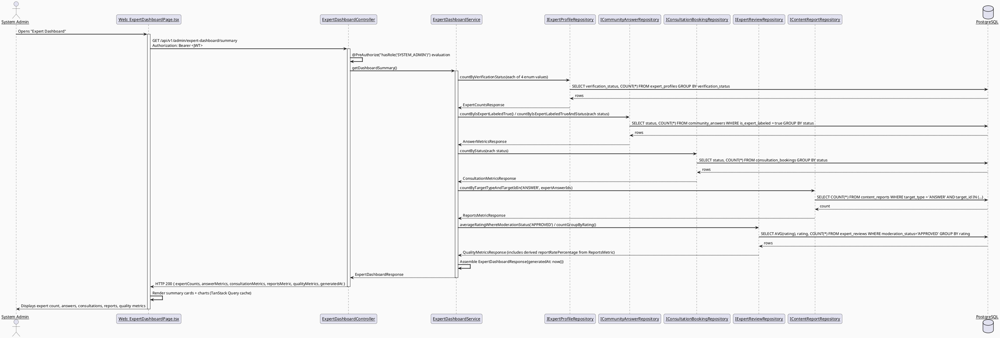
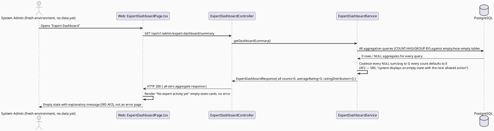
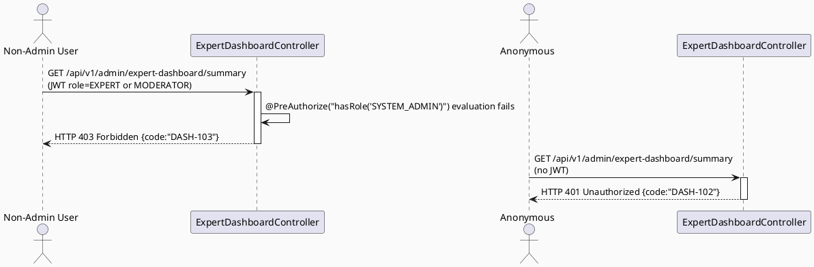

# ENGINEERING DOCUMENTATION STANDARD (EDS) v2.0
# UC-112 View Expert Dashboard — Technical Design Specification

| Field | Value |
|-------|-------|
| **Document ID** | `CB-EXPGOV-IMP-112` |
| **Version** | `1.0` |
| **Date** | `2026-07-02` |
| **Status** | `Draft` |
| **Document Owner** | `TV4-Lâm` |
| **Author** | `AI Agent (Technical Architect)` |
| **Reviewed by** | `[ ] Pending` |
| **DPO Sign-off** | `[ ] Pending` *(dashboard aggregates counts only — no per-record PII rendered — see §1 Data Classification)* |
| **Approved by** | `[ ] Pending` |
| **Last Review** | `2026-07-02` |
| **Based on EDS** | `v2.0` |

---

## CHANGELOG

| Ngày | Người thực hiện | Nội dung thay đổi |
|------|-----------------|-------------------|
| 2026-07-02 | AI Agent | Khởi tạo TDS cho UC-112, thiết kế read-only aggregation dashboard trên schema hiện có (không migration mới) |
| 2026-07-02 | AI Agent | Đóng OI-1/OI-2: ADR-DASH-001/002 chuyển `Proposed` → `Accepted` theo quyết định Product/Tech Lead; xác nhận literal `target_type = ReportTargetType.ANSWER` (enum thật, code-verified tại `content.entity.ReportTargetType`) |

---

## MỤC LỤC

1. [Tổng quan Module](#1-tổng-quan-module)
2. [Ma trận Truy vết (Traceability Matrix)](#2-ma-trận-truy-vết-traceability-matrix)
3. [Architecture Decision Records (ADR)](#3-architecture-decision-records-adr)
4. [Non-Functional Requirements & SLA](#4-non-functional-requirements--sla)
5. [Static Modeling](#5-static-modeling-mô-hình-tĩnh)
6. [Dynamic Modeling](#6-dynamic-modeling-mô-hình-động)
7. [Domain Event Catalog](#7-domain-event-catalog)
8. [Interface Specification](#8-interface-specification-đặc-tả-giao-diện)
9. [API Specification](#9-api-specification)
10. [Bảng mã lỗi (Error Codes)](#10-bảng-mã-lỗi-error-codes)
11. [Quy trình Triển khai (Step-by-Step)](#11-quy-trình-triển-khai-step-by-step)
12. [Rollback & Incident Runbook](#12-rollback--incident-runbook)
13. [Kịch bản Kiểm thử Chi tiết](#13-kịch-bản-kiểm-thử-chi-tiết)
14. [Phương pháp Xác minh](#14-phương-pháp-xác-minh)
15. [Mẫu thử thực tế (API Verification Samples)](#15-mẫu-thử-thực-tế-api-verification-samples)
16. [Bảng tổng hợp phân quyền (Authorization Matrix)](#16-bảng-tổng-hợp-phân-quyền-authorization-matrix)
17. [AI Prompt Constraints (CASE 2.0)](#17-ai-prompt-constraints-case-20)
18. [Open Items / Research Gate](#18-open-items--research-gate)

---

## 1. Tổng quan Module

| Field | Value |
|-------|-------|
| **Module Name** | `ExpertDashboard` (admin aggregation view) |
| **Bounded Context** | `expert` (backend package `com.carebridge.backend.expert`, admin-facing sub-slice — same bounded context as UC-103 Verify Expert Profile) |
| **Function ID / UC** | `3.2.2.14 View Expert Dashboard` / `UC-112` |
| **Primary Actor** | System Admin |
| **Secondary Actors** | None (SRS §3.2.2.14, line 1286) |
| **Platform** | Web — Admin Portal (React + TypeScript + Vite) |
| **Priority** | High |
| **Frequency of Use** | Frequent (SRS Table 80) |
| **Sprint / Owner** | Sprint 3 "Cross-Domain Integration" — TV4-Lâm |
| **Data Classification** | `Internal` — the dashboard renders **aggregate counts/sums only** (e.g., "42 verified experts", "128 consultations this month"); it does not render any single expert's PII, credential documents, or an individual booking's contents. If a future iteration adds drill-down to per-expert or per-booking detail, that view inherits the `PII`/`Confidential-Internal` classification of the underlying tables (see UC-103, UC-97 TDS) — **out of scope here**. |
| **Compliance Scope** | `PDPA` (aggregation-only mitigates most PDPA exposure, but see ADR-DASH-003 on minimum cohort size) |
| **Upstream Dependencies** | `expert_profiles`/`expert_credentials` (UC-87/UC-89/UC-103), `consultation_bookings`/`consultation_sessions` (booking/consultation UCs), `community_answers`/`community_questions` (community module, `is_expert_labeled` flag), `expert_reviews` (post-consultation review UC-79), `content_reports`/`moderation_actions` (moderation module) — **all read-only, no writes** |
| **Downstream Consumers** | None identified in SRS — pure terminal admin reporting view |

**Mô tả (SRS):** "Displays expert count, answers, consultations, reports, and quality metrics." (SRS §3.2.2.14, line 1288)

### 1.1 Scope Statement — Read-only aggregation over existing, already-implemented schema

`expert_profiles`, `expert_credentials`, `consultation_bookings`, `expert_reviews`, `community_answers`, `community_questions`, `content_reports` all already exist in `V1__init_schema.sql` (confirmed via direct read, §5.2). This TDS designs UC-112 entirely as an on-demand `GROUP BY`/`COUNT`/`AVG` aggregation layer over these tables — **no new tables, no new columns, no scheduled rollup job**. This mirrors the design posture already established in UC97 View Revenue and Commission TDS §1.1/ADR-REV-002 (query-time aggregation, no pre-computed rollup, at current MVP scale).

### 1.2 Metric Definitions — What each SRS-named metric maps to (ADR-DASH-001/002)

SRS Description names five metric groups: "expert count, answers, consultations, reports, and quality metrics." Three of these map unambiguously to existing schema; two ("reports" and "quality metrics") require an explicit mapping decision because the SRS text does not define them precisely. See ADR-DASH-001 (reports) and ADR-DASH-002 (quality metrics) in §3 for the full reasoning — summarized here for traceability:

| SRS term | Maps to | Ambiguity resolved by |
|---|---|---|
| "expert count" | `COUNT(expert_profiles)` grouped by `verification_status` (PENDING/VERIFIED/REJECTED/NEEDS_MORE_INFO — `ExpertVerificationStatus` enum, reused verbatim from UC-103 ADR-EXP-201) | None — unambiguous |
| "answers" | `COUNT(community_answers WHERE is_expert_labeled = true)`, optionally split by `status` (PENDING/APPROVED/HIDDEN, `community_answers_status_check` constraint) | None — unambiguous; `is_expert_labeled` boolean column exists precisely for this |
| "consultations" | `COUNT(consultation_bookings)` grouped by `status`, plus `COUNT(consultation_sessions WHERE session_status='ENDED')` for "completed" | None — unambiguous |
| "reports" | **Accepted — see ADR-DASH-001.** `content_reports` count where `target_type = ReportTargetType.ANSWER` (confirmed literal, real enum) filed against expert-authored content (`community_answers` with `is_expert_labeled = true`) |
| "quality metrics" | **Accepted — see ADR-DASH-002.** `AVG(expert_reviews.rating)` + rating distribution + report rate (inverse signal). Confirmed by Product — no additional metric (e.g., response-time SLA) required |

---

## 2. Ma trận Truy vết (Traceability Matrix)

| Requirement ID | Loại (BR/ADR/US) | Mô tả yêu cầu | Thành phần Code | Compliance Target | ADR liên quan |
|----------------|------------------|---------------|-----------------|-------------------|---------------|
| UC-112 (SRS §3.2.2.14, dòng 1281-1300) | Use Case | System Admin views expert count, answers, consultations, reports, and quality metrics | `ExpertDashboardController.GET /api/v1/admin/expert-dashboard/summary` | — | ADR-DASH-001/002/003 |
| BR-RBAC | Business Rule | Users may access only functions allowed by their role and permission scope | `@PreAuthorize("hasRole('SYSTEM_ADMIN')")` on all endpoints | — | ADR-DASH-004 |
| BR-CONSULTATION | Business Rule | Booking, payment, dispute, refund, and pricing actions must keep an auditable lifecycle state | Read-only projection over `consultation_bookings`/`expert_reviews`/`content_reports`; no mutation exposed | — | ADR-DASH-005 |
| PRE-3 (SRS common preconditions) | Precondition | Actor authenticated with required role | Spring Security filter chain + `SecurityUtils.requireCurrentUserId()` | — | ADR-DASH-004 |
| AF2 (SRS Alternative Flow) | Alternative Flow | No matching data is available; the system displays an empty state | Zeroed/empty aggregate response, HTTP 200 (not 404) | — | §6.2 |
| E1 (SRS Exceptions) | Exception | Access denied when unauthenticated/unauthorized/out-of-scope | 401/403 responses, DASH-1xx codes | — | ADR-DASH-004 |
| §1.2 "reports" mapping | Open Item | SRS term "reports" ambiguous between moderation `content_reports` and a generated-report feature | `ExpertDashboardService.getReportsMetric()` | — | ADR-DASH-001 |
| §1.2 "quality metrics" mapping | Open Item | SRS term "quality metrics" ambiguous — no explicit formula in SRS | `ExpertDashboardService.getQualityMetrics()` | — | ADR-DASH-002 |
| Schema: `expert_profiles` (`V1__init_schema.sql` L786-800) | Schema Contract | Expert count by verification status | `ExpertProfileEntity` (read-only projection, reused from UC-103) | — | — |
| Schema: `community_answers` (L82-94) | Schema Contract | Expert-authored answers count/status | `CommunityAnswerEntity` (read-only projection) | — | — |
| Schema: `consultation_bookings` (L876-896) | Schema Contract | Consultation counts by status | `ConsultationBookingEntity` (read-only projection) | — | — |
| Schema: `expert_reviews` (L957-967) | Schema Contract | Quality metric: average rating | `ExpertReviewEntity` (read-only projection) | — | ADR-DASH-002 |
| Schema: `content_reports` (L222-234) | Schema Contract | Reports metric: moderation reports filed against expert content | `ContentReportEntity` (read-only projection) | — | ADR-DASH-001 |

---

## 3. Architecture Decision Records (ADR)

### ADR-DASH-001 — "Reports" metric maps to moderation `content_reports` filed against expert-authored content

| Field | Value |
|-------|-------|
| **Status** | `Accepted` — confirmed by Product/Tech Lead 2026-07-02; `target_type` literal verified against real code |
| **Deciders** | `AI Agent (proposal)` — Product/Tech Lead confirmed Option B via `/create-specs` follow-up decision |
| **Date** | `2026-07-02` |

#### Bối cảnh (Context)
SRS §3.2.2.14 Description lists "reports" as one of five dashboard metrics, with no further elaboration anywhere in the UC-112 table (Normal Flow, Alternative Flows, and Exceptions are the shared generic template used across all SRS UCs in this section — they add no UC-112-specific detail). No table named `expert_reports` or similar exists in `V1__init_schema.sql` (confirmed via full `CREATE TABLE public\.` grep across the schema, §5.2). Two existing tables are plausible candidates: `content_reports` (moderation reports filed by users against content, `target_type`/`target_id` polymorphic reference, no DB FK — L222-234) and `moderation_actions` (actions taken by moderators, `report_id` nullable FK-by-convention to `content_reports` — L276-286). Neither table has an `expert_profile_id` column; the link from a report to "an expert" is indirect: `content_reports.target_id` would need to equal a `community_answers.id` (or similar) whose `author_id` maps to a `users.user_id` that has a corresponding `expert_profiles.user_id` with `is_expert_labeled = true` on that answer.

**Literal vocabulary confirmed (2026-07-02):** `com.carebridge.backend.content.entity.ReportTargetType` is a real, already-implemented Java enum (`05_Development/CareBridgeAPI/src/main/java/com/carebridge/backend/content/entity/ReportTargetType.java`) with exactly three values: `QUESTION`, `ANSWER`, `CONTENT`. `ContentReport.targetType` (`@Column(name = "target_type", length = 30)`) is mapped to this enum. The literal for "a report filed against an expert-authored community answer" is `ANSWER` — verified directly in code, not guessed.

#### Các phương án đã xem xét (Options Considered)

| Phương án | Mô tả | Ưu điểm | Nhược điểm |
|-----------|-------|----------|------------|
| A | "Reports" = a data-export/generated-report feature (e.g., downloadable PDF/CSV of dashboard data) | Matches a common admin-dashboard UX pattern ("Reports" tab = exportable reports) | No SRS text anywhere describes export/download; no export infrastructure exists in the codebase; would require inventing a new capability not requested by any UC — high risk of scope creep |
| B | **"Reports" = count of `content_reports` rows whose `target_type`/`target_id` resolves to expert-authored content (`community_answers` with `is_expert_labeled = true`), joined via `target_id = community_answers.id`** | Reuses existing moderation schema; "reports" most naturally reads as "reports filed against something," consistent with `content_reports` table's actual purpose; zero new schema | `target_type`/`target_id` is an untyped polymorphic reference (no DB CHECK on `target_type` values, no FK) — the join filters `target_type = 'ANSWER'` (confirmed literal, see above) at the application layer |
| C | "Reports" = count of `consultation_disputes` filed against expert-led consultations | Also plausible ("report" a bad consultation) | `consultation_disputes` (L969-984) has no direct "report" naming; disputes are financial/refund-oriented (UC78 Submit Dispute or Refund Request), a distinct concept the SRS names separately elsewhere — conflating them risks double-meaning in the UI |

#### Quyết định (Decision)
Chọn **Phương án B** — **Accepted, confirmed 2026-07-02**. `ExpertDashboardService.getReportsMetric()` counts `content_reports` rows where `target_type = ReportTargetType.ANSWER` (confirmed literal, `com.carebridge.backend.content.entity.ReportTargetType`) AND `target_id` resolves to a `community_answers` row with `is_expert_labeled = true`.

#### Hệ quả (Consequences)

**Tích cực:** No new schema; reuses the moderation module's existing reporting concept and its real, already-implemented `ReportTargetType` enum; keeps "reports" tied to actual content-quality signals relevant to an expert governance dashboard.

**Tiêu cực / Trade-offs:** None remaining — the literal-vocabulary dependency that previously blocked this ADR is now resolved by direct code verification (former **OI-1**, now closed).

**Compliance Impact:** None additional — aggregation only, no report content (description/reason_code text) is surfaced on the dashboard, only counts.

---

### ADR-DASH-002 — "Quality metrics" maps to average expert review rating + report rate (inverse signal)

| Field | Value |
|-------|-------|
| **Status** | `Accepted` — confirmed by Product/Tech Lead 2026-07-02, no additional metric requested |
| **Deciders** | `AI Agent (proposal)` — Product/Tech Lead confirmed Option B via `/create-specs` follow-up decision |
| **Date** | `2026-07-02` |

#### Bối cảnh (Context)
SRS names "quality metrics" with no formula, threshold, or component list anywhere in the UC-112 entry. The schema has exactly one direct quality signal for experts: `expert_reviews.rating` (smallint, per-booking review, `V1__init_schema.sql` L957-967) and a denormalized `expert_profiles.rating_avg` (numeric, L797) presumably maintained by the review-write path (UC-79 Review Expert After Consultation, out of scope here — this UC only reads). No SLA/response-time/completion-rate columns exist anywhere in the expert or consultation schema.

#### Các phương án đã xem xét (Options Considered)

| Phương án | Mô tả | Ưu điểm | Nhược điểm |
|-----------|-------|----------|------------|
| A | "Quality metrics" = platform-wide `AVG(expert_reviews.rating)` only, single number | Simplest, directly backed by schema | Thin — a single average may not feel like "metrics" (plural) as SRS implies |
| B | **"Quality metrics" = a small metric set: (1) platform-wide average rating across `expert_reviews` with `moderation_status='APPROVED'`, (2) distribution of ratings 1-5 (count per star), (3) report rate = `content_reports` count (per ADR-DASH-001) as a percentage of total expert-authored answers, as an inverse quality signal** | Matches SRS plural "metrics"; every component is schema-backed, no invented data | Report-rate component inherits ADR-DASH-001's Open dependency |
| C | Introduce a new computed/materialized "quality score" formula (weighted composite) | Could look more "dashboard-like" | Pure invention — no SRS, BR, or existing precedent defines any weighting; violates "mark unresolved items Open rather than guessing" instruction |

#### Quyết định (Decision)
Chọn **Phương án B** — **Accepted, confirmed 2026-07-02**. Explicitly reject Option C (no invented composite score). `ExpertDashboardService.getQualityMetrics()` returns: `averageRating` (`AVG(expert_reviews.rating)` filtered to `moderation_status = 'APPROVED'`), `ratingDistribution` (`GROUP BY rating`, counts 1-5), and `reportRate` (percentage, `content_reports` count where `target_type = ReportTargetType.ANSWER` per ADR-DASH-001, divided by total expert-authored `community_answers` count, `0` if denominator is `0`). Product/Tech Lead confirmed no additional metric (e.g., response time, completion rate) is expected — scope is limited to these three schema-backed signals.

#### Hệ quả (Consequences)

**Tích cực:** Every number on the dashboard traces to an actual column; no fabricated formula; matches CareBridge delivery rule of marking ambiguity Open rather than guessing.

**Tiêu cực / Trade-offs:** None remaining — former **OI-2** is now closed by explicit Product confirmation.

**Compliance Impact:** None — aggregate numeric only, no individual review text/comment surfaced on this dashboard.

---

### ADR-DASH-003 — Aggregation-only response; no per-expert or per-review drill-down in this UC

| Field | Value |
|-------|-------|
| **Status** | `Accepted` |
| **Deciders** | `AI Agent (Technical Architect role)` |
| **Date** | `2026-07-02` |

#### Bối cảnh (Context)
SRS Description says "Displays expert count, answers, consultations, reports, and quality metrics" — all plural/aggregate nouns, no mention of a per-expert list or drill-down table. UC-103 (Verify Expert Profile queue/detail) and UC-97 (per-expert revenue) already own the per-record/per-expert detail views. If UC-112 also exposed a per-expert or per-review list with identifying fields, it would (a) duplicate those UCs' responsibility and (b) elevate this UC's data classification from `Internal` aggregate to `PII`, triggering DPO sign-off requirements not otherwise needed for a pure count/average dashboard.

#### Các phương án đã xem xét (Options Considered)

| Phương án | Mô tả | Ưu điểm | Nhược điểm |
|-----------|-------|----------|------------|
| A | Aggregate-only response (counts, sums, averages, no row-level identifiers) | Matches SRS wording exactly; minimal data-classification/DPO burden; smallest scoped change | None significant for this UC's stated scope |
| B | Aggregate + paginated list of individual expert profiles with names/ratings | More "actionable" for an admin | Duplicates UC-103's queue view; escalates data classification; not requested by SRS text — rejected per "smallest scoped change" delivery rule |

#### Quyết định (Decision)
Chọn **Phương án A**. `ExpertDashboardResponse` contains only counts/sums/averages/distributions — zero `UUID`/name/email fields for any individual expert, review, booking, or report. A future "drill into a specific segment" capability (e.g., click "12 REJECTED" to see which 12) would be a **new UC**, not an extension of this one — flagged **OI-3**.

#### Hệ quả (Consequences)

**Tích cực:** Keeps this UC's Data Classification at `Internal` rather than `PII`/`Confidential`, avoiding an unnecessary DPO gate; smallest scoped change.

**Tiêu cực / Trade-offs:** Admin cannot click through from a count to the underlying records within this screen — acceptable per SRS scope; other UCs already serve that need for their respective domains (UC-103 for expert queue, UC-79 for reviews).

**Compliance Impact:** PDPA — aggregate-only responses with no small-cohort risk are addressed by NFR §4.2 minimum-count safeguard (counts are never suppressed here since all dashboard aggregates are platform-wide totals, not filtered to a single individual — no k-anonymity concern at this granularity).

---

### ADR-DASH-004 — SYSTEM_ADMIN-only authorization

| Field | Value |
|-------|-------|
| **Status** | `Accepted` |
| **Deciders** | `AI Agent (Technical Architect role)` |
| **Date** | `2026-07-02` |

#### Bối cảnh (Context)
SRS Table 80 "Primary Actor" field states exactly "System Admin" with "Secondary Actors: None." This mirrors UC-103's ADR-EXP-203 reasoning verbatim — no SRS text grants MODERATOR, CONTENT_ADMIN, or EXPERT roles access to this aggregate governance dashboard.

#### Quyết định (Decision)
`@PreAuthorize("hasRole('SYSTEM_ADMIN')")` on every UC-112 endpoint. No other role may call it.

#### Hệ quả (Consequences)
**Tích cực:** Matches SRS exactly; consistent with sibling UC-103's authorization posture.
**Tiêu cực / Trade-offs:** If Product later wants MODERATOR or CONTENT_ADMIN to see a scoped subset (e.g., only the "reports" metric), that requires an explicit SRS/BR update and a new ADR — flagged **OI-4**.

---

### ADR-DASH-005 — Query-time aggregation, no caching or scheduled rollup, at current scale

| Field | Value |
|-------|-------|
| **Status** | `Accepted` |
| **Deciders** | `AI Agent (Technical Architect role)` |
| **Date** | `2026-07-02` |

#### Bối cảnh (Context)
The dashboard aggregates over `expert_profiles`, `community_answers`, `consultation_bookings`, `expert_reviews`, and `content_reports` — all expected to remain in the low thousands of rows at MVP/near-term scale (aligned with UC97 ADR-REV-002's stated "low-hundreds of Verified Experts" assumption). "Frequent" usage (SRS Table 80) means an admin may open this screen often, but each open is a human-paced action, not a high-throughput API.

#### Các phương án đã xem xét (Options Considered)

| Phương án | Mô tả | Ưu điểm | Nhược điểm |
|-----------|-------|----------|------------|
| A | On-demand SQL `GROUP BY`/`COUNT`/`AVG` per request, no cache | No staleness, no cache-invalidation logic, no new infra | Slightly higher per-request DB cost — acceptable at stated scale |
| B | Cache aggregates in Redis/in-memory with a TTL | Faster repeated loads | New caching dependency not currently used for admin reporting elsewhere in the codebase; premature at this scale; violates CLAUDE.md "do not introduce ... new infrastructure ... without approval" |
| C | Scheduled batch job writing to a rollup table | Fastest reads | New schema + new job; over-engineering for a "Frequent" (not "high-throughput") admin screen; same objection as UC97 ADR-REV-002 Option A |

#### Quyết định (Decision)
Chọn **Phương án A**, matching the precedent set by UC97 ADR-REV-002. Each `GET` request runs its aggregation queries fresh against PostgreSQL; no caching layer, no new infrastructure.

#### Hệ quả (Consequences)
**Tích cực:** Zero staleness; zero new infrastructure; consistent architectural posture with sibling read-only admin/reporting UCs.
**Tiêu cực / Trade-offs:** Revisit only if p99 latency (§4.1) is measured to exceed target at production data volume — not expected within current project scope.
**Compliance Impact:** None.

---

## 4. Non-Functional Requirements & SLA

### 4.1. Performance & Availability

| Category | Requirement | Target SLA | Measurement Method | Compliance Basis |
|----------|-------------|------------|---------------------|------------------|
| Latency | `GET /api/v1/admin/expert-dashboard/summary` (p99) | `< 500ms` at current expected data volume (low-thousands of rows per aggregated table) | Manual timing / future k6 load test | — |
| Availability | Uptime (monthly) | `99.5%` (aligned to overall Admin Portal API availability) | Uptime monitor | — |

### 4.2. Data Integrity & Retention

| Category | Requirement | Target | Verification Method | Compliance Basis |
|----------|-------------|--------|---------------------|------------------|
| Read-only guarantee | No endpoint under this UC issues INSERT/UPDATE/DELETE on any aggregated table | 100% | Code review — repository interfaces expose only `count*`/`sum*`/`avg*` query methods, no `save`/`delete` invoked from `ExpertDashboardService` | BR-CONSULTATION audit integrity |
| Consistency | Every returned count/sum is computed directly from live table state at request time (no drift from a stale cache/rollup) | 100% | ADR-DASH-005 — no caching layer exists to drift |
| Minimum aggregation granularity | No response ever reduces a cohort to a single individually-identifiable record (ADR-DASH-003) | 100% | Code review — response DTO has no `UUID`/name/email field for any individual expert/review/report |

### 4.3. Security

| Category | Requirement | Target | Verification Method | Compliance Basis |
|----------|-------------|--------|---------------------|------------------|
| Access control | Role-based | `SYSTEM_ADMIN` only | `@PreAuthorize` + E2E role matrix tests | BR-RBAC, ADR-DASH-004 |
| No PII leakage | Response contains zero individually-identifiable fields | 100% | Integration test asserting DTO schema | ADR-DASH-003 |

### 4.4. Scalability & Capacity Planning
Expected load: low — an admin dashboard opened by a small number of System Admin users, each aggregation query bounded by table sizes described in §3 ADR-DASH-005 context. No special scaling strategy needed beyond standard connection pooling already configured for the modular monolith. Revisit only if any aggregated table grows past the low-tens-of-thousands-of-rows range.

---

## 5. Static Modeling (Mô hình Tĩnh)

### 5.1. Class Diagram (PlantUML)

```plantuml
@startuml ViewExpertDashboard_ClassDiagram
skinparam classAttributeIconSize 0
skinparam classFontStyle bold
skinparam backgroundColor #FAFAFA
skinparam ArrowColor #555555
skinparam ClassBorderColor #2E75B6
skinparam ClassHeaderBackgroundColor #D5E8F0

' === ENTITIES (existing schema, read-only projection) ===
class ExpertProfileEntity {
  + expertProfileId: UUID
  + userId: UUID
  + verificationStatus: ExpertVerificationStatus
  + ratingAvg: BigDecimal
  + createdAt: Instant
}

class CommunityAnswerEntity {
  + id: UUID
  + questionId: UUID
  + authorId: UUID
  + isExpertLabeled: boolean
  + status: String
  + createdAt: Instant
}

class ConsultationBookingEntity {
  + bookingId: UUID
  + expertProfileId: UUID
  + status: String
  + scheduledStart: Instant
  + createdAt: Instant
}

class ExpertReviewEntity {
  + reviewId: UUID
  + expertProfileId: UUID
  + rating: short
  + moderationStatus: String
  + createdAt: Instant
}

class ContentReportEntity {
  + reportId: UUID
  + targetType: String
  + targetId: UUID
  + status: String
  + createdAt: Instant
}

enum ExpertVerificationStatus {
  PENDING
  VERIFIED
  REJECTED
  NEEDS_MORE_INFO
}

' === DTOs ===
class ExpertDashboardResponse <<DTO>> {
  + expertCounts: ExpertCountsResponse
  + answerMetrics: AnswerMetricsResponse
  + consultationMetrics: ConsultationMetricsResponse
  + reportsMetric: ReportsMetricResponse
  + qualityMetrics: QualityMetricsResponse
  + generatedAt: Instant
}

class ExpertCountsResponse <<DTO>> {
  + totalExperts: int
  + pendingCount: int
  + verifiedCount: int
  + rejectedCount: int
  + needsMoreInfoCount: int
}

class AnswerMetricsResponse <<DTO>> {
  + totalExpertAnswers: int
  + pendingCount: int
  + approvedCount: int
  + hiddenCount: int
}

class ConsultationMetricsResponse <<DTO>> {
  + totalBookings: int
  + completedCount: int
  + cancelledCount: int
  + pendingPaymentCount: int
}

class ReportsMetricResponse <<DTO>> {
  + totalReportsAgainstExpertContent: int
  + openCount: int
  + resolvedCount: int
}

class QualityMetricsResponse <<DTO>> {
  + averageRating: BigDecimal
  + ratingDistribution: Map<Integer, Integer>
  + reportRatePercentage: BigDecimal
}

' === SERVICE ===
interface IExpertDashboardService <<interface>> {
  + getDashboardSummary(): ExpertDashboardResponse
}

class ExpertDashboardService implements IExpertDashboardService {
  - expertProfileRepository: IExpertProfileRepository
  - communityAnswerRepository: ICommunityAnswerRepository
  - consultationBookingRepository: IConsultationBookingRepository
  - expertReviewRepository: IExpertReviewRepository
  - contentReportRepository: IContentReportRepository
  + getDashboardSummary(): ExpertDashboardResponse
}

' === REPOSITORIES (read-only aggregation queries) ===
interface IExpertProfileRepository <<interface>> {
  + countByVerificationStatus(status: ExpertVerificationStatus): long
}

interface ICommunityAnswerRepository <<interface>> {
  + countByIsExpertLabeledTrue(): long
  + countByIsExpertLabeledTrueAndStatus(status: String): long
}

interface IConsultationBookingRepository <<interface>> {
  + countByStatus(status: String): long
}

interface IExpertReviewRepository <<interface>> {
  + averageRatingWhereModerationStatus(status: String): BigDecimal
  + countGroupByRating(): Map<Integer, Integer>
}

interface IContentReportRepository <<interface>> {
  + countByTargetTypeAndTargetIdIn(targetType: String, targetIds: List<UUID>): long
  + countByTargetTypeAndTargetIdInAndStatus(targetType: String, targetIds: List<UUID>, status: String): long
}

' === RELATIONSHIPS ===
ExpertDashboardService --> IExpertProfileRepository : uses
ExpertDashboardService --> ICommunityAnswerRepository : uses
ExpertDashboardService --> IConsultationBookingRepository : uses
ExpertDashboardService --> IExpertReviewRepository : uses
ExpertDashboardService --> IContentReportRepository : uses
ExpertDashboardResponse *-- ExpertCountsResponse
ExpertDashboardResponse *-- AnswerMetricsResponse
ExpertDashboardResponse *-- ConsultationMetricsResponse
ExpertDashboardResponse *-- ReportsMetricResponse
ExpertDashboardResponse *-- QualityMetricsResponse
ExpertProfileEntity ..> ExpertVerificationStatus : uses

@enduml
```



### 5.2. Data Structure (Flyway SQL Migration)

**No schema migration required.** All tables read by this UC already exist in `V1__init_schema.sql`:

- `public.expert_profiles` (L786-800, PK `expert_profile_id`) — expert count by `verification_status`
- `public.community_answers` (L82-94, PK `id`) — answer counts, filtered by `is_expert_labeled = true`
- `public.consultation_bookings` (L876-896, PK `booking_id`) — consultation counts by `status`
- `public.expert_reviews` (L957-967, PK `review_id`, FK `expert_profile_id`) — quality metric source
- `public.content_reports` (L222-234, PK `report_id`, untyped `target_type`/`target_id`) — reports metric source (ADR-DASH-001)

Confirmed via direct read of the full `CREATE TABLE public\.` list in `V1__init_schema.sql` (68 tables total) — no `expert_dashboard*` or `expert_report*` table exists anywhere in the schema; this UC is a pure aggregation read-path.

Relevant existing indexes (no new index authored in this Draft — all aggregation queries below are `COUNT`/`AVG`/`GROUP BY` over already-indexed columns):
```sql
-- From V1__init_schema.sql (existing, unchanged)
CREATE INDEX idx_expert_profiles_verification_status ON public.expert_profiles USING btree (verification_status);   -- L1631
CREATE INDEX idx_community_answers_status ON public.community_answers USING btree (status);                        -- L1553
CREATE INDEX idx_community_answers_author_id ON public.community_answers USING btree (author_id);                  -- L1549
CREATE INDEX idx_consultation_bookings_status ON public.consultation_bookings USING btree (status);                -- L1638
CREATE INDEX idx_expert_reviews_expert_profile_id ON public.expert_reviews USING btree (expert_profile_id);        -- L1645
-- content_reports: no existing index on target_type/target_id (grep-confirmed) — flagged OI-5 (§18) as a
-- possible future CREATE INDEX CONCURRENTLY candidate if the reports-metric query proves slow at scale;
-- NOT authored in this Draft since it cannot be confirmed necessary without a live query plan.
```

> **If a future decision requires an index on `content_reports(target_type, target_id)`**, that would be introduced via a **non-destructive** `CREATE INDEX CONCURRENTLY` migration under version range `V20260705090000` (next available slot after the highest confirmed existing migration `V20260629000002` and outside the ranges reserved by sibling UC-103 `V20260704100000`/UC97 `V20260703120000`). **Not created in this Draft TDS.**

---

## 6. Dynamic Modeling (Mô hình Động)

### 6.1. Sequence Diagram — Happy Path (PlantUML)



### 6.2. Sequence Diagram — Empty-State Path (PlantUML)



### 6.3. Sequence Diagram — Error Path: Unauthorized (PlantUML)



**Invariant bất biến:**
- No sequence in this UC ever issues a write (`INSERT`/`UPDATE`/`DELETE`) to any table.
- Empty/near-empty data always yields HTTP 200 with zeroed fields, never a 404/500 (AF2).
- No individual expert/review/report identifier appears in any response payload (ADR-DASH-003).

---

## 7. Domain Event Catalog

### 7.1. Events Published (Phát ra)

None. UC-112 is a pure read-only reporting view — reads do not mutate state and therefore emit no lifecycle event.

### 7.2. Events Consumed (Tiêu thụ)

| Event Name | Source | Handler | Action thực hiện |
|------------|--------|---------|------------------|
| _(None)_ | — | — | UC-112 does not subscribe to any domain event; it reads current DB state synchronously on each request (ADR-DASH-005 — no cache to invalidate) |

### 7.3. Payload Schema

Not applicable — no events published or consumed by this UC.

---

## 8. Interface Specification (Đặc tả Giao diện)

### 8.1. Service Interface

```java
// ExpertCountsResponse.java — Output DTO
// @version 1.0
public class ExpertCountsResponse {
    private int totalExperts;
    private int pendingCount;
    private int verifiedCount;
    private int rejectedCount;
    private int needsMoreInfoCount;
    // getters / setters
}

// AnswerMetricsResponse.java — Output DTO
public class AnswerMetricsResponse {
    private int totalExpertAnswers;   // is_expert_labeled = true, any status
    private int pendingCount;
    private int approvedCount;
    private int hiddenCount;
    // getters / setters
}

// ConsultationMetricsResponse.java — Output DTO
public class ConsultationMetricsResponse {
    private int totalBookings;
    private int completedCount;
    private int cancelledCount;
    private int pendingPaymentCount;
    // getters / setters
}

// ReportsMetricResponse.java — Output DTO (ADR-DASH-001 — Open, see §18 OI-1)
public class ReportsMetricResponse {
    private int totalReportsAgainstExpertContent;
    private int openCount;
    private int resolvedCount;
    // getters / setters
}

// QualityMetricsResponse.java — Output DTO (ADR-DASH-002 — Open, see §18 OI-2)
public class QualityMetricsResponse {
    private BigDecimal averageRating;              // AVG(expert_reviews.rating) WHERE moderation_status='APPROVED', 0 if no rows
    private Map<Integer, Integer> ratingDistribution; // key=1..5, value=count
    private BigDecimal reportRatePercentage;        // reportsMetric.total / answerMetrics.totalExpertAnswers * 100, 0 if denominator 0
    // getters / setters
}

// ExpertDashboardResponse.java — Output DTO (top-level)
public class ExpertDashboardResponse {
    private ExpertCountsResponse expertCounts;
    private AnswerMetricsResponse answerMetrics;
    private ConsultationMetricsResponse consultationMetrics;
    private ReportsMetricResponse reportsMetric;
    private QualityMetricsResponse qualityMetrics;
    private Instant generatedAt;   // Instant.now() at query time — signals "freshness", no caching per ADR-DASH-005
    // getters / setters
}

// IExpertDashboardService.java — Service Contract
// @version 1.0
public interface IExpertDashboardService {
    /**
     * Returns the aggregated expert-governance dashboard summary for System Admins.
     * Always returns HTTP-200-worthy data (zeroed fields on empty DB, per AF2) — never throws
     * for "no data," only for auth/infra failures (propagated to controller as 401/403/500).
     */
    ExpertDashboardResponse getDashboardSummary();
}
```

### 8.2. Repository Interface

```java
// IExpertProfileRepository.java — extends existing UC-103 interface, adds aggregation method
// @version 1.0
public interface IExpertProfileRepository extends JpaRepository<ExpertProfile, UUID> {
    // ... existing UC-103 methods (findById, findByVerificationStatus) unchanged ...

    long countByVerificationStatus(ExpertVerificationStatus status);
}

// ICommunityAnswerRepository.java
// @version 1.0
public interface ICommunityAnswerRepository extends JpaRepository<CommunityAnswerEntity, UUID> {
    long countByIsExpertLabeledTrue();
    long countByIsExpertLabeledTrueAndStatus(String status);
    List<UUID> findIdsByIsExpertLabeledTrue();   // used to scope the content_reports join (ADR-DASH-001)
}

// IConsultationBookingRepository.java
// @version 1.0
public interface IConsultationBookingRepository extends JpaRepository<ConsultationBookingEntity, UUID> {
    long countByStatus(String status);
}

// IExpertReviewRepository.java
// @version 1.0
public interface IExpertReviewRepository extends JpaRepository<ExpertReviewEntity, UUID> {
    @Query("SELECT COALESCE(AVG(r.rating), 0) FROM ExpertReviewEntity r WHERE r.moderationStatus = :status")
    BigDecimal averageRatingWhereModerationStatus(@Param("status") String status);

    @Query("SELECT r.rating, COUNT(r) FROM ExpertReviewEntity r WHERE r.moderationStatus = :status GROUP BY r.rating")
    List<Object[]> countGroupByRating(@Param("status") String status);
}

// IContentReportRepository.java
// @version 1.0
public interface IContentReportRepository extends JpaRepository<ContentReportEntity, UUID> {
    long countByTargetTypeAndTargetIdIn(String targetType, List<UUID> targetIds);
    long countByTargetTypeAndTargetIdInAndStatus(String targetType, List<UUID> targetIds, String status);

    // Read-only repository — no save()/delete() called by ExpertDashboardService.
}
```

---

## 9. API Specification

### 9.1. Endpoints Table

| Method | Path | Auth Level | Required Roles | Rate Limit | Idempotent? |
|--------|------|------------|----------------|------------|-------------|
| `GET` | `/api/v1/admin/expert-dashboard/summary` | JWT Bearer | `SYSTEM_ADMIN` | 300/min | Yes |

> **Note:** A single combined endpoint is used (unlike UC97's split summary/breakdown endpoints) because UC-112 has no per-row pagination need — every metric group is itself already an aggregate, so there is no independent page-size/cache-key concern that would justify splitting.

### 9.2. Request / Response Schemas

#### `GET /api/v1/admin/expert-dashboard/summary` — Dashboard summary

**Response — 200 OK (Happy Path):**
```json
{
  "success": true,
  "data": {
    "expertCounts": {
      "totalExperts": 58,
      "pendingCount": 6,
      "verifiedCount": 47,
      "rejectedCount": 3,
      "needsMoreInfoCount": 2
    },
    "answerMetrics": {
      "totalExpertAnswers": 214,
      "pendingCount": 12,
      "approvedCount": 198,
      "hiddenCount": 4
    },
    "consultationMetrics": {
      "totalBookings": 340,
      "completedCount": 289,
      "cancelledCount": 21,
      "pendingPaymentCount": 5
    },
    "reportsMetric": {
      "totalReportsAgainstExpertContent": 9,
      "openCount": 2,
      "resolvedCount": 7
    },
    "qualityMetrics": {
      "averageRating": 4.6,
      "ratingDistribution": { "1": 1, "2": 2, "3": 10, "4": 60, "5": 156 },
      "reportRatePercentage": 4.2
    },
    "generatedAt": "2026-07-02T10:15:00.000Z"
  },
  "message": null,
  "timestamp": "2026-07-02T10:15:00.000Z"
}
```

**Response — 200 OK (Empty State, AF2):**
```json
{
  "success": true,
  "data": {
    "expertCounts": { "totalExperts": 0, "pendingCount": 0, "verifiedCount": 0, "rejectedCount": 0, "needsMoreInfoCount": 0 },
    "answerMetrics": { "totalExpertAnswers": 0, "pendingCount": 0, "approvedCount": 0, "hiddenCount": 0 },
    "consultationMetrics": { "totalBookings": 0, "completedCount": 0, "cancelledCount": 0, "pendingPaymentCount": 0 },
    "reportsMetric": { "totalReportsAgainstExpertContent": 0, "openCount": 0, "resolvedCount": 0 },
    "qualityMetrics": { "averageRating": 0, "ratingDistribution": {}, "reportRatePercentage": 0 },
    "generatedAt": "2026-07-02T10:15:00.000Z"
  },
  "message": null,
  "timestamp": "2026-07-02T10:15:00.000Z"
}
```

**Response — 401 Unauthorized:**
```json
{
  "success": false,
  "error": { "code": "DASH-102", "message": "Authentication required" }
}
```

**Response — 403 Forbidden:**
```json
{
  "success": false,
  "error": { "code": "DASH-103", "message": "Only System Admins may view the expert dashboard" }
}
```

---

## 10. Bảng mã lỗi (Error Codes)

| Code | HTTP Status | Message (EN) | Message (VI) | Trigger Condition |
|------|-------------|--------------|--------------|-------------------|
| `DASH-101` | 500 | Aggregation query failed | Truy vấn tổng hợp thất bại | Unexpected DB/aggregation failure during any of the five metric-group queries |
| `DASH-102` | 401 | Authentication required | Yêu cầu đăng nhập | Missing/expired/invalid JWT |
| `DASH-103` | 403 | Insufficient permissions | Không đủ quyền | Caller lacks `SYSTEM_ADMIN` role |
| `DASH-104` | 500 | Internal error | Lỗi hệ thống | Unexpected failure (mapping, serialization) |

> **Note:** Unlike UC-103 (`EXPV-`) and UC-97 (`REV-`), this UC uses a `DASH-` prefix since it is a distinct read-only aggregation surface, not a state-transition or per-record financial view.

---

## 11. Quy trình Triển khai (Step-by-Step)

### 11.1. Prerequisites

- [x] ADR-DASH-001 and ADR-DASH-002 resolved from `Proposed` to `Accepted` by Product/Tech Lead (2026-07-02, former §18 OI-1/OI-2, now closed)
- [x] Moderation module's `content_reports.target_type` literal vocabulary confirmed — `ReportTargetType.ANSWER` (real enum, code-verified)
- [ ] `com.carebridge.backend.expert` package skeleton exists (confirmed present, per UC-103 TDS prerequisites)
- [ ] Web Admin Portal `src/features/adminExpertGovernance/` (or equivalent) exists or is created alongside UC-103's implementation

### 11.2. Pre-Migration Checklist

**N/A — no migration required for this UC** (§5.2). Skip straight to implementation steps.

### 11.3. Implementation Steps

#### Chặng 1 — Read-only entities/projections (reuse where already created by sibling UCs)

Files (reuse `ExpertProfile`/`ExpertVerificationStatus` from UC-103 if already implemented — do not duplicate):
- `05_Development/CareBridgeAPI/src/main/java/com/carebridge/backend/expert/entity/ExpertProfile.java` (reuse)
- `05_Development/CareBridgeAPI/src/main/java/com/carebridge/backend/community/entity/CommunityAnswerEntity.java` (reuse if community module already maps it; else create read-only projection)
- `05_Development/CareBridgeAPI/src/main/java/com/carebridge/backend/consultation/entity/ConsultationBookingEntity.java`
- `05_Development/CareBridgeAPI/src/main/java/com/carebridge/backend/consultation/entity/ExpertReviewEntity.java`
- `05_Development/CareBridgeAPI/src/main/java/com/carebridge/backend/moderation/entity/ContentReportEntity.java` (reuse if moderation module already maps it)

#### Chặng 2 — Repository aggregation methods

Add aggregation query methods per §8.2 to each repository (extend existing interfaces if a sibling UC already created them — verify no duplicate mapping before creating new files).

#### Chặng 3 — Service + Controller

File: `expert/service/impl/ExpertDashboardServiceImpl.java`, `expert/controller/ExpertDashboardController.java` — assemble the five metric groups per §6.1 sequence and §8.1 interface.

#### Chặng 4 — Web: dashboard page

Create under `05_Development/CareBridgeWebApp/src/features/adminExpertGovernance/` (or equivalent Admin Portal feature slice):
- `services/expertDashboardApi.ts` — `fetchExpertDashboardSummary()`
- `pages/ExpertDashboardPage.tsx` — summary cards + charts, wired to Admin Portal router
- `components/ExpertCountsCard.tsx`, `components/AnswerMetricsCard.tsx`, `components/ConsultationMetricsCard.tsx`, `components/ReportsMetricCard.tsx`, `components/QualityMetricsCard.tsx`

#### Chặng 5 — Verification sau deploy

```bash
curl -X GET https://<host>/api/v1/admin/expert-dashboard/summary \
  -H "Authorization: Bearer <system-admin-jwt>"
# Expected: 200 with either populated or all-zero aggregate fields, never 500
```

### 11.4. Deployment Checklist

- [ ] `./mvnw test` green for new `expert.dashboard` (or equivalent) package
- [ ] Web `npm run build` succeeds with new dashboard feature
- [ ] Manual check: non-admin roles receive 403, not partial data
- [ ] No PII appears in application logs at INFO level or above

---

## 12. Rollback & Incident Runbook

### 12.1. Điều kiện kích hoạt Rollback

| Điều kiện | Ngưỡng | Người quyết định |
|-----------|--------|------------------|
| Error rate on `/admin/expert-dashboard/summary` | > 5% trong 5 phút | On-call Engineer |
| Latency p99 vượt ngưỡng | > 2x baseline (§4.1) | On-call Engineer |
| Unexpected PII/identifier leak in response | Bất kỳ case nào | Tech Lead — immediate rollback, treat as security incident |

### 12.2. Rollback Procedure

```bash
# No migration to revert (§5.2 — no schema change).
# Revert implementation files only:
git checkout -- 05_Development/CareBridgeAPI/src/main/java/com/carebridge/backend/expert/dashboard/
git checkout -- 05_Development/CareBridgeAPI/src/test/java/com/carebridge/backend/expert/dashboard/
git checkout -- 05_Development/CareBridgeWebApp/src/features/adminExpertGovernance/

# Re-deploy previous build
kubectl rollout undo deployment/carebridge-api
kubectl rollout undo deployment/carebridge-web

# Verify
curl -X GET https://<host>/api/v1/health
```

### 12.3. Notification Protocol

| Thời điểm | Người nhận | Kênh | Template |
|-----------|------------|------|----------|
| Ngay khi phát hiện | On-call team | Slack `#incident` | "🚨 UC112 expert dashboard incident: [mô tả]" |
| Nếu có PII leak nghi ngờ | DPO + Principal Architect | Email/Slack | Required regardless of aggregate-only design intent |

### 12.4. Post-Incident Review (PIR)

Standard PIR template (Timeline / Root Cause / Impact / Remediation / Prevention) applies; mandatory within 48h if any incident involves unexpected data exposure.

---

## 13. Kịch bản Kiểm thử Chi tiết

> Full test design to be produced in the companion `UC112_ViewExpertDashboard_Test-Spec.md` (separate follow-up task per task instructions — not authored in this TDS). Summary below for traceability only.

### 13.1. Unit Tests
`ExpertDashboardService` — Mockito-mocked repositories; assert correct aggregation assembly and zero-coalescing on empty results.

### 13.2. Integration Tests
`ExpertDashboardControllerIntegrationTest` — Testcontainers PostgreSQL, seeded fixtures across `expert_profiles`/`community_answers`/`consultation_bookings`/`expert_reviews`/`content_reports` to verify counts match expected totals.

### 13.3. E2E / Security Tests
Role-matrix tests (SYSTEM_ADMIN success, all other roles 403, no JWT 401); response-shape test asserting no individual-record identifier field exists anywhere in the payload (ADR-DASH-003).

---

## 14. Phương pháp Xác minh

### 14.1. Database Inspection

```sql
-- Verify expert count aggregation matches dashboard response
SELECT verification_status, COUNT(*) FROM expert_profiles GROUP BY verification_status;

-- Verify expert-authored answer count
SELECT status, COUNT(*) FROM community_answers WHERE is_expert_labeled = true GROUP BY status;

-- Verify consultation counts
SELECT status, COUNT(*) FROM consultation_bookings GROUP BY status;

-- Verify quality metric (average rating)
SELECT AVG(rating) FROM expert_reviews WHERE moderation_status = 'APPROVED';
```

### 14.2. Log / Audit Verification

```bash
# Verify no individual UUID/name/email appears in dashboard response logs
kubectl logs -l app=carebridge-api | grep "ExpertDashboardController" | head -5
```

### 14.3. Tool-based Verification

```bash
# Verify JWT role gates access
echo "<JWT_TOKEN>" | cut -d'.' -f2 | base64 -d | jq .
```

---

## 15. Mẫu thử thực tế (API Verification Samples)

### 15.1. Happy Path

```bash
curl -X GET "https://<host>/api/v1/admin/expert-dashboard/summary" \
  -H "Authorization: Bearer <system-admin-jwt>" \
  -H "X-Correlation-Id: $(uuidgen)"
```

**Expected Response (200):** see §9.2 happy-path JSON.

### 15.2. Error Paths

```bash
# Non-admin role -> 403
curl -X GET "https://<host>/api/v1/admin/expert-dashboard/summary" \
  -H "Authorization: Bearer <expert-role-jwt>"
```

**Expected Response (403):**
```json
{ "error": { "code": "DASH-103", "message": "Only System Admins may view the expert dashboard" } }
```

```bash
# No JWT -> 401
curl -X GET "https://<host>/api/v1/admin/expert-dashboard/summary"
```

**Expected Response (401):**
```json
{ "error": { "code": "DASH-102", "message": "Authentication required" } }
```

---

## 16. Bảng tổng hợp phân quyền (Authorization Matrix)

| Endpoint | `GUEST` | `MOTHER`/`FAMILY` | `EXPERT` | `MODERATOR`/`CONTENT_ADMIN` | `SYSTEM_ADMIN` |
|----------|---------|--------------------|----------|-------------------------------|-----------------|
| `GET /api/v1/admin/expert-dashboard/summary` | ❌ 401 | ❌ 403 | ❌ 403 (DASH-103) | ❌ 403 (DASH-103) | ✅ All (aggregate-only) |

**Chú thích:**
- ✅ = Được phép
- ❌ = Bị từ chối (401/403 as noted)
- No "Own only" scoping applies — this is a platform-wide aggregate, not a per-user resource.
- ⚠️ **Open item (OI-4)**: SRS grants only System Admin. If MODERATOR/CONTENT_ADMIN later need a scoped subset (e.g., only "reports"), that requires a new SRS/BR entry and ADR — not implemented here.

---

## 17. AI Prompt Constraints (CASE 2.0)

### 17.1 Constraint Summary Table

| # | Constraint | Source (ADR/BR) | Last Verified |
|---|-----------|-----------------|---------------|
| C1 | MUST NOT invent a "reports" data source beyond `content_reports` filtered to expert-authored content; MUST NOT implement an export/download feature under this UC without an ADR revision | `ADR-DASH-001` | `2026-07-02` |
| C2 | MUST NOT invent a weighted/composite "quality score" formula; quality metrics are limited to `AVG(expert_reviews.rating)`, rating distribution, and report rate — all schema-backed | `ADR-DASH-002` | `2026-07-02` |
| C3 | MUST NOT return any individual expert/review/report/booking identifier (UUID, name, email) in the response — aggregate counts/sums/averages only | `ADR-DASH-003` | `2026-07-02` |
| C4 | MUST NOT introduce a new Flyway migration, caching layer, or scheduled rollup job for this UC — query-time aggregation only | `ADR-DASH-005` | `2026-07-02` |
| C5 | `@PreAuthorize("hasRole('SYSTEM_ADMIN')")` MUST gate every endpoint; no MODERATOR/CONTENT_ADMIN/EXPERT access | `ADR-DASH-004`, `BR-RBAC` | `2026-07-02` |

### 17.2 Constraint Injection Block (Copy-Paste vào AI Prompt)

```
[CONSTRAINT BLOCK — Module: UC112 View Expert Dashboard]
Theo TDS CB-EXPGOV-IMP-112 và các ADR liên quan:

1. Do NOT invent a "reports" data source beyond content_reports filtered to
   expert-authored content (community_answers with is_expert_labeled=true,
   target_type = ReportTargetType.ANSWER — confirmed literal).
   Do NOT build an export/download feature (ADR-DASH-001, Accepted).
2. Do NOT invent a composite "quality score" formula. Quality metrics are
   limited to AVG(expert_reviews.rating), rating distribution, and report
   rate — all schema-backed (ADR-DASH-002, Accepted).
3. Do NOT return any individual expert/review/report/booking identifier in
   the response. Aggregate counts/sums/averages only (ADR-DASH-003).
4. Do NOT author a new Flyway migration, caching layer, or scheduled rollup
   job. Query-time aggregation only (ADR-DASH-005).
5. @PreAuthorize("hasRole('SYSTEM_ADMIN')") on every endpoint — no other role.

[CONTEXT BLOCK]
- Bounded Context: expert (backend), Admin Portal (web)
- Data Classification: Internal (aggregate-only)
- Compliance: BR-RBAC, BR-CONSULTATION, PDPA
- Existing interfaces: §8 Service Interface + §8.2 Repository Interface
- Error codes: §10 Error Codes Table
- Auth matrix: §16 Authorization Matrix

[TASK BLOCK]
Implement {feature/method} thỏa mãn constraints trên.
Output phải tuân thủ §8 Interface Specification.
Tests phải cover §13 Test Scenarios (see companion Test-Spec, separate task).
ADR-DASH-001 and ADR-DASH-002 are both `Accepted` (2026-07-02) — all five
dashboard sections (expert counts, answers, consultations, reports, quality
metrics) may proceed to implementation.
```

### 17.3 Constraint Quality Checklist

- [x] Mỗi constraint traceable về ADR hoặc BR cụ thể
- [x] Không có constraint generic
- [x] Mỗi constraint có `Last Verified` date ≤ 2 sprints (2026-07-02, current sprint)
- [x] Constraint block có ≥ 3 constraints cụ thể (5 total)
- [x] Constraint block reference §8 Interface
- [x] Constraint block reference §16 Auth Matrix

### 17.4 Anti-Pattern Detection (cho AI-Generated Code từ Block này)

| AP-ID | Anti-Pattern | Dấu hiệu | Hành động |
|-------|-------------|-----------|----------|
| AP-DASH-001 | Hallucinated Reports Source | Code introduces a new table/export mechanism for "reports" not backed by `content_reports` | Reject — verify against ADR-DASH-001, escalate Open item |
| AP-DASH-002 | Invented Quality Formula | Code computes a weighted composite score not in §8.1 DTO shape | Reject — verify against ADR-DASH-002 |
| AP-DASH-003 | Identifier Leakage | Response DTO contains a `UUID`/name/email field for an individual record | Reject — violates ADR-DASH-003 |
| AP-DASH-004 | Implicit Schema/Infra Change | Code adds a new table, cache dependency, or scheduled job | Reject — write ADR first |

---

## 18. Open Items / Research Gate

| ID | Description | Blocking? | Resolution Path |
|----|-------------|-----------|------------------|
| OI-1 | ~~"Reports" metric definition (ADR-DASH-001)~~ — **RESOLVED 2026-07-02**: `content_reports` filtered to expert content, `target_type = ReportTargetType.ANSWER` (confirmed real enum) | **No — Resolved** | Closed. Product confirmed Option B; literal verified in `content.entity.ReportTargetType` |
| OI-2 | ~~"Quality metrics" definition (ADR-DASH-002)~~ — **RESOLVED 2026-07-02**: rating average + distribution + report rate; no additional metric requested | **No — Resolved** | Closed. Product confirmed scope is limited to these three schema-backed signals |
| OI-3 | Whether a future "drill into a specific segment" (e.g., click a count to see underlying records) belongs to this UC or a new one | No — informational, does not block current aggregate-only scope | Defer to a future UC/ADR if requested |
| OI-4 | Whether MODERATOR/CONTENT_ADMIN should see a scoped subset of this dashboard (e.g., only reports metric) | No — SRS currently grants System-Admin-only | Requires explicit SRS/BR update before any role expansion |
| OI-5 | Whether `content_reports(target_type, target_id)` needs a new index for the reports-metric query at scale | No — cannot be confirmed without a live `EXPLAIN ANALYZE` at realistic data volume | Resolve during implementation with a query-plan check; non-destructive `CREATE INDEX CONCURRENTLY` migration if proven necessary (§5.2) |

---

*TDS based on EDS v2.0 + CASE 2.0. Status: Draft — ADR-DASH-001/002 both `Accepted` (2026-07-02, former Open Items OI-1/OI-2 now closed). Still pending Tech Lead / Principal Architect final sign-off before Status may change to Approved.*
