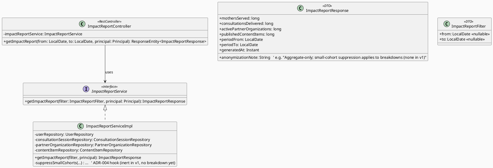
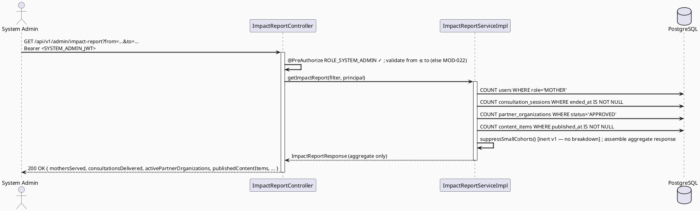

# ENGINEERING DOCUMENTATION STANDARD (EDS) v2.0
# Technical Design Specification — UC-113: View Impact Report

| Field              | Value                                   |
| ------------------ | ---------------------------------------- |
| **Document ID**    | `CB-MOD-IMP-007`                        |
| **Version**        | `1.0`                                   |
| **Date**           | `2026-07-01`                            |
| **Status**         | `Draft`                                 |
| **Document Owner** | `HuyND`                                 |
| **Author**         | `AI Agent — Winston (System Architect)` |
| **Reviewed by**    | `[ ] Pending`                           |
| **DPO Sign-off**   | `[ ] Pending` *(impact metrics intended for external sharing — anonymization/k-anonymity is CENTRAL here, see ADR-004; DPO review REQUIRED before any external use)* |
| **Approved by**    | `[ ] Pending`                           |
| **Last Review**    | `2026-07-01`                            |
| **Based on EDS**   | `v2.0`                                  |

---

## CHANGELOG

| Ngày       | Người thực hiện    | Nội dung thay đổi                                                                   |
| ---------- | ------------------- | ------------------------------------------------------------------------------------ |
| 2026-07-01 | AI Agent — Winston  | Tạo tài liệu lần đầu — TDS cho UC-113 View Impact Report (Status=Draft)              |

---

## MỤC LỤC

1. [Tổng quan Module](#1-tổng-quan-module)
2. [Ma trận Truy vết](#2-ma-trận-truy-vết)
3. [Architecture Decision Records (ADR)](#3-architecture-decision-records-adr)
4. [Non-Functional Requirements & SLA](#4-non-functional-requirements--sla)
5. [Static Modeling](#5-static-modeling)
6. [Dynamic Modeling](#6-dynamic-modeling)
7. [Domain Event Catalog](#7-domain-event-catalog)
8. [Interface Specification](#8-interface-specification)
9. [API Specification](#9-api-specification)
10. [Bảng mã lỗi](#10-bảng-mã-lỗi)
11. [Quy trình Triển khai](#11-quy-trình-triển-khai)
12. [Rollback & Incident Runbook](#12-rollback--incident-runbook)
13. [Kịch bản Kiểm thử Chi tiết](#13-kịch-bản-kiểm-thử-chi-tiết)
14. [Phương pháp Xác minh](#14-phương-pháp-xác-minh)
15. [API Verification Samples](#15-api-verification-samples)
16. [Authorization Matrix](#16-authorization-matrix)
17. [AI Prompt Constraints (CASE 2.0)](#17-ai-prompt-constraints-case-20)

---

## 1. Tổng quan Module

| Field                     | Value                                                                                                                                  |
| ------------------------- | --------------------------------------------------------------------------------------------------------------------------------------- |
| **UC ID**                 | `UC-113`                                                                                                                                |
| **FS Reference**          | `3.2.2.15 View Impact Report` (`02_Requirements/SRS/3_Functional_Specification.md`)                                                    |
| **Module Name**           | `View Impact Report`                                                                                                                   |
| **Bounded Context**       | `content` (admin read-side, base path `/api/v1/admin`). Aggregation reads cross into `security` (users), `consultation` (consultation_sessions), `partner` (partner_organizations), `content` (content_items) — read-only. |
| **Primary Actor**         | `System Admin (ROLE_SYSTEM_ADMIN)` (per FS Primary Actor)                                                                              |
| **Platform**              | `Admin Web Portal`                                                                                                                      |
| **Priority**              | `Medium` (per FS)                                                                                                                       |
| **Frequency of Use**      | `Low` (periodic reporting — fundraising/CSR cycles)                                                                                    |
| **Data Classification**   | `Internal → potentially External` — metrics are INTENDED to be shared externally (fundraising/CSR/partners), which raises the anonymization bar (ADR-004) |
| **Compliance Scope**      | `PDPA / Luật 91/2025` — anonymized, aggregated impact metrics; **no row-level PII, and cohort counts below a minimum threshold must be suppressed to prevent re-identification** (ADR-004) |
| **Upstream Dependencies** | `security (users — mothers served)`, `consultation (consultation_sessions — consultations delivered)`, `partner (partner_organizations — active partners)`, `content (content_items — content reach)` |
| **Downstream Consumers**  | Admin Web Portal impact-report UI; exported/shared externally (out of scope to build export here — this UC returns the JSON metrics only) |

**Mô tả:**
UC-113 trả về một endpoint **read-only** các chỉ số **tác động (impact) đã tổng hợp và ẩn danh** phục vụ gây quỹ (fundraising), CSR, hoặc đối tác: số bà mẹ được phục vụ, số buổi tư vấn đã hoàn tất, số tổ chức đối tác đang hoạt động, và độ phủ nội dung (content reach). Khác biệt cốt lõi so với UC-111 (Community Dashboard, nội bộ): các chỉ số UC-113 **được thiết kế để chia sẻ ra ngoài**, nên **ẩn danh hóa là yêu cầu trung tâm**, không phải phụ trợ.

**Cảnh báo grounding (quan trọng):** FS mô tả UC-113 rất mơ hồ ("aggregated and anonymized impact metrics for fundraising, CSR, or partners"). Theo dossier, chỉ những metric có cột schema hậu thuẫn mới được implement; mọi ngưỡng/định nghĩa không có nguồn PHẢI đánh dấu `Open`, KHÔNG bịa. Danh sách metric chốt (§5.2) chỉ gồm những gì tra được từ schema thực.

**Phạm vi rõ ràng (out of scope):**
- KHÔNG ghi/mutate bảng nào — thuần đọc.
- KHÔNG row-level PII; **thêm nữa**, cohort dưới ngưỡng tối thiểu (k-anonymity) PHẢI bị suppress (ADR-004). Con số ngưỡng chính xác = `Open` (không có nguồn → không bịa "k=5"), nhưng **cơ chế suppression là ràng buộc thiết kế cứng**.
- KHÔNG xuất file (PDF/CSV export) — chỉ trả JSON metrics. Export là follow-up UC.

---

## 2. Ma trận Truy vết

| Requirement ID | Loại          | Mô tả yêu cầu                                                                          | Thành phần Code                              | Compliance Target | ADR liên quan |
| --------------- | -------------- | ---------------------------------------------------------------------------------------- | ---------------------------------------------- | ------------------- | --------------- |
| UC-113          | Use Case      | System Admin views anonymized impact metrics                                             | `ImpactReportController.getImpactReport()`      | —                  | ADR-002         |
| FS-3.2.2.15     | Functional    | "aggregated and anonymized impact metrics for fundraising, CSR, or partners"             | `ImpactReportServiceImpl.getImpactReport()`     | PDPA               | ADR-001, ADR-004 |
| BR-RBAC-001     | Business Rule | Chỉ SYSTEM_ADMIN được gọi endpoint này                                                    | `@PreAuthorize("hasRole('SYSTEM_ADMIN')")`      | —                  | ADR-002         |
| BR-PRIVACY-001  | Business Rule | Response ẩn danh: không row-level PII                                                     | `ImpactReportResponse` DTO                      | PDPA               | ADR-004         |
| BR-PRIVACY-002  | Business Rule | Cohort dưới ngưỡng tối thiểu PHẢI bị suppress (chống re-identification)                    | `ImpactReportServiceImpl` suppression logic     | PDPA               | ADR-004 (threshold `Open`) |
| BR-METRIC-001   | Business Rule | Mọi metric map 1:1 với một cột schema tồn tại                                             | Aggregation queries (§5.2)                       | —                  | ADR-001         |

> **Note (FS boilerplate caveat):** Ngoài một dòng mô tả, FS prose cho UC-113 là boilerplate generic —
> KHÔNG phải oracle. Oracle thật là cột schema (§5.2) + nguyên tắc PDPA trong CLAUDE.md.

---

## 3. Architecture Decision Records (ADR)

### ADR-001 — Metric Grounding: Chỉ implement metric có cột schema hậu thuẫn

| Field          | Value                      |
| -------------- | --------------------------- |
| **Status**     | `Accepted`                 |
| **Deciders**   | `HuyND — System Architect` |
| **Date**       | `2026-07-01`                |

#### Bối cảnh
FS cực kỳ mơ hồ. Nguy cơ cao nhất là bịa các chỉ số impact nghe hay ("lives improved", "health outcomes") không có bất kỳ cột hậu thuẫn nào.

#### Quyết định
Chỉ 4 nhóm metric có cột thực được implement (§5.2):
- **Mothers served** → `users WHERE role='MOTHER'` (count) — có thể refine bằng `mother_journeys` nếu muốn "active mothers", đánh dấu lựa chọn.
- **Consultations delivered** → `consultation_sessions WHERE ended_at IS NOT NULL` (hoàn tất). Giá trị `session_status` chính xác cho "completed" (ví dụ `ENDED`/`COMPLETED`) = `Open` — dùng `ended_at IS NOT NULL` làm oracle chính, xác nhận enum value khi implement.
- **Active partner organizations** → `partner_organizations WHERE status='APPROVED'` (count).
- **Content reach** → `content_items WHERE published_at IS NOT NULL` (hoặc `status` published-value) — số nội dung đã xuất bản. "Reach" theo nghĩa lượt xem KHÔNG có cột hậu thuẫn (không có view-count column trên content_items) → chỉ đếm số nội dung published, KHÔNG bịa "impressions/views".

Mọi metric khác reviewer muốn = `Open`, không implement.

#### Hệ quả
**Tích cực:** Không metric ma; mỗi số kiểm chứng được.
**Tiêu cực:** "Impact" bị giới hạn ở đếm được, không đo được outcome chất lượng — trung thực hơn là bịa.

---

### ADR-002 — RBAC: SYSTEM_ADMIN only

| Field        | Value                      |
| ------------ | --------------------------- |
| **Status**   | `Accepted`                 |
| **Deciders** | `HuyND — System Architect` |
| **Date**     | `2026-07-01`                |

#### Quyết định
`@PreAuthorize("hasRole('SYSTEM_ADMIN')")` trên `getImpactReport()`. FS Primary Actor = System Admin. Không có `RoleHierarchy` bean (xác nhận, cùng finding UC-100/102/111) → không kế thừa ngầm. `SecurityConfig`:
```java
.requestMatchers(HttpMethod.GET, "/api/v1/admin/impact-report").hasRole("SYSTEM_ADMIN")
```

#### Hệ quả
Least-privilege; nhất quán admin pattern.

---

### ADR-003 — Live Aggregation, No Summary Table (v1)

| Field        | Value                      |
| ------------ | --------------------------- |
| **Status**   | `Accepted`                 |
| **Deciders** | `HuyND — System Architect` |
| **Date**     | `2026-07-01`                |

#### Quyết định
Live aggregation queries mỗi request (Frequency = Low). Không bảng summary → **không migration**. Nếu cần snapshot lịch sử (impact theo quý cho báo cáo cố định), đó là follow-up ADR — v1 chỉ trả số real-time.

#### Hệ quả
**Tích cực:** Không schema delta, không job.
**Tiêu cực:** Không có snapshot lịch sử bất biến; nếu fundraising cần "số liệu tại thời điểm X" cố định, cần enhancement (đánh dấu `Open`).

---

### ADR-004 — Anonymization is Central: No Row-Level PII + Small-Cohort Suppression (threshold `Open`)

| Field          | Value                      |
| -------------- | --------------------------- |
| **Status**     | `Accepted (mechanism) / Open (exact threshold number)` |
| **Deciders**   | `HuyND — System Architect` |
| **Date**       | `2026-07-01`                |

#### Bối cảnh
UC-113 metrics được **chia sẻ ra ngoài** (fundraising/CSR/partners). Khác UC-111 (nội bộ), rủi ro re-identification cao hơn: một cohort rất nhỏ (ví dụ "1 bà mẹ ở tỉnh X dùng dịch vụ Y") có thể định danh được cá nhân dù không có tên. CLAUDE.md yêu cầu tuân thủ PDPA/Luật 91/2025. Không có nguồn nào quy định con số k-anonymity cụ thể.

#### Quyết định
Hai ràng buộc:
1. **(Cứng, Accepted)** Response DTO chỉ chứa aggregate — không entity, không tên/email/id cá nhân. Đây là ràng buộc thiết kế cứng, suy ra trực tiếp từ "never expose JPA entities" + PDPA.
2. **(Cơ chế Accepted, con số Open)** Bất kỳ metric nào được **phân rã theo chiều** (breakdown, ví dụ theo tỉnh/thành, theo loại đối tác) mà cohort < ngưỡng tối thiểu `k` PHẢI bị **suppress** (trả về `null`/`"<k"` thay vì số thật). Con số `k` chính xác = `Open` (KHÔNG bịa "k=5") — cần DPO/Product quyết định. Ở v1, nếu chưa có breakdown theo chiều nhạy cảm nào (chỉ trả tổng toàn hệ thống), suppression chưa kích hoạt, NHƯNG cơ chế + điểm inject PHẢI có sẵn để khi thêm breakdown thì tự động áp dụng.

> **Quan trọng:** Nếu v1 chỉ trả các tổng số toàn hệ thống (mothers served tổng, consultations tổng, v.v.) không phân rã, thì cohort luôn là toàn bộ (lớn) → suppression không đổi kết quả. Suppression trở nên **bắt buộc kích hoạt** ngay khi thêm bất kỳ breakdown theo chiều nào (region/partner/stage). TDS này giữ v1 ở mức tổng-toàn-hệ-thống để tránh phải chốt `k` khi chưa có nguồn — mọi breakdown là follow-up cần `k` được DPO duyệt trước.

#### Hệ quả
**Tích cực:** An toàn re-identification theo thiết kế; ngưỡng chưa chốt không chặn v1 vì v1 không phân rã.
**Tiêu cực:** Không drill-down theo vùng/đối tác ở v1 (đúng chủ đích cho tới khi `k` được duyệt).

**Compliance Impact:** DPO sign-off **bắt buộc** trước khi số liệu được dùng ra ngoài.

---

## 4. Non-Functional Requirements & SLA

### 4.1. Performance & Availability

| Category     | Requirement                 | Target SLA  | Measurement Method | Compliance Basis |
| ------------ | ---------------------------- | ----------- | -------------------- | ------------------- |
| Latency      | API response (p99), `GET /impact-report` | `Open` — no sourced SLA; low frequency, live aggregation acceptable | k6 load test | — |
| Availability | Uptime (monthly)             | `Open` — reuse `99.5%` baseline | Uptime monitor | — |

### 4.2. Data Integrity & Privacy

| Category   | Requirement                                                              | Target                | Verification Method | Compliance Basis |
| ---------- | ------------------------------------------------------------------------- | ------------------------ | ---------------------- | ------------------- |
| Read-only  | Endpoint never mutates any table                                        | 0 write ops               | Code review + `pg_stat_user_tables` | — |
| No PII     | Response contains no row-level personal data                            | 100%                      | DTO review + integration assertion | PDPA / ADR-004 |
| Suppression mechanism | Small-cohort suppression hook present (even if inert in v1) | Present                   | Code review           | PDPA / ADR-004 |
| Metric grounding | Every field maps to a real column                                 | 100%                      | Traceability (§5.2)    | ADR-001 |

### 4.3. Security

| Category        | Requirement                                                  | Target          | Verification Method | Compliance Basis |
| ---------------- | --------------------------------------------------------------- | ------------------ | ----------------------- | ------------------- |
| Access control   | SYSTEM_ADMIN only (no implicit hierarchy)                     | Least privilege     | Auth Matrix (§16)        | ADR-002 |
| Input validation | Optional date-range params validated (from ≤ to)             | 100% reject invalid | Unit + integration test | §10 (MOD-022) |

### 4.4. Scalability

`Open` — low frequency, internal admin/reporting. Live aggregation acceptable; ADR-003 notes snapshot path if needed.

---

## 5. Static Modeling

### 5.1. Class Diagram (PlantUML)



### 5.2. Data Structure — Metric-to-Column Mapping (NO schema delta)

> **No migration required.** Pure read-only aggregation over existing tables.

| Metric (response field)          | Source table.column                                                       | Aggregation |
| --------------------------------- | -------------------------------------------------------------------------- | ------------- |
| `mothersServed`                  | `users.role`                                                              | `COUNT(*) WHERE role='MOTHER'` (optionally `AND created_at <= to`) |
| `consultationsDelivered`         | `consultation_sessions.ended_at` (`session_status` exact "completed" value `Open`) | `COUNT(*) WHERE ended_at IS NOT NULL` (+ optional period on `ended_at`) |
| `activePartnerOrganizations`     | `partner_organizations.status`                                            | `COUNT(*) WHERE status='APPROVED'` |
| `publishedContentItems`          | `content_items.published_at` (or `status` published-value)                | `COUNT(*) WHERE published_at IS NOT NULL` (+ optional period) |

> **NOT implemented (no backing column — do NOT invent):** content "views/impressions/reach-as-eyeballs"
> (no view-count column on `content_items`); "health outcomes"/"lives improved" (no such data); per-region
> breakdown (would trigger ADR-004 `k`-suppression which is `Open`). All flagged `Open`.

---

## 6. Dynamic Modeling

### 6.1. Sequence Diagram — Happy Path



### 6.2. Error Path (non-SYSTEM_ADMIN)

Same as UC-111 §6.2 — `@PreAuthorize` fail → 403 `{ "error": { "code": "ACCESS_DENIED" } }` (verified real code path).

### 6.3. Invariants
- Read-only; response is a pure function of DB state.
- v1 returns system-wide totals only (no dimensional breakdown) → cohort is always the full population → ADR-004 suppression is present but inert until a breakdown is added.

---

## 7. Domain Event Catalog

| Event Name | Trigger | Publisher | Subscriber | Payload | Async? |
| ----------- | -------- | ---------- | ----------- | -------- | ------- |
| (none)     | —        | —          | —           | —        | —       |

> **N/A** — read-only endpoint, no domain events.

---

## 8. Interface Specification

### 8.1. Service Interface

```java
// com.carebridge.backend.content.service.ImpactReportService
package com.carebridge.backend.content.service;

public interface ImpactReportService {
    /**
     * Returns anonymized, aggregate impact metrics for the given (optional) window.
     * Read-only; response contains no row-level PII (ADR-004). v1 returns system-wide totals only.
     * @throws ImpactReportException (MOD-022) if from/to range invalid (from after to)
     */
    ImpactReportResponse getImpactReport(ImpactReportFilter filter, Principal principal);
}
```

### 8.2. Repository Interfaces

```java
// Read-only aggregate count methods added to existing repositories (additive):
//   UserRepository                    — countByRole('MOTHER')
//   ConsultationSessionRepository     — countByEndedAtNotNull (+ period)   [verify repo exists; if not, add read-only repo for consultation_sessions]
//   PartnerOrganizationRepository     — countByStatus('APPROVED')
//   ContentItemRepository             — countByPublishedAtNotNull (+ period) [verify repo exists]
// If a repository for consultation_sessions / content_items does not yet exist, add a minimal read-only
// one (interface + count method only) — document as a new-but-thin repository in §11, not a schema change.
```

### 8.3. DTO Definitions (aggregate-only — ADR-004)

```java
public record ImpactReportResponse(
        long mothersServed,
        long consultationsDelivered,
        long activePartnerOrganizations,
        long publishedContentItems,
        LocalDate periodFrom,
        LocalDate periodTo,
        Instant generatedAt,
        String anonymizationNote
) {}

public record ImpactReportFilter(LocalDate from, LocalDate to) {}   // both nullable; defaults Open
```

---

## 9. API Specification

### 9.1. Endpoints Table

| Method | Path                                     | Auth Level | Required Roles     | Rate Limit | Idempotent? |
| ------ | ------------------------------------------ | ------------ | --------------------- | ------------ | -------------- |
| `GET`  | `/api/v1/admin/impact-report`              | JWT Bearer   | `ROLE_SYSTEM_ADMIN`   | `Open`       | Yes (read-only) |

### 9.2. Response Schema (200 OK)

```json
{
  "mothersServed": 900,
  "consultationsDelivered": 1450,
  "activePartnerOrganizations": 28,
  "publishedContentItems": 340,
  "periodFrom": "2026-01-01",
  "periodTo": "2026-06-30",
  "generatedAt": "2026-07-01T10:15:00Z",
  "anonymizationNote": "Aggregate-only, no personal data. Small-cohort suppression applies to any dimensional breakdown (none in v1)."
}
```

**Response — 400 (invalid range — MOD-022):**
```json
{ "error": { "code": "MOD-022", "message": "Invalid date range: 'from' must not be after 'to'" } }
```

**401:** empty body (verified). **403:** `{ "error": { "code": "ACCESS_DENIED", "message": "Insufficient permissions" } }`.

---

## 10. Bảng mã lỗi

| Code         | HTTP Status | Message (EN)                            | Trigger Condition                        | Status in code |
| ------------- | ------------- | ------------------------------------------ | ------------------------------------------- | ----------------- |
| `MOD-022`    | 400           | Invalid date range (from after to)         | `from` and `to` present and `from > to`     | **New — to implement** |
| `ACCESS_DENIED` | 403        | Insufficient permissions                    | Non-SYSTEM_ADMIN calls endpoint (verified)  | Reused |
| *(none — empty body)* | 401  | —                                          | Missing/invalid JWT (verified)              | Framework default |
| `INTERNAL_ERROR` | 500       | An unexpected error occurred                | Unhandled exception — `handleGeneric()`     | Reused |

> **Numbering:** UC-111 claimed `MOD-021`; UC-113 claims **`MOD-022`**. Consistency Gate must confirm no
> collision across the batch (UC-100 `007-010`, UC-101 `011-013`, UC-102 `015-020`, UC-111 `021`, UC-113 `022`).

---

## 11. Quy trình Triển khai

### 11.1. Prerequisites
- [ ] ADR-001..ADR-004 reviewed; **DPO sign-off on ADR-004 (anonymization) REQUIRED before external use**
- [ ] `Open` items acknowledged: exact `session_status` "completed" value, k-anonymity threshold, default window, SLA
- [x] `@EnableMethodSecurity` enabled (inherited)
- [ ] No migration needed — confirm

### 11.2. Pre-Migration Checklist
- [ ] **Không cần migration** — pure read. CG-9: no schema delta.
- [ ] Confirm read-only repositories exist for `consultation_sessions` and `content_items`; if not, add minimal read-only repos (no schema change).

### 11.3. Implementation Steps
```
1. DTOs: ImpactReportResponse, ImpactReportFilter (§8.3)
2. Read-only repo count methods (§5.2); add thin read-only repos for consultation_sessions/content_items if missing
3. ImpactReportService interface + Impl (assemble; suppressSmallCohorts() hook present but inert in v1)
4. ImpactReportController.getImpactReport() @PreAuthorize("hasRole('SYSTEM_ADMIN')") + @Valid range
5. ImpactReportException.invalidDateRange() → MOD-022
6. SecurityConfig: .requestMatchers(GET, "/api/v1/admin/impact-report").hasRole("SYSTEM_ADMIN")
```

### 11.4. Deployment Checklist
- [ ] Health check 200
- [ ] Returns 200 for SYSTEM_ADMIN, 403 for others
- [ ] **No PII in response** (manual review of live response) — CRITICAL, external-facing metrics
- [ ] `anonymizationNote` present and accurate

---

## 12. Rollback & Incident Runbook

### 12.1. Triggers
| Điều kiện | Ngưỡng | Người quyết định |
| ------------ | --------- | ------------------- |
| Rò rỉ PII / cohort quá nhỏ lộ ra ngoài | Bất kỳ case nào | Tech Lead + DPO (CRITICAL — PDPA, external exposure) |
| 403 sai cho SYSTEM_ADMIN | Bất kỳ case nào | Tech Lead |
| Query gây tải DB cao | > threshold (Open) | On-call |

### 12.2. Procedure
```bash
kubectl rollout undo deployment/carebridge-api    # read-only — safe to revert
kubectl rollout status deployment/carebridge-api
# No migration to revert.
curl -X GET https://api.carebridge.vn/actuator/health
```

---

## 13. Kịch bản Kiểm thử Chi tiết

> Chi tiết trong `UC113_ViewImpactReport_Test-Spec.md` (`CB-MOD-TEST-007`). Nhóm scenario:

### 13.1. Unit / Service
- Happy path: 4 metrics assembled từ mocked counts
- Empty DB → all 0, no crash, `anonymizationNote` present
- Invalid range → MOD-022
- Suppression hook present (v1 inert — assert response has no breakdown field; hook wired for future)

### 13.2. Integration
- Full GET flow (Testcontainers): seed mothers/consultations/partners/content → counts khớp direct SQL
- **PDPA gate:** response contains NO row-level PII (assert DTO shape)

### 13.3. Security
- Non-SYSTEM_ADMIN → 403 ACCESS_DENIED; MODERATOR → 403; No JWT → 401 bodiless

---

## 14. Phương pháp Xác minh

### 14.1. Database Inspection
```sql
SELECT COUNT(*) FROM users WHERE role='MOTHER';
SELECT COUNT(*) FROM consultation_sessions WHERE ended_at IS NOT NULL;
SELECT COUNT(*) FROM partner_organizations WHERE status='APPROVED';
SELECT COUNT(*) FROM content_items WHERE published_at IS NOT NULL;
-- Read-only check
SELECT n_tup_ins, n_tup_upd, n_tup_del FROM pg_stat_user_tables WHERE relname IN
  ('users','consultation_sessions','partner_organizations','content_items');  -- unchanged after a call
```

---

## 15. API Verification Samples

```bash
export ADMIN_TOKEN="eyJ..."
curl -X GET "https://api.carebridge.vn/api/v1/admin/impact-report?from=2026-01-01&to=2026-06-30" \
  -H "Authorization: Bearer $ADMIN_TOKEN"
# Expected: 200 aggregate JSON (§9.2)

curl -X GET "https://api.carebridge.vn/api/v1/admin/impact-report" -H "Authorization: Bearer $MODERATOR_TOKEN"
# Expected: 403 ACCESS_DENIED
```

---

## 16. Authorization Matrix

| Endpoint                                | `MOTHER` | `FAMILY` | `EXPERT` | `MODERATOR` | `CONTENT_ADMIN` | `PARTNER` | `SYSTEM_ADMIN` |
| ------------------------------------------ | ---------- | ---------- | ---------- | -------------- | ------------------ | ----------- | ----------------- |
| `GET /api/v1/admin/impact-report`         | ❌        | ❌        | ❌        | ❌             | ❌                  | ❌ *(note)* | ✅                |

**Chú thích:**
- ✅ = Được phép, ❌ = 403 `ACCESS_DENIED`
- **PARTNER = ❌:** Dù metrics "for partners", đây là báo cáo toàn hệ thống do System Admin xem/chia sẻ, KHÔNG phải self-service cho partner. Một partner-facing performance view riêng là UC-122 (View Partner Performance) — khác endpoint, khác scope. Không có `RoleHierarchy` → không kế thừa ngầm.

---

## 17. AI Prompt Constraints (CASE 2.0)

### 17.1 Constraint Summary Table

| #   | Constraint                                                                                  | Source (ADR/BR)  | Last Verified |
| --- | ------------------------------------------------------------------------------------------- | ------------------ | --------------- |
| C1  | Controller PHẢI `@PreAuthorize("hasRole('SYSTEM_ADMIN')")` — không business logic           | `ADR-002`           | `2026-07-01`     |
| C2  | Read-only — KHÔNG mutate bảng nào                                                            | `§4.2`              | `2026-07-01`     |
| C3  | Response CHỈ aggregate — KHÔNG entity, KHÔNG row-level PII                                    | `ADR-004`           | `2026-07-01`     |
| C4  | Small-cohort suppression hook PHẢI có mặt (dù inert ở v1); breakdown theo chiều = follow-up cần `k` duyệt | `ADR-004`   | `2026-07-01`     |
| C5  | Mọi metric PHẢI map tới cột §5.2 — KHÔNG bịa metric (views/outcomes)                          | `ADR-001`           | `2026-07-01`     |
| C6  | Invalid range (from > to) → `MOD-022`                                                        | `§10`               | `2026-07-01`     |

### 17.2 Constraint Injection Block

```
[CONSTRAINT BLOCK — Module: View Impact Report (UC-113)]
Theo TDS CB-MOD-IMP-007:
1. [C1] Controller getImpactReport() PHẢI @PreAuthorize("hasRole('SYSTEM_ADMIN')"), chỉ @Valid + delegate.
2. [C2] TUYỆT ĐỐI read-only.
3. [C3] Response chỉ số tổng hợp; KHÔNG field entity/tên/email/id cá nhân — đây là số liệu CHIA SẺ RA NGOÀI.
4. [C4] PHẢI có hook suppressSmallCohorts() (inert v1). KHÔNG thêm breakdown theo vùng/đối tác khi chưa có
   ngưỡng k được DPO duyệt (đừng bịa k=5).
5. [C5] 4 metric = mothersServed/consultationsDelivered/activePartnerOrganizations/publishedContentItems,
   mỗi cái map cột §5.2. KHÔNG bịa "views"/"health outcomes".
6. [C6] from > to → MOD-022.

[CONTEXT BLOCK]
- Bounded Context: content (read-side), reads users/consultation_sessions/partner_organizations/content_items
- Data Classification: Internal→External; Compliance: PDPA (anonymization CENTRAL, DPO sign-off required)
- Interfaces: §8; Error codes: §10 (MOD-022 new); Auth matrix: §16
- Schema delta: NONE

[TASK BLOCK]
Implement ImpactReportController.getImpactReport(), ImpactReportServiceImpl (with inert suppression hook),
DTOs (§8.3), read-only repo count methods (§5.2), MOD-022 factory — thỏa mãn C1-C6.
Tests cover §13 (chi tiết trong Test-Spec CB-MOD-TEST-007).
```

### 17.3 Constraint Quality Checklist
- [x] Mỗi constraint traceable về ADR/§
- [x] Không có constraint generic
- [x] Mỗi constraint có `Last Verified`
- [x] Constraint block reference §8 và §16

### 17.4 Anti-Pattern Detection

| AP-ID     | Anti-Pattern          | Dấu hiệu                                                        | Hành động                |
| --------- | ---------------------- | ------------------------------------------------------------------- | --------------------------- |
| AP-AI-001 | Unconstrained Gen     | Bỏ RBAC hoặc trả nhiều hơn aggregate                               | Reject — inject C1/C3 |
| AP-AI-002 | PII / Re-ID Leak      | Response có row-level PII HOẶC breakdown cohort nhỏ không suppress  | Reject — CHÍNH XÁC rủi ro ADR-004, BLOCKING (external exposure) |
| AP-AI-003 | Hallucinated Metric   | Field "views"/"impressions"/"outcomes" không có cột (§5.2)         | Reject — xóa/mark Open |
| AP-AI-004 | Layer Violation       | Controller query DB trực tiếp                                     | Reject |
| AP-AI-005 | Hidden Write          | Endpoint "read" nhưng ghi DB                                      | Reject — vi phạm C2 |

**Kết quả review:**
- [x] Không phát hiện anti-pattern nào trong bản thân spec này → approved-for-RED-phase

---

## PHỤ LỤC

### A. Glossary
| Thuật ngữ | Định nghĩa |
| ------------ | ------------- |
| Small-Cohort Suppression | Ẩn/che số liệu của một nhóm quá nhỏ (dưới ngưỡng k) để chống re-identification |
| k-anonymity | Ngưỡng tối thiểu số cá thể trong một cohort trước khi số liệu được công bố (con số `k` = Open) |
| Content Reach (v1) | Số nội dung đã published (`content_items.published_at`), KHÔNG phải lượt xem (không có cột view-count) |

### B. Tài liệu tham chiếu
| Document | Path |
| ------------ | ------- |
| SRS 3.2.2.15 | `02_Requirements/SRS/3_Functional_Specification.md` |
| Schema (users/consultation_sessions/partner_organizations/content_items) | `05_Development/CareBridgeAPI/src/main/resources/db/migration/V1__init_schema.sql` |
| UC-111 Community Dashboard TDS (sibling read-only pattern) | `04_Implement/UC111_ViewCommunityDashboard/UC111_ViewCommunityDashboard_TDS.md` |
| CLAUDE.md — PDPA / Luật 91/2025 | `CLAUDE.md §5` |

---

*EDS v2.1 — Read-only anonymized impact metrics; no schema delta. Status: Draft — chờ review + **DPO sign-off
bắt buộc trên ADR-004 (anonymization)** trước khi số liệu dùng ra ngoài. `Open`: exact `session_status`
completed-value, k-anonymity threshold, default window, SLA.*
