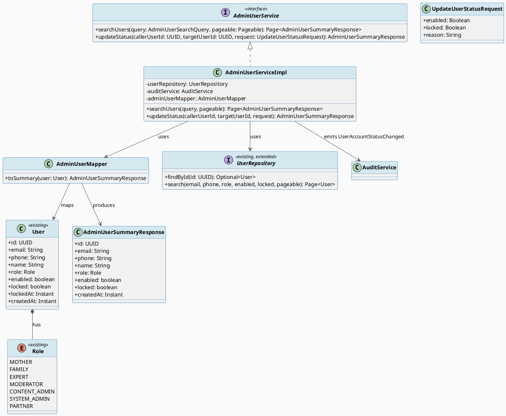
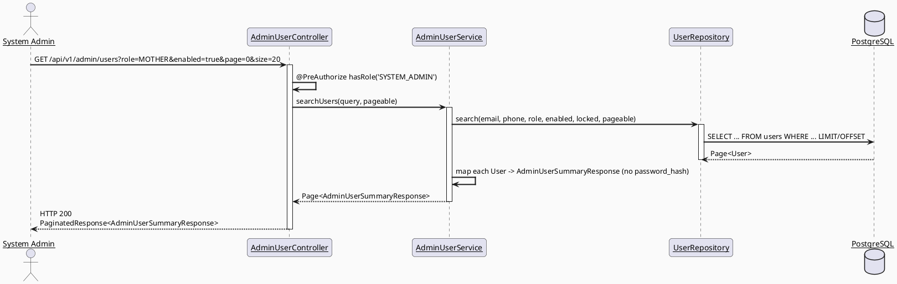
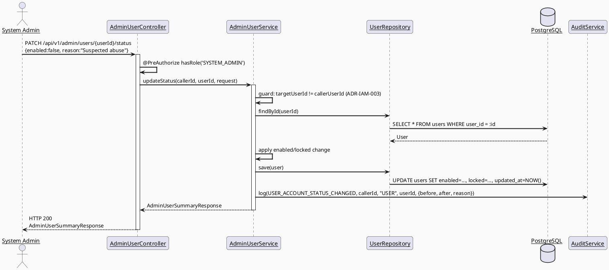
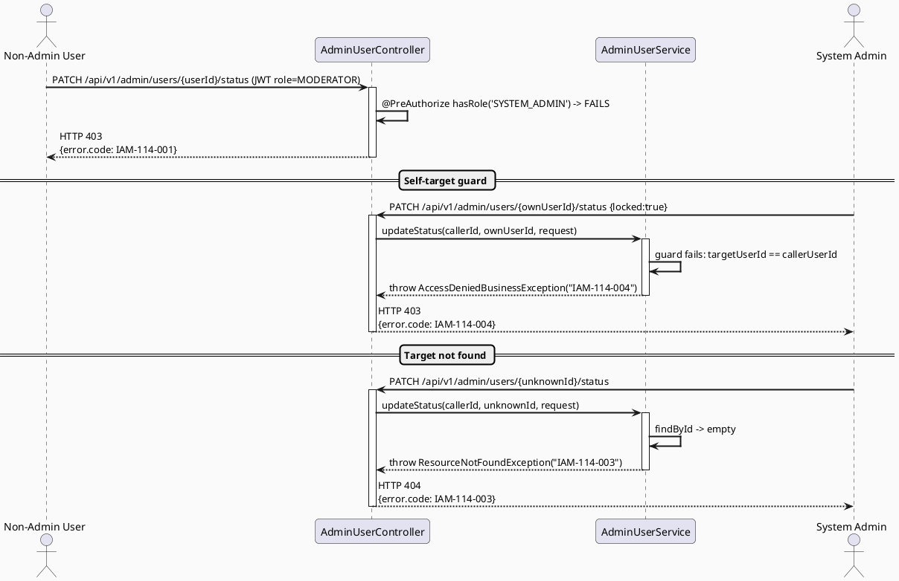
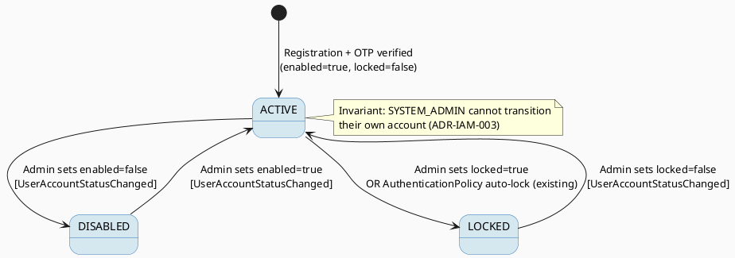

# ENGINEERING DOCUMENTATION STANDARD (EDS) v2.0
# UC114 — Manage User Accounts — Technical Design Specification

| Field | Value |
|-------|-------|
| **Document ID** | `CB-IDENTITY-IMP-114` |
| **Version** | `1.0` |
| **Date** | `2026-07-02` |
| **Status** | `Draft` |
| **Document Owner** | `TV1-Phương` |
| **Author** | `AI Agent (Technical Architect)` |
| **Reviewed by** | `[Tech Lead — Pending]` |
| **DPO Sign-off** | `[ ] Pending` *(module lists/searches/filters PII fields — email, phone, full name — of every platform user; bulk read access requires DPO review before production)* |
| **Approved by** | `[Principal Architect — Pending]` |
| **Last Review** | `2026-07-02` |
| **Based on EDS** | `v2.0` |

---

## CHANGELOG

| Ngày | Người thực hiện | Nội dung thay đổi |
|------|-----------------|-------------------|
| 2026-07-02 | AI Agent — Technical Architect | Tạo tài liệu lần đầu (Draft) cho UC114 |

---

## MỤC LỤC

1. [Tổng quan Module](#1-tổng-quan-module)
2. [Ma trận Truy vết](#2-ma-trận-truy-vết-traceability-matrix)
3. [Architecture Decision Records (ADR)](#3-architecture-decision-records-adr)
4. [Non-Functional Requirements & SLA](#4-non-functional-requirements--sla)
5. [Static Modeling](#5-static-modeling-mô-hình-tĩnh)
6. [Dynamic Modeling](#6-dynamic-modeling-mô-hình-động)
7. [Domain Event Catalog](#7-domain-event-catalog)
8. [Interface Specification](#8-interface-specification-đặc-tả-giao-diện)
9. [API Specification](#9-api-specification)
10. [Bảng mã lỗi](#10-bảng-mã-lỗi-error-codes)
11. [Quy trình Triển khai](#11-quy-trình-triển-khai-step-by-step)
12. [Rollback & Incident Runbook](#12-rollback--incident-runbook)
13. [Kịch bản Kiểm thử Chi tiết](#13-kịch-bản-kiểm-thử-chi-tiết)
14. [Phương pháp Xác minh](#14-phương-pháp-xác-minh)
15. [Mẫu thử thực tế](#15-mẫu-thử-thực-tế-api-verification-samples)
16. [Bảng tổng hợp phân quyền](#16-bảng-tổng-hợp-phân-quyền-authorization-matrix)
17. [AI Prompt Constraints (CASE 2.0)](#17-ai-prompt-constraints-case-20)

---

## 1. Tổng quan Module

| Field | Value |
|-------|-------|
| **Module Name** | `Identity — Admin User Account Management` |
| **Bounded Context** | `Identity / Admin Governance` (new backend package `com.carebridge.backend.identity.admin`, sibling of existing `com.carebridge.backend.security` and `com.carebridge.backend.identity`) |
| **Function ID / UC** | `3.2.2.16 Manage User Accounts` / `UC-114` |
| **Primary Actor** | System Admin |
| **Secondary Actors** | None (SRS-confirmed) |
| **Platform** | Web — Admin Portal (React + TypeScript + Vite) |
| **Priority** | High |
| **Sprint / Owner** | Sprint 3 "Cross-Domain Integration" — TV1-Phương (confirmed in `function-spec-task-allocation.md` §Sprint 3 TV1 block) |
| **Data Classification** | `PII` (email, phone, full name of every platform user, exposed in bulk list/search view) |
| **Compliance Scope** | `PDPA (Luật 91/2025)`, `BR-RBAC` |
| **Upstream Dependencies** | `security` package (`User` entity, `UserRepository`, `Role` enum), `audit` package (`AuditService`, `AuditAction`) |
| **Downstream Consumers** | UC115 (Create Staff Account — reuses the same admin user list surface), UC116 (Update Role and Permission — acts on the account rows this UC displays), UC117 (View Audit Logs — reads the `AuditAction` events this UC emits) |

### 1.1 Scope Statement — Read/status-management surface over the existing `users` table

Repository inspection confirms **no admin-facing user list/search/status-management
endpoint currently exists**. The `security` package only exposes self-service
endpoints (`/api/v1/auth/**` — register, login, profile, own deactivate). The
`users` table (`V1__init_schema.sql` L532-544) and JPA entity
`security.entity.User` already carry every field this UC needs to display and
mutate: `email`, `phone`, `full_name` (mapped as `name`), `role`, `enabled`,
`locked`, `locked_at`, `created_at`. **No new table and no new column are
required** (see §5.2). This TDS designs a new **admin-only read + status-toggle
API** on top of the existing `users` table and the existing `AuditService`,
following the same `@PreAuthorize("hasRole('SYSTEM_ADMIN')")` pattern already
used by `AuditController` (`audit.controller.AuditController`, confirmed at
`GET /api/v1/admin/audit-logs`).

### 1.2 Source Conflict — `roles` / `user_roles` tables vs. active `users.role` column (Resolved)

`V1__init_schema.sql` header (L1-17) explicitly documents: *"users : enabled/
locked/role (not account_status/email_verified)"* and separately provisions a
`roles` table (L416-424) and a `user_roles` many-to-many join table (L497-507)
under **"PART 2: COMPLETE ERD BASELINE (46 NEW TABLES) ... No Java `@Entity`
mappings yet."** Repository-wide search confirms **zero** JPA entities, repositories,
or services reference `roles`/`user_roles` — the only active RBAC model in the
codebase is the single `Role` enum (`security.rbac.Role`) stored directly on
`users.role`. Per CLAUDE.md conflict-resolution priority ("current code and
tests as evidence of existing state" ranks above unmapped schema/ERD
provisions), **this TDS designs UC114 against the active `users.role` enum
column, not the dormant `roles`/`user_roles` tables.** This conflict recurs
identically in UC115/UC116 and is resolved the same way in all three documents
for naming consistency. Flagged for Principal Architect awareness — not
silently dropped.

### 1.3 "Manage ... Status" Scope — Resolved to enable/disable + lock/unlock only

SRS Description: *"Displays, searches, filters, and manages user account
status."* No SRS text defines what "manage status" mutations are permitted
beyond the generic exception template (E1-E3). The `users` table exposes
exactly two boolean status flags: `enabled` (soft account activation toggle,
already used by self-registration/OTP flow) and `locked` (already used by
`AuthenticationPolicy`/`AccountLockedException` for failed-login lockout).
**This TDS scopes "manage status" to admin-triggered enable/disable and
lock/unlock of these two existing flags** — no new status enum or workflow is
introduced. Hard delete of a `users` row is explicitly **out of scope** (no
SRS text authorizes destructive user deletion from this screen; `AccountDeletionRequest`
already exists as the user-initiated self-deletion flow and is not superseded here).

---

## 2. Ma trận Truy vết (Traceability Matrix)

| Requirement ID | Loại (BR/ADR/US) | Mô tả yêu cầu | Thành phần Code | Compliance Target | ADR liên quan |
|----------------|------------------|---------------|-----------------|-------------------|---------------|
| UC-114 (SRS §3.2.2.16) | Use Case | Displays, searches, filters, and manages user account status | `AdminUserController.GET /api/v1/admin/users`, `.PATCH /api/v1/admin/users/{userId}/status` | BR-RBAC | ADR-IAM-001 |
| BR-RBAC | Business Rule | Users may access only functions allowed by role/permission scope | `@PreAuthorize("hasRole('SYSTEM_ADMIN')")` on `AdminUserController` | Authorization | ADR-IAM-001 |
| POST-3 (SRS generic postcondition) | Postcondition | Sensitive actions are recorded for audit, safety, or privacy review where required | `AdminUserService` calls `AuditService.log(UserAccountStatusChanged, ...)` on every status mutation | PDPA audit trail | ADR-IAM-002 |
| Schema: `users` (`V1__init_schema.sql` L532-544) | Schema Contract | `enabled`, `locked`, `locked_at`, `role`, `email`, `phone`, `full_name`, `created_at` columns | `security.entity.User` (existing, reused) | — | — |
| Existing code reuse | Constraint | Reuse `security.entity.User`, `security.repository.UserRepository`, `security.rbac.Role`, `audit.service.AuditService` | `identity.admin.*` new package | — | ADR-IAM-001 |
| RG-4 self-protection | Non-negotiable constraint | Admin must not be able to lock/disable their own account via this screen (prevents accidental admin lockout) | `AdminUserService.updateStatus()` — guard `targetUserId != callerUserId` | Operational safety | ADR-IAM-003 |

---

## 3. Architecture Decision Records (ADR)

### ADR-IAM-001 — Admin user management extends the existing single-role `User` entity; no new `Role`/permission table

| Field | Value |
|-------|-------|
| **Status** | `Accepted` |
| **Deciders** | `AI Agent (Technical Architect)`, pending Principal Architect confirmation |
| **Date** | `2026-07-02` |

#### Bối cảnh (Context)
UC114 (and sibling UC115/UC116) need an admin-facing view over platform user
accounts. The schema physically contains `roles`/`user_roles` tables suggesting
a many-to-many RBAC model, but no code uses them (see §1.2).

#### Các phương án đã xem xét (Options Considered)

| Phương án | Mô tả | Ưu điểm | Nhược điểm |
|-----------|-------|----------|------------|
| A | Build new admin API against existing `users.role` enum column | Zero schema change; consistent with every other module already reading `User.role` | Cannot express multi-role-per-user in future without new ADR |
| B | Migrate live code to the dormant `roles`/`user_roles` tables now | "Matches" the ERD | Large blast-radius change affecting `security`, `identity`, `SecurityConfig`, every `@PreAuthorize` call site — explicitly forbidden by CLAUDE.md ("smallest scoped change... do not refactor unrelated code") and by the task-allocation note that `User`/`Role`/`SecurityConfig` changes require a small, reviewed PR, not a governance-feature side effect |

#### Quyết định (Decision)
Chọn **Phương án A**. UC114 reads/writes `users.role`, `users.enabled`,
`users.locked` exclusively. The `roles`/`user_roles` tables remain untouched,
schema-only provisions, exactly as they are today.

#### Hệ quả (Consequences)

**Tích cực:**
- No migration required for UC114.
- No risk to existing auth/session code paths.

**Tiêu cực / Trade-offs:**
- If CareBridge later needs multi-role-per-user or fine-grained permission
  flags, a dedicated ADR + migration project is required — out of scope here.

**Compliance Impact:**
- None — no schema change, no new PII field introduced.

---

### ADR-IAM-002 — Every account-status mutation is synchronously audited via existing `AuditService`

| Field | Value |
|-------|-------|
| **Status** | `Accepted` |
| **Deciders** | `AI Agent (Technical Architect)` |
| **Date** | `2026-07-02` |

#### Bối cảnh (Context)
SRS POST-3 requires sensitive actions to be recorded for audit/safety/privacy
review. `AuditService.log(...)` and `AuditAction` enum already exist and are
append-only (`AuditLog.rejectMutation()` throws on update/delete).

#### Quyết định (Decision)
`AdminUserService.updateStatus()` calls `AuditService.log(AuditAction.USER_ACCOUNT_STATUS_CHANGED, callerUserId, "USER", targetUserId, payload)`
inside the same transaction as the `users` row update, so the audit write and
the status mutation succeed or roll back together.

#### Hệ quả (Consequences)

**Tích cực:** Full traceability of every admin status change; feeds UC117 read path with zero extra work.

**Tiêu cực / Trade-offs:** Adds one new `AuditAction` enum value (`USER_ACCOUNT_STATUS_CHANGED`) — additive, non-breaking.

**Compliance Impact:** Satisfies PDPA accountability principle for admin actions on user PII records.

---

### ADR-IAM-003 — Self-protection guard: an admin cannot change their own account status from this screen

| Field | Value |
|-------|-------|
| **Status** | `Accepted` |
| **Deciders** | `AI Agent (Technical Architect)` |
| **Date** | `2026-07-02` |

#### Bối cảnh (Context)
No SRS text addresses this case directly (Open item — see RG-4 in handoff
report). Left unguarded, a SYSTEM_ADMIN could accidentally lock/disable their
own only-active admin session with no recovery path other than direct DB
access.

#### Các phương án đã xem xét (Options Considered)

| Phương án | Mô tả | Ưu điểm | Nhược điểm |
|-----------|-------|----------|------------|
| A | Reject self-targeting status changes with `IAM-114-004` | Prevents accidental admin lockout | Slightly reduces admin flexibility (must ask a peer admin) |
| B | Allow self-targeting, rely on manual DB fix if locked out | Full flexibility | Operational risk; no SRS text requires this flexibility |

#### Quyết định (Decision)
Chọn **Phương án A**. This is a defensive engineering decision, not an
invented business rule — it does not change any user-visible SRS behavior for
targets other than the caller.

#### Hệ quả (Consequences)
**Tích cực:** Eliminates a class of operational incidents.
**Tiêu cực / Trade-offs:** None significant.
**Compliance Impact:** None.

---

## 4. Non-Functional Requirements & SLA

### 4.1. Performance & Availability

| Category | Requirement | Target SLA | Measurement Method | Compliance Basis |
|----------|-------------|------------|---------------------|------------------|
| Latency | `GET /api/v1/admin/users` (paginated, filtered) | `< 500ms p99` | Manual timing / future k6 | — |
| Latency | `PATCH /api/v1/admin/users/{id}/status` | `< 300ms p99` | Manual timing | — |
| Availability | Admin portal user-management page | Best-effort (no SRS SLA specified) | — | `Open — no SRS SLA source` |

### 4.2. Data Integrity & Retention

| Category | Requirement | Target | Verification Method | Compliance Basis |
|----------|-------------|--------|---------------------|------------------|
| Consistency | Status mutation + audit log write | Same DB transaction (atomic) | `@Transactional` on `AdminUserServiceImpl.updateStatus()` | PDPA accountability |
| Retention | Audit trail retention | Inherits existing `audit_logs` retention policy (append-only, no TTL defined in schema) | DB inspection | — |

### 4.3. Security

| Category | Requirement | Target | Verification Method | Compliance Basis |
|----------|-------------|--------|---------------------|------------------|
| Access control | Role-based | `SYSTEM_ADMIN` only, enforced at controller via `@PreAuthorize` | §16 Authorization Matrix | BR-RBAC |
| PII exposure | List/search response never returns `password_hash` | DTO-only responses (`AdminUserSummaryResponse`), never raw `User` entity | Code review + MockMvc response-body assertion | PDPA |
| Self-protection | Admin cannot change own status | `AdminUserService.updateStatus()` guard | §13 Test scenarios | ADR-IAM-003 |

### 4.4. Scalability & Capacity Planning
No SRS-sourced load projection exists for admin user counts. Assume low
concurrent-admin usage (single-digit SYSTEM_ADMIN sessions); pagination via
existing `AppConstants.MAX_PAGE_SIZE = 100` caps per-page payload. `Open` — no
explicit 12-month growth figure sourced.

---

## 5. Static Modeling (Mô hình Tĩnh)

### 5.1. Class Diagram (PlantUML)



### 5.2. Data Structure — No migration required

> **Verified:** No new table, column, index, or constraint is required. UC114
> reads/writes existing columns `users.email`, `users.phone`, `users.full_name`,
> `users.role`, `users.enabled`, `users.locked`, `users.locked_at`,
> `users.created_at` (`V1__init_schema.sql` L532-544). The new
> `UserAccountStatusChanged` audit action reuses the existing `audit_logs`
> table with a new `AuditAction` enum value (Java-side additive change, no
> `CHECK` constraint on `audit_logs.action` in the live entity path — the
> `audit_logs_action_check` DB constraint at L41 is a **legacy CHECK from the
> V1 baseline that does not include the newer enum values already added in
> code** (e.g., `PROFILE_UPDATED`, `JOURNEY_CREATED` are already used in
> `AuditAction.java` without matching the L41 CHECK list) — confirmed existing
> precedent, not a new risk introduced by this TDS. No migration action taken
> here, consistent with that established precedent.

For query performance, an optional supporting index MAY be added:

```sql
-- OPTIONAL — only if search/filter latency (§4.1) is not met in practice.
-- Not required for initial implementation; V1 users table has no index on
-- (role, enabled, locked) today.
-- File: src/main/resources/db/migration/V20260704090000__add_users_admin_search_index.sql
CREATE INDEX IF NOT EXISTS idx_users_admin_search
    ON public.users (role, enabled, locked);
```

---

## 6. Dynamic Modeling (Mô hình Động)

### 6.1. Sequence Diagram — Happy Path: Search/Filter Users (PlantUML)



### 6.2. Sequence Diagram — Happy Path: Change Account Status (PlantUML)



### 6.3. Sequence Diagram — Error Path (PlantUML)



### 6.4. State Machine — `users.enabled` / `users.locked` (existing flags, admin-triggered transitions added)



> **⚠️ Invariant bất biến:**
> 1. `enabled` and `locked` are independent booleans on the existing `users`
>    row — this UC never deletes a `users` row.
> 2. Every transition MUST emit exactly one `USER_ACCOUNT_STATUS_CHANGED`
>    audit event in the same transaction.
> 3. `targetUserId == callerUserId` is always rejected (ADR-IAM-003).

---

## 7. Domain Event Catalog

### 7.1. Events Published (Phát ra)

| Event Name | Trigger | Publisher | Subscriber(s) | Payload Schema | Async? |
|------------|---------|-----------|---------------|----------------|--------|
| `UserAccountStatusChanged` | Admin toggles `enabled`/`locked` via `PATCH /api/v1/admin/users/{id}/status` | `AdminUserServiceImpl` | `AuditService` (persists to `audit_logs`); UC117 (read consumer) | See §7.3 | No (synchronous, same transaction) |

### 7.2. Events Consumed (Tiêu thụ)

| Event Name | Source | Handler | Action thực hiện |
|------------|--------|---------|------------------|
| None | — | — | UC114 does not consume events from other modules |

### 7.3. Payload Schema

```java
// UserAccountStatusChanged — recorded via existing AuditService.log(AuditAction, actorId, entityType, entityId, details)
// Persisted as AuditLog.newValueJson (existing append-only audit_logs table)
public record UserAccountStatusChangedPayload(
    UUID    targetUserId,
    Boolean previousEnabled,
    Boolean newEnabled,
    Boolean previousLocked,
    Boolean newLocked,
    String  reason            // admin-supplied free-text justification, nullable
) {}
```

---

## 8. Interface Specification (Đặc tả Giao diện)

### 8.1. Service Interface

```java
// AdminUserSearchQuery.java — Query DTO (all fields optional filters)
// @version 1.0
public class AdminUserSearchQuery {
    private String email;          // partial match, case-insensitive
    private String phone;          // partial match
    private String name;           // partial match on full_name
    private Role role;             // exact match
    private Boolean enabled;       // exact match
    private Boolean locked;        // exact match
    // getters / setters
}

// AdminUserSummaryResponse.java — Output DTO (never exposes password_hash)
public class AdminUserSummaryResponse {
    private UUID id;
    private String email;
    private String phone;
    private String name;
    private Role role;
    private boolean enabled;
    private boolean locked;
    private Instant lockedAt;
    private Instant createdAt;
    // getters / setters
}

// UpdateUserStatusRequest.java — Input DTO
public class UpdateUserStatusRequest {
    private Boolean enabled;   // nullable — omit to leave unchanged
    private Boolean locked;    // nullable — omit to leave unchanged
    @jakarta.validation.constraints.Size(max = 500)
    private String reason;     // optional admin justification, stored in audit payload
    // getters / setters
}

// AdminUserService.java — Service Contract
// @version 1.0
public interface AdminUserService {
    /**
     * Search/filter/paginate platform user accounts for the admin portal.
     * @throws AuthorizationException if caller is not SYSTEM_ADMIN (enforced at controller)
     */
    org.springframework.data.domain.Page<AdminUserSummaryResponse> searchUsers(
            AdminUserSearchQuery query, org.springframework.data.domain.Pageable pageable);

    /**
     * Enable/disable or lock/unlock a target user's account.
     * @throws AccessDeniedBusinessException (IAM-114-004) if targetUserId == callerUserId
     * @throws ResourceNotFoundException (IAM-114-003) if targetUserId does not exist
     */
    AdminUserSummaryResponse updateStatus(
            UUID callerUserId, UUID targetUserId, UpdateUserStatusRequest request);
}
```

### 8.2. Repository Interface

```java
// UserRepository.java — EXTENDS existing interface (security.repository.UserRepository)
// @version 1.1 — additive method, no breaking change to existing signatures
public interface UserRepository extends JpaRepository<User, UUID> {

    // ... existing methods unchanged (findByPhone, findByEmail, etc.) ...

    @Query("""
            select u from User u
            where (:email is null or lower(u.email) like lower(concat('%', :email, '%')))
              and (:phone is null or u.phone like concat('%', :phone, '%'))
              and (:name is null or lower(u.name) like lower(concat('%', :name, '%')))
              and (:role is null or u.role = :role)
              and (:enabled is null or u.enabled = :enabled)
              and (:locked is null or u.locked = :locked)
            """)
    Page<User> search(
            @Param("email") String email, @Param("phone") String phone,
            @Param("name") String name, @Param("role") Role role,
            @Param("enabled") Boolean enabled, @Param("locked") Boolean locked,
            Pageable pageable);
}
```

---

## 9. API Specification

### 9.1. Endpoints Table

| Method | Path | Auth Level | Required Roles | Rate Limit | Idempotent? |
|--------|------|------------|----------------|------------|-------------|
| `GET` | `/api/v1/admin/users` | JWT Bearer | `SYSTEM_ADMIN` | 300/min | Yes |
| `PATCH` | `/api/v1/admin/users/{userId}/status` | JWT Bearer | `SYSTEM_ADMIN` | 60/min | Yes (same input → same resulting state) |

### 9.2. Request / Response Schemas

#### `GET /api/v1/admin/users?email=&phone=&name=&role=&enabled=&locked=&page=0&size=20`

**Response — 200 OK (Happy Path):**
```json
{
  "success": true,
  "data": [
    {
      "id": "550e8400-e29b-41d4-a716-446655440000",
      "email": "mother1@example.com",
      "phone": "+84901234567",
      "name": "Nguyen Thi A",
      "role": "MOTHER",
      "enabled": true,
      "locked": false,
      "lockedAt": null,
      "createdAt": "2026-06-01T00:00:00.000Z"
    }
  ],
  "page": 0,
  "size": 20,
  "totalElements": 1,
  "totalPages": 1
}
```

#### `PATCH /api/v1/admin/users/{userId}/status` — Change account status

**Request Body:**
```json
{
  "enabled": false,
  "reason": "Suspected policy violation — pending review"
}
```

**Response — 200 OK (Happy Path):**
```json
{
  "success": true,
  "data": {
    "id": "550e8400-e29b-41d4-a716-446655440000",
    "email": "mother1@example.com",
    "phone": "+84901234567",
    "name": "Nguyen Thi A",
    "role": "MOTHER",
    "enabled": false,
    "locked": false,
    "lockedAt": null,
    "createdAt": "2026-06-01T00:00:00.000Z"
  },
  "message": "Account status updated"
}
```

**Response — 403 Forbidden (Self-target):**
```json
{
  "error": { "code": "IAM-114-004", "message": "Admin cannot change their own account status" }
}
```

**Response — 404 Not Found:**
```json
{
  "error": { "code": "IAM-114-003", "message": "User not found" }
}
```

---

## 10. Bảng mã lỗi (Error Codes)

| Code | HTTP Status | Message (EN) | Message (VI) | Trigger Condition |
|------|-------------|--------------|--------------|-------------------|
| `IAM-114-001` | 403 | Insufficient permissions | Không đủ quyền | Caller is not `SYSTEM_ADMIN` |
| `IAM-114-002` | 400 | Validation failed | Dữ liệu không hợp lệ | `reason` exceeds 500 chars, or both `enabled`/`locked` omitted |
| `IAM-114-003` | 404 | User not found | Không tìm thấy người dùng | `targetUserId` does not exist in `users` |
| `IAM-114-004` | 403 | Cannot modify own account status | Không thể tự thay đổi trạng thái tài khoản của chính mình | `targetUserId == callerUserId` (ADR-IAM-003) |
| `IAM-114-005` | 500 | Internal error | Lỗi hệ thống | Unexpected persistence/audit failure |

---

## 11. Quy trình Triển khai (Step-by-Step)

### 11.1. Prerequisites
- [ ] ADR-IAM-001, ADR-IAM-002, ADR-IAM-003 Accepted (§3)
- [ ] DPO review scheduled for bulk PII list endpoint (see header DPO Sign-off)
- [ ] No migration blocker — reuses existing `users` table

### 11.2. Pre-Migration Checklist
- [ ] N/A for baseline implementation — no schema change required (§5.2)
- [ ] If optional search index (§5.2) is added later: staging soak ≥ 24h before production

### 11.3. Implementation Steps

#### Chặng 1 — Create `identity.admin` package skeleton
```
src/main/java/com/carebridge/backend/identity/admin/
├── controller/AdminUserController.java
├── service/AdminUserService.java
├── service/impl/AdminUserServiceImpl.java
├── repository/ (none — extends existing security.repository.UserRepository)
├── dto/request/AdminUserSearchQuery.java
├── dto/request/UpdateUserStatusRequest.java
├── dto/response/AdminUserSummaryResponse.java
└── mapper/AdminUserMapper.java
```

#### Chặng 2 — Add `USER_ACCOUNT_STATUS_CHANGED` to `AuditAction` enum
```java
// audit/entity/AuditAction.java — additive enum value
USER_ACCOUNT_STATUS_CHANGED
```

#### Chặng 3 — Extend `UserRepository` with `search(...)` (§8.2), implement service + controller per §8/§9

#### Chặng 4 — Verification sau deploy
```bash
curl -X GET https://[host]/api/v1/admin/users?page=0&size=5 \
  -H "Authorization: Bearer $ADMIN_JWT"
# Expected: 200, paginated list, no password_hash field present
```

### 11.4. Deployment Checklist
- [ ] `./mvnw test` green for new `identity.admin` package
- [ ] Manual verification: MockMvc response body has no `passwordHash` key
- [ ] Audit log row confirmed after a status-change smoke test

---

## 12. Rollback & Incident Runbook

### 12.1. Điều kiện kích hoạt Rollback

| Điều kiện | Ngưỡng | Người quyết định |
|-----------|--------|------------------|
| Non-admin role bypasses `@PreAuthorize` | Any single occurrence | Tech Lead (P0 security incident) |
| Bulk PII leak in list response (e.g. password_hash exposed) | Any single occurrence | Tech Lead + DPO |
| Error rate on `/api/v1/admin/users*` | > 5% in 5 min | On-call Engineer |

### 12.2. Rollback Procedure

```bash
# No migration to revert (no schema change in baseline scope).
# Revert implementation files only:
git checkout -- src/main/java/com/carebridge/backend/identity/admin/
git checkout -- src/main/java/com/carebridge/backend/audit/entity/AuditAction.java
git checkout -- src/test/java/com/carebridge/backend/identity/admin/

# If optional index migration (§5.2) was applied:
psql -h $DB_HOST -U $DB_USER -d $DB_NAME \
  -c "DROP INDEX IF EXISTS idx_users_admin_search;"
psql -h $DB_HOST -U $DB_USER -d $DB_NAME \
  -c "DELETE FROM flyway_schema_history WHERE version = '20260704090000';"
```

### 12.3. Notification Protocol

| Thời điểm | Người nhận | Kênh | Template |
|-----------|------------|------|----------|
| Ngay khi phát hiện | On-call team | Slack `#incident` | "🚨 UC114 admin-user-management incident: [mô tả]" |
| Trong 30 phút | DPO | Email | Bắt buộc nếu PII bị lộ (bulk user list) |

### 12.4. Post-Incident Review (PIR)
Standard PIR template (Timeline / Root Cause / Impact / Remediation / Prevention), due within 48h of resolution.

---

## 13. Kịch bản Kiểm thử Chi tiết

> Detailed, ID-stable test cases live in `UC114_ManageUserAccounts_Test-Spec.md`.
> This section summarizes coverage intent only.

### 13.1. Unit Tests
- `AdminUserServiceImplTest` — search filter combinations, status-update happy path, self-target guard, not-found guard, DTO never leaks `passwordHash`.

### 13.2. Integration Tests
- `AdminUserControllerIntegrationTest` (Testcontainers PostgreSQL) — full search + status-update round trip against real `users` table, verifies `audit_logs` row created.

### 13.3. E2E / Security Tests
- 403 for non-`SYSTEM_ADMIN` roles (`MOTHER`, `FAMILY`, `EXPERT`, `MODERATOR`, `CONTENT_ADMIN`, `PARTNER`).
- 403 for self-target status change.
- SQL/JSON injection attempt in `email`/`name` filter params handled safely by parameterized JPQL.

---

## 14. Phương pháp Xác minh

### 14.1. Database Inspection
```sql
-- Verify status mutation persisted
SELECT user_id, enabled, locked, locked_at FROM users WHERE user_id = '[uuid]';

-- Verify audit trail (append-only)
SELECT * FROM audit_logs WHERE entity_id = '[uuid]' AND action = 'USER_ACCOUNT_STATUS_CHANGED'
ORDER BY created_at DESC;

-- Verify no PII leak beyond intended fields in query logs
SELECT query FROM pg_stat_activity WHERE query ILIKE '%password_hash%';
```

### 14.2. Log / Audit Verification
```bash
kubectl logs -l app=carebridge-api | grep '"action":"USER_ACCOUNT_STATUS_CHANGED"' | head -5
```

### 14.3. Tool-based Verification
```bash
echo "[JWT_TOKEN]" | cut -d'.' -f2 | base64 -d | jq .
```

---

## 15. Mẫu thử thực tế (API Verification Samples)

### 15.1. Happy Path
```bash
curl -X GET "https://[host]/api/v1/admin/users?role=MOTHER&enabled=true&page=0&size=20" \
  -H "Authorization: Bearer [ADMIN_JWT]"
```

### 15.2. Error Paths
```bash
# Non-admin attempts status change -> 403
curl -X PATCH https://[host]/api/v1/admin/users/[uuid]/status \
  -H "Authorization: Bearer [MODERATOR_JWT]" \
  -H "Content-Type: application/json" \
  -d '{"enabled": false}'
```
**Expected Response (403):**
```json
{ "error": { "code": "IAM-114-001", "message": "Insufficient permissions" } }
```

---

## 16. Bảng tổng hợp phân quyền (Authorization Matrix)

| Endpoint | `MOTHER/FAMILY/EXPERT/PARTNER` | `MODERATOR` | `CONTENT_ADMIN` | `SYSTEM_ADMIN` |
|----------|:---:|:---:|:---:|:---:|
| `GET /api/v1/admin/users` | ❌ | ❌ | ❌ | ✅ All |
| `PATCH /api/v1/admin/users/:id/status` | ❌ | ❌ | ❌ | ✅ All (except own account — ADR-IAM-003) |

**Chú thích:** ✅ = Được phép · ❌ = Bị từ chối (403) · Verified: no role below `SYSTEM_ADMIN` has any access to this UC's endpoints.

---

## 17. AI Prompt Constraints (CASE 2.0)

### 17.1 Constraint Summary Table

| # | Constraint | Source (ADR/BR) | Last Verified |
|---|-----------|-----------------|---------------|
| C1 | Read/write ONLY `security.entity.User` fields `email, phone, name, role, enabled, locked, lockedAt, createdAt`. NEVER touch `roles`/`user_roles` tables. | ADR-IAM-001 | 2026-07-02 |
| C2 | NEVER include `passwordHash` in any response DTO. | BR-RBAC / PDPA | 2026-07-02 |
| C3 | Every status mutation MUST call `AuditService.log(AuditAction.USER_ACCOUNT_STATUS_CHANGED, ...)` inside the same `@Transactional` boundary. | ADR-IAM-002 | 2026-07-02 |
| C4 | Identity/auth comes from `Principal` via `SecurityUtils.requireCurrentUserId(principal)` — never trust a client-supplied caller id. | Existing pattern (`AuthController`) | 2026-07-02 |
| C5 | Controller only does `@PreAuthorize` + validation + mapping; ALL business logic (including the self-target guard) lives in `AdminUserServiceImpl`. | CLAUDE.md architecture rule | 2026-07-02 |
| C6 | `targetUserId == callerUserId` MUST be rejected with `IAM-114-004` before any mutation. | ADR-IAM-003 | 2026-07-02 |

### 17.2 Constraint Injection Block (Copy-Paste vào AI Prompt)

```
[CONSTRAINT BLOCK — Module: Identity Admin User Management (UC114)]
Theo TDS CB-IDENTITY-IMP-114 và các ADR liên quan:

1. C1 — Read/write ONLY existing User entity fields; never touch roles/user_roles tables.
2. C2 — Never expose passwordHash in any response DTO.
3. C3 — Every status mutation must emit USER_ACCOUNT_STATUS_CHANGED via AuditService in the same transaction.
4. C4 — Caller identity comes from SecurityUtils.requireCurrentUserId(principal), never from request body.
5. C5 — Controller = validation + mapping only; business logic in AdminUserServiceImpl.
6. C6 — Reject self-targeting status changes with IAM-114-004.

[CONTEXT BLOCK]
- Bounded Context: Identity / Admin Governance
- Data Classification: PII
- Compliance: PDPA (Luật 91/2025), BR-RBAC
- Existing interfaces: §8 Service Interface + §8.2 Repository Interface
- Error codes: §10 Error Codes Table
- Auth matrix: §16 Authorization Matrix

[TASK BLOCK]
Implement AdminUserService.searchUsers() and .updateStatus() satisfying constraints above.
Output must follow §8 Interface Specification.
Tests must cover §13 Test Scenarios / UC114_ManageUserAccounts_Test-Spec.md.
```

### 17.3 Constraint Quality Checklist
- [x] Mỗi constraint traceable về ADR hoặc BR cụ thể
- [x] Không có constraint generic
- [x] Mỗi constraint có `Last Verified` date ≤ 2 sprints
- [x] Constraint block có ≥ 3 constraints cụ thể
- [x] Constraint block reference §8 Interface
- [x] Constraint block reference §16 Auth Matrix

### 17.4 Anti-Pattern Detection

| AP-ID | Anti-Pattern | Dấu hiệu | Hành động |
|-------|-------------|-----------|----------|
| AP-AI-001 | Unconstrained Gen | Code không match C1-C6 | Reject — inject lại constraints |
| AP-AI-003 | Implicit Decision | Code assumes `roles`/`user_roles` table usage without new ADR | Reject — violates ADR-IAM-001 |
| AP-AI-005 | Hallucinated Contract | Code imports a `RoleRepository`/`UserRoleRepository` that does not exist | Reject — verify contract existence |
| AP-CB-IAM-001 | Self-Lockout Gap | Missing `targetUserId == callerUserId` guard | Reject — must implement ADR-IAM-003 |

---

*EDS v2.1 — Tích hợp CASE 2.0 AI Prompt Constraints (§17).*
