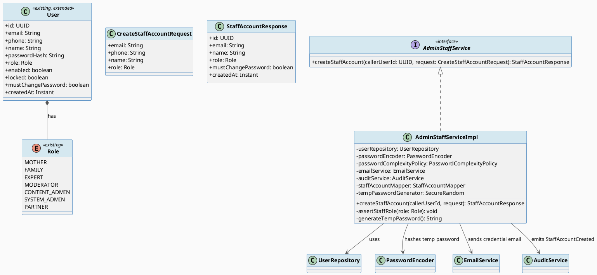
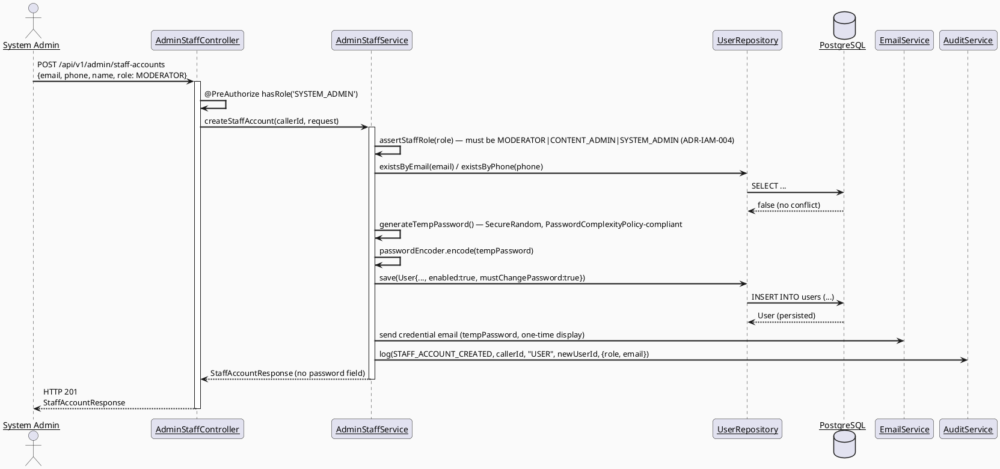
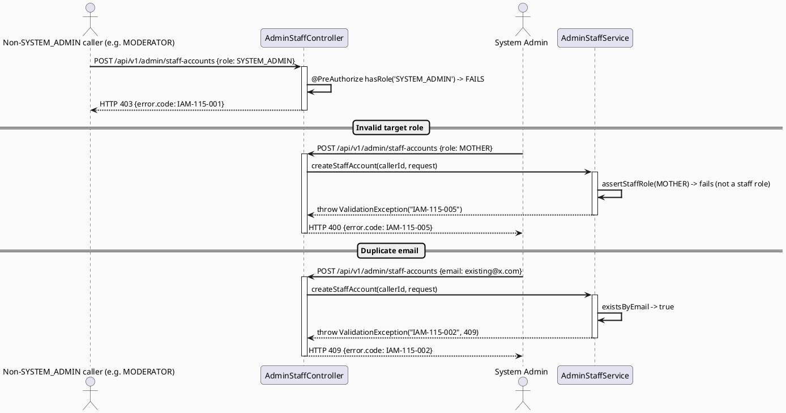
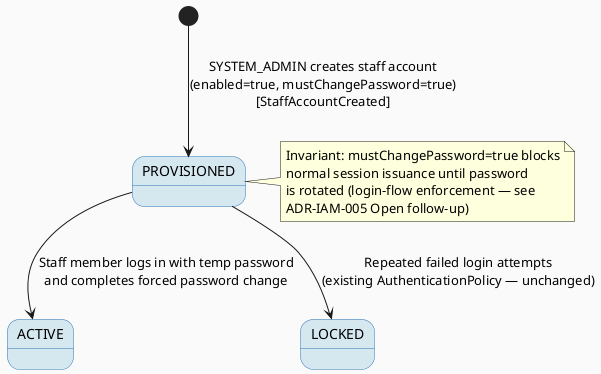

# ENGINEERING DOCUMENTATION STANDARD (EDS) v2.0
# UC115 — Create Staff Account — Technical Design Specification

| Field | Value |
|-------|-------|
| **Document ID** | `CB-IDENTITY-IMP-115` |
| **Version** | `1.0` |
| **Date** | `2026-07-02` |
| **Status** | `Approved` |
| **Document Owner** | `TV1-Phương` |
| **Author** | `AI Agent (Technical Architect)` |
| **Reviewed by** | `[Tech Lead — Pending]` |
| **DPO Sign-off** | `[ ] Pending` *(creates new PII records — email/phone/full name — for staff accounts, and issues credential material)* |
| **Approved by** | `[Principal Architect — Pending]` |
| **Last Review** | `2026-07-02` |
| **Based on EDS** | `v2.0` |

---

## CHANGELOG

| Ngày | Người thực hiện | Nội dung thay đổi |
|------|-----------------|-------------------|
| 2026-07-02 | AI Agent — Technical Architect | Tạo tài liệu lần đầu (Draft) cho UC115 |
| 2026-07-04 | AI Agent | Approved by user — proceeding to implementation |

---

## MỤC LỤC

1. [Tổng quan Module](#1-tổng-quan-module)
2. [Ma trận Truy vết](#2-ma-trận-truy-vết-traceability-matrix)
3. [Architecture Decision Records (ADR)](#3-architecture-decision-records-adr)
4. [Non-Functional Requirements & SLA](#4-non-functional-requirements--sla)
5. [Static Modeling](#5-static-modeling-mô-hình-tĩnh)
6. [Dynamic Modeling](#6-dynamic-modeling-mô-hình-động)
7. [Domain Event Catalog](#7-domain-event-catalog)
8. [Interface Specification](#8-interface-specification-đặc-tả-giao-diện)
9. [API Specification](#9-api-specification)
10. [Bảng mã lỗi](#10-bảng-mã-lỗi-error-codes)
11. [Quy trình Triển khai](#11-quy-trình-triển-khai-step-by-step)
12. [Rollback & Incident Runbook](#12-rollback--incident-runbook)
13. [Kịch bản Kiểm thử Chi tiết](#13-kịch-bản-kiểm-thử-chi-tiết)
14. [Phương pháp Xác minh](#14-phương-pháp-xác-minh)
15. [Mẫu thử thực tế](#15-mẫu-thử-thực-tế-api-verification-samples)
16. [Bảng tổng hợp phân quyền](#16-bảng-tổng-hợp-phân-quyền-authorization-matrix)
17. [AI Prompt Constraints (CASE 2.0)](#17-ai-prompt-constraints-case-20)

---

## 1. Tổng quan Module

| Field | Value |
|-------|-------|
| **Module Name** | `Identity — Admin Staff Account Provisioning` |
| **Bounded Context** | `Identity / Admin Governance` (new backend package `com.carebridge.backend.identity.admin`, same bounded context as UC114/UC116) |
| **Function ID / UC** | `3.2.2.17 Create Staff Account` / `UC-115` |
| **Primary Actor** | System Admin |
| **Secondary Actors** | None (SRS-confirmed) |
| **Platform** | Web — Admin Portal (React + TypeScript + Vite) |
| **Priority** | High |
| **Sprint / Owner** | Sprint 3 — TV1-Phương |
| **Data Classification** | `PII` (new staff member email/phone/full name) + `Credential Material` (temporary password / invite token) |
| **Compliance Scope** | `PDPA (Luật 91/2025)`, `BR-RBAC` |
| **Upstream Dependencies** | `security` package (`User` entity, `Role` enum, `PasswordComplexityPolicy`, `PasswordEncoder`), `audit` package, `EmailService`/`SmsService` (existing notification channels) |
| **Downstream Consumers** | UC114 (created staff accounts appear in the admin user list), UC116 (role/permission of a created staff account can later be updated), UC117 (staff-creation events are audited) |

### 1.1 Scope Statement — New admin-only provisioning path, distinct from self-registration

`RegisterRequest`/`AuthService.register()` (existing) is the **self-registration**
path: any caller can request `MOTHER`, `FAMILY`, `EXPERT`, or `PARTNER` roles
(`RegisterRequest.role` is `@NotNull` but unconstrained to a value set in the
DTO itself — enforcement of which roles are self-registrable, if any, is
**Open**, not required for this UC and explicitly out of scope here) and must
complete OTP verification (`AuthController.verifyOtp`) before the account is
usable. UC115 is a **separate, admin-only provisioning flow**: no public HTTP
endpoint exists for it today. This TDS creates a new endpoint that lets a
`SYSTEM_ADMIN` directly create an already-`enabled` account for the three
staff roles named in SRS: `MODERATOR`, `CONTENT_ADMIN`, `SYSTEM_ADMIN` — reusing
the existing `User` entity, `Role` enum, and `PasswordComplexityPolicy`, but
issuing credentials through a **forced-password-change invite flow** (§3, ADR-IAM-005),
not the OTP flow (see ADR-IAM-004 for why OTP is bypassed by design, and what
replaces it).

### 1.2 Source Conflict — Reused from UC114 (§1.2)

Same resolution as UC114 §1.2: this TDS creates a `User` row with a single
`Role` enum value; it does **not** write to `roles`/`user_roles`. See
ADR-IAM-001 (UC114 TDS) — not repeated in full here to avoid duplication, but
binding on this document identically.

---

## 2. Ma trận Truy vết (Traceability Matrix)

| Requirement ID | Loại (BR/ADR/US) | Mô tả yêu cầu | Thành phần Code | Compliance Target | ADR liên quan |
|----------------|------------------|---------------|-----------------|-------------------|---------------|
| UC-115 (SRS §3.2.2.17) | Use Case | Creates moderator, content admin, or admin accounts according to permissions | `AdminStaffController.POST /api/v1/admin/staff-accounts`, `AdminStaffService.createStaffAccount()` | BR-RBAC | ADR-IAM-004, ADR-IAM-005, ADR-IAM-006 |
| BR-RBAC | Business Rule | Users may access only functions allowed by role/permission scope | `@PreAuthorize("hasRole('SYSTEM_ADMIN')")` on `AdminStaffController` | Authorization | ADR-IAM-004 |
| POST-3 (SRS generic postcondition) | Postcondition | Sensitive actions are recorded for audit | `AdminStaffService` emits `StaffAccountCreated` via `AuditService` | PDPA audit trail | ADR-IAM-006 |
| RG-4 self-escalation risk | Non-negotiable constraint | A MODERATOR/CONTENT_ADMIN must never be able to grant themselves or anyone SYSTEM_ADMIN via this flow | `@PreAuthorize("hasRole('SYSTEM_ADMIN')")` — only SYSTEM_ADMIN may call this endpoint at all, and it is the ONLY role permitted to invoke it (§16) | Privilege-escalation prevention | ADR-IAM-004 |
| RG-4 OTP-bypass question | Open resolved | Does staff creation bypass normal OTP flow? | Yes, by design — replaced with forced-password-change invite (§3 ADR-IAM-005) | Credential safety | ADR-IAM-005 |
| Existing code reuse | Constraint | Reuse `security.entity.User`, `security.rbac.Role`, `security.policy.PasswordComplexityPolicy`, `PasswordEncoder`, `security.service.EmailService` | `identity.admin.*` new package | — | ADR-IAM-005 |

---

## 3. Architecture Decision Records (ADR)

### ADR-IAM-004 — Only `SYSTEM_ADMIN` may create staff accounts; self-escalation is structurally impossible

| Field | Value |
|-------|-------|
| **Status** | `Accepted` |
| **Deciders** | `AI Agent (Technical Architect)`, pending Principal Architect confirmation |
| **Date** | `2026-07-02` |

#### Bối cảnh (Context)
SRS Description says accounts are created "according to permissions" without
naming which caller role(s) may invoke this UC. Left unresolved, an
implementation could allow a `MODERATOR` to create a `SYSTEM_ADMIN` account
(privilege escalation) — the single most severe risk this cluster of 4 UCs
must guard against per the task brief's RG-4 explicit callout.

#### Các phương án đã xem xét (Options Considered)

| Phương án | Mô tả | Ưu điểm | Nhược điểm |
|-----------|-------|----------|------------|
| A | Endpoint is `@PreAuthorize("hasRole('SYSTEM_ADMIN')")` only — no caller role may create ANY staff account except SYSTEM_ADMIN itself | Structurally eliminates self-escalation: there is no code path where a non-SYSTEM_ADMIN reaches the creation logic at all | SYSTEM_ADMIN becomes a single point of staff onboarding (acceptable — SRS confirms Primary Actor = System Admin for all 4 UCs in this cluster, no secondary actor) |
| B | Allow `SYSTEM_ADMIN` and `CONTENT_ADMIN` to create `MODERATOR`/`CONTENT_ADMIN` (but not `SYSTEM_ADMIN`) via a role-hierarchy check | Slightly more delegated admin workflow | Not supported by any SRS text (Primary Actor for UC115 is exclusively System Admin); introduces a role-hierarchy concept that does not exist anywhere else in the codebase — would be an invented business rule (forbidden by workflow rules) |

#### Quyết định (Decision)
Chọn **Phương án A**. Endpoint-level `@PreAuthorize("hasRole('SYSTEM_ADMIN')")`
is the sole gate. Additionally, `AdminStaffServiceImpl.createStaffAccount()`
performs a defense-in-depth check: it rejects the request with `IAM-115-005`
if `request.role()` is not one of `{MODERATOR, CONTENT_ADMIN, SYSTEM_ADMIN}`
(the three SRS-named staff roles) — this prevents this endpoint from being
repurposed to create `MOTHER`/`FAMILY`/`EXPERT`/`PARTNER` accounts, which must
continue to go through the self-registration OTP flow only.

#### Hệ quả (Consequences)

**Tích cực:** Self-escalation is structurally impossible — there is no code
branch reachable by a non-SYSTEM_ADMIN caller that creates or elevates any
account's role.

**Tiêu cực / Trade-offs:** If a future SRS revision requires delegated
staff-creation (e.g., CONTENT_ADMIN creating other CONTENT_ADMINs), a new ADR
superseding this one is required — not silently added later.

**Compliance Impact:** Directly satisfies the task brief's explicit
CASE 2.0 AI Prompt Constraint requirement to forbid granting SYSTEM_ADMIN via
a non-SYSTEM_ADMIN caller.

---

### ADR-IAM-005 — Staff accounts bypass OTP; credentials are issued via a system-generated temporary password + forced first-login password change

| Field | Value |
|-------|-------|
| **Status** | `Accepted` |
| **Deciders** | `AI Agent (Technical Architect)` |
| **Date** | `2026-07-02` |

#### Bối cảnh (Context)
Self-registration (UC01/UC02) requires OTP verification via the caller's own
phone/email before the account becomes usable — this proves the registrant
controls the contact channel. For admin-created staff accounts, the *admin*,
not the staff member, supplies the contact info, so the OTP-to-self model
does not apply the same way; the staff member has not yet interacted with the
system at account-creation time. The task brief explicitly flags this as a
risk: staff creation "must still set a secure temp password/invite flow, not
a plaintext-known password."

#### Các phương án đã xem xét (Options Considered)

| Phương án | Mô tả | Ưu điểm | Nhược điểm |
|-----------|-------|----------|------------|
| A | System generates a cryptographically random temporary password (never chosen/known by the admin), stores only its hash via existing `PasswordEncoder`, sets a `mustChangePassword` flag, and emails it to the staff member's registered email via existing `EmailService` | No human ever "sets" a guessable password; forces credential rotation on first use; reuses `PasswordEncoder`/`EmailService` already in the codebase, no new crypto/mail integration | Requires one new boolean field on `User` (`must_change_password`) — additive, non-breaking migration (§5.2) |
| B | Admin manually types a password for the staff member during creation | Simpler UI | Admin now "knows" the staff member's password (violates least-knowledge principle, explicitly flagged as unsafe by the task brief) — **rejected** |
| C | Send a signed invite link (JWT-based) requiring the staff member to set their own first password, account remains `enabled=false` until link is used | Closest analogue to OTP flow's "prove control of contact channel" | Requires a new invite-token entity/table + new public endpoint — larger blast radius than Option A for equivalent security outcome; flagged as a stronger alternative worth Principal Architect review, but not selected as the baseline to keep migration/schema footprint minimal per CLAUDE.md "smallest scoped change" |

#### Quyết định (Decision)
Chọn **Phương án A** as the baseline design. Option C is recorded here as an
**Open alternative** the Principal Architect may prefer during review (see
handoff Open Items) — if selected, it supersedes this ADR before
implementation begins.

#### Hệ quả (Consequences)

**Tích cực:** No plaintext-known password ever exists outside the one-time
email delivery; `mustChangePassword=true` forces immediate rotation;
reuses 100% existing password-hashing/email infrastructure.

**Tiêu cực / Trade-offs:** Requires one additive `User.mustChangePassword`
column (migration, §5.2) and one new login-flow check (`AuthServiceImpl`
must reject/redirect login-direct to a change-password step when
`mustChangePassword=true` — **flagged Open**: full login-flow integration
is a `security` package change requiring TV1 small-PR review per the
task-allocation note; this TDS specifies the contract but the login-side
enforcement wiring is called out explicitly as an implementation follow-up,
not silently assumed complete).

**Compliance Impact:** Improves PDPA/security posture versus a
known-to-admin password.

---

### ADR-IAM-006 — Every staff-account creation is synchronously audited

| Field | Value |
|-------|-------|
| **Status** | `Accepted` |
| **Deciders** | `AI Agent (Technical Architect)` |
| **Date** | `2026-07-02` |

#### Bối cảnh (Context)
Same rationale as ADR-IAM-002 (UC114) — creating a `SYSTEM_ADMIN`/`MODERATOR`/
`CONTENT_ADMIN` account is a high-impact privileged action requiring full
traceability.

#### Quyết định (Decision)
`AdminStaffServiceImpl.createStaffAccount()` calls
`AuditService.log(AuditAction.STAFF_ACCOUNT_CREATED, callerUserId, "USER", newUserId, payload)`
inside the same transaction as the `users` insert.

#### Hệ quả (Consequences)
**Tích cực:** Full traceability of every staff-account creation, directly
feeding UC117.
**Tiêu cực / Trade-offs:** Adds one new additive `AuditAction` enum value.
**Compliance Impact:** Satisfies PDPA accountability + BR-RBAC oversight.

---

## 4. Non-Functional Requirements & SLA

### 4.1. Performance & Availability

| Category | Requirement | Target SLA | Measurement Method | Compliance Basis |
|----------|-------------|------------|---------------------|------------------|
| Latency | `POST /api/v1/admin/staff-accounts` | `< 800ms p99` (includes email send) | Manual timing | — |
| Availability | Email delivery for credential issuance | Best-effort via existing `EmailService`; failure MUST NOT silently create an unusable account (see §10 error `IAM-115-006`) | Integration test | — |

### 4.2. Data Integrity & Retention

| Category | Requirement | Target | Verification Method | Compliance Basis |
|----------|-------------|--------|---------------------|------------------|
| Consistency | Account creation + audit log write | Same DB transaction (atomic) | `@Transactional` | PDPA accountability |
| Uniqueness | Email/phone MUST be unique across all users (existing `UserRepository.existsByEmail/existsByPhone`) | Enforced pre-insert | Unit + integration test | — |

### 4.3. Security

| Category | Requirement | Target | Verification Method | Compliance Basis |
|----------|-------------|--------|---------------------|------------------|
| Access control | ONLY `SYSTEM_ADMIN` may call this endpoint | `@PreAuthorize` + service-level role-value guard | §16 Authorization Matrix | ADR-IAM-004 |
| Credential handling | Temp password never logged, never returned in API response, never chosen by admin | Code review; response DTO omits password field entirely | ADR-IAM-005 |
| Password strength | Temp password satisfies existing `PasswordComplexityPolicy` | Reuse existing policy class | — |

### 4.4. Scalability & Capacity Planning
Staff account creation is a low-frequency admin operation (SRS `Frequency of
Use: Regular`). No dedicated capacity planning required. `Open` — no SRS
volume figure sourced.

---

## 5. Static Modeling (Mô hình Tĩnh)

### 5.1. Class Diagram (PlantUML)



### 5.2. Data Structure (Flyway SQL Migration) — One additive column required

> **Verified gap:** the existing `users` table has no flag distinguishing
> "must rotate password before first authenticated use." This is a genuine,
> narrow schema gap (not a full new table). Assigned version per task brief's
> pre-reserved range starting at `V20260704090000`.

```sql
-- File: src/main/resources/db/migration/V20260704090100__add_users_must_change_password.sql
-- === UC115 Create Staff Account — additive column ===

ALTER TABLE public.users
    ADD COLUMN IF NOT EXISTS must_change_password boolean NOT NULL DEFAULT false;
    -- Set true only for admin-provisioned staff accounts (ADR-IAM-005).
    -- Self-registered accounts (OTP flow) are unaffected — default false.

COMMENT ON COLUMN public.users.must_change_password IS
    'UC115: true when an admin-issued temporary password has not yet been rotated by the staff member.';
```

**Sync action for `V1__init_schema.sql`:** Add `must_change_password boolean
DEFAULT false NOT NULL` to the `public.users` CREATE TABLE definition (after
`locked_at`) so the baseline schema stays authoritative for fresh
environments, per template §5.2 CareBridge rule.

**No collision confirmed:** highest existing migration is
`V20260629000002`; this TDS's assigned version `V20260704090100` is within
the task brief's reserved `090000`-prefixed range and does not collide with
the `100000`/`110000`/`120000`/`130000` ranges reserved for sibling agents.

---

## 6. Dynamic Modeling (Mô hình Động)

### 6.1. Sequence Diagram — Happy Path (PlantUML)



### 6.2. Sequence Diagram — Error Path (PlantUML)



### 6.3. State Machine — New account lifecycle for admin-provisioned staff



> **⚠️ Invariant bất biến:**
> 1. `role` on a newly created staff account MUST be exactly one of
>    `MODERATOR | CONTENT_ADMIN | SYSTEM_ADMIN` — never a self-registration
>    role.
> 2. Only a caller already holding `SYSTEM_ADMIN` may reach the creation
>    logic (ADR-IAM-004) — no role-hierarchy escalation path exists.
> 3. `mustChangePassword=true` is always set on creation; it is never `false`
>    at insert time.

---

## 7. Domain Event Catalog

### 7.1. Events Published (Phát ra)

| Event Name | Trigger | Publisher | Subscriber(s) | Payload Schema | Async? |
|------------|---------|-----------|---------------|----------------|--------|
| `StaffAccountCreated` | `POST /api/v1/admin/staff-accounts` succeeds | `AdminStaffServiceImpl` | `AuditService`; UC117 (read consumer) | See §7.3 | No (synchronous, same transaction) |

### 7.2. Events Consumed (Tiêu thụ)

| Event Name | Source | Handler | Action thực hiện |
|------------|--------|---------|------------------|
| None | — | — | UC115 does not consume events from other modules |

### 7.3. Payload Schema

```java
// StaffAccountCreated — recorded via AuditService.log(AuditAction.STAFF_ACCOUNT_CREATED, ...)
public record StaffAccountCreatedPayload(
    UUID   newUserId,
    String email,           // masked/partial in audit view if PII-minimization required — Open, not enforced in baseline
    Role   assignedRole,
    UUID   createdByAdminId
) {}
```

---

## 8. Interface Specification (Đặc tả Giao diện)

### 8.1. Service Interface

```java
// CreateStaffAccountRequest.java — Input DTO
// @version 1.0
public class CreateStaffAccountRequest {
    @jakarta.validation.constraints.Email
    @jakarta.validation.constraints.NotBlank
    private String email;

    @com.carebridge.backend.common.validation.VietnamesePhoneNumber
    private String phone; // optional, same validator as RegisterRequest

    @jakarta.validation.constraints.NotBlank
    @jakarta.validation.constraints.Size(max = 120)
    private String name;

    @jakarta.validation.constraints.NotNull
    private Role role; // MUST be MODERATOR | CONTENT_ADMIN | SYSTEM_ADMIN — validated in service (ADR-IAM-004)
    // getters / setters
}

// StaffAccountResponse.java — Output DTO (NEVER includes password/tempPassword)
public class StaffAccountResponse {
    private UUID id;
    private String email;
    private String name;
    private Role role;
    private boolean mustChangePassword;
    private Instant createdAt;
    // getters / setters
}

// AdminStaffService.java — Service Contract
// @version 1.0
public interface AdminStaffService {
    /**
     * Create a new staff (MODERATOR/CONTENT_ADMIN/SYSTEM_ADMIN) account.
     * Issues a system-generated temporary password via email; never returns
     * the password in the API response (ADR-IAM-005).
     * @throws AuthorizationException if caller is not SYSTEM_ADMIN (enforced at controller)
     * @throws ValidationException (IAM-115-005) if request.role() is not a staff role
     * @throws ValidationException (IAM-115-002) if email/phone already exists
     */
    StaffAccountResponse createStaffAccount(UUID callerUserId, CreateStaffAccountRequest request);
}
```

### 8.2. Repository Interface

```java
// UserRepository.java — reuses 100% existing methods (existsByEmail, existsByPhone, save)
// No new repository method required beyond what security.repository.UserRepository already exposes.
```

---

## 9. API Specification

### 9.1. Endpoints Table

| Method | Path | Auth Level | Required Roles | Rate Limit | Idempotent? |
|--------|------|------------|----------------|------------|-------------|
| `POST` | `/api/v1/admin/staff-accounts` | JWT Bearer | `SYSTEM_ADMIN` | 30/min | No (creates a new resource) |

### 9.2. Request / Response Schemas

#### `POST /api/v1/admin/staff-accounts`

**Request Body:**
```json
{
  "email": "new.moderator@carebridge.dev",
  "phone": "+84901112222",
  "name": "Tran Van B",
  "role": "MODERATOR"
}
```

**Response — 201 Created (Happy Path):**
```json
{
  "success": true,
  "data": {
    "id": "6e2f...uuid",
    "email": "new.moderator@carebridge.dev",
    "name": "Tran Van B",
    "role": "MODERATOR",
    "mustChangePassword": true,
    "createdAt": "2026-07-02T00:00:00.000Z"
  },
  "message": "Staff account created; temporary credentials sent by email"
}
```

**Response — 400 Bad Request (Invalid target role):**
```json
{
  "error": {
    "code": "IAM-115-005",
    "message": "role must be one of MODERATOR, CONTENT_ADMIN, SYSTEM_ADMIN"
  }
}
```

**Response — 409 Conflict (Duplicate email/phone):**
```json
{
  "error": { "code": "IAM-115-002", "message": "Email or phone already registered" }
}
```

---

## 10. Bảng mã lỗi (Error Codes)

| Code | HTTP Status | Message (EN) | Message (VI) | Trigger Condition |
|------|-------------|--------------|--------------|-------------------|
| `IAM-115-001` | 403 | Insufficient permissions | Không đủ quyền | Caller is not `SYSTEM_ADMIN` |
| `IAM-115-002` | 409 | Email or phone already registered | Email hoặc số điện thoại đã tồn tại | `existsByEmail`/`existsByPhone` returns true |
| `IAM-115-003` | 400 | Validation failed | Dữ liệu không hợp lệ | Missing/invalid `email`, `name` |
| `IAM-115-004` | 500 | Internal error | Lỗi hệ thống | Unexpected persistence/audit failure |
| `IAM-115-005` | 400 | Role must be a staff role | Vai trò phải là vai trò nhân sự hợp lệ | `role` not in `{MODERATOR, CONTENT_ADMIN, SYSTEM_ADMIN}` (ADR-IAM-004) |
| `IAM-115-006` | 502 | Credential email delivery failed | Gửi email thông tin đăng nhập thất bại | `EmailService` throws — account creation is rolled back (transactional) so no orphaned unusable account is left; admin must retry |

---

## 11. Quy trình Triển khai (Step-by-Step)

### 11.1. Prerequisites
- [ ] ADR-IAM-004, ADR-IAM-005, ADR-IAM-006 Accepted (§3) — **ADR-IAM-005 Option C alternative explicitly flagged for Principal Architect decision before implementation**
- [ ] DPO review scheduled (new PII creation + credential issuance)
- [ ] Migration `V20260704090100` approved (§5.2)

### 11.2. Pre-Migration Checklist
- [ ] DB backup taken
- [ ] Migration tested on staging ≥ 24h
- [ ] Rollback script tested (§12.2)
- [ ] DPO sign-off obtained (new column, not PII itself, but supports PII-adjacent workflow)

### 11.3. Implementation Steps

#### Chặng 1 — Flyway migration
```sql
-- See §5.2 for full content
-- File: src/main/resources/db/migration/V20260704090100__add_users_must_change_password.sql
```
```bash
./mvnw flyway:migrate
```

#### Chặng 2 — Create `identity.admin` package additions
```
src/main/java/com/carebridge/backend/identity/admin/
├── controller/AdminStaffController.java
├── service/AdminStaffService.java
├── service/impl/AdminStaffServiceImpl.java
├── dto/request/CreateStaffAccountRequest.java
├── dto/response/StaffAccountResponse.java
└── mapper/StaffAccountMapper.java
```

#### Chặng 3 — Add `STAFF_ACCOUNT_CREATED` to `AuditAction` enum (additive)

#### Chặng 4 — Verification sau deploy
```bash
curl -X POST https://[host]/api/v1/admin/staff-accounts \
  -H "Authorization: Bearer $ADMIN_JWT" -H "Content-Type: application/json" \
  -d '{"email":"test.mod@carebridge.dev","name":"Test Mod","role":"MODERATOR"}'
# Expected: 201, response has no password field, mustChangePassword=true
```

### 11.4. Deployment Checklist
- [ ] Migration applied successfully
- [ ] `./mvnw test` green for `identity.admin` staff-creation tests
- [ ] Confirm response body never contains `passwordHash`/`tempPassword`
- [ ] Audit log row confirmed for a smoke-test creation

---

## 12. Rollback & Incident Runbook

### 12.1. Điều kiện kích hoạt Rollback

| Điều kiện | Ngưỡng | Người quyết định |
|-----------|--------|------------------|
| Non-SYSTEM_ADMIN successfully creates a staff account | Any single occurrence | Tech Lead (P0 security incident) |
| SYSTEM_ADMIN account created by a non-SYSTEM_ADMIN caller | Any single occurrence | Tech Lead + DPO (P0) |
| Temp password appears in logs or API response | Any single occurrence | Tech Lead + DPO (P0) |
| Error rate on staff-account creation | > 5% in 5 min | On-call Engineer |

### 12.2. Rollback Procedure

```bash
# Bước 1: Revert migration
psql -h $DB_HOST -U $DB_USER -d $DB_NAME \
  -c "ALTER TABLE public.users DROP COLUMN IF EXISTS must_change_password;"
psql -h $DB_HOST -U $DB_USER -d $DB_NAME \
  -c "DELETE FROM flyway_schema_history WHERE version = '20260704090100';"

# Bước 2: Revert implementation
git checkout -- src/main/java/com/carebridge/backend/identity/admin/
git checkout -- src/main/java/com/carebridge/backend/audit/entity/AuditAction.java
git checkout -- src/main/resources/db/migration/V20260704090100__add_users_must_change_password.sql
git checkout -- src/test/java/com/carebridge/backend/identity/admin/
```

### 12.3. Notification Protocol

| Thời điểm | Người nhận | Kênh | Template |
|-----------|------------|------|----------|
| Ngay khi phát hiện | On-call team | Slack `#incident` | "🚨 UC115 staff-account privilege-escalation incident: [mô tả]" |
| Trong 30 phút | DPO | Email | Bắt buộc — new PII + credential exposure risk |

### 12.4. Post-Incident Review (PIR)
Standard PIR template, mandatory within 48h, with explicit "was privilege
escalation possible" root-cause question given this UC's risk profile.

---

## 13. Kịch bản Kiểm thử Chi tiết

> Detailed test cases live in `UC115_CreateStaffAccount_Test-Spec.md`. Summary only.

### 13.1. Unit Tests
- `AdminStaffServiceImplTest` — happy path per staff role, invalid-role rejection, duplicate email/phone, temp password never returned, `mustChangePassword=true` always set.

### 13.2. Integration Tests
- `AdminStaffControllerIntegrationTest` (Testcontainers) — full creation round trip, `users` row + `audit_logs` row verified.

### 13.3. E2E / Security Tests
- **Self-escalation attempt**: `MODERATOR`/`CONTENT_ADMIN` JWT attempts `POST .../staff-accounts` with `role: SYSTEM_ADMIN` → must be 403 before reaching business logic.
- **Non-staff role rejection**: `SYSTEM_ADMIN` attempts `role: MOTHER` → 400 `IAM-115-005`.
- Injection attempt in `name`/`email` fields handled safely by JPA parameter binding.

---

## 14. Phương pháp Xác minh

### 14.1. Database Inspection
```sql
SELECT user_id, email, role, enabled, must_change_password, created_at
FROM users WHERE user_id = '[uuid]';

SELECT * FROM audit_logs WHERE entity_id = '[uuid]' AND action = 'STAFF_ACCOUNT_CREATED'
ORDER BY created_at DESC;

-- Verify no password leak in logs
SELECT query FROM pg_stat_activity WHERE query ILIKE '%password%';
```

### 14.2. Log / Audit Verification
```bash
kubectl logs -l app=carebridge-api | grep '"action":"STAFF_ACCOUNT_CREATED"' | head -5
kubectl logs -l app=carebridge-api | grep -i "password" 
# Expected: no plaintext password values in output
```

### 14.3. Tool-based Verification
```bash
echo "[JWT_TOKEN]" | cut -d'.' -f2 | base64 -d | jq .
```

---

## 15. Mẫu thử thực tế (API Verification Samples)

### 15.1. Happy Path
```bash
curl -X POST https://[host]/api/v1/admin/staff-accounts \
  -H "Authorization: Bearer [SYSTEM_ADMIN_JWT]" \
  -H "Content-Type: application/json" \
  -d '{"email":"new.mod@carebridge.dev","name":"New Mod","role":"MODERATOR"}'
```

### 15.2. Error Paths — Self-escalation attempt
```bash
curl -X POST https://[host]/api/v1/admin/staff-accounts \
  -H "Authorization: Bearer [MODERATOR_JWT]" \
  -H "Content-Type: application/json" \
  -d '{"email":"evil@x.com","name":"Evil","role":"SYSTEM_ADMIN"}'
```
**Expected Response (403):**
```json
{ "error": { "code": "IAM-115-001", "message": "Insufficient permissions" } }
```

---

## 16. Bảng tổng hợp phân quyền (Authorization Matrix)

| Endpoint | `MOTHER/FAMILY/EXPERT/PARTNER` | `MODERATOR` | `CONTENT_ADMIN` | `SYSTEM_ADMIN` |
|----------|:---:|:---:|:---:|:---:|
| `POST /api/v1/admin/staff-accounts` | ❌ | ❌ | ❌ | ✅ (only role that can call this endpoint at all) |

**Chú thích:** ✅ = Được phép · ❌ = Bị từ chối (403) · Verified: **no role
other than `SYSTEM_ADMIN` has any code path to this endpoint** — this is the
structural self-escalation prevention required by RG-4.

---

## 17. AI Prompt Constraints (CASE 2.0)

### 17.1 Constraint Summary Table

| # | Constraint | Source (ADR/BR) | Last Verified |
|---|-----------|-----------------|---------------|
| C1 | Endpoint MUST be `@PreAuthorize("hasRole('SYSTEM_ADMIN')")` — no other role may ever reach this controller method. | ADR-IAM-004 | 2026-07-02 |
| C2 | `request.role()` MUST be validated against `{MODERATOR, CONTENT_ADMIN, SYSTEM_ADMIN}` in the SERVICE layer (defense in depth) — reject anything else with `IAM-115-005`. | ADR-IAM-004 | 2026-07-02 |
| C3 | NEVER let the admin caller supply the new account's password. Generate it with `SecureRandom`, hash with the existing `PasswordEncoder`, and never return it in any API response. | ADR-IAM-005 | 2026-07-02 |
| C4 | Every creation MUST set `mustChangePassword=true` and emit `STAFF_ACCOUNT_CREATED` via `AuditService` in the same transaction as the `users` insert. | ADR-IAM-005, ADR-IAM-006 | 2026-07-02 |
| C5 | Reuse `security.repository.UserRepository.existsByEmail/existsByPhone` for uniqueness — do not write a parallel duplicate-check query. | Existing pattern | 2026-07-02 |
| C6 | If `EmailService` delivery fails, the entire transaction (including the `users` insert) MUST roll back — never leave an orphaned account with an undelivered credential. | §10 IAM-115-006 | 2026-07-02 |

### 17.2 Constraint Injection Block (Copy-Paste vào AI Prompt)

```
[CONSTRAINT BLOCK — Module: Identity Admin Staff Provisioning (UC115)]
Theo TDS CB-IDENTITY-IMP-115 và các ADR liên quan:

1. C1 — @PreAuthorize("hasRole('SYSTEM_ADMIN')") only; no other role may reach this endpoint.
2. C2 — Service layer must re-validate role is MODERATOR|CONTENT_ADMIN|SYSTEM_ADMIN (defense in depth).
3. C3 — Never accept an admin-supplied password; generate via SecureRandom, hash via existing PasswordEncoder, never return it.
4. C4 — Always set mustChangePassword=true and emit STAFF_ACCOUNT_CREATED via AuditService, same transaction.
5. C5 — Reuse existing UserRepository.existsByEmail/existsByPhone for uniqueness checks.
6. C6 — Roll back the whole transaction if credential email delivery fails.

[CONTEXT BLOCK]
- Bounded Context: Identity / Admin Governance
- Data Classification: PII + Credential Material
- Compliance: PDPA (Luật 91/2025), BR-RBAC
- Existing interfaces: §8 Service Interface
- Error codes: §10 Error Codes Table
- Auth matrix: §16 Authorization Matrix — SYSTEM_ADMIN is the ONLY permitted caller

[TASK BLOCK]
Implement AdminStaffService.createStaffAccount() satisfying constraints above.
Output must follow §8 Interface Specification.
Tests must cover §13 Test Scenarios / UC115_CreateStaffAccount_Test-Spec.md,
including the mandatory self-escalation-prevention test.
```

### 17.3 Constraint Quality Checklist
- [x] Mỗi constraint traceable về ADR hoặc BR cụ thể
- [x] Không có constraint generic
- [x] Mỗi constraint có `Last Verified` date ≤ 2 sprints
- [x] Constraint block có ≥ 3 constraints cụ thể
- [x] Constraint block reference §8 Interface
- [x] Constraint block reference §16 Auth Matrix

### 17.4 Anti-Pattern Detection

| AP-ID | Anti-Pattern | Dấu hiệu | Hành động |
|-------|-------------|-----------|----------|
| AP-AI-001 | Unconstrained Gen | Code không match C1-C6 | Reject — inject lại constraints |
| AP-AI-003 | Implicit Decision | Code assumes a role-hierarchy escalation model not in ADR-IAM-004 Option A | Reject |
| AP-AI-005 | Hallucinated Contract | Code imports an invite-token entity/table not defined in this TDS (Option C not selected) | Reject — verify contract existence |
| AP-CB-IAM-002 | **Self-Role-Escalation** | Any code path lets a non-SYSTEM_ADMIN caller create/elevate an account to SYSTEM_ADMIN or any staff role | **Release-blocking** — reject immediately |
| AP-CB-IAM-003 | **SYSTEM_ADMIN Grant By Non-SYSTEM_ADMIN** | Endpoint authorization allows any role other than SYSTEM_ADMIN to reach `createStaffAccount()` | **Release-blocking** — reject immediately |
| AP-CB-IAM-004 | Known Password | Admin-supplied or predictable password used for a new staff account | Reject — violates ADR-IAM-005 |

---

*EDS v2.1 — Tích hợp CASE 2.0 AI Prompt Constraints (§17).*
