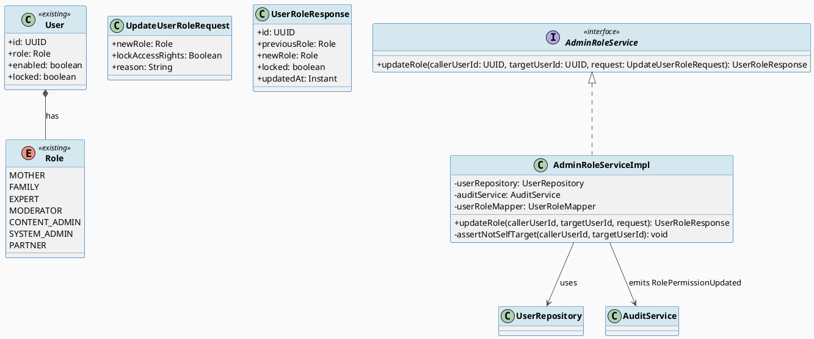
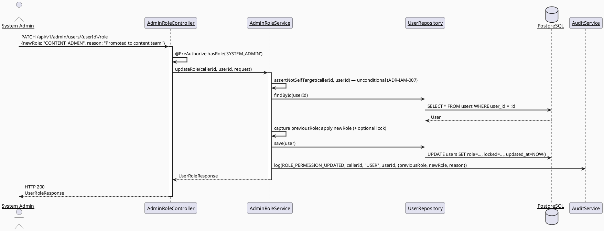
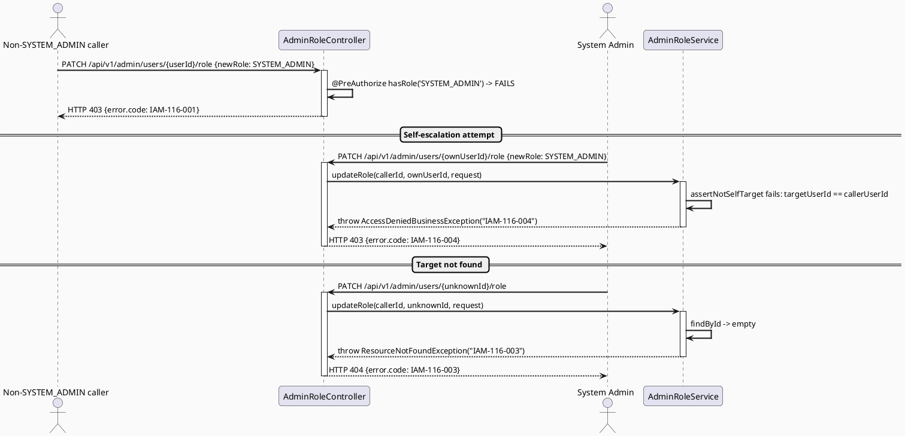
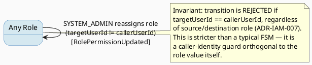

# ENGINEERING DOCUMENTATION STANDARD (EDS) v2.0
# UC116 — Update Role and Permission — Technical Design Specification

| Field | Value |
|-------|-------|
| **Document ID** | `CB-IDENTITY-IMP-116` |
| **Version** | `1.0` |
| **Date** | `2026-07-02` |
| **Status** | `Implemented` |
| **Document Owner** | `TV1-Phương` |
| **Author** | `AI Agent (Technical Architect)` |
| **Reviewed by** | `[Tech Lead — Pending]` |
| **DPO Sign-off** | `[ ] Pending` *(mutates the access-control attribute of a PII-bearing user record — no new PII field, but high-impact permission action)* |
| **Approved by** | `[Principal Architect — Pending]` |
| **Last Review** | `2026-07-02` |
| **Based on EDS** | `v2.0` |

---

## CHANGELOG

| Ngày | Người thực hiện | Nội dung thay đổi |
|------|-----------------|-------------------|
| 2026-07-02 | AI Agent — Technical Architect | Tạo tài liệu lần đầu (Draft) cho UC116 |
| 2026-07-04 | AI Agent | Approved by user — proceeding to implementation |
| 2026-07-04 | AI Agent | Implemented — AdminRoleController/ServiceImpl tests all green (verified independently) |

---

## MỤC LỤC

1. [Tổng quan Module](#1-tổng-quan-module)
2. [Ma trận Truy vết](#2-ma-trận-truy-vết-traceability-matrix)
3. [Architecture Decision Records (ADR)](#3-architecture-decision-records-adr)
4. [Non-Functional Requirements & SLA](#4-non-functional-requirements--sla)
5. [Static Modeling](#5-static-modeling-mô-hình-tĩnh)
6. [Dynamic Modeling](#6-dynamic-modeling-mô-hình-động)
7. [Domain Event Catalog](#7-domain-event-catalog)
8. [Interface Specification](#8-interface-specification-đặc-tả-giao-diện)
9. [API Specification](#9-api-specification)
10. [Bảng mã lỗi](#10-bảng-mã-lỗi-error-codes)
11. [Quy trình Triển khai](#11-quy-trình-triển-khai-step-by-step)
12. [Rollback & Incident Runbook](#12-rollback--incident-runbook)
13. [Kịch bản Kiểm thử Chi tiết](#13-kịch-bản-kiểm-thử-chi-tiết)
14. [Phương pháp Xác minh](#14-phương-pháp-xác-minh)
15. [Mẫu thử thực tế](#15-mẫu-thử-thực-tế-api-verification-samples)
16. [Bảng tổng hợp phân quyền](#16-bảng-tổng-hợp-phân-quyền-authorization-matrix)
17. [AI Prompt Constraints (CASE 2.0)](#17-ai-prompt-constraints-case-20)

---

## 1. Tổng quan Module

| Field | Value |
|-------|-------|
| **Module Name** | `Identity — Admin Role & Access Right Management` |
| **Bounded Context** | `Identity / Admin Governance` (new backend package `com.carebridge.backend.identity.admin`, same bounded context as UC114/UC115) |
| **Function ID / UC** | `3.2.2.18 Update Role and Permission` / `UC-116` |
| **Primary Actor** | System Admin |
| **Secondary Actors** | None (SRS-confirmed) |
| **Platform** | Web — Admin Portal (React + TypeScript + Vite) |
| **Priority** | High |
| **Sprint / Owner** | Sprint 3 — TV1-Phương |
| **Data Classification** | `PII-adjacent` (mutates `role`/`enabled`/`locked` on an existing PII-bearing `users` row — no new PII field introduced) |
| **Compliance Scope** | `PDPA (Luật 91/2025)`, `BR-RBAC` |
| **Upstream Dependencies** | `security` package (`User` entity, `Role` enum), `audit` package | 
| **Downstream Consumers** | UC114 (role/status reflected in the admin user list), UC117 (role-change events are audited) |

### 1.1 Scope Statement — Role reassignment + access-right lock/unlock, NOT a new permission engine

SRS Description: *"Assigns roles, updates permissions, and locks or unlocks
access rights."* Codebase inspection (`security.rbac.Role`) confirms the
**only** permission model in CareBridge today is a single fixed enum per
user (`MOTHER, FAMILY, EXPERT, MODERATOR, CONTENT_ADMIN, SYSTEM_ADMIN,
PARTNER`) — there is no finer-grained permission-flag table, no
Spring Security `GrantedAuthority` beyond `"ROLE_" + role.name()`, and no
`roles`/`user_roles` join usage (see UC114 §1.2, binding here identically).
Per the task brief's RG-6 instruction to "not invent a permission system
beyond what's asked," **this TDS scopes "updates permissions" to role
reassignment (`users.role`) and scopes "locks or unlocks access rights" to
the same `enabled`/`locked` boolean flags UC114 already manages** — this is
the same underlying `users` row mutation surface as UC114, but for the
`role` field specifically (UC114 explicitly does not expose a `role` field in
its `UpdateUserStatusRequest` — role reassignment is UC116's exclusive
responsibility to keep the two UCs' write surfaces non-overlapping and each
independently auditable with a distinct `AuditAction`).

### 1.2 Source Conflict — Reused from UC114 (§1.2)

Identical resolution: this TDS reassigns the single `Role` enum value on
`users.role`; it does not create or use a `roles`/`user_roles` many-to-many.
See ADR-IAM-001 (UC114 TDS), binding on this document.

---

## 2. Ma trận Truy vết (Traceability Matrix)

| Requirement ID | Loại (BR/ADR/US) | Mô tả yêu cầu | Thành phần Code | Compliance Target | ADR liên quan |
|----------------|------------------|---------------|-----------------|-------------------|---------------|
| UC-116 (SRS §3.2.2.18) | Use Case | Assigns roles, updates permissions, locks/unlocks access rights | `AdminRoleController.PATCH /api/v1/admin/users/{userId}/role` | BR-RBAC | ADR-IAM-007 |
| BR-RBAC | Business Rule | Users may access only functions allowed by role/permission scope | `@PreAuthorize("hasRole('SYSTEM_ADMIN')")` on `AdminRoleController` | Authorization | ADR-IAM-007 |
| POST-3 (SRS generic postcondition) | Postcondition | Sensitive actions are recorded for audit | `AdminRoleService` emits `RolePermissionUpdated` via `AuditService` | PDPA audit trail | ADR-IAM-008 |
| RG-4 self-escalation risk | Non-negotiable constraint | A caller must never be able to grant themselves `SYSTEM_ADMIN`, and only `SYSTEM_ADMIN` may reassign any role, including to `SYSTEM_ADMIN` | `@PreAuthorize("hasRole('SYSTEM_ADMIN')")` + `AdminRoleService` self-target guard | Privilege-escalation prevention | ADR-IAM-007 |
| RG-6 permission-model scope | Architecture-changing unknown, resolved | "Updates permissions" = role reassignment only, no new permission-flag schema | `AdminRoleService.updateRole()` writes `users.role` exclusively | — | §1.1 |
| Existing code reuse | Constraint | Reuse `security.entity.User`, `security.rbac.Role`, `audit.service.AuditService` | `identity.admin.*` new package | — | ADR-IAM-007 |

---

## 3. Architecture Decision Records (ADR)

### ADR-IAM-007 — Role reassignment is `SYSTEM_ADMIN`-only, with an unconditional self-target block (stronger than UC114's guard)

| Field | Value |
|-------|-------|
| **Status** | `Accepted` |
| **Deciders** | `AI Agent (Technical Architect)`, pending Principal Architect confirmation |
| **Date** | `2026-07-02` |

#### Bối cảnh (Context)
This is the single highest-risk endpoint in the entire 4-UC cluster: it is
the only place in the system that can change ANY user's `role` value,
including elevating a caller's own account to `SYSTEM_ADMIN`. The task brief
explicitly names this as the top self-escalation risk to eliminate.

#### Các phương án đã xem xét (Options Considered)

| Phương án | Mô tả | Ưu điểm | Nhược điểm |
|-----------|-------|----------|------------|
| A | `@PreAuthorize("hasRole('SYSTEM_ADMIN')")` at controller (only SYSTEM_ADMIN reaches the logic at all) **plus** an unconditional service-level guard rejecting `targetUserId == callerUserId` for ANY role change (not just downgrade-to-non-admin) | Structurally eliminates both "self-escalation" and "self-demotion accident" in one guard; consistent, simple invariant that is trivial to test and reason about | A SYSTEM_ADMIN cannot change their own role even to fix a genuine own-account mistake — requires a peer admin, which is the intended safety property, not a bug |
| B | Allow self-targeting but forbid only self-upgrade-to-`SYSTEM_ADMIN` (i.e., a SYSTEM_ADMIN could demote themselves) | More flexible | Adds conditional complexity for a rare case; a self-demoting SYSTEM_ADMIN with no other active admin could lock the platform out of admin access entirely — worse operational risk than Option A |

#### Quyết định (Decision)
Chọn **Phương án A**. Identical self-target philosophy to ADR-IAM-003
(UC114) but applied unconditionally here (UC114 only blocks the caller's own
status, UC116 blocks the caller's own role for any direction of change,
because role is the highest-privilege field in the system).

#### Hệ quả (Consequences)

**Tích cực:** No code path anywhere allows a caller to change their own
`role`, eliminating the specific self-escalation-to-`SYSTEM_ADMIN` scenario
named in the task brief, and its inverse (accidental self-demotion).

**Tiêu cực / Trade-offs:** Requires at least 2 SYSTEM_ADMIN accounts to exist
in any environment where one might need role correction — acceptable
operational constraint, not a functional regression (the seeded test account
table already lists a dedicated `admin@carebridge.dev` SYSTEM_ADMIN account).

**Compliance Impact:** Directly satisfies the CASE 2.0 constraint to forbid
self-role-escalation and to forbid SYSTEM_ADMIN grants by non-SYSTEM_ADMIN
callers (the latter is structurally impossible since ALL callers other than
SYSTEM_ADMIN are rejected at the controller).

---

### ADR-IAM-008 — Every role/access-right mutation is synchronously audited, distinct `AuditAction` from UC114's status changes

| Field | Value |
|-------|-------|
| **Status** | `Accepted` |
| **Deciders** | `AI Agent (Technical Architect)` |
| **Date** | `2026-07-02` |

#### Bối cảnh (Context)
Same rationale as ADR-IAM-002/ADR-IAM-006. A distinct `AuditAction` value
(`ROLE_PERMISSION_UPDATED`, separate from UC114's `USER_ACCOUNT_STATUS_CHANGED`)
keeps UC117's audit log filterable by action type without conflating role
changes with status changes.

#### Quyết định (Decision)
`AdminRoleServiceImpl.updateRole()` calls
`AuditService.log(AuditAction.ROLE_PERMISSION_UPDATED, callerUserId, "USER", targetUserId, payload)`
in the same transaction as the `users.role` update.

#### Hệ quả (Consequences)
**Tích cực:** Full traceability, clean separation from UC114's audit trail.
**Tiêu cực / Trade-offs:** Adds one new additive `AuditAction` enum value.
**Compliance Impact:** Satisfies PDPA accountability + BR-RBAC oversight.

---

## 4. Non-Functional Requirements & SLA

### 4.1. Performance & Availability

| Category | Requirement | Target SLA | Measurement Method | Compliance Basis |
|----------|-------------|------------|---------------------|------------------|
| Latency | `PATCH /api/v1/admin/users/{userId}/role` | `< 300ms p99` | Manual timing | — |

### 4.2. Data Integrity & Retention

| Category | Requirement | Target | Verification Method | Compliance Basis |
|----------|-------------|--------|---------------------|------------------|
| Consistency | Role mutation + audit log write | Same DB transaction (atomic) | `@Transactional` | PDPA accountability |
| Invariant | `targetUserId != callerUserId` always enforced | 100% of requests | Unit + integration test | ADR-IAM-007 |

### 4.3. Security

| Category | Requirement | Target | Verification Method | Compliance Basis |
|----------|-------------|--------|---------------------|------------------|
| Access control | ONLY `SYSTEM_ADMIN` may call this endpoint | `@PreAuthorize` | §16 Authorization Matrix | ADR-IAM-007 |
| Self-escalation prevention | Caller can never change own role | Service-level guard, unconditional | §13 Test scenarios | ADR-IAM-007 |

### 4.4. Scalability & Capacity Planning
Low-frequency admin operation. `Open` — no SRS volume figure sourced.

---

## 5. Static Modeling (Mô hình Tĩnh)

### 5.1. Class Diagram (PlantUML)



### 5.2. Data Structure — No migration required

> **Verified:** UC116 mutates only the existing `users.role`, `users.enabled`,
> `users.locked` columns (`V1__init_schema.sql` L532-544) — identical column
> set already used by UC114. No new table, column, index, or constraint is
> required.

---

## 6. Dynamic Modeling (Mô hình Động)

### 6.1. Sequence Diagram — Happy Path (PlantUML)



### 6.2. Sequence Diagram — Error Path (PlantUML)



### 6.3. State Machine — `users.role` transitions (any-to-any, gated by ADR-IAM-007)



> **⚠️ Invariant bất biến:**
> 1. `targetUserId == callerUserId` is ALWAYS rejected — no exception for any
>    role pair (ADR-IAM-007).
> 2. Only `SYSTEM_ADMIN` callers reach the role-mutation logic at all.
> 3. Every accepted transition emits exactly one `ROLE_PERMISSION_UPDATED`
>    audit event with both `previousRole` and `newRole` captured.

---

## 7. Domain Event Catalog

### 7.1. Events Published (Phát ra)

| Event Name | Trigger | Publisher | Subscriber(s) | Payload Schema | Async? |
|------------|---------|-----------|---------------|----------------|--------|
| `RolePermissionUpdated` | `PATCH /api/v1/admin/users/{id}/role` succeeds | `AdminRoleServiceImpl` | `AuditService`; UC117 (read consumer) | See §7.3 | No (synchronous, same transaction) |

### 7.2. Events Consumed (Tiêu thụ)

| Event Name | Source | Handler | Action thực hiện |
|------------|--------|---------|------------------|
| None | — | — | UC116 does not consume events from other modules |

### 7.3. Payload Schema

```java
// RolePermissionUpdated — recorded via AuditService.log(AuditAction.ROLE_PERMISSION_UPDATED, ...)
public record RolePermissionUpdatedPayload(
    UUID   targetUserId,
    Role   previousRole,
    Role   newRole,
    Boolean previousLocked,
    Boolean newLocked,
    String reason           // admin-supplied justification, nullable
) {}
```

---

## 8. Interface Specification (Đặc tả Giao diện)

### 8.1. Service Interface

```java
// UpdateUserRoleRequest.java — Input DTO
// @version 1.0
public class UpdateUserRoleRequest {
    @jakarta.validation.constraints.NotNull
    private Role newRole;

    private Boolean lockAccessRights; // nullable — optional simultaneous lock/unlock of users.locked

    @jakarta.validation.constraints.Size(max = 500)
    private String reason;            // optional admin justification, stored in audit payload
    // getters / setters
}

// UserRoleResponse.java — Output DTO
public class UserRoleResponse {
    private UUID id;
    private Role previousRole;
    private Role newRole;
    private boolean locked;
    private Instant updatedAt;
    // getters / setters
}

// AdminRoleService.java — Service Contract
// @version 1.0
public interface AdminRoleService {
    /**
     * Reassign a target user's role and/or lock/unlock their access rights.
     * @throws AuthorizationException if caller is not SYSTEM_ADMIN (enforced at controller)
     * @throws AccessDeniedBusinessException (IAM-116-004) if targetUserId == callerUserId (ADR-IAM-007, unconditional)
     * @throws ResourceNotFoundException (IAM-116-003) if targetUserId does not exist
     */
    UserRoleResponse updateRole(UUID callerUserId, UUID targetUserId, UpdateUserRoleRequest request);
}
```

### 8.2. Repository Interface

```java
// UserRepository.java — reuses 100% existing methods (findById, save) from security.repository.UserRepository.
// No new repository method required.
```

---

## 9. API Specification

### 9.1. Endpoints Table

| Method | Path | Auth Level | Required Roles | Rate Limit | Idempotent? |
|--------|------|------------|----------------|------------|-------------|
| `PATCH` | `/api/v1/admin/users/{userId}/role` | JWT Bearer | `SYSTEM_ADMIN` | 60/min | Yes (same input → same resulting state) |

### 9.2. Request / Response Schemas

#### `PATCH /api/v1/admin/users/{userId}/role`

**Request Body:**
```json
{
  "newRole": "CONTENT_ADMIN",
  "lockAccessRights": false,
  "reason": "Promoted to content moderation team"
}
```

**Response — 200 OK (Happy Path):**
```json
{
  "success": true,
  "data": {
    "id": "550e8400-e29b-41d4-a716-446655440000",
    "previousRole": "MODERATOR",
    "newRole": "CONTENT_ADMIN",
    "locked": false,
    "updatedAt": "2026-07-02T00:00:00.000Z"
  },
  "message": "Role updated"
}
```

**Response — 403 Forbidden (Self-target — self-escalation prevention):**
```json
{
  "error": { "code": "IAM-116-004", "message": "Admin cannot change their own role" }
}
```

**Response — 404 Not Found:**
```json
{
  "error": { "code": "IAM-116-003", "message": "User not found" }
}
```

---

## 10. Bảng mã lỗi (Error Codes)

| Code | HTTP Status | Message (EN) | Message (VI) | Trigger Condition |
|------|-------------|--------------|--------------|-------------------|
| `IAM-116-001` | 403 | Insufficient permissions | Không đủ quyền | Caller is not `SYSTEM_ADMIN` |
| `IAM-116-002` | 400 | Validation failed | Dữ liệu không hợp lệ | `newRole` missing/invalid enum value |
| `IAM-116-003` | 404 | User not found | Không tìm thấy người dùng | `targetUserId` does not exist |
| `IAM-116-004` | 403 | Cannot modify own role | Không thể tự thay đổi vai trò của chính mình | `targetUserId == callerUserId` (ADR-IAM-007, unconditional — this is the release-blocking self-escalation guard) |
| `IAM-116-005` | 500 | Internal error | Lỗi hệ thống | Unexpected persistence/audit failure |

---

## 11. Quy trình Triển khai (Step-by-Step)

### 11.1. Prerequisites
- [ ] ADR-IAM-007, ADR-IAM-008 Accepted (§3)
- [ ] DPO review scheduled
- [ ] No migration blocker — reuses existing `users` table

### 11.2. Pre-Migration Checklist
- [ ] N/A — no schema change required (§5.2)

### 11.3. Implementation Steps

#### Chặng 1 — Create `identity.admin` package additions
```
src/main/java/com/carebridge/backend/identity/admin/
├── controller/AdminRoleController.java
├── service/AdminRoleService.java
├── service/impl/AdminRoleServiceImpl.java
├── dto/request/UpdateUserRoleRequest.java
├── dto/response/UserRoleResponse.java
└── mapper/UserRoleMapper.java
```

#### Chặng 2 — Add `ROLE_PERMISSION_UPDATED` to `AuditAction` enum (additive)

#### Chặng 3 — Implement service/controller per §8/§9, with unconditional self-target guard (ADR-IAM-007)

#### Chặng 4 — Verification sau deploy
```bash
curl -X PATCH https://[host]/api/v1/admin/users/[uuid]/role \
  -H "Authorization: Bearer $ADMIN_JWT" -H "Content-Type: application/json" \
  -d '{"newRole":"CONTENT_ADMIN"}'
# Expected: 200, previousRole/newRole present in response
```

### 11.4. Deployment Checklist
- [ ] `./mvnw test` green for `identity.admin` role-update tests
- [ ] Self-escalation test explicitly verified green (mandatory gate, not optional)
- [ ] Audit log row confirmed after a smoke-test role change

---

## 12. Rollback & Incident Runbook

### 12.1. Điều kiện kích hoạt Rollback

| Điều kiện | Ngưỡng | Người quyết định |
|-----------|--------|------------------|
| Any caller successfully changes their own role | Any single occurrence | Tech Lead + DPO (P0 security incident) |
| Non-SYSTEM_ADMIN successfully reassigns any role | Any single occurrence | Tech Lead (P0 security incident) |
| Error rate on role-update endpoint | > 5% in 5 min | On-call Engineer |

### 12.2. Rollback Procedure

```bash
# No migration to revert (no schema change).
git checkout -- src/main/java/com/carebridge/backend/identity/admin/
git checkout -- src/main/java/com/carebridge/backend/audit/entity/AuditAction.java
git checkout -- src/test/java/com/carebridge/backend/identity/admin/
```

### 12.3. Notification Protocol

| Thời điểm | Người nhận | Kênh | Template |
|-----------|------------|------|----------|
| Ngay khi phát hiện | On-call team | Slack `#incident` | "🚨 UC116 role-escalation incident: [mô tả]" |
| Trong 30 phút | DPO | Email | Bắt buộc — access-control integrity incident |

### 12.4. Post-Incident Review (PIR)
Standard PIR template, mandatory within 48h, with an explicit "was
self-escalation possible" root-cause question.

---

## 13. Kịch bản Kiểm thử Chi tiết

> Detailed test cases live in `UC116_UpdateRoleAndPermission_Test-Spec.md`. Summary only.

### 13.1. Unit Tests
- `AdminRoleServiceImplTest` — happy path role change, unconditional self-target rejection (both self-upgrade AND self-downgrade), not-found guard, audit payload captures both previous/new role.

### 13.2. Integration Tests
- `AdminRoleControllerIntegrationTest` (Testcontainers) — full round trip, `users.role` + `audit_logs` row verified.

### 13.3. E2E / Security Tests
- **Self-role-escalation attempt**: `SYSTEM_ADMIN` JWT attempts to set own role to any value → 403 `IAM-116-004` (release-blocking gate).
- **Non-admin attempt**: `MODERATOR`/`CONTENT_ADMIN`/other roles attempt this endpoint → 403 `IAM-116-001`.
- Injection attempt in `reason` field handled safely.

---

## 14. Phương pháp Xác minh

### 14.1. Database Inspection
```sql
SELECT user_id, role, locked, updated_at FROM users WHERE user_id = '[uuid]';

SELECT * FROM audit_logs WHERE entity_id = '[uuid]' AND action = 'ROLE_PERMISSION_UPDATED'
ORDER BY created_at DESC;
```

### 14.2. Log / Audit Verification
```bash
kubectl logs -l app=carebridge-api | grep '"action":"ROLE_PERMISSION_UPDATED"' | head -5
```

### 14.3. Tool-based Verification
```bash
echo "[JWT_TOKEN]" | cut -d'.' -f2 | base64 -d | jq .
```

---

## 15. Mẫu thử thực tế (API Verification Samples)

### 15.1. Happy Path
```bash
curl -X PATCH https://[host]/api/v1/admin/users/[uuid]/role \
  -H "Authorization: Bearer [SYSTEM_ADMIN_JWT]" -H "Content-Type: application/json" \
  -d '{"newRole": "CONTENT_ADMIN", "reason": "Promoted"}'
```

### 15.2. Error Paths — Self-escalation
```bash
curl -X PATCH https://[host]/api/v1/admin/users/[own_admin_uuid]/role \
  -H "Authorization: Bearer [SYSTEM_ADMIN_JWT]" -H "Content-Type: application/json" \
  -d '{"newRole": "SYSTEM_ADMIN"}'
```
**Expected Response (403):**
```json
{ "error": { "code": "IAM-116-004", "message": "Admin cannot change their own role" } }
```

---

## 16. Bảng tổng hợp phân quyền (Authorization Matrix)

| Endpoint | `MOTHER/FAMILY/EXPERT/PARTNER` | `MODERATOR` | `CONTENT_ADMIN` | `SYSTEM_ADMIN` (other target) | `SYSTEM_ADMIN` (own account) |
|----------|:---:|:---:|:---:|:---:|:---:|
| `PATCH /api/v1/admin/users/:id/role` | ❌ | ❌ | ❌ | ✅ | ❌ (ADR-IAM-007) |

**Chú thích:** ✅ = Được phép · ❌ = Bị từ chối (403) · Verified: no role
other than `SYSTEM_ADMIN` has any access, and even `SYSTEM_ADMIN` cannot
target their own account — the strongest guard in this 4-UC cluster.

---

## 17. AI Prompt Constraints (CASE 2.0)

### 17.1 Constraint Summary Table

| # | Constraint | Source (ADR/BR) | Last Verified |
|---|-----------|-----------------|---------------|
| C1 | Endpoint MUST be `@PreAuthorize("hasRole('SYSTEM_ADMIN')")`. | ADR-IAM-007 | 2026-07-02 |
| C2 | Service MUST unconditionally reject `targetUserId == callerUserId` BEFORE applying any role/lock change — no exception for any role direction. | ADR-IAM-007 | 2026-07-02 |
| C3 | Write ONLY `users.role` and `users.locked` — never touch `roles`/`user_roles` tables (ADR-IAM-001, shared with UC114/115). | ADR-IAM-001 | 2026-07-02 |
| C4 | Every mutation MUST emit `ROLE_PERMISSION_UPDATED` via `AuditService`, capturing BOTH `previousRole` and `newRole`, in the same transaction. | ADR-IAM-008 | 2026-07-02 |
| C5 | Do NOT invent a new fine-grained permission-flag schema — `role` reassignment plus `enabled`/`locked` toggles are the entire scope (RG-6). | §1.1 | 2026-07-02 |
| C6 | Controller only does `@PreAuthorize` + validation + mapping; business logic (including the self-target guard) lives in `AdminRoleServiceImpl`. | CLAUDE.md architecture rule | 2026-07-02 |

### 17.2 Constraint Injection Block (Copy-Paste vào AI Prompt)

```
[CONSTRAINT BLOCK — Module: Identity Admin Role & Permission (UC116)]
Theo TDS CB-IDENTITY-IMP-116 và các ADR liên quan:

1. C1 — @PreAuthorize("hasRole('SYSTEM_ADMIN')") only.
2. C2 — Unconditionally reject targetUserId == callerUserId before any mutation — this is the mandatory self-escalation guard, no exceptions.
3. C3 — Write only users.role / users.locked; never touch roles/user_roles tables.
4. C4 — Emit ROLE_PERMISSION_UPDATED via AuditService with previousRole+newRole, same transaction.
5. C5 — Do not invent a new permission-flag schema beyond role + enabled/locked.
6. C6 — Controller = validation + mapping only; business logic in AdminRoleServiceImpl.

[CONTEXT BLOCK]
- Bounded Context: Identity / Admin Governance
- Data Classification: PII-adjacent
- Compliance: PDPA (Luật 91/2025), BR-RBAC
- Existing interfaces: §8 Service Interface
- Error codes: §10 Error Codes Table
- Auth matrix: §16 Authorization Matrix — SYSTEM_ADMIN only, self-target always denied

[TASK BLOCK]
Implement AdminRoleService.updateRole() satisfying constraints above.
Output must follow §8 Interface Specification.
Tests must cover §13 Test Scenarios / UC116_UpdateRoleAndPermission_Test-Spec.md,
including the mandatory unconditional self-escalation-prevention test.
```

### 17.3 Constraint Quality Checklist
- [x] Mỗi constraint traceable về ADR hoặc BR cụ thể
- [x] Không có constraint generic
- [x] Mỗi constraint có `Last Verified` date ≤ 2 sprints
- [x] Constraint block có ≥ 3 constraints cụ thể
- [x] Constraint block reference §8 Interface
- [x] Constraint block reference §16 Auth Matrix

### 17.4 Anti-Pattern Detection

| AP-ID | Anti-Pattern | Dấu hiệu | Hành động |
|-------|-------------|-----------|----------|
| AP-AI-001 | Unconstrained Gen | Code không match C1-C6 | Reject — inject lại constraints |
| AP-AI-003 | Implicit Decision | Code assumes `roles`/`user_roles` table usage without new ADR | Reject — violates ADR-IAM-001 |
| AP-AI-005 | Hallucinated Contract | Code imports a `PermissionRepository`/`PermissionFlag` entity not defined in this TDS | Reject — verify contract existence |
| AP-CB-IAM-002 | **Self-Role-Escalation** | Any code path lets `targetUserId == callerUserId` succeed for a role change | **Release-blocking** — reject immediately |
| AP-CB-IAM-003 | **SYSTEM_ADMIN Grant By Non-SYSTEM_ADMIN** | Any role other than `SYSTEM_ADMIN` can reach `updateRole()` | **Release-blocking** — reject immediately |

---

*EDS v2.1 — Tích hợp CASE 2.0 AI Prompt Constraints (§17).*
