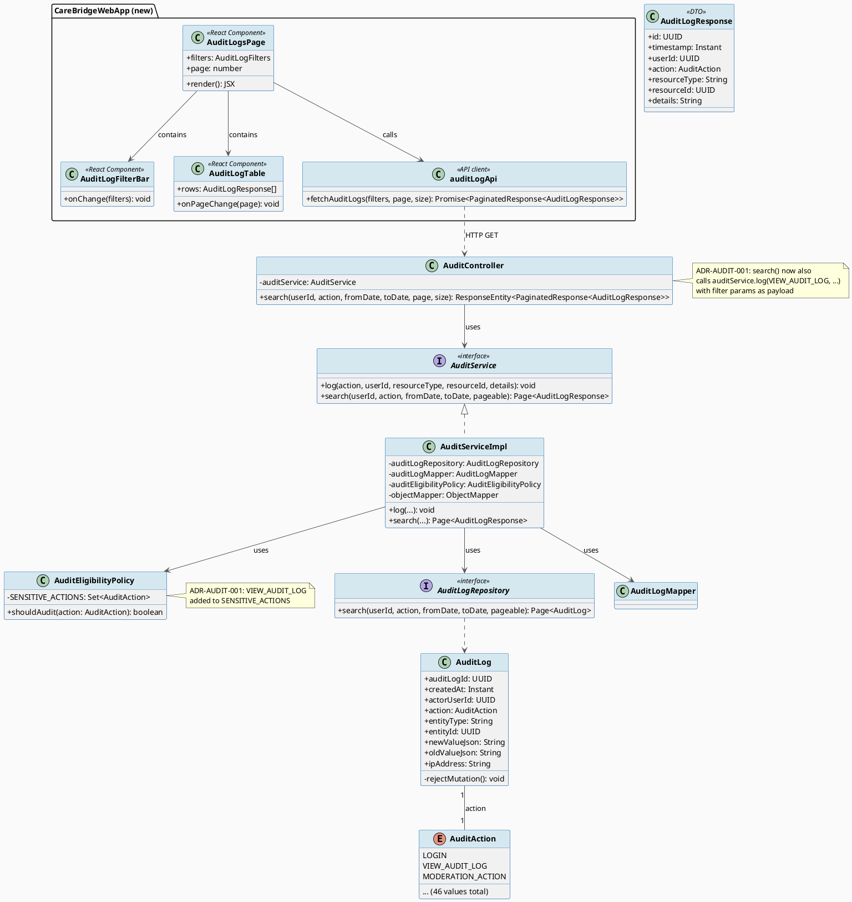
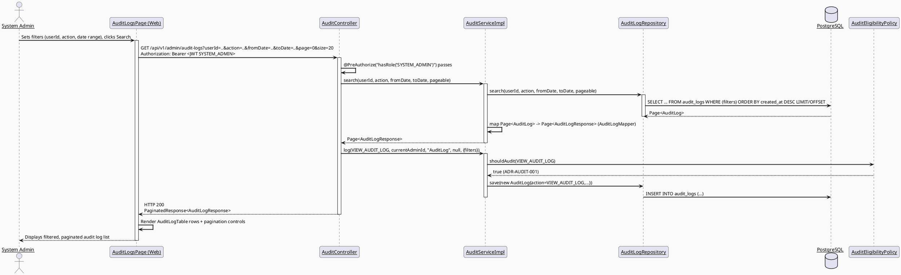
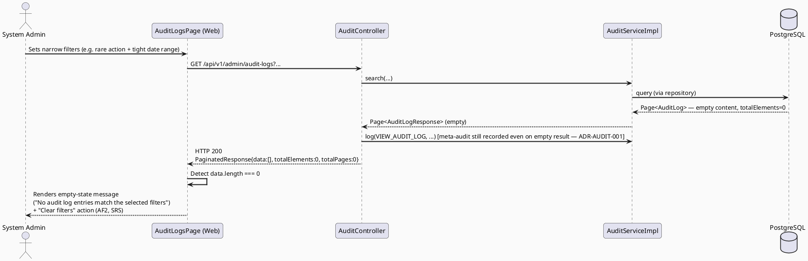
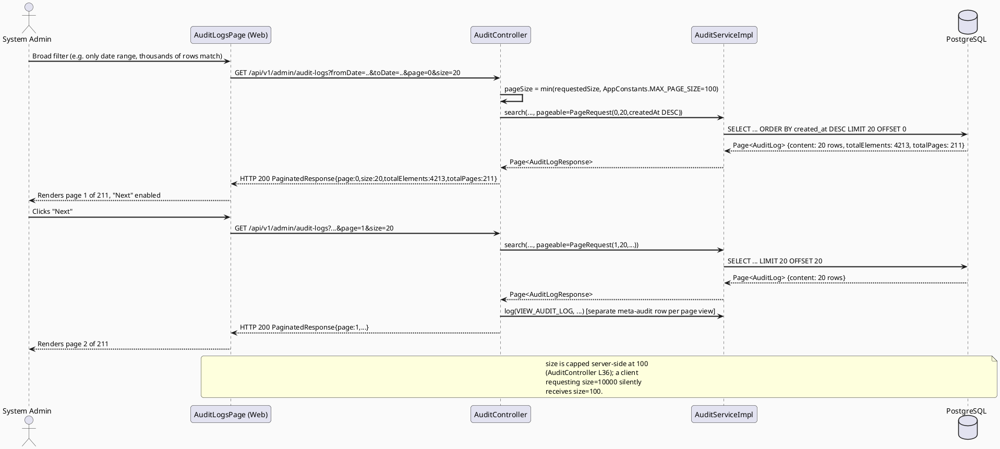

# ENGINEERING DOCUMENTATION STANDARD (EDS) v2.0
# UC117 — View Audit Logs — Technical Design Specification

| Field | Value |
|-------|-------|
| **Document ID** | `CB-AUDIT-IMP-117` |
| **Version** | `1.0` |
| **Date** | `2026-07-02` |
| **Status** | `Draft` |
| **Document Owner** | `TV1-Phương` |
| **Author** | `AI Agent (Technical Architect)` |
| **Reviewed by** | `[Tech Lead — Pending]` |
| **DPO Sign-off** | `[ ] Pending` *(read surface exposes actor_user_id, entity_id, ip_address, and JSON diff payloads that may contain PII of any platform user — bulk read access requires DPO review before production)* |
| **Approved by** | `[Principal Architect — Pending]` |
| **Last Review** | `2026-07-02` |
| **Based on EDS** | `v2.0` |

---

## CHANGELOG

| Ngày | Người thực hiện | Nội dung thay đổi |
|------|-----------------|-------------------|
| 2026-07-02 | AI Agent — Technical Architect | Tạo tài liệu lần đầu (Draft) cho UC117 |
| 2026-07-02 | AI Agent | Đóng OI-117-5: Product xác nhận MODERATOR KHÔNG được truy cập audit log — giữ nguyên SYSTEM_ADMIN-only, khớp code hiện tại |

---

## MỤC LỤC

1. [Tổng quan Module](#1-tổng-quan-module)
2. [Ma trận Truy vết](#2-ma-trận-truy-vết-traceability-matrix)
3. [Architecture Decision Records (ADR)](#3-architecture-decision-records-adr)
4. [Non-Functional Requirements & SLA](#4-non-functional-requirements--sla)
5. [Static Modeling](#5-static-modeling-mô-hình-tĩnh)
6. [Dynamic Modeling](#6-dynamic-modeling-mô-hình-động)
7. [Domain Event Catalog](#7-domain-event-catalog)
8. [Interface Specification](#8-interface-specification-đặc-tả-giao-diện)
9. [API Specification](#9-api-specification)
10. [Bảng mã lỗi](#10-bảng-mã-lỗi-error-codes)
11. [Quy trình Triển khai](#11-quy-trình-triển-khai-step-by-step)
12. [Rollback & Incident Runbook](#12-rollback--incident-runbook)
13. [Kịch bản Kiểm thử Chi tiết](#13-kịch-bản-kiểm-thử-chi-tiết)
14. [Phương pháp Xác minh](#14-phương-pháp-xác-minh)
15. [Mẫu thử thực tế](#15-mẫu-thử-thực-tế-api-verification-samples)
16. [Bảng tổng hợp phân quyền](#16-bảng-tổng-hợp-phân-quyền-authorization-matrix)
17. [AI Prompt Constraints (CASE 2.0)](#17-ai-prompt-constraints-case-20)

---

## 1. Tổng quan Module

| Field | Value |
|-------|-------|
| **Module Name** | `Audit — View Audit Logs (Admin Portal)` |
| **Bounded Context** | `Audit / Admin Governance` — existing backend package `com.carebridge.backend.audit`, sibling of `com.carebridge.backend.security` |
| **Function ID / UC** | `3.2.2.19 View Audit Logs` / `UC-117` |
| **Primary Actor** | System Admin |
| **Secondary Actors** | None (SRS-confirmed) |
| **Platform** | Web — Admin Portal (React + TypeScript + Vite) |
| **Priority** | High |
| **Sprint / Owner** | Sprint 3 "Cross-Domain Integration" — TV1-Phương |
| **Data Classification** | `PII` (actor_user_id, entity_id, ip_address, and free-form `new_value_json`/`old_value_json` diff payloads may embed user PII copied at write time by upstream `AuditService.log(...)` callers) |
| **Compliance Scope** | `PDPA (Luật 91/2025)`, `BR-RBAC`, `BR-SAFETY` |
| **Upstream Dependencies** | `audit` package (`AuditLog` entity, `AuditLogRepository`, `AuditService`/`AuditServiceImpl`, `AuditLogMapper`, `AuditEligibilityPolicy`), `security` package (JWT/`@PreAuthorize` infrastructure) |
| **Downstream Consumers** | None identified — this is a terminal read surface for compliance/complaint/moderation review |

### 1.1 Scope Statement — Backend read API already exists; this UC is a thin frontend + one policy fix

Repository inspection confirms the **backend read API for UC117 already exists and is functionally complete**:
- `audit.controller.AuditController` — `GET /api/v1/admin/audit-logs`, secured with `@PreAuthorize("hasRole('SYSTEM_ADMIN')")`, supports filter params `userId`, `action` (enum `AuditAction`), `fromDate`, `toDate`, and `page`/`size` pagination (capped at `AppConstants.MAX_PAGE_SIZE = 100`), sorted `createdAt DESC`.
- `audit.service.AuditService` / `AuditServiceImpl.search(...)` — delegates to `AuditLogRepository.search(...)`, a single parametrized JPQL query with null-safe optional filters.
- `audit.repository.AuditLogRepository` — `search(userId, action, fromDate, toDate, pageable)` JPQL query over `AuditLog`.
- `audit.entity.AuditLog` — JPA entity mapped to `audit_logs` table; `@PreUpdate`/`@PreRemove` throw `UnsupportedOperationException` (append-only invariant already enforced at entity level).
- `audit.mapper.AuditLogMapper` — maps `AuditLog` → `AuditLogResponse` DTO (never exposes the entity directly, per CLAUDE.md rule).
- `audit.dto.response.AuditLogResponse` — `id`, `timestamp`, `userId`, `action`, `resourceType`, `resourceId`, `details` (details = raw `new_value_json` string, unfiltered — see ADR-AUDIT-002).

**No new backend controller, service, repository, or entity is required.** This TDS scopes UC117 to:
1. **One backend policy fix** — see ADR-AUDIT-001 (meta-audit gap).
2. **New Admin Portal frontend page** (`features/audit/pages/AuditLogsPage.tsx` or equivalent) — filter form (user, action type, date range), paginated table, empty state, loading/error state — wired to the existing `GET /api/v1/admin/audit-logs` endpoint. No new backend contract is introduced; the frontend consumes the existing `AuditLogResponse` shape as-is.

Repository-wide search of `05_Development/CareBridgeWebApp/src` confirms **no existing frontend page** references `audit-logs` or `AuditLog` — the `features/security/pages/*` pages cover `security_events` (a related but distinct table/UC), not `audit_logs`. UC117's frontend is new.

### 1.2 Source Conflict — `AuditQueryRequest` DTO unused (Resolved)

`audit.dto.request.AuditQueryRequest` exists (`userId: Long`, `action`, `fromDate`, `toDate`) but is **not referenced anywhere** in `AuditController` or `AuditService` — the controller binds filter params directly via `@RequestParam`, and `userId` there is typed `UUID` (not `Long`, mismatching the DTO). This is dead/stale code, not part of the active contract. **This TDS documents the active `@RequestParam`-based contract only** and does not resurrect `AuditQueryRequest`. Flagged for Principal Architect awareness — not silently dropped; no action taken (out of scope for a read-only UC to refactor unrelated dead DTOs).

---

## 2. Ma trận Truy vết (Traceability Matrix)

| Requirement ID | Loại (BR/ADR/US) | Mô tả yêu cầu | Thành phần Code | Compliance Target | ADR liên quan |
|----------------|------------------|---------------|-----------------|-------------------|---------------|
| UC-117 (SRS §3.2.2.19) | Use Case | Displays audit logs for complaint review, data-access review, moderation traceability | `AuditController.GET /api/v1/admin/audit-logs`, new `AuditLogsPage.tsx` | BR-RBAC | ADR-AUDIT-001, ADR-AUDIT-002 |
| BR-RBAC | Business Rule | Users may access only functions allowed by role/permission scope | `@PreAuthorize("hasRole('SYSTEM_ADMIN')")` on `AuditController` | Authorization | ADR-AUDIT-001 |
| BR-SAFETY | Business Rule | Medical guidance must be non-diagnostic, escalation-aware, red-flag safe | N/A — UC117 is a read-only log viewer, no guidance/diagnosis surface | — | — |
| POST-3 (SRS, Postconditions) | Use Case | Sensitive actions are recorded for audit, safety, or privacy review where required | `AuditEligibilityPolicy.shouldAudit(VIEW_AUDIT_LOG)` (currently **missing** — see ADR-AUDIT-001) | GDPR Art. 30 (records of processing) | ADR-AUDIT-001 |
| — | Existing Entity | Append-only audit trail | `AuditLog.rejectMutation()` (`@PreUpdate`/`@PreRemove`) | GDPR Art. 5.1(e) | — |

---

## 3. Architecture Decision Records (ADR)

### ADR-AUDIT-001 — Meta-audit: viewing audit logs must itself be audited

| Field | Value |
|-------|-------|
| **Status** | `Accepted` |
| **Deciders** | `AI Agent (Technical Architect)` |
| **Date** | `2026-07-02` |
| **Supersedes** | — |

#### Bối cảnh (Context)
UC117 exposes a bulk-read surface over `audit_logs`, which itself contains sensitive records (logins, consent, health record access, payments, security events). Per CLAUDE.md's project-wide audit mandate ("For health, location, payment, expert, moderation, and safety workflows: enforce existing RBAC, consent scope/expiry, and audit requirements") and GDPR Art. 30 (records of processing activities), access to this surface is itself a sensitive/reportable action — a compromised or curious admin account reading the audit trail is a security-relevant event that must leave its own trail (a "meta-audit" or "audit of the audit"). The enum value `AuditAction.VIEW_AUDIT_LOG` already exists in both the Java enum and the `audit_logs_action_check` DB constraint, indicating this was anticipated by a prior author — but it is **not wired**: `AuditEligibilityPolicy.SENSITIVE_ACTIONS` (the allowlist gating `AuditServiceImpl.log(...)`) does not include `VIEW_AUDIT_LOG`, and `AuditController.search(...)` never calls `auditService.log(...)` at all.

#### Các phương án đã xem xét (Options Considered)

| Phương án | Mô tả | Ưu điểm | Nhược điểm |
|-----------|-------|----------|------------|
| A | Do nothing — leave `VIEW_AUDIT_LOG` unwired | No implementation cost | Violates CLAUDE.md audit mandate + GDPR Art. 30; a hostile/compromised SYSTEM_ADMIN account can read the entire audit trail with zero trace |
| B | Log every `search()` call as `VIEW_AUDIT_LOG`, including filter params (userId/action/date range) in `newValueJson`, add `VIEW_AUDIT_LOG` to `AuditEligibilityPolicy.SENSITIVE_ACTIONS` | Closes the gap; reuses existing enum value and existing `AuditService.log(...)` contract — zero new infrastructure | Adds one extra write per search call (acceptable at admin-portal query volume, not a hot path) |
| C | Log only on first page load (page=0) to reduce write volume on pagination scroll | Fewer audit rows | Loses fidelity — an admin paging deep into another admin's activity would not be fully traced; against append-only "every access matters" principle for this data class |

#### Quyết định (Decision)
Chọn **Phương án B**: `AuditController.search(...)` calls `auditService.log(AuditAction.VIEW_AUDIT_LOG, currentAdminUserId, "AuditLog", null, {filters})` on every invocation, and `VIEW_AUDIT_LOG` is added to `AuditEligibilityPolicy.SENSITIVE_ACTIONS`. The logged `details` payload records the **filter parameters only** (userId/action/fromDate/toDate/page/size) — never the result rows themselves, to avoid quadratic PII duplication (logging N result rows every time someone views N rows would balloon the audit table and duplicate the same PII it is trying to protect).

#### Hệ quả (Consequences)

**Tích cực:**
- Closes the CLAUDE.md audit-mandate gap; SYSTEM_ADMIN access to the audit trail is itself traceable — satisfies GDPR Art. 30 self-referentially.
- Reuses 100% existing infrastructure (`AuditService.log`, `AuditAction.VIEW_AUDIT_LOG`, `AuditEligibilityPolicy`) — one-line policy change + one call in the controller.

**Tiêu cực / Trade-offs:**
- Every audit-log page view now writes a row — mitigated by only recording filter metadata (small payload) and by `audit_logs` already being designed for high write volume (UUID PK, no unique constraints beyond PK).

**Compliance Impact:**
- Positive: strengthens GDPR Art. 30 / Art. 32 posture. No negative compliance impact.

---

### ADR-AUDIT-002 — Filter/search scope and `details` field redaction (Open)

| Field | Value |
|-------|-------|
| **Status** | `Proposed` |
| **Deciders** | `AI Agent (Technical Architect)` — pending Principal Architect / DPO confirmation |
| **Date** | `2026-07-02` |
| **Supersedes** | — |

#### Bối cảnh (Context)
SRS §3.2.2.19 UC-117 gives only the generic template text — *"AF3. Optional filters, search terms, attachments, or shared context may be added when the screen supports them"* — with no exact field list. The existing backend contract (`AuditController.search`) already implements three concrete filters: `userId` (exact match), `action` (exact enum match), and a `fromDate`/`toDate` range on `createdAt`. There is no free-text search, no `entityType`/`entityId` filter, and no `ipAddress` filter exposed at the API layer today (even though `AuditLog.ipAddress` and `AuditLog.entityType`/`entityId` exist as columns).

#### Các phương án đã xem xét (Options Considered)

| Phương án | Mô tả | Ưu điểm | Nhược điểm |
|-----------|-------|----------|------------|
| A | Frontend scope = exactly the 3 existing backend filters (userId, action, date range) | Zero backend change; ships fastest; matches "thin read layer" mandate | Cannot filter by entity/resource type or IP — a real admin complaint-review workflow (e.g., "who viewed health record X") may need `entityType`/`entityId` filtering |
| B | Add `entityType`/`entityId` query params to `AuditController` + repository query (columns already exist, no migration needed) | Materially better for complaint/data-access review (the SRS's stated purpose) | Backend contract change beyond "thin read layer" — needs sign-off |

#### Quyết định (Decision)
**Open — deferred to Principal Architect / Product.** This TDS specifies the frontend against **Option A** (existing 3 filters: userId, action, date range) as the buildable baseline for Sprint 3, since it requires no backend contract change and SRS does not mandate entity-level filtering. Extending to `entityType`/`entityId` (Option B) is called out as a fast-follow if complaint-review workflows require it — tracked as `Open Item OI-117-1` below, not implemented in this pass.

#### Hệ quả (Consequences)

**Tích cực:**
- Ships against a stable, already-tested backend contract; no API versioning risk.

**Tiêu cực / Trade-offs:**
- Admin cannot filter "all views of health record X" directly from the UI in v1 — must filter by `action=VIEW_HEALTH_RECORD` + manually scan `resourceId` in the returned rows.

**Compliance Impact:** None — no PII exposure change either way.

**Open Items:**
- `OI-117-1`: Should `entityType`/`entityId` become filterable query params? — Open, needs Product/Architect decision.
- `OI-117-2`: `AuditLogResponse.details` returns the **raw, unredacted** `new_value_json` string as written by every upstream caller across the codebase (auth, health records, payments, consent, moderation, etc.). Some of those payloads may contain PII (e.g., email/phone captured in a `PROFILE_UPDATED` diff). SRS does not specify field-level redaction for this UC. **Decision on whether to redact/mask `details` before it reaches the Admin Portal is Open** — flagged for DPO review per the DPO Sign-off row in the header. Interim mitigation (this TDS): frontend renders `details` in a collapsed/expandable JSON viewer (not inline in the table) to reduce accidental over-exposure at a glance, and the CASE 2.0 constraint block (§17) forbids the frontend from doing any additional client-side enrichment of `details`.

---

## 4. Non-Functional Requirements & SLA

### 4.1. Performance & Availability

| Category | Requirement | Target SLA | Measurement Method | Compliance Basis |
|----------|-------------|------------|---------------------|------------------|
| Latency | `GET /api/v1/admin/audit-logs` (p99) | `< 500ms` for page size ≤ 100 | Manual timing / APM | — |
| Availability | Admin Portal audit page uptime | Tied to overall API uptime (99.9%) | Uptime monitor | — |
| Pagination | Max page size | `100` (enforced server-side via `AppConstants.MAX_PAGE_SIZE`) | Code inspection (`AuditController` L36) | — |

### 4.2. Data Integrity & Retention

| Category | Requirement | Target | Verification Method | Compliance Basis |
|----------|-------------|--------|---------------------|------------------|
| Immutability | `audit_logs` rows never updated/deleted | Enforced at entity level (`AuditLog.rejectMutation()`) | Unit test asserting `UnsupportedOperationException` | GDPR Art. 5.1(e) |
| Retention | Audit log retention | Per existing CareBridge data-retention policy (not redefined by this UC) | DB backup policy | GDPR Art. 5.1(e) |
| Meta-audit completeness | Every `GET /api/v1/admin/audit-logs` call produces exactly one `VIEW_AUDIT_LOG` row | 100% (see ADR-AUDIT-001) | Integration test | GDPR Art. 30 |

### 4.3. Security

| Category | Requirement | Target | Verification Method | Compliance Basis |
|----------|-------------|--------|---------------------|------------------|
| Access control | `GET /api/v1/admin/audit-logs` | `SYSTEM_ADMIN` only, least privilege | Auth Matrix (§16) + existing `@PreAuthorize` | GDPR Art. 25, BR-RBAC |
| Transport | All endpoints | TLS (inherits platform-wide config) | SSL scan | GDPR Art. 32 |
| PII minimization | `details` field in list view | Collapsed/expandable rendering, no plaintext table column (see ADR-AUDIT-002) | Frontend code review | GDPR Art. 5.1(c) (data minimization) |

### 4.4. Scalability & Capacity Planning

`audit_logs` is a high-write, append-only table shared across the entire platform (every `AuditService.log(...)` call from every domain writes here). UC117 only adds read (pagination/filter) load plus one extra write per page-view (ADR-AUDIT-001). Existing indexing strategy (PK on `audit_log_id`) is inherited as-is — no new index is proposed in this TDS; if filter-query latency becomes an issue at scale, an index on `(created_at, actor_user_id, action)` should be proposed in a follow-up migration (not created here, since current schema already ships without one and this UC does not change query shape).

---

## 5. Static Modeling (Mô hình Tĩnh)

### 5.1. Class Diagram (PlantUML)



### 5.2. Data Structure (Flyway SQL Migration)

**No migration needed.** UC117 is a pure read layer over the existing `audit_logs` table, already defined at `05_Development/CareBridgeAPI/src/main/resources/db/migration/V1__init_schema.sql` (L28-42):

```sql
CREATE TABLE public.audit_logs (
    audit_log_id uuid NOT NULL,
    action character varying(80) NOT NULL,
    actor_user_id uuid,
    created_at timestamp(6) with time zone NOT NULL,
    entity_id uuid,
    entity_type character varying(100),
    ip_address character varying(80),
    new_value_json jsonb,
    old_value_json jsonb,
    CONSTRAINT audit_logs_action_check CHECK (((action)::text = ANY ((ARRAY['LOGIN'::character varying, ... 'VIEW_AUDIT_LOG'::character varying])::text[])))
);
-- PK: audit_logs_pkey PRIMARY KEY (audit_log_id)  [L1279-1280]
```

The Java `AuditAction` enum (`audit.entity.AuditAction`) already carries **more values (52)** than the DB `audit_logs_action_check` constraint's array (14 values, including `VIEW_AUDIT_LOG`). This drift predates UC117 and is out of scope to reconcile here — `@Enumerated(EnumType.STRING)` will fail at insert time for any of the ~38 enum values not present in the CHECK constraint's array. **Flagged as `Open Item OI-117-3`**: not a UC117 regression (the drift exists today independent of this feature) but directly relevant since ADR-AUDIT-001 requires inserting `VIEW_AUDIT_LOG`, which **is** present in the constraint array — so ADR-AUDIT-001's insert will succeed. No migration change is required for UC117 itself.

`security_events` table (L428-447) is a related but separate table (used by `SecurityIncidentController`, not `AuditController`) and is out of scope for UC117.

---

## 6. Dynamic Modeling (Mô hình Động)

### 6.1. Sequence Diagram — Happy Path: Filter + Fetch (PlantUML)



### 6.2. Sequence Diagram — Empty State (PlantUML)



### 6.3. Sequence Diagram — Large-Result Pagination (PlantUML)



### 6.4 State Machine

Not applicable — `AuditLog` rows have no state machine (immutable, append-only, single terminal state once written; see `rejectMutation()`). UC117 introduces no new stateful entity.

---

## 7. Domain Event Catalog

### 7.1. Events Published (Phát ra)

| Event Name | Trigger | Publisher | Subscriber(s) | Payload Schema | Async? |
|------------|---------|-----------|---------------|----------------|--------|
| `VIEW_AUDIT_LOG` (AuditAction, persisted as an `AuditLog` row — not a Spring `ApplicationEvent`) | `AuditController.search(...)` invoked (ADR-AUDIT-001) | `AuditController` → `AuditServiceImpl.log(...)` | None (write-only meta-audit trail; consumed only by future audit-of-audit review, out of scope) | `AuditLog` entity fields; `newValueJson` = `{userId, action, fromDate, toDate, page, size}` filter snapshot | No (synchronous, same transaction boundary as the read) |

No Spring `ApplicationEvent`/pub-sub mechanism is used by the `audit` package (confirmed by reading `AuditServiceImpl` — it calls `auditLogRepository.save(...)` directly, no `ApplicationEventPublisher`). This UC follows the same existing pattern; no new event bus integration is introduced.

### 7.2. Events Consumed (Tiêu thụ)

None. UC117 is a pure read + one derived write (meta-audit); it does not consume events from other domains.

---

## 8. Interface Specification (Đặc tả Giao diện)

### 8.1. Service Interface (existing — unchanged by UC117)

```java
// I already exists as audit.service.AuditService — no @version bump needed,
// no signature change. Reproduced here for traceability only.
public interface AuditService {
    void log(AuditAction action, UUID userId, String resourceType, String resourceId, Object details);
    void log(AuditAction action, String userId, String resourceId, Object details);
    Page<AuditLogResponse> search(UUID userId, AuditAction action, Instant fromDate, Instant toDate, Pageable pageable);
}
```

**Change introduced by UC117 (ADR-AUDIT-001):** `AuditController.search(...)` gains one additional call: `auditService.log(AuditAction.VIEW_AUDIT_LOG, currentAdminUserId, "AuditLog", null, filterSnapshot)`, using the existing `log(...)` overload — no interface change.

**`currentAdminUserId` source:** must be resolved via the existing `SecurityUtils.requireCurrentUserId(principal)` pattern already used in `SecurityIncidentController` (§ file read above), injecting `Principal principal` into the controller method signature — consistent with the codebase's established identity-resolution convention (CASE 2.0 constraint C4, §17).

### 8.2. Frontend API Client Contract (new)

```typescript
// features/audit/api/auditLogApi.ts (new file — path per Delivery Rules, thin layer only)
// @version 1.0

export interface AuditLogFilters {
  userId?: string;      // UUID
  action?: string;       // AuditAction enum value
  fromDate?: string;     // ISO-8601 instant
  toDate?: string;       // ISO-8601 instant
}

export interface AuditLogResponseDto {
  id: string;
  timestamp: string;
  userId: string | null;
  action: string;
  resourceType: string | null;
  resourceId: string | null;
  details: string | null;
}

export interface PaginatedResponseDto<T> {
  success: boolean;
  data: T[];
  page: number;
  size: number;
  totalElements: number;
  totalPages: number;
}

// GET /api/v1/admin/audit-logs — thin wrapper, no client-side filtering/enrichment (CASE 2.0 C2)
export function fetchAuditLogs(
  filters: AuditLogFilters,
  page: number,
  size: number
): Promise<PaginatedResponseDto<AuditLogResponseDto>>;
```

---

## 9. API Specification

### 9.1. Endpoints Table

| Method | Path | Auth Level | Required Roles | Rate Limit | Idempotent? |
|--------|------|------------|----------------|------------|-------------|
| `GET` | `/api/v1/admin/audit-logs` | JWT Bearer | `SYSTEM_ADMIN` | Inherits platform default (no UC117-specific limit defined) | Yes |

No new endpoints are introduced. The above row documents the **existing, unchanged** endpoint that this UC's frontend consumes.

### 9.2. Request / Response Schemas

#### `GET /api/v1/admin/audit-logs?userId=&action=&fromDate=&toDate=&page=0&size=20`

**Response — 200 OK (Happy Path):**
```json
{
  "success": true,
  "data": [
    {
      "id": "550e8400-e29b-41d4-a716-446655440000",
      "timestamp": "2026-07-01T09:12:33.000Z",
      "userId": "8f14e45f-ceea-467e-adc0-84e1cc60c1a2",
      "action": "MODERATION_ACTION",
      "resourceType": "CommunityAnswer",
      "resourceId": "3fa85f64-5717-4562-b3fc-2c963f66afa6",
      "details": "{\"decision\":\"REMOVED\",\"reason\":\"policy_violation\"}"
    }
  ],
  "page": 0,
  "size": 20,
  "totalElements": 4213,
  "totalPages": 211
}
```

**Response — 200 OK (Empty State, AF2):**
```json
{
  "success": true,
  "data": [],
  "page": 0,
  "size": 20,
  "totalElements": 0,
  "totalPages": 0
}
```

**Response — 401 Unauthorized (no/expired JWT):**
```json
{
  "success": false,
  "data": null,
  "error": { "code": "IAM-001", "message": "Authentication required" }
}
```

**Response — 403 Forbidden (authenticated but not SYSTEM_ADMIN — E1):**
```json
{
  "success": false,
  "data": null,
  "error": { "code": "AUDIT-004", "message": "Insufficient permissions" }
}
```

**Response — 400 Bad Request (malformed date param — E2):**
```json
{
  "success": false,
  "data": null,
  "error": {
    "code": "AUDIT-001",
    "message": "Invalid query parameter",
    "details": [{ "field": "fromDate", "message": "fromDate must be a valid ISO-8601 instant" }]
  }
}
```

---

## 10. Bảng mã lỗi (Error Codes)

| Code | HTTP Status | Message (EN) | Message (VI) | Trigger Condition |
|------|-------------|--------------|--------------|-------------------|
| `AUDIT-001` | 400 | Invalid query parameter | Tham số truy vấn không hợp lệ | `fromDate`/`toDate` fails `@DateTimeFormat(ISO.DATE_TIME)` parsing, or `action` is not a valid `AuditAction` enum value |
| `AUDIT-002` | 400 | Invalid date range | Khoảng thời gian không hợp lệ | `fromDate` is after `toDate` (validation not currently implemented in `AuditController` — **Open Item OI-117-4**: recommend adding this check; currently the query simply returns zero rows rather than erroring) |
| `AUDIT-003` | 404 | Not applicable — list endpoint has no single-resource 404 | — | N/A (no `GET /audit-logs/{id}` endpoint exists) |
| `AUDIT-004` | 403 | Insufficient permissions | Không đủ quyền | Caller authenticated but role != `SYSTEM_ADMIN` (`@PreAuthorize` rejection) |
| `AUDIT-005` | 500 | Internal error | Lỗi hệ thống | Unexpected repository/DB failure during `search(...)` |
| `IAM-001` | 401 | Authentication required | Yêu cầu xác thực | Missing/expired/invalid JWT (platform-wide, not UC117-specific) |

`OI-117-4` (date-range validation) is marked Open — not blocking, since `fromDate > toDate` degrades gracefully to an empty result set today rather than an error or crash; whether to upgrade this to an explicit 400 is a UX/Product call, not a correctness bug.

---

## 11. Quy trình Triển khai (Step-by-Step)

### 11.1. Prerequisites

- [ ] ADR-AUDIT-001 Accepted (this document) — ADR-AUDIT-002 remains Open, does not block Phase A below
- [ ] DPO review of `details` field exposure (header DPO Sign-off row) — recommended before production rollout, not blocking Draft-to-dev implementation
- [ ] Test-Spec (`UC117_ViewAuditLogs_Test-Spec.md`) approved (separate document, per `implement-flow.md`)

### 11.2. Pre-Migration Checklist

**Not applicable — no migration in this UC** (§5.2).

### 11.3. Implementation Steps

#### Chặng 1 — Backend: close the meta-audit gap (ADR-AUDIT-001)

File: `05_Development/CareBridgeAPI/src/main/java/com/carebridge/backend/audit/policy/AuditEligibilityPolicy.java`
```java
private static final Set<AuditAction> SENSITIVE_ACTIONS = EnumSet.of(
        ...,
        AuditAction.SECURITY_EVENT,
        AuditAction.VIEW_AUDIT_LOG);  // ADR-AUDIT-001
```

File: `05_Development/CareBridgeAPI/src/main/java/com/carebridge/backend/audit/controller/AuditController.java`
```java
// Add Principal parameter, resolve admin id via SecurityUtils (existing pattern),
// call auditService.log(VIEW_AUDIT_LOG, adminId, "AuditLog", null, filterSnapshot)
// after the search() call succeeds, before returning the response.
```

#### Chặng 2 — Frontend: new Audit Logs page

Files (new, under `05_Development/CareBridgeWebApp/src/features/audit/`):
- `api/auditLogApi.ts` — thin fetch wrapper (§8.2)
- `pages/AuditLogsPage.tsx` — page shell, filter state, pagination state
- `components/AuditLogFilterBar.tsx` — userId/action/date-range inputs
- `components/AuditLogTable.tsx` — paginated table + empty state + expandable `details` cell
- Route registration in the Admin Portal router (adjacent to existing `features/admin/pages/AdminDashboardPage.tsx` and `features/security/pages/*` route wiring — exact router file to be located during implementation, not fixed here to avoid guessing structure not yet inspected)

#### Chặng 3 — Verification sau deploy

```bash
curl -X GET "https://[host]/api/v1/admin/audit-logs?page=0&size=5" \
  -H "Authorization: Bearer [SYSTEM_ADMIN_JWT]"
# Expected: 200, PaginatedResponse with data[].length <= 5
# Then: confirm a new VIEW_AUDIT_LOG row was written (see §14.1)
```

### 11.4. Deployment Checklist

- [ ] `AuditEligibilityPolicy` unit test updated/passing (VIEW_AUDIT_LOG now sensitive)
- [ ] `AuditController` integration test confirms meta-audit row written per call
- [ ] Frontend page renders happy path, empty state, and pagination against a staging admin JWT
- [ ] No plaintext PII rendered outside the expandable `details` cell (ADR-AUDIT-002 interim mitigation)
- [ ] DPO notified per header Sign-off row (non-blocking for staging, recommended before prod)

---

## 12. Rollback & Incident Runbook

### 12.1. Điều kiện kích hoạt Rollback

| Điều kiện | Ngưỡng | Người quyết định |
|-----------|--------|------------------|
| `audit_logs` write volume spikes abnormally after ADR-AUDIT-001 deploy | > 2x baseline sustained 10 min | On-call Engineer |
| `AuditController` error rate | > 5% in 5 min | On-call Engineer |
| Meta-audit write failures blocking the read response | Any case (must not happen — see below) | Tech Lead |

### 12.2. Rollback Procedure

No schema change exists to revert. Rollback is code-only:

```bash
# Revert the AuditController + AuditEligibilityPolicy commit(s) for ADR-AUDIT-001
git revert <commit-sha>
# Re-deploy previous backend build
kubectl rollout undo deployment/carebridge-api
kubectl rollout status deployment/carebridge-api
curl -X GET https://[host]/api/v1/health
```

Frontend rollback: revert/hide the new `AuditLogsPage` route; no backend dependency breaks (the existing `GET /api/v1/admin/audit-logs` endpoint continues to function for any other caller).

**Design constraint carried into implementation:** the meta-audit write in `AuditController.search(...)` must not be allowed to fail the read request — wrap in a try/catch that logs a warning on failure rather than propagating, so a transient audit-write failure never blocks an admin's ability to view the audit trail (availability > meta-audit completeness for this specific call site). This mirrors `AuditServiceImpl.toJson(...)`'s existing fail-soft pattern (catches serialization exceptions and logs a warning rather than throwing).

### 12.3. Notification Protocol

| Thời điểm | Người nhận | Kênh | Template |
|-----------|------------|------|----------|
| Ngay khi phát hiện | On-call team | Slack `#incident` | "UC117 audit-logs incident: [mô tả]" |
| Trong 30 phút | DPO | Email | Only if PII exposure suspected (e.g., `details` field leak) |

### 12.4. Post-Incident Review (PIR)

Standard CareBridge PIR template applies (Timeline / Root Cause / Impact / Remediation / Prevention) — no UC117-specific additions.

---

## 13. Kịch bản Kiểm thử Chi tiết

> Deferred to the companion `UC117_ViewAuditLogs_Test-Spec.md` (separate document per `implement-flow.md`). This TDS provides the design surface (§6, §8, §9, §16) that the Test-Spec will exercise.

---

## 14. Phương pháp Xác minh

### 14.1. Database Inspection

```sql
-- Verify a search-triggered meta-audit row was written (ADR-AUDIT-001)
SELECT audit_log_id, action, actor_user_id, entity_type, created_at, new_value_json
FROM audit_logs
WHERE action = 'VIEW_AUDIT_LOG'
ORDER BY created_at DESC
LIMIT 5;

-- Verify append-only invariant (no UPDATE ever succeeds)
-- Expect application-level UnsupportedOperationException, not a DB-level check —
-- confirm no direct SQL UPDATE/DELETE path exists in the codebase (grep, not DB-enforced)
```

### 14.2. Log / Audit Verification

```bash
kubectl logs -l app=carebridge-api | grep '"action":"VIEW_AUDIT_LOG"' | head -5
```

### 14.3. Tool-based Verification

```bash
echo "[SYSTEM_ADMIN_JWT]" | cut -d'.' -f2 | base64 -d | jq .
# Confirm role claim == SYSTEM_ADMIN before testing 200 path;
# then test with a non-admin JWT and confirm 403 (§16)
```

---

## 15. Mẫu thử thực tế (API Verification Samples)

### 15.1. Happy Path

```bash
curl -X GET "https://[host]/api/v1/admin/audit-logs?action=MODERATION_ACTION&page=0&size=10" \
  -H "Authorization: Bearer [SYSTEM_ADMIN_JWT]"
```

**Expected Response (200):** see §9.2 happy-path sample.

### 15.2. Error Paths

```bash
# Non-admin role -> 403
curl -X GET "https://[host]/api/v1/admin/audit-logs" \
  -H "Authorization: Bearer [MOTHER_ROLE_JWT]"
```
**Expected Response (403):** see §9.2 AUDIT-004 sample.

```bash
# No JWT -> 401
curl -X GET "https://[host]/api/v1/admin/audit-logs"
```
**Expected Response (401):** see §9.2 IAM-001 sample.

---

## 16. Bảng tổng hợp phân quyền (Authorization Matrix)

> SRS §3.2.2.19 names **System Admin** as the sole Primary Actor, with "Secondary Actors: None." No SRS text grants MODERATOR (or any other role) scoped access to this UC. Existing code (`AuditController`, `@PreAuthorize("hasRole('SYSTEM_ADMIN')")`) matches this — confirmed, not assumed.

| Endpoint | `GUEST` | `MOTHER`/`FAMILY`/`EXPERT`/`PARTNER` | `MODERATOR` | `CONTENT_ADMIN` | `SYSTEM_ADMIN` |
|----------|---------|--------------------------------------|--------------|------------------|----------------|
| `GET /api/v1/admin/audit-logs` | ❌ | ❌ | ❌ | ❌ | ✅ All |

**Chú thích:**
- ✅ = Được phép
- ❌ = Bị từ chối (403, or 401 if unauthenticated)
- **`OI-117-5` — RESOLVED 2026-07-02**: Product/Tech Lead confirmed `MODERATOR` does **NOT** get scoped access. Access remains `SYSTEM_ADMIN`-only, matching SRS §3.2.2.19 ("Secondary Actors: None") and current code (`@PreAuthorize("hasRole('SYSTEM_ADMIN')")`) exactly — no code or design change required.

---

## 17. AI Prompt Constraints (CASE 2.0)

### 17.1 Constraint Summary Table

| # | Constraint | Source (ADR/BR) | Last Verified |
|---|-----------|-----------------|---------------|
| C1 | Backend implementation is limited to: (a) adding `VIEW_AUDIT_LOG` to `AuditEligibilityPolicy.SENSITIVE_ACTIONS`, (b) adding one `auditService.log(...)` call in `AuditController.search(...)`. No changes to `AuditServiceImpl`, `AuditLogRepository`, `AuditLog` entity, or `AuditLogMapper` are authorized by this TDS. | ADR-AUDIT-001 | 2026-07-02 |
| C2 | The frontend MUST NOT perform client-side filtering, redaction logic, or enrichment of `details` beyond collapsed/expandable rendering — all filtering happens server-side via the existing query params. | ADR-AUDIT-002 | 2026-07-02 |
| C3 | Do not resurrect or wire up `audit.dto.request.AuditQueryRequest` — it is confirmed dead code and out of scope (§1.2). | §1.2 (Source Conflict) | 2026-07-02 |
| C4 | Resolve the acting admin's identity via `SecurityUtils.requireCurrentUserId(principal)` (the pattern already used in `SecurityIncidentController`), never by trusting a client-supplied user id. | §8.1, BR-RBAC | 2026-07-02 |
| C5 | Controller layer only orchestrates (calls `AuditService`); no business/authorization logic beyond the existing `@PreAuthorize("hasRole('SYSTEM_ADMIN')")` may be added to `AuditController` per CLAUDE.md's controller/service layering rule. | CLAUDE.md Architecture rules | 2026-07-02 |
| C6 | The meta-audit write (ADR-AUDIT-001) MUST be fail-soft (try/catch + warn-log) and must never cause the read request to fail. | §12.2 | 2026-07-02 |
| C7 | No new Flyway migration file may be created for this UC (§5.2 — schema is unchanged). | §5.2 | 2026-07-02 |

### 17.2 Constraint Injection Block (Copy-Paste vào AI Prompt)

```
[CONSTRAINT BLOCK — Module: UC117 View Audit Logs]
Theo TDS CB-AUDIT-IMP-117 và các ADR liên quan:

1. Backend change is limited to AuditEligibilityPolicy (add VIEW_AUDIT_LOG) and
   AuditController (add one auditService.log(VIEW_AUDIT_LOG, ...) call after search()).
   Do not modify AuditServiceImpl, AuditLogRepository, AuditLog entity, or AuditLogMapper.
2. Frontend does zero client-side filtering/redaction; all filters are server-side
   query params (userId, action, fromDate, toDate, page, size) against the existing
   GET /api/v1/admin/audit-logs contract.
3. Do not use or resurrect AuditQueryRequest — it is dead code, confirmed unused.
4. Resolve acting admin identity via SecurityUtils.requireCurrentUserId(principal);
   never trust a client-supplied admin id.
5. The meta-audit log(...) call must be wrapped fail-soft — a logging failure must
   never cause the GET /audit-logs response to fail.
6. No new Flyway migration — audit_logs schema is unchanged.

[CONTEXT BLOCK]
- Bounded Context: Audit / Admin Governance (com.carebridge.backend.audit)
- Data Classification: PII
- Compliance: PDPA (Luật 91/2025), GDPR Art. 30 (self-referential via meta-audit)
- Existing interfaces: §8 Service Interface + §8.2 Frontend API Client Contract
- Error codes: §10 Error Codes Table
- Auth matrix: §16 Authorization Matrix (SYSTEM_ADMIN only)

[TASK BLOCK]
Implement the ADR-AUDIT-001 policy fix and the new AuditLogsPage frontend
satisfying constraints above. Output must comply with §8 Interface Specification.
Tests must cover the scenarios in the companion Test-Spec document.
```

### 17.3 Constraint Quality Checklist

- [x] Mỗi constraint traceable về ADR hoặc BR cụ thể
- [x] Không có constraint generic
- [x] Mỗi constraint có `Last Verified` date ≤ 2 sprints (2026-07-02)
- [x] Constraint block có ≥ 3 constraints cụ thể (7 total)
- [x] Constraint block reference §8 Interface
- [x] Constraint block reference §16 Auth Matrix

### 17.4 Anti-Pattern Detection

| AP-ID | Anti-Pattern | Dấu hiệu | Hành động |
|-------|-------------|-----------|----------|
| AP-AI-001 | Unconstrained Gen | Generated code adds new backend endpoints, DTOs, or entities beyond §17.1 C1 scope | Reject — this UC is a thin read layer, re-inject constraints |
| AP-AI-003 | Implicit Decision | Code assumes MODERATOR gets audit-log access (contradicts §16 — confirmed NOT granted, OI-117-5 resolved 2026-07-02) | Reject — MODERATOR access was explicitly considered and rejected; would require a new ADR to reverse |
| AP-AI-005 | Hallucinated Contract | Code imports/uses `AuditQueryRequest` or invents new query params not in §9.1 | Reject — verify against existing `AuditController` signature only |

---

## PHỤ LỤC

### A. Glossary

| Thuật ngữ | Định nghĩa |
|-----------|------------|
| Meta-audit | The practice of auditing access to the audit trail itself (ADR-AUDIT-001) |
| PII | Personally Identifiable Information |
| Append-only | Storage strategy disallowing UPDATE/DELETE, INSERT only — enforced by `AuditLog.rejectMutation()` |
| DPO | Data Protection Officer |
| Fail-soft | A failure mode where a secondary operation (e.g., meta-audit write) degrades gracefully without blocking the primary operation (the read response) |

### B. Open Items Summary

| ID | Description | Blocking? |
|----|--------------|-----------|
| `OI-117-1` | Should `entityType`/`entityId` become filterable query params? | No — fast-follow candidate |
| `OI-117-2` | Should `AuditLogResponse.details` be redacted/masked before reaching the Admin Portal? | No for Draft; recommended before production (DPO) |
| `OI-117-3` | Java `AuditAction` enum (52 values) vs. DB `audit_logs_action_check` constraint (14 values) drift — pre-existing, not a UC117 regression | No — `VIEW_AUDIT_LOG` is already in the constraint array |
| `OI-117-4` | Should `fromDate > toDate` return an explicit 400 instead of degrading to an empty result? | No — current behavior does not error |
| `OI-117-5` | ~~Should `MODERATOR` get scoped access (moderation-action-only rows)?~~ | **RESOLVED 2026-07-02** — Product confirmed no; SYSTEM_ADMIN-only stands |

### C. Tài liệu tham chiếu

| Document | Link / Path |
|----------|-------------|
| SRS §3.2.2.19 UC-117 | `02_Requirements/SRS/3_Functional_Specification.md` L1386-1405 |
| Sibling TDS (schema/authorization conventions) | `04_Implement/UC114_ManageUserAccounts/UC114_ManageUserAccounts_TDS.md` |
| Schema baseline | `05_Development/CareBridgeAPI/src/main/resources/db/migration/V1__init_schema.sql` (audit_logs L28-42, security_events L428-447) |
| Existing backend audit package | `05_Development/CareBridgeAPI/src/main/java/com/carebridge/backend/audit/` |
| TDS Template (EDS v2.0) | `08_References/Template/PHASE-3_TDS.md` |

---

*EDS v2.1 — Tích hợp CASE 2.0 AI Prompt Constraints (§17).*
*Status: Draft — pending Tech Lead review, ADR-AUDIT-002 Open items resolution, and DPO sign-off before Approved.*
