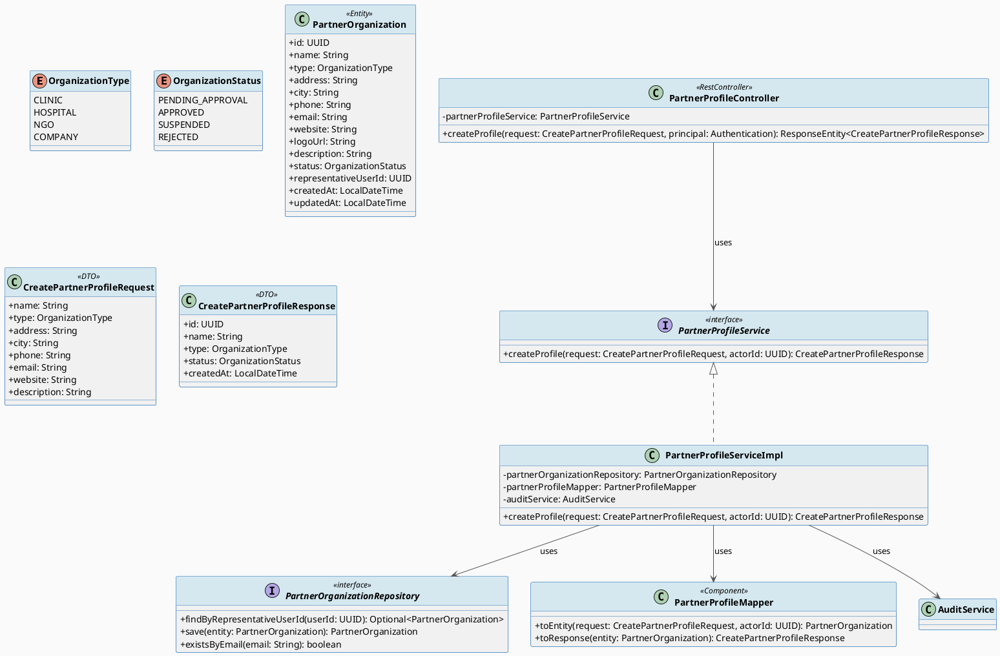
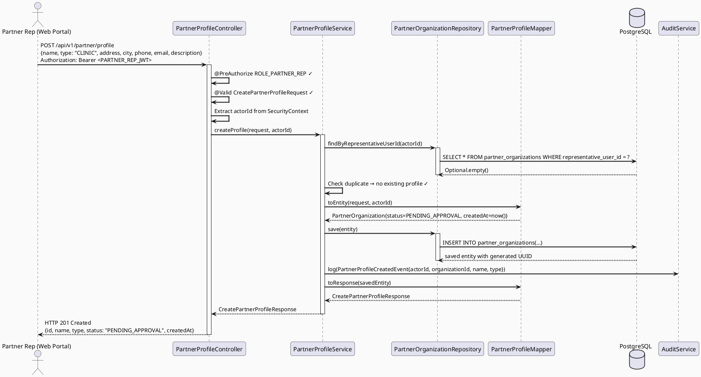
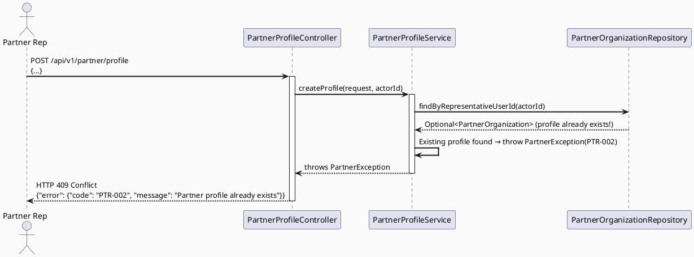
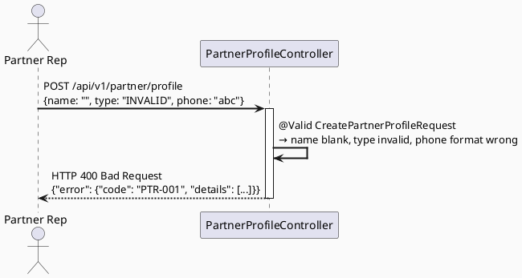
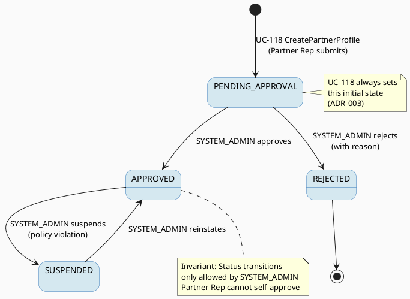

# ENGINEERING DOCUMENTATION STANDARD (EDS) v2.0
# Technical Design Specification — UC-118: Create Partner Profile

| Field              | Value                                   |
| ------------------ | --------------------------------------- |
| **Document ID**    | `CB-PTR-IMP-001`                        |
| **Version**        | `1.0`                                   |
| **Date**           | `2026-06-23`                            |
| **Status**         | `Approved — Implementation Complete`    |
| **Document Owner** | `HuyND`                                 |
| **Author**         | `AI Agent — Winston (System Architect)` |
| **Reviewed by**    | `[ ] Pending`                           |
| **DPO Sign-off**   | `[ ] Pending`                           |
| **Approved by**    | `[ ] Pending`                           |
| **Last Review**    | `2026-06-23`                            |
| **Based on EDS**   | `v2.0`                                  |

---

## CHANGELOG

| Ngày       | Người thực hiện    | Nội dung thay đổi                                            |
| ---------- | ------------------ | ------------------------------------------------------------ |
| 2026-06-23 | AI Agent — Winston | Tạo tài liệu lần đầu — TDS cho UC-118 Create Partner Profile |
| 2026-06-24 | AI Agent — Amelia  | Implementation hoàn thành — 82 tests PASS; điều chỉnh: `representativeUserId` là `Long` (khớp với `User.id`); Role dùng `PARTNER` (không phải `PARTNER_REP`); phone validation dùng `@VietnamesePhoneNumber` sẵn có; DB migration V4 drop-recreate `partner_organizations` |

---

## MỤC LỤC

1. [Tổng quan Module](#1-tổng-quan-module)
2. [Ma trận Truy vết](#2-ma-trận-truy-vết)
3. [Architecture Decision Records (ADR)](#3-architecture-decision-records-adr)
4. [Non-Functional Requirements & SLA](#4-non-functional-requirements--sla)
5. [Static Modeling](#5-static-modeling)
6. [Dynamic Modeling](#6-dynamic-modeling)
7. [Domain Event Catalog](#7-domain-event-catalog)
8. [Interface Specification](#8-interface-specification)
9. [API Specification](#9-api-specification)
10. [Bảng mã lỗi](#10-bảng-mã-lỗi)
11. [Quy trình Triển khai](#11-quy-trình-triển-khai)
12. [Rollback & Incident Runbook](#12-rollback--incident-runbook)
13. [Kịch bản Kiểm thử Chi tiết](#13-kịch-bản-kiểm-thử-chi-tiết)
14. [Phương pháp Xác minh](#14-phương-pháp-xác-minh)
15. [API Verification Samples](#15-api-verification-samples)
16. [Authorization Matrix](#16-authorization-matrix)
17. [AI Prompt Constraints (CASE 2.0)](#17-ai-prompt-constraints-case-20)

---

## 1. Tổng quan Module

| Field                     | Value                                                                                                               |
| ------------------------- | ------------------------------------------------------------------------------------------------------------------- |
| **UC ID**                 | `UC-118`                                                                                                            |
| **Module Name**           | `Create Partner Profile`                                                                                            |
| **Bounded Context**       | `partner`                                                                                                           |
| **Primary Actor**         | `Partner Representative (ROLE_PARTNER_REP)`                                                                         |
| **Platform**              | `Partner Web Portal`                                                                                                |
| **Priority**              | `Medium — Regular`                                                                                                  |
| **Data Classification**   | `Internal`                                                                                                          |
| **Compliance Scope**      | `N/A`                                                                                                               |
| **Upstream Dependencies** | `security (JWT auth, user account)`, `identity (User entity for representativeUserId)`                              |
| **Downstream Consumers**  | `audit module`, `Admin portal (partner approval workflow)`, `expert.PartnerExpertLink`, `content.SponsoredCampaign` |

**Mô tả:**
UC-118 cho phép đại diện đối tác (Partner Representative) đăng ký thông tin tổ chức/phòng khám của mình vào hệ thống CareBridge. Sau khi submit, hồ sơ được tạo với status `PENDING_APPROVAL` và chờ SYSTEM_ADMIN phê duyệt. Partner chỉ được tạo một profile (1-to-1 với user account). Email, phone và website được validate. Logo upload được xử lý qua Firebase Storage integration (ngoài scope của UC-118 — chỉ nhận logoUrl string trong request này).

---

## 2. Ma trận Truy vết

| Requirement ID | Loại          | Mô tả yêu cầu                                           | Thành phần Code                                 | Compliance Target | ADR liên quan |
| -------------- | ------------- | ------------------------------------------------------- | ----------------------------------------------- | ----------------- | ------------- |
| UC-118         | Use Case      | Partner Rep tạo hồ sơ tổ chức                           | `PartnerProfileController.createProfile()`      | —                 | ADR-001       |
| BR-RBAC-002    | Business Rule | Chỉ PARTNER_REP mới được tạo partner profile            | `@PreAuthorize("hasRole('PARTNER_REP')")`       | —                 | ADR-002       |
| BR-PTR-001     | Business Rule | Mỗi user chỉ được có 1 PartnerOrganization              | `PartnerProfileService.checkDuplicateProfile()` | —                 | ADR-001       |
| BR-PTR-002     | Business Rule | Profile mới luôn bắt đầu với status = PENDING_APPROVAL  | `PartnerOrganization.status = PENDING_APPROVAL` | —                 | ADR-003       |
| BR-PTR-003     | Business Rule | Email phải hợp lệ (RFC 5322), phone Việt Nam (10-11 số) | `CreatePartnerProfileRequest` validators        | —                 | ADR-001       |
| BR-PTR-004     | Business Rule | Website là optional nhưng nếu có phải là URL hợp lệ     | `@URL` validation trên website field            | —                 | ADR-001       |
| BR-AUDIT-002   | Business Rule | Tạo partner profile phải được audit log                 | `AuditService.log(PartnerProfileCreatedEvent)`  | —                 | ADR-004       |
| SRS-3.2.3.1    | Functional    | Màn hình tạo partner profile trong Partner Web Portal   | `POST /api/v1/partner/profile`                  | —                 | —             |

---

## 3. Architecture Decision Records (ADR)

### ADR-001 — Single-Profile Constraint via Unique Index

| Field        | Value                      |
| ------------ | -------------------------- |
| **Status**   | `Accepted`                 |
| **Deciders** | `HuyND — System Architect` |
| **Date**     | `2026-06-23`               |

#### Bối cảnh
Mỗi partner representative chỉ được phép tạo một partner profile. Cần enforce constraint này ở đúng level.

#### Các phương án đã xem xét

| Phương án | Mô tả                                                                     | Ưu điểm                                                             | Nhược điểm                                   |
| --------- | ------------------------------------------------------------------------- | ------------------------------------------------------------------- | -------------------------------------------- |
| A         | Check trong Service layer trước khi insert                                | Đơn giản, có thể trả về friendly error message                      | Race condition trong concurrent requests     |
| B         | Unique constraint trên DB column `representative_user_id` + Service check | Double protection — DB là safety net, Service trả về friendly error | Cần handle `DataIntegrityViolationException` |

#### Quyết định
Chọn **Phương án B**: unique constraint trên `partner_organizations.representative_user_id` + check sớm trong Service để trả về `PTR-002` (không phải generic DB error).

#### Hệ quả

**Tích cực:**
- Không có race condition ngay cả với concurrent requests
- Error message thân thiện cho client

**Tiêu cực:**
- Service cần catch `DataIntegrityViolationException` như safety net
- Cần migration thêm unique constraint

---

### ADR-002 — RBAC Enforcement tại Controller Layer (Partner)

| Field        | Value                      |
| ------------ | -------------------------- |
| **Status**   | `Accepted`                 |
| **Deciders** | `HuyND — System Architect` |
| **Date**     | `2026-06-23`               |

#### Quyết định
`@PreAuthorize("hasRole('PARTNER_REP')")` tại `PartnerProfileController`. Service không duplicate check này. `representativeUserId` được lấy từ `SecurityContextHolder` — không nhận từ request body để tránh impersonation.

---

### ADR-003 — Status Lifecycle: PENDING_APPROVAL as Initial State

| Field        | Value                      |
| ------------ | -------------------------- |
| **Status**   | `Accepted`                 |
| **Deciders** | `HuyND — System Architect` |
| **Date**     | `2026-06-23`               |

#### Bối cảnh
Partner profile phải qua approval flow trước khi active trong hệ thống. Initial state phải là `PENDING_APPROVAL` — không được tự set thành `APPROVED`.

#### Quyết định
`PartnerProfileService` hard-code `status = OrganizationStatus.PENDING_APPROVAL` khi tạo entity. Không nhận `status` từ request body. Không có API endpoint nào để Partner Rep tự approve profile của mình.

---

### ADR-004 — Audit Logging cho Profile Creation

| Field        | Value                      |
| ------------ | -------------------------- |
| **Status**   | `Accepted`                 |
| **Deciders** | `HuyND — System Architect` |
| **Date**     | `2026-06-23`               |

#### Quyết định
Service gọi `AuditService.log()` sau khi save thành công. Audit payload ghi nhận: `actorId`, `organizationId`, `organizationName`, `type`, `action = PARTNER_PROFILE_CREATED`, `timestamp`.

---

## 4. Non-Functional Requirements & SLA

### 4.1. Performance & Availability

| Category     | Requirement           | Target SLA | Measurement Method        | Compliance Basis |
| ------------ | --------------------- | ---------- | ------------------------- | ---------------- |
| Latency      | API response (p99)    | `< 500ms`  | k6 load test              | —                |
| Availability | Uptime (monthly)      | `99.5%`    | Uptime monitor            | —                |
| Throughput   | Partner registrations | `10 req/s` | Load test (low frequency) | —                |

### 4.2. Data Integrity & Retention

| Category         | Requirement                                   | Target   | Verification Method  | Compliance Basis |
| ---------------- | --------------------------------------------- | -------- | -------------------- | ---------------- |
| Uniqueness       | 1 profile per user                            | 100%     | Unique DB constraint | BR-PTR-001       |
| Immutable status | Status không thể skip từ PENDING đến APPROVED | Enforced | State machine test   | ADR-003          |

### 4.3. Security

| Category              | Requirement                                        | Target         | Verification Method | Compliance Basis |
| --------------------- | -------------------------------------------------- | -------------- | ------------------- | ---------------- |
| Encryption in transit | All endpoints                                      | TLS 1.3+       | SSL Labs scan       | —                |
| User identity         | representativeUserId từ JWT, không từ request body | 100%           | Code review         | ADR-002          |
| Input sanitization    | name, description không chứa script injection      | XSS prevention | Security test       | —                |

### 4.4. Scalability

MVP scope: ~100 partner registrations/tháng. Không cần scale đặc biệt. Unique constraint trên DB đủ để handle.

---

## 5. Static Modeling

### 5.1. Class Diagram (PlantUML)



### 5.2. JPA Entity Definition

```java
// com.carebridge.backend.partner.entity.PartnerOrganization
@Entity
@Table(
    name = "partner_organizations",
    uniqueConstraints = {
        @UniqueConstraint(name = "uk_partner_representative", columnNames = {"representative_user_id"}),
        @UniqueConstraint(name = "uk_partner_email", columnNames = {"email"})
    }
)
@Getter @Setter @NoArgsConstructor
@EntityListeners(AuditingEntityListener.class)
public class PartnerOrganization {

    @Id
    @GeneratedValue(strategy = GenerationType.UUID)
    @Column(columnDefinition = "uuid")
    private UUID id;

    @Column(name = "name", nullable = false, length = 200)
    private String name;

    @Enumerated(EnumType.STRING)
    @Column(name = "type", nullable = false, length = 20)
    private OrganizationType type;  // CLINIC | HOSPITAL | NGO | COMPANY

    @Column(name = "address", nullable = false, length = 500)
    private String address;

    @Column(name = "city", nullable = false, length = 100)
    private String city;

    @Column(name = "phone", nullable = false, length = 20)
    private String phone;

    @Column(name = "email", nullable = false, length = 255)
    private String email;

    @Column(name = "website", length = 500)
    private String website;  // optional

    @Column(name = "logo_url", length = 1000)
    private String logoUrl;  // optional, uploaded via Firebase Storage separately

    @Column(name = "description", length = 2000)
    private String description;  // optional

    @Enumerated(EnumType.STRING)
    @Column(name = "status", nullable = false, length = 30)
    private OrganizationStatus status;  // Always PENDING_APPROVAL on creation

    @Column(name = "representative_user_id", nullable = false, columnDefinition = "uuid")
    private UUID representativeUserId;

    @CreatedDate
    @Column(name = "created_at", nullable = false, updatable = false)
    private LocalDateTime createdAt;

    @LastModifiedDate
    @Column(name = "updated_at", nullable = false)
    private LocalDateTime updatedAt;
}

// Enums
public enum OrganizationType { CLINIC, HOSPITAL, NGO, COMPANY }
public enum OrganizationStatus { PENDING_APPROVAL, APPROVED, SUSPENDED, REJECTED }
```

---

## 6. Dynamic Modeling

### 6.1. Sequence Diagram — Happy Path



### 6.2. Sequence Diagram — Error Path (Duplicate Profile)



### 6.3. Sequence Diagram — Error Path (Validation Failure)



### 6.4. State Machine — PartnerOrganization Status



---

## 7. Domain Event Catalog

### 7.1. Events Published (Phát ra)

| Event Name              | Trigger                         | Publisher                   | Subscriber(s)                                       | Payload Schema | Async?                              |
| ----------------------- | ------------------------------- | --------------------------- | --------------------------------------------------- | -------------- | ----------------------------------- |
| `PartnerProfileCreated` | Partner Rep submits new profile | `PartnerProfileServiceImpl` | `AuditService`, `NotificationService` (admin alert) | See 7.3        | No (sync audit), Yes (notification) |

### 7.2. Events Consumed (Tiêu thụ)

| Event Name        | Source | Handler | Action thực hiện       |
| ----------------- | ------ | ------- | ---------------------- |
| (none for UC-118) | —      | —       | UC-118 is origin event |

### 7.3. Payload Schema

```java
// PartnerProfileCreatedEvent.java
public record PartnerProfileCreatedEvent(
    String eventId,                // UUID
    String eventType,              // "PartnerProfileCreated"
    LocalDateTime occurredAt,
    String version,                // "1.0"
    UUID actorId,                  // representativeUserId
    UUID organizationId,
    String organizationName,
    OrganizationType type,
    OrganizationStatus status,     // always PENDING_APPROVAL
    String correlationId
) {}
```

---

## 8. Interface Specification

### 8.1. Service Interface

```java
// com.carebridge.backend.partner.service.PartnerProfileService
// @version 1.0

package com.carebridge.backend.partner.service;

/**
 * Service contract for partner profile creation and management.
 * @version 1.0
 */
public interface PartnerProfileService {

    /**
     * Creates a new partner organization profile with status PENDING_APPROVAL.
     * @param request - profile data (name, type, address, city, phone, email, website, description)
     * @param actorId - UUID of the authenticated PARTNER_REP user (from SecurityContext, NOT request body)
     * @return CreatePartnerProfileResponse with generated id, status=PENDING_APPROVAL
     * @throws PartnerException (PTR-001) if request validation fails
     * @throws PartnerException (PTR-002) if this user already has a partner profile
     * @throws PartnerException (PTR-003) if email is already registered to another organization
     */
    CreatePartnerProfileResponse createProfile(
        CreatePartnerProfileRequest request,
        UUID actorId
    );
}
```

### 8.2. Repository Interface

```java
// com.carebridge.backend.partner.repository.PartnerOrganizationRepository
// @version 1.0

package com.carebridge.backend.partner.repository;

public interface PartnerOrganizationRepository extends JpaRepository<PartnerOrganization, UUID> {

    /**
     * Find partner organization by representative user ID.
     * Used to enforce 1 profile per user constraint.
     */
    Optional<PartnerOrganization> findByRepresentativeUserId(UUID userId);

    /**
     * Check if email is already registered to another organization.
     */
    boolean existsByEmail(String email);

    /**
     * Check if phone is already registered (for uniqueness enforcement).
     */
    boolean existsByPhone(String phone);
}
```

### 8.3. DTO Definitions

```java
// CreatePartnerProfileRequest.java
public record CreatePartnerProfileRequest(

    @NotBlank(message = "Organization name is required")
    @Size(min = 2, max = 200, message = "Name must be between 2 and 200 characters")
    String name,

    @NotNull(message = "Organization type is required")
    OrganizationType type,

    @NotBlank(message = "Address is required")
    @Size(max = 500)
    String address,

    @NotBlank(message = "City is required")
    @Size(max = 100)
    String city,

    @NotBlank(message = "Phone is required")
    @Pattern(regexp = "^(0|\\+84)[0-9]{9,10}$", message = "Invalid Vietnamese phone number")
    String phone,

    @NotBlank(message = "Email is required")
    @Email(message = "Invalid email address")
    String email,

    @Nullable
    @URL(message = "Invalid website URL")
    @Size(max = 500)
    String website,

    @Nullable
    @Size(max = 2000)
    String description
) {}

// CreatePartnerProfileResponse.java
public record CreatePartnerProfileResponse(
    UUID id,
    String name,
    OrganizationType type,
    OrganizationStatus status,
    LocalDateTime createdAt
) {}
```

---

## 9. API Specification

### 9.1. Endpoints Table

| Method | Path                      | Auth Level | Required Roles     | Rate Limit | Idempotent? |
| ------ | ------------------------- | ---------- | ------------------ | ---------- | ----------- |
| `POST` | `/api/v1/partner/profile` | JWT Bearer | `ROLE_PARTNER_REP` | 10/hour    | No          |

### 9.2. Request / Response Schemas

#### `POST /api/v1/partner/profile`

**Request Body:**
```json
{
  "name": "Phòng khám Đa khoa Hà Nội",
  "type": "CLINIC",
  "address": "123 Đường Láng, Đống Đa",
  "city": "Hà Nội",
  "phone": "0901234567",
  "email": "contact@phongkhamhanoi.vn",
  "website": "https://phongkhamhanoi.vn",
  "description": "Phòng khám chuyên khoa sản phụ khoa và nhi khoa tại Hà Nội"
}
```

**Response — 201 Created (Happy Path):**
```json
{
  "id": "550e8400-e29b-41d4-a716-446655440010",
  "name": "Phòng khám Đa khoa Hà Nội",
  "type": "CLINIC",
  "status": "PENDING_APPROVAL",
  "createdAt": "2026-06-23T10:30:00.000Z"
}
```

**Response — 400 Bad Request (Validation Error):**
```json
{
  "error": {
    "code": "PTR-001",
    "message": "Validation failed",
    "details": [
      { "field": "phone", "message": "Invalid Vietnamese phone number" },
      { "field": "email", "message": "Invalid email address" }
    ]
  }
}
```

**Response — 401 Unauthorized:**
```json
{
  "error": {
    "code": "IAM-001",
    "message": "Authentication required"
  }
}
```

**Response — 403 Forbidden (Wrong Role):**
```json
{
  "error": {
    "code": "PTR-004",
    "message": "Insufficient permissions — PARTNER_REP role required"
  }
}
```

**Response — 409 Conflict (Duplicate Profile):**
```json
{
  "error": {
    "code": "PTR-002",
    "message": "A partner profile already exists for this account"
  }
}
```

**Response — 409 Conflict (Email Already Used):**
```json
{
  "error": {
    "code": "PTR-003",
    "message": "This email address is already registered to another organization"
  }
}
```

---

## 10. Bảng mã lỗi

| Code      | HTTP Status | Message (EN)                   | Message (VI)             | Trigger Condition                                                |
| --------- | ----------- | ------------------------------ | ------------------------ | ---------------------------------------------------------------- |
| `PTR-001` | 400         | Validation failed              | Dữ liệu không hợp lệ     | name blank, email format wrong, phone format wrong, type invalid |
| `PTR-002` | 409         | Partner profile already exists | Hồ sơ đối tác đã tồn tại | User đã có PartnerOrganization record                            |
| `PTR-003` | 409         | Email already registered       | Email đã được đăng ký    | email trùng với record khác                                      |
| `PTR-004` | 403         | Insufficient permissions       | Không đủ quyền           | User không có ROLE_PARTNER_REP                                   |
| `PTR-005` | 500         | Internal server error          | Lỗi hệ thống             | DB error hoặc unhandled exception                                |
| `PTR-006` | 401         | Authentication required        | Yêu cầu xác thực         | JWT thiếu hoặc không hợp lệ                                      |

---

## 11. Quy trình Triển khai

### 11.1. Prerequisites

- [x] ADR-001 đến ADR-004 đã được Accepted
- [x] Spring Security `@EnableMethodSecurity` đã bật
- [x] `partner_organizations` table đã được recreate qua V4 migration
- [x] AuditService bean đã available

### 11.2. Pre-Migration Checklist

- [ ] Backup DB: `pg_dump -h [host] -U carebridge carebridge_db > backup_20260623_partner.sql`
- [ ] Migration đã chạy thành công trên staging ≥ 24 giờ

### 11.3. Implementation Steps

#### Chặng 1 — Database Migration

```sql
-- db/migration/V20260624__create_partner_organizations.sql

CREATE TYPE organization_type_enum AS ENUM ('CLINIC', 'HOSPITAL', 'NGO', 'COMPANY');
CREATE TYPE organization_status_enum AS ENUM ('PENDING_APPROVAL', 'APPROVED', 'SUSPENDED', 'REJECTED');

CREATE TABLE partner_organizations (
    id UUID PRIMARY KEY DEFAULT gen_random_uuid(),
    name VARCHAR(200) NOT NULL,
    type organization_type_enum NOT NULL,
    address VARCHAR(500) NOT NULL,
    city VARCHAR(100) NOT NULL,
    phone VARCHAR(20) NOT NULL,
    email VARCHAR(255) NOT NULL,
    website VARCHAR(500),
    logo_url VARCHAR(1000),
    description VARCHAR(2000),
    status organization_status_enum NOT NULL DEFAULT 'PENDING_APPROVAL',
    representative_user_id UUID NOT NULL,
    created_at TIMESTAMP NOT NULL DEFAULT NOW(),
    updated_at TIMESTAMP NOT NULL DEFAULT NOW(),

    CONSTRAINT uk_partner_representative UNIQUE (representative_user_id),
    CONSTRAINT uk_partner_email UNIQUE (email)
);

CREATE INDEX idx_partner_org_status ON partner_organizations(status);
CREATE INDEX idx_partner_org_type ON partner_organizations(type);
```

#### Chặng 2 — Backend Implementation

```
Thứ tự implement:
1. Enums: OrganizationType, OrganizationStatus
2. Entity: PartnerOrganization (§5.2)
3. Repository: PartnerOrganizationRepository (§8.2)
4. DTOs: CreatePartnerProfileRequest, CreatePartnerProfileResponse (§8.3)
5. Mapper: PartnerProfileMapper
6. Service Interface: PartnerProfileService (§8.1)
7. Service Impl: PartnerProfileServiceImpl
   - Check duplicate (findByRepresentativeUserId)
   - Check email uniqueness
   - Map and save with status=PENDING_APPROVAL
   - Emit audit event
8. Controller: PartnerProfileController với @PreAuthorize
9. Exception: PartnerException với PTR codes
10. Exception Handler: GlobalExceptionHandler — map PartnerException → HTTP response
```

#### Chặng 3 — Verification sau deploy

```bash
curl -X GET https://api.carebridge.vn/actuator/health
# Expected: {"status": "UP"}

# Test POST với PARTNER_REP token
curl -X POST https://api.carebridge.vn/api/v1/partner/profile \
  -H "Authorization: Bearer $PARTNER_REP_TOKEN" \
  -H "Content-Type: application/json" \
  -d '{"name":"Test Clinic","type":"CLINIC","address":"123 Test","city":"Hanoi","phone":"0901234567","email":"test@clinic.vn"}'
# Expected: 201 với status=PENDING_APPROVAL
```

### 11.4. Deployment Checklist

- [x] Migration V4 tạo thành công
- [x] Unit tests (7) PASS
- [x] Controller tests (15) PASS
- [x] Security tests (10) PASS
- [ ] Health check trả về 200 (cần DB thực)
- [ ] Unique constraint hoạt động (cần integration test với DB thực)
- [ ] Audit log sinh ra event `PartnerProfileCreated` (cần DB thực)

---

## 12. Rollback & Incident Runbook

### 12.1. Điều kiện kích hoạt Rollback

| Điều kiện                          | Ngưỡng          | Người quyết định |
| ---------------------------------- | --------------- | ---------------- |
| Unique constraint bị bypass        | Bất kỳ case nào | Tech Lead        |
| PTR-002 không trả về khi duplicate | Bất kỳ          | Tech Lead        |
| Error rate > 5% trong 5 phút       | > 5%            | On-call Engineer |

### 12.2. Rollback Procedure

```bash
# Bước 1: Re-deploy phiên bản cũ
kubectl rollout undo deployment/carebridge-api

# Bước 2: Verify
kubectl rollout status deployment/carebridge-api

# Bước 3: Smoke test
curl -X GET https://api.carebridge.vn/actuator/health

# Bước 4: Nếu cần rollback DB (chỉ khi table mới gây lỗi)
# DROP TABLE IF EXISTS partner_organizations;  -- CHỈ khi table hoàn toàn mới và chưa có data
# Lưu ý: KHÔNG DROP nếu có data production
```

### 12.3. Notification Protocol

| Thời điểm          | Người nhận   | Kênh              | Template                              |
| ------------------ | ------------ | ----------------- | ------------------------------------- |
| Ngay khi phát hiện | On-call team | Slack `#incident` | "INCIDENT [PARTNER-PROFILE]: [mô tả]" |
| Trong 30 phút      | Tech Lead    | Slack DM          | Báo cáo tóm tắt                       |

---

## 13. Kịch bản Kiểm thử Chi tiết

### 13.1. Unit Tests

#### TC-UNIT-001 — createProfile tạo entity với status PENDING_APPROVAL

```gherkin
Feature: Create Partner Profile
  Background:
    Given test data classification: SYNTHETIC
    And PartnerOrganizationRepository đã được mock
    And AuditService đã được mock

  Scenario: Happy path — tạo profile thành công
    Given user actorId = "user-001" chưa có partner profile
    And request hợp lệ {name: "Test Clinic", type: CLINIC, ...}
    When PartnerProfileServiceImpl.createProfile(request, actorId) được gọi
    Then PartnerOrganizationRepository.save() được gọi 1 lần
    And entity được save có status = PENDING_APPROVAL
    And entity được save có representativeUserId = "user-001"
    And AuditService.log() được gọi với PartnerProfileCreatedEvent
    And response chứa status = "PENDING_APPROVAL"

  Scenario: Status không thể là APPROVED khi tạo
    Given request hợp lệ
    When createProfile() được gọi
    Then entity được save KHÔNG được có status = APPROVED
    And entity được save KHÔNG được có status = APPROVED bất kể request body
```

**Hàm được test:** `PartnerProfileServiceImpl.createProfile()`
**Invariant kiểm tra:** status luôn = PENDING_APPROVAL; representativeUserId từ actorId param

#### TC-UNIT-002 — Duplicate profile bị từ chối

```gherkin
  Scenario: User đã có partner profile
    Given PartnerOrganizationRepository.findByRepresentativeUserId("user-001") trả về Optional<PartnerOrganization>
    When PartnerProfileServiceImpl.createProfile(request, "user-001") được gọi
    Then PartnerException với code PTR-002 được throw
    And PartnerOrganizationRepository.save() KHÔNG được gọi
```

#### TC-UNIT-003 — Email trùng bị từ chối

```gherkin
  Scenario: Email đã được đăng ký bởi tổ chức khác
    Given PartnerOrganizationRepository.findByRepresentativeUserId() trả về Optional.empty()
    And PartnerOrganizationRepository.existsByEmail("taken@email.vn") trả về true
    When createProfile() với email = "taken@email.vn" được gọi
    Then PartnerException với code PTR-003 được throw
```

### 13.2. Integration Tests

#### TC-INT-001 — Full flow POST endpoint tạo record đúng trong DB

```gherkin
  Scenario: Integration — POST tạo partner profile
    Given test data classification: SYNTHETIC
    And DB đang chạy, bảng partner_organizations trống
    And PARTNER_REP user "user-rep-001" đã đăng nhập
    When POST /api/v1/partner/profile với body hợp lệ
    Then response status là 201
    And response body có status = "PENDING_APPROVAL"
    And response body có id (non-null UUID)
    And DB record tồn tại với representative_user_id = "user-rep-001"
    And DB record có status = "PENDING_APPROVAL"
    And DB record có created_at gần hiện tại (within 5 seconds)
```

#### TC-INT-002 — Unique constraint ngăn duplicate qua concurrent requests

```gherkin
  Scenario: Hai requests đồng thời từ cùng một user
    Given DB trống
    When 2 POST /api/v1/partner/profile requests gửi đồng thời từ "user-rep-001"
    Then chỉ 1 request thành công (201)
    And 1 request thất bại với 409 và code PTR-002 (hoặc DB constraint error handled as PTR-002)
    And DB chỉ có 1 record cho "user-rep-001"
```

### 13.3. Security Tests

#### TC-SEC-001 — Non-PARTNER_REP bị từ chối

```gherkin
  Scenario: User có ROLE_MOTHER cố tạo partner profile
    Given user với ROLE_MOTHER đã đăng nhập
    When POST /api/v1/partner/profile với body hợp lệ
    Then response status là 403
    And response body chứa error code PTR-004

  Scenario: Request không có JWT
    When POST /api/v1/partner/profile được gọi không có Authorization header
    Then response status là 401
```

#### TC-SEC-002 — representativeUserId lấy từ JWT không từ body

```gherkin
  Scenario: Partner Rep cố inject representativeUserId trong body
    Given user "user-rep-001" đã đăng nhập với ROLE_PARTNER_REP
    When POST /api/v1/partner/profile với body chứa thêm "representativeUserId": "user-evil-999"
    Then response status là 201
    And DB record có representative_user_id = "user-rep-001" (từ JWT)
    And "user-evil-999" không xuất hiện trong record
```

#### TC-SEC-003 — XSS prevention trong name field

```gherkin
  Scenario: Injection attempt trong name field
    Given request với name = "<script>alert('xss')</script>"
    When POST /api/v1/partner/profile
    Then response status là 400 (hoặc data được sanitize)
    And script tag không được stored hoặc reflected
```

---

## 14. Phương pháp Xác minh

### 14.1. Database Inspection

```sql
-- Verify record tồn tại sau khi tạo
SELECT id, name, type, status, representative_user_id, created_at
FROM partner_organizations
WHERE representative_user_id = '[user-uuid]';

-- Verify status = PENDING_APPROVAL
SELECT status FROM partner_organizations WHERE status != 'PENDING_APPROVAL';
-- Expected: 0 rows (nếu chỉ chạy create flow)

-- Verify unique constraint
SELECT representative_user_id, COUNT(*)
FROM partner_organizations
GROUP BY representative_user_id
HAVING COUNT(*) > 1;
-- Expected: 0 rows

-- Verify không có DML ngoài INSERT từ UC-118
SELECT query_start, query FROM pg_stat_activity
WHERE query ILIKE '%partner_organizations%' AND state = 'active';
```

### 14.2. Log / Audit Verification

```bash
# Kiểm tra audit event sau khi tạo profile
grep '"eventType":"PartnerProfileCreated"' /var/log/carebridge/audit.log | tail -3

# Verify log có đủ fields
grep '"eventType":"PartnerProfileCreated"' /var/log/carebridge/audit.log \
  | jq '{actorId, organizationId, organizationName, occurredAt}'

# Kiểm tra không có sensitive data trong log
grep -i "password\|secret" /var/log/carebridge/app.log
# Expected: No output
```

---

## 15. API Verification Samples

### 15.1. Happy Path

```bash
export PARTNER_REP_TOKEN="eyJhbGc..."

curl -X POST https://api.carebridge.vn/api/v1/partner/profile \
  -H "Authorization: Bearer $PARTNER_REP_TOKEN" \
  -H "Content-Type: application/json" \
  -H "X-Correlation-Id: $(uuidgen)" \
  -d '{
    "name": "Phòng khám Đa khoa ABC",
    "type": "CLINIC",
    "address": "45 Trần Hưng Đạo, Hoàn Kiếm",
    "city": "Hà Nội",
    "phone": "0241234567",
    "email": "contact@abcclinic.vn",
    "website": "https://abcclinic.vn",
    "description": "Phòng khám sản phụ khoa uy tín tại Hà Nội"
  }'
```

**Expected Response (201):**
```json
{
  "id": "a1b2c3d4-e5f6-7890-abcd-ef1234567890",
  "name": "Phòng khám Đa khoa ABC",
  "type": "CLINIC",
  "status": "PENDING_APPROVAL",
  "createdAt": "2026-06-23T10:30:00.000Z"
}
```

### 15.2. Error Paths

```bash
# Duplicate profile → 409
curl -X POST https://api.carebridge.vn/api/v1/partner/profile \
  -H "Authorization: Bearer $PARTNER_REP_TOKEN" \
  -H "Content-Type: application/json" \
  -d '{"name": "Another Clinic", "type": "HOSPITAL", ...}'
```

**Expected Response (409):**
```json
{
  "error": {
    "code": "PTR-002",
    "message": "A partner profile already exists for this account"
  }
}
```

```bash
# Invalid phone → 400
curl -X POST https://api.carebridge.vn/api/v1/partner/profile \
  -H "Authorization: Bearer $PARTNER_REP_TOKEN" \
  -H "Content-Type: application/json" \
  -d '{"name": "Clinic", "type": "CLINIC", "phone": "abc", "email": "test@test.com", "address": "A", "city": "HN"}'
```

**Expected Response (400):**
```json
{
  "error": {
    "code": "PTR-001",
    "message": "Validation failed",
    "details": [
      { "field": "phone", "message": "Invalid Vietnamese phone number" }
    ]
  }
}
```

---

## 16. Authorization Matrix

| Endpoint                       | `MOTHER` | `FAMILY_MEMBER` | `EXPERT` | `MODERATOR` | `PARTNER_REP` | `CONTENT_ADMIN` | `SYSTEM_ADMIN` |
| ------------------------------ | -------- | --------------- | -------- | ----------- | ------------- | --------------- | -------------- |
| `POST /api/v1/partner/profile` | ❌        | ❌               | ❌        | ❌           | ✅ Own only    | ❌               | ✅              |

**Chú thích:**
- ✅ Own only = PARTNER_REP chỉ tạo được profile cho chính mình (representativeUserId từ JWT)
- SYSTEM_ADMIN có quyền can thiệp admin (tạo profile thay Partner Rep nếu cần)

---

## 17. AI Prompt Constraints (CASE 2.0)

### 17.1 Constraint Summary Table

| #   | Constraint                                                                                                                        | Source (ADR/BR)         | Last Verified |
| --- | --------------------------------------------------------------------------------------------------------------------------------- | ----------------------- | ------------- |
| C1  | `PartnerProfileController` PHẢI dùng `@PreAuthorize("hasRole('PARTNER_REP')")` — không chứa business logic                        | `ADR-002`               | `2026-06-23`  |
| C2  | `representativeUserId` PHẢI lấy từ `Authentication.getName()` hoặc SecurityContext — KHÔNG nhận từ request body                   | `ADR-002`               | `2026-06-23`  |
| C3  | `PartnerProfileServiceImpl` PHẢI hard-code `status = OrganizationStatus.PENDING_APPROVAL` — không nhận status từ request          | `ADR-003`               | `2026-06-23`  |
| C4  | Service PHẢI gọi `findByRepresentativeUserId()` trước khi save để check duplicate, throw `PartnerException(PTR-002)` nếu tìm thấy | `ADR-001, BR-PTR-001`   | `2026-06-23`  |
| C5  | Service PHẢI gọi `AuditService.log(PartnerProfileCreatedEvent)` sau khi save thành công                                           | `ADR-004, BR-AUDIT-002` | `2026-06-23`  |
| C6  | DB migration PHẢI có UNIQUE constraint trên `representative_user_id` và `email` columns                                           | `ADR-001`               | `2026-06-23`  |

### 17.2 Constraint Injection Block

```
[CONSTRAINT BLOCK — Module: Create Partner Profile]
Theo TDS CB-PTR-IMP-001 và các ADR liên quan:

1. [C1] PartnerProfileController PHẢI annotate @PreAuthorize("hasRole('PARTNER_REP')") trên createProfile(). Controller delegate toàn bộ logic sang service.
2. [C2] representativeUserId PHẢI extract từ Authentication object (SecurityContext). KHÔNG bao giờ đọc từ request body để tránh impersonation.
3. [C3] PartnerProfileServiceImpl.createProfile() PHẢI set entity.setStatus(OrganizationStatus.PENDING_APPROVAL). Không accept status từ request.
4. [C4] Trước khi save, PHẢI gọi partnerOrganizationRepository.findByRepresentativeUserId(actorId). Nếu Optional không empty → throw PartnerException("PTR-002", 409).
5. [C5] Sau khi save thành công, PHẢI gọi auditService.log(new PartnerProfileCreatedEvent(...)).
6. [C6] Table partner_organizations phải có UNIQUE constraint trên representative_user_id và email. Service phải catch DataIntegrityViolationException và rethrow PartnerException(PTR-002/PTR-003) với friendly message.

[CONTEXT BLOCK]
- Bounded Context: partner
- Data Classification: Internal
- Compliance: N/A
- Existing interfaces: §8 Service Interface + §8.2 Repository Interface
- Error codes: §10 Error Codes Table
- Auth matrix: §16 Authorization Matrix

[TASK BLOCK]
Implement PartnerProfileController, PartnerProfileServiceImpl, PartnerOrganizationRepository, PartnerProfileMapper, PartnerOrganization entity
thỏa mãn constraints C1-C6 trên.
Output phải tuân thủ §8 Interface Specification.
Tests phải cover §13 Test Scenarios.
```

### 17.3 Constraint Quality Checklist

- [x] Mỗi constraint traceable về ADR hoặc BR cụ thể
- [x] Không có constraint generic
- [x] Mỗi constraint có `Last Verified` date ≤ 2 sprints
- [x] Constraint block có ≥ 3 constraints cụ thể
- [x] Constraint block reference §8 Interface
- [x] Constraint block reference §16 Auth Matrix

### 17.4 Anti-Pattern Detection

| AP-ID     | Anti-Pattern          | Dấu hiệu                                                   | Hành động                             |
| --------- | --------------------- | ---------------------------------------------------------- | ------------------------------------- |
| AP-AI-001 | Unconstrained Gen     | Code nhận representativeUserId từ request body             | Reject — inject C2                    |
| AP-AI-003 | Implicit Decision     | Code tự set status=APPROVED sau review                     | Reject — chỉ SYSTEM_ADMIN mới approve |
| AP-AI-005 | Hallucinated Contract | Code import `PartnerVerificationService` không có trong §8 | Reject — verify contract              |

---

## PHỤ LỤC

### A. Glossary

| Thuật ngữ            | Định nghĩa                                                          |
| -------------------- | ------------------------------------------------------------------- |
| PartnerOrganization  | Entity đại diện cho tổ chức/phòng khám đối tác                      |
| PENDING_APPROVAL     | Trạng thái ban đầu của partner profile — chờ SYSTEM_ADMIN xét duyệt |
| representativeUserId | UUID của user account sở hữu partner profile                        |
| OrganizationType     | Loại tổ chức: CLINIC, HOSPITAL, NGO, COMPANY                        |

### B. Tài liệu tham chiếu

| Document                                      | Path                   |
| --------------------------------------------- | ---------------------- |
| SRS — Section 3.2.3.1                         | `02_Requirements/SRS/` |
| CLAUDE.md — Entity Ownership (partner.entity) | `CLAUDE.md §7`         |
| CLAUDE.md — Architecture                      | `CLAUDE.md §2, §3`     |
