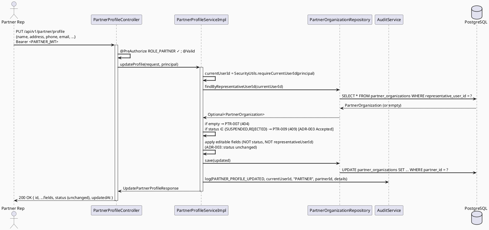

# ENGINEERING DOCUMENTATION STANDARD (EDS) v2.0
# Technical Design Specification — UC-119: Update Partner Profile

| Field              | Value                                   |
| ------------------ | ---------------------------------------- |
| **Document ID**    | `CB-PTR-IMP-002`                        |
| **Version**        | `1.0`                                   |
| **Date**           | `2026-07-01`                            |
| **Status**         | `Partially Implemented`                 |
| **Document Owner** | `HuyND`                                 |
| **Author**         | `AI Agent — Winston (System Architect)` |
| **Reviewed by**    | `[ ] Pending`                           |
| **DPO Sign-off**   | `[ ] Pending` *(partner org contact data — no new PII field vs UC-118)* |
| **Approved by**    | `[ ] Pending`                           |
| **Last Review**    | `2026-07-01`                            |
| **Based on EDS**   | `v2.0`                                  |

---

## CHANGELOG

| Ngày       | Người thực hiện    | Nội dung thay đổi                                                                   |
| ---------- | ------------------- | ------------------------------------------------------------------------------------ |
| 2026-07-01 | AI Agent — Winston  | Tạo tài liệu lần đầu — TDS cho UC-119 Update Partner Profile (Status=Draft)          |
| 2026-07-11 | AI Agent — Amelia   | Phase 3 implementation — 10/12 tests PASS; PostgreSQL integration blocked by missing container runtime |

---

## MỤC LỤC

1. [Tổng quan Module](#1-tổng-quan-module)
2. [Ma trận Truy vết](#2-ma-trận-truy-vết)
3. [Architecture Decision Records (ADR)](#3-architecture-decision-records-adr)
4. [Non-Functional Requirements & SLA](#4-non-functional-requirements--sla)
5. [Static Modeling](#5-static-modeling)
6. [Dynamic Modeling](#6-dynamic-modeling)
7. [Domain Event Catalog](#7-domain-event-catalog)
8. [Interface Specification](#8-interface-specification)
9. [API Specification](#9-api-specification)
10. [Bảng mã lỗi](#10-bảng-mã-lỗi)
11. [Quy trình Triển khai](#11-quy-trình-triển-khai)
12. [Rollback & Incident Runbook](#12-rollback--incident-runbook)
13. [Kịch bản Kiểm thử Chi tiết](#13-kịch-bản-kiểm-thử-chi-tiết)
14. [Phương pháp Xác minh](#14-phương-pháp-xác-minh)
15. [API Verification Samples](#15-api-verification-samples)
16. [Authorization Matrix](#16-authorization-matrix)
17. [AI Prompt Constraints (CASE 2.0)](#17-ai-prompt-constraints-case-20)

---

## 1. Tổng quan Module

| Field                     | Value                                                                                                                                  |
| ------------------------- | --------------------------------------------------------------------------------------------------------------------------------------- |
| **UC ID**                 | `UC-119`                                                                                                                                |
| **FS Reference**          | `3.2.3.2 Update Partner Profile`                                                                                                        |
| **Module Name**           | `Update Partner Profile`                                                                                                               |
| **Bounded Context**       | `partner` (`com.carebridge.backend.partner`), extends the UC-118 controller/service pair                                              |
| **Primary Actor**         | `Partner Representative (ROLE_PARTNER)` — confirmed by user + verified in code (ADR-005, resolved)                        |
| **Platform**              | `Partner Web Portal`                                                                                                                    |
| **Priority**              | `High` (per FS — Partner function group)                                                                                                |
| **Frequency of Use**      | `Occasional`                                                                                                                             |
| **Data Classification**   | `Internal` (org contact data; no new PII field vs UC-118)                                                                              |
| **Compliance Scope**      | `N/A` (no new data category)                                                                                                            |
| **Upstream Dependencies** | `partner (PartnerOrganization, OrganizationStatus, PartnerException, PartnerProfileMapper, PartnerOrganizationRepository, PartnerProfileService — all from UC-118)`, `security (SecurityUtils / SecurityContext for representativeUserId)`, `audit (AuditService)` |
| **Downstream Consumers**  | `UC-123 Approve Partner Profile` (re-review flow depends on whether an edit resets status — see ADR-003), Partner Web Portal display   |

**Mô tả:**
UC-119 cho phép **Partner Representative** cập nhật hồ sơ tổ chức (`PartnerOrganization`) **của chính mình**. Đây là một thay đổi **brownfield**: UC-118 (Create Partner Profile, Approved, `CB-PTR-IMP-001`) đã tạo entity, repository, controller, service, mapper, exception. UC-119 thêm một endpoint `PUT`/`PATCH` cập nhật trên cùng `PartnerProfileController`/`PartnerProfileService`, tái sử dụng validators và mapper hiện có.

**Nguyên tắc chống impersonation (kế thừa UC-118 ADR-002):** `representativeUserId` được lấy từ `SecurityContext`, KHÔNG nhận từ request body. Partner chỉ được sửa hồ sơ mà `representativeUserId == currentUserId` (ownership check, ADR-002) — không được sửa hồ sơ của partner khác.

**Phạm vi rõ ràng (out of scope):**
- KHÔNG đổi `status` qua endpoint này (status transitions thuộc UC-123, do SYSTEM_ADMIN thực hiện). Xem ADR-003 về việc edit có reset status hay không.
- KHÔNG xử lý upload logo (chỉ nhận `logoUrl` string, giống UC-118).
- KHÔNG cho sửa `representativeUserId` (immutable — 1 profile/user, UC-118 BR-PTR-001).

---

## 2. Ma trận Truy vết

| Requirement ID | Loại          | Mô tả yêu cầu                                                          | Thành phần Code                                | Compliance Target | ADR liên quan |
| --------------- | -------------- | ------------------------------------------------------------------------ | ------------------------------------------------ | ------------------- | --------------- |
| UC-119          | Use Case      | Partner Rep updates own organization profile                             | `PartnerProfileController.updateProfile()`       | —                  | ADR-001         |
| FS-3.2.3.2      | Functional    | "Updates partner organization profile information"                       | `PartnerProfileServiceImpl.updateProfile()`      | —                  | ADR-001         |
| BR-RBAC (UC118) | Business Rule | Chỉ PARTNER mới được gọi (kế thừa UC-118 BR-RBAC-002)                 | `@PreAuthorize("hasRole('PARTNER')")`        | —                  | ADR-002, ADR-005 |
| BR-PTR-007      | Business Rule | Partner chỉ sửa được hồ sơ của chính mình (ownership)                     | `PartnerProfileServiceImpl` ownership check      | —                  | ADR-002         |
| BR-PTR-008      | Business Rule | Các field editable: name/type/address/city/phone/email/website/logoUrl/description (KHÔNG status, KHÔNG representativeUserId) | `UpdatePartnerProfileRequest` | — | ADR-001 |
| BR-PTR-009      | Business Rule | Validation kế thừa UC-118 (email RFC, phone VN, website URL)              | reused validators from `CreatePartnerProfileRequest` | —              | ADR-001         |
| BR-PTR-010      | Business Rule | Edit có/không reset status về PENDING_APPROVAL — quyết định thiết kế       | `PartnerProfileServiceImpl.updateProfile()`      | —                  | ADR-003 (Accepted)  |
| BR-AUDIT-001    | Business Rule | Mọi update thành công được audit log                                     | `AuditService.log(...)`                          | —                  | ADR-004         |

---

## 3. Architecture Decision Records (ADR)

### ADR-001 — Reuse UC-118 Infrastructure (Brownfield Extension, No New Entity/Repository)

| Field          | Value                      |
| -------------- | --------------------------- |
| **Status**     | `Accepted`                 |
| **Deciders**   | `HuyND — System Architect` |
| **Date**       | `2026-07-01`                |

#### Bối cảnh
UC-118 đã build đầy đủ `PartnerOrganization` entity, `PartnerOrganizationRepository`, `PartnerProfileController`, `PartnerProfileService`/`Impl`, `PartnerProfileMapper`, `PartnerException` (PTR-001..006). UC-119 chỉ là thao tác update trên cùng aggregate.

#### Quyết định
Thêm `updateProfile()` vào `PartnerProfileService` interface + Impl, và một endpoint `PUT /api/v1/partner/profile` trên `PartnerProfileController` hiện có. Tái sử dụng validators của `CreatePartnerProfileRequest` (email/phone/website) cho `UpdatePartnerProfileRequest`. KHÔNG tạo entity/repository mới. KHÔNG migration (không đổi schema — `partner_organizations` đã đủ cột).

#### Hệ quả
**Tích cực:** Smallest scoped change; nhất quán package `partner`.
**Tiêu cực:** `PartnerProfileService` phình thêm 1 method — chấp nhận được.

---

### ADR-002 — Ownership Enforcement: Partner Chỉ Sửa Hồ Sơ Của Chính Mình

| Field        | Value                      |
| ------------ | --------------------------- |
| **Status**   | `Accepted`                 |
| **Deciders** | `HuyND — System Architect` |
| **Date**     | `2026-07-01`                |

#### Bối cảnh
UC-118 ADR-002: `representativeUserId` lấy từ `SecurityContext`, không từ body (chống impersonation). Với update, phải đảm bảo Partner A không sửa được hồ sơ của Partner B.

#### Quyết định
`updateProfile()`:
1. Lấy `currentUserId` từ `SecurityUtils.requireCurrentUserId(principal)`.
2. Load `PartnerOrganization` theo `representativeUserId == currentUserId` (vì 1 profile/user — UC-118 BR-PTR-001, `representative_user_id` unique). Nếu không tìm thấy → `PTR-007` (404, profile not found for this user).
3. KHÔNG nhận `partnerId`/`representativeUserId` từ body để chọn hồ sơ — luôn resolve theo current user. Điều này khiến "sửa hồ sơ người khác" là bất khả thi về mặt thiết kế (không có đường nào truyền id người khác vào).

> **Ghi chú:** Vì endpoint luôn resolve theo current user, không có case "PARTNER sửa hồ sơ của PARTNER khác" cần một mã 403 riêng — thiết kế loại bỏ vector này thay vì kiểm tra sau. Nếu sau này có endpoint admin-sửa-hộ (`PATCH /admin/partners/{id}`), đó là UC khác.

#### Hệ quả
**Tích cực:** Chống impersonation theo thiết kế (không nhận id từ body).
**Tiêu cực:** Không hỗ trợ multi-profile-per-user (đúng chủ đích — UC-118 đã ràng buộc 1:1).

---

### ADR-003 — Edit KHÔNG Reset Status Về PENDING_APPROVAL (v1, Resolved)

| Field        | Value                      |
| ------------ | --------------------------- |
| **Status**   | `Accepted — resolved by project-analysis default (simplest, least-surprise, reversible)` |
| **Deciders** | `HuyND — System Architect` |
| **Date**     | `2026-07-01`                |

#### Bối cảnh
Một pattern phổ biến: khi partner sửa thông tin **trọng yếu** (tên tổ chức, loại hình), hệ thống reset `status` về `PENDING_APPROVAL` để admin re-review. FS-3.2.3.2 KHÔNG nói gì về điều này.

#### Quyết định
**v1: Edit KHÔNG reset status.** Partner sửa contact/descriptive fields, `status` giữ nguyên. Resolved via
project analysis rather than left open: FS không yêu cầu re-review; đây là lựa chọn implementation nhỏ nhất
(không cần định nghĩa tập "material fields", không cần chuyển trạng thái trong transaction, không tạo phụ
thuộc chéo vào UC-123); và tránh một hệ quả tiêu cực rõ ràng — vô tình đẩy một partner đang APPROVED (đang
hoạt động bình thường) về PENDING_APPROVAL chỉ vì sửa mô tả/địa chỉ sẽ làm partner mất visibility một cách
không cần thiết. Nếu Product sau này xác định cần re-review cho các field trọng yếu vì lý do compliance, đây
là một thay đổi bổ sung dễ áp dụng (thêm guard trong `updateProfile()`), không phải một thiết kế lại.

**Trạng thái nào được sửa:** `PENDING_APPROVAL` và `APPROVED` được sửa; `SUSPENDED`/`REJECTED` KHÔNG được sửa
(→ `PTR-009`, 409). Resolved cùng nguyên tắc: trạng thái đã bị khóa bởi quyết định moderation (SUSPENDED) hoặc
đã kết thúc (REJECTED) không nên còn cho phép partner tự thay đổi hồ sơ — đây là default an toàn hơn (không
cho sửa) so với việc mở ra một đường cập nhật ngầm cho tài khoản đang bị hạn chế.

#### Hệ quả
**Tích cực:** Đơn giản, không mất visibility của partner APPROVED; không cho SUSPENDED/REJECTED sửa là default an toàn.
**Tiêu cực:** Nếu re-review là cần thiết cho compliance sau này (partner đổi tên thành tên khác hoàn toàn), v1 chưa có — đây là một enhancement dễ bổ sung, không phải một gap chặn implement.

---

### ADR-004 — Audit Logging của Update

| Field        | Value                      |
| ------------ | --------------------------- |
| **Status**   | `Accepted`                 |
| **Deciders** | `HuyND — System Architect` |
| **Date**     | `2026-07-01`                |

#### Quyết định
Sau update thành công, gọi `AuditService.log(...)` với một action phù hợp. Kiểm tra `AuditAction` enum — nếu có giá trị partner-related tái dùng; nếu không, đề xuất thêm `PARTNER_PROFILE_UPDATED` (đánh dấu enum addition ở §11). Vì đây là thay đổi dữ liệu tổ chức, audit trail hữu ích cho tranh chấp/compliance.

#### Hệ quả
Truy vết được ai sửa gì khi nào; thêm 1 enum value nếu cần.

---

### ADR-005 — Role Name Confirmed: `PARTNER` (Resolved)

| Field        | Value                      |
| ------------ | --------------------------- |
| **Status**   | `Accepted — confirmed by user + verified in code` |
| **Deciders** | `HuyND — System Architect (user-confirmed 2026-07-01)` |
| **Date**     | `2026-07-01`                |

#### Bối cảnh
Draft ban đầu của batch này có nhầm lẫn: một số TDS (bao gồm bản nháp đầu của chính UC-119 này) dùng
`PARTNER_REP` do suy đoán chưa verify. Đã xác nhận trực tiếp bằng cách đọc code thật:
- `security/config/SecurityConfig.java` line 60: `.requestMatchers(HttpMethod.POST, "/api/v1/partner/profile").hasRole("PARTNER")`
- `partner/controller/PartnerProfileController.java` line 21: `@PreAuthorize("hasRole('PARTNER')")`

Cả hai đều dùng **`PARTNER`**, khớp với CLAUDE.md account test table + dossier §3. `PARTNER_REP` chưa từng
xuất hiện trong code thật — đây là lỗi giả định ban đầu (không phải mâu thuẫn nguồn thật), đã được user xác
nhận và sửa đồng bộ trên toàn bộ Cluster B (UC119-125).

#### Quyết định
Toàn bộ UC-119 (và UC-120..125) dùng `@PreAuthorize("hasRole('PARTNER')")`. Đã sync lại toàn bộ tài liệu.

#### Hệ quả
An toàn để implement — role string đã verify khớp code thật, không còn là blocking item.

---

## 4. Non-Functional Requirements & SLA

### 4.1. Performance & Availability

| Category     | Requirement                 | Target SLA  | Measurement Method | Compliance Basis |
| ------------ | ---------------------------- | ----------- | -------------------- | ------------------- |
| Latency      | API response (p99), `PUT /partner/profile` | `Open` — reuse UC-118 baseline if any; else recommend `< 300ms` | k6 | — |
| Availability | Uptime (monthly)             | `Open` — reuse `99.5%` | Uptime monitor | — |
| Concurrency  | Two updates on same profile (single owner, unlikely) | `Open` — no optimistic locking v1; last-write-wins | Code review | — |

### 4.2. Data Integrity

| Category   | Requirement                                                              | Target                | Verification Method | Compliance Basis |
| ---------- | ------------------------------------------------------------------------- | ------------------------ | ---------------------- | ------------------- |
| Ownership  | Only the owning user's profile is mutated                                | 100%                      | Unit + integration test | ADR-002 |
| Immutability | `representativeUserId` and `status` never changed by this endpoint     | 100%                      | Negative assertion test | ADR-001, ADR-003 |
| Validation reuse | Same email/phone/website rules as UC-118                          | 100%                      | Unit test              | ADR-001 |

### 4.3. Security

| Category        | Requirement                                                  | Target          | Verification Method | Compliance Basis |
| ---------------- | --------------------------------------------------------------- | ------------------ | ----------------------- | ------------------- |
| Access control   | PARTNER only; own profile only                            | Least privilege     | Auth Matrix (§16)        | ADR-002, ADR-005 |
| Anti-impersonation | id never taken from body — always from SecurityContext      | 100%                | Code review + test      | ADR-002 |

### 4.4. Scalability
`Open` — occasional-use partner self-service, low volume.

---

## 5. Static Modeling

### 5.1. Class Diagram (PlantUML)

```plantuml
@startuml UC119_UpdatePartnerProfile_ClassDiagram
skinparam classAttributeIconSize 0
skinparam backgroundColor #FAFAFA

enum OrganizationStatus { PENDING_APPROVAL APPROVED SUSPENDED REJECTED }

class PartnerOrganization <<Entity>> {
  + id: UUID
  + name: String
  + type: OrganizationType
  + address: String
  + city: String
  + phone: String
  + email: String
  + website: String
  + logoUrl: String
  + description: String
  + status: OrganizationStatus <<not changed by UC-119>>
  + representativeUserId: UUID <<immutable — resolves current owner>>
  + createdAt / updatedAt
}

class UpdatePartnerProfileRequest <<DTO>> {
  + name: String
  + type: OrganizationType
  + address: String
  + city: String
  + phone: String
  + email: String
  + website: String <<optional>>
  + logoUrl: String <<optional>>
  + description: String
  ' NO status, NO representativeUserId, NO partnerId
}

class UpdatePartnerProfileResponse <<DTO>> {
  + id: UUID
  + name / type / address / city / phone / email / website / logoUrl / description
  + status: OrganizationStatus <<echoed, unchanged>>
  + updatedAt: Instant
}

interface PartnerProfileService {
  + createProfile(...) : CreatePartnerProfileResponse   ' UC-118
  + updateProfile(request, principal): UpdatePartnerProfileResponse   ' UC-119 (new)
}

class PartnerProfileController <<RestController>> {
  + updateProfile(request, principal): ResponseEntity<UpdatePartnerProfileResponse>
}

PartnerProfileController --> PartnerProfileService : uses
UpdatePartnerProfileResponse ..> PartnerOrganization : mapped from
@enduml
```

### 5.2. Data Structure — NO Schema Delta

> **No migration required.** `partner_organizations` (`V1__init_schema.sql` line 366) already has every
> editable column. UC-119 only UPDATEs existing columns; no new column/constraint/enum.

---

## 6. Dynamic Modeling

### 6.1. Sequence Diagram — Happy Path



### 6.2. Error Path — Not Owner / No Profile

Vì id luôn resolve theo current user, "no profile for this user" → `PTR-007` (404). Không có vector "sửa hồ sơ người khác" (ADR-002).

### 6.3. Error Path — Wrong Role
`@PreAuthorize("hasRole('PARTNER')")` fail → 403. **Mã lỗi 403 thật:** confirmed `ACCESS_DENIED` — verified via `common/exception/GlobalExceptionHandler.java` (`@ExceptionHandler(AccessDeniedException.class)` → `error(HttpStatus.FORBIDDEN, "ACCESS_DENIED", ...)`). `@PreAuthorize` failures are intercepted by Spring Security AOP before the controller/service body runs, so `PartnerException`'s `PTR-004` factory is structurally unreachable for this path — same finding as `MOD-004`/`CNT-004` in the moderation/content clusters.

---

## 7. Domain Event Catalog

| Event Name | Trigger | Publisher | Subscriber | Payload | Async? |
| ----------- | -------- | ---------- | ----------- | -------- | ------- |
| (none v1)  | —        | —          | —           | —        | —       |

> **Open:** Nếu ADR-003 đổi sang "edit resets status → re-review", có thể cần một event `PartnerProfileResubmitted` để thông báo admin. v1 không có event (đồng bộ, audit-only).

---

## 8. Interface Specification

### 8.1. Service Interface

```java
// com.carebridge.backend.partner.service.PartnerProfileService — extended
public interface PartnerProfileService {
    CreatePartnerProfileResponse createProfile(CreatePartnerProfileRequest request, Principal principal); // UC-118

    /**
     * Updates the calling partner rep's OWN organization profile (resolved by representativeUserId
     * from SecurityContext — never from the request body, ADR-002).
     * Does NOT change status (ADR-003) or representativeUserId.
     * @throws PartnerException (PTR-007) if the current user has no partner profile
     * @throws PartnerException (PTR-009) if the profile status forbids editing (SUSPENDED/REJECTED) [ADR-003 Accepted]
     * @throws PartnerException (PTR-001) reused if field validation fails
     */
    UpdatePartnerProfileResponse updateProfile(UpdatePartnerProfileRequest request, Principal principal);
}
```

### 8.2. Repository Interfaces

```java
// PartnerOrganizationRepository — verify findByRepresentativeUserId exists (UC-118 likely added it for
// the duplicate-check BR-PTR-001). If present, reuse; if the existing method is an existsBy..., add a
// findByRepresentativeUserId(UUID) returning Optional<PartnerOrganization>. Additive, no schema change.
```

### 8.3. DTO Definitions

```java
public record UpdatePartnerProfileRequest(
        @NotBlank String name,
        @NotNull OrganizationType type,
        @NotBlank String address,
        @NotBlank String city,
        @NotBlank String phone,        // reuse UC-118 VN phone validator
        @NotBlank @Email String email, // reuse UC-118 email validator
        String website,                // optional, @URL if present
        String logoUrl,                // optional
        String description
) {}   // NO status / representativeUserId / partnerId

public record UpdatePartnerProfileResponse(
        UUID id, String name, OrganizationType type, String address, String city,
        String phone, String email, String website, String logoUrl, String description,
        OrganizationStatus status,   // echoed, unchanged (ADR-003)
        Instant updatedAt
) {}
```

---

## 9. API Specification

### 9.1. Endpoints Table

| Method | Path                          | Auth Level | Required Roles      | Rate Limit | Idempotent? |
| ------ | ------------------------------- | ------------ | ---------------------- | ------------ | -------------- |
| `PUT`  | `/api/v1/partner/profile`       | JWT Bearer   | `ROLE_PARTNER`     | `Open` — reuse UC-118's `10/hour` if applicable | Yes (full replace of editable fields; repeated identical PUT → same state) |

> **Method choice:** `PUT` (full replace of the editable field set) chosen over `PATCH` for simplicity and
> idempotency — request carries all editable fields. If Product wants partial update semantics, `PATCH` with
> nullable fields is the alternative (flag `Open`). Same base path as UC-118's `POST /api/v1/partner/profile`.

### 9.2. Request / Response

**Request (200 path):**
```json
{ "name": "Phòng khám Sản Nhi ABC", "type": "CLINIC", "address": "123 Đường X", "city": "Hà Nội",
  "phone": "0901234567", "email": "contact@abc.vn", "website": "https://abc.vn", "logoUrl": null,
  "description": "Phòng khám chuyên sản phụ khoa" }
```

**Response — 200 OK:**
```json
{ "id": "…", "name": "Phòng khám Sản Nhi ABC", "type": "CLINIC", "address": "123 Đường X", "city": "Hà Nội",
  "phone": "0901234567", "email": "contact@abc.vn", "website": "https://abc.vn", "logoUrl": null,
  "description": "Phòng khám chuyên sản phụ khoa", "status": "APPROVED", "updatedAt": "2026-07-01T10:15:00Z" }
```
> `status` echoed unchanged (ADR-003).

**Response — 404 (no profile — PTR-007):**
```json
{ "error": { "code": "PTR-007", "message": "No partner profile found for the current user" } }
```

**Response — 409 (status forbids edit — PTR-009, ADR-003 Accepted):**
```json
{ "error": { "code": "PTR-009", "message": "Profile cannot be edited while status is SUSPENDED or REJECTED" } }
```

**Response — 400 (validation — PTR-001 reused):**
```json
{ "error": { "code": "PTR-001", "details": [ "email: invalid format" ] } }
```

**403 / 401:** see §6.3 (PTR-004 or ACCESS_DENIED — verify; 401 per UC-118 = PTR-006 OR bodiless — verify).

---

## 10. Bảng mã lỗi

| Code       | HTTP Status | Message (EN)                                  | Trigger Condition                                | Status in code |
| ----------- | ------------- | ------------------------------------------------ | --------------------------------------------------- | ----------------- |
| `PTR-007`  | 404           | No partner profile found for current user         | `findByRepresentativeUserId(currentUserId)` empty  | **New — to implement** |
| `PTR-008`  | 403           | *(reserved)* not owner                            | Reserved — with ADR-002 design this path is unreachable (id never from body); kept reserved for a future admin-edit endpoint | **Reserved — not wired** |
| `PTR-009`  | 409           | Profile cannot be edited in current status         | status ∈ {SUSPENDED, REJECTED} (ADR-003 Accepted)      | **New — to implement** |
| `PTR-001`  | 400           | Validation failed                                 | Reused from UC-118 — field validation              | Reused |
| `PTR-004`  | 403           | Insufficient permissions                          | Non-PARTNER (confirmed ACCESS_DENIED — dead code, same pattern as MOD-004)  | Not reachable in practice |
| `PTR-006`  | 401           | Authentication required                           | Missing/invalid JWT (verify vs bodiless)           | Reused (verify) |
| `PTR-005`  | 500           | Internal server error                             | Unhandled — reused                                 | Reused |

> **Numbering:** UC-118 used `PTR-001..006`. UC-119 claims **`PTR-007`, `PTR-008` (reserved), `PTR-009`**.
> Consistency Gate must confirm no sibling Partner UC (UC-120..125) collides — they should continue from
> `PTR-010`. This TDS deliberately reserves `PTR-008` (not-owner) even though ADR-002 makes it unreachable,
> to avoid a future admin-edit endpoint re-using the number for something else.

---

## 11. Quy trình Triển khai

### 11.1. Prerequisites
- [ ] UC-118 (`CB-PTR-IMP-001`) deployed — its entity/repo/controller/service/mapper/exception exist
- [x] **ADR-005 resolved:** role string confirmed as `PARTNER` (user-confirmed + verified via `SecurityConfig.java`/`PartnerProfileController.java`)
- [ ] **ADR-003 confirmed:** does edit reset status? which statuses can edit? — Product decision
- [x] `@EnableMethodSecurity` enabled (inherited)

### 11.2. Pre-Migration Checklist
- [ ] **Không cần migration** — chỉ UPDATE cột sẵn có. CG-9: no schema delta.

### 11.3. Implementation Steps
```
1. UpdatePartnerProfileRequest / UpdatePartnerProfileResponse records (§8.3)
2. PartnerOrganizationRepository.findByRepresentativeUserId(UUID) → Optional (add if missing)
3. PartnerException factories: PTR-007 (notFound), PTR-009 (statusForbidsEdit)
4. PartnerProfileService.updateProfile() interface + Impl (ownership resolve, status guard per ADR-003, map editable fields, save, audit)
5. PartnerProfileController.updateProfile() PUT @PreAuthorize("hasRole('PARTNER')") + @Valid
6. SecurityConfig: .requestMatchers(HttpMethod.PUT, "/api/v1/partner/profile").hasRole("PARTNER")
7. (ADR-004) AuditService.log(PARTNER_PROFILE_UPDATED,...) + enum addition if needed
```

### 11.4. Deployment Checklist
- [ ] PUT returns 200 for owner, 404 (PTR-007) for user with no profile
- [ ] status NOT changed by update (verify DB before/after)
- [ ] representativeUserId NOT changed
- [ ] Non-PARTNER → 403

---

## 12. Rollback & Incident Runbook

### 12.1. Triggers
| Điều kiện | Ngưỡng | Người quyết định |
| ------------ | --------- | ------------------- |
| Update vô tình đổi status/representativeUserId | Bất kỳ case nào | Tech Lead (CRITICAL — data integrity) |
| Partner A sửa được hồ sơ Partner B | Bất kỳ case nào | Tech Lead (CRITICAL — ownership breach) |
| 403 sai cho PARTNER hợp lệ | Bất kỳ case nào | Tech Lead |

### 12.2. Procedure
```bash
kubectl rollout undo deployment/carebridge-api
kubectl rollout status deployment/carebridge-api
# No migration to revert.
curl -X GET https://api.carebridge.vn/actuator/health
```

---

## 13. Kịch bản Kiểm thử Chi tiết

> Chi tiết trong `UC119_UpdatePartnerProfile_Test-Spec.md` (`CB-PTR-TEST-002`). Nhóm scenario:

### 13.1. Unit / Service
- Happy path: update editable fields → saved; status & representativeUserId unchanged (negative assertion)
- No profile for current user → PTR-007
- Status SUSPENDED/REJECTED → PTR-009 (ADR-003 Accepted)
- Validation reuse: bad email/phone → PTR-001
- Audit log called once

### 13.2. Integration
- Full PUT flow (Testcontainers): seed profile → update → DB reflects new fields, same status
- Ownership: user with profile updates only their row

### 13.3. Security
- Non-PARTNER → 403; No JWT → 401
- Anti-impersonation: id never accepted from body (attempt to pass partnerId in body is ignored)

---

## 14. Phương pháp Xác minh

```sql
-- Before/after: status and representative_user_id must be unchanged by an update
SELECT partner_id, status, representative_user_id, updated_at FROM partner_organizations WHERE partner_id = '<id>';
```

---

## 15. API Verification Samples

```bash
curl -X PUT "https://api.carebridge.vn/api/v1/partner/profile" \
  -H "Authorization: Bearer $PARTNER_TOKEN" -H "Content-Type: application/json" \
  -d '{"name":"Phòng khám ABC","type":"CLINIC","address":"123 X","city":"Hà Nội","phone":"0901234567","email":"a@abc.vn","description":"..."}'
# Expected: 200, status unchanged

curl -X PUT "https://api.carebridge.vn/api/v1/partner/profile" -H "Authorization: Bearer $MOTHER_TOKEN" -d '{...}'
# Expected: 403
```

---

## 16. Authorization Matrix

| Endpoint                        | `MOTHER` | `FAMILY` | `EXPERT` | `MODERATOR` | `CONTENT_ADMIN` | `PARTNER` | `SYSTEM_ADMIN` |
| ---------------------------------- | ---------- | ---------- | ---------- | -------------- | ------------------ | --------------- | ----------------- |
| `PUT /api/v1/partner/profile`     | ❌        | ❌        | ❌        | ❌             | ❌                  | ✅ (own only)   | ❌ *(note)*        |

**Chú thích:**
- ✅ = Được phép (chỉ hồ sơ của chính mình, ADR-002); ❌ = 403
- **SYSTEM_ADMIN = ❌:** admin sửa hộ hồ sơ partner là UC khác (chưa có); UC-119 là partner self-service. Không có `RoleHierarchy`.
- **Role name:** `PARTNER`, confirmed (ADR-005, resolved) — nhất quán với UC-118 và code thật.

---

## 17. AI Prompt Constraints (CASE 2.0)

### 17.1 Constraint Summary Table

| #   | Constraint                                                                                  | Source (ADR/BR)  | Last Verified |
| --- | ------------------------------------------------------------------------------------------- | ------------------ | --------------- |
| C1  | Controller `@PreAuthorize("hasRole('PARTNER')")` — chỉ @Valid + delegate                | `ADR-002`, `ADR-005` | `2026-07-01`   |
| C2  | `representativeUserId` PHẢI lấy từ SecurityContext, KHÔNG từ body (anti-impersonation)       | `ADR-002`           | `2026-07-01`     |
| C3  | Update KHÔNG đổi `status` và KHÔNG đổi `representativeUserId`                                 | `ADR-001`, `ADR-003` | `2026-07-01`   |
| C4  | Resolve profile theo `representativeUserId == currentUserId`; empty → `PTR-007`              | `ADR-002`           | `2026-07-01`     |
| C5  | Validation email/phone/website tái dùng validator UC-118                                     | `ADR-001`           | `2026-07-01`     |
| C6  | Reuse UC-118 entity/repo/controller/service — KHÔNG tạo entity/repository mới, KHÔNG migration | `ADR-001`         | `2026-07-01`     |

### 17.2 Constraint Injection Block

```
[CONSTRAINT BLOCK — Module: Update Partner Profile (UC-119)]
Theo TDS CB-PTR-IMP-002:
1. [C1] Controller updateProfile() PHẢI @PreAuthorize("hasRole('PARTNER')") — xác nhận role string thật (ADR-005).
2. [C2] representativeUserId/partnerId TUYỆT ĐỐI không nhận từ body — luôn từ SecurityContext.
3. [C3] KHÔNG set status, KHÔNG set representativeUserId trong update (giữ nguyên).
4. [C4] Load profile theo current user; không có → PTR-007.
5. [C5] Dùng lại validator email/phone/website của UC-118 (PTR-001).
6. [C6] Reuse hạ tầng UC-118; KHÔNG entity/repository mới; KHÔNG migration.

[CONTEXT BLOCK]
- Bounded Context: partner; Data Classification: Internal; Compliance: N/A
- Interfaces: §8; Error codes: §10 (PTR-007/008-reserved/009 new); Auth matrix: §16
- Schema delta: NONE
- OPEN: PTR-004 vs ACCESS_DENIED 403 code (ADR-003 edit-reset and ADR-005 role-name are now Accepted/resolved)

[TASK BLOCK]
Implement PartnerProfileController.updateProfile(), PartnerProfileServiceImpl.updateProfile(),
Update DTOs, PTR-007/009 factories — thỏa mãn C1-C6. Tests cover §13 (Test-Spec CB-PTR-TEST-002).
```

### 17.3 Constraint Quality Checklist
- [x] Mỗi constraint traceable ADR/BR
- [x] Không generic
- [x] Có Last Verified
- [x] Reference §8 và §16

### 17.4 Anti-Pattern Detection

| AP-ID     | Anti-Pattern          | Dấu hiệu                                                          | Hành động                |
| --------- | ---------------------- | ------------------------------------------------------------------- | --------------------------- |
| AP-AI-001 | Unconstrained Gen     | Bỏ RBAC/ownership check                                             | Reject — inject C1/C4 |
| AP-AI-002 | Impersonation         | Nhận partnerId/representativeUserId từ body                        | Reject — CHÍNH XÁC rủi ro ADR-002, BLOCKING |
| AP-AI-003 | Implicit Decision     | Tự reset status khi edit mà không có ADR-003 (Accepted)              | Reject — contradicts ADR-003 (Accepted decision: no reset) |
| AP-AI-004 | Layer Violation       | Controller gọi repository trực tiếp                               | Reject |
| AP-AI-005 | Hallucinated Contract | Import service/entity không có trong §8                            | Reject |

**Kết quả review:**
- [x] Không phát hiện anti-pattern nào trong bản thân spec này → approved-for-RED-phase

---

## PHỤ LỤC

### A. Glossary
| Thuật ngữ | Định nghĩa |
| ------------ | ------------- |
| Ownership Resolve | Xác định hồ sơ cần sửa qua `representativeUserId == currentUserId`, không qua id trong body |
| Material Field | Field trọng yếu (name/type) — v1 KHÔNG trigger re-review (ADR-003, Accepted); khái niệm giữ lại cho follow-up nếu cần |

### B. Tài liệu tham chiếu
| Document | Path |
| ------------ | ------- |
| UC-118 Create Partner Profile TDS (state machine ADR-003, PTR error codes, PARTNER role) | `04_Implement/UC118_CreatePartnerProfile/UC118_CreatePartnerProfile_TDS.md` |
| Schema `partner_organizations` (line 366) | `05_Development/CareBridgeAPI/src/main/resources/db/migration/V1__init_schema.sql` |
| CLAUDE.md — RBAC / Delivery Rules | `CLAUDE.md §3, §5` |

---

*EDS v2.1 — Brownfield extension of UC-118; no schema delta. Status: Draft — chờ review chung.
ADR-003 (edit-resets-status, editable-statuses) và ADR-005 (role name) đã resolved via project analysis =
`PARTNER`, edit không reset status.*
