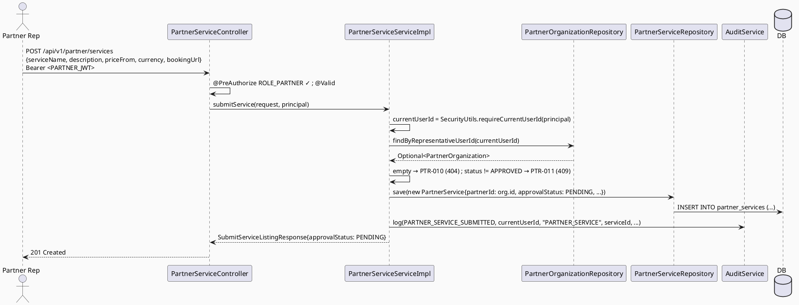

# ENGINEERING DOCUMENTATION STANDARD (EDS) v2.0
# Technical Design Specification — UC-120: Submit Service Listing

| Field              | Value                                   |
| ------------------ | ---------------------------------------- |
| **Document ID**    | `CB-PTR-IMP-003`                        |
| **Version**        | `1.0`                                   |
| **Date**           | `2026-07-01`                            |
| **Status**         | `Partially Implemented`                 |
| **Document Owner** | `HuyND`                                 |
| **Author**         | `AI Agent — Winston (System Architect)` |
| **Reviewed by**    | `[ ] Pending`                           |
| **DPO Sign-off**   | `[ ] Pending` *(N/A — service catalog data, no PII)* |
| **Approved by**    | `[ ] Pending`                           |
| **Last Review**    | `2026-07-01`                            |
| **Based on EDS**   | `v2.0`                                  |

---

## CHANGELOG

| Ngày       | Người thực hiện    | Nội dung thay đổi                                                                   |
| ---------- | ------------------- | ------------------------------------------------------------------------------------ |
| 2026-07-01 | AI Agent — Winston  | Tạo tài liệu lần đầu — TDS cho UC-120 Submit Service Listing (Status=Draft)          |
| 2026-07-11 | AI Agent — Amelia   | Phase 3 implementation — 10/12 tests PASS; PostgreSQL integration pending container runtime |

---

## MỤC LỤC

1. [Tổng quan Module](#1-tổng-quan-module)
2. [Ma trận Truy vết](#2-ma-trận-truy-vết)
3. [Architecture Decision Records (ADR)](#3-architecture-decision-records-adr)
4. [Non-Functional Requirements & SLA](#4-non-functional-requirements--sla)
5. [Static Modeling](#5-static-modeling)
6. [Dynamic Modeling](#6-dynamic-modeling)
7. [Domain Event Catalog](#7-domain-event-catalog)
8. [Interface Specification](#8-interface-specification)
9. [API Specification](#9-api-specification)
10. [Bảng mã lỗi](#10-bảng-mã-lỗi)
11. [Quy trình Triển khai](#11-quy-trình-triển-khai)
12. [Rollback & Incident Runbook](#12-rollback--incident-runbook)
13. [Kịch bản Kiểm thử Chi tiết](#13-kịch-bản-kiểm-thử-chi-tiết)
14. [Phương pháp Xác minh](#14-phương-pháp-xác-minh)
15. [API Verification Samples](#15-api-verification-samples)
16. [Authorization Matrix](#16-authorization-matrix)
17. [AI Prompt Constraints (CASE 2.0)](#17-ai-prompt-constraints-case-20)

---

## 1. Tổng quan Module

| Field                     | Value                                                                                                                                  |
| ------------------------- | --------------------------------------------------------------------------------------------------------------------------------------- |
| **UC ID**                 | `UC-120`                                                                                                                                |
| **FS Reference**          | `3.2.3.3 Submit Service Listing`                                                                                                        |
| **Module Name**           | `Submit Service Listing`                                                                                                               |
| **Bounded Context**       | `partner` — greenfield Java (entity/repo/mapper/service/DTO) over the EXISTING `partner_services` table                                |
| **Primary Actor**         | `Partner Representative (ROLE_PARTNER)` — confirmed by user + verified in code (UC-119 ADR-005, resolved)                          |
| **Platform**              | `Partner Web Portal`                                                                                                                    |
| **Priority**              | `High` (per FS)                                                                                                                         |
| **Frequency of Use**      | `Occasional`                                                                                                                             |
| **Data Classification**   | `Internal` (service catalog, no PII)                                                                                                    |
| **Compliance Scope**      | `N/A`                                                                                                                                   |
| **Upstream Dependencies** | `partner (PartnerOrganization, OrganizationStatus, PartnerException — from UC-118)`, `security (SecurityContext)`, `audit`             |
| **Downstream Consumers**  | `UC-124 Approve Sponsored Service/Campaign` (admin approves the PENDING listing), `UC-125 Remove Partner Content`, `UC-122 View Partner Performance` (counts service listings by status) |

**Mô tả:**
UC-120 cho phép **Partner Representative** (thuộc một tổ chức đã **APPROVED**) gửi một **service listing** (dịch vụ) vào catalog. Listing được tạo với `approval_status = 'PENDING'` chờ admin duyệt (UC-124). Đây là **greenfield Java trên bảng đã tồn tại**: bảng `partner_services` (`V1__init_schema.sql` line 1038) đã có sẵn nhưng **chưa có** Java entity/repository/service/controller — UC-120 tạo mới toàn bộ các lớp Java này (KHÔNG migration, bảng đã đủ cột).

**Precondition trọng yếu (ADR-002):** Chỉ partner có `PartnerOrganization.status == APPROVED` mới được submit service listing. Partner ở `PENDING_APPROVAL`/`SUSPENDED`/`REJECTED` bị từ chối (`PTR-011`).

**Phạm vi rõ ràng (out of scope):**
- KHÔNG duyệt listing (đó là UC-124, SYSTEM_ADMIN).
- KHÔNG sửa/xóa listing (edit/remove là UC riêng — UC-125 cho remove).
- `approval_status` luôn set = `PENDING` bởi server, KHÔNG nhận từ body (chống self-approve, ADR-003).

---

## 2. Ma trận Truy vết

| Requirement ID | Loại          | Mô tả yêu cầu                                                       | Thành phần Code                             | Compliance Target | ADR liên quan |
| --------------- | -------------- | --------------------------------------------------------------------- | --------------------------------------------- | ------------------- | --------------- |
| UC-120          | Use Case      | Partner submits a service listing                                     | `PartnerServiceController.submitService()`     | —                  | ADR-001         |
| FS-3.2.3.3      | Functional    | "Submit a service listing for approval"                              | `PartnerServiceServiceImpl.submitService()`    | —                  | ADR-001         |
| BR-RBAC         | Business Rule | Chỉ PARTNER được submit                                          | `@PreAuthorize("hasRole('PARTNER')")`      | —                  | ADR-004         |
| BR-PTR-011      | Business Rule | Chỉ partner APPROVED mới được submit listing                         | `PartnerServiceServiceImpl` status precondition | —                 | ADR-002         |
| BR-PTR-012      | Business Rule | Listing mới luôn `approval_status = PENDING` (server-set)            | `PartnerServiceServiceImpl`                     | —                  | ADR-003         |
| BR-PTR-013      | Business Rule | `partner_id` resolve theo current user's org, KHÔNG từ body          | ownership resolve                              | —                  | ADR-002         |
| BR-PTR-014      | Business Rule | Validation: service_name non-blank; price_from ≥ 0 nếu có; currency mặc định VND | `SubmitServiceListingRequest` validators | — | ADR-001 |
| BR-AUDIT-001    | Business Rule | Submit thành công được audit log                                     | `AuditService.log(...)`                        | —                  | ADR-004         |

---

## 3. Architecture Decision Records (ADR)

### ADR-001 — Greenfield Java Over Existing `partner_services` Table (No Migration)

| Field          | Value                      |
| -------------- | --------------------------- |
| **Status**     | `Accepted`                 |
| **Deciders**   | `HuyND — System Architect` |
| **Date**       | `2026-07-01`                |

#### Bối cảnh
`partner_services` table đã tồn tại (`V1__init_schema.sql` line 1038): `service_id, partner_id, service_name, description, price_from numeric, currency varchar(10) default 'VND', booking_url, approval_status varchar(30) default 'PENDING', created_at, updated_at`. Nhưng **không có** Java entity/repository/service/controller nào.

#### Quyết định
Tạo mới: `PartnerService` entity (map `partner_services`), `PartnerServiceRepository`, `PartnerServiceMapper`, `SubmitServiceListingRequest`/`Response` DTOs, `PartnerServiceService`/`Impl`, và `PartnerServiceController` (hoặc thêm endpoint vào một controller `partner` phù hợp). **KHÔNG migration** — cột đã đủ. `approval_status` map sang một enum `ServiceApprovalStatus` (PENDING/APPROVED/REJECTED — suy từ default 'PENDING' + nhu cầu UC-124; giá trị REMOVED thuộc UC-125, xem ghi chú).

> **Enum values:** `approval_status` là `varchar(30)` không có CHECK constraint (verify — giống pattern moderation). Giá trị Java enum: `PENDING` (default, xác nhận từ schema), `APPROVED`/`REJECTED` (cho UC-124). KHÔNG bịa thêm — nếu UC-124/125 cần giá trị khác, chúng khai báo trong TDS của chúng.

#### Hệ quả
**Tích cực:** Không schema delta; tái dùng bảng có sẵn.
**Tiêu cực:** Nhiều lớp Java mới — nhưng đúng pattern package-by-domain của `partner`.

---

### ADR-002 — Precondition: Chỉ Partner APPROVED Được Submit; partner_id Từ Ownership Resolve

| Field        | Value                      |
| ------------ | --------------------------- |
| **Status**   | `Accepted`                 |
| **Deciders** | `HuyND — System Architect` |
| **Date**     | `2026-07-01`                |

#### Bối cảnh
Một partner chưa được duyệt (PENDING_APPROVAL) hoặc bị SUSPENDED/REJECTED không nên đưa dịch vụ ra public catalog. `partner_id` phải là tổ chức của chính user, không nhận từ body (chống gán dịch vụ cho partner khác — cùng nguyên tắc anti-impersonation UC-118/119 ADR-002).

#### Quyết định
`submitService()`:
1. `currentUserId = SecurityUtils.requireCurrentUserId(principal)`.
2. Load `PartnerOrganization` theo `representativeUserId == currentUserId` → nếu không có → `PTR-010` (404, no partner org).
3. Nếu `org.status != APPROVED` → `PTR-011` (409, org not approved).
4. Tạo `PartnerService` với `partner_id = org.id` (từ resolve, KHÔNG từ body).

#### Hệ quả
**Tích cực:** Chỉ partner hợp lệ mới lên catalog; chống gán sai partner.
**Tiêu cực:** Partner phải được duyệt trước — đúng luồng.

---

### ADR-003 — `approval_status` Luôn PENDING (Server-Set, Chống Self-Approve)

| Field        | Value                      |
| ------------ | --------------------------- |
| **Status**   | `Accepted`                 |
| **Deciders** | `HuyND — System Architect` |
| **Date**     | `2026-07-01`                |

#### Quyết định
Server hard-code `approval_status = PENDING` khi tạo. KHÔNG nhận `approval_status` từ request body (giống UC-118 ADR-003 hard-code status). Chỉ UC-124 (admin) mới chuyển PENDING→APPROVED/REJECTED.

#### Hệ quả
Partner không thể tự duyệt dịch vụ của mình.

---

### ADR-004 — RBAC + Audit (reuse pattern)

| Field        | Value                      |
| ------------ | --------------------------- |
| **Status**   | `Accepted`                 |

#### Quyết định
`@PreAuthorize("hasRole('PARTNER')")` (role name confirmed, UC-119 ADR-005 resolved). Audit sau submit thành công (`AuditService.log(PARTNER_SERVICE_SUBMITTED,...)` — enum addition nếu cần).

---

## 4. Non-Functional Requirements & SLA

| Category     | Requirement                 | Target SLA  | Measurement | Basis |
| ------------ | ---------------------------- | ----------- | ------------ | ------ |
| Latency      | p99 `POST /partner/services` | `Open` — recommend `< 300ms` | k6 | — |
| Availability | Uptime                       | `Open` — `99.5%` | monitor | — |
| Data integrity | `approval_status` always PENDING on create; `partner_id` from resolve | 100% | unit + integration | ADR-002/003 |
| Access control | PARTNER + APPROVED org only | Least privilege | Auth Matrix §16 | ADR-002/004 |

---

## 5. Static Modeling

### 5.1. Class Diagram (PlantUML)

```plantuml
@startuml UC120_SubmitServiceListing_ClassDiagram
skinparam classAttributeIconSize 0
skinparam backgroundColor #FAFAFA

enum ServiceApprovalStatus { PENDING APPROVED REJECTED }

class PartnerService <<Entity, maps partner_services>> {
  + serviceId: UUID
  + partnerId: UUID <<from ownership resolve, not body>>
  + serviceName: String
  + description: String
  + priceFrom: BigDecimal <<nullable>>
  + currency: String <<default VND>>
  + bookingUrl: String <<nullable>>
  + approvalStatus: ServiceApprovalStatus <<always PENDING on create>>
  + createdAt / updatedAt
}

class SubmitServiceListingRequest <<DTO>> {
  + serviceName: String
  + description: String
  + priceFrom: BigDecimal <<optional, >= 0>>
  + currency: String <<optional, default VND>>
  + bookingUrl: String <<optional>>
  ' NO partnerId, NO approvalStatus
}

class SubmitServiceListingResponse <<DTO>> {
  + serviceId: UUID
  + partnerId: UUID
  + serviceName / description / priceFrom / currency / bookingUrl
  + approvalStatus: ServiceApprovalStatus <<PENDING>>
  + createdAt: Instant
}

interface PartnerServiceService {
  + submitService(request, principal): SubmitServiceListingResponse
}
class PartnerServiceController <<RestController>> {
  + submitService(request, principal): ResponseEntity<SubmitServiceListingResponse>
}

PartnerServiceController --> PartnerServiceService : uses
SubmitServiceListingResponse ..> PartnerService : mapped from
@enduml
```

### 5.2. Data Structure — NO Schema Delta

> **No migration.** `partner_services` (line 1038) already exists with all needed columns. UC-120 only
> INSERTs. `ServiceApprovalStatus` is a Java enum over the existing `varchar(30)` `approval_status` column
> (no DB CHECK constraint — verify, same as moderation pattern).

---

## 6. Dynamic Modeling

### 6.1. Sequence — Happy Path



### 6.2. Error Paths
- No partner org for user → `PTR-010` (404).
- Org status != APPROVED → `PTR-011` (409).
- Validation fail → `PTR-012` (400) — or reuse `PTR-001` pattern; use a new service-scoped code `PTR-012` for clarity.
- Wrong role → 403 (confirmed ACCESS_DENIED — PTR-004 unreachable, same pattern as MOD-004 (moderation cluster)).

---

## 7. Domain Event Catalog

| Event Name | Trigger | Publisher | Subscriber | Payload | Async? |
| ----------- | -------- | ---------- | ----------- | -------- | ------- |
| (none v1)  | —        | —          | —           | —        | —       |

> **Open:** A future `PartnerServiceSubmitted` event could notify admins for the UC-124 approval queue.
> v1 is synchronous + audit-only (admins poll the queue).

---

## 8. Interface Specification

### 8.1. Service Interface

```java
// com.carebridge.backend.partner.service.PartnerServiceService
public interface PartnerServiceService {
    /**
     * Submits a new service listing for the calling partner rep's APPROVED organization.
     * partner_id resolved from SecurityContext (ADR-002); approval_status always PENDING (ADR-003).
     * @throws PartnerException (PTR-010) if current user has no partner organization
     * @throws PartnerException (PTR-011) if the organization status is not APPROVED
     * @throws PartnerException (PTR-012) if listing field validation fails
     */
    SubmitServiceListingResponse submitService(SubmitServiceListingRequest request, Principal principal);
}
```

### 8.2. Repository

```java
// PartnerServiceRepository extends JpaRepository<PartnerService, UUID> — new
// PartnerOrganizationRepository.findByRepresentativeUserId(UUID) — reused/added (UC-119)
```

### 8.3. DTOs

```java
public record SubmitServiceListingRequest(
        @NotBlank String serviceName,
        String description,
        @PositiveOrZero BigDecimal priceFrom,  // optional; if present must be >= 0
        String currency,                        // optional; default 'VND' if null
        String bookingUrl                       // optional; @URL if present
) {}   // NO partnerId, NO approvalStatus

public record SubmitServiceListingResponse(
        UUID serviceId, UUID partnerId, String serviceName, String description,
        BigDecimal priceFrom, String currency, String bookingUrl,
        ServiceApprovalStatus approvalStatus,   // PENDING
        Instant createdAt
) {}
```

---

## 9. API Specification

### 9.1. Endpoints Table

| Method | Path                          | Auth Level | Required Roles      | Rate Limit | Idempotent? |
| ------ | ------------------------------- | ------------ | ---------------------- | ------------ | -------------- |
| `POST` | `/api/v1/partner/services`      | JWT Bearer   | `ROLE_PARTNER`     | `Open`       | No (each POST creates a new listing) |

### 9.2. Request / Response

**Request:**
```json
{ "serviceName": "Khám thai định kỳ", "description": "Gói khám thai theo tam cá nguyệt",
  "priceFrom": 500000, "currency": "VND", "bookingUrl": "https://abc.vn/booking" }
```

**Response — 201:**
```json
{ "serviceId": "…", "partnerId": "…", "serviceName": "Khám thai định kỳ", "description": "…",
  "priceFrom": 500000, "currency": "VND", "bookingUrl": "https://abc.vn/booking",
  "approvalStatus": "PENDING", "createdAt": "2026-07-01T10:15:00Z" }
```

**404 (no org — PTR-010):** `{ "error": { "code": "PTR-010", "message": "No partner organization found for the current user" } }`
**409 (org not approved — PTR-011):** `{ "error": { "code": "PTR-011", "message": "Partner organization must be APPROVED to submit service listings" } }`
**400 (validation — PTR-012):** `{ "error": { "code": "PTR-012", "details": [ "serviceName: must not be blank" ] } }`
**403 / 401:** see UC-119 §6.3 (confirmed ACCESS_DENIED; PTR-006/bodiless — still Open, verify at implement).

---

## 10. Bảng mã lỗi

| Code       | HTTP Status | Message (EN)                                          | Trigger Condition                          | Status in code |
| ----------- | ------------- | -------------------------------------------------------- | --------------------------------------------- | ----------------- |
| `PTR-010`  | 404           | No partner organization found for current user            | `findByRepresentativeUserId` empty            | **New — to implement** |
| `PTR-011`  | 409           | Partner organization must be APPROVED to submit           | `org.status != APPROVED`                      | **New — to implement** |
| `PTR-012`  | 400           | Service listing validation failed                         | serviceName blank / priceFrom < 0 / bad URL   | **New — to implement** |
| `PTR-004`  | 403           | Insufficient permissions                                  | Non-PARTNER (confirmed ACCESS_DENIED — dead code, same pattern as MOD-004)     | Not reachable in practice |
| `PTR-006`  | 401           | Authentication required                                   | Missing/invalid JWT (verify vs bodiless)      | Reused (verify) |

> **Numbering:** UC-118 `PTR-001..006`, UC-119 `PTR-007..009`. UC-120 claims **`PTR-010..012`**. UC-121+
> continue from `PTR-013`. Consistency Gate must verify no collision.

---

## 11. Quy trình Triển khai

### 11.1. Prerequisites
- [ ] UC-118 deployed (PartnerOrganization + repo)
- [ ] UC-119 `findByRepresentativeUserId` available (or add)
- [x] ADR-005 (UC-119) role-name resolved — confirmed `PARTNER`
- [x] `@EnableMethodSecurity`
- [ ] No migration — confirm

### 11.2. Pre-Migration Checklist
- [ ] **Không cần migration** — `partner_services` đã tồn tại. CG-9: no schema delta.
- [ ] Verify no CHECK constraint on `partner_services.approval_status` before relying on app-level enum (grep).

### 11.3. Implementation Steps
```
1. PartnerService entity (maps partner_services) + ServiceApprovalStatus enum
2. PartnerServiceRepository (JpaRepository)
3. PartnerServiceMapper (entity ↔ DTO)
4. SubmitServiceListingRequest/Response DTOs
5. PartnerException factories: PTR-010, PTR-011, PTR-012
6. PartnerServiceService.submitService() interface + Impl (resolve org, status precondition, set PENDING, save, audit)
7. PartnerServiceController POST /api/v1/partner/services @PreAuthorize("hasRole('PARTNER')") + @Valid
8. SecurityConfig rule
9. (ADR-004) AuditService.log + enum addition if needed
```

### 11.4. Deployment Checklist
- [ ] APPROVED partner can submit (201, approvalStatus=PENDING)
- [ ] PENDING/SUSPENDED/REJECTED partner → PTR-011
- [ ] User with no org → PTR-010
- [ ] `partner_id` in DB = caller's org (not any body value)
- [ ] `approval_status` in DB = PENDING regardless of body

---

## 12. Rollback & Incident Runbook

| Điều kiện | Ngưỡng | Người quyết định |
| ------------ | --------- | ------------------- |
| Listing tạo với approval_status != PENDING (self-approve) | Bất kỳ case nào | Tech Lead (CRITICAL) |
| Partner chưa APPROVED submit được | Bất kỳ case nào | Tech Lead (CRITICAL) |
| partner_id gán sai (không phải org của caller) | Bất kỳ case nào | Tech Lead (CRITICAL — data integrity) |

```bash
kubectl rollout undo deployment/carebridge-api
# No migration to revert.
```

---

## 13. Kịch bản Kiểm thử Chi tiết

> Chi tiết trong `UC120_SubmitServiceListing_Test-Spec.md` (`CB-PTR-TEST-003`).

### 13.1. Unit / Service
- Happy path: APPROVED org → listing created, approvalStatus=PENDING, partner_id=org.id
- No org → PTR-010; org not APPROVED → PTR-011 (each non-APPROVED status)
- Validation (blank name, negative price) → PTR-012
- `approval_status` server-set PENDING even if body tries to inject APPROVED
- Audit called once

### 13.2. Integration
- Full POST (Testcontainers): APPROVED org seed → DB row with PENDING + correct partner_id
- Non-approved org → PTR-011, no row created

### 13.3. Security
- Non-PARTNER → 403; No JWT → 401
- Anti-injection: partnerId/approvalStatus in body ignored

---

## 14. Phương pháp Xác minh

```sql
SELECT service_id, partner_id, approval_status, service_name FROM partner_services WHERE partner_id = '<org-id>' ORDER BY created_at DESC LIMIT 5;
-- approval_status must be 'PENDING'; partner_id must equal caller's org id
```

---

## 15. API Verification Samples

```bash
curl -X POST "https://api.carebridge.vn/api/v1/partner/services" \
  -H "Authorization: Bearer $PARTNER_TOKEN" -H "Content-Type: application/json" \
  -d '{"serviceName":"Khám thai","description":"...","priceFrom":500000,"currency":"VND"}'
# Expected: 201, approvalStatus=PENDING
```

---

## 16. Authorization Matrix

| Endpoint                     | `MOTHER` | `FAMILY` | `EXPERT` | `MODERATOR` | `CONTENT_ADMIN` | `PARTNER` | `SYSTEM_ADMIN` |
| -------------------------------- | ---------- | ---------- | ---------- | -------------- | ------------------ | --------------- | ----------------- |
| `POST /api/v1/partner/services` | ❌        | ❌        | ❌        | ❌             | ❌                  | ✅ (APPROVED org only) | ❌         |

**Chú thích:** ✅ chỉ khi org APPROVED (ADR-002). Role name `PARTNER` (UC-119 ADR-005 Open). No `RoleHierarchy`.

---

## 17. AI Prompt Constraints (CASE 2.0)

### 17.1 Constraint Summary Table

| #   | Constraint                                                                          | Source            | Last Verified |
| --- | ----------------------------------------------------------------------------------- | ------------------- | --------------- |
| C1  | Controller `@PreAuthorize("hasRole('PARTNER')")` — chỉ @Valid + delegate         | `ADR-004`, UC-119 ADR-005 | `2026-07-01` |
| C2  | `partner_id` từ ownership resolve, KHÔNG từ body                                     | `ADR-002`           | `2026-07-01`     |
| C3  | `approval_status` server-set = PENDING, KHÔNG từ body                                | `ADR-003`           | `2026-07-01`     |
| C4  | Chỉ org status=APPROVED được submit; else PTR-011; no org → PTR-010                  | `ADR-002`           | `2026-07-01`     |
| C5  | Greenfield Java trên bảng partner_services có sẵn — KHÔNG migration                  | `ADR-001`           | `2026-07-01`     |

### 17.2 Constraint Injection Block

```
[CONSTRAINT BLOCK — Module: Submit Service Listing (UC-120)]
Theo TDS CB-PTR-IMP-003:
1. [C1] Controller submitService() PHẢI @PreAuthorize("hasRole('PARTNER')").
2. [C2] partner_id TUYỆT ĐỐI resolve từ org của current user, KHÔNG nhận từ body.
3. [C3] approval_status server hard-code PENDING, KHÔNG nhận từ body (chống self-approve).
4. [C4] org phải APPROVED (else PTR-011); user phải có org (else PTR-010).
5. [C5] Tạo entity/repo/mapper/service/controller mới trên bảng partner_services CÓ SẴN; KHÔNG migration.

[CONTEXT BLOCK]
- Bounded Context: partner; Data: Internal; Compliance: N/A
- Interfaces: §8; Error codes: §10 (PTR-010/011/012 new); Auth: §16
- Schema delta: NONE (partner_services exists)
- OPEN: role name (UC-119 ADR-005), 403 code (PTR-004 vs ACCESS_DENIED)

[TASK BLOCK]
Implement PartnerServiceController.submitService(), PartnerServiceServiceImpl, PartnerService entity +
ServiceApprovalStatus enum, repository, mapper, DTOs, PTR-010/011/012 — thỏa mãn C1-C5.
Tests cover §13 (Test-Spec CB-PTR-TEST-003).
```

### 17.3 Constraint Quality Checklist
- [x] Traceable; [x] không generic; [x] Last Verified; [x] reference §8/§16

### 17.4 Anti-Pattern Detection

| AP-ID     | Anti-Pattern          | Dấu hiệu                                                        | Hành động                |
| --------- | ---------------------- | ------------------------------------------------------------------- | --------------------------- |
| AP-AI-001 | Unconstrained Gen     | Bỏ RBAC/precondition APPROVED                                       | Reject — C1/C4 |
| AP-AI-002 | Self-Approve          | approval_status nhận từ body                                       | Reject — CHÍNH XÁC rủi ro ADR-003, BLOCKING |
| AP-AI-003 | Impersonation         | partner_id nhận từ body                                            | Reject — ADR-002, BLOCKING |
| AP-AI-004 | Layer Violation       | Controller gọi repository trực tiếp                               | Reject |
| AP-AI-005 | Hallucinated Contract | Import class không có trong §8                                     | Reject |

**Kết quả review:**
- [x] Không phát hiện anti-pattern nào trong bản thân spec này → approved-for-RED-phase

---

## PHỤ LỤC

### B. Tài liệu tham chiếu
| Document | Path |
| ------------ | ------- |
| UC-118 TDS (PartnerOrganization, OrganizationStatus, PTR codes) | `04_Implement/UC118_CreatePartnerProfile/UC118_CreatePartnerProfile_TDS.md` |
| UC-119 TDS (ADR-005 role-name, findByRepresentativeUserId) | `04_Implement/UC119_UpdatePartnerProfile/UC119_UpdatePartnerProfile_TDS.md` |
| Schema `partner_services` (line 1038) | `05_Development/CareBridgeAPI/src/main/resources/db/migration/V1__init_schema.sql` |

---

*EDS v2.1 — Greenfield Java over existing `partner_services` table; no schema delta. Status: Draft — chờ
review. OPEN: role name (UC-119 ADR-005), 403 code. Precondition APPROVED-org (ADR-002) + server-set PENDING
(ADR-003) là các gate an toàn chính.*
