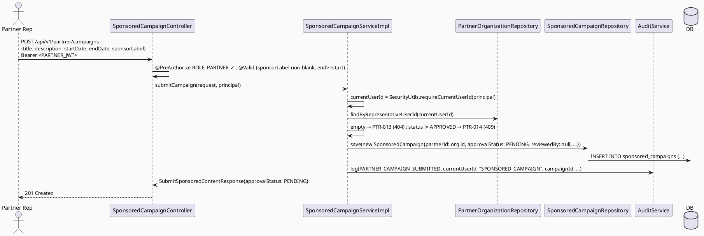

# ENGINEERING DOCUMENTATION STANDARD (EDS) v2.0
# Technical Design Specification — UC-121: Submit Sponsored Content

| Field              | Value                                   |
| ------------------ | ---------------------------------------- |
| **Document ID**    | `CB-PTR-IMP-004`                        |
| **Version**        | `1.0`                                   |
| **Date**           | `2026-07-01`                            |
| **Status**         | `Partially Implemented`                 |
| **Document Owner** | `HuyND`                                 |
| **Author**         | `AI Agent — Winston (System Architect)` |
| **Reviewed by**    | `[ ] Pending`                           |
| **DPO Sign-off**   | `[ ] Pending` *(N/A — campaign metadata, no PII)* |
| **Approved by**    | `[ ] Pending`                           |
| **Last Review**    | `2026-07-01`                            |
| **Based on EDS**   | `v2.0`                                  |

---

## CHANGELOG

| Ngày       | Người thực hiện    | Nội dung thay đổi                                                              |
| ---------- | ------------------- | ------------------------------------------------------------------------------- |
| 2026-07-01 | AI Agent — Winston  | Tạo tài liệu lần đầu — TDS cho UC-121 Submit Sponsored Content (Status=Draft)   |
| 2026-07-11 | AI Agent — Amelia   | Phase 3 implementation — 9/11 tests PASS; PostgreSQL integration pending container runtime |

---

## MỤC LỤC

1. [Tổng quan Module](#1-tổng-quan-module)
2. [Ma trận Truy vết](#2-ma-trận-truy-vết)
3. [Architecture Decision Records (ADR)](#3-architecture-decision-records-adr)
4. [Non-Functional Requirements & SLA](#4-non-functional-requirements--sla)
5. [Static Modeling](#5-static-modeling)
6. [Dynamic Modeling](#6-dynamic-modeling)
7. [Domain Event Catalog](#7-domain-event-catalog)
8. [Interface Specification](#8-interface-specification)
9. [API Specification](#9-api-specification)
10. [Bảng mã lỗi](#10-bảng-mã-lỗi)
11. [Quy trình Triển khai](#11-quy-trình-triển-khai)
12. [Rollback & Incident Runbook](#12-rollback--incident-runbook)
13. [Kịch bản Kiểm thử Chi tiết](#13-kịch-bản-kiểm-thử-chi-tiết)
14. [Phương pháp Xác minh](#14-phương-pháp-xác-minh)
15. [API Verification Samples](#15-api-verification-samples)
16. [Authorization Matrix](#16-authorization-matrix)
17. [AI Prompt Constraints (CASE 2.0)](#17-ai-prompt-constraints-case-20)

---

## 1. Tổng quan Module

| Field                     | Value                                                                                                                                  |
| ------------------------- | --------------------------------------------------------------------------------------------------------------------------------------- |
| **UC ID**                 | `UC-121`                                                                                                                                |
| **FS Reference**          | `3.2.3.4 Submit Sponsored Content`                                                                                                      |
| **Module Name**           | `Submit Sponsored Content`                                                                                                             |
| **Bounded Context**       | `partner` — greenfield Java over EXISTING `sponsored_campaigns` table                                                                  |
| **Primary Actor**         | `Partner Representative (ROLE_PARTNER)` — confirmed (UC-119 ADR-005, resolved)                                                 |
| **Platform**              | `Partner Web Portal`                                                                                                                    |
| **Priority**              | `Medium` (per FS)                                                                                                                       |
| **Frequency of Use**      | `Occasional`                                                                                                                             |
| **Data Classification**   | `Internal`                                                                                                                              |
| **Compliance Scope**      | `N/A` (sponsor label required for advertising transparency — see ADR-005)                                                              |
| **Upstream Dependencies** | `partner (PartnerOrganization/OrganizationStatus/PartnerException, findByRepresentativeUserId)`, `security`, `audit`                    |
| **Downstream Consumers**  | `UC-124 Approve Sponsored Service/Campaign`, `UC-125 Remove Partner Content`, `UC-122 View Partner Performance`                        |

**Mô tả:**
UC-121 cho phép **Partner Representative** (org đã **APPROVED**) gửi một **sponsored campaign** (nội dung tài trợ) vào hệ thống. Campaign tạo với `approval_status = 'PENDING'` chờ admin duyệt (UC-124). **Greenfield Java trên bảng có sẵn**: `sponsored_campaigns` (`V1__init_schema.sql` line 1051: `campaign_id, partner_id, title, description, start_date, end_date, sponsor_label, approval_status default 'PENDING', reviewed_by, created_at, updated_at`) — chưa có Java entity/repository/service. Cấu trúc song song UC-120, khác ở các field campaign (title/start_date/end_date/sponsor_label) và bảng đích.

**Precondition trọng yếu (ADR-002, đồng nhất UC-120):** chỉ org `APPROVED` mới submit; `partner_id` từ ownership resolve; `approval_status` server-set PENDING; `reviewed_by` để null (chỉ UC-124 set khi duyệt).

**Phạm vi rõ ràng:** KHÔNG duyệt (UC-124), KHÔNG sửa/xóa (UC-125). `sponsor_label` bắt buộc non-blank (minh bạch quảng cáo, ADR-005).

---

## 2. Ma trận Truy vết

| Requirement ID | Loại          | Mô tả yêu cầu                                             | Thành phần Code                             | Compliance Target | ADR liên quan |
| --------------- | -------------- | ----------------------------------------------------------- | --------------------------------------------- | ------------------- | --------------- |
| UC-121          | Use Case      | Partner submits sponsored campaign                          | `SponsoredCampaignController.submitCampaign()` | —                  | ADR-001         |
| FS-3.2.3.4      | Functional    | "Submit sponsored content for approval"                    | `SponsoredCampaignServiceImpl.submitCampaign()` | —                 | ADR-001         |
| BR-RBAC         | Business Rule | Chỉ PARTNER submit                                     | `@PreAuthorize("hasRole('PARTNER')")`      | —                  | ADR-004         |
| BR-PTR-013      | Business Rule | Chỉ org APPROVED mới submit                                | status precondition                            | —                  | ADR-002         |
| BR-PTR-014      | Business Rule | `approval_status` server-set PENDING; `reviewed_by` null   | `SponsoredCampaignServiceImpl`                  | —                  | ADR-003         |
| BR-PTR-015      | Business Rule | `partner_id` từ ownership resolve                          | ownership resolve                              | —                  | ADR-002         |
| BR-PTR-016      | Business Rule | `sponsor_label` bắt buộc; `end_date` ≥ `start_date` nếu có | `SubmitSponsoredContentRequest` validators     | —                  | ADR-001, ADR-005 |
| BR-AUDIT-001    | Business Rule | Submit thành công được audit                              | `AuditService.log(...)`                        | —                  | ADR-004         |

---

## 3. Architecture Decision Records (ADR)

### ADR-001 — Greenfield Java Over Existing `sponsored_campaigns` (No Migration)
| Field | Value |
| ---- | ----- |
| **Status** | `Accepted` |
| **Deciders** | `HuyND — System Architect` |
| **Date** | `2026-07-01` |

**Quyết định:** Tạo `SponsoredCampaign` entity (map `sponsored_campaigns`), `SponsoredCampaignRepository`, `SponsoredCampaignMapper`, DTOs, `SponsoredCampaignService`/`Impl`, `SponsoredCampaignController`. `approval_status` → enum `CampaignApprovalStatus` (PENDING/APPROVED/REJECTED). KHÔNG migration (bảng đủ cột). `reviewed_by` (FK→users) để null khi submit; chỉ UC-124 set. **Hệ quả:** không schema delta; nhiều lớp Java mới đúng pattern.

### ADR-002 — APPROVED-Org Precondition + partner_id Ownership Resolve
| Field | Value |
| ---- | ----- |
| **Status** | `Accepted` |

**Quyết định:** Đồng nhất UC-120 ADR-002. Resolve org theo `representativeUserId == currentUserId`; empty → `PTR-013` (404); `status != APPROVED` → `PTR-014` (409); `partner_id` = org.id từ resolve (KHÔNG body).

### ADR-003 — `approval_status` PENDING + `reviewed_by` null (Server-Set, Anti-Self-Approve)
| Field | Value |
| ---- | ----- |
| **Status** | `Accepted` |

**Quyết định:** Server hard-code `approval_status = PENDING`, `reviewed_by = null`. KHÔNG nhận từ body. Chỉ UC-124 (admin) chuyển trạng thái và set `reviewed_by = adminUserId`.

### ADR-004 — RBAC + Audit
| Field | Value |
| ---- | ----- |
| **Status** | `Accepted` |

`@PreAuthorize("hasRole('PARTNER')")` (role name confirmed, UC-119 ADR-005 resolved). Audit `PARTNER_CAMPAIGN_SUBMITTED` (enum addition nếu cần).

### ADR-005 — `sponsor_label` Bắt Buộc (Advertising Transparency, Resolved)
| Field | Value |
| ---- | ----- |
| **Status** | `Accepted — resolved by project-analysis default (simpler validation, safer transparency posture)` |

**Bối cảnh:** `sponsored_campaigns.sponsor_label` là `varchar(100)` nullable trong schema. Nội dung tài trợ nên có nhãn minh bạch ("Được tài trợ bởi X") — nguyên tắc quảng cáo minh bạch. FS không nói rõ.
**Quyết định:** v1 yêu cầu `sponsor_label` non-blank ở tầng application (dù DB nullable). Resolved via project
analysis rather than left open: a hard `@NotBlank` constraint is simpler to implement/test than conditional
logic, and requiring transparency labeling is the safer default for a feature whose entire purpose is paid
promotional content — the downside (partner must always supply a label) is minor compared to the risk of
shipping unlabeled sponsored content. **Hệ quả:** minh bạch quảng cáo by default; nếu Product sau này muốn
cho phép campaign không nhãn, đây là một thay đổi nhỏ (bỏ `@NotBlank`), không phải thiết kế lại.

### ADR-006 — Date Range Validation
| Field | Value |
| ---- | ----- |
| **Status** | `Accepted` |

**Quyết định:** Nếu cả `start_date` và `end_date` có mặt, `end_date >= start_date` (else `PTR-015`, 400). Cả hai nullable (schema cho phép) — nếu chỉ một có mặt, chấp nhận (không ràng buộc chéo). Việc `start_date` có được phép ở quá khứ hay không = `Open` (không có nguồn; v1 không chặn quá khứ).

---

## 4. Non-Functional Requirements & SLA

| Category | Requirement | Target | Measurement | Basis |
| --- | --- | --- | --- | --- |
| Latency | p99 `POST /partner/campaigns` | `Open` — `< 300ms` recommend | k6 | — |
| Availability | Uptime | `Open` — `99.5%` | monitor | — |
| Data integrity | approval_status PENDING + reviewed_by null on create; partner_id from resolve | 100% | unit + integration | ADR-002/003 |
| Access control | PARTNER + APPROVED org | Least privilege | §16 | ADR-002/004 |

---

## 5. Static Modeling

### 5.1. Class Diagram (PlantUML)

```plantuml
@startuml UC121_SubmitSponsoredContent_ClassDiagram
skinparam classAttributeIconSize 0
skinparam backgroundColor #FAFAFA

enum CampaignApprovalStatus { PENDING APPROVED REJECTED }

class SponsoredCampaign <<Entity, maps sponsored_campaigns>> {
  + campaignId: UUID
  + partnerId: UUID <<from ownership resolve>>
  + title: String
  + description: String
  + startDate: LocalDate <<nullable>>
  + endDate: LocalDate <<nullable>>
  + sponsorLabel: String <<required v1, ADR-005>>
  + approvalStatus: CampaignApprovalStatus <<PENDING on create>>
  + reviewedBy: UUID <<null on create, set by UC-124>>
  + createdAt / updatedAt
}

class SubmitSponsoredContentRequest <<DTO>> {
  + title: String
  + description: String
  + startDate: LocalDate <<optional>>
  + endDate: LocalDate <<optional>>
  + sponsorLabel: String <<required>>
  ' NO partnerId, approvalStatus, reviewedBy
}

class SubmitSponsoredContentResponse <<DTO>> {
  + campaignId: UUID + partnerId: UUID + title + description
  + startDate + endDate + sponsorLabel
  + approvalStatus: CampaignApprovalStatus <<PENDING>>
  + createdAt: Instant
}

interface SponsoredCampaignService { + submitCampaign(request, principal): SubmitSponsoredContentResponse }
class SponsoredCampaignController <<RestController>> { + submitCampaign(request, principal) }

SponsoredCampaignController --> SponsoredCampaignService
SubmitSponsoredContentResponse ..> SponsoredCampaign : mapped from
@enduml
```

### 5.2. Data Structure — NO Schema Delta

> **No migration.** `sponsored_campaigns` (line 1051) already exists. `CampaignApprovalStatus` is a Java enum
> over the existing `varchar(30)` `approval_status`. `reviewed_by` left null on create.

---

## 6. Dynamic Modeling

### 6.1. Sequence — Happy Path



### 6.2. Error Paths
- No org → `PTR-013` (404); org not APPROVED → `PTR-014` (409); validation (blank sponsorLabel / end<start) → `PTR-015` (400); wrong role → 403 (confirmed ACCESS_DENIED (PTR-004 unreachable)).

---

## 7. Domain Event Catalog

| Event | Trigger | Publisher | Subscriber | Payload | Async? |
| --- | --- | --- | --- | --- | --- |
| (none v1) | — | — | — | — | — |

> **Open:** future `SponsoredCampaignSubmitted` event → admin approval queue (UC-124). v1 sync + audit-only.

---

## 8. Interface Specification

### 8.1. Service Interface

```java
// com.carebridge.backend.partner.service.SponsoredCampaignService
public interface SponsoredCampaignService {
    /**
     * Submits a sponsored campaign for the calling partner rep's APPROVED organization.
     * partner_id from SecurityContext (ADR-002); approval_status PENDING + reviewed_by null (ADR-003).
     * @throws PartnerException (PTR-013) if current user has no partner organization
     * @throws PartnerException (PTR-014) if organization status is not APPROVED
     * @throws PartnerException (PTR-015) if validation fails (blank sponsorLabel, end_date < start_date)
     */
    SubmitSponsoredContentResponse submitCampaign(SubmitSponsoredContentRequest request, Principal principal);
}
```

### 8.2. Repository

```java
// SponsoredCampaignRepository extends JpaRepository<SponsoredCampaign, UUID> — new
// PartnerOrganizationRepository.findByRepresentativeUserId(UUID) — reused (UC-119)
```

### 8.3. DTOs

```java
public record SubmitSponsoredContentRequest(
        @NotBlank String title,
        String description,
        LocalDate startDate,   // optional
        LocalDate endDate,     // optional; if both present end >= start (PTR-015)
        @NotBlank String sponsorLabel   // required v1 (ADR-005)
) {}   // NO partnerId, approvalStatus, reviewedBy

public record SubmitSponsoredContentResponse(
        UUID campaignId, UUID partnerId, String title, String description,
        LocalDate startDate, LocalDate endDate, String sponsorLabel,
        CampaignApprovalStatus approvalStatus,   // PENDING
        Instant createdAt
) {}
```

---

## 9. API Specification

### 9.1. Endpoints Table

| Method | Path                          | Auth Level | Required Roles      | Rate Limit | Idempotent? |
| ------ | ------------------------------- | ------------ | ---------------------- | ------------ | -------------- |
| `POST` | `/api/v1/partner/campaigns`     | JWT Bearer   | `ROLE_PARTNER`     | `Open`       | No |

### 9.2. Request / Response

**Request:**
```json
{ "title": "Ưu đãi khám thai tháng 7", "description": "Giảm 20% gói khám", "startDate": "2026-07-05",
  "endDate": "2026-07-31", "sponsorLabel": "Được tài trợ bởi Phòng khám ABC" }
```

**Response — 201:**
```json
{ "campaignId": "…", "partnerId": "…", "title": "Ưu đãi khám thai tháng 7", "description": "…",
  "startDate": "2026-07-05", "endDate": "2026-07-31", "sponsorLabel": "Được tài trợ bởi Phòng khám ABC",
  "approvalStatus": "PENDING", "createdAt": "2026-07-01T10:15:00Z" }
```

**404 PTR-013 / 409 PTR-014 / 400 PTR-015 / 403 / 401** — theo §10 và UC-119 §6.3 pattern.

---

## 10. Bảng mã lỗi

| Code       | HTTP Status | Message (EN)                                           | Trigger Condition                         | Status in code |
| ----------- | ------------- | --------------------------------------------------------- | -------------------------------------------- | ----------------- |
| `PTR-013`  | 404           | No partner organization found for current user             | `findByRepresentativeUserId` empty           | **New — to implement** |
| `PTR-014`  | 409           | Partner organization must be APPROVED to submit campaigns   | `org.status != APPROVED`                     | **New — to implement** |
| `PTR-015`  | 400           | Sponsored campaign validation failed                        | blank sponsorLabel / end_date < start_date   | **New — to implement** |
| `PTR-004`  | 403           | Insufficient permissions                                   | Non-PARTNER (confirmed ACCESS_DENIED — dead code, same pattern as MOD-004)    | Not reachable in practice |
| `PTR-006`  | 401           | Authentication required                                    | Missing/invalid JWT (verify)                 | Reused (verify) |

> **Numbering:** UC-118 `001-006`, UC-119 `007-009`, UC-120 `010-012`. UC-121 claims **`PTR-013..015`**.
> UC-122+ continue from `PTR-016`. Consistency Gate verify.

---

## 11. Quy trình Triển khai

### 11.1. Prerequisites
- [ ] UC-118 deployed; UC-119 `findByRepresentativeUserId` available
- [ ] ADR-005 (role name, UC-119) resolved — BLOCKING
- [ ] ADR-005 (this doc, sponsor_label required) confirmed
- [ ] No migration — confirm; verify no CHECK on `sponsored_campaigns.approval_status`

### 11.2. Pre-Migration Checklist
- [ ] **Không cần migration** — `sponsored_campaigns` đã tồn tại. CG-9: no schema delta.

### 11.3. Implementation Steps
```
1. SponsoredCampaign entity + CampaignApprovalStatus enum
2. SponsoredCampaignRepository (JpaRepository)
3. SponsoredCampaignMapper + DTOs
4. PartnerException PTR-013/014/015
5. SponsoredCampaignService.submitCampaign() interface + Impl (resolve org, precondition, set PENDING + reviewedBy null, save, audit)
6. SponsoredCampaignController POST /api/v1/partner/campaigns @PreAuthorize("hasRole('PARTNER')") + @Valid
7. SecurityConfig rule + audit enum addition if needed
```

### 11.4. Deployment Checklist
- [ ] APPROVED partner submits (201, PENDING, reviewed_by null)
- [ ] Non-APPROVED → PTR-014; no org → PTR-013
- [ ] partner_id in DB = caller's org; approval_status PENDING regardless of body
- [ ] sponsor_label required (blank → PTR-015)

---

## 12. Rollback & Incident Runbook

| Điều kiện | Ngưỡng | Người quyết định |
| ------------ | --------- | ------------------- |
| Campaign tạo với approval_status != PENDING hoặc reviewed_by set (self-approve) | Bất kỳ case nào | Tech Lead (CRITICAL) |
| Partner chưa APPROVED submit được | Bất kỳ case nào | Tech Lead (CRITICAL) |
| partner_id gán sai | Bất kỳ case nào | Tech Lead (CRITICAL) |

```bash
kubectl rollout undo deployment/carebridge-api
# No migration to revert.
```

---

## 13. Kịch bản Kiểm thử Chi tiết

> Chi tiết trong `UC121_SubmitSponsoredContent_Test-Spec.md` (`CB-PTR-TEST-004`).

### 13.1. Unit / Service
- Happy path: APPROVED org → campaign PENDING, reviewed_by null, partner_id=org.id
- No org → PTR-013; org not APPROVED → PTR-014 (each status)
- Validation: blank sponsorLabel, end<start → PTR-015
- approval_status/reviewed_by server-set (body ignored)
- Audit called once

### 13.2. Integration
- Full POST (Testcontainers): APPROVED org → DB campaign PENDING + reviewed_by null
- Non-approved → PTR-014, no row

### 13.3. Security
- Non-PARTNER → 403; No JWT → 401; anti-injection (partnerId/approvalStatus/reviewedBy ignored)

---

## 14. Phương pháp Xác minh

```sql
SELECT campaign_id, partner_id, approval_status, reviewed_by, sponsor_label FROM sponsored_campaigns WHERE partner_id='<org>' ORDER BY created_at DESC LIMIT 5;
-- approval_status='PENDING', reviewed_by IS NULL, partner_id = caller org
```

---

## 15. API Verification Samples

```bash
curl -X POST "https://api.carebridge.vn/api/v1/partner/campaigns" \
  -H "Authorization: Bearer $PARTNER_TOKEN" -H "Content-Type: application/json" \
  -d '{"title":"Ưu đãi","description":"...","startDate":"2026-07-05","endDate":"2026-07-31","sponsorLabel":"Được tài trợ bởi ABC"}'
# Expected: 201, approvalStatus=PENDING
```

---

## 16. Authorization Matrix

| Endpoint                      | `MOTHER` | `FAMILY` | `EXPERT` | `MODERATOR` | `CONTENT_ADMIN` | `PARTNER` | `SYSTEM_ADMIN` |
| --------------------------------- | ---------- | ---------- | ---------- | -------------- | ------------------ | --------------- | ----------------- |
| `POST /api/v1/partner/campaigns` | ❌        | ❌        | ❌        | ❌             | ❌                  | ✅ (APPROVED org) | ❌            |

**Chú thích:** ✅ chỉ khi org APPROVED. Role name `PARTNER` (confirmed, UC-119 ADR-005 resolved). No `RoleHierarchy`.

---

## 17. AI Prompt Constraints (CASE 2.0)

### 17.1 Constraint Summary Table

| #   | Constraint                                                                | Source            | Last Verified |
| --- | ------------------------------------------------------------------------- | ------------------- | --------------- |
| C1  | Controller `@PreAuthorize("hasRole('PARTNER')")`                       | `ADR-004`, UC-119 ADR-005 | `2026-07-01` |
| C2  | `partner_id` từ ownership resolve, KHÔNG từ body                          | `ADR-002`           | `2026-07-01`     |
| C3  | `approval_status`=PENDING + `reviewed_by`=null server-set, KHÔNG từ body   | `ADR-003`           | `2026-07-01`     |
| C4  | Chỉ org APPROVED submit (PTR-014); no org → PTR-013                        | `ADR-002`           | `2026-07-01`     |
| C5  | `sponsor_label` bắt buộc; end_date ≥ start_date                           | `ADR-005`, `ADR-006` | `2026-07-01`   |
| C6  | Greenfield Java trên `sponsored_campaigns` có sẵn — KHÔNG migration        | `ADR-001`           | `2026-07-01`     |

### 17.2 Constraint Injection Block

```
[CONSTRAINT BLOCK — Module: Submit Sponsored Content (UC-121)]
Theo TDS CB-PTR-IMP-004:
1. [C1] Controller submitCampaign() PHẢI @PreAuthorize("hasRole('PARTNER')").
2. [C2] partner_id resolve từ org current user, KHÔNG body.
3. [C3] approval_status=PENDING, reviewed_by=null server-set (chống self-approve). Chỉ UC-124 set reviewed_by.
4. [C4] org phải APPROVED (else PTR-014); user phải có org (else PTR-013).
5. [C5] sponsor_label bắt buộc (ADR-005); end_date ≥ start_date (PTR-015).
6. [C6] Greenfield Java trên sponsored_campaigns CÓ SẴN; KHÔNG migration.

[CONTEXT BLOCK]
- Bounded Context: partner; Data: Internal; Compliance: N/A (sponsor transparency)
- Interfaces: §8; Error codes: §10 (PTR-013/014/015); Auth: §16
- Schema delta: NONE
- OPEN: role name (UC-119 ADR-005), 403 code, sponsor_label-required (ADR-005), start_date-in-past (ADR-006)

[TASK BLOCK]
Implement SponsoredCampaignController.submitCampaign(), SponsoredCampaignServiceImpl, SponsoredCampaign
entity + CampaignApprovalStatus enum, repo, mapper, DTOs, PTR-013/014/015 — thỏa mãn C1-C6.
Tests cover §13 (Test-Spec CB-PTR-TEST-004).
```

### 17.3 Constraint Quality Checklist
- [x] Traceable; [x] không generic; [x] Last Verified; [x] reference §8/§16

### 17.4 Anti-Pattern Detection

| AP-ID     | Anti-Pattern          | Dấu hiệu                                                        | Hành động                |
| --------- | ---------------------- | ------------------------------------------------------------------- | --------------------------- |
| AP-AI-001 | Unconstrained Gen     | Bỏ RBAC/precondition APPROVED                                       | Reject — C1/C4 |
| AP-AI-002 | Self-Approve          | approval_status/reviewed_by nhận từ body                           | Reject — ADR-003, BLOCKING |
| AP-AI-003 | Impersonation         | partner_id nhận từ body                                            | Reject — ADR-002, BLOCKING |
| AP-AI-004 | Layer Violation       | Controller gọi repository trực tiếp                               | Reject |
| AP-AI-005 | Hallucinated Contract | Import class không có trong §8                                     | Reject |

**Kết quả review:**
- [x] Không phát hiện anti-pattern nào trong bản thân spec này → approved-for-RED-phase

---

## PHỤ LỤC

### B. Tài liệu tham chiếu
| Document | Path |
| ------------ | ------- |
| UC-118 TDS (PartnerOrganization, PTR codes) | `04_Implement/UC118_CreatePartnerProfile/UC118_CreatePartnerProfile_TDS.md` |
| UC-120 TDS (parallel structure — service listing) | `04_Implement/UC120_SubmitServiceListing/UC120_SubmitServiceListing_TDS.md` |
| Schema `sponsored_campaigns` (line 1051) | `05_Development/CareBridgeAPI/src/main/resources/db/migration/V1__init_schema.sql` |

---

*EDS v2.1 — Greenfield Java over existing `sponsored_campaigns`; no schema delta. Status: Draft. Parallel to
UC-120. OPEN: role name (UC-119 ADR-005), 403 code, sponsor_label-required (ADR-005), start_date-in-past
(ADR-006). Anti-self-approve (reviewed_by null + PENDING) và APPROVED-org precondition là gate chính.*
