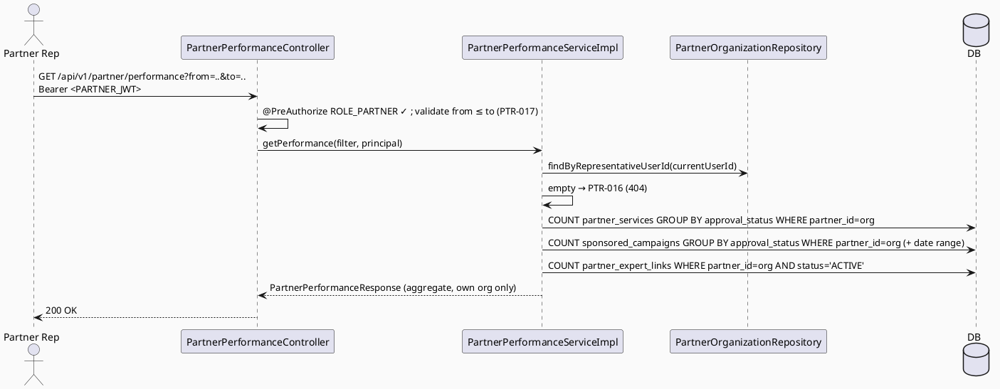

# ENGINEERING DOCUMENTATION STANDARD (EDS) v2.0
# Technical Design Specification — UC-122: View Partner Performance

| Field              | Value                                   |
| ------------------ | ---------------------------------------- |
| **Document ID**    | `CB-PTR-IMP-005`                        |
| **Version**        | `1.0`                                   |
| **Date**           | `2026-07-01`                            |
| **Status**         | `Draft`                                 |
| **Document Owner** | `HuyND`                                 |
| **Author**         | `AI Agent — Winston (System Architect)` |
| **Reviewed by**    | `[ ] Pending`                           |
| **DPO Sign-off**   | `[ ] Pending` *(own aggregate data, no PII)* |
| **Approved by**    | `[ ] Pending`                           |
| **Last Review**    | `2026-07-01`                            |
| **Based on EDS**   | `v2.0`                                  |

---

## CHANGELOG

| Ngày       | Người thực hiện    | Nội dung thay đổi                                                              |
| ---------- | ------------------- | ------------------------------------------------------------------------------- |
| 2026-07-01 | AI Agent — Winston  | Tạo tài liệu lần đầu — TDS cho UC-122 View Partner Performance (Status=Draft)   |

---

## MỤC LỤC

1. [Tổng quan Module](#1-tổng-quan-module)
2. [Ma trận Truy vết](#2-ma-trận-truy-vết)
3. [Architecture Decision Records (ADR)](#3-architecture-decision-records-adr)
4. [Non-Functional Requirements & SLA](#4-non-functional-requirements--sla)
5. [Static Modeling](#5-static-modeling)
6. [Dynamic Modeling](#6-dynamic-modeling)
7. [Domain Event Catalog](#7-domain-event-catalog)
8. [Interface Specification](#8-interface-specification)
9. [API Specification](#9-api-specification)
10. [Bảng mã lỗi](#10-bảng-mã-lỗi)
11. [Quy trình Triển khai](#11-quy-trình-triển-khai)
12. [Rollback & Incident Runbook](#12-rollback--incident-runbook)
13. [Kịch bản Kiểm thử Chi tiết](#13-kịch-bản-kiểm-thử-chi-tiết)
14. [Phương pháp Xác minh](#14-phương-pháp-xác-minh)
15. [API Verification Samples](#15-api-verification-samples)
16. [Authorization Matrix](#16-authorization-matrix)
17. [AI Prompt Constraints (CASE 2.0)](#17-ai-prompt-constraints-case-20)

---

## 1. Tổng quan Module

| Field                     | Value                                                                                                                                  |
| ------------------------- | --------------------------------------------------------------------------------------------------------------------------------------- |
| **UC ID**                 | `UC-122`                                                                                                                                |
| **FS Reference**          | `3.2.3.5 View Partner Performance` (drawio p06 cũng gọi "View Referral/Campaign Performance")                                          |
| **Module Name**           | `View Partner Performance`                                                                                                             |
| **Bounded Context**       | `partner` — read-only aggregate over the partner's OWN rows                                                                            |
| **Primary Actor**         | `Partner Representative (ROLE_PARTNER)` — own data only (confirmed, UC-119 ADR-005 resolved)                                    |
| **Platform**              | `Partner Web Portal`                                                                                                                    |
| **Priority**              | `Medium` (per FS)                                                                                                                       |
| **Frequency of Use**      | `Regular`                                                                                                                                |
| **Data Classification**   | `Internal` (partner's own aggregate counts)                                                                                            |
| **Compliance Scope**      | `N/A`                                                                                                                                   |
| **Upstream Dependencies** | `partner (PartnerOrganization, PartnerService [UC-120], SponsoredCampaign [UC-121], partner_expert_links table)`, `security`           |
| **Downstream Consumers**  | Partner Web Portal performance UI                                                                                                       |

**Mô tả:**
UC-122 trả về một endpoint **read-only** các chỉ số hiệu suất của **tổ chức đối tác của chính người gọi**: số service listings theo `approval_status`, số sponsored campaigns theo `approval_status` (kèm date range tùy chọn), và số expert links đang ACTIVE. **Cảnh báo grounding (ADR-001):** KHÔNG có bảng theo dõi referral/click/conversion/view nào trong schema (`grep -i "referral\|click_count\|view_count"` toàn bộ migration = rỗng). Vì vậy các metric "true engagement/referral/conversion" là **out-of-scope / `Open`** — KHÔNG bịa số. Chỉ trả những đếm được từ bảng có sẵn.

**Ownership (ADR-002):** partner_id resolve từ org của current user; endpoint chỉ trả dữ liệu của org đó. Không nhận partner_id từ query/body.

**Phạm vi rõ ràng:** read-only; không mutate; không PII; không referral/click metrics (không có cột).

---

## 2. Ma trận Truy vết

| Requirement ID | Loại          | Mô tả yêu cầu                                                       | Thành phần Code                              | Compliance Target | ADR liên quan |
| --------------- | -------------- | --------------------------------------------------------------------- | ---------------------------------------------- | ------------------- | --------------- |
| UC-122          | Use Case      | Partner views own performance metrics                                 | `PartnerPerformanceController.getPerformance()` | —                  | ADR-001         |
| FS-3.2.3.5      | Functional    | "View partner referral/campaign performance"                          | `PartnerPerformanceServiceImpl.getPerformance()` | —                 | ADR-001         |
| BR-RBAC         | Business Rule | Chỉ PARTNER xem, và chỉ dữ liệu org của mình                      | `@PreAuthorize` + ownership resolve            | —                  | ADR-002         |
| BR-METRIC-001   | Business Rule | Mỗi metric map tới cột schema tồn tại (không bịa referral/click)      | Aggregation queries (§5.2)                      | —                  | ADR-001         |
| BR-AUDIT-001    | Business Rule | (Optional) truy cập performance được audit                           | `AuditService.log(...)`                         | —                  | ADR-004 (Open)  |

---

## 3. Architecture Decision Records (ADR)

### ADR-001 — Metric Grounding: Chỉ Đếm Được Từ Bảng Có Sẵn (Không Referral/Click)

| Field | Value |
| ---- | ----- |
| **Status** | `Accepted` |
| **Deciders** | `HuyND — System Architect` |
| **Date** | `2026-07-01` |

**Bối cảnh:** FS gợi ý "referral/campaign performance" nhưng **không có bảng referral/click/conversion/view** nào trong schema (verified: grep trả rỗng).
**Quyết định:** 3 nhóm metric có cột hậu thuẫn (§5.2): (1) service listings theo `partner_services.approval_status`; (2) sponsored campaigns theo `sponsored_campaigns.approval_status` (+ date range trên start/end); (3) active expert links = `partner_expert_links WHERE status='ACTIVE'` count. **True referral/click/conversion metrics = Out-of-scope / `Open`** (cần bảng event-tracking mới, không justify được bằng evidence hiện tại). KHÔNG bịa số engagement.
**Hệ quả:** Trung thực; "performance" giới hạn ở trạng thái catalog + liên kết, không phải engagement analytics — cho tới khi có tracking table.

### ADR-002 — Ownership: Chỉ Dữ Liệu Org Của Current User
| Field | Value |
| ---- | ----- |
| **Status** | `Accepted` |

**Quyết định:** Resolve org theo `representativeUserId == currentUserId`; empty → `PTR-016` (404). Mọi truy vấn filter theo `partner_id = org.id`. KHÔNG nhận partner_id từ query/body → không thể xem performance của partner khác (chống IDOR).

### ADR-003 — Live Aggregation, No Summary Table (No Migration)
| Field | Value |
| ---- | ----- |
| **Status** | `Accepted` |

**Quyết định:** Live count queries mỗi request; không bảng summary → không migration. Tải thấp (một partner xem dữ liệu của chính mình).

### ADR-004 — Audit Read-Access: Not Added in v1 (Resolved)
| Field | Value |
| ---- | ----- |
| **Status** | `Rejected for v1 — resolved by project-analysis default (smaller scope, own-data read-only)` |

Không sourced. Resolved via project analysis: đây là endpoint đọc dữ liệu của CHÍNH partner đó (không phải
dữ liệu toàn hệ thống như UC-111), rủi ro thấp hơn nhiều so với dashboard admin — không cần audit trail riêng
cho việc partner tự xem hiệu suất của mình. KHÔNG thêm audit logging cho v1; giữ đơn giản, không enum mới.

---

## 4. Non-Functional Requirements & SLA

| Category | Requirement | Target | Measurement | Basis |
| --- | --- | --- | --- | --- |
| Latency | p99 `GET /partner/performance` | `Open` — `< 300ms` recommend | k6 | — |
| Read-only | No table mutation | 0 write | code review + pg_stat | — |
| No PII | Aggregate counts only | 100% | DTO review | ADR-001 |
| Access control | PARTNER + own org only | Least privilege | §16 | ADR-002 |

---

## 5. Static Modeling

### 5.1. Class Diagram (PlantUML)

```plantuml
@startuml UC122_ViewPartnerPerformance_ClassDiagram
skinparam classAttributeIconSize 0
skinparam backgroundColor #FAFAFA

class PartnerPerformanceController <<RestController>> {
  + getPerformance(from: LocalDate, to: LocalDate, principal): ResponseEntity<PartnerPerformanceResponse>
}
interface PartnerPerformanceService { + getPerformance(filter, principal): PartnerPerformanceResponse }
class PartnerPerformanceServiceImpl implements PartnerPerformanceService {
  - partnerOrganizationRepository
  - partnerServiceRepository
  - sponsoredCampaignRepository
  - partnerExpertLinkRepository
  + getPerformance(filter, principal): PartnerPerformanceResponse
}
class PartnerPerformanceResponse <<DTO>> {
  + serviceListingsByStatus: Map<String,Long>
  + campaignsByStatus: Map<String,Long>
  + activeExpertLinks: long
  + periodFrom: LocalDate
  + periodTo: LocalDate
  + generatedAt: Instant
}
class PerformanceFilter <<DTO>> { + from: LocalDate <<nullable>> + to: LocalDate <<nullable>> }

PartnerPerformanceController --> PartnerPerformanceService
@enduml
```

### 5.2. Data Structure — Metric-to-Column Mapping (NO Schema Delta)

| Metric | Source table.column | Aggregation |
| --- | --- | --- |
| `serviceListingsByStatus` | `partner_services.approval_status WHERE partner_id = <org>` | `COUNT(*) GROUP BY approval_status` |
| `campaignsByStatus` | `sponsored_campaigns.approval_status WHERE partner_id = <org>` (+ optional date range on start/end) | `COUNT(*) GROUP BY approval_status` |
| `activeExpertLinks` | `partner_expert_links WHERE partner_id = <org> AND status='ACTIVE'` | `COUNT(*)` |

> **NOT implemented (no backing column — do NOT invent):** referral count, click-through, conversion,
> impression/view counts, revenue. Flagged `Open` / out-of-scope (would need a new event-tracking table).

---

## 6. Dynamic Modeling

### 6.1. Sequence — Happy Path



### 6.2. Error Paths
- No org → `PTR-016` (404); invalid range (from>to) → `PTR-017` (400); wrong role → 403 (confirmed ACCESS_DENIED (PTR-004 unreachable)).

---

## 7. Domain Event Catalog

| Event | Trigger | Publisher | Subscriber | Payload | Async? |
| --- | --- | --- | --- | --- | --- |
| (none) | — | — | — | — | — |

> **N/A** — read-only endpoint.

---

## 8. Interface Specification

### 8.1. Service Interface

```java
// com.carebridge.backend.partner.service.PartnerPerformanceService
public interface PartnerPerformanceService {
    /**
     * Returns aggregate performance metrics for the calling partner rep's OWN organization
     * (resolved by representativeUserId from SecurityContext, ADR-002). Read-only, no PII.
     * @throws PartnerException (PTR-016) if the current user has no partner organization
     * @throws PartnerException (PTR-017) if from/to range is invalid (from after to)
     */
    PartnerPerformanceResponse getPerformance(PerformanceFilter filter, Principal principal);
}
```

### 8.2. Repository

```java
// PartnerServiceRepository — countByPartnerIdGroupByApprovalStatus (or projection) — new/additive
// SponsoredCampaignRepository — countByPartnerIdGroupByApprovalStatus (+ date range) — new/additive
// PartnerExpertLinkRepository — countByPartnerIdAndStatus('ACTIVE') — new read-only repo (partner_expert_links has no Java repo yet; add a minimal read-only one)
// PartnerOrganizationRepository.findByRepresentativeUserId — reused (UC-119)
```

### 8.3. DTOs

```java
public record PartnerPerformanceResponse(
        Map<String,Long> serviceListingsByStatus,
        Map<String,Long> campaignsByStatus,
        long activeExpertLinks,
        LocalDate periodFrom, LocalDate periodTo, Instant generatedAt
) {}   // aggregate only — no PII, no entity

public record PerformanceFilter(LocalDate from, LocalDate to) {}   // both nullable
```

---

## 9. API Specification

### 9.1. Endpoints Table

| Method | Path                             | Auth Level | Required Roles      | Rate Limit | Idempotent? |
| ------ | ---------------------------------- | ------------ | ---------------------- | ------------ | -------------- |
| `GET`  | `/api/v1/partner/performance`      | JWT Bearer   | `ROLE_PARTNER`     | `Open`       | Yes (read-only) |

### 9.2. Response (200 OK)

```json
{ "serviceListingsByStatus": { "PENDING": 2, "APPROVED": 5, "REJECTED": 1 },
  "campaignsByStatus": { "PENDING": 1, "APPROVED": 3 },
  "activeExpertLinks": 4, "periodFrom": "2026-06-01", "periodTo": "2026-06-30",
  "generatedAt": "2026-07-01T10:15:00Z" }
```

**404 PTR-016 / 400 PTR-017 / 403 / 401** — theo §10 và UC-119 §6.3.

---

## 10. Bảng mã lỗi

| Code       | HTTP Status | Message (EN)                                     | Trigger Condition                     | Status in code |
| ----------- | ------------- | --------------------------------------------------- | ---------------------------------------- | ----------------- |
| `PTR-016`  | 404           | No partner organization found for current user       | `findByRepresentativeUserId` empty       | **New — to implement** |
| `PTR-017`  | 400           | Invalid date range (from after to)                   | `from > to`                              | **New — to implement** |
| `PTR-004`  | 403           | Insufficient permissions                             | Non-PARTNER (confirmed ACCESS_DENIED — dead code, same pattern as MOD-004) | Not reachable in practice |
| `PTR-006`  | 401           | Authentication required                              | Missing/invalid JWT (verify)             | Reused (verify) |

> **Numbering:** UC-118..121 used `PTR-001..015`. UC-122 claims **`PTR-016..017`**. UC-123+ continue `PTR-018`. CG verify.

---

## 11. Quy trình Triển khai

### 11.1. Prerequisites
- [ ] UC-120/121 deployed (PartnerService/SponsoredCampaign entities + repos exist) for their count queries
- [ ] ADR-005 (role name, UC-119) resolved — BLOCKING
- [ ] No migration — confirm; add read-only `PartnerExpertLinkRepository` if missing (no schema change)

### 11.2. Pre-Migration Checklist
- [ ] **Không cần migration** — chỉ đọc. CG-9: no schema delta.

### 11.3. Implementation Steps
```
1. PartnerPerformanceResponse + PerformanceFilter DTOs
2. Repo count methods (services/campaigns by status; active expert links)
3. PartnerPerformanceService interface + Impl (resolve own org, aggregate)
4. PartnerException PTR-016/017
5. PartnerPerformanceController GET /api/v1/partner/performance @PreAuthorize("hasRole('PARTNER')") + @Valid range
6. SecurityConfig rule
```

### 11.4. Deployment Checklist
- [ ] Returns own-org aggregates for PARTNER; PTR-016 if no org
- [ ] No PII in response; no referral/click metric invented
- [ ] Non-PARTNER → 403; cannot query another partner's data

---

## 12. Rollback & Incident Runbook

| Điều kiện | Ngưỡng | Người quyết định |
| ------------ | --------- | ------------------- |
| Partner A xem được performance của Partner B | Bất kỳ case nào | Tech Lead (CRITICAL — IDOR) |
| Response chứa PII | Bất kỳ case nào | Tech Lead (CRITICAL — PDPA) |

```bash
kubectl rollout undo deployment/carebridge-api    # read-only, safe
# No migration to revert.
```

---

## 13. Kịch bản Kiểm thử Chi tiết

> Chi tiết trong `UC122_ViewPartnerPerformance_Test-Spec.md` (`CB-PTR-TEST-005`).

### 13.1. Unit / Service
- Happy path: aggregates for own org (services/campaigns by status, active expert links)
- No org → PTR-016; invalid range → PTR-017
- Ownership: only own org's rows counted (partner_id filter)
- No referral/click field in response (grounding guard)

### 13.2. Integration
- Full GET (Testcontainers): seed services/campaigns/links for org A + noise for org B → counts only A's
- Read-only (no mutation)

### 13.3. Security
- Non-PARTNER → 403; No JWT → 401; cannot pass another partner_id (no such param)

---

## 14. Phương pháp Xác minh

```sql
SELECT approval_status, COUNT(*) FROM partner_services WHERE partner_id='<org>' GROUP BY approval_status;
SELECT approval_status, COUNT(*) FROM sponsored_campaigns WHERE partner_id='<org>' GROUP BY approval_status;
SELECT COUNT(*) FROM partner_expert_links WHERE partner_id='<org>' AND status='ACTIVE';
```

---

## 15. API Verification Samples

```bash
curl -X GET "https://api.carebridge.vn/api/v1/partner/performance?from=2026-06-01&to=2026-06-30" \
  -H "Authorization: Bearer $PARTNER_TOKEN"
# Expected: 200 aggregate JSON (own org)
```

---

## 16. Authorization Matrix

| Endpoint                          | `MOTHER` | `FAMILY` | `EXPERT` | `MODERATOR` | `CONTENT_ADMIN` | `PARTNER` | `SYSTEM_ADMIN` |
| ------------------------------------- | ---------- | ---------- | ---------- | -------------- | ------------------ | --------------- | ----------------- |
| `GET /api/v1/partner/performance`    | ❌        | ❌        | ❌        | ❌             | ❌                  | ✅ (own org)    | ❌ *(note)*        |

**Chú thích:** ✅ chỉ dữ liệu org của chính mình (ADR-002). SYSTEM_ADMIN không dùng endpoint này (admin-wide performance = out of scope / UC khác). Role name `PARTNER` (Open).

---

## 17. AI Prompt Constraints (CASE 2.0)

### 17.1 Constraint Summary Table

| #   | Constraint                                                                   | Source            | Last Verified |
| --- | ---------------------------------------------------------------------------- | ------------------- | --------------- |
| C1  | Controller `@PreAuthorize("hasRole('PARTNER')")` — chỉ @Valid + delegate  | `ADR-002`, UC-119 ADR-005 | `2026-07-01` |
| C2  | Read-only — KHÔNG mutate                                                      | `§4`                | `2026-07-01`     |
| C3  | Chỉ dữ liệu org của current user (partner_id filter, resolve từ context)      | `ADR-002`           | `2026-07-01`     |
| C4  | Mỗi metric map cột §5.2 — KHÔNG bịa referral/click/conversion                 | `ADR-001`           | `2026-07-01`     |
| C5  | Response aggregate-only, KHÔNG PII                                            | `ADR-001`           | `2026-07-01`     |

### 17.2 Constraint Injection Block

```
[CONSTRAINT BLOCK — Module: View Partner Performance (UC-122)]
Theo TDS CB-PTR-IMP-005:
1. [C1] Controller getPerformance() PHẢI @PreAuthorize("hasRole('PARTNER')").
2. [C2] read-only.
3. [C3] Chỉ đếm rows của org current user (resolve theo representativeUserId; partner_id filter). KHÔNG nhận partner_id từ query/body.
4. [C4] 3 metric = serviceListingsByStatus / campaignsByStatus / activeExpertLinks (§5.2). KHÔNG bịa referral/click/conversion.
5. [C5] aggregate only, no PII.

[CONTEXT BLOCK]
- Bounded Context: partner (read-side); Data: Internal; Compliance: N/A
- Interfaces: §8; Error codes: §10 (PTR-016/017); Auth: §16
- Schema delta: NONE
- OPEN: role name (UC-119 ADR-005), 403 code, ADR-004 audit read-access

[TASK BLOCK]
Implement PartnerPerformanceController.getPerformance(), PartnerPerformanceServiceImpl, DTOs, repo count
methods, PTR-016/017 — thỏa mãn C1-C5. Tests cover §13 (Test-Spec CB-PTR-TEST-005).
```

### 17.3 Constraint Quality Checklist
- [x] Traceable; [x] không generic; [x] Last Verified; [x] reference §8/§16

### 17.4 Anti-Pattern Detection

| AP-ID     | Anti-Pattern          | Dấu hiệu                                                        | Hành động                |
| --------- | ---------------------- | ------------------------------------------------------------------- | --------------------------- |
| AP-AI-001 | Unconstrained Gen     | Bỏ RBAC/ownership filter                                            | Reject — C1/C3 |
| AP-AI-002 | IDOR                  | Nhận partner_id từ query/body                                      | Reject — ADR-002, BLOCKING |
| AP-AI-003 | Hallucinated Metric   | Field referral/click/conversion/view không có cột                 | Reject — mark Open |
| AP-AI-004 | Layer Violation       | Controller query DB trực tiếp                                     | Reject |
| AP-AI-005 | Hidden Write          | Endpoint "read" nhưng ghi DB                                      | Reject — C2 |

**Kết quả review:**
- [x] Không phát hiện anti-pattern nào trong bản thân spec này → approved-for-RED-phase

---

## PHỤ LỤC

### B. Tài liệu tham chiếu
| Document | Path |
| ------------ | ------- |
| UC-120 TDS (PartnerService/approval_status) | `04_Implement/UC120_SubmitServiceListing/UC120_SubmitServiceListing_TDS.md` |
| UC-121 TDS (SponsoredCampaign/approval_status) | `04_Implement/UC121_SubmitSponsoredContent/UC121_SubmitSponsoredContent_TDS.md` |
| Schema `partner_services` (1038), `sponsored_campaigns` (1051), `partner_expert_links` (1025) | `05_Development/CareBridgeAPI/src/main/resources/db/migration/V1__init_schema.sql` |

---

*EDS v2.1 — Read-only aggregate over partner's own data; no schema delta. Status: Draft. OPEN: role name
(UC-119 ADR-005), 403 code, audit read-access (ADR-004). Metric grounding (ADR-001, no invented
referral/click) và ownership (ADR-002, IDOR guard) là các gate chính.*
