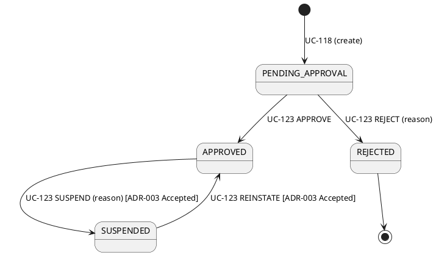
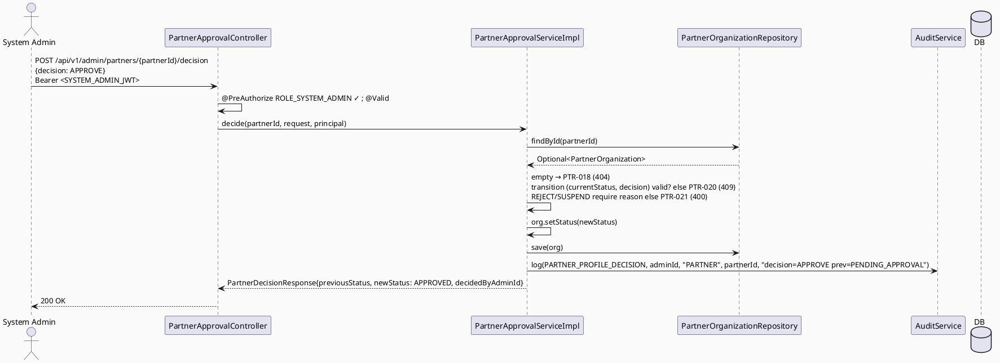

# ENGINEERING DOCUMENTATION STANDARD (EDS) v2.0
# Technical Design Specification — UC-123: Approve Partner Profile

| Field              | Value                                   |
| ------------------ | ---------------------------------------- |
| **Document ID**    | `CB-PTR-IMP-006`                        |
| **Version**        | `1.0`                                   |
| **Date**           | `2026-07-01`                            |
| **Status**         | `Partially Implemented`                 |
| **Document Owner** | `HuyND`                                 |
| **Author**         | `AI Agent — Winston (System Architect)` |
| **Reviewed by**    | `[ ] Pending`                           |
| **DPO Sign-off**   | `[ ] Pending` *(N/A — status change, no new PII)* |
| **Approved by**    | `[ ] Pending`                           |
| **Last Review**    | `2026-07-01`                            |
| **Based on EDS**   | `v2.0`                                  |

---

## CHANGELOG

| Ngày       | Người thực hiện    | Nội dung thay đổi                                                              |
| ---------- | ------------------- | ------------------------------------------------------------------------------- |
| 2026-07-01 | AI Agent — Winston  | Tạo tài liệu lần đầu — TDS cho UC-123 Approve Partner Profile (Status=Draft)    |
| 2026-07-11 | AI Agent — Amelia   | Phase 3 implementation — 11/12 tests PASS; PostgreSQL atomicity pending          |

---

## MỤC LỤC

1. [Tổng quan Module](#1-tổng-quan-module)
2. [Ma trận Truy vết](#2-ma-trận-truy-vết)
3. [Architecture Decision Records (ADR)](#3-architecture-decision-records-adr)
4. [Non-Functional Requirements & SLA](#4-non-functional-requirements--sla)
5. [Static Modeling](#5-static-modeling)
6. [Dynamic Modeling](#6-dynamic-modeling)
7. [Domain Event Catalog](#7-domain-event-catalog)
8. [Interface Specification](#8-interface-specification)
9. [API Specification](#9-api-specification)
10. [Bảng mã lỗi](#10-bảng-mã-lỗi)
11. [Quy trình Triển khai](#11-quy-trình-triển-khai)
12. [Rollback & Incident Runbook](#12-rollback--incident-runbook)
13. [Kịch bản Kiểm thử Chi tiết](#13-kịch-bản-kiểm-thử-chi-tiết)
14. [Phương pháp Xác minh](#14-phương-pháp-xác-minh)
15. [API Verification Samples](#15-api-verification-samples)
16. [Authorization Matrix](#16-authorization-matrix)
17. [AI Prompt Constraints (CASE 2.0)](#17-ai-prompt-constraints-case-20)

---

## 1. Tổng quan Module

| Field                     | Value                                                                                                                                  |
| ------------------------- | --------------------------------------------------------------------------------------------------------------------------------------- |
| **UC ID**                 | `UC-123`                                                                                                                                |
| **FS Reference**          | `3.2.3.6 Approve Partner Profile`                                                                                                       |
| **Module Name**           | `Approve Partner Profile`                                                                                                             |
| **Bounded Context**       | `partner` — admin write path over `PartnerOrganization` (UC-118 aggregate)                                                             |
| **Primary Actor**         | `System Admin (ROLE_SYSTEM_ADMIN)` (per FS Primary Actor)                                                                              |
| **Platform**              | `Admin Web Portal`                                                                                                                      |
| **Priority**              | `High` (per FS — partner onboarding gate)                                                                                              |
| **Frequency of Use**      | `Regular`                                                                                                                                |
| **Data Classification**   | `Internal`                                                                                                                              |
| **Compliance Scope**      | `N/A`                                                                                                                                   |
| **Upstream Dependencies** | `partner (PartnerOrganization, OrganizationStatus, PartnerException, PartnerOrganizationRepository — UC-118)`, `security (SecurityContext for admin id)`, `audit` |
| **Downstream Consumers**  | Partner (org becomes APPROVED → can submit listings/campaigns UC-120/121), Partner Web Portal status display                          |

**Mô tả:**
UC-123 cho phép **System Admin** duyệt (hoặc từ chối) một hồ sơ đối tác đang chờ. Chuyển `PartnerOrganization.status`: **PENDING_APPROVAL → APPROVED** (duyệt) hoặc **PENDING_APPROVAL → REJECTED** (từ chối, kèm reason). State machine oracle là **UC-118 TDS ADR-003** (đã Approved) — KHÔNG phát minh state mới. `OrganizationStatus` = {PENDING_APPROVAL, APPROVED, SUSPENDED, REJECTED}.

**Phạm vi & state machine (ADR-003):** UC-123 chính là **quyết định duyệt ban đầu** (PENDING_APPROVAL→APPROVED/REJECTED). Các transition **APPROVED→SUSPENDED** và **SUSPENDED→APPROVED** (suspend/reinstate) cũng nằm trong state machine UC-118 và được **bundle vào cùng endpoint** (ADR-003, Accepted — resolved via project analysis: smallest scoped change, không UC nào khác trong batch sở hữu 2 transition này).

**Chống self-approve / anti-tamper:** Partner KHÔNG có đường tự set status (UC-118 ADR-003 đã đảm bảo; UC-119 update không đổi status). Chỉ SYSTEM_ADMIN qua endpoint này mới chuyển trạng thái.

---

## 2. Ma trận Truy vết

| Requirement ID | Loại          | Mô tả yêu cầu                                                       | Thành phần Code                              | Compliance Target | ADR liên quan |
| --------------- | -------------- | --------------------------------------------------------------------- | ---------------------------------------------- | ------------------- | --------------- |
| UC-123          | Use Case      | Admin approves/rejects a partner profile                              | `PartnerApprovalController.decide()`           | —                  | ADR-001         |
| FS-3.2.3.6      | Functional    | "Approve or reject partner organization profile"                     | `PartnerApprovalServiceImpl.decide()`          | —                  | ADR-001         |
| BR-RBAC         | Business Rule | Chỉ SYSTEM_ADMIN                                                      | `@PreAuthorize("hasRole('SYSTEM_ADMIN')")`     | —                  | ADR-004         |
| BR-PTR-018      | Business Rule | Chỉ chuyển đúng transition hợp lệ theo UC-118 state machine           | `PartnerApprovalServiceImpl` transition guard  | —                  | ADR-002, ADR-003 |
| BR-PTR-019      | Business Rule | REJECT/SUSPEND bắt buộc reason (accountability)                       | request validation                             | —                  | ADR-005         |
| BR-PTR-020      | Business Rule | Transition không hợp lệ (vd APPROVED→APPROVED, REJECTED→APPROVED) bị từ chối | transition guard                       | —                  | ADR-003         |
| BR-AUDIT-001    | Business Rule | Mọi quyết định được audit log (ai, hồ sơ nào, kết quả, reason)        | `AuditService.log(...)`                        | —                  | ADR-004         |

---

## 3. Architecture Decision Records (ADR)

### ADR-001 — Reuse UC-118 Aggregate; Admin Write Path (No New Entity/Migration)
| Field | Value |
| ---- | ----- |
| **Status** | `Accepted` |
| **Deciders** | `HuyND — System Architect` |
| **Date** | `2026-07-01` |

**Quyết định:** UC-123 thao tác trên `PartnerOrganization` có sẵn. Thêm `PartnerApprovalService`/`Impl` + `PartnerApprovalController` (hoặc method trên controller admin partner). KHÔNG entity/migration mới. `partner_organizations` không có cột `reviewed_by`/`approved_by` (khác `sponsored_campaigns`) — người duyệt được ghi qua **audit log**, không thêm cột (nếu Product muốn lưu approver trên hàng, đó là schema delta — flag `Open`, không tự thêm).

### ADR-002 — Transition Guard Grounded in UC-118 State Machine
| Field | Value |
| ---- | ----- |
| **Status** | `Accepted` |

**Bối cảnh:** UC-118 TDS ADR-003 định nghĩa state machine: `[*]→PENDING_APPROVAL`; `PENDING_APPROVAL→APPROVED`; `PENDING_APPROVAL→REJECTED`; `APPROVED→SUSPENDED`; `SUSPENDED→APPROVED`; `REJECTED→[*]` (terminal).
**Quyết định:** UC-123 chỉ cho phép các transition hợp lệ theo state machine đó. Transition không hợp lệ (vd `APPROVED→APPROVED`, `REJECTED→APPROVED`, `PENDING_APPROVAL→SUSPENDED`) → `PTR-020` (409). KHÔNG phát minh state mới.
**Hệ quả:** Vòng đời trạng thái nhất quán với UC-118; guard chống transition sai.

### ADR-003 — Scope: Approve/Reject (Primary) + Suspend/Reinstate (Related, Resolved — Bundled)
| Field | Value |
| ---- | ----- |
| **Status** | `Accepted — resolved by project-analysis default (smallest scoped change, one state machine, one endpoint)` |

**Quyết định:** Primary: `PENDING_APPROVAL→APPROVED/REJECTED`. Bundled (cùng endpoint, parametrized `decision`): `APPROVED→SUSPENDED`, `SUSPENDED→APPROVED`. Resolved via project analysis rather than left open: UC-118's ADR-003 state machine already envisions all four `OrganizationStatus` transitions as SYSTEM_ADMIN-driven actions, and no other UC in this batch or the FS's 3.2.3.x section is assigned ownership of suspend/reinstate — splitting them into a separate UC/endpoint would duplicate the same transition-guard logic and RBAC across two controllers for no functional benefit. Per CLAUDE.md's "make the smallest scoped change" principle, one endpoint managing the full state machine is smaller and more maintainable than two. If Product later wants suspend/reinstate as a functionally distinct workflow (e.g. different audit category, different notification), that is a straightforward extraction from this endpoint, not a redesign.

### ADR-004 — RBAC (SYSTEM_ADMIN) + Audit
| Field | Value |
| ---- | ----- |
| **Status** | `Accepted` |

`@PreAuthorize("hasRole('SYSTEM_ADMIN')")` (FS Primary Actor = System Admin; không `RoleHierarchy`). Audit `PARTNER_PROFILE_DECISION` (hoặc reuse `PARTNER_PROFILE_UPDATED` — enum decision) với admin id, partner id, kết quả, reason.

### ADR-005 — REJECT/SUSPEND Bắt Buộc Reason
| Field | Value |
| ---- | ----- |
| **Status** | `Accepted (design decision — not sourced, same posture as moderation UC-100 ADR-006)` |

**Quyết định:** APPROVE/REINSTATE reason optional; REJECT/SUSPEND reason bắt buộc non-blank (`PTR-021`, 400) — accountability cho quyết định bất lợi. Flag `Open` như một design decision.

---

## 4. Non-Functional Requirements & SLA

| Category | Requirement | Target | Measurement | Basis |
| --- | --- | --- | --- | --- |
| Latency | p99 `POST /admin/partners/{id}/decision` | `Open` — `< 300ms` | k6 | — |
| Atomicity | status change + audit in 1 transaction | All-or-nothing | integration | ADR-004 |
| Transition integrity | Only valid transitions allowed | 100% | unit test | ADR-002 |
| Access control | SYSTEM_ADMIN only | Least privilege | §16 | ADR-004 |

---

## 5. Static Modeling

### 5.1. Class Diagram (PlantUML)

```plantuml
@startuml UC123_ApprovePartnerProfile_ClassDiagram
skinparam classAttributeIconSize 0
skinparam backgroundColor #FAFAFA

enum OrganizationStatus { PENDING_APPROVAL APPROVED SUSPENDED REJECTED }
enum PartnerDecision { APPROVE REJECT SUSPEND REINSTATE }

class PartnerApprovalController <<RestController>> {
  + decide(partnerId: UUID, request: PartnerDecisionRequest, principal): ResponseEntity<PartnerDecisionResponse>
}
interface PartnerApprovalService { + decide(partnerId, request, principal): PartnerDecisionResponse }
class PartnerApprovalServiceImpl implements PartnerApprovalService {
  - partnerOrganizationRepository
  - auditService
  + decide(partnerId, request, principal): PartnerDecisionResponse
}
class PartnerDecisionRequest <<DTO>> {
  + decision: PartnerDecision   ' APPROVE/REJECT/SUSPEND/REINSTATE
  + reason: String              ' required for REJECT/SUSPEND (ADR-005)
}
class PartnerDecisionResponse <<DTO>> {
  + partnerId: UUID
  + previousStatus: OrganizationStatus
  + newStatus: OrganizationStatus
  + decidedByAdminId: UUID
  + reason: String
  + decidedAt: Instant
}

PartnerApprovalController --> PartnerApprovalService
@enduml
```

### 5.2. Data Structure — NO Schema Delta

> **No migration.** `partner_organizations.status` already an enum-backed varchar. UC-123 UPDATEs `status`
> only. Approver identity recorded via audit log (ADR-001), not a new column. State machine per UC-118 ADR-003.

### 5.3. State Machine (from UC-118 ADR-003 — reused, not redefined)



---

## 6. Dynamic Modeling

### 6.1. Sequence — Happy Path (APPROVE)



### 6.2. Error Paths
- partner not found → `PTR-018` (404); invalid transition → `PTR-020` (409); REJECT/SUSPEND missing reason → `PTR-021` (400); wrong role → 403.

---

## 7. Domain Event Catalog

| Event | Trigger | Publisher | Subscriber | Payload | Async? |
| --- | --- | --- | --- | --- | --- |
| (none v1) | — | — | — | — | — |

> **Open:** future `PartnerApproved`/`PartnerRejected` event → notify partner (email/in-app). v1 sync + audit-only.

---

## 8. Interface Specification

### 8.1. Service Interface

```java
// com.carebridge.backend.partner.service.PartnerApprovalService
public interface PartnerApprovalService {
    /**
     * Applies an admin decision to a partner organization's status, enforcing the UC-118 state machine.
     * @throws PartnerException (PTR-018) if partnerId not found
     * @throws PartnerException (PTR-020) if the (currentStatus, decision) transition is invalid
     * @throws PartnerException (PTR-021) if reason is blank for REJECT or SUSPEND (ADR-005)
     */
    PartnerDecisionResponse decide(UUID partnerId, PartnerDecisionRequest request, Principal principal);
}
```

### 8.2. Repository

```java
// PartnerOrganizationRepository.findById(UUID) — from JpaRepository (UC-118). No new finder needed.
```

### 8.3. DTOs

```java
public enum PartnerDecision { APPROVE, REJECT, SUSPEND, REINSTATE }

public record PartnerDecisionRequest(
        @NotNull PartnerDecision decision,
        String reason   // required non-blank for REJECT/SUSPEND (PTR-021, ADR-005)
) {}

public record PartnerDecisionResponse(
        UUID partnerId, OrganizationStatus previousStatus, OrganizationStatus newStatus,
        UUID decidedByAdminId, String reason, Instant decidedAt
) {}
```

**Transition table (decision × currentStatus → newStatus):**

| decision  | valid currentStatus | newStatus | else |
| ---------- | -------------------- | ---------- | ----- |
| APPROVE    | PENDING_APPROVAL     | APPROVED   | PTR-020 |
| REJECT     | PENDING_APPROVAL     | REJECTED   | PTR-020 |
| SUSPEND    | APPROVED             | SUSPENDED  | PTR-020 (ADR-003 Accepted — bundled scope) |
| REINSTATE  | SUSPENDED            | APPROVED   | PTR-020 (ADR-003 Accepted — bundled scope) |

---

## 9. API Specification

### 9.1. Endpoints Table

| Method | Path                                          | Auth Level | Required Roles     | Rate Limit | Idempotent? |
| ------ | ----------------------------------------------- | ------------ | --------------------- | ------------ | -------------- |
| `POST` | `/api/v1/admin/partners/{partnerId}/decision`   | JWT Bearer   | `ROLE_SYSTEM_ADMIN`   | `Open`       | No (state transition; repeated same decision → PTR-020 on 2nd call) |

### 9.2. Request / Response

**Request (APPROVE):** `{ "decision": "APPROVE" }`
**Request (REJECT):** `{ "decision": "REJECT", "reason": "Thiếu giấy phép hành nghề" }`

**Response — 200 OK:**
```json
{ "partnerId": "…", "previousStatus": "PENDING_APPROVAL", "newStatus": "APPROVED",
  "decidedByAdminId": "…", "reason": null, "decidedAt": "2026-07-01T10:15:00Z" }
```

**404 PTR-018 / 409 PTR-020 / 400 PTR-021 / 403 / 401** — theo §10.

---

## 10. Bảng mã lỗi

| Code       | HTTP Status | Message (EN)                                     | Trigger Condition                                | Status in code |
| ----------- | ------------- | --------------------------------------------------- | --------------------------------------------------- | ----------------- |
| `PTR-018`  | 404           | Partner organization not found                       | `findById(partnerId)` empty                        | **New — to implement** |
| `PTR-019`  | (reserved)    | *(reserved for a future partner-admin error)*        | —                                                  | **Reserved** |
| `PTR-020`  | 409           | Invalid status transition                            | `(currentStatus, decision)` not a valid transition  | **New — to implement** |
| `PTR-021`  | 400           | Reason required for REJECT/SUSPEND                    | reason blank for REJECT or SUSPEND (ADR-005)        | **New — to implement** |
| `PTR-004`  | 403           | Insufficient permissions                             | Non-SYSTEM_ADMIN (confirmed ACCESS_DENIED — dead code, same pattern as MOD-004)          | Not reachable in practice |
| `PTR-006`  | 401           | Authentication required                              | Missing/invalid JWT (verify)                        | Reused (verify) |

> **Numbering:** UC-118..122 used `PTR-001..017`. UC-123 claims **`PTR-018, PTR-019(reserved), PTR-020, PTR-021`**.
> UC-124/125 continue from `PTR-022`. CG verify. `PTR-019` reserved intentionally to keep a gap for a future
> partner-admin error without renumbering.

---

## 11. Quy trình Triển khai

### 11.1. Prerequisites
- [ ] UC-118 deployed (PartnerOrganization + OrganizationStatus + repo)
- [ ] ADR-003 (scope: suspend/reinstate in UC-123 or separate) confirmed by Product
- [x] `@EnableMethodSecurity`
- [ ] No migration — confirm (approver via audit, not column)

### 11.2. Pre-Migration Checklist
- [ ] **Không cần migration** — chỉ UPDATE `status`. CG-9: no schema delta. (Nếu Product muốn lưu approver id trên hàng → schema delta, flag Open.)

### 11.3. Implementation Steps
```
1. PartnerDecision enum + PartnerDecisionRequest/Response DTOs
2. PartnerException PTR-018/020/021
3. Transition table logic (decision × currentStatus → newStatus) — a small enum-driven guard
4. PartnerApprovalService.decide() interface + Impl (find, transition guard, reason guard, save, audit) @Transactional
5. PartnerApprovalController POST /api/v1/admin/partners/{partnerId}/decision @PreAuthorize("hasRole('SYSTEM_ADMIN')") + @Valid
6. SecurityConfig rule + audit enum (PARTNER_PROFILE_DECISION) if needed
```

### 11.4. Deployment Checklist
- [ ] APPROVE PENDING→APPROVED; REJECT PENDING→REJECTED (reason required)
- [ ] Invalid transition (APPROVED→APPROVE again) → PTR-020
- [ ] Audit records admin id + decision + reason
- [ ] Non-SYSTEM_ADMIN → 403

---

## 12. Rollback & Incident Runbook

| Điều kiện | Ngưỡng | Người quyết định |
| ------------ | --------- | ------------------- |
| Transition sai được cho phép (vd REJECTED→APPROVED) | Bất kỳ case nào | Tech Lead (CRITICAL — state integrity) |
| Quyết định không audit | > 1 phút | On-call |
| 403 sai cho SYSTEM_ADMIN | Bất kỳ case nào | Tech Lead |

```bash
kubectl rollout undo deployment/carebridge-api
# No migration to revert. Manual status fix only via a NEW admin action (never direct DB edit without sign-off).
```

---

## 13. Kịch bản Kiểm thử Chi tiết

> Chi tiết trong `UC123_ApprovePartnerProfile_Test-Spec.md` (`CB-PTR-TEST-006`).

### 13.1. Unit / Service
- APPROVE PENDING→APPROVED; REJECT PENDING→REJECTED (reason)
- SUSPEND APPROVED→SUSPENDED; REINSTATE SUSPENDED→APPROVED (ADR-003 Accepted — bundled scope)
- Invalid transitions (APPROVED→APPROVE, REJECTED→APPROVE, PENDING→SUSPEND) → PTR-020
- REJECT/SUSPEND missing reason → PTR-021
- partner not found → PTR-018
- Audit called once with admin id + decision

### 13.2. Integration
- Full POST (Testcontainers): decision changes DB status; atomicity (status+audit rollback together)

### 13.3. Security
- Non-SYSTEM_ADMIN → 403; MODERATOR → 403 (no hierarchy); No JWT → 401

---

## 14. Phương pháp Xác minh

```sql
SELECT partner_id, status, updated_at FROM partner_organizations WHERE partner_id='<id>';
-- after APPROVE: status='APPROVED'
```

---

## 15. API Verification Samples

```bash
curl -X POST "https://api.carebridge.vn/api/v1/admin/partners/<id>/decision" \
  -H "Authorization: Bearer $ADMIN_TOKEN" -H "Content-Type: application/json" -d '{"decision":"APPROVE"}'
# Expected: 200, newStatus=APPROVED
```

---

## 16. Authorization Matrix

| Endpoint                                       | `MOTHER` | `FAMILY` | `EXPERT` | `MODERATOR` | `CONTENT_ADMIN` | `PARTNER` | `SYSTEM_ADMIN` |
| ------------------------------------------------- | ---------- | ---------- | ---------- | -------------- | ------------------ | --------------- | ----------------- |
| `POST /api/v1/admin/partners/{id}/decision`      | ❌        | ❌        | ❌        | ❌             | ❌                  | ❌ *(never)*    | ✅                |

**Chú thích:** ✅ SYSTEM_ADMIN. PARTNER **không bao giờ** (chống self-approve — partner không tự duyệt hồ sơ mình). No `RoleHierarchy`.

---

## 17. AI Prompt Constraints (CASE 2.0)

### 17.1 Constraint Summary Table

| #   | Constraint                                                                       | Source            | Last Verified |
| --- | -------------------------------------------------------------------------------- | ------------------- | --------------- |
| C1  | Controller `@PreAuthorize("hasRole('SYSTEM_ADMIN')")` — chỉ @Valid + delegate     | `ADR-004`           | `2026-07-01`     |
| C2  | Transition PHẢI theo UC-118 state machine (§5.3/§8.3 table); else PTR-020         | `ADR-002/003`       | `2026-07-01`     |
| C3  | REJECT/SUSPEND bắt buộc reason (PTR-021)                                          | `ADR-005`           | `2026-07-01`     |
| C4  | status change + audit trong cùng @Transactional                                  | `ADR-004`, §4       | `2026-07-01`     |
| C5  | KHÔNG phát minh state mới; KHÔNG cho partner đổi status (chỉ SYSTEM_ADMIN)         | `ADR-002`           | `2026-07-01`     |

### 17.2 Constraint Injection Block

```
[CONSTRAINT BLOCK — Module: Approve Partner Profile (UC-123)]
Theo TDS CB-PTR-IMP-006:
1. [C1] Controller decide() PHẢI @PreAuthorize("hasRole('SYSTEM_ADMIN')").
2. [C2] Chỉ transition hợp lệ theo bảng §8.3 (APPROVE: PENDING→APPROVED; REJECT: PENDING→REJECTED;
   SUSPEND: APPROVED→SUSPENDED; REINSTATE: SUSPENDED→APPROVED). Sai → PTR-020.
3. [C3] REJECT/SUSPEND bắt buộc reason non-blank → PTR-021.
4. [C4] status change + audit trong 1 @Transactional.
5. [C5] KHÔNG state mới; partner KHÔNG có đường đổi status.

[CONTEXT BLOCK]
- Bounded Context: partner (admin write); Data: Internal; Compliance: N/A
- Interfaces: §8; Error codes: §10 (PTR-018/019-reserved/020/021); Auth: §16
- Schema delta: NONE (approver via audit)
- OPEN: ADR-003 (suspend/reinstate scope), 403 code, approver-on-row column

[TASK BLOCK]
Implement PartnerApprovalController.decide(), PartnerApprovalServiceImpl (transition guard), PartnerDecision
enum, DTOs, PTR-018/020/021 — thỏa mãn C1-C5. Tests cover §13 (Test-Spec CB-PTR-TEST-006).
```

### 17.3 Constraint Quality Checklist
- [x] Traceable; [x] không generic; [x] Last Verified; [x] reference §8/§16

### 17.4 Anti-Pattern Detection

| AP-ID     | Anti-Pattern          | Dấu hiệu                                                        | Hành động                |
| --------- | ---------------------- | ------------------------------------------------------------------- | --------------------------- |
| AP-AI-001 | Unconstrained Gen     | Bỏ RBAC/transition guard                                            | Reject — C1/C2 |
| AP-AI-002 | Invalid Transition    | Cho phép transition ngoài state machine (vd REJECTED→APPROVED)     | Reject — ADR-002, BLOCKING |
| AP-AI-003 | Implicit Decision     | Tự thêm suspend/reinstate scope mà không tham chiếu ADR-003        | Reject — contradicts ADR-003 (Accepted decision: bundled scope) |
| AP-AI-004 | Layer Violation       | Controller gọi repository trực tiếp                               | Reject |
| AP-AI-005 | Hallucinated Contract | Import class không có trong §8                                     | Reject |

**Kết quả review:**
- [x] Không phát hiện anti-pattern nào trong bản thân spec này → approved-for-RED-phase

---

## PHỤ LỤC

### B. Tài liệu tham chiếu
| Document | Path |
| ------------ | ------- |
| UC-118 TDS (ADR-003 state machine — authoritative oracle) | `04_Implement/UC118_CreatePartnerProfile/UC118_CreatePartnerProfile_TDS.md` |
| Schema `partner_organizations` (line 366) | `05_Development/CareBridgeAPI/src/main/resources/db/migration/V1__init_schema.sql` |

---

*EDS v2.1 — Admin write path over UC-118 aggregate; no schema delta. Status: Draft. Transition guard grounded
in UC-118 ADR-003 state machine (do not invent states). OPEN: ADR-003 (suspend/reinstate scope), 403 code,
approver-on-row column. Invalid-transition guard (PTR-020) và SYSTEM_ADMIN-only (chống partner self-approve)
là các gate chính.*
