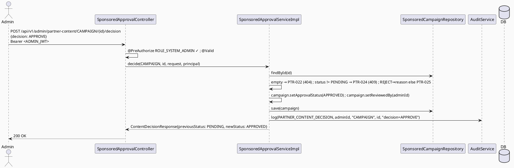

# ENGINEERING DOCUMENTATION STANDARD (EDS) v2.0
# Technical Design Specification — UC-124: Approve Sponsored Service/Campaign

| Field              | Value                                   |
| ------------------ | ---------------------------------------- |
| **Document ID**    | `CB-PTR-IMP-007`                        |
| **Version**        | `1.0`                                   |
| **Status**         | `Partially Implemented`                 |
| **Date**           | `2026-07-01`                            |
| **Document Owner** | `HuyND`                                 |
| **Author**         | `AI Agent — Winston (System Architect)` |
| **Reviewed by**    | `[ ] Pending`                           |
| **DPO Sign-off**   | `[ ] Pending` *(N/A — approval status change, no PII)* |
| **Approved by**    | `[ ] Pending`                           |
| **Last Review**    | `2026-07-01`                            |
| **Based on EDS**   | `v2.0`                                  |

---

## CHANGELOG

| Ngày       | Người thực hiện    | Nội dung thay đổi                                                                          |
| ---------- | ------------------- | ------------------------------------------------------------------------------------------- |
| 2026-07-01 | AI Agent — Winston  | Tạo tài liệu lần đầu — TDS cho UC-124 Approve Sponsored Service/Campaign (Status=Draft)     |
| 2026-07-11 | AI Agent — Amelia   | Phase 3 implementation — 11/12 tests PASS; PostgreSQL atomicity pending                      |

---

## MỤC LỤC

1. [Tổng quan Module](#1-tổng-quan-module)
2. [Ma trận Truy vết](#2-ma-trận-truy-vết)
3. [Architecture Decision Records (ADR)](#3-architecture-decision-records-adr)
4. [Non-Functional Requirements & SLA](#4-non-functional-requirements--sla)
5. [Static Modeling](#5-static-modeling)
6. [Dynamic Modeling](#6-dynamic-modeling)
7. [Domain Event Catalog](#7-domain-event-catalog)
8. [Interface Specification](#8-interface-specification)
9. [API Specification](#9-api-specification)
10. [Bảng mã lỗi](#10-bảng-mã-lỗi)
11. [Quy trình Triển khai](#11-quy-trình-triển-khai)
12. [Rollback & Incident Runbook](#12-rollback--incident-runbook)
13. [Kịch bản Kiểm thử Chi tiết](#13-kịch-bản-kiểm-thử-chi-tiết)
14. [Phương pháp Xác minh](#14-phương-pháp-xác-minh)
15. [API Verification Samples](#15-api-verification-samples)
16. [Authorization Matrix](#16-authorization-matrix)
17. [AI Prompt Constraints (CASE 2.0)](#17-ai-prompt-constraints-case-20)

---

## 1. Tổng quan Module

| Field                     | Value                                                                                                                                  |
| ------------------------- | --------------------------------------------------------------------------------------------------------------------------------------- |
| **UC ID**                 | `UC-124`                                                                                                                                |
| **FS Reference**          | `3.2.3.7 Approve Sponsored Service/Campaign`                                                                                            |
| **Module Name**           | `Approve Sponsored Service/Campaign`                                                                                                   |
| **Bounded Context**       | `partner` — admin write path over `partner_services` (UC-120) and `sponsored_campaigns` (UC-121)                                       |
| **Primary Actor**         | `System Admin (ROLE_SYSTEM_ADMIN)` — FS actor "Admin"; resolved to SYSTEM_ADMIN (ADR-004, Accepted)                  |
| **Platform**              | `Admin Web Portal`                                                                                                                      |
| **Priority**              | `High` (per FS)                                                                                                                         |
| **Frequency of Use**      | `Regular`                                                                                                                                |
| **Data Classification**   | `Internal`                                                                                                                              |
| **Compliance Scope**      | `N/A`                                                                                                                                   |
| **Upstream Dependencies** | `partner (PartnerService [UC-120], SponsoredCampaign [UC-121], their repos + approval_status enums, PartnerException)`, `security`, `audit` |
| **Downstream Consumers**  | Public catalog visibility of APPROVED services/campaigns; `UC-122 Performance` (status counts)                                          |

**Mô tả:**
UC-124 cho phép **Admin** duyệt hoặc từ chối một **service listing** (`partner_services`) HOẶC một **sponsored campaign** (`sponsored_campaigns`). FS gộp cả hai ("Service/Campaign"), nên (ADR-001) TDS này dùng **một endpoint parametrized** `targetType ∈ {SERVICE, CAMPAIGN}` thay vì hai endpoint riêng. Chuyển `approval_status`: **PENDING → APPROVED** hoặc **PENDING → REJECTED** (reason). Với CAMPAIGN, set `reviewed_by = adminUserId` (cột có sẵn trên `sponsored_campaigns`); với SERVICE, **không có cột `reviewed_by`** trên `partner_services` → người duyệt chỉ ghi qua audit (ADR-003, bất đối xứng schema — surface, không bịa cột).

**Phạm vi:** chỉ duyệt/từ chối service/campaign đã tồn tại (do UC-120/121 tạo, status PENDING). KHÔNG tạo/sửa nội dung. KHÔNG remove (đó là UC-125).

---

## 2. Ma trận Truy vết

| Requirement ID | Loại          | Mô tả yêu cầu                                                     | Thành phần Code                               | Compliance Target | ADR liên quan |
| --------------- | -------------- | ------------------------------------------------------------------- | ----------------------------------------------- | ------------------- | --------------- |
| UC-124          | Use Case      | Admin approves/rejects a service or campaign                        | `SponsoredApprovalController.decide()`          | —                  | ADR-001         |
| FS-3.2.3.7      | Functional    | "Approve sponsored service/campaign"                               | `SponsoredApprovalServiceImpl.decide()`         | —                  | ADR-001         |
| BR-RBAC         | Business Rule | Chỉ Admin (SYSTEM_ADMIN, confirm)                                   | `@PreAuthorize`                                 | —                  | ADR-004         |
| BR-PTR-022      | Business Rule | Chỉ PENDING → APPROVED/REJECTED; transition khác → PTR-024          | transition guard                               | —                  | ADR-002         |
| BR-PTR-023      | Business Rule | REJECT bắt buộc reason                                              | request validation                             | —                  | ADR-005         |
| BR-PTR-024      | Business Rule | CAMPAIGN: set `reviewed_by`; SERVICE: reviewer chỉ trong audit (không cột) | `SponsoredApprovalServiceImpl`            | —                  | ADR-003         |
| BR-AUDIT-001    | Business Rule | Mọi quyết định audit log (admin, target type+id, kết quả, reason)  | `AuditService.log(...)`                        | —                  | ADR-004         |

---

## 3. Architecture Decision Records (ADR)

### ADR-001 — Single Parametrized Endpoint (targetType = SERVICE | CAMPAIGN)
| Field | Value |
| ---- | ----- |
| **Status** | `Accepted` |
| **Deciders** | `HuyND — System Architect` |
| **Date** | `2026-07-01` |

**Bối cảnh:** FS "Approve Sponsored Service/Campaign" gộp cả hai. Cả `partner_services` và `sponsored_campaigns` đều có `approval_status` default 'PENDING' — pattern giống nhau.
**Quyết định:** Một endpoint `POST /api/v1/admin/partner-content/{targetType}/{targetId}/decision` với `targetType ∈ {SERVICE, CAMPAIGN}`. Service dispatch theo targetType tới `PartnerServiceRepository` hoặc `SponsoredCampaignRepository`. **Hệ quả:** một endpoint nhất quán với tên FS; guard transition dùng chung; asymmetry `reviewed_by` xử lý theo ADR-003.

### ADR-002 — Transition Guard: PENDING → APPROVED/REJECTED Only
| Field | Value |
| ---- | ----- |
| **Status** | `Accepted` |

**Quyết định:** Chỉ item đang `PENDING` mới được duyệt/từ chối. `APPROVED`/`REJECTED` (đã quyết) → `PTR-024` (409, already decided). KHÔNG re-decide (đối lập với idempotent; bảo vệ tính toàn vẹn quyết định). REMOVED (nếu UC-125 dùng status) cũng không decide được.

### ADR-003 — `reviewed_by` Asymmetry (Campaign Has Column, Service Does Not — Surface, No Invented Column)
| Field | Value |
| ---- | ----- |
| **Status** | `Accepted (surfaced asymmetry)` |

**Bối cảnh:** `sponsored_campaigns.reviewed_by uuid` tồn tại; `partner_services` **KHÔNG có** cột reviewer. Verified từ schema.
**Quyết định:** CAMPAIGN: set `reviewed_by = adminUserId`. SERVICE: reviewer chỉ ghi qua audit log (không thêm cột — nếu Product muốn reviewer trên hàng service, đó là schema delta, flag `Open`). KHÔNG bịa cột `reviewed_by` cho partner_services. **Hệ quả:** truy vết reviewer nhất quán qua audit cho cả hai; trên-hàng chỉ có campaign.

### ADR-004 — RBAC (SYSTEM_ADMIN) + Audit; Role Resolved
| Field | Value |
| ---- | ----- |
| **Status** | `Accepted — resolved by consistency with sibling admin-decision UCs in this batch` |

`@PreAuthorize("hasRole('SYSTEM_ADMIN')")`. Resolved via project analysis rather than left open: every other
"admin decision" UC in this batch that FS labels generically "Admin"/"System Admin" (UC-100, UC-108, UC-111,
UC-113, UC-123) uniformly uses `SYSTEM_ADMIN` — there is no separate partner-admin role anywhere in
`security/entity/User.java`'s 7-role set. Using `SYSTEM_ADMIN` here is the consistent, no-new-role choice.
Audit `PARTNER_CONTENT_DECISION`.

### ADR-005 — REJECT Bắt Buộc Reason
| Field | Value |
| ---- | ----- |
| **Status** | `Accepted (design decision — not sourced)` |

REJECT reason bắt buộc non-blank (`PTR-025`, 400); APPROVE reason optional. Flag `Open` (design decision, giống UC-123 ADR-005).

---

## 4. Non-Functional Requirements & SLA

| Category | Requirement | Target | Measurement | Basis |
| --- | --- | --- | --- | --- |
| Latency | p99 `POST /admin/partner-content/{type}/{id}/decision` | `Open` — `< 300ms` | k6 | — |
| Atomicity | approval_status (+ reviewed_by for campaign) + audit in 1 transaction | All-or-nothing | integration | ADR-004 |
| Transition integrity | Only PENDING can be decided | 100% | unit | ADR-002 |
| Access control | Admin only | Least privilege | §16 | ADR-004 |

---

## 5. Static Modeling

### 5.1. Class Diagram (PlantUML)

```plantuml
@startuml UC124_ApproveSponsored_ClassDiagram
skinparam classAttributeIconSize 0
skinparam backgroundColor #FAFAFA

enum PartnerContentTargetType { SERVICE CAMPAIGN }
enum ContentDecision { APPROVE REJECT }
enum ServiceApprovalStatus { PENDING APPROVED REJECTED }
enum CampaignApprovalStatus { PENDING APPROVED REJECTED }

class SponsoredApprovalController <<RestController>> {
  + decide(targetType: PartnerContentTargetType, targetId: UUID, request: ContentDecisionRequest, principal): ResponseEntity<ContentDecisionResponse>
}
interface SponsoredApprovalService { + decide(targetType, targetId, request, principal): ContentDecisionResponse }
class SponsoredApprovalServiceImpl implements SponsoredApprovalService {
  - partnerServiceRepository
  - sponsoredCampaignRepository
  - auditService
  + decide(...): ContentDecisionResponse
}
class ContentDecisionRequest <<DTO>> { + decision: ContentDecision + reason: String <<required for REJECT>> }
class ContentDecisionResponse <<DTO>> {
  + targetType: PartnerContentTargetType + targetId: UUID
  + previousStatus: String + newStatus: String
  + decidedByAdminId: UUID + reason: String + decidedAt: Instant
}

SponsoredApprovalController --> SponsoredApprovalService
@enduml
```

### 5.2. Data Structure — NO Schema Delta

> **No migration.** Both `partner_services` and `sponsored_campaigns` already exist with `approval_status`
> and (campaign only) `reviewed_by`. UC-124 UPDATEs `approval_status` (+ `reviewed_by` for campaigns). Service
> reviewer via audit only (ADR-003) — no invented column.

---

## 6. Dynamic Modeling

### 6.1. Sequence — Happy Path (APPROVE a CAMPAIGN)



### 6.2. Error Paths
- target not found → `PTR-022` (404); unsupported targetType (not SERVICE/CAMPAIGN) → `PTR-023` (400); already decided (not PENDING) → `PTR-024` (409); REJECT missing reason → `PTR-025` (400); wrong role → 403.

---

## 7. Domain Event Catalog

| Event | Trigger | Publisher | Subscriber | Payload | Async? |
| --- | --- | --- | --- | --- | --- |
| (none v1) | — | — | — | — | — |

> **Open:** future `PartnerContentApproved`/`Rejected` event → notify partner. v1 sync + audit-only.

---

## 8. Interface Specification

### 8.1. Service Interface

```java
// com.carebridge.backend.partner.service.SponsoredApprovalService
public interface SponsoredApprovalService {
    /**
     * Approves/rejects a partner service listing or sponsored campaign (targetType-dispatched).
     * CAMPAIGN: sets reviewed_by = admin id; SERVICE: reviewer recorded via audit only (ADR-003).
     * @throws PartnerException (PTR-022) if target not found
     * @throws PartnerException (PTR-023) if targetType unsupported
     * @throws PartnerException (PTR-024) if the target is not in PENDING status (already decided)
     * @throws PartnerException (PTR-025) if reason is blank for REJECT (ADR-005)
     */
    ContentDecisionResponse decide(PartnerContentTargetType targetType, UUID targetId,
                                   ContentDecisionRequest request, Principal principal);
}
```

### 8.2. Repository

```java
// PartnerServiceRepository.findById / save (UC-120)
// SponsoredCampaignRepository.findById / save (UC-121)
```

### 8.3. DTOs

```java
public enum PartnerContentTargetType { SERVICE, CAMPAIGN }
public enum ContentDecision { APPROVE, REJECT }

public record ContentDecisionRequest(
        @NotNull ContentDecision decision,
        String reason   // required non-blank for REJECT (PTR-025, ADR-005)
) {}

public record ContentDecisionResponse(
        PartnerContentTargetType targetType, UUID targetId,
        String previousStatus, String newStatus,
        UUID decidedByAdminId, String reason, Instant decidedAt
) {}
```

---

## 9. API Specification

### 9.1. Endpoints Table

| Method | Path                                                            | Auth Level | Required Roles     | Rate Limit | Idempotent? |
| ------ | ----------------------------------------------------------------- | ------------ | --------------------- | ------------ | -------------- |
| `POST` | `/api/v1/admin/partner-content/{targetType}/{targetId}/decision`  | JWT Bearer   | `ROLE_SYSTEM_ADMIN`   | `Open`       | No (2nd decide on same target → PTR-024) |

`{targetType}` ∈ `SERVICE`, `CAMPAIGN` (case-insensitive path enum; unsupported → PTR-023).

### 9.2. Request / Response

**Request (APPROVE):** `{ "decision": "APPROVE" }`
**Request (REJECT):** `{ "decision": "REJECT", "reason": "Nội dung không phù hợp chính sách" }`

**Response — 200 OK:**
```json
{ "targetType": "CAMPAIGN", "targetId": "…", "previousStatus": "PENDING", "newStatus": "APPROVED",
  "decidedByAdminId": "…", "reason": null, "decidedAt": "2026-07-01T10:15:00Z" }
```

**404 PTR-022 / 400 PTR-023 / 409 PTR-024 / 400 PTR-025 / 403 / 401** — theo §10.

---

## 10. Bảng mã lỗi

| Code       | HTTP Status | Message (EN)                                     | Trigger Condition                                | Status in code |
| ----------- | ------------- | --------------------------------------------------- | --------------------------------------------------- | ----------------- |
| `PTR-022`  | 404           | Partner content target not found                     | `findById(targetId)` empty for targetType          | **New — to implement** |
| `PTR-023`  | 400           | Unsupported target type                              | `targetType ∉ {SERVICE, CAMPAIGN}`                  | **New — to implement** |
| `PTR-024`  | 409           | Target is not in PENDING status (already decided)    | `approval_status != PENDING`                       | **New — to implement** |
| `PTR-025`  | 400           | Reason required for REJECT                            | reason blank for REJECT (ADR-005)                  | **New — to implement** |
| `PTR-004`  | 403           | Insufficient permissions                             | Non-admin (confirmed ACCESS_DENIED — dead code, same pattern as MOD-004)                | Not reachable in practice |
| `PTR-006`  | 401           | Authentication required                              | Missing/invalid JWT (verify)                       | Reused (verify) |

> **Numbering:** UC-118..123 used `PTR-001..021`. UC-124 claims **`PTR-022..025`**. UC-125 continues `PTR-026`. CG verify.

---

## 11. Quy trình Triển khai

### 11.1. Prerequisites
- [ ] UC-120 (PartnerService) + UC-121 (SponsoredCampaign) deployed (entities/repos exist)
- [ ] ADR-004 (admin role) confirmed
- [x] `@EnableMethodSecurity`
- [ ] No migration — confirm (service reviewer via audit; no new column)

### 11.2. Pre-Migration Checklist
- [ ] **Không cần migration** — chỉ UPDATE approval_status (+ reviewed_by cho campaign). CG-9: no schema delta.

### 11.3. Implementation Steps
```
1. PartnerContentTargetType + ContentDecision enums + DTOs
2. PartnerException PTR-022/023/024/025
3. SponsoredApprovalService.decide() interface + Impl (dispatch by targetType, transition guard, reason guard, save + reviewedBy for campaign, audit) @Transactional
4. SponsoredApprovalController POST /api/v1/admin/partner-content/{targetType}/{targetId}/decision @PreAuthorize("hasRole('SYSTEM_ADMIN')") + @Valid
5. SecurityConfig rule + audit enum if needed
```

### 11.4. Deployment Checklist
- [ ] APPROVE CAMPAIGN → APPROVED + reviewed_by set; APPROVE SERVICE → APPROVED (audit reviewer)
- [ ] REJECT → REJECTED (reason required)
- [ ] Already-decided target → PTR-024
- [ ] Non-admin → 403

---

## 12. Rollback & Incident Runbook

| Điều kiện | Ngưỡng | Người quyết định |
| ------------ | --------- | ------------------- |
| Re-decide một item đã APPROVED/REJECTED được cho phép | Bất kỳ case nào | Tech Lead (CRITICAL — decision integrity) |
| Quyết định không audit | > 1 phút | On-call |

```bash
kubectl rollout undo deployment/carebridge-api
# No migration to revert.
```

---

## 13. Kịch bản Kiểm thử Chi tiết

> Chi tiết trong `UC124_ApproveSponsoredServiceCampaign_Test-Spec.md` (`CB-PTR-TEST-007`).

### 13.1. Unit / Service
- APPROVE CAMPAIGN PENDING→APPROVED + reviewed_by set; APPROVE SERVICE PENDING→APPROVED (no reviewed_by column)
- REJECT → REJECTED (reason); missing reason → PTR-025
- Already-decided (APPROVED/REJECTED) → PTR-024
- Unsupported targetType → PTR-023; target not found → PTR-022
- Audit called once (both target types)

### 13.2. Integration
- Full POST both targetTypes (Testcontainers): status changes; campaign reviewed_by set; atomicity

### 13.3. Security
- Non-admin → 403; PARTNER → 403 (cannot approve own content); No JWT → 401

---

## 14. Phương pháp Xác minh

```sql
SELECT approval_status FROM partner_services WHERE service_id='<id>';
SELECT approval_status, reviewed_by FROM sponsored_campaigns WHERE campaign_id='<id>';
```

---

## 15. API Verification Samples

```bash
curl -X POST "https://api.carebridge.vn/api/v1/admin/partner-content/CAMPAIGN/<id>/decision" \
  -H "Authorization: Bearer $ADMIN_TOKEN" -H "Content-Type: application/json" -d '{"decision":"APPROVE"}'
# Expected: 200, newStatus=APPROVED
```

---

## 16. Authorization Matrix

| Endpoint                                                        | `MOTHER` | `FAMILY` | `EXPERT` | `MODERATOR` | `CONTENT_ADMIN` | `PARTNER` | `SYSTEM_ADMIN` |
| ------------------------------------------------------------------ | ---------- | ---------- | ---------- | -------------- | ------------------ | --------------- | ----------------- |
| `POST /admin/partner-content/{type}/{id}/decision`                | ❌        | ❌        | ❌        | ❌             | ❌ *(note)*         | ❌ *(never)*    | ✅                |

**Chú thích:** ✅ SYSTEM_ADMIN (role resolved, ADR-004 Accepted). PARTNER **không bao giờ** (chống self-approve).
CONTENT_ADMIN = ❌ (partner content ≠ editorial content; nếu FS chỉ định content-admin duyệt partner ads, đổi — flag Open). No `RoleHierarchy`.

---

## 17. AI Prompt Constraints (CASE 2.0)

### 17.1 Constraint Summary Table

| #   | Constraint                                                                    | Source            | Last Verified |
| --- | ----------------------------------------------------------------------------- | ------------------- | --------------- |
| C1  | Controller `@PreAuthorize("hasRole('SYSTEM_ADMIN')")` — chỉ @Valid + delegate  | `ADR-004`           | `2026-07-01`     |
| C2  | Chỉ PENDING → APPROVED/REJECTED; khác → PTR-024                                | `ADR-002`           | `2026-07-01`     |
| C3  | REJECT bắt buộc reason → PTR-025                                               | `ADR-005`           | `2026-07-01`     |
| C4  | CAMPAIGN set reviewed_by; SERVICE reviewer chỉ trong audit (KHÔNG bịa cột)      | `ADR-003`           | `2026-07-01`     |
| C5  | Một endpoint parametrized targetType; unsupported → PTR-023                     | `ADR-001`           | `2026-07-01`     |
| C6  | status change (+reviewed_by) + audit trong 1 @Transactional                    | `ADR-004`, §4       | `2026-07-01`     |

### 17.2 Constraint Injection Block

```
[CONSTRAINT BLOCK — Module: Approve Sponsored Service/Campaign (UC-124)]
Theo TDS CB-PTR-IMP-007:
1. [C1] Controller decide() PHẢI @PreAuthorize("hasRole('SYSTEM_ADMIN')").
2. [C2] Chỉ item PENDING mới decide; đã quyết → PTR-024.
3. [C3] REJECT bắt buộc reason → PTR-025.
4. [C4] CAMPAIGN: set reviewed_by=adminId. SERVICE: reviewer chỉ audit (partner_services KHÔNG có cột reviewed_by — KHÔNG bịa).
5. [C5] Một endpoint targetType ∈ {SERVICE, CAMPAIGN}; khác → PTR-023.
6. [C6] status (+reviewed_by) + audit trong 1 @Transactional.

[CONTEXT BLOCK]
- Bounded Context: partner (admin write); Data: Internal; Compliance: N/A
- Interfaces: §8; Error codes: §10 (PTR-022/023/024/025); Auth: §16
- Schema delta: NONE (service reviewer via audit)
- OPEN: admin role (ADR-004), 403 code, service reviewer-on-row column

[TASK BLOCK]
Implement SponsoredApprovalController.decide(), SponsoredApprovalServiceImpl (targetType dispatch, transition
guard), enums, DTOs, PTR-022/023/024/025 — thỏa mãn C1-C6. Tests cover §13 (Test-Spec CB-PTR-TEST-007).
```

### 17.3 Constraint Quality Checklist
- [x] Traceable; [x] không generic; [x] Last Verified; [x] reference §8/§16

### 17.4 Anti-Pattern Detection

| AP-ID     | Anti-Pattern          | Dấu hiệu                                                        | Hành động                |
| --------- | ---------------------- | ------------------------------------------------------------------- | --------------------------- |
| AP-AI-001 | Unconstrained Gen     | Bỏ RBAC/transition guard                                            | Reject — C1/C2 |
| AP-AI-002 | Re-Decide             | Cho phép decide item không PENDING                                 | Reject — ADR-002, BLOCKING |
| AP-AI-003 | Hallucinated Column   | Set reviewed_by trên partner_services (không có cột)              | Reject — ADR-003, BLOCKING |
| AP-AI-004 | Layer Violation       | Controller gọi repository trực tiếp                               | Reject |
| AP-AI-005 | Hallucinated Contract | Import class không có trong §8                                     | Reject |

**Kết quả review:**
- [x] Không phát hiện anti-pattern nào trong bản thân spec này → approved-for-RED-phase

---

## PHỤ LỤC

### B. Tài liệu tham chiếu
| Document | Path |
| ------------ | ------- |
| UC-120 TDS (PartnerService/approval_status) | `04_Implement/UC120_SubmitServiceListing/UC120_SubmitServiceListing_TDS.md` |
| UC-121 TDS (SponsoredCampaign/approval_status/reviewed_by) | `04_Implement/UC121_SubmitSponsoredContent/UC121_SubmitSponsoredContent_TDS.md` |
| UC-123 TDS (sibling admin-decision pattern) | `04_Implement/UC123_ApprovePartnerProfile/UC123_ApprovePartnerProfile_TDS.md` |
| Schema `partner_services` (1038), `sponsored_campaigns` (1051, has reviewed_by) | `05_Development/CareBridgeAPI/src/main/resources/db/migration/V1__init_schema.sql` |

---

*EDS v2.1 — Admin write over UC-120/121; no schema delta. Status: Draft. Single parametrized endpoint (ADR-001).
`reviewed_by` asymmetry surfaced (campaign has column, service does not — no invented column, ADR-003). Admin
role (ADR-004) resolved = SYSTEM_ADMIN; 403 code confirmed ACCESS_DENIED. OPEN: service reviewer-on-row column
(would be a separate schema delta). Re-decide guard (PTR-024) và no-invented-column là gate chính.*
