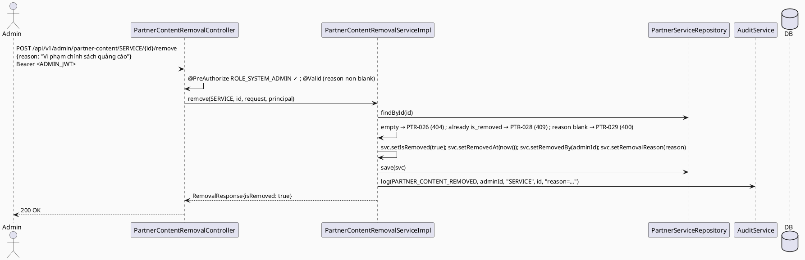

# ENGINEERING DOCUMENTATION STANDARD (EDS) v2.0
# Technical Design Specification — UC-125: Remove Partner Content

| Field              | Value                                   |
| ------------------ | ---------------------------------------- |
| **Document ID**    | `CB-PTR-IMP-008`                        |
| **Version**        | `1.0`                                   |
| **Status**         | `Draft`                                 |
| **Date**           | `2026-07-01`                            |
| **Document Owner** | `HuyND`                                 |
| **Author**         | `AI Agent — Winston (System Architect)` |
| **Reviewed by**    | `[ ] Pending`                           |
| **DPO Sign-off**   | `[ ] Pending` *(N/A — visibility flag, no PII)* |
| **Approved by**    | `[ ] Pending`                           |
| **Last Review**    | `2026-07-01`                            |
| **Based on EDS**   | `v2.0`                                  |

---

## CHANGELOG

| Ngày       | Người thực hiện    | Nội dung thay đổi                                                              |
| ---------- | ------------------- | ------------------------------------------------------------------------------- |
| 2026-07-01 | AI Agent — Winston  | Tạo tài liệu lần đầu — TDS cho UC-125 Remove Partner Content (Status=Draft)     |

---

## MỤC LỤC

1. [Tổng quan Module](#1-tổng-quan-module)
2. [Ma trận Truy vết](#2-ma-trận-truy-vết)
3. [Architecture Decision Records (ADR)](#3-architecture-decision-records-adr)
4. [Non-Functional Requirements & SLA](#4-non-functional-requirements--sla)
5. [Static Modeling](#5-static-modeling)
6. [Dynamic Modeling](#6-dynamic-modeling)
7. [Domain Event Catalog](#7-domain-event-catalog)
8. [Interface Specification](#8-interface-specification)
9. [API Specification](#9-api-specification)
10. [Bảng mã lỗi](#10-bảng-mã-lỗi)
11. [Quy trình Triển khai](#11-quy-trình-triển-khai)
12. [Rollback & Incident Runbook](#12-rollback--incident-runbook)
13. [Kịch bản Kiểm thử Chi tiết](#13-kịch-bản-kiểm-thử-chi-tiết)
14. [Phương pháp Xác minh](#14-phương-pháp-xác-minh)
15. [API Verification Samples](#15-api-verification-samples)
16. [Authorization Matrix](#16-authorization-matrix)
17. [AI Prompt Constraints (CASE 2.0)](#17-ai-prompt-constraints-case-20)

---

## 1. Tổng quan Module

| Field                     | Value                                                                                                                                  |
| ------------------------- | --------------------------------------------------------------------------------------------------------------------------------------- |
| **UC ID**                 | `UC-125`                                                                                                                                |
| **FS Reference**          | `3.2.3.8 Remove Partner Content`                                                                                                        |
| **Module Name**           | `Remove Partner Content`                                                                                                               |
| **Bounded Context**       | `partner` — admin write path over `partner_services` (UC-120) and `sponsored_campaigns` (UC-121)                                       |
| **Primary Actor**         | `System Admin (ROLE_SYSTEM_ADMIN)` — FS "Admin"; resolved to SYSTEM_ADMIN (ADR-004, Accepted)                                                         |
| **Platform**              | `Admin Web Portal`                                                                                                                      |
| **Priority**              | `High` (per FS — moderation/removal of partner content)                                                                                |
| **Frequency of Use**      | `Occasional`                                                                                                                             |
| **Data Classification**   | `Internal`                                                                                                                              |
| **Compliance Scope**      | `N/A`                                                                                                                                   |
| **Upstream Dependencies** | `partner (PartnerService [UC-120], SponsoredCampaign [UC-121], their repos)`, `security`, `audit`                                      |
| **Downstream Consumers**  | Public catalog (removed items no longer visible), `UC-122 Performance` (removed items excluded/flagged)                                |

**Mô tả:**
UC-125 cho phép **Admin** **gỡ** (soft-remove) một service listing hoặc sponsored campaign khỏi hiển thị công khai (ví dụ vi phạm chính sách). Đây là **soft-remove**: đánh dấu bản ghi là đã gỡ, KHÔNG hard-delete (giữ audit/history). **Schema tension (ADR-001):** `approval_status` (PENDING/APPROVED/REJECTED) KHÔNG có giá trị "removed/hidden/deleted". Có hai lựa chọn (dossier): (a) tái dùng `approval_status` với giá trị mới `REMOVED` (không migration nhưng phá vỡ ngữ nghĩa "approval"), hoặc (b) **thêm cột `is_removed`/`removed_at`** (cần migration). **Chọn (b)** — rõ ràng ngữ nghĩa, tách "trạng thái duyệt" khỏi "trạng thái hiển thị". Đây là **schema delta DUY NHẤT** của Cluster B — một migration mới thêm cột vào cả `partner_services` và `sponsored_campaigns`.

**Phạm vi:** soft-remove (đặt `is_removed=true`, `removed_at`, `removed_by`, `removal_reason`); un-remove (khôi phục) là `Open` (v1 chỉ remove; nếu cần restore, ADR follow-up). KHÔNG hard-delete.

---

## 2. Ma trận Truy vết

| Requirement ID | Loại          | Mô tả yêu cầu                                                     | Thành phần Code                               | Compliance Target | ADR liên quan |
| --------------- | -------------- | ------------------------------------------------------------------- | ----------------------------------------------- | ------------------- | --------------- |
| UC-125          | Use Case      | Admin removes a partner service or campaign                         | `PartnerContentRemovalController.remove()`      | —                  | ADR-001         |
| FS-3.2.3.8      | Functional    | "Remove partner content that violates rules"                       | `PartnerContentRemovalServiceImpl.remove()`     | —                  | ADR-001         |
| BR-RBAC         | Business Rule | Chỉ Admin                                                           | `@PreAuthorize`                                 | —                  | ADR-004         |
| BR-PTR-026      | Business Rule | Soft-remove: set is_removed=true + removed_at/removed_by/removal_reason | `PartnerContentRemovalServiceImpl`         | —                  | ADR-001, ADR-002 |
| BR-PTR-027      | Business Rule | KHÔNG hard-delete (giữ history)                                     | soft-flag only                                 | —                  | ADR-002         |
| BR-PTR-028      | Business Rule | Remove bắt buộc reason (moderation accountability)                  | request validation                             | —                  | ADR-003         |
| BR-PTR-029      | Business Rule | Không remove lại item đã removed (idempotent-guard) → PTR-028       | guard                                          | —                  | ADR-002         |
| BR-AUDIT-001    | Business Rule | Remove được audit log                                              | `AuditService.log(...)`                        | —                  | ADR-004         |

---

## 3. Architecture Decision Records (ADR)

### ADR-001 — Soft-Remove via New Columns (Migration) — NOT reuse `approval_status`
| Field | Value |
| ---- | ----- |
| **Status** | `Proposed — needs Tech Lead/DBA confirmation (schema delta)` |
| **Deciders** | `HuyND — System Architect` |
| **Date** | `2026-07-01` |

**Bối cảnh:** `approval_status` (PENDING/APPROVED/REJECTED) không có giá trị "removed". Hai phương án (dossier §5.2 UC-125):
- (a) Thêm giá trị enum `REMOVED` vào `approval_status` — không migration, nhưng trộn ngữ nghĩa "duyệt" với "gỡ" (một item có thể vừa APPROVED vừa cần gỡ — mất thông tin trạng thái duyệt gốc).
- (b) Thêm cột `is_removed boolean`, `removed_at`, `removed_by`, `removal_reason` — cần migration, nhưng tách bạch "trạng thái duyệt" và "trạng thái hiển thị".

**Quyết định:** Chọn **(b)**. Migration mới:
```sql
-- File: V20260701130000__add_partner_content_removal.sql
ALTER TABLE public.partner_services
    ADD COLUMN IF NOT EXISTS is_removed boolean NOT NULL DEFAULT false,
    ADD COLUMN IF NOT EXISTS removed_at timestamptz NULL,
    ADD COLUMN IF NOT EXISTS removed_by uuid NULL,
    ADD COLUMN IF NOT EXISTS removal_reason text NULL;
ALTER TABLE public.sponsored_campaigns
    ADD COLUMN IF NOT EXISTS is_removed boolean NOT NULL DEFAULT false,
    ADD COLUMN IF NOT EXISTS removed_at timestamptz NULL,
    ADD COLUMN IF NOT EXISTS removed_by uuid NULL,
    ADD COLUMN IF NOT EXISTS removal_reason text NULL;
```
> Timestamp `20260701130000` phải lớn hơn migration mới nhất (`V20260629000002__create_community_answer_likes.sql`) tại thời điểm implement — nếu có migration mới hơn merge trước, đổi timestamp lớn hơn. Additive-only (`ADD COLUMN IF NOT EXISTS`), không sửa migration đã apply. `V1__init_schema.sql` **không** bị sửa (CG-9).

**Hệ quả:** Ngữ nghĩa rõ; public catalog query filter `is_removed=false`; `approval_status` giữ nguyên lịch sử duyệt. Cần cập nhật public read queries (UC-120/122/catalog) để loại `is_removed=true` — flag như một downstream change (§11). Đây là schema delta DUY NHẤT của Cluster B.

### ADR-002 — Soft-Remove Only (No Hard Delete) + Idempotent Guard
| Field | Value |
| ---- | ----- |
| **Status** | `Accepted` |

**Quyết định:** Set `is_removed=true`, `removed_at=now()`, `removed_by=adminId`, `removal_reason`. KHÔNG `DELETE`. Item đã `is_removed=true` → remove lại trả `PTR-028` (409, already removed). Restore (`is_removed=false`) = `Open` (v1 không có; follow-up ADR nếu cần).

### ADR-003 — Removal Reason Bắt Buộc
| Field | Value |
| ---- | ----- |
| **Status** | `Accepted (moderation accountability)` |

**Quyết định:** `removal_reason` bắt buộc non-blank (`PTR-029`, 400) — mọi hành động gỡ nội dung phải giải thích được (giống moderation UC-100 HIDE/LOCK reason mandatory).

### ADR-004 — RBAC (SYSTEM_ADMIN) + Audit; Role Resolved
| Field | Value |
| ---- | ----- |
| **Status** | `Accepted — resolved by consistency with sibling admin-decision UCs in this batch (same as UC-124 ADR-004)` |

`@PreAuthorize("hasRole('SYSTEM_ADMIN')")` (FS "Admin"). Resolved via project analysis, same reasoning as
UC-124 ADR-004: no dedicated partner-admin role exists in the 7-role set, and every other admin-decision UC
in this batch uses `SYSTEM_ADMIN`. Audit `PARTNER_CONTENT_REMOVED`.

---

## 4. Non-Functional Requirements & SLA

| Category | Requirement | Target | Measurement | Basis |
| --- | --- | --- | --- | --- |
| Latency | p99 `POST /admin/partner-content/{type}/{id}/remove` | `Open` — `< 300ms` | k6 | — |
| Atomicity | is_removed flags + audit in 1 transaction | All-or-nothing | integration | ADR-004 |
| Reversibility | Soft-remove (no data loss) | 100% | code review | ADR-002 |
| Access control | Admin only | Least privilege | §16 | ADR-004 |

---

## 5. Static Modeling

### 5.1. Class Diagram (PlantUML)

```plantuml
@startuml UC125_RemovePartnerContent_ClassDiagram
skinparam classAttributeIconSize 0
skinparam backgroundColor #FAFAFA

enum PartnerContentTargetType { SERVICE CAMPAIGN }

class PartnerService <<Entity, +removal fields>> {
  + serviceId: UUID + approvalStatus + ...
  + isRemoved: boolean <<NEW — ADR-001>>
  + removedAt: Instant <<NEW>>
  + removedBy: UUID <<NEW>>
  + removalReason: String <<NEW>>
}
class SponsoredCampaign <<Entity, +removal fields>> {
  + campaignId: UUID + approvalStatus + ...
  + isRemoved: boolean <<NEW>> + removedAt <<NEW>> + removedBy <<NEW>> + removalReason <<NEW>>
}

class PartnerContentRemovalController <<RestController>> {
  + remove(targetType, targetId, request, principal): ResponseEntity<RemovalResponse>
}
interface PartnerContentRemovalService { + remove(targetType, targetId, request, principal): RemovalResponse }
class RemovalRequest <<DTO>> { + reason: String <<required — ADR-003>> }
class RemovalResponse <<DTO>> {
  + targetType + targetId + isRemoved: boolean + removedByAdminId: UUID + reason + removedAt: Instant
}

PartnerContentRemovalController --> PartnerContentRemovalService
@enduml
```

### 5.2. Data Structure — SCHEMA DELTA REQUIRED (ADR-001)

> **New Flyway migration** — `V20260701130000__add_partner_content_removal.sql` (see ADR-001). Adds
> `is_removed`, `removed_at`, `removed_by`, `removal_reason` to BOTH `partner_services` and
> `sponsored_campaigns`. This is the **only schema delta in Cluster B**. `V1__init_schema.sql` is NOT
> modified (CG-9). Entities `PartnerService`/`SponsoredCampaign` (from UC-120/121) gain the 4 new fields.

```java
// PartnerService.java / SponsoredCampaign.java — add 4 fields each
@Column(name = "is_removed", nullable = false) private boolean isRemoved = false;
@Column(name = "removed_at")   private Instant removedAt;
@Column(name = "removed_by")   private UUID removedBy;
@Column(name = "removal_reason") private String removalReason;
```

---

## 6. Dynamic Modeling

### 6.1. Sequence — Happy Path (remove a SERVICE)



### 6.2. Error Paths
- target not found → `PTR-026` (404); unsupported targetType → `PTR-027` (400); already removed → `PTR-028` (409); reason blank → `PTR-029` (400); wrong role → 403.

---

## 7. Domain Event Catalog

| Event | Trigger | Publisher | Subscriber | Payload | Async? |
| --- | --- | --- | --- | --- | --- |
| (none v1) | — | — | — | — | — |

> **Open:** future `PartnerContentRemoved` event → notify partner. v1 sync + audit-only.

---

## 8. Interface Specification

### 8.1. Service Interface

```java
// com.carebridge.backend.partner.service.PartnerContentRemovalService
public interface PartnerContentRemovalService {
    /**
     * Soft-removes a partner service listing or sponsored campaign (sets is_removed=true + metadata).
     * Never hard-deletes (ADR-002). removal_reason required (ADR-003).
     * @throws PartnerException (PTR-026) if target not found
     * @throws PartnerException (PTR-027) if targetType unsupported
     * @throws PartnerException (PTR-028) if target is already removed
     * @throws PartnerException (PTR-029) if reason is blank
     */
    RemovalResponse remove(PartnerContentTargetType targetType, UUID targetId,
                           RemovalRequest request, Principal principal);
}
```

### 8.2. Repository

```java
// PartnerServiceRepository.findById/save (UC-120), SponsoredCampaignRepository.findById/save (UC-121)
// Existing catalog/read queries (UC-120 list, UC-122 counts, public catalog) MUST add `is_removed = false`
// filter — documented as a downstream change (§11), not silently assumed.
```

### 8.3. DTOs

```java
public record RemovalRequest(@NotBlank String reason) {}   // reason required (ADR-003)

public record RemovalResponse(
        PartnerContentTargetType targetType, UUID targetId,
        boolean isRemoved, UUID removedByAdminId, String reason, Instant removedAt
) {}
```

---

## 9. API Specification

### 9.1. Endpoints Table

| Method | Path                                                          | Auth Level | Required Roles     | Rate Limit | Idempotent? |
| ------ | --------------------------------------------------------------- | ------------ | --------------------- | ------------ | -------------- |
| `POST` | `/api/v1/admin/partner-content/{targetType}/{targetId}/remove`  | JWT Bearer   | `ROLE_SYSTEM_ADMIN`   | `Open`       | Effectively (2nd remove on already-removed → PTR-028) |

### 9.2. Request / Response

**Request:** `{ "reason": "Vi phạm chính sách quảng cáo" }`

**Response — 200 OK:**
```json
{ "targetType": "SERVICE", "targetId": "…", "isRemoved": true, "removedByAdminId": "…",
  "reason": "Vi phạm chính sách quảng cáo", "removedAt": "2026-07-01T10:15:00Z" }
```

**404 PTR-026 / 400 PTR-027 / 409 PTR-028 / 400 PTR-029 / 403 / 401** — theo §10.

---

## 10. Bảng mã lỗi

| Code       | HTTP Status | Message (EN)                                     | Trigger Condition                                | Status in code |
| ----------- | ------------- | --------------------------------------------------- | --------------------------------------------------- | ----------------- |
| `PTR-026`  | 404           | Partner content target not found                     | `findById(targetId)` empty                         | **New — to implement** |
| `PTR-027`  | 400           | Unsupported target type                              | `targetType ∉ {SERVICE, CAMPAIGN}`                  | **New — to implement** |
| `PTR-028`  | 409           | Content is already removed                            | `is_removed == true`                               | **New — to implement** |
| `PTR-029`  | 400           | Removal reason is required                            | reason blank (ADR-003)                             | **New — to implement** |
| `PTR-004`  | 403           | Insufficient permissions                             | Non-admin (confirmed ACCESS_DENIED — dead code, same pattern as MOD-004)                | Not reachable in practice |
| `PTR-006`  | 401           | Authentication required                              | Missing/invalid JWT (verify)                       | Reused (verify) |

> **Numbering:** UC-118..124 used `PTR-001..025`. UC-125 claims **`PTR-026..029`**. CG verify. This is the
> last Partner UC in the batch — highest `PTR` code claimed is `PTR-029`.

---

## 11. Quy trình Triển khai

### 11.1. Prerequisites
- [ ] UC-120/121 deployed (entities/repos)
- [ ] **ADR-001 (schema delta) approved by Tech Lead/DBA**
- [ ] ADR-004 (admin role) confirmed
- [ ] Migration `V20260701130000__add_partner_content_removal.sql` applied on target env

### 11.2. Pre-Migration Checklist
- [ ] **Cần 1 migration mới** — `V20260701130000__add_partner_content_removal.sql` (ADR-001). **Schema delta DUY NHẤT của Cluster B.**
- [ ] CG-9: cột removal được ghi ở §5.2; `V1__init_schema.sql` KHÔNG bị sửa.
- [ ] Xác nhận timestamp `20260701130000` > migration mới nhất tại thời điểm implement.
- [ ] **Downstream:** cập nhật public catalog + UC-120 list + UC-122 counts để filter `is_removed=false` (không để nội dung đã gỡ vẫn hiển thị/đếm).

### 11.3. Implementation Steps
```
1. Migration V20260701130000__add_partner_content_removal.sql (§5.2)
2. Add 4 removal fields to PartnerService + SponsoredCampaign entities
3. PartnerContentRemovalService.remove() interface + Impl (dispatch, guards, set flags, save, audit) @Transactional
4. RemovalRequest/Response DTOs; PartnerException PTR-026/027/028/029
5. PartnerContentRemovalController POST .../remove @PreAuthorize("hasRole('SYSTEM_ADMIN')") + @Valid
6. Update public/catalog read queries to filter is_removed=false (downstream)
7. SecurityConfig rule + audit enum
```

### 11.4. Deployment Checklist
- [ ] Migration applied (`\d partner_services` shows is_removed etc.)
- [ ] Remove sets is_removed=true + removed_at/by/reason; NOT hard-delete (row still exists)
- [ ] Already-removed → PTR-028
- [ ] Removed content no longer in public catalog (downstream filter works)
- [ ] Non-admin → 403

---

## 12. Rollback & Incident Runbook

| Điều kiện | Ngưỡng | Người quyết định |
| ------------ | --------- | ------------------- |
| Hard-delete xảy ra (mất data) thay vì soft-remove | Bất kỳ case nào | Tech Lead (CRITICAL — data loss) |
| Nội dung đã gỡ vẫn hiển thị public (downstream filter thiếu) | Bất kỳ case nào | Tech Lead (CRITICAL — moderation bypass) |
| Remove không audit | > 1 phút | On-call |

```bash
kubectl rollout undo deployment/carebridge-api
# Migration forward-only: nếu cần gỡ cột, viết migration MỚI DROP COLUMN; KHÔNG sửa migration đã apply.
# Mitigation: UPDATE ... SET is_removed=false WHERE ... (chỉ khi remove nhầm, có Tech Lead sign-off).
```

---

## 13. Kịch bản Kiểm thử Chi tiết

> Chi tiết trong `UC125_RemovePartnerContent_Test-Spec.md` (`CB-PTR-TEST-008`).

### 13.1. Unit / Service
- Remove SERVICE/CAMPAIGN → is_removed=true + metadata; row still exists (soft, no hard-delete)
- Already-removed → PTR-028; reason blank → PTR-029
- Unsupported targetType → PTR-027; not found → PTR-026
- Audit called once

### 13.2. Integration
- Full POST both types (Testcontainers, migration applied): DB is_removed=true, row present; atomicity
- Removed item excluded from a catalog/list query (downstream filter)

### 13.3. Security
- Non-admin → 403; PARTNER → 403; No JWT → 401

---

## 14. Phương pháp Xác minh

```sql
SELECT service_id, approval_status, is_removed, removed_by, removal_reason FROM partner_services WHERE service_id='<id>';
-- is_removed=true, removed_by set, row STILL EXISTS (not deleted)
SELECT count(*) FROM partner_services WHERE service_id='<id>';  -- 1 (soft-remove, not hard-delete)
```

---

## 15. API Verification Samples

```bash
curl -X POST "https://api.carebridge.vn/api/v1/admin/partner-content/SERVICE/<id>/remove" \
  -H "Authorization: Bearer $ADMIN_TOKEN" -H "Content-Type: application/json" -d '{"reason":"Vi phạm chính sách"}'
# Expected: 200, isRemoved=true
```

---

## 16. Authorization Matrix

| Endpoint                                                     | `MOTHER` | `FAMILY` | `EXPERT` | `MODERATOR` | `CONTENT_ADMIN` | `PARTNER` | `SYSTEM_ADMIN` |
| --------------------------------------------------------------- | ---------- | ---------- | ---------- | -------------- | ------------------ | --------------- | ----------------- |
| `POST /admin/partner-content/{type}/{id}/remove`               | ❌        | ❌        | ❌        | ❌ *(note)*     | ❌                  | ❌              | ✅                |

**Chú thích:** ✅ SYSTEM_ADMIN (role resolved, ADR-004 Accepted). MODERATOR = ❌ (partner content removal ≠ community
moderation; nếu FS chỉ định MODERATOR gỡ partner content, đổi — flag Open). PARTNER không gỡ nội dung
(kể cả của mình — remove là hành động moderation, không phải self-service). No `RoleHierarchy`.

---

## 17. AI Prompt Constraints (CASE 2.0)

### 17.1 Constraint Summary Table

| #   | Constraint                                                                    | Source            | Last Verified |
| --- | ----------------------------------------------------------------------------- | ------------------- | --------------- |
| C1  | Controller `@PreAuthorize("hasRole('SYSTEM_ADMIN')")` — chỉ @Valid + delegate  | `ADR-004`           | `2026-07-01`     |
| C2  | Soft-remove: set is_removed + metadata; TUYỆT ĐỐI KHÔNG hard-delete            | `ADR-002`           | `2026-07-01`     |
| C3  | removal_reason bắt buộc → PTR-029                                              | `ADR-003`           | `2026-07-01`     |
| C4  | Already-removed → PTR-028 (idempotent guard)                                   | `ADR-002`           | `2026-07-01`     |
| C5  | Migration mới thêm cột removal vào cả 2 bảng (V20260701130000...); V1 KHÔNG sửa | `ADR-001`           | `2026-07-01`     |
| C6  | Public catalog/read queries PHẢI filter is_removed=false (downstream)          | `ADR-001`           | `2026-07-01`     |

### 17.2 Constraint Injection Block

```
[CONSTRAINT BLOCK — Module: Remove Partner Content (UC-125)]
Theo TDS CB-PTR-IMP-008:
1. [C1] Controller remove() PHẢI @PreAuthorize("hasRole('SYSTEM_ADMIN')").
2. [C2] Soft-remove: set is_removed=true + removed_at/by + removal_reason. TUYỆT ĐỐI KHÔNG DELETE row.
3. [C3] removal_reason bắt buộc non-blank → PTR-029.
4. [C4] item đã is_removed=true → PTR-028.
5. [C5] Migration V20260701130000__add_partner_content_removal.sql thêm cột vào partner_services VÀ
   sponsored_campaigns; V1__init_schema.sql KHÔNG sửa.
6. [C6] Cập nhật public/catalog/count queries để loại is_removed=true (nếu không, nội dung gỡ vẫn hiển thị).

[CONTEXT BLOCK]
- Bounded Context: partner (admin write); Data: Internal; Compliance: N/A
- Interfaces: §8; Error codes: §10 (PTR-026/027/028/029); Auth: §16
- Schema delta: YES — V20260701130000 (4 cột × 2 bảng) — schema delta DUY NHẤT Cluster B
- OPEN: admin role (ADR-004), 403 code, restore/un-remove (v1 không có)

[TASK BLOCK]
Implement PartnerContentRemovalController.remove(), PartnerContentRemovalServiceImpl, migration + 4 entity
fields × 2 entities, DTOs, PTR-026/027/028/029, downstream is_removed filter — thỏa mãn C1-C6.
Tests cover §13 (Test-Spec CB-PTR-TEST-008).
```

### 17.3 Constraint Quality Checklist
- [x] Traceable; [x] không generic; [x] Last Verified; [x] reference §8/§16

### 17.4 Anti-Pattern Detection

| AP-ID     | Anti-Pattern          | Dấu hiệu                                                        | Hành động                |
| --------- | ---------------------- | ------------------------------------------------------------------- | --------------------------- |
| AP-AI-001 | Unconstrained Gen     | Bỏ RBAC/reason guard                                                | Reject — C1/C3 |
| AP-AI-002 | Hard Delete           | Code `DELETE`/`repository.delete()` thay vì soft-flag              | Reject — ADR-002, BLOCKING (data loss) |
| AP-AI-003 | Moderation Bypass     | Không filter is_removed ở public query → nội dung gỡ vẫn hiển thị  | Reject — ADR-001 C6, BLOCKING |
| AP-AI-004 | Layer Violation       | Controller gọi repository trực tiếp                               | Reject |
| AP-AI-005 | Hallucinated Contract | Import class không có trong §8                                     | Reject |

**Kết quả review:**
- [x] Không phát hiện anti-pattern nào trong bản thân spec này → approved-for-RED-phase

---

## PHỤ LỤC

### B. Tài liệu tham chiếu
| Document | Path |
| ------------ | ------- |
| UC-120 TDS (PartnerService) | `04_Implement/UC120_SubmitServiceListing/UC120_SubmitServiceListing_TDS.md` |
| UC-121 TDS (SponsoredCampaign) | `04_Implement/UC121_SubmitSponsoredContent/UC121_SubmitSponsoredContent_TDS.md` |
| UC-124 TDS (sibling admin partner-content decision) | `04_Implement/UC124_ApproveSponsoredServiceCampaign/UC124_ApproveSponsoredServiceCampaign_TDS.md` |
| Schema `partner_services` (1038), `sponsored_campaigns` (1051) | `05_Development/CareBridgeAPI/src/main/resources/db/migration/V1__init_schema.sql` |
| Migration naming convention (timestamp-based) | dossier §6.3 |

---

*EDS v2.1 — Admin soft-remove over UC-120/121; **SCHEMA DELTA (only one in Cluster B)** —
`V20260701130000__add_partner_content_removal.sql`. Status: Draft. Soft-remove-not-hard-delete (ADR-002) and
downstream is_removed filter (ADR-001 C6) are the CRITICAL gates. Admin role (ADR-004) resolved = SYSTEM_ADMIN;
403 code confirmed ACCESS_DENIED. OPEN: restore/un-remove (v1 does not have it). **ADR-001 schema delta still
needs Tech Lead/DBA sign-off** before implementation — this is a genuine schema-change approval, not resolved
by project analysis.*
